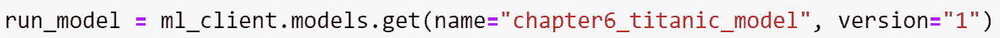

# 为实时推理部署 ML 模型

在本章中，我们将探讨数据科学家和 ML 专业人士如何通过在 Azure 中托管的 REST 服务提供预测，以支持实时预测。数据被发送到 REST API，预测结果在响应中提供。这允许各种应用程序消费和使用由 AMLS 创建的模型。我们将探索使用 AML 在实时使模型可用的各种选项。

到目前为止，我们已经利用 AMLS 处理特征工程并构建和注册了模型。在本章中，我们将专注于提供利用您的模型在实时数据集上提供预测的解决方案。

Azure Machine Learning 为业务用户提供多种推理选项，以支持批量实时推理用例。

在本章中，我们将涵盖以下主题：

+   理解实时推理和批量评分

+   通过 AML Studio 部署具有托管在线端点的 MLflow 模型

+   通过 Python SDK v2 部署具有托管在线端点的 MLflow 模型

+   通过 Python SDK v2 部署具有托管在线端点的模型

+   通过 Azure CLI v2 部署具有托管在线端点的模型

# 技术要求

为了访问您的 workspace，请重复上一章中的步骤：

1.  前往 [`ml.azure.com`](https://ml.azure.com)。

1.  选择你的工作区名称。

1.  在左侧的工作区用户界面中，点击 **计算**。

1.  在 **计算** 屏幕上，选择您的计算实例并选择 **启动**。


图 6.1 – 启动计算

1.  您的计算实例将从 **停止** 状态变为 **启动** 状态。

1.  在上一章中，我们已克隆了 Git 仓库；如果您尚未这样做，请继续按照以下步骤操作。如果您已经克隆了仓库，请跳转到 *步骤 9*。

1.  在您的计算实例上打开终端。注意路径将包括您的用户目录。在终端中输入以下内容以将示例笔记本克隆到您的当前工作目录：

    ```py
    git clone https://github.com/PacktPublishing/Azure-Machine-Learning-Engineering.git
    ```

1.  点击 *图 6**.2* 中显示的刷新图标将更新并刷新屏幕上显示的笔记本。


图 6.2 – 刷新图标

1.  查看您的 `Azure-Machine-Learning-Engineering` 目录中的笔记本。这将显示克隆到您的当前工作目录中的文件，如图 *图 6**.3* 所示：


图 6.3 – Azure-Machine-Learning-Engineering

# 理解实时推理和批量评分

模型可以部署以支持不同的用例和不同的业务需求。在生产环境中部署模型时，您选择如何部署模型应基于您的用户需求。如果您需要实时预测以支持流式传输或与其他应用程序中的预测进行交互，则需要实时推理。实时推理需要计算资源保持活跃并可用，以便您的模型提供响应。如果您的应用程序需要响应较慢的预测，这些预测存储在文件或数据库中，那么批量推理将是正确的选择。批量推理允许您启动和关闭计算资源。

在模型部署之前，需要选择用于托管实时 Web 服务的计算资源。对于实时推理，**Azure Kubernetes 服务**（**AKS**）、**Azure 容器实例**（**ACI**）和**Azure Arc 启用**的**Kubernetes**是通过您的 AML 工作区支持的计算资源。AKS 通常用于支持生产工作负载，而 ACI 通常用于支持基于 CPU 的工作负载的较低环境。Azure Arc 启用的 Kubernetes 通常用于在 Azure Arc 中管理的集群上运行推理。在本章中，我们还将探讨利用**托管在线端点**的选项，这将提供对模型部署所需的计算资源的一定程度的抽象。

注意，实际上有几种不同的计算类型可以用于在线端点。一种类型是前面提到的托管在线端点，另一种是**Kubernetes 在线端点**。托管在线端点提供完全托管的计算资源提供、扩展以及主机操作系统镜像更新。Kubernetes 在线端点是为那些希望通过自己的 Azure Kubernetes 集群来管理这些项目的团队设计的。托管在线端点自动化了计算资源的提供，自动更新主机操作系统镜像，并在系统故障的情况下提供自动恢复。由于这些优势，我们将集中精力在托管在线端点上。

托管在线端点不仅提供了一种围绕部署 REST 端点所需的计算资源的抽象级别；它们还支持将多个部署到单个端点，通常称为**蓝/绿部署**。蓝/绿部署是将流量从一个版本移动到另一个版本的做法。因此，当我们部署托管在线端点时，我们可以有一个初始模型被部署，然后在该端点部署一个新的模型。当新模型在托管在线端点上可用后，我们可以将用户转移到使用新模型的新的部署。这意味着对于每个托管在线端点，我们不仅将部署托管在线端点，还将部署端点部署。

注意

托管在线端点需要在 Azure 区域内具有一个唯一名称。如果不提供唯一名称，将导致部署失败。

在本章中，我们将探讨使用托管在线端点和部署来使你的模型可用于支持实时用例的选项。在下一节中，我们将探讨使用 AMLS Studio 部署你的模型以获得低代码体验。

# 通过 AML Studio 部署带有托管在线端点的 MLflow 模型

为了将模型部署到网络服务中，我们需要定义环境，这包括 Conda 和 `pip` 依赖项、我们的计算资源以及评分脚本。**评分脚本**，也称为**入口脚本**，将在初始化函数中加载模型，并处理对网络服务的传入数据进行预测。

使用 MLflow 模型时，不仅模型被打包，AML 还理解如何消费模型，因此无需为具有托管在线端点的模型部署配置环境或入口脚本；AML 本地理解这些模型。这使得从 UI 和代码中部署模型变得非常容易。

在前面的章节中，我们利用 MLflow 创建并注册了模型。继续到 `第六章`，`Prep-Model Creation & Registration.ipynb` 笔记本以创建和注册模型，就像我们在前面的章节中所做的那样，利用 MLflow。

这个笔记本将带你通过创建模型并将其注册到工作区的过程，正如我们在前面的章节中所讨论的那样。然而，在创建模型之前，有一些要点需要回顾。

当利用 MLflow 时，我们可以使用 `autolog` 为我们生成模型和环境信息，但在笔记本中，我们实际上设置了 `log_models=False`，如图所示：


图 6.4 – 禁用模型的日志记录

我们将模型日志记录设置为 `false`，但在训练脚本中，我们明确打包模型并记录它，如图所示：


图 6.5 – MLflow 模型日志记录

这为我们提供了对部署所使用的包的控制。当 MLflow 发布新版本时，最新版本的 MLflow 和 Azure Machine Learning 托管在线端点之间可能存在问题。理想情况下，这种情况不会发生；然而，随着开源的持续发展，在打包模型时包含版本是一个好习惯，以确保你对模型部署有完全的控制。

在运行你的 `第六章` `模型创建准备与注册.ipynb` 笔记本之后，模型将在工作区中注册。一旦我们在工作区中注册了 MLflow 模型，我们就可以利用 AMLS Studio 来部署模型。为此过程，请按照以下步骤操作：

1.  从**模型列表**中选择模型：


图 6.6 – 从模型列表中选择模型

1.  在点击 MLflow 模型后，选择**部署**选项，然后选择第一个选项，**部署到实时端点**，如图所示。


图 6.7 – 部署 MLflow 模型

1.  由于模型已被选择且是用 MLflow 创建的，AMLS Studio 理解这是 MLflow 模型。在点击**部署到实时端点**选项后，您将指导创建模型的部署。


图 6.8 – 配置端点

要为您的模型创建部署，请按照*图 6.8*中的选项操作：

+   对于`azure-ui-endpoint`，在名称前或后添加前缀或后缀，使其在您的区域中唯一。

+   对于`UI` `创建的端点`

+   将**计算类型**选择为**托管**

+   选择**基于密钥的认证**

1.  点击**下一步**并查看所选模型，如图所示：


图 6.9 – 模型选择

由于您是通过选择模型开始部署的，因此不需要进行其他选择。如*图 6.9*所示，您已配置了端点以及模型选择，所以下一步是进行部署配置。

1.  通过点击**模型**屏幕上的**下一步**图标，您将进入配置部署的屏幕：


图 6.10 – 配置部署

作为部署配置的一部分，提供了一个部署名称。对于特定的端点，如*理解实时推理和批量评分*部分所述，可以创建多个部署。这允许您配置流量模式以测试已部署的模型。

除了部署名称外，您还可以配置评分超时。这是强制评分调用的超时时间。您还可以为部署启用应用程序洞察诊断和数据收集。这将使您能够使用**监控**选项卡查看托管在线端点的活动。

1.  一旦配置了部署，您将再次点击**下一步**按钮，进入环境选择选项卡。鉴于此模型是用 MLflow 创建的，因此不需要进行环境选择。

模型的环境已经创建，如图所示：


图 6.11 – 环境选择

1.  现在环境已经建立，应选择模型的计算资源。如图所示，在`1`：


图 6.12 – 计算选择

1.  现在已经选择了计算资源，应配置此部署的流量分配。如果您已更新了模型，最初应将流量设置为`0`进行部署，确认其正确无误后，然后，如图所示，将新模型的流量更新为`100%`，因为这是我们第一次模型部署。这应该为旧模型到新模型的 REST API 消费者提供无缝体验。


图 6.13 – 配置部署流量

1.  配置流量后，我们可以查看即将发生的部署。通过点击**下一步**，AMLS Studio 将带您进入引导式模型部署的**审查**阶段。


图 6.14 – 检查模型部署

1.  屏幕上显示的信息将反映您在引导式在线托管部署过程中提供的输入。在确认了前一个屏幕中显示的设置后，点击**创建**按钮以创建端点以及部署。

下图显示了部署进度。托管在线端点正在配置中，因为**配置状态**的**状态**为**创建中**，蓝色部署也在配置中。目前，**蓝色**部署的流量设置为**0**。


图 6.15 – 正在进行的托管在线端点部署

1.  一旦部署完成，端点将显示**配置状态**的**状态**为**成功**，**流量分配**将是部署的**100%**，如图所示。


图 6.16 – AMLS Studio 部署完成

恭喜！您已成功部署了托管在线端点以供消费。回想一下，模型有列 – `Embarked`、`Loc`、`Sex`、`Pclass`、`Age`、`Fare`和`GroupSize` – 作为输入参数。我们可以向 REST 端点发送 JSON，指定输入数据列和我们希望接收预测的数据，以利用 AMLS 使用的 JSON 模式。


图 6.17 – 测试托管在线端点

此请求文件的样本位于 Git 仓库中`chapter 6`文件夹下的`prepped_data`文件夹中。您可以将此文本复制并粘贴到*图 6.17*所示的工作室测试屏幕中。

现在已经从 AMLS Studio 体验中测试了托管在线端点，我们将接下来通过 Python SDK 部署托管在线端点。

# 通过 Python SDK V2 部署带有托管在线端点的 MLflow 模型

在上一节中，我们利用 AMLS Studio 部署了我们的 MLflow 模型。在本节中，我们将探索通过 SDK v2 将 MLflow 模型部署到托管在线端点的代码。

为了利用 SDK v2 进行模型部署，我们将使用`第六章` `MLFlow 模型部署 SDK V2.ipynb`笔记本。

要通过 SDK V2 部署托管在线端点，请按照以下步骤操作：

1.  要部署模型，我们将创建具有适当配置的`ManagedOnlineEndpoint`。对于 MLflow 模型，我们需要指定`name`和`auth_mode`。此外，我们还将提供`description`以及`tags`。


图 6.18 – 配置 ManagedOnlineEndpoint

1.  端点配置完成后，我们可以调用`create`或`update`方法，传入端点以使用`create_or_update`命令在工作区中创建端点，如下所示。


图 6.19 – 利用 ml_client 创建托管在线端点

1.  端点创建完成后，您就可以创建部署了。对于部署，我们将传递一个名称、上一图创建的端点名称、要部署的模型、用于计算资源的 VM 实例类型以及实例数量。

模型可以直接通过其名称和版本从工作区检索，如下所示：



图 6.20 – 根据名称和版本从注册表中获取模型

1.  托管在线部署需要模型。现在模型已经从工作区检索出来，可以传递给`ManagedOnlineDeployment`，如下所示：


图 6.21 – 配置部署

注意`instance_type`，这是我们托管在线端点所使用的计算资源。我们在这里指定了使用`Standard_F4s_v2`，因为我们有很高的灵活性来选择用于服务实时预测请求的计算资源类型。

1.  部署配置完成后，通过`ml_client`，可以将托管在线端点部署到初始流量设置为`0`，如下所示：


图 6.22 – 创建部署

1.  部署成功后，可以使用部署名称将端点的流量设置为 100%。


图 6.23 – 更新部署流量

1.  现在端点已经部署，可以检索端点的 URI 和主键来调用 REST API 以获取预测。对于在线端点，我们可以轻松地检索评分 URI 和主键，如下面的代码所示。


图 6.24 – 检索 URI 和主键

1.  最后，可以调用 REST 端点以检索预测。下面的代码将 dataframe 传递给`make_predictions`函数，准备请求，并从受管理的在线端点返回结果。


图 6.25 – 进行预测

运行前面的代码允许传递 dataframe 并返回预测结果。此模型可以通过在 Git 仓库中`chapter 6`文件夹下的`prepped_data`文件夹中提供的样本输入进行测试。无论受管理的在线端点是通过对 SDK 还是 AMLS Studio 进行部署，功能都是相同的。

您已经能够通过 AMLS Studio 和 SDK 部署模型，因为它被创建为 MLflow 模型。如果未使用 MLflow 创建模型，则可以轻松部署，但需要额外的配置来部署。在下一节中，我们将继续部署模型，指定推理所需的环境和脚本。

# 通过 Python SDK v2 使用受管理的在线端点部署模型

在前一节中，我们部署了 MLflow 模型，但当你创建不使用 MLflow 的模型时，你需要提供两个额外的细节以成功部署受管理的在线端点。在本节中，我们将专注于添加功能，以便我们可以不依赖于 MLflow 提供环境和评分脚本来部署我们的模型。

为了使用 SDK v2 部署受管理的在线端点并利用笔记本：`第六章` `模型部署` `SDK V2.ipynb`，而不依赖于 MLflow 提供环境和评分脚本，我们将在本节中创建这些内容：

1.  我们的第一步是创建我们的`score.py`文件。这是用于加载模型并向端点发送请求的文件。

下面的代码片段提供了入口脚本所需的信息：


图 6.26 – score.py 脚本

在前一个图中所示的评分脚本中，有两个必需的函数，`init`和`run`。`init`函数告诉 AML 如何加载模型。模型将作为部署配置的一部分提供，模型路径被设置，并利用`joblib`来加载模型。`model`全局变量被用来保存模型。当 REST 端点被调用时，`run`函数将被调用。API 调用的数据将被传递到`run`函数。在这里，设置了一个字典来检索信息，该信息被转换成一个 dataframe，然后传递给`model.predict`函数。`model.predict`的结果被传递到一个列表中，并从函数中返回。

除了评分脚本，我们还需要拥有模型。在上一节中，我们根据名称和版本使用 SDK v2 检索了已注册的模型，但我们也可以在实验中搜索并从中检索模型。这里提供的示例代码展示了如何从实验中搜索模型并下载它。


图 6.27 – 查找并下载模型

1.  除了评分脚本，我们还需要提供一个用于部署的环境。


图 6.28 – 部署环境

在之前的 Jupyter 笔记本中，当我们创建模型时，我们已经创建了一个环境，但我们需要添加`azureml-defaults`包以确保成功部署到管理的在线端点。因此，我们不是使用已注册的环境，而是创建一个新的环境以传递给部署。

1.  为了部署一个未使用 MLflow 创建的管理在线端点，关键区别在于部署配置。请注意，*图 6**.21* 提供了部署使用 MLflow 创建的模型的代码片段。将此代码与以下片段中的代码进行比较：


图 6.29 – 使用评分脚本和环境的在线端点部署

注意，在前面的代码块中，指定了`score.py`文件以及环境。

1.  这个管理在线端点又可以进行测试。正如`score.py`文件所强调的，这个 REST API 将期望其输入有不同的模式：

    ```py
    {"raw_data": [{"Pclass":3,"Sex":"male","Age":22.0,"Fare":7.25,"Embarked":"S","Loc":"X","GroupSize":2},{"Pclass":1,"Sex":"female","Age":38.0,"Fare":71.2833,"Embarked":"C","Loc":"C","GroupSize":2},{"Pclass":3,"Sex":"female","Age":26.0,"Fare":7.925,"Embarked":"S","Loc":"X","GroupSize":1},{"Pclass":1,"Sex":"female","Age":35.0,"Fare":53.1,"Embarked":"S","Loc":"C","GroupSize":2},{"Pclass":3,"Sex":"male","Age":35.0,"Fare":8.05,"Embarked":"S","Loc":"X","GroupSize":1}]}
    ```

您现在已经了解了工具管理的在线端点对于模型部署是多么强大的工具。除了引导式的 AMLS Studio 体验以及 SDK 中的全部功能外，我们还可以利用 Azure CLI v2 来管理部署过程。在下一节中，我们将探讨如何利用 Azure CLI v2 来实现这一功能。

# 通过 Azure CLI v2 部署模型以进行实时推理

在本节中，我们将利用托管在线端点，并使用 Azure 机器学习 CLI v2 部署它。CLI v2 将在我们的调用命令中利用包含我们部署所需配置的 YAML 文件。请记住，对于唯一的托管在线端点名称的要求，所以在运行代码时，务必在 YAML 文件和 CLI 命令中更新您的托管在线端点名称。

要使用新的 Azure CLI v2 扩展，我们需要拥有一个大于 2.15.0 的 Azure CLI 版本。这可以通过使用 `az version` 命令来检查您的 Azure CLI 版本来轻松完成：

1.  在您的计算实例上，导航到终端并输入以下命令：`az version`。在输入该命令后，您应该看到 Azure CLI v2 已安装在您的计算实例上，如图所示。


图 6.30 – 安装了 ml 扩展的 Azure CLI v2

1.  您可以通过以下命令更新您的 `ml` 扩展：

    ```py
    az extension update -n ml
    ```

安装新扩展后，我们再次运行 `az version` 以确认扩展已安装并更新，以便我们可以继续登录。

1.  您需要使用 Azure CLI 登录来处理您的部署，通过输入 `az login`。您将被提示打开浏览器并输入设备登录以进行认证。

1.  在认证后，您应该设置您的默认 Azure 订阅。您可以通过在门户中找到一个 Azure 机器学习工作区并复制显示在 **概述** 选项卡的 **订阅 ID** 部分的指南来轻松检索您的 Azure 订阅 ID，如图所示。


图 6.31 – Azure 订阅 ID

1.  在您的计算实例的终端中，通过输入 `az account set -s XXXX- XXXX - XXXX - XXXX – XXXX` 来设置 Azure CLI 以利用的帐户，用您的订阅 ID 替换 `XXXX- XXXX - XXXX - XXXX – XXXX`。然后，设置变量以保存您的资源组名称、AML 工作区位置和您的工区名称：

    ```py
    GROUP=amlworkspace-rg
    ```

    ```py
    LOCATION=westus
    ```

    ```py
    WORKSPACE=amworkspace
    ```

根据您的 AMLS 工作区部署的位置，`LOCATION` 值可以在以下位置找到：[`github.com/microsoft/azure-pipelines-extensions/blob/master/docs/authoring/endpoints/workspace-locations`](https://github.com/microsoft/azure-pipelines-extensions/blob/master/docs/authoring/endpoints/workspace-locations)。

1.  一旦设置了变量，您就可以运行以下命令：

    ```py
    az configure --defaults group=$GROUP workspace=$WORKSPACE location=$LOCATION
    ```

1.  导航到您的 AML 工作区中的 *第六章* 目录。

要创建所需的文件，请运行 `第六章` `模型部署 CLI v2 - 创建脚本.ipynb` 笔记本，这将创建一个 `endpoint.yml` 文件、一个 `deployment.yml` 文件和一个 `score.py` 文件用于推理。这些文件将在名为 `CLI_v2_ManagedOnlineEndpoint` 的文件夹中生成。

1.  在笔记本中，我们将通过运行以下代码来创建目录：


图 6.32 – 目录创建

1.  对于托管在线端点，我们还将创建一个`score.py`文件。`score`脚本将利用我们的模型，并提供之前`score.py`文件提供的`init`和`run`函数。


图 6.33 – score.py 文件

1.  接下来，我们将创建端点`.yml`文件。我们可以创建一个包含名称和授权模式所需属性的基文件。授权模式可以指定为密钥或`aml_token`。基于密钥的认证不会过期，但 Azure ML 基于令牌的认证会。我们将继续使用基于密钥的认证。

注意

当使用`aml_token`时，您可以通过运行`az ml online-endpoint` `get-credentials`命令来获取一个新的令牌。

1.  运行命令以生成与`auth_mode`相同的键值的`endpoint.yml`文件，如下所示：


图 6.34 – 托管在线端点配置

请记住将您的名称更新为唯一的名称；如果`titanic-managed-online-endpoint`已在您的区域部署，您的部署将失败。

1.  对于托管在线端点部署，我们还将生成一个`deployment.yml`文件。在此文件中，我们需要指定模型、评分脚本、环境和用于模型部署的实例类型。

创建`deployment.yml`文件：


图 6.35 – 创建`deployment.yml`文件

在此文件中，您需要指定已注册的模型名称和版本、已注册的环境名称和版本、用于部署模型的计算资源类型，以及评分脚本所在的位置。在`deployment.yml`文件中，您应更新`endpoint_name`以反映您在`endpoint.yml`文件中选择的名称。

运行笔记本并选择一个唯一的端点名称后，我们可以利用 CLI v2 来部署我们的模型。

1.  在命令行中，打开`CLI_v2_ManagedOnlineEndpoint`目录，并从该目录创建您的`online-endpoint`，使用以下命令：

    ```py
    az ml online-endpoint create --name titanic-online-endpoint -f endpoint.yml
    ```

注意`titanic-online-endpoint`应替换为您的托管在线端点名称。

1.  端点创建后，您现在可以创建`online-deployment`，使用以下命令：

    ```py
    az ml online-deployment create --name deploytitaniconline --endpoint titanic-online-endpoint -f deployment.yml --all-traffic
    ```

再次注意`titanic-online-endpoint`应替换为您的托管在线端点名称。

1.  部署完成后，端点将可用于测试。端点可通过 AML 工作区的**端点**部分访问，如下所示。


图 6.36 – 在线端点

1.  我们可以通过单击端点名称并选择端点的**测试**选项卡来测试端点。

1.  在测试部分，我们可以在**测试**框中输入数据以进行推理，然后从网络服务中检索结果，如下所示：

    ```py
    {"raw_data": [{"Embarked":"S","Loc":"X","Sex":"m","Pclass":3,"Age":22.0,"Fare":7.25,"GroupSize":2},{"Embarked":"C","Loc":"C","Sex":"f","Pclass":1,"Age":38.0,"Fare":71.2833,"GroupSize":2},{"Embarked":"S","Loc":"X","Sex":"f","Pclass":3,"Age":26.0,"Fare":7.925,"GroupSize":1},{"Embarked":"S","Loc":"C","Sex":"f","Pclass":1,"Age":35.0,"Fare":53.1,"GroupSize":2},{"Embarked":"S","Loc":"X","Sex":"m","Pclass":3,"Age":35.0,"Fare":8.05,"GroupSize":1}]}
    ```


图 6.37 – 测试在线端点

此示例请求可以在`prepped_data`文件夹下的`chapter 6`文件夹中名为`sample_request_cli.json`的文件中找到。

在本节中，您能够通过 Azure CLI v2 在 AMLS 中利用托管在线端点部署网络服务。该功能利用模式文件在配置文件中提供部署定义，以实现部署。托管在线端点可以防止数据科学家或公民数据科学家担心支持托管网络服务所需的基础设施，以提供支持您的用例的实时推理。

恭喜您通过 CLI 部署了托管在线端点！这将在*第九章*中特别有用，*使用 MLOps 生产化您的负载*。在测试您的托管在线端点后，请务必删除它们，因为它们会消耗计算资源。

# 摘要

在本章中，重点在于将您的模型作为 REST 端点部署，以支持实时推理用例。我们了解到，我们可以利用 AMLS Studio 实现低代码部署体验。我们还利用 SDK v2 将模型部署到托管在线端点。接着，我们通过 CLI v2 部署模型以支持实时推理的模型部署。这些部分展示了通过低代码、代码优先和配置驱动的方法部署实时网络服务。这些功能使您能够以多种方式部署。

在下一章中，我们将学习如何利用批量推理来支持我们的用例。
