# 7

# 部署用于批量评分的 ML 模型

**部署用于批量评分的 ML 模型**支持使用大量数据进行预测。此解决方案支持您不需要立即获得模型预测，而是需要几分钟或几小时后的用例。如果您需要每天、每周或每月提供一次推理，使用大型数据集，批量推理是理想的。

批量推理允许数据科学家和 ML 专业人员在需要时利用云计算，而不是为实时响应支付计算资源。这意味着计算资源可以启动以支持批量推理，在向业务用户提供结果后关闭。我们将向您展示如何利用 Azure 机器学习服务将训练好的模型部署到管理端点，这些端点是客户端可以调用的 HTTPS REST API，用于使用 Studio 和 Python SDK 对训练模型进行批量推理以获取评分结果。

在本章中，我们将涵盖以下主题：

+   使用 Studio 部署用于批量推理的模型

+   通过 Python SDK 部署用于批量推理的模型

# 技术要求

为了访问您的 workspace，回想一下上一章中的步骤：

1.  前往[`ml.azure.com`](https://ml.azure.com)。

1.  选择您的 workspace。

1.  在工作区 UI 的左侧，点击**计算**。

1.  在计算屏幕上，选择您的计算实例并选择**启动**。

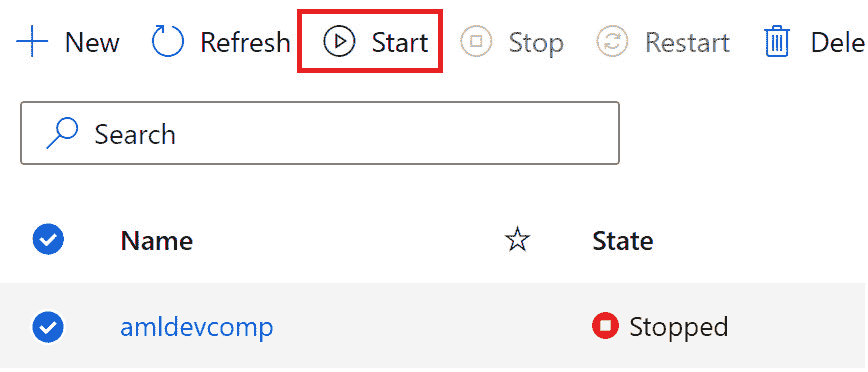

图 7.1 – 开始计算

1.  您的计算实例将从**停止**状态变为**启动**状态。

1.  在上一章中，我们克隆了 Git 仓库。如果您还没有这样做，请继续此步骤。如果您已经克隆了仓库，请跳转到*步骤 7*。

在您的计算实例上打开终端。请注意，路径将包括您的用户目录。在终端中输入以下内容以将示例笔记本克隆到您的工作目录：

```py
git clone https://github.com/PacktPublishing/Azure-Machine-Learning-Engineering.git
```

1.  点击*图 7.2*中显示的刷新图标将更新并刷新屏幕上显示的笔记本。


图 7.2 – 刷新图标

1.  查看您`Azure-Machine-Learning-Engineering`目录中的笔记本。这将显示克隆到您工作目录中的文件，如图*图 7.3*所示：

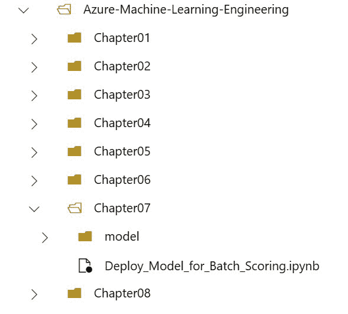

图 7.3 – Azure-Machine-Learning-Engineering

让我们接下来使用 Studio 部署用于批量推理的模型。

# 使用 Studio 部署用于批量推理的模型

在*第三章*“在 AMLS 中训练机器学习模型”中，我们训练了一个模型并将其注册到 Azure 机器学习工作区。我们将部署该模型到管理的批量端点进行批量评分：

1.  导航到你的 Azure 机器学习工作区，从左侧菜单栏选择**模型**以查看你工作区中注册的模型，并选择**titanic_survival_model_**，如图*图 7**.4*所示：

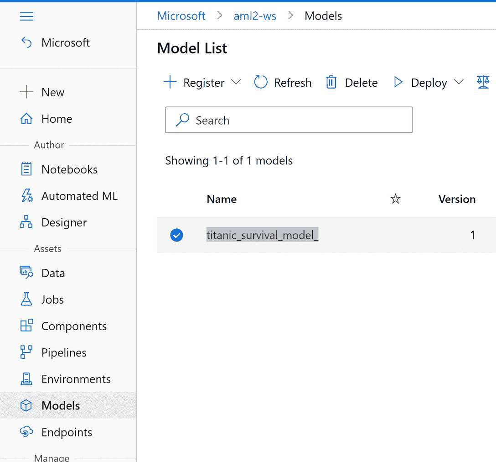

图 7.4 – 工作区中注册的模型列表

1.  点击**部署**，然后选择**部署到批处理端点**，如图*图 7**.5*所示：

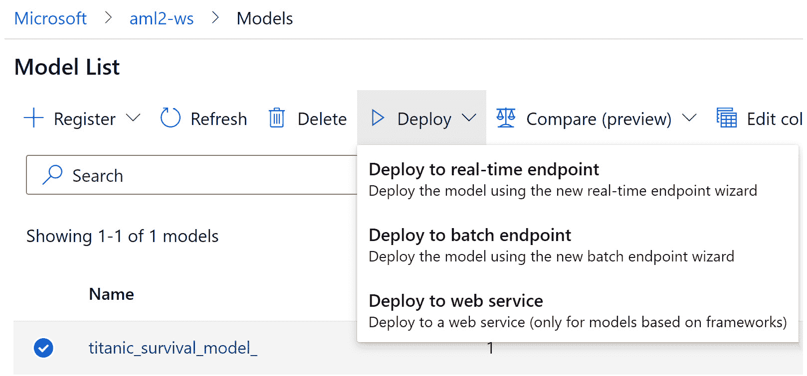

图 7.5 – 将所选模型部署到批处理端点

这将打开部署向导。为所需的字段使用以下值：

+   `titanic-survival-batch-endpoint`

+   **模型**：保留默认的**titanic_survival_model_**

+   `titanic-deployment`

+   **环境**：对于所选模型，评分脚本和环境为你自动生成

+   `cluster cpu-cluster`

审查你的批处理部署规范，并点击**创建部署**，如图*图 7**.6*所示：

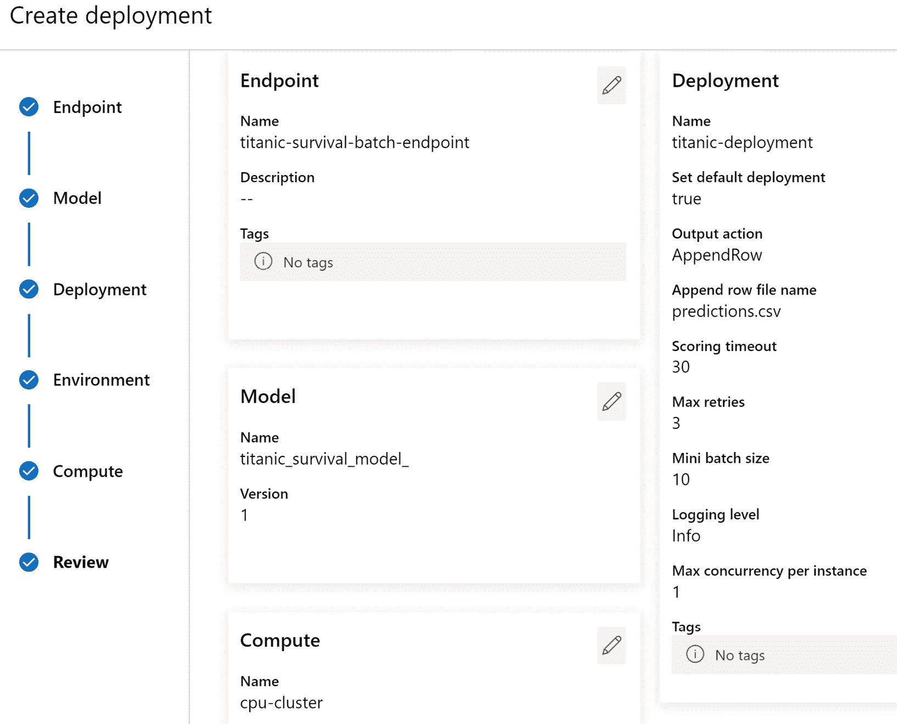

图 7.6 – 创建批处理部署

1.  一分钟左右，你应该会看到一个页面显示你的批处理端点已成功部署。它还包含有关你的批处理端点的一些信息，如图*图 7**.7*所示：

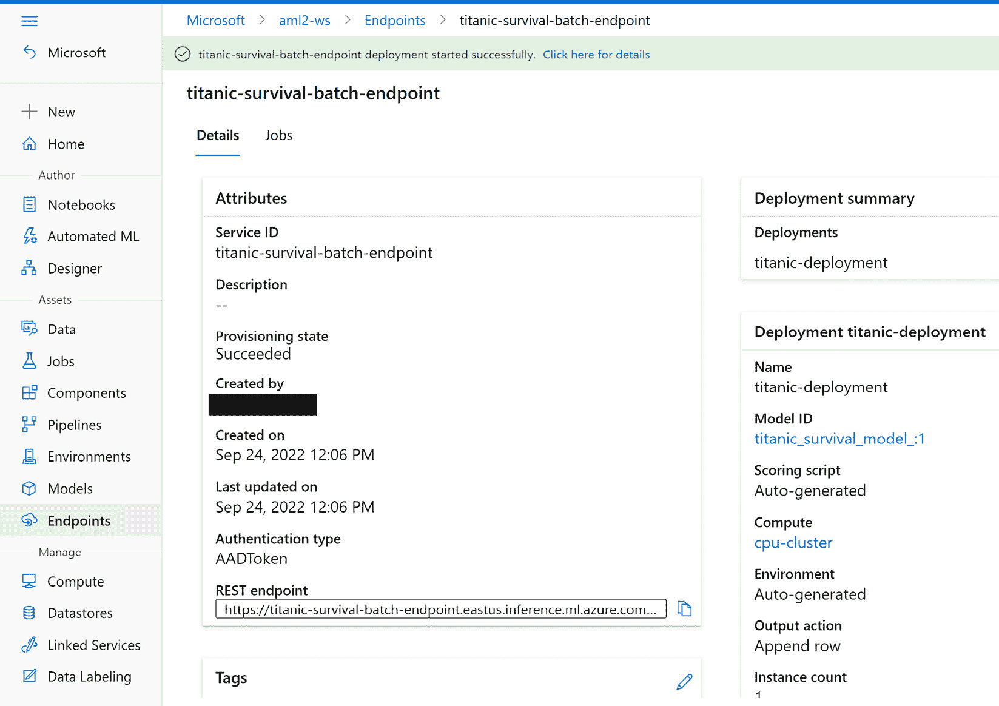

图 7.7 – 成功的批处理部署

现在你已经有一个批处理端点正在运行，让我们创建一个调用你的端点的评分/推理作业。为此，请按照以下步骤操作：

1.  在左侧菜单栏中点击**端点**，然后点击你最近创建的批处理端点，如图*图 7**.8*所示：

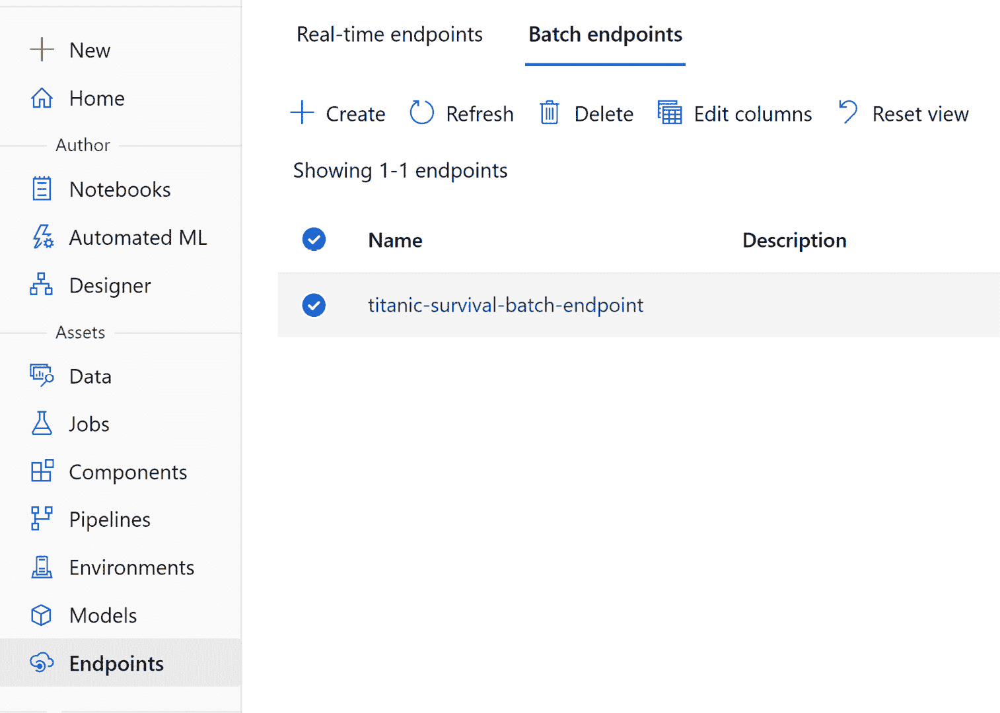

图 7.8 – 已部署批处理端点列表

1.  在**titanic-survival-batch-endpoint**页面，选择**作业**标签，如图*图 7**.9*所示：

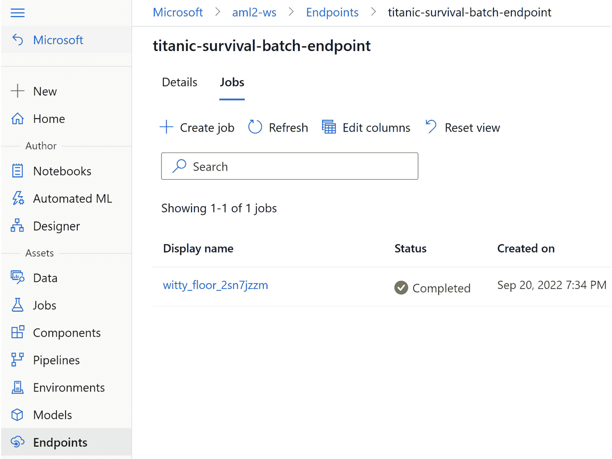

图 7.9 – titanic-survival-batch-endpoint 作业标签

1.  点击**创建作业**，并在向导中为字段选择相应的值，如图*图 7**.10*所示。完成后点击**创建**。请注意，部署已为你预选，但请确保预选了正确的部署。你还应该有一个名为**titanic-test-data**的测试数据集，该数据集在*第三章**，在 AMLS 中训练机器学习模型*时创建。

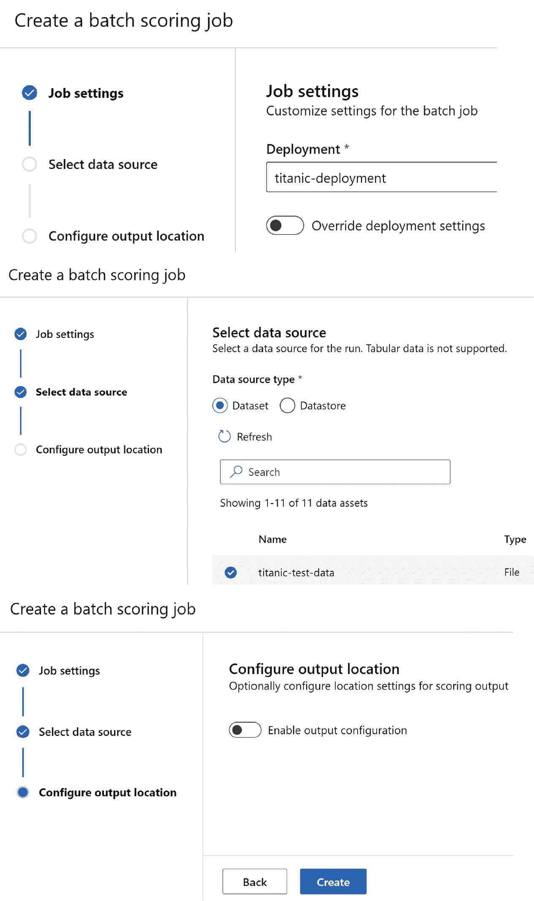

图 7.10 – 创建批评分作业

1.  根据你在上一步中选择的测试数据集的大小，作业完成可能需要一些时间。一旦完成，你将看到一个表示**titanic-survival-batch-endpoint**批评分作业的管道，如图*图 7**.11*所示：

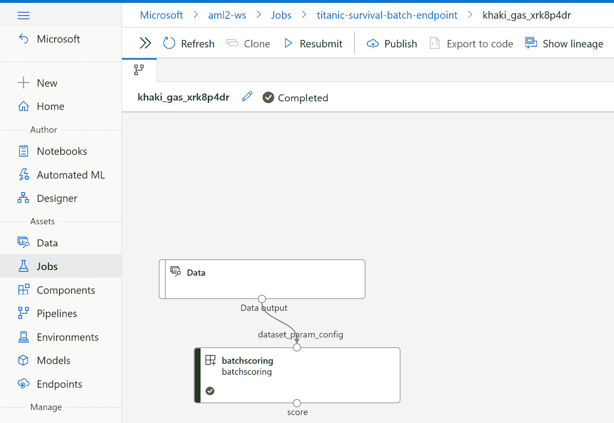

图 7.11 – titanic-survival-batch-endpoint 的批量评分作业

1.  现在，为了查看评分结果，点击管道中的 **batchscoring** 步骤，在右侧点击 **作业概述**，选择 **输出 + 日志** 选项卡，最后点击 **显示数据输出**，如图 *7.12* 所示：

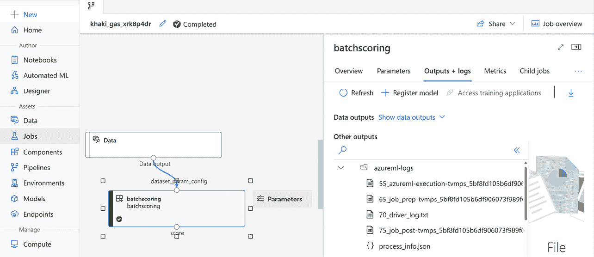

图 7.12 – 批量评分结果

1.  点击后，`predictions.csv` 文件已被保存。点击此文件并选择 **编辑** 选项卡以查看评分结果，如图 *7.13* 所示：

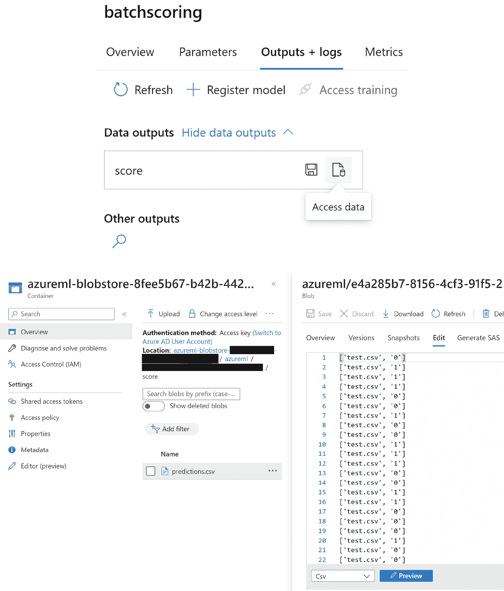

图 7.13 – 查看批量评分结果

在本节中，你学习了如何使用工作室将现有模型部署到管理端点进行批量推理。在下节中，我们将向你展示如何使用 Python SDK 将模型部署到管理端点进行批量评分。

# 通过 Python SDK 部署用于批量推理的模型

在本节中，我们将通过以下步骤使用 Python SDK 将现有模型部署到管理端点进行批量推理：

1.  前往 [`ml.azure.com`](https://ml.azure.com)。

1.  选择你的工作区。

1.  在左侧的工作区用户界面中，点击 **计算**：


图 7.14 – 计算实例图标

1.  在 **计算** 屏幕上，选择你的计算实例并选择 **启动**：

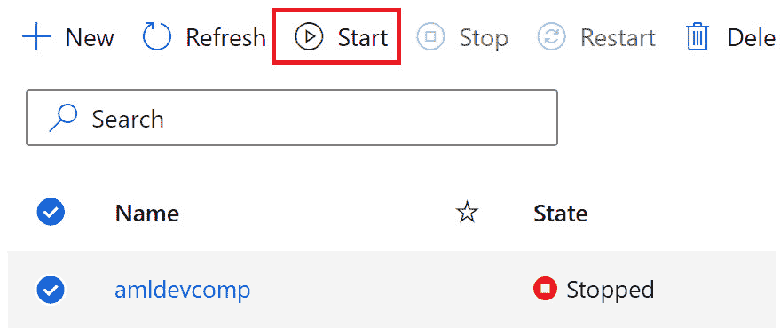

图 7.15 – 开始计算

你的计算实例将从 **停止** 变为 **启动**。一旦计算实例从 **启动** 变为 **运行**，它就准备好使用，因此继续克隆我们的仓库，其中包含一些示例笔记本以供学习。

1.  在应用程序下点击 **终端** 超链接。

这将在你的计算实例上打开终端。请注意，路径将包括你的用户在目录路径中。在终端中输入以下内容以将示例笔记本克隆到你的工作目录：

```py
git clone https://github.com/PacktPublishing/Azure-Machine-Learning-Engineering.git
```

1.  在应用程序下点击 Jupyter 链接，这将显示刚刚克隆的文件夹。导航到 `第七章` 并点击 `Deploy_Model_for_Batch_Scoring.ipynb` 以打开本节的工作簿。

1.  *图 7.16* 中显示的代码片段展示了需要导入的库以及如何在计算实例中连接到 Azure ML 工作区：

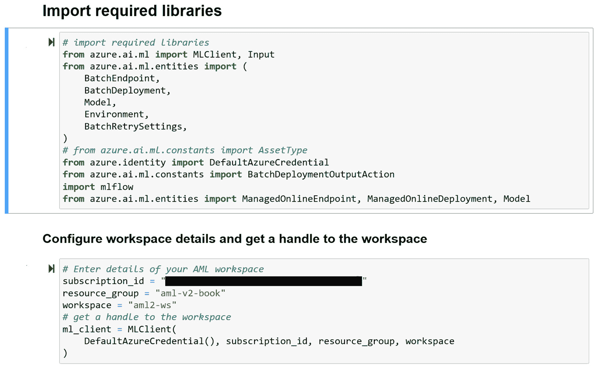

图 7.16 – 导入所需的库并连接到 Azure 机器学习工作区

1.  *图 7.17* 中显示的代码片段展示了如何创建批量端点：

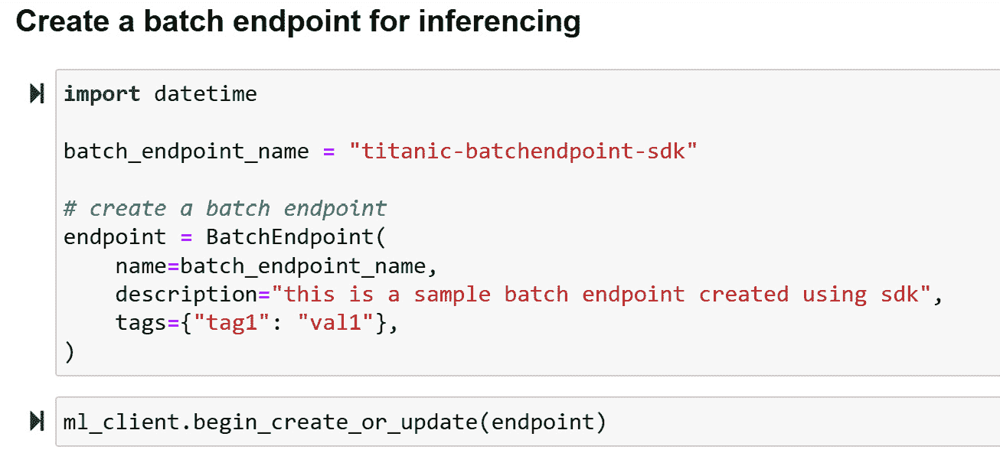

图 7.17 – 创建用于推理的批量端点

1.  *图 7.18* 中所示的代码片段展示了如何从工作区检索现有模型以及如何创建批量部署。批量部署必须指定批量端点、训练模型以及用于评分的计算集群，以及其他部署参数：

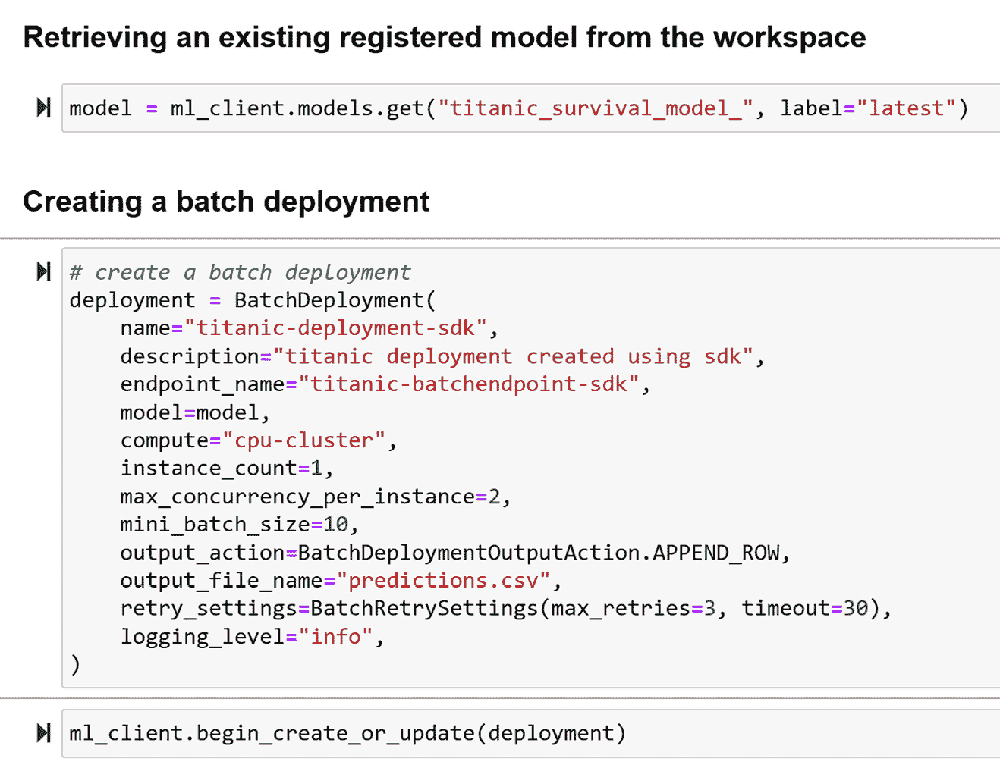

图 7.18 – 创建批量部署

1.  现在，您的批量端点已准备好调用，您将传递一些测试数据到端点，如图*图 7.19*所示：

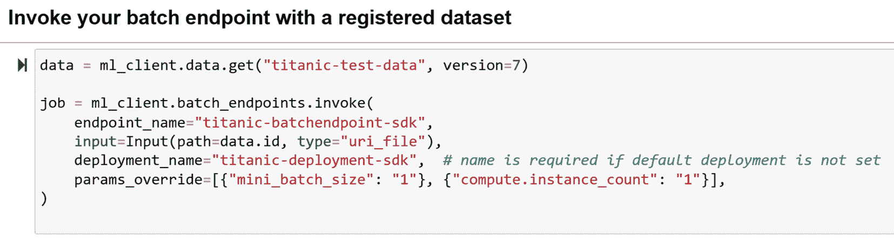

图 7.19 – 创建批量部署

1.  *图 7.20* 中所示的代码片段展示了在上一步骤中提交的批量评分作业所需的 Python 代码：

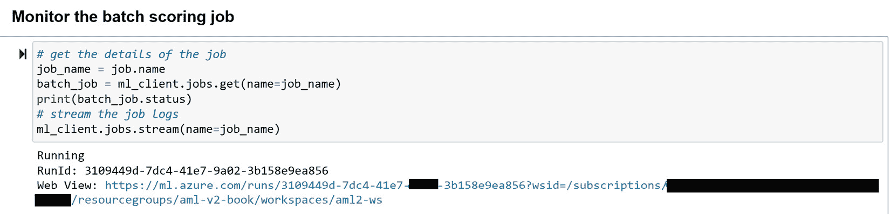

图 7.20 – 创建批量部署

1.  点击上一步骤的输出链接将打开显示批量评分作业的工作区，如图*图 7.21*所示。您可以遵循上一节的*步骤 9*和*步骤 10*来查看结果。

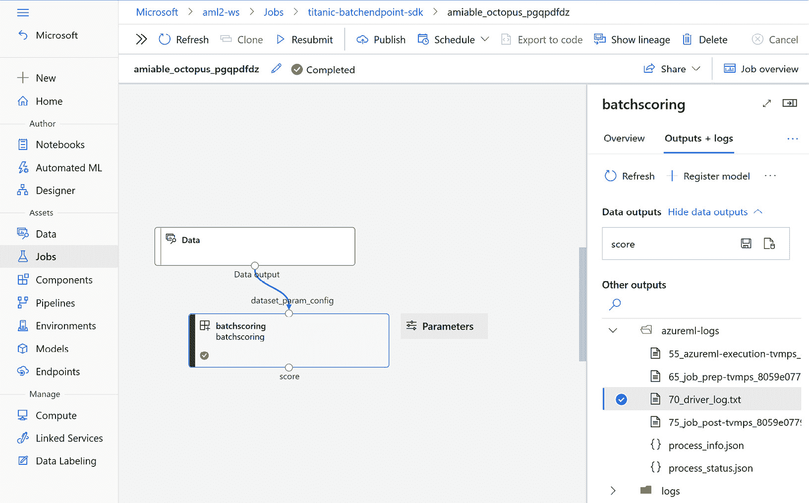

图 7.21 – 批量评分结果

让我们接下来总结本章内容。

# 摘要

在本章中，我们涵盖了众多主题。我们向您展示了如何使用工作室和 Python SDK 来部署模型进行批量评分。我们还向您展示了如何通过调用批量端点将一些测试数据传递给部署的模型进行评分。

在下一章中，您将了解负责任的 AI 以及 Azure 机器学习中的功能，这些功能允许您更负责任地开发、评估和部署模型，以最小化 AI 系统中的不希望出现的偏差。
