# 9

# 使用 MLOps 生产化您的负载

**MLOps**是一个概念，它通过自动化模型训练、模型评估和模型部署，使**机器学习**（**ML**）工作负载能够进行扩展。MLOps 通过代码、数据和模型实现可追溯性。MLOps 允许数据科学家和 ML 专业人士通过**Azure Machine Learning**（**AML**）服务以规模化的方式将预测结果提供给商业用户。

MLOps 建立在**CI/CD**的概念之上。CI/CD 代表**持续集成/持续交付**，这个术语在软件开发中已经使用了数十年。CI/CD 使公司能够扩展其应用程序，通过利用这些相同的概念，我们可以扩展我们的 ML 项目，这些项目将依赖于 CI/CD 实践来实施 MLOps。

这个领域的挑战之一是其复杂性。在本章中，我们将探讨以下场景：检索数据、转换数据、构建模型、评估模型、部署模型，然后等待批准，将其注册到更高环境，并将模型作为托管在线端点发布，将流量路由到模型的最新版本。这个过程将利用 Azure DevOps、AML SDK v2 和 CLI 的 v2。

在本章中，我们将涵盖以下主题：

+   理解 MLOps 实现

+   准备您的 MLOps 环境

+   运行 Azure DevOps 管道

# 技术要求

要继续本章，以下是需要满足的要求：

+   两个 AML 工作区

+   一个 Azure DevOps 组织，或者有创建一个的能力

+   在 Azure DevOps 组织中有一个 Azure DevOps 项目，或者有创建一个的能力

+   在 AML 部署的关键保管库中分配权限的能力

+   创建 Azure DevOps 变量组的能力

+   将 Azure DevOps 变量组链接到 Azure 关键保管库的权限

+   两个服务主体，或者有创建服务主体的权限

+   两个服务连接，每个环境一个，或者有创建服务连接的权限

+   在 Azure DevOps 项目中创建 Azure DevOps 管道的能力

+   在 Azure DevOps 项目中创建环境的能力

# 理解 MLOps 实现

如前所述，MLOps 是一个概念，而不是一个实现。我们将提供 MLOps 的实现作为本章的基础。我们将建立一个 Azure DevOps 管道来编排 AML 管道，以在`dev`环境中转换数据，利用 MLflow 创建模型，并评估模型是否比现有模型表现更好或相等。在此管道之后，如果注册了新模型，我们将利用`dev`环境部署此新模型，然后触发一个审批流程，将新模型注册和部署到`qa`环境，该环境将利用蓝/绿部署。

一些组织可能会选择不注册表现与现有模型一样好的模型，尤其是如果训练数据没有变化，但这将使我们能够看到 AML 如何强大地处理更新托管在线端点。在打下坚实基础之后，您可以更新代码，仅在模型表现优于现有模型时才注册模型，但改进模型是留给您的一项练习。

在本章中，我们将利用 AML SDK v2、CLI v2、Azure DevOps 组织和 Azure DevOps 项目中的 AML 管道，并利用在部署环境时自动为您部署的 Azure Key Vault。您将利用两个 AML 工作区。对于本章，我们将称它们为`dev`和`qa`。

为了分解 MLOps 的实施过程，以下图表展示了我们将为您创建的 MLOps 实施流程：

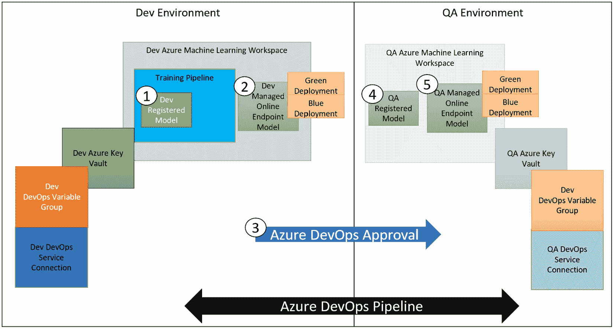

图 9.1 – MLOps 实施

在前面的图中，Azure DevOps 是协调器。当代码被检入**主**分支时，Azure DevOps 将触发 Azure DevOps 管道。

我们将创建一个包含两个阶段的 Azure DevOps 管道。一个阶段是`dev 阶段`，另一个是`qa 阶段`。在`dev 阶段`，我们将利用 AML CLI 首先获取初始模型版本并将其放置到 DevOps 管道中的一个变量中。在检索模型版本后，我们将运行处理模型创建和注册的 AML 管道。在运行 AML 管道后，我们将在 Azure DevOps 管道中再次检索模型版本。如果模型版本没有变化，我们知道没有新模型被注册。如果模型版本增加，那么我们知道我们想要通过 Azure DevOps 在`dev`环境中部署此模型，并继续将此模型部署到`qa`环境。鉴于`qa`环境是一个更高环境，我们将包括一个审批流程。注册和部署到`qa`环境必须首先获得批准。一旦获得批准，注册和部署到`qa`环境将进行。

作为托管在线端点的一部分，我们可以通过蓝绿部署将新模型部署到现有的托管在线端点。当一个模型首次部署到托管在线端点时，我们将流量设置为 100%。在部署模型的新版本时，我们最初将新模型的流量设置为 0，等待其成功部署，然后对于给定的托管在线端点，我们将流量切换到最新版本的模型，设置为 100%，并删除旧模型部署。这确保了给定托管在线端点的正常运行时间。一旦部署了托管在线端点，在模型部署过程中，其他端点的用户不会受到干扰。

为了设置我们的 MLOps 管道，我们将利用几个关键资源。在 MLOps 自动化管道中，我们将利用一个 `dev` AML 工作区，以及一个用于连接到 `qa` AML 工作区的工作区。除了服务连接外，我们还将利用每个环境中存储敏感信息的**密钥保管库**。我们将使用 Azure DevOps 中的**变量组**链接这些密钥保管库。这将使我们的 Azure DevOps 管道保持清洁且易于理解。请参阅*图 9**.1*以了解我们将利用的资源概述。

本章是利用你对本书中迄今为止实现的功能的理解并将其付诸实践的机会。让我们开始查看成功利用 AML CLI v2 和 SDK v2 以及 Azure DevOps 实现的 MLOps 管道的技术要求。

# 准备你的 MLOps 环境

在本节中，我们将确保技术要求得到满足，前提是你有权限这样做。为了准备你的环境，我们将执行以下操作：

1.  创建第二个 AML 工作区

1.  创建 Azure DevOps 组织和项目

1.  确认 `dev` AML 工作区中的代码

1.  将代码移动到你的 Azure DevOps 仓库

1.  在 Azure Key Vault 中设置变量

1.  设置 Azure DevOps 环境变量组

1.  创建 Azure DevOps 环境

1.  设置你的 Azure DevOps 服务连接

1.  创建 Azure DevOps 管道

1.  运行 Azure DevOps 管道

## 创建第二个 AML 工作区

到目前为止，你一直在单个 AML 工作区中工作。通过我们的 MLOps 管道实现，我们将使用两个工作区。有关部署第二个 AML 工作区的信息，请参阅*第一章*，*介绍 Azure 机器学习服务*。在创建第二个 AML 工作区后，继续下一步：*创建 Azure DevOps 组织* *和项目*。

## 创建 Azure DevOps 组织和项目

Azure DevOps 管道位于**Azure DevOps 项目**中。Azure DevOps 项目位于**Azure DevOps 组织**中。您将需要一个 Azure DevOps 项目来托管您的代码存储库，您可以在其中编写代码并创建 Azure DevOps 管道，创建服务连接，创建变量组，并将它们链接到您的密钥保管库。您可能已经设置了 Azure DevOps 组织。您的管理员可以选择在 Azure DevOps 组织中有一个支持多个存储库和多个 Azure DevOps 管道的单个项目，或者有多个项目，每个项目有一个或多个存储库。如果您的管理员已经创建了 Azure DevOps 组织，您可以在 Azure DevOps 组织中请求一个新的 Azure DevOps 项目，或者访问一个现有的 Azure DevOps 项目，该项目包含存储库以保存您的代码，并具有创建 Azure DevOps 管道的能力。如果您已经有一个 Azure DevOps 组织和项目，请继续下一小节，*确认 dev AML 工作区中的代码*。

我们将通过 Web 门户继续设置 Azure DevOps 组织。Azure DevOps 组织将托管您的项目，而项目将在存储库中保存您的源代码，以及用于自动化 MLOps 管道的 Azure DevOps 管道。

如果您没有 Azure DevOps 组织，请按照以下步骤创建一个：

1.  在[`dev.azure.com/`](https://dev.azure.com/)登录 Azure DevOps。

1.  在左侧菜单中，选择如图所示**新建组织**：

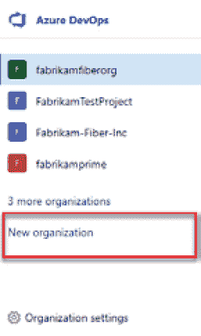

图 9.2 – 新组织

1.  这将打开一个新窗口，用于开始创建 Azure DevOps 组织的流程。然后，点击**继续**按钮。

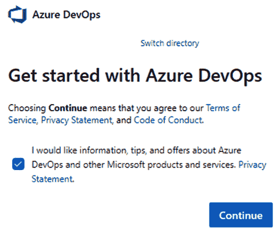

图 9.3 – 开始使用 Azure DevOps

1.  这将带您进入创建 Azure DevOps 组织的下一屏幕：

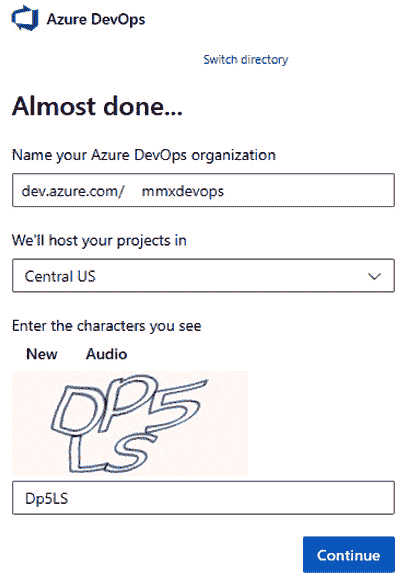

图 9.4 – 创建您的 Azure DevOps 组织

Azure DevOps 组织必须是唯一的，因此您需要使用尚未被占用的名称创建自己的组织。如图*图 9.4*所示，填写以下信息：

1.  命名您的组织。需要一个唯一的组织。在先前的示例中，我们选择了`mmxdevops`。

1.  存储项目的位置 – 我们已选择**美国中部**。

1.  输入屏幕上显示的字符 – 我们已输入`Dp5Ls`进行验证。

1.  点击**继续**按钮。

1.  下一屏将要求您填写**项目名称**字段，您的代码和 MLOps 管道将在此处存放。如图 9.5*所示，我们已选择**私有**项目。如果您在组织中工作，您可能会看到一个**企业**项目的选项。如果此选项对您不可用，请创建一个**私有**项目。创建**公共**项目将允许公众访问您的项目。私有项目将允许您添加您选择的用户到项目中，如果您想分享它。最后，点击**+ 创建项目**按钮。

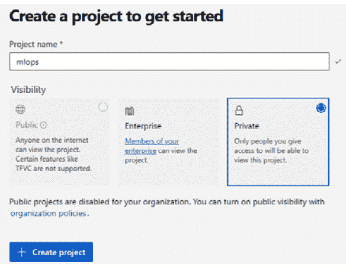

图 9.5 – 创建 Azure DevOps 组织

1.  现在您的项目已经创建，您将有一个地方来存放 MLOps 所需的关键资源。

Azure DevOps 项目包括以下两个关键组件：

+   **Repos**：存储您的代码的地方

+   **Pipelines**：创建您的 MLOps 管道自动化的地方

我们将利用这些，如图 9.6*所示：

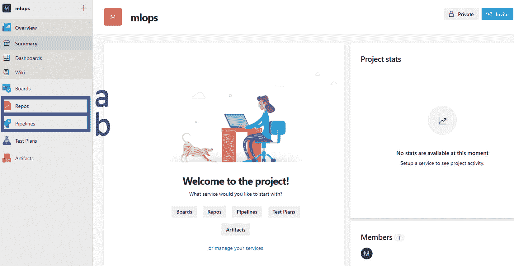

图 9.6 – 创建 Azure DevOps 组织

我们将在本章后面探索利用**Repos**和**Pipelines**。

恭喜您 – 您已设置好 Azure DevOps 组织和项目。现在，是时候深入创建用于存放代码的仓库了。

在*图 9.6*中，你可以看到**Repos**是菜单选项之一。选择此选项即可进入 Azure DevOps 项目的仓库部分，如图 9.7*所示：

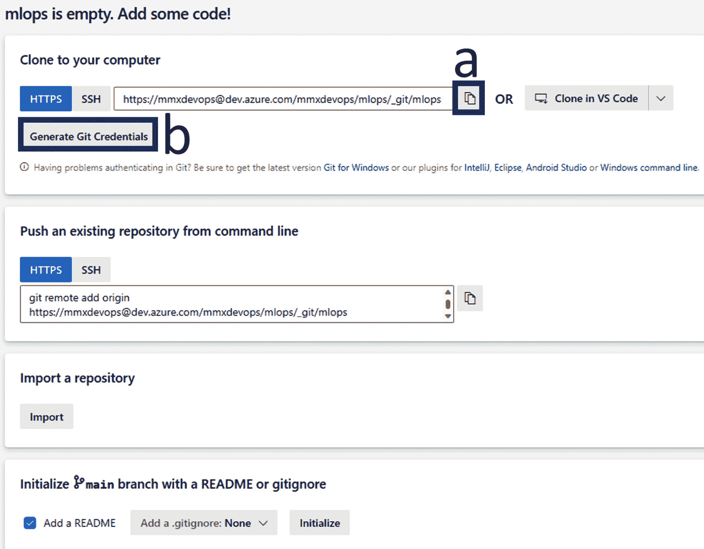

图 9.7 – 空仓库

有三个重要项目我们将复制并保存以供将来使用。选择复制按钮，如图 9.7*中标记为**a**所示，将复制 Git 仓库的 URL。选择**生成 Git 凭据**按钮，如图中标记为**b**所示，将为您提供用户名和密码。我们将在 AML 终端中提供这些信息，以将 AML 工作区中的代码链接到您的 Azure DevOps 仓库。

小贴士

在任何时候，要前往您的 DevOps 项目，您可以输入以下 URL：`https://dev.azure.com/<组织名称>/<项目名称>`.

现在我们已经复制了连接到您的 Azure DevOps 项目的 URL、用户名和密码，我们已准备好审查您 AML 工作区下一个要求。

## 连接到您的 AML 工作区

除了您的 Azure DevOps 组织和项目，我们还需要连接到您的 AML 工作区，以便利用 SDK v2 和 AML CLI v2 实现 MLOps 管道，正如前几章所做的那样。

在前一章中，我们克隆了 Git 仓库。如果您还没有这样做，请继续按照前面提供的步骤操作。如果您已经克隆了仓库，请跳到下一节：

1.  在您的 **Compute** 实例上打开终端。请注意，路径将包括您的用户目录。在终端中输入以下内容以将示例笔记本克隆到您的工作目录：

    ```py
     git clone https://github.com/PacktPublishing/Azure-Machine-Learning-Engineering.git
    ```

1.  点击刷新图标将更新并刷新屏幕上显示的笔记本。

1.  检查您的 `Azure-Machine-Learning-Engineering` 目录中的笔记本。这将显示克隆到您工作目录中的文件，如图 *图 9.8* 所示：

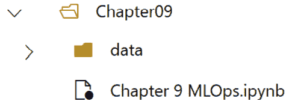

图 9.8 – Azure-Machine-Learning-Engineering 目录

现在您的代码已经在您的 `dev` AML 环境中，您已经准备好将代码移动到您的 Azure DevOps 仓库。在此阶段，构建 MLOps 管道所需的代码已经在您的 ALMS 工作空间中。在下一个小节中，我们将把您的代码从 AML 工作空间移动到 Azure DevOps 项目中的 DevOps 仓库。这种连接将模拟数据科学家或 MLOps 工程师的工作。在 AML 工作空间中编写代码，并将该代码提交到您的 Azure DevOps 仓库。

## 将代码移动到 Azure DevOps 仓库

我们已经在我们的第一个 AML 工作空间中有了您的代码，该工作空间被称为我们的 `dev` AML 工作空间。现在，我们将把您的代码移动到我们的 Azure DevOps 仓库中。

导航到您的 `dev` AML 工作空间中的终端会话：

1.  在您的终端中，按照以下步骤导航到您的 `Azure-Machine-Learning-Engineering` 文件夹：

    ```py
    cd Azure-Machine-Learning-Engineering
    ```

1.  首先，我们需要通过输入以下命令来指定目录是安全的：

    ```py
    git config --global --add safe.directory '*'
    ```

1.  我们希望更新您的源，它指定了代码所在的远程位置，到 Azure DevOps 项目中的仓库。在以下命令中，我们将用您的 Azure DevOps 仓库的 URL 替换它。这将是从 *图 9.7* 复制的 URL。一般而言，执行此操作的命令如下：

    ```py
    git remote set-url origin https://<organization_name>@dev.azure.com/ <organization_name> /<project_name>/_git/mlops
    ```

1.  为了检查您的源设置是否正确，您可以在终端中输入以下命令：

    ```py
    git remote -v
    ```

1.  要使您的 Git 用户信息被保存，您可以设置以下：

    ```py
    git config --global credential.helper store
    ```

1.  接下来，我们将按照以下方式设置 Git 用户信息：

    ```py
    git config --global user.email <username_from_azuredevOps>
    ```

    ```py
    git config --global user.name "Firstname Lastname"
    ```

    ```py
    git config --global push.default simple
    ```

1.  要将代码推送到源，即 Azure DevOps 项目中的仓库，您可以输入以下命令：

    ```py
    git status
    ```

    ```py
    git add –A
    ```

    ```py
    git commit –m "updated"
    ```

    ```py
    git push origin main
    ```

1.  这将提示输入密码，该密码是在您点击 Azure DevOps 项目凭据时提供的，如图 *图 9.9* 所示。

使用前面的命令后，代码现在将从您的 AML 工作空间复制到 Azure DevOps 项目中的仓库，如图中所示以下截图：

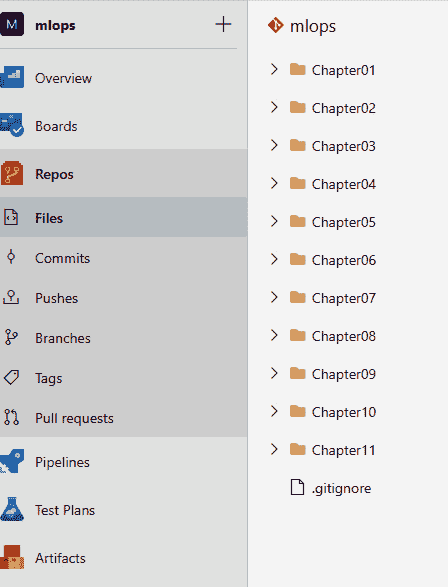

图 9.9 – Azure DevOps MLOps 项目

在此阶段，您已成功将代码移动到您的 Azure DevOps 仓库。对 AML 计算资源上的代码所做的更改，如果提交到您的仓库，将在您的 Azure DevOps 仓库中反映和更新。

在下一个小节中，我们将为每个 AML 工作空间环境在 Azure Key Vault 中设置变量。

## 在 Azure 密钥保管库中设置变量

当您的 AML 工作空间部署时，Azure 密钥保管库也会为您的每个工作空间部署。我们将利用每个密钥保管库来存储与每个工作空间相关的敏感信息，以便 Azure DevOps 可以连接并运行 Azure DevOps 构建代理上的 AML 管道和 AML CLI v2 命令。我们本可以选择不利用与 AML 工作空间一起部署的默认密钥保管库，并为这项任务启动两个单独的密钥保管库，但鉴于资源已经可用，我们将选择继续利用默认部署的密钥保管库。要在 Azure 密钥保管库中设置变量，请按照以下步骤操作：

1.  通过访问[`portal.azure.com/`](https://portal.azure.com/)进入 Azure 门户，找到您的 AML 工作空间。点击资源，如图所示：

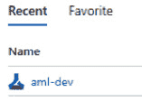

图 9.10 – Azure 门户中的 AML 工作空间图标

1.  点击资源，我们可以看到 AML 工作空间的概览包括**密钥** **保管库**信息：

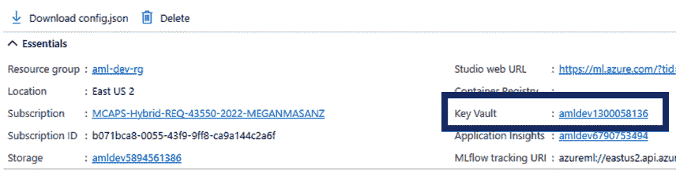

图 9.11 – AML 工作空间概览

点击**密钥保管库**名称将直接带我们到 Azure 密钥保管库，如图所示：

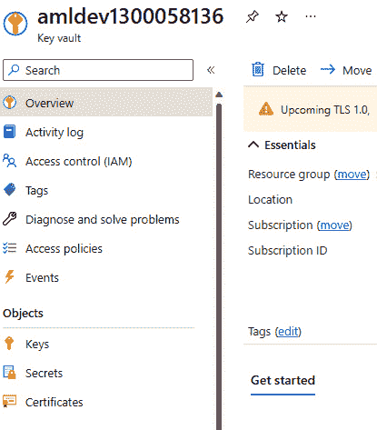

图 9.12 – Azure 密钥保管库概览

1.  目前，您没有权限查看**机密**，因此请点击左侧的**访问策略**菜单，如图所示。这将显示**访问策略**选项，如图所示：

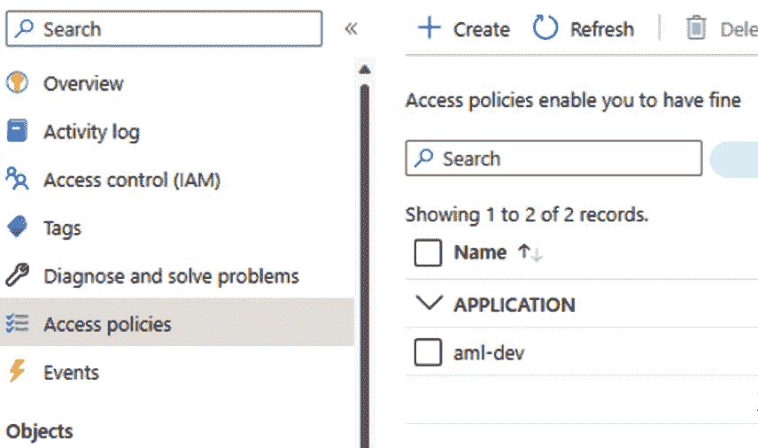

图 9.13 – Azure 密钥保管库访问策略

1.  点击如图*图 9.14*所示的**+ 创建**将提供分配权限的选项。在**机密权限**下，勾选**获取**、**列出**、**设置**和**删除**，然后点击**下一步**：

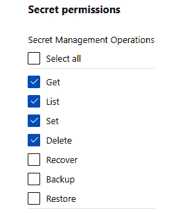

图 9.14 – 设置机密权限选项

1.  然后，您可以通过名称或电子邮件地址自行搜索以分配权限，如图所示：

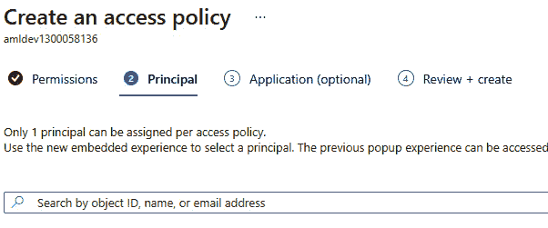

图 9.15 – 通过电子邮件搜索以分配 Azure 密钥保管库所选权限

1.  在如图*图 9.16*所示的文本框中，输入您的电子邮件地址并找到自己以分配访问权限：

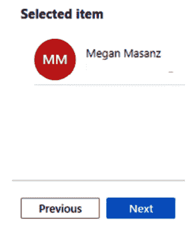

图 9.16 – 定位您的电子邮件地址

1.  找到您自己后，选择您的名称，然后点击**下一步**按钮。

1.  然后，您将获得选择应用程序的选项 - 在**应用程序（可选）**部分不要选择任何内容，然后点击**下一步**。

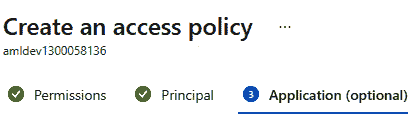

图 9.17 – 跳过应用程序（可选）

1.  最后，在**审查+创建**部分下点击**创建**按钮。

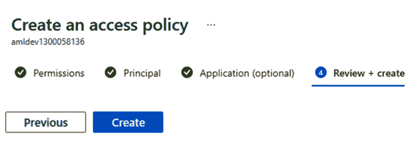

图 9.18 – 创建 Azure 密钥保管库权限

1.  现在您有权限查看和创建密钥，请转到左侧菜单中的**密钥**选项：


图 9.19 – 左侧菜单中的“密钥”选项

1.  点击此处所示的**+ 生成/导入**按钮：

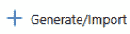

图 9.20 – 生成新的密钥

1.  这将显示创建**密钥**的屏幕，如图下所示：

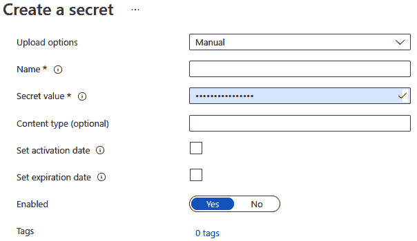

图 9.21 – 创建密钥

为以下表格中列出的每个值填充密钥并点击**创建**按钮，因为它们将被您的 Azure DevOps 管道利用。这里提供的表格在**值**列中提供了示例信息。此示例信息应从您的 AML 工作区的概述中获取，如图 9**.11** 所示，除了位置。根据您的 AML 工作区部署的位置，位置值可以在以下位置找到 – [`github.com/microsoft/azure-pipelines-extensions/blob/master/docs/authoring/endpoints/workspace-locations`](https://github.com/microsoft/azure-pipelines-extensions/blob/master/docs/authoring/endpoints/workspace-locations)：

| **密钥** **保管库变量** | **值** |
| --- | --- |
| `resourceGroup` | `aml-dev-rg` |
| `wsName` | `aml-dev` |
| `location` | `eastus` |

图 9.22 – 开发 Azure 密钥保管库变量

现在您已经为您的第一个 AML 工作区设置了 Azure 密钥保管库，我们将按照相同的**步骤 1 到 13**来设置第二个 AML 工作区的 Azure 密钥保管库和值。此信息应从您的第二个 `qa` AML 工作区的概述中获取，如图 9**.11** 所示：

| **密钥** **保管库变量** | **值** |
| --- | --- |
| `resourceGroup` | `aml-qa-rg` |
| `wsName` | `aml-qa` |
| `location` | `eastus` |

图 9.23 – qa Azure 密钥保管库变量

注意

在实际场景中，我们通常会看到非生产环境和生产环境，或者`dev`、`qa`和`prod`。此代码可以扩展以支持*n*个环境。

完成这两个环境后，您就可以继续下一步 – 设置您的环境变量组。

## 设置环境变量组

现在您的变量已安全存储在 Azure 密钥保管库中，我们将设置变量组以保存您在 Azure DevOps 管道中使用的设置。变量组是一组在 Azure DevOps 管道任务中一起使用的变量。这意味着每个任务都可以使用指定我们将使用`dev`服务连接访问`dev`环境或利用`qa`服务连接连接到`qa`环境的变量。

我们将创建两个变量组，`devops-variable-group-dev`和`devops-variable-group-qa`，以模拟从一个环境移动到另一个环境：

1.  从左侧菜单中选择**管道**蓝色火箭图标，并选择**库**选项，如下所示：

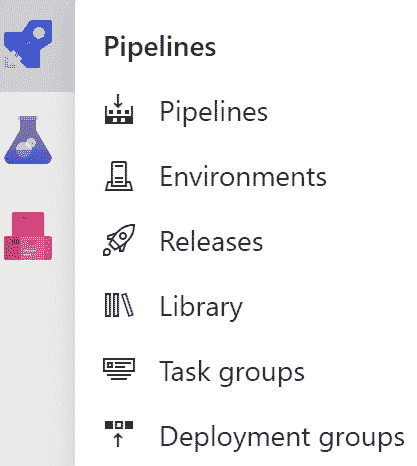

图 9.24 – 库选项

1.  选择**库**选项，您将提示创建一个新的变量组，如下所示：

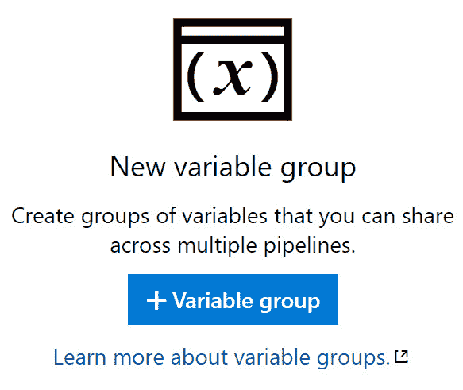

图 9.25 – 新变量组

1.  点击`devops-variable-group-dev`，并启用**从 Azure 密钥保管库链接机密作为变量**选项，如下截图所示：

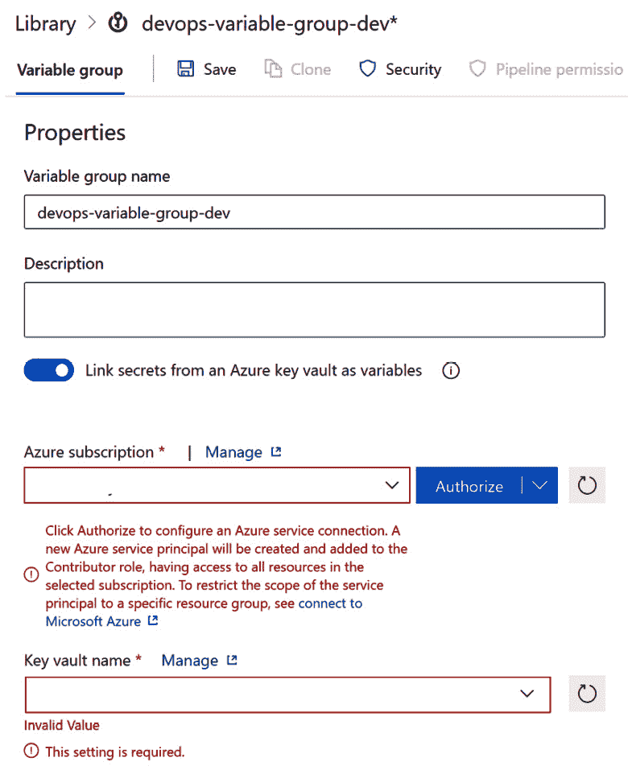

图 9.26 – 变量组创建

1.  您需要点击您的 Azure 订阅的**授权**按钮。

1.  当选择要链接到变量组的 Azure 密钥保管库时，请确保将`dev`密钥保管库与`devops-variable-group-dev`变量组链接，以及将`qa`密钥保管库与`devops-variable-group-qa`变量组链接。

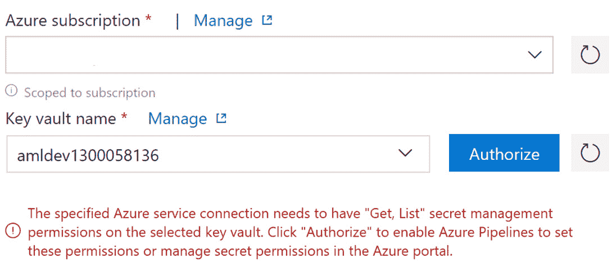

图 9.27 – 变量组链接到 Azure 密钥保管库

1.  完成密钥保管库的授权后，点击**+ 添加**图标，将您的密钥保管库中的机密添加到您的 Azure DevOps 变量组中，如下所示：

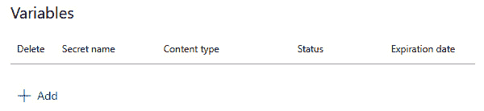

图 9.28 – 向 Azure DevOps 变量组添加变量

1.  点击**+ 添加**图标，您将提示从已链接到变量组的 Azure 密钥保管库中选择机密，如下所示：


图 9.29 – 选择 Azure 密钥保管库变量

从**图 9.22**和**图 9.23**中选择您填充的三个变量，并点击`devops-variable-group-dev`应链接到您的`dev` Azure 密钥保管库，而`devops-variable-group-qa`应链接到您的`qa` Azure 密钥保管库。

1.  请务必点击每个变量组的**保存**图标：

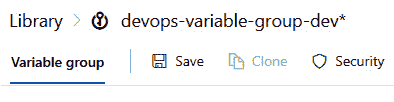

图 9.30 – 保存 Azure DevOps 变量组

到目前为止，您应该确保已链接两个变量组，并且每个变量组应链接到特定环境的密钥保管库。

1.  点击 Azure DevOps 左侧菜单中的 **库** 图标将弹出您已填充的 **变量组**，如下所示：

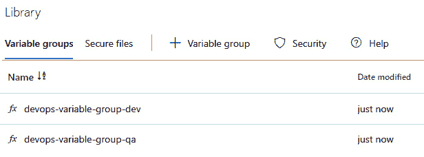

图 9.31 – Azure DevOps 变量组

恭喜您 – 您已设置两个变量组，分别指向两个不同的密钥保管库，每个密钥保管库都包含有关特定工作区的信息。请注意，这非常灵活。任何包含您希望传递到管道中的敏感信息的变量都可以利用变量组中存储在密钥保管库中的密钥。Azure Key Vault 为您提供了在 MLOps 管道中为每个 AML 工作区提供独特安全信息的灵活性。

下一个我们将设置的 Azure DevOps 组件是为 `qa` AML 工作空间中的模型注册和模型部署提供审批的环境。

## 创建 Azure DevOps 环境

在本小节中，我们将创建一个名为 `qa` 的 Azure DevOps 环境，以便我们可以对 `qa` 环境中的模型部署进行治理。Azure DevOps 环境需要审批者。随着我们向 `qa` 环境的进展，我们将在 Azure DevOps 管道中引用此环境：

1.  在 Azure DevOps 项目的左侧面板中的 **管道** 部分选择 **环境** 图标，然后选择 **新建环境**。

这将弹出一个新的弹出窗口，如下截图所示：

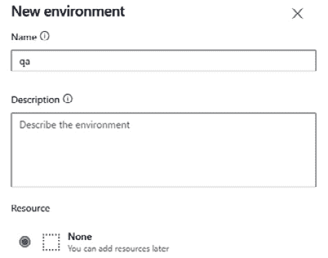

图 9.32 – Azure DevOps 环境

1.  对于名称，键入 `qa`，将资源设置为 **无**，然后选择 **创建** 按钮。

1.  在环境的右上角，您将看到一个带有三个点的 **添加资源** 按钮，如下图所示。点击三个点：


图 9.33 – 添加资源

1.  点击三个点，转到 **审批和检查**，如下截图所示：

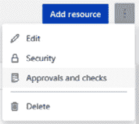

图 9.34 – 审批和检查

1.  点击 **审批和检查** 选项后，将显示一个新屏幕，允许您输入您的审批者。

将显示一个屏幕，**添加第一个检查**，如下所示：

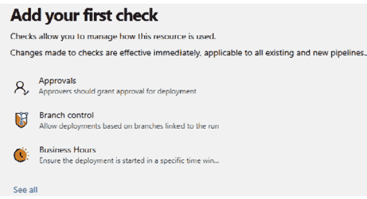

图 9.35 – 审批和检查

1.  选择 **审批**，这将弹出如下的 **审批** 配置：

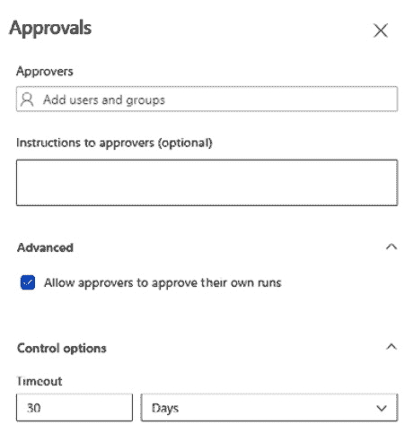

图 9.36 – 设置审批者

1.  将自己添加到 **审批** 中，确保在 **高级** 下已勾选 **允许审批者审批自己的运行**，然后选择 **创建**。

现在您已经创建了 Azure DevOps 环境，我们准备创建 Azure DevOps 服务连接。

## 设置您的 Azure DevOps 服务连接

Azure DevOps 服务连接使用服务主体来连接并代表您运行代码。服务连接将以服务连接中指定的服务主体身份运行您的 Azure DevOps 管道。AML 服务连接允许您将 Azure DevOps 连接到您的工作区。这意味着我们将创建两个服务连接，每个 AML 工作区一个。

有一种特殊类型的服务连接，指定它是一个 ML 工作区服务连接。此扩展不是必需的，所以如果您的 Azure DevOps 组织有管理员，他们可以为您提供服务主体而不使用此扩展，但这很理想，因为它表明服务主体将被用于什么。

我们将首先为您在 Azure DevOps 组织中安装一个 AML 扩展。要将此扩展安装到您的 Azure DevOps 环境中，请执行以下步骤：

1.  导航到 [`marketplace.visualstudio.com/`](https://marketplace.visualstudio.com/)，并选择`Azure Machine Learning`，如图下截图所示：

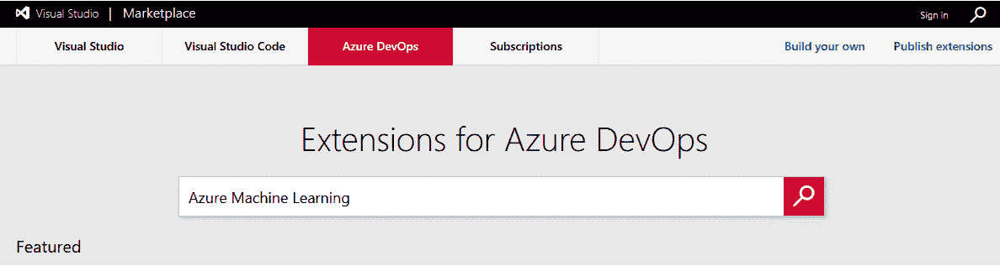

图 9.37 – Visual Studio 商店

1.  这将显示以下 AML Azure DevOps 扩展：

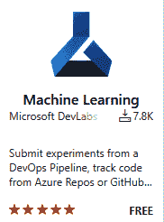

图 9.38 – Azure DevOps ML 扩展

1.  点击如图 9.38 所示的图标将显示有关扩展的详细信息。

1.  点击“免费获取”按钮开始安装过程。这将带您进入下一个屏幕，其中正在验证您是否有权限在您的 Azure DevOps 组织中安装扩展，如图下截图所示：

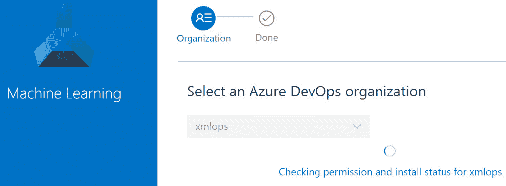

图 9.39 – 验证安装权限

1.  权限确认后，您将被提示为您的 Azure DevOps 组织安装，如图所示：

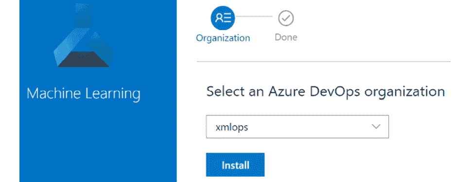

图 9.40 – 安装选项

1.  点击“**安装**”按钮，您将被提示现在前往您的 Azure DevOps 组织，如图下截图所示：

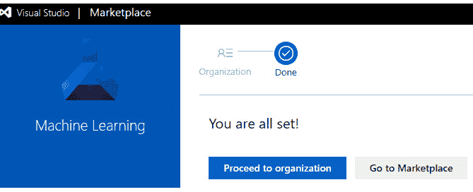

图 9.41 – 安装确认

1.  点击前面的截图所示的“**进入组织**”按钮。这将带您进入您的 Azure DevOps 组织。

1.  然后，点击您在 Azure DevOps 组织中的项目，如图下截图所示：

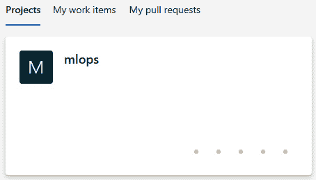

图 9.42 – Azure DevOps 项目

1.  在您的项目中，在左侧菜单中，您可以在菜单中看到“**项目设置**”。点击“**项目** **设置**”图标。

1.  点击“**项目设置**”，您将在菜单中看到“**服务连接**”。点击“**服务连接**”图标。

1.  点击屏幕左上角的**创建服务连接**图标；这将打开如图所示的**新服务连接**窗口：

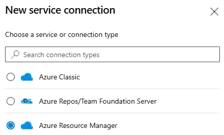

图 9.43 – 新服务连接

1.  在这里点击**Azure 资源管理器**选项，滚动到页面底部，然后点击**下一步**。

这将打开另一个屏幕，如下所示：

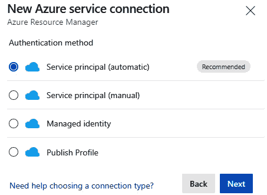

图 9.44 – 自动创建服务主体

为了利用**服务主体（自动）**选项，你需要在你的 Azure 订阅中拥有创建**服务主体**实例的授权。如果你在一个此选项未被授权的环境中工作，你将能够从你的 Azure 订阅管理员那里请求一个服务主体，他们可以提供你创建服务连接所需的信息。请参考以下截图：

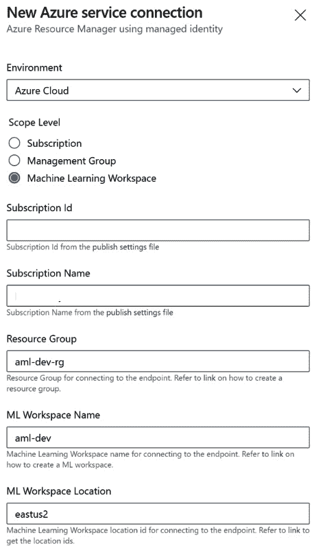

图 9.45 – 服务连接信息

1.  按照如图 9**.45**所示的屏幕上的信息进行填写。**订阅 ID**、**订阅名称**、**资源组**和**ML 工作区名称**信息都在如图 9**.11**所示的 AML 资源概览屏幕上。**ML 工作区位置**基于资源部署的位置。为了确认你使用的是正确的值，这里有一个表格：[`github.com/microsoft/azure-pipelines-extensions/blob/master/docs/authoring/endpoints/workspace-locations`](https://github.com/microsoft/azure-pipelines-extensions/blob/master/docs/authoring/endpoints/workspace-locations)。

在点击你的 Azure 服务连接上的**保存**按钮之前，务必检查**授予所有管道访问权限**。

定义你的 Azure DevOps 管道的`.yml`文件将期望服务连接的某些值。将你的服务连接到`dev`环境作为`aml-dev`，并将你的服务连接到`qa`环境作为`aml-qa`。

恭喜你 – 你已经设置了两个服务连接，一个指向你的`dev` AML 工作区，另一个指向你的`qa` AML 工作区。我们将继续到下一个子节，创建你的 Azure DevOps 管道。

## 创建 Azure DevOps 管道

要设置你的 Azure DevOps 管道，我们将生成一些代码。回想一下，你的代码在你的`dev` AML 工作区中。为了指导你创建 Azure DevOps 管道，我们在`第九章`、`第九章` `MLOps.ipynb`中创建了一个示例笔记本，如下截图所示。

在你的 AML 工作区的`dev`实例中，你会看到如下笔记本：

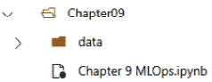

图 9.46 – 第九章 MLOps 笔记本

打开笔记本，并逐步通过代码，执行每个单元格，并为你的 MLOps 流水线创建所需的文件。

我们首先通过连接到我们的 AML 工作区并确保我们的数据准备好被我们的 MLOps 流水线利用来开始笔记本。通常，演示包括你将作为流水线一部分利用的数据，但在现实世界的流水线中，你的数据将驻留在不在你的 MLOps 文件夹中的某个地方，因此我们将从文件夹中获取数据，并在尚未注册的情况下进行注册。

我们将创建一个 AML 流水线，为了实现这一点，我们为流水线中的每个步骤创建单独的文件夹。我们将创建一个数据准备、模型训练和模型评估的步骤。我们将利用我们的 Azure DevOps 流水线来处理部署，但我们将创建 AML 流水线的`.yml`文件定义，并且我们还创建一个文件夹来存放该流水线定义，以及一个文件夹来存放我们的`conda`环境`.yml`文件。

我们将为 AML 流水线创建一个计算集群以利用它。我们可以争论说这应该包含在 MLOps 流水线中，但这个资源将根据我们的流水线需求自动扩展和缩减，因此我们将这个资源留在了 Azure DevOps 流水线之外——然而，你当然可以将这个流水线扩展以包括这个功能。

在创建用于处理环境的`conda` `.yml`文件以及 AML 流水线中每个步骤的脚本之后，我们在 AML 流水线作业中将代码拼接在一起，这在*第七章*中有所介绍，*部署 ML 模型进行* *批量评分*。

这是创建流水线利用环境的脚本：

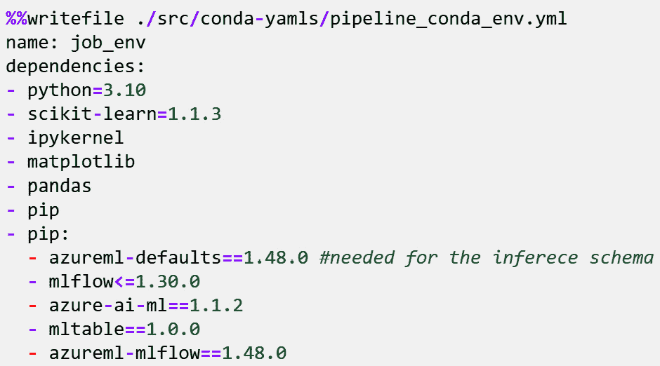

图 9.47 – 环境信息 conda .yml 文件

复习本章中流水线中的每个步骤以及笔记本中的代码，因为它创建了一个 AML 作业流水线来创建模型并注册模型。

注意，第一步将期望一个原始数据参数，这将告诉代码在哪里找到`titanic.csv`文件。除了源位置外，流水线定义还指示数据将存储的位置。这个脚本对于为你的流水线提供通用的数据利用解决方案非常有帮助。AML 流水线中的每个步骤都有一组定义好的输入和输出参数，这些参数在流水线定义`.yml`文件中捕获，该文件由笔记本在章节文件夹目录下的`src`目录中的流水线目录生成。通过审查此代码，你可以看到脚本中的输入和输出是如何在管道定义中指定的：

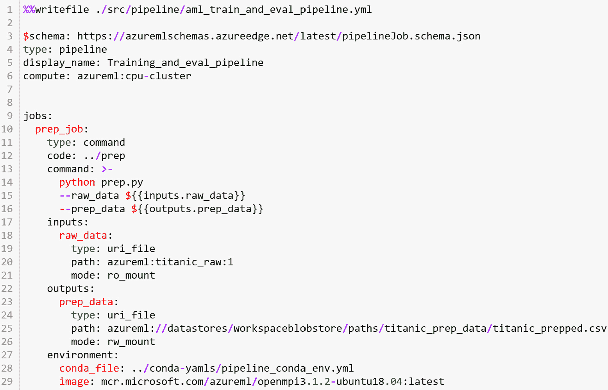

图 9.48 – AML 流水线定义

注意

管道作业定义具有很大的灵活性。定义作业的架构可以在此处查看：[`azuremlschemas.azureedge.net/latest/commandJob.schema.json`](https://azuremlschemas.azureedge.net/latest/commandJob.schema.json)。

在这里的管道定义中，我们根据架构定义指定了预处理器作业的类型为`command`。我们指定了代码可以找到的位置。对于命令本身，我们指定运行 Python 并提供文件以及将从我们的定义输入和输出传递给 Python 脚本的参数。我们可以看到输入被定义为`ro_mount`，或对指定文件的只读挂载，输出被定义为`rw_mount`，或对指定文件位置的读写挂载。此外，环境被指定为生成的`conda` `.yml`文件，并且还指定了一个 Ubuntu 镜像。

这个初始的`prep_job`与`train_job`和`eval_job`一起构成了 AML 管道。

现在我们已经审查了 AML 管道，我们将查看`dev`和`qa`环境中模型部署所需的文件。

注意

托管在线端点名称必须在每个 Azure 区域中是唯一的。

除了 AML 管道定义之外，笔记本还会生成用于处理托管在线端点部署的文件。在运行笔记本时，请务必更新`create-endpoint.yml`和`create-endpoint-dev.yml`中的`name`值；在`model_deployment.yml`中，提供与`create-endpoint.yml`中指定的`endpoint_name`值相同的值；在`model_deployment-dev.yml`中，提供在`create-endpoint-dev.yml`文件中指定的`endpoint_name`值。

这里是`create-endpoint-dev.yml`文件的截图：

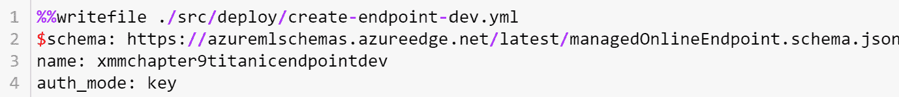

图 9.49 – dev AML 工作区托管在线端点.yml 文件

这里显示的文件提供了在`dev`环境中部署时托管在线端点将使用的名称和授权模式。请务必更新**第 3 行**，因为名称必须在部署 AML 工作区的 Azure 区域中是唯一的。

下面的截图显示了用于部署到托管在线端点的`model_deployment-dev.yml`文件。这里的`endpoint_name`值应与托管在线端点指定的名称匹配：

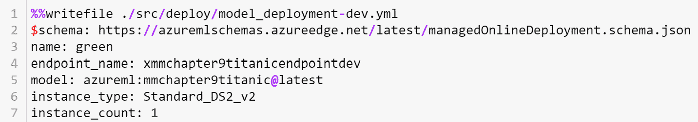

图 9.50 – 将 dev AML 工作区部署到托管在线端点的 yml 文件

正如`dev`环境中的托管在线部署名称应该匹配一样，它们在`qa`环境中也需要匹配。

这里是`create-endpoint.yml`文件的截图。这是用于在`qa` AML 工作区中创建托管在线端点部署的文件：

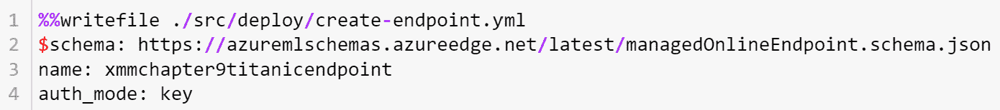

图 9.51 – qa AML 工作空间托管在线端点.yml 文件

如图中所示，`qa`环境和`dev`环境。

这里是`model_deployment.yml`文件的截图：

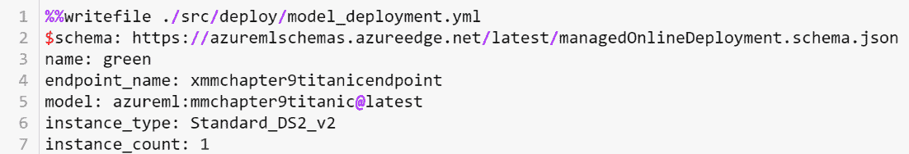

图 9.52 – qa AML 工作空间部署到托管在线端点 yml 文件

如图中所示，此文件将在`qa`环境的在线部署中使用，并将转到`endpoint_name`以创建部署，因此务必更新`create-endpoint.yml`文件。

这些文件在 Azure DevOps 管道定义中被利用，我们将在下一节讨论。

以下是从`AzureDevOpsPipeline.yml`文件中摘录的片段，该文件协调 MLOps 管道：

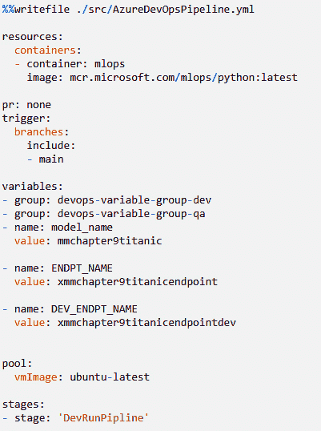

图 9.53 – Azure DevOpsPipeline.yml 文件定义

`AzureDevOpsPipeline.yml`文件首先指定 Azure DevOps 构建代理将利用的镜像。当`main`分支有代码更改时，管道将被触发。该管道利用了之前设置的`devops-variable-group-dev`和`devops-variable-group-qa`。

在这个`.yml`文件中，务必更新`ENDPT_NAME`的值，使其与你在`create-endpoint.yml`和`model_deployment.yml`文件中指定的`endpoint_name`值一致。

还务必更新`DEV_ENDPT_NAME`，使其与你在`create-endpoint-dev.yml`文件中指定的`name`变量值以及`model_deployment-dev.yml`文件中的`endpoint_name`值一致。

这里的代码显示了在`AzureDevOpsPipeline.yml`文件中，需要替换的用于 MLOps 部署的值：

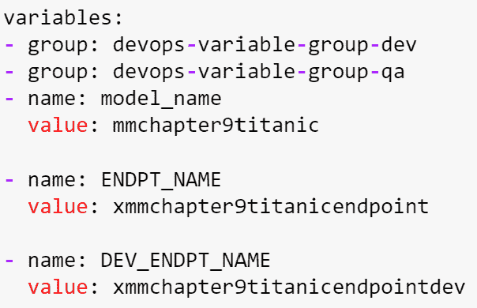

图 9.54 – Azure DevOps 管道变量替换

DevOps 管道分为两个阶段 – 一个阶段用于在`dev`环境中运行管道和部署模型，另一个阶段用于将模型提升和部署到`qa`环境。

在 Azure DevOps 阶段内部，我们利用一组作业，这些作业是利用 AML CLI v2 检索`dev`环境中的初始模型版本、运行 AML 管道，然后检索最终模型版本的 CLI 任务。这个最终模型版本指示模型是否应该在`qa`环境中注册：

```py
az ml model list -w $(wsName) -g $(resourceGroup) -n $(model_name) --query "[0].version" -o tsv
```

上述代码是从您的 Azure DevOps 管道的第一个阶段和第一个步骤中检索的。使用 Azure DevOps 运行此代码，我们将检索由您在 Azure DevOps 管道中定义的变量指定的模型名称的最新版本，如图所示。正如您在代码中所见，我们不仅利用了变量组，还可以直接在 Azure DevOps 管道中定义变量，例如`model_name`变量。鉴于此值不基于环境而改变，我们将其添加到管道定义本身，但也可以将其包含在密钥保管库中，并通过我们的 Azure DevOps 变量组检索它。

在 Azure DevOps 管道`yml`文件中放置时，在 Azure DevOps 中运行的命令略有修改，如下所示：

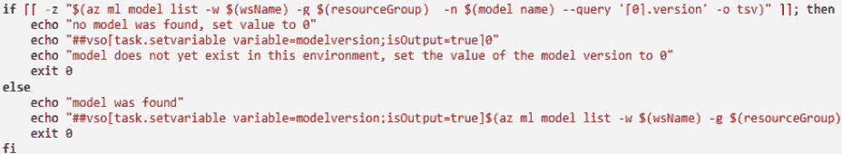

图 9.55 – 检查模型是否存在

在 Azure DevOps 管道中的 Azure CLI 任务内部，我们正在检查查询工作区中的模型的结果是否返回空字符串，然后我们将`modelversion`变量设置为`0`；否则，我们检索它并在 Azure DevOps 管道中设置`modeldeversion`变量。

这将把模型版本放入一个 Azure DevOps 变量中，可以在管道的后续步骤中评估，通过运行以下命令：

```py
echo 'initial model version'$(setversion.modelversion)
```

在设置初始模型版本后，我们通过以下代码从 Azure DevOps 管道运行 AML 工作区管道：

```py
az ml job create --file 'Chapter09/src/pipeline/aml_train_and_eval_pipeline.yml' --stream --set settings.force_rerun=True
```

注意，我们在此将`force_rerun`设置为`True`。AML 知道数据没有变化，如果代码没有变化，则它将重用步骤而不是重新运行它们，这在生产负载中非常好。然而，在更新模型的演示中，我们希望看到模型版本持续更新，因此我们将该值设置为`True`。

在第一个阶段，我们检查最终模型版本和初始模型版本是否相等。此处的代码描述了检查模型版本并将输出变量`runme`设置为`true`或`false`：

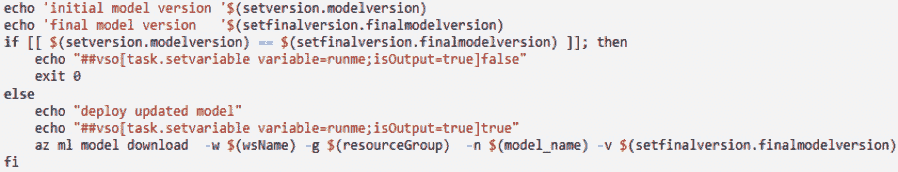

图 9.56 – 检查模型版本

如果它们不同，那么我们希望在`dev`环境中部署新模型，我们使用 AML CLI 命令部署模型：

```py
az ml online-endpoint create --file 'Chapter09/src/deploy/create-endpoint-dev.yml' -g $(resourceGroup) -w $(wsName) -n $(DEV_ENDPT_NAME)
```

在此代码中，我们引用了`.yml`端点文件、资源组、工作区名称和端点名称。端点创建后，我们可以创建在线部署，如下所示：

```py
az ml online-deployment create --name $NEW_DEPLOYMENT_NAME -f 'Chapter09/src/deploy/model_deployment-dev.yml' -g $(resourceGroup) -w $(wsName)
```

最后，我们可以通过以下命令将端点的流量更新为 100%：

```py
az ml online-endpoint update -n $DEV_ENDPT_NAME --set tags.prod=$NEW_DEPLOYMENT_NAME  --traffic "$NEW_DEPLOYMENT_NAME=100" -g $(resourceGroup) -w $(wsName)
```

注意，我们正在用部署标签端点。通过标记端点，我们可以快速看到端点正在使用哪个部署。这意味着下次注册新模型时，我们可以创建一个新的部署到现有的托管在线端点，增加其流量，然后删除旧部署。

在 Azure DevOps 管道中，在处理部署之前，我们通过使用此命令检查是否已存在具有我们指定名称的端点：

```py
ENDPOINT_EXISTS=$(az ml online-endpoint list -g $(resourceGroup) -w $(wsName) -o tsv --query "[?name=='$DEV_ENDPT_NAME'][name]" |  wc -l)
```

因此，第二次，端点将存在，我们不会创建端点，但我们仍然会部署端点。

管道中的第二阶段是`QAPromoteModel`管道。它连接到`dev` AML 工作区并检索模型，下载它，然后在`qa`环境中使用。一旦模型下载到 Azure DevOps 构建代理上，我们就可以在`qa` AML 工作区中注册它：

```py
az ml model create --name $(model_name) -v $(vardevModelVersion) --path ./$(model_name)/$(model_name) --type mlflow_model -g $(resourceGroup) -w $(wsName)
```

一旦模型在`qa`环境中注册，我们就可以检查`qa`环境中是否存在托管在线端点。如果尚未部署，将通过使用 AML CLI v2 的`create-endpoint.yml`文件创建在线端点，如下面的代码所示：

```py
az ml online-endpoint create --file '$(Pipeline.Workspace)/drop/Chapter09/src/deploy/create-endpoint.yml' -g $(resourceGroup) -w $(wsName)
```

如果这个托管在线端点确实存在，那么我们将使用`az ml online-deployment`在托管在线端点中创建一个部署以利用该模型。部署完成后，我们可以将托管在线端点部署的流量设置为 100%以供我们的新部署使用。

如果模型已经在这个环境中部署，则不需要部署托管在线端点，但我们将想要从以前的部署切换到我们的新部署。这意味着我们应该创建一个新的在线部署，并在托管在线端点上更新一个标签，指定正在使用的部署。这允许我们持续创建新的部署，并从先前的在线部署切换到我们的下一个部署，更新流量，然后在`qa`环境中删除旧部署。

一旦运行您的管道，您将能够从其详细信息中看到托管在线端点的标签信息，如图所示。

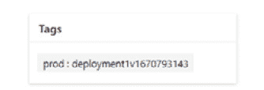

图 9.57 – 托管在线端点标签

每次运行此代码时，都会根据部署时间的纪元生成一个新的部署名称。这确保了对于给定的部署有一个唯一的名称。拥有这个唯一的名称可以确保在部署在线部署时不会发生冲突。在线部署成功后，我们将流量更新到最新的在线部署，然后删除旧的在线部署。此图显示了将部署到托管在线端点的情况：

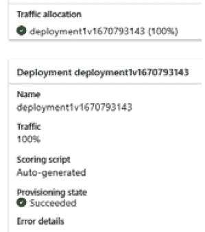

图 9.58 – 将部署到托管在线端点

注意，在图中，在部署名称之后，我们在**v**之前包含模型版本号，以便快速识别给定部署的模型版本。

现在您已审查了代码并执行了笔记本，生成了 Azure DevOps 管道所需的文件，将您的代码检入到远程 origin（现在指向您的 Azure DevOps 仓库）将确保适当的文件已就位以创建您的 Azure DevOps 管道，这是我们流程中的下一步。要检入此代码，您可以运行以下命令：

```py
git status
git add –A
git commit –m "updated"
git push origin main
```

恭喜您 – 您的 Azure DevOps 环境现在已与您的 AML 工作区链接。您已成功完成准备 MLOps 环境所需的步骤。您创建了一个 Azure DevOps 组织和项目。您将代码移动到 Azure DevOps，设置了 Azure 密钥保管库，并将其链接到您的 Azure DevOps 变量组。您还创建了一个 Azure DevOps 环境来处理审批流程。您创建了 Azure DevOps 服务连接，最后，提交了创建和运行 Azure DevOps 管道所需的代码。在下一节中，您将设置 Azure DevOps 管道，这将触发运行 Azure DevOps 管道。

# 运行 Azure DevOps 管道

我们将从这个部分开始创建一个 Azure DevOps 管道。您的 Azure DevOps 管道将在您对代码进行更改并将其推送到**main**分支时启动：

1.  在 Azure DevOps 的左侧面板中，选择**管道**，您将看到以下屏幕：

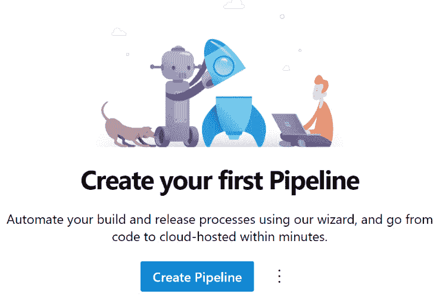

图 9.59 – 创建您的第一个 Azure DevOps 管道

1.  点击**创建管道**按钮开始过程，这将弹出一个窗口：

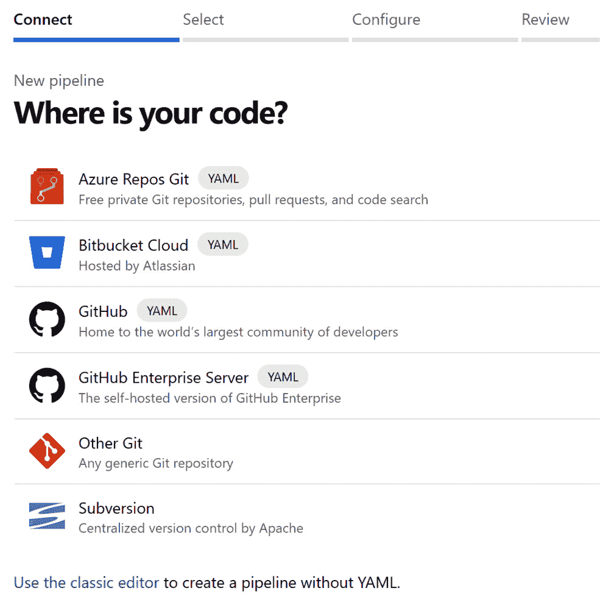

图 9.60 – 选择您的代码位置

1.  在上一节*准备您的 MLOps 环境*中，您将代码放入了 Azure DevOps 中的代码仓库。从前面的屏幕截图中选择**Azure Repos Git**选项，这将要求您选择您的仓库，如图下所示。在此处选择您的**mlops**仓库。

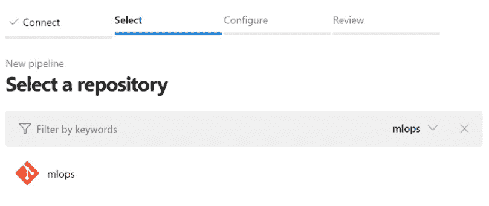

图 9.61 – 选择您的仓库

1.  接下来，选择**现有 Azure 管道 YAML 文件**选项，以使用您通过运行笔记本并将其检入 Git 仓库创建的管道：

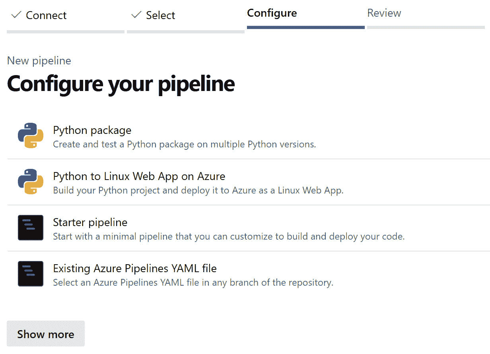

图 9.62 – 配置您的管道

1.  选择此选项将带您进入下一个屏幕，如图所示：

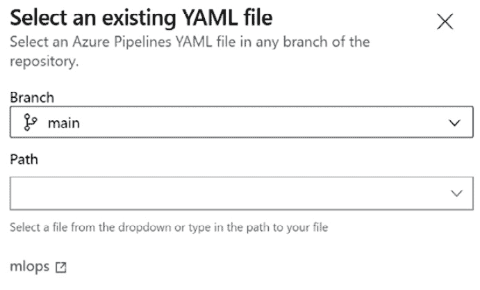

图 9.63 – 选择您的 YAML 文件

1.  在**路径**下拉菜单中，导航到**/Chapter09/src/AzureDevOpsPipeline.yml**文件，如图所示：

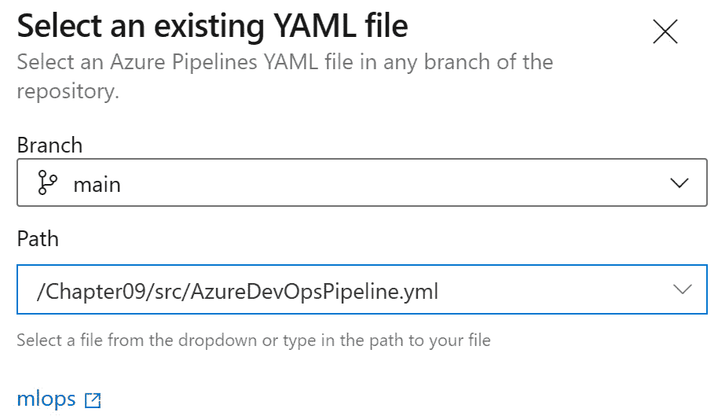

图 9.64 – 获取 AzureDevOpsPipeline.yml 文件的路径

1.  在选择**AzureDevOpsPipeline.yml**文件后，点击**继续**选项。这将显示 Azure DevOps 管道的源代码，如下所示：

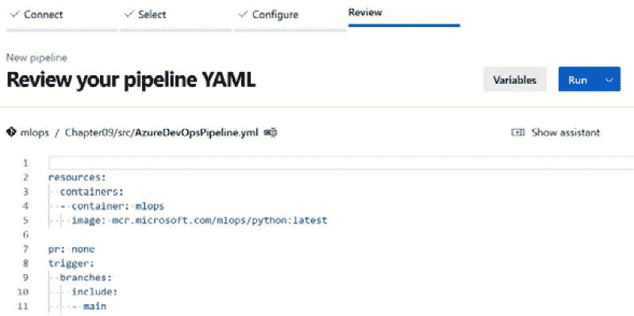

图 9.65 – 获取你的 YAML

在前面的截图中，点击**运行**按钮。当此管道运行时，它将利用你的服务连接。要使用你的服务连接，你需要提供运行权限。

1.  点击`aml-dev`服务连接：

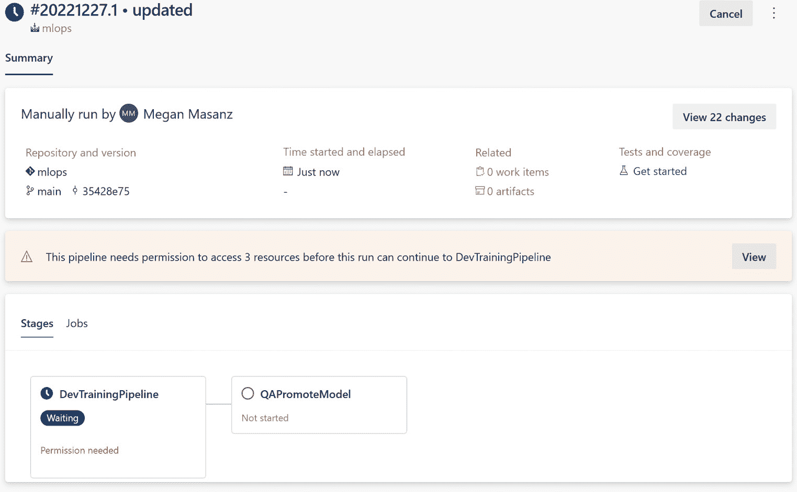

图 9.66 – 向 Azure DevOps 提供权限

1.  在点击**查看**选项后，你将为管道运行提供权限。点击以下截图所示的**允许**按钮：

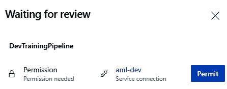

图 9.67 – 允许管道使用服务连接

1.  通过在管道进展过程中为每个所需的权限选择**允许**，提供适当的权限，以便管道可以执行。

1.  当管道执行时，你可以看到显示工作负载正在进行的图标，如下截图所示：

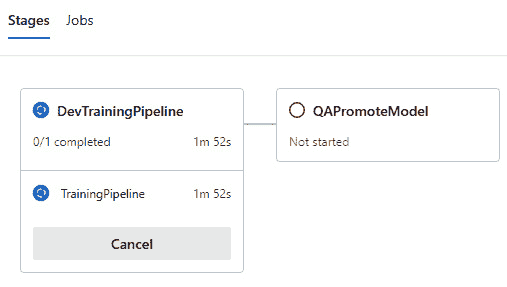

图 9.68 – 管道执行

1.  点击**DevTrainingPipeline**阶段将带你到运行详情，如下所示：

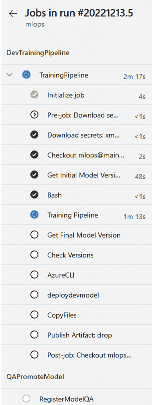

图 9.69 – 管道详情

1.  当初始管道启动时，名为`mmchapter9titanic`的模型可能尚不存在，这取决于你是否从 AML 工作区运行了管道。在这种情况下，在 Azure DevOps 中，如果你点击**获取初始模型版本**任务，你会看到以下错误消息：

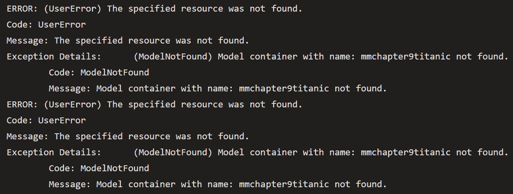

图 9.70 – 初始模型查找

由于模型尚不存在，这是正确的。在这种情况下，我们在管道中将模型版本设置为`0`以继续成功的管道运行。

1.  注意，以下截图显示了将你的 AML 工作区的`dev`实例作为一个管道：

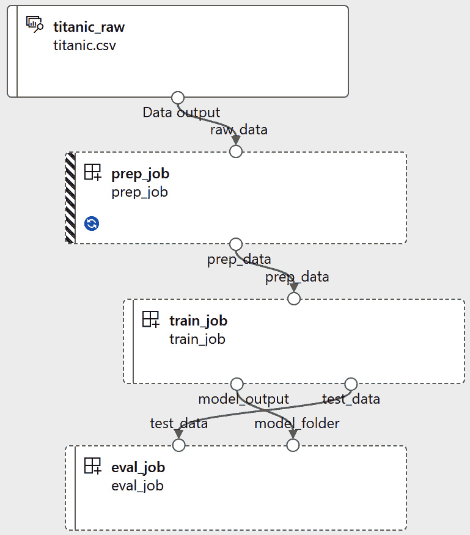

图 9.71 – AML 管道运行

当你的 Azure DevOps 管道遇到`deploydevmodel`时，如果失败，可能是因为你所在区域的端点名称已被占用。如果你在`deploydevmodel`任务上有失败的作业，请查看 Azure DevOps 中的消息内容。它可能会说，**已经存在具有此名称的端点，端点名称必须在区域内唯一。尝试一些** **其他名称**。**

如果是这样，更新你的`.yml`文件以利用不同的端点名称。

在`dev`环境中模型部署完成后，管道将请求批准将模型提升到下一个环境。

一旦`dev`阶段完成，将请求批准，如下所示：

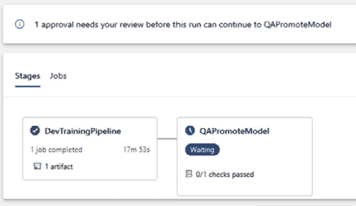

图 9.72 – Azure DevOps 管道请求权限

1.  点击`QAPromote`模型阶段以检索待处理阶段并批准或拒绝将模型移动到`qa`环境。

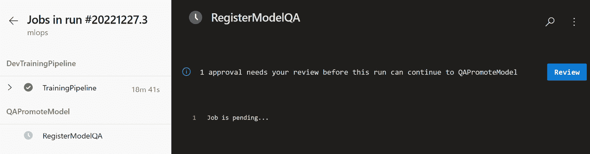

图 9.73 – 待批准的 QA 推广

1.  点击**审查**按钮，您可以选择为模型推广选择**拒绝**或**批准**，如下所示：


图 9.74 – QA 推广批准

一旦 QA 推广获得批准，模型就可以部署到`qa`环境中。

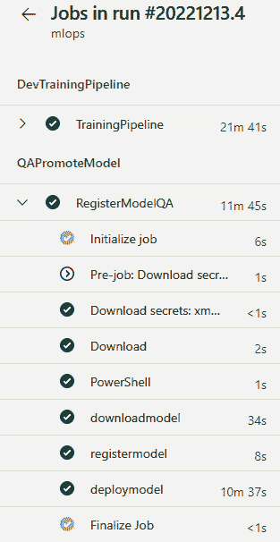

图 9.75 – qa 环境部署

1.  随着您的管道运行，您可以在您的`dev` AML 工作区中审查注册的模型。随着管道的执行，前往您的`qa` AML 工作区，您将看到一个注册的模型，如下所示：

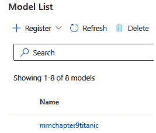

图 9.76 – qa 环境的注册模型

1.  除了注册的模型外，您还可以按以下方式审查您的管理在线端点：

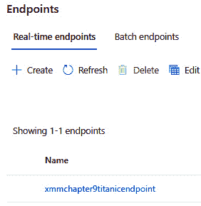

图 9.77 – qa 环境的已部署在线端点

1.  此图展示了在`qa`环境中审查管理的在线端点。点击屏幕上的名称可以为您提供有关管理在线端点的详细信息。

在管理在线端点内部，您将看到您的模型部署实例，如下所示：

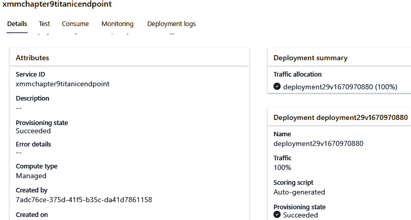

图 9.78 – 在 qa 环境中管理的在线端点部署

1.  部署名称基于纪元。每次在`qa` AML 工作区中部署模型时，都会检查标签属性：

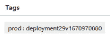

图 9.79 – 管理在线端点的标签属性

如果已部署了模型，它将创建一个新的部署，更新标签，并删除旧部署。这确保了用户在新的端点部署时将经历最小的中断。

在本章中，您通过利用 Azure DevOps 来自动化数据准备、模型开发和模型评估及注册的编排；通过利用蓝/绿部署来部署模型；并将其从一个环境推广到下一个环境。

鼓励您利用您的`dev` AML 工作区，进行代码修改并审查您的 Azure DevOps 管道流程，启动您的`dev` AML 工作区管道，在`qa`环境中注册模型，并更新托管在线端点。现在您已经通过 MLOps 管道部署了托管在线端点，请注意，端点正在使用计算资源。您在不使用它们时应该删除端点以降低成本。恭喜您 – 您已成功实施了一个 MLOps 管道！

# 摘要

在本章中，重点是自动以管理方式部署您的模型作为在线端点以支持实时推理用例。

本章汇集了您在前几章中学到的概念，并介绍了 Azure DevOps 及其所提供的编排。利用 Azure DevOps，代码和部署是可追踪的。Azure DevOps 管道自动化触发`dev`环境管道的编排，将注册的模型移动到更高环境。利用 Azure Key Vault，我们可以安全地保存信息以支持多个环境，并将这些环境链接到您的 Azure DevOps 环境组。通过 MLflow 集成，捕获了在`dev`环境中生成的模型的指标，并将该模型编号注册到更高环境，然后添加到托管在线端点。我们实施了一个 MLOps 管道来自动化数据转换、模型创建、评估和模型部署。

在下一章中，我们将探讨在您的 AML 工作区中利用深度学习。这将是一个利用 AutoML 进行目标检测以解决您的目标检测目标的指南。

# 进一步阅读

如前所述，在本章中，我们试图为您创建自己的 MLOps 管道提供一个基础。我们鼓励您查看两个额外的资源，以使用 AML 构建您的 MLOps 管道：

+   [`github.com/Azure/mlops-v2`](https://github.com/Azure/mlops-v2)

+   [`github.com/microsoft/MLOpsPython`](https://github.com/microsoft/MLOpsPython)

# 第三部分：使用 MLOps 生产化您的作业

在本节中，读者将学习如何将 AMLS 作业与 Azure DevOps 和 Github 集成以实现 MLOps 解决方案。

本节包含以下章节：

+   *第十章*, *在 Azure 机器学习中使用深度学习*

+   *第十一章*, *在 AMLS 中使用分布式训练*
