# 11

# 在 AMLS 中使用分布式训练

一个有趣的话题是我们如何处理大规模数据集以训练机器学习和深度学习模型。例如，大规模基于文本的挖掘、实体提取、情感分析，以及基于图像或视频的，包括图像分类、图像多分类和目标检测，都是非常内存密集型的，需要大量的计算资源来处理，可能需要数小时、有时甚至数周才能完成。

此外，如果您有包含业务信息的大数据，并想构建机器学习模型，那么分布式学习可以帮助您。本章将介绍我们如何使用大型数据集运行大规模模型。您将看到计算大型、分布式模型的不同方法。

有不同的方法来分配计算和数据，以实现大规模训练的更快和更好性能。在这里，我们将了解一些技术。

当有大量可以划分的数据时，数据并行被广泛使用。我们可以运行并行计算以获得更好的性能。基于 CPU 的计算在水平扩展和垂直扩展时也表现良好。目标是对每个分区和组进行计算，例如一个分区，然后应用计算，并在所有分区上并行执行。

模型并行是您可以扩展深度学习建模中模型训练的另一个领域。模型并行高度依赖于计算，并且在大多数情况下，需要基于 GPU 的计算以获得更好的性能和时间。在本章中，我们将探讨可用于在**Azure Machine** **Learning**服务中使用的分布式训练库。

分布式训练主要有两种类型：数据并行和模型并行。

本章将涵盖以下主题：

+   数据并行

+   模型并行

+   使用 PyTorch 进行分布式训练

+   使用 TensorFlow 进行分布式训练

# 技术要求

您可以在此处查看本章所有代码的[`github.com/PacktPublishing/Azure-Machine-Learning-Engineering`](https://github.com/PacktPublishing/Azure-Machine-Learning-Engineering)。

要访问您的 workspace，请回想上一章中的步骤：

1.  前往[`ml.azure.com`](https://ml.azure.com)。

1.  从已创建的内容中选择您的工作空间名称。

1.  从工作空间用户界面，在左侧，点击**Compute**。

1.  在**Compute**屏幕上，选择您最后使用的计算实例，并选择**Start**。

1.  您的计算实例将从**Stopped**变为**Starting**。

1.  在上一章中，我们已克隆了本书的 GitHub 仓库。如果您尚未这样做，请继续按照提供的步骤操作。如果您已经克隆了仓库，请跳转到*步骤 9*。

1.  在您的计算实例上打开终端。请注意，路径将包括您的用户目录。在您的终端中输入以下内容以将示例笔记本克隆到工作目录中：

    ```py
    git clone https://github.com/PacktPublishing/Azure-Machine-Learning-Engineering.git
    ```

1.  点击刷新图标。

1.  现在，创建一个名为`gpu-cluster`的计算集群，包含两个节点，并选择一个可用的 GPU 虚拟机，例如 NC6 或 NC24 系列。

1.  查阅您`Azure-Machine-Learning-Engineering`目录中的笔记本。

# 数据并行

当有大量可以划分的数据时，数据并行被广泛使用。我们可以运行并行计算以获得更好的性能。当水平或垂直扩展时，基于 CPU 的计算也表现良好。目标是对每个分区和组进行计算，例如一个分区，然后应用计算，并在所有分区上并行执行。

# 模型并行

模型并行是另一种在深度学习建模中扩展模型训练的方法。模型并行主要基于计算，在大多数情况下，需要基于 GPU 的计算以获得更好的性能和时间。让我们看看在 Azure Machine Learning 服务中可用的分布式训练库。

在 Azure Machine Learning 中，我们可以以多种方式执行分布式学习：

+   **使用 PyTorch 进行分布式训练**：PyTorch 是用于大规模视觉、文本和其他非结构化数据机器学习最知名和最广泛使用的机器学习库之一。它使用深度学习，如卷积神经网络或循环神经网络进行开发。PyTorch 是由 Meta（Facebook）开发的深度学习框架。

PyTorch 的实现非常简单且易于使用，并且倾向于消除市场上其他库的复杂性。

+   **使用 TensorFlow 进行分布式训练**：TensorFlow 是由谷歌创建的深度学习库。鉴于科学研究的难度，它被设计成使深度学习开发变得简单且易于实现。在初期阶段，TensorFlow 的实现非常困难，需要大量的代码行。随后，为了简化这一过程，创建了一个名为 Keras 的项目；然后，它们被合并在一起。

与旧版本相比，最新版本要简单得多，使用起来也更方便。我们刚刚介绍了在深度学习领域用于分布式学习的最流行的框架。

注意

上述两种 SDK 都在持续开发和改进中，并且由于人工智能领域和算法数量的增长，总是会有新的功能被添加。

# 使用 PyTorch 进行分布式训练

在本章中，我们将学习如何在执行深度学习模型训练之前使用 PyTorch，然后再在多个核心中分布训练并在其上运行。

让我们看看如何编写一些简单的 PyTorch 代码，这些代码可以在 Azure Machine Learning 中运行。

# 分布式训练代码

在本节中，我们将学习如何编写代码以使用 PyTorch 框架进行基于视觉的深度学习算法的分布式训练。我们将使用 Python 代码来创建模型，然后使用计算集群对其进行训练。所有代码都可在本书的 GitHub 仓库中找到，用于学习和执行。

## 创建用于处理的训练作业 Python 文件

按照以下步骤创建数据集，同时利用用户界面：

1.  前往 [`ml.azure.com`](https://ml.azure.com) 并选择你的工作区。

1.  前往 **Compute** 并点击 **Start** 以启动计算实例。

1.  等待计算实例启动；然后，点击 **Jupyter** 开始编码。

1.  如果你没有计算集群，请遵循前几章中的说明来创建一个新的集群。具有 CPU 的计算实例适合开发；我们将使用基于 GPU 的内容进行模型训练。

1.  如果你的 GPU 配额不足，请在 Azure 门户中创建一个服务票证来增加你的配额。

1.  现在，为这一章创建一个新文件夹。我将其命名为 `Chapter 11`。同时，创建一个名为 `PyTorchDistributed` 的子文件夹。

1.  在内部，我还在 `src` 文件夹中创建了一个新目录，其中将存储所有 Python 训练文件。`PyTorchDistributed` 文件夹（`root` 文件夹）将用于提交 Python 文件。

我们可以使用终端来运行我们的 Python 代码。

1.  现在，我们需要编写我们的训练代码。因此，导航到 `src` 文件夹并创建一个名为 `train.py` 的新文本文件。

1.  对于本章的示例代码，我们将使用一个开源数据集；它没有 **个人身份信息**（**PII**）或隐私或法律问题。

1.  让我们导入代码所需的全部库：

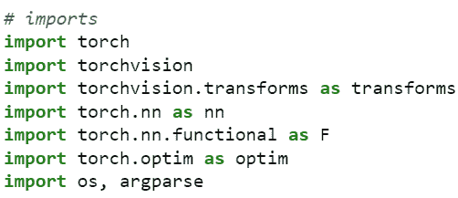

图 11.1 – 库导入

1.  接下来，我们必须创建神经网络架构。神经网络架构是用于训练以创建大脑的。根据所需的准确性，你可以根据所需的层数来构建你的网络。神经网络架构不是本书的重点，但有很多资源可用于设计一个：

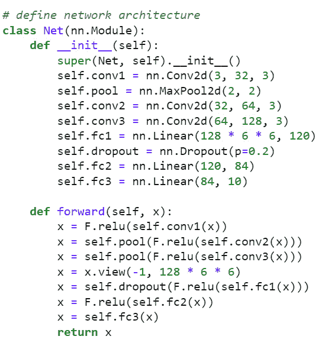

图 11.2 – 神经网络架构

1.  现在，让我们编写训练代码：

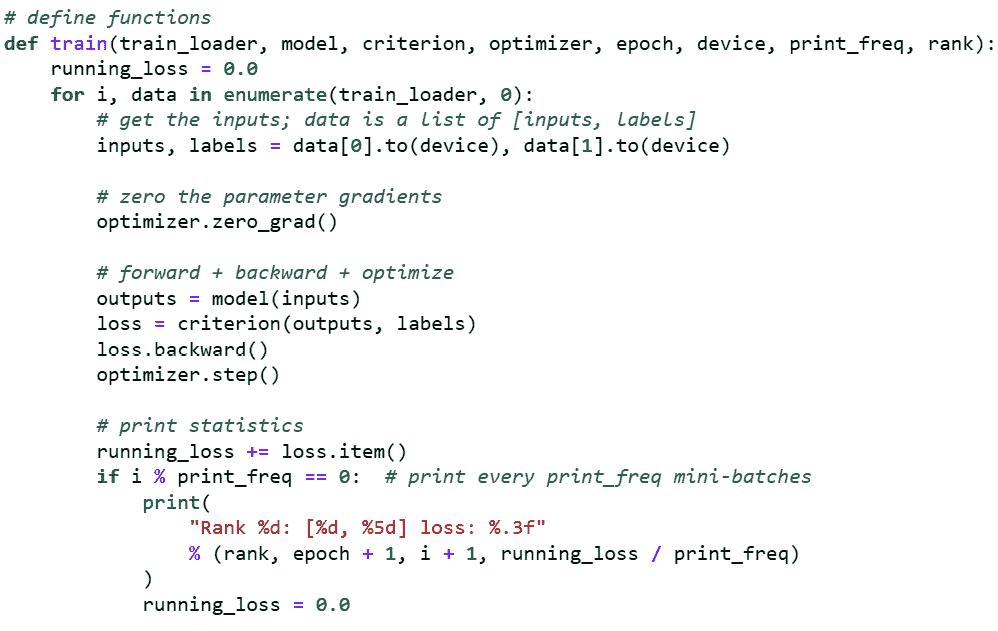

图 11.3 – 训练代码

1.  接下来，我们将评估模型指标。模型评估是训练过程中的一个重要步骤，因为它验证了模型在准确性方面的性能：

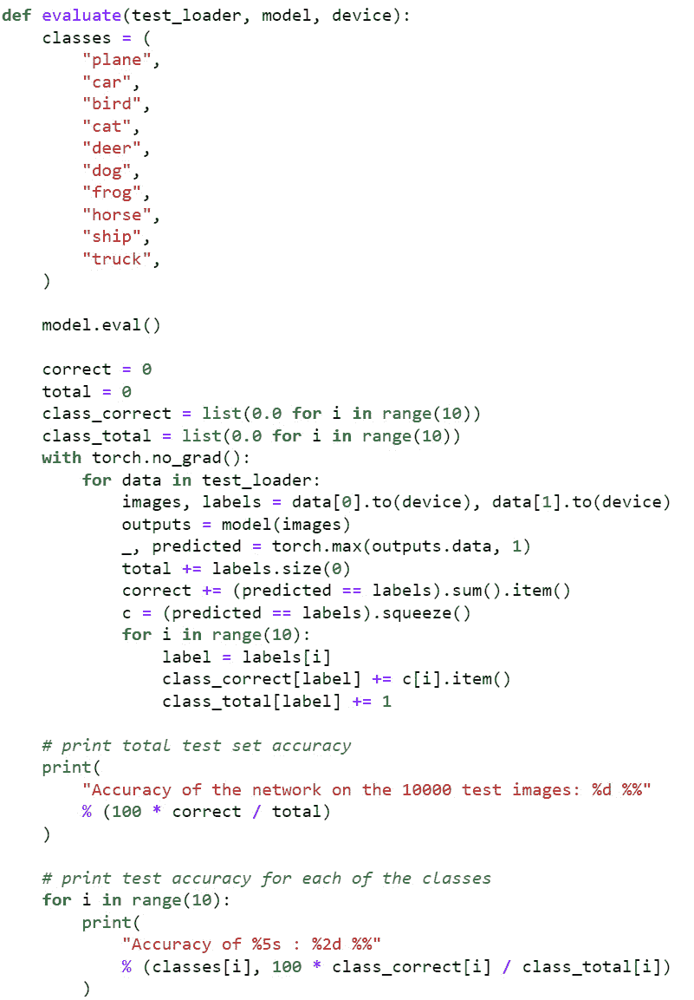

图 11.4 – 评估代码

1.  接下来，我们需要创建一个 `main` 函数，该函数将收集模型所需的数据，然后调用 `main` 函数并开始处理训练代码。然后，它将评估模型。请参阅以下示例代码以获取详细信息：

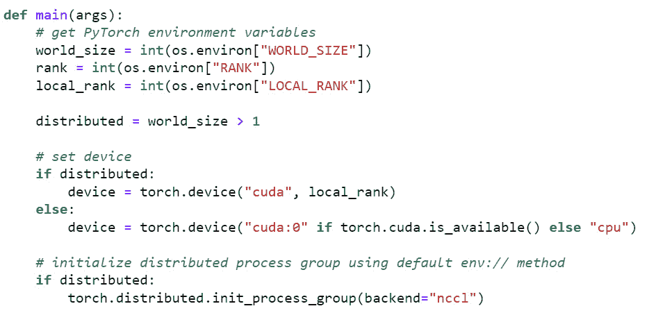

图 11.5 – 示例主代码

这是指定分布式数据集的代码：

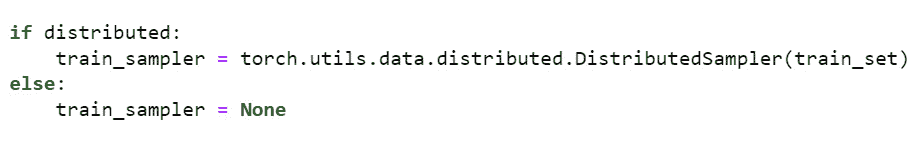

图 11.6 – 分布式数据集代码

这就是模型分布的地方：

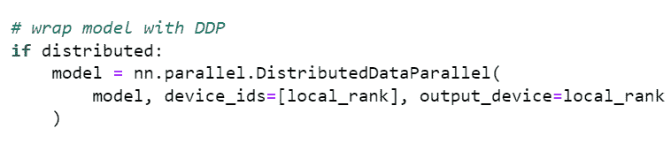

图 11.7 – 模型分布代码

1.  接下来，我们将创建一个 `job.py` 文件，下载实验所需的数据。

1.  现在，让我们创建一个数据集，用于进一步的训练过程。此数据集将调用分布式训练所需的计算集群。以下示例代码调用工作区并获取数据集：

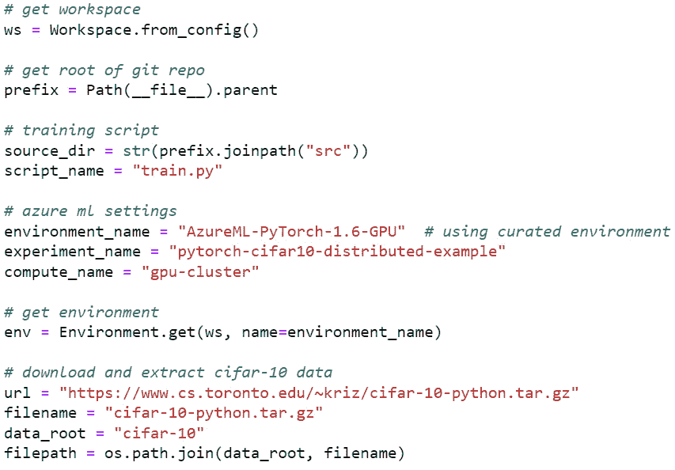

图 11.8 – 作业文件数据集代码

以下代码并行化训练过程：

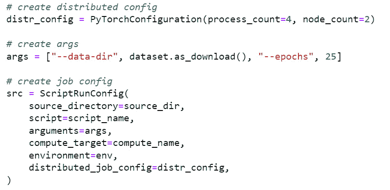

图 11.9 – 作业文件调用分布式训练

1.  如前述截图所示，代码在模型训练期间进行分布，此过程非常简单。`PyTorchConfiguration`，连同 `process_count` 和 `node_count`，是我们必须提供的配置，以分布模型训练过程。

`PyTorchConfiguration` 拥有三个参数：

1.  `communication_backend`：这可以设置为 `Nccl` 或 `Gloo`。默认选择 `Nccl`。

1.  `process_count`：此参数配置节点内并行化目的的进程数量。

1.  `node_count`：这是指定作业使用多少节点的地方。`node` 是基于可用的核心数量。节点数量越多，处理速度越快。

1.  运行作业并等待其完成。一旦提交作业，导航到你的工作区用户界面，点击 **作业**，然后转到 **详情** 以查看其工作原理。

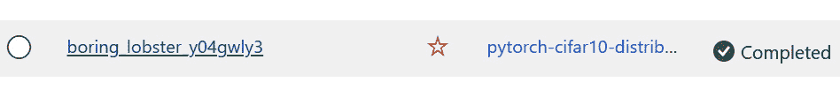

图 11.10 – 作业输出

在本节中，我们学习了如何使用 PyTorch 框架运行分布式训练，以对大型数据集进行基于视觉的自定义深度学习建模。

现在，我们将查看 TensorFlow 框架，并了解如何使用大数据集实现自定义视觉深度学习模型的分布式学习。

# TensorFlow 的分布式训练

在本节中，我们将学习如何使用 TensorFlow 构建自定义深度学习模型，如目标检测或图像分类，并处理大图像文件。通过这样做，我们将学习如何跨多个虚拟机分布，以实现训练性能的更快提升。

## 创建用于处理的训练作业 Python 文件

按照以下步骤创建利用用户界面的数据集：

1.  访问 [`ml.azure.com`](https://ml.azure.com) 并选择你的工作区。

1.  前往 **计算** 并点击 **启动** 以启动计算实例。

1.  等待计算实例启动；然后，点击 **Jupyter** 开始编码。

1.  如果你没有计算集群，请遵循前几章中的说明来创建一个新的集群。具有 CPU 的计算实例适合开发；我们将使用基于 GPU 的内容进行模型训练。

1.  如果你没有足够的 GPU 配额，请在 Azure 门户中创建一个服务票证来增加你的配额。

1.  现在，为这一章创建一个新的文件夹。我正在创建一个名为 `Chapter 11` 的文件夹。然后，创建一个名为 `TensorflowDistributed` 的子文件夹。

1.  在内部，我还在 `src` 文件夹中创建了一个新的目录，所有训练文件都将存储在这里。`TensorflowDistributed`（根文件夹）将用于提交 Python 文件。如果 `TensorflowDistributed` 文件夹不存在，请创建一个。从 *步骤 6* 开始，在 `Chapter 11` 文件夹下创建前面的文件夹。

我们可以使用终端来运行我们的 Python 代码。

1.  现在，我们需要编写我们的训练代码。因此，导航到 `src` 文件夹并创建一个名为 `train.py` 的新文本文件。

1.  对于本章的示例代码，我们使用了一个开源数据集；它不包含任何个人身份信息（PII），也没有任何隐私或法律问题。

1.  让我们导入代码所需的全部库：

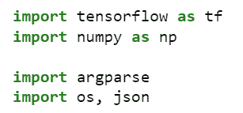

图 11.11 – 库导入

1.  接下来，我们必须执行数据集处理：

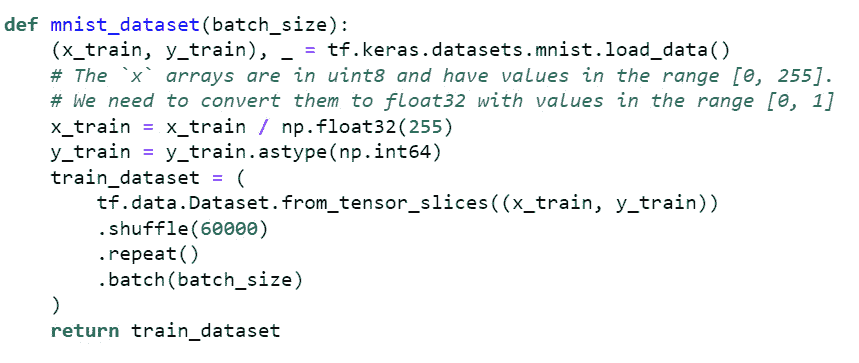

图 11.12 – 数据集处理

1.  现在，让我们创建一个模型。我们将使用 Keras 库来简化神经网络架构。层取决于你的用例和精度。我见过大型网络架构精度低且层数过少导致结果不佳。因此，我们必须通过实验找到层的正确平衡，并据此构建神经网络架构：

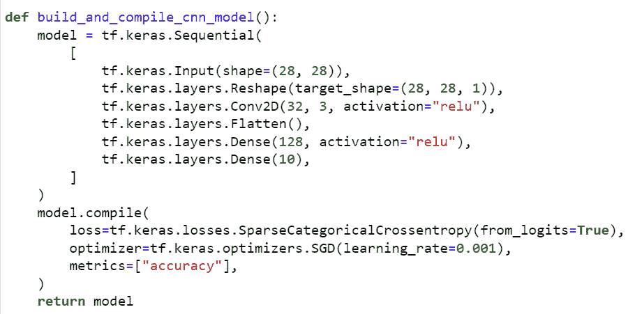

图 11.13 – 模型神经网络

1.  现在，让我们创建一个 `main` 函数，它将以分布式方式运行模型训练过程。`main` 函数是所有逻辑流程汇聚在一起以使训练过程工作的地方。正如你所见，`tf.distribute` 指定了分布策略：

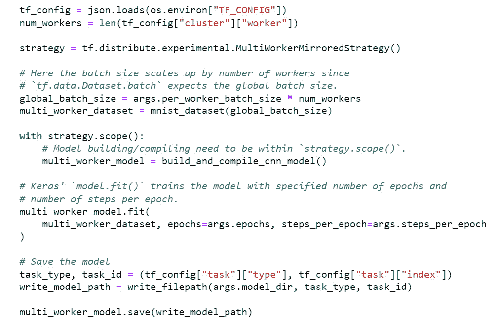

图 11.14 – TensorFlow 分布式代码

`Tf.distribute.experimental.MultiWorkerMirroredStrategy` 同步地在工作节点之间复制所有变量和计算以进行处理。它主要使用 GPU（考虑到大规模处理）。前面的实现允许多个工作节点协同工作以实现更好的性能，从而更快地完成训练运行。

1.  接下来，我们将在根文件夹中创建一些名为 `job` 的 Python 代码，我们将在终端窗口中执行这些代码以在命令行中执行 TensorFlow 代码。

1.  现在，我们必须创建一个 `environment.yaml` 文件。这将创建运行模型训练的环境。以下是示例代码：

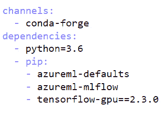

图 11.15 – environment.yaml 代码

1.  接下来，我们必须创建`jobtensorflow.py`文件，该文件使用 Azure Machine Learning SDK 来配置训练过程，并在作业提交后执行它。

1.  在`code`部分，指定要使用的作业空间环境和用于实验的训练 Python 文件。您需要做出一些更改才能执行代码。作业空间、环境和训练 Python 文件的名字可能会根据您的实现方式而改变：

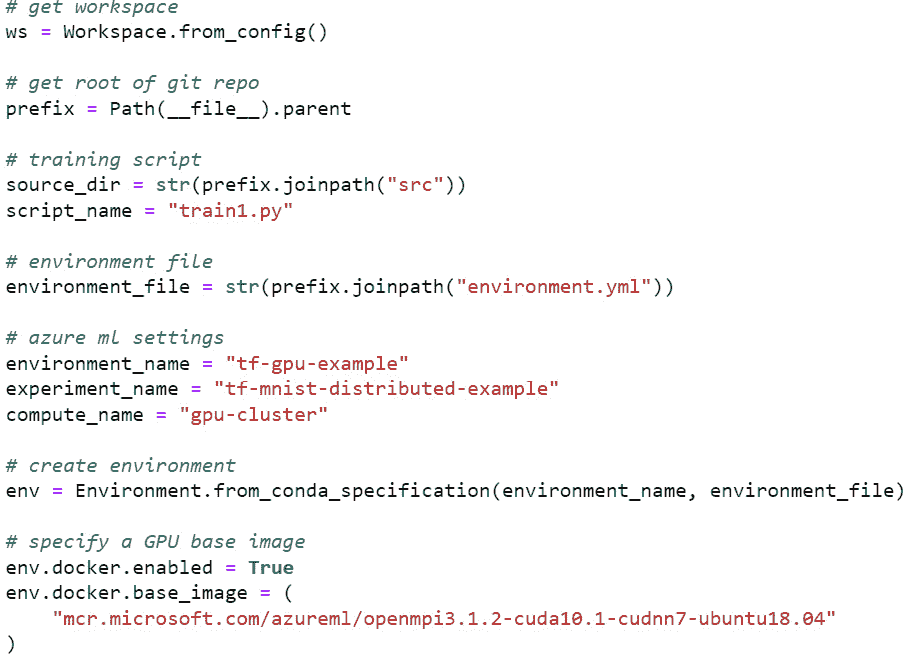

图 11.16 – 示例环境和实验

1.  接下来，我们必须编写一些代码来设置分布策略，然后调用训练实验。我们可以使用`TensorflowConfiguration`类来配置如何并行化训练任务。

`TensorflowConfiguration`接受两个参数，如下所示：

1.  `worker_count`：用于并行化的工作节点数量。默认值为`1`。

1.  `parameter_server_count`：此参数用于设置运行先前`worker_count`所需的任务数量：

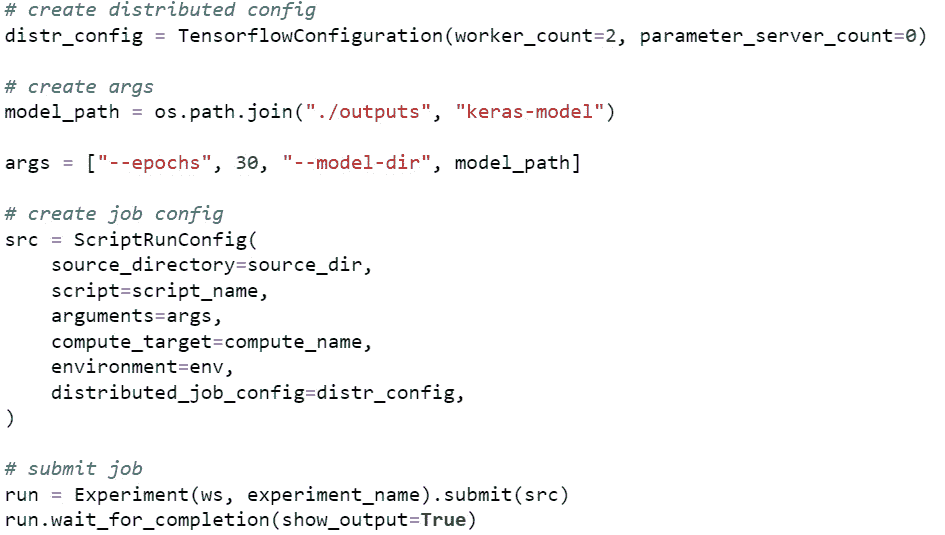

图 11.17 – 分布策略和作业提交

1.  等待实验运行。这需要几分钟到几小时，具体取决于数据集的大小。一旦实验完成运行，导航到您的工作空间用户界面，转到**作业**部分，选择作业以查看其输出：

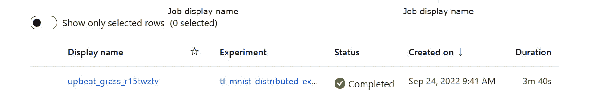

图 11.18 – 作业输出

在本节中，您学习了如何创建代码，该代码将运行大规模 TensorFlow 分布式训练，用于大型基于自定义视觉的深度学习模型。代码结构旨在长时间运行，并报告日志以便我们检查和验证。这些作业可以作为批量作业提交，这样我们就不必持续监视发生了什么。相反，我们可以提交作业，几小时后再回来查看模型运行的表现。

# 摘要

在本章中，我们涵盖了众多主题。我们学习了如何使用 Azure Machine Learning 服务的 Python SDK 创建代码来分发 PyTorch 和 TensorFlow 深度学习模型。我们还看到了通过大量数据分布模型训练来构建代码的简便性和无缝性。

本章的目标是向您展示如何构建无缝的代码，通过批量处理执行大规模模型，而无需您监视其运行。Azure Machine Learning SDK 允许我们提交作业，然后稍后回来检查输出。

这是本书的最后一章；希望您在阅读和学习 Azure 机器学习以及如何构建机器学习模型的过程中度过了一段美好的时光。我们很乐意了解您在组织中应用机器学习或深度学习时的经验。考虑到开源，Azure 机器学习将使您的旅程变得简单而轻松。

非常感谢您阅读这本书。这本书将帮助您为以下认证考试做准备，例如 AI 102（AI 工程师 – 训练 | 微软学习：[`learn.microsoft.com/en-us/certifications/roles/ai-engineer`](https://learn.microsoft.com/en-us/certifications/roles/ai-engineer)）和 DP 100（考试 DP-100：在 Azure 上设计和实现数据科学解决方案 – 认证 | 微软学习：[`learn.microsoft.com/en-us/certifications/exams/dp-100`](https://learn.microsoft.com/en-us/certifications/exams/dp-100)）。
