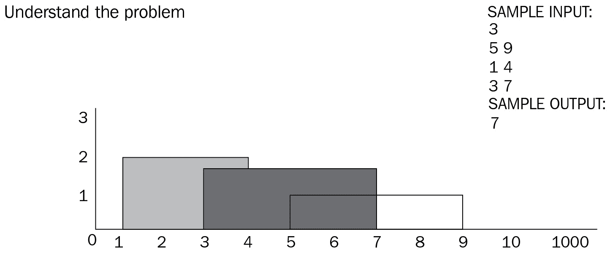

# 掌握 Python 编程

在我们训练机器学习之前，我们需要教它一种语言。计算机非常擅长二进制代码，因为它们被创造出来就是要在 0 和 1 之间操作。人类发明了一种语言编译器，将高级语言（如 Python）程序编译成二进制代码，以便计算机可以运行它。Python 是一种直观的高级语言，它的语法非常简化，类似于自然语言。Python 在解决计算机编程问题中得到了广泛应用，尤其是在**机器学习**（**ML**）领域。

在本章中，我们将从一个简单的数学问题开始，展示 Python 如何直接且简洁地解决它。理解解决方案将帮助我们理解 Python 基础知识，包括变量、数据结构、条件和控制。然后，我们将介绍 Python 的数据处理包，包括用于数据操作的 NumPy 和 Pandas，以及用于数据可视化的 Matplotlib 和 Seaborn。

Python 是一种编程语言，练习是掌握这门语言的重要组成部分。在本书的*附录 1*中，我们提供了一个使用 Python 数据处理包的逐步指南。练习这些步骤对于掌握 Python 技能至关重要。

本章将涵盖以下主题：

+   Python 的基础知识

+   Python 数据库和包

在我们开始之前，让我们看看本章的先决条件。

# 技术要求

要遵循本章的说明，请确保您已经设置了 Google Colab，这是谷歌研究的一个产品，允许程序员通过浏览器编写和执行 Python 代码（[`colab.research.google.com`](https://colab.research.google.com)）。Colab 非常适合机器学习和数据分析，我们将使用它来运行本章的基本 Python 代码。让我们开始吧！

# Python 的基础知识

我们将通过一个简单的鸡蛋计数问题来介绍 Python 编程的基础知识。

一个大篮子里不到 2,000 个鸡蛋。假设我们每次拿两个鸡蛋一组，这样篮子里最后会剩下 1 个鸡蛋。这里我们有以下情况：

+   如果用 3 人一组，会剩下 0 人。

+   如果用 4 人一组，会剩下 1 人。

+   如果用 5 人一组，会剩下 4 人。

+   如果用 6 人一组，会剩下 3 人。

+   如果用 7 人一组，会剩下 0 人。

+   如果用 8 人一组，会剩下 1 人。

+   如果用 9 人一组，会剩下 0 人。

那么，桶里有多少个鸡蛋？

让我们看看使用 Python 编程解决这个问题的一个解决方案：

```py
for i in range (1, 2001, 2):
      if ( ((i % 3) == 0) and ((i % 4) == 1) and ((i % 5) == 4) and ((i % 6) == 3) and ((i % 7) == 0) and ((i % 8) == 1) and  ((i % 9) == 0) ):
      print("Total number of eggs in the bucket can be %d" %i)
```

如您所见，我们告诉计算机尝试 1 到 2,000 之间的每个奇数（为什么？），并测试它是否满足问题中指定的所有条件。如果对于某个特定的数字，所有条件都满足，那么我们就打印出这个数字。当检查了所有奇数后，满足条件的数字就会被打印出来。这真是一件 neat 的事情！

在 Colab 上执行前面的程序会产生以下输出：

```py
Total number of eggs in the bucket can be 1449
```

如果我们更仔细地检查 Python 程序，我们可以观察到以下情况：我们使用`i`作为变量，每次分配一个奇数，在`1`和`2000`之间，我们使用`for`子句构建一个循环，该循环重复检查`i`的值是否满足条件（`if`子句），如果满足则打印该值。变量及其操作、`if`子句和`for`子句是 Python 的基础。接下来，我们将检查 Python 中的这些基本概念。

## 基本 Python 变量和操作

编程语言使用变量。Python 变量是计算机中预留的内存位置，用于存储值——也就是说，Python 程序中的变量为计算机提供数据以进行处理。Python 中的每个值都有一个数据类型。将数据放入变量的动作称为**赋值**。创建变量后调用变量的动作称为**使用变量**。

例如，以下操作是 *赋值*：


表 2.1 – Python 变量赋值

以下操作是 *使用变量*：


表 2.2 – Python 使用变量

为了进一步了解变量的数据类型及其操作，让我们运行一些使用 Colab 的小型 Python 代码片段：

```py
x = int(2.8)        
print(x) 
2 
z = str(3.0)    
z = float(z) 
z = int(z/2)       
z = z * 4.5
print(z)
4.5
z = z ** x
print (z)
20.25
y = float("3")     
a = (x==y)
print (a)
False
b = ((z==z) and (a != x))
print (b)
True
```

请在此处稍作停留，确保您理解了前面的代码片段是如何执行以获得结果的。

对于 Python 变量，我们可以使用数学运算对它们进行操作。以下表格列出了 Python 变量的算术运算：


表 2.3 – Python 算术运算

以下表格列出了 Python 变量的布尔运算：


表 2.4 – Python 布尔运算

以下表格列出了 Python 变量的逻辑运算：


表 2.5 – Python 逻辑运算

现在我们已经介绍了 Python 变量及其基本操作，让我们看看 Python 的基本数据结构和控制操作。

## 基本 Python 数据结构

Python 有五种基本数据类型：

+   数字

+   字符串

+   列表

+   元组

+   字典

由于我们已经涵盖了数字和字符串，因此在这里我们将介绍 **列表**、**元组**和**字典**：

+   一个 `[ ]`。以下是一个示例：

    ```py
    ints = [10, 20, 30, 40]
    words = ["flower", "soil", "water"]
    mix = ["flower", -3.2, True, 6]  
    empty_list = []
    floats = [4.7, -6.0, 0.22, 1.6]
    ```

列表的基本操作如下表所示：


表 2.6 – Python 列表操作

+   一个 `()`。以下是一个示例：

    ```py
    coordinates = (1, 2, 3)
    ```

+   一个 `{}`，字典中的键值对由逗号（`,`）分隔。每个键与其值由冒号（`:`）分隔。以下是一个示例：

    ```py
    person = {'name': 'Lini', 'year': 1989, 'expertise': 'data analytics'}
    ```

## Python 条件和循环

Python 程序需要根据条件做出决策，如下所示：

+   **if**（条件）**else**（动作）

+   **while**（条件）**do**（动作循环）

+   **for**（条件）**do**（动作循环）

正如你在鸡蛋计数程序中看到的，它包含一个`for`循环和`if`语句：

```py
for i in range (1, 2001, 2):
    if ( ((i %for  3) == 0) and ((i % 4) == 1) and ((i % 5) == 4) and ((i % 6) == 3) and ((i % 7) == 0) and ((i % 8) == 1) and  ((i % 9) == 0) ):
    print («Total number of eggs is %d» %i)
```

通过`for`循环和`if`语句解决了问题。这些控制语句管理 Python 程序中的逻辑流程。

## Python 函数

Python 函数在程序中有两个部分：**函数定义**和**函数调用**。首先定义一个函数，然后调用定义好的函数。让我们通过一个例子来解释函数定义和调用：

+   **问题**：找出 1 到 100 之间的所有质数

+   **解决方案**：使用 Python 函数

下面是如何使用函数定义和调用来解决给定问题的示例：

1.  *函数 1*接受一个数字并检查它是否是质数：

    ```py
    def Prime(Number):
    for i in range(2, (int(math.sqrt(Number))+1)):
               if(Number % i == 0):
                      return 0
               else:
                      continue
               return 1
    ```

1.  *函数 2*查找并返回`a`和`b`整数之间的所有质数。对于`a`和`b`之间的每个整数，它通过调用*函数 1*来检查它是否是质数。如果是，则将其添加到列表中。最后，返回列表：

    ```py
    def PNlist(a,b):
               list=[]
              for Number in range (a, b):
                 if (Prime(Number)==1):
                     list.append(Number)
              return list
    ```

1.  `main()`程序查找并返回`1`到`100`之间的所有质数：

    ```py
    list1=PNlist(1,100)
    print(list1)
    ```

如你所见，当计算机执行主程序时，它将调用*函数 2*，`PNlist(1,100)`，来检查`1`到`100`之间的数字：对于每个数字，它将调用*函数 1*，`Prime(number)`，来查看它是否是质数——如果是，它将被放入列表中。最后，`main()`程序打印出质数列表。

## 在 Python 中打开和关闭文件

以下 Python 代码打开一个输入文件并从用户输入中读取：

1.  只读方式打开名为`“lifeguards.in”`的文件。

1.  读取文件中的一行。

1.  将读取的文本转换为整数：

    ```py
     f1=open("lifeguards.in", "r")
     n1=f1.readline()
     n=int(n1)
     f1.close
    ```

以下 Python 代码块计算答案，将其写入输出文件，并关闭文件：

```py
  answer=n*(n+1)/2
  f2=open("lifeguards.out", "w")
  f2.write(str(answer))
  f2.close
```

现在我们已经了解了 Python 的基础知识，让我们利用我们迄今为止学到的知识和技能来解决一个有趣的问题。

## 一个有趣的问题

在本节中，我们将使用我们迄今为止学到的基本 Python 知识和技能来解决美国计算机奥林匹克竞赛问题（来源：[`www.usaco.org/index.php?page=viewproblem2&cpid=784`](http://www.usaco.org/index.php?page=viewproblem2&cpid=784)）。

农夫约翰开设了一个游泳池，并雇佣了*N*头牛作为救生员，每头牛在一天中的某个连续时间段内值班。为了简单起见，游泳池每天从`t=0`到`t=1000`开放，每个班次可以用两个整数来描述——开始和结束时间。例如，一个救生员从`t=4`开始到`t=7`结束，覆盖了三个时间单位。不幸的是，约翰超出了预算，必须解雇一头牛。剩余的救生员班次能覆盖的最大时间是多少？如果至少有一名救生员在场，则时间区间被覆盖。让我们看看：

+   **输入**

输入的第一行包含*N (1≤N≤100)*。接下来的*N*行描述了救生员，以两个介于`0`和`1000`之间的整数来表示救生员的工作开始/结束点。所有这些端点都是唯一的。不同救生员的工作时间可能重叠。

+   **输出**

写一个数字，指定如果农夫约翰发射`1`个救生员，还能覆盖的最大时间量：

```py
SAMPLE INPUT:
3
5 9
1 4
3 7
SAMPLE OUTPUT:
7
```

让我们看看以下图表来理解这个问题：



图 2.7 – 理解示例输入和输出

上述图表显示了示例输入和输出。在这里，我们可以看到有三个救生员，他们的时间覆盖范围分别是 5-9，1-4 和 3-7。如果我们移除第一个救生员，剩余的覆盖范围将是 1-7，即 6。如果我们移除第二个救生员，剩余的覆盖范围将是 3-9，等于 6。如果我们移除第三个救生员，剩余的覆盖范围将是 1-4 和 5-9，等于 7。所以，逐个移除一个救生员时的最大覆盖范围是*max(6,6,7)=7*。

理解这个示例有助于我们思考解决方案。我们需要通过逐个移除一个救生员来比较剩余的覆盖范围，找出最大的覆盖范围。最简单的方法是使用穷举法和 Python 列表。以下是一个使用 Python 的解决方案：

1.  声明/初始化变量和数组：

    ```py
    start=[0 for i in range(1001)]
    end=[0 for i in range(1001)]
    cover=[0 for i in range(1001)]
    cover1=[0 for i in range(1001)]
    ```

1.  打开输入文件并读取输入数据：

    ```py
    f1 = open("lifeguards.in", "r")
    n=f1.readline()
    n=int(n)
    ```

1.  读取数据并将其分配给变量（`start[i]`和`end[i]`是救生员`i`的工作开始/结束时间）：

    ```py
    for i in range(1, n+1):
      a,b=f1.readline().split()
      a=int(a)
      b=int(b)
      start[i]=a
      end[i]=b
    ```

1.  使用一个新的列表来记录时间`j`的总救生员覆盖范围：

    ```py
     for j in range (a, b):
         cover[j] += 1
     f1.close()
    ```

1.  逐个移除一个救生员，比较最大覆盖范围，并获取最大值：

    ```py
    answer=0
    for i in range (1, n+1):
         for j in range (1, 1000):
         cover1[j]=cover[j]
         max = 0
         for j in range (int(start[i]), int(end[i])):
          cover1[j] -= 1
     for k in range (1, 1000):
              if (cover1[k] > 0): max=max+1
          if (answer < max):
          answer = max
    ```

1.  打开输出文件，将其中的输出数据写入，然后关闭文件：

    ```py
    f2 = open("lifeguards.out", "w")
    f2.write(str(answer))
    F2.close()
    ```

尽管这个问题有多个解决方案，但这个解决方案展示了处理问题的简单和逻辑方法。它有助于 Python 初学者跟随和学习解决问题所需的逻辑和技能。

# Python 数据库和包

如我们之前提到的，Python 有五种标准数据类型：数字、字符串、列表、元组和字典。使用这些数据结构，Python 可以处理许多任务。为了扩展其数据操作和可视化的能力，创建了 Python 库和包。我们将简要介绍四个库：**NumPy**、**Pandas**、**Matplotlib**和**Seaborn**。

## NumPy

NumPy 代表**数值 Python**。它是 Python 的一个基础库，是一个通用的数组处理包。NumPy 在基本和高级数组操作方面非常出色。它用于处理存储相同数据类型值的数组。

## Pandas

`Pandas` 被认为是可用的最强大和灵活的开源数据分析和管理工具。它是一个针对数据操作和分析进行优化的 Python 库。特别是，它提供了用于操作多维数据数组的结构和操作。Pandas 包含 Series 和 DataFrame 数据结构。Series 数据结构用于存储 1D 数组（或向量）的数据元素，而 DataFrame 是用于存储和操作 2D 数组的 Pandas 数据结构。在实践中，我们通常将其视为电子表格。Pandas 还有一套强大的绘图函数，我们也将用于数据集可视化。Pandas 的绘图功能可以在 `plotting` 模块中找到。

## Matplotlib

Matplotlib 是用于 Python 数据可视化的图形包。它是 Python 编程语言及其数值数学扩展 NumPy 的绘图库，并且与 NumPy 和 Pandas 集成良好。

## Seaborn

在 Matplotlib 的基础上，Seaborn 是一个用于数据可视化和探索性数据分析的开源 Python 库。Seaborn 与 Pandas DataFrames 一起工作，并支持内置的 Python 类型，如列表和字典。大多数 Seaborn 函数都支持来自 Pandas 和 NumPy 库的对象。

# 摘要

在本章中，我们回顾了 Python 基础知识，包括变量、数据结构、条件和循环语句，以及各种 Python 数据库。理解本章中的 Python 代码片段并完成 *附录 2*，*使用 Python 数据库练习* 中的示例至关重要，我们在其中提供了示例来帮助您逐步练习使用 Python 数据库。通过这样做，您可以使用 Google Colab 开发 Python 代码。

现在我们已经建立了 GCP 和 Python 的基础，是时候总结本书的 *第一部分* 了。在 *第二部分* 中，我们将探讨机器学习过程，包括问题定义、数据准备和特征工程、机器学习模型开发、神经网络和深度学习。在下一章中，我们将探讨机器学习问题定义。

# 进一步阅读

要了解更多关于本章所涵盖的主题，请参阅以下资源：

+   [Colab](https://colab.research.google.com/?utm_source=scs-index)

+   [Colab](https://colab.research.google.com/github/cs231n/cs231n.github.io/blob/master/python-colab.ipynb)

+   [Python 编程语言](https://www.geeksforgeeks.org/python-programming-language/)

+   [2021 年数据科学领域前 10 个 Python 库](https://www.geeksforgeeks.org/top-10-python-libraries-for-data-science-in-2021/)

+   *附录 2*，*使用 Python 数据库练习*

# 第二部分：介绍机器学习

本部分介绍了机器学习（ML）的概念。我们首先介绍机器学习过程的准备工作，包括机器学习问题定义和数据准备。我们深入探讨机器学习过程，包括平台准备、数据集划分、模型训练、验证、测试和部署。然后，我们介绍现代机器学习概念，如神经网络、深度学习、损失函数、优化算法、激活函数等。我们进一步讨论了几种神经网络模型及其商业应用案例。

本部分包括以下章节：

+   *第三章*，准备机器学习开发

+   *第四章*，开发和部署机器学习模型

+   *第五章*，理解神经网络和深度学习
