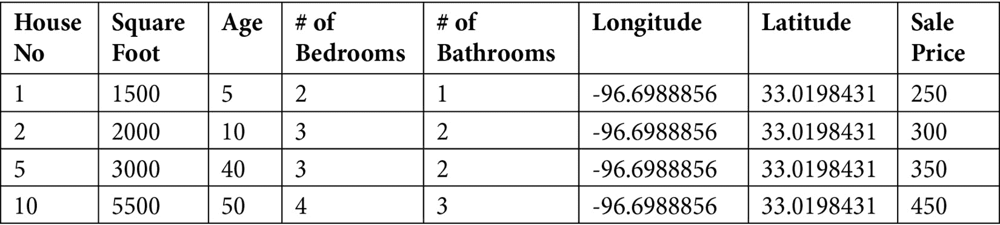
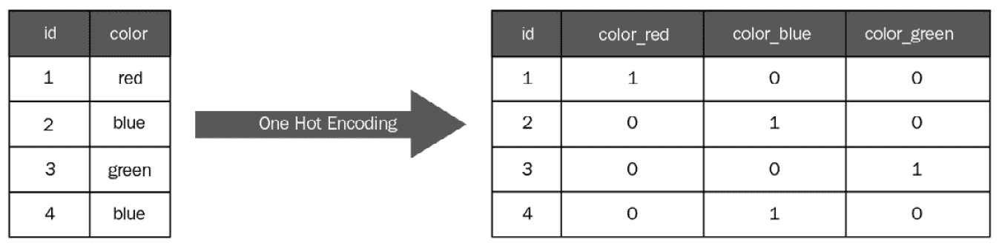

# 准备机器学习开发

在本书的*第二部分*中，我们将检查机器学习过程。我们将从准备工作开始，包括机器学习问题界定来定义机器学习问题；数据准备和特征工程来准备数据；然后是机器学习模型开发阶段，包括模型训练、模型验证、模型测试和模型部署。我们将以神经网络和深度学习结束*第二部分*。

在本章中，我们将讨论两个机器学习准备任务：机器学习问题界定和数据准备。我们将针对我们正在解决的问题提出以下问题：

+   业务需求是什么？

+   机器学习是解决问题的最佳方式吗？

+   问题的输入和输出是什么？

+   我的数据在哪里？

+   我如何衡量机器学习解决方案的成功？

+   数据准备好了吗？

+   我如何收集我的数据？

+   我如何转换和构建我的数据？

+   我如何为机器学习模型选择特征？

确定业务需求、理解问题及其输入/输出、建立业务成功指标、在模型训练和部署之前收集、转换和构建高质量数据集非常重要。通过这个过程，我们将学习和培养以下技能：

+   定义和理解业务问题

+   将其转化为机器学习问题

+   定义和衡量业务问题的成功

+   定义高质量数据集

+   收集数据

+   转换和构建数据

+   特征工程

在我们阅读本章时，让我们牢记这些问题和技能。

# 从业务需求开始

典型的机器学习过程首先从定义业务需求开始。按照以下步骤定义问题的业务需求：

1.  在所有利益相关者中，明确定义您的机器学习解决方案旨在实现的业务成果。例如，对于预测机器学习问题，我们需要定义一个业务可以接受的准确度范围，并且所有利益相关者都同意。

1.  明确定义机器学习问题的数据来源。所有机器学习项目都基于大量数据。您需要明确定义可靠的数据来源，包括训练数据、评估数据、测试数据和定期更新的数据流。

1.  明确定义机器学习模型更新的频率（因为数据分布会随时间漂移），以及维护生产在模型更新时间内的策略。

1.  明确定义机器学习产品或项目的财务指标。了解任何限制，如资源可用性和预算规划等。

1.  明确定义问题的规则、政策和法规。

让我们看看一个问题和业务需求的例子：

+   **示例 1**：一家名为 Zeellow 的房地产公司在美国买卖房产业务做得很好。由于业务性质，准确预测房价对 Zeellow 来说至关重要。在过去几年中，他们积累了大量美国房屋的历史数据。

在这里，业务成果是准确预测美国房价。业务利益相关者一致认为，超过 2% 的预测误差是不可接受的。数据源定义为内部历史房产数据库。由于数据库更新，模型需要每月更新。有两个数据科学家和两个数据工程师全职从事该项目，并且已经提供了足够的资金。关于房屋数据和机器学习问题没有规定。

# 定义机器学习问题

在我们确定了业务需求之后，我们需要通过识别问题的特征和目标来定义问题。对于**示例 1**，房价是目标，特征是影响房价的房屋属性，如位置、房屋大小（总面积）、房屋年龄、房屋的卧室和浴室数量等。*表 3.1* 展示了一个小样本数据集：

表 3.1 – 示例 1 数据集

然后定义问题为在特征和目标之间建立模型并发现它们之间的关系。在问题定义过程中，我们将更好地理解问题，决定机器学习是否是解决问题的最佳解决方案，以及问题属于哪个类别。

## 机器学习是最好的解决方案吗？

面对问题时，我们首先需要做的是为问题选择最佳的建模/解决方案。例如，给定一个物理对象的初始位置和速度、其质量和作用在其上的力，我们如何精确预测其在任何时间 *t* 的位置？对于这个问题，基于经典力学世界中牛顿定律的传统数学模型，比任何机器学习模型都要好得多！

虽然科学建模提供了预测目标和特征之间的数学关系，但有许多问题很难建立数学模型，甚至不可能建立，机器学习可能是解决这些问题的最佳方式。我们如何知道机器学习是否是解决给定问题的最佳方式？在判断机器学习是否是潜在的良好解决方案时，需要检查以下条件：

+   特征和预测目标之间存在一种模式。对于**示例 1**，我们知道房价将与房屋特征（如位置、总面积、年龄等）相关，并且房价与其特征之间存在模式。

+   现有的模式或关系无法用数学或科学方法建模。对于**示例 1**，房价和特征之间的关系无法用数学公式表示。

+   可用的优质数据量很大。对于**示例 1**，Zeellow 为美国房屋积累了大量历史数据，包括价格和其特征。

+   在**示例 1**中，Zeellow 需要预测房屋价格。显然，房价和房屋特征之间存在关系，但建立数学模型来描述这些关系非常困难。由于我们有足够的历史数据，机器学习可能是解决该问题的有效方法。

让我们看看更多示例，看看机器学习是否是它们的最佳解决方案：

+   **示例 2**：Zeellow 抵押贷款是 Zeellow 的子公司，是一家美国的抵押贷款业务。他们还积累了大量关于抵押贷款申请人的历史数据，并试图自动化对新申请的批准或拒绝决策过程。

+   **示例 3**：Zeellow 评估是 Zeellow 的子公司，他们在房屋签订合同时评估现有房屋的价格。一个很好的近似方法是查看类似房产的定价情况，这会导致房产的分组。

在检查这两个问题及其条件后，我们可以决定机器学习是否是解决问题的方法。进一步地，我们将查看机器学习问题的类别以及我们的三个示例属于哪种类型。

## 机器学习问题类别

机器学习问题可以分为几个类别。对于**示例 1**，Zeellow 需要预测房价，这是一个连续值，与**示例 2**中机器学习需要预测抵押贷款申请的批准（是）或拒绝（否）相比。输出连续值的机器学习问题称为**回归**，而输出离散值（两个或更多）的问题称为**分类**。如果有两个输出（是和否），则称为**二元分类**。如果有超过两个输出，则称为**多类分类**。

在**示例 1**和**示例 2**中，我们让机器从带有结果的现有数据集中学习。**示例 1**的数据集是过去几年已售出的房屋数据，包括房屋位置、卧室和浴室数量、房屋年龄和售价。**示例 2**的数据集包括抵押贷款申请人的性别、年龄、收入、婚姻状况等，以及申请是否被批准或拒绝。由于这两个示例的输入都是标记的，因此它们被称为**监督学习**。在**示例 1**中，房屋的位置、卧室和浴室数量以及房屋年龄等输入数据被称为**特征**，因为它们反映了数据集的属性（特征）。

**无监督学习问题**，另一方面，输入没有标签。对于**示例 3**，Zeellow 评估需要将房屋分成不同的组，并且每个组都有相似的特征。这里的重点不是房价，而是要识别数据中的有意义模式并将房屋分成组。由于我们没有标记数据集，这是一个无监督学习问题。

另一种机器学习问题是**强化学习**（**RL**）。在强化学习中，你不需要收集带有标签的例子。你设置模型（代理）和奖励函数，当代理完成一个任务时奖励它。通过强化学习，代理可以快速学会如何超越人类。更多详情可以在维基百科页面找到（[`en.wikipedia.org/wiki/Reinforcement_learning`](https://en.wikipedia.org/wiki/Reinforcement_learning)）。

## 机器学习模型的输入和输出

在机器学习问题中，输入通常是数据集，包括各种数据格式/媒体，如数值数据、图像、音频等。输入数据集非常重要，将决定机器学习模型的好坏。

对于监督学习，使用标记数据来训练模型，这是一个代表机器从训练数据中学到什么的软件。监督学习的输入是标记的特征和目标的数据集，模型通过比较标记的目标值与模型输出以找到错误来学习。错误是我们想要优化的。注意，我们指的是错误的优化，而不是错误的极小化。换句话说，将错误最小化到零可能不会生成最好的模型。

在监督学习中，回归模型的输出是一个连续的数值，而分类模型的输出是一个离散的值，表示一个类别（二分类中的是/否）。

对于无监督学习，输入数据没有标签，通常的目标是找到输入数据的模式并将它们分组到不同的类别中，称为**聚类**或**分组**。

对于强化学习，输入是一个状态，输出是机器学习执行的动作。在输入和输出之间，有一个函数，它以状态作为输入并返回一个动作作为输出。

# 测量机器学习解决方案和数据准备情况

在我们定义问题并得出结论，认为机器学习可能是解决问题的潜在好方法之后，我们需要建立一个衡量问题解决方案和它是否准备好生产部署的方法。对于**示例 1**，我们需要就房屋预测误差的接受范围达成共识，并且可以使用机器学习模型在生产环境中使用。

## 机器学习模型性能测量

为了评估机器学习解决方案的性能，我们使用机器学习指标。对于回归模型，有三个指标：均方误差、平均绝对误差和 r 平方。对于分类模型，我们使用混淆矩阵。我们将在接下来的章节中更详细地讨论这一点。

机器学习解决方案是否已经准备好部署？我们需要回到机器学习问题框架中模型的原始业务目标：

+   对于 Zeellow 来说，预测房价以 95%的准确性是否足够好？

+   对于 Zeellow 抵押贷款，我们是否允许以 95%的置信度做出决策？

+   对于 Zeellow 评估，我们能否以 95%的准确性将房屋分类到正确的组别？

在我们使用测试数据集评估了机器学习模型并确认模型达到了业务要求后，我们就可以准备将其部署到生产环境中。

## 数据准备就绪

数据在机器学习过程中扮演着如此重要的角色，以至于数据的质量对模型性能有着巨大的影响，这就是所谓的*垃圾输入，垃圾输出*。一个机器学习模型的准确性依赖于许多因素，包括数据集的大小和质量。认为*数据越多，模型准确性越高*的观点并不总是正确的。在实时情况下，获取大量干净、高质量的数据是一个巨大的挑战。通常在一个机器学习项目中，我们会花费大量时间来收集和准备数据集。根据我们需要解决的机器学习问题，有几种收集数据的方法和来源。例如，我们可以考虑以下几种：

+   公司收集的历史数据，如用户数据和媒体数据

+   来自研究机构和政府机构公开可用的数据

我需要多少数据才足够用于我的机器学习模型，我们如何衡量我们数据的质量？这取决于你想要解决的机器学习问题的类型。作为问题框架过程的一部分，我们需要检查并确保我们有足够的高质量数据来构建机器学习解决方案。接下来，我们将更详细地讨论数据准备和特征工程。

# 数据收集

**数据收集**是指收集源数据并将其存储在中央安全位置。在数据收集阶段，我们试图回答以下问题：

+   问题的本质是什么，我们是否有适合它的正确数据？

+   数据在哪里，我们是否有权访问数据？

+   我们能做些什么来将所有数据整合到一个中央存储库中？

+   我们如何保护中央数据存储库？

这些问题在任何机器学习项目中都至关重要，因为在实际业务中，数据通常分布在许多不同的异构源系统中，将所有源数据汇集在一起形成一个数据集可能会涉及巨大的挑战。

一种常见的**提取、转换和加载**（**ETL**）数据收集和整合过程包括以下步骤：

1.  **提取**：从各种来源将数据拉到一个单一的位置。

1.  **转换**：在数据提取和整合过程中，我们可能需要更改数据格式，修改一些数据，删除重复项等。

1.  **加载**：数据被加载到一个单一存储库中，例如 Google Cloud Storage 或 Google BigQuery。

在这个 ETL 过程中，我们还需要解决数据的大小、质量和安全问题：

+   **数据量**：我们需要多少数据才能获得有用的机器学习结果？虽然答案取决于机器学习问题，但经验法则是训练数据集将是模型可训练参数的几倍。例如，一个典型的回归问题可能需要比特征多十倍的数据观测值。一个典型的图像分类问题可能需要成千上万张图像来创建一个高精度的图像分类器。一般来说，使用大型数据集训练的简单模型比使用小型数据集的复杂模型表现更好。

+   **数据质量**：这可以包括以下内容：

    +   **可靠性**：数据来源是否可靠？数据集是否正确标记？数据集是否经过适当过滤？是否存在重复或缺失值？

    +   **特征表示**：数据集是否表示有用的机器学习特征？是否存在任何异常值？

    +   **训练数据和生产数据的一致性**：训练数据集和生产数据集之间是否存在任何偏差？

+   **数据安全**：数据是否安全？我们需要对数据进行加密吗？数据集中是否存在任何**个人身份信息**（**PII**）？访问数据集是否有任何法律或监管要求？

数据收集并存储在中央安全仓库后，我们需要构建和转换它为正确的格式，以便用于机器学习模型训练。我们将在下一节讨论这个问题。

# 数据工程

数据工程的目标是确保数据集代表真实的机器学习问题，并且具有适合机器学习模型训练的正确格式。通常，我们使用统计技术来采样、平衡和缩放数据集，并处理数据集中的缺失值和异常值。本节涵盖以下内容：

+   使用子数据集采样数据

+   平衡数据集类别

+   数据转换

让我们从数据采样和平衡开始。

## 数据采样和平衡

数据采样是一种统计分析技术，用于选择、操作和分析较大数据集中的一个代表性子集。数据采样在数据构建中扮演着重要角色。在采样数据时，你需要非常小心，不要引入偏差因素。更多详情请参阅[`developers.google.com/machine-learning/data-prep/construct/sampling-splitting/sampling`](https://developers.google.com/machine-learning/data-prep/construct/sampling-splitting/sampling)。

一个分类数据集有超过两个数据集类别。我们称构成集合大部分的类别为**多数类别**，而构成小比例的类别为**少数类别**。当数据集有偏斜的类别比例——即少数类别的比例显著低于多数类别的比例时，它是一个不平衡的数据集，我们需要使用称为**下采样**和**增加权重**的统计技术来平衡它。让我们考虑一个欺诈检测数据集，其中 1 个是正例，200 个是负例。由于正例的比例如此之小，模型训练过程将不会反映真实问题。在这种情况下，我们需要分两步处理数据集：

+   **下采样**：从主导类中提取数据示例以平衡类别。以 50 的下采样因子，下采样后的比例将是 40:1。

+   **增加权重**：在机器学习模型训练期间，将主导类权重增加相同的 50 倍（与下采样因子相同）。

一些机器学习库已经提供了内置功能来简化这个过程。有关技术和为什么执行前面的步骤的更多详细信息，请参阅[`developers.google.com/machine-learning/data-prep/construct/sampling-splitting/imbalanced-data`](https://developers.google.com/machine-learning/data-prep/construct/sampling-splitting/imbalanced-data)。

## 数值值转换

对于具有覆盖不同范围（例如，抵押贷款申请批准机器学习模型中的年龄特征）的数值特征的数据集，强烈建议规范化数据集，因为它将帮助梯度下降等算法收敛。规范化数据的一些常见方法如下：

+   缩放到一个范围

+   裁剪

+   对数刻度

+   桶划分/分箱

### 缩放到一个范围

**缩放到一个范围**规范化是将浮点特征值从其自然范围（例如，0-90 岁的年龄范围）转换为标准范围（例如，0 到 1，或-1 到+1）。当你知道数据的近似范围（上限和下限）并且数据在该范围内近似均匀分布时，这是一个很好的规范化实践。例如，大多数年龄值都在 0 到 90 之间，范围内的每个部分都有大量的人，因此规范化年龄值是一种常见的做法。

### 特征裁剪

**特征裁剪**将所有超过（或低于）一定值的特征值限制为固定值。如果你的数据集中包含极端异常值，特征裁剪可能是一个好的做法。例如，你可以将所有超过 80 的温度值裁剪为正好 80。特征裁剪可以在其他规范化之前或之后应用。

### 对数刻度

**对数缩放**计算特征值的对数，从而将广泛的数据范围压缩到狭窄的范围。当数据值中有许多点而其他值很少时，*对数缩放*成为一种好的转换方法。例如，电影评分是*对数缩放*的良好商业用例，因为大多数电影只有很少的评分，而少数电影有大量的评分。

### 桶化

**桶化**也称为分箱。它使用一组阈值将数值特征转换为类别特征。一个很好的例子是将房价转换为低、中、高类别，以更好地建模。

## 类别值转换

类别值是离散值，它们之间没有有序关系，每个值代表一个类别。如果类别数据没有顺序，例如，一个*颜色*特征具有红色、绿色和蓝色等值，并且没有对类别有任何偏好，如果你将*1*、*2*和*3*分别分配给代表*红色*、*绿色*和*蓝色*，那么模型可能会将蓝色解释为比红色更重要，因为它具有更高的数值。我们通常将非序数数据编码到多个列或特征中，称为**独热编码**。*图 3.2*显示了颜色特征的独热编码转换 – 红色是 100，蓝色是 010，绿色是 001：

图 3.2 – “颜色”特征的独热编码

独热编码将非序数类别值转换为数值，而不引入任何序数偏差。它在机器学习数据转换中得到了广泛应用。

## 缺失值处理

在准备数据集时，我们经常看到缺失数据。例如，你的数据集中的一些列可能因为数据收集错误而缺失，或者没有收集到特定特征的某些数据。缺失数据可能会使准确解释特征与目标变量之间的关系变得困难，处理缺失数据是数据准备中的重要步骤。

根据缺失数据的原因、总数据集大小以及缺失值的比例，我们可以选择删除整个特征或填充缺失值。例如，如果某行或某列有大量缺失值，*删除*整个行或列可能是一个可行的选项。如果缺失值在数据集中随机分布，并且只占其行或列的一小部分，那么*填充*可能是一个更好的选择。对于类别变量，我们通常可以用平均值、中位数或最频繁出现的值来替换缺失值。对于数值或连续变量，我们通常使用平均值或中位数来填充。有时，我们也会遇到空值或零，但应该谨慎处理，因为零可以是列中的一个值，而 ETL 管道会将所有缺失值替换为零。

## 异常值处理

通常，我们也会看到异常值——这些数据点在数据集的其他值中距离异常遥远。异常值可能会使模型更难准确预测，因为它们会将值偏离与该特征相关的其他更正常值。根据异常值的原因，你可能想要清理它们，或者将它们转换以丰富你的数据集（一些算法具有内置的函数来处理异常值）：

+   **删除异常值或填充异常值**：如果你的异常值基于人工错误，例如输入数据错误

+   **转换异常值**：通过对值取自然对数来减少异常值对整体数据集的影响

通过之前展示的数据构建和转换过程，数据集已准备好。现在，是时候进行下一步：检查和选择特征（影响模型目标的变量）——这个过程称为特征工程。

# 特征工程

**特征工程**是选择和转换 ML 建模中最相关特征的过程。它是 ML 学习过程中最重要的步骤之一。特征工程包括**特征选择**和**特征合成**（转换）。

## 特征选择

对于在初始阶段提取了大量特征的 ML 问题，特征选择用于减少这些特征（输入变量）的数量，以便我们可以专注于对模型预测目标变量最有用的特征。在你为问题提取特征之后，你需要使用特征选择方法来选择最适合模型训练的特征。根据是否需要 ML 训练，你可以使用两种主要的特征选择方法——过滤方法和包装方法：

+   **过滤方法**使用统计技术来评估和评分每个输入变量与目标变量之间的关系。这些评分用于比较特征并决定将用于模型中的输入变量。

+   **包装方法**创建具有不同输入特征子集的多个模型，并执行模型训练和比较它们的性能。根据性能指标，将选择最适合性能的模型的特征子集。包装方法需要在不同的子集上进行 ML 训练。

## 特征合成

合成特征是通过算法创建的，通常是通过使用加法、减法、乘法和除法等算术运算将真实特征组合起来来训练机器学习模型。**特征合成**为数据模式提供了深刻的见解，并有助于某些 ML 问题的模型训练。

在数据收集、构建和转换以及特征工程之后，我们的数据已准备好进入下一阶段——模型开发。

# 摘要

在本章中，我们讨论了机器学习过程的准备工作。从业务需求开始，你需要理解问题并判断机器学习是否是最佳解决方案。然后你定义机器学习问题，设置性能测量，并确定用于机器学习建模的数据，以确保我们有一个高质量的数据集。

数据扮演着如此重要的角色！我们也在本章中讨论了数据准备和特征工程。从数据收集和构建到数据转换、特征选择和特征合成，数据管道为机器学习模型训练准备数据集。掌握这些数据准备和特征工程技能将使我们深入了解数据，并有助于模型开发。在下一章中，我们将讨论机器学习模型开发过程，从模型训练和验证到模型测试和部署。

# 进一步阅读

为了深入了解本章所学内容，你可以参考以下链接：

+   [`developers.google.com/machine-learning/problem-framing`](https://developers.google.com/machine-learning/problem-framing%20)

+   [`developers.google.com/machine-learning/data-prep`](https://developers.google.com/machine-learning/data-prep)
