# 第四章：开发和部署机器学习模型

在上一章中，我们讨论了机器学习过程的准备阶段，包括问题界定和数据准备。在界定问题并拥有干净的数据集后，就到了开发并部署机器学习模型的时候了。在本章中，我们将讨论模型开发过程。我们将从模型数据输入和硬件/软件平台设置开始，然后专注于模型开发流程，包括模型训练、验证、测试，最后部署到生产环境。我们的重点是理解基本概念及其背后的思维过程，并通过实践加强知识和技能。本章涵盖了以下主题：

+   分割数据集

+   构建平台

+   训练模型

+   验证模型

+   调整模型

+   测试和部署模型

+   使用 scikit-learn 进行实践

在*附录 3*中，我们提供了使用 Python 数据科学包 scikit-learn 进行机器学习模型开发实践示例。

# 分割数据集

通过数据准备过程，我们已经获得了一个可用于模型开发的数据集。为了避免模型欠拟合和过拟合，最佳实践是随机但按比例地将数据集分割成基于模型开发过程的独立子集：训练数据集、验证数据集和测试数据集：

+   **训练数据集**：用于训练模型的子集。模型将从训练数据集中学习。

+   **验证数据集**：用于验证训练模型的子集。模型超参数将基于验证结果进行优化。

+   **测试数据集**：用于在生产部署前评估最终模型的子集。

常规做法是使用 80%的数据作为训练子集，10%用于验证，10%用于测试。当你拥有大量数据时，你可以将其分为 70%的训练，15%的验证和 15%的测试。

# 准备平台

虽然数据输入对模型质量有重大影响，但我们训练/验证/测试模型的硬件/软件平台也会影响模型和开发过程。选择正确的平台对于机器学习过程非常重要。

虽然当然，你可以选择使用台式机或笔记本电脑进行机器学习模型开发，但鉴于云计算提供的巨大优势（自助配置、按需、弹性、可扩展性，全球规模），使用云平台是一种推荐的做法。云计算提供了许多工具，以协助数据科学家进行数据准备和模型开发。

在云服务提供商中，Google Cloud Platform 为数据科学家提供了出色的机器学习平台：灵活、弹性、性能强大，从端到端。本书的第三部分将讨论更多关于 Google Cloud ML 平台的具体细节。

现在我们已经准备好了数据集和机器学习平台，让我们直接进入机器学习模型开发过程，从模型训练开始。

# 训练模型

使用训练数据子集，在平台上，我们训练机器学习模型来学习目标变量和特征之间的关系。机器学习模型训练是一个迭代过程：它从一个具有初始参数的假设模型开始，并继续学习过程，直到模型与训练数据集拟合。*图 4.1*展示了机器学习模型训练的一个示例过程，其中我们选择了线性回归模型（*z=wx+b*）并选择了初始参数（*w*和*b*）。我们计算模型的预测误差——模型输出与实际数据标签之间的差距——这一步称为前向传播。如果误差没有优化（准确率不在指定的范围内），我们需要回退并调整模型的参数（*w*和*b*）——这一步称为反向传播。然后我们将向前重新计算误差。这个模型训练过程会重复*前向传播*、*反向传播*和*前向传播*的步骤，直到我们得到一个在预期范围内产生预测误差的模型，即满足业务目标定义的准确率。然后模型训练过程就完成了。

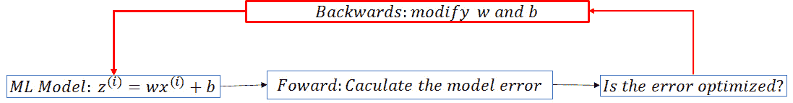

图 4.1 – 机器学习模型训练过程

如您可能已注意到，在先前的例子中，我们选择了线性模型（*z=wx+b*）。在现实生活中，我们在选择机器学习模型时，通常会利用领域知识和某些假设。这可能是一个线性模型、多项式模型，甚至只能用神经网络表达的东西。

接下来，我们将回顾上一章（*示例 1*、*2*和*3*）中提出的样本机器学习问题，讨论线性回归和二元分类，并将它们扩展到高级模型和算法。

## 线性回归

在*第三章**，准备机器学习开发*中，我们讨论了*示例 1*：Zeellow 需要从他们的历史数据集中准确预测房价。由于问题的输入是有标签的，这是一个监督学习问题，而且输出是一个连续值，因此这是一个回归问题。

从数学的角度来看，这是一个典型的寻找目标变量和特征之间函数（关系）的问题，而我们唯一拥有的就是样本数据集。那么，我们如何找出这个函数呢？让我们检查一个简单的*示例 1*数据集：在一定时间段内、某一地点的 10 套房屋的销售价格。样本数据集显示在*表 4.2*中。

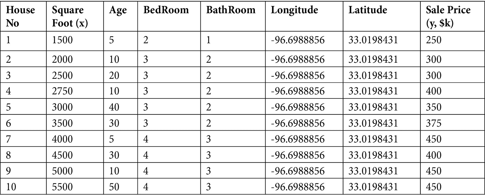

表 4.2 – 示例 1 住房数据集

与目标（房价）相关的特征有多个。我们将首先检查房价与房屋的一个特征之间的关系。让我们看看房屋销售价格（目标，用 *y* 表示）和房屋面积（特征，用 *x* 表示），从而引出一元回归的主题。

### 单变量回归

如您从 *Table 4.2* 中所见，样本训练数据集有 10 行，我们需要找到一个函数 *y=f(x)*，它能最好地描述目标 *y* 与特征 *x* 之间的关系。自然，我们将使用图表来可视化它们的关系。如果我们把数据集中的 10 个项目放入坐标系中，我们得到 *Figure 4.3*。如您所见，有 10 个点分布在第一象限，我们需要对房价（*y*）与房屋面积（*x*）之间的关系做出假设。它是线性函数（如图线 l1 和 l2 所示）还是二次函数（曲线 d1 所示）来表示 *y* 与 *x* 的关系？显然，d1 不适用，因为我们直观地知道当 *x* 增加时，*y* 也会增加。现在，在 l1 和 l2 中，我们选择哪一个？这变成了一元线性回归问题：找到最佳拟合线 *y=w*x+b**（参数为 *w* 和 *b**）以最好地拟合训练数据集。

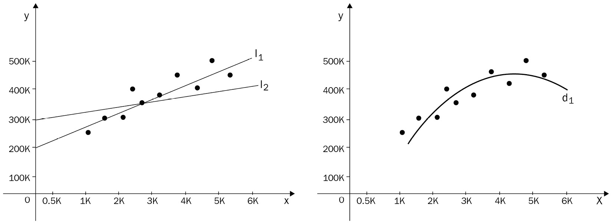

Figure 4.3 – Linear regression

我们的目标是找到最适合现有数据的函数，并预测新数据的最优目标值（最接近实际值）。你如何定义“最佳拟合”？为了回答这个问题，我们提出了数学概念“成本函数”来衡量模型的表现：预测值与实际值之间的差异或距离。

有几种方法可以衡量预测值与实际值之间的差异。用坐标表示第 *i* 个数据点的 (*x*i, *y*i)；也就是说，*y*i 是 *x*i 的实际值，而  是 *x*i 的预测值。然后可以将成本函数定义为以下之一（这里 *N* 是样本数量，对于我们的 *example 1*，*N=10*）：

+   **平均绝对误差**（**MAE**）是预测值与真实值之间绝对差分的总和：

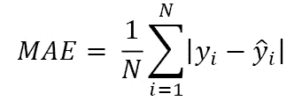

+   **均方误差**（**MSE**）是预测值与真实值之间平方差分的总和：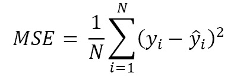

虽然 MSE 和 MAE 都可以用作成本函数，但它们之间有一些区别：最小化 MAE 倾向于在每个点上减少差距，可能导致某些值变为零（从而删除一些特征并使模型变得稀疏）。最小化 MSE 将避免大的差距，但不会导致零差距。

现在问题变成了：我们如何选择合适的参数 (*w, b*) 以使 MSE 或 MAE 最小化？我们将使用 MSE 作为成本函数，我们的重点是找到合适的参数 (*w, b*)，以便在训练数据集上使成本函数 MSE 最小化。为此，我们引入了 **梯度下降** 的概念。

### 梯度下降

从数学的角度来看，如果我们只用一个变量 *w* 简化 MSE 函数，那么图表将类似于 *图 4.4.* 从数学上，我们可以通过使用导数找到最小化 *f(w)* 的值 *w**，因为 *f(w)* 在 *w** 处的导数为零。

从计算机编程的角度来看，我们需要使用一个称为梯度下降的算法来找到最佳点 *w**。对于单一变量，梯度是成本函数的导数。从初始点 (*w*0, *f*0) 开始，我们希望找到下一个点 (*w*1, *f*1)，其中 *f*1 *= f(w*1*)* 小于 *f*0*=f (w*0*)*。由于 *f(w)* 在 *w*0 处的导数是负的，而我们想最小化 *f*，因此从 *w*0 到 *w*1 的移动方向将是增加的，移动幅度（也称为步长或学习率）需要调整，以确保它既不会太小导致许多步骤才能达到 *w**，也不会太大导致偏离 *w**。

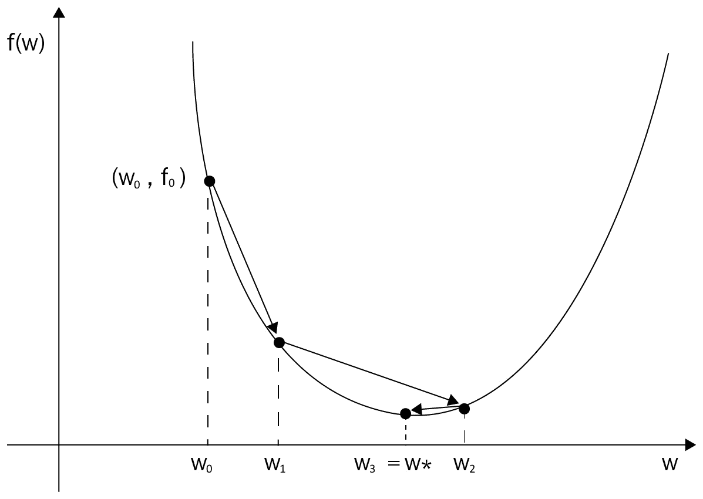

图 4.4 – 梯度下降

*图 4.4* 还显示了梯度下降算法的步骤：从初始点 *(w*0*, f*0*)* 移动到 *(w*1*, f*1*)*，到 *(w*2*, f*2*)*，直到达到优化点 *(w*3*, f*3*) = (w*, f*)*。请注意，对于非凸成本函数，起始点很重要，因为对于 *w* 存在多个最小值，如图 4.5 所示。

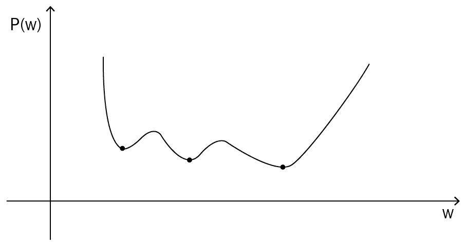

图 4.5 – 非凸成本函数

梯度下降算法允许我们通过反复从 *(w*i*, f*i*)* 移动到 *(w*i*+1**, f*i*+1**)* 来找到最小 *f* 值，移动方向由点 *(w*i*, f*i*)* 处的梯度表示：如果梯度 *(w*i*)* 是负的，则向增加 *w* 的方向移动；否则，向减少 *w* 的方向移动。经过一定的移动后，如果我们能在点 *(w* f*)* 处找到最小 *f**，我们称模型在权重 *w** 处收敛，并且我们已经找到了参数 *w**。否则，模型是非收敛的。在我们找到收敛的 *w** 后，找到参数 *b** 相对容易，我们找到了最佳拟合线：*f(x) = w*x + b**，它可以用来预测新值 *x* 的房价。

### 扩展到多个特征（变量）

通过梯度下降算法，我们能够找到最适合样本数据集的最佳模型。我们将用它来预测新数据中的销售价格（目标 *y*）。在现实生活中，有许多特征会影响房屋的销售价格，例如其年龄、卧室和浴室的数量，当然还有房屋的位置。因此，我们需要将我们的模型扩展到多个特征（变量）。

当扩展到多个特征时，我们使用向量 *X=(x*1*, x*2*, x*3*, …, x*n*)*T 来表示多个特征值 *x*1*, x*2*, x*3*, …, x*n，线性函数将变为如下：

```py
Y=WX+B
```

其中 *W* 是一个矩阵，*B* 是一个向量。

然后，代价函数可以写成如下形式：

```py
F(W)=WTAW/2 
```

其中 *A* 是从数据集中构建的矩阵。

从数学上讲，我们可以通过使用多个变量的偏导数找到使 *F(W)* 最小的 *W* 值。相应地，我们也可以将梯度下降算法从一维扩展到多维度，通过最小化代价函数 *F(W)* 来找到最佳拟合数据集的矩阵 *W*。

### 扩展到非线性回归

在之前的讨论中，我们假设销售价格（目标 *y*）和房屋面积 *x* 之间的关系是线性的。在许多现实生活中的机器学习模型中，总是存在非线性关系，例如，一个多项式关系（这里有一个特征/变量 *x*）：

```py
y = w1x + w2x2 + w3x3 + …. + wnxn
```

从线性到非线性，数学逻辑是相同的——我们需要通过最小化代价函数来找到模型参数 *(w*1*, w*2*,... w*n*)*。

通过从线性单变量解决方案扩展到非线性和多变量，回归模型解决了预测连续值的机器学习问题类型。由于问题的数学复杂性，我们在此不再进一步讨论。在下一节中，我们将探讨另一种类型的机器学习问题，**分类**，并且我们将从二元分类的最简单情况开始。

## 二元分类

在上一章中，我们也讨论了另一个样本机器学习问题（*示例 2*）—— Zeellow Lender 正在尝试自动化对新贷款申请的批准或拒绝决策过程。由于模型输出是 *是* 或 *否*，这是一个二元分类问题。另一种分类问题是多类别分类。例如，给定一个图像，我们需要判断它是狗、猫还是牛。

对于分类问题，我们总是使用 *概率* 的概念。对于 *示例 2*，机器学习模型将根据客户的贷款违约概率输出 *是* 或 *否*：如果违约概率高于阈值，我们将拒绝申请。对于图像分类示例，我们将说明图像是猫、狗还是牛的可能性。让我们从 *示例 2* 的二元问题开始。

### 逻辑回归

从数学的角度来看，*示例 2* 是一个寻找目标 (*是*/*否*) 与应用特征之间函数（关系）的问题，而我们唯一拥有的就是样本数据集。那么，我们如何找出这个函数呢？让我们检查一下我们拥有的一个简单的与 *示例 2* 相关的数据集：在一定地点一定时间段内 10 个贷款申请的决定。样本数据集显示在 *表 4.6* 中。

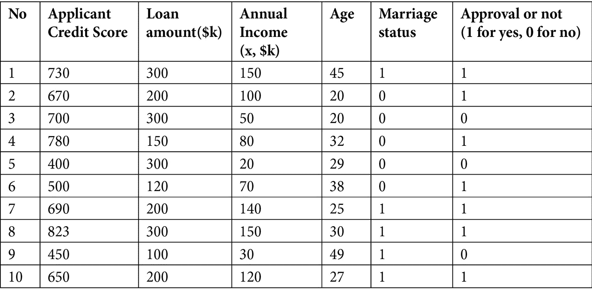

表 4.6 – 示例 2 贷款数据集

从 *表 4.6* 中，我们可以看到有许多申请人的特征会影响他们的贷款申请的批准或拒绝。为了简化，我们选择申请人的收入 *x* 作为单一特征/变量，并使用 *z* 作为 *x* 的线性函数：

*z = wx + b*

由于最终输出目标是一个 *是* (*1*) 或 *否* (*0*)，我们需要一个将上述 *z* 值映射到介于 *0* 和 *1* 之间的概率 *p* 的函数：批准贷款（目标变量 *y=1*）的概率。

从统计学中，我们有以下内容：

```py
p=ez/(1+ez)=1/(1+e-z)
```

这就是所谓的 **sigmoid 函数** *(图 4.7)*，它将贷款批准的概率 *p* 与 *z* 的值映射。

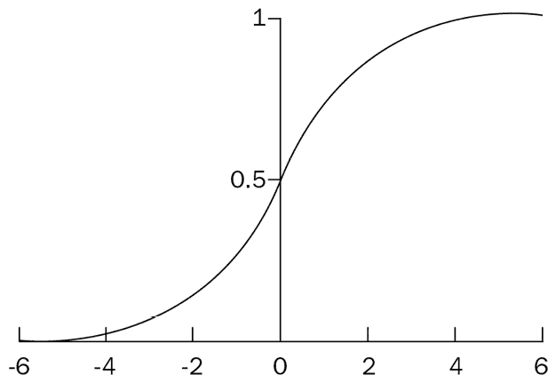

图 4.7 – Sigmoid 函数

使用 Sigmoid 函数，输出将实值 *z* 转换为介于 *0* 和 *1* 之间的概率值 *p*。这引入了 *逻辑回归* 的概念，这是一种用于预测目标值为 *是* (*1*) 的概率的分类算法。简单来说，逻辑回归可以被视为一个输出为目标概率为 *1* 的概率范围在 (*0,1*) 之间的线性回归。

### 二元分类的阈值

如我们从先前的二元分类模型中看到的那样，逻辑回归返回一个介于 *0* 和 *1* 之间的概率值。要将概率值转换为分类，我们需要确定阈值值——当概率高于阈值时，类别为 *1*（是）；否则，为 *0*（否）。对于 *示例 2*，如果你将阈值设置为 *0.9*，那么当概率高于 90% 时，你将批准贷款申请；否则，你将拒绝申请。但我们是如何定义阈值的呢？答案是相关的业务案例和一个称为 **混淆矩阵** 的模型度量指标。我们将在模型验证部分进一步讨论它们。

### 扩展到多类分类

我们可以将二元分类问题扩展到多类分类问题。从二元到多类的转换有多种方法。给定一个多分类模型，我们可以将其分解为多个二元分类问题。更多详情请参阅以下链接：

[`svivek.com/teaching/lectures/slides/multiclass/multiclass-full.pdf`](https://svivek.com/teaching/lectures/slides/multiclass/multiclass-full.pdf)

到目前为止，我们已经讨论了回归和分类问题，并介绍了梯度下降算法。现在让我们看看一些高级算法。

## 支持向量机

一种流行的先进机器学习算法被称为**支持向量机**，或**SVM**。它是一个常用于分类问题的模型。SVM 的想法很简单：算法找到一个线（二维）或超平面（三维或更多维度），将数据分成不同的类别。

让我们用一个二维分离问题来说明 SVM。如图*图 4.8*所示，我们试图找到一条线，将点分成两组：一组圆和一组正方形。有三条线在分隔点。在这三条线中，哪一条是最好的选择？

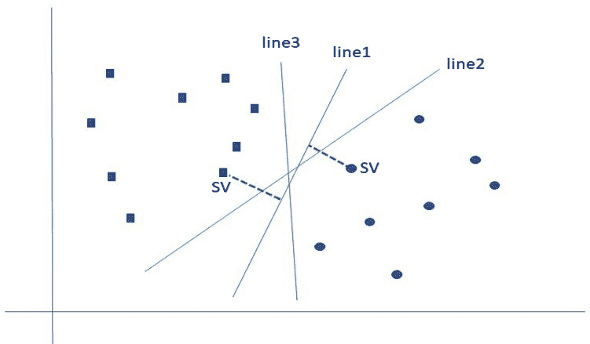

图 4.8 – SVM 示意图

让我们更仔细地看看这张图。对于每条线，都有来自两个类别的最近点——我们称这些点为**支持向量**，我们称线与其支持向量之间的距离为**间隔**。SVM 的目标是最大化间隔。在*图 4.8*中的三条线中，你可以看到线 1 是我们的选择，因为它是三条线中间隔最大的。

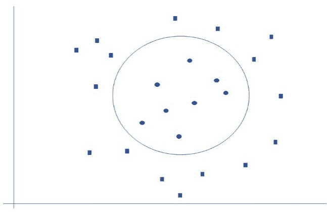

图 4.9 – 分隔数据的非线性曲线

如果我们将这个二维问题扩展到三维，那么具有最大间隔的超平面是最佳超平面。然而，两者仍然是线性模型。然而，在现实生活中，分离往往是线性的。*图 4.9*显示了一个分离是圆（非线性）的例子。

## 决策树和随机森林

对于具有多个特征的分类机器学习问题，自然而然的想法是对特征值进行分类——在每个特征上进行二进制分类。另一种流行的机器学习算法，决策树模型，使用这种逻辑来构建决策树，其中每个内部节点代表对特征的测试，每个叶节点代表一个类标签，分支代表导致叶节点的特征组合——即类标签。从根到叶，路径代表分类规则。决策树是根据每个特征的不同条件来分割数据集的。

决策树是监督学习中应用最广泛的方法之一。*图 4.10*展示了之前讨论的*示例 2*中决策树的逻辑流程：贷款申请决策过程。决策树从信用历史开始：

+   如果信用历史（评分）良好，它将检查申请人的收入和贷款金额——如果收入低且贷款金额大，它将拒绝申请。否则，贷款申请将被批准。

+   如果信用历史不良，它将检查申请人的收入和贷款金额——如果收入高且贷款金额小，它将批准申请。否则，贷款申请将被拒绝：

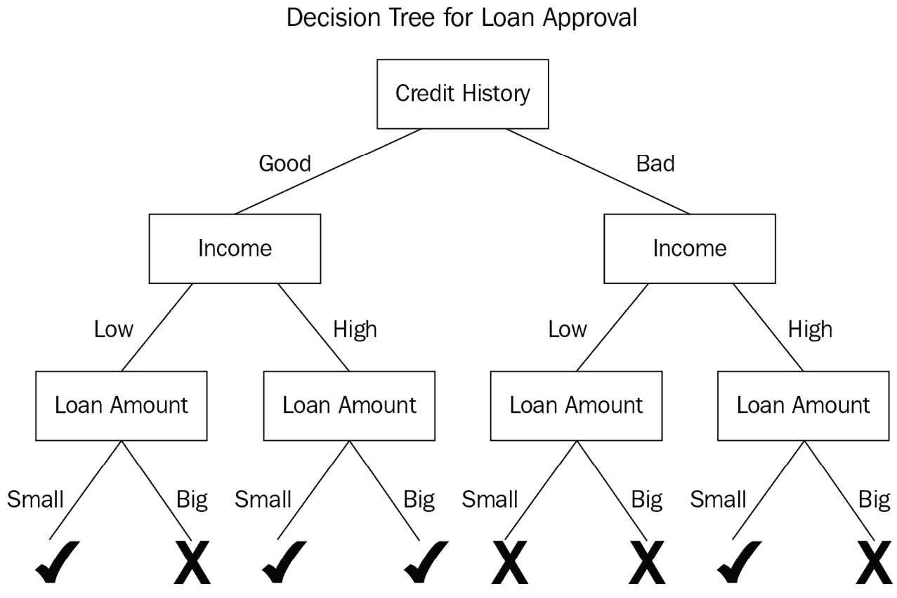

图 4.10 – 示例 2 的决策树

使用决策树模型，你可以根据新的特征数据预测结果，例如新应用的特性值。然而，在数据集大小很大的情况下，决策树可能会变得复杂，并可能导致过拟合。为了解决这个问题，我们通常使用随机森林，它由许多决策树组成。随机森林从这些单个决策树中获得预测，并通过结合决策树预测值以及投票或平均过程进行最终优化。随机森林通常比单个决策树更好，因为它通过平均或投票机制避免了过拟合。

在本节中，我们讨论了各种机器学习模型训练算法：从单变量线性回归到多变量非线性回归；从二元分类到多类分类；从支持向量机到决策树和随机森林。机器学习训练的结果是一个很好地拟合训练数据集的模型。这样的模型在新生产数据上做出良好预测的可能性如何？答案是，在将模型部署到测试和预测生产数据之前，我们需要使用验证数据集来验证模型。

# 验证模型

在你训练模型之后，你需要确定模型在预测未来新数据的目标时是否会表现良好，这就是验证过程：你必须在一个未用于训练的标记数据集上验证模型性能，这个验证数据集是在数据集分割阶段构建的。

## 模型验证

回想我们在*第三章*中讨论的内容：在机器学习问题定义阶段，你定义业务问题并制定一个业务指标来衡量模型的成功。现在，在这个模型验证阶段，模型验证指标需要尽可能紧密地与那个业务指标相联系。

在本章早期，我们已经定义了成本函数，该函数用于找到最优模型。成本函数也用于机器学习模型验证。对于回归问题，成本函数（模型值与实际值之间的差距）通常是均方误差（MSE），这在上一节中已经讨论过。对于二元分类，成本函数通常用混淆矩阵来表示。让我们更详细地看看混淆矩阵，以及改变分类阈值对混淆矩阵的影响。

## 混淆矩阵

混淆矩阵用于衡量二元分类模型的预测，如图 4.11 所示。

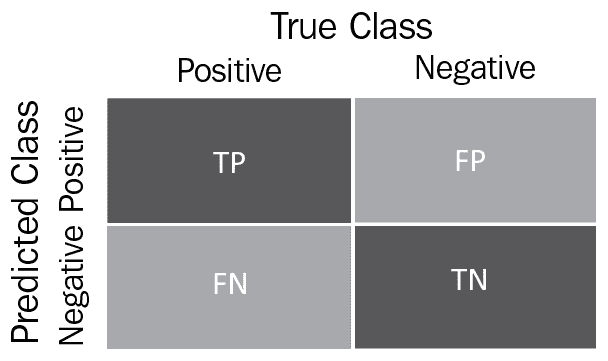

图 4.11 – 混淆矩阵

根据模型是否预测了实际类别，有四种情况：

+   **真正例**（**TP**）是指模型**正确地**预测了**正类**。

+   **真负例**（**TN**）是指模型**正确地**预测了**负类**。

+   **假正例**（**FP**）是指模型**错误地**预测了**正类**。

+   **假负例**（**FN**）是指模型**错误地**预测了**负类**。

让我们看看一个计算机视觉机器学习问题：你训练了两个模型进行图像识别 – 将图像分类为猫或非猫。你已经在这两个模型上运行了验证数据集，并将结果与标签进行了比较，*图 4.12* 显示了两个机器学习模型的混淆矩阵。我们如何衡量哪个模型表现更好？

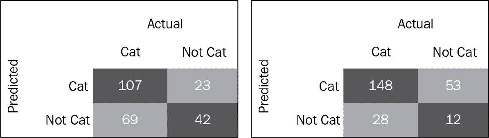

图 4.12 – 两个机器学习模型的混淆矩阵

为了帮助我们比较分类模型的性能，我们需要定义更多的指标：

+   `召回率`（`灵敏度`）衡量的是实际正例中被正确识别的比例：

    ```py
    Recall =TP/(TP+FN)
    ```

+   `特异性`衡量的是实际负例中被正确识别的比例：

    ```py
    Specificity =TN/(FP+TN)
    ```

将上述指标应用于两个模型，我们得到了以下表格：

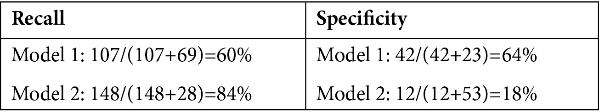

表 4.13 – 两个机器学习模型的召回率和特异性

根据业务目标，可以从不同的角度衡量和解释这两个模型的性能。如果目标是尽可能多地识别猫，并且假正例的数量并不重要，那么第二个模型表现更好，因为它有较高的召回率指标。然而，如果你的目标是识别非猫，那么第一个模型可能是一个更好的选择，因为它有较高的特异性指标。

你可以使用更多的指标来帮助你做出决策。接下来，我们将介绍接收者操作特征曲线和曲线下面积的概念。

## ROC 曲线和 AUC

在前面的章节中，我们讨论了将概率转换为类别的截止值。阈值将影响混淆矩阵。

**接收者操作特征**（**ROC**）曲线是一个图表，显示了在所有阈值值下，**真正例率**（**TPR**）和**假正例率**（**FPR**），作为两个维度。

真正例率（TPR）是召回率的同义词，因此定义为如下：

```py
TPR =TP/(TP+FN) (Of all the positive cases, the proportion of cases identified as positive)
```

假正例率（FPR）的定义如下：

```py
FPR =FP/(FP+TN) (Of all the native cases, the proportion of cases identified as positive)
```

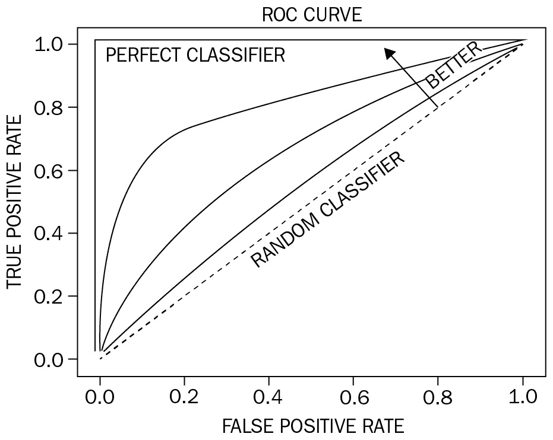

图 4.14 – ROC 曲线

要构建 ROC 曲线，您需要计算每个阈值下的 TPR（或召回率）与 FPR 的对应值，并在图上绘制。*图 4.14*展示了样本 ROC。如果我们仔细观察图表，我们会看到(*0,0*)点代表零真正例和零假正例。(*1,1*)点意味着所有正例都被正确识别，但所有负例也被错误地识别。从(*0,0*)到(*1,1*)的虚线，称为**随机分类器**，代表*TPR=FPR*。在图中，理想线是*完美分类器*，代表*TPR=1*且没有*假正例*：

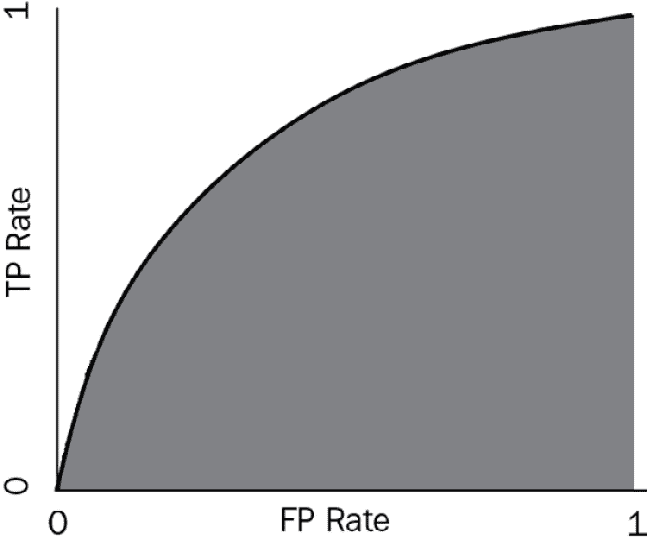

图 4.15 – AUC：曲线下的面积

对于分类问题，目标是模型具有高 TPR（真正例率）和低 FPR（假正例率）——尽可能接近*完美分类器*——因此我们经常使用**曲线下面积**（**AUC**）-ROC 作为分类模型性能的衡量标准：AUC-ROC 越大，越好。*图 4.15*展示了样本 AUC-ROC。

## 更多分类指标

如您所见，从混淆矩阵的四个数字中，您可以计算出模型的召回率和特异性，在此我们介绍准确率、精确率和 F1-score：

+   `Accuracy` 衡量在所有案例中正确预测的比例：

    ```py
    Accuracy=(TP+TN)/(TP+TN+FP+FN)
    ```

+   `Precision` 衡量实际正确的正识别比例：

    ```py
    Precision=TP/(TP+FP)
    ```

+   `F1-score` 结合了精确度和灵敏度，衡量整体性能：

    ```py
    F1-score =2 X Precision X Recall/(Precision + Recall)
    ```

到目前为止，我们已经介绍了许多分类指标——你应该选择哪一个？这实际上取决于业务背景和目标。对于一个将电子邮件识别为垃圾邮件或非垃圾邮件的分类模型，虽然精确度有助于识别垃圾邮件，但你也不想将合法电子邮件误标为垃圾邮件。对于一个识别患者是否患有绝症的分类模型，识别实际患有该疾病的患者至关重要。在这种情况下，灵敏度比精确度是一个更好的指标。

F1 分数结合精确度和召回率，给出一个量化整体性能的单一数字。当您有类别不平衡但希望保持精确度和灵敏度之间的相等性时，您可能想使用 F1 分数。

# 调整模型

在模型验证过程中，我们评估模型性能，有时会出现模型不适应当验数据集的情况。让我们检查不同的情况。

## 过拟合和欠拟合

欠拟合描述的是预测误差没有最小化的情况，而过拟合是指模型非常适应训练数据集但不适应当验数据集的情况。一个过拟合的模型在训练过程中会得到非常低的代价函数值，但在新数据上的预测表现很差。*图 4.16*描绘了欠拟合、稳健和过拟合的情况。

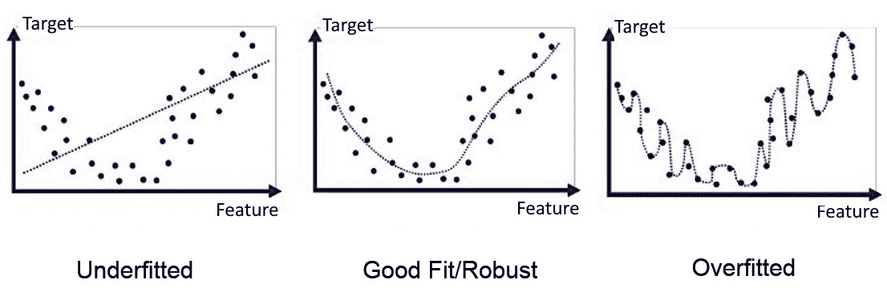

图 4.16 – 模型拟合

当我们试图最小化损失函数并避免欠拟合时，我们需要确保我们的模型是泛化的，而不是容易过拟合。从我们的机器学习实践中，我们知道过拟合通常是由于使模型比必要的更复杂而引起的。正如你在*图 4.16*中看到的那样，过拟合使训练模型记住数据。机器学习的根本原则是在不失去泛化的情况下使模型很好地拟合数据。为了避免过拟合，我们引入正则化来降低模型复杂性。

## 正则化

为了避免过拟合，我们需要降低模型复杂性。模型复杂性可以从两个方面来考虑：

+   模型复杂性作为具有非零权重的*特征总数*的函数

+   模型复杂性作为模型中所有特征*权重*的函数

正则化的想法是为了添加一个因子来惩罚模型复杂性并增强模型泛化。对应于前面的两种复杂性，我们有两种正则化/泛化类型：

+   使用*L2 正则化*公式量化复杂性，该公式将正则化项定义为所有特征权重平方的和——接近零的权重对模型复杂性的影响很小，而异常值权重可以产生巨大影响。*岭回归*使用 L2 正则化：通过添加一个相当于权重平方的惩罚来改变损失函数。设*p*为特征的数量，第*i*个特征的系数（权重）为*w*i；则，损失函数可以表示如下：

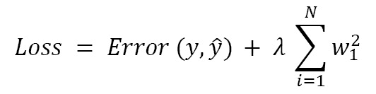

+   使用*L1 正则化*公式量化复杂性，该公式将正则化项定义为所有特征权重的绝对值之和——接近零的权重对模型复杂性的影响很大，而异常值权重的影响较小。Lasso 回归使用 L1 正则化：通过添加一个相当于权重绝对值的惩罚来改变损失函数：

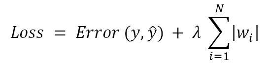

你应该如何选择前面公式的参数 lambda？如果 lambda 值过高，模型将变得简单，存在欠拟合数据的危险。如果 lambda 值过低，模型将更加复杂，存在过拟合数据和导致新数据泛化问题的风险。lambda 的理想值产生一个既适合训练数据又对新数据泛化良好的模型。模型调整的一个目标是在模型复杂性和泛化之间取得平衡。

除了正则化之外，我们还可以使用提前停止来避免过拟合。提前停止是一种正则化形式，用于在训练使用迭代方法（如梯度下降）的学习者时避免过拟合。这意味着在训练结果足够好时结束训练，在模型完全收敛之前。

## 超参数调整

超参数调整是通过在数据集上运行多个训练作业来寻找模型最佳版本的过程。它使用你指定的算法和超参数范围，然后选择那些能产生最佳性能的模型超参数值，这些性能是通过你选择的指标来衡量的。

超参数有两种基本类型。第一种是模型超参数。它们直接与所选模型相关联，因此对模型性能有直接影响。它们有助于定义模型本身，例如，神经网络模型中的层数和所使用的激活函数。

第二种是算法超参数。它们不会直接影响到算法的性能，但会影响模型训练的效率和速度。例如，梯度下降算法的学习率可能会影响机器学习模型收敛的速度。

调整超参数的过程涉及改变超参数的值，并尝试找到那些能产生最佳结果值的超参数。常见的常调超参数包括以下内容：

+   **批量大小**：在模型更新之前，训练过程中处理的样本数量

+   **训练轮数**：在模型训练过程中，我们遍历完整训练数据集的次数

+   **学习率**：在尝试找到参数最优值时我们所走过的距离

通过机器学习模型的训练、验证和超参数调整，我们已开发出一个可以用于测试的模型。

# 测试和部署模型

为了测试并从你的模型中获得性能指标，你必须从模型中进行推理或预测——这通常需要部署。部署阶段的目标是提供一个受管理的环境，以安全且低延迟的方式托管模型进行推理。你可以通过以下两种方式之一部署你的模型：

+   **单次预测**：通过一个永久端点在线部署你的模型。例如，我们可以通过在线端点部署房价预测模型。

+   `.csv` 文件或一次发送多组记录，模型将返回一批预测结果。

在将模型部署到测试环境中后，你需要评估模型是否满足性能要求和业务需求，这是任何机器学习问题的最终目标。所有利益相关者都需要评估机器学习解决方案的益处，并批准模型在生产环境中的部署。请记住，最精确的模型可能并不是解决机器学习问题的最佳方案。

在所有利益相关者批准模型后，我们随后将模型部署到生产环境。否则，我们需要回到模型训练、验证和调整、重新测试和重新评估的过程。

在将模型部署到生产环境中后，您仍然需要监控生产数据，因为随着时间的推移，新的数据会不断积累，并且可能识别出替代或新的结果。因此，部署模型是一个持续的过程，而不仅仅是一次性练习。

# 使用 scikit-learn 进行模型开发实践

Scikit-learn 是 Python 中最有用的机器学习库之一。Scikit-learn 库包含许多机器学习工具，包括分类和回归工具。

在本书的 *附录 3* 中，我们提供了一系列使用 scikit-learn 开发机器学习模型的逐步实践练习。掌握这些步骤对于精通 scikit-learn 技能至关重要。请参阅 *附录 3*，*使用 Scikit-Learn 进行实践*，通过机器学习模型训练、验证和测试的示例来学习和实践。

# 摘要

在本章中，我们讨论了机器学习模型开发过程的基本概念：数据拆分、平台设置、机器学习模型训练、验证、测试和部署。

由于人工智能的概念在 1950 年代出现，直到 2012 年深度学习（**DL**）通过神经网络被发明，在此之前没有出现重大突破。深度学习极大地提高了机器学习模型的表现，并为将机器学习应用于许多商业用例开辟了广阔的道路。在下一章中，我们将讨论神经网络和深度学习。

# 进一步阅读

要深入了解本章的主题，您可以参考以下内容：

+   [`scikit-learn.org/stable/tutorial/basic/tutorial.xhtml`](https://scikit-learn.org/stable/tutorial/basic/tutorial.xhtml)

+   [`scikit-learn.org/stable/tutorial/index.xhtml`](https://scikit-learn.org/stable/tutorial/index.xhtml)

+   *附录 3**, 使用 ScikitLearn 进行实践*
