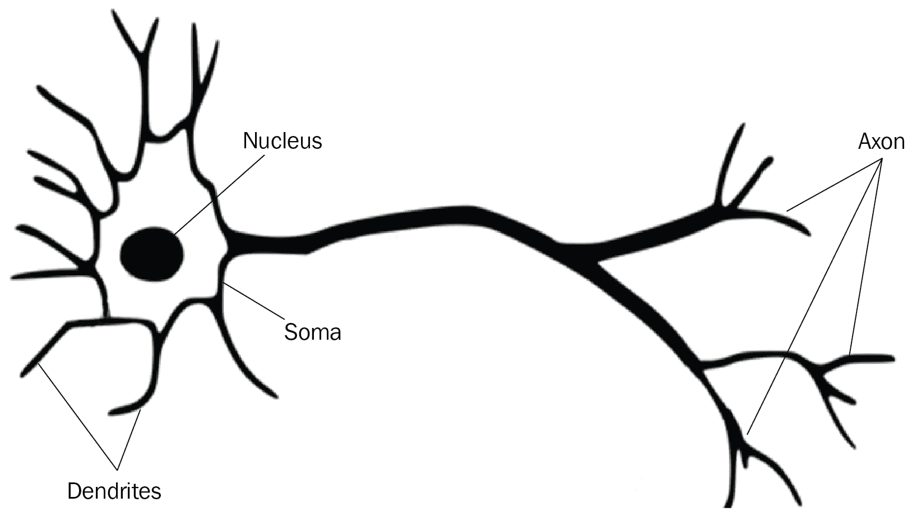
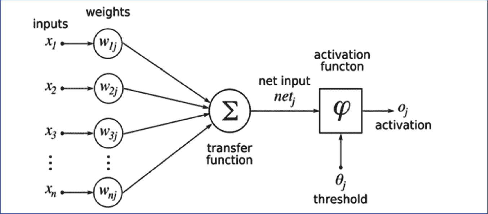
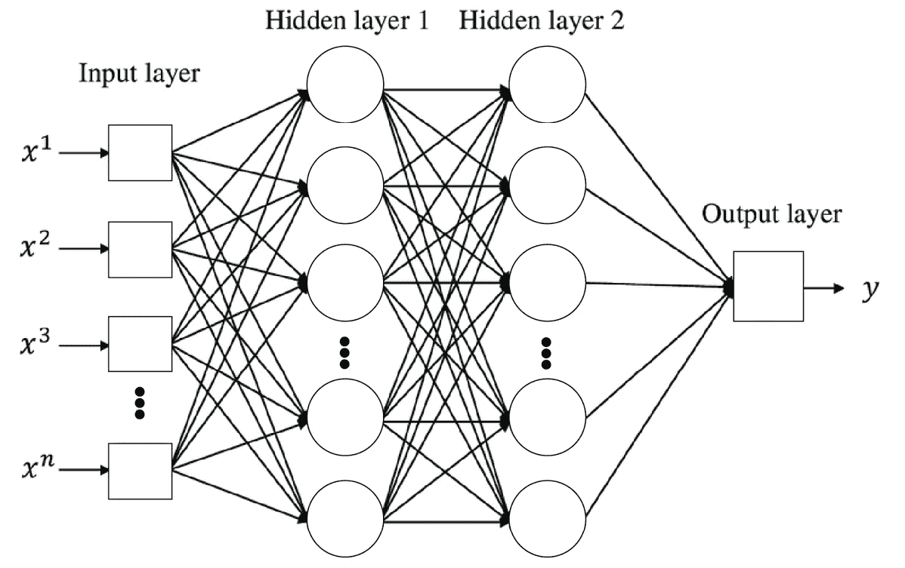
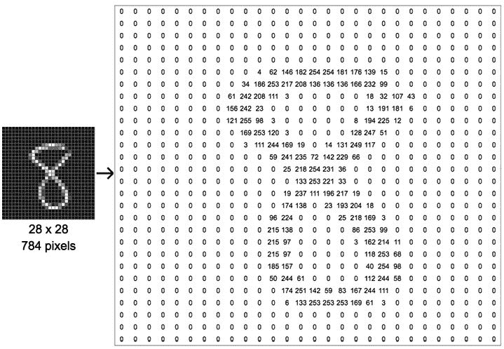
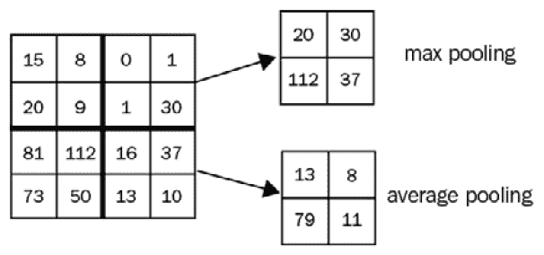
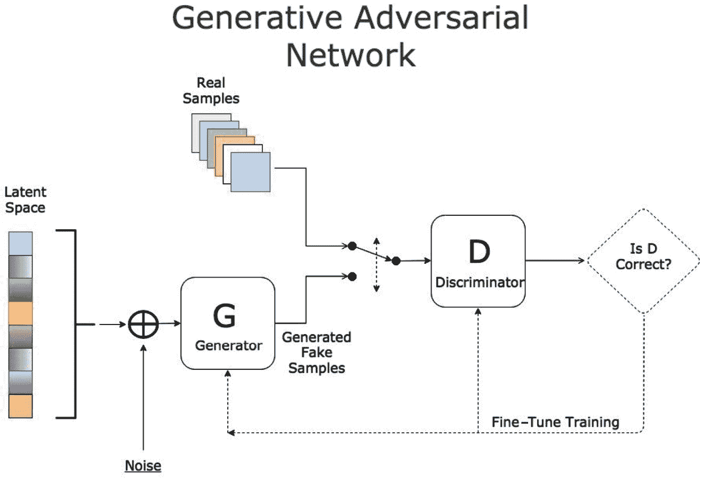

# 第五章：理解神经网络和深度学习

自 2012 年首次亮相以来，**深度学习**（**DL**）取得了巨大的突破，并在包括计算机视觉、**自然语言处理**（**NLP**）在内的许多研究和工业领域得到应用。在本章中，我们将介绍以下基本概念：

+   神经网络和深度学习

+   成本函数

+   优化算法

+   激活函数

在掌握概念之后，我们将讨论几个神经网络模型及其商业用例，包括以下内容：

+   **卷积神经网络**（**CNNs**）

+   **循环神经网络**（**RNNs**）

+   **长短期记忆**（**LSTM**）网络

+   **生成对抗网络**（**GANs**）

在我们的云机器学习之旅中，理解神经网络和深度学习概念、常见模型和商业用例至关重要。让我们开始吧。

# 神经网络和深度学习

在我们人类的历史中，有许多有趣的里程碑，从视觉发展和语言发展到制造和使用工具。人类是如何进化的，我们如何训练计算机来*看*、*说*和*使用*工具？寻找这些问题的答案引领我们进入了现代人工智能领域。

我们的大脑是如何工作的？现代科学揭示，在大脑中，存在一个由神经元组成的分层神经网络。一个典型的神经元通过称为**树突**的精细结构从其他神经元收集电信号，并通过称为**轴突**的传导结构发送信号的尖峰，该轴突分裂成许多分支。每个分支的末端，一个突触将轴突的信号转换为电效应，以激发目标神经元的活性。*图 5.1*展示了生物神经元的运作机制：

图 5.1 – 生物神经元的工作原理

受生物神经网络模型的启发，**人工神经网络**（**ANN**）模型由称为**感知器**的人工神经元组成。感知器接收来自其他感知器的加权输入，应用传递函数，即加权输入的总和，以及激活函数，它向总和添加非线性激活，并将输出以激发下一个感知器。*图 5.2*展示了人工神经元（感知器）的运作机制：

图 5.2 – 人工神经元（感知器）的工作原理

ANNs 由通过层协同工作的感知器组成。*图 5.3*展示了多层 ANN 的结构，其中每个圆形节点代表一个感知器，一条线代表一个感知器的输出到另一个感知器的输入的连接。神经网络中有三种类型的层：输入层、一个或多个隐藏层和输出层。*图 5.3*中的神经网络有一个输入层、两个隐藏层和一个输出层：

图 5.3 – 多层人工神经网络

使用神经网络进行机器学习模型训练时，数据在网络中的流动如下：

1.  准备一个数据集 (*x*1*, x*2*, x*3*, ..., x*n*) 并将其发送到输入层，该层的感知器数量与数据集的特征数量相同。

1.  然后，数据移动到隐藏层。在每个隐藏层中，感知器处理加权输入（求和并激活，如前所述），并将输出发送到下一隐藏层的神经元。

1.  在隐藏层之后，数据最终移动到输出层，该层提供输出。

神经网络的目标是确定最小化成本函数（数据集的平均预测误差）的权重。类似于我们在前几章中讨论的回归模型训练过程，深度学习模型训练通过迭代两个部分的过程实现，即正向传播和反向传播，如下所示：

+   **正向传播**是信息从输入层流向输出层，通过隐藏层的路径。在训练过程的开始，数据到达输入层，在那里它们与随机初始化的权重相乘，然后传递到第一隐藏层。由于输入层有多个节点，每个节点都与第一隐藏层中的每个节点相连；隐藏层中的节点将加权值求和并应用激活函数（添加非线性）。然后它将输出发送到下一层的节点，那里的节点执行相同的操作，直到最后一个隐藏层的输出乘以权重并成为最终输出层的输入，在该层进一步应用函数以生成输出。

+   **反向传播**是信息从输出层流回输入层的路径。在这个过程中，神经网络将预测输出与实际输出进行比较，作为反向传播的第一步，并计算成本函数或预测误差。如果成本函数不够好，它就会根据如**梯度下降**（**GD**）等算法回退以调整权重，然后使用新的权重再次开始正向传播。

正向传播和反向传播会重复多次——每次网络调整权重，试图获得更好的成本函数值——直到网络在输出层获得良好的成本函数（可接受的准确度）。此时，模型训练完成，我们得到了优化的权重，这是训练的结果。

深度学习（DL）是使用神经网络训练机器学习模型。如果你将使用神经网络的前一 DL 模型训练过程与我们讨论的*第四章*中的*训练模型*部分，即[*开发和部署机器学习模型*]的过程进行比较，你会发现机器学习和深度学习的概念非常相似。通过迭代的前向传播和反向传播，两者都试图最小化模型的代价函数——机器学习更多地涉及计算机使用传统算法从数据中学习，而深度学习更多地涉及计算机模仿人脑和神经网络从数据中学习。相对而言，机器学习需要的计算能力较少，深度学习需要较少的人工干预。在接下来的章节中，我们将仔细研究深度学习中的代价函数、优化器算法和激活函数。

# 代价函数

我们在*第四章*的*线性回归*部分介绍了代价函数的概念。代价函数为我们提供了一种数学方法来确定当前模型有多少误差——它为错误的预测分配代价，并提供了一种衡量模型性能的方法。代价函数是机器学习模型训练中的一个关键指标——选择正确的代价函数可以显著提高模型性能。

常见的回归模型代价函数是 MAE 和 MSE。正如我们在前几章所讨论的，MAE 定义了预测值和标签值之间绝对差异的总和。MSE 定义了预测值和标签值之间差异平方的总和。

分类模型的代价函数相当不同。从概念上讲，分类模型的代价函数是不同类别的概率分布之间的差异。对于模型输出为二进制（1 代表是，0 代表否）的二分类模型，我们使用**二元交叉熵**。对于多分类模型，根据数据集标签的不同，我们使用**分类交叉熵**和**稀疏分类交叉熵**，如下所示：

+   如果标签是整数，例如，为了对狗、猫或牛的图片进行分类，那么我们使用稀疏分类交叉熵，因为输出是唯一的一个类别。

+   否则，如果标签被编码为每个类的一系列零和一（与我们在前几章讨论的 one-hot 编码格式相同），我们将使用分类交叉熵。例如，给定一张图片，你需要检测是否存在驾驶证、护照或社会保障卡，我们将使用分类交叉熵作为代价函数，因为输出是类别的组合。

成本函数是我们衡量模型的方式，以便我们可以调整模型参数以最小化它们——模型优化过程。在下一节中，我们将讨论最小化成本函数的优化器算法。

# 优化器算法

在*第四章*的*线性回归*部分，我们讨论了**梯度下降法（GD**）算法，该算法优化线性回归成本函数。在神经网络中，优化器是用于在模型训练中最小化成本函数的算法。常用的优化器包括**随机梯度下降法（SGD**）、**RMSprop**和**Adam**，如下所示：

+   **随机梯度下降法（SGD**）适用于非常大的数据集。与遍历训练数据集中所有样本以更新参数的梯度下降法（GD）不同，SGD 使用一个或多个训练样本的子集。

+   **RMSprop**通过引入可变学习率来改进 SGD。正如我们在*第四章*中讨论的那样，学习率会影响模型性能——较大的学习率可以减少训练时间，但可能导致模型振荡并错过最佳模型参数值。较低的学习率可以使训练过程更长。在 SGD 中，学习率是固定的。RMSprop 随着训练的进行调整学习率，因此它允许你在模型具有高成本函数时以较大的学习率开始，但当成本函数降低时，它会逐渐降低学习率。

+   **Adam**代表**自适应矩估计**，是最广泛使用的优化器之一。Adam 在 RMSprop 的自适应学习率中添加了动量，因此它允许在训练过程中向同一方向移动时加速模型的变化，使模型训练过程更快、更好。

选择合适的成本函数和优化算法对于模型性能和训练速度非常重要。Google 的 TensorFlow 框架提供了许多优化算法。有关更多详细信息，请参阅[`www.tensorflow.org/api_docs/python/tf/keras/optimizers`](https://www.tensorflow.org/api_docs/python/tf/keras/optimizers)。

神经网络的其他重要特性是非线性和输出归一化，这些特性由激活函数提供。我们将在下一节中检查它们。

# 激活函数

如前所述，激活函数是训练过程的一部分。激活函数的目的是将加权求和输入转换为节点：非线性化和改变输出范围。神经网络中有许多激活函数。我们将讨论一些最常用的：Sigmoid 函数、tanh 激活函数、ReLU 函数和 LeakyReLU 函数。*图 5.4*显示了这些函数的曲线：

图 5.4 – 激活函数

让我们按照以下方式检查前面的每个激活函数：

+   sigmoid 激活函数在之前的“成本函数”部分已经讨论过。我们使用 sigmoid 函数将连续值转换为 0 到 1 之间的范围，这样模型就可以预测概率作为输出。

+   tanh 激活函数与 sigmoid 非常相似，但输出范围是从 -1 到 +1，因此由于输出是零中心化的，它比 sigmoid 更受欢迎。

+   ReLU 激活函数代表线性整流单元。它被广泛使用，因为它将负值转换为 0 并保持正值不变。其范围在 0 到无穷大之间。由于负区域的梯度值为 0，因此在训练过程中，某些神经元的权重和偏差可能不会更新，导致这些神经元永远不会被激活。

+   LeakyReLU 是 ReLU 函数的改进版本，它通过在负区域具有一个小正斜率来解决“死亡 ReLU”问题。LeakyReLU 的优点与 ReLU 相同，除此之外，它还允许对负输入值进行训练。

另一个激活函数是 *softmax* 函数，它通常用于多类分类的输出层。softmax 激活函数将输出层值转换为概率之和为 1 的概率，从而在多类分类问题中为每个类别输出概率。

在所有这些激活函数中，我们应该选择哪一个？答案取决于诸如预测类型、网络架构、层数、网络中的当前层等因素。例如，sigmoid 函数更常用于二分类用例，而 softmax 函数通常用于多分类，回归问题可能或可能不使用激活函数。虽然一开始可能会有试错的过程，但经验会积累出良好的实践。

现在我们已经介绍了神经网络和激活函数的概念，让我们来看看在计算机视觉、**自然语言处理**（NLP）和其他领域常用的神经网络。

# 卷积神经网络

现在我们已经了解了神经网络和深度学习，让我们看看一些商业用例。

第一个案例是图像识别。我们如何教会计算机识别图像呢？这对人类来说很容易，但对计算机来说却非常困难。由于计算机只擅长处理 1 和 0，我们首先需要做的是将图像转换成一个数值矩阵，使用像素来实现。例如，*图 5.5* 展示了一个单位数 8 的黑白图像，它由一个 28x28 像素矩阵表示。人类可以通过眼睛中的某些*神奇传感器*轻松地将图像识别为数字 *8*，而计算机则需要输入所有 28x28=784 个像素，每个像素都有一个**像素值**——一个代表像素亮度的单个数字。像素值可能的范围从 0 到 255，其中 0 为黑色，255 为白色。介于两者之间的值构成了不同的灰度。如果我们有一个彩色图像，像素将具有三个数值 RGB 值（红色、绿色和蓝色）来表示其颜色，而不是一个黑色值。

图 5.5 – 使用像素值表示数字 8

在我们得到图像的像素矩阵表示后，我们可以开始开发用于训练的**多层感知器**（**MLP**）网络。我们将构建一个包含 784 个节点的输入层，并输入 784 个像素值，每个像素一个。输入层中的每个节点然后将输出到下一层（隐藏层）中的每个节点，依此类推。当层数增加时，整个网络的计算量将变得巨大。为了减少总计算量，特征过滤的概念应运而生，并导致了**卷积神经网络**（**CNN**）的概念。

CNNs 在计算机视觉中得到了广泛的应用，尤其是在图像识别和处理方面。一个 CNN 由三个层组成：卷积层、池化层和全连接层。卷积层对输入数据进行卷积，过滤图像特征，池化层压缩过滤后的特征，而全连接层，基本上是一个 MLP，负责模型训练。让我们详细考察这些层的每一个。

## 卷积层

**卷积层**执行卷积操作，该操作应用于输入数据以过滤信息并生成特征图。过滤器用作滑动窗口来扫描整个图像并自主识别图像中的特征。如图 5.6 所示，一个 3x3 的过滤器，也称为**核**（**K**），扫描整个**图像**（**I**）并生成一个特征图，用 *I*K* 表示，因为其元素来自 *I* 和 *K* 的乘积（例如图 5.6 中的例子：*1x1+0x0+1x0+0x1+1x1+0x0+1x1+0x1+1x1=4*）。

图 5.6 – 卷积操作

通过卷积过程提取图像特征并生成一个仍然包含大量数据的特征图，这使得训练神经网络变得困难。为了压缩数据，我们通过池化层进行处理。

## 池化层

**池化层**接收卷积层的输出，即特征图，并使用过滤器对其进行压缩。根据所使用的计算函数，它可以是最大池化或平均池化。如图*图 5.7*所示，一个 2x2 的过滤器块扫描特征图并对其进行压缩。使用最大池化时，它从扫描窗口中取最大值，*max(15,8,20,9) = 20*，依此类推。使用平均池化时，它取平均值，*average(15,8,20,9) = 13*。正如你所见，池化层的过滤器始终小于特征图。

图 5.7 – 池化层

从输入图像开始，卷积和池化过程迭代进行，最终结果输入到全连接层（MLP）进行处理。

## 全连接层

在卷积和池化层之后，我们需要将结果展平并传递给 MLP，一个全连接神经网络，以进行分类。最终结果将通过 softmax 激活函数激活，得到最终输出——对图像的理解。

# 循环神经网络

第二种神经网络类型是循环神经网络（RNN）。RNN 在时间序列分析，如 NLP 中得到了广泛应用。RNN 的概念在 20 世纪 80 年代出现，但直到最近，它在深度学习（DL）中才获得了动力。

如我们所见，在传统的前馈神经网络，如 CNN 中，神经网络中的一个节点只计算当前输入，并不记忆先前输入。因此，它无法处理需要先前输入的时间序列数据。例如，为了预测句子中的下一个单词，需要先前的单词来进行推理。通过引入一个隐藏状态，该状态记忆序列的一些信息，RNN 解决了这个问题。

与前馈网络不同，RNN 是一种神经网络，其中前一步的输出作为当前步骤的输入；使用循环结构保持信息，使神经网络能够接受输入序列。如图*图 5.8*所示，节点*A*的循环展开以解释其过程；首先，节点*A*从输入序列中取*X*0，然后输出*h*0，它与*X*1 一起是下一步的输入。同样，*h*1 和*X*2 是下一步的输入，依此类推。使用循环，网络在训练过程中持续记忆上下文：

图 5.8 – RNN 展开循环（来源：https://colah.github.io/posts/2015-08-Understanding-LSTMs/）

简单 RNN 模型的缺点是梯度消失问题，这是由于在训练过程中以及反向传播时使用相同的权重来计算每个时间步的节点输出。当我们向后移动时，误差信号变得更大或更小，这导致难以记住序列中更远的上下文。为了克服这一缺点，开发了**LSTM**神经网络。

# 长短期记忆网络

LSTM 网络被设计用来克服梯度消失问题。LSTMs 具有反馈连接，LSTMs 的关键是细胞状态——一条贯穿整个链的横向线，只有微小的线性交互，它持续保持上下文信息。LSTM 通过门控机制向细胞状态添加或移除信息，门控机制由激活函数（如 sigmoid 或 tanh）和点积乘法操作组成。

图 5.9 – LSTM 模型（来源：https://colah.github.io/posts/2015-08-Understanding-LSTMs/）

*图 5.9* 展示了一个具有保护和控制细胞状态的 LSTM。使用细胞状态，LSTM 解决了梯度消失的问题，因此特别擅长处理时间序列数据，如文本和语音推理。

# 生成对抗网络

**GANs** 是一种算法架构，用于生成可以以真实数据为假的新合成数据实例。如图 5.10 所示，GAN 是一种生成模型，它同时训练以下两个模型：

+   一个**生成性**（**G**）模型，它捕捉数据分布以生成可信数据。潜在空间输入和随机噪声可以被采样并输入到生成器网络中，以生成样本，这些样本成为判别器的负训练示例。

+   一个**判别性**（**D**）模型，它将生成的图像与真实图像进行比较，并试图识别给定的图像是伪造的还是真实的。它估计样本来自训练数据而不是真实数据的概率，以区分生成器的伪造数据和真实数据。判别器对生成器产生不可信结果进行惩罚。

图 5.10 – GAN（来源：https://developers.google.com/machine-learning/recommendation）

模型训练从生成器生成伪造数据开始，判别器通过比较与真实样本来学习识别它是虚假的。然后 GAN 将结果发送给生成器和判别器以更新模型。这种微调训练过程迭代进行，最终产生一些极其逼真的数据。GAN 可以用于生成文本、图像和视频，以及彩色或去噪图像。

# 摘要

神经网络和深度学习为传统的机器学习光谱增添了现代色彩。在本章中，我们首先通过检查成本函数、优化器算法和激活函数来学习神经网络和深度学习的概念。然后，我们介绍了高级神经网络，包括 CNN、RNN、LSTM 和 GAN。正如我们所见，通过引入神经网络，深度学习扩展了机器学习概念，并在计算机视觉、NLP 和其他许多应用中取得了突破。

本章结束了本书的第二部分：*机器学习和深度学习*。在第三部分，我们将专注于*Google 方式学习机器学习*，我们将讨论 Google 如何在 Google Cloud 上实现机器学习和深度学习。我们将从下一章学习 BQML、Google TensorFlow 和 Keras 开始。

# 进一步阅读

若想深入了解本章学习的内容，您可以参考以下链接：

+   [`developers.google.com/machine-learning/crash-course/introduction-to-neural-networks/anatomy`](https://developers.google.com/machine-learning/crash-course/introduction-to-neural-networks/anatomy)

+   [`www.ibm.com/cloud/blog/ai-vs-machine-learning-vs-deep-learning-vs-neural-networks`](https://www.ibm.com/cloud/blog/ai-vs-machine-learning-vs-deep-learning-vs-neural-networks)

+   [`aws.amazon.com/what-is/neural-network/`](https://aws.amazon.com/what-is/neural-network/)

+   [`developers.google.com/machine-learning/gan`](https://developers.google.com/machine-learning/gan)

# 第三部分：在 GCP 中精通机器学习

在本部分，我们学习如何在 Google Cloud Platform 上实现机器学习。首先，我们了解 Google 的 BigQuery ML 用于结构化数据，然后我们查看 Google 的机器学习框架，TensorFlow 和 Keras。我们检查 Google 的端到端机器学习套件，Vertex AI，以及它提供的机器学习服务。然后，我们查看用于机器学习开发的 Google 预训练模型 API：GCP ML API。本部分最后总结了 Google Cloud 中机器学习实现的最佳实践。

本部分包括以下章节：

+   *第六章*, 学习 BQML、TensorFlow 和 Keras

+   *第七章*, 探索 Google Cloud Vertex AI

+   *第八章*, 发现 Google Cloud ML API

+   *第九章*, 使用 Google Cloud ML 最佳实践
