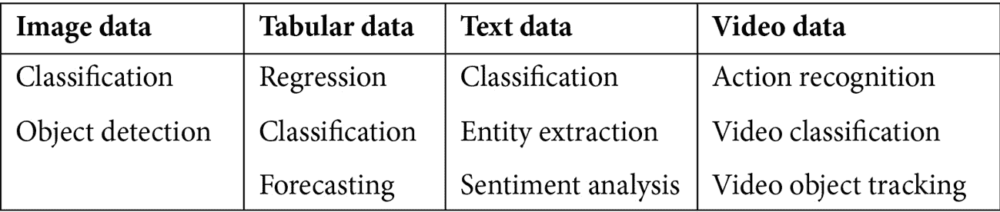
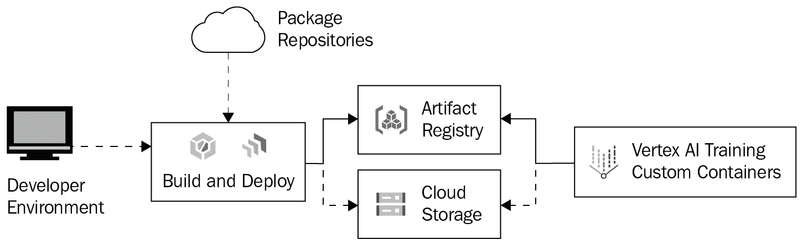
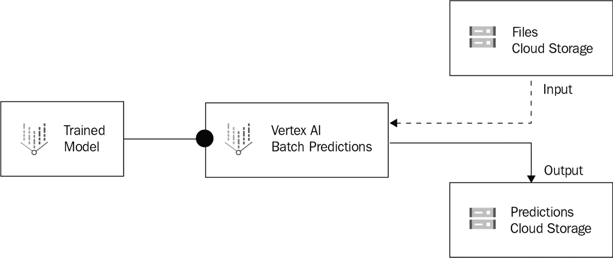
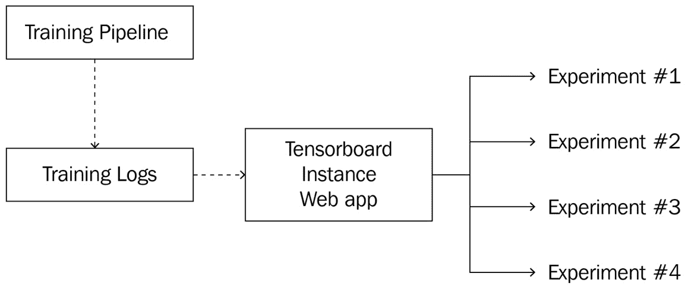

# 第七章：探索 Google Cloud Vertex AI

在上一章中，我们讨论了 Google Cloud BQML，它用于从结构化数据中开发机器学习模型，以及 Google 的 TensorFlow 和 Keras 框架，它们为机器学习模型开发提供了一个高级 API 接口。在本章中，我们将讨论 Cloud Vertex AI，这是 Google 为机器学习模型开发提供的集成云服务套件。我们将检查 Vertex AI 套件及其所有产品和服务。

**Google Vertex AI** 是一套集成的 Google Cloud 产品、功能和管理界面，它简化了机器学习服务的管理。它为用户提供了一个完整的平台，从端到端构建、训练和部署 Google Cloud 中的机器学习应用程序。Vertex AI 为数据科学家提供了一个单一的平台来构建机器学习应用程序。

在本章中，我们将讨论以下 Vertex AI 产品和服务：

+   Vertex AI 数据标记和数据集

+   Vertex AI 特征存储

+   Vertex AI 工作台和笔记本

+   Vertex AI 训练

+   Vertex AI 模型和预测

+   Vertex AI 管道

+   Vertex AI 元数据

+   Vertex AI 实验 和 TensorBoard

让我们从 Vertex AI 套件中的数据标记和数据集开始。

# Vertex AI 数据标记和数据集

数据集在机器学习过程中扮演着如此重要的角色，以至于数据集的质量对机器学习模型性能有着巨大的影响。正如我们在*第四章*，“开发和部署机器学习模型”中讨论的那样，数据准备是任何机器学习过程中的第一步和最重要的步骤。

**Vertex AI 数据标记**是 Google Cloud 服务，允许最终用户与人类工作者合作，审查和标记用户上传的数据集。数据集标记后，它们可用于训练机器学习模型。这些人类工作者由 Google 雇佣，用户需要向人类工作者提供数据集、标签和标记说明。

最终用户也可以直接上传标记过的数据集。**Vertex AI 数据集**是 Google Cloud 服务的一部分，它为用户提供上传不同类型数据的能力，用于构建、训练和验证机器学习模型。目前，Vertex AI 支持四种类型的数据集（图像、表格、文本和视频）：

+   **图像数据集**：您可以在 Vertex AI 中创建图像数据集，并使用它们来训练图像分类、图像分割和目标检测的模型。使用 Vertex AI，您可以直接上传图像数据集或使用存储在 Google Cloud Storage 存储桶中的图像。

+   **表格数据集**：您可以直接从您的本地计算机上传一个 CSV 文件，使用 Google Cloud Storage 中的一个，或者从 BigQuery 服务中选择一个表格。一旦生成了表格数据集，数据就可在 Vertex AI 数据集中用于模型训练。

+   **视频数据集**：Vertex AI 允许您直接从本地计算机上传视频或使用 Google Cloud 存储桶中的视频。一旦您拥有视频数据集，您可以使用它们进行视频分类或动作识别。

+   **文本数据集**：在 Vertex AI 中，您创建一个文本数据集，并将 Google Cloud 存储桶中的 CSV 文件导入到数据集中。然后，您可以使用该数据集进行文本文档分类、自定义文本实体识别、情感分析等。

Vertex AI 数据集允许您在 Vertex AI 套件中直接创建和管理数据集，并通过 Vertex AI 上传的数据集将自动存储在由 Vertex AI 创建和管理的云存储桶中。

# Vertex AI Feature Store

在机器学习/深度学习模型训练中，特征是构建模型和进行未来推理的属性。Google Vertex AI Feature Store 是一个完全托管的云服务，提供集中式存储库来存储、组织和提供机器学习特征。您可以创建和管理一个包含所有模型特征及其值的 **Vertex AI Feature Store**。使用中央特征存储，Google Cloud 组织中的用户可以共享和重用这些特征，用于不同机器学习/深度学习项目中的模型训练或服务任务，以加快机器学习应用程序开发和模型部署。

Vertex AI Feature Store 允许用户管理机器学习模型中的特征。特征存储可以提供实时在线预测或为新数据提供批量预测。例如，在加载有关观影习惯的信息后，特征存储可以用来根据用户的特征预测新用户可能会观看的电影。

在传统的机器学习框架中，您可能已经计算了特征值并将它们保存在各种位置，包括云存储桶或 BQ 表，并且您可能有单独的解决方案来存储和管理特征值。使用 Vertex AI Feature Store，您将获得一个统一的解决方案，在整个组织中保持一致，用于存储和提供可以由不同团队在不同项目或用例中共享的特征。

# Vertex AI Workbench 和笔记本

**Vertex AI Workbench** 服务提供了一个单一的开发平台，用于整个数据科学工作流程；您可以使用它来启动云 VM 实例/笔记本以查询和探索数据，并开发用于部署的模型。

如我们之前在“准备平台”部分中解释的那样，Jupyter Notebook 是一个广泛使用的机器学习模型开发平台。Vertex AI Workbench 为您的数据科学家提供两种基于 Jupyter-Notebook 的选项：托管笔记本和用户托管笔记本：

+   **托管笔记本**是 Google 管理的、基于 Jupyter 的、可扩展的、企业级计算实例，可以帮助您设置并在一个端到端的机器学习生产环境中工作。

+   **用户管理的笔记本**是高度可定制的实例，因此非常适合需要对其环境有大量控制权的用户。使用用户管理的笔记本实例，您将预装一系列深度学习包，包括 TensorFlow 和 PyTorch 框架。

Vertex AI Workbench 提供灵活的笔记本选项。它为数据科学家提供了一个优秀的机器学习模型训练平台，用于训练和开发模型。

# Vertex AI 训练

在机器学习模型开发过程中，训练作业是生成机器学习模型的离散任务。在 Vertex AI 中，您可以根据模型和数据来源选择不同的训练方法；**Vertex AI AutoML**，由 Google 管理，使用 Google 的模型和您的数据进行训练，而**Vertex AI 平台**，使用用户定义的代码或自定义容器，利用您的模型和您的数据进行模型训练。

## Vertex AI AutoML

**Vertex AI AutoML** 是一个托管的 Google Cloud 服务，它使用户能够在不编写任何代码的情况下构建各种用例的模型。目标是使不同水平的 AI 专业知识都能进行机器学习模型开发。

Vertex AutoML 支持的模型类型如图 7.1 表所示：

表 7.1 – Vertex AI AutoML 模型

在创建 AutoML 训练管道作业时，您有以下选项：

+   **数据集**：由 Vertex AI 管理，并由用户上传

+   **模型类型**：从支持的模型中选择（如上所述）

+   **数据拆分**（可选）：使用自定义参数在训练数据、验证数据和测试数据之间拆分数据集

+   **加密**（可选）：选择**客户管理的加密密钥**（**CMEK**）进行过程中的加密

Vertex AI AutoML 帮助您根据您的训练数据构建无代码模型。使用 Vertex AI AutoML，您可以使用自己的数据自定义 Google 的模型。

## Vertex AI 平台

**Vertex AI 平台**，通过自定义容器，使您能够从零开始使用自己的数据构建自己的模型。**自定义容器**是用户创建的 Docker 镜像，在创建管道时选择。自定义容器环境的典型工作流程如图 7.2 所示，其步骤如下：

1.  **代码开发**：您可以选择您喜欢的编程语言来构建应用程序，无论是在本地还是在笔记本中，默认情况下可以从任何互联网位置获取依赖项。

1.  **构建**：您可以将代码构建到打包的工件中，或者编写配置来自动将代码和各种依赖项打包到容器运行时工件中。

1.  **工件存储**：您可以将新构建的定制工件推送到 Cloud Storage 或容器注册表。

1.  **启动训练管道**：在创建训练管道时，您可以选择**自定义容器**来构建机器学习模型。

图 7.1 – Vertex AI 平台自定义容器

在 Vertex AI 中训练模型后，你可以使用 AutoML 或自定义容器，这些容器在 Vertex AI 模型中访问/管理，并在 Vertex AI 端点中部署以进行单个预测或批量预测。

# Vertex AI 模型和预测

**Vertex AI 模型**提供了一个管理 ML 模型的平台。使用 Vertex AI 模型，你可以以多种方式开发和管理工作流模型：

+   **创建模型**：用户可以选择创建一个新的模型，并重定向到**训练管道**屏幕。

+   **上传模型**：用户可以将训练好的模型上传到他们的 Vertex AI 项目中使用。

+   **部署模型**：用户可以将选定的模型部署到端点，使其通过 REST API 可用。

+   **导出模型**：用户可以将训练好的模型导出到 GCS 存储桶，在那里它可以被存储或用于其他项目。

在模型训练完成后，它们可以被公开或私下导出或部署以预测生产案例。当你将模型部署到端点资源以进行在线预测，或者当你请求批量预测时，你可以始终自定义预测服务使用的虚拟机类型，你也可以配置预测节点使用 GPU。我们将在下一节中讨论模型部署。

## Vertex AI 端点预测

**Vertex AI 端点**允许用户基于 Vertex AI 模型创建 REST API 端点，以预测新数据的结果。使用 Vertex AI，模型可以被部署到公共端点或私有端点：

+   **公共端点**：模型被部署到互联网可路由的、Google 管理的端点，该端点位于所选区域。

+   **私有端点**：模型被部署到 Google 管理的端点，该端点位于所选区域的私有 IP 地址上所选 VPC。

Vertex AI 端点用于部署用于在线预测的训练模型。当创建新的端点时，用户可以配置以下内容：

+   **端点名称**

+   **GCP 区域**

+   **私有或公共访问**

+   **加密（可选）**

+   **模型（s）**：新端点将要提供的一个或多个模型。

通过与 Vertex AI 训练和 Vertex AI 模型集成，Vertex AI 端点允许用户交互式地预测单个结果。

## Vertex AI 批量预测

与 Vertex AI 端点不同，**Vertex AI 批量预测**作业是针对输入数据集运行预测模型的离散任务。如图 *图 7.3* 所示，它可以输入存储在 Google Cloud Storage 中的文件，并将结果输出到指定的 GCS 位置。

图 7.2 – Vertex AI 批量预测

当创建批量预测作业时，你有以下选项：

+   **区域**：模型存储的位置

+   **模型**：指向 ML 模型

+   **输入数据**：存储输入数据的云存储桶

+   **输出目录**：云存储桶用于存储预测结果

+   计算相关信息，包括机器类型和节点数量

如前所述的服务，Vertex AI 为您提供了一个 ML 开发和管理工作套件，用于创建和管理数据集，创建和管理用于模型训练的笔记本，以及开发和管理用于批量预测端点的模型。使用 Vertex AI，您可以执行 ML 工作流程中的所有任务，从端到端。这使我们转向 Vertex AI 管道的讨论：自动化 ML 工作流程。

# Vertex AI 管道

**Vertex AI 管道**允许您使用**TensorFlow Extended**（**TFX**）或**Kubeflow**以无服务器的方式自动编排您的 ML 工作流程。每个 Vertex AI 管道作业都由一个配置文件生成，该文件概述了一系列步骤。典型的 Vertex AI 管道将数据导入数据集，使用**训练管道**训练模型，并将模型部署到新的端点进行预测。管道作业使用计算资源运行，有以下选项：

+   您可以使用**Kubeflow DSL**为管道作业编写自定义配置。

+   您可以创建、运行和安排管道作业。

+   您可以指定**服务帐户**或使用未指定时的**计算默认服务帐户**。

Google Vertex AI 管道根据您对工作流程作为管道的描述来编排您的 ML 工作流程。ML 管道是基于容器的可移植和可扩展的 ML 工作流程，由一系列输入参数和步骤列表组成——每个步骤都是管道的一个实例。

# Vertex AI 元数据

**Vertex AI 元数据**是存储在 Vertex AI 各种组件中生成的元数据仓库。当在 ML 工作流程管道中开发模型时，会生成并存储元数据，您可以将这些元数据合并到单个元数据存储中，这使用户能够查询和回答以下问题：

+   哪个训练模型的版本达到了一定的质量阈值？

+   哪个管道运行/使用特定的数据集？

在 Vertex AI 管道中，用户还可以配置写入元数据存储的数据对象。然后，用户可以创建*上下文*对象，将这些数据对象组织成逻辑分组并获得更多见解。

使用 Vertex AI 元数据 API，用户可以构建模式、组织数据对象或查询存储在 Vertex AI 元数据中的数据。

# Vertex AI 实验和 TensorBoard

**TensorBoard**是谷歌的一个开源项目，用于机器学习实验的可视化。Vertex AI 实验是 TensorBoard 的一个实现。使用 Vertex AI 实验，用户可以创建 TensorBoard 实例并将从 Vertex AI 模型生成的 TensorBoard 日志上传以运行实验——这些实验是各种指标（如损失函数和不同运行时间下不同模型参数的准确性）的视觉表示。"图 7.4"展示了 Vertex AI 实验和 TensorBoard 的示例工作流程：

图 7.3 – Vertex AI 实验和 TensorBoard

这些 TensorBoard 可视化可通过一个网络应用访问，通过设置 GCP IAM 权限与其他用户共享。通过 Vertex AI 实验，您可以配置以下选项：

+   **管理 TensorBoard 实例**：用户可以创建、更新或删除 TensorBoard 实例；实例用于实验。

+   **创建实验**：通过上传管道日志数据，用户可以生成实验和可视化。

+   **查看 TensorBoard 网络应用**：用户可以通过为每个 TensorBoard 实例生成的网络应用查看 TensorBoard。

+   **导出数据**：用户可以使用 API 导出管道元数据和 TensorBoard 数据点。

Vertex AI 实验为用户提供了一个平台来实验和调整模型参数。通过 Vertex AI 实验，我们可以在 TensorBoard 网页上交互并检查结果。它是 Google Vertex AI 套件的一个重要且不可或缺的部分。

# 摘要

在本章中，我们介绍了 Google Vertex AI 套件，包括其用于机器学习模型开发和部署的服务、平台和工具。使用 Vertex AI，您可以轻松灵活地管理数据集、模型和管道。毫无疑问，掌握 Vertex AI 需要对套件中的每个服务进行实际操作练习，我们已在*附录 4*，*使用 Google Vertex AI 实践*中提供了示例实际操作步骤。请遵循这些实践并理解附录中的步骤。在下一章中，我们将讨论另一个 Google Cloud ML 服务：Google Cloud ML API。

# 进一步阅读

为了深入了解本章的学习内容，您可以参考以下链接：

+   *Vertex AI 文档*

[`cloud.google.com/vertex-ai/docs`](https://cloud.google.com/vertex-ai/docs)

+   *所有数据集文档 | Vertex AI*

[`cloud.google.com/vertex-ai/docs/datasets/datasets`](https://cloud.google.com/vertex-ai/docs/datasets/datasets)

+   *Vertex AI 特征存储简介*

[`cloud.google.com/vertex-ai/docs/featurestore/overview`](https://cloud.google.com/vertex-ai/docs/featurestore/overview)

+   *Vertex AI 工作台简介*

[`cloud.google.com/vertex-ai/docs/workbench/introduction`](https://cloud.google.com/vertex-ai/docs/workbench/introduction)

+   *选择笔记本解决方案 | Vertex AI 工作台*

[`cloud.google.com/vertex-ai/docs/workbench/notebook-solution`](https://cloud.google.com/vertex-ai/docs/workbench/notebook-solution)

+   *Vertex AI 模型监控简介*

[`cloud.google.com/vertex-ai/docs/model-monitoring/overview`](https://cloud.google.com/vertex-ai/docs/model-monitoring/overview)

+   *Vertex AI 管道简介*

[`cloud.google.com/vertex-ai/docs/pipelines/introduction`](https://cloud.google.com/vertex-ai/docs/pipelines/introduction)

+   *Vertex 可解释 AI | Vertex AI*

[`cloud.google.com/vertex-ai/docs/explainable-ai`](https://cloud.google.com/vertex-ai/docs/explainable-ai)

+   *使用云控制台部署模型 | Vertex AI*

[`cloud.google.com/vertex-ai/docs/predictions/deploy-model-console`](https://cloud.google.com/vertex-ai/docs/predictions/deploy-model-console)

+   *附录 4*, *使用 Google Vertex AI 进行实践*
