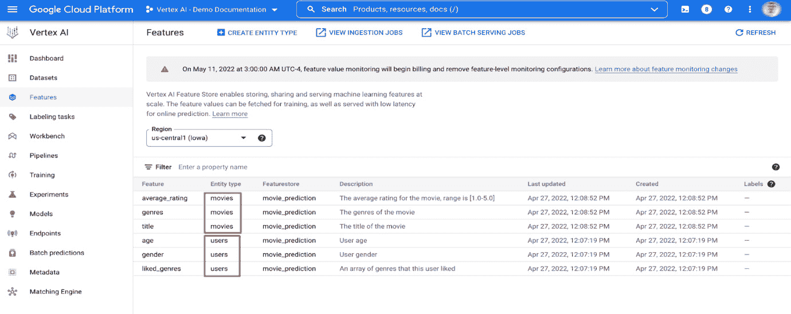
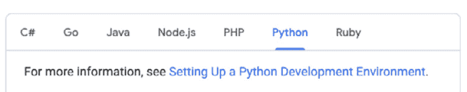
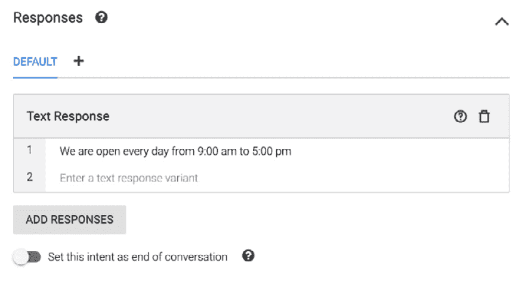

# 10

# 获得 GCP ML 认证

恭喜！您已经走过了所有这些章节，并在 Google Cloud 的机器学习（ML）方面建立了强大的知识库和技能集。现在，是时候整合您所学到的知识，参加 GCP ML 认证考试——我们学习路线图的最后一部分。

Google 专业机器学习工程师认证考试是您成为 Google Cloud 认证机器学习工程师旅程中非常重要的一部分。为了准备和通过考试，您必须复习本书中的所有内容，并深入理解它们，将所有知识点串联起来。

我们建议您采取以下步骤来准备和获得 Google 专业机器学习工程师认证：

1.  阅读官方 Google 机器学习认证考试指南。

1.  阅读本书的所有章节。

1.  完成本书中的所有动手实验室。

1.  练习并复习本章中的所有练习题。

为了让您做好准备，我们提供了一些 ML 认证考试的练习题，以及本章中问题的分析。确保您充分理解每个问题以及所有问题的答案，以及为什么正确答案是正确的，错误答案为什么是错误的。请记住，这里设置的问题只是示例，我们的目标是为您提供一份参考样本。您还需要在互联网上进行更多研究，以达到考试的全面水平。

# GCP ML 考试练习题

请仔细、全面地阅读每个问题，并充分理解它。请同时查阅提供的参考链接中的所有相关文档：

+   **问题 1**：Space Y 正在发射其第一百颗卫星以构建其 StarSphere 网络。他们已经根据现有的 99 颗卫星轨道设计了精确的轨道（发射速度/时间等），以覆盖地球的范围。在第一百次发射后预测 100 颗卫星位置的最好解决方案是什么？

    1.  使用机器学习算法和训练机器学习模型进行预测

    1.  使用神经网络训练模型进行预测

    1.  使用物理定律和实际环境数据建模和预测

    1.  使用线性回归模型进行预测

**分析**：这是一个机器学习问题框架问题。为了决定机器学习是否是解决问题的最佳方法，我们需要看传统科学建模是否非常困难或不可能解决问题，以及是否存在大量数据。当我们开始时，科学建模将是我们的首选，因为它基于科学和自然法则建立最精确的模型。例如，给定物体的初始位置和速度，以及它的质量和作用在其上的力，我们可以精确预测其在任何时间的位置。对于这个案例，数学模型比任何机器学习模型都要好得多！

为了预测第一百颗卫星的轨道，在这里答案 C 是最佳选择。

**参考**：在*第三章*的*“机器学习是否是最好的解决方案？”*部分，*准备机器学习开发*

+   **问题 2**：一家金融公司正在构建一个机器学习模型，基于他们的历史数据集检测信用卡欺诈，该数据集包含 20 个正面样本和 4,990 个负面样本。

由于类别不平衡，模型训练没有按预期进行。最好的解决方法是什么？

1.  数据增强

1.  提前停止

1.  下采样和上权重

1.  正则化

**分析**：这个问题是关于在准备分类问题时数据不平衡的问题。当数据不平衡时，将非常难以训练机器学习模型并获得良好的预测。我们需要使用*下采样和上权重*来平衡类别，所以答案是 C。

**参考**：在*第三章*的*“数据采样和平衡”*部分，*准备机器学习开发*

+   **问题 3**：一家化学制造商正在使用 GCP 机器学习管道通过排队输入、分析和可视化数据来检测实时传感器异常。你会选择哪个管道？

    1.  Dataproc | 人工智能平台 | BQ

    1.  Dataflow | AutoML | Cloud SQL

    1.  数据流 | 人工智能平台 | BQ

    1.  Dataproc | AutoML | Bigtable

**分析**：这是一个机器学习管道问题。我们需要了解 Dataflow 和 Dataproc、人工智能平台和 AutoML 之间的区别，以及各种 GCP 数据库：Cloud SQL、Bigtable 和 BQ。

Dataproc 和 Dataflow 是 GCP 数据处理服务，两者都可以处理批量或流数据。然而，Dataproc 是为与 MapReduce（Apache Hadoop、Hive 和 Spark）兼容的工作而设计的，可以在集群上运行。Dataflow 基于并行数据处理，如果你的数据没有与 Spark 或 Hadoop 的实现，它将运行得更好。

人工智能平台涉及“人工执行”的机器学习训练——使用你自己的数据和模型。AutoML 是“自动化”的机器学习训练，使用 Google 的模型和你的数据，无需编码。

在 GCP 数据库/仓库产品中，Cloud SQL 适用于在线事务处理的关系数据，Bigtable 更多用于 NoSQL 事务处理，而 BQ 非常适合分析和可视化数据（与 Data Studio 集成）。

基于此，我们将选择 C 作为答案。

+   **问题 4**：一家房地产公司，Zeellow，在美国买卖房产业务做得很好。在过去的几年里，他们积累了大量美国房屋的历史数据。

Zeellow 正在使用机器学习训练来预测房价，并且他们通过整合新数据每月重新训练模型。公司不希望在机器学习过程中编写任何代码。哪种方法最适合他们的需求？

1.  AutoML 表格

1.  BigQuery ML

1.  人工智能平台

1.  AutoML 分类

**分析**：这个问题也是关于自动机器学习（AutoML）和 AI 平台，以及回归和分类之间的区别。由于自动机器学习（AutoML）在机器学习过程中无需编码，并且这是一个结构化数据机器学习问题，因此正确答案是 A。

+   **问题 5**：数据科学家团队正在为一家大型**企业资源规划（ERP**）公司的客户服务中心构建一个深度学习模型，该公司拥有许多 ERP 产品和模块。该深度学习模型将输入客户的聊天文本，并在将它们路由到相应的团队之前将它们分类到产品中。公司希望最小化模型开发时间和数据预处理时间。他们应该选择什么策略/平台？

    1.  AI 平台

    1.  自动机器学习（Auto ML）

    1.  NLP API

    1.  Vertex AI 自定义笔记本

**分析**：这里的关键点是*公司希望最小化模型开发时间和数据预处理时间*。自动机器学习（AutoML）是最佳选择，因此正确答案是 B。

+   **问题 6**：一家房地产公司，Zeellow，在美国买卖房产业务做得很好。在过去的几年里，他们积累了大量关于美国房屋的历史数据。

Zeellow 希望利用他们的历史销售数据通过机器学习预测未来的销售。历史数据存储在云存储中。你想要快速实验所有可用数据。你应该如何构建和训练你的模型？

1.  将数据加载到 BigQuery 中并使用 BigQuery ML

1.  将数据转换为 CSV 格式并使用 AutoML Tables

1.  将数据转换为 TFRecords 并使用 TensorFlow

1.  将数据和重构转换为 CSV 格式并使用内置的 XGBoost 库

**分析**：这里的关键点是，我们需要快速实验存储在云存储中的所有结构化数据集。BQ 和 BQML 是最佳选择，因为其他所有选项都需要很长时间来构建和训练模型。因此，正确答案是 A。

+   **问题 7**：一家房地产公司，Zeellow，利用他们的历史数据通过机器学习预测未来的销售。每周都有新数据进来，Zeellow 需要确保模型持续重新训练以反映市场趋势。他们应该如何处理历史数据和新的数据？

    1.  只使用新数据进行重新训练

    1.  每周用新数据更新数据集

    1.  当模型评估指标不符合所需标准时，用新数据更新数据集

    1.  每月用新数据更新数据集

**分析**：模型重新训练是这里的关键术语。由于数据随时间变化，导致训练好的模型变得过时，因此模型重新训练是机器学习过程中的常态。在这种情况下，我们何时需要重新训练模型？答案是当性能指标不符合要求时。我们如何重新训练模型？答案是使用集成数据集，包括现有和新数据。因此，正确答案是 C。

+   **问题 8**：房地产公司 Zeellow 通过利用其历史数据来预测未来的销售。他们的数据科学团队在半年前在生产环境中训练并部署了一个深度学习模型。最近，由于数据分布的变化，该模型出现了性能问题。

团队正在制定模型重新训练的策略。您有什么建议？

1.  监控数据偏差并重新训练模型

1.  使用较少的模型特征重新训练模型

1.  重新训练模型以修复过拟合

1.  使用每月新来的数据进行模型重新训练

**分析**：模型重新训练基于数据值偏差，即数据统计属性的重大变化。当检测到数据偏差时，这意味着数据模式正在变化，我们需要重新训练模型以捕捉这些变化。问题没有提到任何过拟合问题，也没有提到特征减少。重新训练策略将是监控数据偏差，并使用新的输入重新训练模型。因此，正确答案是 A。

**参考**：[`developers.google.com/machine-learning/guides/rules-of-ml/#rule_37_measure_trainingserving_skew`](https://developers.google.com/machine-learning/guides/rules-of-ml/#rule_37_measure_trainingserving_skew)。

+   **问题 9**：最近的研究表明，当某种癌症 *X* 在人类肝脏中发展时，通常会有其他可以识别为 CT 扫描图像中的对象 *Y* 和 *Z* 的症状。一家医院正在利用这项研究在 CT 图像上使用 (*X*, *Y*, *Z*) 标签图的机器学习模型进行训练。在这种情况下应使用哪些成本函数？

    1.  二进制交叉熵

    1.  类别交叉熵

    1.  稀疏类别交叉熵

    1.  稠密类别交叉熵

**分析**：正确答案是 B。

在 *第五章*，*理解神经网络和深度学习*，*成本函数*部分，我们讨论了不同成本函数的使用案例。二进制交叉熵用于二分类问题。当您想防止模型对某个特定类别给予更多重视时，最好使用类别熵——这与 one-hot 编码的想法相同。当您的类别互斥时（例如，当每个样本恰好属于一个类别时），稀疏类别熵更为优化。

+   **问题 10**：贵公司的数据科学团队基于历史数据构建了一个深度神经网络模型，用于预测汽车公司的销售价值。作为一名谷歌机器学习工程师，您需要验证所选特征是否足够好，以供机器学习模型使用。

    1.  使用 L1 正则化训练模型并验证损失保持不变

    1.  使用无正则化的模型进行训练并验证损失保持不变

    1.  使用 L2 正则化训练模型并验证损失在下降

    1.  使用无正则化的模型进行训练，并验证损失接近零

**分析**：正确答案是 D。

损失函数是模型预测准确度的衡量标准，并用作机器学习训练过程的指标。为了验证构建的模型具有足够的特征，我们需要确保在未使用正则化时，损失函数接近零。

**参考**：第四章中的*正则化*部分，*开发和部署机器学习模型*。

+   **问题 11**：你公司的数据科学团队基于历史数据构建了一个深度神经网络模型来预测房地产公司的销售额。作为一名谷歌机器学习工程师，你发现该模型有超过 300 个特征，并且你希望删除一些对目标没有贡献的特征。你会怎么做？

    1.  使用可解释人工智能来理解特征贡献并减少非贡献的特征。

    1.  使用 L1 正则化来减少特征。

    1.  使用 L2 正则化来减少特征。

    1.  一次删除一个特征，训练模型，并验证它不会降低模型性能。删除这些特征。

**分析**：正确答案是 A。这个问题在讨论特征选择，可解释人工智能是理解哪些特征有贡献以及哪些没有贡献的一种方式。重要的是要理解 L1 和 L2 是解决模型过拟合问题的方法，而不是数据工程中的特征选择。

+   **问题 12**：你公司的数据科学团队基于历史数据构建了一个深度神经网络模型来预测房地产公司的销售额。他们发现模型很好地拟合了训练数据集，但没有拟合验证数据集。你会怎么做来改进模型？

    1.  应用 0.3 的 dropout 参数，并将学习率降低 10 倍。

    1.  应用 0.3 的 L2 正则化参数，并将学习率降低 10 倍。

    1.  应用 0.3 的 L1 正则化参数，并将学习率提高 10 倍。

    1.  调整超参数以优化 L2 正则化和 dropout 参数。

**分析**：正确答案是 D。

这个问题在讨论避免模型过拟合的技术。虽然 L1/L2 正则化、dropout 参数和学习率都是帮助的方法，但我们必须调整超参数并找到优化的值。这里的提示是，正确答案将适合一般情况，因此不会包含像 0.3、10 等具体的数字。

+   **问题 13**：你正在为客服中心构建一个深度学习模型。该模型将输入客户的聊天文本并分析他们的情绪。应该使用什么算法来构建这个模型？

    1.  MLP

    1.  回归

    1.  CNN

    1.  RNN

**分析**：正确答案是 D。

这个问题测试了机器学习/深度学习中使用的不同算法。由于文本处理进行情感分析需要处理序列数据（时间序列），最佳选项是**循环神经网络**（**RNN**）。

+   **问题 14**：一家健康保险公司实时扫描客户的填写索赔表格，并将它们存储在谷歌云存储桶中。他们使用机器学习模型来识别手写文本。由于索赔可能包含**个人身份信息**（**PII**），公司政策要求只有授权人员才能访问信息。存储和处理这种流数据的最佳方式是什么？

    1.  创建两个桶，并分别标记为敏感和非敏感。首先将数据存储在非敏感桶中。定期使用 DLP API 扫描它，并将敏感数据移动到敏感桶中。

    1.  创建一个桶来存储数据。仅允许机器学习服务账户访问它。

    1.  创建三个桶——隔离区、敏感和非敏感。首先将所有数据存储在隔离区桶中。然后，定期使用 DLP API 扫描它，并将数据移动到敏感或非敏感桶中。

    1.  创建三个桶——隔离区、敏感和非敏感。首先将所有数据存储在隔离区桶中。然后，一旦文件已上传，触发 DLP API 进行扫描，并将数据移动到敏感或非敏感桶中。

**分析**：正确答案是 D。

这是一个 PII/私人数据存储和处理的业务用例，一个典型的解决方案是创建三个桶，并利用 DLP 进行扫描，然后将原始数据移动到不同的桶中，并控制它们的访问。

+   **问题 15**：房地产公司 Zeellow 利用机器学习通过利用其历史数据来预测未来的销售。最近的模型训练能够达到预期的预测准确度目标，但数据科学团队花费了很长时间。他们希望在不影响达到的模型准确度的情况下减少训练时间。团队应该调整哪个超参数？

    1.  学习率

    1.  迭代次数

    1.  缩放层

    1.  批处理大小

**分析**：正确答案是 C，因为改变其他三个参数将改变模型的预测准确度。

+   **问题 16**：数据科学团队使用来自汽车制造公司装配线图像构建了一个深度神经网络（DNN）模型来监控和检测缺陷产品。作为谷歌机器学习工程师，你需要测量测试数据集/图像的机器学习模型的性能。以下哪个选项你会选择？

    1.  AUC 值

    1.  召回值

    1.  精确度值

    1.  真阳性（TP）值

**分析**：正确答案是 A，因为它衡量的是预测的排名有多好，而不是它们的绝对值。它是一个分类阈值不变的指标，因此是衡量模型性能的最佳方式。

+   **问题 17**：数据科学团队使用来自汽车制造公司装配线图像构建了一个深度学习（DL）模型来监控和检测缺陷产品。随着时间的推移，团队在 AI 平台中构建了多个模型版本。作为谷歌机器学习工程师，你将如何比较这些模型版本？

    1.  比较模型版本的平均平均精度

    1.  在训练数据集上比较模型损失函数

    1.  在验证数据集上比较模型损失函数

    1.  在测试数据集上比较模型损失函数

**分析**：正确答案是 A，因为它衡量了不同模型版本随时间推移的表现：将你的模型作为模型版本部署，然后为该版本创建一个评估作业。通过比较模型版本之间的平均平均精度，你可以找到表现最好的版本。

**参考资料**：[`cloud.google.com/ai-platform/prediction/docs/continuous-evaluation/view-metrics#compare_mean_average_precision_across_models`](https://cloud.google.com/ai-platform/prediction/docs/continuous-evaluation/view-metrics#compare_mean_average_precision_across_models)。

+   **问题 18**：数据科学团队正在使用机器学习模型为电子商务网站构建一个推荐引擎，以提高其业务收入，基于用户的相似性。你会选择哪种模型？

    1.  协同过滤

    1.  回归

    1.  分类

    1.  基于内容的过滤

**分析**：对于这个推荐引擎问题，正确答案是 A。

基于内容的过滤通过使用项目之间的相似性来推荐与用户喜好相似的项目。协同过滤通过用户之间的相似性来提供推荐。问题中指定了“基于用户的相似性”。

**参考资料**：[`developers.google.com/machine-learning/recommendation/overview/candidate-generation`](https://developers.google.com/machine-learning/recommendation/overview/candidate-generation)。

+   **问题 19**：数据科学团队正在为一家信用卡公司构建一个欺诈检测模型，其目标是尽可能多地检测欺诈，同时尽可能少地产生误报。你将最大化哪个混淆矩阵指标来评估此模型的表现？

    1.  精确度

    1.  召回率

    1.  PR 曲线下方的面积

    1.  ROC 曲线下方的面积

**分析**：在这个欺诈检测问题中，它要求你专注于检测欺诈交易——最大化真正阳性率并最小化假阴性——最大化召回率（召回率 = 真阳性 / (真阳性 + 假阴性)）。它还要求你最小化误报（假阳性）——最大化精确度（精确度 = 真阳性 / (真阳性 + 假阳性)）。

因此，既然你想同时最大化精确度和召回率，正确答案是 C（最大化 PR 曲线下方的面积）。

**参考资料**：[`machinelearningmastery.com/roc-curves-and-precision-recall-curves-for-imbalanced-classification/`](https://machinelearningmastery.com/roc-curves-and-precision-recall-curves-for-imbalanced-classification/)。

+   **问题 20**：数据科学团队正在为一家汽车制造公司构建数据管道，其目标是通过无代码数据 ETL 界面集成其本地设施中存在的所有数据源。您将使用哪个 GCP 服务？

    1.  Dataproc

    1.  Dataflow

    1.  数据准备

    1.  数据融合

**分析**：由于问题要求使用无代码界面进行数据集成，因此在这里 Data Fusion 是最佳选择。因此，正确答案是 D。

**参考文献**: [`cloud.google.com/data-fusion/docs/concepts/overview#using_the_code-free_web_ui`](https://cloud.google.com/data-fusion/docs/concepts/overview#using_the_code-free_web_ui).

+   **问题 21**：数据科学团队在 BigQuery 中为一家房地产公司构建了一个 TensorFlow 模型，其目标是将其所有数据模型集成到新的 Google Vertex AI 平台。最佳策略是什么？

    1.  从 BigQuery ML 导出模型

    1.  将 BQML 模型注册到 Vertex AI

    1.  将模型导入到 Vertex AI

    1.  使用 AI 平台作为中间阶段

**分析**：由于问题要求使用 Vertex AI 进行模型集成，该平台允许您在其中注册 BQML 模型，因此正确答案是 B。

**参考文献**: https://cloud.google.com/bigquery-ml/docs/managing-models-vertex.

+   **问题 22**：房地产公司 Zeellow 使用机器学习通过利用其历史数据来预测未来的房屋销售价格。数据科学团队需要构建一个模型来根据房屋位置（美国特定城市）和房屋类型预测美国房屋销售价格。在这种情况下，特征工程的最佳策略是什么？

    1.  一个特征交叉：[纬度 X 经度 X 房屋类型]

    1.  两个特征交叉：[分箱纬度 X 分箱房屋类型] 和 [分箱经度 X 分箱房屋类型]

    1.  三个独立的分箱特征：[分箱纬度]、[分箱经度]、[分箱房屋类型]

    1.  一个特征交叉：[分箱纬度 X 分箱经度 X 分箱房屋类型]

**分析**：将分箱纬度与分箱经度交叉可以使得模型学习到特定城市对房屋类型的影响。它防止纬度的变化产生与经度变化相同的结果。根据分箱的粒度，这个特征交叉可以学习到特定城市的住房影响。因此，正确答案是 D。

**参考文献**: [`developers.google.com/machine-learning/crash-course/feature-crosses/check-your-understanding`](https://developers.google.com/machine-learning/crash-course/feature-crosses/check-your-understanding).

+   **问题 23**：一家健康保险公司实时扫描客户的填写索赔表格，并将它们存储在 Google Cloud Storage 存储桶中。数据科学家团队开发了一个 AI 文档模型来数字化图像。每天结束时，提交的表格需要自动处理。模型已准备好部署。团队应使用什么策略来处理表格？

    1.  Vertex AI 批量预测

    1.  Vertex AI 在线预测

    1.  Vertex AI ML 流程预测

    1.  使用 Cloud Run 触发预测

**分析**：如问题所述，我们需要在每天结束时运行该过程，这意味着使用 AI 平台或 Vertex AI 进行批处理。正确答案是 A。

+   **问题 24**：房地产公司 Zeellow 使用 GCP 机器学习来利用其历史数据预测未来的房屋销售价格。他们的数据科学团队大约有 30 名成员，每个成员都使用 Vertex AI 客户笔记本开发了多个模型版本。管理团队成员开发的这些不同模型和不同版本的最佳策略是什么？

    1.  设置 IAM 权限，允许每个成员访问他们的笔记本、模型和版本

    1.  为每个成员创建一个 GCP 项目以实现整洁的管理

    1.  使用 BQ 为每个成员创建一个到其 GCP 资源的映射

    1.  在创建资源时应用标签/标记，以实现可扩展的库存/成本/访问管理

**分析**：资源标记/标签是管理中等/大数据科学团队机器学习资源的最佳方式。最佳答案是 D。

**资源**：https://cloud.google.com/resource-manager/docs/tags/tags-creating-and-managing.

+   **问题 25**：星巴克是一家国际咖啡店，在多个店铺（1, 2, 3…）销售多种产品 A, B, C…，使用独热编码和位置分箱。他们正在开设新店，并希望利用机器学习模型根据历史数据（A1 是店铺 1 产品 A 的销售数据）预测产品销售。遵循将数据分为训练子集、验证子集和测试子集的最佳实践，数据应如何分配到这些子集中？

    1.  将数据随机分配到子集中：

        +   训练集：[A1, B2, F1, E2, ...]

        +   测试集：[A2, C3, D2, F4, ...]

        +   验证集：[B1, C1, D9, C2...]

    1.  将产品随机分配到子集中：

        +   训练集：[A1, A2, A3, E1, E2, ...]

        +   测试集：[B1, B2, C1, C2, C3, ...]

        +   验证集：[D1, D2, F1, F2, F3, ...]

    1.  将店铺随机分配到子集中：

        +   训练集：[A1, B1, C1, ...]

        +   测试集：[A2, C2, F2, ...]

        +   验证集：[D3, A3, C3, ...]

    1.  按照分配店铺的城市对数据组进行聚合，并将城市随机分配到子集中

**分析**：此问题涉及数据集分割以避免数据泄露。如果我们随机将数据分配到训练集、验证集和测试集，模型将能够学习关于产品的特定特性。如果我们按产品级别划分，使得给定的产品只存在于训练子集、验证子集或测试子集中，那么模型在验证集上获得高准确率将更加困难，因为它需要关注产品特性/质量。因此，正确答案是 B。

**参考**：https://developers.google.com/machine-learning/crash-course/18th-century-literature.

+   **问题 26**：您正在使用 Keras 构建一个深度学习模型，其结构如下：

    ```py
    model = tf.keras.sequential
    model.add(df.keras.layers.Dense(128,activation='relu',input_shape=(200, )))
    model.add(df.keras.layers.Dropout(rate=0.25))
    model.add(df.keras.layers.Dense(4,activation='relu'))
    model.add(df.keras.layers.Dropout(rate=0.25))
    model.add(Dense(2))
    ```

这个模型有多少个可训练权重？

1.  200x128+128x4+4x2

1.  200x128+128x4+2

1.  200x128+129x4+5x2

1.  200x128x0.25+128x4x0.25+4x2

**分析**：这个问题正在测试 Keras 模型中可训练权重的概念。如你所见，正确答案是 D。

+   **问题 27**：数据科学团队正在为一家大型 ERP 公司的客户服务中心构建一个深度学习模型，该公司拥有许多 ERP 产品和模块。公司每天接收超过一百万个客户服务电话，并将它们存储在 GCS 中。通话数据不得离开通话起源地区域，并且不能存储/分析 PII。该模型将分析通话以了解客户情绪。你应该如何设计通话处理、分析和可视化的数据管道？

    1.  GCS -> 语音转文本 -> DLP -> BigQuery

    1.  GCS -> Pub/Sub -> 语音转文本 -> DLP -> 数据存储

    1.  GCS -> 语音转文本 -> DLP -> BigTable

    1.  GCS -> 语音转文本 -> DLP -> 云 SQL

**分析**：由于问题要求一个数据处理、分析和可视化的数据管道，最佳答案是 A。BigQuery 是这里分析和可视化的最佳工具。

+   **问题 28**：数据科学团队正在构建一个机器学习模型，用于监控和检测汽车制造公司装配线上的图像中的缺陷产品，该公司装配线附近没有可靠的 Wi-Fi。作为一名谷歌机器学习工程师，你需要减少质量检查员使用模型快速缺陷检测所花费的时间。贵公司希望尽快实施新的机器学习模型。你应该使用哪个模型？

    1.  AutoML Vision

    1.  AutoML Vision Edge 移动多用途-1

    1.  AutoML Vision Edge 移动低延迟-1

    1.  AutoML Vision Edge 移动高精度-1

**分析**：由于问题要求快速检查时间和优先考虑延迟降低，正确答案是 C。

**参考**：[`cloud.google.com/vision/automl/docs/train-edge`](https://cloud.google.com/vision/automl/docs/train-edge)。

+   **问题 29**：一家国家医院正在利用谷歌云和手机应用构建一个机器学习模型，根据年龄、性别、运动、心率、血压等预测心脏病发作。由于健康数据是高度敏感的个人信息，不能存储在云数据库中，你应该如何训练和部署机器学习模型？

    1.  带数据加密的物联网

    1.  联邦学习

    1.  加密 BQML

    1.  DLP API

**分析**：由于限制，联邦学习是这里最佳选择。使用联邦学习，所有数据都被收集，模型通过跨多个去中心化边缘设备（如手机或网站）的算法进行训练，而不需要交换它们。因此，最佳答案是 B。

+   **问题 30**：你是一家媒体公司的机器学习工程师。你需要构建一个机器学习模型，逐帧分析视频内容，识别对象，并在存在不适当内容时提醒用户。你应该使用哪些谷歌云产品来构建这个项目？

    1.  Pub/Sub、云函数和云视觉 API

    1.  Pub/Sub、Cloud IoT、Dataflow、Cloud Vision API 和 Cloud Logging

    1.  Pub/Sub、Cloud Functions、视频智能 API 和 Cloud Logging

    1.  Pub/Sub、Cloud Functions、AutoML 视频智能和 Cloud Logging

**分析**：由于这个问题涉及视频分析，这将排除 A 和 B。AutoML 视频智能适用于您希望使用 Google 的模型和您的数据进行模型定制的情况。因此，C 是正确答案，因为视频智能 API 可以用来满足这些要求。

# 概述

在本章中，我们讨论了 Google Cloud 专业机器学习工程师认证考试和一些练习题。由于 GCP ML 是一个不断变化的领域，在本书编写期间，Google 已经开发并发布了许多新服务。本书绝对没有涵盖该领域所有考试主题。您需要参考 Google 认证页面以获取认证考试指南和更新。

本章总结了本书的第四部分。在本书的第五部分中，在附录中，我们将提供一些实验室和演示，以练习您的动手技能。建议您逐个查看每个附录并逐步进行实验室练习。

# 第五部分：附录

在这部分，我们提供了在 Google Cloud 中进行机器学习的实践操作，包括基本 GCP 服务、Python 数据科学库、scikit-learn 库、GCP Vertex AI 套件和 Google Cloud ML API。

本部分包括以下章节：

+   *附录 1*，使用基本 GCP 服务进行实践

+   *附录 2*，使用 Python 数据库进行实践

+   *附录 3*，使用 Scikit-Learn 进行实践

+   *附录 4*，使用 Google Vertex AI 进行实践

+   *附录 5*，使用 Google Cloud ML API 进行实践

# 附录 1

# 使用基本 GCP 服务进行实践

在本附录中，我们将展示一些使用 Google Cloud 控制台和 Cloud Shell 的 GCP 资源配置示例。我们将使用以下架构来练习使用 Google Cloud 控制台，如图*图 11.1*所示：

+   一个 VPC 网络，VPC1，以及其中的两个子网：一个公共`subnet1`和一个私有`subnet2`

+   一个具有外部 IP 地址的`subnet1`，可以从互联网访问

+   一个在私有`subnet2`中的虚拟机（VM），它没有外部 IP 地址，因此只能通过控制台浏览器或同一 VPC 内的虚拟机访问

+   另一个 VPC 网络，VPC2，以及 VPC2 中的一个子网：一个私有的`subnet8`

+   私有子网`subnet8`中的虚拟机（VM）

+   VPC1 和 VPC2 之间的对等连接


图 11.1 – GCP 控制台练习的示例架构

在 GCP 实践图 *图 11.1* 中，`public subnet1` 可以从互联网访问。有一个名为 `B1` 的 Google Cloud Storage 存储桶。如果我们想让 VM1、VM2 和 VM8 访问 `B1`，我们需要做什么？这是一个在继续阅读之前值得思考的好问题。

# 在云控制台中练习使用 GCP 服务

在 GCP 中，项目是资源分配的基本单元。您可以使用以下步骤开始一个项目：

1.  在您的浏览器中从 GCP 控制台 ([`console.cloud.google.com`](https://console.cloud.google.com)) 登录后，您将看到以下起始页面：


1.  您始终可以通过点击 **我的第一个项目** 旁边的下拉按钮来创建一个新的项目。


在 **我的第一个项目** 项目中，我们现在将创建网络 VPC、子网和虚拟机。

## 使用 GCP 控制台创建网络 VPC

使用以下步骤在 GCP 控制台中创建 VPC：

1.  在窗口的右上角，有一个导航下拉菜单，您可以使用它来选择 GCP 服务。


1.  从左侧的导航菜单中，转到 **VPC 网络** 并从下拉菜单中选择 **VPC 网络**。它将提示您启用 **计算引擎 API**。继续并启用它。

您将被带到 **VPC 网络** 页面，在那里您可以创建 VPC 网络。

1.  点击 **创建 VPC 网络**。

1.  然后，填写网络详细信息并创建 VPC1：

    +   `subnet1`

    +   `10.10.1.0/24`

    +   `us-east1`

    +   `subnet2`

    +   `10.10.2.0/24`

    +   `asia-east1`

然后，`vpc1` 创建了两个子网：


1.  重复 *步骤 3* 和 *步骤 4* 来创建 `vpc2`：

    +   `subnet8`

    +   `192.168.1.0/24`

    +   `europe-central2`


您现在创建了两个 VPC：`vpc1` 包含两个子网，`vpc2` 包含一个子网。

## 在 vpc1/subnet1 中使用 GCP 控制台创建公共虚拟机 vm1

使用以下步骤在 GCP 控制台中创建虚拟机：

1.  从左侧的导航菜单中，转到 **计算引擎** 然后是 **虚拟机实例**。点击 **创建实例** 按钮。


然后，填写虚拟机实例的详细信息：

+   `vm1`

+   `us-east1`

+   `us-east1-b`

+   **机器配置**：**通用型**，**N1** 系列

+   `f1-micro`

+   `subnet1`

这在以下屏幕截图中显示：


1.  对于其他选项选择默认设置，然后点击 **网络、磁盘、安全、管理、独占租户**。

1.  展开网络选项，然后转到 **网络接口**。

1.  在 `vpc1` 的 `subnet1 Ipv4 (10.10.1.0/24)` 对于 **子网**，并将其他所有内容保留为默认设置。

1.  点击 **完成** 然后点击 **创建**。

此时，VM1 已在 `vpc1` 和 `subnet1` (`10.10.1.0/24`) 中创建，内部 IP 地址为 `10.10.1.2`，外部 IP 地址为 `34.148.1.115`。


要允许将 **安全外壳协议**（**SSH**）连接到这个 Linux 虚拟机，你需要创建一个防火墙规则以允许传入的 SSH 流量。

1.  从三个点的下拉菜单中选择 **查看网络详情**。

1.  选择 **防火墙**，然后选择 **创建防火墙规则**。


1.  填写防火墙规则详细信息：

    +   `vpc1-firewall-rule2`

    +   `vpc1`


1.  将 `22` 作为端口号选择 `0.0.0.0/0`（SSH 使用端口号 `22`）。然后，点击 **创建**。


1.  在防火墙规则创建成功后，返回 **虚拟机实例** 页面。从 **SSH** 下拉菜单中选择 **在浏览器窗口中打开**（确保你允许浏览器弹出窗口）。

现在，你能够 SSH 进入虚拟机实例。


现在，你已经在 `vpc1` 的 `subnet1` 中创建了一个名为 `vm1` 的 GCP 虚拟机。

## 使用 GCP 控制台在 vpc1/subnet2 内创建私有虚拟机 vm2

1.  重复 *上一节* 中的步骤来在 `vpc1/subnet2` 中创建一个 VM。唯一的变化如下：

    +   选择 `asia-east1` 作为 `subnet2` 所在的区域。

    +   选择 `subnet2` 作为子网。

    +   对于 **外部 IPv4 地址** 选择 **无**，因为这是一个私有虚拟机，没有分配外部 IP 地址。


现在，`vm2` 已经在 `vpc1/subnet2` 中配置，IP 地址为 `10.10.2.2`。


1.  重复 *在 vpc1/subnet1 内使用 GCP 控制台创建公共虚拟机 vm1* 中的步骤来创建一个防火墙规则，允许 `vpc1`（`10.10.0.0/16`）内的 ping，这样 `vm1` 和 `vm2` 就可以在同一个 VPC 内 ping 对方。

1.  从 `vm1` ping `vm2`（`10.10.1.2`）。


在这个时候，你已经在 `vpc1` 的 `subnet2` 中创建了一个名为 `vm2` 的 GCP 虚拟机，并且 `vm1` 可以 ping `vm2`。

## 使用 GCP 控制台在 vpc2/subnet8 内创建私有虚拟机 vm8

重复 *在 vpc1/subnet2 内使用 GCP 控制台创建私有虚拟机 vm2* 中的步骤来在 `vpc2/subnet8`（`192.168.1.0/24`）中创建一个 VM，没有公共 IP 地址。唯一的变化如下：

+   选择 `europe-central2` 作为 `subnet3` 所在的区域。

+   选择 `subnet8` 作为子网。

注意，即使你创建了允许从 `vpc1` 到 `vpc2` 进行 ping 的防火墙规则，`vm1/vm2` 也不能 ping `vm8`，因为 `vpc1` 和 `vpc2` 之间没有路由。这就是为什么我们需要在 `vpc1` 和 `vpc2` 之间创建对等连接的原因。

## 使用 GCP 控制台在 vpc1 和 vpc2 之间创建对等连接

使用以下步骤在 `vpc1` 和 `vpc2` 之间创建 VPC 网络对等连接：

1.  从导航菜单中，转到 **VPC 网络**，然后转到 **VPC 网络对等连接**。

1.  从 `vpc1` 到 `vpc2` 创建 `vpc12-peering`。


1.  对 `vpc2` 到 `vpc1` 的对等连接也做同样的操作，这样现在两个对等连接都将处于活动状态。

1.  从 `vm1` ping `vm8`（`192.168.1.2`）。


你现在有一个在 `vpc2` 的 `subnet8` 中创建的 GCP 虚拟机 `vm8`，`vm1` 可以 ping 通 `vm8`。

## 从 GCP 控制台创建 GCS 存储桶

使用以下步骤创建 GCS 存储桶：

1.  从导航菜单中，转到 **云存储** 然后是 **存储桶**。


1.  在新窗口中，点击 **创建存储桶**。


1.  为 GCP 存储桶选择一个全局唯一的名称。这里，我们使用 `bucket-08282022`。在 **选择数据存储位置** 下选择 **区域**，并将存储桶区域选择为 **us-east1**。点击 **创建** 按钮.

这将带您到存储桶页面，您可以在之前创建的存储桶下创建子文件夹，上传文件或上传文件夹。


到目前为止，我们已经从控制台配置了 GCP 资源（VPCs/子网、VPC 对等连接、虚拟机和存储）。所有这些配置都可以使用 Cloud Shell 完成。在下一节中，我们将提供 Cloud Shell 的 GCP 资源配置命令/脚本。

# 使用 Google Cloud Shell 配置 GCP 资源

除了使用 GCP 控制台，我们还可以使用 Google Cloud Shell 来配置所有资源。在以下示例中，GCP 架构显示在 *图 11.2* 中，我们使用 Cloud Shell 命令来配置 GCP 资源，包括网络 VPCs/子网、虚拟机和 VPC 对等连接。请在 Cloud Shell 中练习使用它们，并确保您理解每一步。


图 11.2 – GCP Cloud Shell 实践的示例架构

1.  创建项目、VPC 和子网：

    ```py
    gcloud projects create test10122021 --folder 464105225938
    gcloud compute networks create vpc1 --project corvel-032021  --subnet-mode=custom
    gcloud compute networks subnets create subnet11 --network=vpc1 --range=10.10.1.0/24 --project corvel-032021 --region us-west1
    gcloud compute networks subnets create subnet12 --network=vpc1 --range=10.10.2.0/24 --project corvel-032021 --region us-east1
    gcloud compute networks create vpc2 --project corvel-032021  --subnet-mode=custom
    gcloud compute networks subnets create subnet2 --network=vpc2 --range=192.168.1.0/24 --project corvel-032021 --region us-central1
    gcloud compute networks create vpc3 --project test10122021  --subnet-mode=custom
    gcloud compute networks subnets create subnet3 --network=vpc3 --range=172.16.1.0/24 --project test10122021 --region us-central1
    ```

1.  创建虚拟机：

    ```py
    gcloud compute instances create myvm11 --project corvel-032021 --machine-type=f1-micro --zone=us-west1-a  --subnet=subnet11
    gcloud compute instances create myvm12 --project corvel-032021 --machine-type=f1-micro --network-interface=subnet=subnet12,no-address  --zone=us-east1-b
    gcloud compute instances create myvm2 --project corvel-032021 --machine-type=f1-micro --network-interface=subnet=subnet2,no-address  --zone=us-central1-b
    gcloud compute instances create myvm3 --project test10122021 --machine-type=f1-micro --network-interface=subnet=subnet3,no-address --zone=us-central1-b
    ```

1.  列出所有虚拟机并记下它们的 IP 地址：

    ```py
    gcloud compute instances list --project corvel-032021    
    gcloud compute instances list --project test10122021
    ```

1.  打开 `VPC1` 的防火墙：

    ```py
    gcloud compute firewall-rules create fw1 --network vpc1 --allow tcp:22,icmp --source-ranges 0.0.0.0/0 --project corvel-032021
    ```

1.  从控制台使用 SSH 连接到 `myvm11`，你应该能够从 `vm11` ping 通 `vm12`。

1.  但如何从 `myvm11` ping 通 `myvm2` 呢？你需要创建 `VPC1` 和 `VPC2` 之间的 VPC 对等连接（它们在同一个项目中）：

    ```py
    gcloud compute networks peerings create peer12 --project=corvel-032021  --network=vpc1 --peer-project=corvel-032021 --peer-network=vpc2
    gcloud compute networks peerings create peer21 --peer-project=corvel-032021  --network=vpc2 --project=corvel-032021 --peer-network=vpc1
    gcloud compute networks peerings list --project=corvel-032021
    ```

1.  打开 `vpc2` 的防火墙：

    ```py
    gcloud compute firewall-rules create fw2 --network vpc2 --allow tcp:22,icmp --source-ranges 0.0.0.0/0 --project corvel-032021
    ```

1.  现在，你应该能够从 `vm11` ping 通 `vm2`。但如何从 `myvm11` ping 通 `myvm3` 呢？你需要创建 `vpc1` 和 `vpc3` 之间的 VPC 对等连接（它们在不同的项目中）：

    ```py
    gcloud compute networks peerings create peer13 --project=corvel-032021  --network=vpc1 --peer-project=test10122021 --peer-network=vpc3
    gcloud compute networks peerings create peer31 --project=test10122021 --network=vpc3 --peer-project=corvel-032021 --peer-network=vpc1
    gcloud compute networks peerings list --project=corvel-032021
    ```

1.  打开 `vpc3` 的防火墙：

    ```py
    gcloud compute firewall-rules create fw3 --network vpc3 --allow tcp:22,icmp --source-ranges 10.10.1.0/24 --project test10122021
    ```

现在，你应该能够从 `vm11` ping 通 `vm3`。

# 摘要

在本附录中，我们提供了从 GCP 控制台配置 GCP 服务/资源的实践示例。我们还展示了如何使用 Google Cloud Shell 创建这些基本资源。

# 附录 2

# 练习使用 Python 数据库

在 *第二章* *精通 Python 编程* 中，我们介绍了 Python 数据库，包括 NumPy、Pandas、Matplotlib 和 Seaborn。在本附录中，我们将通过在 Google Colab 平台上使用这些库进行实践来继续学习这些库（[colab.research.google.com](http://colab.research.google.com)）。

采用逐步的方法，我们将展示如何使用这些库来管理和可视化数据。对于 NumPy 库，我们将讨论如何生成和操作 NumPy 数组。对于 Pandas 库，我们将涵盖包括 Series、DataFrames、缺失数据处理、GroupBy 和操作等功能。对于 Matplotlib 和 Seaborn 库，我们将通过探索多个数据可视化示例来展示它们的功能。

按照以下示例进行操作，并确保你理解每一个示例。在 Google Colab 上练习每个示例将获得最佳结果。

# NumPy

NumPy 是一个为 Python 提供对大型、多维数组和矩阵支持以及大量高级数学函数来操作这些数组的库。

在本节中，我们将讨论以下主题：

+   生成 NumPy 数组

+   操作 NumPy 数组

我们将从如何生成 NumPy 数组开始。

## 生成 NumPy 数组

在本节中，我们将演示创建 NumPy 数组的各种方法。数组可能是一维的或二维的。

让我们使用以下代码将一个列表转换成一维数组（第一行导入 NumPy 库并将其别名为 `np`）：

```py
import numpy as np
my_list = [1,2,3]
my_list
[1, 2, 3]
import numpy as np
my_list = [1,2,3]
arr = np.array(my_list)
arr
array([1, 2, 3])
```

现在，让我们用以下代码使我们的列表变得稍微复杂一些：

```py
import numpy as np
my_mat =[[10,20,30],[40,50,60],[70,80,90]]
np.array(my_mat)
array([[10, 20, 30],
       [40, 50, 60],
       [70, 80, 90]])
```

注意，有两对括号表示二维数组。

NumPy 中的一个基本函数是 `arange()`，你可以提供起始值和结束值。例如，以 `0` 作为起始值，`10` 作为结束值，`np.arange()` 将生成一个从 `0` 到 `10`（函数中提供的最后一个值不包括在内）的一维数组：

```py
import numpy as np
np.arange(0,10)
array([0, 1, 2, 3, 4, 5, 6, 7, 8, 9])
```

让我们使用相同的函数和一些其他值/参数。在以下示例中，我们添加了一个额外的参数，称为**步长**，以创建一个包含偶数的一维数组：

```py
import numpy as np
np.arange(0,11,2)
array([ 0, 2, 4, 6, 8, 10])
```

`arange` 函数的第一个参数是起始值，第二个是结束值，最后一个参数是步长。

NumPy 的另一个内置函数是生成全为零的数组。我们需要提供参数，说明数组中要生成多少个零，如下面的代码片段所示：

```py
import numpy as np
np.zeros(5)
array([0., 0., 0., 0., 0.])
```

你也可以提供一个元组作为参数：

```py
import numpy as np
np.zeros((4,4))
array([[0., 0., 0., 0.],
       [0., 0., 0., 0.],
       [0., 0., 0., 0.],
       [0., 0., 0., 0.]])
```

同样，如果我们需要生成一个全为 `1` 的数组，我们可以使用 `ones` 函数并提供一个数字作为参数，如下所示：

```py
import numpy as np
np.ones((3,4))
array([[1., 1., 1., 1.],
       [1., 1., 1., 1.],
       [1., 1., 1., 1.]])
```

另一个有用的内置函数是 `linspace`，我们输入的第一个参数是第一个数字，最后一个参数是最后一个数字，它们在指定的区间内均匀分布。记住，`arange` 函数返回起始点和结束点之间的所有整数，但 `linspace` 还有一个第三个参数，即我们想要的点的数量：

```py
import numpy as np
np.linspace(0,5,10)
array([0.        , 0.55555556, 1.11111111, 1.66666667, 2.22222222,
       2.77777778, 3.33333333, 3.88888889, 4.44444444, 5.        ])
```

在上一个示例中，有一个一维数组（用单个括号指定），在 `0` 和 `5` 之间有 10 个等间距的点：

```py
import numpy as np
np.linspace(0,5,25)
array([0.        , 0.20833333, 0.41666667, 0.625     , 0.83333333,
       1.04166667, 1.25      , 1.45833333, 1.66666667, 1.875     ,
       2.08333333, 2.29166667, 2.5       , 2.70833333, 2.91666667,
       3.125     , 3.33333333, 3.54166667, 3.75      , 3.95833333,
       4.16666667, 4.375     , 4.58333333, 4.79166667, 5.
```

注意，使用相同的例子和不同的空间点（`25`），数组看起来像二维数组，但实际上是一维的，这可以通过数组前只有一个括号来证明。

如果你正在处理线性代数问题，它基本上是一个二维的平方矩阵（行数和列数相同），其中有一个全为 1 的对角线，其余都是 0。这就是为什么它只需要一个数字作为参数：

```py
import numpy as np
np.eye(5)
array([[1., 0., 0., 0., 0.],
       [0., 1., 0., 0., 0.],
       [0., 0., 1., 0., 0.],
       [0., 0., 0., 1., 0.],
       [0., 0., 0., 0., 1.]])
```

在这里将要使用的一个最常用的函数是生成包含随机数的数组，如下所示：

```py
import numpy as np
np.random.rand(4,5)
array([[0.44698983, 0.46938684, 0.66609426, 0.95168835, 0.48775195],
       [0.17627195, 0.98549358, 0.69526343, 0.44981183, 0.11574242],
       [0.09377203, 0.35856856, 0.38228733, 0.6129268 , 0.16385609],
       [0.79041234, 0.9281485 , 0.72570369, 0.46438003, 0.3159711 ]])
```

如果我们需要从标准正态分布中返回，而不是使用`rand`，我们可以使用`randn`函数：

```py
import numpy as np
np.random.randn(4)
array([ 1.57461921, -1.47658163, 0.38070033, -1.43224982])
```

另一个函数是`randint`，它返回一个介于最低和最高整数值之间的随机整数，这些值作为参数提供（最低值包含在内，最高值不包含）：

```py
import numpy as np
np.random.randint(1,100)
29
```

如果我们需要在提供的区间内生成特定数量的随机整数，我们需要提供一个第三个参数：

```py
import numpy as np
np.random.randint(1,100,10)
array([29, 7, 33, 85, 83, 34, 5, 50, 53, 39])
```

现在，让我们进行一些转换。在下面的例子中，我们生成了一个包含 25 个值的二维数组，将其保存在`array`变量中，然后将其重塑为二维数组：

```py
import numpy as np
array = np.arange(25)
array
array([ 0, 1, 2, 3, 4, 5, 6, 7, 8, 9, 10, 11, 12, 13, 14, 15, 16, 17, 18, 19, 20, 21, 22, 23, 24])
array.reshape(5,5)
array([[ 0,  1,  2,  3,  4],
       [ 5,  6,  7,  8,  9],
       [10, 11, 12, 13, 14],
       [15, 16, 17, 18, 19],
       [20, 21, 22, 23, 24]])
```

如果我们想获取随机生成的数组中的最大值或最小值，我们可以分别使用`array.max()`或`array.min()`函数：

```py
import numpy as np
array = np.random.randint(0,50,10)
array
array([ 2, 8, 31, 2, 25, 34, 49, 8, 49, 42])
array.max()
49
array.min()
2
```

如果我们想从前面例子中提供的数组中选取单个值（或一组值），我们可以用括号指定，如下所示：

```py
import numpy as np
array = np.random.randint(0,50,10)
array
array([42, 38, 43, 22, 39, 4, 20, 30, 49, 13])
array[3]
22
array[0:4]
array([42, 38, 43, 22])
```

如果我们想在数组中替换单个值或一组值，我们需要将这些值设置如下所示：

```py
import numpy as np
array = np.random.randint(0,50,100)
array
array([42, 10, 14, 34, 45, 18, 21, 11, 33, 32, 22, 13, 11, 42, 16, 20, 10,
        1, 36, 41, 45, 21, 45, 45, 41,  0, 38, 39, 16, 10, 18, 45, 43, 42,
       23, 31, 20, 14,  9, 46, 44, 33, 24, 35,  6,  6, 26, 13, 20, 20, 28,
       23, 46, 40, 15, 43, 17, 31, 15, 48,  9, 17, 46, 28, 48, 41, 30, 28,
       32, 40, 35,  8, 10,  5, 33, 30,  4, 38, 47, 22, 13, 14, 29,  1, 15,
       48, 18, 48, 18, 21, 45,  9,  6,  1, 31, 28,  5, 42,  8, 28])
array[0:3] = 100
array
array([100, 100, 100,  34,  45,  18,  21,  11,  33,  32,  22,  13,  11,
        42,  16,  20,  10,   1,  36,  41,  45,  21,  45,  45,  41,   0,
        38,  39,  16,  10,  18,  45,  43,  42,  23,  31,  20,  14,   9,
        46,  44,  33,  24,  35,   6,   6,  26,  13,  20,  20,  28,  23,
        46,  40,  15,  43,  17,  31,  15,  48,   9,  17,  46,  28,  48,
        41,  30,  28,  32,  40,  35,   8,  10,   5,  33,  30,   4,  38,
        47,  22,  13,  14,  29,   1,  15,  48,  18,  48,  18,  21,  45,
         9,   6,   1,  31,  28,   5,  42,   8,  28])
```

正如你所见，索引为`0`、`1`和`2`的值被替换成了`100`。

## 操作 NumPy 数组

现在，我们将进一步深入，处理二维数组。在下面的例子中，我们生成了一个包含 25 个随机数的数组，并将其重塑为二维数组。然后显示了一个值，它位于第 1 行第 1 列：

```py
import numpy as np
array = np.random.randint(0,50,25).reshape(5,5)
array
array([[15, 21, 34, 39, 18],
       [42, 41, 28, 24,  2],
       [43, 25, 38, 42, 35],
       [ 3,  4, 27,  2, 49],
       [17,  5, 33, 11, 30]])
array[0:3]
array([[15, 21, 34, 39, 18],
       [42, 41, 28, 24,  2],
       [43, 25, 38, 42, 35]])
```

以下是一个函数，根据特定条件返回数组的布尔值（`True`或`False`）：

```py
import numpy as np
array = np.random.randint(0,50,25).reshape(5,5)
array
array([[47, 25,  1, 33,  7],
       [31, 18,  9, 13, 41],
       [28, 33, 34, 19,  2],
       [ 1, 32, 45, 34, 48],
       [27, 34, 38, 18,  9]])
array > 25
array([[ True, False, False,  True, False],
       [ True, False, False, False,  True],
       [ True,  True,  True, False, False],
       [False,  True,  True,  True,  True],
       [ True,  True,  True, False, False]])
```

我们还可以对数组应用一些数学运算，如加法、减法、乘法和除法，以及应用一些函数，如`sin`、`cos`和`log`：

```py
import numpy as np
array = np.arange(10)
array
array([0, 1, 2, 3, 4, 5, 6, 7, 8, 9])
array + array
array([ 0, 2, 4, 6, 8, 10, 12, 14, 16, 18])
array * 2
array([ 0, 2, 4, 6, 8, 10, 12, 14, 16, 18])
np.sin(array)
array([ 0.        ,  0.84147098,  0.90929743,  0.14112001, -0.7568025 ,
       -0.95892427, -0.2794155 ,  0.6569866 ,  0.98935825,  0.41211849])
```

我们已经展示了使用 NumPy 库的一些例子；有关库的更多信息，请参阅[`numpy.org/`](https://numpy.org/)。

# Pandas

Pandas 是一个基于 NumPy 构建的开源库。Pandas 允许快速的数据分析和数据准备。它在性能和生产率方面表现卓越。

在本节中，我们将讨论以下主题：

+   序列

+   数据框

+   缺失数据处理

+   分组

+   操作

根据环境的不同，你可能需要先通过命令行或终端运行以下命令来安装 Pandas：

```py
conda install pandas
pip install pandas
```

我们将首先查看序列数据类型。

## 序列

Series 是我们将首先与 Pandas 一起使用的第一个主要数据类型。Series 几乎与 NumPy 数组相同。区别在于，使用 Series，可以通过标签对轴标签进行索引。

我们将创建四个不同的 Python 对象并形成一个列表：

```py
import numpy as np
import pandas as pd
labels = ['A', 'B','C']
my_data = [100,200,300]
array = np.array(my_data)
d = {'A':100, 'B':200, 'C':300}
pd.Series(data = my_data)
A    100
B    200
C    300
dtype: int64
```

默认情况下，如果我们没有指定索引值，它将分配 `0, 1, 2, ….` 因此，我们可以将这些标签更改为我们之前创建的标签（`labels`）：

```py
pd.Series(my_data, labels)
A    100
B    200
C    300
dtype: int64
```

如果您想在 Series 中提供一个字典，您不需要提供索引，因为字典已经有了其键和值：

```py
pd.Series(d)
A    100
B    200
C    300
dtype: int64
```

Series 可以持有任何数据类型，我们也可以提供标签：

```py
pd.Series(labels, my_data)
100    A
200    B
300    C
dtype: object
Next we will examine Dataframes.
```

## DataFrames

DataFrame 是一个二维带标签的数据结构，具有不同类型的列。在本节中，我们将开始使用 Pandas 构建我们的第一个 DataFrame。在以下示例中，我们使用 NumPy 创建了一个随机数，并使用 Pandas 建立了一个带有标签（行和列）的漂亮视图：

```py
import numpy as np
import pandas as pd 
from numpy.random import randn
np.random.seed(101)
df = pd.DataFrame(randn(5,4),['a','b','c','d','e'],['x','y','z','t'])
df
          x         y          z         t
a     2.706850  0.628133    0.907969  0.503826
b     0.651118  -0.319318  -0.848077  0.605965
c     -2.018168  0.740122    0.528813 -0.589001
d     0.188695  -0.758872  -0.933237  0.955057
e     0.190794  1.978757    2.605967  0.683509
```

如果您想显示 DataFrame 的特定行，请在括号中指定行的名称：

```py
df['x']
a    2.706850
b    0.651118
c   -2.018168
d    0.188695
e    0.190794
Name: x, dtype: float64
```

注意，输出是一个 Series，我们之前已经介绍过。如果您想检查输出类型，请使用 `type` 语法，如下所示：

```py
type(df['x']) 
pandas.core.series.Series
```

如果您想显示 DataFrame 的多个列，可以在括号中指定它们作为一个列表：

```py
df[['x','y']]
          x         y
a     2.706850    0.628133
b     0.651118   -0.319318
c    -2.018168    0.740122
d    0.188695    -0.758872
e    0.190794     1.978757
```

DataFrame 的另一个特性是能够向其中添加新列。当添加新列时，我们需要指定新列的值。在以下示例中，我们正在创建一个新列 `new`，并将 `x` 和 `y` 的所有值相加并添加到其中：

```py
df['new'] = df['x'] + df['y']
df
        x            y         z        t         new
a    2.706850    0.628133  0.907969   0.503826   3.334983
b    0.651118   -0.319318  -0.848077  0.605965   0.331800
c    -2.018168   0.740122  0.528813  -0.589001   -1.278046
d     0.188695  -0.758872  -0.933237  0.955057   -0.570177
e   0.190794    1.978757    2.605967   0.683509  2.169552
```

如果您想删除特定的列或行，可以使用内置的 `drop` 函数：

```py
df.drop('new', axis=1)
         x           y          z        t
a     2.706850   0.628133   0.907969   0.503826
b     0.651118   -0.319318  -0.848077  0.605965
c     -2.018168  0.740122   0.528813   -0.589001
d     0.188695   -0.758872  -0.933237  0.955057
e     0.190794    1.978757   2.605967  0.683509
```

如果您需要从特定行获取输出，您可以使用 `loc` 语法，它代表 `location`，并且您需要指定一个行名作为参数：

```py
df
         x         y           z          t        new
a    2.706850   0.628133   0.907969   0.503826   3.334983
b    0.651118   -0.319318  -0.848077  0.605965   0.331800
c    -2.018168  0.740122   0.528813  -0.589001   -1.278046
d    0.188695   -0.758872  -0.933237  0.955057   -0.570177
e    0.190794   1.978757   2.605967   0.683509   2.169552
df.loc['a']
x      2.706850
y      0.628133
z      0.907969
t      0.503826
new    3.334983
Name: a, dtype: float64
```

条件选择也是 Pandas 的一个特性，您可以在 DataFrame 中将数据作为布尔值（`True` 或 `False`）调用：

```py
df 
        x           y         z          t         new
a   2.706850   0.628133    0.907969   0.503826   3.334983
b   0.651118   -0.319318   -0.848077  0.605965   0.331800
c   -2.018168   0.740122   0.528813   0.589001   -1.278046
d   0.188695   -0.758872   -0.933237  0.955057   -0.570177
e   0.190794   1.978757    2.605967   0.683509   2.169552
df > 0
       x      y     z      t     new
a    True   True   True   True   True
b    True   False  False  True   True
c    False  True   True   False  False
d    True   False  False  True   False
e    True   True   True   True   True 
```

## 缺失数据处理

在我们之前创建的 DataFrame 中，如果我们应用一些条件（例如大于零），小于零的数据将显示为 `NaN`（空数据）。如果您只想显示没有 `null` 数据的行和列，请使用 `dropna` 语法，如下所示：

```py
df
         x         y          z          t        new
a    2.706850   0.628133   0.907969   0.503826   3.334983
b    0.651118   -0.319318  -0.848077  0.605965   0.331800
c    -2.018168   0.740122  0.528813  -0.589001   -1.278046
d    0.188695   -0.758872  -0.933237  0.955057   -0.570177
e    0.190794   1.978757   2.605967   0.683509    2.169552
df[df > 0].dropna()
         x           y        z           t         new
a     2.706850   0.628133  0.907969   0.503826   3.334983
e     0.190794   1.978757  2.605967   0.683509   2.169552
```

现在，我们将应用一个条件并保存一个新的 DataFrame (`new_df`)，其中包含大于零的值，如下所示：

```py
new_df = df[df > 0]
new_df
         x         y           z         t        new
a    2.706850   0.628133   0.907969   0.503826  3.334983
b    0.651118      NaN        NaN     0.605965  0.331800
c       NaN     0.740122   0.528813    NaN         NaN
d    0.188695      NaN       NaN      0.955057     NaN
e    0.190794   1.978757    2.605967  0.683509  2.169552
```

对于没有任何值（`NaN`）的单元格，我们将用该列所有值的平均值（平均数）替换它们：

```py
new_df['x'].fillna(value=new_df['x'].mean())
a    2.706850
b    0.651118
c    0.934364
d    0.188695
e    0.190794
Name: x, dtype: float64
```

注意，`x` 列和 `c` 行的值不是空值，并替换了值。

## GroupBy

GroupBy 允许您根据列将行分组并对它们执行聚合函数。

在下一个示例中，我们将使用字典创建一个新的 DataFrame，如下所示：

```py
import numpy as np
import pandas as pd
data = {'Country': ['USA', 'USA', 'France', 'France','Germany','Germany'],
        'Person': ['Sam','Amy','Carhile','Richard','John','Frank'],
        'Sales': [250, 300, 125, 500, 350, 200]}
df = pd.DataFrame(data)
df
    Country    Person     Sales
0    USA        Sam       250
1    USA        Amy       300
2    France     Carhile   125
3    France     Richard   500
4    Germany    John      350
5    Germany    Frank     200
```

如果您正在处理一个大的 DataFrame 并且想打印每个国家的销售额总和，请使用 `groupby` 内置函数，如下所示：

```py
df.groupby('Country').sum()
Country    Sales
France     625
Germany    550
USA        550
```

## 操作

在本节中，我们将展示一些实际的数据操作。在接下来的示例中，我们将使用一个 CSV 文件，`Salaries.csv`（来自[`www.kaggle.com/kaggle/sf-salaries?select=Salaries.csv`](https://www.kaggle.com/kaggle/sf-salaries?select=Salaries.csv)）。

在本地计算机上下载文件并将其上传到 Google Colab 后，您可以使用 Pandas 库可视化 DataFrame 并探索数据。

使用 `read_csv` 函数读取 CSV 文件，如下所示：

```py
import pandas as pd
df = pd.read_csv('Salaries.csv')
df
```


```py
df.info()
<class 'pandas.core.frame.DataFrame'>
RangeIndex: 148654 entries, 0 to 148653
Data columns (total 13 columns):
#   Column            Non-Null Count   Dtype  
---  ------            --------------   -----  
0   Id                148654 non-null  int64  
1   EmployeeName      148654 non-null  object 
2   JobTitle          148654 non-null  object 
3   BasePay           148049 non-null  object 
4   OvertimePay       148654 non-null  object 
5   OtherPay          148654 non-null  object 
6   Benefits          112495 non-null  object 
7   TotalPay          148654 non-null  float64
8   TotalPayBenefits  148654 non-null  float64
9   Year              148654 non-null  int64  
10  Notes             0 non-null       float64
11  Agency            148654 non-null  object 
12  Status            38119 non-null   object 
dtypes: float64(3), int64(2), object(8)
memory usage: 14.7+ MB
df["TotalPay"].mean()
74768.32197169267
df[df["EmployeeName"] == "Joseph Driscoll"]["JobTitle"]
36198    Captain, Fire Suppression
Name: JobTitle, dtype: object
```

在前面的章节中，我们已经展示了 Pandas 库的基本功能。有关 Pandas 功能的更多信息，请参阅[`pandas.pydata.org`](https://pandas.pydata.org)。

# Matplotlib

Matplotlib 是 Python 中数据可视化的重要库之一。它是一个出色的二维和三维图形库，用于生成科学图表。

Matplotlib 的一些主要优点如下：

+   通常，简单的图表很容易上手

+   支持自定义标签和文本

+   对图表中每个元素都有很好的控制

+   支持多种格式的输出质量高

+   通常非常易于定制

我们将使用 NumPy 库生成简单数据：

```py
import matplotlib.pyplot as plt
import numpy as np
a = np.linspace(1,10,15)
a
array([ 1.        ,  1.64285714,  2.28571429,  2.92857143,  3.57142857,
        4.21428571,  4.85714286,  5.5       ,  6.14285714,  6.78571429,
        7.42857143,  8.07142857,  8.71428571,  9.35714286, 10.
```

我们使用 NumPy 库中的 `linspace` 函数生成数据。我们还可以玩转我们的所有数据（在我们的例子中，它是一个数组），例如，取数组中的每个数字并将其平方：

```py
b = a ** 2
b
array([  1.        ,   2.69897959,   5.2244898 ,   8.57653061,
        12.75510204,  17.76020408,  23.59183673,  30.25      ,
        37.73469388,  46.04591837,  55.18367347,  65.14795918,
        75.93877551,  87.55612245, 100.        ])
```

我们可以使用 Matplotlib 中的一个简单函数在图表中绘制数据：

```py
plt.plot(a,b)
```


您可以使用 `a` 和 `b` 值重新排列 `x` 和 `y` 轴，如下所示：

```py
plt.subplot(1,2,1) 
plt.plot(a,b)
plt.title("Dito training 1")
plt.subplot(1,2,2)
plt.plot(b,a,"r")
plt.title("Dito training 2")
```


到目前为止，我们已经展示了如何使用 `plot` 和 `subplot` 方法进行绘图。现在，我们将深入探讨面向对象的方法，其中我们将对所有内容进行更正式的介绍，即 `matplotlib` 面向对象 API 方法。在下面的示例中，我们运行一个内置的 `figure` 函数，它构建一个想象中的空白画布，稍后我们将在这个画布上添加一组图形，使其更加灵活：

```py
import matplotlib.pyplot as plt
fig = plt.figure()
<Figure size 432x288 with 0 Axes>
import matplotlib.pyplot as plt
fig = plt.figure()
axes = fig.add_axes([0.1,0.1,0.8,0.8])
```


第一步是使用 `add_axes` 函数在画布上添加轴。括号中的数字表示轴的左侧、底部、宽度和高度。

每个数应在零和一之间，表示百分比，数字表示法：

+   第一个数（0.1）表示从画布左侧的 10%。

+   第二个数（0.1）表示从画布底部的 10%。

+   第三个数（0.8）表示轴从画布（宽度）的百分比。

+   第四个数（0.8）表示轴从画布（高度）的百分比。

在前面的示例中，我们使用 NumPy 生成 `a` 和 `b` 值，并使用面向对象的方法在我们的自定义画布/轴上绘制它们，这为我们提供了更多的控制。使用一些其他函数，我们可以为每个轴和标题设置名称，如下所示：

```py
import matplotlib.pyplot as plt
import numpy as np
a = np.linspace(1,10,15)
b = a ** 2
fig = plt.figure()
axes = fig.add_axes([0.1,0.1,0.8,0.8])
axes.plot(a,b)
```


现在，让我们在同一画布上放置两组图形：

```py
import matplotlib.pyplot as plt
import numpy as np
a = np.linspace(1,10,15)
b = a ** 2
fig = plt.figure()
axes1 = fig.add_axes([0.1,0.1,0.8,0.8])
axes2 = fig.add_axes([0.2,0.5,0.4,0.3])
axes1.plot(a,b)
axes2.plot(b,a)
axes1.set_xlabel("X1 Label")
axes1.set_ylabel("Y1 Label")
axes1.set_title("Title 1")
axes2.set_xlabel("X2 Label")
axes2.set_ylabel("Y2 Label")
axes2.set_title("Title 2")
```


在下一个示例中，我们在同一张图上绘制了两组数据，并添加了一些标签，使用了`label`和`legend`方法：

```py
import matplotlib.pyplot as plt
import numpy as np
a = np.linspace(1,10,15)
b = a ** 2
fig = plt.figure()
ax = fig.add_axes([0,0,1,1])
ax.plot(a, a**2, label = 'a squared')
ax.plot(a, a**3, label = 'a cubed')
ax.legend()
```


我们已经展示了使用 Matplotlib 库的一些示例；对于更详细的信息，请参阅[`matplotlib.org`](https://matplotlib.org)。

# 海报恩

海报恩是一个基于 Matplotlib 库构建的统计库，我们所学到的所有 Matplotlib 知识都可以应用于海报恩。

我们将从简单的导入库开始。海报恩的一个有用功能是其内置的数据集。在我们的案例中，我们将使用`tips`数据集：

```py
import seaborn as sns
tips = sns.load_dataset('tips')
tips.head()
```

您还可以通过使用`.info()`函数检查一些其他细节（例如列数、行数和数据类型），如下所示：

```py
    total_bill   tip    sex    smoker  day    time    size
0   16.99       1.01    Female   No    Sun   Dinner    2
1   10.34       1.66    Male     No    Sun   Dinner    3
2   21.01       3.50    Male     No    Sun   Dinner    3
3   23.68       3.31    Male     No    Sun   Dinner    2
4   24.59       3.61    Female   No    Sun   Dinner    4
tips.info()
<class 'pandas.core.frame.DataFrame'>
RangeIndex: 244 entries, 0 to 243
Data columns (total 7 columns):
#   Column      Non-Null Count  Dtype   
---  ------      --------------  -----   
0   total_bill  244 non-null    float64 
1   tip         244 non-null    float64 
2   sex         244 non-null    category
3   smoker      244 non-null    category
4   day         244 non-null    category
5   time        244 non-null    category
6   size        244 non-null    int64   
dtypes: category(4), float64(2), int64(1)
memory usage: 7.4 KB
```

以下示例展示了一个非常基本的直方图，我们将数据集名称设置为`tips`和`total_bill`数据（我们数据集的一列）：

```py
sns.displot(tips['total_bill']) 
```


```py
sns.displot(tips['total_bill'], kde=True, bins = 40)
```


之前描述的`displot`函数有不同的参数可以设置以修改您的图表/直方图。请注意，我们已输入两个参数，`kde`和`bins`。

接下来，我们将使用`jointplot`函数探索不同类型的图表。您需要提供`x`值、`y`值和数据名称作为参数，如下所示：

```py
sns.jointplot('total_bill', 'tip', data=tips)
```


注意，我们提供的参数（`total_bill`和`tips`）来自我们导入的数据，它们是列名。这是一个双分布图，中间有一个散点图。随着账单价值的增加，小费价值也增加。`jointplot`也有其他参数可以帮助您修改图表（默认情况下是散点图，但您也可以传递 hex 参数），如下所示：

```py
sns.jointplot('total_bill', 'tip', data=tips, kind = 'hex')
```


我们接下来要介绍的海报恩功能/函数是箱形图和小提琴图。这些类型的图表用于显示分类数据的分布。它们以便于比较变量的方式显示定量数据的分布：

```py
sns.boxplot(x='day', y='total_bill', data=tips)
```


与箱形图不同，小提琴图允许您实际绘制与实际数据点相对应的所有组件，并且它本质上显示了潜在分布的核密度估计：

```py
sns.violinplot(x='day', y='total_bill', data=tips)
```


通过向`violinplot`函数添加更多参数，您可以向图表添加不同的功能和细节，如下所示。

```py
sns.violinplot(x='day', y='total_bill', data=tips,
               hue = 'sex', split=True)
```


到目前为止，我们已经通过几个示例展示了海报恩库的功能。Python 中有很多不同的视觉表示使用海报恩库。请访问海报恩网站([`seaborn.pydata.org/index.xhtml`](https://seaborn.pydata.org/index.xhtml))获取更多详细信息。

# 摘要

在本附录中，我们练习使用 Python 数据库，包括 NumPy、Pandas、Matplotlib 和 Seaborn。彻底理解这些示例将帮助您理解数据库并掌握 Python 编程技能。

# 附录 3：使用 Scikit-Learn 进行练习

在*第三章*“准备 ML 开发”和*第四章*“开发和部署 ML 模型”中，我们讨论了数据准备和 ML 模型开发过程。在本附录中，我们将通过在 Google Colaboratory 平台上使用 scikit-learn 包来练习 ML 建模技能([colab.research.google.com](http://colab.research.google.com))。

采用逐步方法，我们将向您展示如何利用 scikit-learn 库开发 ML 模型。我们将涵盖以下实践：

+   数据准备

+   回归

+   分类

遵循这些示例并确保您理解每个示例是一个最佳实践。在 Google Colab 上练习每个示例将产生最佳结果。

# 数据准备

在前面的章节中，我们讨论了用于处理和可视化数据的 Python 库，如 NumPy、Pandas、Matplotlib 和 Seaborn。让我们从简单地导入库开始：

```py
import numpy as np
import pandas as pd
import matplotlib.pyplot as plt
```

我们将使用一个只有 4 列和 10 行的简单数据集。


注意到一些列是分类的，而另一些是数值的，其中一些列有缺失值，我们需要修复。数据集`.csv`文件已上传到 Google Colab。


使用`pandas`库和`read_csv`函数，我们读取数据并将其保存到变量`dataset`中，将前三个列（`X`）分配给`y`，作为预测：

```py
dataset = pd.read_csv('Data.csv')
X = dataset.iloc[:,:-1].values
y = dataset.iloc[:, -1].values
print(X)
[['France' 44.0 72000.0]
['Spain' 27.0 48000.0]
['Germany' 30.0 54000.0]
['Spain' 38.0 61000.0]
['Germany' 40.0 nan]
['France' 35.0 58000.0]
['Spain' nan 52000.0]
['France' 48.0 79000.0]
['Germany' 50.0 83000.0]
['France' 37.0 67000.0]]
```

注意到它有一些缺失值。在 ML 训练过程中，我们需要最小化缺失值的数量，因此您可以选择删除包含缺失数据单元格的行，或者用输入值（例如，该列所有值的平均值）替换缺失值。以下示例是使用该特定列的平均值/平均值填充缺失值：

```py
from sklearn.impute import SimpleImputer
imputer = SimpleImputer(missing_values=np.nan, strategy='mean')
imputer.fit(X[:, 1:3])
X[:, 1:3] = imputer.transform(X[:,1:3])
print(X)
[['France' 44.0 72000.0]
['Spain' 27.0 48000.0]
['Germany' 30.0 54000.0]
['Spain' 38.0 61000.0]
['Germany' 40.0 63777.77777777778]
['France' 35.0 58000.0]
['Spain' 38.77777777777778 52000.0]
['France' 48.0 79000.0]
['Germany' 50.0 83000.0]
['France' 37.0 67000.0]]
```

下一步是将分类值转换为数值。在我们的加载的数据集(`‘data.cvs’`)中，列名为`Country`，有三个不同的值（`France`、`Spain`和`Germany`）。我们将使用独热编码将其转换为具有二进制值的三个列：

```py
from sklearn.compose import ColumnTransformer
from sklearn.preprocessing import OneHotEncoder
ct = ColumnTransformer(transformers=[('encoder', OneHotEncoder(), [0])],
remainder = 'passthrough')
X = np.array(ct.fit_transform(X))
print(X)
[[1.0 0.0 0.0 44.0 72000.0]
[0.0 0.0 1.0 27.0 48000.0]
[0.0 1.0 0.0 30.0 54000.0]
[0.0 0.0 1.0 38.0 61000.0]
[0.0 1.0 0.0 40.0 63777.77777777778]
[1.0 0.0 0.0 35.0 58000.0]
[0.0 0.0 1.0 38.77777777777778 52000.0]
[1.0 0.0 0.0 48.0 79000.0]
[0.0 1.0 0.0 50.0 83000.0]
[1.0 0.0 0.0 37.0 67000.0]]
```

我们还需要将数据集的最后一个列（其中值仅为`Yes`或`No`）编码为零和一：

```py
from sklearn.preprocessing import LabelEncoder
le = LabelEncoder()
y = le.fit_transform(y)
print(y)
[0 1 0 0 1 1 0 1 0 1]
```

下一步是将它们分成训练集和测试集：

```py
from sklearn.model_selection import train_test_split
X_train, X_test, y_train, y_test = train_test_split(X, y , test_size = 0.2, random_state = 1)
print(X_train)
[[0.0 0.0 1.0 38.77777777777778 52000.0]
[0.0 1.0 0.0 40.0 63777.77777777778]
[1.0 0.0 0.0 44.0 72000.0]
[0.0 0.0 1.0 38.0 61000.0]
[0.0 0.0 1.0 27.0 48000.0]
[1.0 0.0 0.0 48.0 79000.0]
[0.0 1.0 0.0 50.0 83000.0]
[1.0 0.0 0.0 35.0 58000.0]]
print(X_test)
[[0.0 1.0 0.0 30.0 54000.0]
[1.0 0.0 0.0 37.0 67000.0]]
print(y_train)
[0 1 0 0 1 1 0 1]
print(y_test)
[0 1]
```

现在我们已经练习了基本的数据处理技能，在开始训练 ML 模型之前，让我们先进行特征缩放。有两种类型的特征缩放：标准化和归一化。目标是使所有特征值都在相同的范围内。让我们检查训练数据：


我们发现前三个行之前已经被编码，所以我们将只对第 4 行和第 5 行应用特征缩放：

```py
from sklearn.preprocessing import StandardScaler
sc  = StandardScaler()
X_train[:, 3:] = sc.fit_transform(X_train[:, 3:])
X_test[:, 3:] = sc.transform(X_test[:, 3:])
print(X_train)
[[0.0 0.0 1.0 -0.1915918438457856 -1.0781259408412427]
[0.0 1.0 0.0 -0.014117293757057902 -0.07013167641635401]
[1.0 0.0 0.0 0.5667085065333239 0.6335624327104546]
[0.0 0.0 1.0 -0.3045301939022488 -0.30786617274297895]
[0.0 0.0 1.0 -1.901801144700799 -1.4204636155515822]
[1.0 0.0 0.0 1.1475343068237056 1.2326533634535488]
[0.0 1.0 0.0 1.4379472069688966 1.5749910381638883]
[1.0 0.0 0.0 -0.7401495441200352 -0.5646194287757336]]
```

注意，`X_train`的结果介于-2 和+2 之间（范围非常短）。

# 回归

现在我们已经拆分了数据集并转换了数据，我们将向您展示如何使用 scikit-learn 库构建机器学习模型。我们将从回归开始，并展示以下示例：

+   简单线性回归

+   多元线性回归

+   多项式/非线性回归

## 简单线性回归

首先，我们需要准备数据集：

```py
import numpy as pd
import pandas as pd
import matplotlib.pyplot as plt
dataset = pd.read_csv('Salary_Data.csv')
X = dataset.iloc[:,:-1].values
y = dataset.iloc[:, -1].values
from sklearn.model_selection import train_test_split
X_train, X_test, y_train, y_test = train_test_split(X, y , test_size = 0.2, random_state = 1)
```

现在我们可以开始训练我们的回归模型了。我们需要导入一个类并输入我们的训练数据：

```py
from sklearn.linear_model import LinearRegression
regressor = LinearRegression()
regressor.fit(X_train, y_train)
```

接下来，我们将预测测试集中观察结果：

```py
y_pred = regressor.predict(X_test)
```

让我们绘制我们的预测数据和实际数据，看看它们有多接近：

```py
plt.scatter(X_train, y_train, color = 'red')
plt.plot(X_train, regressor.predict(X_train), color='blue')
plt.title("Salary vs Experiment (Training Set")
plt.xlabel("Years of Experience")
plt.ylabel("Salary")
plt.show()
```


```py
plt.scatter(X_test, y_test, color = 'red')
plt.plot(X_train, regressor.predict(X_train), color='blue')
plt.title("Salary vs Experiment (Training Set")
plt.xlabel("Years of Experience")
plt.ylabel("Salary")
plt.show()
```


如您所见，简单线性回归模型与我们的数据集拟合得很好。

## 多元线性回归

在本节中，我们将使用另一个数据集，该数据集有多个列作为数据特征，一个作为预测变量：


首先，我们进行数据准备：

1.  导入必要的库和/或类。

1.  将数据集拆分为`X`（特征）和`y`（预测变量）。

1.  编码列索引 3（状态名称已转换为二进制值并保存为三个额外的列）。

1.  将数据拆分为训练集和测试集：

```py
import numpy as np
import pandas as pd
import matplotlib.pyplot as plt
dataset = pd.read_csv('50_Startups.csv')
X = dataset.iloc[:,:-1].values
y = dataset.iloc[:, -1].values
from sklearn.compose import ColumnTransformer
from sklearn.preprocessing import OneHotEncoder
ct = ColumnTransformer(transformers=[('encoder', OneHotEncoder(), [3])], remainder='passthrough')
X = np.array(ct.fit_transform(X))
from sklearn.model_selection import train_test_split
X_train, X_test, y_train, y_test = train_test_split(X, y , test_size = 0.2, random_state=1)
```

我们现在可以开始训练我们的模型了：

```py
from sklearn.linear_model import LinearRegression
regressor = LinearRegression()
regressor.fit(X_train, y_train)
```

现在是验证/测试我们模型的时候了。由于我们有四个不同的特征，无法在五维图中绘制它们，所以我们不能像在简单线性回归中那样可视化。然而，我们可以显示两个向量：测试集中的*实际利润*向量和*预测利润*向量：

```py
y_pred = regressor.predict(X_test)
np.set_printoptions(precision=2)
print(np.concatenate((y_pred.reshape(len(y_pred),1), y_test.reshape(len(y_test),1)),1))
[[114664.42 105008.31]
[ 90593.16  96479.51]
[ 75692.84  78239.91]
[ 70221.89  81229.06]
[179790.26 191050.39]
[171576.92 182901.99]
[ 49753.59  35673.41]
[102276.66 101004.64]
[ 58649.38  49490.75]
[ 98272.03  97483.56]]
```

输出左边的部分表示预测利润，右边的部分表示实际利润。

## 多项式/非线性回归

在本节中，我们将展示非线性回归的示例，其中目标变量与特征之间的关系不是线性的，即它是多项式的。我们将使用线性模型和非线性模型，并比较它们如何拟合真实数据集。

我们将从数据准备开始：

```py
import numpy as np
import pandas as pd 
import matplotlib.pyplot as plt
dataset = pd.read_csv('Position_Salaries.csv')
X = dataset.iloc[:, 1:-1].values
y = dataset.iloc[:, -1].values
```

现在，我们将训练两个模型：线性回归和多项式回归。以下示例展示了这两个回归模型：

```py
from sklearn.linear_model import LinearRegression
lin_reg = LinearRegression()
lin_reg.fit(X,y)
from sklearn.preprocessing import PolynomialFeatures
poly_reg = PolynomialFeatures(degree = 2)
X_poly = poly_reg.fit_transform(X)
lin_reg_2 = LinearRegression()
lin_reg_2.fit(X_poly, y)
```

接下来，我们将可视化这两个回归模型。

这就是线性回归：

```py
plt.scatter(X, y, color = 'red')
plt.plot(X, lin_reg.predict(X), color = 'blue')
plt.title("Linear Regression")
plt.xlabel("Position Level")
plt.ylabel("Salary")
plt.show()
```


然后，这是多项式回归：

```py
plt.scatter(X, y, color = 'red')
plt.plot(X, lin_reg_2.predict(X_poly), color = 'blue')
plt.title("Linear Regression")
plt.xlabel("Position Level")
plt.ylabel("Salary")
plt.show()
```


如我们所见，多项式回归（我们使用了`2`的幂）产生了准确的预测。如果我们使用更高的幂，我们将获得更好的结果。在以下示例中，我们将幂改为`4`（见第 2 行），结果将更好地拟合数据集：

```py
from sklearn.linear_model import LinearRegression
lin_reg = LinearRegression()
lin_reg.fit(X,y)
from sklearn.preprocessing import PolynomialFeatures
poly_reg = PolynomialFeatures(degree = 4)
X_poly = poly_reg.fit_transform(X)
lin_reg_2 = LinearRegression()
lin_reg_2.fit(X_poly, y)
plt.scatter(X, y, color = 'red')
plt.plot(X, lin_reg_2.predict(X_poly), color = 'blue')
plt.title("Linear Regression")
plt.xlabel("Position Level")
plt.ylabel("Salary")
plt.show()
```


到目前为止，我们已经通过练习简单线性回归、多元线性回归和非线性回归来覆盖了回归建模过程。在下一节中，我们将讨论分类模型。

# 分类

与回归不同，在回归中您预测一个连续的数字，而分类用于预测一个类别。在这里我们将介绍逻辑回归。

我们将使用基于购买者的年龄和薪水的 iPhone 购买历史数据集来预测一个新潜在购买者是否会购买 iPhone。


让我们先进行准备：

```py
import numpy as np
import pandas as pd
import matplotlib.pyplot as plt
dataset = pd.read_csv('Social_Network_Ads.csv')
X = dataset.iloc[:,:-1].values
y = dataset.iloc[:, -1].values
from sklearn.model_selection import train_test_split
X_train, X_test, y_train, y_test = train_test_split(X, y , test_size = 0.2, random_state=1)
from sklearn.preprocessing import StandardScaler
sc = StandardScaler()
X_train = sc.fit_transform(X_train)
X_test = sc.transform(X_test)
print(X_train)
[[-0.8  -1.19]
[ 0.76 -1.37]
[ 0.85  1.44]
[-0.51 -1.49]
[-1.49  0.38]
[-1.19  0.55]
[ 1.05 -1.04]
[-0.22 -0.3 ]
[ 0.95 -1.34]
[-1.1  -1.07]
[-0.51  1.97]
[ 2.22 -1.01]
[ 1.44 -1.4 ]
[ 0.07 -0.39]
[-1.19  0.64]
[ 2.02 -0.9 ]
[ 1.15  0.58]
[-0.02  0.29]
[-0.22  0.26]
[-0.32 -0.75]
[-1.68 -0.57]
[ 0.85  0.58]
[-0.61 -1.01]
[ 0.95 -1.13]
[-0.22 -0.54]
[ 0.17  0.82]
[-0.41  1.32]
[ 1.15  0.52]
[ 0.76  0.32]
[ 0.66 -0.87]
[ 0.37 -0.27]
[ 0.46 -0.45]
[-0.22  0.14]
[ 0.37  0.11]
[-1.    0.82]
[-0.71  1.41]
[ 0.37 -0.48]
[ 0.37 -0.48]
[-1.68  0.41]
[ 0.85 -0.81]
[-1.   -1.1 ]
[...]
```

注意，所有值都在 -3 和 +3 之间。

接下来，我们训练逻辑回归模型：

```py
from sklearn.linear_model import LogisticRegression
classifier = LogisticRegression()
classifier.fit(X_train, y_train)
```

让我们预测一个新的结果。在运行预测脚本之前，让我们查看我们的原始数据集并选择一个随机特征集（在我们的案例中，是 `30` 岁和 `87000` 的薪水），结果是 `0`。

运行预测函数后，结果也是相同的：

```py
print(classifier.predict(sc.transform([[30, 87000]])))
[0]
```

以下示例展示了测试数据集的实际结果与预测结果的比较，以便我们可以比较训练模型的准确性和效率：

```py
y_pred = classifier.predict(X_test)
print(np.concatenate((y_pred.reshape(len(y_pred),1), y_test.reshape(len(y_test),1)),1))
[[0 0]
[0 0]
[1 1]
[1 1]
[0 0]
[0 0]
[0 0]
[1 1]
[0 0]
[1 0]
[0 0]
[0 0]
[0 0]
[1 1]
[1 1]
[1 1]
[1 1]
[0 0]
[0 0]
[1 1]
[0 0]
[1 1]
[1 1]
[1 0]
[0 1]
[0 0]
[...]]
```

前面代码中的输出显示了比较：第一列是预测值，第二列是实际值。为了计算模型的准确性和效率，我们可以将预测中正确数量的总和除以测试数据集中实际数量的总和，并构建其混淆矩阵：

```py
from sklearn.metrics import confusion_matrix, accuracy_score
cm = confusion_matrix(y_test, y_pred)
print(cm)
accuracy_score(y_test, y_pred)
[[41  7]
[ 6 26]]
0.8375
```

输出显示以下内容：

```py
TP=41
FP=6
FN=7
TN=26
```

模型的准确性和效率为 83%。

# 摘要

在本附录中，我们展示了使用 scikit-learn 库进行数据准备和模型开发（回归和分类）的示例。通过了解这些示例和过程，将有助于您理解机器学习概念和流程。

# 附录 4

# 使用 Google Vertex AI 进行实践

在 *第七章* “探索 Google Cloud Vertex AI” 中，我们讨论了 Google Cloud Vertex AI。本附录包含一些 Google Cloud 控制台中 Vertex AI 的动手教程，步骤详尽。我们将涵盖以下实验室：

+   Vertex AI – 启用其 API

+   Vertex AI – 数据集

+   Vertex AI – 标注任务

+   Vertex AI – 训练

+   Vertex AI – 预测（Vertex AI 端点）

+   Vertex AI – 预测（Vertex AI 批量预测）

+   Vertex AI – 工作台

+   Vertex AI – 特征存储

+   Vertex AI – 管道和元数据

+   Vertex AI – 模型监控

您需要按照这些实验室进行练习，以掌握 Vertex AI 的使用并获取实施技能。

# Vertex AI – 启用其 API

要开始在 Google Cloud 控制台中使用 Vertex AI，您需要设置一个计费账户并创建一个项目。一旦您创建了项目（*Vertex AI – demo documentation*），您将进入以下项目主页仪表板：


通过左上角的菜单导航以启动 Vertex AI：


要首次启动 Vertex AI，您需要启用 Vertex AI API。为此，选择一个**区域**并点击蓝色**启用 Vertex AI API**按钮：

f


启用 Vertex AI API 后，默认情况下，您将进入 Vertex AI API 仪表板。

# Vertex AI – 数据集

我们将在 Vertex AI 中使用的第一个工具是**数据集**。点击**数据集**后，您将被带到相应的页面。由于我们正在处理一个全新的项目，没有数据集可以显示。点击**创建数据集**开始：


输入您数据集的名称，并从以下四个主要类别中选择一个数据集类型来工作：

+   **图像**:

    +   **图像分类（单标签**）

    +   **图像分类（多标签**）

    +   **图像目标检测**

    +   **图像分割**

+   **表格**:

    +   **回归/分类**

    +   **预测**

+   **文本**:

    +   **文本分类（单标签**）

    +   **文本分类（多标签**）

    +   **文本实体提取**

    +   **文本情感分析**

+   **视频**:

    +   **视频动作识别**

    +   **视频分类**

    +   **视频目标跟踪**

选择数据集类型后，将在 Google Cloud Storage 中创建一个存储桶作为默认数据集存储库。在这里，您可以指定您的存储桶将在哪个区域创建：


点击**创建**按钮。您将被带到下一页，在那里您需要指定导入方法。有三种导入数据的方法：

+   **从您的计算机上传图片**

+   **从您的计算机上传导入文件**

+   **从云存储选择导入文件**

要从您的本地计算机选择文件，请点击**选择文件**按钮：


在出现的页面上，导航到包含您本地计算机上图片的文件夹，然后选择您想要上传到数据集的一个或多个图片。请注意，您每次上传最多可以上传 500 张图片。您上传的图片应该是以下格式之一：

+   JPEG

+   GIF

+   PNG

+   BMP

+   ICO

如果您需要上传更多图片，您需要点击**选择文件**按钮并指定您想用于数据集的 Google Cloud 存储桶。

一旦图片上传完毕，您可以在数据集中浏览所有图片并检查它们的状态（它们将是**已标记**或**未标记**）。如下面的截图所示，我们总共有 20 张图片，它们都是未标记的（标记任务将在下一节中介绍）：


如果您希望使用其他两种将图片添加到数据集的方法——**从您的计算机上传导入文件**和**从云存储选择导入文件**——您可以简单地提供一个指向云存储的链接，如下面的截图所示：


其他三个类别（**表格**、**文本**和**视频**）遵循相同的程序，您必须创建数据集并从您的本地计算机或 Google Cloud Storage 上传文件。您还必须输入数据集名称并从提供的选项中选择一个区域。

# Vertex AI – 标注任务

在本节中，您将学习如何在 Vertex AI 中标注数据。在创建的数据集中，有几种标注数据的方法。如果您使用的是小型数据集，您可以手动标注每个数据集。默认情况下，数据集每页只显示 10 个图像。如果您想在一页上看到所有图片，您可以从**每页项目数**选项中选择一个数字。有三个选项 – **10**、**50**和**100**：


由于我们还没有创建标签，我们需要定义/创建一个标签名称。点击`大脑`和`脊柱`：


在创建/添加新标签后，您可以选择每个单独的图像并对其进行标注，或者进行多次选择并将它们作为一组进行标注（按照从*步骤 1*到*步骤 4*的每个步骤）：


在标注所有图像后，您可以通过访问摘要页面来检查是否有任何图像未被标注：


如果您有一个非常大的数据集，您可以创建一个标注任务并将其分配给一个团队来标注数据集。

# Vertex AI – 训练

现在您已经有一个标注好的数据集，它已准备好进行模型训练。Vertex AI 提供了不同的方法来训练您的模型：

+   AutoML

+   自定义训练（高级）

要开始 AutoML 训练，在 Vertex AI 控制台中，点击**训练**然后点击页面顶部的**创建**按钮（在我们的案例中，我们将使用上一节中创建的 MRI 图像数据集进行 AutoML 训练）：


在出现的页面上，您需要为要训练的模型定义一些规格：

+   **选择数据集**：在这里，您将能够看到您之前创建的所有数据集。

+   **标注集**：标签存储在称为标注的集合中。您可以更改标注集，以将不同的标签组应用于同一数据集。

在**训练方法**页面，选择**AutoML**（这将默认选中）。然后，点击**继续**：


由于我们正在训练一个新的 ML 模型，我们需要选择**训练新模型**。但如果您已经有一个训练好的模型并想要重新训练*或*以现有模型的版本训练模型，请选择**训练新版本**。

接下来，输入模型的名称并提供描述（描述是可选的）。

在**高级选项**部分，您将有两个数据拆分选项：**随机分配**和**手动（高级）**。在**随机分配**的情况下，您的数据集将自动随机拆分为训练集、验证集和测试集，使用以下比例：

+   `80%`

+   `10%`

+   `10%`

您可以根据需要更改训练模式中的值。有关更多详细信息，请查看 Google 文档[`cloud.google.com/vertex-ai/docs/general/ml-use?_ga=2.140326960.-2030104523.1635276817&_gac=1.58794719.1650385127.CjwKCAjwu_mSBhAYEiwA5BBmf84zVxwFEpx-VaeJRusJFGq8rVNEovNnLhJ3vLYGMK3Eao6yJhRY5BoCdKgQAvD_BwE`](https://cloud.google.com/vertex-ai/docs/general/ml-use?_ga=2.140326960.-2030104523.1635276817&_gac=1.58794719.1650385127.CjwKCAjwu_mSBhAYEiwA5BBmf84zVxwFEpx-VaeJRusJFGq8rVNEovNnLhJ3vLYGMK3Eao6yJhRY5BoCdKgQAvD_BwE)：


点击**继续**。

在下一页和最后一页，您将被提示在**预算**部分输入一个金额。在这里，您需要指定用于训练特定模型的最大时间量。点击**开始训练**选项：


训练完成后，您将收到一封确认邮件，您将能够看到其状态。现在，您可以从训练页面（我们训练模型相同的页面）分析训练好的模型，或者从左侧菜单点击**模型**并点击您想要分析的模型：


当您点击您想要分析的模型时，您将被提示选择模型的版本。由于我们训练了一个全新的模型，我们只有一个版本。以下截图显示了我们的表格数据集的训练模型摘要：


从这张图表中，您可以查看训练模型的性能，以及我们分类模型的混淆矩阵。

模型训练完成后，是时候部署模型进行预测了。有两种方式可以部署模型：

+   Vertex AI 端点

+   Vertex AI 批量预测

我们将在接下来的几节中详细讨论这些。

# Vertex AI – 预测（Vertex AI 端点）

在本节中，我们将通过 Vertex AI 端点部署我们的模型。部署模型有两种方式：

+   从**模型**

+   从**端点**

让我们详细看看这些选项。

## 通过模型部署模型

从左侧菜单转到**模型**部分，选择您想要部署的模型，并选择您想要部署的版本（记住，我们只有一个版本，因为我们构建/训练了一个全新的模型）。然后，在页面顶部点击**部署 & 测试**：


点击**部署 & 测试**后，您将被带到下一页。在这里，点击蓝色的**部署到端点**按钮：


## 通过端点部署模型

从左侧菜单转到**端点**部分。这样做，您将被导航到一个弹出页面，您需要定义您的端点：


在下一页，您需要指定您想要部署到端点的模型以及模型的版本：


指定计算节点数量，并保留其他设置不变。然后，点击**完成**然后**创建**：


完成部署后，您将收到一封电子邮件，说明端点部署的状态。现在，我们可以开始进行预测：

1.  前往**模型**。

1.  选择您希望使用的模型。

1.  选择模型的版本。

1.  在页面顶部，点击**部署 & 测试**。

您将进入一个页面，您可以开始尝试/测试您部署的模型。点击蓝色**上传图片**按钮：


从您的本地驱动器中选择一个图片。该图片将被上传到端点；在页面的右侧，您将看到预测结果。在我们的案例中，我们上传了一张随机图片（`spine MARI`），预测的准确率几乎达到了 99%：


如果您需要在移动/网络应用程序中使用您的端点，您可以请求一个示例 API。从同一页面，点击**示例请求**：


从出现的菜单中，根据您的需求，您可以从**REST**或**PYTHON**部分复制脚本：


经过几次尝试后，系统将开始根据从端点收集的日志生成图表：


到目前为止，我们已经将我们的模型部署到 Vertex AI 端点。现在，让我们学习如何使用批量预测。

# Vertex AI – 预测（批量预测）

当您不需要立即响应，而想通过单个请求从累积的数据中获取预测时，使用批量预测。按照以下步骤为我们之前训练的模型执行批量预测：

1.  从控制台的左侧菜单中转到**模型**。

1.  点击您想要使用的模型。

1.  点击您想要使用的模型版本。

1.  从顶部菜单中，点击**批量预测**。

1.  点击蓝色**创建批量预测**按钮：


点击**创建批量预测**后，您需要定义一些参数，例如批量预测的名称、来源、输出等。让我们分析每个参数：

+   **批量预测名称**：为批量预测输入一个名称。

+   **选择来源**：在此，您需要指定用于批量预测的值的来源。您可以从 BigQuery 表*或*云存储中的文件中选择。请记住，由于我们使用的是表格数据集，格式必须是 CSV、JSONL 或 TFRecord。

+   **批量预测输出**：选择输出格式（BigQuery 表、CSV、TFRecord 或 JSONL）并提供路径（BigQuery*或*云存储）。

+   **可解释性选项**：可选地，您可以为该模型勾选**启用特征归因**，以便在输出中获得特征归因。

使用 BigQuery 数据集和我们所创建的表，我们可以创建一个新的批量预测来预测**风险等级**列：


在定义所有参数后，点击**创建**；批量预测将开始处理。这个过程需要一些时间来完成，完成后您将收到一封电子邮件。

# Vertex AI – 工作台

Vertex AI 工作台是整个数据科学工作流程的单个开发环境。您可以使用 Vertex AI 工作台的基于笔记本的环境来查询和探索数据，开发并训练模型，并将代码作为管道的一部分运行。Vertex AI 工作台提供以下功能：

+   **托管笔记本**是 Google 管理的环境，具有集成和功能，可以帮助您设置并在一个端到端基于笔记本的生产环境中工作。

+   **用户托管笔记本**是深度学习 VM 图像实例，具有高度可定制性，因此非常适合需要对其环境有大量控制权的用户。

要启动 Vertex AI 工作台，导航到 Vertex AI 控制台并点击**工作台**：


如果您是第一次使用 Vertex AI 工作台，您需要启用笔记本 API，您将在点击**工作台**后收到提示。点击**启用**：


在这个实验室中，我们将创建一个用户托管笔记本。Vertex AI 提供不同类型的 Jupyter 笔记本，带有各种预安装的库和依赖项。在这个例子中，我们将创建一个简单的 Python 3 笔记本。按照以下步骤操作：

1.  从控制台的左侧菜单中，点击**工作台**。

1.  在页面顶部点击**新建笔记本**。

1.  从下拉菜单中，点击**Python 3**：


从弹出菜单中，您需要通过提供其**笔记本名称**、**区域**、**区域**等来识别笔记本。然后，点击**创建**：


现在，让我们检查和分析我们之前创建的笔记本以及 Vertex AI 笔记本中可用的功能。Vertex AI 提供一个 Jupyter 笔记本环境。点击**打开 JupyterLab**，如下截图所示：


您将被导航到一个包含 JupyterLab 环境的新标签页。在页面左侧，您将看到所有您的文件夹。默认情况下，有两个文件夹，但您可以从 GitHub 等不同来源创建、上传或克隆文件夹。在页面右侧，您有**笔记本**、**控制台**和**其他**，其中包含**终端**、**文本文件**等选项。在笔记本下点击**Python 3**。您将被带到一张空白笔记本，您可以使用 Python 开始编程：


在点击左边的 `.ipynb` 文件（以便您可以在右侧开始输入脚本）后：


通过这样，您已经创建了训练平台，并准备好开始运行 Jupyter 笔记本。

# Vertex AI – 特征存储

Vertex AI 中的特征存储是您可以创建实体和特征并添加可以稍后按需使用的值的地方。在本演示中，我们将通过运行一些 Python 脚本来探索在 Jupyter 笔记本中创建带有实体和特征的特征存储。在深入笔记本之前，让我们通过 Google Cloud 控制台创建一个特征存储和实体。从控制台的左侧菜单中，点击**特征**：


由于我们尚未创建任何特征存储，本节将为空。要创建一个新的实体，请点击页面顶部的**创建实体类型**：


在弹出菜单中，输入所有必要的信息并点击此处所示的**创建**按钮：


接下来，我们将创建一个新的笔记本并从 GitHub（[`github.com/GoogleCloudPlatform/vertex-ai-samples`](https://github.com/GoogleCloudPlatform/vertex-ai-samples)）克隆一个仓库。在创建笔记本并克隆上述仓库后，从`cloned`文件夹中，转到`Vertex-ai-samples` | `notebooks` | `official` | `feature_store`并点击`gapic-feature-store.ipynb`：


安装所有附加包并输入您的项目 ID，如以下截图所示：


在您运行脚本的过程中运行所有脚本（在本演示文档中，我们不会逐行检查，但我们将突出与 Vertex AI 特征存储相关的重要点）。

这些脚本将执行以下操作：

1.  准备输出数据集。它将在 BigQuery 中创建一个数据集来托管输出。

1.  导入库并定义常量。

1.  创建特征存储，以及其实体和特征。

1.  导入值。

在运行所有脚本后，您可以在 Google 控制台中检查创建的特征存储（及其实体和特征）。从控制台，转到**Vertex AI**，然后从左侧菜单点击**特征**：



您会注意到我们已经创建了一个包含两个实体（`movies`和`users`）的特征存储。每个实体有三个特征。如果您点击提供的任何实体，您将看到有关该特定实体的详细信息（在我们的情况下，实体是`movies`）：


作为一项完全托管的服务，Vertex AI 特征存储为您提供了一个集中式存储库，用于组织、存储和提供机器学习特征，并允许您的团队在规模上共享、发现和重用机器学习特征。它极大地帮助开发新机器学习应用程序和部署。有关特征存储的更多详细信息，请查看[`cloud.google.com/vertex-ai/docs/featurestore`](https://cloud.google.com/vertex-ai/docs/featurestore)。

# Vertex AI – 管道和元数据

管道可以帮助你自动化和重现你的机器学习工作流程。Vertex AI 将它的机器学习产品整合到 Google Cloud 中，提供无缝的开发体验。以前，使用 AutoML 和自定义模型训练的模型可以通过单独的服务访问。Vertex AI 将两者结合到一个单一的 API 中，以及其他新产品。在这个演示中，我们将使用 Vertex Pipelines 创建和运行机器学习管道。

我们将使用 Vertex AI SDK 并创建一个 Jupyter 笔记本。创建笔记本后，点击**OPEN JUPYTERLAB**，如图所示：


新的笔记本将在新标签页中打开。克隆仓库([`github.com/GoogleCloudPlatform/vertex-ai-samples`](https://github.com/GoogleCloudPlatform/vertex-ai-samples))。

从克隆的文件夹中，转到`Vertex-ai-samples` | `notebooks` | `official` | `pipelines`。在点击`automl_tabular_classification_beans.ipynb`文件后，笔记本将在左侧打开，如图所示：


从提供的笔记本中，阅读概述并查看特定演示的数据集、目标和成本。在执行过程中运行所有命令（我们不会描述每个脚本，但会关注与 Vertex AI Pipeline 相关的主要部分）。

你将要运行的脚本将执行以下操作：

1.  设置项目 ID 和存储桶（所有数据都将存储在这里）。

1.  导入必要的库。

1.  定义常量并创建必要的组件。

1.  创建一个端到端的机器学习管道。这个过程将超过 2 小时，因为它将执行以下任务：

    1.  在 Vertex AI 中创建一个数据集。

    1.  使用 AutoML 训练一个表格分类模型。

    1.  获取此模型的评估指标。

    1.  根据评估指标，它将决定是否使用 Vertex Pipelines 中的条件逻辑部署模型。

    1.  使用 Vertex 预测将模型部署到端点。

创建管道后，要查看和分析它，从 Vertex AI 的左侧菜单中点击**Pipelines**，如图所示：


点击**Pipelines**后，你将被带到可以选择要查看的管道的页面。你将看到以下管道图：


如果你点击`dataset`工件，你会看到创建的 Vertex AI 数据集的详细信息。你可以点击旁边指定的**URI**链接，进入该数据集的页面：


要检查自定义评估组件生成的结果指标可视化，请点击`metrics`工件。在你的仪表板的右侧，你将能够看到此模型的混淆矩阵：


要检查从该管道运行创建的模型和端点，请转到`automl-beans`模型。在那里，你应该看到此模型已部署到端点：


记住，管道中的每个部分都会生成输出，这些输出将被用作下一部分的输入。稍后，如果那些输出/输入需要修改，请从左侧菜单点击**元数据**按钮：


有了这些，我们已经涵盖了 Vertex AI 管道和元数据。在下一节中，我们将讨论 Vertex AI 的模型监控。

# Vertex AI – 模型监控

模型部署后，我们需要对其进行监控，因为数据和环境可能会发生变化，导致模型随时间恶化。应考虑两种监控概念：**特征偏差**和**漂移检测**。

在我们的演示文档中，我们将构建一个新的表格数据集并训练模型。在这个例子中，我们将使用*女子国际足球比赛结果*([`www.kaggle.com/datasets/martj42/womens-international-football-results`](https://www.kaggle.com/datasets/martj42/womens-international-football-results))数据集。

我们创建了一个表格数据集，其中我们上传了一个从 Kaggle 下载的 CSV 文件。以下截图显示了数据集的摘要：


我们还使用 AutoML 方法训练了一个模型，目标列我们使用了`中性`列，该列有两个值（`False`或`True`）。以下截图显示了训练模型的摘要：


使用可解释人工智能，我们可以看到`比赛`列对我们的模型影响最大：


接下来，我们需要将我们的模型部署到端点。点击此处所示的**部署到端点**按钮：


在出现的弹出菜单（在右侧）中，填写所有字段：

+   **监控作业显示名称**：监控作业的名称。

+   **监控窗口长度**：模型将被监控的小时数。

+   **警报电子邮件**：输入至少 1 个将接收警报的电子邮件（可以输入多个电子邮件地址）。

+   **采样率**：采样百分比。

保持其余字段不变，点击**继续**：


在下一节和最后一节中，您需要指定监控目标（偏差检测或漂移检测）。如果您选择**训练-服务偏差检测**选项，您需要指定训练数据源和目标列。然而，如果您选择**预测漂移检测**选项，您需要指定警报阈值。在我们的案例中，我们将选择**预测漂移检测**。接下来，点击**部署**按钮：


部署到端点的处理需要一些时间。一旦部署完成，您将收到关于*部署通知和状态*以及*正在创建的监控作业*（两封分开的电子邮件）的电子邮件：


前面的屏幕截图显示了模型监控作业请求电子邮件通知。请注意，请求已提交，并基于传入的预测请求。它将被采样并记录以进行分析。

# 摘要

在本附录中，我们查看了一些基于 Google Cloud Vertex AI 套件的示例，该套件为数据科学家提供端到端服务。我们涵盖了 Vertex AI 数据集、标记任务、训练、预测、Workbench、特征存储、管道、元数据和模型监控。

在下一个附录中，我们将讨论如何使用各种 Google Cloud ML API，包括视觉 API、NLP API、语音转文本 API、文本转语音 API、翻译 API 和 Dialogflow API。

# 附录 5

# 练习 Google Cloud ML API

在 *第八章* *探索 Google Cloud ML API* 中，我们探讨了 Google Cloud ML API，这是基于预训练模型由 Google 提供的 API 接口。Google Cloud ML API 包括以下 API，所有这些都将在本附录中作为主题进行介绍：

+   Google Cloud 视觉 API

+   Google Cloud NLP API

+   Google Cloud 语音转文本 API

+   Google Cloud 文本转语音 API

+   Google Cloud 翻译 API

+   Google Cloud Dialogflow API

在本附录中，我们将为这些 API 提供实现示例。让我们开始吧。

# Google Cloud 视觉 API

在本附录中，我们将向您展示如何通过 Google Cloud Shell 和 Python SDK 使用视觉 API。

在我们开始使用视觉 API 之前，我们需要从 Google 控制台中启用视觉 API。从控制台的左侧菜单中导航到 `视觉 API`。点击 **视觉 API** 后，您将被提示启用 API。在我们的案例中，API 已经启用，如图所示：


我们将首先通过 Google Cloud Shell 使用视觉 API。从 Google 控制台，从右上角点击云壳图标，如图所示：


点击云壳图标后，Shell 终端将出现在控制台底部，如图所示：


现在，让我们看看一些示例，以展示视觉 API 在 Google Cloud Shell 中的工作方式：

+   **示例 1** 是一棵树的图片：


要将文件上传到 Google Cloud Shell，点击以下屏幕截图中的高亮三个点图标，然后点击 **上传**：


在出现的页面上，您将被提示上传文件或文件夹。导航到您的浏览器并选择您想要上传的图片 – 在我们的案例中，是 `tree.jpeg`。在 Google Cloud Shell 中运行以下命令：

```py
gcloud ml vision detect-objects tree.jpeg 
```


在前面的屏幕截图中，我们可以看到 *X* 和 *Y* 值。这些代表物体的角点，并且物体被检测为花朵，置信度为 78%。

+   **示例 2** 是 Google 标志的图片：


现在，我们将尝试从 Vision API 可用的另一个选项，检测标志。上传 Google 标志的图像，并在 Google Cloud Shell 中输入以下命令：

```py
gcloud ml vision detect-logos glogo.jpeg
```


您还可以尝试使用其他选项，例如检测同一图像上的文本。它将显示结果，例如每个字符及其在图像上的位置：

```py
gcloud ml vision detect-text glogo.jpeg
```


注意，前面的截图只显示了部分结果，因为输出很长。

现在，让我们与 Python SDK 和 Vision API 进行交互：

1.  首先，您必须安装 Python 的 Google Cloud Vision API。在 Google Cloud Shell 中使用以下命令：

    ```py
    pip3 install - -upgrade google-cloud-vision
    ```

1.  接下来，我们需要一些 Python 代码。以下是一个简单的 Python 脚本，它检测图像中的 Google 标志：

    ```py
    import io  
    import os
    # import the Google client library
    from google.cloud import vision
    # instantiates a client
    client = vision.ImageAnnotatorClient()
    # provide the name of the image file to annotate
    file_name = os.path.abspath('glogo.jpeg')
    # load the image into memoryview
    with io.open(file_name, 'rb') as image_file:
         content = image_file.read()
    image = vision.Image(content = content)
    # Performs label detection on the image file
    response = client.logo_detection(image=image)
    logos = response.logo_annotations
    for logo in logos:
         print(logo.description + " : " + str(logo.score))
    ```

在这里，我们已经导入了所有必要的库，然后定义了一个图像名称（与我们之前使用的相同标志图像），使用 Vision API 检测了标志，并打印了结果和得分。

现在，我们需要将 Python 脚本上传到 Cloud Shell。上传 Python 脚本后，我们可以按照以下方式执行它：

```py
python3 main.py
Google: 0.979978402153015 
```

结果表明，标志是 **Google**，得分为 0.98，这意味着它有大约 98% 的置信度。

# Google Cloud NLP API

Google Cloud NLP API 使用模型来分析文本。有几种方式可以使用 NLP API。在这里，我们将向您展示如何通过 Google Cloud Shell 和 Python SDK 使用 NLP API。

在您可以使用 NLP API 之前，您需要启用它。只需从控制台的左侧菜单导航到自然语言 API，或者在上页顶部的搜索栏中输入 `Natural Language API`。在到达 NLP API 网页后，您将被要求 **启用 API**（如果您已经这样做，可以跳过此步骤）。

现在，让我们开始使用 Google Cloud Shell 的 NLP API。点击 Cloud Shell 图标以激活它，并输入以下命令：

```py
gcloud ml language classify-text --content =
'If Roe is overturne, legislatures in 26 states have pending laws indicating that they intent to ban abortions, according to the Guttmacher Institure, a research organization that supports abortion rights. That could leave many women in need of abortion services hunders or thousands of miles away from access to procedure - unaffordable for many.
Corporate America is increasingly being drawn from the political sidelines on the abortion issue in response to pressure from inverstors, customer and employees. Companies are also struggling to attract and retain talent and worry about the impact these states anti-abortion laws could have on their workers.'
```

作为输出，您将看到基于提供的文本进行的分类结果：


前面的输出显示，它以 98% 的置信度成功识别了 `People & Society / Social Issues & Advocacy` 中的文本，以及以 89% 的置信度识别了 `Sensitive Subjects`。

让我们尝试另一个选项——那就是 `analyze-sentiment`。在这里，我们可以提供一些文本来分析情感。对于这个例子，我们将使用 Google 地图的餐厅评论：


在 Google Cloud Shell 中输入以下命令：

```py
gcloud ml language analyze-sentiment - - content =
"From the minute I walked into the door, the family atmosphere hit me like a wave. The people that manage this place of the highest quality and the food matches it. I had a stromboli which I usually avoid because they turn out gummy and nasty. This place was a complete opposite. The bite of fresh garlic in the crust. The salty nuttiness of the mozzarella, the quality of the pepperoni and thin sliced sausage. Everything deserves the chefs kiss. This restaurant is an hour and half away from my home Greensville but well worth it several time over. I will definitely be back."
```

分析结果将显示。以下截图显示了部分结果：


您可以滚动查看其详细信息。我们需要了解两个主要概念：幅度（情绪的整体强度——即，要么是积极的，要么是消极的）和得分（文本的整体情感倾向）。

现在，让我们使用 Python SDK 调查 NLP API。还有其他一些 SDK 可用，例如 Java、PHP、Go 等：



首先，我们需要安装 SDK。输入以下命令：

```py
pip install google-cloud-language
```

您需要凭证才能与 Google Cloud 交互。因此，创建服务帐户，生成并上传密钥，并激活它。我们在这里将跳过此步骤。

接下来，我们需要一些 Python 代码。以下是一个简单的 Python 脚本，用于从给定文本中分析情感：

```py
# Import ghe Google Cloud client library
from google.com import language_v1
#set a client variable
client = language_v1.LanguageServiceClient()
# The text to analyze
text = "We heard great review and thought we finally found a Authentic Classy Italiant Restaurant... WRONG!"
document = language_v1.Document(content=text, type_ = language_v1.Document.Type.PLAIN_TEXT)
#Detects the sentiment of the text
sentiment = client.analyze_sentiment(request={'document':document}).document_sentiment
print("Text: {}".format(text))
print("Sentiment:{}".format(sentiment.score, sentiment.magnitude))
```

将脚本保存在您的本地计算机上，并以`analyze_sentiment.py`为文件名上传到 Google Cloud Shell。当所有文件都已上传后，您可以运行`.py`文件来执行脚本并开始分析过程：

```py
python3 analyze_sentiment.py
```

使用`analyze-sentiment`方法，我们可以检索情感值和幅度。我们将让您执行它并获取结果。

NLP API 也可以用于与其他 API 集成，例如**Speech-To-Text**（**STT**）API。通过使用 STT API，我们可以将声音/语音文件转换为文本，并应用 NLP API 以及各种方法来分析文本的情感/实体/句法。

# Google Cloud Speech-to-Text API

Google Cloud Speech-to-Text API 用于将音频转换为文本。该服务基于深度学习技术，支持 120 种语言和变体。该服务可用于转录音频文件，以及支持语音激活的界面。Cloud Speech-to-Text 自动检测正在说的语言。

首先，我们需要启用 Speech-to-Text API。从左侧菜单中，向下滚动并在页面顶部的搜索栏中点击`speech to text`。

您将被带到一页，您将在此页面上被要求启用 API。如果您之前已启用，您将看到以下页面：


由于我们打算使用`curl`向 Speech-To-Text API 发送请求，我们需要生成一个 API 密钥来传递到我们的请求 URL。

创建一个名为`request.json`的请求文件：


然后，运行以下命令（注意，我们跳过了密钥创建步骤）：

```py
curl -s -X POST -H "Content-Type: application/json" -- data-binay @request.json \ "http://speech.googleapis.com/v1/speech:recognize?key=${API_KEY} > result.json
```

上述命令调用 Speech-to-Text API，从`request.json`文件中获取所有变量，使用我们生成的密钥，并将所有结果发送/保存到`result.json`文件中。要查看`result.json`文件，请输入以下命令：

```py
cat result.json
```


上述截图显示了从给定音频文件转换的文本，置信度水平（为 98%），处理时间和文本的语言。

Speech-to-Text 也支持不同的语言。有关支持的语言的更多详细信息，请查看[`cloud.google.com/speech-to-text/docs/languages`](https://cloud.google.com/speech-to-text/docs/languages)。

# Google Cloud Text-To-Speech API

Google Cloud Text-to-Speech API 将自然语言文本映射成类似人类的语音。第一步是启用 Text-to-Speech API：


点击 Shell 图标进入 Cloud Shell。在深入 API 之前，检查支持的语音和语言列表。您可以通过以下命令在 Google Cloud Shell 中检查可用的语言和语音：

```py
curl -H "Authorization: Bearer "$(gcloud auth application-default print-access-token) \
     -H "Content-Type: application/json; charset=utf-8" \
     "https://texttospeech.googleapis.com/v1/voices"
```

上述命令将列出所有可能的语言和语音，以及它们对应的代码。以下截图显示了列表的一小部分：


接下来，我们需要创建一个名为`synthesize-text.json`的 JSON 文件，其中我们将指定语言和语音代码，并提供一些我们想要转换为音频的完整文本：

```py
{
     'input':{
     'text':'This is a demo documentation for the Cloud Text-to-Speech API. In this demo documentation we are using the United States English language. The code of the language is: "en-US-Standard-A". Thank you.'
     },
     'voice':{
     'languageCode':'en-us',
     'name':'en-US-Standard-A',
     'ssmlGender':'MALE'
     },
     'audioConfig':{
     'audioEncoding':'MP3'
     }
}
```

使用以下代码通过`curl`命令调用 Text-to-Speech API：

```py
curl -H "Authorization: Bearer "$(gcloud auth application-default print-access-token) \
  -H "Content-Type: application/json; charset=utf-8" \
  -d @synthesize-text.json "https://texttospeech.googleapis.com/v1/text:synthesize" \
  > synthesize-text.txt
```

运行上述命令后，结果将保存到名为`synthesize-text.txt`的文件中。

打开`synthesize-text.txt`文件。您会注意到 Text-to-Speech API 提供了以 base64 编码的音频输出，并将其分配给`audioContent`字段，如下所示：

```py
{
  "audioContent": "//NExAASGoHwABhGudEACdzqFXfRE4EY3AACkD/zX4ADf/6J/[...]"
}
```

现在，创建一个名为`tts_decode.py`的 Python 文件：

```py
import argparse
from base64 import decodebytes
import json
"""
Usage:
     python tts_decode.py --input "synthesize-text.txt" \
     --output "synthesize-text-audio.mp3"
"""
def decode_tts_output(input_file, output_file):
     """ Decode output from Cloud Text-to-Speech.
     input_file: the response from Cloud Text-to-Speech
     output_file: the name of the audio file to create
     """
     with open(input_file) as input:
     response = json.load(input)
     audio_data = response['audioContent']
     with open(output_file, "wb") as new_file:
     new_file.write(decodebytes(audio_data.encode('utf-8')))
if __name__ == '__main__':
     parser = argparse.ArgumentParser(
     description="Decode output from Cloud Text-to-Speech",
     formatter_class=argparse.RawDescriptionHelpFormatter)
     parser.add_argument('--input',
                     help='The response from the Text-to-Speech API.',
                     required=True)
    parser.add_argument('--output',
                     help='The name of the audio file to create',
                     required=True)
     args = parser.parse_args()
     decode_tts_output(args.input, args.output)
```

最后，从 Cloud Shell 运行以下命令：

```py
python tts_decode.py --input "synthesize-text.txt" --output "synthesize-text-audio.mp3"
```

现在，我们的 MP3 文件已准备就绪。

# Google Cloud Translation API

Google 的 Cloud Translation API 允许您翻译超过 100 种语言中的文本。使用 Translation API 有两种方式。从 Google Cloud 控制台的主菜单中，点击搜索栏中的`Translation API`（位于页面顶部）：


点击仪表板后，您将被提示选择以下三个选项之一：

+   **AutoML 翻译**

+   **云翻译 API**

+   **翻译中心**

由于我们将使用`curl`向 Translation API 发送请求，我们需要生成一个 API 密钥来传递我们的请求 URL。

首先，让我们定义我们的文本。输入`TEXT=`然后输入任何句子。记住，单词之间的空格不应留空；相反，在每个空格中输入`%20`。在我们的例子中，我们将输入`This is a demo documentation`，如下所示：

```py
TEXT = "This%20is%20a%20demo%20documentation"
```

现在我们已经定义了`TEXT`变量，输入以下命令，该命令用红色下划线标出：

```py
curl "https://translation.googleapis.com/language/translate/v2?target=ru&key=${API_KEY}&q=${TEXT}"
```

这是一个指定目标语言（在我们的例子中是`ru`，代表俄语）的 API 的`curl`调用。查看[`cloud.google.com/translate/docs/languages`](https://cloud.google.com/translate/docs/languages)以查看所有支持的语言和 ISO-639-1 代码。

运行提供的命令后，您将看到以下输出：


Google Cloud Translation API 还具有一个功能，可以检测语言并将其翻译成任何支持的语言。

在这个例子中，我们将提供两种不同语言的两种不同文本，如下所示：

```py
TEXT_ONE = "Merhaba%20Dostlar"
TEXT_TWO = "привет%20друзья"
```

我们需要在单词之间输入`%20`而不是空格。

定义`TEXT_ONE`和`TEXT_TWO`后，运行以下命令以调用 Translation API 进行语言检测：

```py
Curl "https://translation.googleapis.com/language/translate/v2/detect?key=${API_KEY}&q=$"TEXT_TWO}"
```

这将返回一个置信度在零到一之间的检测到的语言（其中零代表 0%，一代表 100%）：


如我们所见，`TEXT_ONE`的语言是土耳其语（`tr`），置信度为 100%，而`TEXT_TWO`的语言是俄语（`ru`），置信度同样为 100%。

# Google Cloud Dialogflow API

Dialogflow API 用于聊天机器人、**交互式语音响应**（**IVR**）以及与人类语音的基于对话的交互。首先，我们需要启用 Dialogflow API：


要开始使用该平台，请在新标签页中输入[`dialogflow.cloud.google.com/#/logindialogflow.cloud.google.com`](https://dialogflow.cloud.google.com/#/logindialogflow.cloud.google.com)到您的浏览器中。您可能需要使用您的 Google 账户登录。

您将被带到 Dialogflow 平台。这是 Dialogflow ES（基本）版本。在这里，我们将主要使用其**用户界面**（**UI**）。有一个可以输入脚本（如 Google Functions）的区域，这部分将在本演示文档中介绍。

现在，让我们熟悉 Dialogflow 的用户界面。以下截图显示了您首次启动 Dialogflow 平台时将看到的页面：


在 Dialogflow 中，您可以拥有多个代理。如果您之前已经创建了代理，您可以通过点击以下截图所示的向下箭头来检查它们：


在这里，您可以查看所有创建的代理列表，或创建一个新的代理。要创建一个新的代理，请向下滚动到页面底部并点击**创建新代理**，如图所示：


您将被带到以下页面：


在我们的案例中，我们将我们的新代理命名为`Test-Chatbot`，并保留所有其他设置不变。现在，点击**创建**：


一旦您的代理创建完成，您将在左侧看到**意图**：


此选项有助于您理解用户的意图。然后，我们有**实体**，它允许您从用户那里获取有用的信息。例如，当有人说出“我想吃个素食披萨”时，聊天机器人可以理解他们想要的是素食披萨而不是普通披萨。

在撰写本文时，**知识**功能处于测试阶段。您可以使用此功能在 Dialogflow 中创建知识库。

**满足**是您可以集成 Dialogflow 与其他系统（如您的客户管理系统）的地方。以下截图显示了由 Google Functions 驱动的示例脚本：


现在，让我们学习如何在 Dialogflow 中使用意图。意图是用户想要执行的操作或用户提出的问题。例如，假设他们想要订购披萨、预约或想要了解更多关于您公司的信息。在 Dialogflow 中，我们可以创建一个能够理解用户意图并自动回复的代理。

当你创建一个新的代理（正如我们在这里所做的那样），Dialogflow 会默认创建两个意图：

+   **默认欢迎意图**

+   **默认回退意图**

这些可以在下面的截图中看到：


让我们看看**默认欢迎意图**中有什么内容。要做到这一点，请点击**默认欢迎意图**。这个意图用于理解问候语，如你好、嗨等：


每个意图由两个主要部分组成：

+   训练阶段

+   响应阶段

训练阶段帮助 Dialogflow 理解用户的意图，而响应阶段涉及 Dialogflow 理解问候语。如果它做到了，它将使用**响应**部分中提供的某些文本进行响应：


Dialogflow 提供的另一个默认意图是**默认回退意图**。在这里，当 Dialogflow 无法理解用户时，它将使用**默认回退意图**中提供的文本之一作为文本响应：


现在，让我们深入了解如何创建意图（如前所述，我们将构建一个用户可以订购披萨的聊天机器人）。

要创建一个新的意图，请点击**创建意图**，如下所示：


我们将把我们的第一个意图命名为`opening_times`，如下所示：


点击**添加训练短语**。这是我们提供用户如何表达其意图的示例：


让我们添加一些训练短语，如下面的截图所示：


接下来，我们需要添加一些响应。点击**添加响应**，如下所示：


我们在这里只添加一个响应，但请记住，您可以为特定的意图添加多个响应：



当您完成训练短语和响应后，保存它们；它们将自动开始训练代理。Dialogflow 需要训练代理以响应用户的问题。这可能需要几秒钟（如果您有长输入，可能需要几分钟）；训练完成后，您将收到通知。

现在，让我们尝试我们的训练代理。在页面右侧，您将看到一个可以尝试您的训练代理的小部分。

让我们为我们的代理输入一个问题。让我们询问他们今天是否营业，看看我们会得到什么回应：


在这个代理中，我们可以创建多个意图。Dialogflow 将理解使用哪些意图并响应用户的问题。

现在，让我们创建一个新的点披萨意图。点击左侧菜单中的**意图**，然后点击**创建意图**。以下截图显示了您可以使用的某些表达式：


现在，提供一个针对问题的单一响应（如果您愿意，可以添加更多响应）：


保存您的意图后，您的代理将被重新训练。让我们测试我们的代理：


注意，用户的短语与训练阶段中的不同，但 Dialogflow 仍然理解意图并给出正确的响应。

如果用户需要提供更多细节，例如披萨的不同配料，那么 Dialogflow 将需要使用尚未创建的实体。因此，我们需要创建一个实体。

从左侧菜单中，点击**实体**，然后点击**创建实体**，如下所示：


我们将使用`topping`作为实体的名称。检查`topping`：


点击**保存**。

让我们回到我们的点披萨意图，并创建一个新的带有一些点披萨细节的新训练短语，例如“我想点一份芝士披萨。”

这里有一些额外的点披萨的短语：


注意，当我们键入`two`时，它会自动检测实体：


`@sys.number`是 Dialogflow 中的一个内置实体，它可以捕获/识别对话中的数字。还有其他内置实体可以识别电子邮件、地址、电话号码和其他细节。有关更多内置实体的信息，请参阅[`cloud.google.com/dialogflow/es/docs/reference/system-entities`](https://cloud.google.com/dialogflow/es/docs/reference/system-entities)。以下是一些示例：


在我们的案例中，我们正在构建实体，因此我们需要将一些词映射到实体上。这将允许我们看到句子的哪一部分与哪个实体相关。只需从**意图**部分使用的表达式中选择一个词或短语，并将其分配给已创建的实体，如下所示：


选择实体后，您可以从训练表达式中选择其他单词或短语并将它们映射到该实体：


在这个例子中，我们有两个不同的实体 - `@sys.number`和`@topping`：


我们还可以使用更动态的答案来更改或修改响应：


点击**保存**按钮来训练代理并测试/尝试聊天机器人：


如果用户提供了有关披萨配料的信息，我们需要加强额外的问题来收集该特定信息。在**必需**部分点击**topping**旁边的复选框，然后点击**定义提示**，如下面的截图所示：


添加用户将被问及的问题，如下所示：


点击**关闭**并保存代理。请注意，您还可以添加更多提示。现在，让我们测试一下代理，它对配料一无所知：


这样，我们就拥有了一个功能非常简单的聊天机器人。但在现实生活中，我们希望继续询问用户是否有其他问题**或者**他们是否想添加其他项目到当前订单中。在我们的案例中，我们有一个用户订购披萨的聊天机器人。除了询问披萨及其配料外，我们还可以询问他们是否想要另一份披萨**或者**是否想添加一些饮料。这个功能被称为**后续意图**。要启用此功能，点击**order_pizza**意图旁边的**添加后续意图**，如图所示：


因此，如果用户想要继续添加另一份披萨，他们只需简单地回答**是**。点击**是**以添加后续意图：


点击**order_pizza - yes**部分；您将被带到可以修改该部分内容的页面。

在我们的案例中，我们将更改意图的名称，保留所有训练短语不变（在我们的案例中它们已经足够好使用），并添加一个声明“太好了！您想在披萨上放什么配料？”的响应。然后，点击**保存**：


但如果用户对这个问题（您想再点一些披萨吗？）回答**不**，会发生什么？在这种情况下，我们想询问他们是否想在订单中添加饮料。像之前一样，从后续意图中选择**不**，点击子意图并更改其标题（可选），保留所有训练短语不变，并输入答案，如下面的截图所示：


保存代理后，您可以尝试与机器人聊天。您可以根据您设计的对话架构继续添加后续问题或新的意图。

# 摘要

在本附录中，我们提供了如何使用各种 Google Cloud ML API 的示例，包括视觉 API、NLP API、语音转文本 API、文本转语音 API、翻译 API 和 Dialogflow API。
