# 第二章. 构建你的第一个推荐引擎

在上一章中，我们介绍了各种类型的推荐引擎，这些推荐引擎将在后续章节中构建。现在我们已经了解了推荐引擎，让我们使用 R 构建我们的第一个推荐引擎。

在我们进一步进行实现之前，让我们简要讨论一下构建我们第一个 R 推荐引擎所需的软件和包。

对于这个练习，我们使用了 R 3.2.2 版本和 RStudio 0.99 或更高版本。有关 R 和 RStudio 的安装和设置，请参阅书籍中的软件和硬件列表部分。

我们在这个练习中使用的 R 包如下：

+   `dplyr`

+   `data.table`

+   `reshape2`

安装 R 包的代码如下：

```py
#for online installation
Install.packages("dplyr")  

```

对于离线安装，首先从 CRAN 仓库下载所需的`gz`文件到本地文件夹，然后执行以下代码：

```py
install.packages("path/to/file/dplyr_0.5.0.tar.gz", repos=NULL) 

```

我们将要构建的推荐引擎基于协同过滤方法。正如在第一章中解释的，*推荐引擎简介*基于用户的邻域，如下图中所示：

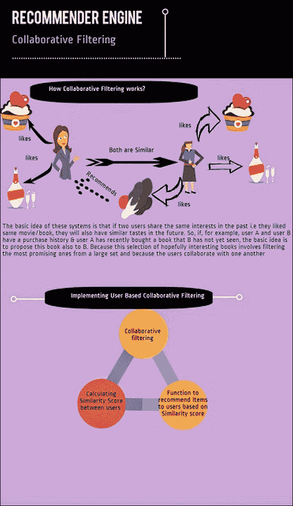

# 构建我们的基本推荐引擎

构建我们的基本推荐引擎的步骤如下：

1.  加载和格式化数据。

1.  计算用户之间的相似度。

1.  预测用户未知的评分。

1.  根据用户相似度评分向用户推荐项目。

这些步骤可以在以下图中看到：


## 加载和格式化数据

用于本章的数据集可以从[`raw.githubusercontent.com/sureshgorakala/RecommenderSystems_R/master/movie_rating.csv`](https://raw.githubusercontent.com/sureshgorakala/RecommenderSystems_R/master/movie_rating.csv)下载。

本章选择的数据集是一个包含六个用户对六部电影评分（评分范围为 0 到 5，以 5 为步长）的电影评分数据集：

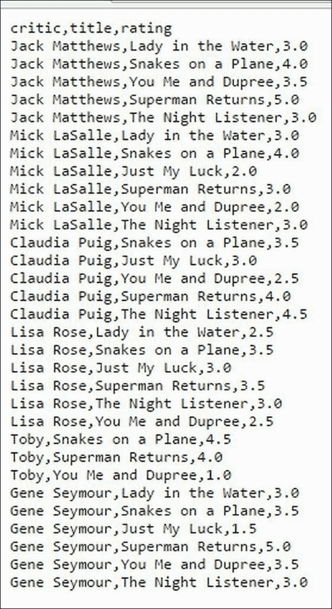

在我们加载数据之前，让我解释一下关于数据的一些事情。选择的数据集是一个逗号分隔的文件，包含六个用户对六部电影从 1 到 5 的评分（以 5 为步长）。并非所有评论家都对该数据集中的所有标题进行了评分。

我们的目标是构建一个推荐引擎，根据相似用户的评分向用户推荐未知电影。

从 R 中的`csv`文件加载数据的代码是`read.csv()`：

```py
ratings = read.csv("~/movie_rating.csv") 

```

使用 R 中的内置函数`head()`可以查看数据的前六行：

```py
head(ratings) 

```

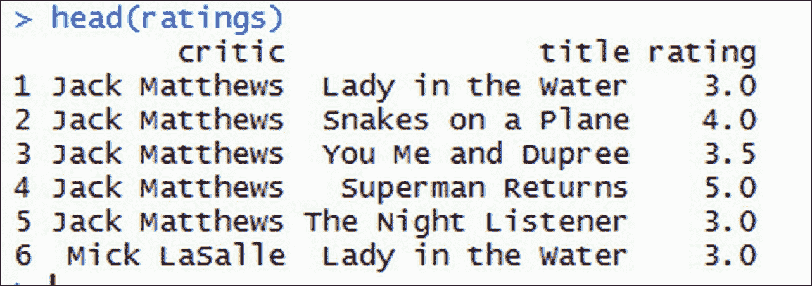

要查看数据集的维度，我们使用 R 中的内置函数`dim()`：

```py
dim(ratings) 
[1] 31  3 

```

要查看输入数据的结构，我们可以在 R 中使用`str()`函数，如下所示：

```py
Str(ratings) 

```

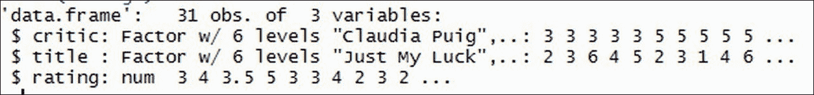

我们可以看到，我们有一个包含 31 个观测值和三个变量（如评论、标题和评分）的数据集。此外，我们还看到有六位评论家对六部电影进行了评分。评分介于 1 到 5 之间。

要查看变量的属性级别，我们使用 R 中的`levels()`：

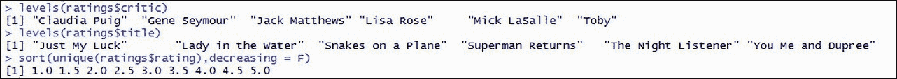

要构建推荐系统，我们需要一个矩阵，其中行包含用户，列包含项目，单元格包含用户对项目的评分。

下一步是将数据排列成对构建推荐引擎有用的格式。当前数据包含一行，包含评论家、标题和评分。这必须转换为包含评论家作为行、标题作为列和评分作为单元格值的矩阵格式。

以下代码帮助我们实现这一点。我们使用`acast()`函数，该函数在`reshape2`包中可用。`reshape2`包是一个流行的 R 包，用于重构数据。`reshape2`包中的`acast()`函数将数据框转换为矩阵表示。

`cast`函数接受评分数据集作为输入，`title`作为行属性，`critic`作为列属性，`rating`作为值。

```py
#data processing and formatting
movie_ratings = as.data.frame(acast(ratings, title~critic,
    value.var="rating"))
```

转换后的数据可以如下查看：

```py
View(movie_ratings) 

```

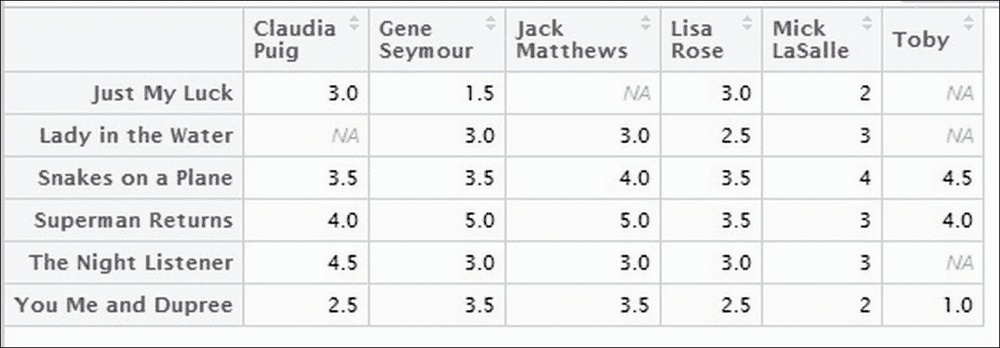

从格式化数据中，我们看到`Toby`评了三部电影。`Lisa Rose`、`Mick LaSalle`和`Gene Seymour`评了所有电影。`Claudia Puig`*和*`Jack Matthews`每人未评一部电影。在这里，让我们回顾一下我们最初在本节开头定义的目标：我们将根据相似用户推荐给评论家他们未评分的电影。例如，我们将根据其他与`Toby`相似的评论家的评分向`Toby`推荐电影。

## 计算用户之间的相似度

这是一个非常重要的步骤，因为我们需要根据其他相似评论家对电影的评分来推荐之前未见过的电影。有各种相似度度量，如欧几里得距离、余弦距离、皮尔逊系数、Jaccard 距离等。这些度量或相似度指标的详细信息在第四章*推荐引擎中使用的数据挖掘技术*中进行了详细解释。

在本章中，我们将使用相关性作为用户之间的相似度度量。选择相关性的原因是相关性表示两个项目之间的关联或两个项目向量如何协变或相互关联。因此，对于本章，我们选择了相关性值作为矩阵中两个项目之间相似度的度量。

在 R 中，我们有`cor()`函数来查找数据集中变量的相关性。以下代码计算了评论家之间的相似度：

在寻找托比与其他评论家之间的相似性时，使用`cor()`函数的`use="complete.obs"`属性来考虑完整的观测值：

```py
sim_users = cor(movie_ratings[,1:6],use="complete.obs") 
View(sim_users) 

```

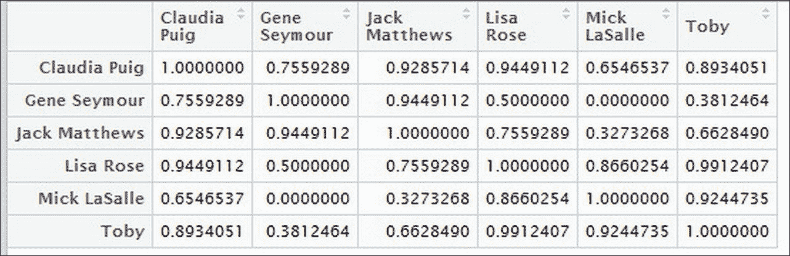

从前面的代码中，我们可以观察到`Lisa Rose`与`Toby`的相似度为`0.99`，与`Mick LaSalle`的相似度为`0.92`。

## 预测用户未知评分

在本节中，我们将使用相似用户的评分来预测托比的未评分电影。以下是实现这一目标的步骤：

1.  提取托比未评分的标题。

1.  对于这些标题，分别提取其他评论家给出的所有评分。

1.  将这些电影给出的评分与除托比以外的所有评论家的相似度值相乘。

1.  对每部电影的总评分进行汇总，然后将这个汇总值除以相似度评论家值的总和。

在我们进入代码之前，让我们了解一下`data.table`包和我们在以下代码中使用的`setDT()`方法。

`Data.table`是一个流行的 R 包，它提供了一个增强的`data.frame`版本，允许我们以闪电般的速度对数据进行操作。`data.table`包的另一个优点是它可以处理非常大的数据集，高达 100 GB 的数据在 RAM 中。各种操作，如创建数据表、数据框的增强版本、数据子集、数据操作、连接等。

对于这个练习，我们使用了`data.table`中可用的`setDT()`方法。`data.table`中的`set*`函数通过引用而不是值来操作输入数据，也就是说，在转换数据时，不会有数据的物理副本。

前面的解释被编写成如下代码：

1.  提取托比未评分的标题。我们使用了`data.table`包中可用的`setDT()`函数来提取未评分的标题并创建一个`data.table`和`data.frame`对象，`rating_critic`。`setDT()`方法提取列值和相应的行名，并创建一个二维`data.frame`或`data.table`对象：

    ```py
            rating_critic  = setDT(movie_ratings[colnames(movie_ratings)
                [6]],keep.rownames = TRUE)[]
            names(rating_critic) = c('title','rating')
            View(rating_critic)
    ```

    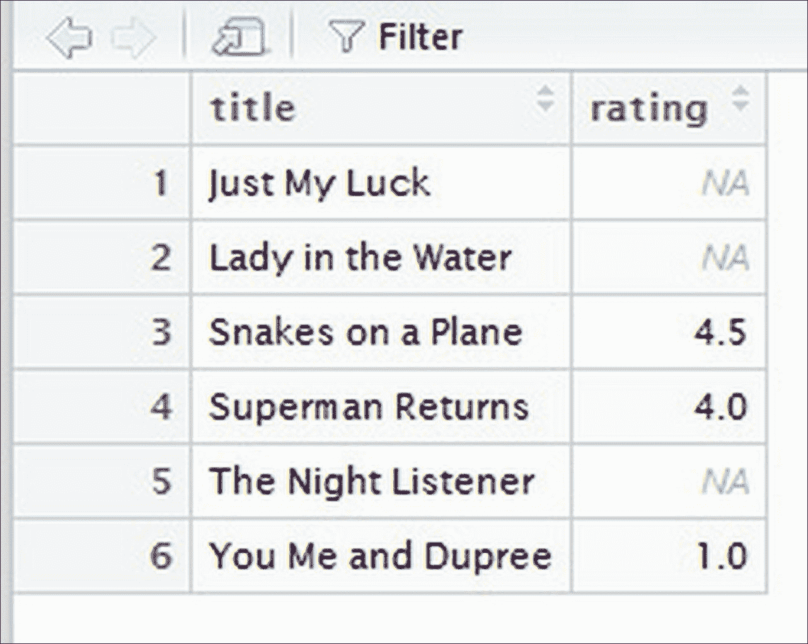

1.  从上述列表中隔离未评分的电影：

    ```py
            titles_na_critic =
                rating_critic$title[is.na(rating_critic$rating)]
            titles_na_critic
    ```

    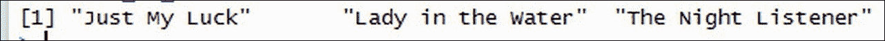

    ### 注意

    请注意，`is.na()`函数用于过滤掉 NA 值。

    根据原始数据集取评分，并子集所有已对上述显示的电影进行评分的评论家。

    在以下代码中，`%in%`充当 SQL 中的 where 条件：

    ```py
            ratings_t =ratings[ratings$title %in% titles_na_critic,]
            View(ratings_t)
    ```

    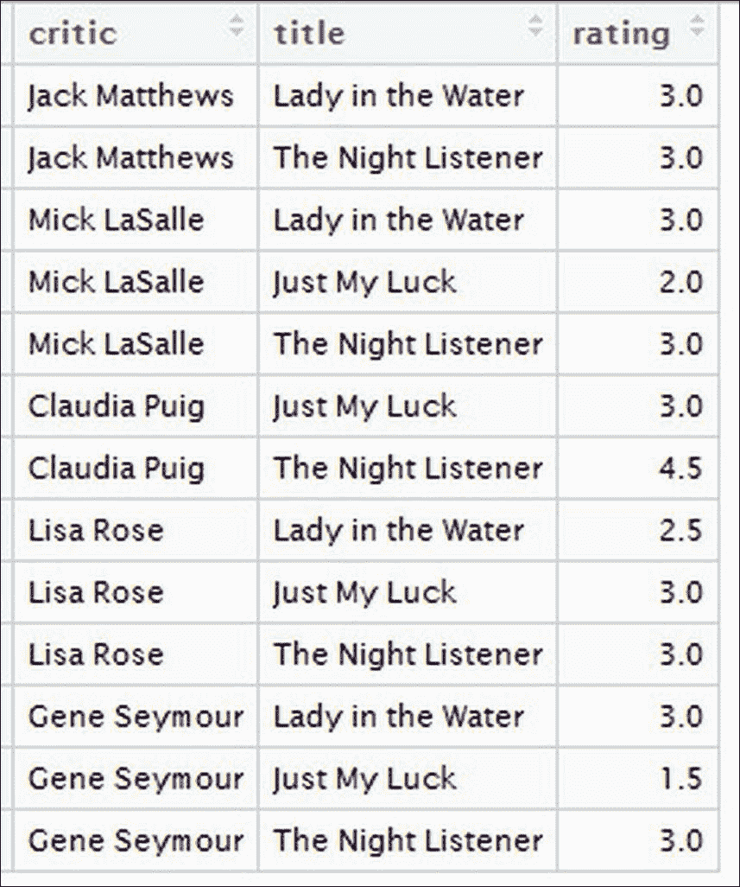

    对于上述数据框，现在让我们添加一个新的变量`similarity`，使用每个`critic`相对于托比的相似度值：

    ```py
            x = (setDT(data.frame(sim_users[,6]),keep.rownames = TRUE)[])
            names(x) = c('critic','similarity')
            ratings_t =  merge(x = ratings_t, y = x, by = "critic", all.x = 
                TRUE)
            View(ratings_t)
    ```

    

1.  将评分与相似度值相乘，并将结果作为新变量`sim_rating`添加：

    ```py
            ratings_t$sim_rating = ratings_t$rating*ratings_t$similarity
                ratings_t
    ```

    

1.  将前一步计算中每个标题的所有评分值汇总，然后除以每个评论家相似度值的总和，即对于`Just My Luck`标题，Toby 的评分是通过将`Just My Luck`的所有`sim_rating`值相加，然后除以所有评价`Just My Luck`标题的评论家的相似度值总和来计算的：

    *(2.6802154+0.5718696+2.9737221+1.8489469)/(0.8934051+0.3812464+0.9912407+0.9244735) = 2.530981*

    之前对所有标题的计算都是在 R 中使用`dplyr`包中的两个函数`group_by()`和`summarise()`完成的。

    `dplyr`包是一个用于数据操作的 R 包。这个包非常有用，就像`data.table`一样；它在探索性分析和数据处理方面非常方便。`summarise()`函数在`dply`包中用于汇总结果。`group_by()`函数用于根据一个或多个变量对数据进行分组。

    `dply`包中可用的`%>%`操作符是一个非常有用的函数，用于将多个代码组合在一起。在以下代码中，我们使用`%>%`代码将`group_by()`和`summarise()`函数组合在一起，并计算结果，而无需编写中间结果：

    ```py
            result = ratings_t %>% group_by(title) %>%
                summarise(sum(sim_rating)/sum(similarity))
            result
            Source: local data frame [3 x 2]
            title sum(sim_rating)/sum(similarity)
            (fctr) (dbl)
            1 Just My Luck 2.530981
            2 Lady in the Water 2.832550
            3 The Night Listener 3.347790
    ```

    您可以看到为 Toby 未评分的三个标题计算或预测的评分。现在您可以推荐这些新标题，其评分高于 Toby 给出的平均评分。例如，Toby 对三个标题的平均评分如下代码所示：

    ```py
            mean(rating_critic$rating,na.rm = T)
            3.166667
    ```

    既然我们知道 Toby 的平均评分是`3.16`，我们就可以推荐评分高于平均值的电影。从预测值中，我们可以推荐电影《The Night Listener》，其评分高于他的平均值。

    所述为所有用户生成推荐的方法可以通过编写以下函数轻松扩展：

    ```py
            generateRecommendations <- function(userId){
            rating_critic = setDT(movie_ratings[colnames(movie_ratings)
                [userId]],keep.rownames = TRUE)[]
            names(rating_critic) = c('title','rating')
            titles_na_critic =
                rating_critic$title[is.na(rating_critic$rating)]
            ratings_t =ratings[ratings$title %in% titles_na_critic,]
            #add similarity values for each user as new variable
            x = (setDT(data.frame(sim_users[,userId]),keep.rownames = TRUE)
                [])
            names(x) = c('critic','similarity')
            ratings_t = merge(x = ratings_t, y = x, by = "critic", all.x = 
                TRUE)
            #mutiply rating with similarity values
            ratings_t$sim_rating = ratings_t$rating*ratings_t$similarity
            #predicting the non rated titles
            result = ratings_t %>% group_by(title) %>%
                summarise(sum(sim_rating)/sum(similarity))
            return(result)
            }
    ```

    现在为每个用户进行预测将非常容易，下面将展示：

    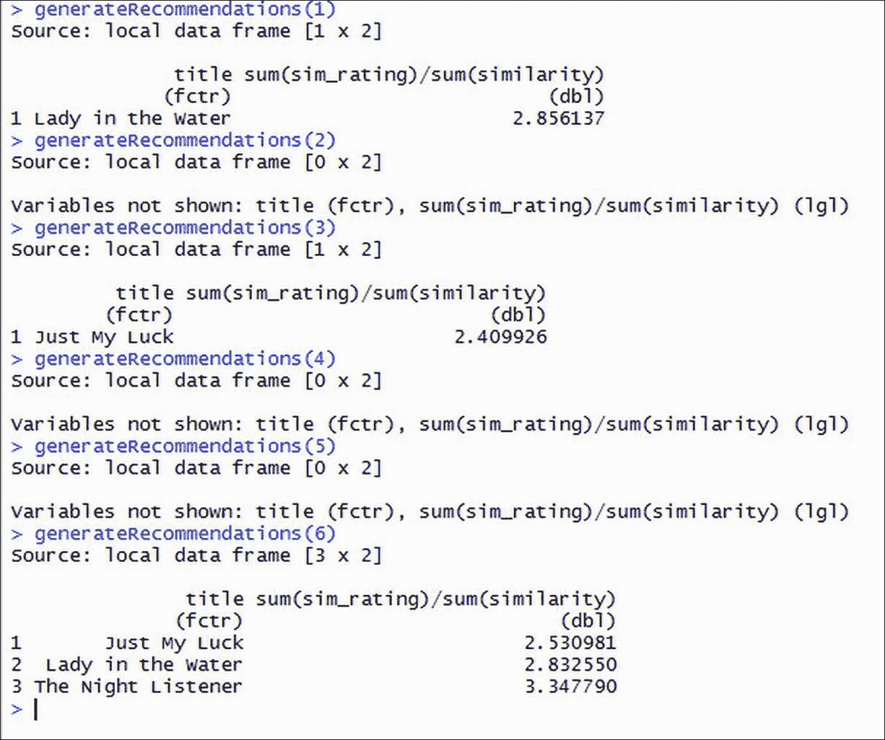

为我们构建了第一个基本推荐系统而感到自豪。现在让我们把到目前为止所写的全部代码放在一起。以下是完全版本的代码：

```py
library(reshape2)
library(data.table)
library(dplyr)
#data loading
ratings = read.csv("C:/Users/Suresh/Desktop/movie_rating.csv")
#data processing and formatting
movie_ratings = as.data.frame(acast(ratings, title~critic, value.var="rating"))
#similarity calculation
sim_users = cor(movie_ratings[,1:6],use="complete.obs")
#sim_users[colnames(sim_users) == 'Toby']
sim_users[,6]
#predicting the unknown values
#seperating the non rated movies of Toby
rating_critic = setDT(movie_ratings[colnames(movie_ratings)[6]],keep.rownames = TRUE)[]
names(rating_critic) = c('title','rating')
titles_na_critic = rating_critic$title[is.na(rating_critic$rating)]
ratings_t =ratings[ratings$title %in% titles_na_critic,]
#add similarity values for each user as new variable
x = (setDT(data.frame(sim_users[,6]),keep.rownames = TRUE)[])
names(x) = c('critic','similarity')
ratings_t = merge(x = ratings_t, y = x, by = "critic", all.x = TRUE)
#mutiply rating with similarity values
ratings_t$sim_rating = ratings_t$rating*ratings_t$similarity
#predicting the non rated titles
result = ratings_t %>% group_by(title) %>% summarise(sum(sim_rating)/sum(similarity))
#function to make recommendations
generateRecommendations <- function(userId){
rating_critic = setDT(movie_ratings[colnames(movie_ratings)[userId]],keep.rownames = TRUE)[]
names(rating_critic) = c('title','rating')
titles_na_critic = rating_critic$title[is.na(rating_critic$rating)]
ratings_t =ratings[ratings$title %in% titles_na_critic,]
#add similarity values for each user as new variable
x = (setDT(data.frame(sim_users[,userId]),keep.rownames = TRUE)[])
names(x) = c('critic','similarity')
ratings_t = merge(x = ratings_t, y = x, by = "critic", all.x = TRUE)
#mutiply rating with similarity values
ratings_t$sim_rating = ratings_t$rating*ratings_t$similarity
#predicting the non rated titles
result = ratings_t %>% group_by(title) %>% summarise(sum(sim_rating)/sum(similarity))
return(result)
}
```

# 摘要

恭喜！我们已经使用 R 构建了一个非常基本的推荐引擎。我们看到了构建推荐引擎的逐步方法。在接下来的章节中，我们将学习不同类型的推荐引擎及其在各种技术中的实现，例如 Spark、Mahout、Neo4j、R 和 Python。在下一章中，我们将深入了解各种类型的推荐引擎。
