# 第七章：使用 Spark 构建实时推荐引擎

在这个时代，构建可扩展的实时推荐的需求日益增长。随着越来越多的互联网用户使用电子商务网站进行购买，这些电子商务网站已经意识到理解用户购买行为模式以改善其业务、在非常个性化的层面上服务客户的潜力。为了构建一个能够满足庞大用户群并实时生成推荐的系统，我们需要一个现代、快速可扩展的系统。专为分布式内存数据处理设计的**Apache Spark**框架为我们提供了帮助。Spark 通过对分布式数据进行一系列转换和操作来构建实时数据挖掘应用。

在前面的章节中，我们学习了实现基于相似度的协同过滤方法，例如基于用户的协同过滤和基于内容的协同过滤。尽管基于相似度的方法在商业应用中取得了巨大成功，但基于模型的推荐模型也应运而生，例如矩阵分解模型，这些模型提高了推荐引擎模型的性能。在本章中，我们将学习基于模型的协同过滤方法，远离基于启发式的相似度方法。此外，我们还将关注使用 Spark 实现基于模型的协同过滤方法。

在本章中，我们将学习以下内容：

+   Spark 2.0 有什么新功能

+   设置 pyspark 环境

+   基本 Spark 概念

+   MLlib 推荐引擎模块

+   交替最小二乘算法

+   Movielens-100k 数据集的数据探索

+   使用 ALS 构建基于模型的推荐引擎

+   评估推荐引擎模型

+   参数调整

# 关于 Spark 2.0

**Apache Spark**是一个快速、强大、易于使用、分布式、内存中、开源的集群计算框架，旨在执行高级分析。它最初于 2009 年在加州大学伯克利分校开发。自推出以来，Spark 已被众多行业的众多企业广泛采用。

Spark 的主要优势之一是它为我们移除了所有复杂性，例如资源调度、作业提交、执行、跟踪、节点间通信、容错以及所有并行处理固有的低级操作。Spark 框架帮助我们编写在集群上并行运行的程序。

Spark 可以以独立模式或集群模式运行。Spark 可以轻松集成到 Hadoop 平台中。

作为一种通用计算引擎，Spark 凭借其内存数据处理能力和易于使用的 API，使我们能够高效地处理各种大规模数据处理任务，例如流应用、机器学习或对大型数据集进行迭代访问的交互式 SQL 查询。

Spark 可以轻松地与许多应用程序、数据源、存储平台和环境集成，并暴露 Java、Python 和 R 的高级 API 以进行工作。Spark 已被证明在机器学习和迭代分析之外，对于广泛的规模数据处理任务具有广泛的应用价值。

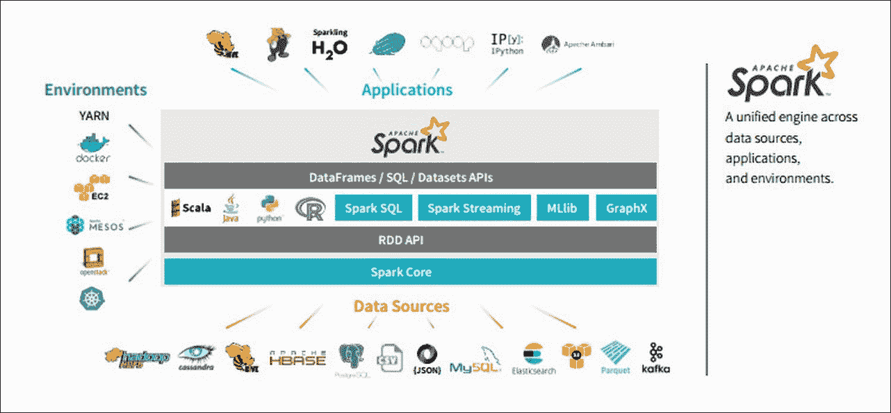

信用：Databricks

## Spark 架构

Apache Spark 生态系统包含许多组件，用于处理分布式、内存中以及机器学习数据处理工具。Spark 的主要组件将在以下子节中讨论。Spark 基于主从架构；高级架构如下所示：

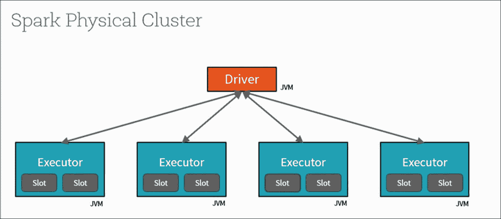

信用：Databricks

Spark 集群采用主从架构。Spark Core 执行引擎接受来自客户端的请求并将它们传递给主节点。主节点中的驱动程序程序与工作节点执行器通信以完成任务，如下所示：

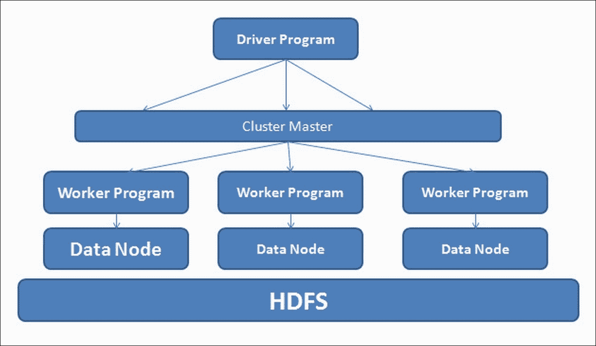

**Spark 驱动程序程序**：驱动程序程序在 Spark 集群中充当主节点，为主应用提供 SparkContext。它接收客户端请求并与管理工作节点的集群管理器协调。驱动程序程序将原始请求拆分为任务并将它们调度到工作节点上的执行器上运行。Spark 中的所有进程都是 Java 进程。SparkContext 创建**弹性分布式数据集**（**RDD**），这是一个不可变、可分发的数据集集合，分布在节点之间，并执行一系列转换和操作以计算最终输出。我们将在后面的章节中了解更多关于 RDD 的信息。

**工作节点**：工作节点包含执行器，实际任务执行以 Java 进程的形式发生。每个工作节点运行自己的 Spark 实例，是 Spark 中的主要计算节点。当创建 SparkContext 时，每个工作节点启动自己的执行器以接收任务。

**执行器**：这些是 Spark 应用程序的主要任务执行器。

## Spark 组件

在本节中，我们将看到 Spark 生态系统的核心组件。以下图表显示了 Apache Spark 生态系统：

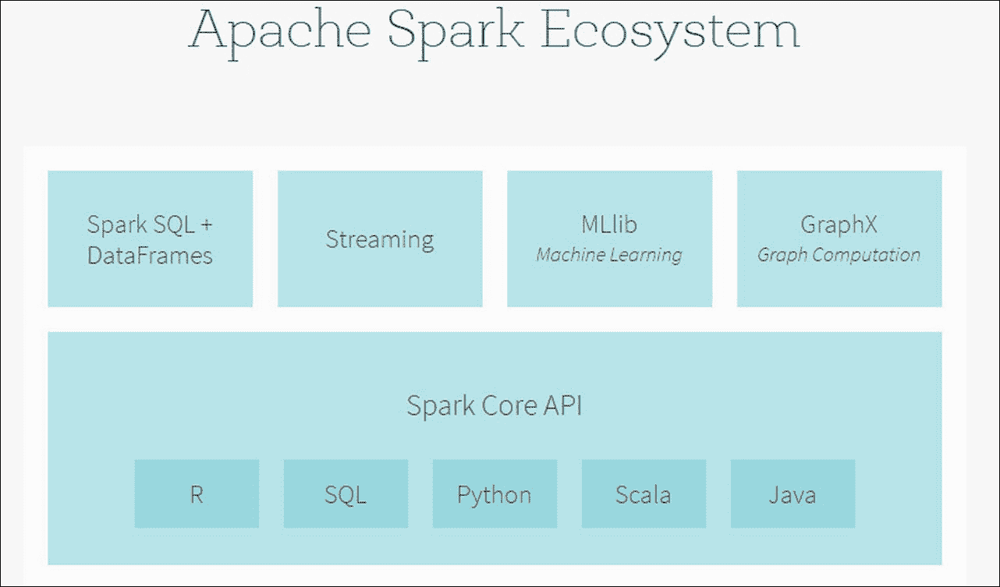

信用：Databricks

## Spark Core

**Spark Core**是 Spark 平台的核心部分：执行引擎。所有其他功能都是建立在 Spark Core 之上的。这提供了 Spark 的所有功能，如内存中分布式计算、快速且易于使用的 API。

### 使用 Spark SQL 的 Structured 数据

**Spark SQL**是 Spark Core 之上的一个组件。它是一个提供对结构化和半结构化数据支持的 Spark 模块。

Spark SQL 提供了一种统一的方法，允许用户以交互式 SQL 类型查询数据对象，例如应用选择，您可以通过数据抽象 API（如 DataFrame）按操作类型对数据对象进行分组。

将大量时间投入到数据探索、探索性分析和类似 SQL 的交互中。Spark SQL，它提供了 DataFrame，还充当一个分布式 SQL 查询引擎；例如，在 R 中，Spark 2.0 的 DataFrame 将数据存储为行和列，允许以 SQL 表的形式访问，其中包含所有结构信息，如数据类型。

### 使用 Spark Streaming 进行流式分析

**Spark Streaming** 是另一个 Spark 模块，它允许用户实时处理和分析批量和流式数据，以执行交互式和分析应用。Spark Streaming 提供了高级抽象**离散流**（**DStream**），以表示连续的数据流。

Spark Streaming API 的主要特性如下：

+   可扩展

+   高吞吐量

+   容错

+   处理实时流入的数据流

+   可以连接到实时数据源，并实时处理实时传入的数据

+   可以在流式数据上应用复杂的机器学习和图处理算法

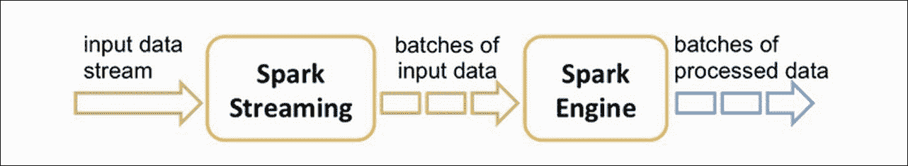

### 使用 MLlib 进行机器学习

**MLlib** 是 Spark 中另一个模块，建立在 Spark Core 之上。这个机器学习库的开发目标是使实用的机器学习可扩展且易于使用。

这个库为数据科学家提供了以下工具：

+   用于回归、分类、聚类和推荐引擎的机器学习算法

+   特征提取、特征转换、降维和特征选择

+   用于简化机器学习过程的管道工具，包括构建、评估和调整解决机器学习问题的过程

+   存储和加载机器学习模型和管道的持久性

+   诸如线性代数和统计任务之类的实用工具

当启动 Spark 2.0 时，旧的 MLlib 模型被替换为使用 DataFrame API 构建的 ML 库，提供了更多优化，并使所有语言的 API 统一。

### 使用 GraphX 进行图计算

**GraphX** 是一个用于构建基于图系统的 Spark 新 API。它是一个图并行处理计算引擎和分布式框架，建立在 Spark Core 之上。该项目始于将图并行和数据分布框架统一到单个 Spark API 的目标。GraphX 允许用户以 RDD 和图的形式处理数据。

GraphX 提供了许多功能，例如以下：

+   属性图

+   基于图的算法，如 PageRank、连通组件和 Graph Builders，用于构建图

+   基本图计算组件，如子图、joinVertices、aggregateMessages、Pregel API 等

尽管图模型不在此书的范围内，我们将在第八章中学习一些图应用的基本原理，*使用 Neo4j 构建实时推荐*。

## Spark 的优势

Spark 的主要优势是速度快，具有内存框架，包含多个 API，使其非常易于使用，其统一引擎适用于大量数据，以及其机器学习组件。与具有批量模式的 Map-Reduce 模型相比，Spark 更快，具有实时和易于编码的框架。

以下图表显示了上述提到的优势：

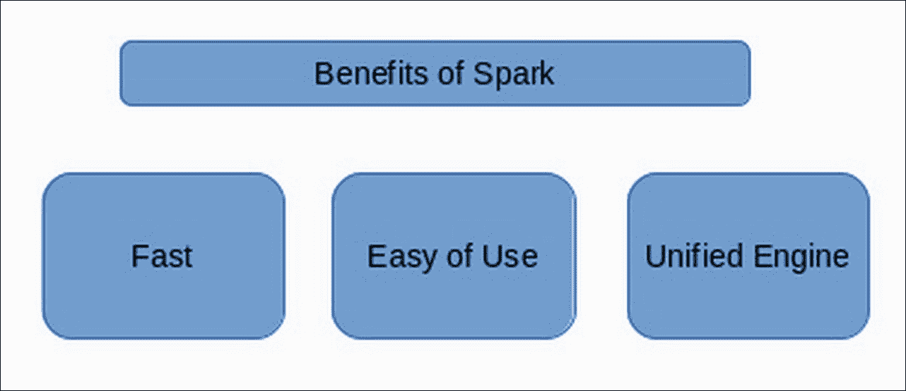

## 设置 Spark

Spark 可以在 Windows 和类 UNIX 系统（例如 Linux、Mac OS）上运行。在单台机器上本地运行很简单；您只需要在系统 PATH 或`JAVA_HOME`环境变量中安装 Java 即可。

Spark 在 Java 7+、Python 2.6+/3.4+和 R 3.1+上运行。对于 Scala API，Spark 2.0.0 使用 Scala 2.11。您需要使用兼容的 Scala 版本（2.11.x）。

从项目网站的下载页面获取 Spark：

[`d3kbcqa49mib13.cloudfront.net/spark-2.0.0-bin-hadoop2.7.tgz`](http://d3kbcqa49mib13.cloudfront.net/spark-2.0.0-bin-hadoop2.7.tgz)

为了访问**Hadoop 分布式文件系统**（**HDFS**）以及标准和自定义 Hadoop 输入源，Spark 需要针对特定版本的 Hadoop 进行构建。

为了运行，Spark 需要 Scala 编程语言（本书撰写时为版本 2.10.4）。幸运的是，预构建的二进制包包含了 Scala 运行时包，因此您无需单独安装 Scala 即可开始。但是，您需要安装**Java 运行时环境**（**JRE**）或**Java 开发工具包**（**JDK**）（请参阅本书代码包中的软件和硬件列表以获取安装说明）。

下载 Spark 二进制包后，请运行以下命令解压包内容并将其更改到新创建的目录中：

```py
tar xfvz spark-2.0.0-bin-hadoop2.7.tgz 
cd spark-2.0.0-bin-hadoop2.7

```

Spark 将用户脚本放置在 bin 目录中以运行 Spark。您可以通过运行 Spark 中包含的示例程序之一来测试是否一切正常：

```py
------------------ 
./bin/run-example org.apache.spark.examples.SparkPi 
16/09/26 15:20:36 INFO DAGScheduler: Job 0 finished: reduce at SparkPi.scala:38, took 0.845103 s 
Pi is roughly 3.141071141071141 
--------------------

```

您可以使用以下命令使用 Scala 与 Spark 进行交互式运行：

```py
./bin/spark-shell --master local[2]

```

`--master`选项指定了分布式集群的主 URL，或者您可以使用`local`在本地使用一个线程运行，或者使用`local[N]`在本地使用 N 个线程运行。您应该从使用`local`进行测试开始。要获取完整的选项列表，请使用`--help`选项运行 Spark shell。

来源：[`spark.apache.org/docs/latest/`](http://spark.apache.org/docs/latest/)

## 关于 SparkSession

从 Spark 2.0 开始，`SparkSession` 将成为 Spark 应用的入口点。`SparkSession` 作为对底层 Spark 功能和 Spark 编程能力（如 DataFrame API 和 Dataset API）的主要交互访问点，我们使用 `SparkSession` 来创建 DataFrame 对象。

在 Spark 的早期版本中，我们通常使用 `SparkConf`、`SparkContext` 或 `SQLContext` 与 Spark 进行交互，但自从 Spark 2.0 以来，这已经由 `SparkSession` 通过封装 `SparkConf` 和 `SparkContext` 自动处理。

当你在 shell 命令中启动 Spark 时，`SparkSession` 会自动创建为 `spark`

我们可以按如下方式程序化地创建 `SparkSession`：

```py
spark = SparkSession\ 
    .builder\ 
    .appName("recommendationEngine")\ 
     config("spark.some.config.option", "some-value")\ 
    .getOrCreate() 

```

## 弹性分布式数据集（RDD）

Spark 的核心是弹性分布式数据集，简称 RDD。RDD 是一个不可变分布式集合，包含你数据中某些数据类型的对象，分布在集群的节点上。这个 RDD 是容错的，也就是说，系统具有在发生故障时能够持续运行的能力，即使是通过重建失败的分区。

简而言之，我们可以这样说，RDD 是一种分布式数据集抽象，它允许以容错方式在非常大的集群系统中进行迭代操作。

RDD 可以通过多种方式创建，例如并行化现有数据对象集合，或引用外部文件系统，如 HDFS：

从现有数据对象创建 RDD：

```py
coll = List("a", "b", "c", "d", "e") 

rdd_from_coll = sc.parallelize(coll) 

```

从引用的文件创建 RDD：

```py
rdd_from_Text_File = sc.textFile("testdata.txt") 

```

RDD 支持两种类型的操作：

+   **转换**：此操作从现有的 RDD 创建新的 RDD，这些 RDD 是不可变的

+   **动作**：此操作在执行数据集上的计算后返回值

这些 RDD 转换仅在需要最终结果时才会被惰性执行。我们可以重新创建或重新计算 RDD 任意次数，或者如果我们知道我们可能需要在将来使用它们，我们可以通过在内存中缓存它们来持久化它们。

## 关于 ML 流程

Spark 2.0 中的 ML 流程 API 是在解决机器学习问题时使用标准工作流程的方式。每个机器学习问题都将经历一系列步骤，如下所示：

1.  加载数据。

1.  特征提取。

1.  模型训练。

1.  评估。

1.  预测。

1.  模型调优。

如果我们仔细观察上述步骤，我们可以看到以下内容：

+   机器学习过程遵循一系列步骤，就像一个工作流程。

+   在解决机器学习问题时，我们通常需要不止一个算法；例如，一个文本分类问题可能需要一个特征提取算法来进行特征提取。

+   在测试数据上生成预测可能需要许多数据转换或数据预处理步骤，这些步骤在模型训练期间使用。例如，在文本分类问题中，在测试数据上做出预测涉及数据预处理步骤，如标记化和特征提取，然后再将这些步骤应用于在训练数据创建模型时使用的生成的分类模型。

前面的步骤是引入 ML Pipeline API 的主要动机之一。ML Pipeline 模块允许用户定义一系列阶段，使得使用起来非常方便。API 框架允许 ML 流程在分布式平台上进行扩展，并适应非常大的数据集，重用一些组件，等等。

ML Pipeline 模块的组件如下：

+   **DataFrame**：如前所述，DataFrame 是在 Spark 框架中表示数据的一种方式。

+   **转换器**：转换器接收输入 DataFrame 并将数据转换成新的 DataFrame。转换器类包含 `transform()` 方法来进行转换。

+   **估算器**：估算器计算最终结果。估算器类使用 `fit()` 方法来计算结果。

+   **管道**：这是一个将转换器和估算器堆叠为工作流程的集合。

+   **参数**：这指的是转换器和估算器都可能使用的参数集。

我们将以简单的文本文档工作流程为例来展示这一点。以下图是管道的训练时间使用情况：

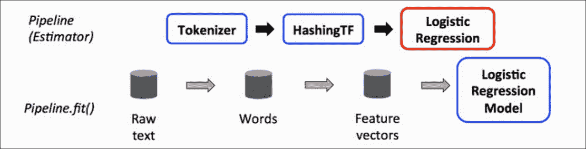

下面是对前面图中所示步骤的解释。蓝色框是转换器，红色框是估算器。

1.  Tokenizer 转换器接收 DataFrame 的文本列作为输入，并返回一个包含标记的新 DataFrame 列。

1.  HashingTF 转换器接收来自前一步骤的标记 DataFrame 作为输入，并创建新的 DataFrame 特征作为输出。

1.  现在，LogisticRegression 估算器接收特征 DataFrame，拟合逻辑回归模型，并创建一个 PipelineModel 转换器。

首先，我们构建一个管道，这是一个估算器，然后在这个管道上应用 `fit()` 方法，这将产生一个 PipelineModel，这是一个转换器，可以在测试数据或预测时使用。

来源：[`spark.apache.org/docs/latest/ml-guide.html`](http://spark.apache.org/docs/latest/ml-guide.html)

下图展示了这种用法：

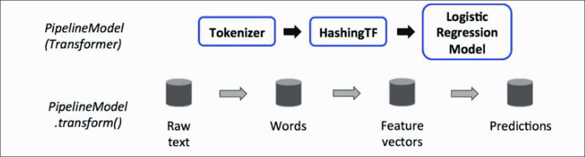

在前面的图中，当我们想要在测试数据上做出预测时，我们观察到测试数据首先必须通过一系列数据预处理步骤，这些步骤与上述训练步骤非常相似。预处理步骤完成后，测试数据的特征应用于逻辑回归模型。

为了使数据预处理和特征提取步骤相同，我们将通过调用 `transform()` 将测试数据传递给 PipelineModel（逻辑回归模型）以生成预测。

# 使用交替最小二乘法的协同过滤

在本节中，让我们解释矩阵分解模型（MF）和交替最小二乘法。在我们了解矩阵分解模型之前，我们再次定义目标。想象一下，我们有一些用户对物品给出的评分。让我们用矩阵形式定义用户对物品给出的评分，如下所示：

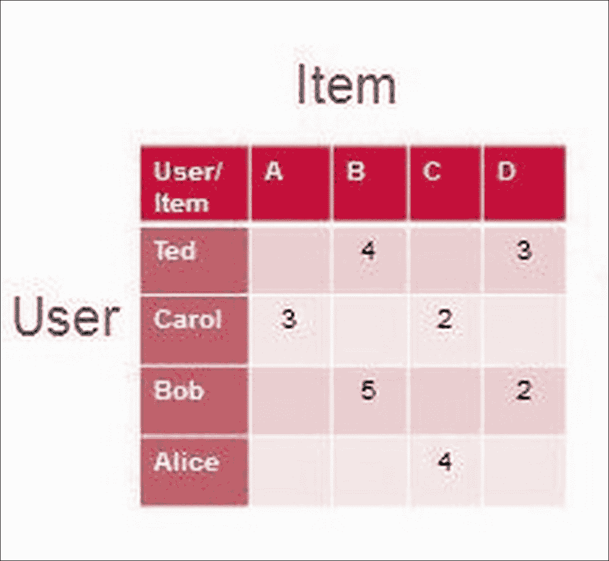

在前面的图中，我们观察到用户 Ted 分别对物品 B 和 D 给出了 4 和 3 的评分。在协同过滤方法中，在生成推荐之前的第一步是填充空白区域，即预测未评分的项。一旦填充了未评分项的评分，我们通过对新填充的项进行排序，向用户推荐新的物品。

在前面的章节中，我们已经看到了使用欧几里得距离和余弦距离的邻近方法来预测缺失值。在本节中，我们将采用一种新的方法来填充缺失的非评分项。这种方法被称为矩阵分解法。这是一个数学方法，它使用矩阵分解方法。该方法解释如下：

一个矩阵可以被分解成两个低秩矩阵，当它们相乘时，将得到一个与原始矩阵近似相等的单个矩阵。

假设一个大小为 *U X M* 的评分矩阵 *R* 可以分解成两个低秩矩阵 *P* 和 *Q*，分别具有大小 *U X K* 和 *M X K*，其中 *K* 被称为矩阵的秩。

在以下示例中，假设原始矩阵的大小为 *4 X 4* 被分解成两个矩阵：*P (4 X 2)* 和 *Q (4 X 2)*。将 *P* 和 *Q* 相乘将给出原始矩阵的大小 *4 X 4* 以及与原始矩阵值大致相等的值：

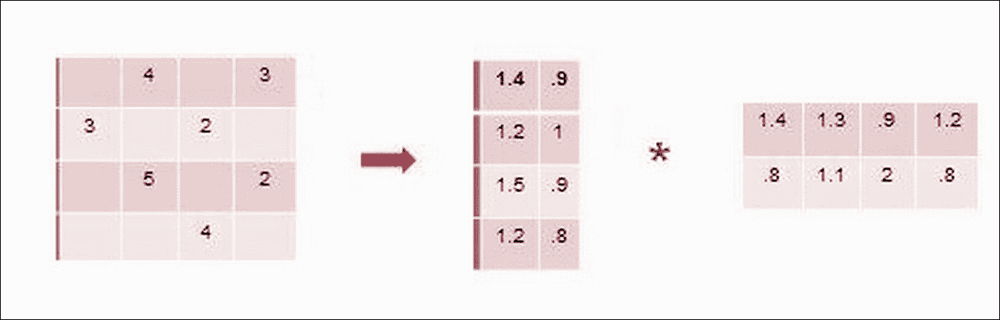

矩阵分解原理用于推荐引擎中，以填充未评分的项。将上述原理应用于推荐引擎的假设是，用户对物品给出的评分基于一些潜在特征。这些潜在特征适用于用户和物品，也就是说，用户因为对某个物品的个人偏好而评分该物品。同样，用户因为物品的某些特征而评分物品。

使用这个假设，当矩阵分解方法应用于评分矩阵时，我们将原始评分矩阵分解成两个矩阵，如下所示：用户潜在因子矩阵 *P* 和物品潜在因子矩阵：

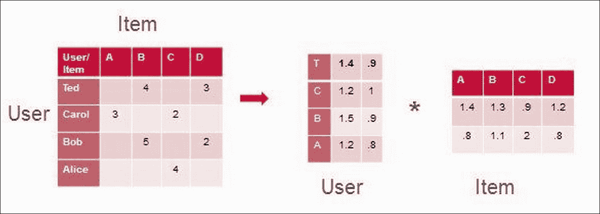

现在，让我们回到机器学习方法；你一定想知道这种方法中的学习是什么。观察以下公式：

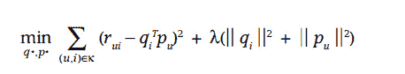

我们已经了解到，当我们乘回两个潜在因子矩阵时，我们得到近似的原始矩阵。现在，为了提高模型的准确性，即学习最优的因子向量 P 和 Q，我们定义了一个优化函数，如前一个公式所示，该函数最小化了原始评分矩阵与潜在矩阵乘积后的结果之间的正则化平方误差。前一个方程的后半部分是施加的正则化，以避免过拟合。

**交替最小二乘法**是用于最小化上述损失函数的优化技术。通常，我们使用随机梯度下降来优化损失函数。对于 Spark 推荐模块，ALS 技术已被用于最小化损失函数。

在 ALS 方法中，我们通过交替固定两个因子向量中的一个来计算最优的潜在因子向量，即通过固定物品-潜在特征向量作为常数来计算用户潜在向量，反之亦然。

ALS 方法的主要优点如下：

+   此方法可以轻松并行化

+   在大多数情况下，我们在推荐引擎问题中处理稀疏数据集，与随机梯度下降相比，ALS 在处理稀疏性方面更有效率。

spark.ml 中推荐引擎模块的 Spark 实现具有以下参数：

+   **numBlocks**: 这是指用户和物品将被划分成多少个块以并行化计算（默认为 10）

+   **rank**: 这指的是模型中的潜在因子数量（默认为 10）

+   **maxIter**: 这是运行的最大迭代次数（默认为 10）

+   **regParam**: 此参数指定 ALS 中的正则化参数（默认为 0.1）

+   **implicitPrefs**: 此参数指定是否使用显式反馈的 ALS 变体或适用于隐式反馈数据的变体（默认为 false，表示使用显式反馈）

+   **alpha**: 这是适用于 ALS 隐式反馈变体的参数，它控制偏好观察的基线置信度（默认为 1.0）

+   **nonnegative**: 此参数指定是否为最小二乘法使用非负约束（默认为 false）

# 基于 pyspark 的模型推荐系统

用例的软件细节如下：

+   Spark 2.0

+   Python API: pyspark

+   Centos 6

+   Python 3.4

使用 pyspark 启动 Spark 会话，如下所示：

```py
pyspark
```

以下截图显示了运行上述`pyspark`命令创建的 Spark 会话：

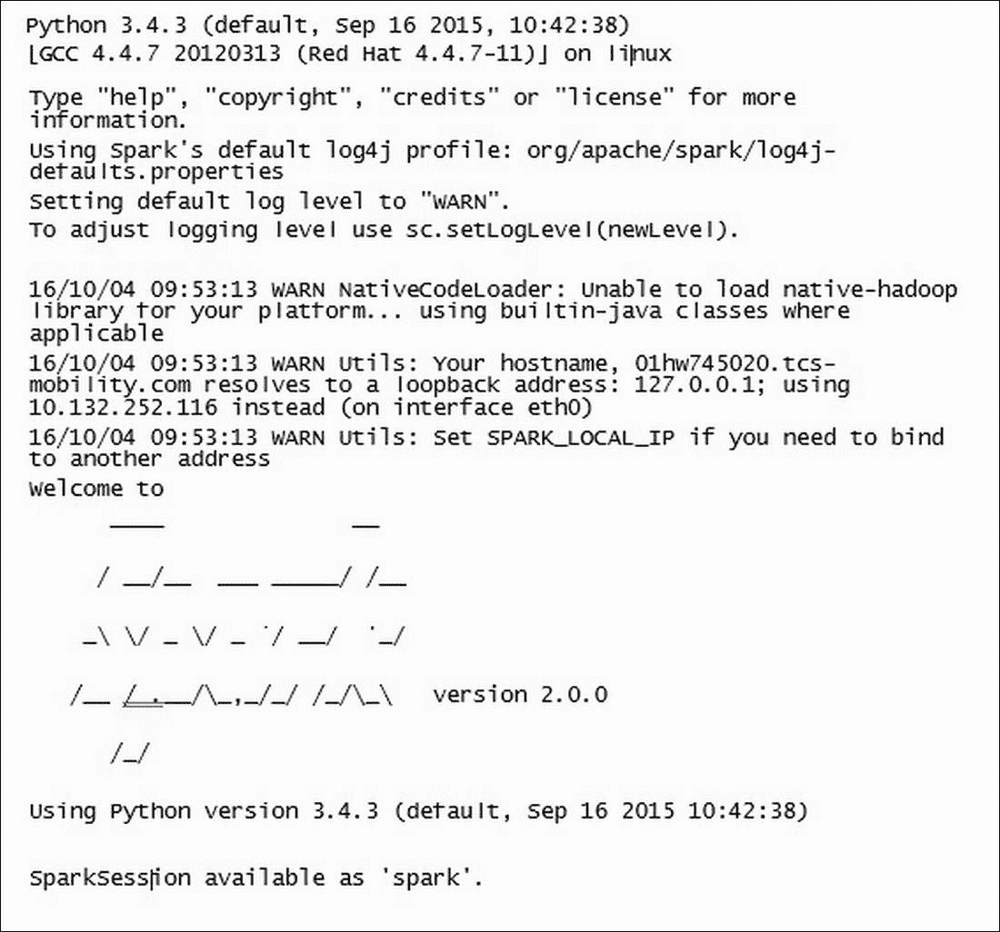

要使用 Spark 构建推荐引擎，我们利用 Spark 2.0 的能力，如 DataFrame、RDD、Pipelines 和 Transforms，这些在 Spark MLlib 中已有解释。

与早期启发式方法不同，例如用于构建推荐引擎的 k-最近邻方法，在 Spark 中，使用矩阵分解方法构建推荐引擎，交替最小二乘（ALS）方法用于生成基于模型的协同过滤。

# MLlib 推荐引擎模块

在本节中，我们将了解 MLlib 推荐引擎模块中存在的不同方法。当前的推荐引擎模块帮助我们使用交替最小二乘矩阵分解模型构建基于模型的协同过滤方法来生成推荐。

构建协同过滤的主要方法如下：

+   `ALS()`: 调用 `ALS()` 构造函数并使用所有必需的参数创建其实例，例如用户列名、项目列名、评分列名、排名、正则化参数（regParam）、最大迭代次数（maxIter）等。

+   `fit()`: 使用 `fit()` 方法生成模型。此方法接受以下参数：

    +   `dataset`: 输入数据集，类型为 `pyspark.sql.DataFrame`([`spark.apache.org/docs/latest/api/python/pyspark.sql.html#pyspark.sql.DataFrame`](http://spark.apache.org/docs/latest/api/python/pyspark.sql.html#pyspark.sql.DataFrame))

    +   `params`: 这是一个可选的参数映射，其中包含上述列出的必需参数。

    +   返回：`fit()` 方法返回拟合模型。

+   `Transform()`: 使用 `transform()` 方法生成预测。`transform()` 方法接受以下内容：

    +   测试数据（DataFrame 数据类型）

    +   可选的附加参数，其中包含先前定义的参数。

    +   返回预测（DataFrame 对象）

# 推荐引擎方法

现在我们来实际实现推荐引擎。我们使用以下方法在 Spark 中构建推荐引擎：

1.  启动 Spark 环境。

1.  加载数据。

1.  探索数据源。

1.  使用 MLlib 推荐引擎模块和 ALS 实例生成推荐。

1.  生成推荐。

1.  评估模型。

1.  使用交叉验证方法，应用参数调整模型调整参数并选择最佳模型，然后生成推荐。

## 实现

与任何其他推荐引擎一样，第一步是将数据加载到分析环境中（在我们的案例中是 Spark 环境）。当我们启动 2.0 版本的 Spark 环境时，SparkContext 和 SparkSession 将在加载时创建。

在我们进入实现部分之前，让我们回顾一下数据。在本章中，我们使用 MovieLens 100K 数据集来构建基于用户和基于物品的协同过滤推荐引擎。该数据集包含 943 个用户对 1,682 部电影的评分。评分在 1-5 的范围内。

作为第一步，我们将使用 SparkContext (sc) 将数据加载到 Spark 环境中。

### 数据加载

加载数据，请运行以下命令：

```py
data = sc.textFile("~/ml-100k/udata.csv")
```

加载的数据将是 spark RDD 类型 - 运行以下命令以找出数据对象的数据类型：

```py
type(data)
<class 'pyspark.rdd.RDD'>

```

加载数据的总长度如下所示：

```py
data.count()
100001
```

要加载已加载数据中的第一条记录：

```py
data.first()
'UserID\tItemId \tRating\tTimestamp'

```

我们可以看到，标题信息位于数据对象的第一行，由 `\t` 分隔；数据对象的列名为 `UserID`、`ItemId`、`Rating` 和 `Timestamp`。

对于我们的目的，我们不需要时间戳信息，因此我们可以从数据 RDD 中删除此字段：

要检查数据 RDD 的前 5 行，我们使用 take() 动作方法：

```py
data.take(5)
['UserID\tItemId \tRating\tTimestamp', '196\t242\t3\t881250949', '186\t302\t3\t891717742', '22\t377\t1\t878887116', '244\t51\t2\t880606923']

```

MLlib 推荐引擎模块期望数据不包含任何标题信息。因此，让我们删除标题信息，即从数据 RDD 对象中删除第一行，如下所示：

从数据 RDD 对象中提取第一行：

```py
header = data.first()
```

使用 `filter()` 方法和 lambda 表达式从数据中删除第一行标题。下面的 lambda 表达式应用于每一行，并且每一行都与标题进行比较，以检查提取的行是否为标题。如果发现提取的行是标题，则该行将被过滤：

```py
data = data.filter(lambda l:l!=header)
```

现在我们检查数据 RDD 对象的计数；它已从 100001 减少到 100000：

```py
data.count()
100000
```

现在我们检查第一行，我们可以观察到标题已经成功删除：

```py
data.first()
'196\t242\t3\t881250949'
```

现在我们已经将数据加载到 Spark 环境中，让我们将数据格式化为适当的形状，如下所示：

1.  加载用于构建推荐引擎所需的函数，例如 ALS、矩阵分解模型和 Rating 函数，来自 MLlib 推荐模块。

1.  从数据 RDD 中提取每一行，并使用 `map()` 和 lambda 表达式通过 `\t` 分隔每个列。

1.  在结果集中，让我们为之前步骤中提取的每一行创建一个 Rating 行对象

1.  当以下表达式应用于整个数据集时，将创建一个管道化的 RDD 对象：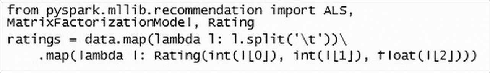

使用 type 检查 ratings 对象的数据类型：

```py
type(ratings)
<class 'pyspark.rdd.PipelinedRDD'>
```

通过运行以下代码检查 ratings PipelinedRDD 对象的前 5 条记录：

```py
ratings.take(5)

[Rating(user=196, product=242, rating=3.0), Rating(user=186, product=302, rating=3.0), Rating(user=22, product=377, rating=1.0), Rating(user=244, product=51, rating=2.0), Rating(user=166, product=346, rating=1.0)]
```

我们可以从前面的结果中观察到，原始原始数据 RDD 对象中的每一行都变成了 Rating 行对象的一种列表，堆叠成 PipelinedRDD。

### 数据探索

现在我们已经加载数据，让我们花些时间探索数据。让我们使用 Spark 2.0 DataFrame API 功能来探索数据：

通过首先选择`'user'`列，然后使用`distinct()`函数来移除重复的`userId`来计算唯一用户的总数：

```py
df.select('user').distinct().show(5)
```

以下截图显示了上一个查询的结果：

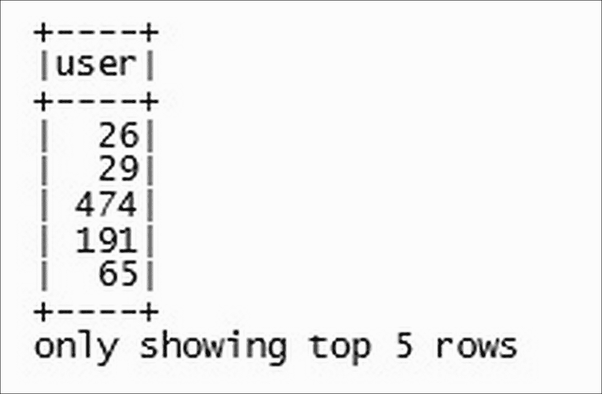

唯一用户的总数：

```py
df.select('user').distinct().count()
943
```

唯一物品的总数：

```py
df.select('product').distinct().count()
1682
```

显示前 5 个唯一产品：

```py
df.select('product').distinct().show(5)
```

以下截图显示了上一个查询的结果：

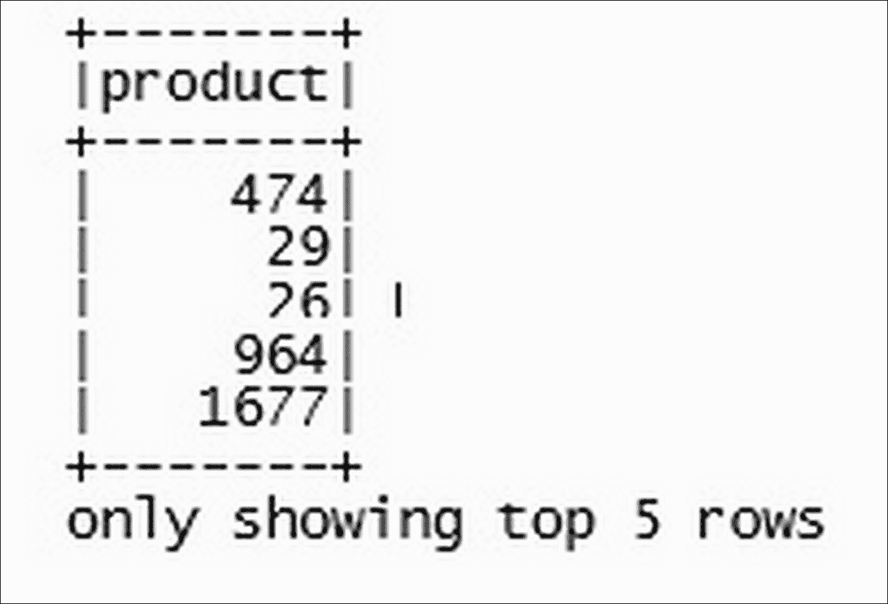

每个用户评价的产品数量：

```py
df.groupBy("user").count().take(5)

[Row(user=26, count=107), Row(user=29, count=34), Row(user=474, count=327), Row(user=191, count=27), Row(user=65, count=80)]
```

之前的结果解释说用户 26 评价了 107 部电影，用户 29 评价了 34 部电影。

每个评分类型的记录数：

```py
df.groupBy("rating").count().show()
```

以下截图显示了之前查询的结果：

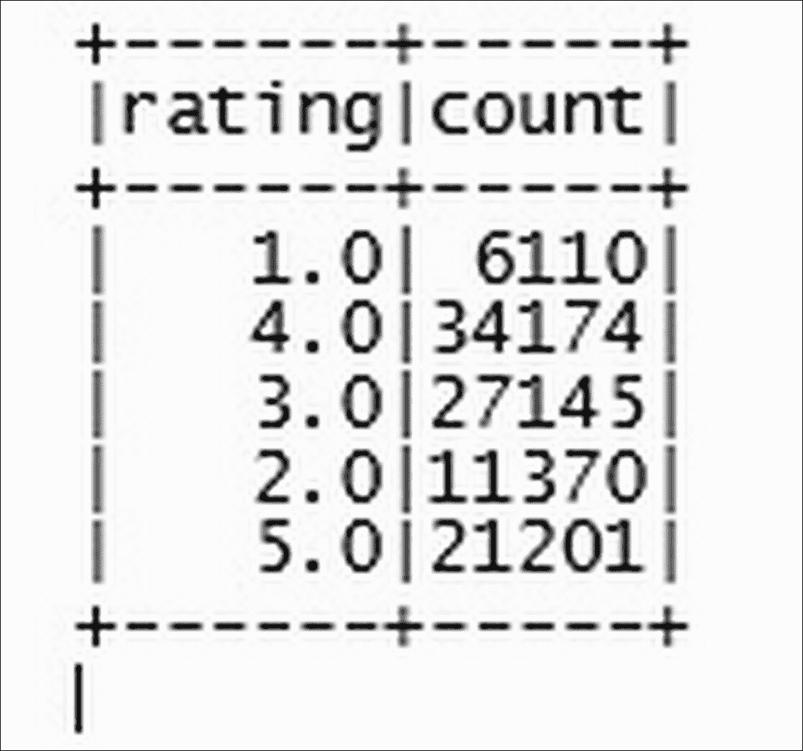

在以下代码中，我们使用了 Python 中的`numpy`科学计算包，用于处理数组：`matplotlibe` - Python 中的可视化包：

```py
import numpy as np 
import matplotlib.pyplot as plt
n_groups = 5 
x = df.groupBy("rating").count().select('count') 
xx = x.rdd.flatMap(lambda x: x).collect() 
fig, ax = plt.subplots() 
index = np.arange(n_groups) 
bar_width = 1 
opacity = 0.4 
rects1 = plt.bar(index, xx, bar_width, 
                 alpha=opacity, 
                 color='b', 
                 label='ratings') 
plt.xlabel('ratings') 
plt.ylabel('Counts') 
plt.title('Distribution of ratings') 
plt.xticks(index + bar_width, ('1.0', '2.0', '3.0', '4.0', '5.0')) 
plt.legend() 
plt.tight_layout() 
plt.show() 

```

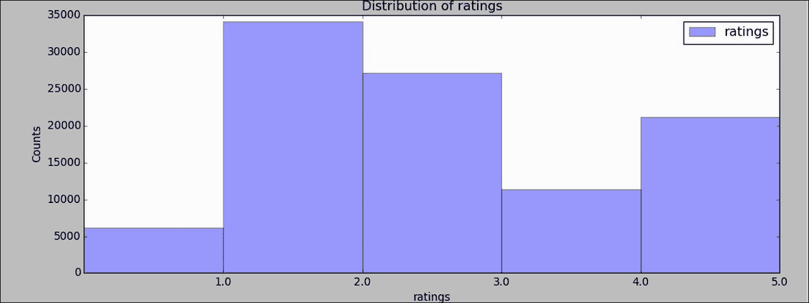

每个用户的评分统计：

```py
df.groupBy("UserID").count().select('count').describe().show()
```

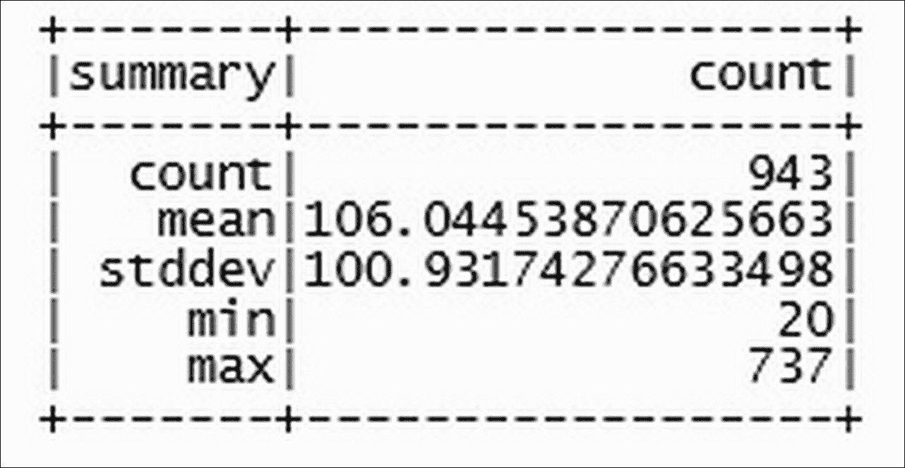

每个用户的评分计数：

```py
 df.stat.crosstab("UserID", "Rating").show() 

```

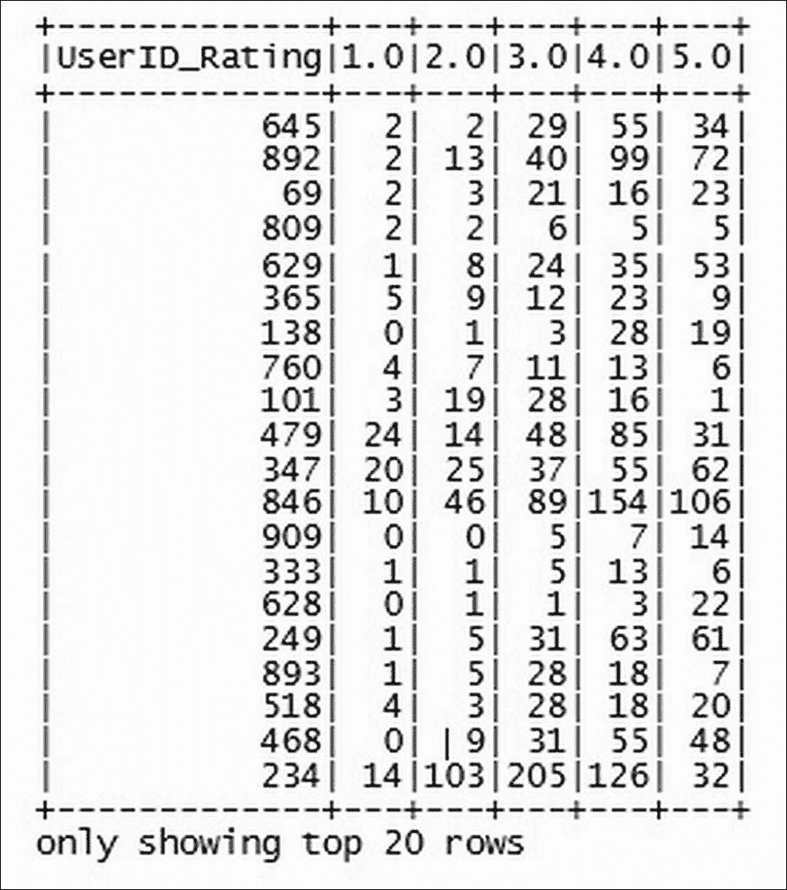

每个用户给出的平均评分：

```py
df.groupBy('UserID').agg({'Rating': 'mean'}).take(5)

[Row(UserID=148, avg(Rating)=4.0), Row(UserID=463, avg(Rating)=2.8646616541353382), Row(UserID=471, avg(Rating)=3.3870967741935485), Row(UserID=496, avg(Rating)=3.0310077519379846), Row(UserID=833, avg(Rating)=3.056179775280899)] 

```

每部电影的平均评分：

```py
df.groupBy('ItemId ').agg({'Rating': 'mean'}).take(5)

[Row(ItemId =496, avg(Rating)=4.121212121212121), Row(ItemId =471, avg(Rating)=3.6108597285067874), Row(ItemId =463, avg(Rating)=3.859154929577465), Row(ItemId =148, avg(Rating)=3.203125), Row(ItemId =1342, avg(Rating)=2.5)] 

```

### 构建基本的推荐引擎

使用`randomSplit()`方法如下随机地将原始数据分为训练集和测试集：

(`training`, `test`) = `ratings.randomSplit([0.8, 0.2])`

计算训练数据集中的实例数量：

```py
training.count()
80154    

```

计算测试集中的实例数量：

```py
test.count()
19846
```

现在我们将使用 Spark MLlib 库中可用的 ALS 算法构建一个推荐引擎模型。

为此，我们使用以下方法和参数：

1.  将 ALS 模块加载到 Spark 环境中。

1.  调用`ALS.train()`方法来训练模型。

1.  将所需的参数，如排名、迭代次数（maxIter）和训练数据传递给`ALS.train()`方法。

让我们了解这些参数：

+   **Rank**：此参数是模型中要使用的用户和物品的潜在因子数量。默认值为 10。

+   **maxIter**：这是模型必须运行的迭代次数。默认值为 10。

使用交替最小二乘法构建推荐模型：

设置 rank 和 maxIter 参数：

```py
rank = 10
numIterations = 10

```

使用训练数据、排名、maxIter 参数调用`train()`方法，`model = ALS.train`(training, rank, numIterations)：

```py
16/10/04 11:01:34 WARN BLAS: Failed to load implementation from: com.github.fommil.netlib.NativeSystemBLAS
16/10/04 11:01:34 WARN BLAS: Failed to load implementation from: com.github.fommil.netlib.NativeRefBLAS
16/10/04 11:01:34 WARN LAPACK: Failed to load implementation from: com.github.fommil.netlib.NativeSystemLAPACK
16/10/04 11:01:34 WARN LAPACK: Failed to load implementation from: com.github.fommil.netlib.NativeRefLAPACK
16/10/04 11:01:37 WARN Executor: 1 block locks were not released by TID = 122:
[rdd_221_0]
16/10/04 11:01:37 WARN Executor: 1 block locks were not released by TID = 123:
[rdd_222_0]
16/10/04 11:01:37 WARN Executor: 1 block locks were not released by TID = 124:
[rdd_221_0]
16/10/04 11:01:37 WARN Executor: 1 block locks were not released by TID = 125:
[rdd_222_0]

```

如下检查模型，我们观察到创建了`Matrixfactorizationmodel`对象：

```py
model

```

### 进行预测

现在我们已经创建了模型，让我们预测我们之前创建的测试集中的评分值。

ALS 模块在以下章节中提供了许多方法，用于进行预测、推荐用户、向用户推荐项目、用户特征、项目特征等。让我们逐一运行这些方法。

在我们进行预测之前，我们首先以预测方法可接受的方式创建测试数据，如下所示：

以下代码提取测试数据中的每一行，并提取`userID, ItemID`，然后将其放入`testdata PipelinedRDD`对象中：

```py
testdata = test.map(lambda p: (p[0], p[1]))

type(testdata)
<class 'pyspark.rdd.PipelinedRDD'>

```

以下代码显示了原始测试数据样本：

```py
test.take(5)

[Rating(user=119, product=392, rating=4.0), Rating(user=38, product=95, rating=5.0), Rating(user=63, product=277, rating=4.0), Rating(user=160, product=234, rating=5.0), Rating(user=225, product=193, rating=4.0)]

```

以下代码显示了用于预测的格式化数据：

```py
testdata.take(5)

[(119, 392), (38, 95), (63, 277), (160, 234), (225, 193)]

```

预测方法如下：

+   `predict()`: 预测方法将为给定用户和项目的评分进行预测，如下所示：

当我们想要对用户和物品的组合进行预测时，使用此方法：

```py
pred_ind = model.predict(119, 392) 

```

我们可以观察到，用户`119`和电影`392`的预测值为`4.3926091845289275`：只需查看测试数据中相同组合的原始值：

```py
pred_ind 

4.3926091845289275 

```

+   `predictall()`: 当我们希望一次性预测所有测试数据的值时，使用此方法，如下所示：

```py
predictions = model.predictAll(testdata).map(lambda r: ((r[0], r[1]), r[2])) 

```

使用以下代码检查数据类型：

```py
type(predictions) 
<class 'pyspark.rdd.PipelinedRDD'> 

```

使用以下代码显示前五个预测：

```py
 predictions.take(5) 

[((268, 68), 3.197299431949281), ((200, 68), 3.6296857016488357), ((916, 68), 3.070451877410571), ((648, 68), 2.165520614428771), ((640, 68), 3.821666263132798)] 

```

## 基于用户的协同过滤

现在，让我们为用户推荐物品（电影）。ALS 推荐模块包含`recommendProductsForUsers()`方法，用于为用户生成 top-N 物品推荐。

`recommendProductsForUsers()`方法接受整数作为输入参数，该参数表示前 N 个推荐；例如，要生成对用户的 top 10 推荐，我们将 10 作为值传递给`recommendProductsForUsers()`方法，如下所示：

```py
recommedItemsToUsers = model.recommendProductsForUsers(10)
```

使用以下代码可以展示为所有 943 个用户生成推荐：

```py
recommedItemsToUsers.count()  
943
```

让我们看看前两个用户（96 和 784）的推荐：

```py
recommedItemsToUsers.take(2)

[
(96, (Rating(user=96, product=1159, rating=11.251653489172302), Rating(user=96, product=962, rating=11.1500279633824), Rating(user=96, product=534, rating=10.527262244626867), Rating(user=96, product=916, rating=10.066351313580977), Rating(user=96, product=390, rating=9.976996795233937), Rating(user=96, product=901, rating=9.564128162876036), Rating(user=96, product=1311, rating=9.13860044421153), Rating(user=96, product=1059, rating=9.081563794413025), Rating(user=96, product=1178, rating=9.028685203289745), Rating(user=96, product=968, rating=8.844312806737918)
)),
 (784, (Rating(user=784, product=904, rating=5.975314993539809), Rating(user=784, product=1195, rating=5.888552423210881), Rating(user=784, product=1169, rating=5.649927493462845), Rating(user=784, product=1446, rating=5.476279163198376), Rating(user=784, product=1019, rating=5.303140289874016), Rating(user=784, product=1242, rating=5.267858336331315), Rating(user=784, product=1086, rating=5.264190584020031), Rating(user=784, product=1311, rating=5.248377920702441), Rating(user=784, product=816, rating=5.173286729120303), Rating(user=784, product=1024, rating=5.1253425029498985)
))
]

```

## 模型评估

现在，让我们评估模型精度。为此，我们选择均方根误差方法来计算模型精度。我们可以手动完成，如下所示，或者调用 Spark MLlib 中可用的定义好的函数：通过连接原始评分和预测来创建`ratesAndPreds`对象：

```py
ratesAndPreds = ratings.map(lambda r: ((r[0], r[1]), r[2])).join(predictions)
```

以下代码将计算均方误差：

```py
MSE = ratesAndPreds.map(lambda r: (r[1][0] - r[1][1])**2).mean()

[Stage 860:>                                               (0 + 4) / 6]

Mean Squared Error = 1.1925845065690288  

from math import sqrt

rmse = sqrt(MSE)
rmse
1.092055175606539

```

## 模型选择和超参数调整

任何机器学习任务中最重要的步骤是使用模型评估或模型选择来找到最适合数据的最佳参数。Spark 提供了调整和模型评估的基础设施，用于单个算法或整个模型构建管道。用户可以调整整个管道模型或调整管道的各个组件。MLlib 提供了模型选择工具，如`CrossValidator`类和`TrainValidationSplit`类。

上述提到的类需要以下项目：

+   **估算器**算法或管道进行调整

+   **ParamMaps 集合**：可供选择的参数，有时称为搜索的*参数网格*

+   **评估器**：衡量拟合模型在保留的测试数据上的表现好坏的指标

在高层次上，这些模型选择工具的工作方式如下：

+   他们将输入数据分割成独立的训练和测试数据集

+   对于每个（训练和测试）对，他们遍历`ParamMaps`集合

+   对于每个 `ParamMap`，他们使用这些参数拟合 Estimator，获取拟合的模型，并使用 Evaluator 评估模型性能。

+   他们选择由表现最佳的一组参数产生的模型

MLlib 支持各种用于执行评估任务的评估类，例如用于基于回归问题的 `RegressionEvaluator` 类，用于二元分类问题的 `BinaryClassificationEvaluator` 类，以及用于多类分类问题的 `MulticlassClassificationEvaluator` 类。为了构建参数网格，我们可以使用 `paramGridBuilder` 类。

### 交叉验证

**交叉验证** 方法是在评估数据挖掘模型和选择构建最佳估计模型的最佳参数时最流行的方法之一。MLlib 提供两种类型的评估类：`CrossValidator` 和 `TrainValidationSplit` 类。

### 交叉验证

`CrossValidator` 类接受输入数据集并将其分割成多个数据集折，这些折可以用作训练集和测试集。使用这些数据集，`CrossValidator` 类构建多个模型，找到最佳参数并存储在 `ParamMap` 中。在确定最佳 `ParamMap` 之后，`CrossValidator` 类最终使用整个数据集计算最佳模型。例如，假设我们选择了五折交叉验证；`CrossValidator` 类将原始数据集分割成五个子数据集，每个子数据集包含训练集和测试集。`CrossValidator` 类一次选择一个折集并估计模型参数。最后，`CrossValidator` 计算评估指标的均值，将最佳参数存储在 `ParamMap` 中。

### 训练-验证分割

Spark MLlib 提供了另一个类 `TrainValidationSplit` 来使用 `TrainValidationSplit` 估计最佳参数。与 `CrossValidator` 不同，这个类在单个数据集上估计最佳参数。例如，`TrainValidatorSplit` 类将输入数据分成大小为 3/4 的训练集和 1/4 的测试集，并使用这些集选择最佳参数。

现在，让我们了解我们之前构建的推荐引擎模型。

调优模型存在于 Spark 2.0 的 MLlib 中，并使用 DataFrame API 功能。因此，为了适应这一点，我们的第一步是将原始数据集评分转换为 DataFrame。

对于转换，我们使用 `sqlContext` 对象和 `createDataFrame()` 方法将评分 RDD 对象转换为 `DataFrame` 对象，如下所示：

```py
type(ratings) 
<class 'pyspark.rdd.PipelinedRDD'> 

```

使用 pyspark 启动 spark 会话时创建 SQL Context 对象：

```py
sqlContext 
<pyspark.sql.context.SQLContext object at 0x7f24c94f7d68> 

```

如下从评分 RDD 对象创建 DataFrame 对象：

```py
df = sqlContext.createDataFrame(ratings) 

type(df) 

<class 'pyspark.sql.dataframe.DataFrame'> 

```

显示 `dataframe` 对象的前 20 条记录：

```py
df.show() 

```

以下截图显示了先前查询的结果：

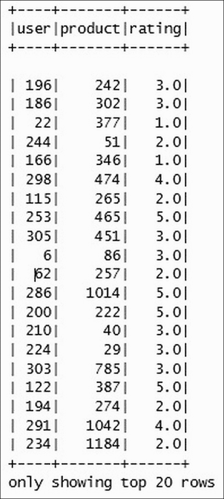

使用 `randomSplit()` 方法创建训练集和测试集的随机样本：

```py
(training, test) = df.randomSplit([0.8, 0.2]) 

```

加载运行参数 `tuningmodel` 所需的模块：

```py
from pyspark.ml.recommendation import ALS 

```

调用 MLlib 中可用的 ALS 方法来构建推荐引擎。以下`ALS()`方法仅接受训练数据的列值，如 UserID、ItemId 和 Rating。其他参数，如 rank、迭代次数、学习参数等，将作为`ParamGridBuilder`对象传递给交叉验证方法。

如前所述，模型调优管道需要 Estimators、一组 ParamMaps 和 Evaluators。让我们按照以下方式创建每一个：

如前所述，Estimator 对象接受算法或管道对象作为输入。让我们按照以下方式构建一个管道对象：

调用 ALS 算法：

```py
als = ALS(userCol="user", itemCol="product", ratingCol="rating") 
als 

ALS_45108d6e011beae88f4c 

```

检查`als`对象的类型：

```py
type(als) 
<class 'pyspark.ml.recommendation.ALS'> 

```

让我们看看 ALS 模型默认参数是如何设置的：

```py
als.explainParams()
"alpha: alpha for implicit preference (default: 1.0)\ncheckpointInterval: set checkpoint interval (>= 1) or disable checkpoint (-1). E.g. 10 means that the cache will get checkpointed every 10 iterations. (default: 10)\nfinalStorageLevel: StorageLevel for ALS model factors. (default: MEMORY_AND_DISK)\nimplicitPrefs: whether to use implicit preference (default: False)\nintermediateStorageLevel: StorageLevel for intermediate datasets. Cannot be 'NONE'. (default: MEMORY_AND_DISK)\nitemCol: column name for item ids. Ids must be within the integer value range. (default: item, current: ItemId )\nmaxIter: max number of iterations (>= 0). (default: 10)\nnonnegative: whether to use nonnegative constraint for least squares (default: False)\nnumItemBlocks: number of item blocks (default: 10)\nnumUserBlocks: number of user blocks (default: 10)\npredictionCol: prediction column name. (default: prediction)\nrank: rank of the factorization (default: 10)\nratingCol: column name for ratings (default: rating, current: Rating)\nregParam: regularization parameter (>= 0). (default: 0.1)\nseed: random seed. (default: -1517157561977538513)\nuserCol: column name for user ids. Ids must be within the integer value range. (default: user, current: UserID)"

```

从前面的结果中，我们观察到模型将秩设置为默认值 10，最大迭代次数 maxIter 为 10，块大小 blocksize 也为 10：

创建管道对象并将创建的 als 模型作为管道中的一个阶段：

```py
from pyspark.ml import Pipeline

pipeline = Pipeline(stages=[als])
 type(pipeline)
<class 'pyspark.ml.pipeline.Pipeline'>

```

### 设置 ParamMaps/参数

让我们仔细和逻辑地观察`ALS()`方法，并推断出可用于参数调整的参数：

**rank:** 我们知道 rank 是用户和物品的潜在特征数量，默认值为 10，但如果我们没有给定数据集的最佳潜在特征数量，则可以通过在 8 和 12 之间给出一个值范围来调整模型，选择权留给用户。由于计算成本，我们将值限制在 8-12 之间，但读者可以自由尝试其他值。

**MaxIter:** MaxIter 是模型运行次数；默认设置为 10。我们可以选择这个参数进行调优，因为我们不知道模型表现良好的最佳迭代次数；我们在 10 和 15 之间进行选择。

**reqParams:** regParams 是介于 1 和 10 之间的学习参数集。

加载`CrossValidation`和`ParamGridBuilder`模块以创建参数范围：

```py
from pyspark.ml.tuning import CrossValidator, ParamGridBuilder

paramMapExplicit = ParamGridBuilder() \
                    .addGrid(als.rank, [8, 12]) \
                    .addGrid(als.maxIter, [10, 15]) \
                    .addGrid(als.regParam, [1.0, 10.0]) \
                    .build()

```

### 设置评估器对象

如前所述，评估器对象在交叉验证方法中设置评估指标以在多次运行中评估模型：

加载`RegressionEvaluator`模型：

```py
from pyspark.ml.evaluation import RegressionEvaluator

```

使用`RegressionEvaluator()`方法调用，将评估指标设置为`rmse`并将`evaluation`列设置为 Rating：

```py
evaluatorR = RegressionEvaluator(metricName="rmse", labelCol="rating")

```

现在我们已经为运行交叉验证方法准备了所有必需的对象，即`Estimator`、`paramMaps`和`Evaluator`，让我们运行模型。

交叉验证方法从所有执行过的模型中给出最佳最优模型：

```py
cvExplicit = CrossValidator(estimator=als, estimatorParamMaps=paramMap, evaluator=evaluatorR,numFolds=5)

```

使用`fit()`方法运行模型：

```py
cvModel = cvExplicit.fit(training)

[Stage 897:============================>                           (5 + 4) / 10]
[Stage 938:==================================================>     (9 + 1) / 10]
[Stage 1004:>(0 + 4) / 10][Stage 1005:> (0 + 0) / 2][Stage 1007:>(0 + 0) / 10]  
[Stage 1008:>                                                     (3 + 4) / 200]

preds = cvModel.bestModel.transform(test)
evaluator = RegressionEvaluator(metricName="rmse", labelCol="rating",predictionCol="prediction")
rmse = evaluator.evaluate(pred)
print("Root-mean-square error = " + str(rmse))
 rmse                                                                        

0.924617823674082

```

# 摘要

在本章中，我们学习了使用 ALS 算法的矩阵分解方法进行基于模型的协同过滤。我们使用 Python API 访问 Spark 框架并运行了 ALS 协同过滤。在本章的开头，我们回顾了 Spark 的基础知识，这些基础知识是运行推荐引擎所必需的，例如 Spark 是什么，Spark 生态系统，Spark 的组件，SparkSession，DataFrames，RDD 等等。正如当时所解释的，我们探索了 MovieLens 数据，构建了一个基本的推荐引擎，评估了模型，并使用参数调整来改进模型。在下一章中，我们将学习如何使用图数据库 Neo4j 构建推荐。
