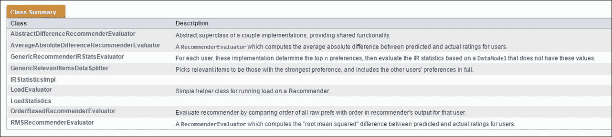

# 第九章：使用 Mahout 构建可扩展的推荐引擎

假设你刚刚启动了一个在线电子商务网站，用于销售你设计的服装，并且你很幸运地让你的业务顺利启动并取得成功。随着越来越多的网站流量，最明显的选择是在你的网站上实现一个具有如下功能的推荐引擎：访问过某些内容的人也访问了其他内容，与当前物品相似的物品等。由于你的网站是新且成功的，你已经使用流行的工具，如 R 和 Python，实现了一个推荐引擎。推荐功能已部署并运行良好，为业务的成功增添了更多价值。现在随着业务的增加和用户基础的扩大，你最可能遇到的问题是你的客户开始抱怨你的网站变得缓慢。

在分析根本原因后，显而易见的原因是添加到网站上的推荐功能正在减慢网站速度。这很可能会发生，因为用于提供推荐的协同过滤算法存在限制。每次我们计算用户之间的相似性时，整个用户基础都会被加载到内存中，并计算相似性值。对于小用户基础，这个操作会很快。假设有一个大用户基础，比如一百万用户，协同过滤模型将会抛出内存异常。通过增加 RAM 能力，我们可能在某种程度上解决这个问题，但这仍然无济于事。增加 RAM 是一个糟糕的主意，因为它会大幅增加基础设施成本。

最好的方法是在分布式平台上重新设计推荐引擎，例如 Hadoop。这正是 Apache Mahout 能派上用场的地方，因为它是一个为分布式平台 Apache Hadoop 构建的开源机器学习库。

在本章中，我们将涵盖以下部分：

+   Mahout 一般介绍

+   设置 Mahout 独立和分布式模式

+   Mahout 的核心构建块

+   使用 Mahout 构建和评估推荐引擎，例如基于用户的协同过滤、基于物品的协同过滤、SVD 推荐引擎和 ALS 推荐引擎。

# Mahout - 一般介绍

**Apache Mahout**是一个建立在 Apache Hadoop 之上的开源 Java 库，它提供了大规模机器学习算法。尽管这个库最初是以 MapReduce 范式开始的，但当前框架提供了对 Apache Spark、H2O 和 Apache Flink 的绑定。最新的 Mahout 版本支持协同过滤推荐引擎、聚类、分类、降维、H2O 和 Spark 绑定。

Mahout 0.12.2 的主要功能如下：

+   一个可扩展的编程环境和框架，用于构建可扩展的算法

+   支持 Apache Spark、Apache Flink 和 H2O 算法

+   Samsara，一个类似于 R 编程语言的矢量数学环境

如前所述，尽管 Mahout 可以做很多事情，但我们将限制我们的讨论范围到使用 Mahout 构建推荐引擎。Mahout 提供了对独立模式的支持，其中推荐模型或应用程序可以部署在单个服务器上，以及分布式模式，其中推荐模型可以部署在分布式平台上。

# 设置 Mahout

在本节中，我们将探讨在独立和分布式模式下设置 Mahout。

## 独立模式 - 将 Mahout 作为库使用

Mahout 的独立模式通常涉及两个步骤：

+   将 Mahout 库添加到希望使用 Mahout 功能的 Java 应用程序中

+   调用 Mahout 推荐引擎函数以构建推荐应用程序

运行使用 Mahout 的应用程序需要在您的 Java Maven 项目的 `pom.xml` 文件中添加以下依赖项：


前面的依赖项将下载运行 Mahout 功能所需的所有 jar 或库，如下面的截图所示：


另一步是访问官方 Apache Mahout 网站，下载所需的 Mahout jar 文件，如下所示：

最新版本的 Mahout 库可以从 Apache Mahout 官方网站 [`mahout.apache.org/general/downloads.html`](http://mahout.apache.org/general/downloads.html) 下载。

以下图像显示了上述 URL 的截图：


下载 tar 文件（tar 文件只是可执行文件）而不是源文件，因为我们只需要 Mahout 的 jar 文件来构建推荐引擎：


下载 tar 文件后，只需提取所有文件并将所需的 jar 添加到 Java 应用程序中：


使用这种最小设置，让我们使用 Java Eclipse 构建一个非常基本的推荐引擎。

最小设置只需以下步骤：

1.  在 Eclipse 中创建一个具有以下属性选择的 Java Maven 项目：

    以下图像显示了创建新 Maven 项目设置步骤 1 的截图：

    

    在以下图像中，添加 **Artifact Id** "recommendations"：

    

1.  将创建一个以`app.java`为默认类的 Maven 项目。我们可以在该类中做出更改以构建我们的独立推荐引擎：

1.  将 Java 运行时设置为 1.7 或更高，如下截图所示：

1.  设置所需的 Maven 依赖项，包括**mahout-mr**、**mahout-math**、**slf4j-log4j**、**commons-math3**和**guava**；这将下载应用程序运行所需的所有 jar 文件，如下截图所示：

1.  这些依赖关系可以在以下截图中看到：

1.  在项目中创建一个名为`data`的文件夹，并创建一个示例数据集，如下截图所示：

1.  现在，将`app.java`重命名为`UserbasedRecommender.java`文件。在 Java 类中编写代码以构建基本的基于用户的推荐系统：

    ```py
    package com.packtpub.mahout.recommenders; 

    import java.io.File; 
    import java.io.IOException; 
    import java.util.List; 

    import org.apache.mahout.cf.taste.common.TasteException; 
    import org.apache.mahout.cf.taste.impl.model.file.FileDataModel; 
    import org.apache.mahout.cf.taste.impl.neighborhood.ThresholdUserNeighborhood; 
    import org.apache.mahout.cf.taste.impl.recommender.GenericUserBasedRecommender; 
    import org.apache.mahout.cf.taste.impl.similarity.PearsonCorrelationSimilarity; 
    import org.apache.mahout.cf.taste.model.DataModel; 
    import org.apache.mahout.cf.taste.neighborhood.UserNeighborhood; 
    import org.apache.mahout.cf.taste.recommender.RecommendedItem; 
    import org.apache.mahout.cf.taste.recommender.UserBasedRecommender; 
    import org.apache.mahout.cf.taste.similarity.UserSimilarity; 

    //class for generating User Based Recommendation 
    public class UserbasedRecommender  
    { 
        public static void main( String[] args ) throws TasteException, IOException 
        { 
        //creating data model 
             DataModel model = new FileDataModel(new File("data/dataset.csv"));     
        // creating pearson similarity between users  
        UserSimilarity similarity = new PearsonCorrelationSimilarity(model); 

             //creating user neighborhood 
               UserNeighborhood neighborhood = new ThresholdUserNeighborhood(0.1,                                             similarity, model); 

          // creating recommender model 
                UserBasedRecommender recommender = new       GenericUserBasedRecommender(model, neighborhood, similarity); 

            //generating 3 recommendations for user 2 
        List<RecommendedItem> recommendations = recommender.recommend(2, 3); 
        for (RecommendedItem recommendation : recommendations) { 
          System.out.println(recommendation); 
        } 
        } 
    } 

    ```

    运行前面的代码将为用户 2 生成推荐，如下截图所示：

    

嘣！我们已经创建了我们的第一个基于用户的推荐引擎。不用担心我们已经做了什么或正在发生什么；在接下来的几节中，一切都会变得清晰。现在，只需尝试理解如何使用 Mahout 库在独立模式下构建推荐引擎。

## 设置 Mahout 的分布式模式

我们已经看到了如何在独立模式下使用 Mahout 库。在本节中，让我们看看如何在分布式平台（如 HDFS）上设置 Mahout。以下是要设置 Mahout 所需的要求：

+   Java 7 及以上

+   Apache Hadoop

+   Apache Mahout

设置 Java 7 和安装 Hadoop 超出了本书的范围。我们可以在网上找到非常好的资源，介绍如何设置 Hadoop。假设 Hadoop 已经设置好，按照以下步骤设置 Mahout：

下载并解压 Apache Mahout 网站上的最新 Mahout 发行版，如前所述。

让我们设置环境变量：

```py
Export JAVA_HOME = path/to/java7 or more 
export MAHOUT_HOME = /home/softwares/ apache-mahout-distribution-0.12.2 
export MAHOUT_LOCAL = true #for standalone mode 
export PATH = $MAHOUT_HOME/bin 
export CLASSPATH = $MAHOUT_HOME/lib:$CLASSPATH 

```

### 提示

取消设置`MAHOUT_LOCAL`以在 Hadoop 集群上运行。

一旦设置好环境变量，请在命令行中使用以下命令在分布式平台上运行推荐引擎。

使用以下代码，我们正在使用对数似然相似度生成基于项目的推荐：

```py
mahout recommenditembased -s SIMILARITY_LOGLIKELIHOOD -i mahout/data.txt -o mahout/output1 --numRecommendations 25 

[cloudera@quickstart ~]$ mahout recommenditembased -s SIMILARITY_LOGLIKELIHOOD -i mahout/data.txt -o mahout/output1 --numRecommendations 25 
MAHOUT_LOCAL is not set; adding HADOOP_CONF_DIR to classpath. 
Running on hadoop, using /usr/lib/hadoop/bin/hadoop and HADOOP_CONF_DIR=/etc/hadoop/conf 
MAHOUT-JOB: /usr/lib/mahout/mahout-examples-0.9-cdh5.4.0-job.jar 
16/11/10 11:05:09 INFO common.AbstractJob: Command line arguments: {--booleanData=[false], --endPhase=[2147483647], --input=[mahout/data.txt], --maxPrefsInItemSimilarity=[500], --maxPrefsPerUser=[10], --maxSimilaritiesPerItem=[100], --minPrefsPerUser=[1], --numRecommendations=[25], --output=[mahout/output1], --similarityClassname=[SIMILARITY_LOGLIKELIHOOD], --startPhase=[0], --tempDir=[temp]} 
16/11/10 11:05:09 INFO common.AbstractJob: Command line arguments: {--booleanData=[false], --endPhase=[2147483647], --input=[mahout/data.txt], --minPrefsPerUser=[1], --output=[temp/preparePreferenceMatrix], --ratingShift=[0.0], --startPhase=[0], --tempDir=[temp]} 
16/11/10 11:05:10 INFO Configuration.deprecation: mapred.input.dir is deprecated. Instead, use mapreduce.input.fileinputformat.inputdir 
16/11/10 11:05:10 INFO Configuration.deprecation: mapred.compress.map.output is deprecated. Instead, use mapreduce.map.output.compress 
16/11/10 11:05:10 INFO Configuration.deprecation: mapred.output.dir is deprecated. Instead, use mapreduce.output.fileoutputformat.outputdir 
16/11/10 11:05:11 INFO client.RMProxy: Connecting to ResourceManager at /0.0.0.0:8032 
16/11/10 11:05:20 INFO input.FileInputFormat: Total input paths to process : 1 
16/11/10 11:05:22 INFO mapreduce.JobSubmitter: number of splits:1 
16/11/10 11:05:24 INFO mapreduce.JobSubmitter: Submitting tokens for job: job_1478802142793_0003 
16/11/10 11:05:42 INFO impl.YarnClientImpl: Submitted application application_1478802142793_0003 
16/11/10 11:05:52 INFO mapreduce.Job: The url to track the job: http://quickstart.cloudera:8088/proxy/application_1478802142793_0003/ 
16/11/10 11:05:52 INFO mapreduce.Job: Running job: job_1478802142793_0003 
16/11/10 11:16:45 INFO mapreduce.Job: Job job_1478802142793_0011 running in uber mode : false 
16/11/10 11:16:45 INFO mapreduce.Job:  map 0% reduce 0% 
16/11/10 11:16:58 INFO mapreduce.Job:  map 100% reduce 0% 
16/11/10 11:17:19 INFO mapreduce.Job:  map 100% reduce 100% 
16/11/10 11:17:20 INFO mapreduce.Job: Job job_1478802142793_0011 completed successfully 
16/11/10 11:17:21 INFO mapreduce.Job: Counters: 49 
File System Counters 
------------------------------- 
------------------------------- 
Bytes Written=28 
16/11/10 11:17:21 INFO driver.MahoutDriver: Program took 732329 ms (Minutes: 12.205483333333333) 

```

输出如下：


# Mahout 的核心构建块

就像任何其他推荐引擎框架一样，Mahout 也提供了一套丰富的组件来构建定制化的、企业级、可扩展、灵活且性能良好的推荐系统。

Mahout 的关键组件如下：

+   数据模型

    +   相似度：用户相似度，项目相似度

+   用户邻域

+   推荐系统

+   推荐系统评估器

## 基于用户的协同推荐引擎的组件

在本节中，我们将介绍构建基于用户的协同过滤系统所需组件。


基于用户的协同推荐引擎的组件如下：

+   **DataModel**：DataModel 实现允许我们存储并提供访问用于计算的用户、项目和偏好数据。DataModel 组件允许我们从数据源中提取数据。Mahout 提供了**MySQLJDBCDataModel**，它允许我们通过 JDBC 和 MySQL 从数据库中提取数据。在我们的示例中，我们使用**FileDataModel**接口从 Mahout 公开的文件中访问数据。

    Mahout 公开的其他一些 DataModel 如下：

    +   **HBaseDataModel**：([`apache.github.io/mahout/0.10.1/docs/mahout-integration/org/apache/mahout/cf/taste/impl/model/hbase/HBaseDataModel.html`](http://apache.github.io/mahout/0.10.1/docs/mahout-integration/org/apache/mahout/cf/taste/impl/model/hbase/HBaseDataModel.html))

    +   **GenericJDBCDataModel**：([`apache.github.io/mahout/0.10.1/docs/mahout-integration/org/apache/mahout/cf/taste/impl/model/jdbc/GenericJDBCDataModel.html`](http://apache.github.io/mahout/0.10.1/docs/mahout-integration/org/apache/mahout/cf/taste/impl/model/jdbc/GenericJDBCDataModel.html))

    +   **PostgreSQLJDBCDataModel**：([`apache.github.io/mahout/0.10.1/docs/mahout-integration/org/apache/mahout/cf/taste/impl/model/jdbc/PostgreSQLJDBCDataModel.html`](http://apache.github.io/mahout/0.10.1/docs/mahout-integration/org/apache/mahout/cf/taste/impl/model/jdbc/PostgreSQLJDBCDataModel.html))

    +   **MongoDBDataModel**：([`apache.github.io/mahout/0.10.1/docs/mahout-integration/org/apache/mahout/cf/taste/impl/model/mongodb/MongoDBDataModel.html`](http://apache.github.io/mahout/0.10.1/docs/mahout-integration/org/apache/mahout/cf/taste/impl/model/mongodb/MongoDBDataModel.html))

    Mahout 期望用户数据以用户 ID、项目 ID 和偏好三元组的格式存在。偏好值可以是连续的或布尔值。Mahout 支持连续和布尔偏好值。我们提供给 DataModel 的每个包含用户 ID、项目 ID 和偏好的输入三元组，将表示为一个内存高效的**Preference 对象**或**PreferenceArray 对象**。

+   **UserSimilarity**: UserSimilarity 接口计算两个用户之间的相似度。UserSimilarity 的实现通常返回 -1.0 到 1.0 范围内的值，其中 1.0 是完美的相似度。在前面的章节中，我们看到了多种计算用户相似度的方法，例如欧几里得距离、皮尔逊系数、余弦距离等。有许多 UserSimilarity 接口的实现来计算用户相似度，如下所示：

    +   CachingUserSimilarity

    +   CityBlockSimilarity

    +   EuclideanDistanceSimilarity

    +   GenericUserSimilarity

    +   LogLikelihoodSimilarity

    +   PearsonCorrelationSimilarity

    +   SpearmanCorrelationSimilarity

    +   TanimotoCoefficientSimilarity

    +   UncenteredCosineSimilarity

+   **ItemSimilarity**: 与 UserSimilarity 类似，Mahout 还提供了 ItemSimilarity 接口，类似于 UserSimilarity，它可以用来计算物品之间的相似度。UserSimilarity 的实现通常返回 -1.0 到 1.0 范围内的值，其中 1.0 是完美的相似度：

    +   AbstractItemSimilarity

    +   AbstractJDBCItemSimilarity

    +   CachingItemSimilarity

    +   CityBlockSimilarity

    +   EuclideanDistanceSimilarity

    +   FileItemSimilarity

    +   GenericItemSimilarity

    +   LogLikelihoodSimilarity

    +   MySQLJDBCInMemoryItemSimilarity

    +   MySQLJDBCItemSimilarity

    +   PearsonCorrelationSimilarity

    +   SQL92JDBCInMemoryItemSimilarity

    +   SQL92JDBCItemSimilarity

    +   TanimotoCoefficientSimilarity

    +   UncenteredCosineSimilarity

+   **UserNeighborhood**: 在基于用户的推荐器中，为活动用户生成的推荐是通过找到相似用户的一个邻域来产生的。UserNeighborhood 通常指的是确定给定活动用户邻域的一种方式，例如，在生成推荐时考虑的十个最近邻。

    这些邻域类实现了 UserSimilarity 接口以进行其操作。以下是对邻域接口的实现：

    +   CachingUserNeighborhood

    +   NearestNUserNeighborhood

    +   ThresholdUserNeighborhood

+   **Recommender**: 推荐器是 Mahout 的核心抽象。给定 `DataModel` 对象作为输入，它为用户生成物品推荐。推荐器接口的实现如下：

    +   AbstractRecommender

    +   CachingRecommender

    +   GenericBooleanPrefItemBasedRecommender

    +   GenericBooleanPrefUserBasedRecommender

    +   GenericItemBasedRecommender

    +   GenericUserBasedRecommender

    +   ItemAverageRecommender

    +   ItemUserAverageRecommender

    +   RandomRecommender

    +   RecommenderWrapper

    +   SVDRecommender

## 使用 Mahout 构建推荐引擎

现在，我们已经涵盖了 Mahout 推荐引擎框架的核心构建块，让我们开始构建推荐。在本节中，我们将查看一系列使用独立模式实现的不同的推荐引擎。推荐引擎的功能是使用 `org.apache.mahout.cf.taste.impl` 包的实现。

本节中我们看到的推荐引擎如下：

+   基于用户的协同过滤

+   基于项目的协同过滤

+   SVD 推荐器

## 数据集描述

在我们深入研究推荐实现之前，让我们看看本节中使用的数据集。对于本节，我们使用从以下 URL 可获得的 UCI 机器学习数据集仓库中的餐厅和消费者数据集：

[`archive.ics.uci.edu/ml/datasets/Restaurant+%26+consumer+data`](https://archive.ics.uci.edu/ml/datasets/Restaurant+%26+consumer+data)

此数据集可用于构建使用消费者偏好信息进行协同过滤的应用程序。该数据集，从上一个链接下载的文件，包含以下图中列出的九个文件。在所有这些文件中，我们使用`rating_final.csv`文件，其中包含如 userID、placeID、rating、food_rating 和 service_rating 等属性。但对我们用例而言，我们只使用 userID、placeID 和 rating。我们可以将数据视为给定用户对地点给出的偏好值。

### 注意

我们将不得不在设置会话中利用之前创建的项目。

将输入的`ratings_final.csv`文件添加到当前项目结构的`*data*`文件夹中。

因此，首先，让我们将原始的原始数据预处理成所需的用户 ID、地点 ID 和评分三元组格式。以下是本练习使用的原始数据集：


以下程序将准备所需的元组数据集，实现如下：

+   从`ratings_final.csv`文件中读取每一行

+   提取前三个列

+   将上一步提取的列写入新的`recoDataset.csv`文件

以下 Java 程序实现了之前解释的步骤：

```py
package com.packtpub.mahout.recommenders; 

import java.io.FileReader; 
import java.io.FileWriter; 
import java.io.IOException; 
import java.util.ArrayList; 
import java.util.List; 

import au.com.bytecode.opencsv.CSVReader; 
import au.com.bytecode.opencsv.CSVWriter; 

public class Preprocessdata  { 

public static void main(String[] args) throws IOException { 
String fileName = "data/rating_final.csv"; 
String csv = "data/recoDataset.csv";          
CSVReader csvReader = new CSVReader(new FileReader(fileName)); 
String[] row = null; 
List<String[]> data = new ArrayList<String[]>(); 
CSVWriter writer = new CSVWriter(new FileWriter(csv), 
CSVWriter.DEFAULT_SEPARATOR, 
CSVWriter.NO_QUOTE_CHARACTER); 
while((row = csvReader.readNext()) != null) { 
if(!row[0].contains("userID")){ 
data.add(new String[] {row[0].substring(1), row[1],row[2]}); 
} 
} 
writer.writeAll(data); 
writer.close(); 
csvReader.close(); 
} 

} 

```

运行前面的 Java 程序后，我们用于构建推荐引擎的最终数据集将作为`recoDataset.csv`文件位于`*data*`文件夹下。以下是一个样本数据集：


现在我们已经预处理了所需的数据，让我们开始使用 Mahout 框架构建我们的推荐引擎。

## 基于用户的协同过滤

仅为了复习：基于用户的推荐系统基于用户之间的用户相似度计算生成推荐，然后使用用户邻域选择前 N 个用户，然后生成推荐。

让我们先执行以下代码，然后我们将逐行查看代码。我们将使用欧几里得距离相似度和最近邻方法生成推荐：

```py
package com.packtpub.mahout.recommenders; 

import java.io.File; 
import java.io.IOException; 
import java.util.List; 

import org.apache.mahout.cf.taste.common.TasteException; 
import org.apache.mahout.cf.taste.impl.model.file.FileDataModel; 
import org.apache.mahout.cf.taste.impl.neighborhood.NearestNUserNeighborhood; 
import org.apache.mahout.cf.taste.impl.recommender.GenericUserBasedRecommender; 
import org.apache.mahout.cf.taste.impl.similarity.EuclideanDistanceSimilarity; 
import org.apache.mahout.cf.taste.model.DataModel; 
import org.apache.mahout.cf.taste.neighborhood.UserNeighborhood; 
import org.apache.mahout.cf.taste.recommender.RecommendedItem; 
import org.apache.mahout.cf.taste.recommender.UserBasedRecommender; 
import org.apache.mahout.cf.taste.similarity.UserSimilarity; 

//class for generating User Based Recommendation 
public class UserbasedRecommendations 
{ 
    public static void main( String[] args ) throws TasteException, IOException 
    { 
    //creating data model 
    DataModel model = new FileDataModel(new File("data/recoDataset.csv"));      
    // creating Euclidean distance similarity between users  
    UserSimilarity similarity = new EuclideanDistanceSimilarity(model); 
    //creating user neighborhood 
    UserNeighborhood neighborhood = new NearestNUserNeighborhood(10, similarity, model); 
    // creating recommender model 
    UserBasedRecommender recommender = new GenericUserBasedRecommender(model, neighborhood, similarity); 
    //generating 3 recommendations for user 1068 
    List<RecommendedItem> recommendations = recommender.recommend(1068, 3); 
    for (RecommendedItem recommendation : recommendations) { 
      System.out.println(recommendation); 
    } 
    } 
} 

```

运行此程序生成以下图所示的推荐。我们正在为`UserId - 1068`生成基于用户的三个项目推荐：

从结果中，我们可以得出结论，对于`UserId - 1068`，推荐的三个地方及其相似度值如下：


现在我们一行一行地查看代码；只需回忆一下 Mahout 推荐部分的核心理念构建块。我们需要 DataModel、相似度计算、UserNeighborhood、推荐器和生成推荐。这个顺序在之前的代码中已经使用过：

1.  `UserbasedRecommender.main` 方法中的代码使用 `org.apache.mahout.cf.taste.impl.model.file.FileDataModel.FileDataModel` 类从 `data/recoDataset.csv` CSV 文件创建数据源。这个类的构造函数获取包含偏好数据的 `Java.io.File` 实例，并创建 `DataModel` 类实例模型：

    ```py
            //creating data model 
            DataModel model = new FileDataModel(new 
              File("data/recoDataset.csv")); 

    ```

1.  在这一步，我们创建 UserSimilarity 实例：使用 `org.apache.mahout.cf.taste.impl.similarity.EuclideanDistanceSimilarity` 类计算所有用户之间的相似度，它将之前步骤中创建的 `FileDataModel` 实例作为构造函数参数：

    ```py
            // creating Euclidean distance similarity between users  
            UserSimilarity similarity = new 
              EuclideanDistanceSimilarity(model); 

    ```

1.  在这一步，我们创建 UserNeighborhood 实例：使用 `org.apache.mahout.cf.taste.impl.neighborhood.NearestNUserNeighborhood` 类创建邻域，它需要三个参数：要考虑的最近邻数量、UserSimilarity 实例的相似度、作为输入的 DataModel 实例，即之前步骤中创建的模型：

    ```py
            //creating user neighborhood 
            UserNeighborhood neighborhood = new 
              NearestNUserNeighborhood(10, similarity, model); 

    ```

1.  下一步是生成推荐模型。这是通过使用 `org.apache.mahout.cf.taste.impl.recommender.GenericUserBasedRecommender` 类实例来实现的。创建推荐器实例时，通过将 DataModel 实例模型、UserNeighborhood 实例邻域、UserSimilarity 实例相似度作为输入传递给构造函数：

    ```py
            // creating recommender model 
            UserBasedRecommender recommender = new   
              GenericUserBasedRecommender(model, neighborhood, similarity); 

    ```

1.  恭喜！我们已经使用欧几里得距离相似度和 `NearestNNeighborhhood` 方法创建了一个基于用户的推荐系统，并生成了一个推荐模型。下一步将是生成推荐；为此，我们调用推荐器对象中可用的 `recommend()` 方法，该方法需要生成推荐的 `UserId` 和推荐的数量：

    ```py
            //generating 3 recommendations for user 1068 
            List<RecommendedItem> recommendations = 
              recommender.recommend(1068, 3); 

    ```

此步骤已为 `UserId` 1068 生成三个基于物品的推荐，并附带偏好的强度。

在我们的案例中，我们生成了以下推荐：

```py
item:132613, value:1.2205102 
item:132667, value:1.0 
item:132584, value:0.98069793 

```

# 基于物品的协同过滤

基于物品的推荐器通过考虑物品之间的相似度而不是用户之间的相似度来向用户推荐相似物品，如前节所示。

以下是一个给定的 Java 程序，用于构建基于物品的协同过滤。我们使用了 `LogLikelihoodSimilarity` 来计算 `ItemSimilarity`，然后我们使用了 `GenericItemBasedRecommender` 类向用户推荐物品。此外，我们还可以看到如何使用 `GenericItemBasedRecommender` 中的 `mostSimilarItems` 方法检查给定物品的相似物品：

```py
package com.packpub.mahout.recommendationengines; 

import java.io.File; 
import java.io.IOException; 
import java.util.List; 

import org.apache.mahout.cf.taste.common.TasteException; 
import org.apache.mahout.cf.taste.impl.model.file.FileDataModel; 
import org.apache.mahout.cf.taste.impl.recommender.GenericItemBasedRecommender; 
import org.apache.mahout.cf.taste.impl.similarity.LogLikelihoodSimilarity; 
import org.apache.mahout.cf.taste.model.DataModel; 
import org.apache.mahout.cf.taste.recommender.RecommendedItem; 
import org.apache.mahout.cf.taste.similarity.ItemSimilarity; 

public class ItembasedRecommendations { 

public static void main(String[] args) throws TasteException, IOException { 
DataModel model = new FileDataModel(new File("data/recoDataset.csv")); 
    ItemSimilarity similarity = new LogLikelihoodSimilarity(model); 
    GenericItemBasedRecommender recommender = new GenericItemBasedRecommender(model, similarity); 
    System.out.println("*********Recommend Items to Users********"); 
    List<RecommendedItem> recommendations = recommender.recommend(1068, 3); 
    for (RecommendedItem recommendation : recommendations) { 
      System.out.println(recommendation); 
    } 
     System.out.println("*********Most Similar Items********"); 
    List<RecommendedItem> similarItems = recommender.mostSimilarItems(135104, 3); 
    for (RecommendedItem similarItem : similarItems) { 
      System.out.println(similarItem); 
    } 
} 

} 

```

运行前面的程序将生成与输入物品最相似的三个物品，在我们的例子中，对于 placeID `135104`，最相似的地方 ID 属性及其相似度强度如下所示：


让我们依次查看前面程序中的每个步骤，以了解前面实现中发生了什么：

1.  第一步，就像在上一节中一样，是使用`org.apache.mahout.cf.taste.impl.model.file.FileDataModel`类创建`DataModel`实例：

    ```py
            //we create DataModel instance - model  
            DataModel model = new FileDataModel(new 
              File("data/recoDataset.csv")); 

    ```

1.  在这一步中，我们创建了一个`ItemSimilarity`实例，使用`org.apache.mahout.cf.taste.impl.similarity.LogLikelihoodSimilarity`类计算所有用户之间的相似度，该类将之前步骤中创建的`FileDataModel`实例作为构造函数参数：

    ```py
            // creating LogLikelihood distance similarity between users  
            ItemSimilarity similarity = new LogLikelihoodSimilarity 
              (model);  

    ```

1.  下一步是生成一个推荐模型。这是通过使用`org.apache.mahout.cf.taste.impl.recommender.GenericItemBasedRecommender`类实例来实现的。创建一个`GenericItemBasedRecommender`实例推荐器时，将数据模型实例（即模型`ItemSimilarity`实例的相似度）作为输入传递给构造函数，以创建推荐对象。

    ```py
            // creating recommender model 
            GenericItemBasedRecommender recommender = new    
              GenericItemBasedRecommender(model, similarity); 

    ```

    ### 注意

    相似度度量指标的选择留给你；它根据你的要求设置。

1.  太棒了！我们已经使用`LogLikelihood`相似度创建了基于物品的推荐系统。下一步将是生成推荐，为此，我们调用推荐对象中可用的`recommend()`方法，该方法需要`UserId`以及要生成的推荐数量：

    ```py
            //generating 3 recommendations for user 1068 
            List<RecommendedItem> recommendations = 
              recommender.recommend(1068, 3); 

    ```

    此步骤已为 UserID 1068 生成了三个物品推荐，并附带了偏好的强度。

    在我们的情况下，我们生成了以下推荐：

    ```py
            item:132613, value:1.2205102 
            item:132667, value:1.0 
            item:132584, value:0.98069793 

    ```

1.  假设我们想查看与特定物品相似的商品；在我们的示例中，推荐接口，如`GenericItemBasedRecommender`类，提供了`mostSimilarItems()`方法，该方法接受`UserId`和要显示的商品数量作为输入，并为给定物品提取`similarItems`：

```py
        List<RecommendedItem> similarItems =    
          recommender.mostSimilarItems(135104, 3); 

```

在我们的示例中，与`PlaceId` 135104 最相似的三个地方如下所示：

```py
item:132667, value:0.96383345 
item:132732, value:0.9602005 
item:132733, value:0.9543598 

```

在下一节中，让我们评估到目前为止我们创建的推荐。

# 评估协同过滤

我们已经看到了如何使用协同过滤方法构建推荐。但关键是要构建高效的推荐。评估推荐模型的准确性——我们所构建的——是构建推荐引擎的一个非常关键步骤。在本节中，我们将探讨如何评估基于用户的推荐器和基于物品的推荐器。

Mahout 提供了组件，使我们能够评估我们迄今为止构建的推荐模型的准确率。我们可以评估我们的推荐引擎如何接近实际偏好值来估计偏好。我们可以指示 Mahout 使用原始训练数据的一部分来留出并使用这个测试数据集来计算模型的准确率。

根据我们的需求，我们可以使用 Mahout 提供的以下任何推荐器评估器：



使用 Mahout 进行推荐器评估通常需要两个步骤：

+   创建 `org.apache.mahout.cf.taste.impl.eval.RMSRecommenderEvaluator` 类的实例，该类可以从前面的列表中获取，它将创建准确率分数

+   实现 `org.apache.mahout.cf.taste.eval.RecommenderBuilder` 的内部接口，以便创建 `RecommenderEvaluator` 类实例（上一步）可以使用的推荐器，以产生准确率分数

列表显示了基于用户的推荐器模型评估的 Java 实现。对于这个练习，我们使用了均方根误差评估技术。

# 评估基于用户的推荐器

在本节中，我们将看到评估上一节中构建的基于用户的推荐的代码：

```py
package com.packtpub.mahout.recommenders; 

import java.io.File; 
import java.io.IOException; 

import org.apache.mahout.cf.taste.common.TasteException; 
import org.apache.mahout.cf.taste.eval.RecommenderBuilder; 
import org.apache.mahout.cf.taste.eval.RecommenderEvaluator; 
import org.apache.mahout.cf.taste.impl.eval.RMSRecommenderEvaluator; 
import org.apache.mahout.cf.taste.impl.model.file.FileDataModel; 
import org.apache.mahout.cf.taste.impl.neighborhood.NearestNUserNeighborhood; 
import org.apache.mahout.cf.taste.impl.recommender.GenericUserBasedRecommender; 
import org.apache.mahout.cf.taste.impl.similarity.EuclideanDistanceSimilarity; 
import org.apache.mahout.cf.taste.model.DataModel; 
import org.apache.mahout.cf.taste.neighborhood.UserNeighborhood; 
import org.apache.mahout.cf.taste.recommender.Recommender; 
import org.apache.mahout.cf.taste.similarity.UserSimilarity; 

public class EvaluateUBCFRecommender { 

public static void main(String[] args) throws IOException, TasteException { 

DataModel model = new FileDataModel(new File("data/recoDataset.csv")); 
RecommenderEvaluator evaluator = new RMSRecommenderEvaluator(); 
RecommenderBuilder builder = new RecommenderBuilder() { 
public Recommender buildRecommender(DataModel model) 
throws TasteException { 
UserSimilarity similarity = new EuclideanDistanceSimilarity(model); 
UserNeighborhood neighborhood = 
new NearestNUserNeighborhood (10, similarity, model); 
return 
new GenericUserBasedRecommender (model, neighborhood, similarity); 
} 
}; 
double score = evaluator.evaluate( 
builder, null, model, 0.8, 1.0); 
System.out.println(score); 
} 

} 

```

执行前面的程序将给出模型准确率：`0.692216091226208`。

# 评估基于物品的推荐器

以下代码片段将用于评估基于物品的推荐：

```py
package com.packtpub.mahout.recommenders; 

import java.io.File; 
import java.io.IOException; 

import org.apache.mahout.cf.taste.common.TasteException; 
import org.apache.mahout.cf.taste.eval.RecommenderBuilder; 
import org.apache.mahout.cf.taste.eval.RecommenderEvaluator; 
import org.apache.mahout.cf.taste.impl.eval.RMSRecommenderEvaluator; 
import org.apache.mahout.cf.taste.impl.model.file.FileDataModel; 
import org.apache.mahout.cf.taste.impl.recommender.GenericItemBasedRecommender; 
import org.apache.mahout.cf.taste.impl.similarity.LogLikelihoodSimilarity; 
import org.apache.mahout.cf.taste.model.DataModel; 
import org.apache.mahout.cf.taste.recommender.Recommender; 
import org.apache.mahout.cf.taste.similarity.ItemSimilarity; 

public class EvaluateIBCFRecommender { 

public static void main(String[] args) throws IOException, TasteException { 

DataModel model = new FileDataModel(new File("data/recoDataset.csv")); 
//RMS Recommender Evaluator 
RecommenderEvaluator evaluator = new RMSRecommenderEvaluator(); 
RecommenderBuilder builder = new RecommenderBuilder() { 
public Recommender buildRecommender(DataModel model) 
throws TasteException { 
ItemSimilarity similarity = new LogLikelihoodSimilarity(model); 
return 
new GenericItemBasedRecommender(model, similarity); 
} 
}; 
double score = evaluator.evaluate(builder, null, model, 0.7, 1.0); 
System.out.println(score); 

} 

} 

```

执行前面的程序将给出模型准确率：`0.6041129199039021`。

现在我们一步一步地看看这个评估实现：

1.  第一步是使用 `org.apache.mahout.cf.taste.impl.model.file.FileDataModel` 类创建一个 DataModel 实例模型：

    ```py
            DataModel model = new FileDataModel(new 
              File("data/recoDataset.csv")); 

    ```

1.  在这一步，我们创建 `org.apache.mahout.cf.taste.impl.eval.RMSRecommenderEvaluator` 实例评估器，它将计算推荐引擎的准确率：

    ```py
            // Recommendation engine model evaluator engine  
            RecommenderEvaluator evaluator = new RMSRecommenderEvaluator();     

    ```

1.  在这一步中，我们实现 `org.apache.mahout.cf.taste.eval.RecommenderBuilder` 接口以创建我们选择的推荐器。

    让我们使用与上一节中用于基于用户和基于物品的推荐器相同的推荐器模型：

    ```py
            // User based recommenders 
            public Recommender buildRecommender(DataModel model) 
            throws TasteException { 
            UserSimilarity similarity = new  
              EuclideanDistanceSimilarity(model); 
            UserNeighborhood neighborhood = 
            new NearestNUserNeighborhood (2, similarity, model); 
            return 
            new GenericUserBasedRecommender (model, neighborhood, 
              similarity); 
            } 
            }; 

            //Item based recommenders 
            public Recommender buildRecommender(DataModel model) 
            throws TasteException { 
            ItemSimilarity similarity = new LogLikelihoodSimilarity(model); 
            return 
            new GenericItemBasedRecommender(model, similarity); 
            } 
            }; 

    ```

1.  现在我们已经准备好计算推荐准确率。为此，我们使用评估器实例的 `evaluate()` 方法。`evaluate()` 方法不接受我们直接在基于用户/基于物品推荐器中创建的推荐器实例，但它接受在步骤 3 中创建的 RecommenderBuilder，该 RecommenderBuilder 可以在给定的 DataModel 上构建推荐器以测试准确率。

    `evaluate()`方法接受四个参数：第 3 步创建的推荐器构建器，第 1 步创建的数据模型对象，我们不需要的示例数据模型构建器对象，训练百分比--在我们的例子中，我们使用了 0.7%作为训练数据集，0.3 作为测试数据集，评估百分比，用于评估的用户百分比。

    `evaluate()`方法返回模型的准确度分数，这是推荐器预测的偏好与真实值匹配得有多好。较低的值表示更好的匹配，0 表示完美匹配：

    ```py
            //generating 3 recommendations for user 1068 
            double score = evaluator.evaluate(builder, null, model, 0.7, 
              1.0);   

    ```

# SVD 推荐器

与前面解释的基于项目和基于用户的推荐系统类似，我们也可以在 Mahout 中使用基于模型的推荐实现，例如`SVDRecommender`，它使用矩阵分解方法来生成推荐。

步骤与之前的实现类似。这里需要理解的两个重要步骤如下：

+   `org.apache.mahout.cf.taste.impl.recommender.svd.ALSWRFactorizer`类使用带有加权λ正则化的交替最小二乘法对用户评分矩阵进行分解。`ALSWRFactorizer`类的构造函数接受数据模型、特征数量、正则化参数和迭代次数等输入参数。这个`ALSWRFactorizer`类实例作为输入参数传递给推荐对象：`SVDRecommender`类。

+   `org.apache.mahout.cf.taste.impl.recommender.svd.SVDRecommender`类通过接收`DataModel`和`ALSWRFactorizer`对象来生成推荐模型。

其余的步骤与我们在前面的示例中看到的基本相同：

以下代码片段展示了如何构建 SVD 推荐系统：

```py
package com.packpub.mahout.recommendationengines; 

import java.io.File; 
import java.io.IOException; 
import java.util.List; 

import org.apache.mahout.cf.taste.common.TasteException; 
import org.apache.mahout.cf.taste.impl.model.file.FileDataModel; 
import org.apache.mahout.cf.taste.impl.recommender.svd.ALSWRFactorizer; 
import org.apache.mahout.cf.taste.impl.recommender.svd.SVDRecommender; 
import org.apache.mahout.cf.taste.model.DataModel; 
import org.apache.mahout.cf.taste.recommender.RecommendedItem; 

public class UserBasedSVDRecommender { 

public static void main(String[] args) throws TasteException, IOException { 
//MF recommender model 
    DataModel model = new FileDataModel(new File("data/dataset.csv"));    
    ALSWRFactorizer factorizer = new ALSWRFactorizer(model, 50, 0.065, 15); 
    SVDRecommender recommender = new SVDRecommender(model, factorizer);     
    List<RecommendedItem> recommendations = recommender.recommend(2, 3); 
    for (RecommendedItem recommendation : recommendations) { 
      System.out.println(recommendation); 
    } 

} 

} 

```

# 使用 Mahout 进行分布式推荐

到目前为止，我们已经看到了如何在独立模式下构建推荐引擎。在大多数情况下，独立实现非常方便，并且只要我们提供数据集格式，如 userID、itemID 和偏好三元组，它们在处理一百万条记录时效率相当高。

当数据量增加时，独立模式可能无法满足需求。我们需要寻找处理大量数据的方法，并能够处理数据以构建推荐。一种方法是将我们的独立解决方案移植到分布式模式，例如 Hadoop 平台。

将推荐解决方案移植到 Hadoop 上并不直接，因为数据将分布在各个节点上。基于内存的模型，如邻居推荐器，或基于模型的推荐器，如交替最小二乘法，在生成模型时需要整个数据可用，这在分布式平台上是不可行的。因此，我们需要一个全新的设计来构建推荐系统。

幸运的是，Mahout 已经消除了设计可分布式推荐实现所带来的麻烦。这些 Mahout 分布式推荐引擎实现作为作业提供，这些作业内部运行一系列 map-reduce 阶段。

例如，使用交替最小二乘法的 Mahout 分布式推荐包括两个作业：

+   并行矩阵分解作业

+   推荐作业

矩阵分解作业以用户-项目评分文件作为输入，并创建用户潜在矩阵，这是一个用户特征矩阵和一个项目特征矩阵。

推荐作业使用使用矩阵分解作业创建的潜在特征矩阵，并计算 Top-N 推荐结果。

这两个作业是顺序执行的，输入数据从 HDFS 读取，最终推荐结果写入 HDFS。

在本节中，我们将探讨如何使用基于项目的推荐引擎和 Hadoop 上的交替最小二乘法生成推荐。让我们开始。

## Hadoop 上的 ALS 推荐作业

要使用 ALS 实现构建推荐，以下步骤如下：

1.  将数据加载到 Hadoop 平台。Mahout 的 ALS 实现期望输入为一个三元组：用户 ID、项目 ID 和偏好值（显式评分/隐式评分）。

1.  执行 ALS 推荐引擎实现作业；此作业将通过从步骤 1 中的输入数据集获取来创建用户和项目潜在矩阵。

1.  执行推荐作业，该作业使用步骤 2 中创建的用户-项目潜在特征矩阵，并生成 Top-N 推荐结果。

让我们一步一步执行所有步骤。

### 注意

对于以下练习，我们使用 CDH 5 和 Centos 6。这是假设 `JAVA_HOME` 已设置且 Mahout 已正确安装。

1.  按照以下方式将数据加载到 Hadoop 平台：

    ```py
    #create a directory to store the input data using mkdir command
    [cloudera@quickstart ~]$ hadoop fs -mkdir mahout

    ```

    让我们使用 `ls` 命令检查是否正确创建了目录：

    ```py
    [cloudera@quickstart ~]$ hadoop fs -ls
    Found 1 items
    drwxr-xr-x   - cloudera cloudera          0 2016-11-14 18:31 mahout

    ```

    现在，让我们使用 `copyFromLocal` 命令将数据加载到 HDFS：

    ```py
    hadoop fs -copyFromLocal /home/cloudera/datasets/u.data mahout

    ```

    ### 注意

    输入数据是包含一百万条评分数据的 MovieLens 数据集。

    让我们使用 `ls` 命令验证数据是否正确加载：

    ```py
    [cloudera@quickstart ~]$ hadoop fs -ls mahout
    Found 1 items
    -rw-r--r--   1 cloudera cloudera    1979173 2016-11-14 18:32 mahout/u.data

    ```

    现在我们已经看到数据已正确加载，让我们查看输入数据的前几条记录：

    

1.  创建 **用户** 和 **项目潜在** 矩阵。要创建潜在特征矩阵，我们需要从命令行运行以下命令：

    ```py
    $MAHOUT_HOME\bin\mahout parallelALS \
     --input mahout \
     --output output \
     --lambda 0.1 \
     --implicitFeedback false \
     --numFeatures 10 \
     --numIterations 1  \
     --tempDir tmp

    ```

    让我们查看每个命令参数：

    +   **$MAHOUT_HOME\bin\mahout**：这是运行底层矩阵分解作业的可执行文件。

    +   **parallelALS**：这是应用于输入数据集的算法名称。`parallelALS` 命令调用底层的 `ParallelALSFactorizationJob` 类对象，这是一个 *《大规模并行协同过滤用于 Netflix Prize》* 中描述的分解算法的 map-reduce 实现。

    +   **--input**：这是输入评分数据的 HDFS 输入路径。

    +   **--output**: 这是用户和项目输出潜在矩阵将被生成的路径。

    +   **--lambda**: 这是为了避免过拟合而给出的正则化参数。

    +   **--alpha**: 这是仅用于隐式反馈的置信度参数。

    +   **--implicitFeatures**: 这是一个布尔值，用于表示偏好值是真是假。在我们的例子中，它们是假的。

    +   **--numIterations**: 这是模型通过将前一个模型的学习应用到新模型来重新计算的总次数。

    +   **--tempDir**: 这是写入中间结果的临时目录的路径。

    执行我们看到的命令后，在*output*目录中创建了三个数据集：

    +   **U**: 这包含用户潜在特征矩阵。

    +   **M**: 包含项目潜在特征矩阵。

    +   **userRatings:** 所有输出都是序列文件格式。

1.  为所有用户生成推荐。这一步将上一步骤存储到 HDFS 的*output*结果作为输入，生成推荐，并将最终推荐写入 HDFS 上的*recommendations output*目录。

    以下命令将调用`org.apache.mahout.cf.taste.hadoop.als.RecommenderJob`推荐作业，该作业内部调用`org.apache.mahout.cf.taste.hadoop.als.PredictionMapper`类来生成推荐：

    ```py
    $MAHOUT_HOME\bin\mahout recommendfactorized \
     --input output/userRatings/  \
     --userFeatures output/U/ \
     --itemFeatures output/M/ \
     --numRecommendations 15 \
     --output recommendations/topNrecommendations \
     --maxRating 5

    ```

    让我们详细看看每个参数：

    +   **-- input**: 这是包含用于生成推荐的 userID 列表的 HDFS 路径，以序列文件格式使用。在我们的例子中，*output/userRatings*目录包含所有用于生成推荐的 userID，该文件是第 2 步的输出。

    +   **--userFeatures**: 这是包含第 2 步输出生成的用户潜在特征的 HDFS 路径。

    +   **--itemFeatures**: 这是包含第 2 步输出生成的项目潜在特征的 HDFS 路径。

    +   **--numRecommendations**: 每个用户要生成的推荐数量。

    +   **--output recommendations**: 这是最终推荐结果需要生成的 HDFS 路径。

    +   **--maxRating**: 这是生成推荐应包含的最大评分。

在命令行中运行前面的命令后，推荐被生成到 HDFS 上的推荐文件夹中，如下所示：


在早期结果中，我们可以按顺序看到前十个用户推荐。每个用户向量包含项目 ID 和算法预测的评分。在提供推荐时，我们只需直接发送推荐即可。

现在，你可能会有这样的问题：如果我想为特定用户生成推荐怎么办？Mahout 也支持这样的场景。记住步骤 3 中的输入参数吗？只需提供包含所需用户 ID 的 HDFS 路径即可。但请确保包含用户 ID 的输入路径是序列文件格式。

# 可扩展系统的架构

将推荐引擎系统投入生产与任何其他系统相同。前面的图显示了在生产系统上部署的一个非常简单的推荐引擎：

+   生产的系统是安装了 Java 8 和 Apache Tomcat 服务器的 Centos 6。CDH 5 和 Mahout 0.12 版本也安装在其上，以便我们可以部署我们迄今为止构建的推荐作业：

+   我们迄今为止编写的 Java 代码可以制作成 jar 文件并部署到生产系统。根据我们的要求，定期安排所有作业。

+   在定义的预定时间，推荐作业开始执行，从数据源拉取数据，计算推荐模型，并生成推荐。

+   推荐模块的数据将被读取并写回到 HDFS 文件系统。

+   前端应用程序将读取 HDFS 中的最终输出。

# 摘要

在本章中，我们看到了如何使用 Apache Mahout 构建推荐。我们探讨了如何利用 Mahout 在独立模式和分布式模式中。我们在独立模式下为基于用户、基于项目和基于 SVD 的推荐引擎编写了 Java 代码，在分布式模式下编写了交替最小二乘推荐。我们还看到了如何评估推荐引擎模型。在最后一节中，我们探索了一个如何将 Mahout 投入生产的基本系统。

在最后一章中，我们将探讨推荐引擎的未来，包括推荐引擎的发展方向和值得关注的潜在用例。
