# 第十章。接下来是什么 - 推荐引擎的未来

感谢您一直陪伴我走完这段美好的旅程。我希望您已经对如何使用各种技术如 R、Python、Mahout、Spark 和 Neo4j 构建推荐引擎有了清晰的认识。我们已经涵盖了诸如邻域推荐、基于模型的推荐和上下文感知、可扩展、实时、图推荐等推荐引擎。

在结论章节中，我想谈谈两件事：

+   推动推荐引擎未来发展的技术转变和动机转变

+   提高推荐引擎质量的热门方法

在*推荐引擎的未来*部分，我将总结我在 2015 年一个技术会议上关于推荐引擎的一次演讲。在*良好实现*部分，我将讨论在构建推荐引擎时需要遵循的重要方法。

随着商业组织在推荐引擎上的大量投资，研究人员正在自由探索推荐引擎的不同方面，并应用非常先进的方法来提高其性能。了解推荐引擎的未来和研究的方向对于我们来说非常重要，这样我们就可以在构建推荐引擎的日常工作中应用这些新技术。

在推荐引擎的未来部分，我们将探讨推动推荐未来发展的技术和动机转变。在下一节中，我们将了解一些数据科学家在构建推荐引擎时应该知道的流行方法。

# 推荐引擎的未来

随着我们到达了本书的结尾，我觉得是时候谈谈推荐引擎的未来了。让我们首先简要回顾一下本书中到目前为止所涵盖的内容：

+   推荐引擎的详细内容

+   推荐引擎中使用的数据挖掘技术

+   协同过滤：基于相似性的推荐

+   使用 R 和 Python 的基于模型的推荐

+   使用 R 和 Python 的内容推荐系统

+   使用 R 和 Python 的上下文感知推荐系统

+   使用 Scala 的可扩展实时推荐系统

+   使用 Mahout 的可扩展推荐引擎

+   使用 Neo4j 的基于图的推荐引擎

# 推荐引擎的阶段

如第一章《推荐引擎简介》中所述，如果我们仔细观察推荐系统的演变，推荐引擎已经向多个方向发展；了解推荐引擎的发展方向对于应对未来情况至关重要。

我们正进入推荐引擎演变的第三阶段，具体如下：

+   第一阶段：通用推荐引擎

+   第二阶段：个性化推荐引擎

+   第三阶段：未来派推荐引擎

主要来说，推荐引擎关注的是消费者。**消费者**是推荐引擎的核心目标。让我们了解这些系统如何随着用户的发展而演变。随着互联网使用的增加，从购买哪种产品到观看哪部电影，再到尝试哪家餐厅，日常决策越来越多地依赖于这些推荐系统。这些推荐系统正在改变我们做决定的方式，引导我们通过一个新的数字现实，其演变正将我们带到我们真正想要的地方，即使我们还没有意识到这一点。

## 第一阶段 - 通用推荐引擎

这些推荐引擎是推荐引擎的早期版本。协同过滤、基于用户的推荐器和基于物品的推荐器都属于这一阶段的通用推荐。

如第三章《推荐引擎解释》中所述，协同过滤推荐器变得非常流行，并且在向用户推荐事物方面也非常有效。以下图象征性地表示了通用推荐引擎：

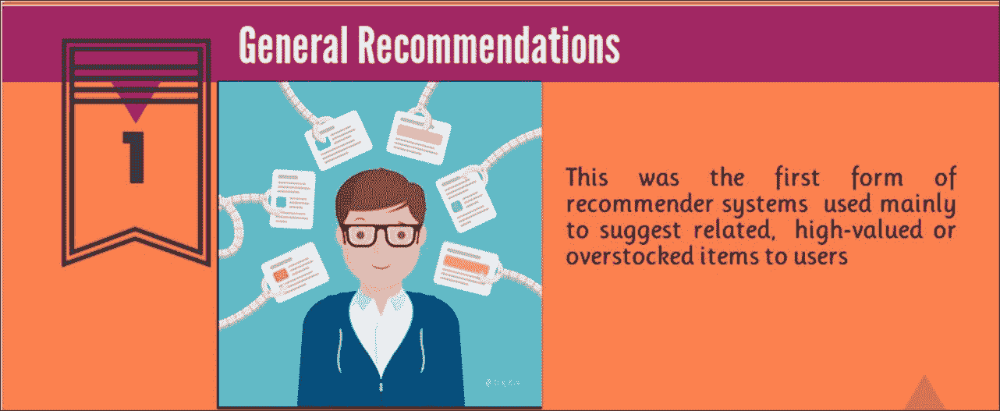

## 第二阶段 - 个性化推荐系统

随着信息爆炸的开始和越来越多的人开始使用网络，留下了大量的数字足迹，如搜索模式、点击和浏览，公司开始研究用户对哪些物品或产品感兴趣，以及哪些物品特征使得用户寻找它。公司开始意识到每个人都是独特的，有独特的品味，然后他们开始满足他们对个性化事物的需求；这些也被称为**基于内容的推荐系统**。在第三章《推荐引擎解释》中，我们详细了解了基于内容的推荐器。以下图显示了如何向客户提供个性化推荐：

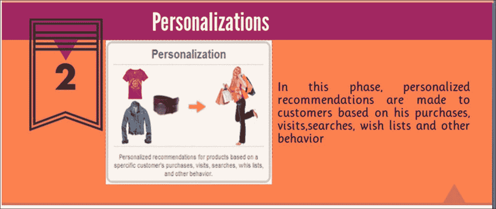

随着系统转向个性化系统——也称为基于内容的推荐系统——更高级的技术，如机器学习、大数据和云计算，开始计算更适合用户的物品。随着技术的进步，矩阵分解、**奇异值分解**（**SVD**）和回归分析等方法开始被采用。

如前所述，这两种方法在处理新数据（冷启动问题）和缩小信息方面有其局限性。为了解决这些问题，演进了集成或**混合推荐模型**，这些模型通过结合一个或多个算法来实现更高的准确性。

从这里，我们将进入**深度神经网络**，这是一种非常高级的神经网络算法，由多层堆叠而成，其中特征工程正在自动化。在机器学习模型中，一个主要且困难的任务是准确构建特征；因此，正在进行研究以将深度学习方法应用于推荐引擎。

### 注意

更多信息，请参考以下网站：

+   [`benanne.github.io/2014/08/05/spotify-cnns.html`](http://benanne.github.io/2014/08/05/spotify-cnns.html)

+   [`machinelearning.wustl.edu/mlpapers/paper_files/NIPS2013_5004.pdf`](http://machinelearning.wustl.edu/mlpapers/paper_files/NIPS2013_5004.pdf)

+   [`www.quora.com/Has-there-been-any-work-on-using-deep-learning-for-recommendation-engines`](https://www.quora.com/Has-there-been-any-work-on-using-deep-learning-for-recommendation-engines)

以下是一个在推荐引擎中实现深度学习的示例：

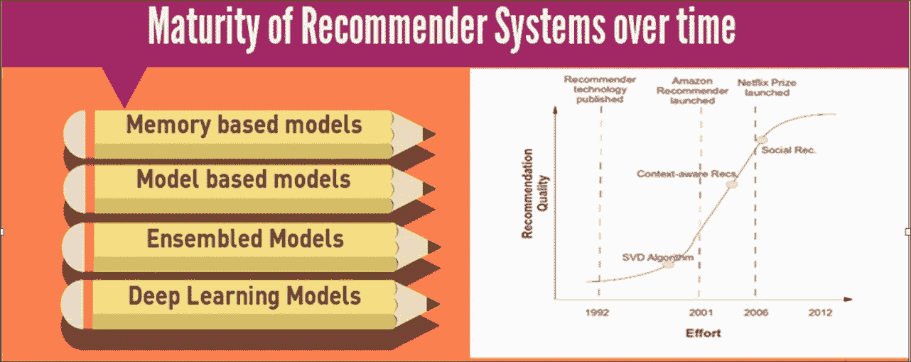

### 注意

一个推荐系统的 S 曲线将推动当前最先进的技术几乎达到其弯曲的顶端。

## 第三阶段 - 未来派推荐系统

在这一点上，让我暂停一下，带你们进入推荐系统的未来视角：我们正在进入一种被称为无处不在的推荐系统。无处不在的推荐者会根据你的位置、时间、心情、睡眠周期和能量输出实时推荐事物。以下图展示了这样一个未来系统：

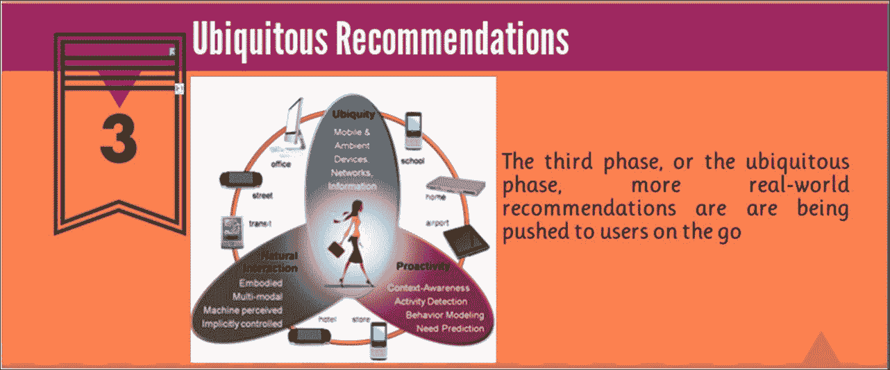

这意味着无论你走到哪里，无论你做什么，推荐系统都会在行动中观察你，并为你推荐事物。谷歌、Facebook 和其他主要 IT 巨头是这些推荐系统的先驱，他们几乎已经完善了这些系统，并开始提供这些无处不在的推荐系统。"谷歌 Allo"是谷歌的一个无处不在的推荐系统示例：

到目前为止，我们根据一些分类，如用户或物品，获得推荐，但未来将更加根据可用的数字足迹为用户量身定制。*谷歌 Allo*是当前最好的应用之一，它持续监控你，并根据你在应用上的活动，未来肯定会行动中为你推荐事物。"谷歌 Allo"是一个聊天环境，充当虚拟助手，帮助我们处理所有查询，反过来，它将随着时间的推移学习我们的偏好和兴趣，并在行动中提供智能建议。

这就是实时上下文感知推荐系统如何也属于这类未来派推荐系统：

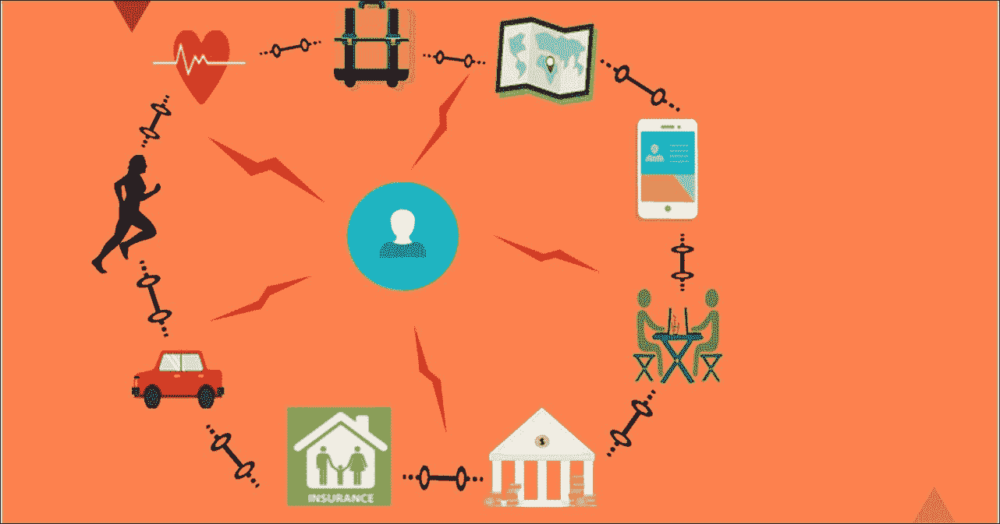

我们几乎生活在数字化世界中，我们依赖互联网来做几乎所有的事情，无论是与银行、医疗保健、驾驶汽车、餐馆、旅行、个人健身等相关。在不久的将来，所有公司都会共享用户信息，使用上述所有数字足迹来创建 360 度用户画像，并且将提供高度精确的个性化、实时、情境感知的推荐。在前面的图中，我们可以看到我们如何留下数字足迹，以及公司如何相互共享数据以生成针对个人级别的定制推荐。

动机已经发生了变化，这些变化正在推动推荐引擎向未来系统的发展。以下是一些例子：

+   搜索结束

+   留在互联网后面

+   从网络中浮现

自从推荐引擎出现以来，主要关注点在于客户，即使是面向未来的推荐系统，这一点也保持不变，但差异在于用户留下的数字足迹数量的增加。这种大量使用数字系统导致客户寻求更复杂的解决方案，以便使信息获取比通用性更加个性化。

### 搜索结束

我们正在从传统的搜索和网页集成方式转向信息和内容发现。未来的搜索引擎将使用网络*搜索/个性化/广告*的融合理论，这将使用户能够通过推荐而不是搜索进入内容发现。以下图显示了融合理论：

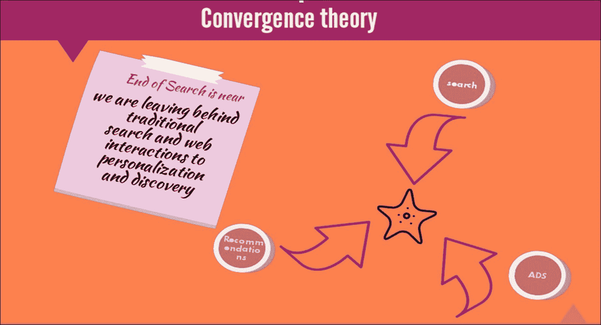

随着越来越多的人依赖互联网或搜索引擎在线寻找合适的产品，组织通过共享来自不同平台的用户在线活动数据来共同工作，目的是通过基于最近活动的准确个性化推荐来最小化查找相关信息或内容的搜索次数。

我将这种范式称为**融合理论**，其中传统的搜索、广告和推荐引擎结合在一起，通过结束互联网上的搜索，将相关内容发现带到用户个性化层面。

例如，谷歌搜索引擎和 YouTube 已经开始朝着这一融合理论迈进，以帮助用户找到相关产品信息并执行内容发现，而无需明确搜索。

最近，我在一个电子商务网站上寻找最新的信用卡大小单板计算机系列——树莓派 3，为了我的个人工作购买它。几天后，当我搜索谷歌搜索上的树莓派规格时，我注意到谷歌显示与树莓派相关的广告。虽然令人担忧，但它对我更方便，因为它消除了专门前往电子商务网站购买的任务。以下截图显示了搜索结果：

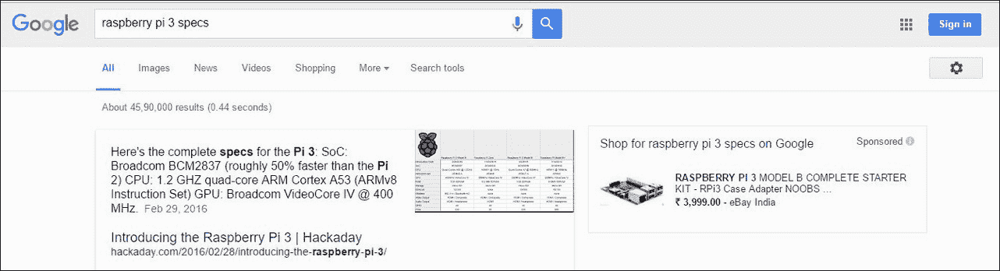

我们可以以 YouTube 为例。YouTube 上的建议变得越来越相关，以至于我们搜索所需信息的次数越来越少；我们跟随推荐的建议以获取更多相关主题的信息。

未来，我们将看到越来越多的应用利用这种汇聚理论来最小化用户搜索次数，以及个性化内容发现的推荐引擎。

### 离开网络

搜索引擎和推荐系统被用来通过联系客户来丰富社交体验和用户体验。更未来的系统将不断在线倾听他们的客户，并在最早的机会解决他们的不满，即使他们的不满是在社交媒体上表达的。以下图显示了未来推荐的动机——离开网络：

例如，想象一下，你通过在推特上标记航班官方推特账号来表达对你最近飞行体验的不满；将努力倾听这些关切，并亲自联系客户以解决他们的问题。除此之外，他们还可能通过更多个性化的优惠来取悦客户。

未来，所有组织可能会遵循这种方法，倾听他们在社交媒体上的客户投诉或反馈，并通过良好的推荐或优惠与客户联系，这对双方可能都有益。

### 从网络中脱颖而出

新的范例正在演变，例如互联网电视取代传统电视。那些人们必须等待在预定时间观看他们最喜欢的节目的时代已经过去了；取而代之的是，人们希望在他们方便的时间观看节目。现在时代已经改变；我们在互联网上选择对我们方便的时间观看剧集。

这种人们心态的变化使得企业重新设计他们的商业模式以增加利润。例如，Netflix 系列剧《纸牌屋》的所有剧集一次性发布，打破了每周一集的传统方式，这取得了巨大的成功，并促使其他制作公司效仿。

这种商业模式的出现是分析人们观看模式的结果。

《纸牌屋》系列的一个有趣方面是，该系列的制作方 Netflix 利用大数据分析来分析和理解其庞大用户群体的观看模式，从而创作出一个包含观众所喜爱所有元素的剧情，并制作了一部电视剧。当该剧播出时，立刻受到了欢迎。

这种方法已经进入其他组织，以便产生更多创新，以改善客户体验。

由于上述推荐动机的转变，推荐的环境正在改变。不同的人在不同的时间、与不同的人需要不同的事情。以下图表描绘了之前所解释的内容：

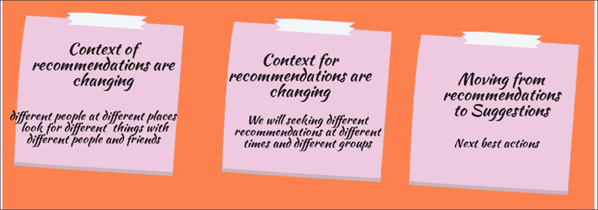

一个人和家人度假时可能有一套与和朋友度假时不同的需求。同样，同一个人在两个不同的地方可能同时有不同的需求。例如，一个因商务旅行到许多国家的人可能会有不同的需求，这取决于当地条件。在热带国家的人可能需要棉质连衣裙，而同样的人当在寒冷的国家时可能需要羊毛连衣裙。以下图表详细说明了这种偏好的差异，我们可以看到在不同国家、与不同人、在 不同时间穿着不同衣服的不同人：

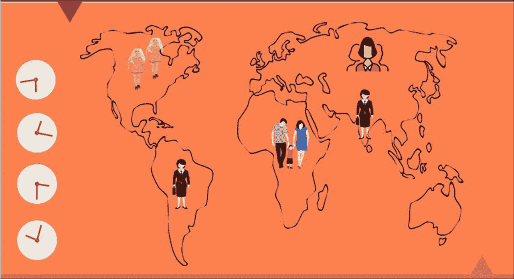

未来推荐系统将不断积极地倾听他们的用户，以满足他们的即时需求。

## 下一步最佳行动

另一种未来推荐系统将是那些足够复杂，能够预测你的下一步行动并做出相关建议，而无需你明确请求的系统。

来自电影《星际穿越》的 TARS 可能很快就会成为现实，这可能会通过考虑围绕该人的所有信息来建议人类下一步的最佳行动。

尽管 TARS 将是最高级的系统，但已经实现的人形机器人可能作为第一代下一步行动预测代理发挥作用。

## 值得关注的用例

在本节中，我们将列出一些可能让你对推荐引擎的未来更感兴趣的潜在用例。让我们看看一些普遍未来推荐的良好用例。

### 智能家居

物联网和推荐系统结合在一起形成了一种非常强大的组合，可以带来未来的推荐引擎。一个完全数字化的智能家居将是最佳用例，在未来，你的冰箱可能会在你工作时通过你的手机建议你的月度购物清单，就像下面的图片所示。同样，物联网启用型的推荐引擎是未来需要关注的：

图片来源：http://walyou.com/smart-home-gadgets/

### 医疗推荐系统

医疗推荐系统是我们需要密切关注的最激动人心的领域之一。研究人员正在关注我们如何通过高级分析将个性化的医疗保健带给普通人。例如，圣母大学的研究人员开发了一个名为**协作评估和推荐引擎**（**CARE**）的系统，该系统使用简单的协同过滤，根据症状的相似性找到相似的病人，并为个人生成可能的危险档案。

考虑 Proteus 数字健康公司的情况，该公司使用一个物联网启用型设备，一个可吞咽的传感器，来跟踪医疗依从性。该设备检测药物摄入，跟踪生理数据，并在患者不小心错过药片时提醒患者。

### 新闻作为推荐

如果你观察谷歌新闻，你可以看到背后有一个推荐引擎在工作，持续监控你的点击模式，并结合你周围的趋势，基于内容个性化的推荐引擎开始为你推荐定制新闻：

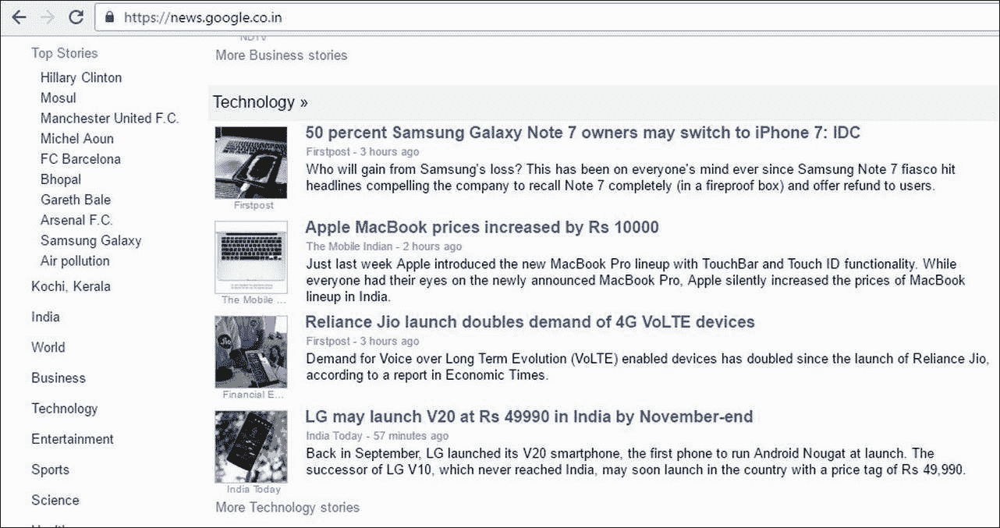

从这个应用的书中汲取灵感，许多新公司，如 Reddit 和 Rigg 等，都在使用推荐引擎来建议新闻条目或文章作为推荐。

# 流行的方法

在前面的章节中，我们看到了各种推荐引擎。在本节中，我们将讨论一些流行的方法，这些方法正在积极应用于构建推荐引擎，以提高推荐的鲁棒性和相关性，例如：

+   意外发现

+   时间因素

+   A/B 测试

+   反馈机制

## 意外发现

推荐引擎的一个缺点是，推荐引擎可能会将我们推向一个角落，在那里被建议或发现的物品将完全基于我们过去搜索过的内容或我们当前正在寻找的内容：

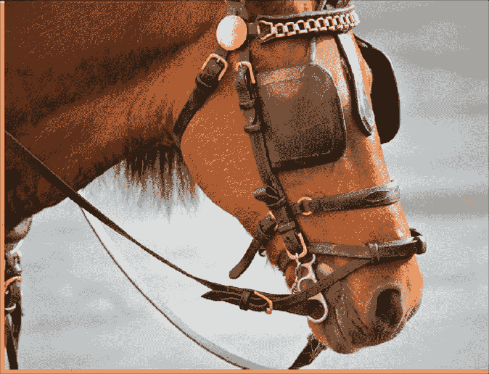

信用：neighwhentheyrun

它们的工作方式就像马的眼睛一样：它们保护马不被道路上的事物分散注意力。我们在网站上进行的互动越多，推荐就越狭窄，越接近用户的个人资料。这是错误吗？不，绝对不是，但这并不是生活的运作方式。如果我们回顾过去，大多数最好的发现都是偶然发现的。惊喜为生活增添了风味。当我们意外地找到我们需要的某样东西时，我们得到的快乐是无法用言语表达的。这种特性在目前以准确性为导向的推荐系统范式中是缺失的。

通过向我们的推荐系统引入偶然性和惊喜，我们可以减少上述限制。我们如何在推荐系统中引入偶然性呢？

在生成个性化的新闻文章推荐之前，谷歌新闻会将一个地区或国家内的热门新闻结合起来。这使得用户能够获得更多与他们周围趋势相关的新闻，他们也会对这类新闻产生兴趣。

# 推荐引擎的时间方面

考虑以下场景：一位女士在怀孕近 9 个月的时间里购买或寻找与怀孕相关的商品。在孩子出生后，她将开始寻找与新生儿相关的商品。我们的推荐引擎应该足够智能，能够捕捉到这些信息，一旦女士开始寻找新生儿商品，推荐引擎应立即移除与怀孕相关的推荐，因为它们不再相关。

以下图片展示了如果不考虑推荐引擎的时间方面，仍然向最近出家的僧侣推荐浪漫书籍的情况：

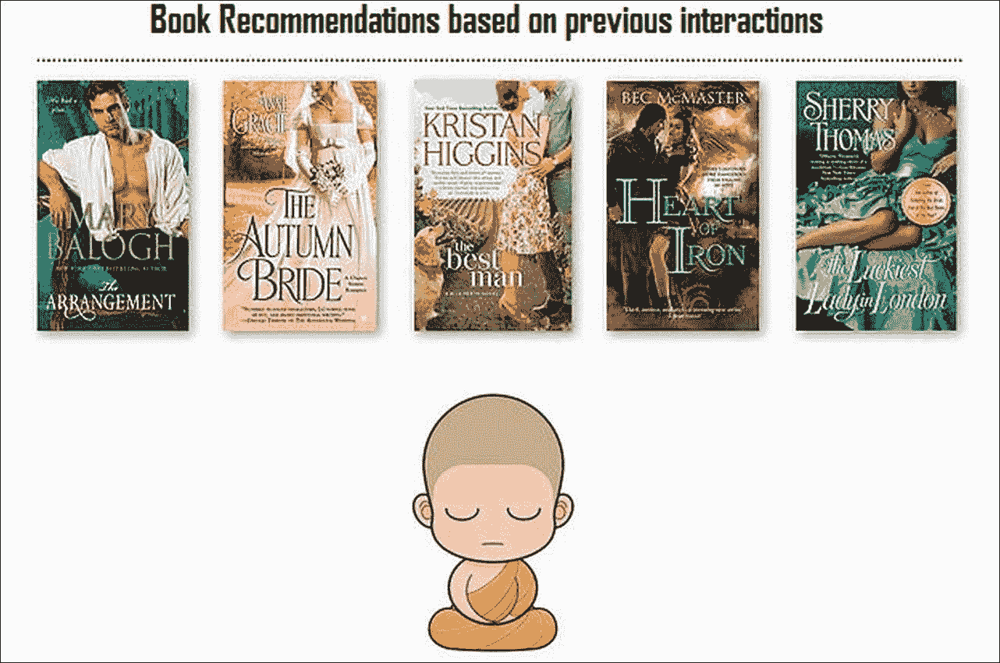

我们的选择非常具有时效性；我们可能不会喜欢今天喜欢的东西。在设计推荐引擎时，往往不会考虑时间的这一方面。我们的推荐系统捕捉用户的每一次互动，并在特定时期内积累大量的用户偏好。由于时间信息是用户偏好的固有部分，数据科学家利用时间信息来提高推荐引擎的相关性是合理的。处理时间方面的一个简单方法是在生成推荐时给予最近互动更多的权重，而给予旧互动较少的权重。

## A/B 测试

对于任何数据科学家来说，最重要的事情是什么？那就是我们构建的机器学习模型来解决当前问题的准确性。我们如何确保模型是正确的呢？我们通常在构建模型时执行评估指标，最可能的是交叉验证方法和错误/评估指标，以在将模型部署到生产之前检查模型的准确性。尽管我们在构建模型时应用了最佳实践，例如**RMSE**、精确率-召回率和交叉验证方法，这些你在前面的章节中学到的东西，都是在历史数据上评估的。一旦模型部署到生产环境中，我们才能了解模型的表现有多好。通常，对于一个问题并没有单一的解决方案。

在设计推荐引擎时，我们应该始终牢记以下几点：

+   一种评估模型实时性能的方法

+   总是使用多个模型来生成推荐，并选择最适合用户组的模型

以下展示了如何在生产场景中部署简单的 A/B 测试机制：

A/B 测试来救命。在 A/B 测试中，不同的推荐集将被发送给不同的用户集，并且将在一段时间内实时评估推荐的表现。尽管成本高昂，但 A/B 测试是一种有效的实时评估模型的方法。

## 反馈机制

在讨论了 A/B 测试评估推荐系统实时性能之后，设计包含反馈机制的推荐系统非常重要。这是为了将用户对生成的推荐的交互发送回用户，以微调在模型创建期间包含的模型特征。

讨论包含反馈机制的简单方法如下：

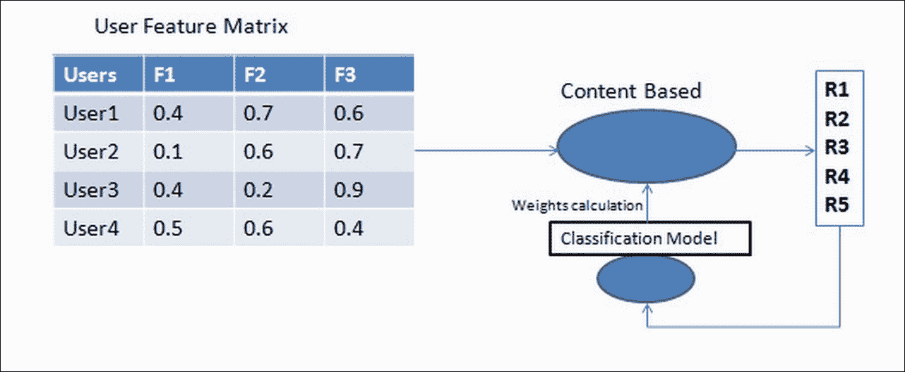

回顾我们用来生成推荐的内容基础方法。在内容基础方法中，所有特征都被赋予相同的权重。但我们应该意识到，并非所有特征都会对推荐模型产生同等程度的贡献。为了提高模型的准确性，我们应该启用一个机制来计算特征权重。引入一个反馈机制来捕捉用户对推荐的交互，然后使用这些信息构建一个分类模型来计算模型特征权重。

# 摘要

在本章中，我们了解了推荐引擎是如何演变的，以及影响推荐系统演变动机的因素，随后还提到了一些值得关注的潜在用例。最后，我们简要讨论了一些在设计推荐系统前应考虑的良好方法论。有了这些信息，我相信你现在已经准备好去应对构建未来就绪的推荐引擎的要求了，这些引擎是自我学习的、可扩展的、实时的，并且具有未来感。正如本章所述，深度学习在构建更具未来感的推荐系统中可以发挥非常重要的作用。
