# 第二章：推荐系统中使用的数据挖掘技术

尽管本书的主要目标是构建推荐系统，但在构建推荐系统之前，了解常用的数据挖掘技术是必要的步骤。在本章中，你将了解推荐系统中常用的数据预处理技术、数据挖掘技术和数据评估技术。本章的第一部分告诉你如何解决数据分析问题，随后是数据预处理步骤，如相似度度量降维。本章的下一部分处理数据挖掘技术及其评估技术。

相似度度量包括：

+   欧几里得距离

+   余弦距离

+   皮尔逊相关系数

降维技术包括：

+   主成分分析

数据挖掘技术包括：

+   k-means 聚类

+   支持向量机

+   集成方法，如 bagging、boosting 和随机森林

# 解决数据分析问题

任何数据分析问题都涉及一系列步骤，例如：

+   识别业务问题。

+   在领域专家的帮助下理解问题域。

+   识别适合分析的数据来源和数据变量。

+   数据预处理或清洗步骤，例如识别缺失值、定量和定性变量以及转换等。

+   执行探索性分析以理解数据，主要通过箱线图或直方图等视觉图形。

+   执行基本统计，如均值、中位数、众数、方差、标准差、变量之间的相关性以及协方差，以了解数据的性质。

+   将数据分为训练集和测试集，并使用机器学习算法和训练集运行模型，使用交叉验证技术。

+   使用测试数据验证模型，以评估模型在新数据上的表现。如果需要，根据验证步骤的结果改进模型。

+   可视化结果并将模型部署用于实时预测。

以下图像显示了数据分析问题的解决方案：

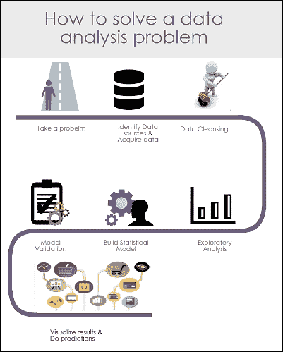

数据分析步骤

# 数据预处理技术

数据预处理是任何数据分析问题的关键步骤。模型的准确性主要取决于数据的质量。通常，任何数据预处理步骤都涉及数据清洗、转换、识别缺失值以及如何处理它们。只有预处理后的数据才能输入到机器学习算法中。在本节中，我们将主要关注数据预处理技术。这些技术包括相似度度量（如欧几里得距离、余弦距离和皮尔逊系数）以及降维技术，例如广泛用于推荐系统的**主成分分析**（**PCA**）。除了 PCA 之外，我们还有**奇异值分解**（**SVD**）、子集特征选择方法来降低数据集的维度，但我们的研究仅限于 PCA。

## 相似度度量

如前一章所述，每个推荐系统都是基于物品或用户之间的相似性概念工作的。在本节中，让我们探讨一些相似度度量，例如欧几里得距离、余弦距离和皮尔逊相关系数。

### 欧几里得距离

计算两个物品之间相似度的最简单技术是计算其欧几里得距离。在数据集中，两个点/对象（点 *x* 和点 *y*）之间的欧几里得距离由以下方程定义：

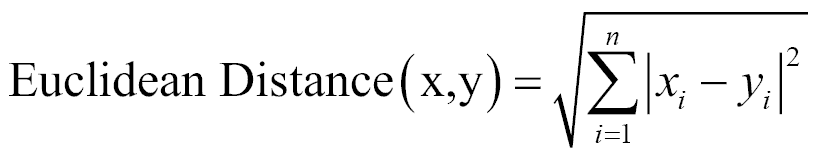

在这个方程中，(*x*, *y*) 是两个连续的数据点，*n* 是数据集的属性数量。

计算欧几里得距离的 R 脚本如下所示：

```py
x1 <- rnorm(30)
x2 <- rnorm(30)
Euc_dist = dist(rbind(x1,x2) ,method="euclidean")
```

### 余弦距离

余弦相似度是内积空间中两个向量之间相似度的度量，它衡量了它们之间角度的余弦值。余弦相似度由以下方程给出：

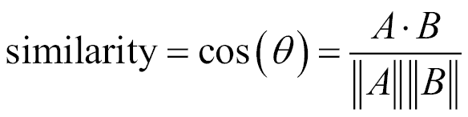

计算余弦距离的 R 脚本如下所示：

```py
vec1 = c( 1, 1, 1, 0, 0, 0, 0, 0, 0, 0, 0, 0 )
vec2 = c( 0, 0, 1, 1, 1, 1, 1, 0, 1, 0, 0, 0 )
library(lsa)
cosine(vec1,vec2)
```

在这个方程中，*x* 是包含数据集中所有变量的矩阵。`cosine` 函数在 `lsa` 包中可用。

### 皮尔逊相关系数

两个产品之间的相似度也可以通过它们变量之间的相关系数来表示。皮尔逊相关系数是两个变量之间的一种流行相关系数，它是两个变量的协方差除以它们标准差的乘积。这由 *ƿ* *(rho)* 给出：


R 脚本如下所示：

```py
Coef = cor(mtcars, method="pearson")
where mtcars is the dataset
```

实证研究表明，皮尔逊系数在基于用户的协同过滤推荐系统中优于其他相似度度量。研究还表明，余弦相似度在基于物品的协同过滤中表现始终良好。

## 维度约简

在构建推荐系统时，最常见的问题之一是高维和稀疏数据。很多时候，我们会遇到一个特征集很大而数据点很少的情况。在这种情况下，当我们将模型拟合到数据集时，模型的预测能力会降低。这种情况通常被称为维度诅咒。一般来说，增加数据点或减少特征空间（也称为降维）通常可以减少维度诅咒的影响。在本章中，我们将讨论 PCA，这是一种流行的降维技术，用于减少维度诅咒的影响。

### 主成分分析

主成分分析是一种经典的降维统计技术。PCA 算法将高维空间中的数据转换到低维空间。该算法将 m 维输入空间线性变换为 n 维（*n<m*）输出空间，目标是通过丢弃（*m-n*）维来最小化丢失的信息/方差。PCA 允许我们丢弃具有较小方差的变量/特征。

从技术角度讲，主成分分析（PCA）通过将高度相关的变量正交投影到一组线性不相关的变量（称为主成分）上来实现。主成分的数量小于或等于原始变量的数量。这种线性变换被定义为第一个主成分具有最大的可能方差。它通过考虑高度相关的特征来解释数据中的尽可能多的变异性。每个后续成分依次使用与第一个主成分相关性较低且与前一个成分正交的特征，以获得最高的方差。

让我们用简单的话来理解这个概念。假设我们有一个三维数据空间，其中有两个特征比与第三个特征更相关。现在我们想使用 PCA 将数据减少到二维空间。第一个主成分是以一种方式创建的，它使用数据中的两个相关变量来解释最大的方差。在下面的图中，第一个主成分（较粗的线）沿着数据解释了大部分的方差。为了选择第二个主成分，我们需要选择另一条具有最高方差、不相关且与第一个主成分正交的线。PCA 的实现和技术细节超出了本书的范围，因此我们将讨论如何在 R 中使用它。

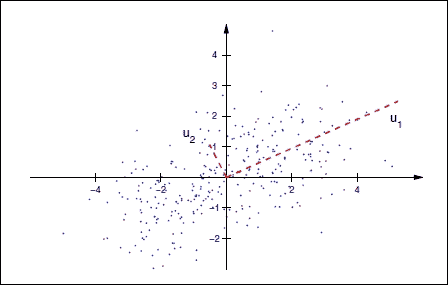

我们将使用 USArrests 数据集来说明 PCA。USArrests 数据集包含与犯罪相关的统计数据，例如袭击、谋杀、强奸和每 10 万人中的城市人口数，这些数据来自美国 50 个州：

```py
#PCA
data(USArrests)
head(states)
[1] "Alabama"    "Alaska"     "Arizona"    "Arkansas"   "California" "Colorado"

names(USArrests)
[1] "Murder"   "Assault"  "UrbanPop" "Rape"

#let us use apply() to the USArrests dataset row wise to calculate the variance to see how each variable is varying
apply(USArrests , 2, var)

Murder    Assault   UrbanPop       Rape
  18.97047 6945.16571  209.51878   87.72916
#We observe that Assault has the most variance. It is important to note at this point that

#Scaling the features is a very step while applying PCA.

#Applying PCA after scaling the feature as below
pca =prcomp(USArrests , scale =TRUE)

pca
```

**标准差**：

```py
[1] 1.5748783 0.9948694 0.5971291 0.4164494
```

**旋转**：

```py
                PC1        PC2        PC3         PC4
Murder   -0.5358995  0.4181809 -0.3412327  0.64922780
Assault  -0.5831836  0.1879856 -0.2681484 -0.74340748
UrbanPop -0.2781909 -0.8728062 -0.3780158  0.13387773
Rape     -0.5434321 -0.1673186  0.8177779  0.08902432

#Now lets us understand the components of pca output.

names(pca)
[1] "sdev"     "rotation" "center"   "scale"    "x"

#Pca$rotation  contains the principal component loadings matrix which explains

#proportion of each variable along each principal component.

#now let us learn interpreting the results of pca using biplot graph. Biplot is used to how the proportions of each variable along the two principal components.

#below code changes the directions of the biplot, if we donot include the below two lines the plot will be mirror image to the below one.
pca$rotation=-pca$rotation
pca$x=-pca$x
biplot (pca , scale =0)
```

上述代码的输出如下：

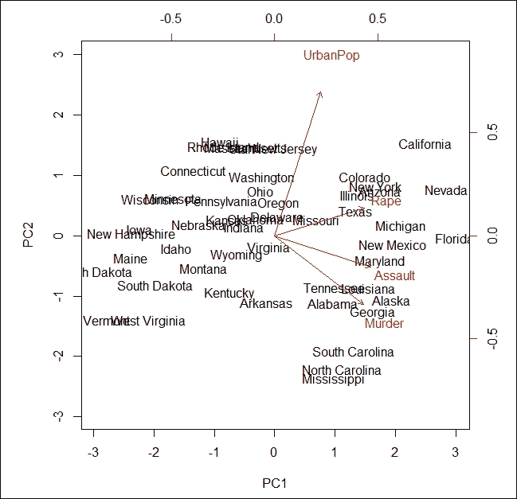

在前面的图像中，被称为双图，我们可以看到 USArrests 数据集的两个主成分（**PC1** 和 **PC2**）。红色箭头代表载荷向量，它们表示特征空间沿着主成分向量的变化。

从图中我们可以看到，第一个主成分向量，**PC1**，在三个特征：**强奸**、**攻击**和**谋杀**上或多或少给予相同的权重。这意味着这三个特征之间的相关性比**城市人口**特征更高。在第二个主成分，**PC2**比其他三个特征更重视**城市人口**，而其他三个特征与它们的相关性较低。

# 数据挖掘技术

在本节中，我们将探讨常用的数据挖掘算法，如 k-均值聚类、支持向量机、决策树、bagging、boosting 和随机森林。交叉验证、正则化、混淆矩阵和模型比较等评估技术将简要介绍。

# 聚类分析

聚类分析是将对象分组的过程，使得同一组中的对象比其他组中的对象更相似。

一个例子是识别和分组在旅游门户上有相似预订活动的客户，如图所示。

在前面的例子中，每个组被称为一个聚类，聚类中的每个成员（数据点）的行为与其组内成员相似。


聚类分析

聚类分析是一种无监督学习方法。在监督方法中，如回归分析，我们有输入变量和响应变量。我们将统计模型拟合到输入变量以预测响应变量。然而，在无监督学习方法中，我们没有任何响应变量来预测；我们只有输入变量。我们不是将模型拟合到输入变量以预测响应变量，而是试图在数据集中找到模式。有三种流行的聚类算法：层次聚类分析、*k*-均值聚类分析和两步聚类分析。在下一节中，我们将学习*k*-均值聚类。

## 解释 k-均值聚类算法

*k*-均值是一种无监督的迭代算法，其中 k 是要从数据中形成的聚类数量。聚类分为两个步骤：

1.  **聚类分配步骤**：在这个步骤中，我们随机选择两个聚类点（红色点和绿色点）并将每个数据点分配给离它更近的聚类点（以下图像的上半部分）。

1.  **移动质心步骤**：在这个步骤中，我们取每个组中所有示例点的平均值并将质心移动到新的位置，即计算出的平均位置（以下图像的下半部分）。

前面的步骤会重复进行，直到所有数据点都被分成两组，并且移动后的数据点均值不发生变化。

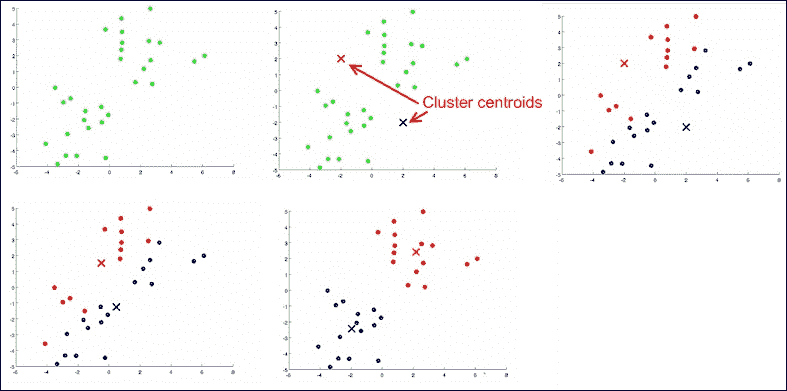

聚类分析的步骤

前面的图像展示了聚类算法如何在数据上工作以形成簇。以下是如何在鸢尾花数据集上实现 *k*-均值聚类的 R 语言版本：

```py
#k-means clustering
library(cluster)
data(iris)
iris$Species = as.numeric(iris$Species)
kmeans<- kmeans(x=iris, centers=5)
clusplot(iris,kmeans$cluster, color=TRUE, shade=TRUE,labels=13, lines=0)
```

前面代码的输出如下：

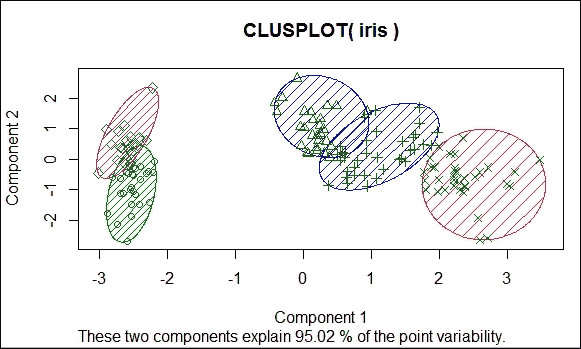

聚类分析结果

前面的图像显示了在鸢尾花数据上形成簇的情况，这些簇占数据量的 95%。在先前的例子中，使用 `elbow` 方法选择了 *k* 值的簇数，如下所示：

```py
library(cluster)
library(ggplot2)
data(iris)
iris$Species = as.numeric(iris$Species)
cost_df <- data.frame()
for(i in 1:100){
kmeans<- kmeans(x=iris, centers=i, iter.max=50)
cost_df<- rbind(cost_df, cbind(i, kmeans$tot.withinss))
}
names(cost_df) <- c("cluster", "cost")
#Elbow method to identify the idle number of Cluster
#Cost plot
ggplot(data=cost_df, aes(x=cluster, y=cost, group=1)) +
theme_bw(base_family="Garamond") +
geom_line(colour = "darkgreen") +
theme(text = element_text(size=20)) +
ggtitle("Reduction In Cost For Values of 'k'\n") +
xlab("\nClusters") +
ylab("Within-Cluster Sum of Squares\n")
```

下面的图像显示了 *k* 值的成本降低：

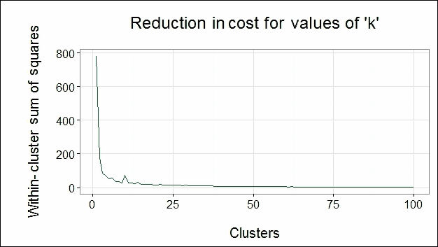

从前面的图中，我们可以观察到成本函数的方向在簇数为 5 时发生变化。因此，我们选择 5 作为我们的簇数 k。由于最佳簇数出现在图表的肘部，我们称之为肘部方法。

### 支持向量机

支持向量机算法是一种用于解决分类问题的监督学习算法。SVM 通常被视为处理分类问题中最好的算法之一。给定一组训练示例，其中每个数据点属于两个类别之一，SVM 训练算法构建一个模型，将新数据点分配到其中一个类别。这个模型是示例在空间中的表示，映射方式使得不同类别的示例通过尽可能宽的边界分开，如下面的图像所示。然后，将新示例映射到相同的空间，并根据它们落在间隙的哪一侧预测它们属于哪个类别。在本节中，我们将概述 SVM 的实现，而不涉及数学细节。

当 SVM 应用于 p 维数据集时，数据被映射到 *p-1* 维超平面，算法找到具有足够边界的清晰边界来区分类别。与其他也创建分离边界来分类数据点的分类算法不同，SVM 尝试选择具有最大边界的边界来区分类别，如下面的图像所示：

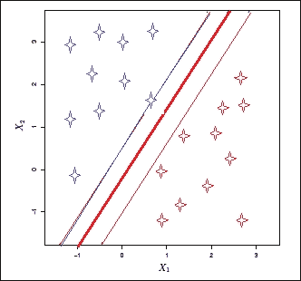

考虑一个具有两个类别的二维数据集，如图所示。现在，当应用 SVM 算法时，首先它会检查是否存在一个一维超平面来映射所有数据点。如果存在超平面，线性分类器会创建一个带有边界的决策边界来分离类别。在先前的图像中，粗红色的线是决策边界，而较细的蓝色和红色线是每个类别边界的外部边界。当使用新的测试数据来预测类别时，新的数据将落入两个类别之一。

这里有一些需要注意的关键点：

+   虽然可以创建无限多个超平面，但 SVM 只选择具有最大边界的超平面，即离训练观察结果最远的分离超平面。

+   这个分类器只依赖于位于超平面边缘的数据点，即在图像中的细边界，而不是数据集中的其他观察结果。这些点被称为支持向量。

+   决策边界只受支持向量的影响，而不受远离边界的其他观察结果的影响。如果我们改变除了支持向量之外的数据点，决策边界不会有任何影响。然而，如果支持向量改变，决策边界会改变。

+   训练数据上的大边界也会在测试数据上有大边界，以便正确分类测试数据。

+   支持向量机在非线性数据集上也表现良好。在这种情况下，我们使用径向核函数。

在以下代码片段中，您可以查看在鸢尾花数据集上 SVM 的 R 实现。我们使用了`e1071`包来运行 SVM。在 R 中，`SVM()`函数包含了`e1071`包中存在的支持向量机的实现。

现在，我们将看到`SVM()`方法与`tune()`方法一起被调用，后者进行交叉验证并在成本参数的不同值上运行模型。

交叉验证方法用于在测试未来未见数据之前评估预测模型的准确性：

```py
  #SVM
library(e1071)
data(iris)
sample = iris[sample(nrow(iris)),]
train = sample[1:105,]
test = sample[106:150,]
tune =tune(svm,Species~.,data=train,kernel ="radial",scale=FALSE,ranges =list(cost=c(0.001,0.01,0.1,1,5,10,100)))
tune$best.model
```

**调用**:

```py
best.tune(method = svm, train.x = Species ~ ., data = train, ranges = list(cost = c(0.001,
    0.01, 0.1, 1, 5, 10, 100)), kernel = "radial", scale = FALSE)
```

**参数**:

```py
   SVM-Type:  C-classification
 SVM-Kernel:  radial
       cost:  10
      gamma:  0.25

Number of Support Vectors:  25

summary(tune)

Parameter tuning of 'svm':
- sampling method: 10-fold cross validation
- best parameters:
 cost
   10
- best performance: 0.02909091
- Detailed performance results:
   cost      error dispersion
1 1e-03 0.72909091 0.20358585
2 1e-02 0.72909091 0.20358585
3 1e-01 0.04636364 0.08891242
4 1e+00 0.04818182 0.06653568
5 5e+00 0.03818182 0.06538717
6 1e+01 0.02909091 0.04690612
7 1e+02 0.07636364 0.08679584

model =svm(Species~.,data=train,kernel ="radial",cost=10,scale=FALSE)
// cost =10 is chosen from summary result of tune variable
```

`tune$best.model`对象告诉我们，该模型在成本参数为`10`和总支持向量数为`25`时效果最佳：

```py
pred = predict(model,test)
```

# 决策树

决策树是一种简单、快速的基于树的监督学习算法，用于解决分类问题。虽然与其他逻辑回归方法相比，其准确性不高，但在处理推荐系统时，这个算法非常有用。

我们通过一个例子定义决策树。想象一下，你必须根据花瓣长度、花瓣宽度、萼片长度和萼片宽度等特征来预测花的类别。我们将应用决策树方法来解决这个问题：

1.  在算法开始时考虑整个数据。

1.  现在，选择一个合适的问题/变量将数据分成两部分。在我们的案例中，我们选择根据花瓣长度 *> 2.45* 和 *<= 2.45* 来分割数据。这将从其他类别中分离出花类 `setosa`。

1.  现在，根据与花瓣长度 *< 4.5* 和 *>= 4.5* 相同的变量，进一步将花瓣长度 *> 2.45* 的数据进行分割，如下面的图像所示。

1.  这种数据分割将进一步通过缩小数据空间进行细分，直到所有底部点都代表响应变量或数据不能再进行进一步逻辑分割。

在下面的决策树图像中，我们有一个根节点，四个发生数据分割的内部节点，以及五个不能再进行数据分割的终端节点。它们定义如下：

+   **花瓣长度 <2.45** 作为根节点

+   **花瓣长度 <4.85**、**花萼长度 <5.15** 和 **花瓣宽度 <1.75** 被称为内部节点

+   具有花朵类别的最终节点被称为终端节点

+   连接节点的线条被称为树的分支

当使用先前构建的模型在新的数据上预测响应时，每个新的数据点都会通过每个节点，提出一个问题，并采取逻辑路径到达其逻辑类别，如下面的图所示：

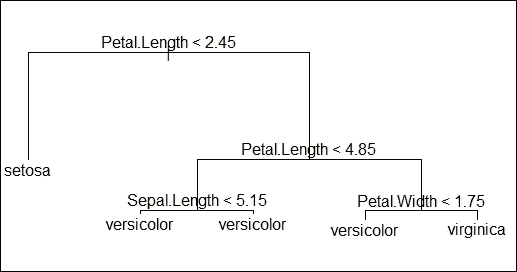

请参阅使用**综合 R 档案网络**（**CRAN**）提供的 tree 包在 iris 数据集上实现的决策树。

模型的总结信息在此给出。它告诉我们误分类率为 0.0381，表明模型是准确的：

```py
library(tree)
data(iris)
sample = iris[sample(nrow(iris)),]
train = sample[1:105,]
test = sample[106:150,]
model = tree(Species~.,train)
summary(model)
```

**分类树**：

```py
tree(formula = Species ~ ., data = train, x = TRUE, y = TRUE)
Variables actually used in tree construction:
[1] "Petal.Length" "Sepal.Length" "Petal.Width"
Number of terminal nodes:  5
Residual mean deviance:  0.1332 = 13.32 / 100
Misclassification error rate: 0.0381 = 4 / 105 '
//plotting the decision tree
plot(model)text(model)
pred = predict(model,test[,-5],type="class")
> pred
 [1] setosa     setosa     virginica  setosa     setosa     setosa     versicolor
 [8] virginica  virginica  setosa     versicolor versicolor virginica  versicolor
[15] virginica  virginica  setosa     virginica  virginica  versicolor virginica
[22] versicolor setosa     virginica  setosa     versicolor virginica  setosa    
[29] versicolor versicolor versicolor virginica  setosa     virginica  virginica
[36] versicolor setosa     versicolor setosa     versicolor versicolor setosa    
[43] versicolor setosa     setosa    
Levels: setosa versicolor virginica
```

# 集成方法

在数据挖掘中，我们使用集成方法，这意味着使用多个学习算法来获得比在任何一个统计问题中应用单个学习算法更好的预测结果。本节将概述流行的集成方法，如 bagging、boosting 和随机森林。

## Bagging

Bagging 也称为 Bootstrap aggregating。它旨在提高机器学习算法的稳定性和准确性。它有助于避免过拟合并减少方差。这主要用于决策树。

Bagging 涉及从数据集中随机生成 Bootstrap 样本并单独训练模型。然后通过聚合或平均所有响应变量进行预测：

+   例如，考虑一个数据集（*Xi, Yi*），其中*i=1 …n*，包含*n*个数据点。

+   现在，使用 Bootstrap 技术从原始数据集中随机选择带有替换的 B 样本。

+   接下来，独立地对 B 样本使用回归/分类模型进行训练。然后，通过平均回归情况下所有生成的 B 模型的响应，在测试集上进行预测。或者，在分类情况下，生成 B 样本中最常出现的类别。

## Random forests

随机森林是比自助聚合或袋装方法更复杂的监督算法，尽管它们基于类似的方法。与在袋装中使用 Bootstrap 技术生成的所有 B 样本中选择所有变量不同，我们从总变量中随机选择几个预测变量作为每个 B 样本。然后，这些样本使用模型进行训练。预测是通过平均每个模型的预测结果来进行的。每个样本中的预测变量数量是通过公式 *m = √p* 来决定的，其中 *p* 是原始数据集中变量的总数。

这里有一些关键点：

+   这种方法消除了数据集中强预测变量的依赖性条件，因为我们故意选择比每次迭代的全部变量更少的变量

+   这种方法还会去相关变量，导致模型中的变异性降低，因此更可靠

请参考 CRAN 上可用的`randomForest`包在鸢尾花数据集上的随机森林 R 实现：

```py
#randomForest
library(randomForest)
data(iris)
sample = iris[sample(nrow(iris)),]
train = sample[1:105,]
test = sample[106:150,]
model =randomForest(Species~.,data=train,mtry=2,importance =TRUE,proximity=TRUE)
model
```

**调用**：

```py
 randomForest(formula = Species ~ ., data = train, mtry = 2, importance = TRUE,      proximity = TRUE)
               Type of random forest: classification
                     Number of trees: 500
No. of variables tried at each split: 2

        OOB estimate of  error rate: 5.71%
Confusion matrix:
           setosa versicolor virginica class.error
setosa         40          0         0  0.00000000
versicolor      0         28         3  0.09677419
virginica       0          3        31  0.08823529

pred = predict(model,newdata=test[,-5])
pred
pred
       119         77         88         90         51         20         96
 virginica versicolor versicolor versicolor versicolor     setosa versicolor
         1          3        118        127          6        102          5
    setosa     setosa  virginica  virginica     setosa  virginica     setosa
        91          8         23        133         17         78         52
versicolor     setosa     setosa  virginica     setosa  virginica versicolor
        63         82         84        116         70         50        129
versicolor versicolor  virginica  virginica versicolor     setosa  virginica
       150         34          9        120         41         26        121
 virginica     setosa     setosa  virginica     setosa     setosa  virginica
       145        138         94          4        104         81        122
 virginica  virginica versicolor     setosa  virginica versicolor  virginica
        18        105        100
    setosa  virginica versicolor
Levels: setosa versicolor virginica
```

## Boosting

与袋装不同，袋装会创建多个 Bootstrap 样本副本，每个数据集副本都会拟合一个新的模型，并将所有单个模型组合成一个预测模型，每个新模型都是使用先前构建的模型的信息构建的。Boosting 可以理解为涉及两个步骤的迭代方法：

+   新模型是基于先前模型的残差而不是响应变量构建的

+   现在，从该模型计算残差并更新为上一步中使用的残差

前两个步骤会重复多次迭代，允许每个新模型从其先前的错误中学习，从而提高模型精度：

```py
#Boosting in R
library(gbm)
data(iris)
sample = iris[sample(nrow(iris)),]
train = sample[1:105,]
test = sample[106:150,]
model = gbm(Species~.,data=train,distribution="multinomial",n.trees=5000,interaction.depth=4)
summary(model)
```

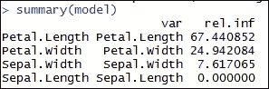

以下代码的输出如下：

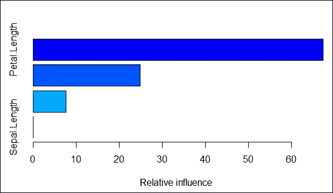

在以下代码片段中，`predict()`函数的输出值用于`apply()`函数，以从`pred`矩阵的每一行中选择概率最高的响应。`apply()`函数的结果输出是响应变量的预测：

```py
//the preceding summary states the relative importance of the variables of the model.

pred = predict(model,newdata=test[,-5],n.trees=5000)

pred[1:5,,]
        setosa versicolor virginica
[1,]  5.630363  -2.947531 -5.172975
[2,]  5.640313  -3.533578 -5.103582
[3,] -5.249303   3.742753 -3.374590
[4,] -5.271020   4.047366 -3.770332
[5,] -5.249324   3.819050 -3.439450

//pick the response with the highest probability from the resulting pred matrix, by doing apply(.., 1, which.max) on the vector output from prediction.
p.pred <- apply(pred,1,which.max)
p.pred
[1] 1 1 3 3 2 2 3 1 3 1 3 2 2 1 2 3 2 2 3 3 1 1 3 1 3 3 3 1 1 2 2 2 2 2 2 2 1 1 3 1 2
[42] 1 3 2 3
```

# 评估数据挖掘算法

在前面的章节中，我们看到了在推荐系统中使用的各种数据挖掘技术。在本节中，你将学习如何评估使用数据挖掘技术构建的模型。任何数据分析模型的最终目标是在未来数据上表现良好。只有当我们构建一个在开发阶段既高效又健壮的模型时，才能实现这一目标。

在评估任何模型时，我们需要考虑的最重要的事情如下：

+   模型是否过拟合或欠拟合

+   模型与未来数据或测试数据拟合得有多好

欠拟合，也称为偏差，是指模型甚至在训练数据上表现不佳的情况。这意味着我们为数据拟合了一个不太稳健的模型。例如，假设数据是非线性分布的，而我们用线性模型拟合数据。从以下图像中，我们看到数据是非线性分布的。假设我们拟合了一个线性模型（橙色线）。在这种情况下，在模型构建阶段本身，预测能力就会很低。

过拟合是指模型在训练数据上表现良好，但在测试数据上表现真的很差的情况。这种情况发生在模型记住数据模式而不是从数据中学习的时候。例如，假设数据以非线性模式分布，而我们拟合了一个复杂模型，用绿色线表示。在这种情况下，我们观察到模型非常接近数据分布进行拟合，注意到了所有的起伏。在这种情况下，模型最有可能在之前未见过的数据上失败。

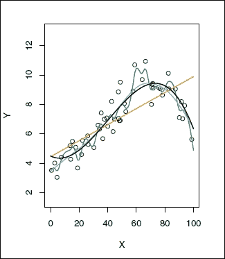

前面的图像展示了简单、复杂和适当拟合模型的训练数据。绿色拟合代表过拟合，橙色线代表欠拟合，黑色和蓝色线代表适当的模型，这是欠拟合和过拟合之间的权衡。

任何拟合模型都会通过交叉验证、正则化、剪枝、模型比较、ROC 曲线、混淆矩阵等来评估，以避免之前提到的场景。

**交叉验证**：这是几乎所有模型模型评估的一个非常流行的技术。在这种技术中，我们将数据分为两个数据集：一个训练数据集和一个测试数据集。模型使用训练数据集构建并使用测试数据集评估。这个过程重复多次。每次迭代都计算测试误差。计算所有迭代的平均测试误差，以概括所有迭代结束时模型的准确性。

**正则化**：在这种技术中，数据变量受到惩罚以降低模型的复杂性，目的是最小化成本函数。有两种最流行的正则化技术：岭回归和 Lasso 回归。在这两种技术中，我们都试图将变量系数降低到零。因此，更少的变量将能够最优地拟合数据。

**混淆矩阵**：这种技术在评估分类模型时非常流行。我们使用模型的输出结果构建一个混淆矩阵。我们计算精确度和召回率/灵敏度/特异性来评估模型。

**精确度**：这是真正分类记录是否相关的概率。

**召回率/灵敏度**：这是相关记录是否真正被分类的概率。

**特异性**：也称为真正负率，这是真正分类错误记录的比例。

下图所示的混淆矩阵是使用前一小节中讨论的分类模型的结果构建的：


让我们了解混淆矩阵：

**真正 (TP)**: 这是实际响应为负且模型预测为正的所有响应的计数。

**误报 (FP)**: 这是实际响应为负但模型预测为正的所有响应的计数。通常，这是一个**误报**。

**漏报 (FN)**: 这是实际响应为正但模型预测为负的所有响应的计数。通常，这是一个**漏报**。

**真负 (TN)**: 这是实际响应为负且模型预测也为负的所有响应的计数。

从数学上讲，精确度和召回率/特异性计算如下：

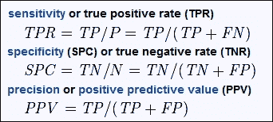

**模型比较**：可以使用一个或多个统计模型来解决分类问题。例如，可以使用逻辑回归、决策树、集成方法和 SVM 来解决分类问题。您如何选择哪个模型与数据拟合得更好？有几种方法可用于合适的模型选择，例如**赤池信息量准则 (AIC**)、**贝叶斯信息准则 (BIC**)和调整后的 R²、Cᵨ。对于每个模型，计算 AIC / BIC / 调整后的 R²。具有这些值中最小值的模型被选为最佳模型。

### 小贴士

**下载示例代码**

您可以从[`www.packtpub.com`](http://www.packtpub.com)下载您购买的所有 Packt Publishing 书籍的示例代码文件。如果您在其他地方购买了这本书，您可以访问[`www.packtpub.com/support`](http://www.packtpub.com/support)并注册，以便将文件直接通过电子邮件发送给您。

# 概述

在本章中，您学习了在推荐系统中常用的一些流行数据预处理技术、数据挖掘技术和评估技术。在下一章中，您将更详细地学习第一章中介绍的推荐系统，即“推荐系统入门”。
