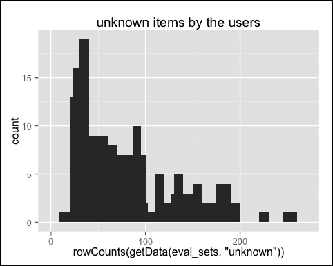
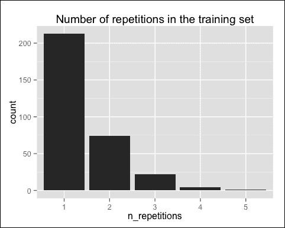
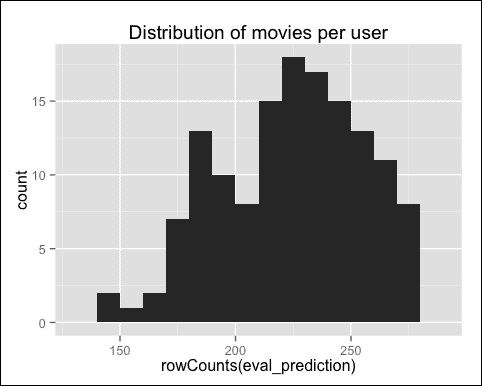
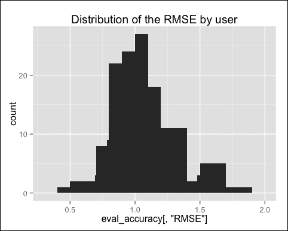
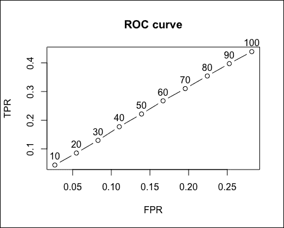
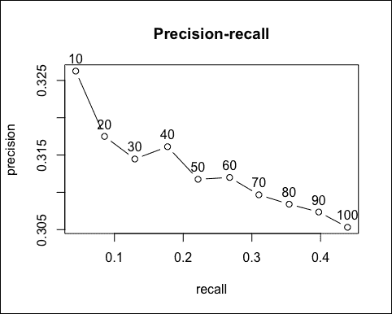
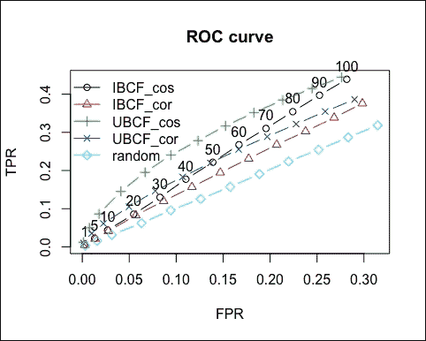
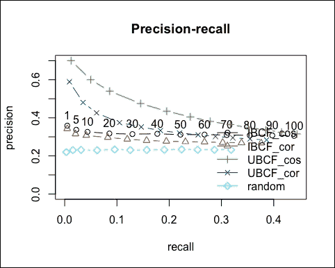
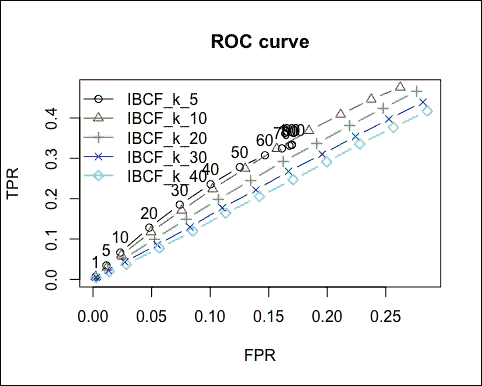
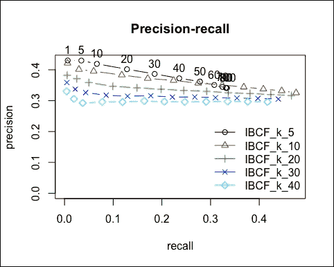

# 第四章 评估推荐系统

上一章向您展示了如何构建推荐系统。有几个选项，其中一些可以使用`recommenderlab`包开发。此外，每种技术都有一些参数。在构建模型后，我们如何决定使用哪一个？如何确定其参数？我们可以首先测试一些模型和/或参数配置的性能，然后选择表现最好的一个。

本章将向您展示如何评估推荐模型，比较它们的性能，并选择最合适的模型。在本章中，我们将涵盖以下主题：

+   准备数据以评估性能

+   评估某些模型的性能

+   选择表现最佳的模型

+   优化模型参数

# 准备数据以评估模型

为了评估模型，你需要用一些数据构建它们，并在其他数据上测试它们。本章将向您展示如何准备这两组数据。`recommenderlab`包包含预构建的工具，有助于这项任务。

目标是定义两个数据集，如下所示：

+   **训练集**：这些是从中用户学习的模型

+   **测试集**：这些是用户应用和测试的模型

为了评估模型，我们需要将它们与用户偏好进行比较。为了做到这一点，我们需要忘记测试集中的某些用户偏好，看看技术是否能够识别它们。对于测试集中的每个用户，我们忽略一些购买，并根据其他购买构建推荐。让我们加载包：

```py
library(recommenderlab)
library(ggplot2)
```

我们将使用的数据集被称为`MovieLense`。让我们定义只包含最相关用户和电影的`ratings_movies`：

```py
data(MovieLense)
ratings_movies <- MovieLense[rowCounts(MovieLense) > 50, colCounts(MovieLense) > 100]ratings_movies
## 560 x 332 rating matrix of class 'realRatingMatrix' with 55298 ratings.
```

我们现在准备好准备数据。

## 分割数据

构建训练集和测试集最简单的方法是将数据分成两部分。首先，我们需要决定将多少用户放入每一部分。例如，我们可以将 80%的用户放入训练集。我们可以通过指定训练集的百分比来定义`percentage_training`：

```py
percentage_training <- 0.8
```

对于测试集中的每个用户，我们需要定义使用多少个项目来生成推荐。剩余的项目将用于测试模型精度。最好这个参数低于任何用户购买的最少项目数，这样我们就不需要没有项目来测试模型的用户：

```py
min(rowCounts(ratings_movies))
## _18_
```

例如，我们可以保留`15`个项目：

```py
items_to_keep <- 15
```

评估一个模型包括将推荐与未知购买进行比较。评分在 1 到 5 之间，我们需要定义什么构成好项目和坏项目。为此，我们将定义一个阈值，即被认为是好的最低评分：

```py
rating_threshold <- 3
```

有一个额外的参数定义了我们想要运行评估的次数。目前，让我们将其设置为`1`：

```py
n_eval <- 1
```

我们已经准备好分割数据。`recommenderlab`函数是`evaluationScheme`，其参数如下：

+   `data`: 这是初始数据集

+   `method`: 这是分割数据的方式。在这种情况下，它是`split`

+   `train`: 这是训练集中数据的百分比

+   `given`: 这是需要保留的物品数量

+   `goodRating`: 这是评分阈值

+   `k`: 这是运行评估的次数

让我们构建包含这些集的`eval_sets`：

```py
eval_sets <- evaluationScheme(data = ratings_movies, method = "split", train = percentage_training, given = items_to_keep, goodRating = rating_threshold, k = n_eval) eval_sets
## Evaluation scheme with 15 items given
## Method: 'split' with 1 run(s).
## Training set proportion: 0.800
## Good ratings: >=3.000000
## Data set: 560 x 332 rating matrix of class 'realRatingMatrix' with 55298 ratings.
```

为了提取这些集，我们需要使用`getData`。有三个集：

+   `train`: 这是训练集

+   `known`: 这是测试集，用于构建推荐的物品

+   `unknown`: 这是测试集，用于测试推荐物品

让我们看看训练集：

```py
getData(eval_sets, "train")
## 448 x 332 rating matrix of class 'realRatingMatrix' with 44472 ratings.
```

它是一个`realRatingMatrix`对象，因此我们可以对其应用如`nrow`和`rowCounts`等方法：

```py
nrow(getData(eval_sets, "train")) / nrow(ratings_movies)
## _0.8_
```

如预期，大约 80%的用户在训练集中。让我们看看两个测试集：

```py
getData(eval_sets, "known")
## 112 x 332 rating matrix of class 'realRatingMatrix' with 1680 ratings.
getData(eval_sets, "unknown")
## 112 x 332 rating matrix of class 'realRatingMatrix' with 9146 ratings.
```

它们都有相同数量的用户。测试集中应该有大约 20%的数据：

```py
nrow(getData(eval_sets, "known")) / nrow(ratings_movies)
## _0.2_
```

一切如预期。让我们看看`known`集中每个用户有多少物品。它应该等于`items_to_keep`，即`15`：

```py
unique(rowCounts(getData(eval_sets, "known")))
## _15_
```

对于测试集中的用户来说，情况并非如此，因为剩余物品的数量取决于初始购买数量：

```py
qplot(rowCounts(getData(eval_sets, "unknown"))) + geom_histogram(binwidth = 10) + ggtitle("unknown items by the users")
```

下图显示了用户未知的物品：



如预期，用户拥有的物品数量差异很大。

## Bootstrapping 数据

在前面的子节中，我们将数据分为两部分，训练集包含了 80%的行。如果我们改用带替换的行采样呢？同一个用户可以被采样多次，如果训练集的大小与之前相同，测试集中将有更多的用户。这种方法被称为自助法（bootstrapping），并且由`recommenderlab`支持。参数与之前的方法相同。唯一的区别是我们指定`method = "bootstrap"`而不是`method = "split"`：

```py
percentage_training <- 0.8
items_to_keep <- 15
rating_threshold <- 3
n_eval <- 1
eval_sets <- evaluationScheme(data = ratings_movies, method = "bootstrap", train = percentage_training, given = items_to_keep, goodRating = rating_threshold, k = n_eval)
```

训练集中的用户数量仍然等于总用户数的 80%：

```py
nrow(getData(eval_sets, "train")) / nrow(ratings_movies)
## _0.8_
```

然而，对于测试集中的物品来说，情况并非如此：

```py
perc_test <- nrow(getData(eval_sets, "known")) / nrow(ratings_movies)
perc_test
## _0.4393_
```

测试集比之前的集大两倍以上。

我们可以提取训练集中的独特用户：

```py
length(unique(eval_sets@runsTrain[[1]]))
## _314_
```

训练集中独特用户的百分比应该与测试集中用户的百分比互补，如下所示：

```py
perc_train <- length(unique(eval_sets@runsTrain[[1]])) / nrow(ratings_movies)
perc_train + perc_test
## _1_
```

我们可以计算每个用户在训练集中重复的次数：

```py
table_train <- table(eval_sets@runsTrain[[1]])
n_repetitions <- factor(as.vector(table_train))
qplot(n_repetitions) + ggtitle("Number of repetitions in the training set")
```

下图显示了训练集中的重复次数：



大多数用户被采样少于四次。

## 使用 k-fold 来验证模型

前两种方法在用户的一部分上测试了推荐器。如果我们相反，对每个用户的推荐进行测试，我们可以更准确地衡量性能。我们可以将数据分成一些块，取出一个块作为测试集，并评估准确性。然后，我们可以对其他每个块做同样的事情，并计算平均准确性。这种方法称为 k 折，并且由`recommenderlab`支持。

我们可以使用`evaluationScheme`，与之前的区别在于，我们不是指定放入训练集的数据百分比，而是定义我们想要多少个块。参数是*k*，就像前例中的重复次数一样。显然，我们不再需要指定`train`：

```py
n_fold <- 4
eval_sets <- evaluationScheme(data = ratings_movies, method = "cross-validation", k = n_fold, given = items_to_keep, goodRating = rating_threshold)
```

我们可以计算每个集合中有多少个物品：

```py
size_sets <- sapply(eval_sets@runsTrain, length)
size_sets
## _420_, _420_, _420_ and _420_
```

如预期，所有集合的大小都相同。

这种方法是最准确的，尽管它计算量更大。

在本章中，我们看到了不同的方法来准备训练集和测试集。在下一章，我们将从评估开始。

# 评估推荐技术

本章将向您展示两种评估推荐的流行方法。它们都基于上一节中描述的交叉验证框架。

第一种方法是评估算法估计的评分。另一种方法是直接评估推荐。每种方法都有一个子节。

## 评估评分

为了向新用户推荐物品，协同过滤估计尚未购买的物品的评分。然后，它推荐评分最高的物品。目前，让我们忘记最后一步。我们可以通过比较估计评分与实际评分来评估模型。

首先，让我们准备验证数据，如前节所示。由于 k 折是最准确的方法，我们将在这里使用它：

```py
n_fold <- 4
items_to_keep <- 15
rating_threshold <- 3
eval_sets <- evaluationScheme(data = ratings_movies, method = "cross-validation", k = n_fold, given = items_to_keep, goodRating = rating_threshold)
```

我们需要定义要评估的模型。例如，我们可以评估一个基于物品的协同过滤推荐器。让我们使用推荐器函数来构建它。我们需要指定模型名称及其参数列表。如果我们使用默认值，那么它就是 NULL：

```py
model_to_evaluate <- "IBCF"
model_parameters <- NULL
```

我们现在准备好构建模型，使用以下代码：

```py
eval_recommender <- Recommender(data = getData(eval_sets, "train"), method = model_to_evaluate, parameter = model_parameters)
```

IBCF 可以推荐新物品并预测它们的评分。为了构建模型，我们需要指定我们想要推荐多少个物品，例如`10`，即使我们不需要在评估中使用此参数：

```py
items_to_recommend <- 10
```

我们可以使用`predict`函数使用预测评分来构建矩阵：

```py
eval_prediction <- predict(object = eval_recommender, newdata = getData(eval_sets, "known"), n = items_to_recommend, type = "ratings") class(eval_prediction)
## realRatingMatrix
```

`eval_prediction`对象是一个评分矩阵。让我们看看我们为每个用户推荐了多少部电影。为此，我们可以可视化每个用户观看电影数量的分布：

```py
qplot(rowCounts(eval_prediction)) + geom_histogram(binwidth = 10) + ggtitle("Distribution of movies per user")
```

下面的图像显示了每个用户观看电影的分布：



每个用户观看的电影数量大约在 150 到 300 部之间。

测量准确性的函数是`calcPredictionAccuracy`，它计算以下方面：

+   **均方根误差 (RMSE)**: 这是真实评分与预测评分之间差异的标准差。

+   **平均平方误差 (MSE)**: 这是真实评分与预测评分之间平方差值的平均值。它是 RMSE 的平方，因此包含相同的信息。

+   **平均绝对误差 (MAE)**: 这是真实评分与预测评分之间绝对差值的平均值。

我们可以通过指定`byUser = TRUE`来计算每个用户的这些指标：

```py
eval_accuracy <- calcPredictionAccuracy(
  x = eval_prediction, data = getData(eval_sets, "unknown"), byUser = TRUE)
head(eval_accuracy)
```

|   | RMSE | MSE | MAE |
| --- | --- | --- | --- |
| **1** | `1.217` | `1.481` | `0.8205` |
| **2** | `0.908` | `0.8244` | `0.727` |
| **6** | `1.172` | `1.374` | `0.903` |
| **14** | `1.405` | `1.973` | `1.027` |
| **15** | `1.601` | `2.562` | `1.243` |
| **18** | `0.8787` | `0.7721` | `0.633` |

让我们看看一个用户的 RMSE：

```py
qplot(eval_accuracy[, "RMSE"]) + geom_histogram(binwidth = 0.1) + ggtitle("Distribution of the RMSE by user")
```

下图显示了用户 RSME 的分布：



大多数的 RMSE 值在 0.8 到 1.4 之间。我们对每个用户的模型进行了评估。为了得到整个模型的表现指数，我们需要计算平均指数，指定`byUser = FALSE`：

```py
eval_accuracy <- calcPredictionAccuracy(x = eval_prediction, data = getData(eval_sets, "unknown"), byUser = FALSE) eval_accuracy
## _1.101_, _1.211_ and _0.8124_
```

这些指标有助于比较不同模型在相同数据上的性能。

## 评估推荐

另一种衡量准确性的方法是，通过比较具有正面评分的推荐与购买来衡量。为此，我们可以使用预构建的`evaluate`函数。其输入如下：

+   `x`: 这是一个包含评估方案的对象。

+   `method`: 这是推荐技术。

+   `n`: 这是为每个用户推荐的物品数量。如果我们指定一个`n`的向量，该函数将根据`n`评估推荐器的性能。

我们已经定义了一个阈值，`rating_threshold <- 3`，用于正面评分，并且这个参数已经存储在`eval_sets`中。`progress = FALSE`参数抑制了进度报告：

```py
results <- evaluate(x = eval_sets, method = model_to_evaluate, n = seq(10, 100, 10))
class(results)
## evaluationResults
```

`results`对象是一个包含评估结果的`evaluationResults`对象。使用`getConfusionMatrix`，我们可以提取一个混淆矩阵的列表。列表中的每个元素对应于*k*-fold 的不同分割。让我们看看第一个元素：

```py
head(getConfusionMatrix(results)[[1]])
```

|   | TP | FP | FN | TN | 精确度 | 召回率 | TPR | FPR |
| --- | --- | --- | --- | --- | --- | --- | --- | --- |
| **10** | `3.443` | `6.557` | `70.61` | `236.4` | `0.3443` | `0.04642` | `0.04642` | `0.02625` |
| **20** | `6.686` | `13.31` | `67.36` | `229.6` | `0.3343` | `0.09175` | `0.09175` | `0.05363` |
| **30** | `10.02` | `19.98` | `64.03` | `223` | `0.334` | `0.1393` | `0.1393` | `0.08075` |
| **40** | `13.29` | `26.71` | `60.76` | `216.2` | `0.3323` | `0.1849` | `0.1849` | `0.1081` |
| **50** | `16.43` | `33.57` | `57.62` | `209.4` | `0.3286` | `0.2308` | `0.2308` | `0.1362` |
| **60** | `19.61` | `40.39` | `54.44` | `202.6` | `0.3268` | `0.2759` | `0.2759` | `0.164` |

前四列包含真-假阳性/阴性，如下所示：

+   **真阳性 (TP)**：这些是被推荐并购买的物品

+   **假阳性 (FP)**：这些是被推荐但没有购买的物品

+   **假阴性 (FN)**：这些是没有被推荐但已购买的物品

+   **真阴性 (TN)**：这些是没有被推荐但没有购买的物品

一个完美（或过度拟合）的模型将只有 TP 和 TN。

如果我们想同时考虑所有分割，我们只需将指标相加：

```py
columns_to_sum <- c("TP", "FP", "FN", "TN")
indices_summed <- Reduce("+", getConfusionMatrix(results))[, columns_to_sum]
head(indices_summed)
```

|   | TP | FP | FN | TN |
| --- | --- | --- | --- | --- |
| **10** | `13.05` | `26.95` | `279.3` | `948.7` |
| **20** | `25.4` | `54.6` | `267` | `921` |
| **30** | `37.74` | `82.26` | `254.7` | `893.4` |
| **40** | `50.58` | `109.4` | `241.8` | `866.2` |
| **50** | `62.35` | `137.7` | `230` | `838` |
| **60** | `74.88` | `165.1` | `217.5` | `810.5` |

注意，我们本可以使用`avg(results)`。

其他四列包含性能指标，跨所有折叠总结它们比较困难。然而，我们可以通过构建一些图表来可视化它们。

首先，让我们构建 ROC 曲线。它显示了以下因素：

+   **真阳性率 (TPR)**：这是被推荐购买的物品的百分比。它是 TP 数量除以购买物品的数量（TP + FN）。

+   **假阳性率 (FPR)**：这是被推荐但没有购买的物品的百分比。它是假阳性 (FP) 数量除以未购买物品的数量（FP + TN）。

`plot`方法将构建一个包含`ROC 曲线`的图表。为了可视化标签，我们添加了`annotate = TRUE`输入：

```py
plot(results, annotate = TRUE, main = "ROC curve")
```

以下图像显示了 ROC 曲线：



以下两个准确度指标如下：

+   **精确度**：这是被推荐并购买的物品的百分比。它是 FP 数量除以总正数（TP + FP）。

+   **召回率**：这是被推荐购买的物品的百分比。它是 TP 数量除以总购买数量（TP + FN）。它也等于真阳性率。

如果推荐的购买物品比例很小，通常精度会降低。另一方面，如果推荐的购买物品比例更高，召回率会增加：

```py
plot(results, "prec/rec", annotate = TRUE, main = "Precision-recall")
```

以下图像显示了精确度-召回率曲线：



此图表反映了精确度和召回率之间的权衡。即使曲线不是完美的单调递增，趋势也是预期的。

在本节中，我们看到了如何评估一个模型。在下一节中，我们将看到如何比较两个或更多模型。

# 识别最合适的模型

上一章向您展示了如何评估一个模型。性能指标对于比较不同的模型和/或参数很有用。在相同的数据上应用不同的技术，我们可以比较性能指标以选择最合适的推荐器。由于有不同的评估指标，没有客观的方法来做这件事。

起始点是我们在上一节中定义的 k 折评估框架。它存储在`eval_sets`中。

## 比较模型

为了比较不同的模型，我们首先需要定义它们。每个模型存储在一个列表中，包含其名称和参数。列表的组成部分如下：

+   `name`: 这是模型名称。

+   `param`: 这是一个包含其参数的列表。如果所有参数都保留为默认值，则可以是 NULL。

例如，这就是我们如何通过将`k`参数设置为`20`来定义基于物品的协同过滤：

```py
list(name = "IBCF", param = list(k = 20))
```

为了评估不同的模型，我们可以定义一个包含它们的列表。我们可以构建以下过滤：

+   基于物品的协同过滤，使用余弦作为距离函数

+   基于物品的协同过滤，使用皮尔逊相关系数作为距离函数

+   基于用户的协同过滤，使用余弦作为距离函数

+   基于用户的协同过滤，使用皮尔逊相关系数作为距离函数

+   随机推荐以获得基准

前面的点在以下代码中定义：

```py
models_to_evaluate <- list(
  IBCF_cos = list(name = "IBCF", param = list(method = "cosine")),IBCF_cor = list(name = "IBCF", param = list(method = "pearson")),UBCF_cos = list(name = "UBCF", param = list(method = "cosine")),UBCF_cor = list(name = "UBCF", param = list(method = "pearson")),random = list(name = "RANDOM", param=NULL)
)
```

为了正确评估模型，我们需要测试它们，并改变物品的数量。例如，我们可能希望为每个用户推荐多达 100 部电影。由于 100 已经是一个很大的推荐数量，我们不需要包括更高的值：

```py
n_recommendations <- c(1, 5, seq(10, 100, 10))
```

我们已经准备好运行和评估模型。像上一章一样，函数是`evaluate`。唯一的区别是现在输入方法是一个模型列表：

```py
list_results <- evaluate(x = eval_sets, method = models_to_evaluate, n = n_recommendations)
class(list_results)
## evaluationResultList
```

`list_results`对象是一个`evaluationResultList`对象，它可以被视为一个列表。让我们看看它的第一个元素：

```py
class(list_results[[1]])
## evaluationResults
```

`list_results`的第一个元素是一个`evaluationResults`对象，这个对象与使用单个模型的`evaluate`输出的对象相同。我们可以检查所有元素是否都相同：

```py
sapply(list_results, class) == "evaluationResults"
## TRUE TRUE TRUE TRUE TRUE
```

`list_results`的每个元素都是一个`evaluationResults`对象。我们可以使用`avg`提取相关的平均混淆矩阵：

```py
avg_matrices <- lapply(list_results, avg)
```

我们可以使用`avg_matrices`来探索性能评估。例如，让我们看看使用余弦距离的 IBCF：

```py
head(avg_matrices$IBCF_cos[, 5:8])
```

|   | 精确率 | 召回率 | TPR | FPR |
| --- | --- | --- | --- | --- |
| **1** | `0.3589` | `0.004883` | `0.004883` | `0.002546` |
| **5** | `0.3371` | `0.02211` | `0.02211` | `0.01318` |
| **10** | `0.3262` | `0.0436` | `0.0436` | `0.02692` |
| **20** | `0.3175` | `0.08552` | `0.08552` | `0.0548` |
| **30** | `0.3145` | `0.1296` | `0.1296` | `0.08277` |
| **40** | `0.3161` | `0.1773` | `0.1773` | `0.1103` |

我们有了上一章的所有指标。在下一节中，我们将探索这些指标以确定表现最佳的模型。

## 识别最合适的模型

我们可以通过构建显示其 ROC 曲线的图表来比较模型。就像上一节一样，我们可以使用`plot`。`annotate`参数指定了哪些曲线将包含标签。例如，第一和第二曲线通过定义`annotate = c(1, 2)`进行标记。在我们的情况下，我们将只标记第一条曲线：

```py
plot(list_results, annotate = 1, legend = "topleft") title("ROC curve")
```



一个好的性能指标是曲线下的面积（**AUC**），即 ROC 曲线下的面积。即使没有计算它，我们也可以注意到最高的 AUC 是使用余弦距离的 UBCF，所以它是表现最好的技术。

就像我们在上一节所做的那样，我们可以构建精确率-召回率图：

```py
plot(list_results, "prec/rec", annotate = 1, legend = "bottomright") title("Precision-recall")
```

以下图像显示了精确率-召回率：



使用余弦距离的 UBCF 仍然是最佳模型。根据我们想要实现的目标，我们可以设置一个合适的推荐项目数量。

## 优化数值参数

推荐模型通常包含一些数值参数。例如，IBCF 考虑了*最近的 k 个*项目。我们如何优化*k*？

与分类参数类似，我们可以测试一个数值参数的不同值。在这种情况下，我们还需要定义我们想要测试的值。

到目前为止，我们将*k*保留为其默认值：`30`。现在，我们可以探索更多值，范围在`5`到`40`之间：

```py
vector_k <- c(5, 10, 20, 30, 40)
```

使用`lapply`，我们可以定义一个要评估的模型列表。距离度量是余弦：

```py
models_to_evaluate <- lapply(vector_k, function(k){
  list(name = "IBCF", param = list(method = "cosine", k = k))})names(models_to_evaluate) <- paste0("IBCF_k_", vector_k)
Using the same commands as we did earlier, let's build and evaluate the models:
n_recommendations <- c(1, 5, seq(10, 100, 10))
list_results <- evaluate(x = eval_sets, method = models_to_evaluate, n = n_recommendations)
```

通过构建 ROC 曲线的图表，我们应该能够识别表现最佳的*k*：

```py
plot(list_results, annotate = 1,      legend = "topleft") title("ROC curve")
```



具有最大 AUC 的*k*是 10。另一个好的候选值是 5，但它永远不会有一个高的 TPR。这意味着，即使我们设置一个非常高的 n 值，算法也无法推荐大量用户喜欢的项目。`k = 5`的 IBCF 只推荐少量与购买相似的项目。因此，它不能用来推荐许多项目。

让我们看看精确率-召回率图：

```py
plot(list_results, "prec/rec", annotate = 1, legend = "bottomright")
title("Precision-recall")
```

以下图像显示了精确率-召回率：



要实现最高的召回率，我们需要将`k`设置为`10`。如果我们更关注精确率，我们将`k`设置为`5`。

本节使用不同的方法评估了四种技术。然后，它优化了其中之一的一个数值参数。根据我们想要实现的目标，参数的选择可能会有所不同。

# 摘要

本章向您展示了如何评估不同模型的表现，以便选择最准确的一个。评估性能的方法有很多，可能会导致不同的选择。根据业务目标，评估指标也不同。这是如何将业务和数据结合以实现最终结果的例子。

下一章将解释一个完整的使用案例，其中我们将准备数据，构建不同的模型，并对它们进行测试。
