# 第二章：数据分布

在本章中，我们将涵盖数据和分布的基本方面。我们将从介绍数据类型和数据分布开始。在介绍分布的基本度量后，我们将描述正态分布及其重要特性，包括中心极限定理。最后，我们将涵盖重采样方法，如排列，以及变换方法，如对数变换。本章涵盖了开始统计建模所需的基础知识。

在本章中，我们将涵盖以下主要主题：

+   理解数据类型

+   测量和描述分布

+   正态分布和中心极限定理

+   自举

+   排列

+   变换

# 技术要求

本章将使用 Python 3.8。

本章的代码可以在以下位置找到 – [`github.com/PacktPublishing/Building-Statistical-Models-in-Python`](https://github.com/PacktPublishing/Building-Statistical-Models-in-Python) – 在`ch2`文件夹中。

请设置一个虚拟环境或 Anaconda 环境，并安装以下包：

+   `numpy==1.23.0`

+   `scipy==1.8.1`

+   `matplotlib==3.5.2`

+   `pandas==1.4.2`

+   `statsmodels==0.13.2`

# 理解数据类型

在讨论数据分布之前，了解数据类型会有所帮助。理解数据类型至关重要，因为数据类型决定了可以使用哪些分析，因为数据类型决定了可以使用哪些操作来处理数据（这将在本章的示例中变得更加清晰）。有四种不同的数据类型：

+   名义数据

+   序数数据

+   区间数据

+   比率数据

这些类型的数据也可以分为两组。前两种数据类型（名义和序数）是**定性数据**，通常是非数字类别。最后两种数据类型（区间和比率）是**定量数据**，通常是数值。

让我们从名义数据开始。

## 名义数据

名义数据是对具有不同分组进行标记的数据。例如，考虑一个标志工厂中的机器。工厂通常从不同的供应商那里采购机器，这也会有不同的型号号。例如，示例工厂可能有 3 台**型号 A**和 5 台**型号 B**（见*图 2.1*）。机器将构成一组名义数据，其中**型号 A**和**型号 B**是不同的分组标签。对于名义数据，只有一个操作可以执行：相等。组内的每个成员都是相等的，而来自不同组的成员是不相等的。在我们的工厂示例中，一台**型号 A**机器将等于另一台**型号 A**机器，而一台**型号 B**机器将不等于一台**型号 A**机器。

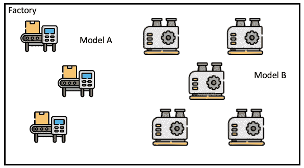

图 2.1 – 工厂中的两组机器

如我们所见，使用这种类型的数据，我们只能在标签下将项目分组。在下一类型的数据中，我们将介绍一个新特性：顺序。

## 序数数据

下一种类型的数据类似于名义数据，但表现出顺序。数据可以被标记成不同的组，并且这些组可以排序。我们称这种类型的数据为序数数据。继续以工厂为例，假设有一个**Model C**型号的机器，**Model C**与**Model B**由相同的供应商提供。然而，**Model C**是高性能版本，产生更高的输出。在这种情况下，**Model B**和**Model C**是序数数据，因为**Model B**是低输出机器，而**Model C**是高输出机器，这创造了一个自然顺序。例如，我们可以按性能的升序排列模型标签：**Model B**，**Model C**。大学教育水平也是序数数据的另一个例子，有 BS、MS 和 PhD 等级。如前所述，这种类型数据的新操作是排序，意味着数据可以被排序。因此，序数数据支持排序和相等性。虽然这种类型的数据可以按升序或降序排序，但我们不能对数据进行加减运算，这意味着**Model B** + **Model C**不是一个有意义的陈述。我们将讨论的下一类型数据将支持加减运算。

## 区间数据

下一种类型的数据，区间数据，用于描述存在于区间尺度上的数据，但没有明确的零点定义。这意味着两个数据点之间的差异是有意义的。以摄氏温度尺度为例。数据点是数值的，并且数据点在区间内均匀分布（例如，20 和 40 都距离 30 有 10 度）。在这个温度尺度的例子中，0 的定义是任意的。对于摄氏度来说，0 恰好被设定在水的冰点，但这是尺度设计者做出的一个任意选择。因此，区间数据类型支持相等性、排序和加减运算。

## 比例数据

最后一种数据类型是比例数据。与区间数据一样，比例数据是有序的数值数据，但与区间数据不同，比例数据有一个绝对零点。绝对零点意味着如果一个比例类型变量的值为零，那么该变量不存在或不存在。例如，考虑游乐园的等待时间。如果没有人在等待游乐设施，等待时间就是 0；新客人可以立即乘坐游乐设施。等待时间没有有意义的负值。0 是绝对最小值。比例数据也支持有意义的乘除运算，这使得比例数据成为支持操作最多的数据类型。

## 数据类型的可视化

数据可视化是理解分布和识别数据属性的关键步骤。在本章（以及整本书中），我们将使用`matplotlib`来可视化数据。虽然可以使用其他 Python 库进行数据可视化，但`matplotlib`是 Python 事实上的标准绘图库。在本节中，我们将开始使用`matplotlib`来可视化之前讨论的四种类型的数据。

### 绘制定性数据类型

由于前两种数据类型是分类的，我们将使用柱状图来可视化这些数据的分布。示例柱状图显示在图 2.2 中。

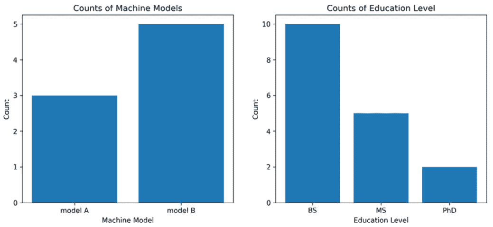

图 2.2 – 柱状图中的名义数据（左侧）和有序数据（右侧）

图 2.2 左侧的柱状图显示了工厂示例中给出的**模型 A**机器和**模型 B**机器的分布。右侧的柱状图显示了工程师团队的教育水平分布示例。请注意，在教育水平柱状图中，*x*轴标签按教育水平从低到高排序。

生成图 2.2 所使用的代码如下所示。

代码有三个主要部分。

+   **库导入**：

在这个例子中，我们只从`matplotlib`中导入`pyplot`，它通常以`plt`的形式导入。

+   **创建数据的代码**：

在`import`语句之后，有一些语句用于创建我们将要绘制的图形所需的数据。第一个图形的数据存储在两个 Python 列表中：`label`和`counts`，分别包含机器标签和机器数量。值得注意的是，这两个列表包含相同数量的元素（两个元素）。教育数据以类似的方式存储。虽然在这个例子中，我们使用的是简单的示例数据，但在后面的章节中，我们将有额外的步骤来检索和格式化数据。

+   **绘制数据的代码**：

最后一步是绘制数据。由于在这个例子中我们要绘制两组数据，我们使用 `subplots` 方法，这将创建一个图表网格。`subplots` 方法的两个参数是网格中图表的行数和列数。在我们的情况下，行数是 `1`，列数是 `2`。`subplots` 方法返回两个对象；图，`fig`，和坐标轴，`ax`。返回的第一个对象，`fig`，对图有高级控制，例如保存图、在新窗口中显示图等。第二个对象，`ax`，将是一个单独的坐标轴对象或坐标轴对象的数组。在我们的情况下，`ax` 是坐标轴对象的数组——因为我们的网格有两个图表，对 `ax` 进行索引给我们坐标轴对象。我们使用坐标轴对象的 `bar` 方法创建柱状图。`bar` 方法有两个必需的参数。第一个必需的参数是标签列表。第二个参数是与每个标签对应的柱高，这就是为什么两个列表必须有相同长度。其他三个方法，`set_title`、`set_ylabel` 和 `set_xlabel`，设置相应图表属性的值：`title`、`ylabel` 和 `x-label`。

最后，使用 `fig.show()` 创建图：

```py
import matplotlib.pyplot as plt
label = ['model A', 'model B']
counts = [3, 5]
edu_label = ['BS', 'MS', 'PhD']
edu_counts = [10, 5, 2]
fig, ax = plt.subplots(1, 2, figsize=(12, 5))
ax[0].bar(label, counts)
ax[0].set_title('Counts of Machine Models')
ax[0].set_ylabel('Count')
ax[0].set_xlabel('Machine Model')
ax[1].bar(edu_label, edu_counts)
ax[1].set_title('Counts of Education Level')
ax[1].set_ylabel('Count')
ax[1].set_xlabel('Education Level')
fig.show()
```

现在我们来看如何绘制其他两种数据类型的数据。

### 绘制定量数据类型

由于最后两种数据类型是数值型的，我们将使用直方图来可视化分布。*图 2.3* 中显示了两个示例直方图。

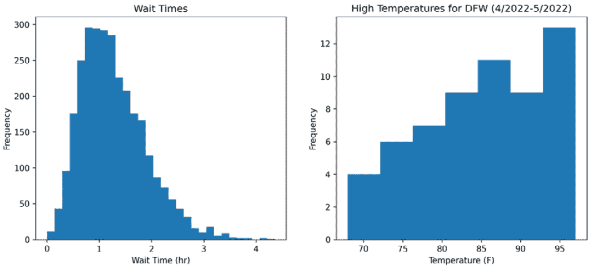

图 2.3 – 柱状图中的名义数据（左侧）和有序数据（右侧）

左侧的直方图是合成等待时间数据（比率数据），可能代表游乐园的等待时间。右侧的直方图是 2022 年 4 月和 5 月达拉斯-沃斯堡地区的温度数据（来自 [`www.iweathernet.com/texas-dfw-weather-records`](https://www.iweathernet.com/texas-dfw-weather-records))。

生成 *图 2.3* 所使用的代码如下。同样，代码有三个主要部分，库导入、数据创建代码和绘图代码。

与前面的例子一样，`matplotlib` 被导入为 `plt`。在这个例子中，我们还从 `scipy` 中导入了一个函数；然而，这个函数仅用于生成用于工作的样本数据，我们不会在这里详细讨论它。对于我们的目的，只需将 `skewnorm` 视为一个生成数字数组的函数即可。这个代码块与前面的代码块非常相似。

主要区别在于用于绘制数据的图表方法，`hist`，它创建直方图。`hist`方法有一个必需的参数，即要在直方图中绘制的数字序列。本例中使用的第二个参数是`bins`，它实际上控制了直方图的粒度 – 粒度随着更多的 bins 而增加。直方图的 bin 计数可以根据所需的视觉效果进行调整，通常通过实验设置来绘制数据：

```py
from scipy.stats import skewnorm
import matplotlib.pyplot as plt
a = 4
x = skewnorm.rvs(a, size=3000) + 0.5
x = x[x > 0]
dfw_highs = [
    85, 87, 75, 88, 80, 86, 90, 94, 93, 92, 90, 92, 94,
    93, 97, 90, 95, 96, 96, 95, 92, 70, 79, 73, 88, 92,
    94, 93, 95, 76, 78, 86, 81, 95, 77, 71, 69, 88, 86,
    89, 84, 82, 77, 84, 81, 79, 75, 75, 91, 86, 86, 84,
    82, 68, 75, 78, 82, 83, 85]
fig, ax = plt.subplots(1,2, figsize=(12, 5))
ax[0].hist(x, bins=30)
ax[0].set_xlabel('Wait Time (hr)')
ax[0].set_ylabel('Frequency')
ax[0].set_title('Wait Times');
ax[1].hist(dfw_highs, bins=7)
ax[1].set_title('High Temperatures for DFW (4/2022-5/2022)')
ax[1].set_ylabel('Frequency')
ax[1].set_xlabel('Temperature (F)')
fig.show()
```

在本节中，我们简要了解了数据和分布的多样性。由于数据分布在外部世界中以许多形状和大小出现，因此拥有描述分布的方法是有用的。在下一节中，我们将讨论可用于分布的测量方法，这些测量的执行方式以及可以测量的数据类型。

# 测量和描述分布

在野外发现的数据分布形状和大小各异。本节将讨论如何测量分布以及哪些测量适用于四种类型的数据。这些测量将提供比较和对比不同分布的方法。本节讨论的测量可以划分为以下类别：

+   中心趋势

+   变异性

+   形状

这些测量被称为**描述性统计**。本节中讨论的描述性统计在数据统计摘要中常用。

## 测量中心趋势

中心趋势的测量有三种类型：

+   模式

+   中位数

+   均值

让我们逐一讨论它们。

### 模式

我们将首先讨论的中心趋势测量是模式。数据集的模式简单地说是最常见的实例。以工厂中的机器为例（见*图 2.1*），数据集的模式将是型号 B。在例子中，有 3 台型号 A 和 5 台型号 B，因此，使型号 B 成为最常见的 – 模式。

数据集可以是以下之一：

+   单模态 – 具有一个模式

+   多模态 – 具有多个模式

在前面的例子中，数据是单模态的。

再次使用工厂的例子，让我们想象有 3 台**型号 A**，5 台**型号 B**和 5 台**型号 D**（一种新型号）。那么，数据集将有两个模式：**型号 B**和**型号 D**，如图*图 2.4*所示。

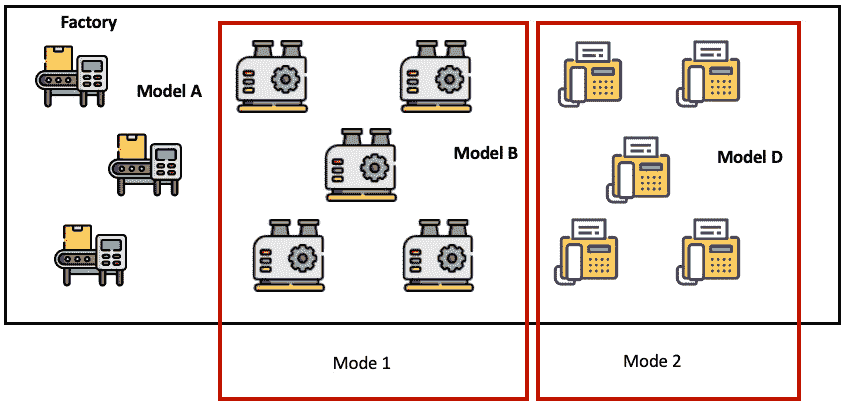

图 2.4 – 工厂中机器的多模态分布

因此，这个数据集是多模态的。

模式和数据类型

这些模式的例子使用了名义数据，但所有四种数据类型都支持模式，因为所有四种数据类型都支持等价操作。

虽然“众数”指的是最常见的实例，但在连续数据的多个峰值的多元情况下，术语“众数”通常被用来表示一个不那么严格的概念。例如，*图 2.5* 中的分布通常被称为多峰分布，尽管分布的峰值大小并不相同。然而，在名义数据和有序数据中，当提到分布的模态时，更常见的是使用更严格的“最常见”的定义。

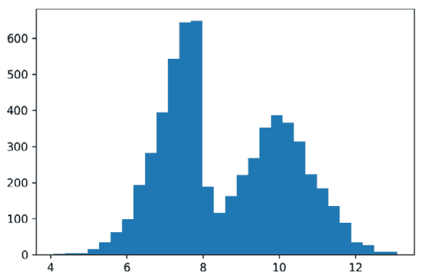

图 2.5 – 数据的多峰分布

现在，我们将看看如何使用 `scipy` 代码计算众数。`scipy` 库包含 `stats` 模块中的描述性统计函数。在这个例子中，我们从 `scipy.stats` 导入 `mode` 并计算以下数字的众数，`1, 2, 3, 4, 4, 4, 5, 5`：

```py
from scipy.stats import mode
m = mode([1,2,3,4,4,4,5,5])
print(
    f"The mode is {m.mode[0]} with a count of"
    f" {m.count[0]} instances"
)
# The mode is 4 with a count of 3 instances
```

`mode` 函数返回一个包含 `mode` 和 `count` 成员的 `mode` 对象。不出所料，`mode` 和 `count` 成员分别包含数据集的众数和众数出现的次数。请注意，`mode` 和 `count` 成员是可索引的（就像列表一样），因为数据集可以包含多个众数。

### 中位数

中心测量的下一个指标是中位数。中位数是在将数值按顺序排列时出现的中间值。

中位数和数据类型

这种测量可以在有序数据、区间数据和比率数据上执行，但不能在名义数据上执行。

我们将在这里讨论两种情况。

#### 当实例数量为奇数时寻找中位数

在 *图 2.6* 中显示了某些数值数据的中位数。数据被排序后，中位数被识别。

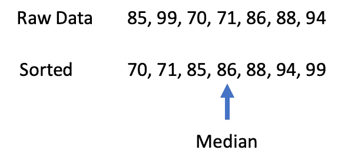

图 2.6 – 使用奇数个实例识别中位数

在前面的例子中，实例数量为奇数（7 个实例），有一个中心值。然而，如果实例数量是偶数，在排序值之后，就不能简单地取中间的数字了。

#### 当实例数量为偶数时寻找中位数

当实例数量为偶数时，取两个中间值的最小值。与众数不同，对于同一系列数据，没有多个中位数的概念。一个具有偶数个实例（8 个实例）的例子在 *图 2.7* 中显示。

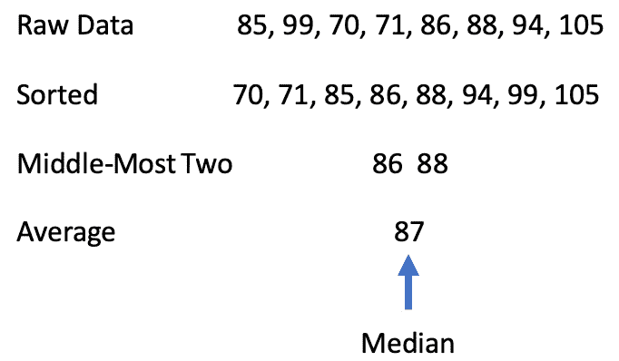

图 2.7 – 使用偶数个实例识别中位数

现在，让我们看看如何使用 `numpy` 计算数据集的中位数。与 `scipy` 一样，`numpy` 包含用于计算描述性统计的函数。我们将计算前面例子中列出的八个数字的中位数：

```py
import numpy as np
values = [85, 99, 70, 71, 86, 88, 94, 105]
median = np.median(values)
print(f"The median value is {median:.2f}")
# The median value is 87.00
```

计算中位数的结果是 87，正如预期的那样。请注意，`median` 函数返回一个单一值，与前面代码示例中的 `mode` 函数不同。

### 平均值

下一个中心度量是均值，通常被称为平均值。均值由以下方程定义：

_ x  =  ∑ i=0 n  x i _ N

让我用文字解释一下这个方程。要计算均值，我们必须将所有值相加，然后将总和除以值的数量。请参考以下示例。首先将 7 个数字相加，总和达到 593。然后将这个总和除以实例数量，得到 84.7 的值。

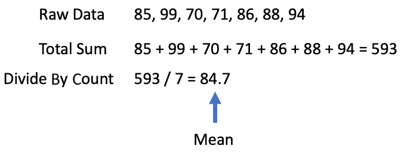

图 2.8 – 寻找均值

注意，这些值的均值和中位数（分别为 84.7 和 86）并不相同。一般来说，均值和中位数不会是相同的值，但存在一些特殊情况，均值和中位数会收敛。

均值和数据类型

至于支持的数据类型，均值适用于区间和比率数据，因为值是可以相加的。

现在，我们将看看如何使用`numpy`计算均值。以下代码示例显示了之前示例中值的均值的计算：

```py
import numpy as np
values = [85, 99, 70, 71, 86, 88, 94]
mean = np.mean(values)
print(f"The mean value is {mean:.1f}")
# The mean value is 84.7
```

与`median`函数一样，`mean`函数返回一个单一的数字。

在结束关于中心度量的这一节之前，讨论均值和中位数在各种情况下的使用是值得的。如前所述，中位数和均值通常会是不同的值。这是由分布的形状驱动的效应。

形状对均值和中位数的影响

如果分布是对称的，均值和中位数往往会收敛。然而，如果分布不是对称的，均值和中位数会发散。

度量之间的差异程度由分布的不对称性驱动。*图 2.6*给出了四个示例分布来展示这一效果。分布 1 和 2 显示均值被拉向比中位数更高的值。均值会被拉向绝对值更大的值。当数据集包含（或可能包含）**异常值**（通常称为异常值或影响点）时，这是一个均值的重要影响，这些异常值会倾向于将其拉向它们的方向。与均值不同，如果异常值占数据比例较小，中位数不会受到异常值的影响。异常值将在*测量变异性*部分进一步讨论。

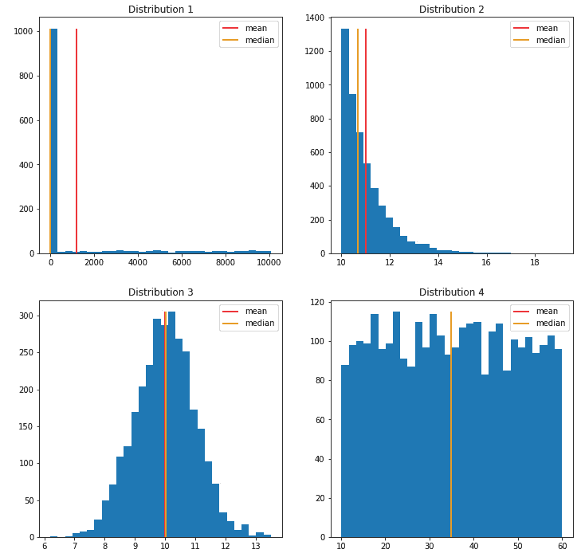

图 2.9 – 两个不对称分布和两个对称分布

分布的下一个测量类别是变异性度量。

## 测量变异性

通过变异性，我们本质上是指分布的宽度。这一类别的测量如下：

+   范围

+   四分位距

+   Tukey fences

+   方差

让我们讨论每一个。

### 范围

范围是分布中最大值和最小值之间的差值。像均值一样，范围会受到异常值的影响，因为它依赖于最大值和最小值。然而，还有一种变异方法，就像中位数一样，对异常值的存在具有鲁棒性。

让我们用代码和 `numpy` 来计算一个范围：

```py
import numpy as np
values = [85, 99, 70, 71, 86, 88, 94, 105]
max_value = np.max(values)
min_value = np.min(values)
range_ = max_value - min_value
print(f"The data have a range of {range_}"
      f" with max of {max_value}"
      f" and min of {min_value}")
# The data have a range of 35 with max of 105 and min of 70
```

虽然 `numpy` 没有范围函数，但可以使用 `numpy` 提供的 `min` 和 `max` 函数来计算范围。

### 四分位距

下一个变异度量是通过排序数据然后将数据分成四个相等的部分来确定的。四个部分的边界是四分位数，它们被称为以下：

+   下四分位数（Q1）

+   中间四分位数（Q2）

+   上四分位数（Q3）

以下是一个四分位数的例子。像中位数一样，只要异常值占数据集的比例很小，四分位数对异常值就具有鲁棒性。请注意，中间四分位数实际上就是中位数。一种对异常值比 *范围* 部分中讨论的正常范围更不敏感的调整范围测量方法是中间四分位数，即 **四分位距**（**IQR**）。IQR 是上四分位数（Q3）和下四分位数（Q1）之间的差值。虽然这个范围对异常值不太敏感，但它只包含 50% 的数据。因此，四分位距很可能是不太能代表数据总变异的。

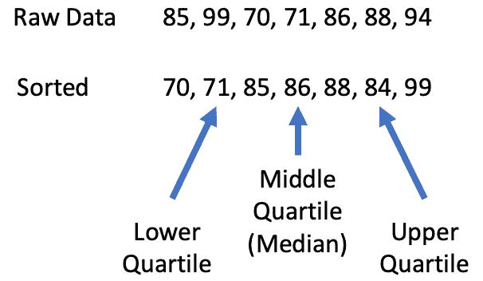

图 2.10 – Q1, Q2 和 Q3

我们可以使用 `numpy` 和 `scipy` 来计算四分位数和 IQR 范围。在下面的代码示例中，我们使用 `quantiles` 函数来计算四分位数。我们在这里不会讨论 `quantiles`，除了提到 `quantiles` 是一种泛化，其中数据可以被分成任何数量的相等部分。由于我们是将数据分成四个相等的部分来计算四分位数，所以用于计算的 `quantiles` 值是 0.25、0.5 和 0.75。然后可以使用 Q1 和 Q3 来计算 IQR。但是，我们也可以使用 `scipy` 中的 `iqr` 函数来进行计算：

```py
import numpy as np
from scipy import stats
values = [85, 99, 70, 71, 86, 88, 94]
quartiles = np.quantile(values, [0.25, 0.5, 0.75],
    method="closest_observation")
print(f"The quartiles are Q1: {quartiles[0]},
    Q2: {quartiles[1]}, Q3: {quartiles[2]}")
iqr = stats.iqr(values,interpolation='closest_observation')
print(f"The interquartile range is {iqr}")
# The quartiles are Q1: 71, Q2: 85, Q3: 88
# The interquartile range is 17
```

注意 `quantiles` 函数和 `iqr` 函数中 `method` 和 `interpolation` 关键字参数的使用。可以对这些关键字参数使用几种选项，这将导致不同的结果。

四分位数通常用箱线图来可视化。以下 *图 2**.11 展示了箱线图的主要部分。箱线图由两个主要部分组成：

+   箱体

+   须线

箱体部分代表包含在 IQR 内的 50% 的数据。须线从箱体的边缘延伸到长度为 k * IQR，其中 k 通常选择为 1.5。任何超出须线的值都被认为是异常值。

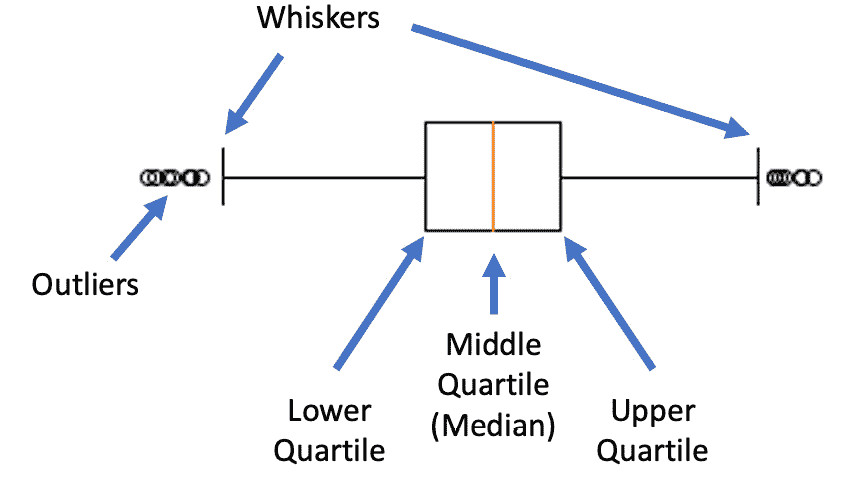

图 2.11 – 箱线和须图的部分

*图 2.12*展示了直方图和箱线图如何可视化对称和非对称分布的变异。注意非对称数据的箱线图在左侧被压缩，在右侧被扩展，而另一个箱线图则明显对称。虽然箱线图有助于可视化数据的对称性和异常值的存在，但分布的模态可能不会明显。

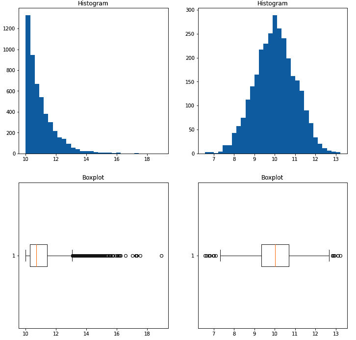

图 2.12 – 对称和非对称分布的箱线图和直方图比较

在探索时，通常使用多种可视化方式，因为每种类型的可视化都有其自身的优势和劣势。通常使用多种可视化方式，因为每种类型的可视化都有其自身的优势和劣势。

### Tukey fences

在最后几节关于测量的内容中，异常值的概念出现了几次。异常值是与主要分布相比不典型或异常的值。虽然有一些方法可以将数据点分类为异常值，但没有一种通用的方法可以用来分类数据点为异常值。定义异常值通常应该根据数据分析的使用情况进行，因为根据应用领域会有不同的因素需要考虑。然而，值得提及的是，在箱线图示例中展示的常见技术，称为 Tukey fences。下限和上限 Tukey fences 基于四分位数间距（IQR）并定义如下：

+   下限围栏：Q1 − k(IQR)

+   上限围栏：Q3 + k(IQR)

如前所述，k 通常被选为默认值 1.5，但针对特定应用领域可能有一个更合适的值。

现在我们来看一下如何使用`numpy`和`scipy`计算 Tukey fences。这个代码示例将基于前面的示例，因为没有直接计算围栏的函数。我们再次使用`numpy`和`scipy`计算四分位数和四分位数间距（IQR）。然后，我们将这些操作应用于前面方程中列出的值：

```py
import numpy as np
from scipy import stats
values = stats.norm.rvs(10, size=3000)
q1, q3 = np.quantile(values, [.25, .75],
    method='closest_observation')
iqr = stats.iqr(values,interpolation='closest_observation')
lower_fence = q1 - iqr * 1.5
upper_fence = q3 + iqr * 1.5
# may vary due to randomness in data generation
print(f"The lower fence is {lower_fence:.2f} and the upper
    fence is {upper_fence:.2f}")
# The lower fence is 7.36 and the upper fence is 12.67
```

在这个例子中，我们使用了`numpy`和`scipy`；然而，如前所述，`scipy`的计算可以用`Q3-Q1`来替换。

### 方差

在本节中将要介绍的最后一个变异度量是方差。方差是衡量离散程度的度量，可以理解为数值与平均值之间的*分散程度*。方差的公式，用 S 2 表示，如下所示：

S 2 =  ∑ (x i −  _ x ) 2 _ N − 1

在这个方程中，项（x i −  _ x ）被认为是与平均值的偏差，这导致另一个与方差密切相关的度量——标准差，它是方差的平方根。标准差的公式，用σ表示，如下给出：

σ = √ _ S 2  = √ ___________  ∑ (x i −  _ x ) 2 _ N − 1

通常情况下，分布范围越宽，其方差和标准差也会越大，但这些值不如范围或四分位距（IQR）那样容易解释。这些概念将在下一节中更详细地介绍，在正态分布的背景下，这将提供对这些值所测量的更清晰的直观理解。

同样，这些值将通过代码使用`numpy`进行计算。方差和标准差的函数分别是`var`和`std`：

```py
import numpy as np
values = [85, 99, 70, 71, 86, 88, 94]
variance = np.var(values)
standard_dev = np.std(values)
print(f"The variance is {variance:.2f} and the standard
    deviation is {standard_dev:.2f}")
# The variance is 101.06 and the standard deviation is 10.05
```

## 测量形状

下一种类型的测量与分布的形状有关。具体如下：

+   偏度

+   偏度

让我们逐一讨论它们。

### 偏度

第一项测量是偏度。简单来说，偏度是测量不对称性[*1*]。*图 2.13*展示了偏斜分布的例子。

存在两种类型的偏斜分布：

+   左偏斜

+   右偏斜

分布在主导尾的方向上偏斜，意味着具有右侧主导尾的分布是右偏斜的，而具有左侧主导尾的分布是左偏斜的（如*图 2.13*所示）。

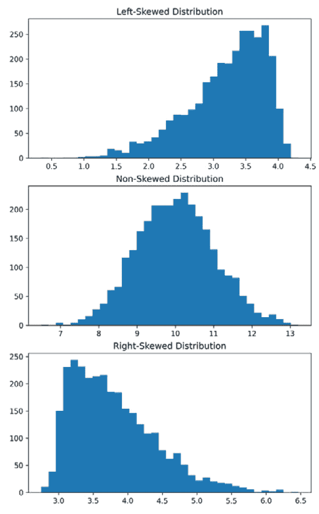

图 2.13 – 展示偏度的分布

由于现代软件包可以轻易计算，因此此处不会展示偏度的公式。偏度计算的结果可以用来确定偏度和偏斜的方向。如果偏度值为 0 或接近 0，则分布没有表现出强烈的偏斜。如果偏度值为正，则分布是右偏斜的；如果偏度值为负，则分布是左偏斜的。偏度值的绝对值越大，分布的偏斜程度越明显。以下代码示例展示了如何使用`scipy`计算偏度：

```py
from scipy.stats import skewnorm, norm
from scipy.stats import skew as skew_calc
# generate data
skew_left = -skewnorm.rvs(10, size=3000) + 4
skew_right = skewnorm.rvs(10, size=3000) + 3
symmetric = norm.rvs(10, size=3000)
# calculate skewness
skew_left_value = skew_calc(skew_left)
skew_right_value = skew_calc(skew_right)
symmetric_value = skew_calc(symmetric)
# Output may vary some due to randomness of generated data
print(f"The skewness value of this left skewed
    distribution is {skew_left_value:.3f}")
print(f"The skewness value of this right skewed
    distribution is {skew_right_value:.3f}")
print(f"The skewness value of this symmetric distribution
    is {symmetric_value:.3f}")
```

本节中涵盖的另一种形状测量是峰度。

### 偏度

峰度是衡量分布尾部相对于正态分布的轻重程度[*2*]。虽然正态分布尚未深入探讨，但峰度的概念仍然可以讨论。轻尾分布意味着更多的数据接近或围绕分布的众数。相反，重尾分布意味着比接近众数的数据，更多的数据位于分布的边缘。*图 2.14*展示了轻尾分布、正态分布和重尾分布。

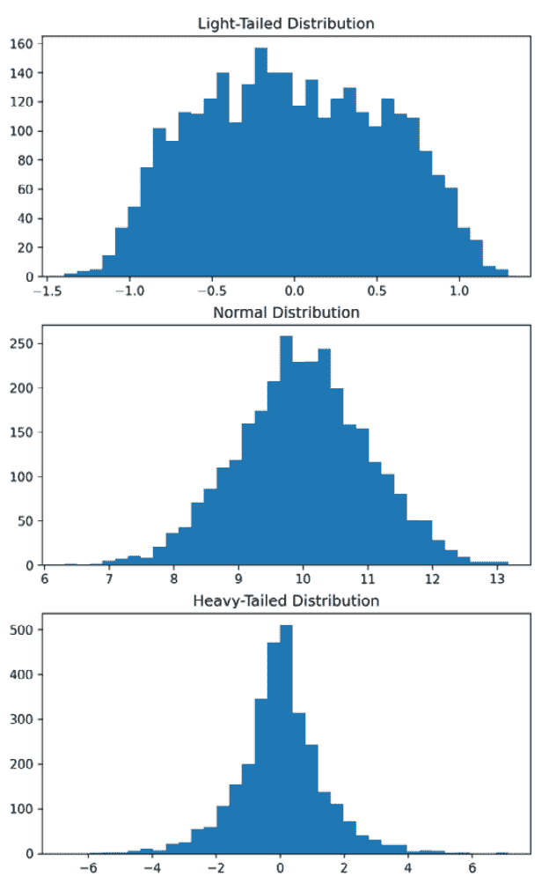

*图 2.14 – 以正态分布为参考的尾部分布*

由于现代软件包可以轻易地计算出来，这里将不展示峰度的公式。如果峰度值为 0 或接近 0，则分布不显示峰度。如果峰度值为负，则分布显示轻尾性；如果峰度值为正，则分布显示重尾性。以下代码示例展示了如何使用`scipy`计算峰度：

```py
from scipy.stats import norm
from scipy.stats import gennorm
from scipy.stats import kurtosis
# generate data
light_tailed = gennorm.rvs(5, size=3000)
symmetric = norm.rvs(10, size=3000)
heavy_tailed = gennorm.rvs(1, size=3000)
# calculate skewness
light_tailed_value = kurtosis(light_tailed)
heavy_tailed_value = kurtosis(heavy_tailed)
symmetric_value = kurtosis(symmetric)
# Output may vary some due to randomness of generated data
print(f"The kurtosis value of this light-tailed
    distribution is {light_tailed_value:.3f}")
print(f"The kurtosis value of this heavy_tailed
    distribution is {heavy_tailed_value:.3f}")
print(f"The kurtosis value of this normal
    distribution is {symmetric_value:.3f}")
```

在本节中，我们介绍了用于测量和描述数据分布的常见描述性统计方法。这些测量提供了描述和比较分布的共同语言。本章讨论的概念是未来章节中许多概念的基础。在下一节中，我们将讨论正态分布，并使用这些测量来描述正态分布。

# 正态分布和中心极限定理

讨论正态分布时，我们指的是钟形的标准正态分布，它正式同义于**高斯分布**，以 18 世纪和 19 世纪的数学家和物理学家卡尔·弗里德里希·高斯的名字命名。高斯在许多方面做出了贡献，包括近似概念，并在 1795 年发明了最小二乘法和正态分布，这些在统计建模技术（如最小二乘回归）中常用[*3*]。标准正态分布也被称为**参数分布**，其特征是分布对称，数据点分散的概率在均值周围一致——也就是说，数据出现在均值附近比出现在远离均值的频率更高。由于这个分布中的位置数据遵循概率定律，我们可以称之为**标准正态概率分布**。顺便提一下，在统计学中，不是概率分布的分布是通过基于非随机选择的非概率抽样生成的，而概率分布是基于随机抽样生成的。基于概率和非概率的分布都可以有标准正态分布。标准正态分布既不偏斜也不显示峰度。它在整个分布中具有相同的方差，并且在自然界中经常出现。**经验法则**用于描述这个分布具有围绕均值**μ**的三个相关的标准差。关于这个分布有两个不同的假设：

+   第一、第二和第三标准差分别包含 68%、95%和 99.7%的测量值。

+   均值、中位数和众数都相等

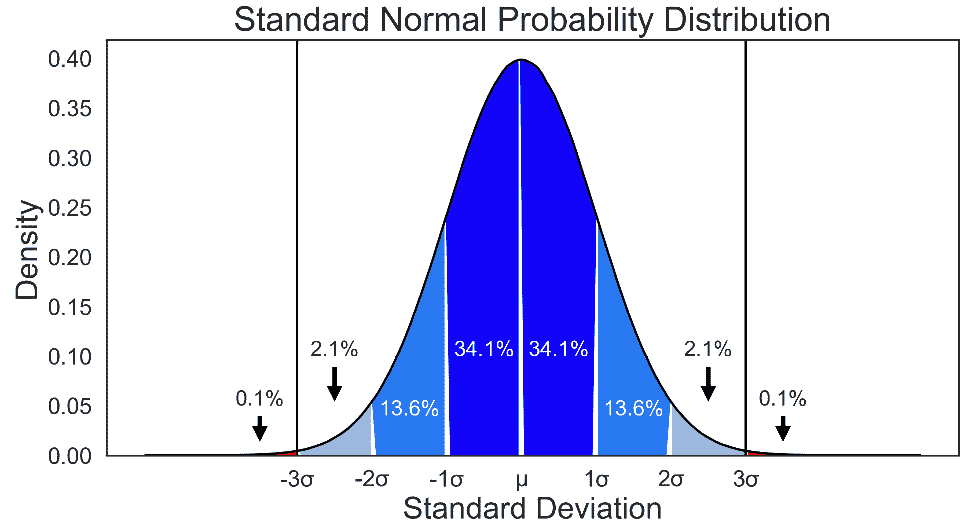

图 2.15 – 标准正态分布

正态分布的两种常见形式如下：

+   概率密度分布

+   累积密度分布

如前所述，概率密度分布基于随机抽样，而累积密度分布基于累积数据，这些数据不一定随机。

标准正态分布的双尾概率密度函数如下：

f(x) =  e −(x−μ) 2 _ 2 σ 2  _ σ √ _ 2π

标准正态分布的左尾累积函数如下：

f(x) =  ∫ −∞ x e −x 2 _  2 _ √ _ 2π

在统计建模方面，正态分布代表着平衡和对称。这在构建统计模型时非常重要，因为许多模型都假设正态分布，并且对许多偏离该假设的情况不稳健，因为它们是围绕平均值构建的。因此，如果此类模型中的变量不是正态分布的，模型的误差将会增加且不一致，从而降低模型稳定性。当考虑统计模型中的多个变量时，如果两者都是正态分布的，它们的相互作用更容易被近似。

在以下 *图 2**.16* 中，左边的图中，变量 X 和 Y 相互作用并在平均值周围形成集中分散。在这种情况下，使用 X 和均值线或线性距离对 Y 进行建模可以做得相当好。然而，如果两个变量的分布是偏斜的，如右边的图所示，这会导致两个变量之间的方差不是常数，从而导致误差分布不均，输出不可靠。

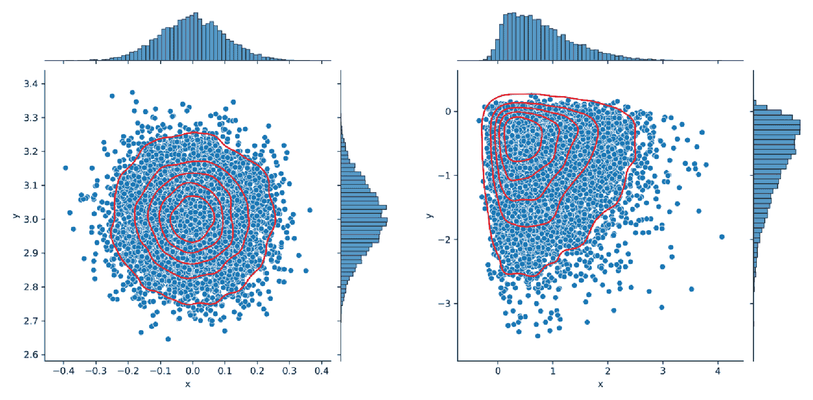

图 2.16 – 双变量正态分布（左）和偏斜分布（右）

在线性分类和回归模型的情况下，这意味着一些结果会比其他结果更好，而一些结果可能会非常糟糕。有时使用基本的模型指标很难评估这一点，需要更深入地分析模型以防止相信可能最终会误导的结果。此外，部署到生产环境将非常危险。关于这一点将在 *第六章* 中进一步讨论。

## 中心极限定理

在采样数据时，经常会遇到非正态数据的问题。这可能是由于多个原因造成的，例如总体没有正态分布或者样本不能代表总体。中心极限定理，在统计推断中非常重要，它假设如果从具有特定均值μ和**标准差**σ的总体中随机抽取 n 个观察值的样本，那么从随机选择的子样本分布的均值构建的抽样分布将接近一个具有大致相同的均值μ和标准差σ的正态分布，计算公式为√ _ ∑ (x i − μ) 2 _ N  ，与总体相同。下一节将使用自助法来展示中心极限定理的实际应用。在后面的章节中，将讨论变换技术，提供重塑不符合正态分布的数据分布的方法，以便仍然可以有效地应用需要正态分布的工具。

# 自助法

自助法是一种重采样方法，它使用随机抽样——通常是放回抽样——通过从样本分布的子集中重采样来生成关于总体的统计估计，如下所示：

+   置信区间

+   标准误

+   相关系数（皮尔逊相关系数）

理念是，通过重复采样样本分布的不同随机子集并每次取平均值，给定足够的重复次数，将开始使用每个子样本的平均值来近似真实的总体。这直接遵循中心极限定理的概念，即重申，采样均值开始近似围绕原始分布均值的正态采样分布，随着样本量和计数增加。当分布中样本数量相对于特定测试所需的样本量有限时，自助法很有用，但需要进行推断。

如*第一章*中所述，*采样与泛化*，时间和费用等限制是获取样本而不是总体的常见原因。因为自助法的基本概念是使用样本对总体进行假设，所以当总体的真实统计参数（如百分位数和方差）已知时，将此技术应用于总体并不有利。至于样本制备，样本中属性的平衡应代表总体的真实近似。否则，结果可能会误导。例如，如果动物园中物种的总体是 40%的爬行动物和 60%的哺乳动物，而我们想通过自助法来估计它们的寿命并确定其置信区间，那么必须确保应用于自助法的数据集包含 40%的爬行动物和 60%的哺乳动物的分布；例如，15%的爬行动物和 85%的哺乳动物的分布会导致误导性结果。换句话说，样本分层应与总体的比例相平衡。

## 置信区间

如前所述，自助法的一个有用应用是围绕稀疏定义或有限的数据集创建置信区间——也就是说，具有广泛值范围但没有许多样本的数据集。考虑一个使用`statsmodels`中的`"Duncan"`数据集进行假设检验的例子，该数据集包含按职业、类型、教育和声望划分的收入。虽然这是一个完整的数据集，但考虑到采样方法未提及，并且不太可能考虑所有职业和类型的所有工人的所有收入，我们可以将此数据集视为样本。为了获取数据集，我们首先加载`matplotlib`、`statsmodels`、`pandas`和`numpy`库。然后我们下载数据集并将其存储在`pandas` DataFrame 的`df_duncan`变量中。在此之后，我们将“`prof"`、“`wc"`和“`bc"`类型分别重新编码为“`professional"`、“`white-collar"`和“`blue collar"`。最后，我们创建了两个独立的`pandas` DataFrame；一个用于专业工作类型，另一个用于蓝领工作类型，因为这是我们打算使用自助法分析的两组子集：

```py
import matplotlib.pyplot as plt, statsmodels.api as sm, pandas as pd, numpy as np, scipy.stats
df_duncan = sm.datasets.get_rdataset("Duncan",
    "carData").data
df_duncan.loc[df_duncan['type'] == 'prof',
    'type'] = 'professional'
df_duncan.loc[df_duncan['type'] == 'wc',
    'type'] = 'white-collar'
df_duncan.loc[df_duncan['type'] == 'bc',
    'type'] = 'blue-collar'
df_professional = df_duncan.loc[(
    df_duncan['type'] == 'professional')]
df_blue_collar = df_duncan.loc[(
    df_duncan['type'] == 'blue-collar')]
```


图 2.17 – 显示 statsmodels Duncan 数据的前五行表格

然后，我们构建了一组绘图函数，如接下来所示。在 `plot_distributions()` 中，我们表示 `p=5`，这意味着在显著性水平为 0.05（1.00 - 0.05 = 0.95，因此，95% 置信度）时，p 值将是显著的。然后我们将此值除以 2，因为这将是一个双尾测试，意味着我们想要知道整个区间而不是仅仅一个边界（在 *第一章* 中作为代表性统计量的讨论）。至于绘图，我们使用 `matplotlib` 中的直方图（`hist()` 函数）可视化数据，然后使用我们用 `numpy` 函数 `percentile()` 构建的 `axvline()` 函数绘制 95% 的抽样置信区间。

自助抽样中的百分位数

当应用于原始数据时，百分位数只是那样，但当应用于自助抽样分布时，它就是置信区间。

要简单地说明置信区间，95% 置信区间意味着在取出的每个 100 个样本均值中，有 95 个将落在该区间内。在 `numpy` 的 `percentile()` 函数中，我们使用 `p=5` 来支持 1-p 是置信水平，其中 *p* 是显著性水平（想想 *p-value*，其中任何等于或低于 *p* 的值都是显著的）。由于测试是双尾的，我们将 *p* 除以 2，并在左尾和右尾各分割 2.5，因为我们有一个对称的标准正态分布。`subplot(2,1,...)` 代码创建了两行一列。图形的轴 0 用于专业收入，轴 1 用于蓝领收入：

```py
def plot_distributions(n_replicas, professional_sample, blue_collar_sample, professional_label, blue_collar_label, p=5):
    fig, ax = plt.subplots(2, 1, figsize=(10,8))
    ax[0].hist(professional_sample, alpha=.3, bins=20)
    ax[0].axvline(professional_sample.mean(),
        color='black', linewidth=5)
# sampling distribution mean
    ax[0].axvline(np.percentile(professional_sample, p/2.),
        color='red', linewidth=3, alpha=0.99)
# 95% CI Lower limit (if bootstrapping)
    ax[0].axvline(np.percentile(professional_sample,
        100-p/2.), color='red', linewidth=3, alpha=0.99)
# 95% CI Upper Limit  (if bootstrapping)
    ax[0].title.set_text(str(professional_label) +
        "\nn = {} Resamples".format(n_replicas))
    ax[1].hist(blue_collar_sample, alpha=.3, bins=20)
    ax[1].axvline(blue_collar_sample.mean(), color='black',
        linewidth=5) # sampling distribution mean
    ax[1].axvline(np.percentile(blue_collar_sample, p/2.),
        color='red', linewidth=3, alpha=0.99)
# 95% CI Lower limit (if bootstrapping)
    ax[1].axvline(np.percentile(blue_collar_sample,
        100-p/2.), color='red', linewidth=3, alpha=0.99)
# 95% CI Upper Limit (if bootstrapping)
    ax[1].title.set_text(str(blue_collar_label) +
        "\nn = {} Resamples".format(n_replicas))
    if n_replicas > 1:
        print("Lower confidence interval limit: ",
            np.percentile(round(professional_sample,4),
            p/2.))
        print("Upper confidence interval limit: ",
            np.percentile(round(professional_sample,4),
            100-p/2.))
        print("Mean: ", round(professional_sample,
            4).mean())
        print("Standard Error: ",
            round(professional_sample.std() /
            np.sqrt(n_replicas), 4) )
        print("Lower confidence interval limit: ",
            np.percentile(round(blue_collar_sample,4),
            p/2.))
        print("Upper confidence interval limit: ",
            np.percentile(round(blue_collar_sample,4),
            100-p/2.))
        print("Mean: ", round(blue_collar_sample,4).mean())
        print("Standard Error: ",
            round(blue_collar_sample.std() /
            np.sqrt(n_replicas), 4) )
    else:
        print("At least two samples required to create the following statistics:\nConfidence Intervals\nMean\nStandard Error")
```

在原始数据集中，有 18 个 `professional` 职业类型的收入数据点和 21 个 `blue-collar` 职业类型的收入数据点。专业职业类型的 95% 置信区间从 29.50 到 79.15，平均值为 60.06。该区间对于蓝领职业类型从 7.00 到 64.00，平均值为 23.76。根据 *图 2*.18，收入差异之间存在合理的重叠，这导致了重叠的置信区间。因此，可以合理地假设蓝领和专业人士之间的收入没有统计学上的显著差异。然而，这个数据集的样本量非常有限：

```py
n_replicas=0
plot_distributions(n_replicas=n_replicas,
professional_sample=df_professional['income'],
    blue_collar_sample=df_blue_collar['income'],
    professional_label="Professional",
    blue_collar_label="Blue Collar")
```

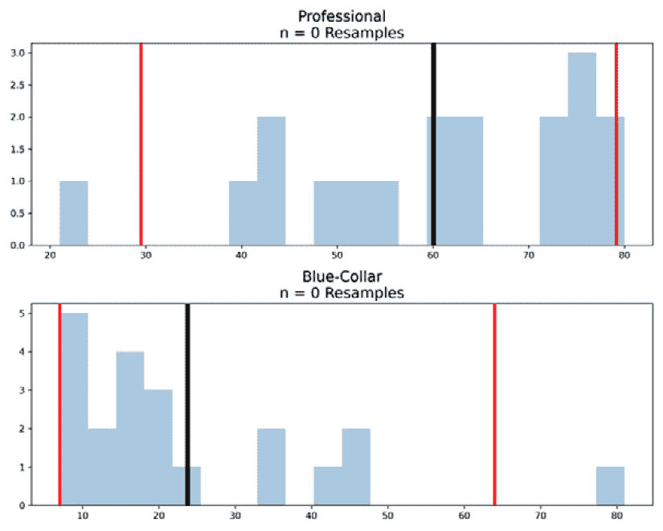

图 2.18 – 带有 95% 百分位数线的原始数据分布

在以下代码中，使用 `pandas` 的 `.sample()` 函数，我们随机重新抽取每个分布中 50%（`frac=0.5`）的收入值 1,000 次，并每次计算一个新的均值，将其附加到以 `_bootstrap_means` 结尾的 Python 列表中。使用这些列表，我们推导出新的 95%置信区间。*图 2**.19* 显示，与数据集中的标准差和收入值相比，使用每个重新抽样的子集的平均值的新样本分布。`replace=True` 参数允许多次重新抽样相同的记录（在随机发生的情况下），这是 bootstrap 的要求。

在执行 bootstrap 过程之后，我们可以看到收入已经开始以大致标准正态、高斯形式分布。值得注意的是，从这个实验中，置信区间不再重叠。专业和蓝领群体之间置信区间分离的含义是，在 95%的置信水平下，可以证明两种工作类型的收入之间存在统计学上的显著差异。专业收入水平的置信区间现在是 48.66 到 69.89，平均值为 60.04，而蓝领的置信区间是 14.60 到 35.90，平均值为 23.69：

```py
n_replicas = 1000
professional_bootstrap_means = pd.Series(
    [df_professional.sample(frac=0.5, replace=True)
    ['income'].mean() for i in range(n_replicas)])
blue_collar_bootstrap_means = pd.Series(
    [df_blue_collar.sample(frac=0.5, replace=True)
    ['income'].mean() for i in range(n_replicas)])
```

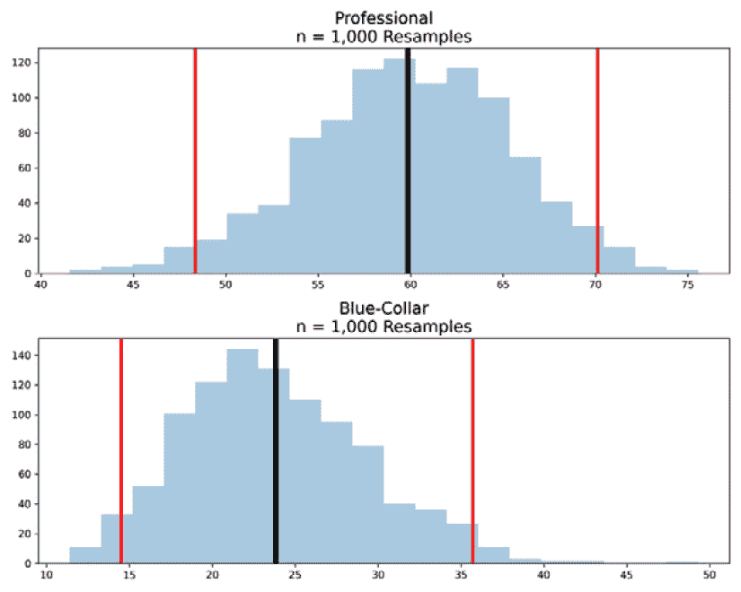

图 2.19 – 1,000 次 bootstrap 抽样的 1,000 个样本均值的 95%置信区间分布

在这里，你可以注意到分布更紧密地聚集在平均值周围，置信区间更紧密。

如前所述，bootstrap 可以用来获得分布的除置信区间之外的不同统计参数。

## 标准误差

另一个常用的指标是标准误差，σ √ n。我们可以使用最后几个变量，`p`rofessional\_bootstrap\_means 和 `blue\_collar\_bootstrap\_means` 来计算这个值，因为这些变量包含了通过 bootstrap 过程获得的新均值分布。我们还可以看到，标准误差——通过将标准差除以样本数量的平方根（在我们的情况下，`n\_replicas`，代表从每个随机重新抽样的样本中获得的平均值数量）——随着重新抽样的体积增加而减小。我们使用以下代码来计算专业和蓝领类型收入 bootstrap 均值的标准误差。下表，*图 2**.20* 显示，随着 *n* 的增加，标准误差降低：

```py
scipy.stats.sem(professional_bootstrap_means)
scipy.stats.sem(blue_collar_bootstrap_means)
```

| **n** | **专业** **标准误差** | **蓝领** **标准误差** |
| --- | --- | --- |
| 10 个副本 | 0.93 | 2.09 |
| 10,000 个副本 | 0.03 | 0.04 |

图 2.20 – n = 10 和 n = 10,000 bootstrap 副本的标准误差表

Bootstrap 的另一个用例是皮尔逊相关系数，我们将在下一节讨论。

## 相关系数（皮尔逊相关）

通常，使用小样本量很难找到，因为相关性取决于两个变量的协方差。随着变量重叠得更加显著，它们的相关性就越高。然而，如果重叠是样本量小或抽样误差的结果，这种相关性可能是有代表性的。*图 2.21*显示了不同引导子样本计数的相关性表。随着分布形成更多的原生区分，相关性从小的正相关减少到接近零的量。

要测试来自原始数据集的 10 个记录样本的相关性，请参阅以下内容：

```py
df_prof_corr = df_professional.sample(n=10)
df_blue_corr = df_blue_collar.sample(n=10)
corr, _ = scipy.stats.pearsonr(df_prof_corr['income'],
    df_blue_corr['income'])
```

要测试引导平均值样本的相关性：

```py
n_replicas = n_replicas
professional_bootstrap_means = pd.Series([df_prof_corr.sample(frac=0.5,replace=False).income.mean()for i in range(n_replicas)])
blue_collar_bootstrap_means = pd.Series([df_blue_corr.sample(frac=0.5, replace=False).income.mean() for i in range(n_replicas)])
corr, _ = scipy.stats.pearsonr(
    professional_bootstrap_means,
    blue_collar_bootstrap_means)
print(corr)
```

| **n** | **Pearson** **相关系数** |
| --- | --- |
| 原始数据中的 10 个样本 | 0.32 |
| 10 个副本 | 0.22 |
| 10,000 个副本 | -0.003 |

图 2.21 – Pearson 相关系数表与原始样本并排

通常，运行大约 1,000 到 10,000 个引导副本是很常见的。然而，这取决于正在引导的数据类型。例如，如果从人类基因组序列数据集中引导数据，引导样本 1 亿次可能是有用的，但如果引导一个简单的数据集，引导 1,000 次或更少可能是有用的。最终，研究人员应进行视觉检查平均值的分布，以确定结果与预期相比是否合理。与统计学一样，最好有一些领域知识或专业知识来帮助验证发现，因为这可能是决定引导复制次数的最佳方法。

引导程序（Bootstrapping）也应用于机器学习，它是**自助聚合**（bootstrap aggregation）概念的基础，也称为**Bagging**，这是一个结合基于自助子样本分布构建的预测模型输出的过程。**随机森林**（Random Forest）是执行此操作的一种流行算法。在 Bagging 算法中，引导程序的目的在于保持非参数（将在后续章节中进一步讨论）分类的低偏差行为，同时减少方差，因此将引导程序作为一种最小化建模误差中偏差-方差权衡重要性的方法。

在下一节中，我们将考虑另一种非参数测试，即使用重采样数据的排列测试。

# 排列

在跳入这个测试分析之前，我们将回顾一些排列组合的基本知识。

## 排列和组合

排列和组合是两种数学技术，用于从一组对象中创建子集，但以两种不同的方式。在排列中，对象的顺序很重要，而在组合中则不重要。

为了轻松理解这些概念，我们将考虑两个例子。晚会上有 10 个人。派对的组织者想要随机给 3 个人颁发价值 1000 美元、500 美元和 200 美元的奖品。问题是*有多少种分配奖品的方式？*另一个例子是，组织者将从派对的 10 个人中选出 3 个人，每人颁发价值 500 美元的等额奖品。组织者并不关心这 3 个被选中的人中谁得到哪个奖品。在两个例子中，胡伊、保罗和斯图尔特是我们的获奖者，但在第一个例子中，可能会有不同的结果，例如，如果保罗赢得 200 美元的奖品、500 美元的奖品或 1000 美元的奖品。

| **$****1,000** | **$****500** | **$****200** |
| --- | --- | --- |
| 胡伊 | 保罗 | 斯图尔特 |
| 保罗 | 胡伊 | 斯图尔特 |
| 保罗 | 斯图尔特 | 胡伊 |
| 胡伊 | 斯图尔特 | 保罗 |
| 斯图尔特 | 胡伊 | 保罗 |
| 斯图尔特 | 保罗 | 胡伊 |

图 2.22 – 分配给胡伊、保罗和斯图尔特的奖品分布表

然而，在第二个例子中，由于 3 个奖品的价值相同，为 500 美元，奖品排列的顺序并不重要。

让我们更仔细地看看这两个排列组合的例子。第一个例子是一个排列例子。由于有 10 个人，我们有 10 种可能性从这 10 个人中选择一个人来颁发 1000 美元的奖品。如果这个人被选中赢得 1000 美元的奖品，那么选择另一个人颁发 500 美元的奖品就只剩下 9 种可能性，最后，我们有 8 种可能性从这 10 个人中选择一个人来颁发 200 美元的奖品。然后，我们有 10*9*8 = 720 种分配奖品的方式。排列的数学公式如下：

P(n, r) = n! / (n-r)!

在这里，P(n, r)是排列的数量，n 是集合中的总对象数，r 是从集合中选择的对象数。在这个例子中，n = 10 且 r = 3，所以我们看到：

P(10,3) = 10! / (10-3)! = 10*9 * 8*7 * 6*5 * 4*3 * 2*1 / 7*6 * 5*4 * 3*2 * 1 = 10*9 * 8 = 720

从晚会上 10 个人中选出 3 个人来分配价值 1000 美元、500 美元和 200 美元的 3 个奖品，共有 720 种选择方式。

在 Python 中，有一个名为`itertools`的包可以帮助我们直接找到排列。读者可以查看以下链接 – [`docs.python.org/3/library/itertools.xhtml`](https://docs.python.org/3/library/itertools.xhtml) – 获取有关此包的更多信息。我们需要将此包导入 Python 环境以进行排列：

```py
from itertools import permutations
# list of 10 people in the party
people = ['P1','P2','P3','P4','P5','P6','P7','P8','P9','P10']
# all the ways that the 3 prizes are distributed
perm = permutations(people, 3)
list_perm = list(perm)
print(f"There are {len(list_perm)} ways to distribute the prizes!")
```

在前面的 Python 代码中，我们创建了一个包含 10 个人的列表 `people`，分别是 `P1` 到 `P10`，然后使用 `itertools` 中的 `permutations` 函数来获取所有分配奖项的方式。这种方法接受一个包含 10 个人的列表作为输入，并返回一个包含所有可能性的元组列表，即从这 10 个人中选择 3 个人来分配 1,000 美元、500 美元和 200 美元的奖项。因为共有 720 种分配奖项的方式，这里我们只打印 Python 代码生成的 10 种第一种方式：

```py
print(f"The 10 first ways to distribute the prizes: \n
    {list_perm[:10]} ")
```

前面代码的输出是分配奖项的 10 种第一种方式：

`[('P1', 'P2', 'P3'), ('P1', 'P2', 'P4'), ('P1', 'P2', 'P5'), ('P1', 'P2', 'P6'), ('P1', '``P2', 'P7')]`

如果我们有 10 件不同的礼物，每个参加派对的人都可以带一件礼物回家。有多少种分配这些礼物的方式？共有 3,628,800 种方式。这是一个非常大的数字！读者可以用以下代码进行验证：

```py
#list of 10 people in the party
people = ['P1','P2','P3','P4','P5','P6','P7','P8','P9','P10']
# all the ways that the 10 different gifts are distributed
perm = permutations(people)
list_perm = list(perm)
print(f"There are {len(list_perm)}
    ways to distributed the gifts!")
```

回到第二个例子，因为 3 个奖项的价值都是 500 美元，所以 3 个被选中的人的顺序并不重要。那么，如果选中的 3 个人是 Huy、Paul 和 Stuart，如 *图 2**.22* 所示，在第一个例子中分配奖项的方式有 6 种。然后，将相同数量的 500 美元分配给 Huy、Paul 和 Stuart 的方式只有 1 种。组合的数学公式如下：

C(n, r) = n! / (r! * (n - r)!)

在这里，C(n, r) 表示组合数，n 是集合中对象的总数，r 是可以从集合中选择的对象数量。同样，我们可以计算出有

10! / (3! * (10 - 3)!) = 10 * 9 * 8 / (1 * 2 * 3) = 720 / 6 = 120

分配 3 个价值 500 美元的奖项的方式。

在 Python 中，我们同样使用 `itertools` 包，但不是使用 `permutations` 函数，而是导入 `combinations` 函数：

```py
 from itertools import combinations
# list of 10 people in the party
people = ['P1','P2','P3','P4','P5','P6','P7','P8','P9','P10']
# all the ways that the 3 prizes are distributed
comb = combinations(people, 3)
list_comb = list(comb)
print(f"There are {len(list_comb)} ways to distribute the prizes!")
```

## 排列测试

排列测试是一种非参数测试，它不要求数据呈正态分布。自助法和排列法都适用于重采样技术，但适用于不同的用途，一个用于估计统计参数（自助法），另一个用于假设检验。排列测试用于测试来自同一总体生成的两个样本之间的零假设。它有不同的名称，如 **精确测试**、**随机化测试**和**重新随机化测试**。

在实现 Python 代码之前，我们先来看一个简单的例子，以便更好地理解。我们假设有两组人，一组代表儿童（A），另一组代表 40 岁以上的人（B），如下所示：

`A` = [3,5,4] 和 `B` = [43,41,56,78,54]

样本 A 和 B 之间年龄的平均差异是

43 + 41 + 56 + 78 + 54  __________________ 5 - 3 + 5 + 4 * 3 = 50.4

我们将 A 和 B 合并成一个单一集合，记为 P，如下所示：

`P =` [3,5, 4,43,41,56,78,54].

然后，我们取 P 的一个排列，例如以下内容：

`P_new = [3,54, 78, 41, 4, 43, 5, 56]`

然后，我们将`P_new`重新划分为两个子集，分别称为`A_new`和`B_new`，它们的大小分别与 A 和 B 相同：

`A_new` = [3,54,78] 和 `B_new` = [41,4,43,5,56]

然后，`A_new`和`B_new`之间的年龄均值差异为 15.2，这低于 A 和 B 之间的原始年龄均值差异（50.4）。换句话说，排列后的`P_new`对 p 值没有贡献。我们可以观察到，从 P 的所有可能排列中抽取的只有一个排列的均值差异大于或等于原始的均值差异 P。现在我们将代码实现于 Python 中：

```py
import numpy as np
# create permutation testing function
def permutation_testing(A,B,n_iter=1000):
#A, B are 2 lists of samples to test the hypothesis,
#n_iter is number of iterations with the default is 1000
    differences = []
    P = np.array(A+B)
    original_mean = np.array(A).mean()- np.array(B).mean()
    for i in range(n_iter):
      np.random.shuffle(P)#create a random permutation of P
      A_new = P[:len(A)] # having the same size of A
      B_new = P[-len(B):] # having the same size of B
      differences.append(A_new.mean()-B_new.mean())
    #Calculate p_value
    p_value = round(1-(float(len(np.where(
        differences<=original_mean)[0]))/float(n_iter)),2)
    return p_value
```

在前面的 Python 代码中，A 和 B 是两个样本，我们想知道它们是否来自同一个更大的总体；`n_ter`是我们想要执行的迭代次数；这里，1,000 是默认的迭代次数。

让我们以 10,000 次迭代对示例中的两组人员进行置换检验：

```py
A = [3,5,4]
B = [43,41,56,78,54]
permutation_testing(A,B,n_iter=10000)
```

得到的 p 值为 0.98。这意味着我们未能拒绝零假设，或者说没有足够的证据来确认样本 A 和 B 来自同一个更大的总体。

接下来，我们将探讨许多需要正态分布假设的统计测试中的一个重要且必要的步骤。

# 转换

在本节中，我们将考虑三种转换：

+   对数转换

+   平方根转换

+   立方根转换

首先，我们将导入`numpy`包以创建一个从 Beta 分布中抽取的随机样本。Beta 分布的文档可以在这里找到：

[`numpy.org/doc/stable/reference/random/generated/numpy.random.beta.xhtml`](https://numpy.org/doc/stable/reference/random/generated/numpy.random.beta.xhtml)

样本`df`有 10,000 个值。我们还使用`matplotlib.pyplot`创建不同的直方图。其次，我们通过使用对数转换、平方根转换和立方根转换来转换原始数据，并绘制四个直方图：

```py
import numpy as np
import matplotlib.pyplot as plt
np.random.seed(42) # for reproducible purpose
# create a random data
df = np.random.beta(a=1, b=10, size = 10000)
df_log = np.log(df) #log transformation
df_sqrt = np.sqrt(df) # Square Root transformation
df_cbrt = np.cbrt(df) # Cube Root transformation
plt.figure(figsize = (10,10))
plt.subplot(2,2,1)
plt.hist(df)
plt.title("Original Data")
plt.subplot(2,2,2)
plt.hist(df_log)
plt.title("Log Transformation")
plt.subplot(2,2,3)
plt.hist(df_sqrt)
plt.title("Square Root Transformation")
plt.subplot(2,2,4)
plt.hist(df_cbrt)
plt.title("Cube Root Transformation")
plt.show()
```

以下为代码的输出：

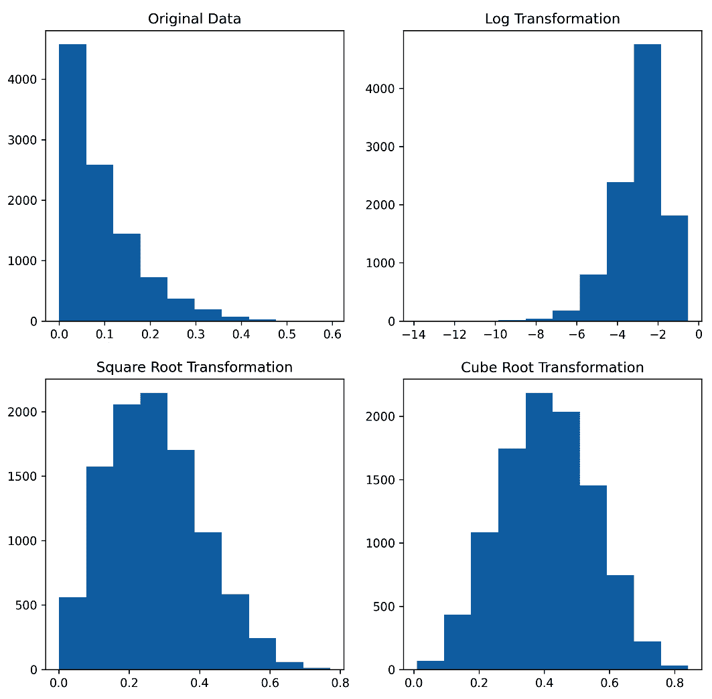

图 2.23 – 原始数据和转换数据的直方图

通过转换，我们可以看到转换后的直方图比原始直方图更接近正态分布。似乎在这个例子中，最佳转换是立方根转换。在现实世界的数据中，确定是否需要转换以及应该使用哪种转换非常重要。

其他数据转换方法，例如查找重复数据、处理缺失值和特征缩放，将在以下章节的 Python 实际应用案例中讨论。

# 摘要

在本章的第一节中，我们学习了数据的类型以及如何可视化这些类型的数据。然后，我们介绍了如何描述和测量数据分布的属性。我们学习了标准正态分布，为什么它很重要，以及通过展示自助法来展示中心极限定理在实践中的应用。我们还学习了如何利用自助法利用非正态分布的数据，通过置信区间来测试假设。接下来，我们介绍了排列组合等数学知识，并介绍了排列测试作为自助法之外的另一种非参数检验。我们以在执行需要正态分布数据的统计测试的许多情况下有用的不同数据转换方法结束本章。

在下一章中，我们将详细探讨假设检验，并讨论如何从测试结果中得出统计结论。我们还将探讨统计测试中可能出现的错误以及如何选择统计功效。

# 参考文献

+   [*1*] 偏度 – [`www.itl.nist.gov/div898/handbook/eda/section3/eda35b.htm`](https://www.itl.nist.gov/div898/handbook/eda/section3/eda35b.htm)

+   [*2*] 峰度 – [`www.itl.nist.gov/div898/handbook/eda/section3/eda35b.htm#:~:text=峰度%20 是%20 一个%20 衡量,%20 会是%20 极端情况`](https://www.itl.nist.gov/div898/handbook/eda/section3/eda35b.htm#:~:text=峰度%20 是%20 一个%20 衡量,%20 会是%20 极端情况).

+   [*3*] 正态分布 – *C.F. 高斯和最小二乘法*，*ŚLĄSKI PRZEGLĄD STATYSTYCZNY 西里西亚统计评论*，第 12(18)期，O. Sheynin，1999 年 9 月
