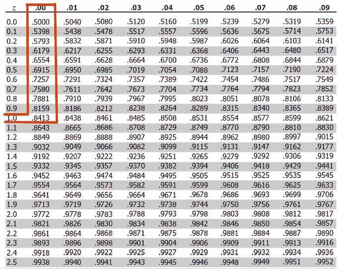
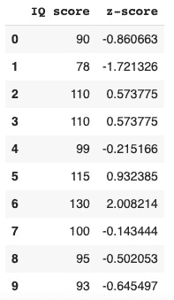
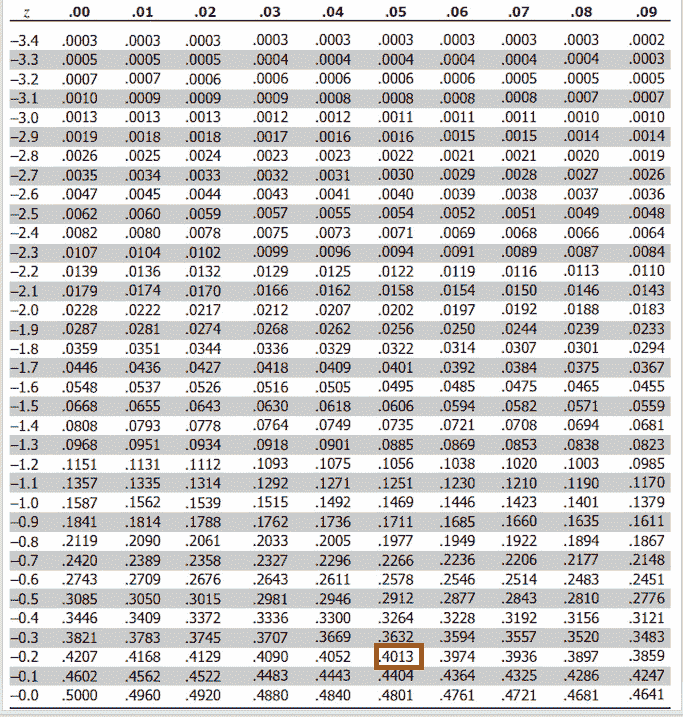
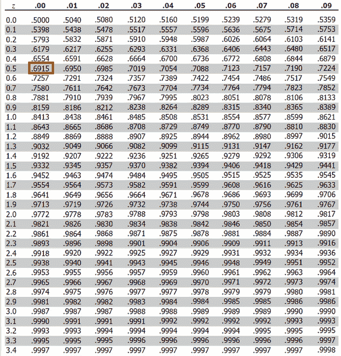
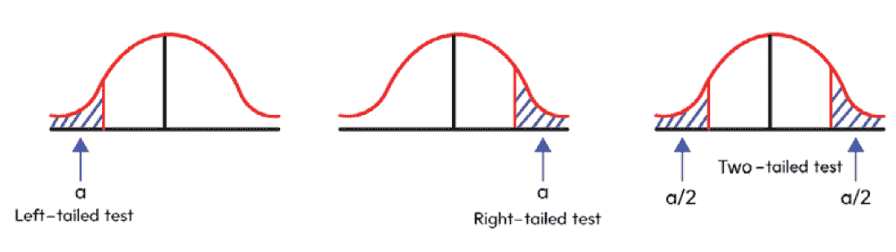
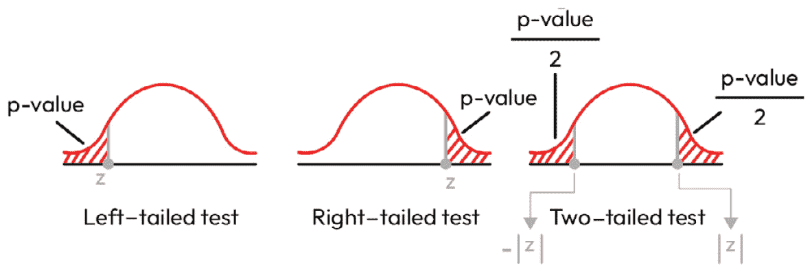
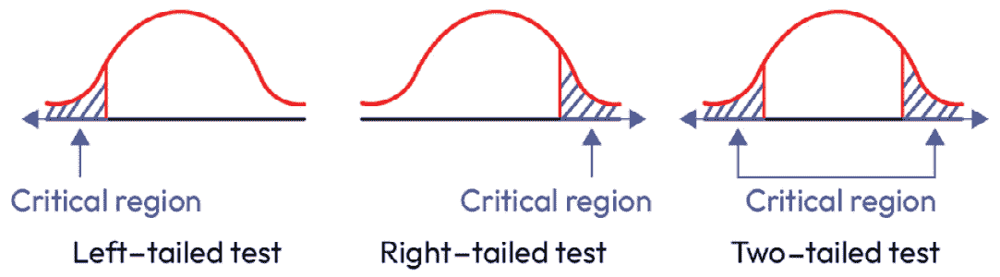
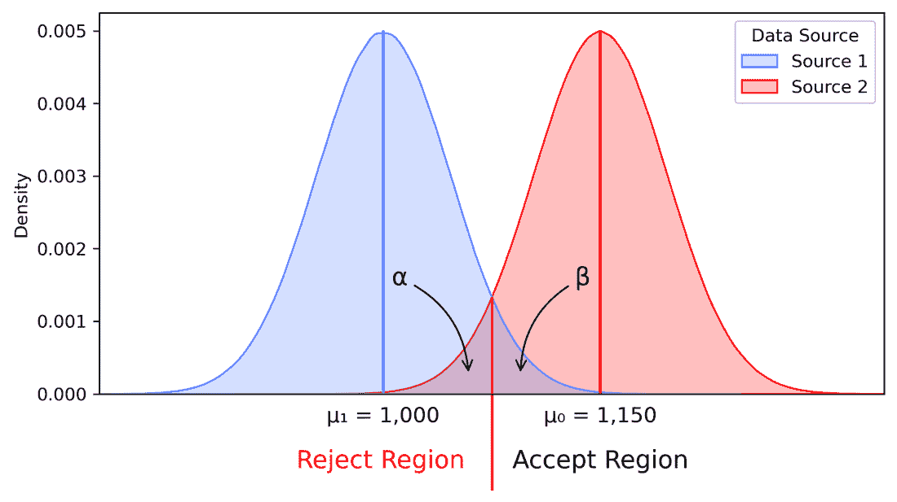

# 3

# 假设检验

在本章中，我们将开始讨论从数据中得出统计结论，结合来自*第一章**，抽样和推广*和来自*第二章**，数据分布*的分布。我们主要使用统计模型来回答数据中的问题。假设检验提供了一个正式的框架，通过不确定性的度量来回答感兴趣的问题。首先，我们将介绍假设检验的目标和结构。然后，我们将讨论假设检验可能出现的错误并定义预期的错误率。接着，我们将通过 z 检验的过程来讲解假设检验。最后，我们将讨论统计功效分析。

在本章中，我们将涵盖以下主要主题：

+   假设检验的目标

+   第一类和第二类错误

+   z 检验的基础 – z 分数、z 统计量、临界值和 p 值

+   均值和比例的单样本和双样本 z 检验

+   选择错误率和功效分析

+   将功效分析应用于 z 检验

# 假设检验的目标

简单来说，假设检验的目标是判断我们所拥有的数据是否足以支持一个特定的假设。假设检验提供了一个*正式的*框架，基于我们的数据来检验假设，而不是试图通过视觉检查来做出决定。在本节中，我们将讨论假设检验的过程。在下一节中，*z 检验的基础 – z 分数、z 统计量、临界值和 p 值*，我们将通过详细分析一个例子来应用这个过程。

## 均值假设检验概述

为了理解假设检验过程，让我们从一个简单的例子开始。假设我们有一个工厂，工厂里有机器生产小部件，我们期望我们的机器以一定的速率（每小时 30 个小部件）生产小部件。我们首先构建两个假设，即零假设和备择假设。零假设和备择假设分别用以下符号表示：H 0 和 H a。为了创建零假设，我们将首先假设我们想要测试的是真实的。在我们的例子中，零假设将是*机器的平均输出为每小时 30 个小部件*。一旦我们确定了零假设，然后我们创建备择假设，它只是零假设的矛盾。在我们的例子中，备择假设是*机器的平均输出不是每小时 30 个小部件*。请注意，我们的假设没有指示任何方向性，也就是说，备择假设包含低于和高于预期值的值。这被称为**双尾测试**，意味着有两个备择假设。我们还有**单尾测试**。例如，如果我们说零假设是*机器的平均输出超过每小时 30 个小部件*，那么备择假设将是*机器的平均输出低于每小时 30 个小部件*。这一组假设将是一个单尾测试。

我们例子中的双尾零假设和备择假设可以用以下数学方式表述：

H 0 :  _x_ = 30

H a :  _x_ ≠ 30

一旦我们有了零假设和备择假设以及数据，我们将使用软件进行测试。现在我们先暂时搁置测试的实现细节（这些将在下一节中详细讨论）。统计测试有两种可能的结果：拒绝零假设或未能拒绝零假设。如果我们的机器的平均输出在零假设中声明的值上具有统计学上的差异，那么我们将*拒绝零假设*。这意味着，根据数据，零假设中声明的值不是平均值的*合理*值。然而，如果我们的机器的平均输出在零假设中列出的值上没有统计学上的差异，我们将*未能拒绝零假设*。这意味着，根据数据，零假设中声明的值是平均值的*合理*值。在运行零假设测试并得出结论后，我们将提供一个置信区间（下一节将讨论），并确定推理的范围。

## 推理范围

推理范围由讨论在*第一章*中的抽样设计决定。有两个问题需要考虑 – *总体是什么，以及样本是如何从总体中选择的？* 在这个例子中，让我们假设我们正在测试一个大工厂（可能是数百台机器）的机器的平均输出。那么，总体就是工厂中的机器。如果我们随机抽取机器样本，那么我们的结论可以推广到整个总体。

尽管我们的当前例子是现实的，但它相当简单。在其他情况下，可能会有额外的考虑。例如，工厂中的机器可能有不同的型号和不同的年龄，这可能会影响输出。在这种情况下，我们可以使用分层随机抽样并对每个层进行推断。

## 假设检验步骤

本节概述了从提出假设到得出结论的假设检验过程。随着我们继续本章的学习，请记住以下关键假设检验步骤：

+   陈述零假设和备择假设

+   执行统计测试

+   确定结论：拒绝或未能拒绝零假设

+   提供统计结论、置信区间和推理范围

这些步骤适用于任何统计测试，我们将继续遵循这一系列步骤进行假设检验。在下一节中，我们将讨论假设检验可能导致的错误类型。

# 第一类错误和第二类错误

虽然数据可以给我们一个关于分布特性的良好概念，但假设检验可能导致错误。错误可能发生，因为我们是从总体中抽取随机样本。虽然随机化使得样本包含抽样偏差的可能性降低，*但并不能保证随机样本能够代表总体*。假设检验可能导致两种可能的错误：

+   **第一类错误**：当零假设实际上为真时拒绝零假设

+   **第二类错误**：当零假设实际上为假时未能拒绝零假设

## 第一类错误

当假设检验导致*拒绝零假设，但实际上零假设是正确的*时，会发生第一类错误。例如，假设我们有一个数据分布，总体均值为 30。我们陈述的零假设为 H 0 :  _ x  = 30。我们为测试随机抽取样本，但样本中的随机值恰好位于分布的高侧。因此，测试结果建议我们应该拒绝零假设。在这种情况下，我们犯了一个第一类错误。这种类型的错误也称为**假阳性**。

当我们进行统计测试时，由于从目标总体中抽取的样本数据，我们总是有可能得出错误的结论。*犯第一类错误的概率由* α指定。换句话说，α代表我们期望犯错误（预期错误率）的频率。这是一个我们可以为我们的测试选择的自由参数（α也称为*显著性水平*）。通常使用 0.05 作为α，但没有使用 0.05 的证据基础；在其他情况下，不同的值可能更合适。在本章的后面部分，我们将讨论选择第一类错误率。

## 第二类错误

我们可能犯的另一种错误称为第二类错误。在这种情况下，*我们未能拒绝实际上为假的零假设*。让我们考虑另一个例子。假设我们有一组数据分布，我们想要测试该分布的均值是否为 30。我们随机抽取样本进行测试，测试结果表明我们不应该拒绝零假设。然而，真正的总体均值是 35。在这种情况下，我们犯了一个第二类错误。这种错误也称为**假阴性**。

如前所述，统计测试可能导致错误的结论总是有可能的。因此，我们希望控制犯错误的概率。然而，与α不同，第二类错误率β不是一个我们可以简单选择的自由参数。为了理解犯第二类错误的可能性的大小，我们通常将进行功效分析，这将显示各种因素，如样本大小，将如何影响第二类错误率。在下一节中，我们将讨论选择错误率和功效分析。

我们可以用*图 3.1*中的表格来总结假设检验的可能结果。

|  |  | 零假设是： |
| --- | --- | --- |
|  |  | 真实 | 假 |
| 对零假设的决策 | 不拒绝 | 正确推断(1- α) | 第二类错误(β) |
| 拒绝 | 第一类错误(α) | 正确推断(1-β) |

图 3.1 – 假设检验结果

在本节中，我们讨论了从统计测试中得出结论时可能出现的错误类型。在下一节中，我们将通过 z 检验的假设检验示例进行讲解，在本章的后面部分，我们将讨论如何选择错误率以及如何分析统计功效和相关因素。

# z 检验的基础 – z 分数，z 统计量，临界值和 p 值

在本节中，我们将讨论一种称为 z 检验的假设检验类型。这是一种使用假设为正态分布的样本数据来确定与总体参数值相关的统计陈述是否应该被拒绝的统计程序。该测试可以在以下方面进行：

+   单样本（左尾 z 检验，右尾 z 检验或双尾 z 检验）

+   双样本（双样本 z 检验）

+   比例（单比例 z 检验或双比例 z 检验）

该测试假设标准差是已知的，并且样本量足够大。在实践中，样本量应大于 30。

在讨论不同类型的 z 检验之前，我们将讨论 z 分数和 z 统计量。

## z 分数和 z 统计量

要衡量一个特定值与均值之间的距离，我们可以使用 z 分数或 z 统计量作为统计技术，结合均值和标准差来确定相对位置。

z 分数的计算公式如下：

z i =  x i −  _ x  _ σ

在这里，z i 是 x i 的 z 分数，_x 是样本均值，σ 是样本标准差。z 分数也称为 z 值、标准化值或标准分数。让我们考虑几个例子。标准差告诉我们样本与分布均值的距离。如果 z i = 1.8，那么这个点距离均值 1.8 个标准差。同样，如果 z i = − 1.5，那么这个点距离均值 1.5 个标准差。符号确定它是大于还是小于样本均值。z i 为 -1.5 表示小于均值，而 z i 为 1.8 表示大于均值。现在让我们通过一个例子来解释。在德克萨斯州达拉斯的一所高中（在美国），我们要求学生参加匿名智商测试，进行一些统计研究。从这所学校收集的数据呈正态分布，智商分数的总体均值 μ = 98，总体标准差 σ = 12。一名学生参加了智商测试，他的分数是 110。他的智商分数高于均值，但他想知道自己是否位于前 5%。首先，我们将使用 z 分数公式来计算它：

z student = 110 − 98 _ 12  = 12 _ 12 = 1.

学生可以检查 z 表（*图 3**.2*），例如，从网站[`www.z-table.com`](http://www.z-table.com)获取 0.8413 的值。他位于前 1-0.8413 = 0.1587 或 15.87%的学校智商分数中。



图 3.2 – z 表

在 Python 中，我们可以使用**累积分布函数**（**CDF**）来计算它：

```py
import scipy
round(scipy.stats.norm.cdf(1),4)
# 0.8413
```

我们在 Python 中得到的值与 z 表检查中的值相同；在这个例子中，z 分数=1 时的值为 0.8413。

另一个例子是一个从智商调查中随机抽取的 10 个分数样本：

90, 78, 110, 110, 99, 115, 130, 100, 95, 93

要计算样本中每个智商分数的 z 分数，我们需要计算这个样本的均值和标准差，然后应用 z 分数公式。幸运的是，我们再次可以使用`scipy`库，如下所示：

```py
import pandas as pd
import numpy as np
import scipy.stats as stats
IQ = np.array([90, 78,110, 110, 99, 115,130, 100, 95, 93])
z_score = stats.zscore(IQ)
# Create dataframe
data_zscore = {
  "IQ score": IQ,
  "z-score": z_score
}
IQ_zscore = pd.DataFrame(data_zscore)
IQ_zscore
```

我们创建了一个名为`IQ`的智商分数数组，并使用`scipy.stats`中的`z-score`来计算`z_score`。最后，我们创建了以下输出 DataFrame。



图 3.3 – 输出 DataFrame

在讨论 z 统计量之前，我们将介绍抽样分布的概念。回顾上一个例子，作为一个经验法则，我们反复从高中智商分数池中选取 35 个智商分数的简单随机样本，所需次数取决于研究。然后，我们计算每个样本的平均分数，称为 x。因为我们有各种选出的样本，所以我们也有 x 的各种可能值。x 的期望值如下：

E(x) = μ

在这里，μ 表示总体均值。σ_x 表示 x 的标准分布。实际上，在许多抽样情况下，总体相对于较小的样本量来说相对较大。那么，x 的标准差可以表示如下：

σ_x = σ / √n

这里，σ 是总体标准差，n 是有限或无限总体中的样本量，总体较大，样本量相对较小。注意，σ_x 也被称为均值标准误，帮助我们确定样本均值与总体均值之间的距离。注意，E(x) = μ，与样本量无关。样本量和标准误成反比：当样本量增加时，标准误减小。由于假设 x 的抽样分布是正态分布的，样本分布由以下公式给出：

z_x = x̄ − μ / σ / x̄

在关于总体均值的假设检验中，我们使用测试统计量，其公式如下：

z = z_x = x − μ / σ / √n

在这里，x 是样本均值，μ 是总体均值，σ 是总体标准差，n 是样本量。

再次考虑智商测试的例子。智商分数数据的均值为 μ = 98，标准差 σ = 12。假设数据服从正态分布。设 x 为从智商数据中随机抽取的分数。x 在 95 和 104 之间的概率是多少？我们将计算当 x = 95 和 x = 104 时的 z 分数如下：

z_95 = 95 − 98 / 12 = −0.25,

z_100 = 104 − 98 / 12 = 0.5.

因此，所抽取的分数在 95 和 104 之间的概率是：

P(95 < x < 104) = P(−0.25 < z < 0.5) = 0.6915 − 0.4013 = 0.2902.

然后，这个概率大约是 29.02%，即从数据中随机抽取的智商分数在 95 和 104 之间的概率。我们还可以从 z 表中获取以下值。



图 3.4 – z 表



图 3.5 – z 表

在 Python 中，我们可以按照以下方式实现代码：

```py
#calculate z scores at x=95 and 104
zscore_95 = round((95-98)/12,2)
zscore_104 = round((104-98)/12,2)
#calculate cdf and probability
cdf_95 = stats.norm.cdf(zscore_95)
cdf_104 = stats.norm.cdf(zscore_104)
prob = abs(cdf_95-cdf_104)
#print the probability
print(f"The probability that the taken score between 95 and 104 is {round(prob*100,2)}%!")
```

提出的另一个问题是，随机抽取四个分数的平均分 x 在 95 和 104 之间的概率是多少？为了解决这个问题，我们使用 z 统计量的概念。我们假设 x 的均值也是 98，且 x 服从正态分布。那么，x 的标准误为：

σ_x = σ / √n = 12 / √4 = 6,

然后：

z =   _ x  − μ  _ x  _ σ  _ x   =   _ x  − 98 _ 6 .

很容易计算出 z 95 = − 0.5 和 z 104 = 1。通过使用 z 表，我们可以得到随机抽取六个分数的平均分数 x 在 95 和 104 之间的概率如下：

0.8413 – 0.3085 = 0.5328

或者，大约 53.28%。为了使用这个想法，我们可以在 Python 中实现以下代码：

```py
import pandas as pd
import numpy as np
import scipy.stats as stats
import math
# standard error
n= 4
sigma = 12
se = sigma/math.sqrt(n)
#calculate z scores at x=95 and 104
zscore_95 = round((95-98)/se,2)
zscore_104 = round((104-98)/se,2)
#calculate cdf and probability
cdf_95 = stats.norm.cdf(zscore_95)
cdf_104 = stats.norm.cdf(zscore_104)
prob = abs(cdf_95-cdf_104)
#print the probability
print(f"The probability that the taken score between 95 and 104 is {round(prob*100,2)}%!")
```

注意，在上述代码中，我们还需要 `math` 库来计算平方根函数，`math.sqrt()`。

在下一节中，我们将讨论均值 z 测试。

## 均值 z 测试

在这部分，我们将考虑与总体均值或两个总体的均值相关的单样本和双样本 z 测试。

### 单样本 z 测试

从总体中选择的研究样本应该是正态分布的。总体标准差在实用目的上应该是已知的。

当总体不能假设为正态分布，但根据研究参与者的经验，样本大小需要足够大时，此测试仍然适用。为了进行假设检验，我们需要制定零假设和备择假设。以下图示了与左尾、右尾和双尾 z 测试相对应的三个零假设和备择假设。



图 3.6 – 左尾、右尾和双尾假设检验

H 0 : μ ≥ μ 0 H 0 : μ ≤ μ 0 H 0 : μ = μ 0

H a : μ < μ 0 H a : μ > μ 0 H a : μ ≠ μ 0

接下来，我们需要指定显著性水平 α，即在零假设为真时拒绝零假设的概率。换句话说，这是我们在上一节中讨论的第一类错误的概率。然后，我们计算测试统计量的值。有两种方法用于假设检验：使用 p 值或临界值。

在 p 值方法中，我们使用测试统计量的值来计算一个概率，称为 p 值，它可能具有与从样本中得到的测试统计量一样极端或更极端的值。p 值越小，就越表明有证据反对零假设，换句话说，这是用来确定是否应该拒绝 H 0 的概率。拒绝规则（拒绝 H 0）是 p 值小于或等于研究中的指定显著性水平 α。为了根据测试统计量的值在 Python 中找到 p 值，我们使用以下语法：

```py
 scipy.stats.norm.sf(abs(x))
```

在这里，`x` 是 z 分数。例如，我们想要找到一个左尾测试中与 z 分数 -2.67 相关的 p 值。Python 实现如下：

```py
import scipy.stats
#find p-value
round(scipy.stats.norm.sf(abs(-2.67)),4)
```

输出将是 0.0038。在右尾测试的情况下，使用类似的 Python 代码。对于双尾测试，我们需要将值乘以 2：

```py
#find p-value for two-tailed test
scipy.stats.norm.sf(abs(2.67))*2
```

下图说明了如何计算每种类型检验中的 p 值。



图 3.7 – 假设检验中的 p 值

最后一步是解释统计结论。

另一方面，在临界值方法中，我们需要使用显著性水平来计算检验统计量的临界值。临界值是临界区域的边界，我们可以据此拒绝零假设。



图 3.8 – 假设检验中的临界区域

在 Python 中计算临界值时，我们使用以下语法：

```py
scipy.stats.norm.ppf(alpha)
```

这里，`alpha` 是要使用的显著性水平。以下是在 Python 中实现左尾、右尾和双尾检验的代码：

```py
import scipy.stats
alpha = 0.05 # level of significance
#find Z critical value for left-tailed test
print(f" The critical value is {scipy.stats.norm.ppf(alpha)}")
#find Z critical value for left-tailed test
print(f" The critical value is {scipy.stats.norm.ppf(1-alpha)}")
##find Z critical value for two-tailed test
print(f" The critical values are {-scipy.stats.norm.ppf(1-alpha/2)} and {scipy.stats.norm.ppf(1-alpha/2)}")
```

这是前面代码的输出：

`临界值` `是 -1.6448536269514729`

`临界值` `是 1.6448536269514722`

`临界值是 -1.959963984540054` `和 1.959963984540054`

对于左尾检验，显著性水平 α = 0.05，临界值约为 -1.64485。由于这是一个左尾检验，如果检验统计量小于或等于这个临界值，我们拒绝零假设。同样，对于右尾检验，如果检验统计量大于或等于 1.64485，我们拒绝零假设。对于双尾检验，如果检验统计量大于或等于 1.95996 或小于或等于 -1.95996，我们拒绝零假设。

确定是否拒绝零假设后，我们解释统计结论。

让我们再次讨论达拉斯高中的智商测试分数。智商分数数据平均值为 μ = 98，标准差为 σ = 12。一位研究人员想知道智商分数是否会受到某些智商训练的影响。他招募了 30 名学生，每天训练他们 2 小时回答智商问题，共训练 30 天，并在训练结束后记录他们的智商水平。训练阶段后 30 名学生的智商分数为 95, 110, 105, 120, 125, 110, 98, 90, 99, 100, 110, 112, 106, 92, 108, 97, 95, 99, 100, 100, 103, 125, 122, 110, 112, 102, 92, 97, 89, 和 102。他们的平均分数是 104.17。我们可以轻松地在 Python 中实现以下计算：

```py
IQscores = [95,110, 105, 120, 125, 110, 98, 90, 99, 100,
            110, 112, 106, 92, 108, 97, 95, 99, 100, 100,
            103, 125, 122, 110, 112, 102, 92, 97, 89, 102]
IQmean = np.array(IQscores).mean()
```

我们定义零假设和备择假设：

H 0 : μ after = μ = 98

H a : μ after > μ = 98

我们选择显著性水平 α=0.05。之前，右尾检验的临界值为 1.64485。我们现在计算问题中的检验统计量：

z = x − μ σ/ √n = 104.17 − 98 12/ √30 = 2.8162

它在 Python 中的实现如下：

```py
n=30 #number of students
sigma =12 #population standard deviation
IQmean = 104.17 # IQ mean of 30 students after the training
mu = 98 # population mean
z = (IQmean-mu)/(sigma/math.sqrt(n))
```

由于检验统计量值为 2.8162 > 1.64485，我们拒绝零假设。这意味着训练确实影响了这些学生的智商水平，并帮助他们提高了智商分数。

我们还可以使用来自`statsmodels`包的`ztest()`函数（*Seabold, Skipper, 和 Josef Perktold, “statsmodels: Econometric and statistical modeling with python.” Proceedings of the 9th Python in Science Conference. 2010*）来执行单样本或双样本 z 检验（我们将在下一部分讨论）。语法如下：

```py
statsmodels.stats.weightstats.ztest(x1, x2=None,
    value=0, alternative='two-sided')
```

这里，我们看到以下内容：

+   `x1`: 两个独立样本中的第一个

+   `x2`: 两个独立样本中的第二个（如果执行双样本 z 检验）

+   `value`: 在单样本情况下，`value`是零假设下`x1`的均值。在双样本情况下，`value`是零假设下`x1`的均值与`x2`的均值之差。检验统计量是`x1_mean - x2_mean - value`。

+   `alternative`: 替代假设：

`'two-sided'`: 双侧检验

`'larger'`: 右侧检验

`'smaller'`: 左侧检验

以下 Python 代码展示了我们如何执行单样本 z 检验：

```py
from statsmodels.stats.weightstats import ztest as ztest
#IQ scores after training sections
IQscores = [95,110, 105, 120, 125, 110, 98, 90, 99, 100,
            110, 112, 106, 92, 108, 97, 95, 99, 100, 100,
            103, 125, 122, 110, 112, 102, 92, 97, 89, 102]
#perform one sample z-test
z_statistic, p_value = ztest(IQscores, value=98, alternative = 'larger')
print(f"The test statistic is {z_statistic} and the
    corresponding p-value is {p_value}.")
```

检验统计量为 3.3975，p 值=0.00034 < 0.05，其中 0.05 是显著性水平。因此，我们有足够的证据拒绝零假设。这意味着训练确实影响了这些学生的智商水平。

### 双样本 z 检验

我们考虑两个正态分布且独立的总体。让Ω表示两个总体均值μ1 和μ2 之间的假设差异。同样，正如单样本 z 检验的情况一样，我们有三种零假设和替代假设的形式：

H0: μ1 − μ2 ≥ Ω H0: μ1 − μ2 ≤ Ω H0: μ1 − μ2 = Ω

H0: μ1 − μ2 < Ω H0: μ1 − μ2 > Ω H0: μ1 − μ2 ≠ Ω

在许多问题中，Ω = 0。这意味着对于双尾检验的情况，零是零假设，换句话说，μ1 和μ2 是相等的。假设检验的检验统计量计算如下：

z = (̅x1 − ̅x2) − Ω / √(σ1²/n1 + σ2²/n2)

在这里，_x1 和 _x2 是样本均值，n1 和 n2 是从两个具有均值μ1 和μ2 的总体中随机抽取的样本大小。σ1 和σ2 是这两个总体的标准差。对于两个独立的简单随机样本，点估计量 _x1 − _x2 的标准误差如下：

σ̅x1−̅x2 = √(σ1²/n1 + σ2²/n2)

当样本量足够大时，_x1 − _x2 的分布可以被认为是正态分布。双样本 z 检验假设检验的逐步方法与单样本 z 检验类似。

让我们考虑一个例子。我们研究了达拉斯两所学校 A 和 B 的学生的智商分数，并想知道这两所学校的平均智商水平是否不同。记录了每所学校 30 名学生的简单随机样本。

A= [95,110, 105, 120, 125, 110, 98, 90, 99, 100,110, 112, 106, 92, 108, 97, 95, 99, 100, 100, 103, 125, 122, 110, 112, 102, 92, 97, 89, 102]

B = [98, 90, 100, 93, 91, 79, 90, 100, 121, 89, 101, 98, 75, 90, 95, 99, 100, 120, 121, 95,

96, 89, 115, 99, 95, 121, 122, 98, 97, 97]

研究人员收集了一个样本数据，观察到的样本比例 p = 0.84，假设的总体比例 p0 = 0.8，样本大小 n = 500。零假设和替代假设如下：

H0 : μ1 − μ2 = 0

Ha :   _p ≠ p0.

我们选择显著性水平 α=0.05。在 Python 中，通过使用 `statsmodels` 包的 `ztest()` 函数，我们进行以下计算：

```py
from statsmodels.stats.weightstats import ztest as ztest
#IQ score
A= [95,110, 105, 120, 125, 110, 98, 90, 99, 100,
    110, 112, 106, 92, 108, 97, 95, 99, 100, 100,
    103, 125, 122, 110, 112, 102, 92, 97, 89,102] #school A
B = [98, 90, 100, 93, 91, 79, 90, 100, 121, 89,
     101, 98, 75, 90, 95, 99, 100, 120, 121, 95,
     96, 89, 115, 99, 95, 121, 122, 98, 97, 97]  # school B
#perform two- sample z-test
z_statistic, p_value = ztest(A, B, value=0, alternative = 'two-sided')
print(f"The test statistic is {z_statistic} and the corresponding p-value is {p_value}.")
```

H0 :   _p = p0,

## 比例的 z-test

H0 :   _p ≥ p0 H0 :   _p ≤ p0 H0 :   _p = p0

### 单比例 z-test

在这里，*n* 是样本大小。让我们考虑一个例子。在休斯顿的一所社区学院，一位研究人员想知道学生是否支持一些等于 80% 的变化。他将在显著性水平 α = 0.05 下使用单比例 z-test。为了在 Python 中实现代码，他可以使用 `statsmodel` 库中的 `proportions_ztest`。语法如下：

`nobs`: 试验或观察的数量

单比例 z-test 用于比较样本比例 _p 与假设比例 p0 之间的差异。同样，正如在均值 z-test 中，我们对零假设和替代假设有三种形式 - 左尾、右尾和双尾测试：

测试统计量计算如下：

z =   _p − p0___________√___________p0(1 − p0)_________n

在前面的代码中，我们选择了 `alternative = 'two-sided'`，这与研究的零假设和替代假设相关。Python 代码产生的测试统计量和 p-value 分别为 1.757 和 0.079。使用显著性水平 0.05，由于 p-value > 0.05，我们未能拒绝零假设。换句话说，我们没有足够的证据表明来自两所学校的学生的智商平均分数不同。

```py
statsmodels.stats.proportion.proportions_ztest(count,
    nobs, value=None, alternative='two-sided')
```

+   我们也可以测试比例的差异。让我们看看如何进行比例的 z-test。

+   零假设和替代假设如下：

+   `value`: 这是零假设的值，在单样本测试的情况下等于比例。在双样本测试的情况下，零假设是 `prop[0] - prop[1] = value`，其中 `prop` 是两个样本中的比例。如果没有提供，`value` = 0，零假设是 `prop[0] = prop[1]`。

    +   `'two-sided'`: 双尾测试

    +   `'larger'`: 右尾测试

    +   `'smaller'`: 左尾测试

Ha : μ1 − μ2 ≠ 0

`alternative`: 替代假设：

Ha :   _p < p0 Ha :   _p > p0 Ha :   _p ≠ p0

我们将在 Python 中实现一个单比例双尾 z-test 来计算测试统计量和 p-value：

```py
#import proportions_ztest function
from statsmodels.stats.proportion import proportions_ztest
count = 0.8*500
nobs = 500
value = 0.84
#perform one proportion two-tailed z-test
z_statistic, p_value = proportions_ztest(count, nobs,
    value, alternative = 'two-sided')
print(f"The test statistic is {z_statistic} and the
    corresponding p-value is {p_value}.")
```

测试统计量为-2.236067977499786，相应的 p 值为 0.0253473186774685。由于 p 值 < 0.05（显著性水平），我们拒绝零假设。有足够的证据表明，支持变化的学生的比例与 0.8 不同。

### 双比例 z 检验

此检验用于检验两个总体比例之间的差异。还有三种形式的零假设和备择假设。测试统计量的计算如下：

z =  ‾ p 1 − ‾ p 2  ____________  √ _____________   _ p (1 −  _ p )( 1 _ n 1 +  1 _ n 2)

在这里，_ p 1 是从总体 1 的简单随机样本中的样本比例，_ p 2 是从总体 2 的简单随机样本中的样本比例，n 1 和 n 2 是样本大小，_ p  是总合并比例，计算如下：

_ p  =  n 1‾ p 1 + n 2‾ p 2 _ n 1 + n 2 .

如果 A 校支持变化的学生的比例与 B 校支持变化的学生的比例存在差异，我们将考虑一个类似的例子。在这里，n 1 = 100，n 2 = 100，_ p 1 = 0.8，_ p 2 = 0.7。你可以使用`statsmodels`库中的`proportions_ztest`函数（Seabold, Skipper, 和 Josef Perktold, “statsmodels: Econometric and statistical modeling with python.” Proceedings of the 9th Python in Science Conference. 2010）来进行假设检验。在这里，我们将直接使用测试统计量来计算 p 值。零假设和备择假设如下：

H 0 : _ p 1 = _ p 2 (两个总体比例相等)

H a : _ p 1 ≠ _ p 2 (两个总体比例不同)

接下来，我们指定双尾检验的显著性水平为α = 0.05。然后我们计算测试统计量和 p 值如下：

```py
scipy.stats.norm.sf(abs(z))*2
```

测试统计量为 1.633，双尾检验的 p 值为 0.10。因为 p 值大于指定的显著性水平 0.05，所以我们未能拒绝零假设。有足够的证据表明，支持变化的 A 校和 B 校学生的比例是不同的。

最后，实现上述计算的 Python 代码如下：

```py
import math
import scipy
p_1bar = 0.8
p_2bar = 0.7
n1 = 100.0
n2 = 100.0
p= (p_1bar*n1 + p_2bar*n2)/(n1+n2)   # the total pooled proportion
z = (p_1bar-p_2bar)/math.sqrt(p*(1-p)*(1/n1+1/n2))
pval = scipy.stats.norm.sf(abs(z))*2
print(f"The test statistic is {z} and the p-value for two tailed test is {pval}.")
```

在本节中，我们讨论了不同的重要统计概念，例如 z 分数、z 统计量、临界值、p 值以及均值和比例的 z 检验。我们将在下一节讨论选择错误率和功效分析。

选择错误率和功效分析

统计学概括了围绕形成从数据行为中得出可接受结论的近似。因此，统计错误是不可避免的。统计模型发现的重要性基本上由错误率决定。一种可以用来最小化建模错误的方法，尤其是在样本量较低的情况下，是功率测试。统计功率是正确拒绝零假设的概率，从而最小化 II 型错误。其中α（*α*）是 I 型错误，β（*β*）是 II 型错误，功率的公式是*1 – β*。为了回顾，I 型错误是错误拒绝零假设的概率。

正如所注，功率在样本量较小时更为重要，因为大数定律通常有助于最小化误差，前提是选择了适当的抽样方法。当比较的差异相对较小时，功率也很重要。一种功率分析可能特别有用的场景是抽样成本较高时，例如在人类研究中。功率分析可以用来根据所需的功率、I 型错误率和效应大小找到适当的最小样本量。这些参数之间的关系可以根据需要进行探索。效应大小是在假设检验中比较的数据之间的差异或相似性，例如平均值的标准化差异或相关性。在假设检验中，常见的显著性水平（I 型错误）通常在 0.01 到 0.1 之间，常见的功率水平在 0.8 到 0.9 之间，尽管这些指标是案例依赖的（https://www.ncbi.nlm.nih.gov/pmc/articles/PMC7745163/#:~:text=The%20ideal%20power%20of%20a,high%20as%200.8%20or%200.9）。

功率的一些显著特性如下：

+   必须有足够的功率来检测有意义的不同

+   功率随样本量增加

+   功率随效应大小增加

+   随着功率的增加，标准差（以及方差和标准误）减小

在以下图中，我们可以看到 I 型错误（α）是我们可能错误地假设零假设并得出没有统计显著差异的结论的地方，而实际上数据点不属于数据源 2（零假设），而是属于数据源 1。II 型错误（β）是我们可能错误地假设该区域的数据属于数据源 1（备择假设）的地方，而实际上它属于数据源 2。



图 3.9 – 左尾双样本 z 检验中的误差可视化

如前图所示，我们看到了一个左尾 t 检验，将右侧的零分布与左侧的备择分布进行比较。在此图中，我们可以看到两个突出的概念：

+   随着*α*的减小，临界值向左滑动，更多地接近分布的异常值，*β*变大，反之亦然

+   统计功效是数据源 2 中*β*右侧的区域，即*功效 = (1-β)*

一类错误是基于预先选择的阈值确定的；研究者可能对 90%、95%或 99%的置信水平感到最舒适。然而，二类错误是基于参数化（标准差、效应量、样本量等）。因此，我们可以使用功效分析来确定样本量，反之亦然。各种假设检验的功效分析将在以下两章中实现。

## 双样本合并 z 检验的功效分析

让我们看看两个不同学科（学科 A 和学科 B）的教授薪资数据集。我们想知道根据我们拥有的数据，这两个学科之间是否存在统计上显著的差异。首先，我们需要进行功效分析，以了解我们是否有足够的样本来信任我们可能进行的 z 检验的结果。我们需要的功效分析组件包括效应量、一类错误率、期望的二类错误率、备择假设的方向（组 2 预计比组 1 大、小，或者可能比组 1 大或小），以及较大样本中观测值的比例相对于较小样本。学科 A 有 181 个薪资数据，学科 B 有 216 个。因此，216 将是我们的分子，对应于我们将考虑的*组 1*（学科 A 将是*组 2*）。

让我们假设我们不确定一个组是否会比另一个组大或小；我们将考虑这是一个双尾假设检验。这个 z 检验的效应量是两组之间的差异。我们将使用**Cohen 的 d**。为了计算它，我们需要将两组均值的差异除以合并标准差。在这里计算，合并标准差是组 1 样本数量乘以组 1 的方差，加上组 2 的相同值，所有这些除以两组的合并样本量。以下是合并标准差的方程：

√ _____________   n 1 σ 1 2 + n 2 σ 2 2  _ n 1 + n 2

对于效应量，我们需要将均值差除以效应量，如下所示：

|μ 1 − μ 2| ______________  √ ___________  n 1 σ 1 2 + n 2 σ 2 2  _ n 1 + n 2

注意，在效应量的方程中，我们取均值差的绝对值。这是因为，对于 Cohen 的 d，我们总是需要这个测试的正均值差。

如此计算，如果我们想要 80%的功效（II 型错误率是 20%）和 0.05 的 I 型错误率（显著性水平），我们需要在组 1 中 172 个样本和在组 2 中 145 个样本。然而，如果我们想要 90%的功效和 0.01 的显著性水平（99%置信度），我们需要在组 1 中 325 个样本和在组 2 中 274 个样本：

```py
import statsmodels.api as sm
import math
df_prof = sm.datasets.get_rdataset("Salaries", "carData").data
df_prof_A = df_prof.loc[df_prof['discipline'] == 'A']
df_prof_B = df_prof.loc[df_prof['discipline'] == 'B']
def pooled_standard_deviation(dataset1, dataset2, column) -> float:
    pooledSD = math.sqrt(((len(dataset1) - 1)*(dataset1[column].std()**2)+(len(dataset2) - 1)*(dataset2[column].std()**2))/(len(dataset1) + len(dataset2) - 2))
    return pooledSD;
stdDeviation = pooled_standard_deviation(
    dataset1 = df_prof_A, dataset2=df_prof_B,
    column='salary')
from statsmodels.stats.power import NormalIndPower
effect = abs(df_prof_B['salary'].mean() –
    df_prof_A['salary'].mean() ) / stdDeviation
# The difference between two means divided by std if pooled 2-sample
alpha = 0.05
power = 0.8
ratio=1.19 # # of obs in sample 2 relative to sample 1
analysis = NormalIndPower()
result = analysis.solve_power(effect, power=power, nobs1=None, ratio=ratio, alpha=alpha, alternative='two-sided')
print('Sample Size Required in Sample 1: {:.3f}'.format(
    result*ratio)) # nobs1 is the sample size.
print('Sample Size Required in Sample 2: {:.3f}'.format(
    result)) # nobs2 is the sample size.
```

此代码的输出如下：

```py
Sample Size Required in Sample 1: 171.620
Sample Size Required in Sample 2: 144.218
effect = abs(df_prof_B['salary'].mean() –
    df_prof_A['salary'].mean() ) / stdDeviation
alpha = 0.01
power = 0.9
ratio=1.19 # # of obs in sample 2 relative to sample 1
analysis = NormalIndPower()
result = analysis.solve_power(effect, power=power,
    nobs1=None, ratio=ratio, alpha=alpha,
    alternative='two-sided')
print('Sample Size Required in Sample 1: {:.3f}'.format(
    result*ratio)) # nobs1 is the sample size.
print('Sample Size Required in Sample 2: {:.3f}'.format(
    result)) # nobs2 is the sample size.
```

此代码的输出如下：

`样本所需样本量` `1: 325.346`

`样本所需样本量` `2: 273.400`

# 摘要

在本章中，我们介绍了假设检验的概念。我们从一个基本的假设检验轮廓开始，包含四个关键步骤：

+   陈述假设

+   执行测试

+   确定是否拒绝或未能拒绝零假设

+   在推断范围内得出统计结论

然后我们讨论了可能发生的潜在错误以及假阳性和假阴性，并定义了测试的预期错误率（alpha）和测试的效力（beta）。

我们还讨论了名为 z 检验的统计程序。这是一种使用假设为正态分布的样本数据进行假设检验的类型。在关于不同类型 z 检验的章节中，也介绍了 z 分数和 z 统计量，例如用于均值或比例的单样本或双样本 z 检验。

最后，我们讨论了功效分析的原理和动机，功效分析可以用来识别错误拒绝零假设的概率以及确定样本大小。我们还探讨了双总体合并 z 检验的分析参数。在这里，我们简要考察了效应量，这是我们在进行假设检验时寻找的影响值（治疗的效应）。我们将在下一章讨论功效分析，随着我们对假设检验不同应用的迭代。

在下一章中，我们将讨论更多的参数假设检验。虽然这些测试仍然需要分布假设，但假设将比 z 检验的假设不那么严格。
