# 4

# 参数检验

在上一章中，我们介绍了假设检验的概念，并展示了 z 检验的几个应用。z 检验是称为参数检验的假设检验家族中的一类检验。参数检验是强大的假设检验，但参数检验的应用需要数据满足某些假设。虽然 z 检验是一个有用的检验，但它受到所需假设的限制。在本章中，我们将讨论几个更多的参数检验，这将扩展我们的参数工具集。更具体地说，我们将讨论 t 检验的各种应用，当存在多于两个数据子组时如何进行测试，以及皮尔逊相关系数的假设检验。我们将以参数检验的效力分析讨论结束本章。

在本章中，我们将涵盖以下主要主题：

+   参数检验的假设

+   **t 检验**——一种参数假设检验

+   多于两个组的测试和**方差分析**（**ANOVA**）

+   **皮尔逊** **相关系数**

+   **效力分析**示例

# 参数检验的假设

参数检验对人口数据做出假设，要求统计实践者在建模之前分析数据，尤其是在使用样本数据时，因为当真正的总体参数未知时，样本统计量被用作总体参数的估计。这些是参数假设检验的三个主要假设：

+   正态分布的人口数据

+   样本独立

+   **等方差人口**（在比较两个或更多组时）

在本章中，我们讨论了 z 检验、t 检验、ANOVA 和皮尔逊相关。这些测试用于连续数据。除了这些假设之外，皮尔逊相关要求数据包含成对样本。换句话说，每个被比较的组中必须有相等数量的样本，因为皮尔逊相关基于成对比较。

虽然这些假设是理想的，但有许多情况下这些假设无法得到保证。因此，了解这些假设具有一定的稳健性，这取决于测试是有用的。

## 正态分布的人口数据

因为在参数假设检验中，我们感兴趣的是对总体参数进行推断，例如均值或标准差，我们必须假设所选择的参数代表分布，并且可以假设数据有一个中心趋势。我们还必须假设统计量（从样本或抽样分布中取出的参数值）代表其相应的总体参数。因此，由于我们在参数假设检验中假设总体是正态分布的，样本也应该同样是正态分布的。否则，假设样本代表总体是不安全的。

参数假设检验高度依赖于均值，并假设它强烈地代表了数据的中心点（所有总体数据都围绕均值中心分布）。考虑两个分布的均值正在被比较以测试它们之间是否存在统计上显著的差异。如果分布是偏斜的，均值就不会是数据的中心点，因此不能很好地代表分布。由于这种情况，从比较均值得到的推断将不可靠。

### 对正态分布数据的稳健性

许多假设检验在用样本对总体进行估计时指定了自由度。自由度迫使模型假设所使用的分布中存在比实际存在的额外方差。尽管分析中的统计参数保持不变，但假设的额外方差使得集中趋势的度量更接近。换句话说，使用自由度迫使集中趋势的度量更中心地代表计算它们的分布。这是因为假设样本——虽然代表了它们的总体——但以误差范围代表它们的总体。因此，使用自由度的参数假设检验对违反正态分布数据的要求具有一定的稳健性。

在 *图 4**.1 中显示的图表中，我们有一个略微偏斜的分布。一个应用了自由度，而另一个没有。我们可以看到，无论是否使用自由度，均值和中位数之间的距离都是相同的。然而，使用自由度的分布出现了更多的误差（更多的方差）：

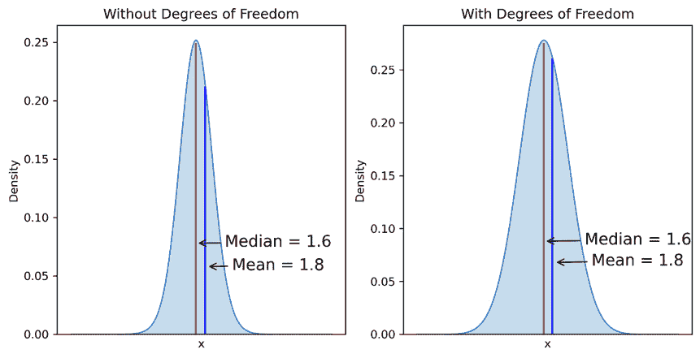

图 4.1 – 展示自由度的影响

当使用考虑均值的假设检验时，我们可以看到，均值，虽然不是中心（如中位数那样），当使用自由度时，相对于所有数据点，更接近分布的中心。由于参数假设检验使用均值作为中心点，这对于模型的有用性很重要，因为当使用自由度时，均值更能代表数据的中心点。这是对正态性有一定稳健性的主要原因。还有一些其他稳健性在于统计解释，例如在确定置信水平时；如果分布不是完美正态分布，例如，使用 90% 的置信水平而不是 99% 的置信水平可能更有益。

### 测试正态分布数据

确定一个分布是否为正态分布，从而可以用于参数假设测试，有多种方法。通常，对正态性的遵守程度由研究人员自行决定。本节中的方法在基于视觉检查以及应用统计显著性水平方面留下了一些讨论正态性的空间。

#### 视觉检查

识别一个分布是否为正态分布的最佳测试方法是基于视觉检查。我们可以使用 **分位数-分位数**（**QQ**）图和直方图——以及其他测试方法——来对分布进行视觉检查。

在以下代码片段中，我们使用 `scipy.stats` 模块的 `probplot` 函数生成原始数据的图表以及 QQ 图：

```py
import matplotlib.pyplot as plt
import scipy.stats as stats
import numpy as np
mu, sigma = 0, 1.1
normally_distributed = np.random.normal(mu, sigma, 1000)
```

在 *图 4**.2 中，我们可以看到第一列是指数分布数据的直方图，在其下方是它的 QQ 图。由于点与接近 45 度红色线的近似程度非常远，该红色线代表纯正态分布，我们可以得出结论，数据不是正态分布的。通过视觉检查第二列中的数据，我们可以看到直方图显示了近似正态分布的数据集。这由其下方的 QQ 图得到证实，其中点主要近似于 45 度红色线。至于 QQ 图的尾部，这些数据点代表了偏斜度的密度。我们期望在正态分布的数据集中，大部分数据点将趋向于红色线的中心。在指数分布中，我们可以看到向左的重密度，红色线的左侧尾部，以及向右上方的线上的点稀疏分布。QQ 图可以从左到右阅读，与直方图中的分布相对应，其中最小值出现在 *x* 轴的左侧，最大值出现在右侧：

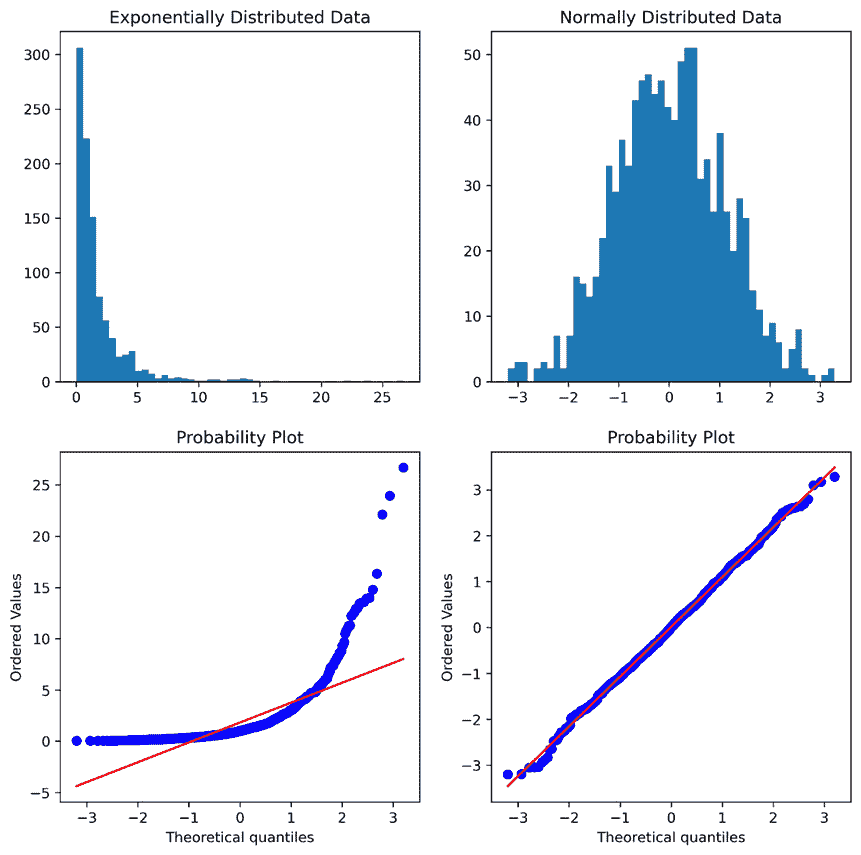

图 4.2 – 使用 QQ 图和直方图评估正态性

QQ 图和直方图的视觉检查应该足以帮助研究人员得出正态性假设是否被违反的结论。然而，在可能不想进行视觉检查的情况下——例如在构建数据科学管道时——有其他方法可以提供关于正态性的具体测量。最常用的三种测试方法是 **Kolmogorov-Smirnov**、**Anderson-Darling** 和 **Shapiro-Wilk** 测试。

Kolmogorov-Smirnov 测试更关注数据的中心性。然而，如果数据在中心周围有较大的方差，则测试的效力会降低。Anderson-Darling 测试比中心更关注数据的尾部，如果数据有重尾和极端异常值，则更有可能识别出与正态性的不符。这两个测试在大样本量上表现良好，但样本量较小时效力并不强。我们考虑的第三个测试，Shapiro-Wilk，比 Kolmogorov-Smirnov 和 Anderson-Darling 测试更通用，因此对小样本量更稳健。基于这些特性，使用 Shapiro-Wilk 测试在自动化管道中可能更有用。或者，降低所应用测试的置信水平可能更好。

#### Kolmogorov-Smirnov

`scipy.stats`模块中的`kstest`函数，使用`stats.norm.cdf`（`scipy`的累积密度函数）执行这种单样本测试版本。双样本版本测试与指定的分布进行比较，以确定两个分布是否匹配。在双样本情况下，要测试的分布必须作为`numpy`数组提供，而不是下面代码片段中使用的`stats.norm.cdf`函数（*图 4**.3*）。然而，这超出了测试正态性的范围，所以我们将不会探讨这一点。

Kolmogorov-Smirnov 将计算出的测试统计量与基于表格的临界值进行比较（`kstest`内部计算这个值）。与其他假设检验一样，如果测试统计量大于临界值，则可以拒绝给定分布是正态分布的零假设。如果 p 值足够低，也可以进行这种评估。测试统计量是给定分布中所有数据点与累积密度函数之间最大距离的绝对值。

Kolmogorov-Smirnov 特殊要求

Kolmogorov-Smirnov 测试要求数据围绕零中心并缩放到标准差为 1。所有数据都必须进行转换才能进行测试，但可以应用于预转换的分布；中心化和缩放后的分布不需要用于进一步的统计测试或分析。

在以下代码片段中，我们测试以确认正态分布数据集`normally_distributed`是否为正态分布。该数据集的平均值为 0，标准差为 1。输出确认数据是正态分布的。*图 4**.3*中的图表显示了围绕均值为 0、标准差为 1 的正态分布，其右侧是相同分布的指数转换版本：

```py
from scipy import stats
import numpy as np
mu, sigma = 0, 1
normally_distributed = np.random.normal(mu, sigma, 1000)
```

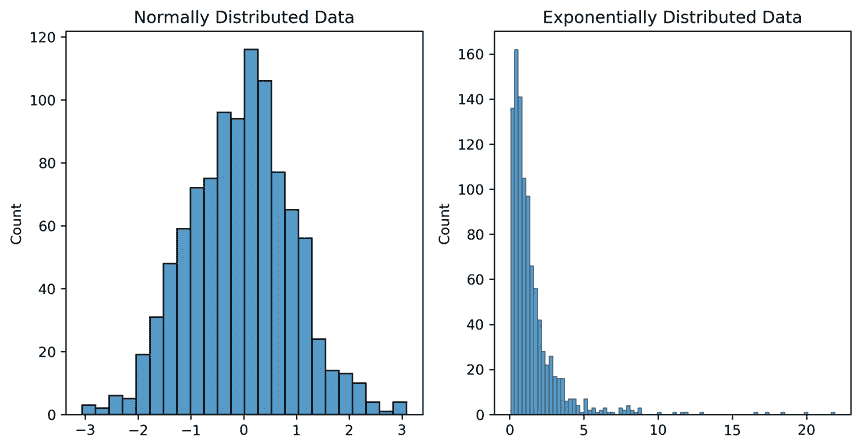

图 4.3 – 正态分布和指数分布数据

在这里，我们运行 Kolmogorov-Smirnov 测试：

```py
stats.kstest(normally_distributed,
             stats.norm.cdf)
```

`statsmodels`的科尔莫哥洛夫-斯米尔诺夫检验为我们数据产生了以下结果：

`KstestResult(statistic=0.0191570377833315, pvalue=0.849436919292824)`

如果我们使用相同的数据，但将其指数变换为右偏态，相同的检验表明数据不再呈正态分布：

```py
stats.kstest(np.exp(normally_distributed), stats.norm.cdf)
```

显著的 p 值确认了非正态性：

`KstestResult(statistic=0.5375205782404135, pvalue=9.59979841227121e-271)`

接下来，让我们取一个均值为 100，标准差为 2 的 1000 个样本的分布。我们需要将其中心化到均值为 0，单位方差（标准差为 1）。在下面的代码片段中，我们生成数据，然后执行缩放并将其保存到`normally_distributed_scaled`变量中：

```py
mu, sigma = 100, 2
normally_distributed = np.random.normal(mu, sigma, 1000)
normally_distributed_scaled = (
    normally_distributed-normally_distributed.mean()) /
    normally_distributed.std()
```

现在数据已按要求中心化和缩放，我们使用科尔莫哥洛夫-斯米尔诺夫检验进行检查。正如预期的那样，数据被确认呈正态分布：

```py
stats.kstest(normally_distributed_scaled, stats.norm.cdf)
```

这是输出：

`KstestResult(statistic=0.02597307287070466, pvalue=0.5016041053535877)`

#### 安德森-达尔林

与科尔莫哥洛夫-斯米尔诺夫检验类似，`scipy`的`anderson`检验，我们可以测试其他分布，但默认参数指定正态分布，`dist="norm"`，假设零假设是给定的分布与正态分布在统计上是相同的。对于每个测试的分布，必须计算不同的临界值集。

安德森-达尔林与科尔莫哥洛夫-斯米尔诺夫比较

注意，虽然安德森-达尔林和科尔莫哥洛夫-斯米尔诺夫检验都使用累积密度频率分布来检验正态性，但安德森-达尔林检验与科尔莫哥洛夫-斯米尔诺夫检验不同，因为它对累积密度频率分布尾部的方差赋予比中间更大的权重。这是因为分布尾部的方差可以以比分布中间更小的增量来测量。因此，安德森-达尔林检验比科尔莫哥洛夫-斯米尔诺夫检验对尾部更敏感。与科尔莫哥洛夫-斯米尔诺夫检验一样，计算一个检验统计量，并将其与临界值进行比较。如果检验统计量大于临界值，则可以在指定的显著性水平上拒绝给定分布是正态分布的零假设。

这里，我们使用安德森-达尔林检验来检验一个均值为 19，标准差为 1.7 的随机正态概率分布。我们还测试了该数据的指数变换版本：

```py
import matplotlib.pyplot as plt
import seaborn as sns
import numpy as np
mu, sigma = 19, 1.7
normally_distributed = np.random.normal(mu, sigma, 1000)
not_normally_distributed = np.exp(normally_distributed);
```

*图 4**.4* 展示了数据的分布图：

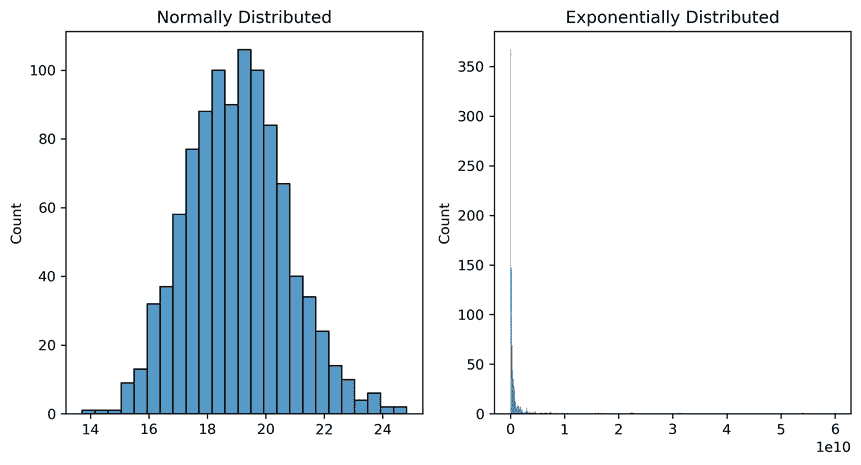

图 4.4 – 正态分布与重尾指数分布

在下面的代码和输出中，在*图 4.5*中，我们可以看到在所有显著性水平上分布都是正态分布的。回想一下，显著性水平是 p 值（即，显著性水平 = 15.0 表示 p 值为 0.15 或更小是显著的）：

```py
from scipy import stats
import pandas as pd
import numpy as np
def anderson_test(data):
data = np.array(data)
    test_statistic, critical_values, significance_levels = stats.anderson(normally_distributed, dist='norm')
    df_anderson = pd.DataFrame({'Test Statistic':np.repeat(test_statistic, len(critical_values)), 'Critical Value':critical_values, 'Significance Level': significance_levels})
df_anderson.loc[df_anderson['Test Statistic'] >= df_anderson['Critical Value'], 'Normally Distributed'] = 'No'
    df_anderson.loc[df_anderson['Test Statistic'] <df_anderson['Critical Value'], 'Normally Distributed'] = 'Yes'
    return df_anderson;
mu, sigma = 19, 1.7
normally_distributed = np.random.normal(mu, sigma, 1000)
anderson_test(normally_distributed)
```

在这里，通过 `numpy` 的 `random.normal` 函数生成数据，使用 Anderson-Darling 方法进行测试，并确认其为正态分布：

| **检验统计量** | **临界值** | **显著性水平** | **正态分布** |
| --- | --- | --- | --- |
| 0.191482344 | 0.574 | 15 | 是 |
| 0.191482344 | 0.653 | 10 | 是 |
| 0.191482344 | 0.784 | 5 | 是 |
| 0.191482344 | 0.914 | 2.5 | 是 |
| 0.191482344 | 1.088 | 1 | 是 |

图 4.5 – 正态分布数据的 Anderson-Darling 结果

在这里，我们测试了正态分布数据的指数变换，以检查其正态性。数据呈指数分布，应在所有显著性水平上被拒绝。然而，我们在*图 4.6*中看到，它在 0.01 的显著性水平（99% 置信度）上未能被拒绝。因此，根据具体的使用情况，检查所有显著性水平、使用不同的测试或基于多个测试的结果做出决定可能是谨慎的：

```py
not_normally_distributed = np.exp(normally_distributed)
anderson_test(not_normally_distributed)
```

我们的非正态分布数据的 Anderson-Darling 测试结果如下所示在*图 4.6*：

| **检验统计量** | **临界值** | **显著性水平** | **正态分布** |
| --- | --- | --- | --- |
| 0.96277351 | 0.574 | 15 | 否 |
| 0.96277351 | 0.653 | 10 | 否 |
| 0.96277351 | 0.784 | 5 | 否 |
| 0.96277351 | 0.914 | 2.5 | 否 |
| 0.96277351 | 1.088 | 1 | 是 |

图 4.6 – 非正态分布数据的 Anderson-Darling 结果

#### Shapiro-Wilk

`scipy.stats shapiro` 模块，因此输入数据在测试之前不需要更改。在 `scipy` 中，此测试的显著性水平为 0.05。

Shapiro-Wilk 与 Kolmogorov-Smirnov 和 Anderson-Darling 的比较

与 Kolmogorov-Smirnov 和 Anderson-Darling 相比，Shapiro-Wilk 对于测试大约小于 50 的较小样本量是理想的。然而，一个缺点是，由于 Shapiro-Wilk 使用重复抽样和测试来通过蒙特卡洛模拟应用计算出的检验统计量，大数定律的风险在于，随着样本量的增加，存在固有的风险增加，遇到*第二类错误*（功率损失）并未能拒绝零假设，其中零假设表示给定的分布是正态分布的。

使用与 Anderson-Darling 测试相同的分布，我们使用 Shapiro-Wilk 进行测试。我们可以看到，具有均值为 19 和标准差为 1.7 的随机正态分布，Shapiro-Wilk 测试已确认，p 值为 0.99，不应拒绝输入分布是正态分布的零假设：

```py
mu, sigma = 19, 1.7
normally_distributed = np.random.normal(mu, sigma, 1000)
stats.shapiro(normally_distributed)
```

这是输出结果：

`ShapiroResult(statistic=0.9993802905082703, pvalue=0.9900037050247192)`

当使用正态分布数据的指数变换版本进行测试时，我们发现显著的 p 值（p = 0.0），这表明我们有足够的证据拒绝零假设，并得出结论分布不是正态分布：

```py
not_normally_distributed = np.exp(normally_distributed)
stats.shapiro(not_normally_distributed)
```

这是输出：

`ShapiroResult(statistic=0.37320804595947266, pvalue=0.0)`

### 独立样本

在参数假设检验中，样本的独立性是另一个重要假设。非独立抽样可能导致两种影响。一种影响发生在进行子群抽样时。这里的问题是，总体中一个子群的响应可能与另一个子群的响应不同，甚至可能更接近于不同总体的响应。然而，当抽样代表总体时，这种子群差异可能并不非常具有代表性。

非独立抽样的另一个影响是，当样本在时间上足够接近，以至于一个样本的发生会阻止或排除另一个样本的发生时。这被称为序列（或自）相关性。

参数检验通常对违反此要求不具鲁棒性，因为它对测试结果的可解释性有直接、分类的影响。关于子群抽样，可以通过诸如在*第一章**，抽样与泛化*中概述的良好结构化抽样方法来防止这种情况。然而，关于序列效应，我们可以在数据中测试自回归相关性（也称为序列相关性）。

### 杜宾-沃森

评估抽样独立性缺失的最常见测试之一是一阶自回归测试，称为**杜宾-沃森**测试。**自回归**意味着使用先前数据点来预测当前数据点。一阶意味着最后一个抽样数据点（滞后一）是与序列中最近抽样数据点（滞后零）最显著相关的点。在一阶自相关中，每个数据点的相关性最强的是前一个数据点。杜宾-沃森测试并不测试任何值是否与它之前的值相关，而是测试每个值与它之前值之间是否存在足够强的关系，以至于可以得出存在显著自相关性的结论。从这个意义上说，对非独立抽样有一定的鲁棒性，即一次或两次意外事件可能不会完全使假设检验无效，但此类违规的持续发生将会。

杜宾-沃森值为 2 表示没有显著的自相关性，介于 0 到 2 之间的值表示正（直接）自相关性，而介于 2 到 4 之间的值表示负（反向）自相关性。

在以下示例中，我们有两个分布，每个分布都有 1,000 个样本。左边的分布是一个正弦分布，表现出强烈的自回归相关性，而右边的分布是一组随机生成数据，显示出白噪声方差（围绕均值为 0 的随机点）。使用`statsmodels.stats`模块中的`durbin_watson()`函数，我们能够确认正弦模式中的直接、正的一阶自相关性（非常小的 Durbin-Watson 值）和与随机噪声的 Durbin-Watson 统计量为 2.1，表明没有自相关性。因此，在*图 4*.7 中，左边的图不是由独立样本组成，而右边的图是：

```py
from statsmodels.stats.stattools import durbin_watson
import matplotlib.pyplot as plt
import numpy as np
mu, sigma = 0, 1.1
independent_samples = np.random.normal(mu, sigma, 1000)
correlated_samples = np.linspace(-np.pi, np.pi, num=1000)
fig, ax = plt.subplots(1,2, figsize=(10,5))
ax[0].plot(correlated_samples, np.sin(correlated_samples))
ax[0].set_title('Durbin Watson = {}'.format(
    durbin_watson(correlated_samples)))
ax[1].plot(independent_samples)
ax[1].set_title('Durbin Watson = {}'.format(
    durbin_watson(independent_samples)))
```

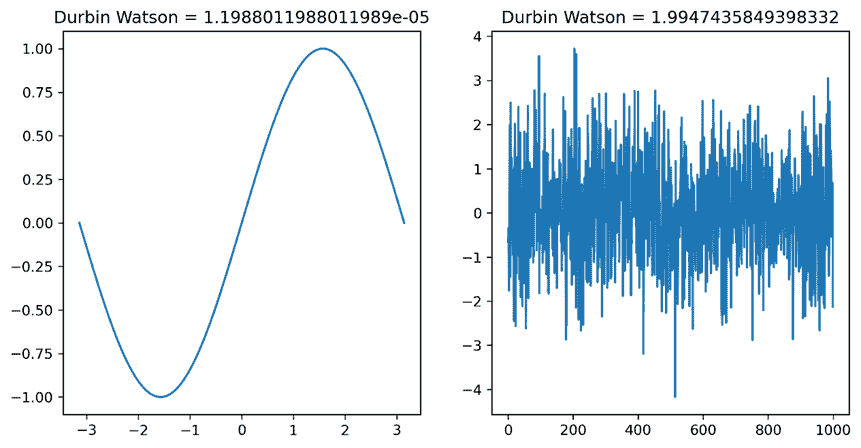

图 4.7 – 串联相关和正态分布的序列数据

## 等样本方差

与正态分布数据的假设类似，等样本方差的假设——也称为方差齐性——是关于比较的分布的物理属性形状。假设等样本方差有助于提高参数测试的功效。这是因为当均值被识别为不同时，我们有信心；我们还知道潜在分布重叠的程度。当测试对整个分布的位置有直观认识——实际上，对效应大小的真正了解——功效会增加。相反，随着方差的发散，功效会降低。

### 对等样本方差的鲁棒性

虽然等样本方差在参数测试中很有用，但存在对这些测试的修改，有助于使结果对偏离等方差的偏差具有鲁棒性。这些测试的一个突出修改版本是使用**Welch-Satterthwaite**自由度调整。因为当每个组有不同的方差时，将相同的自由度应用于每个组会导致数据的误表示，Welch-Satterthwaite 调整在分配假设等方差的参数测试的自由度时考虑了方差差异。使用 Welch-Satterthwaite 调整的两个常见测试是 Welch 的 t 检验和 Welch 的方差分析测试。当用于小样本时，这些测试可能不可靠，但当用于足够大的样本量以具有足够功效时，结果应与它们的非 Welch 对应物大致相同。

### 测试等方差

在测试分布之间的方差相等时，我们有两种突出的测试：**Levene 方差齐性检验**和**Fisher 的 F 检验**。

### Levene 方差齐性检验

Levene 方差齐性检验在测试两个或更多组的方差齐性时很有用。在下面的代码片段中 *图 4**.8*，我们使用三个分布进行测试，每个分布的样本量为 100，均值为 0，标准差为 0.9、1.1 和 2。*图 4**.8* 是使用上述 *图 4**.8* 代码输出的数据生成的三个分布的图。

```py
from scipy.stats import levene
np.random.seed(26)
mu1, sigma1, mu2, sigma2, mu3, sigma3 = 0,0.9,0,1.1,0,2
distro1, distro2, distro3 = pd.DataFrame(), pd.DataFrame(),
    pd.DataFrame()
distro1['x'] = np.random.normal(mu1, sigma1, 100)
distro2['x'] = np.random.normal(mu2, sigma2, 100)
distro3['x'] = np.random.normal(mu3, sigma3, 100)
```

我们可以看到它们不同的标准差如何影响它们的范围。

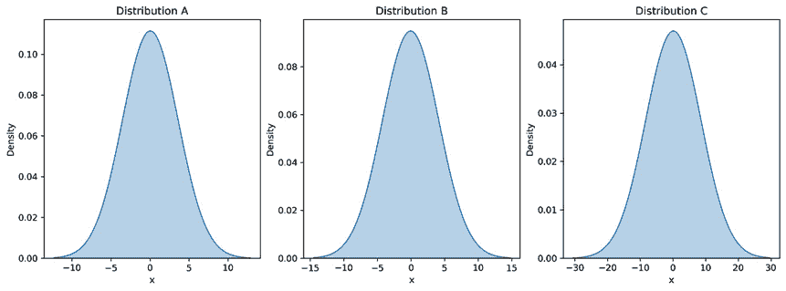

图 4.8 – 多重方差齐性检验的分布

我们可以看到，由于这个结果是一个具有统计学意义的 p 值，表明分布不具有同质性，因此测试对非同质性方差的违反很敏感：

```py
f_statistic, p_value = levene(distro1['x'], distro2['x'], distro3['x'])
if p_value <= 0.05:
    print('The distributions do not have homogenous variance. P-value = %.4f, F-statistic = %.4f'%(p_value, f_statistic))
else:
    print('The distributions have homogenous variance.P-value = %.4f, F-statistic = %.4f'%(p_value, f_statistic))
```

这是输出结果：

`分布不具有同质性。P 值 =` `0.0000`

### Fisher 的 F 检验

当同时测试两组的方差齐性时，Fisher 的 F 检验很有用。这个检验将一个检验统计量与临界值进行比较，以确定方差是否在统计学上相同。计算出的 F 统计量是第一组的方差除以第二组的方差。第一组总是具有较大方差的组。使用前面的数据，让我们比较分布 1 和分布 3。分布 3 的方差较大，为 2，因此该组的方差将是计算 F 统计量时的分子。由于每个组都有 100 个样本量，它们的自由度在查表时各为 99。然而，由于我们将使用 `scipy` Python 包来计算检验，这里不需要查表，因为 `scipy` 使用 `f.cdf()` 函数为我们完成这项工作。与 Levene 检验的结果一致，F 检验表明分布 1 和分布 3 不具有同质性：

```py
from scipy.stats import f
def f_test(inputA, inputB):
    group1 = np.array(inputA)
    group2 = np.array(inputB)
    if np.var(group1) > np.var(group2):
        f_statistic = np.var(group1) / np.var(group2)
        numeratorDegreesOfFreedom = group1.shape[0] - 1
        denominatorDegreesOfFreedom = group2.shape[0] - 1
    else:
        f_statistic = np.var(group2)/np.var(group1)
        numeratorDegreesOfFreedom = group2.shape[0] - 1
        denominatorDegreesOfFreedom = group1.shape[0] - 1
    p_value = 1 - f.cdf(f_statistic,numeratorDegreesOfFreedom, denominatorDegreesOfFreedom)
    if p_value <= 0.05:
print('The distributions do not have homogenous variance. P-value = %.4f, F-statistic = %.4f'%(p_value, f_statistic))
    else:
        print('The distributions have homogenous variance. P-value = %.4f, F-statistic = %.4f'%(p_value, f_statistic))
f_test(distro3['x'], distro1['x'])
```

这个 F 检验输出如下：

`分布不具有同质性。P 值 = 0.0000，F 统计量 =` `102622.9745`

# t 检验 – 参数假设检验

在上一章中，当总体标准差已知时，应用了均值 z 检验。然而，在现实世界中，获得总体标准差并不容易（或几乎不可能）。在本节中，我们将讨论另一种称为 t 检验的假设检验，当总体标准差未知时使用。通过取代表性总体样本数据的均值和标准差来估计总体均值和标准差。

从广义上讲，均值 t 检验的方法与均值 z 检验的方法非常相似，但检验统计量和 p 值的计算方法与 z 检验不同。检验统计量通过以下公式计算：

t =   _x   − μ   _   s/ √   _   n

在这里，_x_，μ，s 和 n 分别是样本均值、总体均值、样本标准差和样本大小，当样本数据 x 正态分布时，它具有 t**-分布**。以下代码展示了标准正态分布（蓝色曲线）和两个样本大小（3 和 16 个样本）的 t-分布（绿色和红色曲线）：

```py
# libraries
import numpy as np
import scipy.stats as stats
# creating normal distribution
x =np.linspace(-5, 5, 1000) #create 1000 point from -5 to 5
y = stats.norm.pdf(x) # create probability density for each point x  - normal distribution
# creating Student t distributions for 2 sample sizes n =3 and n =15
degree_freedom1 = 2
t_dis1 = stats.t.pdf(x, degree_freedom1)
degree_freedom2 = 15
t_dis2 = stats.t.pdf(x, degree_freedom2)
```

以下可视化是针对考虑的这 3 个分布。

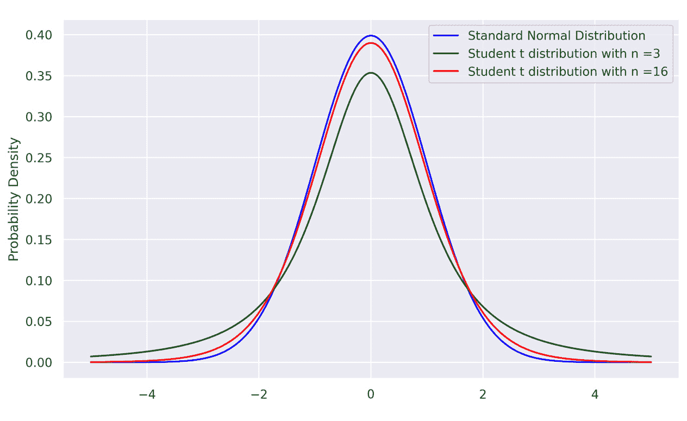

图 4.9 – 正态分布和 t-分布

观察到三条曲线具有相似的对称性和形状，但样本大小较小时，变异性更大（或者说，尾部更重）。历史上，当样本大小大于 30 时，研究人员认为样本标准差可以代表总体，即当 n > 30 时，红色曲线近似于蓝色曲线。如果样本分布与标准正态分布重叠，也常用 z-检验。这种做法背后有一些理由，因为以前，临界值表存储到样本大小为 50，但现在，随着计算能力和互联网的强大，任何样本大小的 *t* 值都可以轻松获得。

## 均值 t-检验

在这部分将考虑与总体均值或两个总体均值相关的单样本和双样本 t-检验，其中总体方差或总体标准差是未知的。

要进行 t-检验，需要满足以下假设：

**正态性**：样本是正态分布的

**独立性**：观察值是从总体中随机选取以形成样本，换句话说，它们是独立的

让我们在下一节考虑单样本 t-检验。

### 单样本 t-检验

与单样本 z-检验类似，为了进行假设检验，需要考虑零假设和备择假设。以下列出了对应于左尾、右尾和双尾 t-检验的三个零假设和备择假设：

H 0 : μ ≥ μ 0 H 0 : μ ≤ μ 0 H 0 : μ = μ 0

H a : μ < μ 0 H a : μ > μ 0 H a : μ ≠ μ 0

接下来，需要根据研究目的指定显著性水平 α。有两种方法：p 值方法和临界值方法。在 p 值方法中，拒绝规则（拒绝 H 0——零假设）是当 p 值小于或等于所选的指定显著性水平时。在临界值方法中，拒绝规则是当检验统计量小于或等于左尾 t-检验的临界值 - t α，对于右尾 t-检验，检验统计量大于或等于 t α，对于双尾检验，检验统计量小于或等于 - t α/2 或大于或等于 t α/2。最后一步是对假设检验的统计结论进行解释。

要根据学生 t 分布的值找到 p 值，我们可以使用以下语法：

```py
scipy.stats.t.sf(abs(x), df)
```

在这里，`x` 是检验统计量，`df` 是自由度（`df` = n-1，其中 *n* 是样本大小）在公式中。

例如，为了找到一个左尾检验中自由度为 14 的 t 值为 1.9 的 p 值，这将是 Python 的实现：

```py
import scipy.stats
round(scipy.stats.t.sf(abs(1.9), df=14),4)
```

输出将是 0.0391。如果显著性水平 α = 0.05，那么我们拒绝零假设，因为 p 值小于 α。对于右尾 t 检验，与左尾 t 检验类似的 Python 代码被实现以找到 p 值。对于双尾检验，我们需要将值乘以 2，如下所示：

```py
scipy.stats.t.sf(abs(t), df)*2
```

在这里，`t` 是检验统计量，`df` 是自由度（`df` = n-1，其中 *n* 是样本大小）。

要在 Python 中计算临界值，我们使用以下语法：

```py
scipy.stats.t.ppf(q, df)
```

在这里，`q` 是显著性水平，`df` 是公式中要使用的自由度。以下是 Python 中左尾、右尾和双尾检验的代码实现：

```py
import scipy.stats as stats
alpha = 0.05 # level of significance
df= 15 # degree of freedom
#find t critical value for left-tailed test
print(f" The critical value is {stats.t.ppf(q= alpha, df =df)}")
#find t critical value for right-tailed test
print(f" The critical value is {stats.t.ppf(q= 1-alpha, df =df)}")
##find t critical value for two-tailed test
print(f" The critical values are {-stats.t.ppf(q= 1-alpha/2, df =df)} and {stats.t.ppf(q= 1-alpha/2, df =df)}")
```

这是前面代码的输出：

+   临界值为 -1.7530503556925552

+   临界值为 1.7530503556925547

+   临界值为 -2.131449545559323 和 2.131449545559323

在显著性水平 α = 0.05 下，对于左尾检验，临界值约为 -1.753。由于这是一个左尾检验，如果检验统计量小于或等于这个临界值，我们拒绝零假设。同样，对于右尾检验，如果检验统计量大于或等于 1.753，我们拒绝零假设。对于双尾检验，如果检验统计量大于或等于 2.1314 或小于或等于 -2.1314，我们拒绝零假设。最后，我们解释假设检验的统计结论。

让我们从一所高中随机选择 30 名学生并评估他们的智商。我们想测试这个高中学生智商分布的平均值是否高于 100。这意味着我们将执行右尾 t 检验。30 名学生的智商分数如下：

```py
IQscores = [113, 107, 106, 115, 103, 103, 107, 102, 108, 107, 104, 104, 99, 102, 102, 105, 109, 97, 109, 103, 103, 100, 97, 107,116, 117, 105, 107, 104, 107]
```

在进行假设检验之前，我们将检查正态性和独立性假设。如果样本是从该学校高中学生的总体中随机选择的，则满足独立性假设。对于正态性，我们将检查智商分数的直方图和 QQ 图：

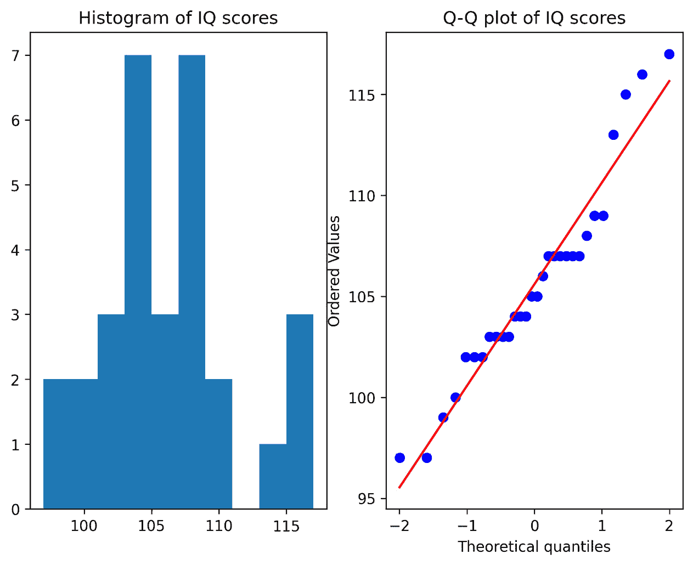

图 4.10 – 视觉评估学生智商分数的正态性

从直方图和 QQ 图来看，几乎没有证据表明该高中学生智商分布的总体不是正态分布。由于假设分布是正态的，我们将继续进行 t 检验。

首先，我们定义零假设和备择假设：

H 0 : μ ≤ 100

H a : μ > 100

我们选择显著性水平α=0.05。你可以通过手动使用其数学公式或通过实现 Python 来计算检验统计量。对于临界值和 p 值，之前部分展示的实现代码如下。在这里，我们将使用`scipy`库中的另一个函数来找到检验统计量和 p 值：

```py
scipy.stats.ttest_1samp(data, popmean, alternative='greater')
```

这里适用以下规则：

+   `data`: 样本中的观测值

+   `popmean`: 零假设中的期望值

+   `alternative`: 对于双尾 t 检验为`'two-sided'`，对于左尾 t 检验为`'less'`，对于右尾 t 检验为`'greater'`

Python 代码实现如下：

```py
import scipy.stats as stats
#perform one sample t-test
t_statistic, p_value = stats.ttest_1samp(IQscores, popmean =100, axis=0,  alternative='greater')
print(f"The test statistic is {t_statistic} and the corresponding p-value is {p_value}.")
```

这是输出：

`检验统计量为 6.159178830896832，相应的 p 值为 5.15076734562176e-07。`

因为 p 值<0.05，其中 0.05 是显著性水平，我们有足够的证据拒绝零假设，并得出结论，该学校学生的真实平均 IQ 分数高于 100。

此外，以 95%的置信度，平均 IQ 分数介于 104.08 和 107.12 之间。我们可以在 Python 中如下进行置信区间的计算：

```py
IQmean = np.array(IQscores).mean() # sample mean
IQsd = np.array(IQscores).std() # sample standard deviation
sample_size = len(np.array(IQscores)) # sample size
df = sample_size-1 # degree of freedom
alpha = 0.05 # level of significance
t_crit = stats.t.ppf(q=1-alpha, df =df) # critical
confidence_interval = (IQmean-IQsd*t_crit/np.sqrt(sample_size), IQmean+IQsd*t_crit/np.sqrt(sample_size))
```

在 Python 中使用单尾 t 检验进行假设检验的步骤与右尾和双尾 t 检验的步骤相似。

## 双样本 t 检验 – 池化 t 检验

与*第三章**假设检验*（均值的双样本 z 检验）中所述类似，均值的双样本 t 检验对于零假设和备择假设有三种形式。在进行测试之前，需要满足一些假设，如下所示：

+   **正态性**：两个样本是从它们的正态分布总体中抽取的

+   **独立性**：一个样本的观测值相互独立

+   **方差齐性**：两个总体假设具有相似的标准差

对于正态性，我们使用视觉直方图和两个样本的 QQ 图进行比较。我们假设独立性得到满足。为了检查两个样本的方差是否相等，我们可以通过观察它们的直方图进行可视化，如果可视化结果不明确，还可以使用 F 检验来获得额外的证据。这是一个假设检验，用于检查两个样本方差是否相等。

让我们看看两所高中 A 和 B 之间的 IQ 分数。以下是从每所学校随机选取的 30 名学生的分数：

```py
IQscoresA=[113, 107, 106, 115, 103, 103, 107, 102,108, 107,
            104, 104, 99, 102, 102, 105, 109, 97, 109, 103,
            103, 100, 97, 107, 116, 117, 105, 107, 104, 107]
IQscoresB = [102, 108, 110, 101, 98, 98, 97, 102, 102, 103,
             100, 99, 97, 97, 94, 100, 104, 98, 92, 104,
            98, 95, 92, 111, 102, 112, 100, 103, 103, 100]
```

图 4.11 中显示的直方图和 QQ 图是由上述 IQ 数据生成的。

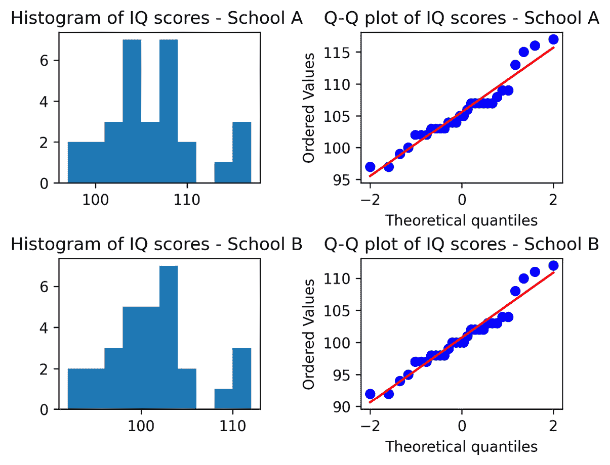

图 4.11 – 评估两所学校 IQ 分数的正态性

我们可以看到正态性假设得到满足。我们还可以通过观察直方图假设方差齐性假设得到支持。如果需要，以下是一个额外的 F 检验来检查方差齐性假设：

```py
# F-test
import numpy as np
import scipy.stats as stats
IQscoresA = np.array(IQscoresA)
IQscoresB = np.array(IQscoresB)
f = np.var(IQscoresA, ddof=1)/np.var(IQscoresB, ddof=1) # F statistic
dfA = IQscoresA.size-1 #degrees of freedom A
dfB = IQscoresB.size-1 #degrees of freedom B
p = 1-stats.f.cdf(f, dfA, dfB) #p-value
```

前述代码的输出告诉我们 F 检验统计量是 0.9963，相应的 p 值是 0.50394 > 0.05（0.05 是显著性水平），因此我们未能拒绝零假设。这意味着有足够的证据表明这两个样本的标准差是相等的。

我们现在定义零假设和备择假设：

H 0 : μ A = μ B,

H a : μ A ≠ μ B.

我们选择显著性水平 α=0.05。我们使用 `statsmodels.stats.weightstats.ttest_ind` 函数进行 t 检验。文档可以在这里找到：[`www.statsmodels.org/dev/generated/statsmodels.stats.weightstats.ttest_ind.xhtml`](https://www.statsmodels.org/dev/generated/statsmodels.stats.weightstats.ttest_ind.xhtml)。

我们可以使用此函数通过 `alternative='two-sided'`，`'larger'` 或 `'smaller'` 来执行备择假设的三种形式。在合并方差 t 检验中，当满足方差相等的假设时，检验统计量的计算如下：

t =  (‾ x 1 − ‾ x 2) − (μ 1 − μ 2)  _____________  s p √ _  1 _ n 1 +  1 _ n 2

在这里，_ x 1, _ x 2, μ 1, μ 2, n 1, 和 n 2 分别是两个样本 1 和 2 的样本均值、总体均值和样本大小，这里给出了合并标准差：

s p = √ ________________   (n 1 − 1) s 1 2 + (n 2 − 1) s 2 2  ________________  n 1 + n 2 − 2

自由度在这里显示：

df = n 1 + n 2 − 2.

让我们回到例子：

```py
from statsmodels.stats.weightstats import ttest_ind as ttest
t_statistic, p_value, degree_freedom = ttest(IQscoresA,
    IQscoresB, alternative='two-sided', usevar='pooled')
```

输出返回的检验统计量是 3.78，p 值是 0.00037，t 检验中使用的自由度是 58（每个样本大小有 30 个观测值，因此自由度计算为 30 + 30 - 2 = 58）。

因为 p 值 <0.05，我们拒绝零假设。有足够的证据表明，高中 A 和 B 的学生平均智商分数之间存在差异。为了进行置信水平测试，你可以适应单样本 t 检验最后一部分中的 Python 代码。

回想一下，在某些情况下，如果直方图和 QQ 图显示一些偏斜的证据，我们可以考虑在假设检验中测试中位数而不是均值。如*第二章**，数据分布*所示，我们可以执行数据转换（例如，对数转换）以获得正态性假设。转换后，`log(data)` 的中位数等于 `log(data)` 的均值。这意味着测试是在转换数据的均值上进行的。

## 双样本 t 检验 – Welch 的 t 检验

这是一个实际的双样本 t 检验，当数据呈正态分布但总体标准差未知且不相等时。我们对于正态性的假设与合并 t 检验相同，但在进行 Welch 的 t 检验时，我们可以放宽方差相等的假设。让我们考虑以下例子，其中我们有两个样本数据集：

```py
sample1 = np.array([2,3,4,2,3,4,2,3,5,8,7,10])
sample2 = np.array([30,26,32,34,28,29,31,35,36,33,32,27])
```

我们假设独立性得到满足，但我们将检查这两个样本的正态性和等方差假设，如下所示：

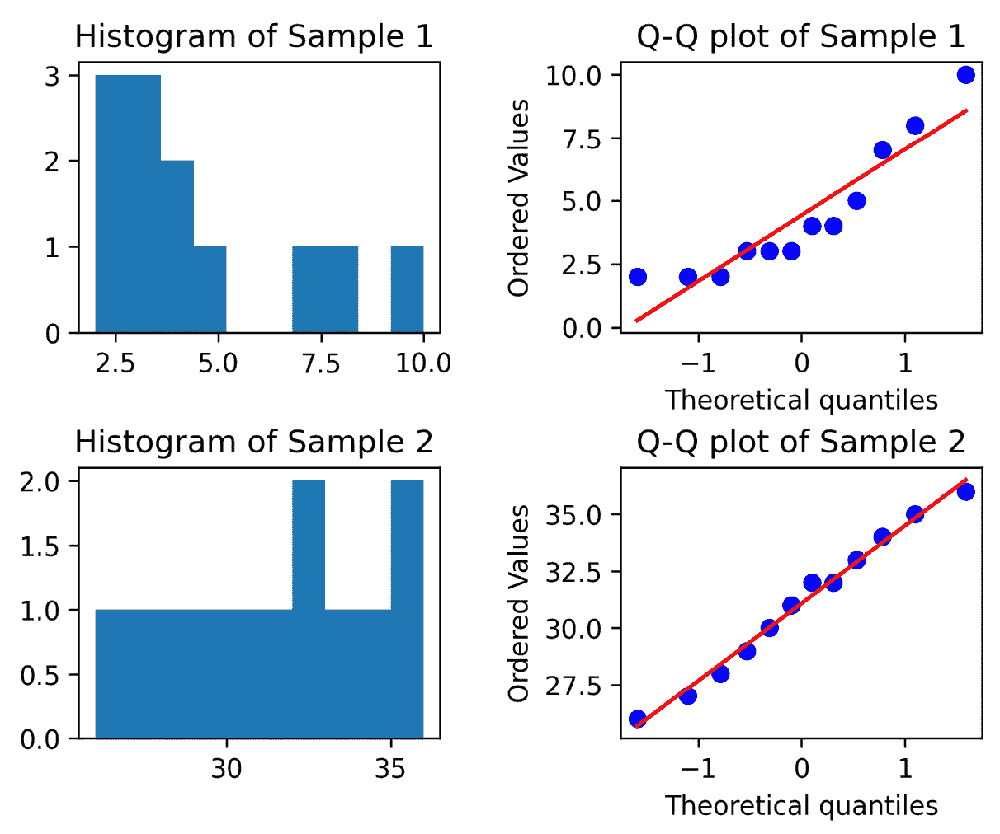

图 4.12 – 检查 Welch 的 t 检验的等方差

通过查看*图 4.12*中直方图的*x*轴刻度，可以强烈地看出标准差不等的证据。让我们假设正态性假设得到满足。在这种情况下，进行双样本合并 t 检验不是一个好主意，但 Welch 的 t 检验就足够了。这里给出了零假设和备择假设：

H 0 :  μ 1 = μ 2

H a :  μ 1 ≠ μ 2

我们指定显著性水平为 0.05。为了计算检验统计量和 p 值，我们实现以下代码：

```py
import scipy.stats as stats
t_statistic, p_value = stats.ttest_ind(sample1, sample2,
    equal_var = False)
```

检验统计量为-22.47，p 值<0.05（显著性水平）。我们拒绝零假设。有强有力的证据表明样本数据 1 的均值与样本数据 2 的均值不同。

## 配对 t 检验

配对 t 检验也称为匹配对或相关 t 检验，在研究样本中的每个元素被测试两次（前测和后测或重复测量）且研究人员认为存在某些相似性（如家庭）时使用。这里列出了假设：

+   差异呈正态分布

+   差异在观察之间是独立的，但从一个测试到另一个测试是相关的

配对 t 检验在许多研究中被使用，尤其是在与前后治疗相关的医学推理测试中。让我们回顾一下智商测试分数——一位研究人员招募了一些学生，以查看训练前后是否有分数差异，如下表所示：

| **学生** | **训练前分数** | **训练后分数** | **差异** |
| --- | --- | --- | --- |
| A | 95 | 95 | 0 |
| B | 98 | 110 | 12 |
| C | 90 | 97 | 7 |
| D | 115 | 112 | -3 |
| E | 112 | 117 | 5 |

图 4.13 – 训练前和训练后分数

在这种情况下，我们不应使用独立的双样本 t 检验。应该检验差异的均值。我们可以通过直方图和 QQ 图来检查关于正态分布的假设，如下所示：

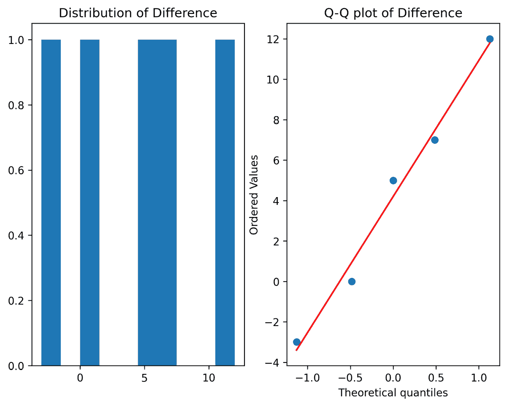

图 4.14 – 检查配对 t 检验的正态性

通过查看 QQ 图，比直方图更能明显地看出数据呈正态分布的证据。

假设差异是独立的。这里给出了零假设和备择假设：

H 0 : μ pos − μ pre = 0

H a : μ pos − μ pre > 0

d i 表示每个学生的训练前分数和训练后分数之间的差异。零假设和备择假设可以重写如下：

H 0 : μ d = 0

H a : μ d > 0

然后，计算检验统计量如下：

t =   _ d  − μ d _  s d _ √ _ n

在这里，_d_ 是差异的样本均值，s_d 是差异的样本标准差。换句话说，配对 t 检验被简化为单样本 t 检验。然而，我们可以直接在 `scipy` 中使用以下函数：

`stats.ttest_rel(data_pos, data_pre, alternative = {'two-sided', '``less', 'greater'})`

备择假设对应于左尾、右尾或双尾测试。以下是 IQ 测试分数研究示例的 Python 实现：

```py
from scipy import stats
IQ_pre = [95, 98, 90, 115, 112]
IQ_pos = [95, 110, 97, 112, 117]
t_statistic, p_value = stats.ttest_rel(IQ_pos, IQ_pre, alternative = 'greater')
```

测试统计量是 1.594，p 值是 0.093。因此，鉴于 p 值<0.05 和显著性水平α=0.05，我们拒绝零假设。有足够的证据表明，培训对智商分数有显著影响。

# 多组测试和方差分析

在前一章和前几节中，我们介绍了两组之间的测试。在本节中，我们将介绍两种测试组间差异的方法，如下：

+   使用**Bonferroni 校正**的成对测试

+   方差分析

当测试两个以上组之间的差异时，我们不得不使用多个测试，这会影响我们的**I 型**错误率。有几种方法可以控制错误率。我们将看到如何利用 Bonferroni 校正来控制**I 型**错误率。我们还将在本节中讨论方差分析，它用于测试多个组之间的均值差异。

## 多次显著性测试

在前几节中，我们探讨了如何比较两组。在本节中，我们将考虑在存在两个以上组时如何进行测试。让我们再次考虑工厂示例，其中我们在工厂地面上有几种机器模型（模型 A、模型 B 和模型 C），这些机器在工厂中用于执行相同的操作。一个有趣的问题可能是：*是否有一种机器模型比其他两种模型的平均输出更高？* 为了做出这个判断，我们需要进行三个测试，比较每个模型的均值差异与其他模型，测试均值差异是否不同于零。这些是我们需要测试的零假设：

μ_output,A − μ_output,B = 0

μ_output,B − μ_output,C = 0

μ_output,A − μ_output,C = 0

在进行多重测试时，我们需要应用 p 值校正以控制预期的错误率。回想一下，在 *第三章*“假设检验”中，我们定义了假设检验的预期错误率为 α。这是我们预期一个 *单个* 假设检验会导致 *I 类* 错误的比率。在我们的工厂机器示例中，我们进行了三个假设检验，这意味着 *我们犯 I 类错误的概率是三倍*。虽然我们的例子具体考虑了均值差异的多重测试，但这适用于任何类型的假设检验。在这些多重测试的情况下，我们通常会定义一个 **家族错误率**（**FWER**）并应用 p 值校正以控制 FWER。FWER 是从一组假设检验中犯 *I 类* 错误的概率。该组内测试的错误率是 **个体错误率**（**IER**）。我们将如下定义 IER 和 FWER：

+   **IER**: 个体假设检验的预期 *I 类* 错误率

+   **FWER**: 一组假设检验的预期 *I 类* 错误率

我们将在本节中讨论一种 p 值校正方法，以提供对推理的直观理解。

### Bonferroni 校正

调整 p 值以控制多重假设检验的一种方法是 Bonferroni 校正。Bonferroni 校正通过均匀降低测试系列中每个单个测试的显著性水平来控制 FWER。鉴于我们在一个系列中有 m 个测试，每个测试的 p 值为 p_i，那么 p 值校正如下所示：

p_i ≤ α_m

以我们之前提到的三种机器模型为例，我们有一个包含三个测试的测试系列，使得 m = 3。如果我们让 FWER 为 0.05，那么，使用 Bonferroni 校正，三个单个测试的显著性水平如下：

0.05 * 3 = 0.0167

因此，在这个例子中，任何单个测试都需要有一个 p 值为 0.0167 才能被认为是显著的。

对 I 类和 II 类错误的影响

如前所述，Bonferroni 校正降低了单个测试的显著性水平，以控制家族级别的 *I 类* 错误率。我们还应该考虑这种变化如何影响 *II 类* 错误率。一般来说，降低单个测试的显著性水平会增加该测试犯 *II 类* 错误的可能性（正如 Bonferroni 校正所做的那样）。虽然我们只在本节中讨论了 Bonferroni 校正，但还有其他 p 值校正方法，它们提供了不同的权衡。请查看 `statsmodels` 中 `multipletests` 的文档，以查看 `statsmodels` 中实现的 p 值校正列表。

让我们通过一个例子来看看如何使用来自*UCI 机器学习仓库*的*Auto MPG*数据集的每加仑英里数（MPG）数据，该数据集的链接为：[`archive.ics.uci.edu/ml/datasets/Auto+MPG`](https://archive.ics.uci.edu/ml/datasets/Auto+MPG) [1]。此数据集包含各种属性，包括`origin`、`mpg`、`cylinders`和`displacement`，涵盖了 1970 年至 1982 年间生产的车辆。我们在这里展示分析的简略形式；完整分析包含在本章代码仓库中的笔记本中。

对于这个例子，我们将使用`mpg`和`origin`变量，并在显著性水平 0.01 下测试不同来源的`mpg`是否存在差异。组均值如下表所示（在此数据集中，`origin`是一个整数编码标签）。

| `origin` | `mpg` |
| --- | --- |
| 1 | 20.0 |
| 2 | 27.9 |
| 3 | 30.5 |

图 4.15 – 每个来源组的车辆 MPG 均值

对每个均值进行 t 检验，我们得到以下 p 值：

| **零假设** | **未校正的 p 值** |
| --- | --- |
| μ1 − μ2 = 0 | 7.946116336281346e-12 |
| μ1 − μ3 = 0 | 4.608511957238898e-19 |
| μ2 − μ3 = 0 | 0.0420926104552266 |

图 4.16 – 每组之间 t 检验的未校正 p 值

对 p 值应用 Bonferroni 校正，我们得到以下 p 值：

| **零假设** | **校正后的 p 值（Bonferroni）** |
| --- | --- |
| μ1 − μ2 = 0 | 2.38383490e-11 |
| μ1 − μ3 = 0 | 1.38255359e-18 |
| μ2 − μ3 = 0 | 0.126277831 |

图 4.17 – 每组之间 t 检验的校正 p 值

在先前的 p 值基础上，在显著性水平 0.01 下，拒绝组 1 和组 2 均值差异以及组 1 和组 3 均值差异的零假设，但未能拒绝组 2 和组 3 均值差异的零假设。

其他 p 值校正方法

在本节中，我们只讨论了一种 p 值校正方法——Bonferroni 校正，以提供对 p 值校正理由的直观理解。然而，还有其他校正方法可能更适合你的问题。要查看`statsmodels`中实现的 p 值校正方法列表，请检查`statsmodels.stats.multitest.multipletests`的文档。

## 方差分析

在上一节关于多重显著性检验中，我们看到了如何执行多重检验以确定组间均值是否存在差异。当处理组均值时，一个有用的第一步是进行方差分析。ANOVA 是一种用于确定多个组均值之间是否存在差异的统计检验。零假设是没有均值差异，备择假设是均值不全相等。由于 ANOVA 检验均值差异，它通常在执行成对假设检验之前使用。如果 ANOVA 的零假设未能被拒绝，则不需要执行成对检验。然而，如果 ANOVA 的零假设被拒绝，则可以进行成对检验以确定哪些特定的均值存在差异。

ANOVA 与成对检验的比较

虽然成对检验是检验组间差异的一般程序，但 ANOVA 只能用于检验均值差异。

在这个例子中，我们将再次考虑来自 *Auto MPG* 数据集的车辆 MPG。由于我们已运行成对检验并发现基于来源的车辆平均 mpg 存在显著差异，我们预计 ANOVA 将提供积极的检验结果（拒绝零假设）。执行 ANOVA 计算后，我们得到以下输出。小的 p 值表明我们应该拒绝零假设：

```py
anova = anova_oneway(data.mpg, data.origin, use_var='equal')
print(anova)
# statistic = 98.54179491075868
# pvalue = 1.915486418412936e-35
```

这里展示的方差分析（ANOVA）是简化的。要查看完整的代码，请参阅本章代码仓库中相关的笔记本。

在本节中，我们介绍了对多于两组数据进行假设检验的方法。第一种方法是带有 p 值校正的成对检验，这是一种通用方法，可用于任何类型的假设检验。我们介绍的另一种方法是 ANOVA，这是一种用于检验组均值差异的特定检验。这不是一种像成对检验那样的通用方法，但可以用作在执行均值差异的成对检验之前的一个步骤。在下一节中，我们将介绍另一种可以用来确定两组数据是否相关的参数检验类型。

## 皮尔逊相关系数

**皮尔逊相关系数**，也称为皮尔逊 *r*（当应用于总体数据时称为皮尔逊 rho (*ρ*)）或**皮尔逊积矩样本相关系数（PPMCC**），是一种双变量检验，用于衡量两个变量之间的线性相关性。该系数产生一个介于-1 到 1 之间的值，其中-1 表示强烈的负相关性，1 表示强烈的正相关性。零值的系数表示两个变量之间没有相关性。弱相关性通常被认为是介于 +/- 0.1 和 +/- 0.3 之间，中等相关性是介于 +/- 0.3 和 +/- 0.5 之间，强相关性是介于 +/- 0.5 到 +/- 1.0 之间。

这个测试被认为是参数测试，但不需要假设正态分布或方差齐性。然而，数据必须是独立采样的（既随机选择又无序列相关性），具有有限的方差——例如具有非常重尾部的分布——并且是连续数据类型。该测试不指示输入变量和响应变量；它只是两个变量之间线性关系的度量。该测试使用标准化协方差来推导相关性。回想一下，标准化需要将一个值除以标准差。

这里展示了总体皮尔逊系数ρ的方程：

ρ =  σ xy _ σ x σ y

这里，σ xy 是总体协方差，计算如下：

σ xy =  ∑ i=1 N  (x i − μ x)(y i − μ y)  ______________ N

这里展示了样本皮尔逊系数 r 的方程：

r =  S xy _ S x S y

这里，S xy 是样本协方差，计算如下：

S xy =  ∑ i=1 n  (x i −  _ x )(y i −  _ y )  _____________  n − 1

在 Python 中，我们可以使用`scipy`的`scipy.stats.pearsonr`函数执行此测试。在下面的代码片段中，我们使用`numpy`生成两个正态分布的随机数数据集。我们想要测试两个组之间是否存在相关性，因为它们有一些显著的重叠：

```py
from scipy.stats import pearsonr
import matplotlib.pyplot as plt
import scipy.stats as stats
import seaborn as sns
import pandas as pd
import numpy as np
mu1, sigma1 = 0, 1.1
normally_distributed_1 = np.random.normal(mu1, sigma1, 1000)
mu2, sigma2 = 0, 0.7
normally_distributed_2 = np.random.normal(mu2, sigma2,
    1000)
df_norm = pd.DataFrame({'Distribution':['Distribution 1' for i in range(len(normally_distributed_1))] + ['Distribution 2' for i in range(len(normally_distributed_2))], 'X':np.concatenate([normally_distributed_1, normally_distributed_2])})
```

在*图 4**.18*中，我们可以观察到两个相关分布的重叠方差：

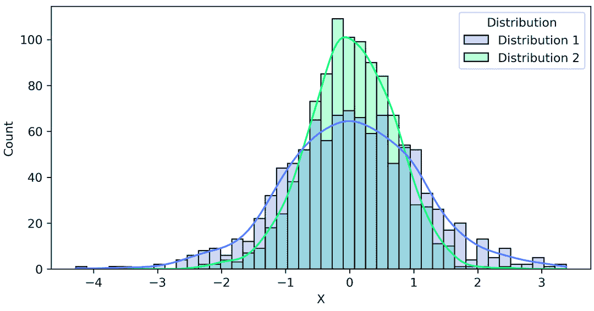

图 4.18 – 相关分布

在图*4**.18*中显示的图中，我们可以看到总体之间的重叠。现在，我们想要使用`pearsonr()`函数测试相关性，如下所示：

```py
p, r = pearsonr(df_norm.loc[df_norm['Distribution'] == 'Distribution 1', 'X'], df_norm.loc[df_norm['Distribution'] == 'Distribution 2', 'X'])
print("p-value = %.4f"%p)
print("Correlation coefficient = %.4f"%r)
```

下面的输出表明，在 0.05 的显著性水平下，我们有一个 0.9327 的相关性水平（p 值为 0.0027）：

`p-value =` `0.0027`

`相关系数 =` `0.9327`

为了以不同的方式表达相关性，我们可以说，在分布 2 中，由分布 1 解释的方差水平（r 2，也称为**拟合优度**或**确定系数**）为 0.9327 2 = 87%，假设我们知道分布 2 是对分布 1 的反应。否则，我们可以说两个变量之间存在 0.93 的相关性或 87%的方差解释水平。

现在，让我们看看 R 中的*Motor Trend Car Road Tests*数据集，我们使用`statsmodels datasets.get_rdataset`函数导入它。这里，我们有前五行，它们包含每加仑英里数（`mpg`）、气缸数（`cyl`）、发动机排量（`disp`）、马力（`hp`）、后轴齿轮比（`drat`）、重量（`wt`）、驾驶四分之一英里所需的最短时间（`qsec`）、发动机形状（`vs=0`表示 v 形，`vs=1`表示直列），变速器（`am=0`表示自动，`am=1`表示手动）、齿轮数（`gear`）和化油器数（`carb`）（如果不是喷射燃料）：

```py
import statsmodels.api as sm
df_cars = sm.datasets.get_rdataset("mtcars","datasets").data
```

在图 4.19 中，我们可以看到数据集的前五行，其中包含适合皮尔逊相关分析的数据。

| **mpg** | **cyl** | **disp** | **hp** | **drat** | **wt** | **qsec** | **Vs** | **am** | **gear** | **carb** |
| --- | --- | --- | --- | --- | --- | --- | --- | --- | --- | --- |
| 21 | 6 | 160 | 110 | 3.9 | 2.62 | 16.46 | 0 | 1 | 4 | 4 |
| 21 | 6 | 160 | 110 | 3.9 | 2.875 | 17.02 | 0 | 1 | 4 | 4 |
| 22.8 | 4 | 108 | 93 | 3.85 | 2.32 | 18.61 | 1 | 1 | 4 | 1 |
| 21.4 | 6 | 258 | 110 | 3.08 | 3.215 | 19.44 | 1 | 0 | 3 | 1 |
| 18.7 | 8 | 360 | 175 | 3.15 | 3.44 | 17.02 | 0 | 0 | 3 | 2 |

图 4.19 – mtcars 数据集的前五行

使用数据集，我们可以使用以下代码绘制相关矩阵，该代码显示了数据集中所有特征的成对相关，以了解它们之间的关系：

```py
sns.set_theme(style="white")
corr = df_cars.corr()
f, ax = plt.subplots(figsize=(15, 10))
cmap = sns.diverging_palette(250, 20, as_cmap=True)
sns.heatmap(corr, cmap=cmap, vmax=.4, center=0,
            square=True, linewidths=.5, annot=True)
```

假设我们对于对四分之一英里时间（`qsec`）最有意义的变量感到好奇。在*图 4**.20*中，通过观察`qsec`的线条，我们可以看到`vs`（V 形）与 0.74 的正相关。由于这是一个二元变量，我们可以根据这个数据集假设，直列发动机比 V 形发动机更快。然而，还有其他与显著相关的协变量。例如，与发动机形状几乎同样强烈相关的是马力，即随着马力的增加，四分之一英里运行时间会下降：

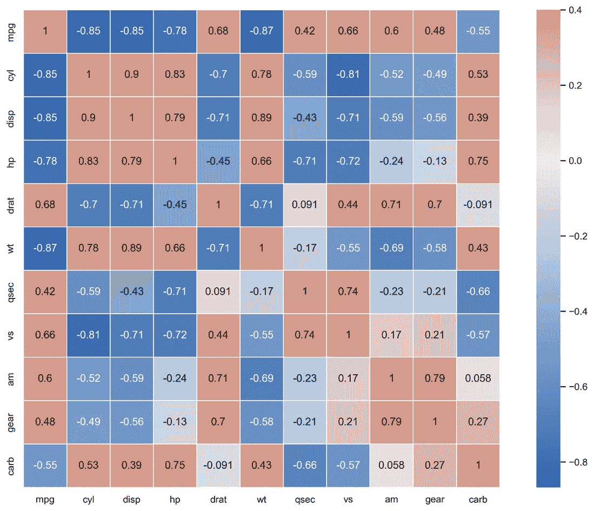

图 4.20 – 相关矩阵热图

相关矩阵对于探索多个变量之间的关系非常有用。它也是构建统计和**机器学习**（**ML**）模型，如线性回归时进行特征选择的有用工具。

## 功率分析示例

功率分析是一种统计方法，用于确定假设检验所需的适当样本大小，以便在防止*第二类*错误（即当零假设应该被拒绝时未能拒绝零假设）时具有足够的功效。功率分析还可以根据样本大小确定可检测的效果量（或差异）之间的差异。换句话说，基于特定的样本大小和分布，功率分析可以为分析师提供研究人员可能能够可靠地识别的特定最小差异。在本节中，我们将通过单样本 t 检验演示功率分析。

### 单样本 t 检验

假设一家制造商销售一种每月能生产 100,000 个单位的机器，标准差为 2,800 个单位。一家公司购买了这些机器中的一批，并发现它们只能生产 90,000 个单位。该公司想知道需要多少台机器才能以高置信度确定这些机器无法生产 100,000 个单位。以下功率分析表明，对于 t 检验，需要三个机器的样本，以 85% 的概率防止未能识别出实际机器性能与市场宣传机器性能之间的统计显著差异：

```py
from statsmodels.stats.power import TTestPower
import numpy as np
# Difference of distribution mean and the value to be assessed divided by the distribution standard deviation
effect_size = abs(100000-90000) / 2800
powersTT = TTestPower()
result = powersTT.solve_power(effect_size, nobs=3, alpha=0.05, alternative='two-sided')
print('Power based on sample size:{}'.format(round(result,2)))
# Power based on sample size: 0.85
```

### 额外的功率分析示例

要查看 Python 中功率分析的更多示例，请参阅本书的 GitHub 仓库。在那里，我们有额外的 t 检验和 F 检验的示例，这些示例专注于分析样本组之间的方差。

# 摘要

本章涵盖了参数检验的主题。从参数检验的假设开始，我们确定了测试这些假设被违反的方法，并讨论了在所需假设未满足时可以假设稳健性的场景。然后，我们研究了 z 检验的最流行替代方案之一，即 t 检验。我们通过多次应用此测试，包括使用合并、配对和 Welch 的非合并版本进行双样本分析的单样本和双样本版本的测试。接下来，我们探讨了方差分析技术，其中我们研究了如何使用来自多个组的数据来识别它们之间的统计显著差异。这包括当存在大量组时对 p 值的最流行调整之一——Bonferroni 校正，它有助于在执行多个测试时防止 *I 类错误* 的膨胀。然后，我们研究了使用 Pearson 相关系数对连续数据进行相关性分析，以及如何使用相关性矩阵和相应的热图来可视化相关性。最后，我们简要概述了功率分析，并举例说明了如何使用单样本 t 检验进行此分析。在下一章中，我们将讨论非参数假设检验，包括在本章中与参数检验配对的测试以及当假设不能安全假设时的新测试。

# 参考文献

[1] *Dua, D.* 和 *Graff, C.* (*2019*). *UCI 机器学习仓库* [[`archive.ics.uci.edu/ml`](http://archive.ics.uci.edu/ml)]. *Irvine, CA: 加州大学信息与计算机科学学院*。
