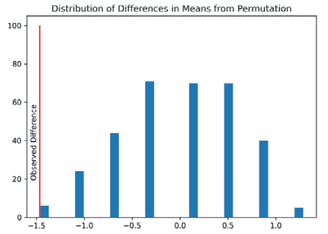
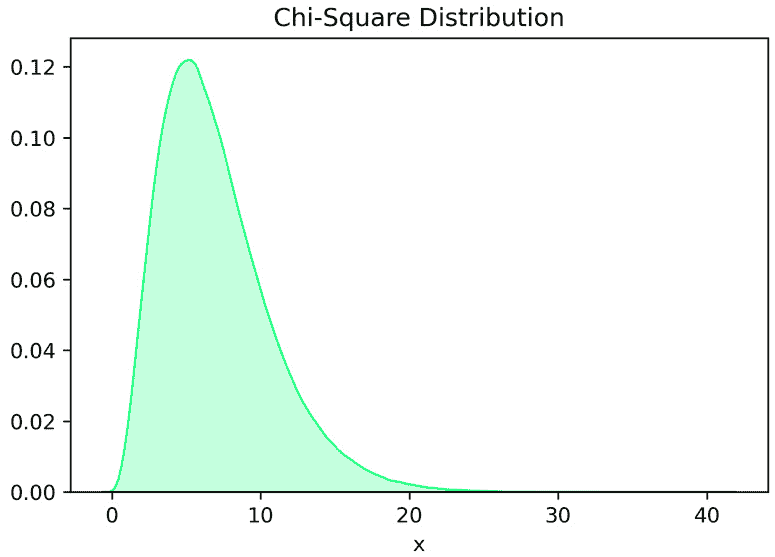

# 第五章：非参数检验

在上一章中，我们讨论了参数检验。参数检验在满足测试假设时是有用的。然而，也存在一些情况，这些假设并不成立。在本章中，我们将讨论几种非参数检验，这些检验可以作为上一章中介绍的参数检验的替代方案。我们首先介绍非参数检验的概念。然后，我们将讨论几种在 t 检验或 z 检验假设不满足时可以使用的非参数检验。

在本章中，我们将涵盖以下主要主题：

+   当违反参数检验假设时

+   秩和检验

+   有符号秩检验

+   克鲁斯卡尔-沃利斯检验

+   卡方检验

+   斯皮尔曼相关分析

+   卡方功效分析

# 当违反参数检验假设时

在上一章中，我们讨论了参数检验。参数检验具有强大的统计功效，但也需要遵守严格的假设。当假设不满足时，测试结果无效。幸运的是，我们有替代测试可以在参数检验的假设不满足时使用。这些测试被称为**非参数**测试，这意味着它们对数据的潜在分布**不做任何假设**。虽然非参数测试不需要分布假设，但这些**测试仍然要求样本**是独立的。

## 排列检验

对于第一个非参数测试，让我们更深入地看看 p 值的定义。p 值是在零假设的假设下，获得至少与观察值一样极端的测试统计量的**概率**。然后，为了计算 p 值，我们需要零分布和观察到的统计量。p 值是具有比观察到的统计量更极端的测试统计量的样本比例。结果是我们可以使用数据排列来构建零分布。让我们看看如何使用以下数据集构建零分布。这个数据集可以代表低温和高温下的机器故障计数。我们假设样本是独立的：

```py
low_temp = np.array([0, 0, 0, 0, 0, 1, 1])
high_temp = np.array([1, 2, 3, 1])
```

为了构建零假设，我们首先需要确定一个统计量。在这种情况下，我们将寻找两个分布的均值差异。因此，我们的统计量将如下所示：

_ x  lowtemp −  _ x  hightemp

现在，为了计算分布值，计算数据集所有排列的统计量。这里有几个数据集排列的例子。

| **标签** | **观察值** | **P1** | **P2** | **P3** | **P4** | **P5** | **…** |
| --- | --- | --- | --- | --- | --- | --- | --- |
| 低 | 0 | 1 | 0 | 1 | 0 | 1 | … |
| 低 | 0 | 1 | 3 | 0 | 3 | 0 | … |
| 低 | 0 | 0 | 0 | 1 | 1 | 3 | … |
| 低 | 0 | 1 | 1 | 0 | 2 | 0 | … |
| 低 | 0 | 0 | 1 | 2 | 0 | 1 | … |
| 低 | 1 | 1 | 1 | 3 | 0 | 1 | … |
| 低 | 1 | 0 | 1 | 1 | 1 | 0 | … |
| 高 | 1 | 0 | 2 | 0 | 1 | 2 | … |
| 高 | 2 | 3 | 0 | 0 | 0 | 1 | … |
| 高 | 3 | 0 | 0 | 1 | 1 | 0 | … |
| 高 | 1 | 2 | 0 | 0 | 0 | 0 | … |
| 平均差值 | -1.46 | -0.68 | 0.5 | 0.89 | 0.5 | 0.11 | … |

图 5.1 – 观察数据的头五个排列及平均差值

表格显示了带有五个随机生成的值排列的观察数据。我们计算每个排列的平均差值。平均差值是零分布的值。一旦我们有了分布，我们就可以计算 p 值，作为比观察值更极端的值的比例。

排列计算的缩放

通常，由于分布的大小与排列的数量迅速增长，排列检验的计算可能非常昂贵。例如，3、5 和 7 个样本大小的数据集对应于 6、120 和 5,040 个排列大小。这里所示的数据集有超过 3,900 万个排列！在大型数据集上进行排列检验的运行性能可能会因为计算零分布所需的排列数量而变得缓慢。

我们可以使用 `scipy` 中的 `permutation_test` 函数在 Python 中执行排列检验。此函数计算检验统计量、零分布和 p 值：

```py
def statistic_function(set_one, set_two):
      return np.mean(set_one) - np.mean(set_two)
random_gen=42
perm_result = sp.stats.permutation_test(
      (low_temp, high_temp) ,
      statistic_function, random_state=random_gen,
)
```

此函数从数据集中生成以下分布。



图 5.2 – 排列检验的零分布

排列检验的零分布和两组平均差值从 *图 5.2* 中显示。排列检验的 p 值为 0.036。排列检验是本节将要介绍的非参数检验中的第一个。再次强调，当不满足参数检验的假设时，这些类型的检验是有用的。*然而，如果可以使用参数检验，则应使用它*；非参数检验不应作为默认方法。

在本节中，我们介绍了使用排列检验的非参数检验。排列检验是一种广泛适用的非参数检验，但随着数据集大小的增加，排列的计算量会迅速增长，这可能在某些情况下使其使用变得不切实际。在接下来的几节中，我们将介绍其他几种不需要计算零分布的非参数检验。

# 排序和总和检验

当 t 检验的假设不成立时，Rank-Sum 检验通常是一个很好的非参数替代检验。虽然 t 检验可以用来检验两个分布的*均值差异*，但 Rank-Sum 检验用于检验两个分布的*位置差异*。这种检验效用上的差异是由于 Rank-Sum 检验中缺乏参数假设。Rank-Sum 检验的零假设是第一个样本的分布与第二个样本相同。如果样本分布看起来相似，这允许我们使用 Rank-Sum 检验来检验两个样本的位置差异。如前所述，Rank-Sum 检验不能专门用于检验均值差异，因为它不需要关于样本分布的假设。

## 检验统计量程序

检验程序很简单。过程在此概述，以下表格中展示了示例：

1.  将所有样本值合并成一个集合，并按升序排序样本，同时记录它们的标签。

1.  将排名分配给所有样本，从最低样本值开始，排名为 1。

1.  当出现平局时，将平局值的排名替换为平局值的平均排名。

1.  将最小样本组的排名求和，该样本组是检验统计量 T。

一旦计算出检验统计量，就可以计算 p 值。p 值可以通过正态近似法或精确方法来计算。通常，精确方法仅在样本量较小（小于 8 个样本）时使用。

## 正态近似

一旦计算出 Rank-Sum 检验的 T 统计量，我们就可以使用精确方法或正态近似法来确定 p 值。在这里，我们将介绍近似方法，因为精确方法需要使用排列检验，这将需要使用软件。我们将使用 z 分数来近似 p 值（回忆一下*第三章**,* *假设检验*）：

Z = T - Mean(T) * STDEV(T)

其中

Mean(T) = n * T * R

and

STDEV(T) = s * R / √(n * T * n * O + n * T + n * O)

在这里的方程中，n * T 是用于计算 T 的组中样本的数量，n * O 是另一组中的样本数量，_R 是修正排名的平均值，s * R 是修正排名的标准差。一旦计算出 Z，就可以在 z 分布中查找相应的 p 值。在描述了方法之后，让我们来看一个例子。以下表格中的数据可以在附带的 Jupyter 笔记本中找到。

## Rank-Sum 示例

下表展示了在两组标记为“L”和“H”的数据集上执行此过程，将使用秩和检验来检验两组样本分布的位置差异。此表的检验统计量为 42.5，即组 L 校正秩的和。此检验统计量对应于约 0.00194 的近似 p 值（双尾检验）。此表的数据是从[`github.com/OpenIntroStat/openintro/raw/master/data/gpa_iq.rda`](https://github.com/OpenIntroStat/openintro/raw/master/data/gpa_iq.rda)下载的。

| **IQ** | **Group** | **Rank** | **Corrected Rank** |
| --- | --- | --- | --- |
| 77 | L | 1 | 1 |
| 79 | L | 2 | 2 |
| 93 | L | 3 | 3 |
| 96 | L | 4 | 4 |
| 104 | L | 5 | 5 |
| 105 | H | 6 | 6 |
| 106 | H | 7 | 7 |
| 107 | L | 8 | 8 |
| 109 | L | 9 | 9 |
| **IQ** | **Group** | **Rank** | **Corrected Rank** |
| 111 | H | 10 | 10.5 |
| 111 | L | 11 | 10.5 |
| 112 | H | 12 | 12 |
| 116 | H | 13 | 13 |
| 118 | H | 14 | 14 |
| 124 | H | 15 | 15 |
| 126 | H | 16 | 16 |
| 127 | H | 17 | 17 |
| 128 | H | 18 | 18.5 |
| 128 | H | 19 | 18.5 |

图 5.3 – 秩和检验的校正秩

我们也可以使用软件通过`mannwhitenyu`从`scipy`执行此测试。对于以下代码示例，前表中对应于 L 和 H 的值包含在`lower_score_iqs`和`higher_score_iqs`变量中，分别：

```py
mannwhitneyu(higher_score_iqs, lower_score_iqs).pvalue
# 0.00222925216588146
```

在本节中，我们讨论了秩和检验，它是一种非参数的 t 检验替代方法。秩和检验用于检验两组样本数据的分布位置是否存在差异。在下一节中，我们将探讨一种类似的基于秩的检验，该检验用于比较配对数据，例如来自*第四章**，*参数检验*中的配对 t 检验。

# 符号秩检验

Wilcoxon 符号秩检验是非参数配对 t 检验的替代版本，当违反正态性假设时使用。由于在零假设和备择假设中使用秩和中位数而不是均值，因此该检验对异常值具有鲁棒性。正如检验的名称所示，它使用两个阶段之间差异的幅度及其符号。

在研究中，零假设考虑阶段 1 和阶段 2 之间的中位数差异为零。同样，在配对 t 检验中，对于备择假设，对于双尾检验，阶段 1 和阶段 2 之间的中位数差异被认为不是零，或者对于单尾检验，阶段 1 和阶段 2 之间的中位数差异大于（或小于）零。

虽然正态性要求放宽，但该检验要求配对观测值之间相互独立，并且这些观测值来自同一总体。此外，要求因变量是连续的。

为了计算检验统计量，有以下步骤：

1.  计算两个阶段之间每对的差异。

1.  如果存在，则删除差值为零的配对。

1.  计算每对之间的绝对差值，并按从小到大的顺序对它们进行排序。

1.  通过对具有正号的秩求和来计算符号秩统计量 S。

让我们考虑以下简单示例。我们考虑两个阶段（治疗前后）的九个样本的通用数据。

| **配对** | **治疗前的** | **治疗后的** | **绝对差值** | **符号** | **秩** |
| --- | --- | --- | --- | --- | --- |
| 1 | 37 | 38 | 1 | - | 1 |
| 2 | 14 | 17 | 3 | - | 2.5 |
| 3 | 22 | 19 | 3 | + | 2.5 |
| 4 | 12 | 7 | 5 | + | 4 |
| 5 | 24 | 15 | 9 | + | 5 |
| 6 | 35 | 25 | 10 | + | 6 |
| 7 | 35 | 24 | 11 | + | 7 |
| 8 | 51 | 38 | 13 | + | 8 |
| 9 | 39 | 19 | 20 | + | 9 |

图 5.4 – 符号秩检验的秩计算演示

通过观察前面的表格，我们可以看到第二对和第三对具有相同的绝对差值。因此，它们的秩通过平均原始秩来计算，(2+3)/2 = 2.5\. 单侧检验的零假设和备择假设如下：

H 0 : 治疗前后中位数差异为零

H a : 治疗前后中位数差异为正

符号秩统计量是正差分的秩之和，如下所示：

S = 2.5 + 4 + 5 + 6 + 7 + 8 + 9 = 41.5.

S 的均值为：

Mean(S) =  n(n + 1) _ 4  =  9.10 _ 4  = 22.5

S 的标准差为：

SD(S) = √ ____________   n(n + 1)(2n + 1)  ____________ 24   = √ _  9 * 10 * 19 _ 24   = 8.44.

然后，通过以下公式计算检验统计量：

Z 统计量 = S − Mean(S) _ SD(S)  = 41.5 − 22.5 _ 8.44  = 2.2511.

参考*第三章**，假设检验*，我们可以使用 `scipy.stats.norm.sf()` 通过 Z 统计量计算近似单侧 `p-value 0.012`。

在 α = 0.05 – 显著性水平 – `p-value <` α 的条件下，我们拒绝零假设。有强有力的证据表明，治疗前的中位数大于治疗后的中位数。在 Python 中，实现该测试很简单，如下所示：

```py
import scipy.stats as stats
import numpy as np
before_treatment = np.array([37, 14, 22, 12, 24, 35, 35, 51, 39])
after_treatment = np.array([38,17, 19, 7, 15, 25, 24, 38, 19])
# Signed Rank Test
stats.wilcoxon(before_treatment, after_treatment, alternative = 'greater')
```

该测试的文档可以在以下链接找到：

[`docs.scipy.org/doc/scipy/reference/generated/scipy.stats.wilcoxon.xhtml`](https://docs.scipy.org/doc/scipy/reference/generated/scipy.stats.wilcoxon.xhtml)

# Kruskal-Wallis 检验

另一种我们现在将讨论的非参数检验是 Kruskal-Wallis 检验。当不满足正态性假设时，它是单因素方差分析测试的替代方案。它使用中位数而不是均值来检验两个或更多独立组之间是否存在统计上显著差异。让我们考虑三个独立组的通用示例：

```py
group1 = [8, 13, 13, 15, 12, 10, 6, 15, 13, 9]
group2 = [16, 17, 14, 14, 15, 12, 9, 12, 11, 9]
group3 = [7, 8, 9, 9, 4, 15, 13, 9, 11, 9]
```

如下所述，陈述了零假设和备择假设。

H 0 : 这三个组的中位数相等

H a : 这三个组的中位数不相等

在 Python 中，通过使用`scipy.stats.kruskal`函数很容易实现。文档可以在以下链接中找到：

[`docs.scipy.org/doc/scipy/reference/generated/scipy.stats.kruskal.xhtml`](https://docs.scipy.org/doc/scipy/reference/generated/scipy.stats.kruskal.xhtml)

```py
from scipy import stats
group1 = [8, 13, 13, 15, 12, 10, 6, 15, 13, 9]
group2 = [16, 17, 14, 14, 15, 12, 9, 12, 11, 9]
group3 = [7, 8, 9, 9, 4, 15, 13, 9, 11, 9]
#Kruskal-Wallis Test
stats.kruskal(group1, group2, group3)
```

上述代码的输出如下：

`KruskalResult(statistic=5.7342701722574905, pvalue=0.056861597028239855)`

由于α = 0.05 – 显著性水平 – 且`p-value >` α，我们未能拒绝零假设。没有强有力的证据表明这三个组的中位数不相等。

# 卡方分布

研究人员经常面临需要对分类数据进行假设检验的需求。在*第四章**，参数检验*中涵盖的参数检验通常对这类分析帮助不大。在上一章中，我们讨论了使用 F 检验来比较样本方差。扩展这个概念，我们可以考虑非参数和非对称的卡方概率分布，这是一种有用的分布，用于比较样本方差抽样分布的均值与总体方差，特别是在假设检验下，预期样本方差抽样分布的均值等于总体方差的情况下。因为方差不能为负，所以分布从 0 开始。在这里，我们可以看到**卡方分布**：



图 5.5 – 具有七个自由度的卡方分布

卡方分布的形状不代表百分位数固定在标准差上，就像标准正态分布那样；它预期会随着每个额外样本方差的计算而变化。当可以假设用于计算方差抽样分布的原始总体数据是正态分布时，卡方标准化检验统计量计算如下：

χ² = (n - 1) s² / σ²

其中(n-1)用于计算自由度，这些自由度用于解释在构建统计量时样本误差。临界值基于使用自由度和所需显著性水平的表格查找。零假设始终是 H0: σχ² = σ0²，其中σχ²是观察到的分布方差，σ0²是期望方差。对于单尾检验的备择假设是，当测试右尾时 H1: σχ² ≥ σ0²，当测试左尾时 H1: σχ² ≤ σ0²。对于双尾检验的备择假设是 H1: σχ² ≠ σ0²。当总体数据可以假设为正态分布时，这个测试与 F 测试相似，因为两个方差正在被比较，当两者都相同时结果为 1。区别在于，卡方检验统计量考虑了自由度，因此对差异的敏感性较低。

理解这个测试如何用于比较方差对于理解卡方分布如何与分类数据的出现频率相关是有帮助的。在前面的卡方统计量中，我们可以将样本统计量作为观察值，而方差的总参数是我们期望发生的。在确定分类因素水平出现的统计显著性时，我们可以*比较观察到的发生次数与期望的发生次数*。在接下来的几节中，我们将举例说明这个测试的两个最广泛使用的版本，即**卡方拟合优度检验**和**卡方独立性检验**。这些测试被认为是非参数的，因为它们不需要在*第四章**，*参数检验*中所述的假设。

卡方拟合优度和独立性检验的尾性

在接下来的两节中，卡方拟合优度检验和卡方独立性检验总是右尾检验。这些测试中的零假设陈述观察频率和期望频率之间的差异为零。备择假设是观察频率和期望频率不相同。χ²检验统计量越接近 0，观察频率和期望频率越可能接近。

# 卡方拟合优度

**卡方拟合优度检验**比较单个变量（因素）多个因素水平的出现次数，以确定这些水平是否在统计学上相等。例如，一个供应商向客户提供三种手机型号——单个因素（手机）的三个水平（品牌）——客户每周总共购买平均 90 台手机。我们可以这样说，预期的频率是 1/3——因此，平均每周每种型号销售 30 台手机。皮尔逊卡方检验统计量，通过测量观察到的频率与预期频率之间的差异来计算，是卡方拟合优度检验中使用的检验统计量。此检验统计量的线性方程如下：

χ 2 = ∑ (O i − E i) 2 _ E i , 自由度 = k-1

其中 O i 是观察到的频率，E i 是预期的频率，*k*是因素水平的数量。以我们的手机为例，我们从供应商那里了解到预期的频率 1/3 实际上并不是观察到的；供应商平均销售 45、30 和 15 台 A、B 和 C 型号的手机。假设我们想知道观察到的频率是否与预期的频率有统计学上的显著差异。零假设是频率相等。我们以下列方式制定**皮尔逊卡方检验统计量**：

χ2 =  (45 − 30) 2 _ 30  +  (30 − 30) 2 _ 30  +  (15 − 30) 2 _ 30  = 15

假设我们想使用显著性水平为 0.05 的假设检验（右侧尾），从而形成观察到的频率和预期的频率不相等的备择假设。卡方临界值表显示，对于显著性水平为 0.05，df : 3 − 1 = 2 个自由度，临界值是 5.9915。因为 15 > 5.9915，我们可以根据临界值测试得出拒绝零假设的结论。

在 Python 中执行此操作，我们可以使用`statsmodels.stats.gof`模块的`chisquare`函数。每个组体积需要传递到一个列表或数组中，包括观察到的频率和预期的频率。`statsmodels`的`chisquare`测试将自动根据观察到的（`f_obs`）列表中的值计数来计算 k-1 个自由度，但必须为`scipy chi2.ppf`函数提供自由度，该函数提供临界值，从而避免了手动查找表格的需要：

```py
from statsmodels.stats.gof import chisquare
from scipy.stats import chi2
chi_square_stat, p_value = chisquare(f_obs=[45, 30, 15],
    f_exp=[30, 30, 30])
chi_square_critical_value = chi2.ppf(1-.05, df=2)
print('Chi-Square Test Statistic: %.4f'%chi_square_stat)
print('Chi-Square Critical Value: %.4f'%chi_square_critical_value)
print('P-Value: %.4f'%p_value)
```

如前所述，由于 p 值低于 0.05 的显著性水平，并且检验统计量大于临界值，我们可以假设我们有足够的证据来拒绝零假设，并得出统计显著性结论，表明手机型号不是以相等的数量购买的：

`Chi-Square Test` `Statistic: 15.0000`

`Chi-Square Critical` `Value: 5.9915`

`P-Value: 0.0006`

然后，我们可以重新运行该测试，比较两个频率，例如 45 与 30 或 45 与 15，期望频率分别为 37.5 和 37.5 或 30 和 30，以确定哪部电话可能是销售不平衡的最大影响因素。

# 独立性卡方检验

假设我们有一个德克萨斯州 2021 年观察到的车辆事故数据集，*Restraint Use by Injury Severity and Seat Position* ([`www.txdot.gov/data-maps/crash-reports-records/motor-vehicle-crash-statistics.xhtml`](https://www.txdot.gov/data-maps/crash-reports-records/motor-vehicle-crash-statistics.xhtml))，并想知道使用安全带是否导致了死亡率在统计学上的显著差异。我们有以下观察值表：

|  | **受限制** | **不受限制** | **总计** |
| --- | --- | --- | --- |
| 致命 | 1,429 | 1,235 | 2,664 |
| 非致命 | 1,216,934 | 22,663 | 1,239,597 |
| 总计 | 1,218,363 | 23,898 | 1,242,261 |

图 5.6 – 独立性卡方检验“观察”表

让我们现在使用此方程创建一个期望值表：

E_ij =  T_i * T_j / N

其中 T_i 是第 *i* 行的总数，T_j 是第 *j* 列的总数，N 是观察总数。这得出以下结果：

|  | **受限制** | **不受限制** | **总计** |
| --- | --- | --- | --- |
| 致命 | (2,664 *1,218,363)/1,242,261 = 2,612.75 | (2,664 *23,898)/1,242,261 = 51.25 | 2,664 |
| 非致命 | (1,216,934* 1,239,597) / 1,242,261 = 1,214,324.31 | (1,239,597 * 23,898) / 1,242,261 = 23,846.75 | 1,239,597 |
| 总计 | 1,218,363 | 23,898 | 1,242,261 |

图 5.7 – 独立性卡方检验“期望”表

在拟合优度检验中，我们使用的修改版皮尔逊卡方检验统计量，扩展到独立性卡方检验，如下所示：

χ² = ∑ (O_ij − E_ij)² / E_ij，自由度 = (r-1)(c-1)

下标 *j* 对应于列数据，下标 *i* 对应于观察值和期望值的行数据，分别表示为 *O* 和 *E*。在自由度计算中的 *r* 和 *c* 值对应于表格中的行数和列数（这是 2x2，因此自由度将等于 (2-1)(2-1)=1。

使用观察值和期望值表中的值，我们找到卡方检验统计量等于以下值：

χ² =  (1,429 − 2,612.75)² / 2,612.75 + (1,216,934 − 1,214,324.31)² / 1,214,324.31 + (1,235 − 51.25)² / 51.25 +

(22,663 − 23,846.75)² / 23,846.75 = 27,942.43

使用此处计算的 1 个自由度计算出的查表检验统计量为 3.84。我们可以合理地得出结论，因为检验统计量 27,942.43 大于临界值 3.84，因此我们可以得出结论，在 2021 年德克萨斯州，使用安全带与未使用安全带相比，在车辆事故中的死亡率存在统计学上的显著差异。

卡方列联表

我们进行的测试使用了两个 2x2 的列联表。卡方独立性检验通常被称为**卡方列联检验**。拒绝零假设的失败取决于观察到的表格值在统计置信水平内与预期表格值的匹配。然而，卡方独立性检验可以扩展到**任何行和列组合的表格**。然而，随着行和列值的增加，表格可能对解释不那么有用。

要在 Python 中执行此测试，我们可以使用来自`scipy` `stats`模块的`chi2_contingency`函数。仅输入作为 2x2 `numpy`数组的观察频率，`chi2_contingency`测试提供如果零假设为真时的预期频率——p 值、使用的自由度以及卡方检验统计量：

```py
from scipy.stats import chi2_contingency
from scipy.stats import chi2
import numpy as np
observed_frequencies = np.array([[1429, 1235], [1216934, 22663]])
chi_Square_test_statistic, p_value, degrees_of_freedom, expected_frequencies = chi2_contingency(observed_frequencies)
chi_square_critical_value = chi2.ppf(1-.05, df=degrees_of_freedom)
print('Chi-Square Test Statistic: %.4f'%chi_Square_test_statistic)
print('Chi-Square Critical Value: %.4f'%chi_square_critical_value)
print('P-Value: %.4f'%p_value)
```

在这里，我们可以看到卡方检验统计量在 0.05 的显著性水平上远大于卡方临界值，p 值在 p < 0.0000 时显著。因此，我们可以得出结论，使用安全带与不使用安全带相比，在汽车碰撞死亡人数方面存在很大的统计学差异：

`卡方检验` `统计量：27915.1221`

`卡方临界值：3.8415`

`P 值：0.0000`

Yates 连续性校正

可以选择性地向`chi2_contingency`测试添加一个额外的参数，即带有`correction` `=`参数和一个布尔值（`True`或`False`）的输入。这应用了 Yates 连续性校正，根据`scipy.stats`文档，将每个观察值调整 0.5 个单位，以接近相应的预期值。调整的目的在于避免由于预期样本量小而错误地检测到统计显著性。主观上，这对于预期频率单元格中的样本量少于 10 的情况是有用的。然而，许多实践者和研究人员反对使用它。

# 卡方拟合优度检验功效分析

让我们用一个例子来说明，一个手机销售商销售四种流行的手机型号，型号 A、B、C 和 D。我们想要确定需要多少样本才能产生 0.8 的功效，以便我们可以了解不同手机流行度之间是否存在统计学上的显著差异，这样销售商就可以更恰当地投资于手机采购。在这种情况下，零假设断言每个型号的手机中有 25%被售出。实际上，售出的手机中有 20%是型号 A，30%是型号 B，19%是型号 C，31%是型号 D。

测试`nobs`（观测数）参数的不同值，我们发现至少需要 224 个样本才能产生略大于 0.801 的效力。增加更多样本只会提高这一点。如果真实分布与假设的 25%的均等分割差异更大，则可能需要更少的样本。然而，由于分割相对接近 25%，需要大量的样本：

```py
from statsmodels.stats.power import GofChisquarePower
from statsmodels.stats.gof import chisquare_effectsize
# probs0 asserts 25% of each brand are sold
# In reality, 12% of Brand A, 25% of Brand B, 33% sold were Brand C, and 1% were Brand D.
effect_size = chisquare_effectsize(probs0=[25, 25, 25, 25], probs1=[20, 30, 19, 31], cohen=True)
alpha = 0.05
n_bins=4 # 4 brands of phones
analysis = GofChisquarePower()
result = analysis.solve_power(effect_size, nobs=224, alpha=alpha, n_bins=n_bins)
print('Sample Size Required in Sample 1: {:.3f}'.format(
    result))
# Sample Size Required in Sample 1: 0.801
```

# 斯皮尔曼等级相关系数

在*第四章**，参数检验*中，我们研究了参数相关性系数，皮尔逊相关系数，其中系数是从独立采样的连续数据中计算得出的。然而，**当我们有排名的有序数据**，例如满意度调查中的数据时，我们不想使用皮尔逊相关系数，因为它不能保证保持顺序。与皮尔逊相关系数一样，**斯皮尔曼相关系数**也产生一个系数，*r*，其范围从-1 到 1，-1 表示强烈的负相关，1 表示强烈的正相关。斯皮尔曼相关系数是通过将两个变量等级的协方差除以它们标准差的乘积得到的。相关性系数*r*的方程如下：

r s =  S xy _ √ _ S xx S yy

其中

S xy = ∑ (x i −  _ x )(y i −  _ y )

S xx = ∑ (x i −  _ x )²

S yy = ∑ (y i −  _ y )²

在前面的相关性方程中，在所有排名场景下都是安全的。然而，当没有平局或与总体样本量相比平局比例极低时，可以使用以下方程：

r s =  6∑ d i² _ n(n² − 1)，其中 d i = (x i − y i)

然而，我们将使用 Python 进行此测试。因此，无论公式多么复杂、错误率多么低，都将应用该公式，因为计算能力使我们能够完全绕过手动过程。

假设我们在比赛中由两位评委对学生进行评判，并且担心其中一位评委可能基于混淆因素（如家庭关系）而不是仅基于表现对某些参赛者存在偏见。我们决定对分数进行相关性分析，以检验两位评委对每个参赛者的评分相似的假设：

```py
from scipy.stats import spearmanr
import pandas as pd
df_scores = pd.DataFrame({'Judge A':[1, 3, 5, 7, 8, 3, 9],
                          'Judge B':[2, 5, 3, 9, 6, 1, 7]})
```

我们有以下参赛者的表格：

|  | **学生 1** | **学生 2** | **学生 3** | **学生 4** | **学生 5** | **学生 6** | **学生 7** |
| --- | --- | --- | --- | --- | --- | --- | --- |
| 判定者 A | 1 | 3 | 5 | 7 | 8 | 3 | 9 |
| 判定者 B | 2 | 5 | 3 | 9 | 6 | 1 | 7 |

图 5.8 – 斯皮尔曼相关性分析中评委对学生参赛者的排名

```py
correlation, p_value = spearmanr(df_scores['Judge A'],
    df_scores['Judge B'])
print('Spearman Correlation Coefficient: %.4f'%correlation)
print('P-Value: %.4f'%p_value)
```

根据这里的 p 值为 0.04，小于 0.05 的显著性水平，我们可以说产生的相关性在随机程度之外是显著的。如果 p 值大于 0.05，我们可以以 95%的置信水平说，相关性可能是完全虚假的，可能没有足够的统计证据来支持确定性。Spearman 的相关系数（r）为 0.7748。因此，`r_squared`大约为 0.6003，这意味着大约 60.3%的分数变化是由评委的评分决定的：

`Spearman 相关系数：0.7748`

`P-值：0.0408`

由于 p 值显著且相关系数为 0.77 – 而一个强相关系数大约从 0.7 开始 – 我们可以得出结论，评委的评分与直接相关性足够强，可以假设在存在相对客观的排名方法的情况下，评分中没有偏见；更主观的方法可能不适合相关性分析。

# 摘要

在本章中，我们讨论了在无法谨慎保证参数假设测试所需假设时，最常用的非参数假设检验。我们讨论了双样本 Wilcoxon 秩和检验（也称为 Mann-Whitney U 检验），当无法进行双样本 t 检验时，用于从中位数中得出推论。接下来，我们介绍了当无法进行配对 t 检验比较均值时，Wilcoxon 符号秩检验的中位数配对比较。之后，我们研究了非参数卡方拟合优度检验和卡方独立性检验，用于比较观察频率与期望频率，两者都用于识别分类数据计数中存在统计显著差异的情况。此外，我们还讨论了 Kruskal-Wallis 检验，它是方差分析（ANOVA）的非参数替代方法。最后，我们讨论了 Spearman 相关系数以及如何在参数假设无法安全支持使用 Pearson 相关系数时，根据排名推导相关性。在本章结束时，我们提供了一个使用卡方检验的功率分析示例。

在下一章中，我们将开始讨论预测分析，从简单的线性回归开始。在那里，我们将讨论拟合模型的方法、解释线性系数、理解线性回归所需的假设、评估模型性能以及考虑线性回归的修改版本。

# 第二部分：回归模型

在本部分，我们讨论了可以使用回归、相关系数和确定系数、多元建模、模型选择和正则化变量调整解决的问题。

它包括以下章节：

+   *第六章*，*简单线性回归*

+   *第七章*，*多元线性回归*
