# 第六章：简单线性回归

在前面的章节中，我们研究了单变量分布。现在我们将讨论变量之间的关系。在本章和下一章中，我们将使用线性回归来研究两个或更多变量之间的关系。在本章中，我们将讨论在 `statsmodels` 框架内的简单线性回归，最后我们将讨论序列相关性和模型验证的情况。正如所强调的，本章的主要主题遵循以下框架：

+   使用 OLS 的简单线性回归

+   相关系数和确定系数

+   必要的模型假设

+   显著性检验

+   处理模型误差

+   验证模型

# 使用 OLS 的简单线性回归

我们将研究最简单的机器学习模型之一——简单线性回归。我们将在 OLS 的背景下提供其概述，其目标是使误差平方和最小化。这是一个与因变量（定量响应）y 及其自变量 x 相关的简单概念，它们之间的关系可以近似地表示为一条直线。数学上，简单线性回归模型可以写成以下形式：

y = β 0 + β 1 x + ϵ

在这里，β 0 是截距项，β 1 是线性模型的斜率。误差项在先前的线性模型中表示为 ϵ。我们可以看到，在误差项为零的理想情况下，β 0 代表当 x = 0 时因变量 y 的值。在自变量 x 的范围内，β 1 代表 x 单位变化引起的 y 的结果增加。在文献中，自变量 x 可以称为解释变量、预测变量、输入或特征，而因变量 y 可以称为响应变量、输出或目标。问题是，“如果我们有一个来自数据集的样本（x i, y i），其中 i = 1,2, … , n 个点），我们如何通过截距项和斜率确定最佳拟合线？”通过估计这些项，我们将拟合最佳线通过数据，以显示自变量和因变量之间的线性关系。

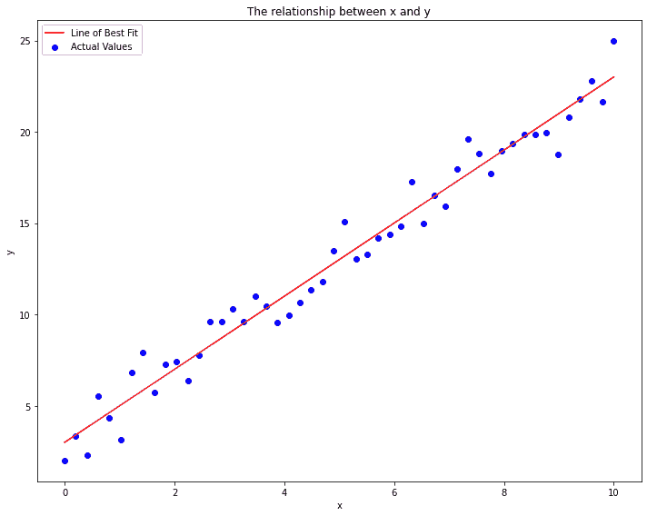

图 6.1 – x 和 y 之间的关系 – 最佳拟合线

在前面的图表示例中，蓝色点表示实际值，代表自变量 x 和因变量 y 之间的关系。红色线是通过所有这些数据点的最佳拟合线。我们的目标是现在制定预测线（最佳拟合线）：

ˆ y  = ˆ β 0 + ˆ β 1x

仔细观察预测值和真实值之间的关系。为了找到最佳拟合线，我们将最小化垂直距离，这意味着我们将最小化点与数据线之间的误差。换句话说，我们将最小化平方误差之和，它由以下计算得出：

Σ(i=1 to n) eᵢ²

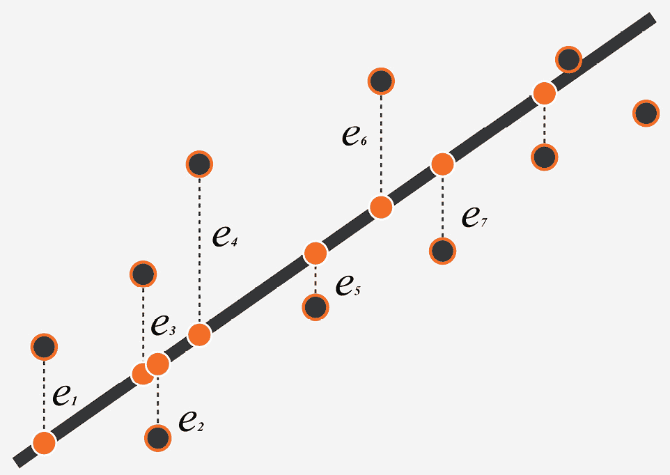

图 6.2 – 数据点与数据线之间的误差

这里，

eᵢ = yᵢ − ˆyᵢ,

其中 yᵢ 是第 i 个观测的响应变量 y 的观测值，ˆyᵢ 是预测值。误差平方和由以下给出：

S = Σ(i=1 to n) (yᵢ − ˆβ₀ − ˆβ₁ xᵢ)²

为了最小化 S，我们将对 ˆβ₀ 和 ˆβ₁ 求偏导数。然后，我们看到：

∂ S / ∂ ˆβ₀ = − 2Σ(yᵢ − ˆβ₀ − ˆβ₁ xᵢ) = 0,

∂ S / ∂ ˆβ₁ = − 2Σ xᵢ(yᵢ − ˆβ₀ − ˆβ₁ xᵢ) = 0.

因此，很容易看出：

nˆβ₀ + (Σ(i=1 to n) xᵢ)ˆβ₁ = Σ(i=1 to n) xᵢ yᵢ,

(Σ(i=1 to n) xᵢ)ˆβ₀ + (Σ(i=1 to n) xᵢ²)ˆβ₁ = Σ(i=1 to n) xᵢ yᵢ,

这意味着：

ˆβ₀ =  Σ(i=1 to n) yᵢ / n − ˆβ₁ / Σ(i=1 to n) xᵢ / n,

Σ(i=1 to n) xᵢ Σ(i=1 to n) yᵢ / n − (Σ(i=1 to n) xᵢ)² / n ˆβ₁ + (Σ(i=1 to n) xᵢ²)ˆβ₁ = Σ(i=1 to n) xᵢ yᵢ.

因为  ȳ = Σ(i=1 to n) yᵢ / n 和  x̄ = Σ(i=1 to n) xᵢ / n，我们可以将斜率和截距重写如下：

ˆβ₀ =  ȳ − ˆβ₁ / x̄,

ˆβ₁ =  Σ(xᵢ −  x̄)(yᵢ −  ȳ) / √(Σ(xᵢ −  x̄)²).

在 Python 中，我们可以通过以下代码来找到 ˆβ₀ 和 ˆβ₁：

```py
def least_squares_method(x,y):
    x_mean=x.mean()
    y_mean=y.mean()
    beta1 = ((x-x_mean)*(y-y_mean)).sum(axis=0)/ ((x-x.mean())**2).sum(axis=0)
    beta0 = y_mean-(beta1*x_mean)
    return beta0, beta1
```

# 相关系数和确定系数

在本节中，我们将讨论两个相关的概念——相关系数和确定系数。

## 相关系数

相关系数是衡量两个变量之间统计线性关系的指标，可以使用以下公式计算：

r =  1 / (n - 1) Σ(i=1 to n) (xᵢ −  x̄) / sₓ (yᵢ −  ȳ) / sᵧ

读者可以在此处[`shiny.rit.albany.edu/stat/corrsim/`](https://shiny.rit.albany.edu/stat/corrsim/)模拟两个变量之间的相关关系。

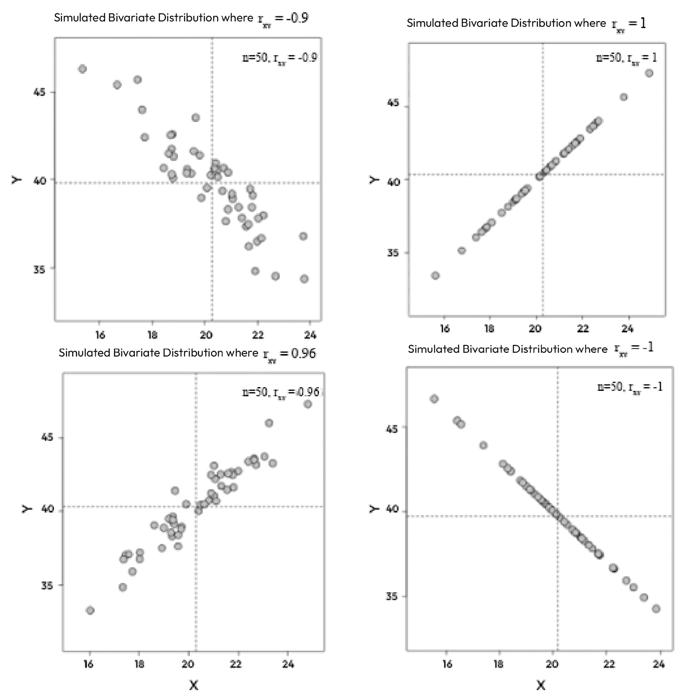

图 6.3 – 模拟的双变量分布

通过观察散点图，我们可以看到两个变量及其异常值之间线性关系的方向和强度。如果方向是正的（r>0），那么两个变量同时增加或减少。

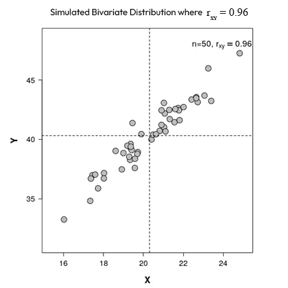

图 6.4 – 模拟的双变量分布

如果方向是负的，那么一个变量增加而另一个变量减少。我们将在下面的散点图中说明这一点：

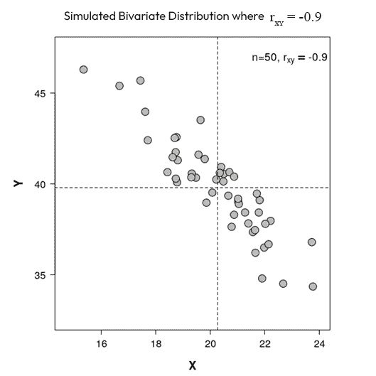

图 6.5 – 模拟的双变量分布

相关系数存在于-1 和 1 之间的值。当 r = 1 时，我们有一个完美的正相关，而当 r = -1 时，我们有一个完美的负相关。注意，如果，例如，变量 x 和变量 y 互换，或者任一变量的所有值都进行线性缩放，相关系数的值不会改变。一般来说，相关性并不表示因果关系。

## 决定系数

决定系数就是 r²，其中 r 是相关系数，它是变量 y 的变异中由变量 x 解释的比例。r²的值在 0 和 1 之间，两个变量之间的线性关系随着其值的接近 1 而变得更强。r²的值也可以使用以下公式计算：

r² = 1 − SSRes / SSTot

在这里，SSRes 是误差平方和，SSTot 是实际值与平均值之间差异的平方的总和。在`statsmodels`中，可以从 OLS 回归结果的输出中获得决定系数的值。这个输出将在本章的下一节中讨论。

# 必要的模型假设

与我们在*第四章**参数测试*中讨论的参数测试一样，线性回归是一种参数方法，并且需要满足某些假设才能使结果有效。对于线性回归，有四个假设：

+   变量之间的线性关系

+   残差的正态性

+   残差的同方差性

+   独立样本

让我们分别讨论这些假设。

## 变量之间的线性关系

当考虑将线性模型拟合到数据时，我们首先应该考虑模型是否适合数据。当处理两个变量时，应该使用散点图来评估变量之间的关系。让我们看一个例子。图*6**.6*中显示了三个散点图。数据被绘制，并且用于生成数据的实际函数被绘制在数据点上。最左边的图显示了表现出线性关系的数据。中间的图显示了表现出二次关系的数据。最右边的图显示了两个不相关的变量。

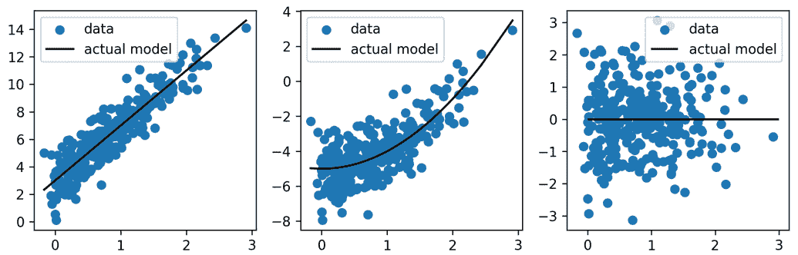

图 6.6 – 描述两个变量之间三种不同关系的三个散点图

在*图 6**.6*的示例数据中，线性模型仅适用于最左边的数据。在这个例子中，我们有了解两个变量实际关系的优势，但在实际问题中，你必须确定线性模型是否合适。一旦我们评估了线性模型是否合适并拟合了线性模型，我们就可以评估依赖于模型残差的两个假设。

## 残差的正态性

在前两章中，我们详细讨论了正态性，并查看了一些正态分布的数据示例和一些非正态分布的数据示例。在这种情况下，我们进行相同的评估，但这是针对模型残差而不是变量。实际上，与之前的参数方法不同，*变量本身不需要正态分布，只需残差*。让我们来看一个例子。我们将对两个变量拟合一个线性模型，每个变量都表现出偏斜的分布。如图*6.7*所示，尽管每个变量都有偏斜的分布，但变量之间是线性相关的。

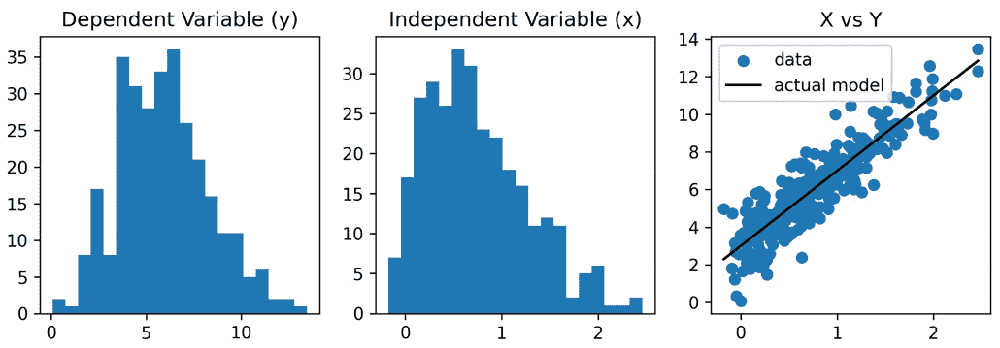

图 6.7 – X, Y 及其散点图的分布

现在，让我们看看模型拟合的残差。模型拟合的残差显示在*图 6.8*中。正如我们所预期的那样，这个模型拟合的残差看起来是正态分布的。这个模型似乎满足正态分布残差的假设。

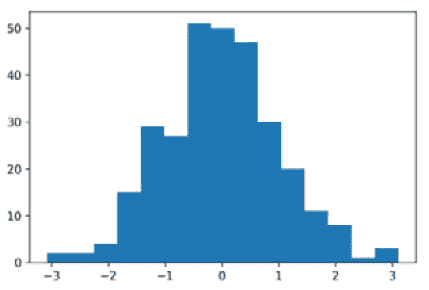

图 6.8 – 模型拟合的残差

在验证了正态分布残差的假设后，让我们继续到残差同方差性的假设。

## 残差的同方差性

不仅残差应该是正态分布的，而且残差在线性模型中应该具有恒定的方差。**同方差性**指的是残差具有相同的分散度。相反，表现出相同分散度的残差被称为**异方差性**。同方差性通常通过散点图来评估残差与模型预测的关系。残差应该看起来是随机分布的，均值为 0，并且在*x*轴上均匀分散。*图 6.9*显示了模型残差与预测值*Y*的散点图。这些残差看起来表现出同方差性。

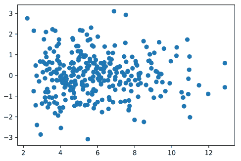

图 6.9 – 模型残差与预测值的散点图

存在几种常见的残差同方差性可能被违反的方式：

+   残差显示出方差系统性的变化

+   存在一个极端的异常值

*图 6.10*展示了这些违反的两种示例。左图显示了一个极端的异常值，右图显示了残差中的非恒定方差。在这两种情况下，模型假设都被违反了。

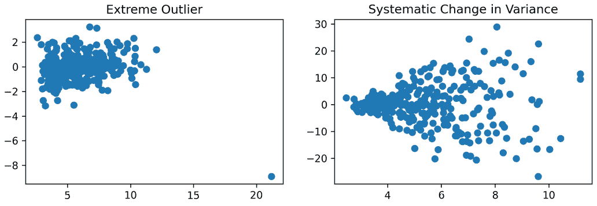

图 6.10 – 表现出不良行为的示例残差

当残差显示出系统性模式时，这可能表明另一种类型的模型可能更合适，或者对其中一个或两个变量应用转换可能有所帮助。当存在极端异常值时，可能值得验证和调查该数据点，以确保它应该包含在分析中。在下一节中，我们将讨论极端异常值如何影响模型拟合。

## 样本独立性

我们在之前的章节中讨论了样本独立性。没有图形或统计方法可以用来确定样本是否独立。*评估样本独立性需要对抽样方法和样本来源的总体进行仔细分析*。例如，违反独立性假设的常见数据类型是时间序列数据。时间序列数据是一种随时间采样的数据类型，使其具有序列相关性。我们将在后面的章节中讨论时间序列数据的分析方法。

在本节中，我们讨论了线性回归模型的假设。在下一节中，我们将讨论如何验证线性模型，这又将利用模型残差。

# 检验显著性和验证模型

到目前为止，本章我们已经讨论了线性回归建模的 OLS 方法的概念；线性模型中的系数；相关系数和确定系数；以及使用线性回归建模所需的假设。现在，我们将开始讨论检验显著性以及模型验证。

### 检验显著性

为了检验显著性，让我们加载`statsmodels`宏数据集，这样我们就可以构建一个测试实际国内私人总投资`realinv`和实际私人可支配收入`realdpi`之间关系的模型：

```py
import numpy as np
import pandas as pd
import seaborn as sns
import statsmodels.api as sm
import matplotlib.pyplot as plt
from statsmodels.nonparametric.smoothers_lowess import lowess
df = sm.datasets.macrodata.load().data
```

最小二乘回归需要一个常数系数，以便在这里推导出`statsmodels`的`add_constant`函数：

```py
df = sm.add_constant(df, prepend=False)
df_mod = df[['realinv','realdpi','const']]
```

输入数据不需要服从正态分布即可进行最小二乘回归。然而，假设模型的残差是正态分布的。然而，查看数据的分布以了解其统计数据（如均值、中位数和范围）以及是否存在异常值是有用的。如果模型后的残差分析表明可能存在一些问题，检查模型变量将有助于分析师了解潜在的根本原因。

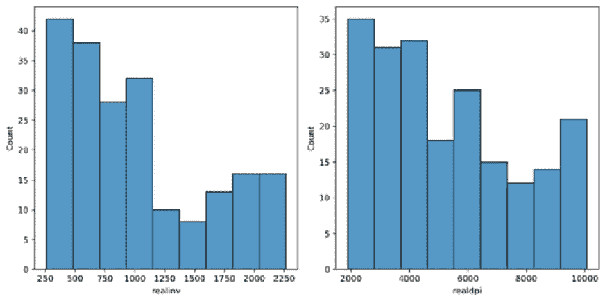

图 6.11 – 可视化*realinv*和*realdpi*变量的分布

当可视化`realinv`和`realdpi`之间的关系时，我们可以看到一个强烈的线性关系，但数据中也存在潜在的序列相关性，因为数据似乎存在某种**周期性振荡**，在图表的右上角这种振荡变得更强烈。

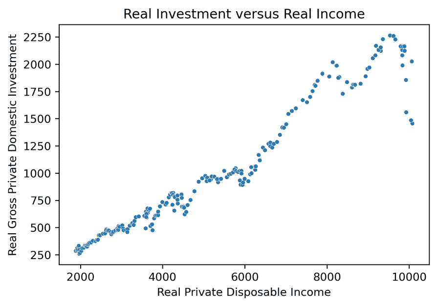

图 6.12 – 可视化`realinv`和`realdpi`变量之间的关系

在进行更多步骤之后，我们将分析前图中观察到的潜在序列相关性。首先，让我们将输入变量和系数拟合到模型中：

```py
ols_model = sm.OLS(df_mod['realdpi'], df_mod[['const','realinv']])
compiled_model = ols_model.fit()
```

接下来，我们将打印出模型性能的摘要，以便我们可以开始评估涉及项的重要性：

```py
print(compiled_model.summary())
```

参考图 6**.13**的结果，我们可以看到`const`（常数）和输入变量`realinv`均不含零。因此，除了这些变量的**显著 p 值**外，我们还可以得出结论，它们是目标系数提供的显著贡献者。现在我们已经确认截距和输入变量及其系数的统计显著性，我们想知道它们与目标的相关程度。我们可以看到**R 平方**统计量为 0.944。由于这两个变量是常数和输入变量，这个 R 平方统计量仅解释了输入变量。

R 平方与调整后的 R 平方

对于多元回归，我们将查看调整后的 R 平方值，我们也可以看到，在单变量/简单回归的情况下，它与 R 平方值相同。

**确定系数**（也称为拟合优度）为 0.944，意味着实际国内私人总投资解释了实际私人可支配收入中 94.4%的方差。

根据表格，我们可以看到截距和`realinv`变量在预测目标变量时都具有显著性，且 p 值非常低。我们还可以看到，95%的置信区间均不包含 0，这证实了它们 p 值的关联性。然而，对于常数（截距）的置信区间表明，模型可能存在不确定性的风险，可能需要更多变量来减少这种不确定性并提高模型性能。换句话说，我们可以认为常数的不确定性越高，模型中剩余可解释的方差就越多，当前模型就过于偏颇。

### 验证模型

#### Durbin-Watson 检验

重要的是要承认，由于数据是在 50 年的时间跨度内观察到的，并且没有进行随机抽样，因此可能存在序列相关性。我们在 Durbin-Watson 检验统计量 0.095 中观察到序列相关性的可能性，这表明残差表现出正自相关性。Durbin-Watson 统计量检验是否存在一阶自相关性。这意味着 Durbin-Watson 检验每个数据点之间的变化是否与先前数据点的值相关。如果存在这种相关性，则被认为是**一阶自相关性**。

Durbin-Watson 检验统计量

通常情况下，Durbin-Watson 统计量低于大约 2.0（许多人认为 1.5 到 2.0 是合理的）被视为正自相关的一个标志，而高于大约 2.0（许多人认为 2.0 到 2.5 是合理的）则表明可能存在负自相关。在程序上，需要通过查表来确定与测试统计量应进行比较的关键值。这个过程遵循任何假设检验的相同步骤，即比较测试统计量与临界值。Durbin-Watson 测试通常被解释为单尾测试，因为从双尾测试中得出的推断并不特别有用。Durbin-Watson 表的版本可以在[`www.real-statistics.com/statistics-tables/durbin-watson-table/`](https://www.real-statistics.com/statistics-tables/durbin-watson-table/)找到。此表产生正自相关的临界值。要找到负自相关的临界值，可以将正临界值从 4 中减去。

尽管我们有一个 Durbin-Watson 统计量表明数据中可能存在序列相关，但我们将通过将其与对应的正自相关 `statsmodels` 的 OLS 回归进行比较来确认其显著性。我们发现 `k=1` 输入变量的界限为 `[1.758, 1.779]`。在此范围内的值应被解释为**不确定**。低于下限的值表明有足够的证据拒绝零假设，从而得出存在统计上显著的积极自相关的结论。高于上限的值表明没有足够的证据拒绝零假设，因此没有自相关。根据我们模型的结果，我们可以有 95% 的置信水平得出结论，我们的残差中存在正序列相关的证据。

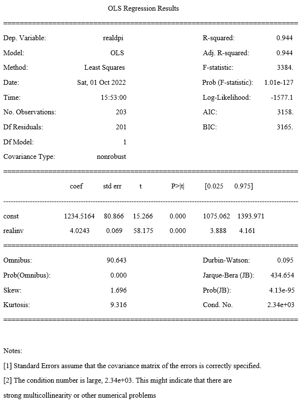

图 6.13 – 为 *realdpi* 的 OLS 回归模型输出

在这一点上，分析师可能想要在继续前进之前解决序列相关问题。然而，为了遵循端到端模型验证的过程，我们将继续进行下一步。

#### 用于分析模型错误的诊断图

如前所述，y_i = β_0 + β_1 x_i + e_i，其中在回归中，β_0 + β_1 x_i 是给定 x_i 的 y_i 的预测均值，而 e_i 是误差项——也称为残差项，它是通过观察值减去该数据点的预测值来计算的。最小二乘线性回归中的残差必须近似于以均值为中心、具有标准差的正态分布。推导拟合模型的残差的方法是从每个观察的实际值中减去预测值。以下是最小二乘回归模型拟合的四个常见可视化方法：

+   **残差与拟合图**，用于检查输入和目标变量之间线性关系的必要性

+   **分位数图**，用于检查残差正态分布的假设

+   **尺度-位置图**，用于检查同方差性的假设，或变化的同质性分布

+   **残差与杠杆影响图**，有助于识别异常值可能对模型拟合产生的影响

要生成这些图，我们可以使用以下 Python 代码实现：

```py
model_residuals = compiled_model.resid
fitted_value = compiled_model.fittedvalues
standardized_residuals = compiled_model.resid_pearson # Residuals, normalized to have unit variance.
sqrt_standardized_residuals = np.sqrt(np.abs(compiled_model.get_influence().resid_studentized_internal))
influence = compiled_model.get_influence()
leverage = influence.hat_matrix_diag
cooks_distance = compiled_model.get_influence().cooks_distance[0]
fig, ax = plt.subplots(2, 2, figsize=(10,8))
# Residuals vs. Fitted
ax[0, 0].set_xlabel('Fitted Values')
ax[0, 0].set_ylabel('Residuals')
ax[0, 0].set_title('Residuals vs. Fitted')
locally_weighted_line1 = lowess(model_residuals, fitted_value)
sns.scatterplot(x=fitted_value, y=model_residuals, ax=ax[0, 0])
ax[0, 0].axhline(y=0, color='grey', linestyle='--')
ax[0,0].plot(locally_weighted_line1[:,0], locally_weighted_line1[:,1], color = 'red')
# Normal Q-Q
ax[0, 1].set_title('Normal Q-Q')
sm.qqplot(model_residuals, fit=True, line='45',ax=ax[0, 1], c='blue')
# Scale-Location
ax[1, 0].set_xlabel('Fitted Values')
ax[1, 0].set_ylabel('Square Root of Standardized Residuals')
ax[1, 0].set_title('Scale-Location')
locally_weighted_line2 = lowess(sqrt_standardized_residuals, fitted_value)
sns.scatterplot(x=fitted_value, y=sqrt_standardized_residuals, ax=ax[1, 0])
ax[1,0].plot(locally_weighted_line2[:,0], locally_weighted_line2[:,1], color = 'red')
# Residual vs. Leverage Influence
ax[1, 1].set_xlabel('Leverage')
ax[1, 1].set_ylabel('Standardized Residuals')
ax[1, 1].set_title('Residuals vs. Leverage Influence')
locally_weighted_line3 = lowess(standardized_residuals, leverage)
sns.scatterplot(x=leverage, y=standardized_residuals, ax=ax[1, 1])
ax[1, 1].plot(locally_weighted_line3[:,0], locally_weighted_line3[:,1], color = 'red')
ax[1, 1].axhline(y=0, color='grey', linestyle='--')
ax[1, 1].axhline(3, color='orange', linestyle='--', label='Outlier Demarkation')
ax[1, 1].axhline(-3, color='orange', linestyle='--')
ax[1, 1].legend(loc='upper right')
leverages = []
for i in range(len(cooks_distance)):
    if cooks_distance[i] > 0.5:
        leverages.append(leverage[i])
        ax[1, 1].annotate(str(i) + " Cook's D > 0.5",xy=(leverage[i], standardized_residuals[i]))
if leverages:
    ax[1, 1].axvline(min(leverages), color='red', linestyle='--', label="Cook's Distance")
for i in range(len(standardized_residuals)):
    if standardized_residuals[i] > 3 or standardized_residuals[i] < -3:
        ax[1, 1].annotate(i,xy=(leverage[i], standardized_residuals[i]))
fig.tight_layout()
```

以下输出包含四个常见的诊断图。

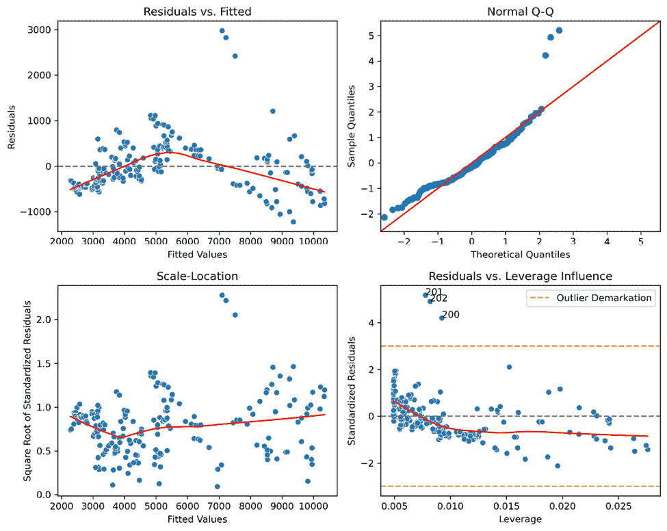

图 6.14 – 线性回归诊断图

#### 残差与拟合

最小二乘回归的一个要求是输入和目标变量之间的**线性关系**。简单来说，输入和目标变量之间存在强烈的关联关系。这个图帮助分析师评估两者之间的线性关系。

我们应该期望拟合线——代表模型——是水平的，表示输入和目标变量之间线性关系在所有数据点上的强度。残差应该在大致合理的距离内均匀地分布在直线周围。如果这些属性无法得到证实，两个变量之间可能存在非线性关系。至少对其中一个变量进行转换——如果变量是偏斜的——可能有助于解决这类问题。然而，也可能是一个非参数模型更为合适，这在存在分类特征——或编码后的分类特征——的情况下通常是这种情况。

我们生成的图没有显示均匀分布在水平线周围的残差。相反，线是向下凹的，这表明多项式或非参数回归可能更为合适。此外，残差在线的右侧形成了一种模式，这表明数据可能存在一些序列相关性，因为它表现出一些正弦行为。我们能够使用 Durbin-Watson 统计量识别出序列相关性的存在。这很可能是由于数据不是随机抽取的，而是在很长的一段时间内收集的。

#### 残差的 QQ 图

QQ 图的正态性评估遵循与在*第四章**，参数检验*中使用 QQ 图评估正态性的相同程序。此图的主要目的是评估**误差的正态分布**所需的假设。残差在图中 45 度线附近的轻微偏差是正常的，但极端偏斜或偏离线可能表明拟合度不佳。这种情况可能表明统计功效差。在出现偏斜的情况下，数据转换（如对数转换）可能有助于解决问题。删除异常值可能是一种合适的解决方案。然而，与其直接删除异常值，不如确保没有在数据处理中发生错误，这些错误可以通过使异常值符合要求来解决。

在我们模型残差的 QQ 图中，我们可以看到一些适度的左侧偏斜和极端的右侧偏斜，这表明右侧尾部的三个值可能是极端异常值。除此之外，我们可以假设总体上，残差误差近似正态分布。

#### 尺度-位置

标准化残差的平方根的尺度-位置图有助于分析师通过视觉检查确定残差是否存在**同方差性**——或*非恒定*方差，这是最小二乘回归模型所必需的。该图可视化标准化残差的绝对值的平方根。分析同方差性有时有助于识别与**样本独立性**相关的潜在问题，这是最小二乘回归的另一个要求。然而，在测试此假设时，应更重视 Durbin-Watson 测试。

在评估我们的模型时，我们可以看到线与完全水平的状态有一些偏差。此外，残差虽然看似具有大量恒定的方差，但有时会表现出模式，这与同方差性的行为相冲突。此外，似乎有三个非常明显的异常值。基于这些信息，我们可以合理地假设模型残差中存在异方差性——或*恒定*方差。

#### 残差与杠杆影响

评估残差与杠杆影响是评估模型拟合度的一种另一种方法。除了衡量杠杆作用外，此图还显示了**库克距离**何时超出合理水平。

**杠杆作用**用于确定一个点与其他所有点之间的距离。对于残差的杠杆作用较高可能意味着相应的数据点是强异常值，强烈影响模型以更不精确地拟合整体数据，并给予该特定值更多的权重。残差应在-2 到 2 之间，否则不应被视为潜在的异常值。介于+/-2.5 到 3 之间的值表明数据点是极端异常值。总的来说，这个图有助于将没有对模型产生显著负面影响的异常值与那些确实有影响的异常值区分开来。

**库克距离**是一种同时使用观测值的杠杆作用和残差值的测量方法。随着杠杆作用的提高，其计算的库克距离也更高。一般来说，库克距离值大于 0.5 意味着残差具有杠杆作用，通过过度表示对模型产生负面影响——本质上是一个异常值。库克距离包含在代码中，并标记出距离大于 0.5 的残差。库克距离特别有用，因为移除异常值可能不会对模型产生重大影响。然而，如果异常值的库克距离值较高，这强烈表明解决异常值**将有助于**模型。库克距离是通过从模型中移除每个数据点并计算误差差异除以均方误差乘以模型系数数量加一来计算的。其公式如下：

D i =  ∑ j=1 n  (ŷ j − ŷ j(i)) 2  ___________  (p + 1)σ ̂ 2

其中 ŷ j 是响应的 *j* 次估计，ŷ j(i) 是移除 *i* 次拟合值后的 *j* 次拟合值。*p* 是模型中的系数数量，σ ̂ 2 是所有观测值的残差方差，包括那些被移除的，也称为平方误差。

在我们模型的图中，我们可以观察到三个极端异常值。然而，我们也可以看到库克距离的值没有大于 0.5 的。与尺度-位置图一样，标准化残差应围绕一条水平平滑线均匀分布，这表明方差是恒定的。我们可以从我们模型的输出中看到，情况并非如此。

### 解决残差问题

单独来看，每个图都可以被认为是足以否定模型的有效性。然而，考虑所有图是有用的，因为如果诊断图中只有一些与预期不符的偏差，模型仍然可能是有用的。以下是一些解决残差问题的方法：

+   调查和解决可能导致异常值或数据不一致性的任何数据收集问题

+   直接移除异常值

+   使用随机或分层抽样等方法改进采样方法

+   执行数据转换，例如对数或平方根转换

+   包含额外的输入变量，这些变量可以帮助解释目标变量或可能存在的任何序列相关性

### 处理序列相关性

如果对残差中是否存在序列相关性不确定，一个有用的下一步是分析**偏自相关函数**（**PACF**）图，以评估模型在显著水平上是否存在序列相关性，这可能会解释模型残差的问题。

ACF 和 PACF

**PACF**通过控制滞后之间的差异，提供了点值与先前点（称为滞后）之间的部分相关性。控制滞后之间的差异是“部分”一词的来源。如果一个数据集中滞后零处的特定点与第三个滞后点的值强烈相关，那么它将与滞后 3 有显著相关性，但不会与滞后 2 或 1 有相关性。在时间序列建模中，PACF 用于直接推导自回归阶数，表示为*AR(n)*，其中*n*是滞后。**自相关函数**（**ACF**），用于确定移动平均阶数，表示为*MA(n)*，考虑了在滞后零的数据点与所有先前滞后点之间的相关性，而不控制它们之间的关系。换句话说，ACF 图在滞后 3 处的自相关性将提供从点 0 到点 3 的跨点自相关性，而 PACF 图在滞后 3 处的相关性将只提供点 0 和点 3 之间的自相关性，排除了滞后 1 和 2 处值的影响。

我们可以通过以下代码生成使用最近 50 个数据点（按索引位置排序，在本例中按日期排序）的 PACF 图，并带有 95%置信区间：

```py
from statsmodels.graphics.tsaplots import plot_pacf
plot_pacf(compiled_model.resid, alpha=0.05, lags=50);
```

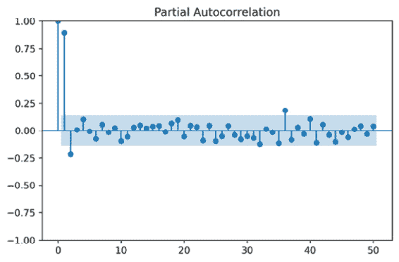

图 6.15 – 模型残差的偏自相关图

在图 6.15 的 PACF 图中，我们看到在滞后 0 和 1 处存在非常强烈且显著的关联。我们观察到滞后 2 和 36 的显著关联水平较低（大约为-0.25），并延伸到 95%置信区间之外。这告诉我们，我们可能更适合用一阶自回归（**AR(1)**）时间序列模型来建模数据集，而不是线性回归模型。

当存在显著的自相关时，使用最小二乘法回答回归问题会带来固有的风险。当检测到自相关时，有方法可以调整模型的结果，例如采用**一阶差分**——或另一种类型的低通滤波器——或者应用 Cochrane-Orcutt、Hildreth-Lu 或 Yule-Walker 调整。然而，进行时间序列分析是理想的，因为这种类型建模的结果对时间依赖性模式更稳健。我们将在*第十章*中介绍时间序列，*时间序列简介*，我们将讨论近似时间序列以产生更有用结果的方法。

让我们考虑数据的一阶差分。关于*图 6**.16，我们首先查看输入变量`realdpi`的 ACF 图和原始数据。我们可以看到一个指数增长的线（原始数据），它显示了一个指数衰减的 ACF 图。这种 ACF 行为对于**趋势**数据是典型的，这类数据通常从**一阶差分**中受益。在 PACF 中识别出的低自回归阶数表明，这可能足以使回归模型继续进行。如果 ACF 显示出不同的行为，例如正弦波（季节性）自相关，或者 PACF 显示出更多的部分自相关，我们将有证据表明一阶差分不是解决序列相关并继续进行最小二乘回归的充分解决方案。对于最小二乘回归，ACF 和 PACF 的理想情况是没有显著相关的滞后。然而，当 ACF 表现出这种行为，而 PACF 没有显示出显著性，或者当相关程度非常低时，回归可能表现良好。最好是两个图表中都没有模式或峰值。无论如何，在两种情况下，都应该评估模型误差，以及残差的自相关性，以确定最小二乘回归是否按需执行。

使用`diff()` `numpy`函数，我们对原始数据进行了首次低通差分，并绘制了 ACF、PACF 和原始数据与差分数据的线图。结果我们可以看到自相关性的显著降低。顺便提一下，差分后的自相关性表明，一阶自回归移动平均（**ARMA**）模型，AR 阶数为 1，MA 阶数为 1，可能比最小二乘回归更适合。然而，我们将忽略这一点，继续进行：

```py
from statsmodels.graphics.tsaplots import plot_acf
from statsmodels.graphics.tsaplots import plot_pacf
fig, ax = plt.subplots(2,3, figsize=(15,10))
plot_acf(df_mod['realdpi'], alpha=0.05, lags=50, ax=ax[0,0])
ax[0,0].set_title('Original ACF')
plot_pacf(df_mod['realdpi'], alpha=0.05, lags=50, ax=ax[0,1])
ax[0,1].set_title('Original PACF')
ax[0,2].set_title('Original Data')
ax[0,2].plot(df_mod['realdpi'])
plot_acf(np.diff(df_mod['realdpi'], n=1), alpha=0.05, lags=50, ax=ax[1,0])
ax[1,0].set_title('Once-Differenced ACF')
plot_pacf(np.diff(df_mod['realdpi'], n=1), alpha=0.05, lags=50, ax=ax[1,1])
ax[1,1].set_title('Once-Differenced PACF')
ax[1,2].set_title('Once-Differenced Data')
ax[1,2].plot(np.diff(df_mod['realdpi'], n=1))
```

我们得到了以下结果：

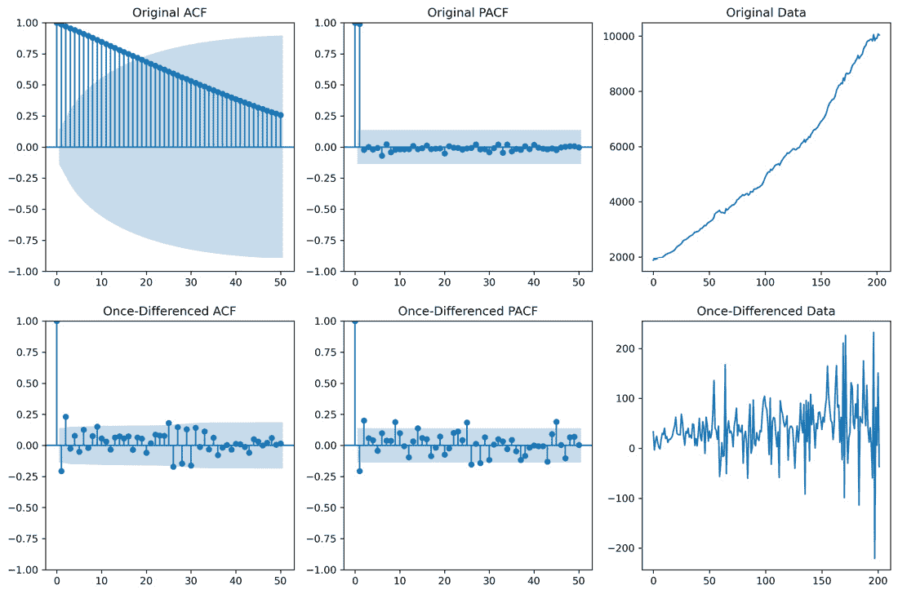

图 6.16 – 实 inv 变量在一阶差分前后的绘图

这为我们提供了可能更适合使用回归模型建模的数据。然而，当使用差分作为解决最小二乘回归模型中序列相关性的方法时，我们还必须对输入变量进行微分。观察输入变量`realinv`在变换前后的情况。在这里的*图 6.17*中，我们可以看到与`realdpi`相似的行为：

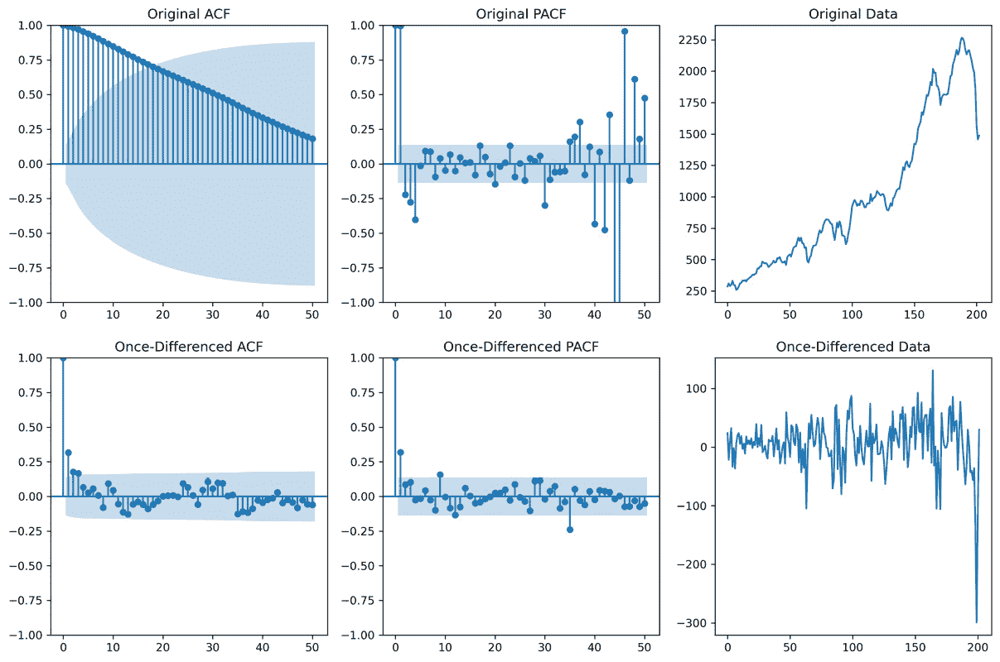

图 6.17 – *realdpi*变量在一阶差分前后的绘图

我们现在可以使用差分数据构建一个新的回归模型。首先需要注意的是，一阶差分从数据集中移除了一个数据点，因此设计矩阵中的常数项也必须移除一个值：

```py
ols_model_1diff = sm.OLS(np.diff(df_mod['realdpi'], n=1), pd.concat([df_mod['const'].iloc[:-1], pd.Series(np.diff(df_mod['realinv'], n=1))], axis=1))
compiled_model_1diff = ols_model_1diff.fit()
```

这个模型的输出明显不同。我们现在看到一个 r-squared 值为`0.045`。观察差分数据，我们可以看到可支配收入和投资之间的差分数据有不同的方差。这意味着尽管`realinv`变量在预测`realdpi`时似乎很重要，但还有更多因素影响着实际可支配的毛个人收入。我们观察到新的 Durbin-Watson 统计量现在是`2.487`。使用之前表中查找的临界值`[1.758, 1.779]`，我们看到 Durbin-Watson 统计量现在高于上限`[2.221, 2.242]`。因为新的统计量`2.487`大于`2.221`，我们可以确认现在模型残差中存在负自相关。根据 PACF 图以及与临界值范围的接近程度，我们可以看到自相关比之前显著减少，但仍然存在。然而，可以争辩说残差的自相关现在足够小，可以被认为是解决了；如前所述，Durbin-Watson 统计量小于 2.5 可以被认为是正常的。尽管如此，与时间序列建模相比，最小二乘回归在生成预测时仍然存在风险。我们将在*第十章*“*时间序列*简介”中开始对这个主题进行深入概述。

然而，为了通过回归模型验证的步骤，我们假设数据中没有自相关。下一步将是测试我们的模型。

## 模型验证

假设分析师已经开发了一个产生强大结果且根据之前提到的图表看起来有用的模型，下一步是测试该模型。一种传统的方法是在用于原始模型的全部数据上执行训练和测试分割，其中我们拟合所有数据。在下面的代码中，我们进行了一个分割，其中训练数据集包含 75%的数据，测试数据集包含 25%。目的是评估这两个数据集之间以及与原始模型之间性能是否存在显著差异。可接受的差异由分析师决定，但除了评估已讨论的指标之间的差异外，分析师还应注意斜率和输入变量的系数，因为这些将用于预测目标。

在这里，我们分割数据。我们使用`shuffle`参数来**随机**打乱数据，以便如果数据存在某种顺序，例如按时间排序，数据将被随机分割：

```py
from sklearn.model_selection import train_test_split
train, test = train_test_split(df_mod, train_size=0.75, shuffle=True)
```

现在，我们使用训练数据构建一个模型：

```py
ols_model_train = sm.OLS(train['realdpi'], train[['const','realinv']])
compiled_model_train = ols_model_train.fit()
print(compiled_model_train.summary())
```

最后，我们使用测试数据构建一个模型：

```py
ols_model_test = sm.OLS(test['realdpi'], test[['const','realinv']])
compiled_model_test = ols_model_test.fit()
print(compiled_model_test.summary())
```

这里的想法是，两个模型应该在数据的两个不同部分上产生相似的结果。

验证模型的另一种方法是将其与朴素模型进行比较。让我们使用**平均绝对误差**（**MAE**）。使用这个模型指标，我们可以比较朴素线性模型的误差，其中误差是每个数据点减去平均值与模型的预测值。有用的模型 MAE 需要低于朴素模型的 MAE。在这里，我们使用拟合模型来预测输入值，然后比较模型的预测值与朴素模型的预测值：

下面我们可以观察到**训练**模型的 MAE：

```py
from sklearn.metrics import mean_absolute_error
mae = mean_absolute_error(train['realdpi'], compiled_model_train.predict(train[['const','realinv']]))
mae
#438.5872081797031
```

在这里，我们可以看到**朴素**模型的 MAE，该模型除了假设均值将继续保持真实值外，不做任何假设：

```py
import numpy as np
errors = []
for i in range(len(train)):
    errors.append(abs(train['realdpi'].iloc[i] - train['realdpi'].mean()))
np.mean(errors)
#2065.440235457064
```

我们可以看到模型与朴素模型相比表现良好。

另一种流行的测试方法是使用保留数据集进行测试。为此，在训练数据上构建并训练一个模型。然后，使用该模型，将其应用于测试数据。然后，我们将比较指标与训练数据的指标。使用训练模型的 MAE 为 438，我们将其与以下进行比较：

```py
mae_test = mean_absolute_error(test['realdpi'], compiled_model_train.predict(test[['const','realinv']]))
mae_test
#408.0253171549187
```

我们可以看到测试数据的误差低于训练数据的误差。然而，由于假设训练数据和测试数据具有不同的值和均值，我们应该重新评估朴素模型对于测试数据仍然产生较高的 MAE：

```py
errors = []
for i in range(len(test)):
    errors.append(abs(test['realdpi'].iloc[i] - test['realdpi'].mean()))
np.mean(errors)
#1945.5873125720873
```

在这里，我们可以看到模型在测试数据和训练数据上提供了与朴素模型大致相同的 MAE，因此我们预计线性回归模型比朴素模型更好。

# 摘要

在本章中，我们讨论了单变量解释变量和单变量响应变量之间简单线性回归的概述。我们涵盖的主题包括以下内容：

+   简单线性回归的 OLS 方法

+   相关系数和确定系数及其计算和意义

+   最小二乘回归所需的前提假设

+   模型和参数显著性的分析方法

+   模型验证

我们仔细研究了误差平方的概念以及误差平方和对于构建和验证线性回归模型的意义。然后，我们探讨了使线性回归成为一个稳定解所需的四个相关假设。之后，我们概述了四个诊断图及其在评估与异方差性、线性、异常值和序列相关性相关的问题时的解释。然后，我们通过一个使用 ACF 和 PACF 评估序列相关性的例子，以及一个使用一阶差分从数据中移除序列相关性约束并使用差分数据构建 OLS 模型的例子。最后，我们提供了测试和验证最小二乘回归模型的方法。

在下一章中，我们将扩展这一概念，包括一个以上的解释变量，这种技术称为多元线性回归。我们还将讨论与多元线性回归相关的各种主题，例如变量选择和正则化。
