# 7

# 多元线性回归

在上一章中，我们讨论了使用一个变量来解释目标变量的**简单线性回归（SLR**）。在本章中，我们将讨论**多元线性回归（MLR**），这是一个利用多个解释变量来建模响应变量的模型。多元建模面临的主要难题是多重共线性以及偏差-方差权衡。在概述 MLR 之后，我们将介绍用于评估和最小化多重共线性的方法。然后，我们将讨论利用偏差-方差权衡来为分析师带来好处的方法。最后，我们将讨论使用**主成分回归（PCR**）来处理多重共线性，以最小化过拟合，而不是删除特征，而是转换它们。

在本章中，我们将涵盖以下主要主题：

+   多元线性回归

+   特征选择

+   收敛方法

+   维度缩减

# 多元线性回归

在上一章中，我们讨论了简单线性回归（SLR）。通过 SLR，我们能够使用另一个变量（通常称为解释变量，表示为 *x*）来预测一个变量的值（通常称为响应变量，表示为 *y*）。SLR 模型通过以下方程表示，其中 β 0 是截距项，β 1 是线性模型的斜率。

y = β 0 + β 1 x + ϵ

虽然这是一个有用的模型，但在许多问题中，可以使用多个解释变量来预测响应变量。例如，如果我们想要预测房价，我们可能需要考虑许多变量，这些变量可能包括地块大小、卧室数量、浴室数量和总体大小。在这种情况下，我们可以扩展先前的模型以包括这些额外的变量。这被称为 MLR。MLR 模型可以用以下方程表示。

y = β 0 + β 1 x 1 + β 2 x 2 + … + β p x p + ϵ

与前一个方程类似，β 0 代表截距。在这个方程中，除了截距值之外，我们还有每个解释变量的 β 参数。每个解释变量用带数字下标的 *x* 表示。我们可以在模型中包含尽可能多的解释变量，这就是为什么方程显示了最后的下标 p。

数据规模对 MLR 的影响

通常，我们可以在模型中包含尽可能多的解释变量。然而，有一些现实限制。这些潜在限制之一是样本数量与解释变量数量的相对关系。MLR 在样本数量（N）远小于解释变量数量（P）时效果最佳。当 P 接近 N 时，模型变得难以估计。如果 P 相对于 N 很大，那么考虑降维是明智的，这将在本章后面讨论。

让我们来看一个例子。Python 包 `scikit-learn` 包含了多个用于建模练习的数据集。我们将使用 `diabetes` 数据集，该数据集包括了一年后疾病进展的重要测量和定量指标。更多关于这个数据集的信息可以在以下链接找到：[`scikit-learn.org/stable/datasets/toy_dataset.xhtml#diabetes-dataset`](https://scikit-learn.org/stable/datasets/toy_dataset.xhtml#diabetes-dataset)。我们将尝试建立生命统计与疾病进展之间的关系。

该数据集中的解释变量包括 `age`（年龄）、`bmi`（体质指数）、`bp`（血压）、`s1`、`s2`、`s3`、`s4`、`s5` 和 `s6`。响应变量是疾病进展的测量值。以下是这种模型数学表达的方式：

progression = β 0 + β 1 x age + β 2 x bmi + β 3 x bp + β 4 x s1 + β 5 x s2

+ β 6 x s3 + β 7 x s4 + β 8 x s5 + β 9 x s6 + ϵ

如前所述，模型中每个变量都有一个 β 值。

对糖尿病数据集的转换

该数据集中的解释变量已经从原始测量值转换过来。参考数据集用户指南，我们可以看到每个变量都已经进行了均值中心化和缩放。此外，`sex` 变量已经被从分类变量转换为数值变量。

## 添加分类变量

到目前为止，我们只考虑了模型中的连续变量，即可以在数轴上具有任何值的变量。回顾一下 *第二章**，数据分布*，我们之前考虑的变量现在是比率数据。然而，线性回归模型并不限于使用连续变量。我们可以在模型中包含分类变量。回顾一下 *第二章**，数据分布*，分类变量与项目组相关联。在统计学习中，这些组通常被称为变量的 **水平**。例如，如果我们有五个学生，其中三个拥有硕士学位，一个拥有博士学位，一个拥有学士学位，那么我们可以说学生的分类变量有三个水平：BS、MS 和 PhD。让我们看看如何将分类变量纳入模型。

我们将通过包含额外的 β 项将分类变量纳入模型。具体来说，我们将添加水平数（L）减一的额外 β 项。对于有三个水平的示例，我们将添加两个额外的 β 项。使用少于水平数的一个值将允许我们选择一个水平作为参考（或基线），并将其他水平与该参考水平进行比较。我们将像其他 β 项一样在模型中包含 β 项。比如说，在这个例子中，我们正在建模收入水平，除了教育水平外，我们还有个人的经验。那么，我们的模型将构建如下：

收入 = β 0 + β 1 x 经验 + β 2 x ms + β 3 x phd

在添加了β项之后，我们还需要进行数据转换。我们必须为分类变量中的每个*非参考*级别创建**虚拟变量**。这个过程被称为分类变量的虚拟化。在虚拟化过程中，我们为每个非参考级别创建一列，并在原始变量中该级别出现的地方插入 1，而在该级别未出现的地方插入 0。这个过程在*图 7.1*中得到了演示。

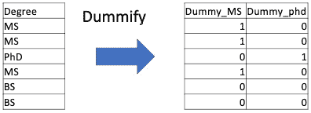

图 7.1 – 分类变量的虚拟化

原始变量包含 BS、MS 和 PhD 级别。BS 被选为参考级别，并为 MS 和 PhD 级别创建了两个虚拟变量。为分类变量创建额外列的过程称为**编码**。有许多类型的变量编码，编码是统计学习和机器学习中广泛使用的技术。

分类级别是常数位移

让我们更深入地看看分类变量对线性回归模型的影响。之前，我们讨论了如何使用取值为 0 和 1 的虚拟变量对分类变量进行编码。本质上，这意味着我们根据级别切换相关的β项，这将使响应位移一个常数。例如，在收入模型中，当我们想要计算具有 BS 学位的个人收入时，模型将解析为以下：

收入 = β 0 + β 1 x 经验

当我们想要计算具有 MS 学位的个人收入时，模型将解析为以下：

收入 = β 0 + β 1 x 经验 + β 2

这意味着分类级别的水平只会使模型的输出从参考水平位移一个常数，即与该级别相关的β。

回到我们之前的例子，我们的数据集包括一个分类变量：患者的`性别`。数据集包括`性别`的两个级别。我们将选择一个级别作为参考，并为另一个级别创建一个虚拟变量。有了这些知识，让我们将数据拟合到线性回归模型中，并讨论多元线性回归的假设。

## 评估模型拟合度

每当我们拟合一个参数模型时，我们都应该验证模型假设是否得到满足。正如前一章所讨论的，如果模型假设没有得到满足，模型可能会提供误导性的结果。在前一章中，我们讨论了简单线性回归的四个假设：

+   响应变量和解释变量之间的线性关系

+   残差的正态性

+   残差的同方差性

+   独立样本

这些假设也适用于此处，但在这种新的建模环境中，我们还有一个额外的假设：没有或几乎没有**多重共线性**。多重共线性发生在 MLR 模型中的两个或多个解释变量高度相关时。多重共线性存在会影响独立变量的统计显著性。理想情况下，所有解释变量都将是不相关的（或线性独立的）。然而，我们可以接受一定程度的多重共线性，而对模型影响不大。

让我们评估这些假设中的每一个模型。

### 线性关系

要检查响应变量与解释变量之间的线性关系，我们可以查看每个变量与响应变量的散点图。根据图 *7.2* 中的图表，包括 `bmi`、`bp`、`s3`、`s4` 和 `s5` 在内的几个变量可能与响应变量表现出线性关系。

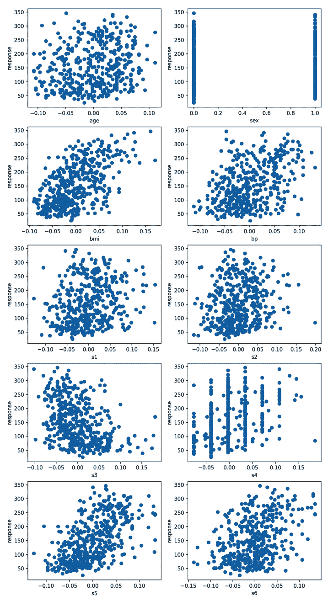

图 7.2 – 响应变量与解释变量之间的散点图

虽然如果任何变量与响应变量显示出强烈的线性关系将是理想的，但在 MLR 模型中，我们有变量组合的好处。我们可以添加看起来更有用的变量，并移除看起来没有用处的变量。这被称为**特征选择**，我们将在下一节中介绍。

### 残差正态性

回顾上一章，我们期望来自拟合良好的模型的残差应呈现随机分布。我们可以通过直方图或 QQ 图来查看这一点。我们模型的残差在图 *7.3* 中显示。

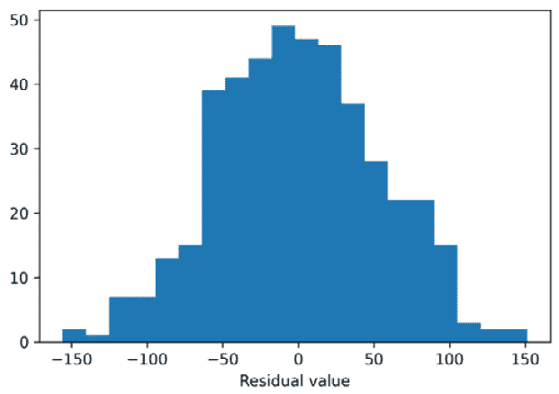

图 7.3 – 残差值

根据图 *7.3* 中的直方图，我们不能排除残差呈正态分布的可能性。一般来说，在评估这个假设时，我们是在检查是否存在*明显的*违反情况。结果证明，线性回归对这一假设相对稳健。但这并不意味着这个假设可以被忽略。

### 残差同方差性

在上一章中，我们也讨论了同方差性。对于一个拟合良好的模型，我们期望残差应表现出同方差性。图 *7.4* 展示了残差与模型预测值之间的散点图。

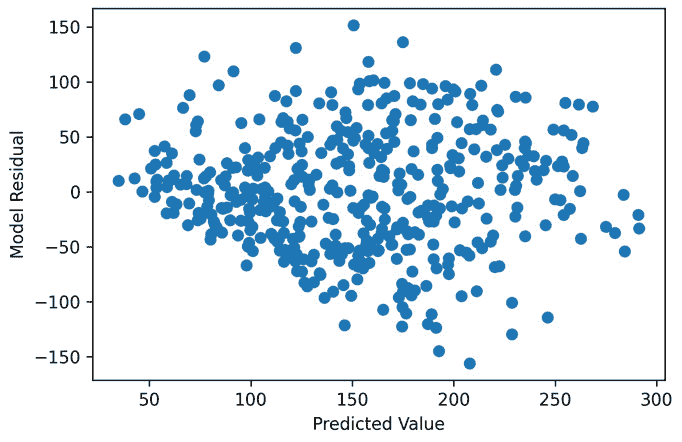

图 7.4 – 预测值与实际值之间模型残差的散点图

看起来没有明显的方差变化模式或显著的异常值，这会违反同方差性的假设。如果存在模式，那将是一个信号，表明一个或多个变量可能需要转换，或者响应变量和解释变量之间可能存在非线性关系。

### 独立样本

在上一章中，我们讨论了独立采样及其对这类模型的影响。然而，如果我们不知道抽样方法，就无法确定样本是否独立。由于我们不知道这个数据集的抽样策略，我们将假设这个假设得到满足，并继续进行模型。在实际建模环境中，这个假设永远不应被想当然。

### 多重共线性

对于多元线性回归（MLR）的新假设是，解释变量中几乎没有多重共线性。多重共线性是当两个或更多变量强线性相关时出现的情况。我们通常使用 **方差膨胀因子**（**VIF**）来检测多重共线性。VIF 是衡量解释变量系数受其他解释变量影响程度的一个度量。VIF 越低越好，其中最小值为 1，表示没有相关性。我们通常认为 VIF 为 5 或更高是过高的。当在一组解释变量中检测到高 VIF 时，我们反复移除具有最高 VIF 的变量，直到每个变量的 VIF 值都低于 5。让我们看看我们当前数据的例子。移除具有高 VIF 变量的过程在 *图 7**.5* 中展示。

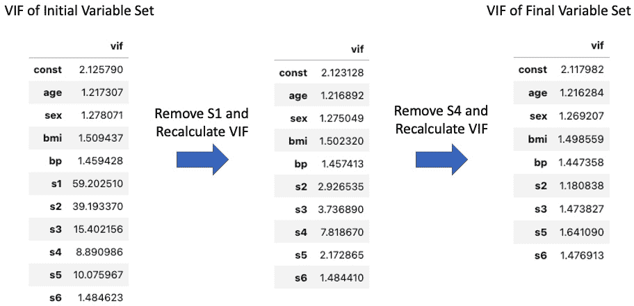

图 7.5 – 从数据集中移除高 VIF 变量

*图 7**.5* 展示了从糖尿病数据集中移除具有高 VIF 变量的过程。图中最左边的表格显示了原始数据集，其中最高的 VIF 为 59.2，对应变量 S1。然后，我们从数据集中移除这个变量并重新计算 VIF。现在我们看到最高的 VIF 为 7.8，对应变量 `s4`。我们移除这个变量并重新计算 VIF。现在，所有 VIF 值都低于 5，表明剩余变量之间相关性较低。移除这些变量后，我们需要再次拟合模型。

在模型拟合和模型假设得到验证后，让我们看看拟合结果并讨论如何解释这些结果。

## 解释结果

拟合模型后，我们从 `statsmodels` 获得了以下结果。输出分为三个部分：

+   顶部部分包含关于模型的高级统计数据

+   中间部分包含关于模型系数的详细信息

+   底部部分包含关于数据和残差的诊断测试

让我们逐一查看这个模型的每个部分。

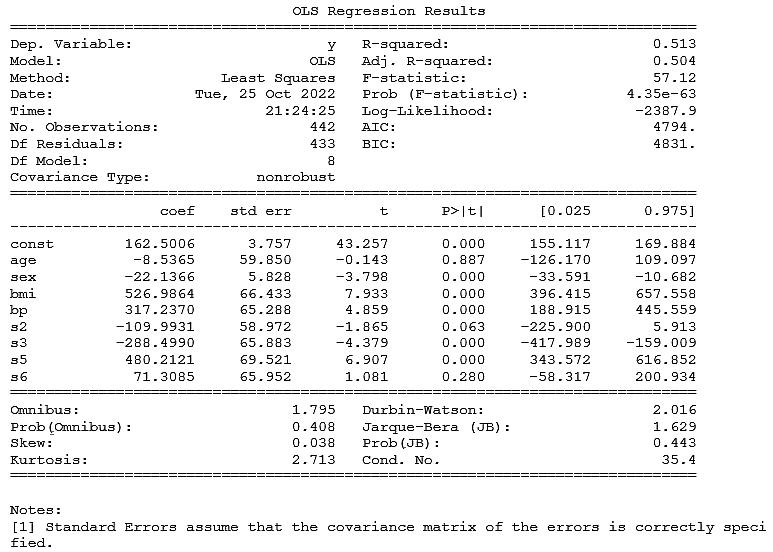

图 7.6 – statsmodels OLS 回归的结果

### 高级统计和指标（顶部部分）

在拟合结果的顶部部分，我们有模型级别的信息。顶部部分的左侧包含有关模型的信息，例如**自由度**（**df**）和观测数。顶部部分的右侧包含模型指标。模型指标对于比较模型很有用。我们将在特征选择部分讨论更多关于模型指标的内容。

### 模型系数详情

中间部分包含有关模型系数（之前列出的方程中的β项）的详细信息。在本节的目的上，我们将关注中间部分的两个列：`coef`和`P>|t|`。`coef`列是针对模型方程估计的模型系数（β的估计或称为ˆβ）。标记为`P>|t|`的列是对系数进行显著性检验的 p 值。我们对这两列都感兴趣，以解释模型。让我们从 p 值列开始。

对于这个测试的零假设是**β参数的值等于零**。回顾以下内容来自*第三章**，* 假设检验：

+   p 值低于显著性阈值意味着我们拒绝零假设

+   p 值高于显著性阈值意味着我们未能拒绝零假设

在这个例子中，我们会拒绝`bmi`变量的零假设，但对于年龄变量，我们未能拒绝零假设。一旦我们确定了显著的变量，我们就可以继续解释显著变量的含义。我们无法提供其他变量的解释，因为我们不能拒绝它们的系数值可能为零。如果系数值为零，则该变量对模型没有贡献。让我们看看如何解释系数。

通常，当我们构建一个模型时，我们想要了解模型的各个部分如何影响输出。在 MLR 模型中，这归结为理解模型的系数。我们有两种类型的变量，连续的和分类的，相关的系数有不同的含义。

#### 解释连续变量系数

对于连续变量，例如`BMI`，随着变量值的增加，其对模型输出的重要性也增加。变量值的单位增加与因变量均值的增加相关，这种增加的大小等于系数的大小，同时保持其他变量不变。以`bmi`变量为例。由于`bmi`变量的系数大约为 526，我们可以这样说：“`bmi`的单位增加与其他变量保持不变时，将导致糖尿病测量均值增加 526。”当然，系数也可以取负值。

#### 解释分类变量系数

对于分类变量，例如`sex`，回想一下，与连续变量不同，分类变量的值是虚拟编码的，因此只能取两个值：零和一。同时，回想一下，选择了一个水平作为参考水平。在这种情况下，`sex`水平 0 是参考水平，我们可以将这个参考水平与`sex`水平 1 进行比较。当我们使用参考水平时，系数不会影响模型的输出。因此，分类水平的变化与因变量均值的改变相关，这种改变的大小等于系数的大小，同时保持其他变量不变。由于`sex`变量的系数大约为-22，我们可以这样说：“`sex`水平与相对于参考水平，其他变量保持不变时，糖尿病测量均值减少 22 相关。”

### 诊断测试

拟合结果的最下面部分包含了数据和残差的诊断统计量。浏览一下列表，其中几个应该来自*第六章**，简单线性回归*。Durbin-Watson 检验是对序列相关性的检验（数据按时间顺序进行采样）。结果在 2 左右并不表明存在序列相关性。偏度和峰度是残差分布形状的测量。这些结果几乎表明没有偏度，但可能存在一些峰度。这些很可能是与正态分布的小偏差，并且正如我们在前面的图表中看到的那样，不会引起担忧。

在本节中，我们研究了第一个可以使用多个解释变量来预测响应变量的模型。然而，我们注意到模型中包含的几个变量在统计上并不显著。对于这个模型，我们仅通过移除具有高 VIF 分数的特征来选择特征，但在选择特征时还有其他方法可以考虑。在下一节中，我们将讨论比较模型和特征选择。

# 特征选择

影响模型成功或失败的因素有很多，例如采样、数据质量、特征创建和模型选择，其中一些我们没有涉及。这些关键因素之一是**特征选择**。特征选择简单来说就是从现有特征集中选择或系统地确定最佳特征的过程。我们已经进行了一些简单的特征选择。在上一节中，我们移除了具有高 VIF 的特征。在本节中，我们将探讨一些特征选择的方法。本节中介绍的方法分为两类：特征选择的统计方法和基于性能的方法。让我们从统计方法开始。

## 特征选择的统计方法

特征选择的统计方法依赖于我们在前几章中一直使用的工具：统计显著性。本子节中介绍的方法将基于特征本身的统计特性。我们将介绍两种特征选择的统计方法：相关性和统计显著性。

### 相关性

我们将首先讨论的统计方法是**相关性**。我们在本章和前几章中讨论过相关性；回想一下，相关性是描述两个变量之间关系的一种描述。变量可以是正相关、不相关或负相关。在特征选择方面，我们希望*移除与响应变量不相关的特征*。与响应变量不相关的特征与响应变量没有关系。因此，一个不相关的特征不会是一个好的响应变量预测因子。

回想一下*第四章**，参数检验*，我们可以使用皮尔逊相关系数来衡量两个变量之间的线性相关性。实际上，我们可以计算所有特征与目标变量之间的相关系数。完成这些计算后，我们可以构建一个如*图 7.7*所示的关联排名。

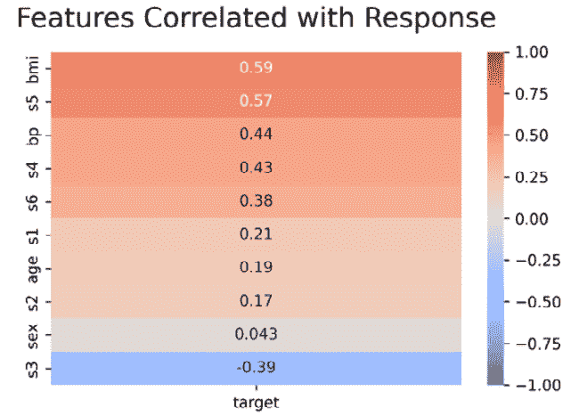

图 7.7 – 特征关联排名

当根据相关性评估特征时，我们最感兴趣的是具有高*绝对值*相关性的特征。例如，*图 7.7*中的关联排名显示了以下内容：

+   `bmi`和`s5`与响应变量表现出强烈的关联

+   `bp`、`s4`、`s6`和`s3`与响应变量表现出中等相关性

+   `s1`、`age`和`s2`与响应变量表现出弱相关性

虽然`sex`可能看起来与响应变量没有相关性，但皮尔逊相关系数不能用于分类特征。从这一相关性排名中，我们可以看到，至少，`bmi`、`s5`和`bp`可能是这个数据集中预测响应的最佳特征之一。实际上，这些特征在我们的模型中被认为是统计显著的。现在让我们讨论使用统计显著性进行选择。

### 统计显著性

使用相关性来评估特征通常是特征选择的一个良好开端。我们可以轻松地消除与响应变量不相关的特征。然而，根据问题，我们可能仍然会剩下许多与响应变量相关的特征。我们可以进一步使用特征在模型中的统计显著性来选择特征。然而，近年来，这些特征选择方法在社区中已经有些不受欢迎。因此，我们将不会专注于这些方法，但仅为了理解而描述它们。

回想当我们拟合 MLR 模型时，结果包括对模型中每个特征的统计显著性测试。我们可以使用这个测试来选择特征。基于统计显著性选择特征有三种著名的算法：**前向选择**、**后向选择**和**逐步回归**。在前向选择中，我们从模型中没有变量开始，然后每次迭代只添加一个变量，使用 p 值来选择每个迭代中要添加的最佳特征。一旦模型中任何特征的 p 值超过一个预定义的阈值，例如 0.05，我们就停止。后向选择采取相反的方法。我们从模型中的所有特征开始，然后每次迭代使用 p 值来确定最不重要的特征，逐个移除特征。最后的算法是逐步回归（也称为双向消除）。逐步回归使用前向和后向测试。从模型中没有特征开始，然后在每个迭代中，执行一次前向选择步骤，然后进行一次后向选择遍历。

这些选择方法在过去被广泛使用。然而，近年来，基于性能的方法已经变得更加普遍。现在让我们来讨论基于性能的方法。

## 特征选择的基于性能的方法

前面提到的统计特征选择方法的主要问题是它们倾向于创建**过拟合**模型。过拟合模型是一种恰好拟合给定数据但无法推广到新数据的模型。基于性能的方法通过使用称为**交叉验证**的方法来克服过拟合。在交叉验证中，我们有两个数据集：一个用于拟合模型的**训练数据集**和一个用于评估模型的**测试数据集**。我们可以从多个特征集构建模型，在训练集上拟合所有这些潜在模型，并最终根据测试集上给定指标的性能对它们进行排名。

### 模型比较

在我们讨论特征选择方法之前，让我们首先讨论如何比较模型。我们使用指标来比较模型。在基本层面上，我们可以使用指标来帮助我们确定一组特征是否比另一组特征更好，这是基于模型性能的。可以用于比较模型的指标有很多。我们将讨论两个指标，**均方误差**（MSE）和**平均绝对百分比误差**（MAPE），它们是目前回归模型中最常用的两个指标。

#### MSE

MSE 由以下公式给出，其中*N*是样本数量，y 是响应变量，ˆy 是响应变量的预测值。

MSE = 1/N ∑(i=1 to N) (y_i - ˆy_i)²

换句话说，取响应值与预测响应值之间的差异，平方这些差异，并最终取平方差异的平均值。这个指标的一个常见扩展是**均方根误差**（RMSE），它仅仅是 MSE 的平方根。当希望指标与响应变量具有相同的单位时，使用 RMSE。

#### MAPE

MAPE 由以下公式给出，其中*N*是样本数量，y 是响应变量，ˆy 是响应变量的预测值：

MAPE = 100% × N ∑(i=1 to N) |y_i - ˆy_i| / y_i

这个公式类似于 MSE 的公式，但不同的是，我们取的是百分比误差的平均值，而不是平方误差的平均值。这使得 MAPE 比 MSE 更容易解释，这是相对于 MSE 的一个显著优势。

现在我们已经讨论了模型验证和指标，让我们将这些概念结合起来，使用模型性能作为指标来进行特征选择。

## 递归特征消除

**递归特征消除**（RFE）是一种使用指标在模型中选择最佳特征数量的方法。与前面提到的向后选择方法类似，RFE 算法从模型中的所有特征开始，然后移除对模型影响最小的特征。在每一步，都会进行交叉验证。当 RFE 完成后，我们将能够看到模型在各种特征集上的交叉验证性能。

在这个例子中，我们使用了`scikit-learn` (`sklearn`)中的线性回归实现和 RFE 实现，它是 Python 生态系统中用于机器学习的主要包。在下面的代码示例中，我们设置了 RFE 使用 MAPE 作为评分指标（`make_scorer(mape ,greater_is_better=False)`），每一步移除一个特征（`step=1`），并通过`cv=2`指示使用两个交叉验证集来评分模型：

```py
linear_model = LinearRegression()
linear_model.fit(X, y)
rfecv = RFECV(
    estimator=linear_model,
    step=1,
    cv=2,
    scoring=make_scorer(mape ,greater_is_better=False),
    min_features_to_select=1
)
rfecv.fit(X,y)
```

一旦我们拟合了 RFE 对象，我们就可以查看结果，以了解模型在各个特征集上的评分情况。使用 MAPE 评分的模型性能在*图 7.8*中显示。

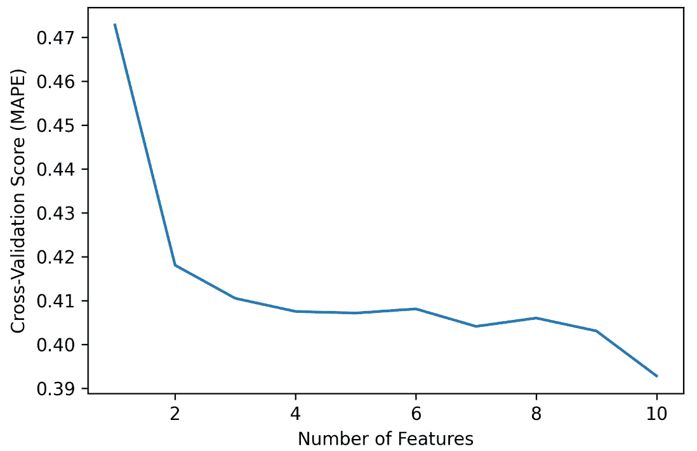

图 7.8 – 在 RFE 步骤中线性回归的性能，使用 MAPE 评分

很明显，包含所有特征会产生性能最好的模型，但包含所有 10 个特征仅比只包含五个特征的性能略有提高。虽然性能最好的模型包含所有 10 个特征，但我们仍然需要考虑模型假设并验证模型是否拟合良好。

在本节中，我们探讨了多种特征选择方法，包括统计方法和基于性能的方法。我们还讨论了指标以及如何比较模型，包括为什么需要将数据分为训练集和验证集。在下一节中，我们将探讨线性回归收敛方法。这类模型使用一种称为正则化的方法，它在某些方面类似于基于模型的特征选择。

# 收敛方法

**偏差-方差权衡**是所有统计和机器学习实践者在进行建模时必须平衡的一个决策点。过多的一方都会使结果变得无用。为了捕捉这些问题，我们查看测试结果和残差。例如，假设已经选择了一个有用的特征集和适当的模型，一个在验证集上表现良好但在测试集上表现不佳的模型可能表明方差过多，反之，一个在所有方面都表现不佳的模型可能有过多的偏差。在两种情况下，这两个模型都无法很好地泛化。然而，虽然模型中的偏差可以从一开始的模型性能不佳中识别出来，但高方差可能非常具有欺骗性，因为它在训练期间甚至验证期间都有可能表现得非常好，这取决于数据。高方差模型经常使用不必要的高的系数值，而实际上可以从不高的系数值中获得非常相似的结果。此外，在使用不必要的高的系数值时，模型更有可能处于偏差-方差平衡状态，这为它在未来的数据上良好泛化提供了更好的机会。此外，当模型系数没有夸张时，可以提供对当前因素对给定目标影响的更可靠的见解，这有助于进行更有用的描述性分析。这使我们来到了收缩的概念。

**收缩**是一种通过将模型参数系数缩小到零来减少模型方差的方法。这些系数是通过将最小二乘回归应用于模型考虑的所有变量来导出的。收缩的程度基于参数对最小二乘估计的贡献；对高平方误差有贡献的参数将会有它们的系数推向零或完全为零。在这种情况下，收缩可以用于变量消除。对于那些在整个模型拟合中不贡献高平方误差的变量，其系数值将会有最小的减少，因此对于模型拟合是有用的，假设它们包含的实际目的是经过检验的。收缩（也称为**正则化**）之所以重要，是因为它有助于模型包含有用的变量，同时防止它们引入过多的方差，从而避免过拟合。防止过多的方差对于确保模型在时间上具有良好的泛化能力特别有用。让我们来看看一些最常见的收缩技术，**岭回归**和**最小绝对收缩和选择算子**（**LASSO**）**回归**。

## Ridge 回归

回想一下，使用最小二乘回归对多元线性回归的**残差平方和**（**RSS**）的公式如下：

RSS = ∑ i=1 n (y_i − ˆβ_0 − ∑ j=1 p ˆβ_j x_ij)²

其中 *n* 是样本数量，*p* 是参数数量。岭回归添加了一个标量 *λ*，称为**调整参数**——它必须大于或等于 0——并将其乘以模型参数系数估计 ˆβj²，以创建一个**收缩惩罚**。这被添加回 RSS 方程中，使得新的最小二乘回归的拟合过程现在定义为以下：

RSS + 𝝀∑j=1pˆβj²

当λ=0 时，相应的岭回归**惩罚项**为 0。然而，当λ→∞时，模型系数趋向于零。新的拟合过程可以重写如下：

‖y − Xβ‖²² + 𝝀 ‖β‖²²

其中 RSS = ‖y − Xβ‖²²，‖β‖²²是回归系数数组的 L2 范数（欧几里得范数），*X* 是设计矩阵。进一步的简化将此简化为以下：

‖y − Xβ‖²² + 𝝀 βT β

这可以通过使用调整参数的标量乘以单位矩阵来重写为闭式形式，以推导出**岭回归系数估计** ˆβR，如下所示：

ˆβR = (X†X + 𝝀I)†XT y

简而言之，岭回归系数估计是使最小二乘回归输出最小化的系数集合如下：

ˆβR = argmin{∑i=1n(yi − ˆβ0 − ∑j=1pˆβjxij)² + 𝝀∑j=1pˆβj²}

在应用岭回归之前标准化系数

因为岭回归旨在最小化整个数据集的错误，并且用于此目的的调整参数是在对平方和的根进行归一化过程中应用 L2 范数，所以对于模型中的每个变量应用标准缩放器非常重要，这样所有变量都在相同的尺度上，在应用岭回归之前。如果不这样做，岭回归几乎肯定无法帮助模型在数据集之间泛化。

总结来说，岭回归通过使用 L2**惩罚**来减少模型中的方差，该惩罚惩罚系数的平方和。然而，需要注意的是 L2**范数**，因此岭回归**永远不会产生零值的系数**。因此，当分析师寻求在模型中使用所有项时，岭回归是减少方差的一个优秀工具。然而，岭回归不能用于变量消除。对于变量消除，我们可以使用 LASSO 回归收缩方法，它使用 L1**惩罚**来正则化系数，该惩罚使用 L1**范数**，它使用绝对值将值收缩到包括零。

让我们通过一个 Python 中岭回归实现的例子来了解一下。

首先，让我们从 `scikit-learn` 加载波士顿房价数据集。在最后一行，我们添加截距的常数。请注意，这个过程可以通过使用加利福尼亚房价数据集重复进行，尽管输入变量不同，但结果相似，可以通过运行 `from sklearn.datasets import fetch_california_housing` 代替 `from sklearn.datasets import load_boston`：

```py
from sklearn.metrics import mean_squared_error as MSE
from sklearn.model_selection import train_test_split
from sklearn.preprocessing import StandardScaler
from sklearn.datasets import load_boston
import statsmodels.api as sm
import pandas as pd
boston_housing = load_boston()
df_boston = pd.DataFrame(boston_housing.data, columns = boston_housing.feature_names)
df_boston['PRICE'] = boston_housing.target
df_boston = sm.add_constant(df_boston, prepend=False
```

这里给出了前三条记录：

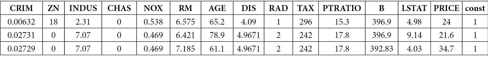

图 7.9 – 波士顿房价数据的前三条记录

我们将 `PRICE` 设置为目标。回想一下，岭回归在参数多于样本或存在过多方差时最有用。让我们假设这两个假设都成立：

```py
X = df_boston.drop('PRICE', axis=1)
y = df_boston['PRICE']
```

如前所述，`scikit-learn` 的 `StandardScaler` 函数：

```py
sc = StandardScaler()
X_scaled = sc.fit_transform(X)
```

接下来，让我们将数据分为 75/25 的训练/测试集。我们使用 `shuffle=True` 来随机打乱数据，以便测试一个随机样本，这更有可能代表总体：

```py
X_train, X_test, y_train, y_test = train_test_split(
    X_scaled, y, test_size=0.25, shuffle=True)
```

现在我们可以比较 `fit_regularized`，我们将 `method` 参数的必需参数设置为 `'elastic_net'`。我们将在稍后讨论弹性网络，但在此期间，请注意 `L1_wt` 参数在设置为 0 时应用岭回归。Alpha 是岭回归惩罚项中的调整参数 λ。小的 alpha 允许系数较大，而大的 alpha 将系数推向零。在这里，我们拟合训练数据以推导出均方误差：

```py
ols_model = sm.OLS(y_train, X_train)
compiled_model = ols_model.fit()
compiled_model_ridge = ols_model.fit_regularized(method = 'elastic_net', L1_wt=0, alpha=0.1,refit=True)
print('OLS Error: ', MSE(y_train,
    compiled_model.predict(X_train)) )
print('Ridge Regression Error: ', MSE(y_train,
    compiled_model_ridge.predict(X_train)))
```

我们可以看到岭回归的误差略高

`OLS 误差：  ``530.7235449265926`

`岭回归误差：  ``533.2278083730833`

接下来，我们拟合测试数据以查看模型在未见数据上的泛化情况。我们再次使用均方误差进行测量：

```py
print('OLS Error: ', MSE(y_test, compiled_model.predict(X_test)) )
print('Ridge Regression Error: ', MSE(y_test, compiled_model_ridge.predict(X_test)))
```

我们可以看到在测试数据上，两种方法的错误数量都增加了。然而，与岭回归方法相比，OLS 回归产生的误差略高：

`OLS 误差：  ``580.8138216493896`

`岭回归误差：  ``575.5186673728349`

在这里，我们可以观察到 *图 7**.10* 中的 OLS 回归系数和正则化系数：

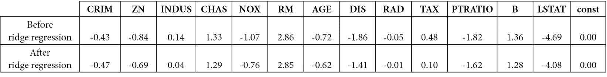

图 7.10 – 岭回归正则化前后 OLS 回归系数

## LASSO 回归

在本节前面，我们提到了变量系数的不必要高值如何导致模型方差，并且在这个过程中，减少了模型泛化的能力，如果系数合理，模型本可以更好地泛化。我们展示了如何应用岭回归来实现这一点。然而，岭回归的一个非常流行的替代方法是 LASSO 回归。LASSO 回归遵循向模型残差平方和添加惩罚项的类似程序，并试图最小化结果值（错误）。但是，LASSO 使用 L1 范数而不是 L2 范数。因此，当调整参数达到足够大时，可以获得绝对零系数值，从而作为特征选择和收缩工具。

LASSO 方程通过以下方法通过缩小每个变量的系数来最小化整体模型错误：

ˆβL = argmin{∑i=1n(yi − ˆβ0 − ∑j=1pˆβjxij)² + 𝝀∑j=1p|ˆβj|}

LASSO 与岭回归之间的唯一区别是惩罚项|ˆβj|。

选择λ

调整参数λ的值最好使用交叉验证来选择。虽然调整参数在理论上可以无限大，但通常从小于 1 的值开始，例如从 0.1 开始，以十分之一为增量增加到 1。之后，通常使用整数值。

使用与岭回归相同的数据，我们应用 LASSO 回归。在这里，我们设置`L1_wt=1`，表示将应用 L1 范数：

```py
ols_model = sm.OLS(y_train, X_train)
compiled_model = ols_model.fit()
compiled_model_lasso = ols_model.fit_regularized(method='elastic_net', L1_wt=1, alpha=0.1,refit=True)
```

我们将遵循与岭回归相同的步骤来处理 LASSO，即我们首先检查训练数据上的错误，然后再次在测试数据上检查，以查看模型如何泛化：

```py
print('OLS Error: ', MSE(y_train, compiled_model.predict(X_train)) )
print('LASSO Regression Error: ', MSE(y_train, compiled_model_lasso.predict(X_train)))
```

输出显示 OLS 回归略优于 LASSO。这可能是因为更高的方差。然而，从实际的角度来看，结果是一样的：

`OLS` `错误：530.7235449265926`

`LASSO 回归` `错误：531.2440812254207`

现在，我们需要检查模型在保留数据上的性能：

```py
print('OLS Error: ', MSE(y_test, compiled_model.predict(X_test)) )
print('LASSO Regression Error: ', MSE(y_test, compiled_model_lasso.predict(X_test)))
```

我们可以看到，两个模型基本上具有相同的错误。然而，由于特征更少，LASSO 模型可能更容易被信任以泛化到未来的数据。然而，这取决于研究者的专业知识水平：

`OLS` `错误：546.1338399374557`

`LASSO 回归` `错误：546.716239805892`

与岭回归一样，一些系数在 L1 范数正则化过程中已经被最小化。然而，我们还可以看到，使用相同的 alpha 值，四个变量已经被最小化到零，从而完全从模型中消除。其中三个特征在岭回归中被相对缩小到几乎为零，但不是`ZN`，我们在*图 7**.11*中看到它已经被减少到`0`。模型错误略有改善，这可能看起来并不显著，但考虑到消除了四个变量，我们可以认为模型具有更多的泛化能力，对内生变量的依赖性更少。

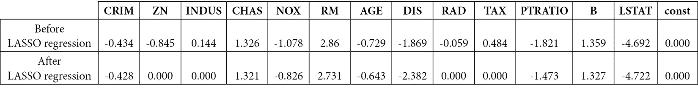

图 7.11 – LASSO 回归正则化前后 OLS 回归系数

## 弹性网络

**弹性网络**是另一种常见的收缩方法，可以应用于管理偏差-方差权衡。这种方法将调整参数应用于岭回归和 LASSO 回归的组合，其中来自任一回归的影响比例由超参数α确定。弹性网络最小化的方程如下：

( ˆ β  0,  ˆ β ) = argmin⎧ ⎪ ⎨ ⎪ ⎩ 1 _ 2n  ∑ i=1 n (y i −  ˆ β  0 − ∑ j=1 p  ˆ β  j x ij) 2 + λ( 1 − α _ 2  ∑ j=1 p  ˆ β  j 2 + α∑ j=1 p | ˆ β  j|)⎫ ⎪ ⎬ ⎪ ⎭

自然地，根据α的值，弹性网络也可以生成绝对零值的系数参数估计，其中它抵消了岭回归惩罚项。当所有输入变量都需要时——例如，如果它们已经通过如本章*特征选择*部分中概述的程序进行了剪枝——弹性网络很可能优于岭回归和 LASSO 回归，特别是在数据集中有高度相关的特征必须包含以捕捉必要方差的情况下。在下一节中，我们将讨论降维。具体来说，我们提供了一个关于主成分回归（PCR）的深入概述，它使用**主成分分析**（**PCA**）从包含相关特征的系统提取有用信息，这些特征是评估目标所必需的。

首先，让我们通过使用与岭回归和 LASSO 回归相同的相同数据，来回顾一个使用弹性网络的回归示例。遵循之前的弹性网络最小化方程，我们设置`Lt_wt=0.5`，这意味着岭回归和 LASSO 回归之间的平衡是相等的，50/50。然而，不同之处在于，我们使用了`alpha=8`而不是在岭回归和 LASSO 回归中使用的`0.1`，以在普通最小二乘回归系数上获得改进。回想一下，当调整参数接近无穷大时，系数接近 0。因此，我们可以根据弹性网络系数得出结论，8 是一个非常高的调整参数：

```py
ols_model = sm.OLS(y_train, X_train)
compiled_model = ols_model.fit()
compiled_model_elastic = ols_model.fit_regularized(method='elastic_net', L1_wt=0.5, alpha=8,refit=True)
```

让我们在训练数据上测试模型：

```py
print('OLS Error: ', MSE(y_train, compiled_model.predict(X_train)) )
print('Elastic Net Regression Error: ', MSE(y_train, compiled_model_elastic.predict(X_train)))
```

在这里，我们可以看到与普通最小二乘回归相比，弹性网络向模型中添加了误差：

`OLS` `误差：530.7235449265926`

`弹性网络回归` `误差：542.678919923863`

现在，让我们检查保留数据的模型误差：

```py
print('OLS Error: ', MSE(y_test, compiled_model.predict(X_test)) )
print('Elastic Net Regression Error: ', MSE(y_test, compiled_model_elastic.predict(X_test)))
```

观察图**7**.12 中的结果，我们可以看到弹性网络是如何在方差（这增加了训练误差）和偏差之间进行权衡的——偏差使得模型在保留数据上具有更好的泛化能力。与保留数据上的普通最小二乘回归相比，我们可以看到弹性网络有更好的结果。然而，误差的改善表明增加的偏差提供了降低误差的更好机会，但这并不是可以期待的事情：

`OLS` `误差：546.1338399374557`

`弹性网络回归` `误差：514.8301731640446`

在这里，我们可以看到弹性网络实施前后的系数：

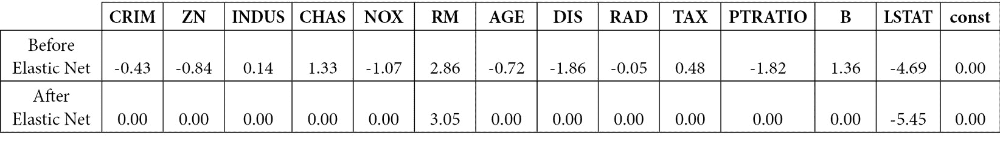

图 7.12 – 弹性网络正则化前后 OLS 回归系数

当调整参数值足够大（`alpha=8`）时，我们可以看到，大多数平衡弹性网络中的系数都被迫变为绝对零。唯一剩下的系数与 OLS 回归相比具有相对较大的值。值得注意的是，对于保留系数的变量（`RM`和`LSTAT`），弹性网络增加了这两个系数，而岭回归和 LASSO 要么略微减少了它们。

# 降维

在本节中，我们将使用一种特定的技术——**PCR**——来研究 MLR。当我们需要处理多重共线性数据问题时，这种技术是有用的。多重共线性发生在独立变量高度相关于另一个独立变量时，或者一个独立变量可以在回归模型中从另一个独立变量预测出来。高相关性在拟合模型时可能会对结果产生不良影响。

PCR 技术基于 PCA，在无监督机器学习中用于数据压缩和探索性分析。其背后的思想是使用降维技术 PCA 对这些原始变量进行处理，以创建新的不相关变量。在这些新变量上获得的信息帮助我们理解它们之间的关系，然后应用 MLR 算法到这些新变量上。PCA 技术也可以用于分类问题，我们将在下一章中讨论。

## PCA – 实践入门

PCA 是一种基于线性代数的降维技术，通过使用原始变量的线性组合线性变换数据到新的坐标系。这些新的线性组合被称为**主成分**（**PCs**）。PCA 技术与之前章节中提到的特征选择技术或收缩方法的区别在于，原始独立变量被保留，但新的 PC 变量被转换到新的坐标系中。换句话说，PCA 使用原始数据来达到新的表示或新的结构。PC 变量的数量与原始独立变量的数量相同，但这些新的 PC 变量之间是不相关的。PC 变量是从最大到最小变异量进行创建和排序的。原始独立变量和新的转换 PC 变量之间的方差和是相同的。

在进行 PCA 之前，我们通过对每个数据点减去均值并归一化每个独立变量的标准差对数据集进行预处理。在高级结构中，PCA 技术的目标是找到向量 v1, v2, … , vk，使得数据集中的任何数据点 x 都可以近似表示为以下线性组合：

x = ∑ i=1 k a_i v_i

对于一些常数 ai，其中 i = 1, k。假设我们有这些 k 个向量；那么，每个数据点都可以写成 Rk 空间中的一个向量，对应于投影：

x = <x, v1> ⋅ v1 + <x, v2> ⋅ v2 + … + <x, vk> ⋅ vk

换句话说，如果我们有 d 个原始独立变量，我们将构建一个 d × (k−1)维度的变换矩阵，可以将任何数据点映射到一个新的 k 维变量子空间，其中 k 小于 d。这意味着我们通过原始独立变量的线性变换进行了降维。PCA 有几个应用，但在这里，我们将引用一篇发表在*Nature (2008)*上的论文，*欧洲内的基因镜像地理* ([`pubmed.ncbi.nlm.nih.gov/18758442/`](https://pubmed.ncbi.nlm.nih.gov/18758442/))。作者考虑了一个样本，其中 3,000 名欧洲个体在人类基因组中超过 500 万个可变 DNA 位点进行了基因分型；然后，每个个体使用超过 500 万个遗传标记来表示。这意味着它产生了一个维度大于 3,000 x 500,000 的矩阵。他们对数据集进行了 PCA 分析，以找到最有意义的向量 v1 和 v2（第一和第二成分），其中每个人只对应两个数字。作者根据两个数字在二维平面上的位置绘制了每个人的点，并根据他们来自的国家对每个点进行着色。

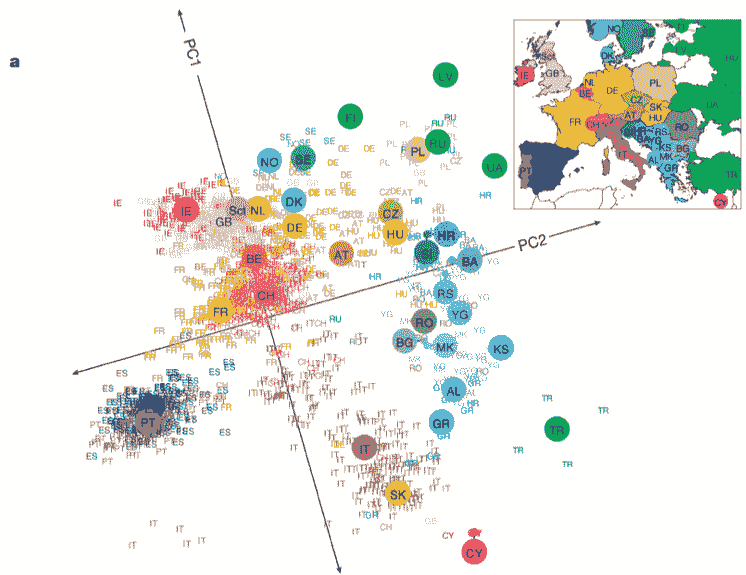

图 7.13 – 欧洲基因镜像地理的 PCA 分析

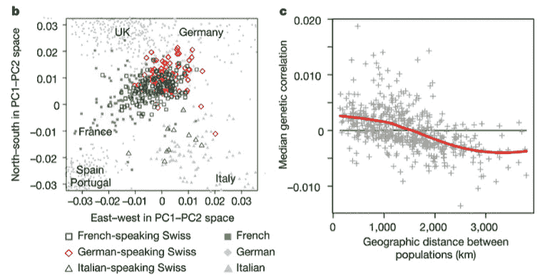

图 7.14 – 欧洲基因镜像地理的 PCA 分析

令人惊讶的是，PCA 技术在图表中表现良好，显示了与欧洲地图相似的遗传相似性。

在下一部分，我们将讨论如何在实际中利用 PCA 进行 PCR 分析。

## PCR – 一项动手的薪资预测研究

要进行 PCR 分析，我们首先进行 PCA 以获得主成分，然后决定保留包含最多可解释变异量的前 k 个主成分。在这里，k 是新 PC 变量空间的维度。最后，我们在这些新变量上拟合多元线性回归（MLR）。

我们将考虑一个来自开源 Kaggle 数据的动手薪资预测任务 – [`www.kaggle.com/datasets/floser/hitters`](https://www.kaggle.com/datasets/floser/hitters) – 以说明 PCR 方法。如果想要跟随，请从 Kaggle URL 下载数据集：

1.  **设置和加载数据**

导入在本研究中要使用的必要库，并加载 Hitters 数据。为了简单起见，我们将删除数据集中的所有缺失值。有 19 个独立变量（16 个数值型和 3 个分类型）以及目标变量‘`Salary`’。分类独立变量‘`League`’，‘`Division`’，和‘`NewLeague`’被转换为虚拟变量。我们在进行 PCA 步骤之前对特征进行预处理和标准化，并创建训练集和测试集：

```py
# Import libraries
import numpy as np
import pandas as pd
import matplotlib.pyplot as plt
from sklearn.preprocessing import scale
from sklearn.linear_model import LinearRegression
from sklearn.model_selection import KFold, cross_val_score, train_test_split
from sklearn.metrics import mean_squared_error
from sklearn.decomposition import PCA
#location of dataset
url = "/content/Hitters.csv"
#read in data
data = pd.read_csv(url).dropna() # to simply the analysis, we drop all missing values
# create dummies variables
dummies_variables = pd.get_dummies(data[['League', 'Division', 'NewLeague']])
# create features and target
target = data['Salary']
feature_to_drop = data.drop(['Salary', 'League', 'Division', 'NewLeague'],axis=1).astype('float64')
X = pd.concat([feature_to_drop, dummies_variables[['League_N', 'Division_W', 'NewLeague_N']]], axis=1)
#scaled data - preprocessing
X_scaled = scale(X)
# train test split
X_train, X_test, y_train, y_test = train_test_split(X_scaled, target, test_size=0.2, random_state=42)
```

1.  **生成所有主成分**

作为下一步，我们为训练集生成所有主成分。这会产生 19 个新的 PC 变量，因为原始有 19 个独立变量：

```py
# First generate all the principal components
pca = PCA()
X_pc_train = pca.fit_transform(X_train)
X_pc_train.shape
```

1.  **确定要使用的最佳主成分数量**

下一步是执行 10 折交叉验证 MLR，并使用 RMSE 选择最佳主成分数量：

```py
# Define cross-validation folds
cv = KFold(n_splits=10, shuffle=True, random_state=42)
model = LinearRegression()
rmse_score = []
# Calculate MSE score - based on 19 PCs
for i in range(1, X_pc_train.shape[1]+1):
    rmse = -cross_val_score(model, X_pc_train[:,:i], y_train, cv=cv, scoring='neg_root_mean_squared_error').mean()
    rmse_score.append(rmse)
# Plot results
plt.plot(rmse_score, '-o')
plt.xlabel('Number of principal components in regression')
plt.ylabel('RMSE')
plt.title('Salary')
plt.xlim(xmin=-1)
plt.xticks(np.arange(X_pc_train.shape[1]), np.arange(1, X_pc_train.shape[1]+1))
plt.show()
```

这是生成的图表：

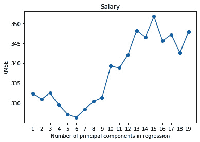

图 7.15 – 主成分数量

从这里我们可以看到最佳主成分数量是 6，对应于最低的交叉验证 RMSE。

1.  **重新训练模型并进行预测**

我们将使用这个数量在训练数据上训练一个回归模型，并在测试数据上进行预测：

```py
# Train regression model on training data
model = LinearRegression()
model.fit(X_pc_train[:,:6], y_train)
pcr_score_train = -cross_val_score(model, X_pc_train[:,:6], y_train, cv=cv, scoring='neg_root_mean_squared_error').mean()
# Prediction with test data
X_pc_test = pca.fit_transform(X_test)[:,:6]
pred = model.predict(X_pc_test)
pcr_score_test = mean_squared_error(y_test, pred, squared=False)
```

注意，PCR 分析比特征选择或收缩方法更难解释结果，并且如果前几个主成分能够捕捉到最大可解释的变异性，这种分析的性能会更好。

# 摘要

在本章中，我们讨论了 MLR 的概念及其实现的相关主题。这些主题包括特征选择方法、收缩方法以及主成分回归（PCR）。使用这些工具，我们能够展示出减少模型过度方差风险的方法。在这样做的同时，我们也能够引入模型偏差，使得模型在未见数据上有更好的泛化机会，并尽可能减少过度拟合时经常遇到的问题。

在下一章中，我们将通过介绍逻辑回归开始对分类进行讨论，逻辑回归将 sigmoid 曲线拟合到线性回归模型中，以推导出二元类成员的概率。

# 第三部分：分类模型

在本部分，我们讨论了可以使用分类解决的问题类型、相关系数和决定系数、多元建模、模型选择以及使用正则化的变量调整。

它包括以下章节：

+   *第八章*，*离散模型*

+   *第九章*，*判别分析*
