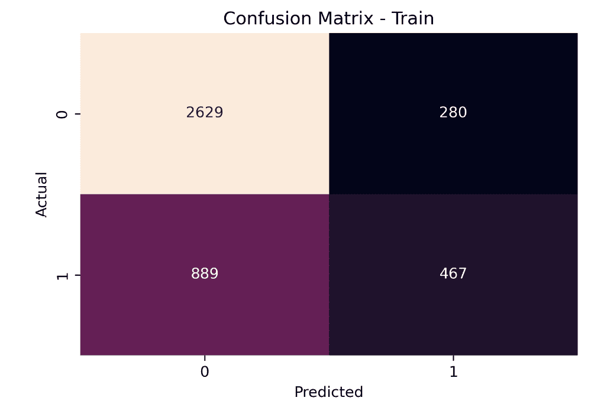
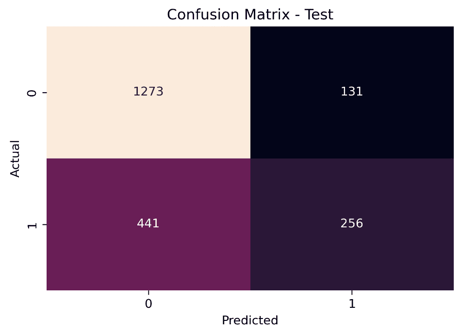
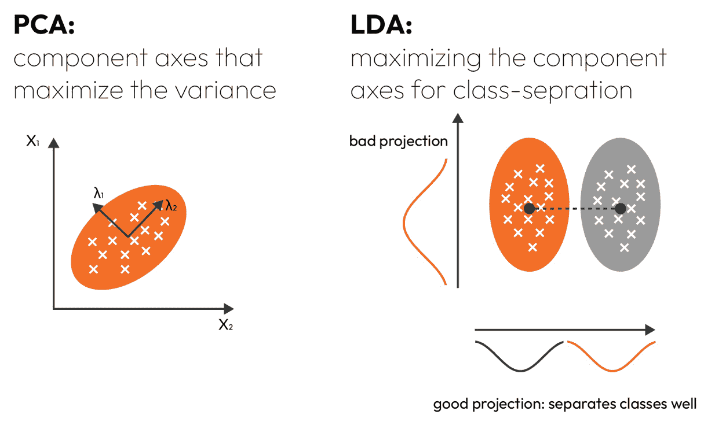
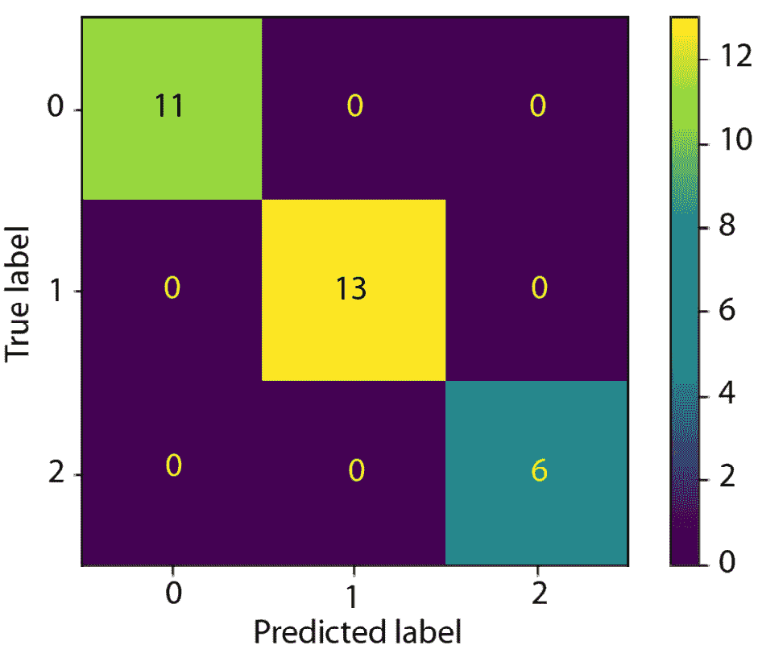
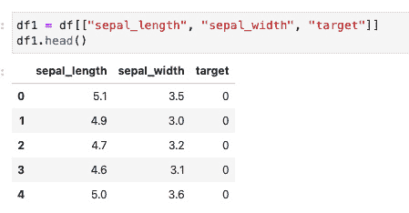
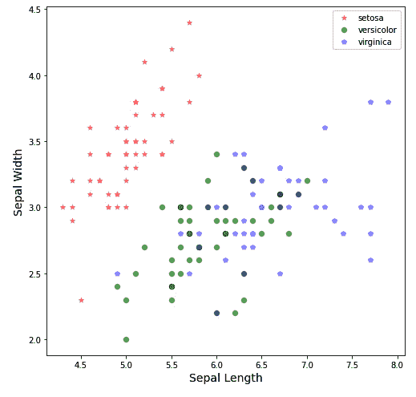
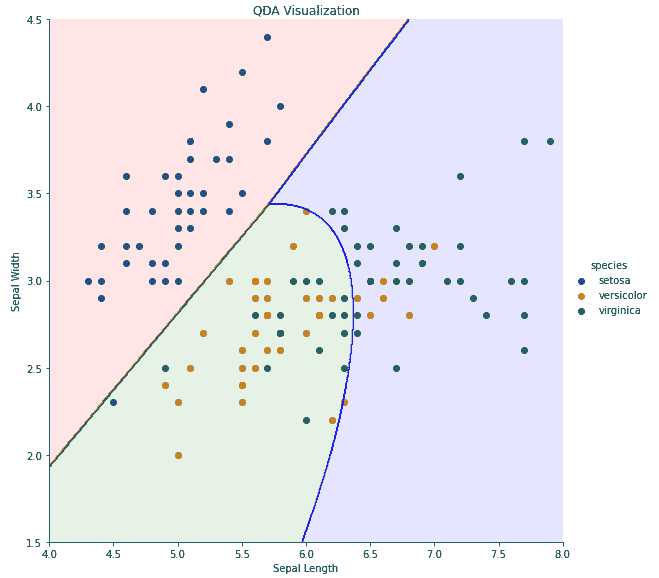

# 9

# 判别分析

在上一章中，我们讨论了离散回归模型，包括使用逻辑回归的分类。在本章中，我们将从概率概述开始，扩展到条件概率和独立概率。然后，我们将讨论这两种理解概率定律的方法如何构成贝叶斯定理的基础，贝叶斯定理直接用于扩展称为贝叶斯统计的方法。在此主题之后，我们将深入研究**线性判别分析（LDA**）和**二次判别分析（QDA**），这两种强大的分类器使用贝叶斯概率建模方法来建模数据。

在本章中，我们将涵盖以下主要内容：

+   贝叶斯定理

+   LDA

+   QDA

# 贝叶斯定理

在本节中，我们将讨论**贝叶斯定理**，该定理用于本章后面描述的分类模型。我们将从讨论概率的基本知识开始本章。然后，我们将探讨相关事件，并讨论贝叶斯定理如何与相关事件相关联。

## 概率

概率是衡量事件发生或特定结果发生的可能性的一种度量。通常，我们可以将事件分为两种类型的事件：**独立事件**和**相关事件**。事件类型之间的区别在于名称。独立事件是指不受其他事件发生或影响的事件，而相关事件则受其他事件发生或影响。

让我们考虑一些这些事件的例子。对于第一个例子，考虑一个公平的硬币抛掷。抛掷硬币可以导致两种状态之一：正面和反面。如果硬币是公平的，抛掷硬币得到正面或反面的概率是二分之一。这意味着在公平的硬币抛掷中，正面或反面的概率是 0.5。当事件可计数时，我们可以使用以下公式来计算概率：

P(E) = 期望结果的数量 / 总结果数量

在这里，P(E)是期望结果发生的概率。在抛硬币的例子中，期望结果是正面或反面，每个结果在每次抛掷中只能发生一次。因此，对于抛硬币，期望事件的数量是一个。总结果的数量是两个，因为抛硬币有两种可能的状态。将这些数字代入前面的方程，得到正面和反面的概率都是 0.5。现在，运用你的经验，之前的抛硬币是否给你关于下一次抛掷同一硬币的任何知识？它不会，因为*每次抛掷都是相互独立的*；它是一个独立事件。

现在，让我们考虑另一个例子。假设我们有一个装有三个红弹珠和五个蓝弹珠的袋子。让我们计算从袋子中抽取红弹珠的概率：P(红)。总共有八个弹珠，这是方程中的总结果数。我们想要抽取一个红弹珠，这意味着期望结果的数量是三个。这意味着从袋子中抽取红弹珠的概率是 3 / 8。现在，让我们计算从袋子中抽取蓝弹珠的概率：P(蓝)。袋中有五个蓝弹珠和八个总弹珠，所以从袋子中抽取蓝弹珠的概率是 5 / 8。注意，这两个概率的和是一：P(红) + P(蓝) = 3 / 8 + 5 / 8 = 1。这提出了概率的一个重要特性：总概率必须等于一。当然，这意味着一旦我们计算了抽取红弹珠的概率，我们就可以通过从一中减去抽取红弹珠的概率来计算抽取蓝弹珠的概率。概率的特性非常有用，并且在统计学和**机器学习**（**ML**）中经常使用。

回到红蓝弹珠的例子，让我们思考这个例子所代表的事件类型。我们从袋子中抽取一个弹珠。现在，有两个可能的选择：1）我们替换所抽取的弹珠，然后再次从袋子中抽取一个弹珠，2）我们不替换弹珠，然后从袋子中剩余的七个弹珠中抽取一个新的弹珠。第一种情况称为**带替换的选择**。带替换的选择是一个独立事件，因为每次从袋子中抽取之前袋子都会被重置。第二种情况称为**不带替换的选择**。不带替换的选择是相关事件所在的地方。第一次抽取弹珠的概率与之前描述的相同（一个独立事件）。然而，如果弹珠没有被替换，袋子的状态已经改变，下一次弹珠抽取的概率取决于上一次抽取的是哪一个。然后，在不带替换的选择中，每次后续的弹珠抽取都是一个相关事件。在讨论相关事件时，使用**条件概率**来描述事件是有用的。现在，让我们来讨论条件概率。

## 条件概率

让我们从正式的定义开始。当我们有相关事件时，我们可能对在事件 A 发生后事件 B 的概率感兴趣，这意味着我们想知道事件 A 发生后事件 B 的概率。这被称为事件 A 给定事件 B 的条件概率，表示为 P(B | A)。这可以理解为“在事件 A 已经发生的情况下事件 B 的概率。”这可能有点模糊，所以让我们从我们上一个例子来探讨条件概率。

假设事件 A 是抽出一个红弹珠，事件 B 是抽出一个蓝弹珠。我们想要找到在已经抽出一个红弹珠的条件下抽出一个蓝弹珠的条件概率，我们可以表示为 P(蓝 | 红)。让我们通过这个例子来解决这个问题。在从袋子里抽出一个红弹珠后，剩下七个弹珠：两个红弹珠和五个蓝弹珠。我们使用相同的方程来计算从新的集合中选择蓝弹珠的概率，这给我们带来了 5/7 的概率。这意味着在已经抽出一个红弹珠的条件下抽出一个蓝弹珠的条件概率是 5/7。

现在我们已经讨论了条件概率，让我们来看看从袋子里抽取两次的概率。正式地说，我们想要计算事件 A 和事件 B 的概率。继续跟随我们的例子，让我们计算先抽出一个红弹珠然后抽出一个蓝弹珠的概率。我们可以用以下方程来描述两个连续事件的概率：

P(A 和 B) = P(A) * P(B | A)

用话来说，A 后跟 B 的概率是事件 A 的概率乘以在事件 A 发生的条件下事件 B 的概率。在我们的例子中，我们已经计算了 P(红) 和 P(蓝 | 红)。我们可以使用这些值来计算先抽出一个红弹珠然后抽出一个蓝弹珠的概率 P(红和蓝)，如下所示：

P(红和蓝) = P(红) * P(蓝 | 红) = 3/8 * 5/7 = 15/56 ≅ 0.27

进行计算后，我们发现 P(红和蓝) 大约是 0.27。

现在，出于好奇，让我们再次进行计算，但*交换颜色的顺序*；先抽出一个蓝弹珠然后抽出一个红弹珠的概率或 P(蓝和红)。遵循与上一个例子中相同的逻辑，我们将发现 P(蓝) = 5/8 和 P(红 | 蓝) = 3/7。因此，方程看起来是这样的：

P(蓝和红) = P(蓝) * P(红 | 蓝) = 5/8 * 3/7 = 15/56 ≅ 0.27

注意到 P(红和蓝) 和 P(蓝和红) 具有相同的概率。这并非巧合。这被称为贝叶斯定理，我们将在下一节讨论。

## 讨论贝叶斯定理

在上一节关于条件概率的部分，我们在从袋子里抽弹珠的例子中偶然遇到了贝叶斯定理。让我们更详细地讨论贝叶斯定理。

贝叶斯定理是统计学中一个称为**贝叶斯统计**的领域的基石。贝叶斯统计的核心思想是，给定一个先验概率，我们使用新信息来更新概率估计。虽然贝叶斯统计的完整描述超出了本书的范围，但我们将讨论贝叶斯定理与本书中讨论的概念的相关性。我们通常用以下方程来描述贝叶斯定理：

P(B|A) = P(A|B) * P(B) / P(A)

在贝叶斯术语中，P(B)被称为**先验**，P(B | A)被称为**后验**。后验给出了给定另一个事件时的更新。让我们用一个现实世界的例子来利用这个定理。

假设我们想要根据测试结果来确定某人是否患有疾病。我们可以在贝叶斯定理中这样表示：

P(sick|test pos) = P(test pos|sick)P(sick) __________________ P(test pos)

在这里，P(sick)是患病的概率，P(test pos)是获得阳性测试结果的概率，P(test pos|sick)是当测试的患者患病时的阳性测试结果的条件概率（也称为测试的准确度）。

对于这个例子，我们将假设患病的概率为 0.2，测试的准确度为 0.95，假阳性率为 0.3。在这个例子中，先验概率 P(sick)=0.2。我们可以通过测试来提高我们对某人是否患有疾病的认识。我们想要找到后验概率：P(sick|test pos)。

由于我们知道测试的准确度为 0.95，并且已知先验概率，我们已知方程分子中各项的值。为了找到 P(test pos)，我们需要考虑所有可能获得阳性测试结果的情况，这可能是真阳性或假阳性。我们如下计算阳性测试结果的概率：

P(test pos) = P(test pos|sick)P(sick) + P(test pos|not sick)P(not sick)

回想一下，可能状态的总概率必须等于 1：P(not sick) = 1 − P(sick) = 0.8。考虑到这一点，我们可以计算 P(sick|test pos)：

P(sick|test pos) = 0.95(0.2) ______________ 0.95(0.2) + 0.3(0.8) ≅ 0.44

给定一个测试结果，我们看到在额外信息的情况下，患者生病的可能性从 0.2 增加到 0.44。0.44 不是一个特别令人信服的结果。这主要是因为测试的假阳性率相对较高，为 0.3，尽管测试的准确度很高。如果我们还不信服，我们可以再次使用 0.44 作为新的先验概率来运行测试。假设第二次测试结果为阳性，我们会得到以下结果：

P(sick|test pos) = 0.95(0.441) __________________ 0.95(0.441) + 0.3(1 − 0.441) ≅ 0.71

第二次阳性测试提供了一个更有说服力的结果 0.71。我们可以继续迭代地通过结合额外的测试结果来改进患者生病的概率估计。这种概率估计的增量改进是贝叶斯统计的基本思想。

本节包含了对概率的介绍。我们涵盖了独立事件和依赖事件，然后提供了关于依赖事件的更多细节，这导致了贝叶斯定理的引入。在下一节中，我们将讨论一种使用贝叶斯定理的分类模型。

# 线性判别分析

在上一章中，我们讨论了逻辑回归作为一种分类模型，它利用线性回归直接对给定输入分布的目标分布概率进行建模。这种方法的另一种选择是 LDA。LDA 使用贝叶斯定理构建的决策边界来建模给定每个类别的输入变量分布的目标分布类成员概率。在我们有*k*个类别的情况下，使用贝叶斯定理，LDA 类成员的概率密度函数简单地为 P(Y = k|X = x)，对于任何离散随机变量*X*。这依赖于变量*X*中观察值*x*属于第*k*个类别的后验概率。

在继续之前，我们必须首先注意 LDA 做出三个相关的假设：

+   每个输入变量都是正态分布的。

+   在所有目标类别之间，预测变量之间存在**相同的协方差**。换句话说，所有输入变量的共享方差是均匀的。因此，将每个输入变量**标准化**以具有 0 的均值和**缩放到单位方差**（标准差为 1）是有用的。

+   假设样本是独立的；**随机抽样**对于避免**序列或****集群效应**带来的复杂情况至关重要。

在满足这些假设的情况下，我们可以假设类概率密度函数是高斯（正态）分布的，因此，在一维形式（一个输入变量）中，我们有以下密度函数：

1 _ √ _ 2π  σ k  e  −1 _ 2σ k 2(x−μ k) 2

这里，μ k 是第*k*个类别的均值，σ k 2 是第*k*个类别的方差。在多变量情况下，正态概率密度函数如下：

1 _  2π p/2 √ _ |D|   e −1 _ 2 (x−μ) TD −1(x−μ)

在这里，*D*是输入变量的协方差矩阵，*p*是输入变量的数量（或参数），*π*是先验概率。这里展示了后验概率的单变量计算（其中*k*对应于第*k*个类别，*K*对应于类别数量）：

π k  1 _ √ _ 2π  σ e  −1 _ 2σ 2(x−μ k) 2  ____________   ∑ i=1 K  π i  1 _ √ _ 2π  σ e  −1 _ 2σ 2(x−μ i) 2

对于多变量情况，计算如下：

π k  1 _ √ _ |D|  e −1 _ 2 (x−μ) TD −1(x−μ)   _______________   ∑ i=1 K  π i  1 _ √ _ |D|  e −1 _ 2 (x−μ) TD −1(x−μ) .

单变量线性判别函数，δ k(x)，可以写成以下形式：

δ k(x) =  x * μ k _ σ 2  −  μ k 2 _ 2 σ 2  + log(π k)

这里，具有δ k(x)最大值的类别将其标签分配给给定的观察值。这使用了*K*个类别的贝叶斯决策边界：

x =  μ 1 2 − μ 2 2 − … − μ K 2   ____________  K(μ 1 − μ 2) .

对于多变量情况，遵循相同贝叶斯决策边界的线性判别函数看起来如下：

δ k(x) = x T D −1 μ k −  1 _ 2  μ k T D −1 μ k + log(π k).

现在我们已经确定了概率密度函数，计算类别成员后验概率、贝叶斯决策边界和线性判别函数，我们可以理解为什么 LDA 所需的假设非常重要。虽然可以使用变换来使数据符合所需的假设，但这些变换也必须能够适应未来的数据集。因此，如果数据频繁变化，并且需要大量的变换来满足 LDA 在训练和测试中产生有用结果所需的参数假设，这可能不是这个任务的正确分类方法（例如，**QDA** 可能更有用）。然而，如果这些假设可以在研究者的舒适范围内得到满足，并且有足够的主题知识来确认这一点，LDA 是一个出色的算法，能够在非常大的数据集上产生高度可靠和稳定的结果，这由大的特征空间和高观测计数定义。LDA 在较小的数据集上表现也很好。

让我们看看一个实际例子。让我们从 `statsmodels` 加载 `affairs` 数据集，这样我们可以检查类别不平衡：

```py
import statsmodels.api as sm
df_affairs = sm.datasets.fair.load().data
total_count = df_affairs.shape[0]
positive_count = df_affairs.loc[df_affairs['affairs'] > 0].shape[0]
positive_pct = positive_count / total_count
negative_pct = 1 - positive_pct
print("Class 1 Balance: {}%".format(round(positive_pct*100, 2)))
print("Class 2 Balance: {}%".format(round(negative_pct*100, 2)))
```

在这里，我们可以看到以下类别不平衡：

`Class 1` `Balance: 32.25%`

`Class 2` `Balance: 67.75%`

我们可以看到类别不平衡为 67.75/32.25。类别不平衡通常不会成为一个大问题，直到它接近 90/10，所以我们将保持现状，不做任何额外的工作，例如上采样或下采样。我们将任何大于 0 的 `affairs` 值重新编码为 1，使其成为一个二元分类问题：

```py
df_affairs['affairs'] = np.where(df_affairs['affairs'] > 0, 1, 0)
```

让我们选择我们想要使用的特征：

```py
X=df_affairs[['rate_marriage','age','yrs_married','children','religious','educ','occupation','occupation_husb']]
y=df_affairs['affairs']
```

请记住，对于 LDA 有效地产生线性分离边界，输入特征的标准差必须在两个类别中相同。使用下面显示的方法，我们可以看到所有输入特征在两个目标类别中都共享相同的标准差，除了 `rate_marriage`。这里的标准差差异大约为 20%。考虑到我们有八个输入特征，并且模型中的所有特征都将进行缩放，这很可能不会成为一个问题。如果模型表现不佳，根据这个信息，我们可以合理地假设这不是算法的错，因为所需的假设已经得到满足。相反，更有可能的是我们没有足够多的特征或观测值来完全解释目标。我们排除了 `affairs`，因为那是目标变量，以及 `occupation` 和 `occupation_husb`，因为它们是分类编码，由于我们根据分析范围不认为它们是序数，所以将进行独热编码：

```py
df_affairs_sd = pd.concat([X, y], axis=1)
for col in df_affairs_sd.columns:
    if col not in ['affairs','occupation','occupation_husb']:
        print('Affairs = 0, Feature = {}, Standard Deviation = {}'.format(col, round(np.std(df_affairs_sd.loc[df_affairs_sd['affairs'] == 0, col]), 2)))
        print('Affairs = 1, Feature = {}, Standard Deviation = {}'.format(col, round(np.std(df_affairs_sd.loc[df_affairs_sd['affairs'] == 1, col]), 2)))
```

`Affairs = 0, Feature = rate_marriage, Standard Deviation =` `0.82`

`Affairs = 1, Feature = rate_marriage, Standard Deviation =` `1.07`

`Affairs = 0, Feature = age, Standard Deviation =` `6.81`

`Affairs = 1, Feature = age, Standard Deviation =` `6.7`

`Affairs = 0, Feature = yrs_married, Standard Deviation =` `7.1`

`Affairs = 1, Feature = yrs_married, Standard Deviation =` `7.18`

`Affairs = 0, Feature = children, Standard Deviation =` `1.42`

`Affairs = 1, Feature = children, Standard Deviation =` `1.41`

`Affairs = 0, Feature = religious, Standard Deviation =` `0.89`

`Affairs = 1, Feature = religious, Standard Deviation =` `0.84`

`Affairs = 0, Feature = educ, Standard Deviation =` `2.21`

`Affairs = 1, Feature = educ, Standard Deviation =` `2.09`

在上一章中，我们确定`occupation`和`occupation_husb`在解释婚外情方面没有捕捉到太多差异，因此我们将从数据集中删除`occupation_husb`以最小化 one-hot 编码的体积，如下所示：

```py
import pandas as pd
pd.options.mode.chained_assignment = None
X['occupation'] = X['occupation'].map({1:'Occupation_One',
                                       2:'Occupation_Two',
                                       3:'Occupation_Three',
                                       4:'Occupation_Four',
                                       5:'Occupation_Five',
                                       6:'Occupation_Six'})
X = pd.get_dummies(X, columns=['occupation'])
X.drop('occupation_husb', axis=1, inplace=True)
```

让我们构建一个包含 33%总体数据的测试集的训练/测试分割：

```py
from sklearn.model_selection import train_test_split
X_train, X_test, y_train, y_test = train_test_split(X, y, test_size=0.33, random_state=42)
```

我们希望保留原始数据的一个副本，但如前所述，我们还需要对数据进行中心化和缩放，以便 LDA 有最佳成功的机会。因此，我们将复制`X`数据并对其进行缩放。然而，请注意，我们不想缩放 one-hot 编码的数据，因为 one-hot 编码不能缩放并保留其意义。因此，我们将使用 scikit-learn 的`ColumnTransformer()`管道函数将`StandardScaler()`应用于除了 one-hot 编码列之外的所有列，如下所示：

```py
from sklearn.compose import ColumnTransformer
from sklearn.preprocessing import StandardScaler
X_train_sc = X_train.copy()
X_test_sc = X_test.copy()
ct = ColumnTransformer([
        ('', StandardScaler(), ['rate_marriage','age','yrs_married','children','religious','educ'])], remainder='passthrough')
X_train_sc = ct.fit_transform(X_train_sc)
ct = ColumnTransformer([
        ('', StandardScaler(), ['rate_marriage','age','yrs_married','children','religious','educ'])], remainder='passthrough')
X_test_sc = ct.fit_transform(X_test_sc)
```

现在，让我们将 LDA 模型拟合到训练数据上。我们将模型拟合到训练数据上，然后使用它来预测训练数据以获得性能基准。然后，我们将使用该模型来预测测试数据，以查看模型在未见数据上的泛化能力如何。

按照如下方式拟合数据：

```py
from sklearn.discriminant_analysis import LinearDiscriminantAnalysis
lda = LinearDiscriminantAnalysis()
lda.fit(X_train_sc, y_train)
```

在这里，我们构建函数来测量精确度和召回率。精确度是一个基本告诉你模型在找到目标（`affairs = 1`）的正值方面做得有多好，并且不包含其他任何值（`affairs = 0`）。召回率是一个实际告诉你模型在找到所有目标正值方面做得有多好，不管它找到多少其他值。理想的情况是这两个指标都非常高。然而，这可能并不可能。如果两者都不是非常高的，使用案例应该确定哪个指标更重要：

```py
def precision_score(true_positives:int, false_positives:int):
    precision = true_positives / (true_positives + false_positives)
    return precision;
def recall_score(true_positives:int, false_negatives:int):
    recall = true_positives / (true_positives + false_negatives)
    return recall;
```

现在，让我们运行模型并验证性能：

```py
from sklearn.metrics import confusion_matrix
import seaborn as sns
y_train_pred = lda.predict(X_train_sc)
cf_train = confusion_matrix(y_train, y_train_pred, labels=[0,1])
tn_train, fp_train, fn_train, tp_train = cf_train.ravel()
cf_matrix = sns.heatmap(cf_train, annot=True, fmt='g', cbar=False)
cf_matrix.set(xlabel='Predicted', ylabel='Actual', title='Confusion Matrix - Train');
print('Precision on Train: ', round(precision_score(tp_train, fp_train), 4))
print('Recall on Train: ', round(recall_score(tp_train, fn_train), 4))
```

在这里，我们可以看到我们的模型在训练数据上的结果：

`训练集精确度:` `0.6252`

`训练集召回率:` `0.3444`

在这里，我们可以使用混淆矩阵可视化性能，以比较训练数据上的实际目标值与预测值：



图 9.1 – LDA 训练数据的混淆矩阵

让我们在测试数据上重复这个过程：

```py
y_test_pred = lda.predict(X_test_sc)
cf_test = confusion_matrix(y_test, y_test_pred, labels=[0,1])
tn_test, fp_test, fn_test, tp_test = cf_test.ravel()
cf_matrix = sns.heatmap(cf_test, annot=True, fmt='g', cbar=False)
cf_matrix.set(xlabel='Predicted', ylabel='Actual', title='Confusion Matrix - Test');
print('Precision on Test: ', round(precision_score(tp_test, fp_test), 4))
print('Recall on Test: ', round(recall_score(tp_test, fn_test), 4))
```

在这里，我们可以看到我们的模型在测试数据上的结果：

`测试集精确度:` `0.6615`

`测试集召回率:` `0.3673`

在这里，我们可以使用混淆矩阵可视化性能，以比较测试数据上的实际目标值与预测值：



图 9.2 – LDA 测试数据的混淆矩阵

从这些结果中，我们可以看到使用我们在训练数据上构建的模型，在训练集和测试集上，分数在精确度和召回率方面是一致的，因此我们可以得出结论，与基准（训练）性能相比，该模型在未见过的数据上具有良好的泛化能力。然而，性能并不出色。问题可能在于我们的目标编码并不十分有用（也许事务的离散化并不有用，应该采用统计方法来离散化值）。然而，也有可能特征没有充分解释`response`变量中的方差，以至于无法构建一个非常有用的模型（也可能事务根本无法预测，并且有太多的随机噪声难以建模）。然而，为了本章的目的，我们能够展示如何构建和测试使用 LDA 的模型，以及在进行数据建模之前必须采取的预处理步骤。

## 监督维度降低

与 PCA 不同，PCA 可以用于执行无监督的维度降低，而 LDA 可以用来执行监督的维度降低。也就是说，在训练模型以学习输入方差与输出目标之间的关系后，可以得到一组派生特征。这些差异在以下图中展示：



图 9.3 – 维度降低：LDA 与 PCA 的比较

假设我们使用 LDA 进行分类时数据产生了良好的结果。那么，我们可以自信地使用相同的数据来构建一个监督维度降低技术。为了执行这个操作，我们会使用`fit_transform()`方法来转换输入数据，使其与目标相关（而不是我们之前用来拟合分类器的`fit()`函数）。与分类器一样，数据仍然应该符合 LDA 模型的假设。*数据根据响应变量的类别数量进行降低*。当类别数量为*C*时，降低后的特征数量将是*C-1*。因为我们目标变量`y`中只有两个类别，所以 LDA 将输入特征降低到一维：

```py
from sklearn.discriminant_analysis import LinearDiscriminantAnalysis
lda = LinearDiscriminantAnalysis()
X_reduced = lda.fit_transform(X_train_sc, y_train)
```

我们可以看到数据现在已经被简化为一维特征：

```py
print('Input data dimensions: ', X_train_sc.shape)
print('Transformed data dimensions: ', X_reduced.shape)
```

在这里，我们可以看到我们的数据从 12 个特征降低到了 1 个：

`输入数据维度：(``4265, 12`)`

`转换后数据维度：(``4265, 1`)`

# 二次判别分析

在上一节中，我们讨论了 LDA。每个类中的数据需要来自多变量高斯分布，并且协方差矩阵在不同类之间是相同的。在本节中，我们考虑另一种类型的判别分析，称为 QDA，但 QDA 的假设可以在协方差矩阵假设上放宽。在这里，我们不需要协方差矩阵在不同类之间相同，但每个类都需要有自己的协方差矩阵。对于观察到的每个类，仍然需要具有类特定均值向量的多变量高斯分布来执行 QDA。我们假设来自第 k 类的观察值满足以下公式：

X~N(μ k, Σ k)

因此，我们将考虑以下生成分类器：

p(X | y = k, θ) = N(X | μ k, Σ k)

然后，其相应的类后验是：

p(y = k | X, θ) ∝ π k N(X | μ k, Σ k).

在这里，π k = p(y = k) 是类 k 的先验概率。在文献中，这被称为**高斯判别分析**（**GDA**）。然后，通过计算 k 个类别的对数后验来计算判别函数，如下所示：

logp(y = k | X, θ) = log π k −  log|2π Σ k| _ 2  −  (X − μ k) T Σ k −1(X − μ k)  _______________ 2  + C

在这里，C 是一个常数。与 LDA 不同，X 的数量在前一个公式中表现为二次函数，这被称为 QDA。LDA 或 QDA 的选择与偏差-方差权衡有关。如果假设 k 个类共享相同的协方差矩阵并不好，那么在 LDA 中高偏差可能很重要。换句话说，当类之间的边界是线性的时，使用 LDA，而在类之间非线性边界的情况下，QDA 表现更好。

现在，我们考虑一个例子，使用我们在上一章研究的相同的*Iris*数据集。要执行 QDA，一个选项是使用 sklearn 中的`QuadraticDiscriminantAnalysis`。与上一章一样，我们使用`train_test_split`函数创建一个训练集和一个测试集（80%对 20%），然后在训练集上拟合一个 QDA 模型，并使用此模型进行预测：

```py
from sklearn.discriminant_analysis import QuadraticDiscriminantAnalysis
# fit the model using sklearn
model_qda = QuadraticDiscriminantAnalysis(store_covariance=True)
model_qda.fit(X_train, y_train)
y_hat_qda = model_qda.predict(X_test)
pred_qda = list(map(round, y_hat_qda))
```

这里显示了与测试集相关的混淆矩阵：



图 9.4 – QDA 混淆矩阵

对于这个数据集，准确率是 100%。这个分析基于所有变量（`花瓣长度`（cm），`花瓣宽度`（cm），`花瓣长度`（cm），`花瓣宽度`（cm）），以及三个因变量（目标）：`setosa`，`versicolor`，和`virginica`。为了可视化教育目的，我们将只考虑使用`花瓣长度`和`花瓣宽度`作为自变量的二维分析：



图 9.5 – *花瓣长度* 和 *花瓣宽度*

使用以下 Python 代码可以重现`花瓣长度`和`花瓣宽度`之间的二维可视化：

```py
import matplotlib.pyplot as plt
FIGSIZE = (8,8)
Xax= np.array(df1["sepal_length"])
Yax= np.array(df1["sepal_width"])
labels= np.array(df1["target"])
cdict={0:'red',1:'green', 2 :'blue'}
labl={0:'setosa',1:'versicolor', 2: 'virginica'}
marker={0:'*',1:'o', 2:'p'}
alpha={0:.3, 1:.5, 2:.3}
fig,ax=plt.subplots(figsize=FIGSIZE)
fig.patch.set_facecolor('white')
for l in np.unique(labels):
   ix=np.where(labels==l)
   ax.scatter(Xax[ix],Yax[ix],c=cdict[l],s=40,
      label=labl[l],marker=marker[l],alpha=alpha[l])
plt.xlabel("Sepal Length",fontsize=14)
plt.ylabel("Sepal Width",fontsize=14)
plt.legend()
plt.show()
```

可视化如下：



图 9.6 – 爱丽丝花种类的散点图

观察到类别之间（`setosa`、`versicolor`和`virginica`）没有线性分离，因此 QDA（二次判别分析）比 LDA（线性判别分析）是一个更好的方法。

`min`和`max`值分别为`sepal_length`的`(4.3, 7.9)`和`sepal_width`的`(2.0, 4.4)`：


图 9.7 – `sepal_length`和`sepal_width`的最小和最大值

我们使用仅包含这两个变量`sepal_length`和`sepal_width`的所有观测值，在爱丽丝数据集上训练一个新的 QDA 模型，如下所示：

```py
df1['species'] = df1['target']
df1['species'] = df1['species'].apply(lambda x: 'setosa'
      if x==0 else('versicolor' if x==1 else 'virginica'))
X = df1.drop(['target','species'], axis=1)
y = df1['target']
model_qda = QuadraticDiscriminantAnalysis(store_covariance=True)
model_qda.fit(X,y)
```

然后，我们创建一个通用的数据集，包含 500 个观测值，用于预测每个变量的最小和最大范围内的`sepal_length`和`sepal_width`：

```py
sepal_length = np.linspace(4, 8, 500)
sepal_width = np.linspace(1.5, 4.5, 500)
sepal_length,sepal_width  = np.meshgrid(sepal_length, sepal_width)
prediction = np.array([model_qda.predict( np.array([[x,y]])) for x,y in zip(np.ravel(sepal_length), np.ravel(sepal_width)) ]).reshape(sepal_length.shape)
```

以下 Python 代码用于可视化类别之间的边界分离：

```py
fig = sns.FacetGrid(df1, hue="species", size=8, palette = 'colorblind').map(plt.scatter, "sepal_length", "sepal_width").add_legend()
figax = fig.ax
figax.contourf(sepal_length,sepal_width, prediction, 2, alpha = .1, colors = ('red','green','blue'))
figax.contour(sepal_length,sepal_width, prediction, 2, alpha = 1, colors = ('red','green','blue'))
figax.set_xlabel('Sepal Length')
figax.set_ylabel('Sepal Width')
figax.set_title('QDA Visualization')
plt.show()
```

我们得到以下结果图：



图 9.8 – 爱丽丝数据集的 QDA 决策边界

`setosa`与其他两个类别之间有很好的分离，但`versicolor`和`virginica`类别之间没有。在更高维度的类别之间分离会更好，这意味着在这个例子中，我们考虑所有四个独立变量：`sepal_length`、`sepal_width`、`petal_length`和`petal_width`。换句话说，这种分析最好在四个维度上进行，但对于人类来说，不可能有一个四维的可视化。

# 摘要

在本章中，我们首先概述了概率论。我们讨论了条件概率和独立概率之间的区别，以及贝叶斯定理如何利用这些概念为概率建模提供独特的方法。接下来，我们讨论了 LDA，其假设以及如何使用该算法将贝叶斯统计应用于分类建模和监督降维。最后，我们介绍了 QDA，当线性决策边界无效时，它是 LDA 的替代方案。

在下一章中，我们将介绍时间序列分析的基础知识，包括对这种方法在回答统计问题方面的深度和局限性的概述。

# 第四部分：时间序列模型

本部分的目标是学习如何分析和创建单变量和多变量时间序列数据的预测。

它包括以下章节：

+   *第十章*，*时间序列简介*

+   *第十一章*，*ARIMA 模型*

+   *第十二章*，*多元时间序列*
