# 10

# 时间序列简介

在*第九章*中，*判别分析*，我们通过引入贝叶斯定理的条件概率、**线性判别分析**（**LDA**）和**二次判别分析**（**QDA**）来结束我们对统计分类建模的概述。在本章中，我们将介绍时间序列、其背后的统计概念以及如何在日常分析中应用它们。我们将通过区分时间序列数据与本书到目前为止所讨论的内容来引入这个主题。然后，我们概述了时间序列建模可以期待的内容以及它可以实现的目标。在时间序列的背景下，我们重新引入了均值和方差统计参数，以及相关性。我们概述了**线性差分**、**互相关**和**自回归**（**AR**）以及**移动平均**（**MA**）属性，以及如何使用**自相关函数**（**ACF**）和**偏自相关函数**（**PACF**）图来识别它们的阶数。之后，我们概述了入门级白噪声模型。我们以对平稳性概念的详细、正式概述来结束本章，平稳性可以说是成功进行时间序列预测的最重要先决条件之一。

在本章中，我们将涵盖以下主要内容：

+   什么是时间序列？

+   时间序列分析的目标

+   统计测量

+   白噪声模型

+   平稳性

# 什么是时间序列？

在本章和接下来的几章中，我们将处理一种称为时间序列数据的数据类型。到目前为止，我们一直在处理独立数据——也就是说，由不相关的样本组成的数据。时间序列通常是同一样本随时间的测量，这使得此类数据中的样本相关。我们周围每天都有许多时间序列。时间序列的一些常见例子包括每日温度测量、股票价格波动和海洋潮汐的高度。虽然时间序列不需要在固定间隔进行测量，但在这本书中，我们将主要关注固定间隔的测量，例如每日或每秒。

让我们来看看一些符号。在下面的方程中，我们有一个变量 x，它在时间上被反复采样。下标枚举了采样点（从样本 1 到样本 t），整个样本系列表示为 X。下标值通常被称为变量的**滞后**。例如，x²可以被称为变量 x 的第二个滞后：

X = x₁, x₂, … xₜ₋₁, xₜ

通常，x 点可以是单变量或多变量。例如，我们可以取一段时间内的温度读数，这将导致一个**单变量时间序列**，意味着每个 x 项将对应一个单独的温度值。我们也可以取一个更全面的天气读数集，如温度、湿度、降雨量和阳光，这将导致一个**多变量时间序列**，意味着每个 x 项将对应温度、湿度、降雨量和阳光值。

我们在本章和第十一章*ARIMA 模型*中开始讨论时间序列，但就像回归章节一样，我们将从单变量方法开始，然后转向处理多变量时间序列。正如回归章节一样，我们可能会发现时间序列中的多个变量与感兴趣变量的结果相关。在第十二章*多变量时间序列*中，我们将处理多变量时间序列的额外复杂性，并将第十一章中讨论的单变量模型扩展到第十二章中的多个变量。在本章中，我们将介绍时间序列的基本知识。

时间序列通常具有一个称为**序列相关性**的性质，这意味着先前的知识可以提供一些关于时间序列未来的知识。我们可以通过比较时间序列的当前值与序列中的先前值来确定当前值是否与先前值相关，从而衡量序列相关性。这种相关性也称为**自相关性**。在本章的后面，我们将讨论更多关于自相关性的内容，包括如何确定一个序列是否表现出自相关性。在本章的后面，我们将探讨如何进行计算以确定数据是否表现出序列相关性以及如何计算自相关性。然而，让我们首先讨论我们希望通过时间序列分析实现的目标。

# 时间序列分析的目标

时间序列分析有两个目标：

+   识别时间序列中的任何模式

+   预测时间序列的未来值

我们可以使用时间序列分析方法来揭示时间序列的本质。在最基本层面上，我们可能想知道一个序列是否看起来是随机的，或者时间序列是否显示出某种模式。如果一个时间序列有模式，我们可以确定它是否有季节性行为、周期性模式或表现出趋势行为。*我们将通过观察和模型拟合的结果来研究时间序列的行为*。模型可以提供关于序列本质的见解，并允许我们预测时间序列的未来值。

时间序列分析的另一个目标是**预测**。我们在许多常见情况下都能看到预测的例子，例如天气预报和股价预测。重要的是要记住，本书中涵盖的预测方法并非完美无缺。在传达预测模型的结果时，应格外小心。模型预测总是不确定的。*预测应始终与对模型不确定性的理解相结合*。我们将通过使用预测区间和模型错误率来努力强化这一概念。

现在，在了解我们希望通过时间序列分析实现的目标的背景下，让我们开始探讨分析单变量时间序列的工具。

# 统计测量

当使用时间序列模型处理序列相关数据集时，我们需要理解在时间背景下的均值和方差，除了自相关和互相关。理解这些变量有助于建立对时间序列模型如何工作以及它们何时比不考虑时间的模型更有用的直觉。

## 均值

在时间序列分析中，一个时间序列的样本均值是该序列中每个时间点的所有值的总和除以值的数量。其中 *t* 代表每个离散的时间步长，*n* 是总的时间步长数，我们可以如下计算时间序列的样本均值：

_ X  =  1 _ n  ∑ t=1 n x t

生成时间序列的过程有两种类型；一种是有遍历性的过程，另一种是非遍历性的。有遍历性的过程具有独立于时间的恒定输出，而非遍历性的过程则不一定在时间上有恒定的输出。有遍历性的过程的样本均值随着样本量的增加会收敛到真实总体均值。然而，非遍历性的过程的样本均值不会随着样本量的增加而收敛；一个过程输出的一端到端的样本均值可能不会像另一个相同过程的一端到端的样本均值那样收敛到过程总体均值。非遍历性过程的例子之一是，由于湿度或振动等因素导致输出质量下降时需要频繁校准的机器。本章中介绍的工具，以及下一章中扩展的工具，将帮助分析师克服由过程驱动的时间序列数据中这种自然约束带来的局限性。

在时间序列分析中，平均值通常被称为**信号**。就预测而言，平均值必须随时间保持恒定。我们在*第六章*“简单线性回归”中讨论了这一点——我们将在本章和下一章中进一步讨论——第一阶差分的概念，它是一种**低通线性滤波器**，用于**去除**输出中的高频数据并**通过**低频数据。当信号不是恒定的，例如它单调增加或减少时，通常可以应用第一阶差分——并且根据需要重复应用——以产生一个恒定的值。这是**平稳**时间序列的一个要求。我们将在本章的“平稳性”部分讨论平稳性的所有组成部分。一旦平均值是恒定的，就可以评估其周围的方差以进行自相关分析。如果平均值周围的方差存在自相关，我们可以生成模型来学习产生该过程的模式。我们还可以预测该过程未来的模式。具有恒定平均值和无自相关的模型通常可以使用白噪声模型使用平均值进行预测。对于序列中的所有时间`t`，第一阶线性差分的公式如下：

Yt′ = Yt − Yt−1.

由于第一阶差分是数值微分，它会导致从时间序列中移除一个数据点，因此必须在任何建模之前应用。以下是一个表格数据中第一阶差分的示例：

| **原始数据** | **第一阶差分** |
| --- | --- |
| 1.7 |  |
| 1.4 | -0.3 |
| 1.9 | 0.5 |
| 2.3 | 0.4 |
| 2.1 | -0.2 |

图 10.1 – 表格数据中的第一阶差分

在这里，我们有一个使用第一阶差分转换的数据示例。可以使用`numpy`的`diff()`函数，其中`n=1`指定第一阶差分：

```py
numpy.diff(array_x, n=1)
```

## 方差

方差是衡量给定分布中数据围绕平均值分散程度的统计量。在时间序列分析的背景下，方差随时间分布在平均值周围。如果我们有一个离散且平稳的过程，我们可以按以下方式计算样本均值的方差：

Var(X) = σ2n ∑k=−(n−1)n−1(1 − |k|n)ρk

在这里，*n* 是时间序列的长度，*k* 是要包含在序列自相关（序列相关）计算中的滞后数，ρ_k 是该回望范围的自相关。这种方差计算可以通过模型构建获得，我们将在*第十一章**，ARIMA 模型*中介绍。在模型构建——即我们为时间序列构建**特征方程**的地方——测量方差变得最为重要。否则，我们关注自相关以建立对方差及其产生过程的直觉。通常，我们有什么被称为白噪声方差，这是从随机过程中生成的随机方差分布。白噪声方差在时间范围内没有自相关。在白噪声方差的情况下，我们只有以下方差计算，这与非序列相关数据的计算相同：

Var( _ X _ ) = σ² _ n

表现出白噪声方差的数据通常可以用平均值来建模，因为没有相关误差。然而，可能需要进行变换才能使用平均值，例如一阶差分或季节性差分。

在时间序列分析中，用于评估序列方差是否为白噪声的常见假设检验是 Ljung-Box 测试，由 Greta Ljung 和 George Box 创建。Ljung-Box 测试有以下假设：

+   H_0 : 数据点独立分布，没有序列相关误差

+   H_a : 数据点不是独立分布的，因此存在序列相关误差

此测试可以应用于任何时间序列模型的残差——例如，使用时间作为输入的线性模型或**自回归积分移动平均**（**ARIMA**）模型。如果 Ljung-Box 测试的结果是验证零假设，则假定测试的模型是有效的。如果拒绝零假设，可能需要不同的模型。Ljung-Box 测试统计量如下所示：

Q = n(n + 2)∑ k=1 h ˆρ k² _ n − k

在这里，*n* 是样本大小，*k* 对应于测试中的每个滞后，*h* 是正在测试的总时间范围，ˆρ_k 是每个滞后的样本自相关。该测试遵循卡方（χ²）分布，因此比远期滞后的更重视近期滞后。Ljung-Box 测试统计量与具有 *h* 个自由度的χ² 分布进行比较，如下所示：

Q > χ^(1−α)_{h,2}

在这里，*h*是测试的滞后。如果 Q 统计量大于χ 2 临界值，则拒绝零假设。Ljung-Box 测试也可以应用于没有模型的数据，以测试它是否是具有白噪声方差的零均值数据。否则，测试是在模型的残差上进行的。让我们生成一个具有均值为 0 和标准差为 1 的 1,000 个数据点的随机正态分布样本，以便我们可以使用 Ljung-Box 测试来检查数据是否是**平稳** **白噪声**：

```py
import numpy as np
import matplotlib.pyplot as plt
from statsmodels.graphics.tsaplots import plot_acf
random_white_noise = np.random.normal(loc=0, scale=1, size=1000)
```

我们可以根据原始数据观察到均值是恒定的。我们还可以看到，自相关结构似乎没有显著的滞后，这是一个强烈的迹象，表明方差是随机分布的白噪声。在模型开发中，这种缺乏自相关是您希望从残差中看到的，以帮助验证模型很好地拟合了过程的数据：

```py
fig, ax = plt.subplots(1,2, figsize=(10, 5))
ax[0].plot(random_white_noise)
ax[0].axhline(0, color='r')
ax[0].set_title('Raw Data')
plot_acf(random_white_noise, ax=ax[1])
```

在*Figure 10**.2*中，我们可以看到原始白噪声数据和 ACF 图，该图在滞后期之间显示出没有统计上显著的自相关：

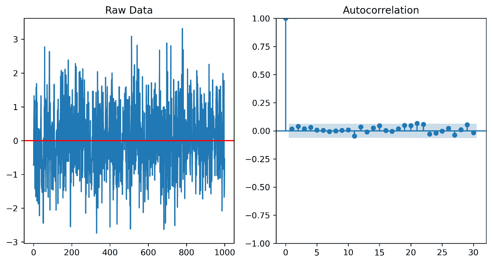

Figure 10.2 – 随机白噪声的视觉分析

现在，让我们使用 Ljung-Box 测试来检查我们对自相关的假设。我们使用`statsmodels`中的`acorr_ljungbox()`函数进行此测试。我们应用`lags=[50]`参数来测试自相关是否在 50 个滞后期之外为 0：

```py
from statsmodels.stats.diagnostic import acorr_ljungbox
acorr_ljungbox(random_white_noise, lags=[50], return_df=True)
```

测试返回了一个不显著的 p 值，如这里所示。因此，我们可以断言，在 95%的置信水平下，数据没有自相关，因此是白噪声：

|  | `lb_stat` | `lb_pvalue` |
| --- | --- | --- |
| `50` | `51.152656` | `0.428186` |

Figure 10.3 – 白噪声数据自相关 Ljung-Box 测试结果

## 自相关

如我们之前所提到的，自相关，也称为序列相关，是衡量数据时间序列中对应于先前点的给定点的相关性的度量。它被称为“自相关”，因为它指的是变量在先前滞后期与其自身的相关性。在指定范围内所有先前滞后期的自相关（而不是特定滞后期的自相关）被称为**自相关结构**。在这里，对于任何大于零的给定滞后*k*，我们有自相关函数，r k:

r k =  ∑t=k+1n(yt −  _y)(yt−k −  _y) __________________ ∑t=1n(yt −  _y)2

我们在第*第六章* *简单线性回归*中讨论了自相关，是在识别自相关作为线性回归所需假设的样本独立性的违反的背景下。在这里，我们指出自相关是时间序列数据的核心组成部分。我们之前在*第六章*和本章中使用了 ACF 图来直观地探索了这些数据。我们还讨论了一阶差分。让我们使用`statsmodels`中的*美国宏观经济*数据集深入探讨这两个概念，我们在*第六章*中使用了这个数据集。在这里，我们选择`realinv`和`realdpi`，将这两个变量都转换为 32 位浮点数：

```py
import numpy as np
import pandas as pd
import statsmodels.api as sm
import matplotlib.pyplot as plt
df = sm.datasets.macrodata.load().data
df['realinv'] = round(df['realinv'].astype('float32'), 2)
df['realdpi'] = round(df['realdpi'].astype('float32'), 2)
df_mod = df[['realinv','realdpi']]
```

接下来，让我们使用 50 个滞后（`lags=50`）和 5%的显著性水平（`alpha=0.05`）来绘制数据和其 ACF：

```py
from statsmodels.graphics.tsaplots import plot_acf
from statsmodels.graphics.tsaplots import plot_pacf
fig, ax = plt.subplots(2,2, figsize=(15,10))
plot_acf(df_mod['realinv'], alpha=0.05, lags=50, ax=ax[0,1])
ax[0,1].set_title('Original ACF')
ax[0,0].set_title('Original Data')
ax[0,0].plot(df_mod['realinv'])
plot_acf(np.diff(df_mod['realinv'], n=1), alpha=0.05, lags=50, ax=ax[1,1])
ax[1,1].set_title('Once-Differenced ACF')
ax[1,0].set_title('Once-Differenced Data')
ax[1,0].plot(np.diff(df_mod['realinv'], n=1))
```

我们得到以下结果图：

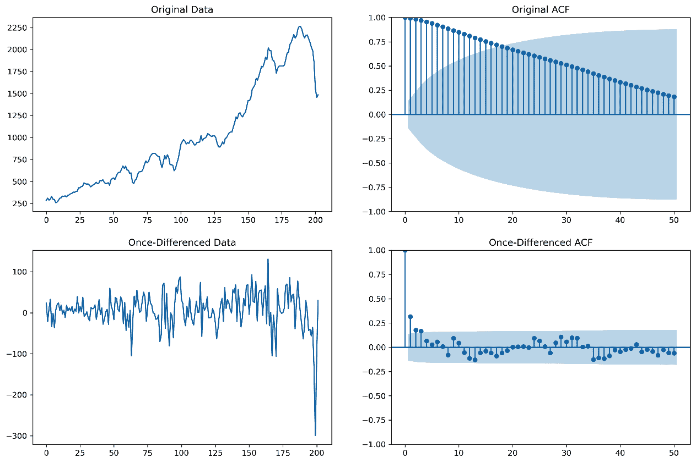

图 10.4 – *realinv*：原始数据和一阶差分数据及其 ACF

我们可以在图 10.4 的第一幅图中观察到，投资整体呈上升趋势的确定性信号，并且可以观察到数据周围的一些方差，尤其是在接近滞后 0 的时间附近。这些数据成分是我们最初尝试建模的。在原始数据的 ACF 中，我们可以看到一个显著的、衰减的自相关结构，这是指数增长的典型特征。然而，由于主导自相关的强烈趋势，我们无法观察到关于方差相关性的任何信息，例如潜在的季节性等。为了消除强烈的信号，我们使用`numpy.diff()`函数应用一阶差分，这样我们就可以观察到方差的 autocorrelation 结构。观察差分数据的 ACF，我们可以看到在应用 95%置信水平时，方差的自相关延伸到滞后 3。

在这一点上，值得提及**自回归移动平均**（**ARMA**）模型，我们将在*第十一章* *ARIMA 模型*中使用它。正如我们在 ACF 图中可以看到的，存在一个长的自相关范围。回到我们之前提到的自相关方程，我们可以看到计算并没有控制时间序列中特定的滞后，因为每个点的误差在除以方差之前都被加在一起。这就是为什么原始 ACF 显示了衰减效应；合理地假设滞后 0 不是与每个之前的滞后平滑地序列相关的。因为 ACF 没有控制特定滞后之间的自相关，我们可以使用这种相关性信息来构建一个移动平均函数，这有助于在长时间段内建模数据的噪声成分。

然而，如果我们想要能够构建一个模型成分，使我们能够在 ARMA 模型的框架内定义点与点之间的关系，我们还将想要观察 PACF，因为它确实控制了滞后之间的相关性。注意在*图 10.5*中原始数据和它的 PACF。它显示的粒度水平与 ACF 图大不相同；而在 PACF 中，我们直到接近滞后 30 时才看到与滞后 0 以及滞后 4 之后的持续显著相关性，而在 ACF 中，我们直到接近滞后 20 时才看到显著相关性。然而，原始数据并不很有帮助，因为它不是平稳的，这就是为什么我们看到滞后 0 和滞后 45 之间的相关性几乎与滞后 0 和滞后 1 之间的相关性一样多，这表明我们可能无法构建一个不经过变换（在这种情况下是一阶差分）就能收敛的模型：

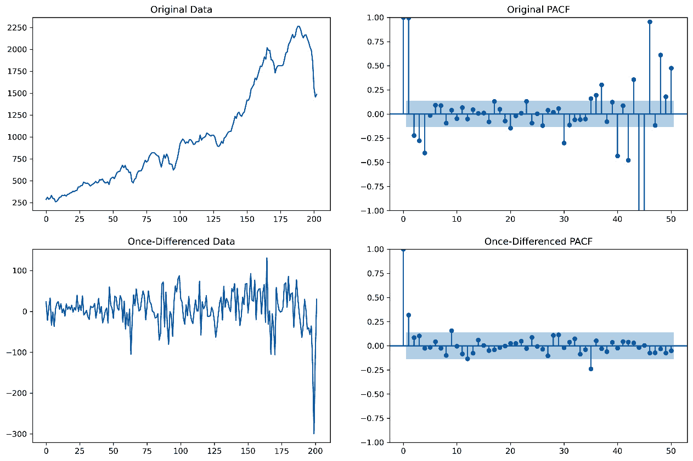

图 10.5 – *realinv*：原始数据和一阶差分数据以及偏自相关函数（PACF）

*图 10.4* 中对于*转换（差分）数据*的 ACF 结果表明，一个高达 3 阶（MA(3)）的移动平均成分可能是有用的（尽管 MA(1)可能更好）。*图 10.5* 中对于*转换数据*的 PACF 结果表明，一个一阶自回归成分（AR(1)）可能是有用的。使用 PACF，我们还可以得出 AR(10)可能是有用的结论，但选择如此高的阶数通常会导致过度拟合。一个经验法则是，在过程建模中不要使用阶数大于大约 5 的 AR 或 MA 成分。然而，模型阶数取决于分析师和过程细节。虽然我们将在*第十一章**，ARIMA 模型*中深入讨论这个概念，如果我们为这些数据构建 ARIMA 模型，我们将有一个根据我们选择的带有积分差分*d*的一阶差分构建的模型，即*AR(p)*和*MA(q)*结构，如下所示**（p,d,q）**模型。这些阶数用于根据模型构建**特征多项式方程**，然后我们可以使用这些方程的因式分解形式的根来评估**平稳性**和**可逆性**，这有助于识别**模型唯一性**并评估其收敛到解的能力。

## 交叉相关

继续前进，对于任何大于零的给定滞后 *k*，我们有一个**交叉相关函数**（**CCF**），它可以用来识别两个变量在不同时间点之间的相关性。这种分析可以用来帮助识别领先或滞后指标。对于给定滞后 *k* 的两个一维向量 *i* 和 *j* 的交叉相关函数 ˆ p  i,j(k) 如下所示：

ˆ p  i,j(k) =  ∑ t=1 n−k (x t,i −  _ x  i)(x t+k,j −  _ x  j)   _______________________   √ ____________  ∑ t=1 n  (x t,i −  _ x  i) 2  √ _____________  ∑ t=1 n  (x t+k,j −  _ x  j) 2

在考虑线性回归的案例中，我们有两个按顺序排列的基于序列的输入变量预测一个按顺序排列的基于序列的因变量时，我们同时评估输入和输出变量，即*t*。然而，如果使用交叉相关来识别领先或滞后指标，我们可以识别出领先变量领先时的滞后，即*k*，并通过*k*个索引修改其序列位置。例如，如果我们的模型的时间单位是周，并且我们构建一个回归模型来预测使用广告作为输入的销售，我们可能会发现，在任何给定的一周中，广告对销售没有影响。然而，在执行交叉相关分析后，我们发现广告和销售之间存在 1 周的强烈滞后，这意味着在 1 周内投资的广告直接影响到下一周的销售。然后我们使用这个信息将广告支出变量提前 1 周，并重新运行回归模型，利用广告支出和销售之间的强相关性来预测市场行为。这可以被称为**滞后效应**。

让我们用一个 Python 的实际例子来看一下。首先，我们需要评估数据。让我们加载数据开始。我们需要将值转换为`float`类型。我们可以四舍五入到两位小数，并选择`realinv`和`realdpi`，分别是实际国内总投资和实际私人可支配收入的变量：

```py
import numpy as np
import pandas as pd
import statsmodels.api as sm
import matplotlib.pyplot as plt
df = sm.datasets.macrodata.load().data
df['realinv'] = round(df['realinv'].astype('float32'), 2)
df['realdpi'] = round(df['realdpi'].astype('float32'), 2)
df_mod = df[['realinv','realdpi']]
```

在绘制数据后，我们可以看到两个序列似乎都有一种强烈的、确定性的信号，这是自相关性的主要影响因素。可以很容易地论证这两个变量是正相关的，并且两者都在随时间增加，这在很大程度上是正确的。然而，在这一点上，数据还有更多值得注意的地方；均值（信号）是确定的，但我们需要评估均值周围的方差，才能真正理解两个过程在趋势成分之外的关联程度。注意，在下面的代码中，我们在计算 ACF 时使用了 50 个滞后。在测量 ACF 时的一般规则是不要超过 50 个滞后点，尽管这可能会根据上下文而有所不同：

```py
from statsmodels.graphics.tsaplots import plot_acf
fig, ax = plt.subplots(2,2, figsize=(20,8))
fig.suptitle('Raw Data')
ax[0,0].plot(df_mod['realinv'])
ax[0,0].set_title('Realization')
ax[1,0].set_xlabel('realinv')
ax[0,1].plot(df_mod['realdpi'])
ax[0,1].set_title('Realization')
ax[1,1].set_xlabel('realdpi')
plot_acf(df_mod['realinv'], alpha=0.05, lags=50, ax=ax[1,0])
plot_acf(df_mod['realdpi'], alpha=0.05, lags=50, ax=ax[1,1])
```

我们得到了以下图表：

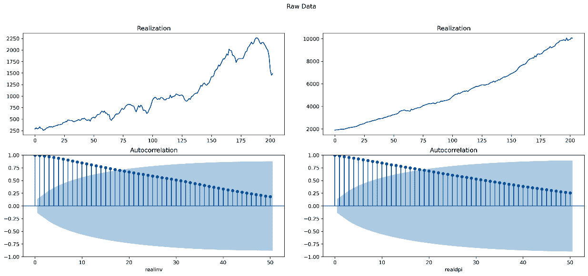

图 10.6 – 比较 realinv 与 realdpi：原始数据和 ACF 图

我们可以在*图 10.6*中看到，除了强烈的确定性信号外，两个变量的 ACF 图都有指数衰减的自相关，在 95%的置信水平（在阴影区域外）上是显著的。基于 ACF 中的这些信息，我们应该至少执行**一阶差分**。如果 ACF 在执行一次**一阶****线性差分**后表现出相同的行为，我们可能需要执行两次一阶差分。

让我们创建差分数据：

```py
df_diff = pd.DataFrame()
df_diff['realinv'] = np.diff(df_mod['realinv'], n=1)
df_diff['realdpi'] = np.diff(df_mod['realdpi'], n=1)
```

现在，重新使用之前的绘图代码，我们可以看到*图 10.7*中的数据：

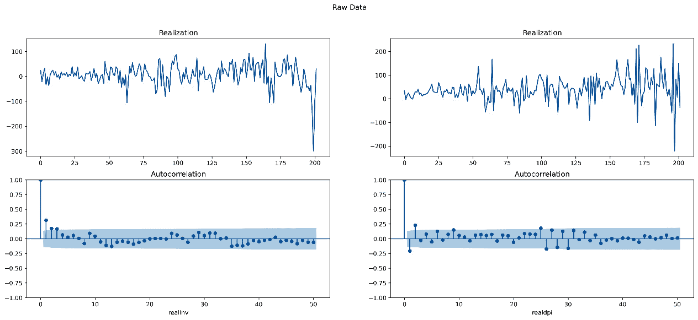

图 10.7 – 比较差分*realinv*与差分*realdpi*

根据*图 10.7*，我们可以看到之前在*图 10.6*中主导自相关性的确定性信号现在已被移除。有几个点稍微超出了 95%的置信区间，尽管显著性水平很小（我们不考虑滞后 0，因为滞后 0 与自身 100%相关）。由于一些自相关仍然存在，我们可以认为它们的行为并非完全随机。因此，它们可能是互相关的。由于我们已经解决了确定性信号的问题，我们现在可以评估两个序列之间的互相关性。请注意，两个序列的均值已经被差分到常数零。这是平稳性的一个条件。另一个条件是常数方差。我们可以看到差分数据具有最小的自相关性，但它超出了 95%的置信限制。因此，我们可以确定额外的 ARIMA 建模可能是有用的，但我们也可以主张使用平均值进行建模。然而，我们也可以看到平稳性的第三个要求——期间内常数协方差——似乎没有满足；随着序列随时间步长继续，方差波动。我们将在下一节中更深入地讨论平稳性。现在，让我们将注意力转向互相关性。

现在我们已经移除了确定性信号，方差在 ACF 图中占主导地位，让我们比较这两个时间序列，看看它们之间是否存在滞后或领先关系。在这里，我们构建一个 CCF 来图形化地展示这一点。我们使用字典`zscore_vals`来构建 z 分数，从而构建三个置信区间选项——90%，95%，和 99%：

```py
from scipy.signal import correlate
import matplotlib.pyplot as plt
def plot_ccf(data_a, data_b, lag_lookback, percentile):
    n = len(data_a)
    ccf = correlate(data_a - np.mean(data_a), data_b - np.mean(data_b), method='direct') / (np.std(data_a) * np.std(data_b) * n)
    _min = (len(ccf)-1)//2 - lag_lookback
    _max = (len(ccf)-1)//2 + (lag_lookback-1)
    zscore_vals={90:1.645,
                 95:1.96,
                 99:2.576}
    plt.figure(figsize=(15, 5))
    markers, stems, baseline = plt.stem(np.arange(-lag_lookback,(lag_lookback-1)), ccf[_min:_max], markerfmt='o', use_line_collection = True)
    plt.setp(baseline, color='r', linewidth=1)
    baseline.set_xdata([0,1])
    baseline.set_transform(plt.gca().get_yaxis_transform())
    z_score_95pct = zscore_vals.get(percentile)/np.sqrt(n) #1.645 for 90%, 1.96 for 95%, and 2.576 for 99%
    plt.title('Cross-Correlation')
    plt.xlabel('Lag')
    plt.ylabel('Correlation')
    plt.axhline(y=-z_score_95pct, color='b', ls='--')# Z-statistic for 95% CL LL
    plt.axhline(y=z_score_95pct, color='b', ls='--')# Z-statistic for 95% CL UL
    plt.axvline(x=0, color='black', ls='-')
    ;
import numpy as np
import pandas as pd
import statsmodels.api as sm
import matplotlib.pyplot as plt
df = sm.datasets.macrodata.load().data
df['realinv'] = round(df['realinv'].astype('float32'), 2)
df['realdpi'] = round(df['realdpi'].astype('float32'), 2)
df_mod = df[['realinv','realdpi']]
df_diff = pd.DataFrame()
df_diff['realinv'] = np.diff(df_mod['realinv'], n=1)
df_diff['realdpi'] = np.diff(df_mod['realdpi'], n=1)
plot = plot_ccf(data_a=df_diff['realdpi'], data_b=df_diff['realinv'], lag_lookback=50, percentile=95)
```

在*图 10.8*中，我们可以观察到许多点超过了我们应用的 95%置信区间。然而，我们观察到最高的相关性水平是在滞后 0 处。根据数据域或模型应用时的预测误差，可能会有多个正确答案，但使用统计数据，我们的研究表明，序列在滞后 0 处相关性最高，因此，它们既不是领先指标也不是滞后指标。重要的是要注意，大约 0.20 的相关性的实际意义很低；它解释了很少的方差。因此，短期影响很小：

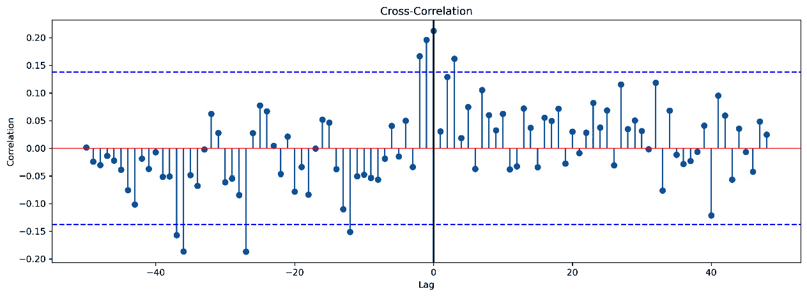

图 10.8 – *realinv*与*realdpi*之间的互相关

由于我们已经评估出两个时间序列方差之间的短期交叉相关性最小，而我们可能仍然对整体的相关强度感兴趣，因此在此阶段我们可以使用皮尔逊相关系数来比较这两个趋势，这将衡量两个长期线性趋势之间的相关性。回想一下皮尔逊相关系数的公式，以观察其与长期平均数的关系：

r =  ∑ i=1 n (x i −  _ x)(y i −  _ y)  _________________________   √ _______________________   ∑ i=1 n (x i −  _ x) 2 ∑ i=1 n (y i −  _ y) 2

假设，然而，我们的数据中存在一个领先指标。让我们将`realdpi`向前移动一个位置。注意这里的`pandas`函数`shift()`执行此操作：

```py
plot = plot_ccf(data_a=df_diff['realdpi'].shift(1).iloc[1:], data_b=df_diff['realinv'].iloc[1:], lag_lookback=50, percentile=95)
```

我们得到以下结果：

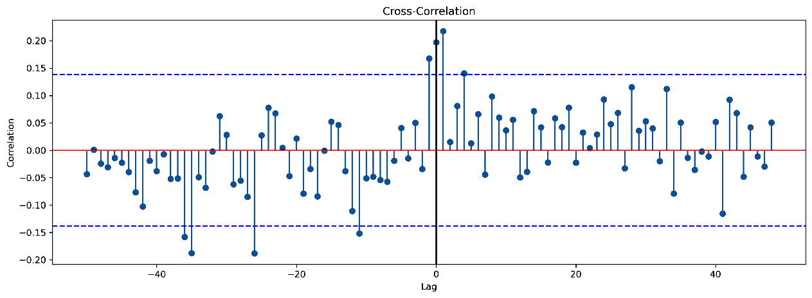

图 10.9 – 带有领先指标的位移交叉相关性

在将`realdpi`向前移动一个位置后，我们可以在*图 10.9*中识别出`realinv`现在是一个领先指标，滞后一个单位。如果这是我们原始的、差分后的数据，我们可能会决定对`realinv`变量应用一个位移——同时考虑到相关性的实用性——然后在用一个变量预测另一个变量的值时使用`realdpi`和位移后的`realinv`变量。

# 白噪声模型

任何时间序列都可以被认为是处理两个基本元素：信号和噪声。我们可以用以下数学公式表示这一点：

y(t) = signal(t) + noise(t)

信号是我们可以用数学函数建模的可预测模式。但时间序列中的噪声元素是不可预测的，因此不能建模。以这种方式思考时间序列会导致两个重要的观点：

1.  在尝试建模之前，我们应该验证时间序列*不是与噪声一致的*。

1.  一旦我们对时间序列拟合了一个模型，我们应该验证残差*是与噪声一致的*。

关于第一个问题，如果一个时间序列与噪声一致，那么就没有可预测的模式可以建模，尝试建模时间序列可能会导致误导性的结果。关于第二个问题，如果一个时间序列模型的残差与噪声不一致，那么我们还可以进一步建模其他模式，并且当前模型不足以解释信号中的模式。当然，为了做出这些评估，我们首先需要了解噪声是什么。在本节中，我们将讨论**白噪声模型**。

白噪声是一个时间序列，其中样本是独立的，具有固定的方差和零均值。这意味着时间序列的每个样本都是随机的。那么，我们如何评估一个序列是否是随机的呢？让我们通过一个例子来分析。看看*图 10.10*中的序列。你认为这个序列是随机的还是信号？

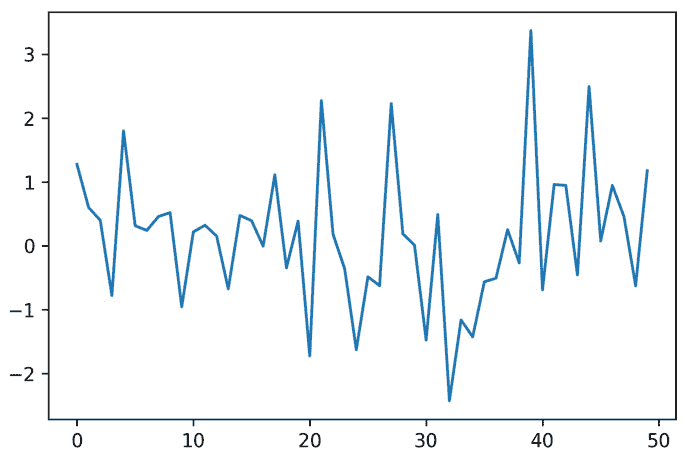

图 10.10 – 一个样本时间序列

*图 10.10* 中的时间序列是使用 `numpy` 生成的随机序列。仅从观察时间序列中无法看出这一点。让我们看看如何确定一个序列是否为噪声。

如前所述，时间序列中的样本是独立的。这意味着样本不应自相关。我们可以通过 ACF 图来检查这个序列的自相关性。结果如图 *图 10.11* 所示：

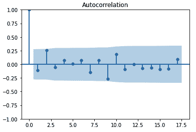

图 10.11 – 图 10.10 中时间序列的 ACF 图

ACF 图显示该序列似乎没有自相关性。这是一个强烈的迹象，表明该时间序列没有可建模的模式，可能仅仅是噪声。

另一种评估方法是 Ljung-Box 自相关检验。这是对时间序列滞后自相关性的统计检验。零假设是没有自相关性，备择假设是有相关性。由于自相关性可能出现在时间序列的任何滞后中，Ljung-Box 检验为每个滞后提供了自相关的 p 值。对这个序列进行检验，我们得到前 10 个滞后的以下 p 值：`[0.41, 0.12, 0.21, 0.31, 0.44, 0.53, 0.5, 0.57, 0.26, 0.2]`。这些值中的每一个都很大，这表明这个序列很可能是噪声。

之前讨论的两种方法都表明显示的序列是噪声，这是正确的结果（我们知道这个序列是随机生成的）。随着我们进行时间序列建模，我们将使用这些方法来确定一个序列是否为噪声，作为模型评估的一部分。我们将以对时间序列平稳性的概念讨论来结束这一章。

# 静态性

在本节中，我们概述了静态和非静态时间序列。总的来说，这两种类型时间序列的主要区别在于统计特性，如均值、方差和自相关性。在静态时间序列中，这些特性不会随时间变化，但在非静态时间序列中会随时间变化。特别是，具有趋势或季节性的时间序列是非静态的，因为趋势或季节性会影响统计特性。以下示例说明了静态与非静态时间序列的行为 [1]：

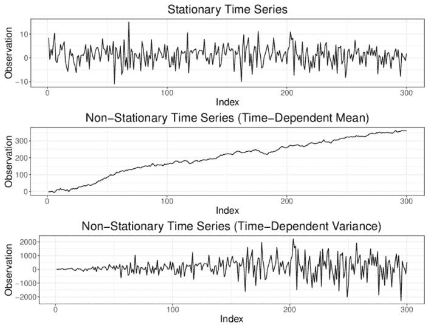

图 10.12 – 静态和非静态时间序列的示例

为了检查静态特性，我们将检查以下三个条件：

+   均值与时间无关：

E[X t] = μ 对于所有 t

+   方差与时间无关：

Var[X t] = σ 2 对于所有 t

+   与时间无自相关性——X t 1 和 X t 2 之间的相关性仅取决于它们在时间上的距离，t 2 − t 1

现在，我们将使用*Air Passengers*数据集([`www.kaggle.com/datasets/chirag19/air-passengers`](https://www.kaggle.com/datasets/chirag19/air-passengers))进行 Python 分析，该数据集提供了 1949 年至 1960 年美国航空公司乘客的月度总计，可以从*Kaggle*下载，也可以在本书的 GitHub 仓库中找到([`github.com/PacktPublishing/Building-Statistical-Models-in-Python/blob/main/chapter_10/airline-passengers.csv`](https://github.com/PacktPublishing/Building-Statistical-Models-in-Python/blob/main/chapter_10/airline-passengers.csv))。首先，我们将数据导入 Python 笔记本，将索引类型更改为`datetime`，并绘制数据集：

```py
import pandas as pd
import matplotlib.pyplot as plt
data = pd.read_csv('airline-passengers.csv', header=0, index_col =0)
data.index = pd.to_datetime(data.index, format='%Y-%m-%d')
plt.plot(data)
```

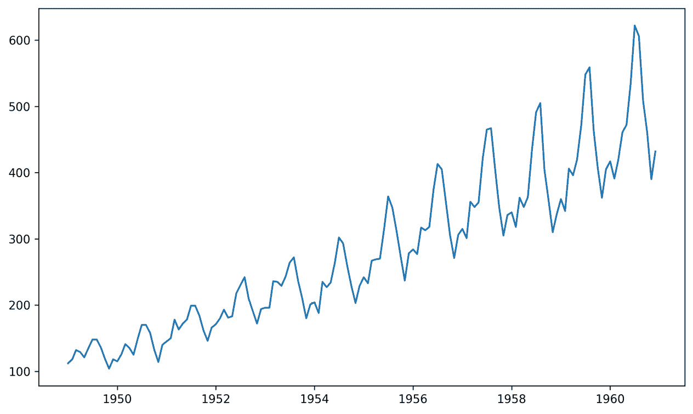

图 10.13 – 1949-1960 年美国航空公司乘客可视化

从图中，我们可以看到这里存在趋势和季节性效应。然后，它显然是非平稳的。在`statsmodels`包中，有一个名为`seasonal_decompose`的函数，可以帮助我们将原始数据分解成不同的图表进行可视化。您可以在以下操作中看到它：

```py
from statsmodels.tsa.seasonal import seasonal_decompose
season_trend = seasonal_decompose(data)
season_trend.plot()
plt.show()
```

我们得到以下结果图：

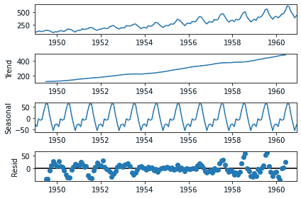

图 10.14 – 1949-1960 年美国航空公司乘客趋势和季节性可视化

趋势图显示，使用美国航空公司的乘客数量随时间增加。它似乎季节性地波动，夏季达到峰值。数据点和时间之间存在一定的依赖性，方差似乎在早期较小（20 世纪 50 年代初使用美国航空公司的乘客较少）和后期较大（20 世纪 50 年代末使用服务的乘客较多）。这些观察结果表明，条件 1 和 2（均值和方差随时间保持恒定）被违反。从非恒定方差的不同角度来看，我们可以为 1949 年至 1960 年的每一年创建箱线图进行可视化，如下所示：

```py
import seaborn as sns
fig, ax = plt.subplots(figsize=(24,10))
sns.boxplot(x = data.index.year,y = data['Passengers'], ax = ax, color = "cornflowerblue")
ax.set(xlabel='Year', ylabel='Number of Passengers')
```

对于前面的代码，我们得到以下结果：

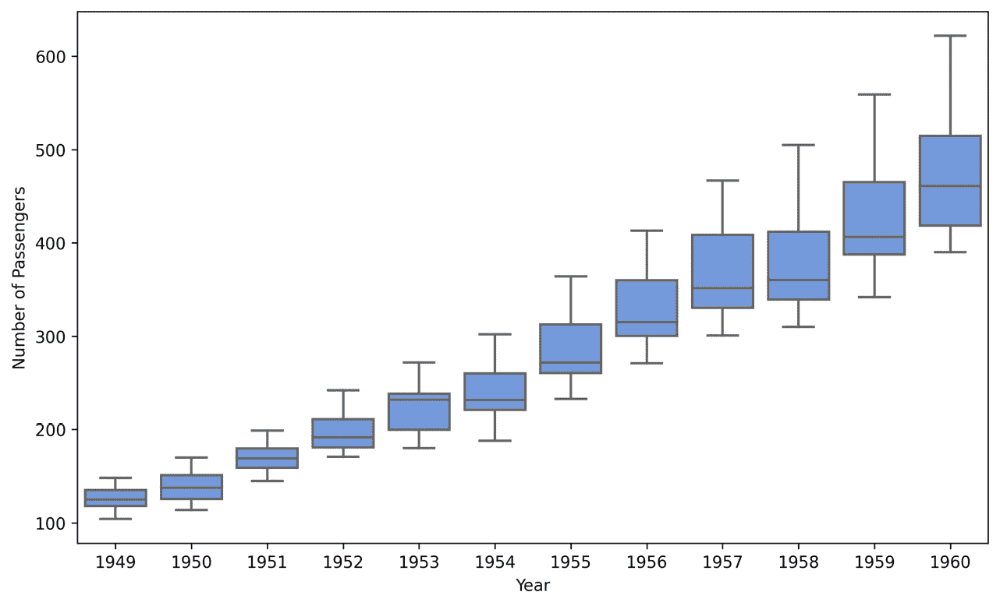

图 10.15 – 1949-1960 年美国航空公司乘客箱线图

要检查自相关，我们使用以下代码：

```py
from statsmodels.graphics.tsaplots import plot_acf
plot_acf(data, lags= 20, alpha=0.05)
plt.show()
```

我们得到的结果如图*图 10.16*所示：

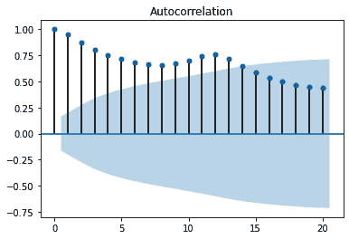

图 10.16 – 1949-1960 年美国航空公司乘客的 ACF 可视化

然而，趋势在数据中占主导地位。在去除趋势并重新运行代码后，我们得到*图 10.17*自相关函数（ACF）图。似乎存在一个强烈的季节性成分。自相关周期在经过一些滞后计数和时间步长后重复：

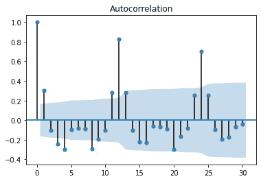

图 10.17 – 1949-1960 年美国航空公司乘客数量的 ACF 可视化

我们在*方差*和*自相关*部分讨论的 Ljung-Box 检验也可以用来检查自相关。使用该测试，我们得到`lb_pvalue = 0`。因此，数据存在自相关。

# 摘要

本章从时间序列的介绍开始。我们概述了时间序列是什么以及如何用它来满足特定目标。我们还讨论了区分时间序列数据与不依赖于时间的数据的标准。我们还讨论了平稳性，哪些因素对平稳性很重要，如何衡量它们，以及如何解决不存在平稳性的情况。从那里，我们能够理解 ACF 和 PACF 分析的主要功能以及如何通过围绕均值的方差对过程进行推断。此外，我们还介绍了时间序列建模，概述了白噪声模型以及自回归和移动平均组件背后的基本概念，这些有助于形成 ARIMA 和**季节性自回归积分移动平均**（**SARIMA**）时间序列模型的基础。

在*第十一章**中，ARIMA 模型*，我们将进一步深入讨论自回归、移动平均和 ARMA 模型，包括概念概述和 Python 中的逐步示例。我们还研究了集成 SARIMA 模型，以及评估这些模型拟合度的方法。

# 参考文献

[1] André Bauer，*自动化混合时间序列预测：设计、基准测试和用例*，芝加哥大学，2021 年。
