# 12

# 多变量时间序列

我们在上一章讨论的模型只依赖于感兴趣的单个变量的先前值。当我们的时间序列中只有一个变量时，这些模型是合适的。然而，在时间序列数据中通常会有多个变量。通常，这些系列中的其他变量可以改善感兴趣变量的预测。在本章中，我们将讨论具有多个变量的时间序列模型。我们将首先讨论时间序列变量之间的相关性关系，然后讨论我们如何对多变量时间序列进行建模。虽然存在许多多变量时间序列数据模型，但我们将讨论两种既强大又广泛使用的模型：**带有外生变量的自回归积分移动平均**（**ARIMAX**）和**向量自回归**（**VAR**）。理解这两个模型将扩展读者的模型工具箱，并为读者学习更多关于多变量时间序列模型提供构建块。

在本章中，我们将涵盖以下主要主题：

+   多变量时间序列

+   ARIMAX

+   VAR 模型

# 多变量时间序列

在上一章中，我们讨论了**单变量时间序列**或一个变量的时间序列的模型。然而，在许多建模情况下，通常会有多个同时测量的时间变化变量。由多个时间变化变量组成的时间序列被称为**多变量时间序列**。时间序列中的每个变量被称为**协变量**。例如，天气数据的时间序列可能包括温度、降雨量、风速和相对湿度。在天气数据集中，这些变量中的每一个都是单变量时间序列，而作为一个整体，多变量时间序列和每一对变量都是协变量。

从数学上讲，我们通常将多变量时间序列表示为一个向量值序列，如下所示：

X = x 0,0 x 0,1 ⋮ , x 1,0 x 1,1 ⋮ , … , x t,0 x t,1 ⋮

在这里，每个 X 实例在每个时间步长都有多个值，并且序列中有 t 个步骤。前面方程中的第一个索引代表时间步长（从 0 到 t），第二个索引代表单个序列（从 0 到 N 个变量）。例如，如果 X 是股票价格的时间序列，那么在 X 的每个时间步长，都会有每个股票价格的一个值。在这种情况下，如果序列中的前两个股票代码是 AAPL 和 GOOGL，那么 X 可能看起来像以下方程：

X =  x 0, AAPL x 0, GOOGL ⋮ ,  x 1, AAPL x 1, GOOGL ⋮ , … ,  x t, APPL x t, GOOGL ⋮

当我们有一个多变量时间序列时，一个问题随之而来：*我们能用这些额外的* *信息做什么呢？* 为了回答这个问题，我们需要了解这些时间序列变量是否相关。我们可以通过观察它们的交叉相关性来确定时间序列之间的关系。接下来，让我们讨论交叉相关性。

## 时间序列交叉相关性

我们需要了解时间序列如何相关，以便确定协变量时间序列是否可能对预测感兴趣的时间序列有用。在前面的一章中，我们讨论了如何使用图表和相关性系数来理解两个变量之间的关系；我们将对时间序列数据采取类似的方法。回想一下在*第十章**，时间序列导论*中讨论的以下**交叉相关函数**（**CCF**）：

ˆ p  k(X, Y) =  ∑ t=1 n−k (X t −  _ X )(Y t−k −  _ Y )   ______________________   √ ____________  ∑ t=1 n  (X t −  _ X ) 2  √ ____________  ∑ t=1 n  (Y t −  _ Y ) 2

在这里，X 是一个一元时间序列，Y 也是一个一元时间序列。这个函数告诉我们 X 和 Y 在 k 滞后时的关系。在这个方程中，Y 比 X 滞后 k 个时间步。在这种情况下，我们说 X 领先 Y k 步或 Y 滞后 X k 步。我们将使用这个 CCF 来帮助我们确定两个时间序列是否相关以及它们在哪个时间步相关。请注意，如果 X = Y，那么 CCF 将简化为**自相关函数**（**ACF**）。

交叉相关性显著性

正如 ACF 一样，交叉相关性有一个统计显著性的阈值。我们认为任何绝对值大于 1.96 / √ _ N（其中 N 是时间序列的样本大小）的交叉相关性值与零显著不同。

让我们通过一些数据来观察交叉相关性。这些数据[1]来自*UCI 机器学习仓库* [2]。这些数据是作为在中国进行的一项污染研究的一部分收集的天气数据。这些数据在多年的时间里每小时采样一次。我们将数据子集缩小到前 1,000 个数据点。这个数据集中的天气数据包括温度(`TEMP`)、气压(`PRES`)、露点温度(`DEWP`)、降雨量(`RAIN`)和风速(`WSPM`)。我们将从试图预测风速的角度来观察交叉相关性，这意味着我们将观察风速与其他变量的交叉相关性。这可能是一个想要预测风力涡轮机发电的人的重要问题。风速数据和风速的 ACF 在*图 12.1*中绘制：

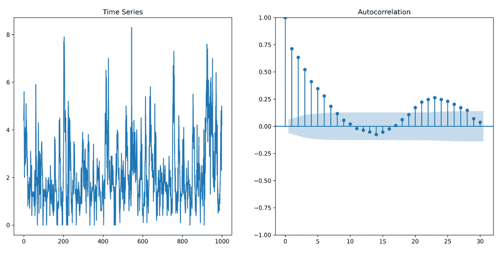

图 12.1 – 风速时间序列及其 ACF 的绘图

从*图 12.1*中的图表可以看出，风速可能可以通过我们在上一章讨论的平稳单变量模型进行建模。虽然似乎没有证据表明存在**自回归积分移动平均**（**ARIMA**）行为，但在滞后 24 处似乎存在季节性的证据。由于数据是按小时采样的，季节性可能是一个日周期模式。我们在*图 12.2*中绘制了其他变量的时间序列。这些是我们可能想要用来帮助预测风速值的其他变量：

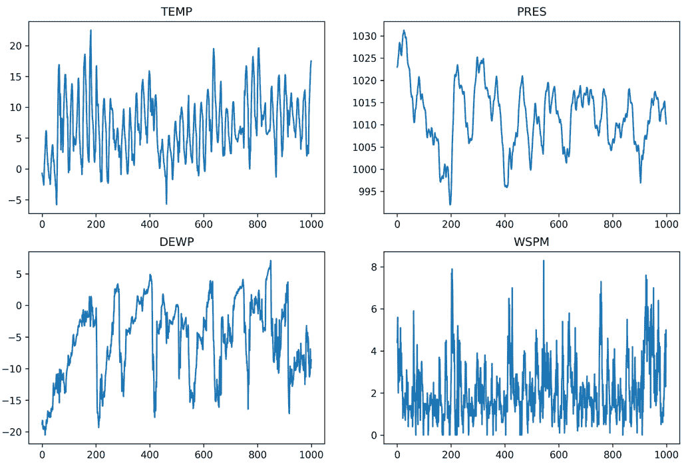

图 12.2 – 风速时间序列和三个其他天气变量的图

尽管我们没有绘制*图 12.2*中所示的所有时间序列的 ACF 图，但这些时间序列具有表明它们可能是平稳的特征。然而，仅从时间序列本身来看，并不能确定这些时间序列是否相关。这就是时间序列交叉相关性的作用所在。我们可以使用交叉相关图来确定其他时间序列是否与风速相关。我们在*图 12.3*中绘制了风速与其他变量的交叉相关性。CCF 图绘制到 48 个滞后。由于数据是按小时采样的，这给我们提供了 2 天的滞后时间来观察交叉相关性：

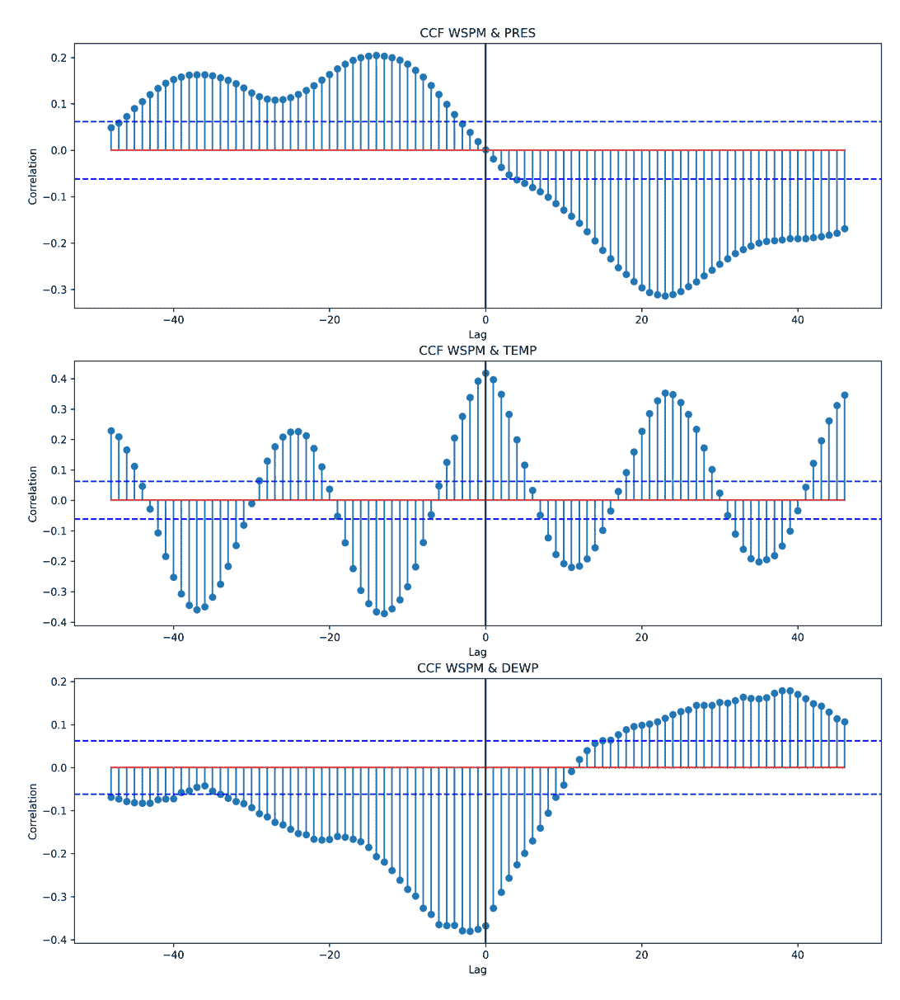

图 12.3 – 风速和三个其他变量的 CCF 图

图*12.3*中的图表显示风速与其他变量之间存在交叉相关性。虽然我们不太关注交叉相关性的形状，但这些模式可能为变量之间的关系提供一些深度。例如，风速和温度的交叉相关性显示出大约 12 小时的振荡模式；这可能对应于阳光对风速的影响。主要发现是这些其他变量与风速存在关联，可能帮助我们预测风速的值。让我们看看我们如何可以使用额外的变量进行建模。

# ARIMAX

在上一章中，我们讨论了 ARIMA 模型族，并演示了如何对单变量时间序列数据进行建模。然而，正如我们在上一节中提到的，许多时间序列是多变量的，例如股票数据、天气数据或经济数据。在本节中，我们将讨论在建模时间序列数据时如何整合协变量变量的信息。

当我们建模多变量时间序列时，我们通常有一个我们感兴趣的预测变量。这个变量通常被称为**内生**变量。多变量时间序列中的其他协变量被称为**外生**变量。回想一下*第十一章**，ARIMA 模型*，代表 ARIMA 模型的方程：

y′ t = c + ϕ 1 y′ t−1 + … + ϕ p  y ′  t−p + ϵ t + θ 1 ϵ t−1 + … + ϕ q ϵ t−q

在这里，y′ t 是差分序列，差分 d 次直到它平稳。在这个模型中，y t 是我们感兴趣的预测变量；它是内生变量。让我们以更紧凑的形式重写这个方程。我们将与 y′ t 相关的项收集到一个求和项中，将与ϵ t 相关的项收集到另一个求和项中。让我们从与 y′ t 相关的项开始：

ϕ 1 y′ t−1 + … + ϕ p  y ′  t−p = ∑ i=1 p ϕ i y′ t−i

然后，我们将ϵ t 项也收集到不同的求和项中：

ϵ t + θ 1 ϵ t−1 + … + ϕ q ϵ t−q = ϵ t + ∑ j=1 q ϕ j ϵ t−j

将这些求和项合并，我们得到以下更紧凑的 ARIMA 方程版本：

y′ t = c + ∑ i=1 p ϕ i y′ t−i + ϵ t + ∑ j=1 q ϕ j ϵ t−j

现在，让我们将外生变量添加到模型中。我们将通过向模型中添加一个求和项来添加外生变量：

y′ t = c + ∑ i=1 p ϕ i y′ t−i + ϵ t + ∑ j=1 q ϕ j ϵ t−j + ∑ k=1 r β k X tk

在这里，向量值变量 X 中包含 r 个外生变量。回想一下本章前面的内容，我们可以用以下方式表示向量值变量，其中第一个索引表示时间步，第二个索引表示向量值变量中的单个序列：

X =  x 0,0 ⋮ x 0,k,  x 1,0 ⋮ x 1,k, … ,  x t,0 ⋮ x t,k

这就是我们如何将外生变量纳入 ARIMA 模型的方法。现在，让我们谈谈如何选择外生变量。在*第十一章**，ARIMA 模型*中，我们使用 ACF 图看到，对于建模单变量时间序列，时间序列的某些滞后比其他滞后更有影响力。我们将使用 CCF 图对外生变量做出类似的判断。让我们看一下示例 CCF 图并讨论如何做出这些判断。

风速和温度的 CCF 图显示在*图 12**.4*中。我们已标记出在 48 小时滞后期内最显著的交叉相关发生的位置。回想一下，这些数据是每小时采样的；因此，每个滞后时间步对应 1 小时的滞后。该图显示最显著的交叉相关发生在大约滞后 13、滞后 24 和滞后 37 处：

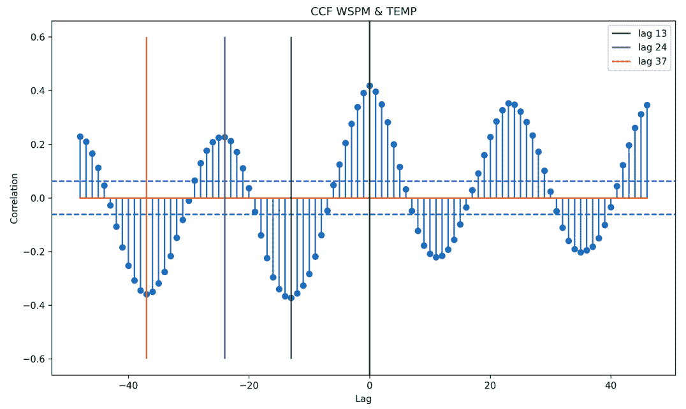

图 12.4 – 风速和温度变量的 CCF 图

根据对*图 12**.4*中交叉相关图观察，我们预计温度在 13、24 和 37 个滞后处可以提供对当前预测风速有用的信息。也就是说，变量 x t−13,temperature、x t−24,temperature 和 x t−37,temperature 可能对预测 y t 有用。我们可以对其他两个外生变量执行相同的 CCF 分析，以确定模型中要使用哪些滞后。我们发现压力(`PRES`)在滞后 14 和 37 处有显著的交叉相关性，露点(`DEWP`)在滞后 2 和 20 处有显著的交叉相关性。现在我们已经评估了模型中想要使用的外生变量的滞后，让我们继续预处理数据和拟合模型。

## 预处理外生变量

在拟合模型之前，我们需要预处理数据，以便制作之前提到的外生变量。我们需要创建之前描述的时间序列变量的滞后版本。我们可以使用`pandas` `DataFrame`的`shift()`方法来滞后时间序列。让我们看看一个代码示例。

以下代码示例展示了如何使用`shift()`方法将压力变量滞后`14`个时间步。代码的前几行导入库并加载数据。代码示例中的最后一行将`PRES`变量向后移动 14 个时间步：

```py
import pandas as pd
# code to download the data
url = 'https://archive.ics.uci.edu/ml/machine-learning-databases/00501/PRSA2017_Data_20130301-20170228.zip'
file_name = url.split('/')[-1]
r = requests.get(url)
with open(file_name, 'wb') as fout:
    fout.write(r.content)
with zipfile.ZipFile(file_name, 'r') as zip_file:
    zip_file.extractall('./')
df = pd.read_csv(
    './PRSA_Data_20130301-20170228/PRSA_Data_Aotizhongxin_20130301-20170228.csv'
    , sep=','
)
pres_lag_14 = df.PRES.shift(-14)
```

`shift()`方法可以用来将序列向前或向后移动时间。在这种情况下，我们希望我们的外生变量滞后我们想要预测的变量。因此，我们需要提供一个负的移动值来将序列向后移动时间。我们将对其他外生变量使用类似的预处理步骤来创建其他滞后变量。这将在以下代码示例中展示。所有这些使用`shift()`方法创建的滞后变量都被收集到一个新的`DataFrame`中，称为`X`，我们将在拟合步骤中使用它：

```py
temp_lag_13 = df.TEMP.shift(-13)
temp_lag_24 = df.TEMP.shift(-24)
temp_lag_37 = df.TEMP.shift(-37)
pres_lag_14 = df.PRES.shift(-14)
pres_lag_24 = df.PRES.shift(-37)
dewp_lag_13 = df.DEWP.shift(-2)
dewp_lag_24 = df.DEWP.shift(-20)
X = pd.DataFrame({
    "temp_lag_13": temp_lag_13[:1000],
    "temp_lag_24": temp_lag_24[:1000],
    "temp_lag_37": temp_lag_37[:1000],
    "pres_lag_14": pres_lag_14[:1000],
    "pres_lag_24": pres_lag_24[:1000],
    "dewp_lag_2": dewp_lag_13[:1000],
    "dewp_lag_20": dewp_lag_24[:1000],
})
```

在前面的代码示例中，我们正在取滞后变量（前`1,000`个数据点）的子集，以限制模型的计算时间。在收集到新的`X` `DataFrame`中的变量后，预处理完成，我们可以继续进行模型的拟合和评估。

## 拟合模型

如前一章所述，我们将使用`auto_arima`来拟合我们的 ARIMA 模型。在这种情况下，主要区别是我们需要向`auto_arima`函数提供我们创建的外生变量。拟合带有外生变量的 ARIMA 模型的代码在以下代码示例中展示：

```py
y = df.WSPM[:1000]
arima = pm.auto_arima(
    y, X,
    error_action='ignore',
    trace=True,
    suppress_warnings=True,
    maxiter=5,
    seasonal=False,
    test='adf'
)
```

这段代码应该看起来与*第十一章**中展示的代码非常相似，即 ARIMA 模型。事实上，唯一的区别是`auto_arima`函数中添加了`X`变量。运行此代码将产生以下输出：

```py
Performing stepwise search to minimize aic
 ARIMA(2,0,2)(0,0,0)[0]           : AIC=2689.456, Time=0.24 sec
 ARIMA(0,0,0)(0,0,0)[0]           : AIC=8635.103, Time=0.16 sec
 ARIMA(1,0,0)(0,0,0)[0]           : AIC=2742.728, Time=0.29 sec
 ARIMA(0,0,1)(0,0,0)[0]           : AIC=2923.324, Time=0.32 sec
 ARIMA(1,0,2)(0,0,0)[0]           : AIC=2685.581, Time=0.23 sec
 ARIMA(0,0,2)(0,0,0)[0]           : AIC=2810.239, Time=0.37 sec
 ARIMA(1,0,1)(0,0,0)[0]           : AIC=2683.888, Time=0.23 sec
 ARIMA(2,0,1)(0,0,0)[0]           : AIC=2682.988, Time=0.28 sec
 ARIMA(2,0,0)(0,0,0)[0]           : AIC=2681.309, Time=0.26 sec
 ARIMA(3,0,0)(0,0,0)[0]           : AIC=2682.416, Time=0.32 sec
 ARIMA(3,0,1)(0,0,0)[0]           : AIC=2684.608, Time=0.32 sec
 ARIMA(2,0,0)(0,0,0)[0] intercept : AIC=2683.328, Time=0.30 sec
Best model:  ARIMA(2,0,0)(0,0,0)[0]
Total fit time: 3.347 seconds
```

再次强调，这个输出应该与我们之前在 *第十一章*“ARIMA 模型”中看到的 `auto_arima` 输出非常相似。它表明我们应该使用基于 `auto_arima` 适配的 AR(2) 模型，因为仅需要为模型中的每个外生变量适配一个系数。不需要在 `auto_arima` 返回的对象上适配 `summary()` 方法来查看外生变量的系数和显著性检验。运行 `summary()` 方法将输出以下 **带有外生因素的季节自回归积分移动平均**（**SARIMAX**）结果：

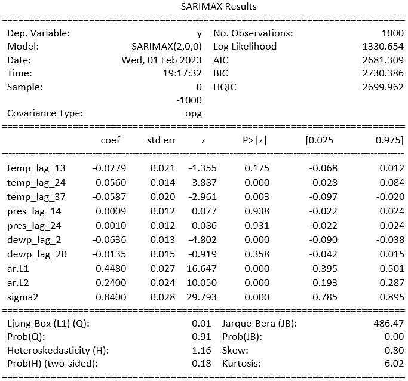

图 12.5 – AR(2) 模型的 SARIMAX 摘要

在前面代码片段中显示的 `summary()` 方法的输出显示了大量的信息。让我们关注输出的中间部分。中间部分显示了每个外生变量和每个 ARIMA 系数的系数和显著性检验。系数和检验的 p 值分别标记为 `coef` 和 `P>|z|`。显著性检验可以帮助我们确定哪些变量应该包含在模型中。

回想一下在 *第七章*“多元线性回归”中，我们讨论了多重共线性这一概念，它本质上意味着两个或更多预测变量高度相关。我们在这里可能会遇到类似的情况。例如，考虑 `temp_lag_13`、`temp_lag_24` 和 `temp_lag_37` 变量。由于温度时间序列表现出自相关性，这些温度时间序列的滞后版本可能是高度相关的，甚至很可能是这样。当我们观察到多重共线性时，这是一个我们可以从模型中移除变量的信号。我们建议使用在第七章[*]中描述的特征选择方法之一，例如递归特征选择、基于性能的选择或基于统计显著性的选择。

前面的输出只显示了当前模型中的三个外生变量，这些变量被突出显示。这意味着我们应该考虑减少模型中的变量。我们可以通过多种方法做到这一点；在这个例子中，我们将选择基于 p 值消除特征。我们将迭代地移除具有最高 p 值的特征，直到所有特征的 p 值都低于 0.05。这个选择过程的代码如下所示：

```py
# initial model
arima = pm.auto_arima(
    y, X,
    error_action='ignore',
    trace=False,
    suppress_warnings=True,
    maxiter=5,
    seasonal=False,
    test='adf'
)
pvalues = arima.pvalues()
iterations = 0
while (pvalues > 0.05).any():
    # get the variable name with the largest p-value
    variable_with_max_pval = pvalues.idxmax()
    # drop that variable from the exogenous variables
    X = X.drop(variable_with_max_pval, axis=1)
    arima = pm.auto_arima(
        y, X,
        error_action='ignore',
        trace=False,
        suppress_warnings=True,
        maxiter=5,
        seasonal=False,
        test='adf'
    )
    pvalues = arima.pvalues()
    print(f"fit iteration {iterations}")
    iterations += 1
```

执行这个选择过程将导致一个只包含 `temp_lag_24`、`temp_lag_37`、`pres_lag_24` 和 `dewp_lag_2` 外生变量的模型。模型的 ARIMA 部分仍然是 AR(2) 模型。在模型选择完成后，让我们评估模型的表现。

## 评估模型性能

我们将通过绘制预测与实际数据点的对比图，并计算误差估计来评估模型的性能。让我们首先查看 ARIMAX 模型对下一个`200`个观测值的预测。预测和测试数据点在*图 12.6*中绘制：

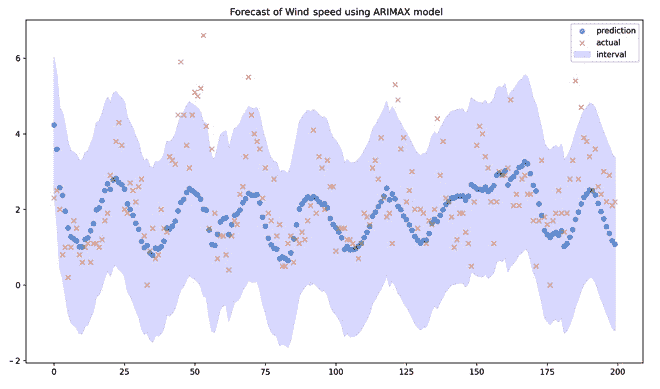

图 12.6 – 使用 ARIMAX 模型预测风速

我们可以看到使用我们在*图 12.6*中创建的 ARIMAX 模型预测的风速。从绘制的预测中，有两个观察结果突出：

+   预测捕捉了`风速`变量的振荡

+   预测未能捕捉到`风速`中的高峰值

为了了解提供的自变量是否在模型中提供了物质价值，我们应该将*图 12.6*中显示的 ARIMAX 模型的预测与单变量模型的预测进行比较。单变量模型的预测显示在*i* *图 12.7*：

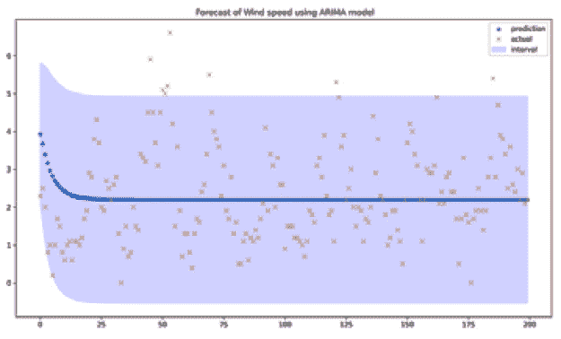

图 12.7 – 使用 ARIMA 模型预测风速

如*图 12.7*中所示，ARIMA 模型的预测似乎没有捕捉到随着预测长度增长的时间序列中的很大变化。这实际上是 ARMA 模型的一个特性。从两个图中应该很明显，ARIMAX 模型比 ARIMA 模型提供了更好的预测。最后，让我们比较两个模型的**均方误差**（**MSE**）。ARIMAX 模型的 MSE 大约为 1.5，而 ARIMA 模型的 MSE 约为 1.7。MSE 值证实了我们从图中看到的情况——即 ARIMAX 模型为这个多元时间序列提供了更好的预测。

在本节中，我们讨论了 ARIMA 模型的扩展，使我们能够将协变量信息纳入多元时间序列。这仅仅是多元时间序列的许多方法之一。在下一节中，我们将讨论另一种处理多元时间序列数据的方法。

# VAR 建模

在上一章中，我们研究的 AR(p)，MA(q)，ARMA(p,q)，ARIMA(p,d,q)m 和 SARIMA(p,d,q) 模型构成了多元 VAR 模型的基础。在本章中，我们讨论了带有外生变量的 ARIMA（ARIMAX）。现在，我们将开始讨论 VAR 模型。首先，重要的是要理解，虽然 **ARIMAX 需要外生变量的领先（未来）值**，**VAR 模型不需要这些变量的未来值**，因为它们彼此都是自回归的——因此得名向量自回归——并且根据定义不是外生的。为了开始，让我们考虑两个变量，或双变量，的情况。考虑一个过程 y_t，它是两个不同输入变量 y_t¹ 和 y_t² 的输出。请注意，在矩阵形式中，我们讨论的是 nxm 矩阵（y_n,m）的情况，其中 *n* 对应时间点，*m* 对应涉及的变量（变量 1，2，…，m）。我们将在后续的符号中省略逗号，但重要的是要理解，当我们讨论多元自回归过程时，我们讨论的是多维矩阵中的数据，而不仅仅是用于单变量时间序列分析的单维向量形式。我们可以如下用向量符号表示我们的过程 y_t：

y_t = [y_t¹ y_t²].

我们可以进一步扩展输入变量的定义，这里，对于之前显示的 y_t 中的两个变量，作为 VAR(1) 过程：

y_t¹ = (1 − ϕ_11) μ_1 − ϕ_12 μ_2 + ϕ_11 y_{t−1}¹ + ϕ_12 y_{t−1}² + ε_t¹

y_t² = − ϕ_21 μ_1 + (1 − ϕ_22) μ_2 + ϕ_21 y_{t−1}¹ + ϕ_22 y_{t−1}² + ε_t².

项 (1 − ϕ_11) μ_1 − ϕ_12 μ_2 和 − ϕ_21 μ_1 − (1 − ϕ_22) μ_2 是我们的**模型常数**（*β* 系数）。

我们可以将前面的过程（使用零均值形式）简化为矩阵简化形式，如下所示：

y_t = Φ_1 y_{t−1} + ε_t

在这里，我们有以下内容：

Φ_1 = [ϕ_11 ϕ_12 ϕ_21 ϕ_22]

我们对 VAR(1) 模型的预测如下：

ˆy_t¹(l) = (1 − ϕ_11) ˆy_1 − ϕ_12 ˆy_2 + ϕ_11 ˆy_t¹(l − 1) + ϕ_12 ˆy_t²(l − 1)

ˆy_t²(l) = − ϕ_21 ˆy_1 + (1 − ϕ_22) ˆy_2 + ϕ_21 ˆy_t¹(l − 1) + ϕ_22 ˆy_t²(l − 1)

它还包括以下内容：

ˆy_t⁰(l) = [ˆy_t¹(l) ˆy_t²(l)]

在这里，*l* 代表前向滞后（t + 1，t + 2，…，t + n），ˆy_t⁰m 代表变量 *m* 在时间 *t* 的预测值，t_0 对应时间上最接近的点（通常是数据的长度）。还应注意 mxm 协方差矩阵如下：

ˆΓ(k) = ˆγ_11(k) … ˆγ_1m(k) ⋮⋱⋮ ˆγ_m1(k) … ˆγ_mm(k)

在这里，每个协方差 ˆγ_ij(k)，其中 *k* 对应滞后，计算如下：

ˆγ_ij(k) = 1/n ∑_{t=1}^{n−k} (y_t^i − ˆy_i)(y_{t+k,j} − ˆy_j).

因此，我们计算每个变量 y_t^i 和 y_t^j 之间的估计互相关如下：

ˆρ_ij(k) = ˆγ_ij(k) √___________ ˆγ_ii(0) ˆγ_jj(0)

理解交叉相关和，尤其是协方差的计算方法有助于理解变量之间的关系及其对模型拟合的影响。将两个模型结合以生成一个整体过程预测的方法是通过加权两个输入均值及其相关性到一个响应中。正如我们之前在 VAR(1)预测中看到的那样，每个给定变量与其他变量在不同时间点的相关性可以使用 VAR 模型进行建模。值得注意的是，在 VAR 模型中没有真正的独立和依赖变量；只是每个变量之间存在相互作用。重要的是要注意，所有使用 VAR 模型建模的过程都应该是**平稳的**。

使用在[`www.statsmodels.org/dev/datasets/generated/macrodata.xhtml`](https://www.statsmodels.org/dev/datasets/generated/macrodata.xhtml)找到的*美国宏观经济*数据集，我们可以观察到在 VAR 建模的零均值形式下，实际国内私人投资（`realinv`）、实际个人消费支出（`realcons`）和实际私人可支配收入（`realdpi`）之间的关系。

realcons(t) = ϕ 11 realcons t−11 + ϕ 12 realinv t−12 + ϕ 13 realdpi t−13 + ε t1

realinv(t) = ϕ 21 realcons t−11 + ϕ 22 realinv t−12 + ϕ 23 realdpi t−13 + ε t2

realdpi(t) = ϕ 31 realcons t−11 + ϕ 32 realinv t−12 + ϕ 33 realdpi t−13 + ε t3

让我们用一个例子来看看如何在 Python 中使用`statsmodels` VARMAX 模型对这个数据进行 VAR 过程分析。首先，让我们加载数据：

```py
import numpy as np
import pandas as pd
import statsmodels.api as sm
import matplotlib.pyplot as plt
from statsmodels.tsa.api import VAR
data=sm.datasets.macrodata.load_pandas().data
data.sort_values(by=['year', 'quarter'], inplace=True)
data['yr_qtr'] = data['year'].astype(str) + data['quarter'].astype(str)
print('{}% of yearly quarters are unique'.format(round(100*(data['yr_qtr'].nunique() / len(data)), 1)))
```

从输出中我们可以看到，我们每年的季度都是唯一的，因此不存在时间戳重复：

`100.0% of yearly quarters` `are unique`

在执行基于回归的时间序列建模时，我们首先需要确保数据的平稳性。在 VAR 建模中，这意味着所有变量都必须是平稳的。第一步是通过按索引进行线绘图来可视化过程实现。如果数据点按要建模的间隔聚合，则可以保留索引不变，但如果需要不同的时间索引，则需要指定这一点。在这里，我们将构建一个模型来确定数据长度对应的`季度`，因为这是时间的最小单位，并且每个索引都有一个年度季度，正如我们之前检查的那样。然后我们将索引设置为`季度`（这就是为什么`季度`出现了两次；一次作为索引，一次作为列名）：

```py
data['quarter'] = range(1, len(data)+1)
data.drop('yr_qtr', axis=1, inplace=True)
data.index = data['quarter']
```

注意更新的索引和`季度`值：

| **季度** | **年份** | **季度** | **实际消费** | **实际投资** | **实际可支配收入** |
| --- | --- | --- | --- | --- | --- |
| 1 | 1959 | 1 | 1707.4 | 286.898 | 1886.9 |
| 2 | 1959 | 2 | 1733.7 | 310.859 | 1919.7 |
| 3 | 1959 | 3 | 1751.8 | 289.226 | 1916.4 |
| 4 | 1959 | 4 | 1753.7 | 299.356 | 1931.3 |
| 5 | 1960 | 5 | 1770.5 | 331.722 | 1955.5 |

图 12.8 – VAR 建模的宏观数据集的前五行

在这里，我们将通过六个步骤来使用我们导入和准备的数据集构建一个 VAR 模型，部分内容如图*12.8*所示。

## 第 1 步 – 视觉检查

在*图 12.9*的数据线图中，我们可以看到似乎有一个强烈的线性趋势。我们需要检查 ACF 图来评估这一点。之后，我们将运行**Dickey-Fuller 测试**来确认：

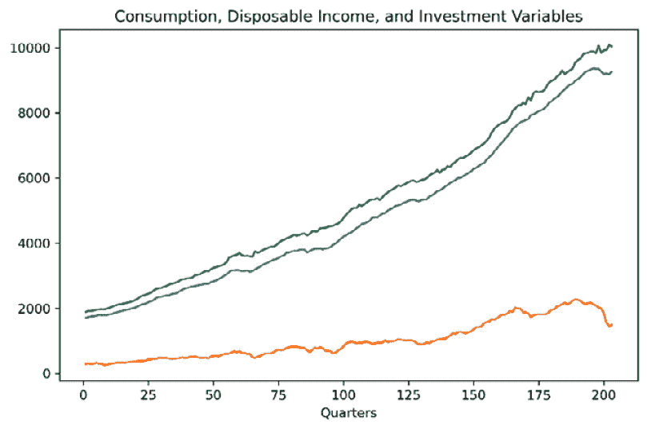

图 12.9 – realcons、realdpi 和 realinv 的线图

*图 12.10*中的 ACF 图显示出强烈的线性趋势和至少一个单位根的迹象，这很可能是导致这种趋势的原因：

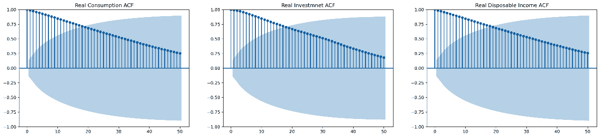

图 12.10 – VARMAX 输入变量的 ACF 图

在运行 Dickey-Fuller 测试后，我们可以看到每个变量都包含一个单位根，因此是趋势性的。因此，我们需要对所有三个变量应用一阶差分，以便我们可以朝着使数据平稳化的方向发展。回想一下，Dickey-Fuller 的零假设是存在一个单位根，备择假设是不存在。我们将执行以下代码：

```py
from statsmodels.tsa.stattools import adfuller
for col in ['realcons','realinv','realdpi']:
    adfuller_test = adfuller(data[col], autolag='AIC')
    print('ADF p-value for {}: {}'.format(col, adfuller_test[1]))
```

在这里，我们可以看到每个变量的 Dickey-Fuller 结果。回想一下，零假设是存在一个单位根。因此，由于 p 值不高，我们不会拒绝零假设。这为我们提供了统计证据，假设存在趋势：

`ADF p-value for realcons: 0.9976992503412904`

`ADF p-value for realinv: 0.6484956579101141`

`ADF p-value for realdpi: 1.0`

让我们用循环来区分这里的数据：

```py
import numpy as np
data_1d = pd.DataFrame()
for col in ['realcons','realinv','realdpi']:
    data_1d[col] = np.diff(data[col], n=1)
```

## 第 2 步 – 选择 AR(p)的阶数

现在，我们可以重新运行 ACF 图来检查是否仍然看到趋势自相关。因为原始的线图看起来没有季节性，我们将继续绘制**部分 ACF**（**PACFs**）来了解可能有用的 AR(p)阶数。如果我们怀疑存在季节性，检查**样本自相关的频谱密度**来量化季节周期性可能是有用的，这个过程我们在*第十一章*“ARIMA 模型”中演示过。在检查 PACF 图时，我们将使用**Yule-Walker 方法**。

我们可以在 ACF 图中看到没有明显的季节性。在使用 VAR 模型时，所有项都用于估计所有其他项，因为任何项的预测都是通过估计所有项来发展的。换句话说，为了预测一个，我们必须预测所有。这之所以重要，是因为当我们查看*图 12.11*中的 PACFs 时，我们可以看到一个变量可以用 AR(1)（实际投资）模型拟合，另一个可以用 AR(2)（实际可支配收入）模型拟合，另一个可以用 AR(3)（实际消费）模型拟合。使用对每个变量都显著的阶数是使 VAR 建模工作的重要方面之一。

在 VAR 模型中选择排序的一个重要方面是交叉相关。例如，我们可能有一个变量的最高阶数为 3 阶，但如果目标变量与输入变量之间的交叉相关在滞后 5 期，我们很可能需要使用滞后 5 期。然而，使用滞后 3 期或 4 期的模型也可能是有用的。然而，与任何回归模型一样，我们总是希望在模型训练后检查系数项的显著性：

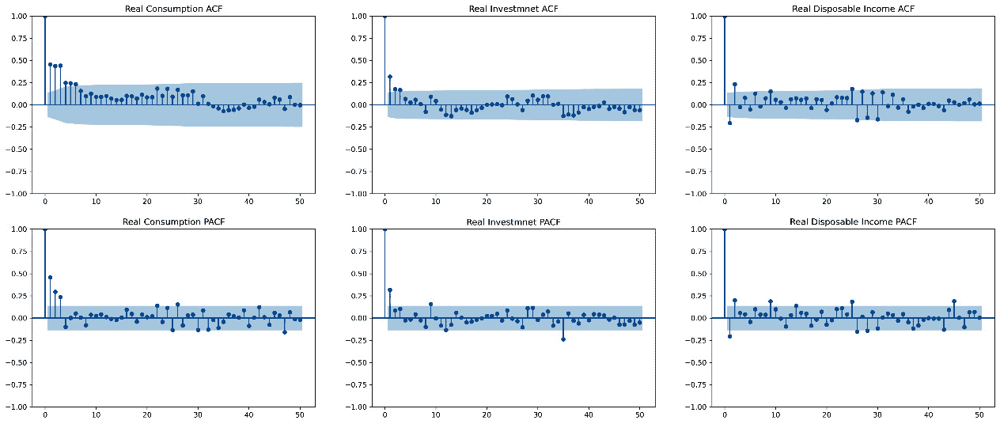

图 12.11 – 差分 VARMAX 变量；自相关函数（ACF）和偏自相关函数（PACF）

## 第 3 步 – 评估交叉相关

对于 VAR 模型，我们考虑的输入变量和目标变量之间的交叉相关最为重要。这可以通过多个滞后或使用最显著的滞后来实现，如果担心使用不同位移的同一变量的多次迭代会导致过拟合。我们必须确认在预测模型中使用的交叉相关分析是针对每个输入变量和因变量的。一个显示输入变量作为目标变量的领先指标的交叉相关不是主要问题；这意味着使用输入的历史值来预测目标。然而，如果我们有一个输入是滞后指标的场景——意味着目标预测输入——并且我们想使用输入来预测目标，我们需要将输入向前移动，以便相关性在滞后 0 期，并通过移动的量来裁剪数据。

在许多情况下，存在显著的领先和滞后交叉相关；这可能会表明季节性。在季节性的 VAR 模型中，应该包含一个指示变量，该变量在频谱密度峰值时提供值为 1，在其他情况下提供值为 0。交叉相关的一个特殊情况是输入变量具有显著的统计显著性，但仅在时间上非常远的滞后。在这种情况下，可能需要将数据向前移动，以便模型不包括（自相关）不显著的项，以避免过拟合的风险。为了演示基于 CCF 的移动，我们将在下一个过程中将其纳入我们的流程。 

在 *图 12.12* 中，我们观察到 `realdpi` 和 `realinv` 之间最强的相关性出现在滞后 0，但在图中 *x=-27* 和 *x=-37* 处至少还有两个其他类似相关性的滞后。正如我们在 *ARIMAX* 部分所看到的，我们可以将同一变量的多个平移版本作为新变量包括进来，以提高模型的预测能力。这将使我们能够利用多个相关性。然而，出于模型演示的目的，我们不会将其包括在内，因为 VAR 汇总的结果可能会变得很大。此外，正如我们提到的，包括太多相同变量的滞后可能会导致过拟合。最终决定使用多少滞后取决于实践者。这必须通过评估模型拟合和偏差/方差权衡来完成。这里给出的函数代码也在 *第十章**，时间序列导论* 中：

```py
# code imported from chapter 10
def plot_ccf(data_a, data_b, lag_lookback, percentile, ax, title=None):
    n = len(data_a)
    ccf = correlate(data_a - np.mean(data_a), data_b - np.mean(data_b), method='direct') / (np.std(data_a) * np.std(data_b) * n)
    _min = (len(ccf)-1)//2 - lag_lookback
    _max = (len(ccf)-1)//2 + (lag_lookback-1)
    zscore_vals={90:1.645,
                 95:1.96,
                 99:2.576}
    markers, stems, baseline = ax.stem(np.arange(-lag_lookback,(lag_lookback-1)), ccf[_min:_max], markerfmt='o', use_line_collection = True)
    z_score_95pct = zscore_vals.get(percentile)/np.sqrt(n) #1.645 for 90%, 1.96 for 95%, and 2.576 for 99%
    ax.set_title(title)
    ax.set_xlabel('Lag')
    ax.set_ylabel('Correlation')
    ax.axhline(y=-z_score_95pct, color='b', ls='--')# Z-statistic for 95% CL LL
    ax.axhline(y=z_score_95pct, color='b', ls='--')# Z-statistic for 95% CL UL
    ax.axvline(x=0, color='black', ls='-');
plot = plot_ccf(data_a=data_1d['realdpi'], data_b=data_1d['realinv'], lag_lookback=50, percentile=95)
```

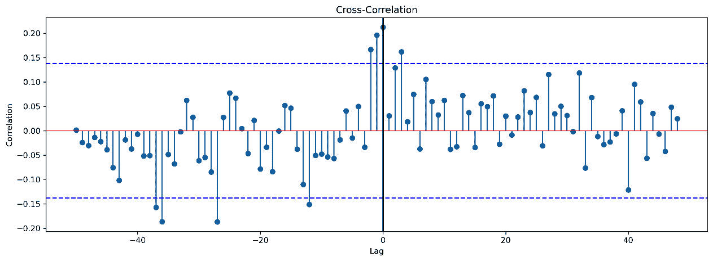

图 12.12 – 实际对数和实际逆的互相关

在 *图 12.13* 中，我们可以看到 `realcons` 是 `realinv` 的领先指标，两者呈正相关。这意味着消费的增加会导致投资增加。尽管如此，我们仍然可以使用 `realinv` 的下移版本来预测 `realcons`——如果这是我们的目标——因为这两个变量预计将无限期地继续：

```py
plot = plot_ccf(data_a=data_1d['realcons'], data_b=data_1d['realinv'], lag_lookback=50, percentile=95)
```

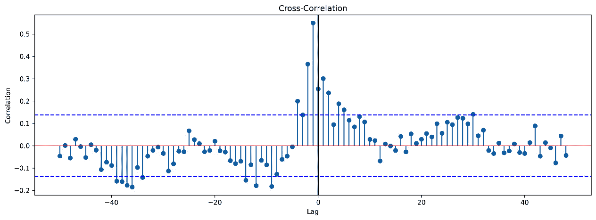

图 12.13 – 实际常数和实际逆的互相关

为了解决 `realcons` 对 `realinv` 的一滞后领先问题，让我们将 `realcons` 向前移动一个索引，以便最强的相关性出现在滞后 0。这对于 VAR 模型不是必需的，但在最显著的滞后远在时间上并且可能导致包括不合理的模型阶数以包含必要的变量关系的情况下可能是有用的。

关于数据平移的说明

在平移数据时，数据集中将包含空值。因此，数据集必须根据平移的长度进行裁剪。这可能会以模型性能为代价，因此值得通过比较模型误差来评估平移的需要。

在以下代码片段中对 `realcons` 应用前移平移并重新运行 CCF 后，我们可以在 *图 12.14* 中看到变量的最强相关性现在出现在滞后 0：

```py
data_1d['realcons'] = data_1d['realcons'].shift(1)
data_1d = data_1d.iloc[1:]
plot = plot_ccf(data_a=data_1d['realcons'], data_b=data_1d['realinv'], lag_lookback=50, percentile=95)
```

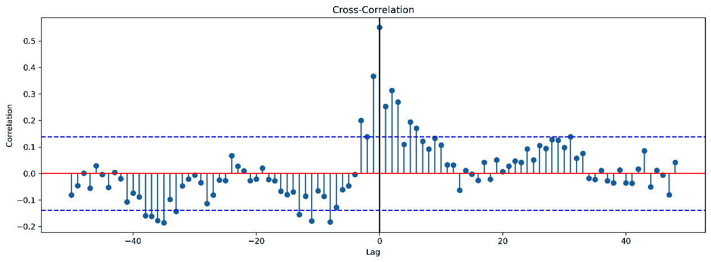

图 12.14 – 实际逆和前移实际常数的互相关

接下来，我们想要运行一个函数来追加 p 和 q 的可能值（AR(p) 和 MA(q)）：

```py
from statsmodels.tsa.statespace.varmax import VARMAX
import warnings
warnings.simplefilter('error')
results_aic=[]
x_axis_list=[]
for p in range(1,6):
    for q in range(0,6):
        try:
            model = VARMAX(data_1d,
                           order=(p,q),
                           trend='c',
                           enforce_stationarity=True,
                           enforce_invertibility=True)
            results = model.fit()
            results_aic.append(results.aic)
            # x_axis_list.append(p,q,results.aic)
            print('(p,q): ({},{}), AIC: {}'.format(p,q,results.aic))
        except Exception as e:
            # print('(p,q): ({},{}), error: {}'.format(p,q,e))
            Pass
```

在这里，我们可以看到 VAR(1,0) 和 VAR(2,0) 模型的 AIC 错误：

`(p,q): (1,0),` `AIC: 6092.740258665657`

`(p,q): (2,0),` `AIC: 6050.444583720871`

通过 AIC 选择方法，我们有两种可能的模型。首先，我们构建了一个`p=2`和`q=0`的模型，但在运行后，我们观察到在预测`realinv`的七个系数中，只有两个在 0.10 的显著性水平上是显著的，这并不好。在重新运行并选择`p=1`和`q=0`后，我们发现四个系数中有两个在 0.05 的显著性水平上显著，并且在 0.10 的显著性水平上全部显著。因此，我们可以得出结论，`realinv`。

## 第 4 步 – 构建 VAR(p,q)模型

我们将跳过上一章中介绍过的模型验证步骤，因为在这里的过程将是相同的。我们将在这里重新排序列，以便当我们运行`get_prediction()`函数时，结果是对第一列的。由于所有变量都用于预测所有其他变量，因此模型将保持不变。重新索引后，我们将运行带有`realcons`上移一个位置的`VARMAX`模型，并预测`realinv`。对于我们的模型，我们使用了 AR(1)和 MA(0)。请注意，我们使用`trend='c'`来表示**常数**，因为我们进行差分时移除了`trend`；`trend`参数用于趋势确定性。趋势差分应在模型之外处理，因为并非所有变量都可能具有单位根趋势。在模型之外处理趋势还有助于我们识别季节性或移除`trend`后的真实自相关结构的显著性。值得注意的是，季节性并没有直接通过 VAR（和 VARMAX）模型来处理；应包括表示季节性的指示（虚拟）变量。

关于模型拟合，我们可以参考*第十一章**，ARIMA 模型*，以获取有关下一节中显示的`Dep. Variable`列表的信息。每个模型变量都列出了用于预测每个变量的其他变量的项的系数。例如，我们可以在`Results for equation realcons`中观察到`realinv`对`realcons`的预测能力贡献不大，但`realdpi`却贡献较大。我们还可以观察到`realcons`对预测`realinv`是显著的。我们还可以根据`realinv`和`realdpi`中的 p 值和置信区间进行观察。如果我们有一个特征中的方差由另一个特征中的方差解释，我们可以期望看到更大的系数值：

```py
model = VARMAX(data_1d.reindex(columns=['realinv','realcons','realdpi']), order=(1,0), trend='c',
 enforce_stationarity=True,enforce_invertibility=True)
results = model.fit()
print(results.summary())
```

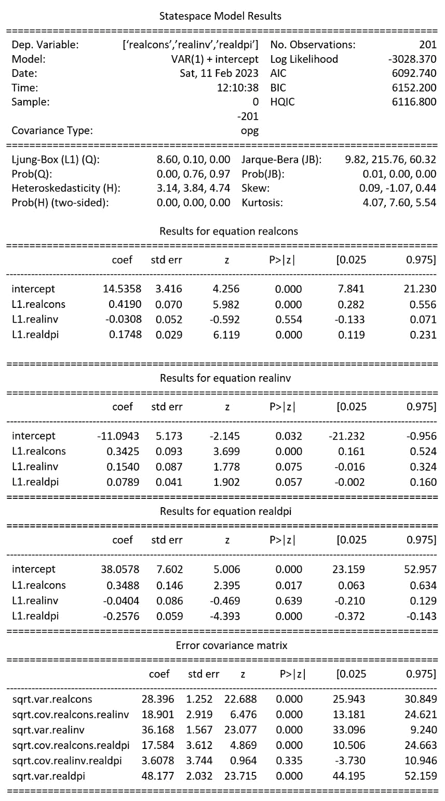

图 12.15 – VAR(1)模型输出

## 第 5 步 – 测试预测

需要注意的是，与长期历史表现相比，VAR 模型的预测实际上相当稳定。我们看到预测结束时出现如此极端差异的原因是，这个时间段对应于**大衰退**，该衰退从 2007 年持续到 2009 年。我们测试预测的最后五个点对应于 2008 年的最后两个季度和 2009 年的前三个季度：

```py
df_pred = results.get_prediction(start=195, end=200).summary_frame(alpha=0.05)
fig, ax = plt.subplots(1,1,figsize=(20,5))
ax.plot(data_1d['realinv'], marker='o', markersize=5)
ax.plot(df_pred['mean'], marker='o', markersize=4)
ax.plot(df_pred['mean_ci_lower'], color='g')
ax.plot(df_pred['mean_ci_upper'], color='g')
ax.fill_between(df_pred.index, df_pred['mean_ci_lower'], df_pred['mean_ci_upper'], color='g', alpha=0.1)
ax.set_title('Test Forecast for VAR(1)')
```

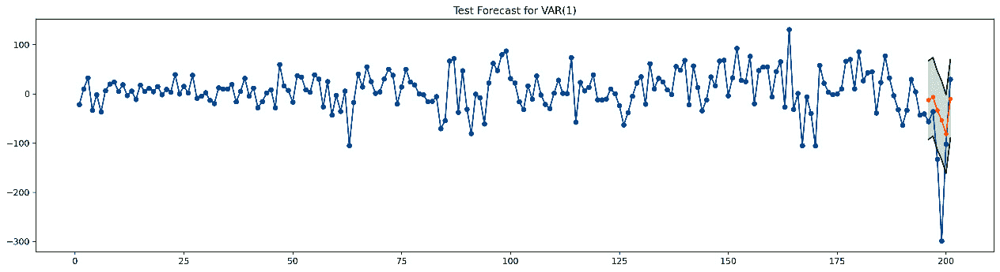

图 12.16 – VARMAX（p=1）的测试预测

我们可以将我们的预测（均值）与投资变量的实际值(`realinv`)进行比较，如下所示：

```py
pd.concat([df_pred,data_1d['realinv'].iloc[195:]], axis=1)
```

在*图 12**.17*中，我们可以看到 VAR（来自`VARMAX`函数）模型测试预测：

|  | `mean` | `mean_se` | `mean_ci_lower` | `mean_ci_upper` | `realinv` |
| --- | --- | --- | --- | --- | --- |
| 196 | -12.4348 | 40.79603 | -92.3935 | 67.52398 | -56.368 |
| 197 | -6.26154 | 40.79603 | -86.2203 | 73.69722 | -35.825 |
| 198 | -33.5406 | 40.79603 | -113.499 | 46.41821 | -133.032 |
| 199 | -53.6481 | 40.79603 | -133.607 | 26.31066 | -299.167 |
| 200 | -81.514 | 40.79603 | -161.473 | -1.55526 | -101.816 |
| 201 | -10.1039 | 40.79603 | -90.0627 | 69.85483 | 29.72 |

图 12.17 – VAR(1)模型测试预测

## 第 6 步 – 构建预测

我们可以观察到，因为这个模型是一个**自回归阶数 p=1**的模型，预测**非常快地趋向于均值**。包括更高阶数可能会导致更多的模型方差，这我们可以将其视为更自信但风险更高的预测。多元自回归(1)模型产生更多的偏差，我们可以在*图 12**.18*中观察到我们提到的趋向均值的趋势。我们可以运行以下代码来生成数据并绘制预测图：

```py
df_forecast = results.get_prediction(start=201, end=207).summary_frame(alpha=0.05)
forecast = np.hstack([np.repeat(np.nan, len(data_1d)+1), df_forecast['mean']])
 fig, ax = plt.subplots(1,1,figsize=(20,5))
ax.plot(data_1d['realinv'], marker='o', markersize=5)
ax.plot(forecast, marker='o', markersize=4)
ax.plot(df_forecast['mean_ci_lower'], color='g')
ax.plot(df_forecast['mean_ci_upper'], color='g')
ax.fill_between(df_forecast.index, df_forecast['mean_ci_lower'], df_forecast['mean_ci_upper'], color='g', alpha=0.1)
ax.set_title('Forecast for VAR(1)');
```

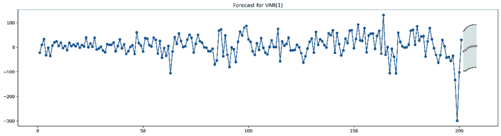

图 12.18 – VAR(1)模型预测，h=7

在这里，我们可以看到预测点以及预测的置信区间：

```py
df_forecast
```

|  | `mean` | `mean_se` | `mean_ci_lower` | `mean_ci_upper` |
| --- | --- | --- | --- | --- |
| 202 | -16.3442 | 40.79603 | -96.3029 | 63.6146 |
| 203 | -10.9571 | 43.69828 | -96.6041 | 74.68998 |
| 204 | -3.24668 | 44.4028 | -90.2746 | 83.7812 |
| 205 | 1.301495 | 44.56735 | -86.0489 | 88.65189 |
| 206 | 3.576619 | 44.60344 | -83.8445 | 90.99775 |
| 207 | 4.650973 | 44.61108 | -82.7851 | 92.08709 |
| 208 | 5.147085 | 44.61268 | -82.2922 | 92.58633 |

图 12.19 – VAR(1)模型输出数据

注意，我们的结果是基于差分数据的。此模型告诉我们变量之间关于它们各自信号的统计显著性水平，但不会给我们提供原始数据方面的预测值。要反转差分数据，我们需要估计一个积分常数，然后根据该常数进行反差分，或者使用允许我们进行反变换的不同变换方法，例如可以指数化的对数变换，以进行反转。通常，VAR 模型用于识别在交叉相关分析以及经济冲击分析中作为高度相关变量识别的变量之间的潜在因果关系。

可以认为，根据预测所需的详细程度，可能不需要对变量进行差分和移位。然而，由于这是一个没有外生变量的完全内生模型，如果我们对任何变量应用差分，我们也必须对包含非平稳行为的所有变量应用差分。至于移位，简单地应用更高的自回归滞后阶数可能比应用移位更有用；移位的缺点是在过程的早期阶段就会丢失样本。然而，使用更高滞后阶数的缺点是在时间维度中包含更多变量，这可能会增加过拟合的可能性。从逻辑上讲，随着模型中包含的变量增多，我们也必须增加样本量。与任何模型一样，我们必须应用严格的交叉验证以确保性能稳定并最小化风险。

# 摘要

在本章中，我们概述了多元时间序列及其与单变量情况的不同之处。然后，我们介绍了使用多元时间序列模型解决问题的两种流行方法背后的数学和直觉——ARIMAX 和 VAR 模型框架。我们通过逐步方法对每个模型进行了示例分析。本章总结了我们对时间序列分析和预测的讨论。到这一点，你应该能够识别和评估时间序列的统计特性，根据需要对其进行转换，并构建适用于拟合和预测单变量和多变量情况的有用模型。

在下一章中，我们将从**事件时间**（**TTE**）变量的介绍开始讨论生存分析。

# 参考文献

[1] *Liang, X., Zou, T., Guo, B., Li, S., Zhang, H., Zhang, S., Huang, H. 和 Chen, S. X.* (*2015*). *评估北京的 PM2.5 污染：严重程度、天气影响、APEC 和冬季供暖*。*皇家学会学报 A*，471，20150257。

[2] *Dua, D. 和 Graff, C.* (*2019*). *UCI 机器学习仓库* [[`archive.ics.uci.edu/ml`](http://archive.ics.uci.edu/ml)]. *加州大学欧文分校，信息与计算机科学学院*，加州，欧文市。

# 第五部分：生存分析

本部分将通过分析事件时间结果变量来介绍另一种统计方法，即生存分析。在介绍生存分析和截尾数据之后，我们将研究具有生存响应的模型。

它包括以下章节：

+   *第十三章*, *事件时间变量 - 简介*

+   *第十四章*, *生存模型*
