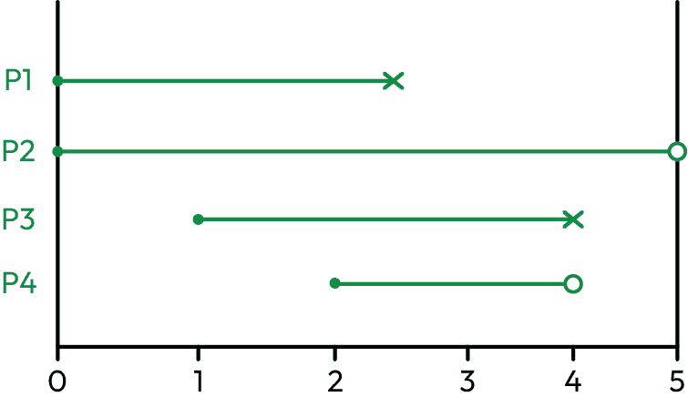
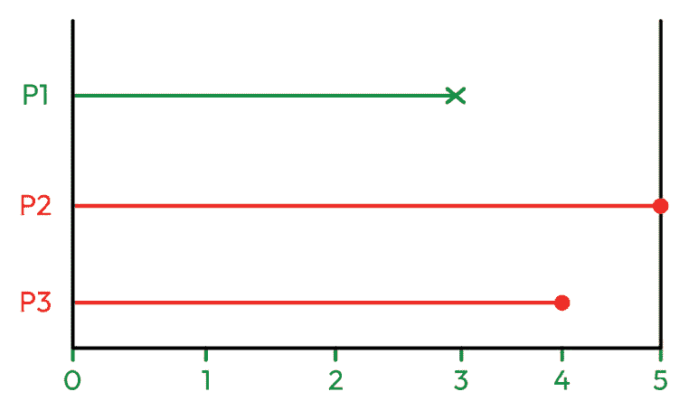
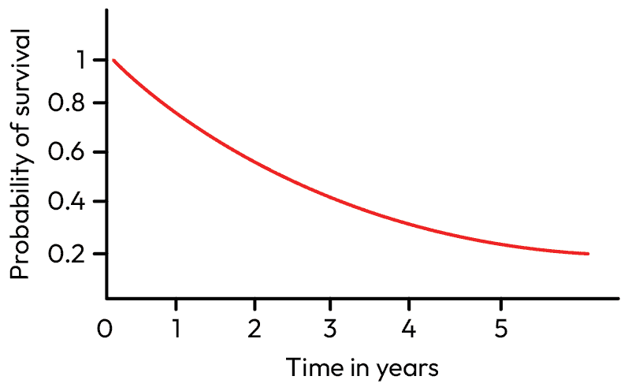
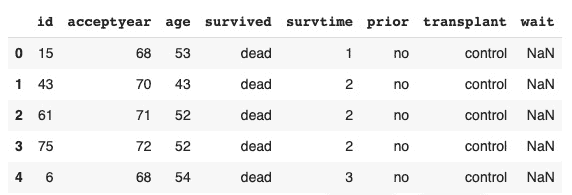
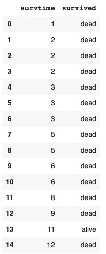

# 13

# 事件发生时间变量 - 简介

在这个简短的章节中，我们将介绍统计学的一个分支，称为**生存分析**，它与生存和时间审查研究相关。生存分析也称为**事件发生时间变量分析**，这是一种特定的统计结果类型，需要使用比我们在前面几章中研究的技术更多的技术。事件发生时间变量分析研究，例如，在研究时间段内参与者是否发生了感兴趣的事件。换句话说，我们研究的是在特定时间点后样本的*存活比例*以及存活样本比例失败或死亡的速度，或者不同治疗组之间是否存在生存差异。生存分析中的*生存*一词最初是基于医学领域中从治疗到死亡的时间。然而，生存分析可以轻松应用于许多领域，包括工程（在那里它被称为**可靠性理论**或**可靠性分析**）、社会学（**事件历史分析**）和经济学（**持续时间分析**）。在医学研究中，当发生死亡时，生存研究可能并不模糊，尽管某些事件，如器官衰竭，可能定义不清。然而，在其他研究领域中确实存在模糊性：例如，在工程领域，故障或系统损坏可能是部分的，或者并不严格由时间决定。我们还将在本章中检查生存数据、生存函数、风险和风险比。

在本章中，我们将涵盖以下主要主题：

+   审查

+   生存数据

+   生存函数、风险和风险比

# 什么是审查？

在统计学领域，**审查**指的是一个情况，即测量或观察的完整程度或精确值并不完全为人所知。在生存分析中，这种情况发生在我们有关于样本观察的信息，但不知道给定事件发生的时间，这被认为是生存分析中的一个关键问题，区分了时间到事件分析与其他在前面章节中提到的统计分析。审查发生有几个原因；例如，一个人退出研究或提前退出，或者所讨论的事件在研究开始之前就已经发生。审查的事件是*非信息性的*，也就是说，*审查导致研究失败是由于除失败时间之外的其他原因。换句话说，由审查引起的失败与事件发生的概率无关。* **信息性审查**发生在由于研究原因而失去观察结果时。信息性审查有三种类型：**右端审查**、**左端审查**和**区间审查**。在这本书中，我们专注于**非信息性**的**右端审查**。

## 左端审查

当我们知道事件在收集观察数据之前已经发生时，那么观察就是**左截尾**。一个左截尾的例子是我们研究中学生开始青春期的年龄。可能有学生在中学生入学之前就达到了这个发育阶段。所有这些学生都被认为是左截尾。另一个例子是针对一个风险患者组的 HIV 研究，到研究开始时，一些患者已经感染了 HIV。

## 右截尾

当事件在某个时间点之后发生，但我们不知道确切的时间时，这种情况被认为是**右截尾**。应用之前的场景，想象有一些学生在青春期发育阶段研究中退出，或者在我们跟进之前（例如，他们转学到另一所学校）或者他们有延迟的青春期（在他们从初中毕业进入高中之前，发育阶段还没有发生）。另一个例子是癌症研究，其中一组患者被招募参加临床试验，以观察新的治疗方法对他们的影响，但组内的一个患者在两年后因车祸去世。在这种情况下，我们知道这位患者的生存期至少有 2 年，但在研究期间，我们不知道这位患者能够存活多少年。

## 间隔截尾

左截尾和右截尾是**间隔截尾**的特殊情况。一个清楚地说明间隔截尾的例子是，一位患者在时间 t1 时进行了 HIV 检测，结果为阴性，但在时间 t2 时检测结果为阳性。然而，我们不知道这位患者在时间间隔[t1, t2]之间确切感染的时间。这位特定的患者在去年和今年都进行了年度体检。实验室结果显示，他去年是 HIV 阴性，但今年是 HIV 阳性。因此，感染发生在去年和今年的体检之间的某个时间点，但我们不知道确切的时间。

## 一类和二类截尾

右端截断有两种类型：**I 型截断**和**II 型截断**。在**I 型截断**中，研究被设计为在某个时间点 t 后终止。固定截断发生在对象在时间 t 之后没有发生事件时。这个对象被认为在时间 t 被截断。随机截断发生在截断对象没有相同截断时间时。在**II 型截断**中，研究在发生预定的某些事件后终止。这种截断类型在寿命测试实验中经常被用来节省时间和金钱。例如，我们随机选择 n 个对象作为样本来测试新的创新是否真正有效，但我们不是测试所有这些 n 个对象，而是定义如果发生 r 次故障，研究就终止以节省时间和成本。在这种情况下，前 r 个对象在时间 t 1、t 2、…、t r 发生事件，但剩余的 n − r 个对象在时间 T = max(t 1, t 2, … , t r)没有发生事件，因此它们被认为是截断的。

让我们可视化一个为期 5 年的癌症研究，测试一种新的治疗方法。研究的开始时间是 0，即研究开始时，结束时间是 5，即研究结束时。

图 13.1 – 癌症研究中生存分析的右端截断

第一位患者在研究开始时被招募，但在两年半时去世。第二位患者也是在研究开始时被招募的，但在第 5 年，他仍然存活。这位患者已经存活了超过 5 年，但我们不知道他最终可以存活多少年，这意味着这位患者发生了右端截断。第三位患者在第 1 年被招募，但在第 4 年去世。第四位患者在第 2 年加入了研究，但在第 4 年，我们无法继续跟踪这位患者。原因可能是他搬到了另一个城市，例如。患者 2 和患者 4 发生了截断。

这项研究看起来像是一个回归问题，但在本例中，当研究结束时，第二位患者被认为已经存活。这使得生存分析不同于常规的统计分析。我们也没有从研究数据中移除第二位患者的数据，因为信息是有价值的：患者可以至少存活 5 年。此外，患者随访可能会被防止，因为他们可能搬到了另一个地方或者非常病重，但我们不是移除数据，而是记录他们退出研究的原因。同样，性别考虑可能会存在偏差，因为例如，当男性患者生病时，他们可能比女性患者更有可能退出研究，从而得出一个可能错误的结论，即女性的存活时间比男性长。

# 生存数据

**生存数据**关注的是研究中的对象是否经历了某个事件。此外，还会考虑随访时间。*时间零点*或*时间起点*是研究开始的时间。根据研究的目的，时间零点或时间起点可能不同。例如，在前列腺癌研究中，研究人员招募 40 岁及以上的男性参与者，而在青春期发育年龄的研究中，则招募 12 岁及以上的男性和女性青少年。如果研究持续一段时间（可能是几个月或几年），那么在研究期间记录时间起点和随访时间至关重要。

最后，我们讨论*生存时间和删失时间之间的关系*以及如何*在删失的情况下记录生存数据*。假设对于样本中的每个对象，我们知道其真实事件时间 T 和真实删失时间 C。那么，该对象的*生存时间是指事件发生之前的时间段*，而该对象的*删失时间是指删失发生的时刻*，例如，研究结束或我们无法继续跟踪该对象时。用δ i 表示对象 i 的状态指示符：

δ i = { 1 如果事件被观察到 ,   0 如果观察到删失。

换句话说，当事件 T i 在删失 C i 之前发生时，δ i = 1，当事件 T i 在删失 C i 之后发生时，δ i = 0。观察到的结果变量是

Y i = min(T i, C i)

以及对象 i 的删失生存数据可以表示为(Y i, δ i)。

以下示例考虑了一个癌症研究中的三名患者。在这里，时间以年为单位，研究持续 5 年。

| **患者** | **T** | **C** | **δ** |
| --- | --- | --- | --- |
| 1 | 3 (患者在第 3 年去世) | 无删失 – 患者在第 3 年去世 | 1 (因为观察到事件) |
| 2 | 7 (患者在第 7 年去世，但研究在第 5 年结束) | 5 (研究在第 5 年结束) | 0 (因为观察到删失) |
| 3 | 无信息 | 4 (患者退出研究) | 0 (因为观察到删失) |

图 13.2 – 癌症研究的生存分析

以下图展示了癌症研究中 3 名患者的信息。

图 13.3 – 癌症研究的生存分析

# 生存函数、风险率和风险比

让我们先讨论生存函数。函数的公式定义为

S(t) = P(T > t)

表示对象在时间 t 之后存活的概率。生存函数是一个非递增函数，其中 t 的范围从 0 到∞。当 t = 0 时，S(t) = 1，当 t = ∞时，S(t) = S(∞) = 0。理论上，这是一个平滑的函数，但在实践中，*事件发生在离散的时间尺度上*（天数、周数、年数）。

图 13.4 – 生存函数示意图

在这个例子中，我们回顾了跨越 5 年的癌症研究。在研究开始的时间零点，生存概率是 1 或 100%，但在第 5 年，生存概率接近 0.2 或 20%。

现在我们考虑**斯坦福心脏移植数据集**。该数据集包含了 103 名参与实验性心脏移植项目的患者信息（见图 13**.5**）。患者病情严重，有可能从成为项目的一部分中获得一些好处，因为他们可能需要等待几周到几个月才能从捐献者那里获得新的心脏。CSV 数据集可以在[`www.openintro.org/data/csv/heart_transplant.csv`](https://www.openintro.org/data/csv/heart_transplant.csv)下载。

图 13.5 – 斯坦福移植数据的前五行

我们在这里关注两个特征：`survived`（记录死亡与存活的状态）和`survtime`（患者被确定为心脏移植候选人后到研究结束为止存活的天数）。当我们按`survtime`排序数据时，在前 15 个观察值中，第 13 行的患者仍然存活，如图 13**.6**所示。因此，第 13 行的观察结果是时间截断的。

图 13.6 – 前 15 名移植患者的状态

在这个例子中，为了计算`survtime = 3`之后的生存概率，我们只需要计算每个时间间隔[t 0, t 1]，(t 1, t 2]，(t 2, t 3]中的**生存概率**，该概率通过以下方式计算

P(Survival in (t i−1, t i]) = 1 − P(Dead in (t i−1, t i] | Alive in t i−1)

其中

P(Dead in (t i−1, t i] | Alive in t i−1) =  (t i−1, t i] 内的死亡人数    ___________________  t i−1 时的存活人数 ，

然后

S(t 3) = P(Survival > t 3) = (1 −  0 _ 103 )*(1 −  1 _ 103 )*(1 −  3 _ 102 ) = 96.12 % .

接下来，我们讨论风险函数或风险率。**风险函数**定义为

h(t) = lim 𝛥t→0 Pr(t < T ≤ t + Δt | T > t)  ______________  Δt ,

*t* 表示在给定时间点之前生存的情况下事件发生的瞬时率。换句话说，它就是现在活着的情况下，在接下来的几秒或第二天内死亡的概率。风险比是死亡概率的比率。例如，当风险比是 3 时，那么给定组死亡的概率是另一组的 3 倍。

# 摘要

在本章中，我们概述了时间至事件变量分析及其与我们在前几章中研究过的其他统计分析的差异。我们涵盖了截尾直觉（左截尾、右截尾和区间截尾）并讨论了一类和二类截尾。本章还讨论了非信息性事件和信息性事件。然后，我们讨论了生存数据以及生存与截尾时间之间的关系，以及如何记录带有截尾的生存数据。本章的最后部分还提到了生存函数、风险率和风险比。

在下一章中，我们将考虑非参数 Kaplan-Meier 模型、参数指数模型，以及半参数 Cox 比例风险模型。我们将通过应用这些模型进行生存分析，在 Python 中执行实际数据分析。
