# 第十四章：生存模型

在*第十三章*，时间事件变量中，我们介绍了生存分析、删失和**时间事件**（**TTE**）变量的主题。在本章中，我们将深入概述并演示这些技术在三个主要模型框架中的应用：

+   Kaplan-Meier 模型

+   指数模型

+   Cox 比例风险模型

我们将讨论每种方法如何通过单变量 Kaplan-Meier 和指数方法以及多变量 Cox 比例风险回归模型，提供对研究受试者生存和风险风险的概率洞察。我们将通过使用真实数据的示例来演示，并讨论结果，以便读者了解如何评估性能并将测试输出转换为有用的信息。最后，我们将展示如何使用训练好的模型为未见数据提供预测概率。

# 技术要求

在本章中，我们使用了一个额外的 Python 库进行生存分析：`lifelines`。请安装以下版本的这些库以运行提供的代码。有关安装库的说明，请参阅*第一章**，采样* *和泛化*：

+   `lifelines== 0.27.4`

更多关于`lifelines`的信息可以在以下链接找到：

[`lifelines.readthedocs.io/en/latest/index.xhtml`](https://lifelines.readthedocs.io/en/latest/index.xhtml)

# Kaplan-Meier 模型

我们将讨论的第一个生存分析模型是`lifelines`库。让我们开始吧。

## 模型定义

Kaplan-Meier 估计量由以下公式定义：

ˆ S (t) = ∏ i:t i≤t  n i − d i _ n i

在这里，n i 是时间 t 之前处于风险中的受试者数量，d i 是时间 t 的死亡事件数量，ˆ S (t)（生存函数）是寿命超过 t 的概率。公式中使用的Π符号类似于Σ符号；然而，Π表示乘法。这意味着前面的公式将在每个时间步 t 产生一系列分数的乘积。这意味着 Kaplan-Meier 估计量是一系列递减的水平步骤。为了使这一点更清晰，让我们通过一些示例数据来查看其应用。

假设我们有以下数据，其中`duration`列表示受试者存活的时间，`death`列表示研究中是否观察到死亡。让我们通过这个数据的 Kaplan-Meier 估计量进行计算：

| **持续时间** | **死亡** |
| --- | --- |
| `5` | `1` |
| `7` | `1` |
| `3.5` | `1` |
| `8` | `0` |
| `2` | `1` |
| `5` | `1` |

图 14.1 – 死亡和持续时间示例数据

初始时（t = 0），所有受试者都处于风险之中，但没有人死亡。这意味着当前的生存率是 1。我们按照以下方式计算 t = 0 时生存函数的值：

ˆ S (0) =  n 0 − d 0 _ n 0  =  6 − 0 _ 6  = 1

第一个事件发生在 t = 2。此时，所有受试者（六个受试者）在事件发生前都处于风险中，并且此时有一个受试者死亡。我们计算此点的当前生存率，然后乘以所有前面的值。t = 2 时的生存率如下：

n2 - d2 / n2 = (6 - 1) / 6 ≈ 0.83

然后，我们计算 t = 2 时的生存函数：

ˆ S (2) = n0 - d0 * n0 * (n2 - d2) / n2 = (6 - 0) * (6 - 1) / 6 ≈ 0.83

下一个事件发生在 t = 3.5。我们重复之前概述的过程。然而，此时只有五个受试者处于风险中，因为已经有一个人已经死亡。因此，t = 3.5 时的当前生存率如下：

n3 - d3 / n3 = (5 - 1) / 5 = 0.8

然后，我们计算此点的生存函数：

ˆ S (3.5) = (n0 - d0) * (n0 * (n2 - d2) * (n3.5 - d3.5)) / n3.5 = (6 - 0) * (6 - 1) * (6 - 1) * (5 - 1) / 5 ≈ 0.67

下一个事件发生在 t = 5，此时有两个受试者死亡。在 t = 5 时，有四个受试者处于风险中，并且有两个受试者死亡。因此，t = 5 时的生存率为 0.5。生存函数的新值计算如下：

ˆ S (5) = 1 * 0.83 * 0.67 * 0.5 ≈ 0.33

最后一个事件发生在 t = 7。此时，生存率为 0.5，生存函数在此点的值大约为 0.167：

ˆ S (7) = 1 * 0.83 * 0.67 * 0.5 * 0.5 ≈ 0.167

由于我们的研究在这里结束，这是生存函数的最终值，并且函数值在整个研究结束时保持不变。

如您所见，这个生存模型易于计算。注意，我们也没有提及假设或潜在的统计分布。Kaplan-Meier 估计器是一种非参数生存模型。正如我们在*第五章**，非参数检验*中讨论的，这意味着当分析的数据不符合参数模型的假设时，它可以作为参数模型的替代方案使用。Kaplan-Meier 估计器因此是一个值得拥有的工具。

现在我们已经了解了这个模型的工作原理，让我们看看如何使用 Python 的 `lifelines` 包计算 Kaplan-Meier 估计器生存函数。

## 模型示例

对于这个例子，我们将使用来自 `lifelines` 的 `larynx` 数据集。这个数据集包括六个变量：`时间`、`年龄`、`死亡`、`Stage_II`、`Stage_III` 和 `Stage_IV`。关于这个数据集的信息有限，因此我们将为此示例对变量做出以下假设：

+   `时间`表示患者在喉癌诊断后存活的时间

+   `年龄`表示患者在诊断时的年龄

+   `死亡`表示在研究期间是否观察到死亡

+   `Stage_II`表示在诊断时癌症处于第二阶段

+   `Stage_III`表示在诊断时癌症处于第三阶段

+   `Stage_IV` 表示癌症在诊断时处于第四期

+   当患者未指示在第二期或以上时，他们在诊断时处于第一期

让我们先计算研究中所有患者的生存函数。我们将使用来自 `lifelines` 的 `KaplanMeierFitter`。这是一个我们将要讨论的 Kaplan-Meier 模型。为了拟合这个模型，我们将使用 `fit()` 方法，它接受两个参数：`duration` 和 `event_observed`。`duration` 是患者在研究中的生存时间。`event_observed` 是死亡是否被观察到：观察到为 `True`，未观察到为 `False`。数据已经设置好，可以与这两个参数一起使用。我们可以如下拟合模型：

```py
import matplotlib.pyplot as plt
from lifelines import datasets
from lifelines.fitters.kaplan_meier_fitter import KaplanMeierFitter
data = datasets.load_larynx()
kmf = KaplanMeierFitter()
kmf.fit(data.time, data.death)
# this prints the first 5 elements of the survival function
kmf.survival_function_.head()
```

前一段代码的输出显示在 *图 14.2* 中，这是生存函数的前五个元素：

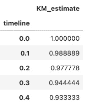

图 14.2 – 喉生存函数的前五个元素

*图 14.2* 中显示的生存函数元素缓慢下降，这表明随着时间的推移患者正在死亡。然而，从一系列数字中很难得到完整的故事。让我们绘制这个序列。我们还可以从 `KaplanMeierFitter` 对象中获取置信区间，如下一个代码块所示：

```py
fig, ax = plt.subplots(1)
kmf.survival_function_.plot(ax=ax)
ci = kmf.confidence_interval_survival_function_
index = ci.index
ci_low, ci_high = ci.values[:, 0], ci.values[:, 1]
ax.fill_between(index, ci_low, ci_high, color='gray', alpha=0.3)
```

这段代码生成了 *图 14.3* 中所示的图表，这是随时间变化的生存函数：

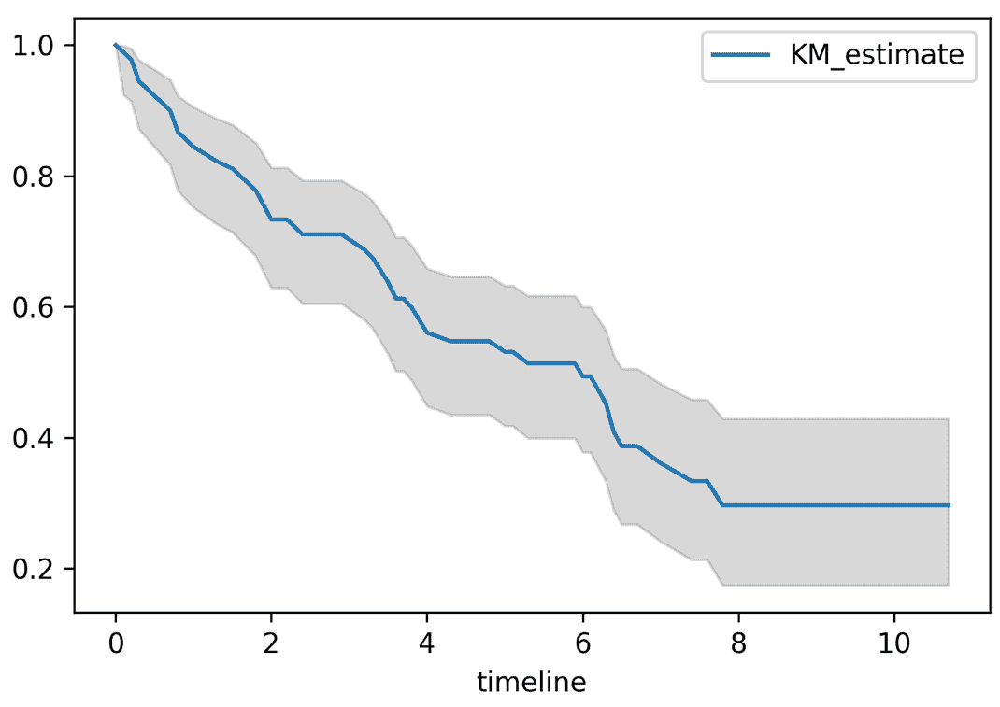

图 14.3 – 使用 Kaplan-Meier 估计的喉生存函数

喉部数据的 Kaplan-Meier 估计生存函数显示在 *图 14.3* 中。这个函数随时间下降，直到在时间步 8 的最后观察到死亡，函数保持恒定，直到研究结束。

现在，假设我们在这个数据集中有一些特征，我们可能想要比较。例如，我们有初始诊断时的癌症阶段，以及个体的年龄。让我们先比较两个年龄组的生存函数。然后，让我们比较基于癌症阶段的组别的生存函数。

研究中个体的年龄范围大约在 40 到 85 岁之间，其中大部分个体年龄在 60 到 80 岁之间。让我们将个体按 65 岁分成两组。任何小于 65 岁的人将属于年轻组，任何 65 岁或以上的人将属于老年组。两组的生存函数显示在 *图 14.4* 中：

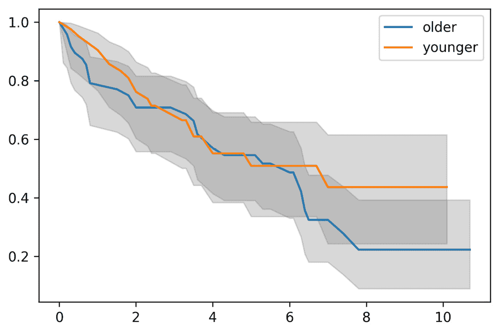

图 14.4 – 老年和年轻组的喉生存函数

在*图 14.4*中显示的老年组和年轻组的生存函数似乎在时间步 7 之前几乎没有差异。然而，置信区间似乎从未发散。根据这些数据，年龄似乎并不是生存的强影响因素。

现在，让我们对各个阶段进行类似的生存分析。如前所述，我们将假设任何未在第二阶段或以上阶段中指出的个体被诊断为第一阶段。这些组的生存函数显示在*图 14.5*中：

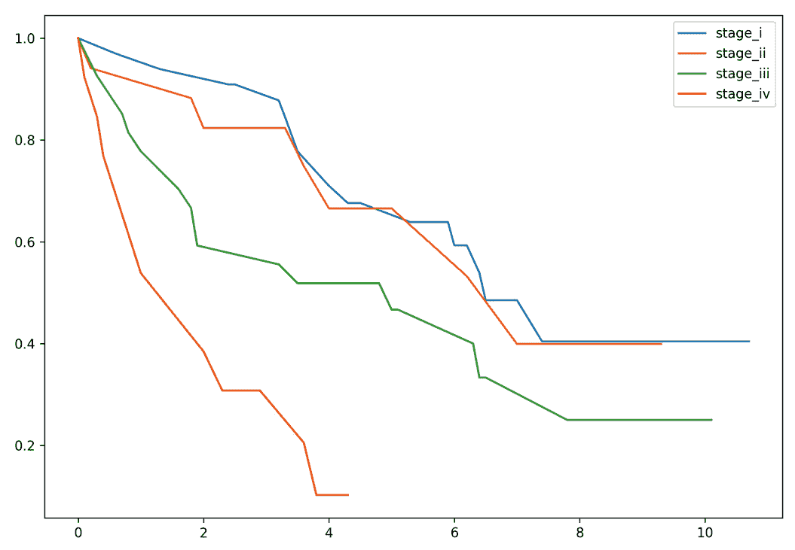

图 14.5 – 根据阶段划分的喉部生存函数

根据阶段划分的组的生存函数显示在*图 14.5*中。此图为了绘图清晰，省略了置信区间。根据图示，似乎第一阶段和第二阶段之间没有显著差异。我们开始看到第三阶段有差异。第四阶段与其他阶段之间的差异明显。

在本节中，我们讨论了生存的 Kaplan-Meier 模型，这是一个针对生存数据的非参数模型。我们还讨论了如何在集合内比较多个组的生存函数。在下一节中，我们将讨论指数模型，这是一个针对生存数据的参数模型。

# 指数模型

在最后一节中，我们研究了非参数的**Kaplan-Meier 生存模型**。现在，我们将参数模型与**指数模型**相结合，然后在下一节中讨论半参数模型，即**Cox 比例风险模型**。在考虑指数模型之前，我们将回顾指数分布是什么以及为什么在本节中提到它。这种分布基于泊松过程。在这里，事件随时间独立发生，事件率λ通过单位时间内的发生次数计算，如下所示：

λ = Y _ t

泊松分布是关于在指定时间段内发生事件数量的**统计离散分布**。其定义如下。设*Y*为时间*t*内发生的次数。如果概率质量函数由以下公式给出，则 Y 遵循参数λ的泊松分布：

f(Y) = Pr(y = Y) = e −λ λ Y _ Y !

离散变量 y 的均值和方差等于事件发生率。我们不是关注在特定时间段内发生了多少事件，而是考虑事件持续了多长时间；这就是为什么在本节中考虑指数分布的原因。设 T 为事件发生的时间（Y = 1）。概率密度函数通过以下公式计算：

f(t) = P(T = t) = λ e −λt

累积分布函数的计算方法如下：

F(t) = P(T ≤ t) = 1 − e −λt

函数 F(t) 表示超过时间 t 的生存概率或生存时间小于 t 的概率。我们可以在*图 14.6*中看到以下概率形式：

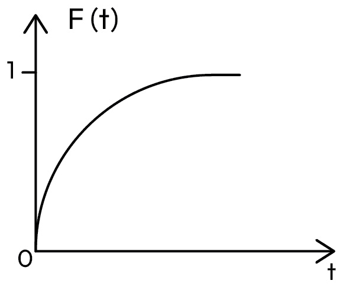

图 14.6 – 超过时间 t 生存概率的曲线

相比之下，生存函数与超过一定时间 t 的生存概率相关：

S(t) = P(T > t) = 1 − P(T ≤ t) = e −λt

通过可视化，生存函数将呈现*图 14.7*中看到的形式：

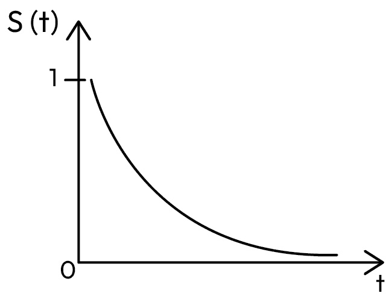

图 14.7 – 生存函数的曲线

**累积风险函数**是 H(t) = λt。然后我们可以用风险函数重新表示生存函数，如下所示：

S(t) = e −H(t)

给定 S(t) 和 f(t)，我们可以使用对数似然方程的方法，并通过最大似然估计来估计 λ 的值。

## 模型示例

我们将使用与上一节相同的来自 `lifeline` 的 `larynx` 数据集。在这个例子中，我们将使用 `lifelines` 中的 `ExponentialFitter`。同样，`fit()` 方法接受两个参数：`duration` 和 `event_observed`。我们可以如下拟合模型：

```py
from lifelines import ExponentialFitter
from lifelines import datasets
data = datasets.load_larynx()
exf = ExponentialFitter()
exf.fit(data.time, data.death)
# this print the first 5 elements of the survival function
exf.survival_function_.head()
```

在 Kaplan-Meier 模型中，曲线看起来像阶梯状，但使用指数方法，曲线是逐渐连续下降的，正如我们在这里可以看到的：

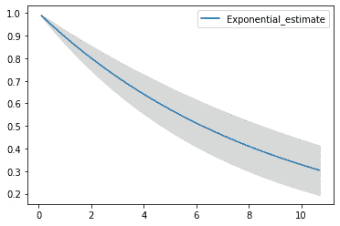

图 14.8 – 使用指数分布的喉部生存函数

在时间步 8，Kaplan-Meier 模型中的函数保持恒定，直到研究结束，但在指数模型中，曲线继续下降直到研究结束。我们还对年轻组（小于 65 岁）和老年组（65 岁及以上）进行了类似的研究（见*图 14.9*）：

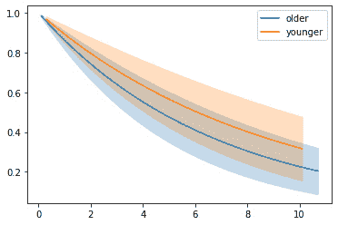

图 14.9 – 老年和年轻组的喉部生存函数

我们还在喉部案例的各个阶段进行生存分析（见*图 14.10*）：

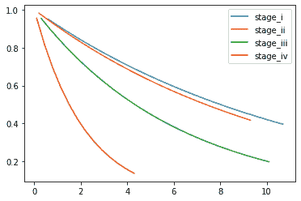

图 14.10 – 基于阶段的喉部生存函数

指数模型和 Kaplan-Meier 模型都给我们提供了类似的信息。这两个模型之间有优缺点。在 Kaplan-Meier 模型中，结果解释更简单；我们可以估计两个模型的生存函数值，但指数模型的一个优点是能够**估计风险比**。指数模型的两个缺点是结果并不总是现实的，并且我们必须假设一个恒定的风险比，这并不总是实用的。在下一节中，我们将讨论另一个生存模型，即半参数的 Cox 比例风险回归模型。

# Cox 比例风险回归模型

生存分析，也称为 TTE 分析，正如我们在第十三章“时间到事件变量”中讨论的，是一种使用概率来估计事件发生前剩余时间的分析方法。我们看到了如何通过在诸如估计预期寿命、机械故障和客户流失等应用中包含适当的协变量，这有助于确定优先事项并更有效地分配资源。正如我们在*第十三章*中深入讨论的，截尾是使生存分析区别于其他可以使用回归等技术解决的统计问题的独特方面。因此——并且由于由于截尾而删除的观察值几乎肯定会误导我们的模型并提供我们无法信任的结果——我们在估计事件发生前的时间之前插入了一个称为**事件状态指示器**的变量，以帮助解释事件是否会在事件发生前发生或未发生。回想一下，对象 i 的事件状态指示器 δ 的描述如下：

δ i = { 1 如果观察到事件，   0 如果观察到截尾。

我们注意到，当真实事件 T i 在截尾时间 C i **之前**发生时，δ i = 1，而当真实事件 T i 在截尾时间 C i **之后**发生时，δ i = 0，因此，对象 i 的结果 Y 如下：

Y i = min(T i, C i)

对象 i 的截尾生存数据可以表示为 (Y i, δ i)。在本章中，我们讨论了**非参数**的**Kaplan-Meier 生存模型**，该模型使用每个时间点的样本体积的原始条件生存概率计数，而不考虑协变量。然后我们介绍了**参数**的**指数生存模型**，与 Kaplan-Meier 模型不同，它假设数据适合特定的分布，并且还包括一个风险比来比较组别。现在我们将讨论**半参数**的**Cox 比例风险生存模型**，也称为**Cox 比例风险回归模型**。

Cox 比例风险模型的主要目的和特点是利用多个协变量风险因素来建模生存时间。这些协变量可以是分类的或连续的。Cox 比例风险模型能够通过利用**风险比**来解释不同组之间生存时间的差异。正如我们之前讨论的，风险比是在任何时间点，对于一组相对于另一组的事件发生率的比率，前提是两组在该时间点之前都保持了生存。

风险比可以按照以下方式计算：

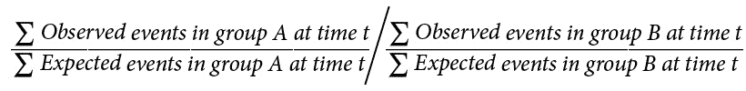

风险比的问题在于，当我们无法在组间共享的协变量之间获得值的平衡时，我们就失去了对混杂变量的控制。当我们无法控制混杂变量时，我们无法可靠地获得推断。为了解释生存分析中可能存在的协变量值的不平衡，我们可以使用**Cox 比例风险模型**来引入系数，这些系数有助于解释不同水平的外生影响。该模型遵循以下形式：

h(t) = h0(t) e^(β1X1 + β2X2 + … + βnXn)

在这里，h(t)是基础时间 t 的预期风险值，h0(t)是当变量矩阵 X 中的所有协变量都等于零时，t 的基线风险值，而 n 是模型中包含的变量数量。系数βn 提供了对 X 中每个列变量的影响（效应）的量化。因此，我们能够通过将输入变量的特定值乘以其相应的估计系数来预测生存。

Cox 比例风险模型有三个相关假设：

+   假设风险比*在随访期间保持恒定*。如果一个组输入的性质可能发生变化，这可能会对模型的结果产生负面影响；例如，我们比较两种机器的性能，但其中一种机器在天气变暖时可能会改善，而另一种则不会，因此我们的模型可能无法正确地模拟机械生存性。

+   完成*生存独立性*。这意味着一个研究参与者或对象的生存不受另一个对象的影响。考虑两个独立的机器。如果一个机器的振动可能导致早期故障，而这种振动也被另一个机器感受到，并且对另一个机器也有害，那么这两个机器之间可能没有生存独立性。然而，如果第一个机器的振动没有被另一个机器感受到，在其他混杂因素得到控制的情况下，很可能存在生存独立性。

+   模型假设*任何发生的数据截断都是非信息的*。因此，任何发生的数据截断都不会引入模型中的混杂因素。由于数据截断在随访前失去的研究对象必须与生存风险的改变无关。例如，当在一个设施的具体区域测试两种机器的机械生存性时，如果一个机器被转移到设施的其他区域以最小化其自身的自毁性振动，这是信息性截断。然而，如果机器被移动到不同的区域只是为了腾出空间，并且移动不会影响机器的生存风险或结果，那么截断就是非信息的。因此，它不会引入模型混杂。Cox 比例风险模型适用于**右截尾**数据。

在执行 Cox 比例风险回归建模时需要采取的步骤将在下面概述。顺序很重要，因为测试应该在可行时才进行。这些步骤遵循**国家卫生研究院**（**NIH**）提供的概述（[`www.ncbi.nlm.nih.gov/pmc/articles/PMC7876211/`](https://www.ncbi.nlm.nih.gov/pmc/articles/PMC7876211/)）。

## 步骤 1

设置要检验的零假设（多变量情况下的假设，我们将对其进行研究）。我们将使用*斯坦福心脏移植*数据集，该数据集列出了斯坦福心脏移植项目中等待移植的患者的生存情况。我们将使用`age`和`year`（与项目的开始日期相关）以及`transplant`状态和先前存在的旁路`手术`作为生存的预测因子，生存结果要么是死亡，要么是移植。生存持续时间是`stop`变量，即研究的退出时间。`event`是确认右端截断的变量，对应于死亡或移植。对于每个变量的零假设是组间在生存上没有统计学上显著的差异。例如，年龄对生存没有影响，而等待移植将是零假设。以下代码片段展示了代码：

```py
import statsmodels.api as sm
data = sm.datasets.get_rdataset('heart', package='survival').data
train_data = data.iloc[0:171]
test_data = data.iloc[171:]
exog=train_data[['age','year', 'transplant','surgery']]#df_test[['age','year','surgery','transplant']]
endog=train_data['stop']
data.head(2)
```

我们需要注意我们数据中的两个额外方面：(1) 年龄值是负数；起始`年龄`值是 48 岁，因此-1 岁的年龄对应于 47 岁的患者；(2) `年份`从 1967 年 11 月 1 日开始。`id`是每个患者身份的唯一标识。我们不会对这个变量进行建模，但可以将其用作参考。在*图 14.11*中，我们可以看到，作为参考，数据的前两行，包括我们将用于建模生存的所有变量：

| **开始** | **结束** | **事件** | **年龄** | **年份** | **手术** | **移植** | **id** |
| --- | --- | --- | --- | --- | --- | --- | --- |
| 0 | 50 | 1 | -17.1554 | 0.123203 | 0 | 0 | 1 |
| 0 | 6 | 1 | 3.835729 | 0.25462 | 0 | 0 | 2 |

图 14.11 – 斯坦福心脏移植数据集的前两行

## 步骤 2

我们使用`stop=1`来估计生存函数，对应于索引列`event_at`等于 1，我们有三个患者的右端截断。我们观察到事件发生在一位患者身上（`observed=1`），而其他两位患者被截断。在这里，我们展示了相应的数据。`id=45`的患者停止但同一天重新开始，然后存活到第 45 天。对于`id=3`的患者，他们在接受移植后存活到第 16 天。`id=15`的患者没有重新进入随访；我们假设由于他们没有接受移植，所以他们没有存活。

在下面的代码示例中，`durations`变量对应于生存时间，而`event_observed`对应于导致右端截断的事件（移植或死亡）：

```py
from lifelines import KaplanMeierFitter
import matplotlib.pyplot as plt
KaplanMeierFitter = KaplanMeierFitter()
KaplanMeierFitter.fit(durations=train_data['stop'], event_observed=train_data['event'])
KaplanMeierFitter.event_table.reset_index()
```

从 Kaplan-Meier 结果中可以看出，`event=1` 且 `stop=1` 导致 `observed=1`，而 `event=0` 且 `stop=1` 导致 `censored=1`，`stop=1` 导致 `removed=1`。所有这三种情况都会导致相应的样本从那天计算中移除，但与经历事件的病人不同，那些被截尾的病人被认为至少存活到研究继续的时间。我们可以通过考虑 Kaplan-Meier 生存估计概率函数 S t 来看到这一点：

S t =  起始时患者数量 - 时间 t 时事件发生数量 = 1 的患者数量     ______________________________________   起始时患者数量

在这里，任何时间 t 的生存概率表示为 S t。

在查看 `KaplanMeierFitter` 函数的事件表时，我们有以下结果：

S t =  风险患者数量 - 时间 t 时观察到的患者数量    _________________________________   风险患者数量

我们可以理解，除非他们也被标记为 `observed=1`，即 `event=1`，否则 `removed` 患者对生存估计的影响有限。我们可以将这种情况归因于 `event=1`。

让我们考虑患者 3、15 和 45 来更好地理解这种关系。根据 *图 14**.12* 和 *图 14**.13* 中的计数，我们可以看到这些患者在第 1 天 (`event_at=1`) 被从分母中移除。然而，通过查看 *图 14**.14*，我们可以看到患者 15 和 45 有后续的停止时间，对应的事件被纳入生存函数中。让我们首先看看 *图 14**.12*，以便我们可以看到第 1 天被移除的三个患者：

|  | **事件发生时间** | **移除** | **观察** | **截尾** | **进入** | **风险** |
| --- | --- | --- | --- | --- | --- | --- |
| 0 | 0 | 0 | 0 | 0 | 171 | 171 |
| 1 | 1 | 3 | 1 | 2 | 0 | 171 |
| 2 | 2 | 6 | 3 | 3 | 0 | 168 |
| 3 | 3 | 6 | 3 | 3 | 0 | 162 |
| 4 | 4 | 2 | 0 | 2 | 0 | 156 |
| … | … | … | … | … | … | … |
| 107 | 1401 | 1 | 0 | 1 | 0 | 5 |
| 108 | 1408 | 1 | 0 | 1 | 0 | 4 |
| 109 | 1572 | 1 | 0 | 1 | 0 | 3 |
| 110 | 1587 | 1 | 0 | 1 | 0 | 2 |
| 111 | 1800 | 1 | 0 | 1 | 0 | 1 |

图 14.12 – 斯坦福心脏移植数据集事件表摘要

现在，我们可以在 *图 14**.13* 中看到第 1 天所有有停止的患者。

```py
train_data.loc[train_data['stop']==1]
```

第 1 天有停止的患者是 `id` 为 3、15 和 45 的患者：

| **开始** | **停止** | **事件** | **年龄** | **年份** | **手术** | **移植** | **id** |
| --- | --- | --- | --- | --- | --- | --- | --- |
| 0 | 1 | 0 | 6.297057 | 0.265572 | 0 | 0 | 3 |
| 0 | 1 | 1 | 5.815195 | 0.991102 | 1 | 0 | 15 |
| 0 | 1 | 0 | -11.8166 | 3.263518 | 0 | 0 | 45 |

图 14.13 – 第 1 天退出研究的患者训练数据值

为了更好地理解这种分析是如何工作的，我们可以具体查看 `id` 为 3、15 和 45 的患者的所有记录：

```py
 train_data.loc[train_data['id'].isin([3, 15,45])]
```

这些患者在第 1 天注册了停止，但患者 3 和 45 分别在第 16 天和第 45 天也注册了停止：

| **开始** | **停止** | **事件** | **年龄** | **年份** | **手术** | **移植** | **id** |
| --- | --- | --- | --- | --- | --- | --- | --- |
| 0 | 1 | 0 | 6.297057 | 0.265572 | 0 | 0 | 3 |
| 1 | 16 | 1 | 6.297057 | 0.265572 | 0 | 1 | 3 |
| 0 | 1 | 1 | 5.815195 | 0.991102 | 1 | 0 | 15 |
| 0 | 1 | 0 | -11.8166 | 3.263518 | 0 | 0 | 45 |
| 1 | 45 | 1 | -11.8166 | 3.263518 | 0 | 1 | 45 |

图 14.14 – 患者第 3、15 和 45 天的训练数据值

我们还可以看到，患者 45 是唯一一个在 45 天有`停止`值（对应于`事件发生时间`）的患者。因此，我们知道移植会导致观察和移除。要识别 45 天的值，请运行以下代码：

```py
KaplanMeierFitter.event_table.loc[KaplanMeierFitter.event_table.index==45.0]
```

代码输出*图 14**.15*中的表格：

| **事件发生时间** | **移除** | **观察** | **截尾** | **进入** | **在风险中** |
| --- | --- | --- | --- | --- | --- |
| 45 | 1 | 1 | 0 | 0 | 87 |

图 14.15 – 45 天的事件

现在我们可以通过运行以下代码来查看事件表，该表已过滤到 45 天停止的事件：

```py
train_data.loc[train_data['stop']==45]
```

这给我们带来了*图 14**.16*中看到的表格输出：

| **开始** | **停止** | **事件** | **年龄** | **年份** | **手术** | **移植** | **id** |
| --- | --- | --- | --- | --- | --- | --- | --- |
| 1 | 45 | 1 | -11.8166 | 3.263518 | 0 | 1 | 45 |

图 14.16 – 45 天停止的事件

我们可以通过在以下代码中将两组分开来重复此步骤，以查看接受移植和未接受移植的人在整个研究结束时的生存率是否有差异：

```py
from lifelines import KaplanMeierFitter
import matplotlib.pyplot as plt
KaplanMeierFitter_n = KaplanMeierFitter()
KaplanMeierFitter_y = KaplanMeierFitter()
KaplanMeierFitter_n.fit(durations=data.loc[data['transplant']==0]['stop'], event_observed=data.loc[data['transplant']==0]['event'], label='no transplant')
KaplanMeierFitter_y.fit(durations=data.loc[data['transplant']==1]['stop'], event_observed=data.loc[data['transplant']==1]['event'], label='transplant');
```

我们在**Kaplan-Meier 生存函数**（*图 14**.17*）中观察到，两组的生存概率都在稳步下降，但未接受移植的组的下降更为陡峭。我们还可以看到，总体上，未接受移植的组如果与接受移植的组相比，是无法存活的。到项目结束时，没有非移植患者存活。阴影部分对应于每个概率区间的 95%置信区间带：

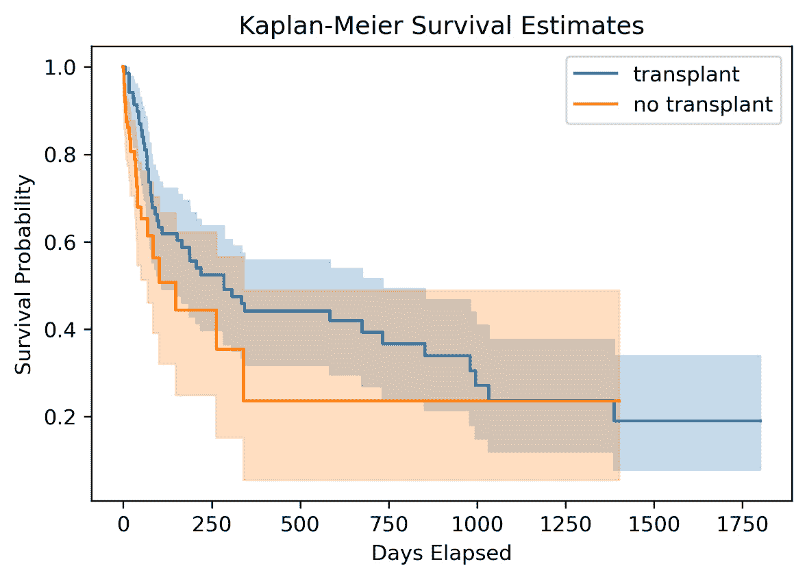

图 14.17 – Kaplan-Meier 生存估计概率函数

要生成任何一天（对应于`停止`时间）的确切生存概率，我们可以运行以下代码：

```py
print('Non-Transplant Survival Probability at day 300: ', KaplanMeierFitter_n.predict(300))
print('Transplant Survival Probability at day 300: ', KaplanMeierFitter_y.predict(300))
```

在这里，我们可以看到移植组和未移植组在第 300 天的生存概率：

```py
Non-Transplant Survival Probability at day 300:  0.3545098269168237
Transplant Survival Probability at day 300:  0.4911598783770023
```

## 第 3 步

现在，我们将使用**log-rank 检验**来确定生存曲线在统计上是否存在差异。在这一步，我们调查移植和非移植组之间是否存在任何统计意义上的生存差异。如果没有统计意义上的差异，那么理解协变量及其对生存的影响之间的关系将没有意义。我们在书中之前已经使用**卡方独立性检验**进行了**列联表分析**。这本质上就是这里的 log-rank 检验，其中我们比较两组（移植与非移植）的生存分布。我们采用这种方法是因为数据是右截尾的，因此是右偏斜的；因此，我们正在处理非参数分布。零假设是两组之间的风险比等于 1，这意味着他们在生存或风险风险方面是相等的。

在以下代码示例中，我们使用两种不同的患者分布（有移植和无移植的患者）作为`logrank_test`函数中的组 A 和 B：

```py
from lifelines.statistics import logrank_test
lr_results = logrank_test(durations_A=data.loc[data['transplant']==0]['stop'],
                          durations_B=data.loc[data['transplant']==1]['stop'],
                          event_observed_A=data.loc[data['transplant']==0]['event'],
                          event_observed_B=data.loc[data['transplant']==1]['event'])
```

我们可以看到使用了卡方分布：

```py
print(lr_results.null_distribution)
```

这表明默认分布是卡方分布：

```py
chi squared
```

我们可以运行以下代码来查看测试结果：

```py
lr_results.summary
```

我们还可以看到在 5%的显著性水平下，两组之间存在统计意义上的显著差异。因此，我们可以假设继续使用 Cox 比例风险模型来理解我们之前概述的协变量与生存风险之间的关系是有意义的：

| **test_statistic** | **P** | **-****log2(p)** |
| --- | --- | --- |
| 4.02651 | 0.044791 | 4.480663 |

图 14.18 – Log-rank 检验结果

## 第 4 步

在这里，我们运行 Cox 比例风险检验，并分析包含项的 p 值和置信区间，以确定它们是否与生存率的影响具有统计意义上的显著性。我们查看风险比以确定它们产生的任何影响：

```py
from lifelines import CoxPHFitter
CoxPHFitter = CoxPHFitter()
CoxPHFitter.fit(df=train_data[['age','year','surgery','transplant','stop','event']], duration_col='stop', event_col='event')
CoxPHFitter.print_summary()
```

我们可以看到，我们四个项中的三个在 5%的显著性水平下对预测生存是显著的；我们的`surgery`变量似乎并不基于 p 值。然而，手术的 95%置信区间不包含 0，这表明统计意义上的显著性。这种差异是因为 p 值是基于与临界值相关的测试统计量计算的，临界值是使用*风险比的对数*估计的，而置信区间是基于*风险比*本身的。这种差异可能意味着`surgery`变量是显著的，但也可能不是。由于我们不是在统计上确定的，我们应该谨慎行事，在预测未来生存时不应将其视为有用。

注意，`exp(coef)`对应于风险比，而`coef`是风险比的对数。这遵循我们之前提供的在基础时间*t*的预期风险值的方程。

我们可以说，基于危险比`(exp(coef))`为 1.03，年龄在 48 岁以上每增加一个单位，危险比增加 1.03 倍，即 3%。至于我们的`transplant`变量，我们可以以 95%的置信度说，进行心脏移植将危险比降低了 0.54 倍，相当于 46%。

在**图 14.19**中，我们可以看到 Cox 比例风险回归模型的结果：

| **模型** | `lifelines.CoxPHFitter` |  |  |  |  |
| --- | --- | --- | --- | --- | --- |
| 持续时间列 | `stop` |  |  |  |  |
| 事件列 | `event` |  |  |  |  |
| 基线估计 | `breslow` |  |  |  |  |
| 观察数量 | 171 |  |  |  |  |
| 观察到的事件数量 | 74 |  |  |  |  |
| 部分对数似然 | -298.47 |  |  |  |  |
| 运行时间 | 2023-03-18 16:23:26 UTC |  |  |  |  |
|  | coef | exp (coef) | se (coef) | coef lower 95% | coef upper 95% | exp
(coef) lower 95% | exp
(coef) upper 95% | cmp to | z | p | -log2 (p) |
| 年龄 | 0.03 | 1.03 | 0.01 | 0.01 | 0.06 | 1.01 | 1.06 | 0 | 2.35 | 0.02 | 5.74 |
| 年份 | -0.16 | 0.85 | 0.07 | -0.3 | -0.02 | 0.74 | 0.98 | 0 | -2.25 | 0.02 | 5.35 |
| 手术 | -0.64 | 0.53 | 0.37 | -1.36 | 0.08 | 0.26 | 1.08 | 0 | -1.74 | 0.08 | 3.62 |
| 移植 | -0.62 | 0.54 | 0.27 | -1.15 | -0.08 | 0.32 | 0.92 | 0 | -2.26 | 0.02 | 5.41 |
| 一致性 | 0.67 |  |  |  |  |  |  |  |  |
| 部分 AIC | 604.95 |  |  |  |  |  |  |  |  |
| 对数似然比检验 | 21.22 on 4 df |  |  |  |  |  |  |  |  |
| -log2(p) of ll-ratio test | 11.77 |  |  |  |  |  |  |  |  |

图 14.19 – Cox 比例风险模型输出

在**图 14.20**中，我们可以看到`age`，它只增加了 3%的危险，在结果中的方差解释不多。年龄范围大约从 9 岁到 64 岁。没有其他协变量，我们无法确切地说为什么可能是这样，但包括更多协变量可能有助于更深入地理解这个变量。在显著变量中，`transplant`对生存结果的影响最为显著：

```py
plt.title('Coefficients within Confidence Intervals')
CoxPHFitter.plot()
```

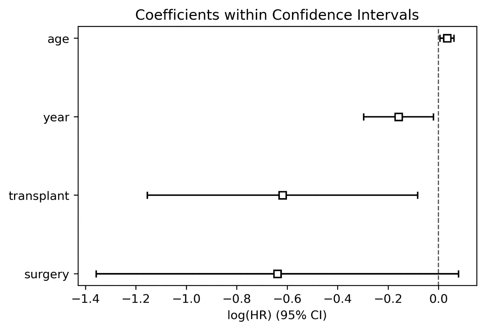

图 14.20 – 危险比项的置信区间

我们可以在**图 14.21**的生存函数图中看到，所有患者之间危险比是恒定的假设。这就是为什么防止信息性截断很重要的原因。让我们假设这个假设得到了满足。

注意到在预测时，我们没有起始和结束时间。因此，我们只能输入给定患者的可量化协变量，如下所示：

```py
CoxPHFitter.predict_survival_function(train_data[['age','year','surgery','transplant']]).plot()
plt.xlabel('Survival Time')
plt.ylabel('Survival Probability')
plt.title('Survival Function for All Patients')
plt.legend().set_visible(False)
```

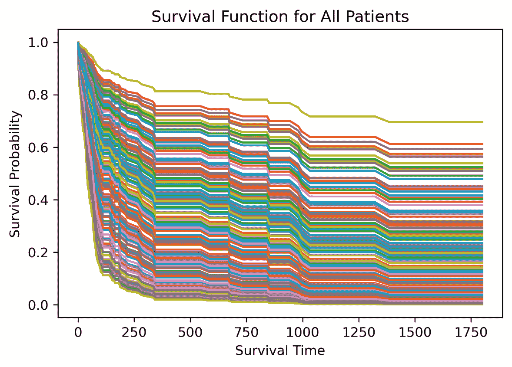

图 14.21 – 所有患者的生存函数

## 第 5 步

在**图 14.22**中，我们可以使用 Cox 比例风险模型来预测我们保留的测试患者的生存函数：

```py
CoxPHFitter.predict_survival_function(test_data[['age','year','surgery','transplant']]).plot()
plt.xlabel('Survival Time')
plt.ylabel('Survival Probability')
plt.title('Survival Function for Holdout')
```

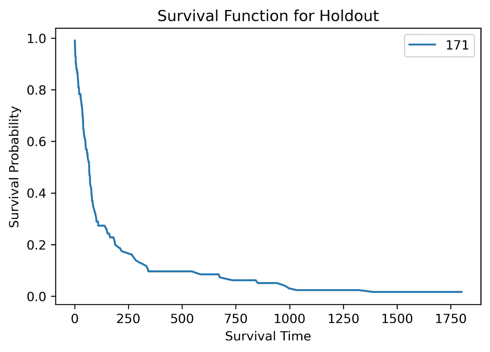

图 14.22 – 测试患者的生存函数，id=171

要生成这位患者生存的概率，使用他们的协变量，在每一个潜在的停止点，我们可以运行以下代码：

```py
CoxPHFitter.predict_survival_function(test_data[['age','year','surgery','transplant','stop','event']])
```

# 摘要

在本章中，我们深入讨论了三种生存分析模型：Kaplan-Meier 模型、指数模型和 Cox 比例风险回归模型。使用这些框架，我们建立了生存函数，并估计了各种 TTE（时间至事件）和右截尾研究的生存概率和风险比。对于多元情况，我们使用 Cox 比例风险回归模型来对依赖变量的协变量进行分析，以建模风险比。对于所有模型，我们展示了使用置信区间来评估显著性，以及相应的 p 值。到此为止，读者应该能够自信地识别出在哪些场景下每个模型会优于其他模型，并适当地拟合和实现该模型，以获得战略成功所需的必要结果。
