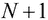
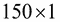

# 第二章 理解线性回归

在本章中，我们开始探索机器学习模型和技术。机器学习的最终目标是*泛化*从某些经验样本数据中得出的事实。这被称为**泛化**，本质上是指使用这些推断事实以准确率在新的、未见过的数据上准确执行的能力。机器学习的两大类别是**监督**学习和**无监督**学习。**监督学习**这个术语用来描述机器学习中的任务，即从某些标记数据中制定理解或模型。通过标记，我们指的是样本数据与某些观察到的值相关联。在基本意义上，模型是数据的统计描述以及数据如何在不同参数上变化。监督机器学习技术用来创建模型的初始数据被称为模型的**训练数据**。另一方面，无监督学习技术通过在未标记数据中寻找模式来估计模型。由于无监督学习技术使用的数据是未标记的，通常没有基于是或否的明确奖励系统来确定估计的模型是否准确和正确。

现在，我们将考察*线性回归*，这是一个有趣的预测模型。作为一种监督学习，回归模型是从某些数据中创建的，其中一些参数以某种方式组合产生几个目标值。该模型实际上描述了目标值与模型参数之间的关系，并在提供模型参数的值时可以用来预测目标值。

我们首先将研究单变量和多变量线性回归，然后描述可以用来从一些给定数据中制定机器学习模型的算法。我们将研究这些模型背后的推理，并同时展示如何在 Clojure 中实现这些算法来创建这些模型。

# 理解单变量线性回归

我们经常遇到需要从一些样本数据中创建近似模型的情况。然后，可以使用该模型在提供所需参数时预测更多此类数据。例如，我们可能想研究特定城市某一天降雨的频率，我们假设这取决于那一天的湿度。一个制定好的模型可以用来预测某一天降雨的可能性，如果我们知道那一天的湿度。我们从一些数据开始制定模型，首先通过一些参数和系数在这个数据上拟合一条直线（即方程）。这种类型的模型被称为**线性回归**模型。如果我们假设样本数据只有一个维度，我们可以将线性回归视为在样本数据上拟合一条直线，。

线性回归模型简单地说是一个线性方程，它表示模型的**回归量**或**因变量**。根据可用数据，建立的回归模型可以有一个或多个参数，这些模型的参数也被称为**回归变量**、**特征**或**独立变量**。我们将首先探讨具有单个独立变量的线性回归模型。

使用单变量线性回归的一个示例问题可能是预测特定一天降雨的概率，这取决于那一天的湿度。这些训练数据可以用以下表格形式表示：


对于单变量线性模型，因变量必须相对于单个参数变化。因此，我们的样本数据本质上由两个向量组成，即一个用于依赖参数 *Y* 的值，另一个用于独立变量 *X* 的值。这两个向量长度相同。这些数据可以用以下两种形式正式表示为两个向量，或单列矩阵：


让我们快速定义以下两个矩阵，Clojure 中的 *X* 和 *Y*，以表示一些样本数据：

```py
(def X (cl/matrix [8.401 14.475 13.396 12.127 5.044
                      8.339 15.692 17.108 9.253 12.029]))

(def Y (cl/matrix [-1.57 2.32  0.424  0.814 -2.3
           0.01 1.954 2.296 -0.635 0.328]))
```

在这里，我们定义了 10 个数据点；这些点可以用以下 Incanter `scatter-plot`函数轻松地绘制在散点图上：

```py
(def linear-samp-scatter
  (scatter-plot X Y))

(defn plot-scatter []
  (view linear-samp-scatter))

(plot-scatter)
```

上述代码显示了以下数据点的散点图：


之前的散点图是我们定义在 `X` 和 `Y` 中的 10 个数据点的简单表示。

### 注意

`scatter-plot` 函数可以在 Incanter 库的 `charts` 命名空间中找到。使用此函数的文件命名空间声明应类似于以下声明：

```py
(ns my-namespace
  (:use [incanter.charts :only [scatter-plot]]))
```

现在我们已经对我们的数据有了可视化，让我们在给定的数据点上估计一个线性模型。我们可以使用 Incanter 库中的`linear-model`函数生成任何数据的线性模型。这个函数返回一个映射，描述了构建的模型，以及关于这个模型的大量有用数据。首先，我们可以使用这个映射中的`:fitted`键值对在我们的先前散点图上绘制线性模型。我们首先从返回的映射中获取`:fitted`键的值，并使用`add-lines`函数将其添加到散点图中；这在上面的代码中有所展示：

```py
(def samp-linear-model
  (linear-model Y X))
(defn plot-model []
  (view (add-lines samp-scatter-plot 
          X (:fitted linear-samp-scatter))))

(plot-model)
```

这段代码生成了以下自解释的线性模型图，该图覆盖了我们之前定义的散点图：


之前的图表描绘了线性模型`samp-linear-model`，作为在`X`和`Y`中定义的 10 个数据点上绘制的直线。

### 注意

`linear-model`函数可以在 Incanter 库的`stats`命名空间中找到。使用`linear-model`的文件命名空间声明应类似于以下声明：

```py
(ns my-namespace
  (:use [incanter.stats :only [linear-model]]))
```

好吧，看起来 Incanter 的`linear-model`函数为我们做了大部分工作。本质上，这个函数通过使用**普通最小二乘法**（**OLS**）曲线拟合算法来创建我们数据的线性模型。我们很快就会深入了解这个算法的细节，但首先让我们了解曲线是如何精确地拟合到一些给定数据上的。

让我们先定义一条直线如何表示。在坐标几何学中，一条直线简单地是一个独立变量*x*的函数，它有一个给定的斜率*m*和截距*c*。直线的函数*y*可以正式写成。直线的斜率表示当*x*的值变化时，*y*的值变化了多少。这个方程的截距就是直线与图表的*y*轴相交的地方。请注意，方程*y*与*Y*不同，*Y*实际上代表了我们提供的方程的值。

类似于从坐标几何学中定义的直线，我们使用我们对矩阵*X*和*Y*的定义，正式地使用单变量线性回归模型进行定义，如下所示：


由于我们可以使用相同的方程来定义具有多个变量的线性模型，因此这个单变量线性模型的定义实际上非常灵活；我们将在本章后面看到这一点。在前面的定义中，术语是一个系数，它表示*y*相对于*x*的线性尺度。从几何学的角度来看，它就是拟合给定数据矩阵*X*和*Y*的直线的斜率。由于*X*是一个矩阵或向量，也可以被视为矩阵*X*的缩放因子。

此外，术语是另一个系数，它解释了当*x*为零时*y*的值。换句话说，它是方程的*y*截距。所构建模型的系数被称为线性模型的**回归系数**或**效应**，而系数被称为模型的**误差项**或**偏差**。一个模型甚至可能有多个回归系数，正如我们将在本章后面看到的。结果证明，误差实际上只是另一个回归系数，并且可以传统地与其他模型的效应一起提及。有趣的是，这个误差决定了数据的一般散点或方差。

使用我们之前示例中`linear-model`函数返回的映射，我们可以轻松地检查生成的模型的系数。返回的映射有一个`:coefs`键，它映射到一个包含模型系数的向量。按照惯例，误差项也包含在这个向量中，简单地作为另一个系数：

```py
user> (:coefs samp-linear-model)
[-4.1707801647266045 0.39139682427040384]
```

现在我们已经定义了数据上的线性模型。很明显，并非所有点都会落在表示所构建模型的线条上。每个数据点在*y*轴上与线性模型的绘图都有一定的偏差，这种偏差可以是正的也可以是负的。为了表示模型与给定数据之间的整体偏差，我们使用*残差平方和*、*均方误差*和*均方根误差*函数。这三个函数的值代表了对所构建模型中误差量的标量度量。

术语 *误差* 和 *残差* 之间的区别在于，误差是衡量观察值与其预期值差异的量度，而残差是对不可观察的统计误差的估计，这简单地没有被我们使用的统计模型所建模或理解。我们可以这样说，在观察值集中，一个观察值与所有值的平均值之间的差异是一个残差。构建模型中的残差数量必须等于样本数据中依赖变量的观察值数量。

我们可以使用 `:residuals` 关键字从由 `linear-model` 函数生成的线性模型中获取残差，如下面的代码所示：

```py
user> (:residuals samp-linear-model)
[-0.6873445559690581 0.8253111334125092 -0.6483716931997257 0.2383108767994172 -0.10342541689331242 0.9169220471357067 -0.01701880172457293 -0.22923670489146497 -0.08581465024744239 -0.20933223442208365]
```

**预测均方误差**（**SSE**）简单地是构建模型中误差的总和。注意，在以下方程中，误差项  的符号并不重要，因为我们平方了这个差异值；因此，它总是产生一个正值。SSE 也被称为 **残差平方和**（**RSS**）。


`linear-model` 函数还计算构建模型的 SSE，并且可以使用 `:sse` 关键字检索此值；以下代码行展示了这一点：

```py
user> (:sse samp-linear-model)
2.5862250345284887
```

**均方误差**（**MSE**）衡量了在构建的模型中误差的平均幅度，不考虑误差的方向。我们可以通过平方所有给定依赖变量的值与其在构建的线性模型中的对应预测值的差异，并计算这些平方误差的平均值来计算这个值。MSE 也被称为模型的 **均方预测误差**。如果一个构建的模型的 MSE 为零，那么我们可以说该模型完美地拟合了给定的数据。当然，这在实际数据中是几乎不可能的，尽管在理论上我们可以找到一组产生零 MSE 的值。

对于依赖变量的给定的一组 *N* 个值  和从构建的模型中计算出的估计值 ，我们可以正式表示构建模型的 MSE 函数  如下：


**均方根误差**（**RMSE**）或 **均方根偏差**简单地是 MSE 的平方根，常用于衡量构建的线性模型的偏差。RMSE 对较大误差有偏，因此是尺度相关的。这意味着当不希望有较大误差时，RMSE 特别有用。

我们可以如下正式定义一个公式的模型的均方根误差（RMSE）：


另一个衡量公式的线性模型准确度的指标是**确定系数**，表示为。确定系数表示公式的模型与给定样本数据拟合得有多好，其定义如下。该系数是根据样本数据中观察值的平均值、SSE 和总误差和来定义的。


我们可以通过使用`linear-model`函数生成的模型，并使用`:r-square`关键字来检索的计算值，如下所示：

```py
user> (:r-square samp-linear-model)
0.8837893226172282
```

为了制定一个最适合样本数据的模型，我们应该努力最小化之前描述的值。对于某些给定数据，我们可以制定几个模型，并计算每个模型的总体误差。然后，可以使用这个计算出的误差来确定哪个公式的模型最适合数据，从而选择给定数据的最佳线性模型。

根据公式的均方误差（MSE），模型被认为有一个**成本函数**。在数据上拟合线性模型的问题等价于最小化公式的线性模型成本函数的问题。成本函数，表示为，可以简单地看作是公式模型参数的函数。通常，这个成本函数转化为模型的均方误差。由于 RMSE 随模型的公式参数变化，以下模型的成本函数是这些参数的函数：


这将我们引向以下关于在数据上拟合线性回归模型问题的正式定义，对于线性模型的估计效应和：


该定义指出，我们可以通过确定这些参数的值来估计一个线性模型，这些参数由和表示，在这些参数下，成本函数取最小可能值，理想情况下为零。

### 注意

在前面的公式中，表达式代表成本函数的 N 维欧几里得空间的标准范数。通过“范数”一词，我们指的是在 N 维空间中只有正值的功能。

让我们可视化构建的模型成本函数的欧几里得空间如何随模型参数的变化而变化。为此，我们假设参数，它代表常数误差为零。线性模型在参数上的成本函数的图将理想地呈现为抛物线形状，类似于以下图表：


对于单个参数，我们可以绘制前面的二维图表。同样，对于两个参数和，构建的模型，将产生三维图表。此图表呈现为碗形或具有凸表面的形状，如图所示。此外，我们可以将此推广到构建模型的 N 个参数，并生成维度的图表。


# 理解梯度下降

梯度下降算法是构建线性模型的最简单技术之一，尽管它不是最有效的方法，可以使得成本函数或模型误差尽可能小。该算法本质上寻找构建的线性模型成本函数的局部最小值。

如我们之前所述，单变量线性回归模型成本函数的三维图将呈现为凸或碗形的表面，具有*全局最小值*。通过“最小值”，我们指的是成本函数在图表表面的这一点上具有可能的最小值。梯度下降算法本质上从表面的任何一点开始，执行一系列步骤来接近表面的局部最小值。

这个过程可以想象成把一个球扔进山谷或两个相邻的山丘之间，结果球会慢慢滚向海平面以上最低的点。算法会重复进行，直到从表面当前点的明显成本函数值收敛到零，这比喻地意味着滚下山的球停止了，正如我们之前描述的那样。

当然，如果图表的表面上存在多个局部最小值，梯度下降可能根本不起作用。然而，对于适当缩放的单一变量线性回归模型，图表的表面总是有一个唯一的全局最小值，正如我们之前所展示的。因此，在这种情况下，我们仍然可以使用梯度下降算法来找到图表表面的全局最小值。

这个算法的精髓是从表面上某个点开始，然后朝着最低点迈出几步。我们可以用以下等式正式表示这一点：


在这里，我们从成本函数 *J* 的图表上表示为  的点开始，并逐步减去成本函数一阶偏导数  的乘积，该偏导数是根据公式的模型参数导出的。这意味着我们缓慢地向表面下方移动，朝着局部最小值前进，直到我们无法在表面上找到更低的点。术语  决定了我们朝着局部最小值迈出的步子有多大，被称为梯度下降算法的 *步长*。我们重复这个迭代过程，直到  和  之间的差异收敛到零，或者至少减少到接近零的阈值值。

下图展示了向成本函数图表表面局部最小值下降的过程：


前面的插图是图表表面的等高线图，其中圆形线条连接了等高点的位置。我们从点  开始，执行一次梯度下降算法的迭代，将表面下降到点 。我们重复这个过程，直到达到相对于初始起始点  的表面局部最小值。请注意，通过每次迭代，步长的大小都会减小，因为当接近局部最小值时，该表面的切线斜率也趋于零。

对于误差常数为零的单变量线性回归模型，我们可以简化梯度下降算法的偏导数组件。当模型只有一个参数时，一阶偏导数简单地是该点在图表表面切线的斜率。因此，我们计算这条切线的斜率，并沿着这个斜率方向迈出一步，以便到达一个高于*y*轴的点。这如下公式所示：


我们可以将这个简化的梯度下降算法实现如下：

```py
(def gradient-descent-precision 0.001)

(defn gradient-descent
  "Find the local minimum of the cost function's plot"
  [F' x-start step]
  (loop [x-old x-start]
    (let [x-new (- x-old
                   (* step (F' x-old)))
          dx (- x-new x-old)]
      (if (< dx gradient-descent-precision)
        x-new
        (recur x-new)))))
```

在前面的函数中，我们从`x-start`点开始，递归地应用梯度下降算法，直到`x-new`值收敛。请注意，这个过程是通过使用`loop`形式实现的尾递归函数。

使用偏导数，我们可以正式表达如何使用梯度下降算法计算参数和：


# 理解多元线性回归

多元线性回归模型可以包含多个变量或特征，这与我们之前研究过的单变量线性回归模型不同。有趣的是，单变量线性模型的定义本身可以通过矩阵扩展来应用于多个变量。

我们可以将我们之前用于预测特定一天降雨概率的例子扩展到包含更多独立变量的多元变量模型中，例如最小和最大温度。因此，多元线性回归模型的训练数据将类似于以下插图：


对于多元线性回归模型，训练数据由两个矩阵定义，*X*和*Y*。在这里，*X*是一个矩阵，其中*P*是模型中的独立变量数量。矩阵*Y*是一个长度为*N*的向量，就像在单变量线性模型中一样。该模型如下所示：


对于以下 Clojure 中的多元线性回归示例，我们不会通过代码生成样本数据，而是使用 Incanter 库中的样本数据。我们可以使用 Incanter 库的`get-dataset`函数获取任何数据集。

### 注意

在即将到来的示例中，可以从 Incanter 库中导入`sel`、`to-matrix`和`get-dataset`函数到我们的命名空间中，如下所示：

```py
(ns my-namespace
  (:use [incanter.datasets :only [get-dataset]]
        [incanter.core :only [sel to-matrix]]))
```

我们可以通过使用带有`:iris`关键字参数的`get-dataset`函数来获取**Iris**数据集；如下所示：

```py
(def iris
  (to-matrix (get-dataset :iris)))

(def X (sel iris :cols (range 1 5)))
(def Y (sel iris :cols 0))
```

我们首先使用`to-matrix`和`get-dataset`函数将变量`iris`定义为矩阵，然后定义两个矩阵`X`和`Y`。在这里，`Y`实际上是一个包含 150 个值的向量，或者是一个大小为的矩阵，而`X`是一个大小为的矩阵。因此，`X`可以用来表示四个独立变量的值，而`Y`表示因变量的值。请注意，`sel`函数用于从`iris`矩阵中选择一组列。实际上，我们可以从`iris`数据矩阵中选择更多的此类列，但为了简化起见，在下面的例子中我们只使用四个。

### 注意

在前面的代码示例中，我们使用的数据集是*Iris*数据集，该数据集可在 Incanter 库中找到。这个数据集具有相当大的历史意义，因为它被罗纳德·费舍尔爵士首次用于开发**线性判别分析**（**LDA**）方法进行分类（更多信息请参阅“Iris 中的物种问题”）。该数据集包含三种不同的 Iris 植物物种的 50 个样本，即*Setosa*、*Versicolor*和*Virginica*。在每个样本中测量这些物种的花朵的四个特征，即花瓣宽度、花瓣长度、萼片宽度和萼片长度。请注意，在本书的后续内容中，我们将多次遇到这个数据集。

有趣的是，`linear-model`函数接受一个多列矩阵，因此我们可以使用此函数来拟合单变量和多变量数据的线性回归模型，如下所示：

```py
(def iris-linear-model
  (linear-model Y X))
(defn plot-iris-linear-model []
  (let [x (range -100 100)
        y (:fitted iris-linear-model)]
    (view (xy-plot x y :x-label "X" :y-label "Y"))))

(plot-iris-linear-model)
```

在前面的代码示例中，我们使用`xy-plot`函数绘制线性模型，同时提供可选参数来指定定义的图中轴的标签。我们还通过使用`range`函数生成一个向量来指定*x*轴的范围。`plot-iris-linear-model`函数生成了以下图形：


尽管从前面示例生成的曲线看起来没有明确的形状，我们仍然可以使用这个生成的模型通过为模型提供独立变量的值来估计或预测因变量的值。为了做到这一点，我们必须首先定义具有多个特征的线性回归模型中因变量和自变量之间的关系。

具有 P 个独立变量的线性回归模型产生个回归系数，因为我们除了包括模型的其他系数外，还定义了一个额外的变量，该变量总是*1*。

`linear-model`函数与命题一致，即所构建模型中的系数数量*P*总是比样本数据中的自变量总数*N*多一个；这在下述代码中显示：

```py
user> (= (count (:coefs iris-linear-model)) 
         (+ 1 (column-count X)))
true
```

我们正式表达多元回归模型中因变量和自变量之间的关系如下：


由于变量在先前的方程中总是*1*，因此值与单变量线性模型定义中的误差常数类似。

我们可以定义一个向量来表示前述方程中所有的系数，即。这个向量被称为所构建回归模型的**参数向量**。此外，模型的独立变量也可以用一个向量表示。因此，我们可以定义回归变量*Y*为参数向量的转置与模型独立变量向量的乘积：


多项式函数也可以通过将多项式方程中的每个高阶变量替换为一个单一变量来简化为标准形式。例如，考虑以下多项式方程：


我们可以用替换，将方程简化为多元线性回归模型的标准形式。

这将我们引向以下具有多个变量的线性模型的成本函数的正式定义，这仅仅是单个变量线性模型成本函数定义的扩展：


注意，在先前的定义中，我们可以将模型的各个系数与参数向量互换使用。

类似于我们定义的问题，即对给定数据拟合单变量模型，我们可以将构建多变量线性模型的问题定义为最小化先前成本函数的问题：


## 多变量梯度下降

我们可以将梯度下降算法应用于寻找具有多个变量的模型局部最小值。当然，由于模型中有多个系数，我们必须对所有的这些系数应用算法，而不是像单变量回归模型中只对两个系数应用算法。

因此，梯度下降算法可以用来找到多变量线性回归模型参数向量中所有系数的值，并且形式上定义为以下内容：


在前面的定义中，术语简单地指的是构建模型中独立变量的样本值。此外，变量始终为*1*。因此，这个定义可以应用于与之前定义的单变量线性回归模型的梯度下降算法相对应的两个系数。

如我们之前所见，梯度下降算法可以应用于具有单变量和多变量的线性回归模型。然而，对于某些模型，梯度下降算法实际上可能需要很多迭代，或者说很多时间，才能收敛到模型系数的估计值。有时，算法也可能发散，因此在这种情况下我们无法计算出模型的系数。让我们来考察一些影响该算法行为和性能的因素：

+   所有样本数据的特征都必须相互缩放。通过缩放，我们指的是样本数据中独立变量的所有值都取相似的范围。理想情况下，所有独立变量必须观察到介于*-1*和*1*之间的值。这可以形式上表达如下：

+   我们可以将独立变量的观测值相对于这些值的平均值进行归一化。我们还可以通过使用观测值的标准差进一步归一化这些数据。总之，我们用减去这些值的平均值，，并将结果表达式除以标准差得到的值来替换这些值。这可以通过以下公式表示：

+   步长或学习率，，是决定算法收敛到模型参数值速度的另一个重要因素。理想情况下，步长率应该选择得使得模型参数的旧迭代值和新迭代值之间的差异在每次迭代中都有最佳的变化量。一方面，如果这个值太大，算法在每次迭代后甚至可能产生模型参数的发散值。因此，在这种情况下，算法将永远找不到全局最小值。另一方面，这个率太小可能会导致算法通过不必要的迭代次数减慢。

# 理解普通最小二乘法

估计线性回归模型参数向量的另一种技术是**普通最小二乘法**（**OLS**）。OLS 方法本质上是通过最小化线性回归模型中的平方误差和来工作的。

线性回归模型的预测平方误差和（SSE）可以用模型的实际值和期望值来定义如下：


前面的 SSE 定义可以用矩阵乘法进行因式分解如下：


我们可以通过使用全局最小值的定义来解前面的方程，以求解估计的参数向量。由于这个方程是二次方程的形式，并且项总是大于零，因此成本函数表面的全局最小值可以定义为在该点切线斜率变化率为零的点。此外，该图是线性模型参数的函数，因此表面图的方程应该对估计的参数向量进行微分。因此，我们可以如下求解所构建模型的最佳参数向量：


前面推导中的最后一个等式给出了最优参数向量的定义，它正式表达如下：


我们可以通过使用 core.matrix 库的`transpose`和`inverse`函数以及 Incanter 库的`bind-columns`函数来实现先前的参数向量定义的 OLS 方法：

```py
(defn linear-model-ols
  "Estimates the coefficients of a multi-var linear
  regression model using Ordinary Least Squares (OLS) method"
  [MX MY]
  (let [X (bind-columns (repeat (row-count MX) 1) MX)
        Xt (cl/matrix (transpose X))
        Xt-X (cl/* Xt X)]
    (cl/* (inverse Xt-X) Xt MY)))

(def ols-linear-model
  (linear-model-ols X Y))

(def ols-linear-model-coefs
  (cl/as-vec ols-linear-model))
```

在这里，我们首先添加一个列，其中每个元素都是`1`，因为矩阵`MX`的第一列使用`bind-columns`函数。我们添加的额外列代表独立变量，其值始终为`1`。然后我们使用`transpose`和`inverse`函数计算矩阵`MX`和`MY`中数据的线性回归模型的估计系数。

### 注意

对于当前示例，可以将 Incanter 库中的`bind-columns`函数导入我们的命名空间，如下所示：

```py
(ns my-namespace
  (:use [incanter.core :only [bind-columns]]))
```

可以将先前定义的函数应用于我们先前定义的矩阵（*X*和*Y*），如下所示：

```py
(def ols-linear-model
  (linear-model-ols X Y))

(def ols-linear-model-coefs
  (cl/as-vec ols-linear-model))
```

在前面的代码中，`ols-linear-model-coefs`只是一个变量，而`ols-linear-model`是一个单列矩阵，它被表示为一个向量。我们使用 clatrix 库中的`as-vec`函数执行此转换。

实际上，我们可以验证由`ols-linear-model`函数估计的系数实际上与 Incanter 库的`linear-model`函数生成的系数相等，如下所示：

```py
user> (cl/as-vec (ols-linear-model X Y))
[1.851198344985435 0.6252788163253274 0.7429244752213087 -0.4044785456588674 -0.22635635488532463]
user> (:coefs iris-linear-model)
[1.851198344985515 0.6252788163253129 0.7429244752213329 -0.40447854565877606 -0.22635635488543926]
user> (every? #(< % 0.0001) 
                      (map - 
                         ols-linear-model-coefs 
                         (:coefs iris-linear-model)))
true
```

在前面代码示例的最后表达式中，我们找到了由`ols-linear-model`函数产生的系数之间的差异，由`linear-model`函数产生的差异，并检查这些差异中的每一个是否小于`0.0001`。

# 使用线性回归进行预测

一旦我们确定了线性回归模型的系数，我们可以使用这些系数来预测模型因变量的值。预测值由线性回归模型定义为每个系数与其对应自变量值的乘积之和。

我们可以轻松定义以下通用函数，当提供系数和自变量的值时，它预测给定公式的线性回归模型中因变量的值：

```py
(defn predict [coefs X]
  {:pre [(= (count coefs)
            (+ 1 (count X)))]}
  (let [X-with-1 (conj X 1)
        products (map * coefs X-with-1)]
    (reduce + products)))
```

在前面的函数中，我们使用一个先决条件来断言系数的数量和自变量的值。这个函数期望自变量的值数量比模型的系数数量少一个，因为我们添加了一个额外的参数来表示一个值始终为*1*的自变量。然后，该函数使用`map`函数计算相应的系数和自变量值的乘积，然后使用`reduce`函数计算这些乘积项的总和。

# 理解正则化

线性回归使用线性方程估计一些给定的训练数据；这种解决方案可能并不总是给定数据的最佳拟合。当然，这很大程度上取决于我们试图建模的问题。**正则化**是一种常用的技术，用于提供更好的数据拟合。通常，一个给定的模型通过减少模型中一些自变量的影响来进行正则化。或者，我们也可以将其建模为更高阶的多项式。正则化并不局限于线性回归，大多数机器学习算法都使用某种形式的正则化，以便从给定的训练数据中创建更精确的模型。

当一个模型未能估计出与训练数据中依赖变量的观察值接近的值时，我们称其为**欠拟合**或**高偏差**。另一方面，当一个估计模型完美地拟合数据，但不够通用以至于不能用于预测时，我们也可以称之为**过拟合**或**高方差**。过拟合模型通常描述的是训练数据中的随机误差或噪声，而不是模型中依赖变量和自变量之间的基本关系。最佳拟合回归模型通常位于欠拟合和过拟合模型之间，可以通过正则化过程获得。

对于欠拟合或过拟合模型的正则化，常用的方法是**Tikhonov 正则化**。在统计学中，这种方法也称为**岭回归**。我们可以将 Tikhonov 正则化的通用形式描述如下：


假设*A*代表从自变量向量*x*到依赖变量*y*的映射。值*A*类似于回归模型的参数向量。向量*x*与依赖变量的观察值之间的关系，用*b*表示，可以表达如下。

一个欠拟合模型与实际数据存在显著的误差，或者说偏差。我们应该努力最小化这个误差。这可以形式化地表达如下，并且基于估计模型的残差之和：


Tikhonov 正则化向先前的方程添加了一个惩罚最小二乘项，以防止过拟合，其形式如下：


先前的方程中的术语被称为正则化矩阵。在 Tikhonov 正则化的最简单形式中，这个矩阵取值为，其中是一个常数。尽管将此方程应用于回归模型超出了本书的范围，但我们可以使用 Tikhonov 正则化来生成具有以下成本函数的线性回归模型：


在先前的方程中，术语被称为模型的正则化参数。此值必须选择适当，因为此参数的较大值可能会产生欠拟合模型。

使用先前定义的成本函数，我们可以应用梯度下降来确定参数向量，如下所示：


我们也可以将正则化应用于确定参数向量的 OLS 方法，如下所示：


在先前的方程中，*L*被称为平滑矩阵，可以采用以下形式。请注意，我们在第一章中使用了*L*定义的后一种形式，即*矩阵操作*。


有趣的是，当先前的方程中的正则化参数为*0*时，正则化解简化为使用 OLS 方法得到的原始解。

# 概述

在本章中，我们学习了线性回归以及一些可以用来从样本数据中构建最优线性回归模型的算法。以下是我们所涵盖的一些其他要点：

+   我们讨论了单变量和多变量的线性回归

+   我们实现了梯度下降算法来构建一个单变量线性回归模型

+   我们实现了**普通最小二乘法**（**OLS**）来找到最优线性回归模型的系数

+   我们介绍了正则化及其在线性回归中的应用

在下一章中，我们将研究机器学习的另一个领域，即分类。分类也是一种回归形式，用于将数据分类到不同的类别或组中。
