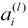
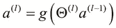

# 第四章 建立神经网络

在本章中，我们将介绍**人工神经网络**（**ANNs**）。我们将研究 ANNs 的基本表示，然后讨论可用于监督和未监督机器学习问题的多个 ANN 模型。我们还介绍了**Enclog** Clojure 库来构建 ANNs。

神经网络非常适合在给定的数据中寻找模式，并在计算领域有多个实际应用，例如手写识别和机器视觉。人工神经网络（ANNs）通常被组合或相互连接来模拟给定的问题。有趣的是，它们可以应用于多个机器学习问题，如回归和分类。ANNs 在计算领域的多个领域都有应用，并不局限于机器学习的范围。

**无监督学习**是一种机器学习方法，其中给定的训练数据不包含任何关于给定输入样本属于哪个类别的信息。由于训练数据是*未标记的*，无监督学习算法必须完全依靠自己确定给定数据中的各种类别。通常，这是通过寻找不同数据之间的相似性，然后将数据分组到几个类别中实现的。这种技术称为**聚类分析**，我们将在以下章节中更详细地研究这种方法。ANNs 在无监督机器学习技术中的应用主要是由于它们能够快速识别某些未标记数据中的模式。这种 ANNs 表现出的特殊形式的无监督学习被称为**竞争学习**。

关于 ANNs 的一个有趣的事实是，它们是从具有学习能力的更高阶动物的中枢神经系统的结构和行为中建模的。

# 理解非线性回归

到目前为止，读者必须意识到梯度下降算法可以用来估计回归和分类问题的线性回归和逻辑回归模型。一个明显的问题会是：当我们可以使用梯度下降从训练数据中估计线性回归和逻辑回归模型时，为什么还需要神经网络？为了理解 ANNs 的必要性，我们首先必须理解*非线性回归*。

假设我们有一个单个特征变量*X*和一个随*X*变化的因变量*Y*，如下面的图所示：


如前图所示，将因变量 *Y* 模型化为自变量 *X* 的线性方程是困难的，甚至是不可能的。我们可以将因变量 *Y* 模型为自变量 *X* 的高阶多项式方程，从而将问题转化为线性回归的标准形式。因此，说因变量 *Y* 非线性地随自变量 *X* 变化。当然，也有可能数据无法使用多项式函数进行建模。

还可以证明，使用梯度下降法计算多项式函数中所有项的权重或系数的时间复杂度为 ，其中 *n* 是训练数据中的特征数量。同样，计算三次多项式方程中所有项的系数的算法复杂度为 。很明显，梯度下降的时间复杂度随着模型特征数量的增加而呈几何级数增长。因此，仅使用梯度下降本身不足以对具有大量特征的非线性回归模型进行建模。

另一方面，神经网络在建模具有大量特征的数据的非线性回归模型方面非常高效。我们现在将研究神经网络的基础理念以及可用于监督学习和无监督学习问题的几种神经网络模型。

# 表示神经网络

神经网络（ANNs）是从能够学习的生物体（如哺乳动物和爬行动物）的中枢神经系统行为中建模的。这些生物体的中枢神经系统包括生物体的脑、脊髓和一系列支持性神经组织。大脑处理信息并产生电信号，这些信号通过神经网络纤维传输到生物体的各个器官。尽管生物体的脑执行了许多复杂的处理和控制，但实际上它是由神经元组成的集合。然而，实际处理感觉信号的是这些神经元的一些复杂组合。当然，每个神经元都能够处理大脑处理的信息的极小部分。大脑实际上是通过将来自身体各种感觉器官的电信号通过这个复杂的神经元网络路由到其运动器官来发挥作用的。以下图示了单个神经元的细胞结构：


神经元有几个接近细胞核的树突和一个单一的*轴突*，轴突用于从细胞的核传递信号。树突用于接收来自其他神经元的信号，可以将其视为神经元的输入。同样，神经元的轴突类似于神经元的输出。因此，神经元可以用一个处理多个输入并产生单个输出的函数来数学地表示。

其中一些神经元是相互连接的，这种网络被称为**神经网络**。神经元通过从其他神经元中传递微弱的电信号来执行其功能。两个神经元之间的连接空间称为**突触**。

一个人工神经网络（ANN）由多个相互连接的神经元组成。每个神经元都可以用一个数学函数来表示，该函数消耗多个输入值并产生一个输出值，如下面的图所示：


可以用前面的图来表示单个神经元。从数学的角度来看，它只是一个将一组输入值映射到输出值的函数。这个函数被称为神经元的**激活函数**，其输出值被称为神经元的**激活**。这种神经元的表示称为**感知器**。感知器可以单独使用，并且足够有效，可以估计监督机器学习模型，如线性回归和逻辑回归。然而，复杂非线性数据可以用多个相互连接的感知器更好地建模。

通常，会将一个偏差输入添加到供给感知器的输入值集合中。对于输入值，我们添加项作为偏差输入，使得。具有这个附加偏差值的神经元可以用以下图来表示：


供给感知器的每个输入值都有一个相关的权重。这个权重与线性回归模型特征的系数类似。激活函数应用于这些权重及其相应的输入值。我们可以如下形式地定义感知器的估计输出值：


ANN（人工神经网络）的节点所使用的激活函数很大程度上取决于需要建模的样本数据。通常，**Sigmoid**或**双曲正切**函数被用作分类问题的激活函数（更多信息，请参阅*基于汽油近红外（NIR）光谱的校准模型构建的波形神经网络（WNN）方法*）。据说 Sigmoid 函数在给定的阈值输入时会被**激活**。

我们可以通过绘制 Sigmoid 函数的方差来描述这种行为，如下面的图表所示：


ANN 可以广泛地分为**前馈神经网络**和**循环神经网络**（更多信息，请参阅*双向循环神经网络*）。这两种类型 ANN 之间的区别在于，在前馈神经网络中，ANN 节点的连接不形成一个有向循环，而循环神经网络中节点之间的连接则形成一个有向循环。因此，在前馈神经网络中，ANN 给定层的每个节点只接收来自 ANN 中直接前一层的节点的输入。

有几种 ANN 模型具有实际应用，我们将在本章中探讨其中的一些。

# 理解多层感知器 ANN

现在我们介绍一个简单的**前馈神经网络**模型——**多层感知器**模型。该模型代表了一个基本的前馈神经网络，并且足够灵活，可以用于监督学习领域中回归和分类问题的建模。所有输入都通过一个前馈神经网络以单一方向流动。这是没有从或向任何层反馈的事实的一个直接后果。

通过反馈，我们指的是给定层的输出被反馈作为 ANN 中前一层的感知器的输入。此外，使用单层感知器意味着只使用一个激活函数，这相当于使用**逻辑回归**来建模给定的训练数据。这意味着该模型不能用于拟合非线性数据，而这正是 ANN 的主要动机。我们必须注意，我们在第三章*数据分类*中讨论了逻辑回归。

多层感知器 ANN 可以通过以下图表来表示：


多层感知器 ANN 由多个感知器节点层组成。它具有单个输入层、单个输出层和多个隐藏层。输入层只是将输入值传递给 ANN 的第一个隐藏层。然后这些值通过其他隐藏层传播到输出层，在这些层中使用激活函数进行加权求和，最终产生输出值。

训练数据中的每个样本由元组表示，其中是期望输出，是训练样本的输入值。输入向量包含与训练数据中特征数量相等的值。

每个节点的输出被称为该节点的**激活**，对于层中的节点，用术语表示。正如我们之前提到的，用于生成此值的激活函数是 Sigmoid 函数或双曲正切函数。当然，任何其他数学函数都可以用来拟合样本数据。多层感知器网络的输入层只是将一个偏置输入加到输入值上，并将提供给 ANN 的输入集传递到下一层。我们可以用以下等式正式表示这个关系：


ANN 中每一对层之间的突触都有一个相关的权重矩阵。这些矩阵的行数等于输入值的数量，即 ANN 输入层附近层的节点数，列数等于突触层中靠近 ANN 输出层的节点数。对于层*l*，权重矩阵用术语表示。

层*l*的激活值可以使用 ANN 的激活函数来确定。激活函数应用于权重矩阵和由 ANN 中前一层的激活值产生的乘积。通常，用于多层感知器的激活函数是 Sigmoid 函数。这个等式可以正式表示如下：


通常，用于多层感知器的激活函数是 Sigmoid 函数。请注意，我们不在 ANN 的输出层中添加偏置值。此外，输出层可以产生任意数量的输出值。为了建模一个*k*类分类问题，我们需要一个产生*k*个输出值的 ANN。

要进行二元分类，我们只能对最多两个类别的输入数据进行建模。用于二元分类的 ANN 生成的输出值总是 0 或 1。因此，对于类，。

我们也可以使用**k**个二进制输出值来模拟多类分类，因此，人工神经网络（ANN）的输出是一个矩阵。这可以形式化地表达如下：


因此，我们可以使用多层感知器 ANN 来执行二类和多类分类。多层感知器 ANN 可以使用**反向传播**算法进行训练，我们将在本章后面学习和实现它。

假设我们想要模拟逻辑异或门的行为。异或门可以被看作是一个需要两个输入并生成单个输出的二进制分类器。模拟异或门的人工神经网络将具有以下图中所示的结构。有趣的是，线性回归可以用来模拟 AND 和 OR 逻辑门，但不能用来模拟异或门。这是因为异或门输出的非线性特性，因此，ANN 被用来克服这一限制。


前图中所示的多层感知器有三个输入层节点，四个隐藏层节点和一个输出层节点。观察发现，除了输出层之外，每个层都会向下一层的节点输入值集合中添加一个偏置输入。ANN 中有两个突触，如图所示，它们与权重矩阵和相关联。请注意，第一个突触位于输入层和隐藏层之间，第二个突触位于隐藏层和输出层之间。权重矩阵的大小为，权重矩阵的大小为。此外，术语用来表示 ANN 中的所有权重矩阵。

由于多层感知器 ANN 中每个节点的激活函数是 Sigmoid 函数，我们可以将 ANN 节点权重的成本函数定义为与逻辑回归模型的成本函数类似。ANN 的成本函数可以用权重矩阵来定义，如下所示：


前面的代价函数本质上是对 ANN 输出层中每个节点代价函数的平均值（更多信息，请参阅*材料科学中的神经网络*）。对于具有 *K* 个输出值的多层感知器 ANN，我们对 *K* 个项进行平均。请注意， 代表 ANN 的 输出值， 代表 ANN 的输入变量，*N* 是训练数据中的样本值数量。代价函数本质上与逻辑回归相同，但在这里应用于 *K* 个输出值。我们可以在前面的代价函数中添加一个正则化参数，并使用以下方程表示正则化代价函数：


在前一个方程中定义的代价函数添加了一个类似于逻辑回归的正则化项。正则化项本质上是由 ANN 的多个层中所有输入值的权重平方和组成的，但不包括添加的偏置输入的权重。此外，术语指的是 ANN 中第 *l* 层的节点数。值得注意的是，在前面的正则化代价函数中，只有正则化项依赖于 ANN 中的层数。因此，估计模型的*泛化能力*基于 ANN 中的层数。

# 理解反向传播算法

**反向传播学习**算法用于从给定的一组样本值中训练一个多层感知器 ANN。简而言之，该算法首先计算给定输入值集的输出值，并计算 ANN 输出的误差量。ANN 中的误差量是通过将 ANN 的预测输出值与训练数据提供给 ANN 的给定输入值的预期输出值进行比较来确定的。然后，计算出的误差用于修改 ANN 的权重。因此，在用合理数量的样本训练 ANN 后，ANN 将能够预测输入值集的输出值。该算法由三个不同的阶段组成。具体如下：

+   前向传播阶段

+   反向传播阶段

+   权重更新阶段

ANN 中突触的权重最初被初始化为在和范围内的随机值。我们将权重初始化为这个范围内的值，以避免权重矩阵中的对称性。这种避免对称性的做法称为**对称破缺**，其目的是使反向传播算法的每次迭代都能在 ANN 中突触的权重上产生明显的变化。这在人工神经网络中是可取的，因为每个节点都应该独立于 ANN 中的其他节点进行学习。如果所有节点都具有相同的权重，那么估计的学习模型可能会过拟合或欠拟合。

此外，反向传播学习算法还需要两个额外的参数，即学习率和学习动量。我们将在本节后面的示例中看到这些参数的影响。

算法的正向传播阶段简单地计算 ANN 各个层中所有节点的激活值。正如我们之前提到的，输入层中节点的激活值是 ANN 的输入值和偏置输入。这可以通过以下方程形式化定义：


使用来自人工神经网络（ANN）输入层的这些激活值，可以确定 ANN 其他层中节点的激活状态。这是通过将给定层的权重矩阵与 ANN 前一层中节点的激活值相乘，然后应用激活函数来实现的。这可以形式化地表示如下：



前面的方程解释了层 *l* 的激活值等于将前一层（或激活）值和给定层的权重矩阵的输出（或激活）值应用激活函数的结果。接下来，输出层的激活值将被*反向传播*。通过这种方式，我们指的是激活值从输出层通过隐藏层传播到 ANN 的输入层。在这个阶段，我们确定 ANN 中每个节点的误差或 delta 值。输出层的 delta 值是通过计算期望输出值和输出层的激活值之间的差异来确定的。这种差异计算可以总结为以下方程：


层*l*的术语是一个大小为的矩阵，其中*j*是层*l*中的节点数。这个术语可以正式定义为以下内容：


ANN 中除了输出层之外的其他层的 delta 项由以下等式确定：


在前面的方程中，二进制运算用于表示两个相同大小的矩阵的逐元素乘法。请注意，这种运算与矩阵乘法不同，逐元素乘法将返回一个由两个相同大小矩阵中相同位置的元素乘积组成的矩阵。术语表示在 ANN 中使用的激活函数的导数。由于我们使用 sigmoid 函数作为激活函数，因此术语的值为。

因此，我们可以计算人工神经网络（ANN）中所有节点的 delta 值。我们可以使用这些 delta 值来确定 ANN 中突触的梯度。我们现在继续到反向传播算法的最后一步，即权重更新阶段。

各个突触的梯度首先初始化为所有元素均为 0 的矩阵。给定突触的梯度矩阵的大小与该突触的权重矩阵的大小相同。梯度项表示在 ANN 中位于层*l*之后的突触层的梯度。ANN 中突触梯度的初始化可以正式表示如下：


对于训练数据中的每个样本值，我们计算 ANN 中所有节点的 delta 和激活值。这些值通过以下方程添加到突触的梯度中：


然后，我们计算所有样本值的梯度的平均值，并使用给定层的 delta 和梯度值来更新权重矩阵，如下所示：


因此，算法的学习率和学习动量参数仅在权重更新阶段发挥作用。前面的三个方程代表反向传播算法的单次迭代。必须执行大量迭代，直到 ANN 的整体误差收敛到一个很小的值。现在我们可以使用以下步骤总结反向传播学习算法：

1.  将 ANN 的突触权重初始化为随机值。

1.  选择一个样本值，并通过 ANN 的几层前向传播样本值以生成 ANN 中每个节点的激活。

1.  将 ANN 最后一层生成的激活反向传播通过隐藏层到 ANN 的输入层。通过这一步，我们计算 ANN 中每个节点的误差或 delta。

1.  计算从步骤 3 生成的误差与 ANN 中所有节点的突触权重或输入激活的乘积。这一步产生了网络中每个节点的权重梯度。每个梯度由一个比率或百分比表示。

1.  使用给定层的梯度和 delta 来计算 ANN 中突触层权重的变化。然后，将这些变化从 ANN 中突触的权重中减去。这本质上是反向传播算法的权重更新步骤。

1.  对训练数据中的其余样本重复步骤 2 到 5。

反向传播学习算法有几个不同的部分，我们现在将实现每个部分并将它们组合成一个完整的实现。由于 ANN 中的突触和激活的 delta 和权重可以用矩阵表示，我们可以编写这个算法的向量化实现。

### 注意

注意，对于以下示例，我们需要从 Incanter 库的`incanter.core`命名空间中获取函数。这个命名空间中的函数实际上使用 Clatrix 库来表示矩阵及其操作。

假设我们需要实现一个人工神经网络（ANN）来模拟逻辑异或（XOR）门。样本数据仅仅是异或门的真值表，可以表示为一个向量，如下所示：

```py
;; truth table for XOR logic gate
(def sample-data [[[0 0] [0]]
                  [[0 1] [1]]
                  [[1 0] [1]]
                  [[1 1] [0]]])
```

在前面定义的向量 `sample-data` 中，每个元素本身也是一个向量，包含异或门的输入和输出值。我们将使用这个向量作为我们的训练数据来构建 ANN。这本质上是一个分类问题，我们将使用 ANN 来模拟它。在抽象意义上，ANN 应该能够执行二进制和多类分类。我们可以定义 ANN 的协议如下：

```py
(defprotocol NeuralNetwork
  (run        [network inputs])
  (run-binary [network inputs])
  (train-ann  [network samples]))
```

前述代码中定义的 `NeuralNetwork` 协议有三个函数。`train-ann` 函数可以用来训练 ANN，并需要一些样本数据。`run` 和 `run-binary` 函数可以用于此 ANN 来执行多类和二分类，分别。`run` 和 `run-binary` 函数都需要一组输入值。

反向传播算法的第一步是初始化 ANN 突触的权重。我们可以使用 `rand` 和 `matrix` 函数生成这些权重作为矩阵，如下所示：

```py
(defn rand-list
  "Create a list of random doubles between 
  -epsilon and +epsilon."
  [len epsilon]
  (map (fn [x] (- (rand (* 2 epsilon)) epsilon))
         (range 0 len)))

(defn random-initial-weights
  "Generate random initial weight matrices for given layers.
  layers must be a vector of the sizes of the layers."
  [layers epsilon]
  (for [i (range 0 (dec (length layers)))]
    (let [cols (inc (get layers i))
          rows (get layers (inc i))]
      (matrix (rand-list (* rows cols) epsilon) cols))))
```

前述代码中显示的 `rand-list` 函数在 `epsilon` 的正负范围内创建一个随机元素列表。如我们之前所述，我们选择这个范围来打破权重矩阵的对称性。

`random-initial-weights` 函数为 ANN 的不同层生成多个权重矩阵。如前述代码中定义的，`layers` 参数必须是一个向量，包含 ANN 各层的尺寸。对于一个输入层有两个节点、隐藏层有三个节点、输出层有一个节点的 ANN，我们将 `layers` 作为 `[2 3 1]` 传递给 `random-initial-weights` 函数。每个权重矩阵的列数等于输入的数量，行数等于 ANN 下一个层的节点数。我们设置给定层的权重矩阵的列数为输入的数量，并额外添加一个用于神经网络偏置的输入。请注意，我们使用了一个稍微不同的 `matrix` 函数形式。这种形式接受一个单一向量，并将该向量分割成一个矩阵，其列数由该函数的第二个参数指定。因此，传递给这种 `matrix` 函数的向量必须包含 `(* rows cols)` 个元素，其中 `rows` 和 `cols` 分别是权重矩阵的行数和列数。

由于我们需要将 sigmoid 函数应用于 ANN 中某一层的所有激活，我们必须定义一个函数，该函数将对给定矩阵中的所有元素应用 sigmoid 函数。我们可以使用 `incanter.core` 命名空间中的 `div`、`plus`、`exp` 和 `minus` 函数来实现这样的函数，如下所示：

```py
(defn sigmoid
  "Apply the sigmoid function 1/(1+exp(-z)) to all 
  elements in the matrix z."
  [z]
  (div 1 (plus 1 (exp (minus z)))))
```

### 注意

注意，所有之前定义的函数都在给定矩阵的所有元素上执行相应的算术运算，并返回一个新的矩阵。

我们还需要在 ANN 的每一层中隐式地添加一个偏置节点。这可以通过围绕 `bind-rows` 函数进行操作来实现，该函数向矩阵添加一行，如下所示：

```py
(defn bind-bias
  "Add the bias input to a vector of inputs."
  [v]
  (bind-rows [1] v))
```

由于偏置值始终为 1，我们将元素行 `[1]` 指定给 `bind-rows` 函数。

使用之前定义的函数，我们可以实现前向传播。我们本质上需要在人工神经网络（ANN）中两个层之间给定突触的权重相乘，然后对每个生成的激活值应用 sigmoid 函数，如下面的代码所示：

```py
(defn matrix-mult
  "Multiply two matrices and ensure the result is also a matrix."
  [a b]
  (let [result (mmult a b)]
    (if (matrix? result)
      result
      (matrix [result]))))

(defn forward-propagate-layer
  "Calculate activations for layer l+1 given weight matrix 
  of the synapse between layer l and l+1 and layer l activations."
  [weights activations]
  (sigmoid (matrix-mult weights activations)))

(defn forward-propagate
  "Propagate activation values through a network's
  weight matrix and return output layer activation values."
  [weights input-activations]
  (reduce #(forward-propagate-layer %2 (bind-bias %1))
          input-activations weights))
```

在前面的代码中，我们首先定义了一个`matrix-mult`函数，该函数执行矩阵乘法并确保结果是矩阵。请注意，为了定义`matrix-mult`，我们使用`mmult`函数而不是`mult`函数，后者用于乘以两个相同大小的矩阵中的对应元素。

使用`matrix-mult`和`sigmoid`函数，我们可以实现 ANN 中两个层之间的前向传播步骤。这通过`forward-propagate-layer`函数完成，该函数简单地乘以代表 ANN 中两个层之间突触权重的矩阵和输入激活值，同时确保返回的值始终是一个矩阵。为了将给定的一组值通过 ANN 的所有层传播，我们必须添加一个偏置输入，并对每个层应用`forward-propagate-layer`函数。这可以通过在`forward-propagate`函数中定义的`forward-propagate-layer`函数的闭包上使用`reduce`函数来简洁地完成。

虽然`forward-propagate`函数可以确定 ANN 的输出激活，但我们实际上需要 ANN 中所有节点的激活来进行反向传播。我们可以通过将`reduce`函数转换为递归函数并引入一个累加器变量来存储 ANN 中每一层的激活来实现这一点。在下面的代码中定义的`forward-propagate-all-activations`函数实现了这个想法，并使用`loop`形式递归地应用`forward-propagate-layer`函数：

```py
(defn forward-propagate-all-activations
  "Propagate activation values through the network 
  and return all activation values for all nodes."
  [weights input-activations]
  (loop [all-weights     weights
         activations     (bind-bias input-activations)
         all-activations [activations]]
    (let [[weights
           & all-weights']  all-weights
           last-iter?       (empty? all-weights')
           out-activations  (forward-propagate-layer
                             weights activations)
           activations'     (if last-iter? out-activations
                                (bind-bias out-activations))
           all-activations' (conj all-activations activations')]
      (if last-iter? all-activations'
          (recur all-weights' activations' all-activations')))))
```

在前面的代码中定义的`forward-propagate-all-activations`函数需要 ANN 中所有节点的权重和输入值作为激活值通过 ANN。我们首先使用`bind-bias`函数将偏置输入添加到 ANN 的输入激活中。然后我们将此值存储在一个累加器中，即变量`all-activations`，作为一个包含 ANN 中所有激活的向量。然后，`forward-propagate-layer`函数被应用于 ANN 各个层的权重矩阵，每次迭代都会向 ANN 中相应层的输入激活添加一个偏置输入。

### 注意

注意，在最后一次迭代中我们不添加偏置输入，因为它计算 ANN 的输出层。因此，`forward-propagate-all-activations`函数通过 ANN 对输入值进行前向传播，并返回 ANN 中每个节点的激活值。注意，这个向量中的激活值是按照 ANN 层的顺序排列的。

我们现在将实现反向传播学习算法的反向传播阶段。首先，我们必须实现一个函数来从方程计算误差项。我们将借助以下代码来完成这项工作：

```py
(defn back-propagate-layer
  "Back propagate deltas (from layer l+1) and 
  return layer l deltas."
  [deltas weights layer-activations]
  (mult (matrix-mult (trans weights) deltas)
        (mult layer-activations (minus 1 layer-activations))))
```

在前面的代码中定义的`back-propagate-layer`函数计算 ANN 中突触层*l*的误差或 delta 值，这些误差或 delta 值来自层的权重和 ANN 中下一层的 delta 值。

### 注意

注意，我们仅使用矩阵乘法通过`matrix-mult`函数计算术语。所有其他乘法操作都是矩阵的逐元素乘法，这使用`mult`函数完成。

实质上，我们必须从输出层通过 ANN 的各个隐藏层应用到输入层，以产生 ANN 中每个节点的 delta 值。然后，这些 delta 值可以添加到节点的激活中，从而产生通过调整 ANN 中节点权重所需的梯度值。我们可以以类似于`forward-propagate-all-activations`函数的方式来做这件事，即通过递归地应用`back-propagate-layer`函数到 ANN 的各个层。当然，我们必须以相反的顺序遍历 ANN 的层，即从输出层，通过隐藏层，到输入层。我们将借助以下代码来完成这项工作：

```py
(defn calc-deltas
  "Calculate hidden deltas for back propagation.
  Returns all deltas including output-deltas."
  [weights activations output-deltas]
  (let [hidden-weights     (reverse (rest weights))
        hidden-activations (rest (reverse (rest activations)))]
    (loop [deltas          output-deltas
           all-weights     hidden-weights
           all-activations hidden-activations
           all-deltas      (list output-deltas)]
      (if (empty? all-weights) all-deltas
        (let [[weights
               & all-weights']      all-weights
               [activations
                & all-activations'] all-activations
              deltas'        (back-propagate-layer
                               deltas weights activations)
              all-deltas'    (cons (rest deltas') 
                                    all-deltas)]
          (recur deltas' all-weights' 
                 all-activations' all-deltas'))))))
```

`calc-deltas`函数确定 ANN 中所有感知器节点的 delta 值。为此计算，不需要输入和输出激活。只需要与`hidden-activations`变量绑定的隐藏激活来计算 delta 值。此外，输入层的权重被跳过，因为它们绑定到`hidden-weights`变量。然后`calc-deltas`函数将`back-propagate-layer`函数应用于 ANN 中每个突触层的所有权重矩阵，从而确定矩阵中所有节点的 delta 值。请注意，我们不将偏置节点的 delta 值添加到计算出的 delta 集合中。这是通过在给定突触层的计算 delta 值上使用`rest`函数`(rest deltas')`来完成的，因为第一个 delta 是给定层中偏置输入的 delta。

根据定义，给定突触层的梯度向量项是通过乘以矩阵和来确定的，这些矩阵分别表示下一层的 delta 值和给定层的激活。我们将借助以下代码来完成这项工作：

```py
(defn calc-gradients
  "Calculate gradients from deltas and activations."
  [deltas activations]
  (map #(mmult %1 (trans %2)) deltas activations))
```

前面代码中显示的`calc-gradients`函数是对术语的简洁实现。由于我们将处理一系列 delta 和激活项，我们使用`map`函数将前面的等式应用于 ANN 中相应的 delta 和激活项。使用`calc-deltas`和`calc-gradient`函数，我们可以确定给定训练样本中 ANN 所有节点权重中的总误差。我们将通过以下代码来完成这项工作：

```py
(defn calc-error
  "Calculate deltas and squared error for given weights."
  [weights [input expected-output]]
  (let [activations    (forward-propagate-all-activations 
                        weights (matrix input))
        output         (last activations)
        output-deltas  (minus output expected-output)
        all-deltas     (calc-deltas 
                        weights activations output-deltas)
        gradients      (calc-gradients all-deltas activations)]
    (list gradients
          (sum (pow output-deltas 2)))))
```

前面代码中定义的`calc-error`函数需要两个参数——ANN 中突触层的权重矩阵和一个样本训练值，这显示为`[输入期望输出]`。首先使用`forward-propagate-all-activations`函数计算 ANN 中所有节点的激活值，然后计算最后一层的 delta 值，即期望输出值与 ANN 产生的实际输出值之间的差值。ANN 计算得出的输出值仅仅是 ANN 产生的最后一个激活值，如前面代码中所示为`(last activations)`。使用计算出的激活值，通过`calc-deltas`函数确定所有感知器节点的 delta 值。这些 delta 值随后用于通过`calc-gradients`函数确定 ANN 中各层的权重梯度。对于给定的样本值，ANN 的**均方误差（MSE**）也通过添加输出层 delta 值的平方来计算。

对于 ANN 中某一层的给定权重矩阵，我们必须初始化该层的梯度为一个与权重矩阵具有相同维度的矩阵，并且梯度矩阵中的所有元素都必须设置为`0`。这可以通过使用`dim`函数的组合来实现，该函数返回矩阵的大小为一个向量，以及`matrix`函数的变体形式，如下面的代码所示：

```py
(defn new-gradient-matrix
  "Create accumulator matrix of gradients with the
  same structure as the given weight matrix
  with all elements set to 0."
  [weight-matrix]
  (let [[rows cols] (dim weight-matrix)]
    (matrix 0 rows cols)))
```

在前面代码中定义的`new-gradient-matrix`函数中，`matrix`函数期望一个值、行数和列数来初始化一个矩阵。此函数生成一个具有与提供的权重矩阵相同结构的初始化梯度矩阵。

我们现在实现`calc-gradients-and-error`函数，以便在一系列权重矩阵和样本值上应用`calc-error`函数。我们基本上需要将`calc-error`函数应用于每个样本，并累积梯度值和均方误差（MSE）的总和。然后我们计算这些累积值的平均值，以返回给定样本值和权重矩阵的梯度矩阵和总 MSE。我们将通过以下代码来完成这项工作：

```py
(defn calc-gradients-and-error' [weights samples]
  (loop [gradients   (map new-gradient-matrix weights)
         total-error 1
         samples     samples]
    (let [[sample
           & samples']     samples
           [new-gradients
            squared-error] (calc-error weights sample)
            gradients'     (map plus new-gradients gradients)
            total-error'   (+ total-error squared-error)]
      (if (empty? samples')
        (list gradients' total-error')
        (recur gradients' total-error' samples')))))

(defn calc-gradients-and-error
  "Calculate gradients and MSE for sample
  set and weight matrix."
  [weights samples]
  (let [num-samples   (length samples)
        [gradients
         total-error] (calc-gradients-and-error'
                       weights samples)]
    (list
      (map #(div % num-samples) gradients)    ; gradients
      (/ total-error num-samples))))          ; MSE
```

在前面的代码中定义的`calc-gradients-and-error`函数依赖于`calc-gradients-and-error'`辅助函数。`calc-gradients-and-error'`函数初始化梯度矩阵，执行`calc-error`函数的应用，并累计计算出的梯度值和 MSE。`calc-gradients-and-error`函数简单地计算从`calc-gradients-and-error'`函数返回的累计梯度矩阵和 MSE 的平均值。

现在，我们实现中唯一缺少的部分是使用计算出的梯度修改 ANN 中节点的权重。简而言之，我们必须反复更新权重，直到观察到 MSE 的收敛。这实际上是对 ANN 节点应用的一种梯度下降形式。我们现在将实现这种梯度下降的变体，通过反复修改 ANN 中节点的权重来训练 ANN，如下面的代码所示：

```py
(defn gradient-descent-complete?
  "Returns true if gradient descent is complete."
  [network iter mse]
  (let [options (:options network)]
    (or (>= iter (:max-iters options))
        (< mse (:desired-error options)))))
```

在前面的代码中定义的`gradient-descent-complete?`函数简单地检查梯度下降的终止条件。这个函数假设 ANN，作为一个网络，是一个包含`:options`关键字的映射或记录。这个键的值反过来又是一个包含 ANN 各种配置选项的映射。`gradient-descent-complete?`函数检查 ANN 的总均方误差（MSE）是否小于由`:desired-error`选项指定的期望 MSE。此外，我们还添加了另一个条件来检查执行的迭代次数是否超过了由`:max-iters`选项指定的最大迭代次数。

现在，我们将为多层感知器人工神经网络（ANNs）实现一个`梯度下降`函数。在这个实现中，权重的变化是通过梯度下降算法提供的`step`函数来计算的。然后，这些计算出的变化简单地添加到 ANN 的突触层现有权重中。我们将使用以下代码帮助实现多层感知器 ANN 的`梯度下降`函数：

```py
(defn apply-weight-changes
  "Applies changes to corresponding weights."
  [weights changes]
  (map plus weights changes))

(defn gradient-descent
  "Perform gradient descent to adjust network weights."
  [step-fn init-state network samples]
  (loop [network network
         state init-state
         iter 0]
    (let [iter     (inc iter)
          weights  (:weights network)
          [gradients
           mse]    (calc-gradients-and-error weights samples)]
      (if (gradient-descent-complete? network iter mse)
        network
        (let [[changes state] (step-fn network gradients state)
              new-weights     (apply-weight-changes 
                               weights changes)
              network         (assoc network 
                              :weights new-weights)]
          (recur network state iter))))))
```

在前面的代码中定义的`apply-weight-changes`函数简单地添加了 ANN 的权重和计算出的权重变化。`gradient-descent`函数需要一个`step`函数（指定为`step-fn`）、ANN 的初始状态、ANN 本身以及用于训练 ANN 的样本数据。这个函数必须从 ANN、初始梯度矩阵和 ANN 的初始状态计算权重变化。`step-fn`函数还返回 ANN 的更改状态。然后，使用`apply-weight-changes`函数更新 ANN 的权重，并且这个迭代过程会重复执行，直到`gradient-descent-complete?`函数返回`true`。ANN 的权重由`network`映射中的`:weights`关键字指定。然后，简单地通过覆盖由`:weights`关键字指定的`network`上的值来更新这些权重。

在反向传播算法的上下文中，我们需要指定 ANN 必须训练的学习率和学习动量。这些参数用于确定 ANN 中节点权重的变化。然后必须指定一个实现此计算的函数作为 `gradient-descent` 函数的 `step-fn` 参数，如下面的代码所示：

```py
(defn calc-weight-changes
  "Calculate weight changes:
  changes = learning rate * gradients + 
            learning momentum * deltas."
  [gradients deltas learning-rate learning-momentum]
  (map #(plus (mult learning-rate %1)
              (mult learning-momentum %2))
       gradients deltas))

(defn bprop-step-fn [network gradients deltas]
  (let [options             (:options network)
        learning-rate       (:learning-rate options)
        learning-momentum   (:learning-momentum options)
        changes             (calc-weight-changes
                             gradients deltas
                             learning-rate learning-momentum)]
    [(map minus changes) changes]))

(defn gradient-descent-bprop [network samples]
  (let [gradients (map new-gradient-matrix (:weights network))]
    (gradient-descent bprop-step-fn gradients
                      network samples)))
```

在前面的代码中定义的 `calc-weight-changes` 函数根据给定 ANN 中某一层的梯度值和 delta 值计算权重的变化，称为 。`bprop-step-fn` 函数从表示为 `network` 的 ANN 中提取学习率和学习动量参数，并使用 `calc-weight-changes` 函数。由于权重将由 `gradient-descent` 函数添加变化，我们使用 `minus` 函数以负值返回权重的变化。

`gradient-descent-bprop` 函数简单地初始化 ANN 给定权重的梯度矩阵，并通过指定 `bprop-step-fn` 作为要使用的 `step` 函数来调用 `gradient-descent` 函数。使用 `gradient-descent-bprop` 函数，我们可以实现我们之前定义的抽象 `NeuralNetwork` 协议，如下所示：

```py
(defn round-output
  "Round outputs to nearest integer."
  [output]
  (mapv #(Math/round ^Double %) output))

(defrecord MultiLayerPerceptron [options]
  NeuralNetwork

  ;; Calculates the output values for the given inputs.
  (run [network inputs]
    (let [weights (:weights network)
          input-activations (matrix inputs)]
      (forward-propagate weights input-activations)))

  ;; Rounds the output values to binary values for
  ;; the given inputs.
  (run-binary [network inputs]
    (round-output (run network inputs)))

  ;; Trains a multilayer perceptron ANN from sample data.
  (train-ann [network samples]
    (let [options         (:options network)
          hidden-neurons  (:hidden-neurons options)
          epsilon         (:weight-epsilon options)
          [first-in
           first-out]     (first samples)
          num-inputs      (length first-in)
          num-outputs     (length first-out)
          sample-matrix   (map #(list (matrix (first %)) 
                                      (matrix (second %)))
                               samples)
          layer-sizes     (conj (vec (cons num-inputs 
                                           hidden-neurons))
                                num-outputs)
          new-weights     (random-initial-weights 
                           layer-sizes epsilon)
          network         (assoc network :weights new-weights)]
      (gradient-descent-bprop network sample-matrix))))
```

在前面的代码中定义的 `MultiLayerPerceptron` 记录使用 `gradient-descent-bprop` 函数训练一个多层感知器人工神经网络 (ANN)。`train-ann` 函数首先从指定的 ANN 选项映射中提取隐藏神经元的数量和常数  的值。ANN 中各种突触层的尺寸首先从样本数据中确定，并绑定到 `layer-sizes` 变量。然后使用 `random-initial-weights` 函数初始化 ANN 的权重，并在 `network` 记录中使用 `assoc` 函数更新。最后，通过指定 `bprop-step-fn` 作为要使用的 `step` 函数，调用 `gradient-descent-bprop` 函数来使用反向传播学习算法训练 ANN。

由 `MultiLayerPerceptron` 记录定义的 ANN 还实现了 `NeuralNetwork` 协议中的两个其他函数，`run` 和 `run-binary`。`run` 函数使用 `forward-propagate` 函数确定训练好的 `MultiLayerPerceptron` ANN 的输出值。`run-binary` 函数简单地将 `run` 函数为给定输入值集返回的输出值四舍五入。

使用 `MultiLayerPerceptron` 记录创建的 ANN 需要一个包含我们可以为 ANN 指定的各种选项的单个 `options` 参数。我们可以如下定义此类 ANN 的默认选项：

```py
(def default-options
  {:max-iters 100
   :desired-error 0.20
   :hidden-neurons [3]
   :learning-rate 0.3
   :learning-momentum 0.01
   :weight-epsilon 50})

(defn train [samples]
  (let [network (MultiLayerPerceptron. default-options)]
    (train-ann network samples)))
```

由 `default-options` 变量定义的映射包含以下键，这些键指定了 `MultiLayerPerceptron` ANN 的选项：

+   `:max-iter`: 此键指定运行 `gradient-descent` 函数的最大迭代次数。

+   `:desired-error`：此变量指定 ANN 中期望或可接受的均方误差（MSE）。

+   `:hidden-neurons`：此变量指定网络中隐藏神经节点的数量。值`[3]`表示一个包含三个神经元的单个隐藏层。

+   `:learning-rate`和`:learning-momentum`：这些键指定反向传播学习算法权重更新阶段的学习率和学习动量。

+   `:epsilon`：此变量指定`random-initial-weights`函数用于初始化 ANN 权重的常数。

我们还定义了一个简单的辅助函数`train`，用于创建`MultiLayerPerceptron`类型的 ANN，并使用`train-ann`函数和由`samples`参数指定的样本数据来训练 ANN。现在，我们可以根据`sample-data`变量指定的训练数据创建一个训练好的 ANN，如下所示：

```py
user> (def MLP (train sample-data))
#'user/MLP
```

我们可以使用训练好的 ANN 来预测一些输入值的输出。由`MLP`定义的 ANN 生成的输出与 XOR 门的输出非常接近，如下所示：

```py
user> (run-binary MLP  [0 1])
[1]
user> (run-binary MLP  [1 0])
[1]
```

然而，训练好的 ANN 对于某些输入集产生了不正确的输出，如下所示：

```py
user> (run-binary MLP  [0 0])
[0]
user> (run-binary MLP  [1 1]) ;; incorrect output generated
[1]
```

为了提高训练好的 ANN 的准确性，我们可以实施几种措施。首先，我们可以使用 ANN 的权重矩阵来正则化计算的梯度。这种修改将使先前的实现产生明显的改进。我们还可以增加要执行的最大迭代次数。我们还可以调整算法，通过调整学习率、学习动量和 ANN 中的隐藏节点数量来提高性能。这些修改被跳过，因为它们需要由读者来完成。

**Enclog**库（[`github.com/jimpil/enclog`](http://github.com/jimpil/enclog)）是一个 Clojure 包装库，用于机器学习算法和 ANN 的**Encog**库。Encog 库（[`github.com/encog`](http://github.com/encog)）有两个主要实现：一个在 Java 中，一个在.NET 中。我们可以使用 Enclog 库轻松生成定制的 ANN 来模拟监督和非监督机器学习问题。

### 注意

可以通过在`project.clj`文件中添加以下依赖项将 Enclog 库添加到 Leiningen 项目中：

```py
[org.encog/encog-core "3.1.0"]
[enclog "0.6.3"]
```

注意，Enclog 库需要 Encog Java 库作为依赖项。

对于接下来的示例，命名空间声明应类似于以下声明：

```py
(ns my-namespace
  (:use [enclog nnets training]))
```

我们可以使用`enclog.nnets`命名空间中的`neural-pattern`和`network`函数从 Enclog 库创建一个 ANN。`neural-pattern`函数用于指定 ANN 的神经网络模型。`network`函数接受从`neural-pattern`函数返回的神经网络模型，并创建一个新的 ANN。我们可以根据指定的神经网络模型向`network`函数提供几个选项。以下是一个前馈多层感知器网络的定义：

```py
(def mlp (network (neural-pattern :feed-forward)
                  :activation :sigmoid
                  :input      2
                  :output     1
                  :hidden     [3]))
```

对于前馈神经网络，我们可以通过将`:activation`键指定给`network`函数来指定激活函数。在我们的例子中，我们使用了 sigmoid 函数，它被指定为`:sigmoid`作为 ANN 节点的激活函数。我们还使用`:input`、`:output`和`:hidden`键指定了 ANN 的输入、输出和隐藏层的节点数量。

要使用一些样本数据训练由`network`函数创建的 ANN，我们使用`enclog.training`命名空间中的`trainer`和`train`函数。用于训练 ANN 的学习算法必须作为`trainer`函数的第一个参数指定。对于反向传播算法，此参数是`:back-prop`关键字。`trainer`函数返回的值代表一个 ANN 以及用于训练 ANN 的学习算法。然后使用`train`函数在 ANN 上实际运行指定的训练算法。我们将通过以下代码来完成这项工作：

```py
(defn train-network [network data trainer-algo]
  (let [trainer (trainer trainer-algo
                         :network network
                         :training-set data)]
    (train trainer 0.01 1000 []))) ;; 0.01 is the expected error
```

在前面的代码中定义的`train-network`函数接受三个参数。第一个参数是由`network`函数创建的 ANN，第二个参数是用于训练 ANN 的训练数据，第三个参数指定了 ANN 必须通过的学习算法。如前所述的代码所示，我们可以使用关键字参数`:network`和`:training-set`将 ANN 和训练数据指定给`trainer`函数。然后使用`train`函数通过样本数据在 ANN 上运行训练算法。我们可以将 ANN 中期望的错误和训练算法的最大迭代次数作为`train`函数的第一个和第二个参数指定。在前面的例子中，期望的错误是`0.01`，最大迭代次数是 1000。传递给`train`函数的最后一个参数是一个指定 ANN 行为的向量，我们通过传递一个空向量来忽略它。

在对人工神经网络（ANN）运行训练算法时使用的训练数据可以通过使用 Enclog 的`data`函数来创建。例如，我们可以使用`data`函数创建一个用于逻辑异或门（XOR gate）的训练数据，如下所示：

```py
(def dataset
  (let [xor-input [[0.0 0.0] [1.0 0.0] [0.0 1.0] [1.0 1.0]]
        xor-ideal [[0.0]     [1.0]     [1.0]     [0.0]]]
        (data :basic-dataset xor-input xor-ideal)))
```

`data`函数需要将数据类型作为函数的第一个参数，随后是训练数据的输入和输出值作为向量。在我们的例子中，我们将使用`:basic-dataset`和`:basic`参数。`:basic-dataset`关键字可以用来创建训练数据，而`:basic`关键字可以用来指定一组输入值。

使用由`dataset`变量定义的数据和`train-network`函数，我们可以训练 ANN 的`MLP`来模拟异或门的输出，如下所示：

```py
user> (def MLP (train-network mlp dataset :back-prop))
Iteration # 1 Error: 26.461526% Target-Error: 1.000000%
Iteration # 2 Error: 25.198031% Target-Error: 1.000000%
Iteration # 3 Error: 25.122343% Target-Error: 1.000000%
Iteration # 4 Error: 25.179218% Target-Error: 1.000000%
...
...
Iteration # 999 Error: 3.182540% Target-Error: 1.000000%
Iteration # 1,000 Error: 3.166906% Target-Error: 1.000000%
#'user/MLP
```

如前述输出所示，训练好的 ANN 的错误率约为 3.16%。现在我们可以使用训练好的 ANN 来预测一组输入值的输出。为此，我们使用 Java 的`compute`和`getData`方法，分别由`.compute`和`.getData`指定。我们可以定义一个简单的辅助函数来调用`.compute`方法，为输入值向量计算结果，并将输出四舍五入到二进制值，如下所示：

```py
(defn run-network [network input]
  (let [input-data (data :basic input)
        output     (.compute network input-data)
        output-vec (.getData output)]
    (round-output output-vec)))
```

我们现在可以使用`run-network`函数，通过输入值向量来测试训练好的 ANN，如下所示：

```py
user> (run-network MLP [1 1])
[0]
user> (run-network MLP [1 0])
[1]
user> (run-network MLP [0 1])
[1]
user> (run-network MLP [0 0])
[0]
```

如前述代码所示，由`MLP`表示的训练好的 ANN 完全符合 XOR 门的行为。

总结来说，Enclog 库为我们提供了一组强大的函数，可以用来构建 ANN。在前面的例子中，我们探讨了前馈多层感知器模型。该库还提供了其他几种 ANN 模型，例如**自适应共振理论**（**ART**）、**自组织映射**（**SOM**）和 Elman 网络。Enclog 库还允许我们自定义特定神经网络模型中节点的激活函数。在我们的例子中，我们使用了 sigmoid 函数。库还支持几种数学函数，如正弦、双曲正切、对数和线性函数。Enclog 库还支持一些机器学习算法，可用于训练 ANN。

# 理解循环神经网络

我们现在将关注点转向循环神经网络，并研究一个简单的循环神经网络模型。**Elman 神经网络**是一个简单的循环 ANN，具有单个输入、输出和隐藏层。还有一个额外的**上下文层**的神经网络节点。Elman 神经网络用于模拟监督和无监督机器学习问题中的短期记忆。Enclog 库确实包括对 Elman 神经网络的支持，我们将演示如何使用 Enclog 库构建 Elman 神经网络。

Elman 神经网络的上下文层从 ANN 的隐藏层接收无权重的输入。这样，ANN 可以记住我们使用隐藏层生成的先前值，并使用这些值来影响预测值。因此，上下文层充当 ANN 的短期记忆。以下图示可以说明 Elman 神经网络：


如前述图所示，Elman 网络的结构类似于前馈多层感知器 ANN。Elman 网络向 ANN 添加了一个额外的上下文层神经网络。前述图中的 Elman 网络接受两个输入并产生两个输出。Elman 网络的输入和隐藏层添加了一个额外的偏置输入，类似于多层感知器。隐藏层神经元的激活直接馈送到两个上下文节点和。这些上下文节点中存储的值随后被 ANN 隐藏层的节点使用，以回忆先前的激活并确定新的激活值。

我们可以创建一个 Elman 网络，将`:elman`关键字指定给 Enclog 库中的`neural-pattern`函数，如下所示：

```py
(def elman-network (network (neural-pattern :elman)
                             :activation :sigmoid
                             :input      2
                             :output     1
                             :hidden     [3]))
```

要训练 Elman 网络，我们可以使用弹性传播算法（更多信息，请参阅*Empirical Evaluation of the Improved Rprop Learning Algorithm*）。此算法也可以用于训练 Enclog 支持的其他循环网络。有趣的是，弹性传播算法还可以用于训练前馈网络。此算法的性能也显著优于反向传播学习算法。尽管此算法的完整描述超出了本书的范围，但鼓励读者了解更多关于此学习算法的信息。弹性传播算法指定为`train-network`函数的`:resilient-prop`关键字，这是我们之前定义的。我们可以使用`train-network`函数和`dataset`变量来训练 Elman 神经网络，如下所示：

```py
user> (def EN (train-network elman-network dataset 
                             :resilient-prop))
Iteration # 1 Error: 26.461526% Target-Error: 1.000000%
Iteration # 2 Error: 25.198031% Target-Error: 1.000000%
Iteration # 3 Error: 25.122343% Target-Error: 1.000000%
Iteration # 4 Error: 25.179218% Target-Error: 1.000000%
...
...
Iteration # 99 Error: 0.979165% Target-Error: 1.000000%
#'user/EN
```

如前述代码所示，与反向传播算法相比，弹性传播算法需要相对较少的迭代次数。现在我们可以使用这个训练好的 ANN 来模拟一个 XOR 门，就像我们在上一个例子中所做的那样。

总结来说，循环神经网络模型和训练算法是其他有用的模型，可以用于使用 ANN 来建模分类或回归问题。

# 构建 SOMs

SOM（发音为**ess-o-em**）是另一个有趣的 ANN 模型，它对无监督学习很有用。SOMs 被用于多个实际应用中，如手写识别和图像识别。当我们讨论第七章中的聚类时，我们也将重新审视 SOMs，*聚类数据*。

在无监督学习中，样本数据不包含预期的输出值，人工神经网络（ANN）必须完全依靠自身识别和匹配输入数据中的模式。SOM 用于*竞争学习*，这是无监督学习的一个特殊类别，其中 ANN 输出层的神经元相互竞争以激活。激活的神经元决定了 ANN 的最终输出值，因此，激活的神经元也被称为**获胜神经元**。

神经生物学研究表明，大脑接收到的不同感官输入以有序的模式映射到大脑*大脑皮层*的相应区域。因此，处理密切相关操作的神经元被保持在一起。这被称为**拓扑形成原理**，而 SOM 实际上是基于这种行为构建的。

自组织映射（SOM）本质上是将具有大量维度的输入数据转换为一个低维离散映射。通过将神经元放置在这个映射的节点上对 SOM 进行训练。SOM 的内部映射通常有一到两个维度。SOM 中的神经元会*选择性地调整*到输入值中的模式。当 SOM 中的某个特定神经元被激活以响应特定的输入模式时，其邻近的神经元往往会变得更加兴奋，并且更倾向于调整到输入值中的模式。这种行为被称为一组神经元的**横向交互**。因此，SOM 可以在输入数据中找到模式。当在输入数据集中找到相似模式时，SOM 会识别这个模式。SOM 中神经节点层的结构可以描述如下：


自组织映射（SOM）有一个输入层和一个计算层，如前图所示。计算层也被称为 SOM 的**特征图**。输入节点将输入值映射到计算层中的几个神经元。计算层中的每个节点都有其输出连接到其邻近节点，并且每个连接都有一个与之相关的权重。这些权重被称为特征图的**连接权重**。SOM 通过调整其计算层中节点的连接权重来记住输入值中的模式。

自组织映射（SOM）的自组织过程可以描述如下：

1.  连接权重最初被初始化为随机值。

1.  对于每个输入模式，计算层中的神经节点使用判别函数计算一个值。然后，这些值被用来决定获胜的神经元。

1.  具有最小判别函数值的神经元被选中，并且对其周围神经元的连接权重进行修改，以便激活输入数据中的相似模式。

必须修改权重，使得对于输入中的给定模式，判别函数对邻近节点的值减少。因此，获胜节点及其周围节点对于输入数据中的相似模式产生更高的输出或激活值。权重调整的量取决于指定给训练算法的学习率。

对于输入数据中的给定维度数 *D*，判别函数可以正式定义为以下内容：


在前面的方程中，术语  是 SOM 中  神经元的权重向量。向量  的长度等于连接到  神经元的神经元数量。

一旦我们在 SOM 中选定了获胜神经元，我们必须选择获胜神经元的邻近神经元。我们必须调整这些邻近神经元的权重以及获胜神经元的权重。可以使用各种方案来选择获胜神经元邻近节点。在最简单的情况下，我们可以选择一个邻近神经元。

我们可以改用 `bubble` 函数或 `radial bias` 函数来选择围绕获胜神经元的一组邻近神经元（更多信息，请参阅 *Multivariable functional interpolation and adaptive networks*）。

要训练一个 SOM，我们必须在训练算法中执行以下步骤：

1.  将计算层中节点的权重设置为随机值。

1.  从训练数据中选择一个样本输入模式。

1.  找到所选输入模式集的获胜神经元。

1.  更新获胜神经元及其周围节点的权重。

1.  对于训练数据中的所有样本，重复步骤 2 到 4。

Enclog 库支持 SOM 神经网络模型和训练算法。我们可以按照以下方式从 Enclog 库创建和训练一个 SOM：

```py
(def som (network (neural-pattern :som) :input 4 :output 2))

(defn train-som [data]
  (let [trainer (trainer :basic-som :network som
                         :training-set data
                         :learning-rate 0.7
                         :neighborhood-fn 
          (neighborhood-F :single))]
    (train trainer Double/NEGATIVE_INFINITY 10 [])))
```

在前面的代码中出现的 `som` 变量代表一个自组织映射（SOM）。可以使用 `train-som` 函数来训练 SOM。SOM 的训练算法指定为 `:basic-som`。注意，我们使用 `:learning-rate` 键将学习率指定为 `0.7`。

在前面的代码中传递给 `trainer` 函数的 `:neighborhood-fn` 键指定了对于给定的一组输入值，我们在 SOM 中如何选择获胜节点的邻近节点。我们指定必须使用 `(neighborhood-F :single)` 来选择获胜节点的单个邻近节点。我们还可以指定不同的邻域函数。例如，我们可以指定 `bubble` 函数为 `:bubble` 或径向基函数为 `:rbf`。

我们可以使用`train-som`函数使用一些输入模式来训练 SOM。请注意，用于训练 SOM 的训练数据将没有任何输出值。SOM 必须自行识别输入数据中的模式。一旦 SOM 被训练，我们可以使用 Java 的`classify`方法来检测输入中的模式。对于以下示例，我们只提供两个输入模式来训练 SOM：

```py
(defn train-and-run-som []
  (let [input [[-1.0, -1.0, 1.0, 1.0 ]
               [1.0, 1.0, -1.0, -1.0]]
        input-data (data :basic-dataset input nil) ;no ideal data
        SOM        (train-som input-data)
        d1         (data :basic (first input))
        d2         (data :basic (second input))]
    (println "Pattern 1 class:" (.classify SOM d1))
    (println "Pattern 2 class:" (.classify SOM d2))
    SOM))
```

我们可以运行前面代码中定义的`train-and-run-som`函数，并观察到 SOM 将训练数据中的两个输入模式识别为两个不同的类别，如下所示：

```py
user> (train-and-run-som)
Iteration # 1 Error: 2.137686% Target-Error: NaN
Iteration # 2 Error: 0.641306% Target-Error: NaN
Iteration # 3 Error: 0.192392% Target-Error: NaN
...
...
Iteration # 9 Error: 0.000140% Target-Error: NaN
Iteration # 10 Error: 0.000042% Target-Error: NaN
Pattern 1 class: 1
Pattern 2 class: 0
#<SOM org.encog.neural.som.SOM@19a0818>
```

总之，SOMs 是处理无监督学习问题的优秀模型。此外，我们可以轻松地使用 Enclog 库构建 SOM 来模拟这些问题。

# 摘要

我们在本章中探索了几种有趣的 ANN 模型。这些模型可以应用于解决监督学习和无监督机器学习问题。以下是我们所涵盖的一些其他要点：

+   我们探讨了 ANN 的必要性和它们的广泛类型，即前馈和循环 ANN。

+   我们研究了多层感知器 ANN 及其用于训练此 ANN 的反向传播算法。我们还提供了一个使用矩阵和矩阵运算在 Clojure 中实现的简单反向传播算法。

+   我们介绍了 Enclog 库，该库可用于构建 ANN。这个库可以用于模拟监督学习和无监督机器学习问题。

+   我们探索了循环 Elman 神经网络，它可以用于在相对较少的迭代次数中产生具有小误差的 ANN。我们还描述了如何使用 Enclog 库创建和训练这样的 ANN。

+   我们介绍了 SOMs，这些神经网络可以应用于无监督学习的领域。我们还描述了如何使用 Enclog 库创建和训练 SOM。
