# 第六章。构建支持向量机

在本章中，我们将探讨**支持向量机**（**SVMs**）。我们将研究 Clojure 中的一些 SVM 实现，这些实现可以用来使用一些给定的训练数据构建和训练 SVM。

SVMs 是用于回归和分类的监督学习模型。然而，在本章中，我们将专注于 SVMs 中的分类问题。SVMs 在文本挖掘、化学分类、图像和手写识别中都有应用。当然，我们不应忽视这样一个事实，即机器学习模型的整体性能主要取决于训练数据量和性质，并且也受我们用于建模可用数据的机器学习模型的影响。

在最简单的情况下，SVM 通过估计在向量空间中表示的两个类别的最佳向量平面或**超平面**来分离和预测两个类别的数据。一个**超平面**可以简单地定义为比环境空间少一个维度的平面。对于三维空间，我们会得到一个二维超平面。

基本的支持向量机（SVM）是一种非概率的二分类器，它使用线性分类。除了线性分类之外，SVMs 还可以用于对多个类别进行非线性分类。SVMs 的一个有趣方面是，估计的向量平面将在输入值的类别之间具有相当大且独特的间隙。正因为如此，SVMs 通常具有很好的泛化性能，并且实现了一种自动复杂度控制来避免过拟合。因此，SVMs 也被称为**大间隔分类器**。在本章中，我们还将研究 SVMs 如何与其他分类器相比，在输入数据的类别之间实现这种大间隔。关于 SVMs 的另一个有趣的事实是，它们与被建模的特征数量非常匹配，因此 SVMs 通常用于处理大量特征的机器学习问题。

# 理解大间隔分类

正如我们之前提到的，SVMs 通过大间隔对输入数据进行分类。让我们来看看这是如何实现的。我们使用我们之前在第三章中描述的逻辑分类模型定义，作为对 SVMs 进行推理的基础。

我们可以使用逻辑或*sigmoid*函数来分离两个类别的输入值，正如我们在第三章中描述的，*数据分类*。这个函数可以正式定义为输入变量*X*的函数，如下所示：

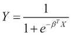

在前一个方程中，输出变量 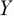 不仅依赖于变量 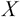，还依赖于系数 。变量  类似于我们模型中的输入值向量，而项  是模型的参数向量。对于二元分类，*Y* 的值必须在 0 和 1 的范围内。此外，一组输入值的类别由输出变量  是更接近 0 还是 1 来决定。对于这些 *Y* 的值，项 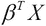 要么远大于 0，要么远小于 0。这可以形式化地表达如下：

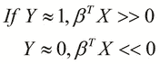

对于具有输入值 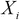 和输出值 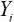 的 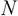 个样本，我们定义成本函数 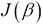 如下：

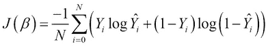

### 注意

注意，项 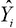 代表从估计模型计算得到的输出变量。

对于逻辑回归分类模型， 是将逻辑函数应用于一组输入值  时的值。我们可以简化并展开前面方程定义的成本函数中的求和项 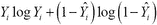，如下所示：

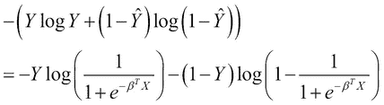

很明显，前面表达式中显示的成本函数取决于表达式中的两个对数项。因此，我们可以将成本函数表示为这两个对数项的函数，分别用项 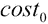 和 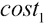 表示。现在，让我们假设以下方程中的两个项：


函数和都是使用逻辑函数组成的。一个模拟逻辑函数的分类器必须经过训练，使得这两个函数在参数向量的所有可能值上都被最小化。我们可以使用**铰链损失**函数来近似使用逻辑函数的线性分类器的期望行为（更多信息，请参阅“损失函数都一样吗？”）。现在，我们将通过将其与逻辑函数进行比较来研究铰链损失函数。以下图表描述了函数必须如何随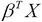项变化，以及它如何可以使用逻辑函数和铰链损失函数来建模：

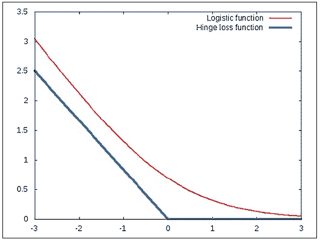

在前一张图中所示的图中，逻辑函数被表示为一条平滑的曲线。可以看到，在某个给定点之前，该函数迅速下降，然后以更低的速率下降。在这个例子中，逻辑函数速率变化发生的点是*x = 0*。铰链损失函数通过使用两个在*x = 0*点交汇的线段来近似这一点。有趣的是，这两个函数都模拟了一种随输入值*x*成反比变化的速率的行为。同样，我们可以使用铰链损失函数来近似函数的效果，如下所示：

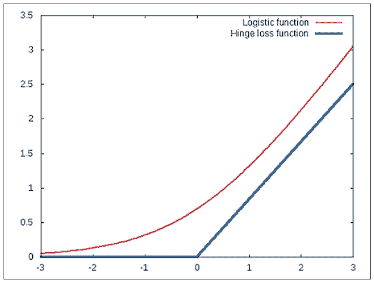

注意，函数与项成正比。因此，我们可以通过模拟铰链损失函数来实现逻辑函数的分类能力，而使用铰链损失函数构建的分类器将表现得与使用逻辑函数的分类器一样好。

如前图所示，hinge 损失函数仅在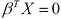这一点上改变其值。这适用于和这两个函数。因此，我们可以使用 hinge 损失函数根据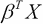的值是大于还是小于 0 来分离两类数据。在这种情况下，这两类数据之间几乎没有分离间隔。为了提高分类间隔，我们可以修改 hinge 损失函数，使其仅在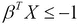或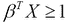时值为大于 0。

修改后的 hinge 损失函数可以如下绘制两类数据。以下图表描述了的情况：

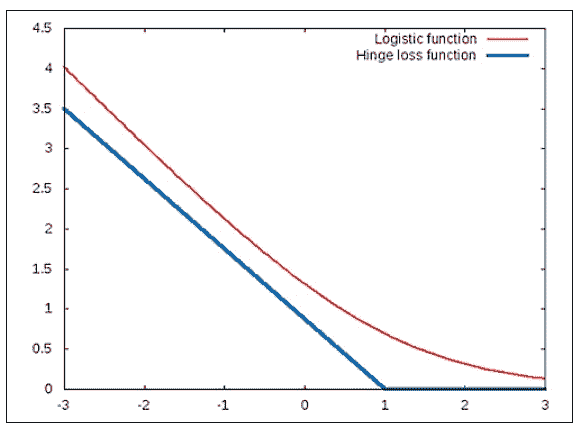

同样，对于情况修改后的 hinge 损失函数可以通过以下图表进行说明：

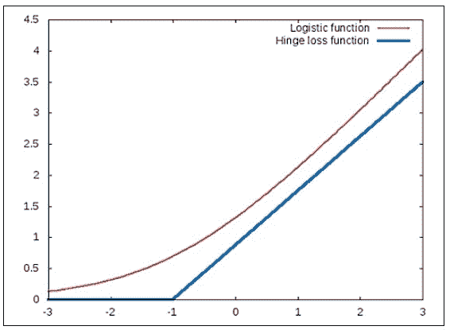

注意，在的情况下，*hinge*发生在*-1*处。

如果我们将和函数替换为 hinge 损失函数，我们就会得到 SVMs（支持向量机）的优化问题（更多信息，请参阅“支持向量网络”），其形式化表达如下：

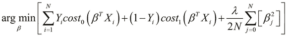

在前述方程中，项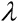是正则化参数。此外，当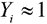时，SVM 的行为更多地受到函数的影响，反之亦然当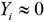。在某些情况下，模型的正则化参数作为常数*C*添加到优化问题中，其中*C*类似于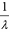。这种优化问题的表示可以形式化地表达如下：

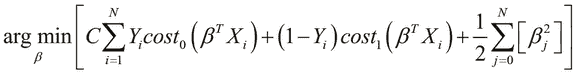

由于我们只处理两类数据，其中要么是 0 要么是 1，我们可以将之前描述的优化问题重写如下：

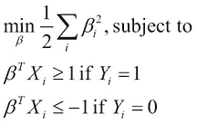

让我们尝试可视化 SVM 在训练数据上的行为。假设我们在训练数据中有两个输入变量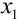和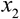。输入值及其类别可以用以下图示表示：

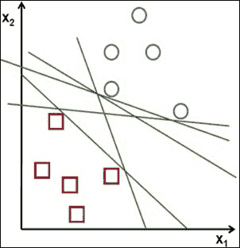

在前述图示中，训练数据中的两类被表示为圆圈和正方形。线性分类器将尝试将这些样本值划分为两个不同的类别，并产生一个决策边界，该边界可以由前述图示中的任意一条线表示。当然，分类器应努力最小化所构建模型的总体误差，同时找到一个很好地泛化数据的模型。SVM 也会像其他分类模型一样尝试将样本数据划分为两个类别。然而，SVM 设法确定了一个分离超平面，该超平面在输入数据的两个类别之间观察到具有最大的可能间隔。

SVM 的这种行为可以用以下图示来展示：

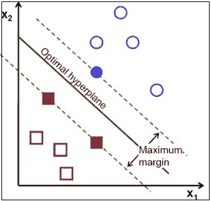

如前述图示所示，SVM 将确定一个最优的超平面，该超平面在两类数据之间具有最大的可能间隔来分离这两类数据。从我们之前描述的 SVM 优化问题中，我们可以证明 SVM 估计的分离超平面的方程如下：

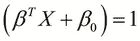

### 注意

注意，在前述方程中，常数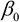仅仅是超平面的 y 截距。

要了解 SVM 如何实现这种大的间隔分离，我们需要使用一些基本的向量代数。首先，我们可以定义一个给定向量的长度如下：

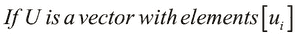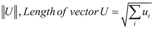

另一个常用来描述支持向量机（SVMs）的操作是两个向量的内积。两个给定向量的内积可以形式化定义为如下：


### 注意

注意，只有当两个向量长度相同时，两个向量的内积才存在。

如前述方程所示，两个向量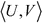和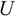的内积等于的转置与向量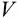的点积。另一种表示两个向量内积的方法是利用一个向量在另一个向量上的投影，如下所示：

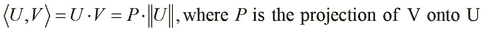

注意，项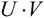等同于向量 V 与向量 U 转置的向量积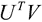。由于表达式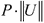等同于向量的乘积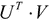，我们可以将我们之前用输入变量投影到输出变量描述的优化问题重新写为以下形式：

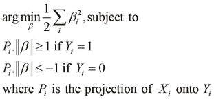

因此，SVM 试图最小化参数向量中元素的平方和，同时确保将两个数据类别分开的最佳超平面位于两个平面之间以及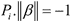和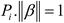。这两个平面被称为 SVM 的**支持向量**。由于我们必须最小化参数向量中元素的值，因此投影必须足够大，以确保和：


因此，SVM 将确保输入变量投影到输出变量的投影尽可能大。这意味着 SVM 将在训练数据中找到两个输入值类别之间可能的最大间隔。

## SVM 的替代形式

现在我们将描述几种替代形式来表示 SVM。本节的其余部分可以安全地跳过，但建议读者了解这些形式，因为它们也是 SVM 广泛使用的符号。

如果是 SVM 估计的超平面的法线，我们可以用以下方程表示这个分离超平面：


### 注意

注意，在前面的方程中，项是超平面的 y 截距，与我们之前描述的超平面方程中的项类似。

这个超平面的两个外围支持向量具有以下方程：


我们可以使用表达式来确定给定输入值集的类别。如果这个表达式的值小于或等于-1，那么我们可以说输入值属于两个数据类别之一。同样，如果表达式的值大于或等于 1，预测输入值属于第二个类别。这可以正式表示如下：


前面方程中描述的两个不等式可以合并成一个不等式，如下所示：


因此，我们可以简洁地重写 SVMs 的优化问题如下：


在前面方程定义的受约束问题中，我们使用法线而不是参数向量来参数化优化问题。通过使用拉格朗日乘数，我们可以将优化问题表示如下：


这种 SVM 优化问题的形式被称为**原始形式**。请注意，在实践中，只有少数拉格朗日乘数将具有大于 0 的值。此外，这个解可以表示为输入向量和输出变量的线性组合，如下所示：


我们也可以将 SVM 的优化问题表示为**对偶形式**，这是一种受约束的表示，可以描述如下：


在前面方程中描述的受约束问题中，函数被称为**核函数**，我们将在本章后面的部分讨论这个函数在 SVMs 中的作用。

# 使用 SVM 进行线性分类

正如我们之前所描述的，SVMs 可以用于在两个不同的类别上执行线性分类。SVM 将尝试找到一个超平面来分隔这两个类别，使得估计的超平面描述了我们在模型中两个类别之间可达到的最大分离间隔。

例如，可以使用以下图表来可视化两个数据类别的估计超平面：


如前述图表所示，圆圈和交叉用于表示样本数据中的两个类别的输入值。线代表 SVM 的估计超平面。

在实践中，使用已实现的 SVM 而不是自己实现 SVM 通常更有效。有几个库实现了 SVM，并且已经移植到多种编程语言中。其中一个这样的库是 **LibLinear** ([`www.csie.ntu.edu.tw/~cjlin/liblinear/`](http://www.csie.ntu.edu.tw/~cjlin/liblinear/))，它使用 SVM 实现了一个线性分类器。LibLinear 的 Clojure 封装是 `clj-liblinear` ([`github.com/lynaghk/clj-liblinear`](https://github.com/lynaghk/clj-liblinear))，我们现在将探讨如何使用这个库轻松构建一个线性分类器。

### 注意

可以通过在 `project.clj` 文件中添加以下依赖项将 `clj-liblinear` 库添加到 Leiningen 项目中：

```py
[clj-liblinear "0.1.0"]
```

对于接下来的示例，命名空间声明应类似于以下声明：

```py
(ns my-namespace
  (:use [clj-liblinear.core :only [train predict]]))
```

首先，让我们生成一些训练数据，以便我们有两个类别的输入值。在这个例子中，我们将模拟两个输入变量，如下所示：

```py
(def training-data
  (concat
   (repeatedly
    500 #(hash-map :class 0
                   :data {:x (rand)
                          :y (rand)}))
   (repeatedly
    500 #(hash-map :class 1
                   :data {:x (- (rand))
                          :y (- (rand))}))))
```

使用前面代码中显示的 `repeatedly` 函数，我们生成了两个映射序列。这两个序列中的每个映射都包含键 `:class` 和 `:data`。`:class` 键的值表示输入值的类别，而 `:data` 键的值是另一个包含键 `:x` 和 `:y` 的映射。`:x` 和 `:y` 键的值代表我们训练数据中的两个输入变量。这些输入变量的值是通过使用 `rand` 函数随机生成的。训练数据是生成的，使得一组输入值的类别为 `0`，如果两个输入值都是正数，而如果两个输入值都是负数，则一组输入值的类别为 `1`。如前所述的代码所示，使用 `repeatedly` 函数生成了总共 1,000 个样本，分为两个类别，作为两个序列，然后使用 `concat` 函数合并成一个序列。我们可以在 REPL 中检查这些输入值，如下所示：

```py
user> (first training-data)
{:class 0,
 :data {:x 0.054125811753944264, :y 0.23575052637986382}}
user> (last training-data)
{:class 1,
 :data {:x -0.8067872409710037, :y -0.6395480020409928}}
```

我们可以使用我们生成的训练数据创建和训练一个 SVM。为此，我们使用`train`函数。`train`函数接受两个参数，包括输入值序列和输出值序列。这两个序列都假定是相同顺序的。对于分类的目的，输出变量可以设置为给定一组输入值的类别，如下所示：

```py
(defn train-svm []
  (train
   (map :data training-data)
   (map :class training-data)))
```

前述代码中定义的`train-svm`函数将使用`training-data`序列实例化和训练一个 SVM。现在，我们可以使用训练好的 SVM 通过`predict`函数进行分类，如下所示：

```py
user> (def svm (train-svm))
#'user/svm
user> (predict svm {:x 0.5 :y 0.5})
0.0
user> (predict svm {:x -0.5 :y 0.5})
0.0
user> (predict svm {:x -0.4 :y 0.4})
0.0
user> (predict svm {:x -0.4 :y -0.4})
1.0
user> (predict svm {:x 0.5 :y -0.5})
1.0
```

`predict`函数需要两个参数，一个是 SVM 的实例，以及一组输入值。

如前述代码所示，我们使用`svm`变量来表示一个训练好的 SVM。然后我们将`svm`变量传递给`predict`函数，同时传递一组新的输入值，这些输入值的类别是我们想要预测的。观察到`predict`函数的输出与训练数据一致。有趣的是，只要输入值`:y`为正，分类器就会预测任何一组输入值的类别为`0`；相反，如果一组输入值的`:y`特征为负，则预测为`1`。

在前一个例子中，我们使用 SVM 进行分类。然而，训练好的 SVM 的输出变量始终是一个数字。因此，我们也可以像前述代码中描述的那样使用`clj-liblinear`库来训练一个回归模型。

`clj-liblinear`库也支持更复杂的 SVM 特征类型，如向量、映射和集合。现在，我们将演示如何训练一个使用集合作为输入变量的分类器，而不是像前一个例子中那样使用纯数字。假设我们有一个来自特定用户 Twitter 动态的推文流。假设用户将手动将这些推文分类到预定义类别中的一个。这个处理过的推文序列可以表示如下：

```py
(def tweets
  [{:class 0 :text "new lisp project released"}
   {:class 0 :text "try out this emacs package for common lisp"}
   {:class 0 :text "a tutorial on guile scheme"}

   {:class 1 :text "update in javascript library"}
   {:class 1 :text "node.js packages are now supported"}
   {:class 1 :text "check out this jquery plugin"}

   {:class 2 :text "linux kernel news"}
   {:class 2 :text "unix man pages"}
   {:class 2 :text "more about linux software"}])
```

前述代码中定义的推文向量包含几个映射，每个映射都有`:class`和`:text`键。`:text`键包含推文文本，我们将使用`:text`键中的值来训练 SVM。但是我们不能直接使用文本，因为推文中可能会有重复的单词。此外，我们还需要处理这个文本中字母的情况。让我们定义一个函数将这个文本转换为集合，如下所示：

```py
(defn extract-words [text]
  (->> #" "
       (split text)
       (map lower-case)
       (into #{})))
```

前述代码中定义的`extract-words`函数会将任何字符串（由参数`text`表示）转换为一系列单词，这些单词全部为小写。为了创建一个集合，我们使用`(into #{})`形式。根据定义，这个集合将不包含任何重复的值。注意在`extract-words`函数定义中使用了`->>`线程宏。

### 注意

在`extract-words`函数中，`->>`形式可以等价地写成`(into #{} (map lower-case (split text #" ")))`。

我们可以在 REPL 中检查`extract-words`函数的行为，如下所示：

```py
user> (extract-words "Some text to extract some words")
#{"extract" "words" "text" "some" "to"}
```

使用`extract-words`函数，我们可以有效地使用一组字符串作为特征变量来训练 SVM。如我们之前提到的，这可以通过`train`函数来完成，如下所示：

```py
(defn train-svm []
  (train (->> tweets
              (map :text)
              (map extract-words))
         (map :class tweets)))
```

在前面的代码中定义的`train-svm`函数将使用`train`和`extract-word`s 函数创建并训练一个 SVM，该 SVM 使用推文变量中的处理后的训练数据。我们现在需要在以下代码中组合`predict`和`extract-words`函数，以便我们可以预测给定推文的类别：

```py
(defn predict-svm [svm text]
  (predict
    svm (extract-words text)))
```

在前面的代码中定义的`predict-svm`函数可以用来对给定的推文进行分类。我们可以在 REPL 中验证 SVM 对一些任意推文的预测类别，如下所示：

```py
user> (def svm (train-svm))
#'user/svm
user> (predict-svm svm "a common lisp tutorial")
0.0
user> (predict-svm svm "new javascript library")
1.0
user> (predict-svm svm "new linux kernel update")
2.0
```

总之，`clj-liblinear`库允许我们轻松地使用大多数 Clojure 数据类型构建和训练 SVM。该库施加的唯一限制是训练数据必须能够线性分离成我们模型中的类别。我们将在本章的后续部分研究如何构建更复杂的分类器。

# 使用核 SVM

在某些情况下，可用的训练数据不是线性可分的，我们无法使用线性分类来建模数据。因此，我们需要使用不同的模型来拟合非线性数据。如第四章《构建神经网络》中所述，人工神经网络（ANNs）可以用来建模这类数据。在本节中，我们将描述如何使用核函数将 SVM 拟合到非线性数据上。包含核函数的 SVM 被称为**核支持向量机**。请注意，在本节中，术语 SVM 和核 SVM 是互换使用的。核 SVM 将根据非线性决策边界对数据进行分类，决策边界的性质取决于 SVM 使用的核函数。为了说明这种行为，核 SVM 将按照以下图示将训练数据分为两类：


在支持向量机（SVMs）中使用核函数的概念实际上是基于数学变换的。核函数在 SVM 中的作用是将训练数据中的输入变量进行变换，使得变换后的特征是线性可分的。由于 SVM 基于大间隔线性划分输入数据，因此两个数据类别之间的这种大间隔分离在非线性空间中也将是可观察的。

核函数表示为，其中是从训练数据中得到的输入值向量，是的转换向量。函数表示这两个向量的相似性，并且等同于转换空间中这两个向量的内积。如果输入向量具有给定的类别，那么当这两个向量的核函数值接近 1 时，即时，向量的类别与向量的类别相同。核函数可以用以下数学表达式表示：


在前一个方程中，函数执行从非线性空间到线性空间的转换。请注意，的显式表示不是必需的，只需知道是一个内积空间即可。虽然我们可以自由选择任何任意的核函数来建模给定的训练数据，但我们必须努力减少最小化所构建 SVM 模型成本函数的问题。因此，核函数通常被选择，使得计算 SVM 的决策边界只需要确定转换特征空间中向量的点积。

SVM 的核函数的一个常见选择是**多项式核函数**，也称为**多项式核函数**，它将训练数据建模为原始特征变量的多项式。读者可能还记得第五章中关于*选择和评估数据*的讨论，我们讨论了多项式特征如何极大地提高给定机器学习模型的性能。多项式核函数可以被视为这一概念的扩展，适用于 SVM。该函数可以形式化地表示如下。


在前一个方程中，术语代表多项式特征的最高次数。此外，当（常数）时，核被称作**同质的**。

另一个广泛使用的核函数是**高斯核函数**。大多数熟悉线性代数的读者对高斯函数都不陌生。重要的是要知道，这个函数表示数据点的正态分布，其中数据点更接近数据的均值。

在 SVM 的背景下，高斯核函数可以用来表示一个模型，其中训练数据中的两个类别之一在输入变量上的值接近任意均值。高斯核函数可以形式地表示如下：


在前面方程定义的高斯核函数中，术语表示训练数据的方差，并代表高斯核的**宽度**。

核函数的另一个流行选择是**字符串核函数**，它作用于字符串值。术语“字符串”指的是符号的有限序列。字符串核函数本质上衡量两个给定字符串之间的相似度。如果传递给字符串核函数的两个字符串相同，该函数返回的值将是`1`。因此，字符串核函数在将特征表示为字符串的数据建模中非常有用。

## 序列最小优化

SVM 的优化问题可以使用**序列最小优化**（**SMO**）来解决。SVM 的优化问题是跨多个维度的成本函数的数值优化，以减少训练 SVM 的整体误差。在实践中，这必须通过数值优化技术来完成。SMO 算法的完整讨论超出了本书的范围。然而，我们必须注意，该算法通过一种*分而治之*的技术来解决优化问题。本质上，SMO 将多个维度的优化问题分解为几个可以解析解决的较小的二维问题（更多信息，请参阅*序列最小优化：训练支持向量机的一种快速算法*）。

**LibSVM**是一个流行的库，它实现了 SMO 来训练 SVM。`svm-clj`库是 LibSVM 的 Clojure 包装器，我们将现在探讨如何使用这个库来构建 SVM 模型。

### 注意

可以通过在`project.clj`文件中添加以下依赖项将`svm-clj`库添加到 Leiningen 项目中：

```py
[svm-clj "0.1.3"]
```

对于接下来的示例，命名空间声明应类似于以下声明：

```py
(ns my-namespace
  (:use svm.core))
```

此示例将使用**SPECT Heart**数据集的简化版本（[`archive.ics.uci.edu/ml/datasets/SPECT+Heart`](http://archive.ics.uci.edu/ml/datasets/SPECT+Heart)）。此数据集描述了使用**单光子发射计算机断层扫描**（**SPECT**）图像对几位心脏病患者的诊断。原始数据集包含总共 267 个样本，其中每个样本有 23 个特征。数据集的输出变量描述了给定患者的阳性或阴性诊断，分别用+1 或-1 表示。

对于此示例，训练数据存储在一个名为`features.dat`的文件中。此文件必须放置在 Leiningen 项目的`resources/`目录中，以便可供使用。此文件包含几个输入特征和这些输入值的类别。让我们看一下文件中的以下样本值之一：

```py
+1 2:1 3:1 4:-0.132075 5:-0.648402 6:1 7:1 8:0.282443 9:1 10:0.5 11:1 12:-1 13:1
```

如前述代码行所示，第一个值`+1`表示样本的类别，其他值表示输入变量。请注意，输入变量的索引也给出了。此外，前述样本中第一个特征的值是`0`，因为它没有使用`1:`键提及。从前述行中可以清楚地看出，每个样本将最多有 12 个特征。所有样本值都必须符合 LibSVM 规定的此格式。

我们可以使用这些样本数据训练一个 SVM。为此，我们使用`svm-clj`库中的`train-model`函数。此外，由于我们必须首先从文件中加载样本数据，我们还需要首先使用以下代码调用`read-dataset`函数：

```py
(def dataset (read-dataset "resources/features.dat"))

(def model (train-model dataset))
```

如前述代码中定义的模型变量所表示的训练好的 SVM 现在可以用来预测一组输入值的类别。`predict`函数可用于此目的。为了简单起见，我们将使用数据集变量本身的样本值如下：

```py
user> (def feature (last (first dataset)))
#'user/feature
user> feature
{1 0.708333, 2 1.0, 3 1.0, 4 -0.320755, 5 -0.105023,
 6 -1.0, 7 1.0, 8 -0.4198, 9 -1.0, 10 -0.2258, 12 1.0, 13 -1.0}
user> (feature 1)
0.708333
user> (predict model feature)
1.0
```

如前述代码中的 REPL 输出所示，`dataset`可以被视为一系列的映射。每个映射包含一个代表样本中输出变量值的单个键。`dataset`映射中此键的值是另一个映射，它表示给定样本的输入变量。由于`feature`变量代表一个映射，我们可以将其作为函数调用，如前述代码中的`(feature 1)`调用所示。

预测值与给定一组输入值的输出变量实际值或类别相一致。总之，`svm-clj`库为我们提供了一个简单且简洁的 SVM 实现。

## 使用核函数

如我们之前提到的，当我们需要拟合一些非线性数据时，我们可以为 SVM 选择一个核函数。现在，我们将通过使用`clj-ml`库来展示如何在实践中实现这一点。由于这个库已经在之前的章节中讨论过，我们将不会关注 SVM 的完整训练过程，而是关注如何创建使用核函数的 SVM。

### 注意

对于接下来的示例，命名空间声明应类似于以下声明：

```py
(ns my-namespace
  (:use [clj-ml classifiers kernel-functions]))
```

来自`clj-ml.kernel-functions`命名空间的`make-kernel-function`函数用于创建可用于 SVMs 的核函数。例如，我们可以通过将`:polynomic`关键字传递给此函数来创建一个多项式核函数，如下所示：

```py
(def K (make-kernel-function :polynomic {:exponent 3}))
```

如前一行所示，由变量`K`定义的多项式核函数具有多项式次数`3`。同样，我们也可以使用`:string`关键字创建一个字符串核函数，如下所示：

```py
(def K (make-kernel-function :string))
```

在`clj-ml`库中存在几种这样的核函数，鼓励读者探索这个库中更多的核函数。该命名空间文档可在[`antoniogarrote.github.io/clj-ml/clj-ml.kernel-functions-api.html`](http://antoniogarrote.github.io/clj-ml/clj-ml.kernel-functions-api.html)找到。我们可以通过指定`:support-vector-machine`和`:smo`关键字以及使用`:kernel-function`关键字选项来创建一个 SVM，如下所示：

```py
(def classifier
  (make-classifier :support-vector-machine :smo
                   :kernel-function K))
```

现在我们可以像之前章节中做的那样，训练由变量 classifier 表示的 SVM。因此，`clj-ml`库允许我们创建具有给定核函数的 SVM。

# 摘要

在本章中，我们探讨了 SVMs 及其如何用于拟合线性和非线性数据。以下是我们已经涵盖的其他主题：

+   我们已经探讨了支持向量机（SVMs）如何实现大间隔分类以及 SVMs 的优化问题各种形式

+   我们已经讨论了如何使用核函数和 SMO 来训练非线性样本数据的 SVM

+   我们还展示了如何使用几个 Clojure 库来构建和训练 SVMs

在下一章中，我们将把重点转向无监督学习，并探讨聚类技术来模拟这些类型的机器学习问题。
