# 第七章 聚类数据

我们现在将关注点转向**无监督学习**。在本章中，我们将研究几种**聚类**算法，或称为**聚类器**，以及如何在 Clojure 中实现它们。我们还将演示几个提供聚类算法实现的 Clojure 库。在章节的末尾，我们将探讨**降维**及其如何被用来提供对提供的样本数据的可理解的可视化。

聚类或**聚类分析**基本上是一种将数据或样本分组的方法。作为一种无监督学习形式，聚类模型使用未标记数据进行训练，这意味着训练数据中的样本将不包含输入值的类别或类别。相反，训练数据不描述给定输入集的输出变量的值。聚类模型必须确定几个输入值之间的相似性，并自行推断这些输入值的类别。因此，可以使用这种模型将样本值划分为多个簇。

聚类在现实世界问题中有几种实际应用。聚类常用于图像分析、图像分割、软件演化系统和社交网络分析。在计算机科学领域之外，聚类算法被用于生物分类、基因分析和犯罪分析。

到目前为止，已经发表了多种聚类算法。每种算法都有其独特的关于如何定义簇以及如何将输入值组合成新簇的概念。不幸的是，对于任何聚类问题都没有给出解决方案，每个算法都必须通过试错法来评估，以确定哪个模型最适合提供的训练数据。当然，这是无监督学习的一个方面，即没有明确的方法可以说一个给定的解决方案是任何给定数据的最佳匹配。

这是因为输入数据未标记，并且无法从输出变量或输入值的类别未知的数据中推断出一个简单的基于奖励的 yes/no 训练系统。

在本章中，我们将描述一些可以应用于未标记数据的聚类技术。

# 使用 K-means 聚类

**K-means 聚类**算法是一种基于矢量量化的聚类技术（更多信息，请参阅“算法 AS 136：K-Means 聚类算法”）。该算法将多个样本向量划分为*K*个簇，因此得名。在本节中，我们将研究 K-means 算法的性质和实现。

**量化**，在信号处理中，是将一组大量值映射到一组较小值的过程。例如，一个模拟信号可以被量化为 8 位，信号可以用 256 个量化级别来表示。假设这些位代表 0 到 5 伏特的值，8 位量化允许每位的分辨率为 5/256 伏特。在聚类的上下文中，输入或输出的量化可以出于以下原因进行：

+   为了将聚类限制在有限的聚类集合中。

+   为了适应样本数据中的值范围，在聚类执行时需要有一定的容差。这种灵活性对于将未知或意外的样本值分组在一起至关重要。

算法的精髓可以简洁地描述如下。首先随机初始化 K 个均值值，或称为**质心**。然后计算每个样本值与每个质心的距离。根据哪个质心与给定样本的距离最小，将样本值分组到给定质心的聚类中。在多维空间中，对于多个特征或输入值，样本输入向量的距离是通过输入向量与给定质心之间的**欧几里得距离**来衡量的。这个算法阶段被称为**分配步骤**。

K 均值算法的下一阶段是**更新步骤**。根据前一步生成的分割输入值调整质心的值。然后，这两个步骤重复进行，直到连续两次迭代中质心值之间的差异变得可以忽略不计。因此，算法的最终结果是给定训练数据中每组输入值的聚类或类别。

可以使用以下图表来展示 K 均值算法的迭代过程：

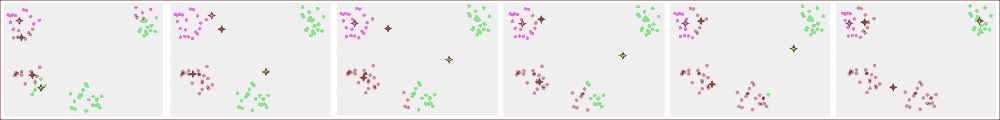

每个图描绘了算法针对一组输入值在每次迭代中产生的质心和分割样本值。在每张图中，给定迭代的聚类以不同的颜色显示。最后一张图代表了 K 均值算法产生的最终分割输入值集。

K 均值聚类算法的优化目标可以正式定义为如下：

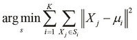

在前面方程定义的优化问题中，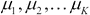这些项代表围绕输入值聚类的 K 均值。K 均值算法最小化聚类的尺寸，并确定可以最小化这些聚类尺寸的均值。

此算法需要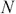样本值和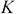初始均值作为输入。在分配步骤中，输入值被分配到算法提供的初始均值周围的聚类中。在后续的更新步骤中，从输入值计算新的均值。在大多数实现中，新的均值被计算为属于给定聚类的所有输入值的平均值。

大多数实现将初始均值设置为一些随机选择的输入值。这种技术被称为**Forgy 方法**的随机初始化。

当聚类数*K*或输入数据的维度*d*未定义时，*K*-means 算法是 NP 难的。当这两个值都固定时，*K*-means 算法的时间复杂度为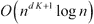。该算法有几种变体，这些变体在计算新均值的方式上有所不同。

现在，我们将演示如何在纯 Clojure 中实现*K*-means 算法，而不使用任何外部库。我们首先定义算法的各个部分，然后稍后将其组合以提供*K*-means 算法的基本可视化。

我们可以说两个数字之间的距离是它们值之间的绝对差，这可以通过以下代码中的`distance`函数实现：

```py
(defn distance [a b]
  (if (< a b) (- b a) (- a b)))
```

如果我们给定一些均值，我们可以通过使用`distance`和`sort-by`函数的组合来计算给定数字的最近均值，如下面的代码所示：

```py
(defn closest [point means distance]
  (first (sort-by #(distance % point) means)))
```

为了演示前面代码中定义的`closest`函数，我们首先需要定义一些数据，即一系列数字和一些均值，如下面的代码所示：

```py
(def data '(2 3 5 6 10 11 100 101 102))
(def guessed-means '(0 10))
```

现在，我们可以使用`data`和`guessed-means`变量与`closest`函数以及任意数字一起使用，如下面的 REPL 输出所示：

```py
user> (closest 2 guessed-means distance)
0
user> (closest 9 guessed-means distance)
10
user> (closest 100 guessed-means distance)
10
```

给定均值`0`和`10`，`closest`函数返回`0`作为`2`最近的均值，以及`10`作为`9`和`100`的均值。因此，可以通过与它们最近的均值来对数据点进行分组。我们可以通过使用`closest`和`group-by`函数来实现以下分组操作：

```py
(defn point-groups [means data distance]
  (group-by #(closest % means distance) data))
```

前面代码中定义的`point-groups`函数需要三个参数，即初始均值、要分组的点集合，以及最后是一个返回点与给定均值距离的函数。请注意，`group-by`函数将一个函数（作为第一个参数传递）应用于一个集合，然后将该集合作为第二个参数传递。

我们可以在 `data` 变量表示的数字列表上应用 `point-groups` 函数，根据它们与猜测的均值（由 `guessed-means` 表示）的距离将给定的值分组，如下面的代码所示：

```py
user> (point-groups guessed-means data distance)
{0 [2 3 5], 10 [6 10 11 100 101 102]}
```

如前述代码所示，`point-groups` 函数将序列 `data` 分成两个组。为了从这些输入值的组中计算新的均值集，我们必须计算它们的平均值，这可以通过使用 `reduce` 和 `count` 函数来实现，如下面的代码所示：

```py
(defn average [& list]
  (/ (reduce + list)
     (count list)))
```

我们实现了一个函数，将前面代码中定义的 `average` 函数应用于前一个平均值和 `point-groups` 函数返回的组映射。我们将通过以下代码来完成这项工作：

```py
(defn new-means [average point-groups old-means]
  (for [m old-means]
    (if (contains? point-groups m)
      (apply average (get point-groups m)) 
      m)))
```

在前面代码中定义的 `new-means` 函数中，对于前一个平均值中的每个值，我们应用 `average` 函数到按平均值分组的点。当然，只有当平均值有按其分组的一些点时，才需要对给定均值的点应用 `average` 函数。这是通过在 `new-means` 函数中使用 `contains?` 函数来检查的。我们可以在 REPL 中检查 `new-means` 函数返回的值，如下面的输出所示：

```py
user> (new-means average
        (point-groups guessed-means data distance)
                 guessed-means)
(10/3 55)
```

如前一个输出所示，新的平均值是根据初始平均值 `(0 10)` 计算得出的 `(10/3 55)`。为了实现 *K*-means 算法，我们必须迭代地应用 `new-means` 函数到它返回的新平均值上。这个迭代可以通过 `iterate` 函数来完成，该函数需要一个接受单个参数的函数作为输入。

我们可以通过将 `new-means` 函数对传递给它的旧均值进行柯里化来定义一个与 `iterate` 函数一起使用的函数，如下面的代码所示：

```py
(defn iterate-means [data distance average]
  (fn [means]
    (new-means average
               (point-groups means data distance)
               means)))
```

前面代码中定义的 `iterate-means` 函数返回一个函数，该函数从给定的一组初始平均值计算新的平均值，如下面的输出所示：

```py
user> ((iterate-means data distance average) '(0 10))
(10/3 55)
user> ((iterate-means data distance average) '(10/3 55))
(37/6 101)
```

如前一个输出所示，观察到在应用 `iterate-means` 函数返回的函数几次后，平均值发生了变化。这个返回的函数可以传递给 `iterate` 函数，我们可以使用 `take` 函数检查迭代的平均值，如下面的代码所示：

```py
user> (take 4 (iterate (iterate-means data distance average)
                       '(0 10)))
((0 10) (10/3 55) (37/6 101) (37/6 101))
```

观察到均值值仅在第一次迭代中的前三次发生变化，并收敛到我们定义的样本数据的值`(37/6 10)`。K-means 算法的终止条件是均值值的收敛，因此我们必须迭代`iterate-means`函数返回的值，直到返回的均值值与之前返回的均值值不再不同。由于`iterate`函数惰性地返回一个无限序列，我们必须实现一个函数来通过序列中元素的收敛来限制这个序列。这种行为可以通过使用`lazy-seq`和`seq`函数的惰性实现来实现，如下所示：

```py
(defn take-while-unstable
  ([sq] (lazy-seq (if-let [sq (seq sq)]
                    (cons (first sq)
                          (take-while-unstable 
                           (rest sq) (first sq))))))
  ([sq last] (lazy-seq (if-let [sq (seq sq)]
                         (if (= (first sq) last)
                           nil
                           (take-while-unstable sq))))))
```

前面代码中定义的`take-while-unstable`函数将惰性序列分割成其头部和尾部项，然后比较序列的第一个元素与序列尾部的第一个元素，如果两个元素相等则返回一个空列表，或`nil`。然而，如果它们不相等，则`take-while-unstable`函数会在序列的尾部再次被调用。注意`if-let`宏的使用，它只是一个带有`if`表达式的`let`形式，用于检查序列`sq`是否为空。我们可以在以下输出中检查`take-while-unstable`函数返回的值：

```py
user> (take-while-unstable
       '(1 2 3 4 5 6 7 7 7 7))
(1 2 3 4 5 6 7)
user> (take-while-unstable 
       (iterate (iterate-means data distance average)
                '(0 10)))
((0 10) (10/3 55) (37/6 101))
```

使用我们计算出的最终均值值，我们可以使用`point-groups`函数返回的映射上的`vals`函数来确定输入值的聚类，如下所示：

```py
(defn k-cluster [data distance means]
  (vals (point-groups means data distance)))
```

注意，`vals`函数返回给定映射中的所有值作为一个序列。

前面代码中定义的`k-cluster`函数生成了由 K-means 算法返回的输入值的最终聚类。我们可以将`k-cluster`函数应用于最终均值值`(37/6 101)`，以返回输入值的最终聚类，如下所示：

```py
user> (k-cluster data distance '(37/6 101))
([2 3 5 6 10 11] [100 101 102])
```

为了可视化输入值聚类的变化，我们可以将`k-cluster`函数应用于由组合`iterate`和`iterate-means`函数返回的值序列。我们必须通过所有聚类中值的收敛来限制这个序列，这可以通过使用`take-while-unstable`函数来实现，如下所示：

```py
user> (take-while-unstable
       (map #(k-cluster data distance %)
            (iterate (iterate-means data distance average)
             '(0 10))))
(([2 3 5] [6 10 11 100 101 102])
 ([2 3 5 6 10 11] [100 101 102]))
```

我们可以将前面的表达式重构为一个函数，该函数只需要初始猜测的均值值集合，通过将`iterate-means`函数绑定到样本数据来实现。用于计算给定输入值与均值值距离以及从输入值集合中计算平均均值值的函数如下所示：

```py
(defn k-groups [data distance average]
  (fn [guesses]
    (take-while-unstable
     (map #(k-cluster data distance %)
          (iterate (iterate-means data distance average)
                   guesses)))))
```

我们可以将前面代码中定义的`k-groups`函数与我们的样本数据和`distance`以及`average`函数绑定，这些函数在以下代码中展示了它们对数值的操作：

```py
(def grouper
  (k-groups data distance average))
```

现在，我们可以对任何任意集合的均值应用`grouper`函数，以可视化在 K-均值算法的各个迭代过程中聚类的变化，如下面的代码所示：

```py
user> (grouper '(0 10))
(([2 3 5] [6 10 11 100 101 102])
 ([2 3 5 6 10 11] [100 101 102]))
user> (grouper '(1 2 3))
(([2] [3 5 6 10 11 100 101 102])
 ([2 3 5 6 10 11] [100 101 102])
 ([2 3] [5 6 10 11] [100 101 102])
 ([2 3 5] [6 10 11] [100 101 102])
 ([2 3 5 6] [10 11] [100 101 102]))
user> (grouper '(0 1 2 3 4))
(([2] [3] [5 6 10 11 100 101 102])
 ([2] [3 5 6 10 11] [100 101 102])
 ([2 3] [5 6 10 11] [100 101 102])
 ([2 3 5] [6 10 11] [100 101 102])
 ([2] [3 5 6] [10 11] [100 101 102])
 ([2 3] [5 6] [10 11] [100 101 102]))
```

如我们之前提到的，如果平均值数量大于输入数量，我们最终会得到与输入值数量相等的聚类数量，其中每个聚类包含一个单独的输入值。这可以通过使用`grouper`函数在 REPL 中进行验证，如下面的代码所示：

```py
user> (grouper (range 200))
(([2] [3] [100] [5] [101] [6] [102] [10] [11]))
```

我们可以通过更改`k-groups`函数的参数`distance`和`average`距离来扩展前面的实现，使其适用于向量值而不是仅限于数值。我们可以如下实现这两个函数：

```py
(defn vec-distance [a b]
  (reduce + (map #(* % %) (map - a b))))

(defn vec-average [& list]
  (map #(/ % (count list)) (apply map + list)))
```

在前面的代码中定义的`vec-distance`函数实现了两个向量值之间的平方欧几里得距离，即两个向量中对应元素平方差的和。我们还可以通过将它们相加并除以相加的向量数量来计算一些向量值的平均值，如前面代码中定义的`vec-average`函数所示。我们可以在 REPL 中检查这些函数的返回值，如下面的输出所示：

```py
user> (vec-distance [1 2 3] [5 6 7])
48
user> (vec-average  [1 2 3] [5 6 7])
(3 4 5)
```

现在，我们可以定义一些以下向量值作为我们的聚类算法的样本数据：

```py
(def vector-data
  '([1 2 3] [3 2 1] [100 200 300] [300 200 100] [50 50 50]))
```

现在，我们可以使用`k-groups`函数以及`vector-data`、`vec-distance`和`vec-average`变量来打印出迭代产生的各种聚类，从而得到最终的聚类集合，如下面的代码所示：

```py
user> ((k-groups vector-data vec-distance vec-average)
       '([1 1 1] [2 2 2] [3 3 3]))
(([[1 2 3] [3 2 1]] [[100 200 300] [300 200 100] [50 50 50]])

 ([[1 2 3] [3 2 1] [50 50 50]]
  [[100 200 300] [300 200 100]])

 ([[1 2 3] [3 2 1]]
  [[100 200 300] [300 200 100]]
  [[50 50 50]]))
```

我们可以添加到这个实现中的另一个改进是使用`new-means`函数更新相同的均值值。如果我们向`new-means`函数传递一个相同的均值值的列表，两个均值值都将得到更新。然而，在经典的 K-均值算法中，只有两个相同均值值中的一个会被更新。这种行为可以通过在 REPL 中传递一个如`'(0 0)'`的相同均值值的列表到`new-means`函数来验证，如下面的代码所示：

```py
user> (new-means average 
                 (point-groups '(0 0) '(0 1 2 3 4) distance) 
                 '(0 0))
(2 2)
```

我们可以通过检查给定平均值在平均值集合中的出现次数来避免这个问题，并且只有在发现多个出现时才更新单个平均值。我们可以使用`frequencies`函数来实现这一点，该函数返回一个映射，其键是传递给`frequencies`函数的原始集合中的元素，其值是这些元素出现的频率。因此，我们可以重新定义`new-means`函数，如下面的代码所示：

```py
(defn update-seq [sq f]
  (let [freqs (frequencies sq)]
    (apply concat
     (for [[k v] freqs]
       (if (= v 1) 
         (list (f k))
         (cons (f k) (repeat (dec v) k)))))))
(defn new-means [average point-groups old-means]
  (update-seq
   old-means
   (fn [o]
     (if (contains? point-groups o)
       (apply average (get point-groups o)) o))))
```

前述代码中定义的`update-seq`函数将函数`f`应用于序列`sq`中的元素。只有当元素在序列中重复时，才会对单个元素应用函数`f`。现在我们可以观察到，当我们对相同的均值序列`'(0 0)`应用重新定义的`new-means`函数时，只有一个均值值发生变化，如下面的输出所示：

```py
user> (new-means average
                 (point-groups '(0 0) '(0 1 2 3 4) distance)
                 '(0 0))
(2 0)
```

`new-means`函数先前重新定义的结果是，`k-groups`函数现在在应用于不同的和相同的初始均值时，如`'(0 1)`和`'(0 0)`，会产生相同的聚类，如下面的代码所示：

```py
user> ((k-groups '(0 1 2 3 4) distance average)
       '(0 1))
(([0] [1 2 3 4]) ([0 1] [2 3 4]))
user> ((k-groups '(0 1 2 3 4) distance average)
       '(0 0))
(([0 1 2 3 4]) ([0] [1 2 3 4]) ([0 1] [2 3 4]))
```

关于`new-means`函数在相同初始均值方面的这种新行为也扩展到向量值，如下面的输出所示：

```py
user> ((k-groups vector-data vec-distance vec-average)
       '([1 1 1] [1 1 1] [1 1 1]))
(([[1 2 3] [3 2 1] [100 200 300] [300 200 100] [50 50 50]])
 ([[1 2 3] [3 2 1]] [[100 200 300] [300 200 100] [50 50 50]])
 ([[1 2 3] [3 2 1] [50 50 50]] [[100 200 300] [300 200 100]])
 ([[1 2 3] [3 2 1]] [[100 200 300] [300 200 100]] [[50 50 50]]))
```

总之，前例中定义的`k-cluster`和`k-groups`函数描述了如何在 Clojure 中实现*K*-means 聚类。

## 使用 clj-ml 进行聚类数据

`clj-ml`库提供了从 Java Weka 库派生出的几个聚类算法的实现。现在我们将演示如何使用`clj-ml`库构建一个*K*-means 聚类器。

### 注意

可以通过在`project.clj`文件中添加以下依赖项将`clj-ml`和 Incanter 库添加到 Leiningen 项目中：

```py
[cc.artifice/clj-ml "0.4.0"]
[incanter "1.5.4"]

```

对于接下来的示例，命名空间声明应类似于以下声明：

```py
(ns my-namespace
 (:use [incanter core datasets]
 [clj-ml data clusterers]))

```

对于本章中使用的`clj-ml`库的示例，我们将使用 Incanter 库中的**Iris**数据集作为我们的训练数据。这个数据集本质上是一个 150 朵花的样本，以及为这些样本测量的四个特征变量。在 Iris 数据集中测量的花的特征是花瓣和花萼的宽度和长度。样本值分布在三个物种或类别中，即 Virginica、Setosa 和 Versicolor。数据以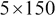大小的矩阵形式提供，其中给定花的物种在该矩阵的最后一列中表示。

我们可以使用 Incanter 库中的`get-dataset`、`sel`和`to-vector`函数从 Iris 数据集中选择特征作为向量，如下面的代码所示。然后我们可以使用`clj-ml`库中的`make-dataset`函数将此向量转换为`clj-ml`数据集。这是通过将特征值的键名作为模板传递给`make-dataset`函数来完成的，如下面的代码所示：

```py
(def features [:Sepal.Length
               :Sepal.Width
               :Petal.Length
               :Petal.Width])

(def iris-data (to-vect (sel (get-dataset :iris)
                             :cols features)))

(def iris-dataset
  (make-dataset "iris" features iris-data))
```

我们可以在 REPL 中打印前述代码中定义的`iris-dataset`变量，以获取有关其包含内容的一些信息，如下面的代码和输出所示：

```py
user> iris-dataset
#<ClojureInstances @relation iris

@attribute Sepal.Length numeric
@attribute Sepal.Width numeric
@attribute Petal.Length numeric
@attribute Petal.Width numeric

@data
5.1,3.5,1.4,0.2
4.9,3,1.4,0.2
4.7,3.2,1.3,0.2
...
4.7,3.2,1.3,0.2
6.2,3.4,5.4,2.3
5.9,3,5.1,1.8>
```

我们可以使用`clj-ml.clusterers`命名空间中的`make-clusterer`函数来创建一个聚类器。我们可以将创建的聚类器类型作为`make-cluster`函数的第一个参数。第二个可选参数是一个选项映射，用于创建指定的聚类器。我们可以使用`clj-ml`库中的`cluster-build`函数来训练一个给定的聚类器。在下面的代码中，我们使用`make-clusterer`函数和`:k-means`关键字创建一个新的*K*-means 聚类器，并定义一个简单的辅助函数来帮助使用任何给定的数据集训练这个聚类器：

```py
(def k-means-clusterer
  (make-clusterer :k-means
                  {:number-clusters 3}))

(defn train-clusterer [clusterer dataset]
  (clusterer-build clusterer dataset)
  clusterer)
```

`train-clusterer`函数可以应用于由`k-means-clusterer`变量定义的聚类器实例和由`iris-dataset`变量表示的样本数据，如下面的代码和输出所示：

```py
user> (train-clusterer k-means-clusterer iris-dataset)
#<SimpleKMeans
kMeans
======

Number of iterations: 6
Within cluster sum of squared errors: 6.982216473785234
Missing values globally replaced with mean/mode

Cluster centroids:
                            Cluster#
Attribute       Full Data          0          1          2
                    (150)       (61)       (50)       (39)
==========================================================
Sepal.Length       5.8433     5.8885      5.006     6.8462
Sepal.Width        3.0573     2.7377      3.428     3.0821
Petal.Length        3.758     4.3967      1.462     5.7026
Petal.Width        1.1993      1.418      0.246     2.0795
```

如前一个输出所示，训练好的聚类器在第一个聚类（聚类`0`）中包含`61`个值，在第二个聚类（聚类`1`）中包含`50`个值，在第三个聚类（聚类`2`）中包含`39`个值。前一个输出还提供了关于训练数据中各个特征平均值的一些信息。现在我们可以使用训练好的聚类器和`clusterer-cluster`函数来预测输入数据的类别，如下面的代码所示：

```py
user> (clusterer-cluster k-means-clusterer iris-dataset)
#<ClojureInstances @relation 'clustered iris'

@attribute Sepal.Length numeric
@attribute Sepal.Width numeric
@attribute Petal.Length numeric
@attribute Petal.Width numeric
@attribute class {0,1,2}

@data
5.1,3.5,1.4,0.2,1
4.9,3,1.4,0.2,1
4.7,3.2,1.3,0.2,1
...
6.5,3,5.2,2,2
6.2,3.4,5.4,2.3,2
5.9,3,5.1,1.8,0>
```

`clusterer-cluster`函数使用训练好的聚类器返回一个新的数据集，该数据集包含一个额外的第五个属性，表示给定样本值的类别。如前述代码所示，这个新属性的值为`0`、`1`和`2`，样本值也包含这个新特征的合法值。总之，`clj-ml`库提供了一个良好的框架来处理聚类算法。在前面的例子中，我们使用`clj-ml`库创建了一个*K*-means 聚类器。

# 使用层次聚类

**层次聚类**是另一种聚类分析方法，其中训练数据的输入值被分组到一个层次结构中。创建层次结构的过程可以采用自上而下的方法，其中所有观测值最初都是单个聚类的部分，然后被划分为更小的聚类。或者，我们可以使用自下而上的方法来分组输入值，其中每个聚类最初都是训练数据中的一个样本值，然后这些聚类被合并在一起。前者自上而下的方法被称为**划分聚类**，后者自下而上的方法被称为**聚合聚类**。

因此，在聚合聚类中，我们将聚类合并成更大的聚类，而在划分聚类中，我们将聚类划分为更小的聚类。在性能方面，现代聚合聚类算法的实现具有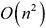的时间复杂度，而划分聚类的时间复杂度则要高得多。

假设我们在训练数据中有六个输入值。在下图说明中，假设这些输入值是根据某种二维度量来衡量给定输入值的整体值的位置：

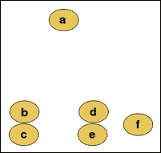

我们可以对这些输入值应用凝聚聚类，以产生以下聚类层次：

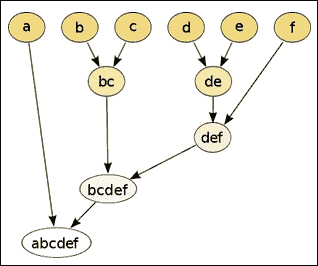

观察到值 *b* 和 *c* 在空间分布上彼此最接近，因此被分组到一个聚类中。同样，节点 *d* 和 *e* 也被分组到另一个聚类中。层次聚类输入值的最终结果是单个二叉树或样本值的**树状图**。实际上，如 *bc* 和 *def* 这样的聚类作为值的二叉子树或其他聚类的子树被添加到层次中。尽管这个过程在二维空间中看起来非常简单，但当应用于多个维度的特征时，确定输入值之间距离和层次的问题的解决方案就不再那么简单了。

在凝聚和分裂聚类技术中，必须计算样本数据中输入值之间的相似性。这可以通过测量两组输入值之间的距离，使用计算出的距离将它们分组到聚类中，然后确定输入值聚类之间的连接或相似性来完成。

在层次聚类算法中，距离度量的选择将决定算法产生的聚类形状。两个常用的衡量两个输入向量 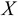 和 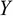 之间距离的度量是欧几里得距离 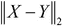 和平方欧几里得距离 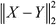，其形式可以表示如下：

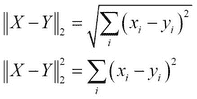

另一个常用于衡量输入值之间距离的度量标准是最大距离 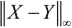，它计算两个给定向量中对应元素的绝对最大差值。此函数可以表示如下：

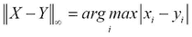

层次聚类算法的第二个方面是连接标准，它是衡量两个输入值聚类之间相似性或差异性的有效度量。确定两个输入值之间连接的两种常用方法是**完全连接聚类**和**单连接聚类**。这两种方法都是凝聚聚类的形式。

在聚合聚类中，两个具有最短距离度量的输入值或聚类被合并成一个新的聚类。当然，“最短距离”的定义是任何聚合聚类技术中独特的地方。在完全链接聚类中，使用彼此最远的输入值来确定分组。因此，这种方法也被称为**最远邻聚类**。两个值之间的距离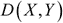的度量可以如下正式表达：

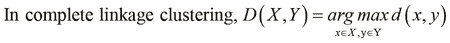

在前面的方程中，函数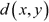是两个输入向量之间选择的距离度量。完全链接聚类将本质上将具有最大距离度量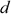的值或聚类分组在一起。这种将聚类分组在一起的操作会重复进行，直到产生单个聚类。

在单链接聚类中，彼此最近的值被分组在一起。因此，单链接聚类也称为**最近邻聚类**。这可以用以下表达式正式表述：

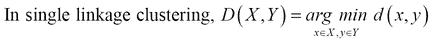

另一种流行的层次聚类技术是**蜘蛛网算法**。该算法是一种**概念聚类**，其中为聚类方法产生的每个聚类创建一个概念。术语“概念”指的是聚在一起的数据的简洁形式化描述。有趣的是，概念聚类与决策树学习密切相关，我们已经在第三章中讨论过，即*数据分类*。蜘蛛网算法将所有聚类分组到一个**分类树**中，其中每个节点包含其子节点（即值或聚类）的正式摘要。然后可以使用这些信息来确定和预测具有一些缺失特征的输入值的类别。在这种情况下，当测试数据中的某些样本具有缺失或未知特征时，可以使用这种技术。

现在我们演示层次聚类的简单实现。在这个实现中，我们采取了一种略有不同的方法，将部分所需功能嵌入到 Clojure 语言提供的标准向量数据结构中。

### 注意

对于即将到来的示例，我们需要`clojure.math.numeric-tower`库，可以通过在`project.clj`文件中添加以下依赖项将此库添加到 Leiningen 项目中：

```py
[org.clojure/math.numeric-tower "0.0.4"]
```

示例中的命名空间声明应类似于以下声明：

```py
(ns my-namespace
  (:use [clojure.math.numeric-tower :only [sqrt]]))
```

对于这个实现，我们将使用两点之间的欧几里得距离作为距离度量。我们可以通过输入向量中元素的平方和来计算这个距离，这可以通过`reduce`和`map`函数的组合来计算，如下所示：

```py
(defn sum-of-squares [coll]
  (reduce + (map * coll coll)))
```

在前面的代码中定义的`sum-of-squares`函数将用于确定距离度量。我们将定义两个协议来抽象我们对特定数据类型执行的操作。从工程角度来看，这两个协议可以合并为一个单一协议，因为这两个协议都将组合使用。

然而，为了清晰起见，我们在这个例子中使用以下两个协议：

```py
(defprotocol Each
  (each [v op w]))

(defprotocol Distance
  (distance [v w]))
```

在`Each`协议中定义的`each`函数将给定的操作`op`应用于两个集合`v`和`w`中的对应元素。`each`函数与标准`map`函数非常相似，但`each`允许`v`的数据类型决定如何应用函数`op`。在`Distance`协议中定义的`distance`函数计算任何两个集合`v`和`w`之间的距离。请注意，我们使用通用术语“集合”，因为我们处理的是抽象协议，而不是这些协议函数的具体实现。对于这个例子，我们将实现前面的协议作为向量数据类型的一部分。当然，这些协议也可以扩展到其他数据类型，如集合和映射。

在这个例子中，我们将实现单链接聚类作为链接标准。首先，我们必须定义一个函数来确定从一组向量值中距离最近的两个向量。为此，我们可以对一个向量应用`min-key`函数，该函数返回集合中与最少关联值的键。有趣的是，在 Clojure 中这是可能的，因为我们可以将向量视为一个映射，其中向量中各种元素的索引值作为其键。我们将借助以下代码来实现这一点：

```py
(defn closest-vectors [vs]
  (let [index-range (range (count vs))]
    (apply min-key
           (fn [[x y]] (distance (vs x) (vs y)))
           (for [i index-range
                 j (filter #(not= i %) index-range)]
             [i j]))))
```

在前面的代码中定义的`closest-vectors`函数使用`for`形式确定向量`vs`的所有可能的索引组合。请注意，向量`vs`是一个向量向量的向量。然后，将`distance`函数应用于可能的索引组合的值，并使用`min-key`函数比较这些距离。该函数最终返回两个内部向量值的最小距离的索引值，从而实现单链接聚类。

我们还需要计算必须聚在一起的两个向量的平均值。我们可以使用在`Each`协议中先前定义的`each`函数和`reduce`函数来实现这一点，如下所示：

```py
(defn centroid [& xs]
  (each
   (reduce #(each %1 + %2) xs)
   *
   (double (/ 1 (count xs)))))
```

在前一段代码中定义的 `centroid` 函数将计算一系列向量值的平均值。请注意，使用 `double` 函数以确保 `centroid` 函数返回的值是一个双精度浮点数。

我们现在将 `Each` 和 `Distance` 协议作为向量数据类型的一部分实现，该类型完全限定为 `clojure.lang.PersistentVector`。这是通过使用 `extend-type` 函数实现的，如下所示：

```py
(extend-type clojure.lang.PersistentVector
  Each
  (each [v op w]
    (vec
     (cond
      (number? w) (map op v (repeat w))
      (vector? w) (if (>= (count v) (count w))
                    (map op v (lazy-cat w (repeat 0)))
                    (map op (lazy-cat v (repeat 0)) w)))))
  Distance 
  ;; implemented as Euclidean distance
  (distance [v w] (-> (each v - w)
                      sum-of-squares
                      sqrt)))
```

`each` 函数的实现方式是，将 `op` 操作应用于 `v` 向量中的每个元素和第二个参数 `w`。`w` 参数可以是向量或数字。如果 `w` 是一个数字，我们只需将函数 `op` 映射到 `v` 和数字 `w` 的重复值上。如果 `w` 是一个向量，我们使用 `lazy-cat` 函数用 `0` 值填充较短的向量，并将 `op` 映射到两个向量上。此外，我们用 `vec` 函数包装整个表达式，以确保返回的值始终是向量。

`distance` 函数是通过使用我们之前定义的 `sum-of-squares` 函数和来自 `clojure.math.numeric-tower` 命名空间的 `sqrt` 函数来计算两个向量值 `v` 和 `w` 之间的欧几里得距离。

我们已经拥有了实现一个对向量值进行层次聚类功能的所有组件。我们可以主要使用之前定义的 `centroid` 和 `closest-vectors` 函数来实现层次聚类，如下所示：

```py
(defn h-cluster
  "Performs hierarchical clustering on a
  sequence of maps of the form { :vec [1 2 3] } ."
  [nodes]
  (loop [nodes nodes]
    (if (< (count nodes) 2)
      nodes
      (let [vectors    (vec (map :vec nodes))
            [l r]      (closest-vectors vectors)
            node-range (range (count nodes))
            new-nodes  (vec
                        (for [i node-range
                              :when (and (not= i l)
                                         (not= i r))]
                          (nodes i)))]
        (recur (conj new-nodes
                     {:left (nodes l) :right (nodes r)
                      :vec (centroid
                            (:vec (nodes l))
                            (:vec (nodes r)))}))))))
```

我们可以将映射到前一段代码中定义的 `h-cluster` 函数的向量传递给。这个向量中的每个映射都包含一个向量作为 `:vec` 关键字的值。`h-cluster` 函数结合了这些映射中 `:vec` 关键字的所有向量值，并使用 `closest-vectors` 函数确定两个最近的向量。由于 `closest-vectors` 函数返回的是一个包含两个索引值的向量，我们确定除了 `closest-vectors` 函数返回的两个索引值之外的所有向量。这是通过一个特殊的 `for` 宏形式实现的，该宏允许使用 `:when` 关键字参数指定条件子句。然后使用 `centroid` 函数计算两个最近向量值的平均值。使用平均值创建一个新的映射，并将其添加到原始向量中以替换两个最近的向量值。使用 `loop` 形式重复此过程，直到向量中只剩下一个簇。我们可以在以下代码中检查 `h-cluster` 函数的行为：

```py
user> (h-cluster [{:vec [1 2 3]} {:vec [3 4 5]} {:vec [7 9 9]}])
[{:left {:vec [7 9 9]},
  :right {:left {:vec [1 2 3]},
          :right {:vec [3 4 5]},
          :vec [2.0 3.0 4.0]},
  :vec [4.5 6.0 6.5] }]
```

当应用于三个向量值 `[1 2 3]`、`[3 4 5]` 和 `[7 9 9]`，如前述代码所示时，`h-cluster` 函数将向量 `[1 2 3]` 和 `[3 4 5]` 分组到一个单独的簇中。这个簇的平均值为 `[2.0 3.0 4.0]`，这是从向量 `[1 2 3]` 和 `[3 4 5]` 计算得出的。然后，这个新的簇在下一轮迭代中与向量 `[7 9 9]` 分组，从而产生一个平均值为 `[4.5 6.0 6.5]` 的单个簇。总之，`h-cluster` 函数可以用来将向量值分层聚类到一个单独的层次结构中。

`clj-ml` 库提供了一个 Cobweb 层次聚类算法的实现。我们可以使用带有 `:cobweb` 参数的 `make-clusterer` 函数实例化这样的聚类器。

```py
(def h-clusterer (make-clusterer :cobweb))
```

由前述代码中显示的 `h-clusterer` 变量定义的聚类器可以使用 `train-clusterer` 函数和之前定义的 `iris-dataset` 数据集进行训练，如下所示：`train-clusterer` 函数和 `iris-dataset` 可以按照以下代码实现：

```py
user> (train-clusterer h-clusterer iris-dataset)
#<Cobweb Number of merges: 0
Number of splits: 0
Number of clusters: 3

node 0 [150]
|   leaf 1 [96]
node 0 [150]
|   leaf 2 [54]
```

如前述 REPL 输出所示，Cobweb 聚类算法将输入数据划分为两个簇。一个簇包含 96 个样本，另一个簇包含 54 个样本，这与我们之前使用的 *K*-means 聚类器得到的结果相当不同。总之，`clj-ml` 库提供了一个易于使用的 Cobweb 聚类算法的实现。

# 使用期望最大化

**期望最大化**（**EM**）算法是一种概率方法，用于确定适合提供的训练数据的聚类模型。此算法确定了一个公式化聚类模型参数的**最大似然估计**（**MLE**）（有关更多信息，请参阅*观察指数族变量函数时的分布的最大似然理论和应用*）。

假设我们想要确定抛硬币得到正面或反面的概率。如果我们抛硬币 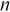 次，我们将得到 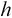 次正面和 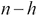 次反面的出现。我们可以通过以下方程估计出现正面的实际概率 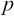，即正面出现次数与抛硬币总次数的比值：

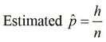

在前一个方程中定义的概率 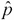 是概率 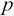 的最大似然估计。在机器学习的背景下，最大似然估计可以被最大化以确定给定类别或类别的发生概率。然而，这个估计的概率可能不会在可用的训练数据上以良好的定义方式统计分布，这使得难以有效地确定最大似然估计。通过引入一组隐藏值来解释训练数据中的未观察值，问题得到了简化。隐藏值不是直接从数据中测量的，而是从影响数据的因素中确定的。对于给定的一组观察值  和一组隐藏值 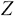，参数 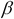 的似然函数定义为  和  发生的概率，对于给定的一组参数 。似然函数可以用 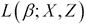 的数学表达式表示，可以表示如下：

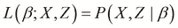

EM 算法包括两个步骤——期望步骤和最大化步骤。在期望步骤中，我们计算 **对数似然** 函数的期望值。这一步确定了一个必须在下一步中最大化的度量 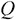，即算法的最大化步骤。这两个步骤可以正式总结如下：

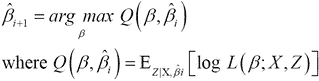

在前一个方程中，通过迭代计算最大化函数 *Q* 值的  值，直到它收敛到一个特定的值。术语 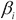 代表算法 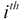 迭代中的估计参数。此外，术语 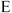 是对数似然函数的期望值。

`clj-ml` 库还提供了一个 EM 聚类器。我们可以使用 `make-clusterer` 函数和 `:expectation-maximization` 关键字作为其参数来创建一个 EM 聚类器，如下面的代码所示：

```py
(def em-clusterer (make-clusterer :expectation-maximization
                                  {:number-clusters 3}))
```

注意，我们还必须指定要生成的聚类数量作为 `make-clusterer` 函数的选项。

我们可以使用 `train-clusterer` 函数和之前定义的 `iris-dataset` 数据集来训练由 `em-clusterer` 变量定义的聚类器，如下所示：

```py
user> (train-clusterer em-clusterer iris-dataset)
#<EM
EM
==

Number of clusters: 3

               Cluster
Attribute            0       1       2
                (0.41)  (0.25)  (0.33)
=======================================
Sepal.Length
  mean           5.9275  6.8085   5.006
  std. dev.      0.4817  0.5339  0.3489

Sepal.Width
  mean           2.7503  3.0709   3.428
  std. dev.      0.2956  0.2867  0.3753

Petal.Length
  mean           4.4057  5.7233   1.462
  std. dev.      0.5254  0.4991  0.1719

Petal.Width
  mean           1.4131  2.1055   0.246
  std. dev.      0.2627  0.2456  0.1043
```

如前述输出所示，EM 聚类器将给定的数据集划分为三个簇，其中簇的分布大约为训练数据样本的 41%、25% 和 35%。

# 使用 SOMs

如我们之前在第四章中提到的，*构建神经网络*，SOM 可以用于建模无监督机器学习问题，例如聚类（更多信息，请参阅 *自组织映射作为 K-Means 聚类的替代方案*）。为了快速回顾，SOM 是一种将高维输入值映射到低维输出空间的 ANN 类型。这种映射保留了输入值之间的模式和拓扑关系。SOM 的输出空间中的神经元对于空间上彼此接近的输入值将具有更高的激活值。因此，SOM 是聚类具有大量维度的输入数据的好方法。

Incanter 库提供了一个简洁的 SOM 实现，我们可以使用它来聚类 Iris 数据集中的输入变量。我们将在接下来的示例中演示如何使用这个 SOM 实现进行聚类。

### 注意

可以通过在 `project.clj` 文件中添加以下依赖项将 Incanter 库添加到 Leiningen 项目中：

```py
[incanter "1.5.4"]
```

对于即将到来的示例，命名空间声明应类似于以下声明：

```py
(ns my-namespace
  (:use [incanter core som stats charts datasets]))
```

我们首先使用 Incanter 库中的 `get-dataset`、`sel` 和 `to-matrix` 函数定义用于聚类的样本数据，如下所示：

```py
(def iris-features (to-matrix (sel (get-dataset :iris)
                                   :cols [:Sepal.Length
                                          :Sepal.Width
                                          :Petal.Length
                                          :Petal.Width])))
```

在前面的代码中定义的 `iris-features` 变量实际上是一个 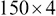 大小的矩阵，它表示我们从 Iris 数据集中选出的四个输入变量的值。现在，我们可以使用 `incanter.som` 命名空间中的 `som-batch-train` 函数创建并训练一个 SOM，如下所示：

```py
(def som (som-batch-train
          iris-features :cycles 10))
```

定义为 `som` 变量的实际上是一个包含多个键值对的映射。该映射中的 `:dims` 键包含一个向量，它表示训练好的 SOM 中神经元格子的维度，如下面的代码和输出所示：

```py
user> (:dims som)
[10.0 2.0]
```

因此，我们可以说训练好的 SOM 的神经网络是一个 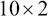 矩阵。`som` 变量表示的映射中的 `:sets` 键给出了输入值在 SOM 神经元格子中的各种索引的位置分组，如下面的输出所示：

```py
user> (:sets som)
{[4 1] (144 143 141 ... 102 100),
 [8 1] (149 148 147 ... 50),
 [9 0] (49 48 47 46 ... 0)}
```

如前述 REPL 输出所示，输入数据被划分为三个簇。我们可以使用 `incanter.stats` 命名空间中的 `mean` 函数计算每个特征的均值，如下所示：

```py
(def feature-mean
  (map #(map mean (trans
                   (sel iris-features :rows ((:sets som) %))))
       (keys (:sets som))))
```

我们可以使用 Incanter 库中的 `xy-plot`、`add-lines` 和 `view` 函数来实现一个函数来绘制这些均值，如下所示：

```py
(defn plot-means []
  (let [x (range (ncol iris-features))
        cluster-name #(str "Cluster " %)]
    (-> (xy-plot x (nth feature-mean 0)
                 :x-label "Feature"
                 :y-label "Mean value of feature"
                 :legend true
                 :series-label (cluster-name 0))
        (add-lines x (nth feature-mean 1)
                   :series-label (cluster-name 1))
        (add-lines x (nth feature-mean 2)
                   :series-label (cluster-name 2))
        view)))
```

调用前面代码中定义的 `plot-means` 函数时，产生了以下线性图：

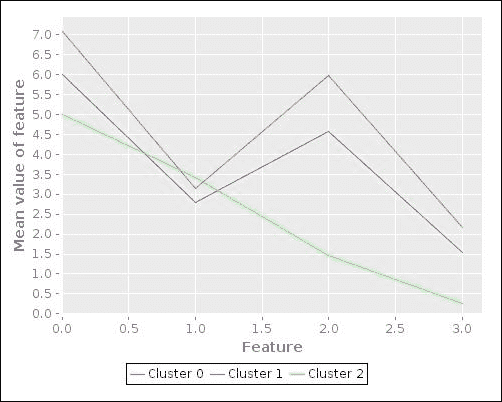

上述图表展示了 SOM 确定的三个聚类中各种特征的均值。图表显示，其中两个聚类（*Cluster 0*和*Cluster 1*）具有相似的特征。然而，第三个聚类在这些特征集合上的均值有显著差异，因此在图表中显示为不同的形状。当然，这个图表并没有给我们关于这些均值周围输入值分布或方差的信息。为了可视化这些特征，我们需要以某种方式将输入数据的维度数转换为两个或三个维度，这样就可以轻松地可视化。我们将在本章下一节中进一步讨论在训练数据中减少特征数量的概念。

我们也可以使用`frequencies`和`sel`函数来打印聚类和输入值的实际类别，如下所示：

```py
(defn print-clusters []
  (doseq [[pos rws] (:sets som)]
    (println pos \:
             (frequencies
              (sel (get-dataset :iris) 
                   :cols :Species :rows rws)))))
```

我们可以调用前面代码中定义的`print-clusters`函数来生成以下 REPL 输出：

```py
user> (print-clusters)
[4 1] : {virginica 23}
[8 1] : {virginica 27, versicolor 50}
[9 0] : {setosa 50}
nil
```

如前所述的输出所示，`virginica`和`setosa`物种似乎被适当地分类到两个聚类中。然而，包含`versicolor`物种输入值的聚类也包含了 27 个`virginica`物种的样本。这个问题可以通过使用更多的样本数据来训练 SOM 或通过建模更多的特征来解决。

总之，Incanter 库为我们提供了一个简洁的 SOM 实现，我们可以使用前面示例中的 Iris 数据集进行训练。

# 在数据中降低维度

为了轻松可视化某些未标记数据的分布，其中输入值具有多个维度，我们必须将特征维度数降低到两个或三个。一旦我们将输入数据的维度数降低到两个或三个维度，我们就可以简单地绘制数据，以提供更易于理解的可视化。在输入数据中减少维度数的过程被称为**降维**。由于这个过程减少了表示样本数据所使用的总维度数，因此它也有助于数据压缩。

**主成分分析**（**PCA**）是一种降维方法，其中样本数据中的输入变量被转换为线性不相关的变量（更多信息，请参阅*主成分分析*）。这些转换后的特征被称为样本数据的**主成分**。

PCA 使用协方差矩阵和称为 **奇异值分解**（**SVD**）的矩阵运算来计算给定输入值的特征值。表示为 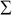 的协方差矩阵，可以从具有  个样本的输入向量 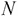 中确定如下：

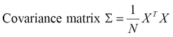

协方差矩阵通常在均值归一化后的输入值上计算，这仅仅是确保每个特征具有零均值值。此外，在确定协方差矩阵之前，特征可以被缩放。接下来，协方差矩阵的 SVD 如下确定：

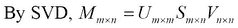

可以将 SVD 视为将大小为 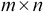 的矩阵 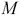 分解为三个矩阵 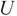，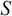，和 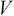。矩阵  的大小为 ，矩阵  的大小为 ，矩阵  的大小为 。矩阵  实际上代表了具有  维度的  输入向量。矩阵  是一个对角矩阵，被称为矩阵  的 **奇异值**，而矩阵  和  分别被称为  的 **左奇异向量** 和 **右奇异向量**。在 PCA 的上下文中，矩阵  被称为 **降维成分**，而矩阵  被称为样本数据的 **旋转成分**。

将输入向量的  维度降低到  维度的 PCA 算法可以总结如下：

1.  从输入向量计算协方差矩阵。

1.  通过对协方差矩阵应用奇异值分解（SVD），计算矩阵，，和。

1.  从矩阵中，选择前列以生成矩阵，该矩阵被称为矩阵的**降维左奇异向量**或**降维旋转矩阵**。此矩阵代表了样本数据的个主成分，并将具有的大小。

1.  计算具有维度的向量，用表示，如下所示：

注意，PCA 算法的输入是经过均值归一化和特征缩放后的样本数据集的输入向量集。

由于在前面步骤中计算的矩阵有列，矩阵将具有的大小，它代表了维度的个输入向量。我们应该注意，维度数的降低可能会导致数据方差损失增加。因此，我们应该选择，使得方差损失尽可能小。

原始输入向量可以通过矩阵和降维后的左奇异向量如下重建：


Incanter 库包含一些执行 PCA 的函数。在接下来的示例中，我们将使用 PCA 来提供 Iris 数据集的更好可视化。

### 注意

下一个示例中的命名空间声明应类似于以下声明：

```py
(ns my-namespace
  (:use [incanter core stats charts datasets]))
```

我们首先使用 `get-dataset`、`to-matrix` 和 `sel` 函数定义训练数据，如下面的代码所示：

```py
(def iris-matrix (to-matrix (get-dataset :iris)))
(def iris-features (sel iris-matrix :cols (range 4)))
(def iris-species (sel iris-matrix :cols 4))
```

与前面的例子类似，我们将使用 Iris 数据集的前四列作为训练数据的输入变量样本数据。

PCA 通过 `incanter.stats` 命名空间中的 `principal-components` 函数执行。此函数返回一个包含旋转矩阵  和降低矩阵  的映射，这些矩阵是我们之前描述的。我们可以使用 `sel` 函数从输入数据的降低矩阵中选择列，如下面的代码所示：

```py
(def pca (principal-components iris-features))

(def U (:rotation pca))
(def U-reduced (sel U :cols (range 2)))
```

如前面代码所示，可以通过 `principal-components` 函数返回的值上的 `:rotation` 关键字获取输入数据的 PCA 旋转矩阵。现在我们可以使用降低旋转矩阵和由 `iris-features` 变量表示的特征原始矩阵来计算降低特征 *Z*，如下面的代码所示：

```py
(def reduced-features (mmult iris-features U-reduced))
```

通过选择 `reduced-features` 矩阵的前两列并使用 `scatter-plot` 函数进行绘图，可以可视化降低特征，如下面的代码所示：

```py
(defn plot-reduced-features []
  (view (scatter-plot (sel reduced-features :cols 0)
                      (sel reduced-features :cols 1)
                      :group-by iris-species
                      :x-label "PC1"
                      :y-label "PC2")))
```

下面的图表是在调用前面代码中定义的 `plot-reduced-features` 函数时生成的：


前面图表中展示的散点图为我们提供了输入数据分布的良好可视化。前面图表中的蓝色和绿色簇显示，对于给定的特征集，这些簇具有相似的价值。总之，Incanter 库支持主成分分析（PCA），这使得可视化一些样本数据变得简单。

# 摘要

在本章中，我们探讨了可以用于建模一些未标记数据的几种聚类算法。以下是我们已经涵盖的一些其他要点：

+   我们探讨了 *K*-均值算法和层次聚类技术，同时提供了这些方法在纯 Clojure 中的示例实现。我们还描述了如何通过 `clj-ml` 库利用这些技术。

+   我们讨论了 EM 算法，这是一种概率聚类技术，并描述了如何使用 `clj-ml` 库构建一个 EM 聚类器。

+   我们还探讨了如何使用自组织映射（SOMs）来拟合具有高维度的聚类问题。我们还演示了如何使用 Incanter 库构建一个用于聚类的 SOM。

+   最后，我们研究了降维和 PCA，以及如何使用 Incanter 库通过 PCA 提供更好的 Iris 数据集可视化。

在下一章中，我们将探讨使用机器学习技术来探索异常检测和推荐系统概念。
