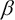

# 第八章. 异常检测与推荐

在本章中，我们将研究一些现代应用机器学习的形式。我们首先将探讨*异常检测*的问题，我们将在本章后面讨论*推荐系统*。

**异常检测**是一种机器学习技术，其中我们确定代表系统的某些选定特征的给定值集是否与给定特征的正常观察值意外不同。异常检测有几个应用，例如在制造业检测结构性和操作缺陷、网络入侵检测系统、系统监控和医疗诊断。

**推荐系统**本质上是信息系统，旨在预测特定用户对特定项目的喜好或偏好。近年来，已经建立了大量推荐系统，或称为**推荐器系统**，用于多个商业和社会应用，以提供更好的用户体验。这些系统可以根据用户之前评分或喜欢的项目向用户提供有用的推荐。今天，大多数现有的推荐系统都向用户提供有关在线产品、音乐和社交媒体的推荐。在网络上，也有大量使用推荐系统的金融和商业应用。

有趣的是，异常检测和推荐系统都是机器学习问题的应用形式，我们在这本书中之前已经遇到过。实际上，异常检测是二元分类的扩展，而推荐实际上是线性回归的扩展形式。我们将在本章中进一步研究这些相似之处。

# 检测异常

*异常检测*本质上是识别不符合预期模式的项目或观察值（更多信息，请参阅“异常检测方法综述”）。模式可以由先前观察到的值确定，也可以由输入值可以变化的某些限制确定。在机器学习的背景下，异常检测可以在监督和非监督环境中进行。无论哪种方式，异常检测的问题都是找到与其他输入值显著不同的输入值。这项技术有几种应用，从广义上讲，我们可以使用异常检测进行以下原因：

+   为了检测问题

+   为了检测新现象

+   为了监控异常行为

被发现与其他值不同的观察值被称为异常值、异常或例外。更正式地说，我们定义**异常值**为位于分布整体模式之外的观察值。通过“之外”，我们指的是与数据中其他部分有较高数值或统计距离的观察值。

以下图表可以描述一些异常的例子，其中红色十字表示正常观测值，绿色十字表示异常观测值：


异常检测的一个可能方法是使用一个**概率分布模型**，该模型由训练数据构建，用于检测异常。使用这种方法的技术被称为异常检测的**统计方法**。在这种情况下，异常相对于其余样本数据的整体概率分布将具有较低的几率。因此，我们尝试将模型拟合到可用的样本数据上，并使用这个构建的模型来检测异常。这种方法的主要问题是很难为随机数据找到一个标准的分布模型。

另一种可以用来检测异常的方法是**基于邻近度的方法**。在这种方法中，我们确定一组观测值相对于样本数据中其余值的邻近度或接近度。例如，我们可以使用**K-最近邻**（**KNN**）算法来确定给定观测值与其 k 个最近值之间的距离。这种技术比在样本数据上估计统计模型要简单得多。这是因为确定一个单一度量，即观测值的邻近度，比在可用的训练数据上拟合标准模型要容易。然而，对于大型数据集，确定一组输入值的邻近度可能效率低下。例如，KNN 算法的时间复杂度为，对于较大的 k 值，计算给定值与其 k 个最近值之间的邻近度可能效率低下。此外，KNN 算法可能对邻居 k 的值敏感。如果 k 的值太大，包含少于 k 个输入值集的值簇可能会被错误地分类为异常。另一方面，如果 k 的值太小，一些具有少量低邻近度邻居的异常可能不会被检测到。

我们还可以根据围绕给定观测值的数据密度来判断该观测值是否为异常。这种方法被称为异常检测的**基于密度的方法**。如果给定值周围的数据密度低，则给定的一组输入值可以被视为异常。在异常检测中，基于密度和基于邻近度的方法密切相关。实际上，数据的密度通常是根据给定值相对于其余数据的邻近度或距离来定义的。例如，如果我们使用 KNN 算法来确定给定值相对于其余数据的邻近度或距离，我们可以将密度定义为到最近的 k 个值的平均距离的倒数，如下所示：


*基于聚类的技术*也可以用于检测异常。本质上，聚类可以用来确定样本数据中的值组或簇。簇中的项目可以假设是紧密相关的，而异常是那些无法与样本数据中先前遇到的簇中的值相关联的值。因此，我们可以确定样本数据中的所有簇，并将最小的簇标记为异常。或者，我们可以从样本数据中形成簇，并确定给定的一组先前未见过的值的簇，如果有的话。

如果一组输入值不属于任何簇，那么它肯定是一个异常观测值。聚类技术的优点是它们可以与其他我们之前讨论过的机器学习技术结合使用。另一方面，这种方法的问题在于大多数聚类技术对选择的簇的数量很敏感。此外，聚类技术的算法参数，如簇中平均项目数和簇数，很难确定。例如，如果我们使用 KNN 算法对一些未标记的数据进行建模，簇数*K*可能需要通过试错法或通过仔细检查样本数据中的明显簇来确定。然而，这两种技术都不保证在未见过的数据上表现良好。

在那些样本值都应符合某个平均值并允许一定容忍度的模型中，通常使用**高斯**或**正态分布**作为分布模型来训练异常检测器。此模型有两个参数——均值和方差。这种分布模型常用于异常检测的统计方法中，其中输入变量通常在统计上接近某个预定的平均值。

**概率密度函数**（**PDF**）常被密度基异常检测方法使用。这个函数本质上描述了输入变量取某个给定值的可能性。对于随机变量*x*，我们可以正式定义 PDF 如下：


PDF 也可以与正态分布模型结合用于异常检测的目的。正态分布的 PDF 由分布的均值和方差参数化，并且可以正式表示如下：


我们现在将展示一个基于先前讨论的正态分布 PDF 的简单异常检测器在 Clojure 中的实现。对于这个例子，我们将使用 Clojure 原子来维护模型中的所有状态。原子用于在 Clojure 中表示原子状态。通过“原子”，我们指的是底层状态要么完全改变，要么完全不改变——因此状态的变化是“原子”的。

我们现在定义一些函数来帮助我们操作模型的特性。本质上，我们打算将这些特性和它们的值表示为一个地图。为了管理这个地图的状态，我们使用一个原子。每当异常检测器被提供一组特征值时，它必须首先检查新值集中关于特征的前置信息，然后它应该开始维护任何新特征的状态，当需要时。由于在 Clojure 中，一个函数本身不能包含任何外部状态，我们将使用闭包将状态和函数绑定在一起。在这个实现中，几乎所有的函数都返回其他函数，并且生成的异常检测器也将像函数一样使用。总之，我们将使用原子来模拟异常检测器的状态，然后使用闭包将这个原子绑定到一个函数上。

我们首先定义一个函数，该函数使用一些状态初始化我们的模型。这个状态本质上是一个通过使用`atom`函数包裹的地图，如下所示：

```py
(defn update-totals [n]
  (comp #(update-in % [:count] inc)
        #(update-in % [:total] + n)
        #(update-in % [:sq-total] + (Math/pow n 2))))

(defn accumulator []
  (let [totals (atom {:total 0, :count 0, :sq-total 0})]
    (fn [n]
      (let [result (swap! totals (update-totals n))
            cnt (result :count)
            avg (/ (result :total) cnt)]
        {:average avg
         :variance (- (/ (result :sq-total) cnt)
                      (Math/pow avg 2))}))))
```

在前面的代码中定义的`accumulator`函数初始化一个原子，并返回一个将`update-totals`函数应用于值`n`的函数。值`n`代表我们模型中输入变量的一个值。`update-totals`函数也返回一个接受单个参数的函数，然后它通过使用`update-in`函数更新原子中的状态。由`accumulator`函数返回的函数将使用`update-totals`函数来更新模型均值和方差的州。

我们现在实现以下用于正态分布的 PDF 函数，可用于监控模型特征值的突然变化：

```py
(defn density [x average variance]
  (let [sigma (Math/sqrt variance)
        divisor (* sigma (Math/sqrt (* 2 Math/PI)))
        exponent (/ (Math/pow (- x average) 2)
                    (if (zero? variance) 1
                        (* 2 variance)))]
    (/ (Math/exp (- exponent))
       (if (zero? divisor) 1
           divisor))))
```

在前面的代码中定义的`density`函数是正态分布 PDF 的直接翻译。它使用来自`Math`命名空间的功能和常数，如`sqrt`、`exp`和`PI`，通过使用模型的累积均值和方差来找到模型的 PDF。我们将定义`density-detector`函数，如下面的代码所示：

```py
 (defn density-detector []
  (let [acc (accumulator)]
    (fn [x]
      (let [state (acc x)]
        (density x (state :average) (state :variance))))))
```

在前面的代码中定义的`density-detector`函数使用`accumulator`函数初始化我们的异常检测器的状态，并使用累加器维护的状态上的`density`函数来确定模型的 PDF。

由于我们处理的是包裹在原子中的地图，我们可以通过使用`contains?`、`assoc-in`和`swap!`函数来实现几个函数来执行此检查，如下面的代码所示：

```py
 (defn get-or-add-key [a key create-fn]
  (if (contains? @a key)
    (@a key)
    ((swap! a #(assoc-in % [key] (create-fn))) key)))
```

在前面的代码中定义的 `get-or-add-key` 函数通过使用 `contains?` 函数在包含映射的原子中查找给定的键。注意使用 `@` 操作符来取消引用原子到其包装的值。如果在映射中找到键，我们只需将映射作为函数调用，即 `(@a key)`。如果没有找到键，我们使用 `swap!` 和 `assoc-in` 函数将新的键值对添加到原子中的映射中。此键值对的值是从传递给 `get-or-add-key` 函数的 `create-fn` 参数生成的。

使用我们定义的 `get-or-add-key` 和 `density-detector` 函数，我们可以实现以下函数，这些函数在检测样本数据中的异常时返回函数，从而在这些函数本身中创建维护模型 PDF 分布状态的效果：

```py
(defn atom-hash-map [create-fn]
  (let [a (atom {})]
    (fn [x]
      (get-or-add-key a x create-fn))))

(defn get-var-density [detector]
  (fn [kv]
    (let [[k v] kv]
      ((detector k) v))))

(defn detector []
  (let [detector (atom-hash-map density-detector)]
    (fn [x]
      (reduce * (map (get-var-density detector) x)))))
```

在前面的代码中定义的 `atom-hash-map` 函数使用 `get-key` 函数和一个任意的初始化函数 `create-fn` 来在原子中维护映射的状态。检测函数使用我们之前定义的 `density-detector` 函数来初始化输入值中每个新特征的初始状态。请注意，此函数返回一个函数，该函数将接受带有键值参数的映射作为特征。我们可以在以下代码和输出中检查实现的异常检测器的行为：

```py
user> (def d (detector))
#'user/d
user> (d {:x 10 :y 10 :z 10})
1.0
user> (d {:x 10 :y 10 :z 10})
1.0
```

如前述代码和输出所示，我们通过使用 `detector` 函数创建了一个新的异常检测器实例。`detector` 函数返回一个函数，该函数接受特征键值对的映射。当我们用 `{:x 10 :y 10 :z 10}` 向映射提供数据时，异常检测器返回 PDF 为 `1.0`，因为到目前为止数据中的所有样本都具有相同的特征值。只要所有样本输入中的特征数量和这些特征值保持不变，异常检测器将始终返回此值。

当我们向异常检测器提供具有不同值的特征集时，PDF 观察到变为有限数值，如下面的代码和输出所示：

```py
user> (d {:x 11 :y 9 :z 15})
0.0060352535208831985
user> (d {:x 10 :y 10 :z 14})
0.07930301229115849
```

当特征显示出很大的变化时，检测器在其分布模型的 PDF 中会有突然和大幅度的下降，如下面的代码和输出所示：

```py
user> (d {:x 100 :y 10 :z 14})
1.9851385000301642E-4
user> (d {:x 101 :y 9 :z 12})
5.589934974999084E-4
```

总结来说，当之前描述的异常检测器返回的正常分布模型的 PDF 与其先前值有较大差异时，可以检测到异常样本值。我们可以扩展此实现以检查某种阈值值，以便结果被量化。因此，系统仅在 PDF 的此阈值值被越过时检测到异常。在处理现实世界数据时，我们只需以某种方式表示我们正在建模的特征值作为映射，并通过试错法确定要使用的阈值值。

异常检测可以用于监督学习和无监督机器学习环境。在监督学习中，样本数据将被标记。有趣的是，我们还可以使用二元分类等监督学习技术来模拟这类数据。我们可以通过以下指南在异常检测和分类之间选择来模拟标记数据：

+   当样本数据中正例和负例的数量几乎相等时，选择二元分类。相反，如果训练数据中正例或负例的数量非常少，则选择异常检测。

+   选择异常检测，当训练数据中有许多稀疏类别和少数密集类别时。

+   当训练模型可能遇到的正样本将与模型已经看到的正样本相似时，选择监督学习技术，如分类。

# 构建推荐系统

推荐系统是信息过滤系统，其目标是向用户提供有用的推荐。为了确定这些推荐，推荐系统可以使用关于用户活动的历史数据，或者它可以使用其他用户喜欢的推荐（更多信息，请参阅“互联网上推荐代理的分类”）。这两种方法构成了推荐系统使用的两种类型算法的基础——**基于内容的过滤**和**协同过滤**。有趣的是，一些推荐系统甚至使用这两种技术的组合来向用户提供推荐。这两种技术都旨在向用户推荐项目，或由以用户为中心的应用程序管理或交换的领域对象。这类应用包括提供在线内容和信息的多个网站，例如在线购物和媒体。

在**基于内容的过滤**中，推荐是通过使用特定用户的评分来找到相似项目来确定的。每个项目都表示为一组离散的特征或特性，每个项目也被几个用户评分。因此，对于每个用户，我们都有几组输入变量来表示每个项目的特征，以及一组输出变量来表示用户对该项目的评分。这些信息可以用来推荐具有与之前评分的项目相似特征或特性的项目。

*协同过滤*方法基于收集关于特定用户的行为、活动或偏好的数据，并使用这些信息向用户推荐项目。推荐基于用户的行为与其他用户行为相似的程度。实际上，用户的推荐基于她的过去行为以及系统中其他用户所做的决策。协同过滤技术将使用类似用户的偏好来确定系统中所有可用项目的特征，然后它会推荐具有相似特征的项目，这些特征是观察到的特定用户群体所喜欢的。

# 基于内容的过滤

如我们之前提到的，基于内容的过滤系统为用户提供基于他们过去行为以及特定用户积极评价或喜欢的项目特征的推荐。我们还可以考虑特定用户不喜欢的项目。一个项目通常由几个离散属性表示。这些属性类似于分类或基于线性回归的机器学习模型的输入变量或特征。

例如，假设我们想要构建一个推荐系统，该系统使用基于内容的过滤来向其用户推荐在线产品。每个产品都可以通过几个已知特征来表征和识别，并且用户可以为每个产品的每个特征提供评分。产品的特征值可以在 0 到 10 之间，用户为产品提供的评分将在 0 到 5 的范围内。我们可以通过以下表格表示来可视化此推荐系统的样本数据：


在前一个表中，系统有个产品以及个用户。每个产品由个特征定义，每个特征都将有一个在 0 到 10 之间的值，并且每个产品也会被用户评分。设用户对产品的评分表示为。使用输入值，或者说输入向量，以及用户的评分，我们可以估计一个参数向量，我们可以使用它来预测用户的评分。因此，基于内容的过滤实际上将线性回归的副本应用于每个用户的评分和每个产品的特征值，以估计一个回归模型，该模型反过来可以用来估计一些未评分产品的用户评分。实际上，我们使用独立变量和因变量以及系统中所有用户来学习参数。使用估计的参数和一些独立变量的给定值，我们可以预测任何给定用户的因变量值。因此，基于内容的过滤的优化问题可以表示如下：


在前一个方程中定义的优化问题可以应用于系统的所有用户，以产生以下针对 Uusers 的优化问题：


简而言之，参数向量试图缩放或转换输入变量以匹配模型的输出变量。添加的第二项是为了*正则化*。有趣的是，在递减方程中定义的优化问题与线性回归类似，因此基于内容的过滤可以被视为线性回归的扩展。

基于内容的过滤的关键问题是给定的推荐系统是否能够从用户的偏好或评分中学习。可以通过要求用户对系统中他们喜欢的项目进行评分来使用直接反馈，尽管这些评分也可以从用户的历史行为中隐含得出。此外，为特定用户和特定项目类别训练的基于内容的过滤系统不能用来预测同一用户对其他类别项目的评分。例如，使用用户对新闻的偏好来预测用户对在线购物产品的喜好是一个难题。

# 协同过滤

另一种主要的推荐形式是**协同过滤**，在这种形式中，分析具有相似兴趣的多个用户的行为数据，并用于预测这些用户的推荐。这种技术的主要优势是系统不依赖于其项目特征变量的值，因此这样的系统不需要了解它提供的项目的特征。实际上，项目的特征是通过使用用户对项目的评分和系统用户的行怍动态确定的。我们将在本节的后面部分更详细地探讨这种优势。

协同过滤模型使用的关键部分依赖于其用户的行为。为了构建模型的一部分，我们可以使用以下方法以显式方式确定模型中项目的用户评分：

+   要求用户对项目进行特定尺度的评分

+   要求用户将项目标记为收藏夹

+   向用户展示少量项目，并要求他们根据对项目的喜好或厌恶程度进行排序

+   要求用户创建他们喜欢的项目或项目类型的列表。

或者，这些信息也可以通过用户的活动以隐式的方式收集。以下是一些使用给定项目或产品集建模系统用户行为的示例方法：

+   观察用户查看的项目

+   分析特定用户查看特定项目的次数

+   分析用户的社会网络，并发现具有相似兴趣的用户

例如，考虑一个在线购物推荐系统，这是我们之前章节讨论过的。我们可以使用协同过滤动态确定产品的特征值，并预测用户可能感兴趣的产品。使用以下表格可以可视化此类使用协同过滤的系统样本数据：


在前表中显示的数据中，产品的特征是未知的。唯一可用的数据是用户的评分和用户的行为模型。

协同过滤和产品用户的优化问题可以表达如下：


前面的方程式被视为我们为基于内容的过滤定义的优化问题的逆。不是估计参数向量，协同过滤试图确定产品的特征值。同样，我们可以如下定义多个用户的优化问题：


使用协同过滤，我们可以估计产品的特征，，然后使用这些特征值来改进用户的行为模型。改进的用户行为模型可以再次用于生成物品的更好的特征值。这个过程然后重复进行，直到特征值和行为模型收敛到某些适当的值。

### 注意

注意，在这个过程中，算法从未需要知道其物品的初始特征值，它只需要最初估计用户的行为模型，以便为用户提供有用的推荐。

在某些特殊情况下，协同过滤也可以与基于内容的过滤相结合。这种方法被称为推荐系统的**混合方法**。我们可以以几种方式结合或混合两种推荐模型，具体如下：

+   两个模型的结果可以通过加权方式在数值上进行组合

+   在给定时间可以选择这两个模型中的任何一个

+   向用户展示两个模型推荐结果的组合

# 使用 Slope One 算法

我们现在将研究协同过滤的 Slope One 算法。此外，我们还将展示如何在 Clojure 中简洁地实现它。

Slope One 算法是*基于物品的协同过滤*最简单形式之一，它本质上是一种协同过滤技术，其中用户明确地对每个他们喜欢的物品进行评分（更多信息，请参阅*基于在线评分的协同过滤的 Slope One 预测器*）。通常，基于物品的协同过滤技术将使用用户的评分和过去用户的行为来估计每个用户的简单回归模型。因此，我们为系统中的所有用户估计一个函数。

Slope One 算法使用一个更简单的预测器  来模拟用户的回归行为模式，因此计算成本更低。参数  可以通过计算两个项目之间用户评分的差异来估计。由于 Slope One 算法的定义简单，它可以轻松高效地实现。有趣的是，这个算法比其他协同过滤技术更不容易过拟合。

考虑一个简单的推荐系统，包含两个项目和两个用户。我们可以用以下表格来可视化这些样本数据：


在前面表格中显示的数据中，可以通过使用 **用户 1** 提供的评分来找到 **项目 A** 和 **项目 B** 之间的评分差异。这个差异是 。因此，我们可以将这个差异加到 **用户 2** 对 **项目 A** 的评分上，以预测他对 **项目 B** 的评分，这个评分等于 。

让我们将前面的例子扩展到三个项目和三个用户。这个数据对应的表格可以可视化如下：


在这个例子中，**项目 A** 和 **项目 B** 之间对于 **用户 2** (-1) 和 **用户 1** (+2) 的评分差异的平均值是 。因此，平均而言，**项目 A** 的评分比 **项目 B** 高 。同样，**项目 A** 和 **项目 C** 之间的平均评分差异是 。我们可以使用 **用户 3** 对 **项目 B** 的评分以及 **项目 A** 和 **项目 B** 的评分差异的平均值来预测 **用户 3** 对 **项目 A** 的评分。这个值是 。

现在我们将描述一个简洁的 Slope One 算法在 Clojure 中的实现。首先，我们需要定义我们的样本数据。这可以通过使用嵌套映射来完成，如下面的代码所示：

```py
(def ? nil)
(def data
  {"User 1" {"Item A" 5 "Item B" 3 "Item C" 2 "Item D" ?}
   "User 2" {"Item A" 3 "Item B" 4 "Item C" ? "Item D" 4}
   "User 3" {"Item A" ? "Item B" 2 "Item C" 5 "Item D" 3}
   "User 4" {"Item A" 4 "Item B" ? "Item C" 3 "Item D" ?}})
```

在前面显示的代码中，我们将值 `nil` 绑定到 `?` 符号上，并使用它来定义嵌套映射 `data`，其中每个键代表一个用户，其值代表一个映射，该映射以项目名称作为键，包含用户的评分。我们将定义以下一些实用方法来帮助我们操作由 `data` 表示的嵌套映射：

```py
(defn flatten-to-vec [coll]
  (reduce #(apply conj %1 %2)
          []
          coll))
```

前面代码中定义的 `flatten-to-vec` 函数简单地将映射转换为平面向量，使用 `reduce` 和 `conj` 函数。我们也可以通过使用标准 `vec`、`flatten` 和 `seq` 函数的功能组合来定义 `flatten-to-vec`，即 `(def flatten-to-vec (comp vec flatten seq))`。由于我们处理的是映射，我们可以定义以下一些函数，将任何函数映射到这些映射的值：

```py
(defn map-vals [f m]
  (persistent!
    (reduce (fn [m [k v]]
              (assoc! m k (f k v)))
            (transient m) m)))

(defn map-nested-vals [f m]
  (map-vals
   (fn [k1 inner-map]
     (map-vals
      (fn [k2 val] (f [k1 k2] val)) inner-map)) m))
```

前面代码中定义的 `map-vals` 函数可以用来修改给定映射的值。此函数使用 `assoc!` 函数替换映射中给定键存储的值，并使用 `reduce` 函数组合并应用 `assoc!` 函数到映射中的所有键值对。在 Clojure 中，大多数集合，包括映射，都是持久和不可变的。注意使用 `transient` 函数将持久和不可变的映射转换为可变的，以及使用 `persistent!` 函数将瞬态可变集合转换为持久的。通过隔离修改，该函数的性能得到提高，同时保留了使用此函数的代码不可变性的保证。前面代码中定义的 `map-nested-vals` 函数简单地将 `map-vals` 函数应用于嵌套映射的第二级值。

我们可以在 REPL 中检查 `map-vals` 和 `map-nested-vals` 函数的行为，如下所示：

```py
user> (map-vals #(inc %2) {:foo 1 :bar 2})
{:foo 2, :bar 3}

user> (map-nested-vals (fn [keys v] (inc v)) {:foo {:bar 2}})
{:foo {:bar 3}}
```

如前一个 REPL 输出所示，`inc` 函数被应用于映射 `{:foo 1 :bar 2}` 和 `{:foo {:bar 3}}` 的值。我们现在定义一个函数，通过使用 Slope One 算法从样本数据生成一个训练模型，如下所示：

```py
(defn train [data]
  (let [diff-map      (for [[user preferences] data]
                        (for [[i u-i] preferences
                              [j u-j] preferences
                              :when (and (not= i j)
                                         u-i u-j)]
                          [[i j] (- u-i u-j)]))
        diff-vec      (flatten-to-vec diff-map)
        update-fn     (fn [[freqs-so-far diffs-so-far]
                           [item-pair diff]]
                        [(update-in freqs-so-far
                                    item-pair (fnil inc 0))
                         (update-in diffs-so-far
                                    item-pair (fnil + 0) diff)])
        [freqs
         total-diffs] (reduce update-fn
                              [{} {}] diff-vec)
        differences   (map-nested-vals
                       (fn [item-pair diff]
                         (/ diff (get-in freqs item-pair)))
                       total-diffs)]
    {:freqs freqs
     :differences differences}))
```

前面代码中定义的 `train` 函数首先使用 `for` 宏找出模型中所有项目的评分差异，然后使用 `update-fn` 封闭调用添加项目的评分频率及其评分差异。

### 注意

函数和宏之间的主要区别在于，宏在执行时不会评估其参数。此外，宏在编译时解析和展开，而函数在运行时调用。

`update-fn`函数使用`update-in`函数来替换映射中的一个键的值。注意`fnil`函数的使用，它本质上返回一个检查值`nil`并将其替换为第二个参数的函数。这用于处理在嵌套映射数据中表示的由`?`符号表示的值，该符号在嵌套映射中的值为`nil`。最后，`train`函数将`map-nested-vals`和`get-in`函数应用于前一步返回的评分差异映射。最后，它返回一个包含`:freqs`和`:differences`键的映射，这些键包含表示项目频率和相对于模型中其他项目的评分差异的映射。现在我们可以使用这个训练好的模型来预测不同用户对给定项目的评分。为此，我们将在以下代码中实现一个函数，该函数使用前一个代码中定义的`train`函数返回的值：

```py
(defn predict [{:keys [differences freqs]
                :as model}
               preferences
               item]
  (let [get-rating-fn (fn [[num-acc denom-acc]
                           [i rating]]
                        (let [freqs-ji (get-in freqs [item i])]
                          [(+ num-acc
                              (* (+ (get-in differences [item i])
                                    rating)
                                 freqs-ji))
                           (+ denom-acc freqs-ji)]))]
    (->> preferences
         (filter #(not= (first %) item))
         (reduce get-rating-fn [0 0])
         (apply /))))
```

前一个代码中定义的`predict`函数使用`get-in`函数检索由`train`函数返回的映射中每个项目的频率和差异的总和。然后，该函数通过使用`reduce`和`/`（除法）函数的组合来平均这些评分差异。`predict`函数的行为可以在 REPL 中检查，如下面的代码所示：

```py
user> (def trained-model (train data))
#'user/trained-model
user> (predict trained-model {"Item A" 2} "Item B")
3/2
```

如前一个 REPL 输出所示，`predict`函数使用了`train`函数返回的值来预测一个给过`Item A`评分为`2`的用户对`Item B`的评分。`predict`函数估计`Item B`的评分为`3/2`。现在我们可以在以下代码中实现一个函数，该函数封装`predict`函数以找到模型中所有项目的评分：

```py
(defn mapmap
  ([vf s]
     (mapmap identity vf s))
  ([kf vf s]
     (zipmap (map kf s)
             (map vf s))))

(defn known-items [model]
  (-> model :differences keys))

(defn predictions
  ([model preferences]
     (predictions
      model
      preferences
      (filter #(not (contains? preferences %))
              (known-items model))))
  ([model preferences items]
     (mapmap (partial predict model preferences)
             items)))
```

前一个代码中定义的`mapmap`函数简单地将两个函数应用于给定的序列，并返回一个映射，其键由第一个函数`kf`创建，其值由第二个函数`vf`生成。如果将单个函数传递给`mapmap`函数，它将使用`identity`函数生成映射返回的键。前一个代码中定义的`known-items`函数将使用映射的键函数确定模型中的所有项目，该映射由`train`函数返回的值中的`:differences`键表示。最后，`predictions`函数使用`train`和`known-items`函数返回的值来确定模型中的所有项目，然后预测特定用户的所有未评分项目。该函数还接受一个可选的第三个参数，即要预测评分的项目名称的向量，以便返回向量`items`中存在的所有项目的预测。

现在，我们可以在 REPL 中检查前面函数的行为，如下所示：

```py
user> (known-items trained-model)
("Item D" "Item C" "Item B" "Item A")
```

如前述输出所示，`known-items`函数返回模型中所有项目的名称。现在我们可以尝试使用 predictions 函数，如下所示：

```py
user> (predictions trained-model {"Item A" 2} ["Item C" "Item D"])
{"Item D" 3, "Item C" 0}
user> (predictions trained-model {"Item A" 2})
{"Item B" 3/2, "Item C" 0, "Item D" 3}
```

注意，当我们跳过`predictions`函数的最后一个可选参数时，该函数返回的映射将包含所有尚未被特定用户评价的项目。这可以通过在 REPL 中使用`keys`函数来验证，如下所示：

```py
user> (keys  (predictions trained-model {"Item A" 2}))
("Item B" "Item C" "Item D")
```

总结来说，我们展示了如何使用嵌套映射和标准 Clojure 函数实现 Slope One 算法。

# 摘要

在本章中，我们讨论了异常检测和推荐。我们还实现了一个简单的异常检测器和推荐引擎。本章涵盖的主题可以总结如下：

+   我们探讨了异常检测以及如何使用 Clojure 中的 PDF 实现异常检测器。

+   我们研究了使用基于内容和协同过滤技术的推荐系统。我们还研究了这些技术中的各种优化问题。

+   我们还研究了 Slope One 算法，这是一种协同过滤的形式，并描述了该算法的简洁实现。

在下一章中，我们将讨论更多可以应用于大型和复杂以数据为中心的应用的机器学习技术的应用。
