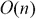
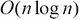
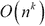
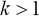
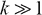
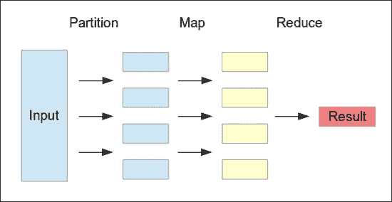
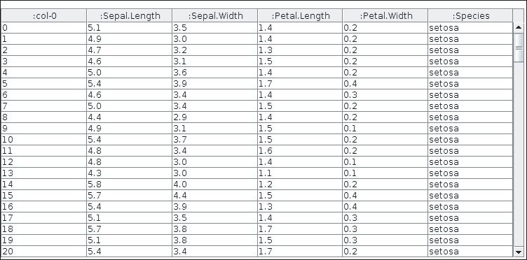
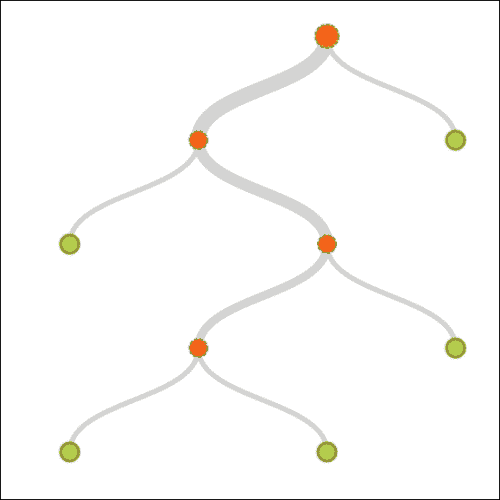
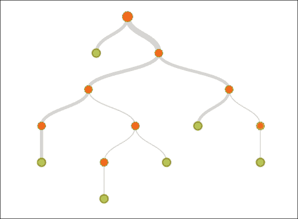

# 第九章 大规模机器学习

在本章中，我们将探讨一些处理大量数据以训练机器学习模型的方法。在本章的后半部分，我们还将演示如何使用基于云的服务进行机器学习。

# 使用 MapReduce

在数据并行性的背景下，经常遇到的一种数据处理方法是**MapReduce**。这种技术灵感来源于函数式编程中的**map**和**reduce**函数。尽管这些函数作为理解算法的基础，但 MapReduce 的实际实现更侧重于扩展和分布数据处理。目前有几种活跃的 MapReduce 实现，例如 Apache Hadoop 和 Google Bigtable。

MapReduce 引擎或程序由一个函数组成，该函数在可能非常大的数据集的给定记录上执行一些处理（更多信息，请参阅“多核机器学习中的 Map-Reduce”）。这个函数代表了算法的`Map()`步骤。这个函数应用于数据集中的所有记录，然后结果被合并。提取结果的后续步骤被称为算法的`Reduce()`步骤。为了在大数据集上扩展此过程，首先将提供给`Map()`步骤的输入数据分区，然后在不同的计算节点上处理。这些节点可能位于不同的机器上，也可能不在，但给定节点执行的处理与其他节点在系统中的处理是独立的。

一些系统采用不同的设计，其中代码或查询被发送到包含数据的节点，而不是相反。这个步骤，即对输入数据进行分区，然后将查询或数据转发到不同的节点，被称为算法的`Partition()`步骤。总结来说，这种处理大数据集的方法与传统方法大相径庭，传统方法尽可能快地迭代整个数据。

MapReduce 比其他方法具有更好的可扩展性，因为输入数据的分区可以在物理上不同的机器上独立处理，然后稍后合并。这种可扩展性的提升不仅是因为输入被分配到多个节点，还因为复杂性的内在降低。对于大的问题空间，一个 NP 难问题无法解决，但如果问题空间较小，则可以解决。

对于具有或算法复杂度的问题，实际上将问题空间分区会增加解决给定问题所需的时间。然而，如果算法复杂度是，其中，那么将问题空间分区将减少解决问题所需的时间。在 NP-hard 问题的情况下，。因此，通过分区问题空间，MapReduce 减少了解决 NP-hard 问题所需的时间（更多信息，请参阅*评估 MapReduce 在多核和多处理器系统中的应用*）。

MapReduce 算法可以用以下图示说明：



在前面的图中，输入数据首先被分区，然后在`Map()`步骤中独立处理每个分区。最后，在`Reduce()`步骤中将结果合并。

我们可以用 Clojure 伪代码简洁地定义 MapReduce 算法，如下面的代码所示：

```py
(defn map-reduce [f partition-size coll]
  (->> coll
       (partition-all partition-size)   ; Partition
       (pmap f)                         ; Parallel Map
       (reduce concat)))                ; Reduce
```

在之前的代码中定义的`map-reduce`函数使用标准的`pmap`（并行映射的缩写）函数将函数`f`的应用分配给多个处理器（或线程）。输入数据，由集合`coll`表示，首先使用`partition-all`函数进行分区，然后使用`pmap`函数并行地将函数`f`应用于每个分区。然后使用标准`reduce`和`concat`函数的组合将这个`Map()`步骤的结果合并。请注意，这是由于每个数据分区都是一个序列，因此`pmap`函数将返回一个分区的序列，可以连接或连接成一个单一的序列以产生计算的结果。

当然，这只是一个关于 MapReduce 算法核心的理论解释。实际的实现往往更关注于在多台机器之间分配处理，而不是在之前代码中定义的`map-reduce`函数中的多个处理器或线程之间。

# 查询和存储数据集

当处理大量数据集时，能够根据一些任意条件查询数据是非常有用的。此外，将数据存储在数据库中而不是平面文件或内存资源中更为可靠。Incanter 库为我们提供了几个有用的函数来执行这些操作，我们将在接下来的代码示例中展示。

### 注意

在即将到来的示例中使用的 Incanter 库和 MongoDB 驱动程序可以通过将以下依赖项添加到`project.clj`文件中来添加到 Leiningen 项目中：

```py
[congomongo "0.4.1"]
[incanter "1.5.4"]
```

对于即将到来的示例，命名空间声明应类似于以下声明：

```py
(ns my-namespace
  (:use incanter.core
        [incanter.mongodb   :only [insert-dataset
                                   fetch-dataset]]
        [somnium.congomongo :only [mongo!]]
        [incanter.datasets  :only [get-dataset]]))
```

此外，此示例需要 MongoDB 已安装并运行。

对于这个示例，我们将使用 Iris 数据集，可以使用 `incanter.datasets` 命名空间中的 `get-dataset` 函数获取。代码如下：

```py
(def iris (get-dataset :iris))
```

如前代码所示，我们只需将 Iris 数据集绑定到一个变量 `iris`。我们可以使用 `with-data` 函数对这个数据集执行各种操作。要查看数据，我们可以使用 `view` 函数结合 `with-data` 函数来提供数据集的表格表示，如下代码所示：

```py
user> (with-data iris
        (view (conj-cols (range (nrow $data)) $data)))
```

`$data` 变量是一个特殊绑定，可以在 `with-data` 函数的作用域内表示整个数据集。在前面的代码中，我们通过 `conj-cols`、`nrows` 和 `range` 函数的组合向数据中添加一个额外的列来表示记录的行号。然后使用 `view` 函数以类似电子表格的表格形式显示数据。前面的代码生成了以下表格，表示数据集：



我们还可以使用 `with-data` 函数作用域内的 `$` 函数从原始数据集中选择我们感兴趣的列，如下代码所示：

```py
user> (with-data iris ($ [:Species :Sepal.Length]))

|   :Species | :Sepal.Length |
|------------+---------------|
|     setosa |           5.1 |
|     setosa |           4.9 |
|     setosa |           4.7 |
  ...
|  virginica |           6.5 |
|  virginica |           6.2 |
|  virginica |           5.9 |
```

在前面所示的代码示例中，`$` 函数从 `iris` 数据集中选择了 `:Species` 和 `:Sepal.Length` 列。我们还可以使用 `$where` 函数根据条件过滤数据，如下代码所示：

```py
user> (with-data iris ($ [:Species :Sepal.Length]
                         ($where {:Sepal.Length 7.7})))

|  :Species | :Sepal.Length |
|-----------+---------------|
| virginica |           7.7 |
| virginica |           7.7 |
| virginica |           7.7 |
| virginica |           7.7 |
```

前面的示例使用 `$where` 函数查询 `iris` 数据集中 `:Sepal.Length` 列等于 `7.7` 的记录。我们还可以在传递给 `$where` 函数的映射中使用 `:$gt` 和 `:$lt` 符号来指定值的上下限，如下代码所示：

```py
user> (with-data iris ($ [:Species :Sepal.Length]
                         ($where {:Sepal.Length {:$gt 7.0}})))

|  :Species | :Sepal.Length |
|-----------+---------------|
| virginica |           7.1 |
| virginica |           7.6 |
| virginica |           7.3 |
  ...
| virginica |           7.2 |
| virginica |           7.2 |
| virginica |           7.4 |
```

前面的示例检查具有大于 `7` 的 `:Sepal.Length` 属性值的记录。要检查列的值是否在给定的范围内，我们可以在传递给 `$where` 函数的映射中指定 `:$gt` 和 `:$lt` 键，如下代码所示：

```py
user> (with-data iris ($ [:Species :Sepal.Length]
                         ($where {:Sepal.Length
                                  {:$gt 7.0 :$lt 7.5}})))

|  :Species  |:Sepal.Length |
|------------+--------------|
| virginica  |          7.1 |
| virginica  |          7.3 |
| virginica  |          7.2 |
| virginica  |          7.2 |
| virginica  |          7.2 |
| virginica  |          7.4 |
```

前面的示例检查具有 `7.0` 到 `7.5` 范围内的 `:Sepal.Length` 属性值的记录。我们还可以使用 `$:in` 键指定一组离散值，例如在表达式 `{:$in #{7.2 7.3 7.5}}` 中。Incanter 库还提供了其他几个函数，如 `$join` 和 `$group-by`，可以用来表达更复杂的查询。

Incanter 库提供了操作 MongoDB 的函数，以持久化和检索数据集。MongoDB 是一个非关系型文档数据库，允许存储具有动态模式的 JSON 文档。要连接到 MongoDB 实例，我们使用 `mongo!` 函数，如下代码所示：

```py
user> (mongo! :db "sampledb")
true
```

在前面的代码中，数据库名称 `sampledb` 作为关键字参数指定给 `mongo!` 函数的 `:db` 键。我们还可以分别使用 `:host` 和 `:port` 关键字参数指定要连接的实例的主机名和端口号。

我们可以使用`incanter.mongodb`命名空间中的`insert-dataset`函数将数据集存储在连接的 MongoDB 实例中。不幸的是，MongoDB 不支持使用点字符（.）作为列名，因此我们必须更改`iris`数据集中的列名，才能成功使用`insert-dataset`函数存储它。可以使用`col-names`函数替换列名，如下面的代码所示：

```py
user> (insert-dataset
:iris (col-names iris [:SepalLength
:SepalWidth
:PetalLength
:PetalWidth
:Species]))
```

之前的代码在替换列名中的点字符后，将`iris`数据集存储在 MongoDB 实例中。

### 注意

注意，数据集将被存储在`sampledb`数据库中名为`iris`的集合中。此外，MongoDB 将为存储在数据库中的数据集中的每条记录分配一个基于哈希的 ID。此列可以使用`:_id`关键字引用。

要从数据库中检索数据集，我们使用`fetch-dataset`函数，如下面的代码所示。此函数返回的值可以直接由`with-data`函数使用，以查询和查看检索到的数据集。

```py
user> (with-data (fetch-dataset :iris) ($ [:Species :_id]
                                          ($where {:SepalLength
                                                   {:$gt 7}})))

|  :Species |                     :_id |
|-----------+--------------------------|
| virginica | 52ebcc1144ae6d6725965984 |
| virginica | 52ebcc1144ae6d6725965987 |
| virginica | 52ebcc1144ae6d6725965989 |
  ...
| virginica | 52ebcc1144ae6d67259659a0 |
| virginica | 52ebcc1144ae6d67259659a1 |
| virginica | 52ebcc1144ae6d67259659a5 |
```

我们也可以在存储我们的数据集之后，使用`mongo`客户端检查数据库，如下面的代码所示。正如我们提到的，我们的数据库名为`sampledb`，我们必须使用`use`命令选择此数据库，如下面的终端输出所示：

```py
$ mongo
MongoDB shell version: 2.4.6
connecting to: test
Server has startup warnings:
...

> use sampledb
switched to db sampledb
```

我们可以使用`show collections`命令查看数据库中的所有集合。查询可以通过在变量`db`实例的适当属性上执行`find()`函数来执行，如下面的代码所示：

```py
> show collections
iris
system.indexes
>
> db.iris.find({ SepalLength: 5})

{ "_id" : ObjectId("52ebcc1144ae6d6725965922"),
  "Species" : "setosa",
  "PetalWidth" : 0.2,
  "PetalLength" : 1.4,
  "SepalWidth" : 3.6,
  "SepalLength" : 5 }
{ "_id" : ObjectId("52ebcc1144ae6d6725965925"),
  "Species" : "setosa",
  "PetalWidth" : 0.2,
  "PetalLength" : 1.5,
  "SepalWidth" : 3.4,
  "SepalLength" : 5 }

...
```

总结来说，Incanter 库为我们提供了足够的工具来查询和存储数据集。此外，MongoDB 可以通过 Incanter 库轻松地用于存储数据集。

# 云端机器学习

在基于网络和云服务的现代，也可以将数据集和机器学习模型持久化到在线云存储中。当处理大量数据时，这是一个很好的解决方案，因为云解决方案负责处理大量数据的存储和处理。

**BigML** ([`bigml.com/`](http://bigml.com/)) 是一个机器学习资源的云提供商。BigML 内部使用**分类和回归树**（**CARTs**），这是决策树的一种特殊化（更多信息，请参阅*Top-down induction of decision trees classifiers-a survey*），作为机器学习模型。

BigML 为开发者提供了一个简单的 REST API，可以用于从任何可以发送 HTTP 请求的语言或平台中与该服务交互。该服务支持多种文件格式，如**CSV**（逗号分隔值）、Excel 电子表格和 Weka 库的 ARFF 格式，还支持多种数据压缩格式，如 TAR 和 GZIP。此服务还采用白盒方法，即在模型可以下载用于本地使用的同时，还可以通过在线 Web 界面使用模型进行预测。

BigML 在几种语言中都有绑定，我们将在本节中演示 BigML 的 Clojure 客户端库。与其他云服务一样，BigML 的用户和开发者必须首先注册账户。然后，他们可以使用这个账户和提供的 API 密钥通过客户端库访问 BigML。一个新的 BigML 账户提供了一些示例数据集以供实验，包括我们在本书中经常遇到的 Iris 数据集。

BigML 账户的仪表板提供了一个简单的基于 Web 的用户界面，用于账户可用的所有资源。


BigML 资源包括来源、数据集、模型、预测和评估。我们将在接下来的代码示例中讨论这些资源中的每一个。

### 注意

可以通过在`project.clj`文件中添加以下依赖项将 BigML Clojure 库添加到 Leiningen 项目中：

```py
[bigml/clj-bigml "0.1.0"]
```

对于即将到来的示例，命名空间声明应类似于以下声明：

```py
(ns my-namespace
  (:require [bigml.api [core :as api]
             [source :as source]
             [dataset :as dataset]
             [model :as model]
             [prediction :as prediction]
             [evaluation :as evaluation]]))
```

首先，我们必须为 BigML 服务提供认证详情。这是通过使用`bigml.api`命名空间中的`make-connection`函数来完成的。我们必须向`make-connection`函数提供用户名、API 密钥和一个标志，指示我们是否使用开发或生产数据集，如下面的代码所示。请注意，此用户名和 API 密钥将显示在您的 BigML 账户页面上。

```py
(def default-connection
  (api/make-connection
   "my-username"                               ; username
   "a3015d5fa2ee19604d8a69335a4ac66664b8b34b"  ; API key
   true))
```

要使用之前代码中定义的`default-connection`连接，我们必须使用`with-connection`函数。我们可以通过使用一个简单的宏来避免重复使用带有`default-connection`变量的`with-connection`函数，如下面的代码所示：

```py
(defmacro with-default-connection [& body]
  '(api/with-connection default-connection
     ~@body))
```

实际上，使用`with-default-connection`与使用带有`default-connection`绑定的`with-connection`函数一样好，从而帮助我们避免代码重复。

BigML 有一个表示可以转换为训练数据的资源的概念。BigML 支持本地文件、远程文件和内联代码资源作为来源，并支持多种数据类型。要创建资源，我们可以使用`bigml.source`命名空间中的`create`函数，如下面的代码所示：

```py
(def default-source
  (with-default-connection
    (source/create [["Make"  "Model"   "Year" "Weight" "MPG"]
                    ["AMC"   "Gremlin" 1970   2648     21]
                    ["AMC"   "Matador" 1973   3672     14]
                    ["AMC"   "Gremlin" 1975   2914     20]
                    ["Honda" "Civic"   1974   2489     24]
                    ["Honda" "Civic"   1976   1795     33]])))
```

在前代码中，我们使用一些内联数据定义了一个源。实际上，这些数据是一组各种汽车模型的特征，例如它们的制造年份和总重量。最后一个特征是汽车模型的里程或 MPG。按照惯例，BigML 源将最后一列视为机器学习模型的输出或目标变量。

我们现在必须将源转换为 BigML 数据集，这是一个源原始数据的结构化和索引表示。数据集中的每个特征都被分配一个唯一的整数 ID。然后，可以使用此数据集来训练一个机器学习 CART 模型，在 BigML 术语中简单地称为模型。我们可以使用`dataset/create`和`model/create`函数分别创建数据集和模型，如下代码所示。此外，我们还将不得不使用`api/get-final`函数来最终化已发送到 BigML 云服务进行处理的资源。

```py
(def default-dataset
  (with-default-connection
    (api/get-final (dataset/create default-source))))

(def default-model
  (with-default-connection
    (api/get-final (model/create default-dataset))))
```

BigML 还提供了一个训练好的 CART 模型的交互式可视化。对于我们的训练数据，以下可视化被生成：



现在我们可以使用训练好的模型来预测输出变量的值。每次预测都存储在 BigML 云服务中，并在仪表板的**预测**选项卡中显示。这是通过`bigml.prediction`命名空间中的`create`函数完成的，如下代码所示：

```py
(def default-remote-prediction
  (with-default-connection
    (prediction/create default-model [1973 3672])))
```

在前代码中，我们尝试通过向`prediction/create`函数提供制造年份和汽车重量来预测汽车模型的 MPG（每加仑英里数，是里程的衡量标准）。该函数返回的值是一个映射，其中包含一个名为`:prediction`的键，它代表输出变量的预测值。此键的值是另一个映射，其中包含列 ID 作为键和它们的预测值作为映射中的值，如下代码所示：

```py
user> (:prediction default-remote-prediction)
{:000004 33}
```

如前代码所示，MPG 列（ID 为`000004`）被预测为具有值为 33，这是由训练模型预测的。`prediction/create`函数创建了一个在线或远程预测，并在每次调用时将数据发送到 BigML 服务。或者，我们可以从 BigML 服务下载一个函数，我们可以使用该函数通过`prediction/predictor`函数在本地执行预测，如下代码所示：

```py
(def default-local-predictor
  (with-default-connection
    (prediction/predictor default-model)))
```

现在我们可以使用下载的函数`default-local-predictor`来执行本地预测，如下面的 REPL 输出所示：

```py
user> (default-local-predictor [1983])
22.4
user> (default-local-predictor [1983] :details true)
{:prediction {:000004 22.4},
:confidence 24.37119,
:count 5, :id 0,
:objective_summary
 {:counts [[14 1] [20 1] [21 1] [24 1] [33 1]]}}
```

如前代码所示，局部预测函数预测 1983 年制造的汽车的 MPG 值为 22.4。我们还可以传递`:details`关键字参数给`default-local-predictor`函数，以提供更多关于预测的信息。

BigML 还允许我们评估训练好的 CART 模型。我们现在将使用 Iris 数据集训练一个模型，然后进行交叉验证。BigML 库中的`evaluation/create`函数将使用训练模型和一些交叉验证数据创建一个评估。此函数返回一个包含模型所有交叉验证信息的映射。

在之前的代码片段中，我们在训练模型的几乎所有阶段都使用了`api/get-final`函数。在以下代码示例中，我们将尝试通过使用宏来避免重复使用此函数。我们首先定义一个函数，将`api/get-final`和`with-default-connection`函数应用于接受任意数量参数的任意函数。

```py
(defn final-with-default-connection [f & xs]
  (with-default-connection
    (api/get-final (apply f xs))))
```

使用之前代码中定义的`final-with-default-connection`函数，我们可以定义一个宏，它将映射到值列表，如以下代码所示：

```py
(defmacro get-final-> [head & body]
  (let [final-body (map list
                        (repeat 'final-with-default-connection)
                        body)]
    '(->> ~head
          ~@final-body)))
```

在之前的代码中定义的`get-final->`宏基本上使用`->>`线程宏将`head`参数中的值通过`body`参数中的函数传递。此外，之前的宏将`final-with-default-connection`函数的应用与`body`参数中函数返回的值交错。现在我们可以使用`get-final->`宏在单个表达式中创建源、数据集和模型，然后使用`evaluation/create`函数评估模型，如以下代码所示：

```py
(def iris-model
  (get-final-> "https://static.bigml.com/csv/iris.csv"
               source/create
               dataset/create
               model/create))

(def iris-evaluation
  (with-default-conection
    (api/get-final
     (evaluation/create iris-model (:dataset iris-model)))))
```

在之前的代码片段中，我们使用包含 Iris 样本数据的远程文件作为源，并使用我们之前定义的`get-final->`宏按顺序将其传递给`source/create`、`dataset/create`和`model/create`函数。

然后使用`api/get-final`和`evaluation/create`函数的组合对构建的模型进行评估，并将结果存储在变量`iris-evaluation`中。请注意，我们使用训练数据本身进行交叉验证模型，这实际上并没有真正达到任何有用的效果。然而，在实践中，我们应该使用未见过的数据来评估训练好的机器学习模型。显然，当我们使用训练数据交叉验证模型时，模型的准确率被发现是 100%或 1，如以下代码所示：

```py
user> (-> iris-evaluation :result :model :accuracy)
1
```

BigML 仪表板还将提供从之前示例中的数据构建的模型的可视化（如图所示）。此图展示了从 Iris 样本数据集构建的 CART 决策树。



总结来说，BigML 云服务为我们提供了多种灵活的选项，以可扩展和平台无关的方式从大型数据集中估计 CART。BigML 只是众多在线机器学习服务中的一种，鼓励读者探索其他机器学习云服务提供商。

# 摘要

在本章中，我们探讨了处理大量样本数据的一些有用技术。我们还描述了如何通过 BigML 等在线服务使用机器学习模型，如下所示：

+   我们描述了 MapReduce 及其如何通过并行和分布式计算处理大量数据。

+   我们探讨了如何使用 Incanter 库和 MongoDB 查询和持久化数据集。

+   我们简要研究了 BigML 云服务提供商以及我们如何利用这项服务从样本数据中制定和评估 CARTs。

总之，我们描述了本书中可以用来实现机器学习系统的几种技术和工具。Clojure 通过利用 JVM 和同等强大的库的力量，以简单和可扩展的方式帮助我们构建这些系统。我们还研究了如何评估和改进机器学习系统。程序员和架构师可以使用这些工具和技术来对用户数据进行建模和学习，以及构建为用户提供更好体验的机器学习系统。

您可以通过本书中使用的各种引用和参考文献来探索机器学习的学术和研究。新的学术论文和关于机器学习的文章提供了对机器学习前沿的更多见解，并鼓励您去寻找和探索它们。
