# 第一章：机器学习建模基础

要看到机器学习（**ML**）如何影响普通人的日常生活可能很困难。实际上，机器学习无处不在！在寻找晚餐餐厅的过程中，你几乎肯定使用了机器学习。在寻找晚宴时穿的连衣裙时，你也会使用机器学习。在你前往晚餐约会的过程中，如果你使用了共享出行应用，你很可能也使用了机器学习。机器学习已经如此广泛地被使用，以至于它已经成为我们生活中不可或缺的一部分，尽管它通常不易察觉。随着数据的不断增长及其可访问性，机器学习的应用和需求在各个行业中迅速增长。然而，训练有素的科学家和机器学习工程师的增长速度尚未满足企业对机器学习增长的需求，尽管有丰富的资源和软件库使构建机器学习模型变得更加容易，这是因为数据科学家和机器学习工程师掌握这些技能集需要时间和经验。本书将通过基于真实世界数据集的实际项目来为这样的人做好准备。

在本章中，我们将了解一些机器学习的实际例子和应用、构建机器学习模型的基本步骤，以及如何为机器学习设置我们的 C# 环境。在本章简短的介绍之后，我们将立即进入使用文本数据集构建分类机器学习模型，第二章 *垃圾邮件过滤* 和 第三章 *Twitter 情感分析*。然后，我们将使用金融和房地产数据在 第四章 *外汇汇率预测* 和 第五章 *房屋和财产的公允价值* 中构建回归模型。在 第六章 *客户细分* 中，我们将使用聚类算法通过电子商务数据深入了解客户行为。在 第七章 *音乐流派推荐* 和 第八章 *手写数字识别* 中，我们将使用音频和图像数据构建推荐和图像识别模型。最后，我们将在 第九章 *网络攻击检测* 和 第十章 *信用卡欺诈检测* 中使用半监督学习技术来检测异常。

在本章中，我们将涵盖以下主题：

+   关键机器学习任务和应用

+   构建机器学习模型的步骤

+   为机器学习设置 C# 环境

# 关键机器学习任务和应用

在我们的日常生活中，有许多地方使用机器学习，而我们并未意识到。媒体公司使用机器学习为您推荐最相关的内容，如新闻文章、电影或音乐，供您阅读、观看或收听。电子商务公司使用机器学习来建议您可能感兴趣且最有可能购买的商品。游戏公司使用机器学习来检测您的运动和关节运动，以用于他们的动作感应游戏。机器学习在行业中的其他一些常见用途包括相机上的面部检测以实现更好的对焦、自动问答，其中聊天机器人或虚拟助手与客户互动以回答问题和请求，以及检测和预防欺诈交易。在本节中，我们将探讨一些我们在日常生活中使用且高度依赖机器学习的应用：

+   **谷歌新闻动态**：谷歌新闻动态使用机器学习根据用户的兴趣和其他个人资料数据生成个性化的文章流。协同过滤算法常用于此类推荐系统，并基于其用户群体的查看历史数据构建。媒体公司使用此类个性化推荐系统来吸引更多流量到他们的网站并增加订阅者数量。

+   **亚马逊产品推荐**：亚马逊利用用户浏览和订单历史数据来训练一个机器学习模型，推荐用户最有可能购买的产品。这是电子商务行业中监督学习的良好用例。这些推荐算法帮助电子商务公司通过显示与每个用户兴趣最相关的商品来最大化其利润。

+   **Netflix 电影推荐**：Netflix 使用电影评分、观看历史和偏好配置文件来推荐用户可能喜欢的其他电影。他们使用数据训练协同过滤算法以做出个性化推荐。根据 Wired 杂志上的一篇文章（[`www.wired.co.uk/article/how-do-netflixs-algorithms-work-machine-learning-helps-to-predict-what-viewers-will-like`](http://www.wired.co.uk/article/how-do-netflixs-algorithms-work-machine-learning-helps-to-predict-what-viewers-will-like)），超过 80%的 Netflix 用户观看的电视节目是通过平台的推荐系统发现的，这是一个非常有用且有利可图的媒体公司机器学习用例。

+   **相机上的面部检测**：相机通过检测面部来实现更好的对焦和曝光测量。这是计算机视觉和分类中最常用的例子。此外，一些照片管理软件使用聚类算法将图像中的相似面部分组在一起，以便您可以稍后通过图像中的特定人物搜索照片。

+   **Alexa 虚拟助手**：虚拟助手系统，如 Alexa，可以回答诸如*纽约的天气如何？* 或完成某些任务，如*打开客厅的灯*。这类虚拟助手系统通常使用语音识别、**自然语言理解**（NLU）、深度学习和各种其他机器学习技术构建。

+   **微软 Xbox Kinect**：Kinect 可以感知每个物体与传感器的距离并检测关节位置。Kinect 使用随机决策森林算法进行训练，从深度图像中构建大量单个决策树。

以下截图展示了使用机器学习构建的不同推荐系统示例：

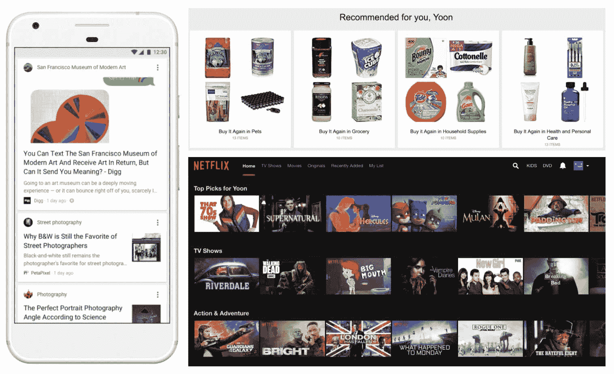

左：谷歌新闻推送，右上：亚马逊产品推荐，右下：Netflix 电影推荐

以下截图展示了几个其他机器学习应用的例子：


左：谷歌新闻推送，右上：亚马逊产品推荐，右下：Netflix 电影推荐

# 构建机器学习模型的步骤

现在我们已经看到了一些现有的机器学习应用的例子，问题是，*我们如何着手构建这样的机器学习应用和系统？* 有关机器学习的书籍和大学中教授的机器学习课程通常首先介绍机器学习算法背后的数学和理论，然后将这些算法应用于给定的数据集。这种方法对于对这个主题完全陌生且希望学习机器学习基础的人来说是很好的。然而，那些有一定先验知识和经验，并希望将他们的知识应用于实际机器学习项目的有志数据科学家往往在如何开始以及如何处理一个特定的机器学习项目上感到困惑。在本节中，我们将讨论构建机器学习应用的典型工作流程，我们将在本书中遵循这个流程。以下图总结了我们的使用机器学习开发应用的方法，我们将在接下来的小节中详细讨论：

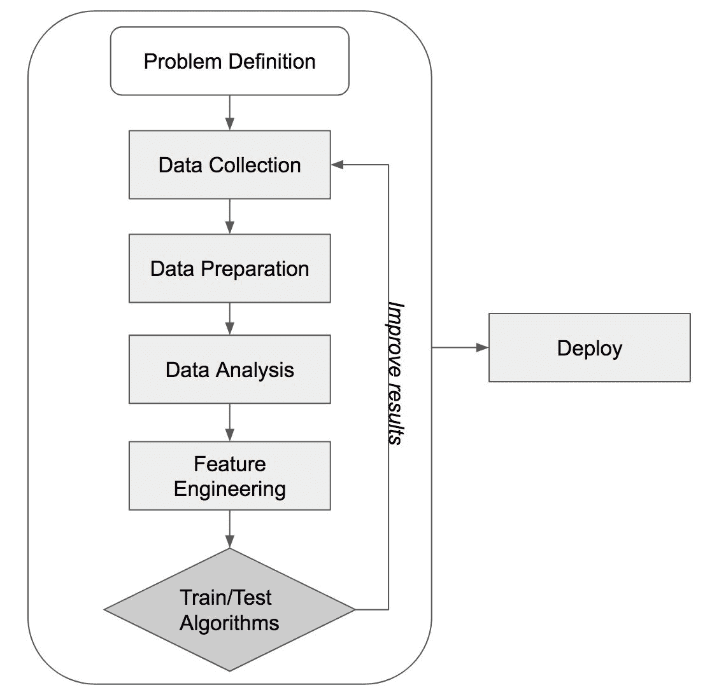

构建机器学习模型的步骤

如前图所示，构建学习模型的步骤如下：

+   **问题定义**：开始任何项目的第一步不仅是理解问题，还要定义你试图用机器学习解决的问题。问题定义不明确会导致构建的机器学习系统没有意义，因为模型已经被训练和优化用于你实际上并不试图解决的问题。这一步无疑是构建有用的机器学习模型和应用中最重要的一步。在开始构建机器学习模型之前，你应该至少回答以下四个问题：

    +   问题是？这是你描述和声明你试图用机器学习解决的问题的地方。例如，问题描述可能为*需要一个系统来评估小型企业主偿还贷款的能力*（针对小型企业贷款项目）。

    +   为什么这是一个问题？定义为什么这样的问题实际上是一个问题，以及为什么新的机器学习模型将会是有用的，这是非常重要的。也许你已经有一个正在工作的模型，并且你注意到它的表现不如以前；你可能已经获得了可以用于构建新预测模型的新数据源；或者你可能希望你的现有模型能够更快地产生预测结果。可能有多个原因让你认为这是一个问题，以及为什么你需要一个新的模型。定义为什么这是一个问题将帮助你保持正确的方向，在你构建新的机器学习模型时。

    +   解决这个问题的方法有哪些？这就是你构思解决给定问题方法的地方。你应该考虑这个模型将要如何被使用（你需要这是一个实时系统，还是作为批处理运行？），它是什么类型的问题（是分类问题、回归、聚类还是其他什么？），以及你需要为你的模型准备哪些类型的数据。这将为你构建机器学习模型未来的步骤提供一个良好的基础。

    +   成功的标准是什么？这是你定义检查点的地方。你应该考虑你将查看哪些指标，以及你的目标模型性能应该是什么样的。如果你正在构建一个将在实时系统中使用的模型，那么你还可以将目标执行速度和数据可用性作为运行时的成功标准。设定这些成功标准将帮助你避免在某个步骤上停滞不前。

+   **数据收集**：拥有数据是构建机器学习模型最基本和关键的部分，最好是大量的数据。没有数据，就没有模型。根据你的项目，你收集数据的方法可能会有所不同。你可以从其他供应商那里购买现有的数据源，你可以抓取网站并从中提取数据，你可以使用公开可用的数据，或者你也可以收集自己的数据。你可以用多种方式收集你需要的机器学习模型数据，但当你处于数据收集过程中时，你需要记住这两个数据要素——目标变量和特征变量。目标变量是预测的答案，特征变量是模型将用来学习如何预测目标变量的因素。通常，目标变量不会以标记的形式出现。例如，当你处理 Twitter 数据以预测每条推文的情感时，你可能没有每条推文的标记情感数据。在这种情况下，你将不得不额外一步来标记你的目标变量。一旦你收集了数据，你就可以继续到数据准备步骤。

+   **数据准备**：一旦你收集了所有输入数据，你需要将其准备成可用的格式。这一步比你想象的更重要。如果你有杂乱的数据，并且没有为你的学习算法清理它们，你的算法将无法从你的数据集中很好地学习，并且不会按预期表现。此外，即使你拥有高质量的数据，如果你的数据格式不适合你的算法进行训练，那么拥有高质量数据也是没有意义的。数据差，模型差。你应该至少处理以下列出的常见问题，以便为下一步做好准备：

    +   **文件格式**：如果你从多个数据源获取数据，你很可能会遇到每个数据源都有不同的格式。一些数据可能以 CSV 格式存储，而其他数据可能以 JSON 或 XML 格式存储。一些数据甚至可能存储在关系型数据库中。为了训练你的机器学习模型，你首先需要将这些不同格式的数据源合并成一个标准格式。

    +   **数据格式**：也可能存在不同数据源之间数据格式不同的情况。例如，一些数据可能将地址字段拆分为街道地址、城市、州和邮政编码，而另一些则可能没有。一些数据可能使用美国日期格式（mm/dd/yyyy）表示日期字段，而另一些则可能使用英国格式（dd/mm/yyyy）。这些数据源之间的数据格式差异在解析值时可能会引起问题。为了训练你的机器学习模型，你需要为每个字段提供一个统一的数据格式。

    +   **重复记录**：通常你会在数据集中看到相同的记录重复出现。这个问题可能出现在数据收集过程中，你记录了一个数据点多次，或者在你准备数据的过程中合并不同的数据集时。重复的记录可能会对你的模型产生不利影响，因此在继续下一步之前检查数据集中的重复项是很好的做法。

    +   **缺失值**：在数据中看到一些记录有空值或缺失值也是常见的情况。在训练你的机器学习模型时，这也可能产生不利影响。处理数据中的缺失值有多种方法，但你必须非常小心，并且非常了解你的数据，因为这将极大地改变你的模型性能。你可以处理缺失值的方法包括删除包含缺失值的记录，用平均值或中位数替换缺失值，用常数替换缺失值，或者用虚拟变量和缺失指示变量替换缺失值。在处理缺失值之前研究你的数据将是有益的。

+   **数据分析**：现在数据已经准备好了，是时候真正查看数据，看看你是否能识别出任何模式，并从数据中得出一些见解。总结统计量和图表是描述和理解数据的最有效方法之一。对于连续变量，查看最小值、最大值、平均值、中位数和四分位数是一个好的开始。对于分类变量，你可以查看各个类别的计数和百分比。当你查看这些总结统计量时，你还可以开始绘制图表来可视化数据的结构。以下图示展示了数据分析中常用的一些图表。直方图常用于显示和检查变量的潜在分布、异常值和偏度。箱线图常用于可视化五数摘要、异常值和偏度。成对散点图常用于检测变量之间明显的成对相关性：

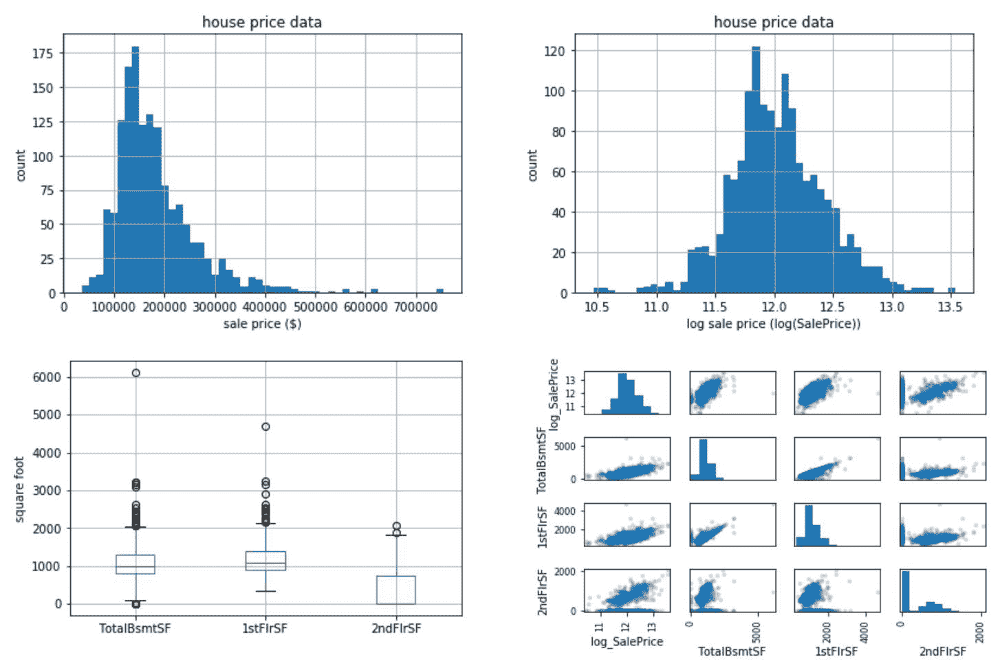

数据分析和可视化。左上角：名义房屋销售价格的直方图，右上角：使用对数刻度的房屋销售价格直方图，左下角：地下室、一楼和二楼面积分布的箱线图，右下角：一楼和二楼面积之间的散点图

+   +   **特征工程**：特征工程是应用机器学习模型构建过程中最重要的部分。然而，这是许多教科书和机器学习课程中讨论最少的话题之一。特征工程是将原始输入数据转换为算法可以从中学习的更信息化的数据的过程。例如，对于我们在第三章中将要构建的 Twitter 情感预测模型，*Twitter 情感分析*，你的原始输入数据可能只包含一个列中的文本列表和另一个列中的情感目标列表。你的机器学习模型可能无法从这些原始数据中很好地学习如何预测每条推文的情感。然而，如果你将数据转换成这样，每个列代表每条推文中每个单词的出现次数，那么你的学习算法就可以更容易地学习到某些单词的存在与情感之间的关系。你还可以将每个单词与其相邻的单词（二元组）分组，并将每条推文中每个二元组的出现次数作为另一组特征。正如这个例子所示，特征工程是一种使你的原始数据更具代表性和对潜在问题更信息化的方式。特征工程不仅是一门科学，也是一种艺术。特征工程需要良好的领域知识、从原始输入数据中构建新特征的创造力，以及多次迭代以获得更好的结果。随着我们学习这本书，我们将介绍如何使用一些**自然语言处理**（**NLP**）技术构建文本特征，如何构建时间序列特征，如何子选择特征以避免过拟合问题，以及如何使用降维技术将高维数据转换为更少的维度。

提出特征是困难的，耗时，需要专业知识。应用机器学习基本上是特征工程。

*-安德鲁·吴*

+   **训练/测试算法**：一旦你创建了你的特征，就是时候训练和测试一些机器学习算法了。在你开始训练你的模型之前，考虑一下性能指标是很好的。根据你要解决的问题，你的性能度量选择会有所不同。例如，如果你正在构建一个股票价格预测模型，你可能希望最小化你的预测与实际价格之间的差异，并选择**均方根误差**（**RMSE**）作为你的性能指标。如果你正在构建一个信用模型来预测一个人是否可以获得贷款，你可能会想使用精确率作为你的性能指标，因为错误的贷款批准（假阳性）比错误的贷款拒绝（假阴性）有更大的负面影响。随着我们学习这些章节，我们将讨论每个项目的更具体的性能指标。

一旦您为您的模型确定了具体的性能指标，现在您可以训练和测试各种学习算法及其性能。根据您的预测目标，您选择的学习算法也会有所不同。以下图显示了某些常见机器学习问题的说明。如果您正在解决分类问题，您将想要训练分类器，例如逻辑回归模型、朴素贝叶斯分类器或随机森林分类器。另一方面，如果您有一个连续的目标变量，那么您将想要训练回归器，例如线性回归模型、k 近邻或**支持向量机**（**SVM**）。如果您想通过无监督学习从数据中得出一些见解，您将想要使用 k 均值聚类或均值漂移算法：

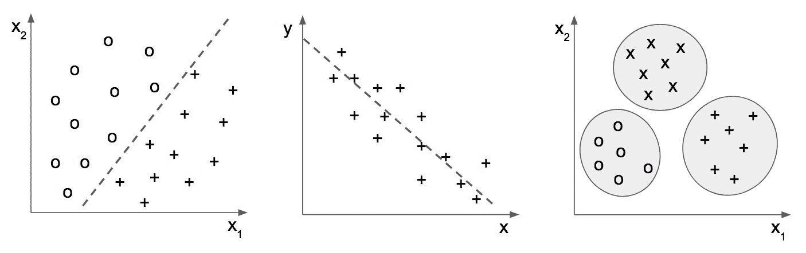

机器学习问题的说明。左：分类，中：回归，右：聚类

最后，我们必须考虑如何测试和评估我们尝试的学习算法的性能。将数据集分为训练集和测试集以及运行交叉验证是测试和比较您的机器学习模型最常用的两种方法。将数据集分为两个子集，一个用于训练，另一个用于测试的目的，是在训练集上训练模型而不暴露给测试集，这样测试集上的预测结果就可以指示模型在不可预见数据上的总体性能。K 折交叉验证是评估模型性能的另一种方法。它首先将数据集分为大小相等的 K 个子集，并留出一个子集用于测试，其余的用于训练。例如，在 3 折交叉验证中，数据集首先分为三个大小相等的子集。在第一次迭代中，我们将使用第 1 和第 2 折来训练我们的模型并在第 3 折上测试它。在第二次迭代中，我们将使用第 1 和第 3 折来训练并在第 2 折上测试我们的模型。在第三次迭代中，我们将使用第 2 和第 3 折来训练并在第 1 折上测试我们的模型。然后，我们将平均性能指标来估计模型性能：

+   **改进结果**：到目前为止，您将有一个或两个表现合理的候选模型，但可能仍有改进的空间。也许您注意到您的候选模型在一定程度上过度拟合，也许它们没有达到您的目标性能，或者也许您有更多的时间来迭代您的模型——无论您的意图如何，都有多种方法可以提高您模型的表现，它们如下：

    +   **超参数调整**：您可以调整模型的配置以潜在地提高性能结果。例如，对于随机森林模型，您可以调整树的最大高度或森林中的树的数量。对于支持向量机（SVMs），您可以调整核或成本值。

    +   **集成方法**：集成是将多个模型的输出结果结合起来以获得更好的结果。Bagging 是在数据集的不同子集上训练相同的算法，Boosting 是将训练在同一训练集上的不同模型结合起来，而 Stacking 是将模型的输出作为元模型的输入，元模型学习如何组合子模型的输出。

    +   **更多特征工程**：在特征工程上进行迭代是提高模型性能的另一种方法。

+   **部署**：是时候将您的模型投入实际应用了！一旦您的模型准备就绪，就是让它们在生产环境中运行的时候了。在您的模型全面接管之前，请确保进行彻底的测试。在模型性能随着时间的推移和输入数据的变化而降低的情况下，计划开发模型监控工具也将是有益的。

# 设置 C# 环境以进行机器学习

既然我们已经讨论了本书中我们将遵循的构建机器学习模型的步骤和方法，让我们开始设置我们的 C# 机器学习环境。我们首先将安装和设置 Visual Studio，然后安装两个我们将频繁在后续章节的项目中使用的包（Accord.NET 和 Deedle）。

# 设置 Visual Studio 以进行 C#

假设您对 C# 有一些先前的知识，我们将简要介绍这部分内容。如果您需要安装 Visual Studio for C#，请访问 [`www.visualstudio.com/downloads/`](https://www.visualstudio.com/downloads/) 并下载 Visual Studio 的一个版本。在本书中，我们使用 Visual Studio 2017 的社区版。如果您在安装 Visual Studio 之前被提示下载 .NET Framework，请访问 [`www.microsoft.com/en-us/download/details.aspx?id=53344`](https://www.microsoft.com/en-us/download/details.aspx?id=53344) 并先安装它。

# 安装 Accord.NET

Accord.NET 是一个 .NET 机器学习框架。在机器学习包之上，Accord.NET 框架还包括数学、统计学、计算机视觉、计算机听觉和其他科学计算模块。我们将主要使用 Accord.NET 框架的机器学习包。

一旦您安装并设置了 Visual Studio，让我们开始安装 C# 的机器学习框架 Accord.NET。通过 NuGet 安装它是最简单的。要安装它，打开包管理器（工具 | NuGet 包管理器 | 包管理器控制台），并输入以下命令安装 `Accord.MachineLearning` 和 `Accord.Controls`：

```py
PM> Install-Package Accord.MachineLearning
PM> Install-Package Accord.Controls
```

现在，让我们使用这些 Accord.NET 包构建一个示例机器学习应用程序。打开您的 Visual Studio，在 Visual C# 类别下创建一个新的 `控制台应用程序`。使用前面的命令通过 `NuGet` 安装这些 Accord.NET 包，并将它们添加到我们的项目中。您应该在 **解决方案资源管理器** 中看到一些 Accord.NET 包被添加到您的引用中，结果应该类似于以下截图：

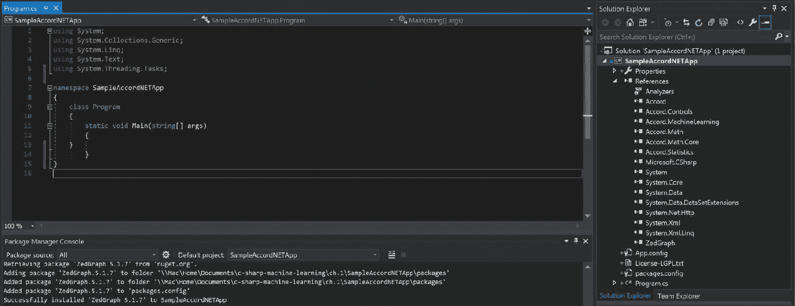

我们现在要构建的模型是一个非常简单的逻辑回归模型。给定二维数组和预期输出，我们将开发一个程序来训练一个逻辑回归分类器，然后绘制结果，显示该模型的预期输出和实际预测。该模型的输入和输出如下所示：

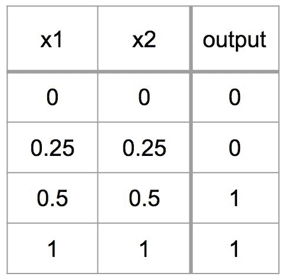

这个示例逻辑回归分类器的代码如下：

```py
using System;
using System.Collections.Generic;
using System.Linq;
using System.Text;
using System.Threading.Tasks;

using Accord.Controls;
using Accord.Statistics;
using Accord.Statistics.Models.Regression;
using Accord.Statistics.Models.Regression.Fitting;

namespace SampleAccordNETApp
{
    class Program
    {
        static void Main(string[] args)
        {
            double[][] inputs =
            {
                new double[] { 0, 0 },
                new double[] { 0.25, 0.25 }, 
                new double[] { 0.5, 0.5 }, 
                new double[] { 1, 1 },
            };

            int[] outputs =
            { 
                0,
                0,
                1,
                1,
            };

            // Train a Logistic Regression model
            var learner = new IterativeReweightedLeastSquares<LogisticRegression>()
            {
                MaxIterations = 100
            };
            var logit = learner.Learn(inputs, outputs);

            // Predict output
            bool[] predictions = logit.Decide(inputs);

            // Plot the results
            ScatterplotBox.Show("Expected Results", inputs, outputs);
            ScatterplotBox.Show("Actual Logistic Regression Output", inputs, predictions.ToZeroOne());

            Console.ReadKey();
        }
    }
}
```

一旦你写完这段代码，你可以通过按*F5*键或点击顶部的开始按钮来运行它。如果一切顺利，它应该会生成以下图中显示的两个图表。如果失败了，请检查引用或错误。你始终可以右键单击类名或灯泡图标，让 Visual Studio 帮助你找到命名空间引用中缺少的哪些包：

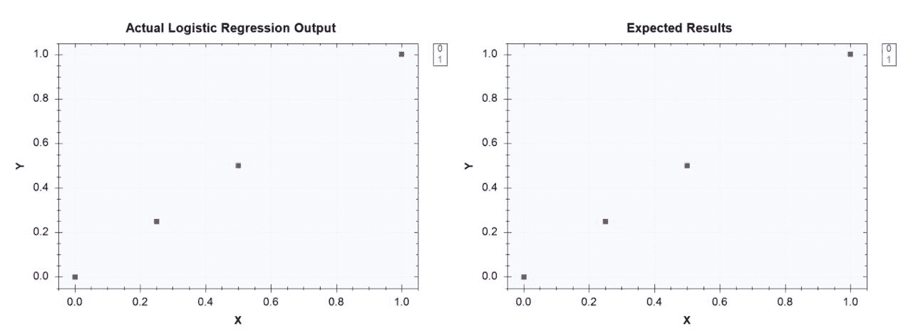

样本程序生成的图表。左：实际预测结果，右：预期输出

这个示例代码可以在以下链接找到：[`github.com/yoonhwang/c-sharp-machine-learning/blob/master/ch.1/SampleAccordNETApp.cs`](https://github.com/yoonhwang/c-sharp-machine-learning/blob/master/ch.1/SampleAccordNETApp.cs)。

# 安装 Deedle

Deedle 是一个开源的.NET 库，用于数据框编程。Deedle 允许你以类似于 R 数据框和 Python 中的 pandas 数据框的方式处理数据。我们将在以下章节中使用这个包来加载和操作我们的机器学习项目数据。

与我们安装 Accord.NET 的方式类似，我们可以从 NuGet 安装 Deedle 包。打开包管理器（工具 | NuGet 包管理器 | 包管理器控制台），使用以下命令安装`Deedle`：

```py
PM> Install-Package Deedle
```

让我们简要看看我们如何使用这个包从 CSV 文件加载数据并进行简单的数据操作。更多详细信息，您可以访问[`bluemountaincapital.github.io/Deedle/`](http://bluemountaincapital.github.io/Deedle/)以获取 API 文档和示例代码。我们将使用 2010 年到 2013 年的 AAPL 每日股价数据来完成这个练习。您可以从以下链接下载这些数据：[`github.com/yoonhwang/c-sharp-machine-learning/blob/master/ch.1/table_aapl.csv`](https://github.com/yoonhwang/c-sharp-machine-learning/blob/master/ch.1/table_aapl.csv)。

打开你的 Visual Studio，在 Visual C#类别下创建一个新的`控制台应用程序`。使用前面的命令通过`NuGet`安装`Deedle`库，并将引用添加到你的项目中。你应该在你的**解决方案资源管理器**中看到添加了`Deedle`包的引用。

现在，我们将把 CSV 数据加载到`Deedle`数据框中，然后进行一些数据处理。首先，我们将使用`Date`字段更新数据框的索引。然后，我们将对`Open`和`Close`列应用一些算术运算来计算从开盘价到收盘价的百分比变化。最后，我们将通过计算收盘价与前一收盘价之间的差异，将它们除以前一收盘价，然后乘以`100`来计算每日回报率。以下是这个示例`Deedle`程序的代码：

```py
using Deedle;
using System;
using System.Collections.Generic;
using System.IO;
using System.Linq;
using System.Text;
using System.Threading.Tasks;

namespace DeedleApp
{
    class Program
    {
        static void Main(string[] args)
        {
            // Read AAPL stock prices from a CSV file
            var root = Directory.GetParent(Directory.GetCurrentDirectory()).Parent.FullName;
            var aaplData = Frame.ReadCsv(Path.Combine(root, "table_aapl.csv"));
            // Print the data
            Console.WriteLine("-- Raw Data --");
            aaplData.Print();

            // Set Date field as index
            var aapl = aaplData.IndexRows<String>("Date").SortRowsByKey();
            Console.WriteLine("-- After Indexing --");
            aapl.Print();

            // Calculate percent change from open to close
            var openCloseChange = 
                ((
                    aapl.GetColumn<double>("Close") - aapl.GetColumn<double>("Open")
                ) / aapl.GetColumn<double>("Open")) * 100.0;
            aapl.AddColumn("openCloseChange", openCloseChange);
            Console.WriteLine("-- Simple Arithmetic Operations --");
            aapl.Print();

            // Shift close prices by one row and calculate daily returns
            var dailyReturn = aapl.Diff(1).GetColumn<double>("Close") / aapl.GetColumn<double>("Close") * 100.0;
            aapl.AddColumn("dailyReturn", dailyReturn);
            Console.WriteLine("-- Shift --");
            aapl.Print();

            Console.ReadKey();
        }
    }
}
```

当你运行这段代码时，你会看到以下输出。

原始数据集看起来如下：

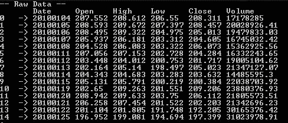

在使用日期字段对数据集进行索引后，你会看到以下内容：

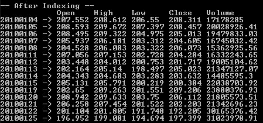

在应用简单的算术运算来计算开盘价到收盘价的变化率后，你会看到以下内容：

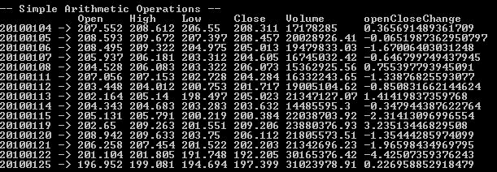

最后，在将收盘价移动一行并计算每日回报率之后，你会看到以下内容：

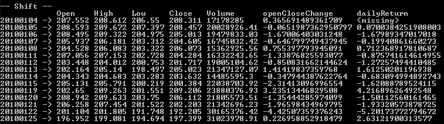

从这个示例`Deedle`项目中可以看出，我们可以用一行或两行代码运行各种数据处理操作，而使用原生 C#进行相同的操作则需要更多的代码。在这本书中，我们将频繁使用`Deedle`库进行数据处理和特征工程。

这个示例`Deedle`代码可以在以下链接找到：[`github.com/yoonhwang/c-sharp-machine-learning/blob/master/ch.1/DeedleApp.cs`](https://github.com/yoonhwang/c-sharp-machine-learning/blob/master/ch.1/DeedleApp.cs)。

# 摘要

在本章中，我们简要讨论了一些关键的机器学习任务和机器学习的实际应用案例。我们还学习了开发机器学习模型的步骤以及每个步骤中常见的挑战和任务。在接下来的章节中，我们将遵循这些步骤进行我们的项目，并将更详细地探讨某些步骤，特别是特征工程、模型选择和模型性能评估。我们将根据我们解决问题的类型讨论在每个步骤中可以应用的各项技术。最后，在本章中，我们向您介绍了如何为我们的未来机器学习项目设置 C#环境。我们使用 Accord.NET 框架构建了一个简单的逻辑回归分类器，并使用`Deedle`库来加载数据和处理数据。

在下一章中，我们将直接应用本章所涵盖的机器学习（ML）基础知识，来构建一个用于垃圾邮件过滤的 ML 模型。我们将遵循本章讨论的构建 ML 模型的步骤，将原始电子邮件数据转换为结构化数据集，分析电子邮件文本数据以获取一些见解，并最终构建预测电子邮件是否为垃圾邮件的分类模型。我们还将讨论下一章中一些常用的分类模型评估指标。
