# 第四章：外汇汇率预测

在本章中，我们将开始使用 C#构建回归模型。到目前为止，我们已经构建了**机器学习**（**ML**）模型，目的是使用逻辑回归、朴素贝叶斯和随机森林学习算法将数据分类到二元或多个类别中。然而，我们现在将转换方向，开始构建预测连续结果的模型。在本章中，我们将探索一个金融数据集，更具体地说是一个外汇汇率市场数据集。我们将使用欧元（EUR）和美元（USD）之间的每日汇率的历史数据来构建一个预测未来汇率的回归模型。我们将从问题定义开始，然后转向数据准备和数据分析。在数据准备和分析步骤中，我们将探讨如何管理时间序列数据和分析每日回报率的分布。然后，在特征工程步骤中，我们将开始构建可以预测货币汇率的特征。我们将讨论金融市场中常用的几个技术指标，例如移动平均线、布林带和滞后变量。使用这些技术指标，我们将使用线性回归和支持向量机（SVM）学习算法构建回归 ML 模型。在构建这些模型的同时，我们还将探讨一些微调 SVM 模型超参数的方法。最后，我们将讨论几个验证指标和评估回归模型的方法。我们将讨论如何使用**均方根误差**（**RMSE**）、R²以及观察值与拟合值图来评估我们模型的性能。到本章结束时，你将拥有用于预测每日 EUR/USD 汇率的工作回归模型。

在本章中，我们将涵盖以下步骤：

+   外汇汇率（欧元对美元）预测项目的问题定义

+   使用 Deedle 框架中的时间序列功能进行数据准备

+   时间序列数据分析

+   使用外汇中的各种技术指标进行特征工程

+   线性回归与支持向量机（SVM）的比较

+   使用 RMSE、R²以及实际与预测图进行模型验证

# 问题定义

让我们从定义本项目试图解决的问题开始这一章。你可能听说过术语*算法交易*或*量化金融/交易*。这是金融行业中数据科学和机器学习与金融相结合的知名领域之一。算法交易或量化金融指的是一种策略，即你使用从大量历史数据构建的统计学习模型来预测未来的金融市场走势。这些策略和技术被各种交易者和投资者广泛使用，以预测各种金融资产的未来价格。外汇市场是最大的、流动性最强的金融市场之一，大量的交易者和投资者参与其中。这是一个独特的市场，每天 24 小时、每周 5 天开放，来自世界各地的交易者进入市场买卖特定的货币对。由于这一优势和独特性，外汇市场也是算法交易和量化交易者构建机器学习模型来预测未来汇率并自动化他们的交易以利用计算机做出的快速决策和执行的吸引人的金融市场。

为了了解我们如何将我们的机器学习知识应用于金融市场和回归模型，我们将使用从 1999 年 1 月 1 日到 2017 年 12 月 31 日的每日 EUR/USD 汇率的历史数据。我们将使用一个公开可用的数据集，可以从以下链接下载：[`www.global-view.com/forex-trading-tools/forex-history/index.html`](http://www.global-view.com/forex-trading-tools/forex-history/index.html)。使用这些数据，我们将通过使用常用的技术指标，如移动平均线、布林带和滞后变量来构建特征。然后，我们将使用线性回归和 SVM 学习算法构建回归模型，以预测 EUR/USD 货币对的未来每日汇率。一旦我们构建了这些模型，我们将使用 RMSE、R^([2])以及观察值与预测值对比图来评估我们的模型。

为了总结我们对外汇汇率预测项目的问题定义：

+   问题是怎样的？我们需要一个回归模型来预测欧元和美元之间的未来汇率；更具体地说，我们希望构建一个机器学习模型来预测 EUR/USD 汇率每日的变化。

+   为什么这是一个问题？由于外汇市场的快节奏和波动性环境，拥有一个能够预测并自主决定何时买入和何时卖出特定货币对的机器学习模型是有利的。

+   解决这个问题的有哪些方法？我们将使用欧元与美元之间的每日汇率的历史数据。使用这个数据集，我们将使用常用的技术指标，如移动平均线、布林带和滞后变量来构建金融特征。我们将探索线性回归和 SVM 学习算法作为我们的回归模型候选。然后，我们将查看 RMSE、R²，并使用观察值与预测值图来评估我们构建的模型的表现。

+   成功标准是什么？我们希望 RMSE 低，因为我们希望我们的预测尽可能接近实际值。我们希望 R²高，因为它表示我们模型的拟合优度。最后，我们希望看到数据点在观察值与预测值图中紧密地排列在对角线上。

# 数据准备

既然我们已经知道了本章试图解决的问题类型，让我们开始查看数据。与前面两章不同，那里我们预先编译并预先标记了数据，我们将从原始的 EUR/USD 汇率数据开始。点击此链接：[`www.global-view.com/forex-trading-tools/forex-history/index.html`](http://www.global-view.com/forex-trading-tools/forex-history/index.html)并选择**EUR/USD 收盘价**、**EUR/USD 最高价**和**EUR/USD 最低价**。如果您想探索不同的数据集，您也可以选择不同的货币对。一旦您选择了想要的数据点，您可以选择开始和结束日期，也可以选择您想要下载的每日、每周或每月数据。对于本章，我们选择**1999 年 1 月 1 日**作为**开始日期**，**2017 年 12 月 31 日**作为**结束日期**，并下载包含 EUR/USD 货币对收盘价、最高价和最低价的每日数据集。

下载完数据后，我们需要做一些任务来为未来的数据分析、特征工程和机器学习建模做好准备。首先，我们需要定义目标变量。正如我们在问题定义步骤中讨论的，我们的目标变量将是 EUR/USD 汇率每日变化。为了计算每日回报率，我们需要从今天的收盘价中减去昨天的收盘价，然后除以昨天的收盘价。计算每日回报率的公式如下：

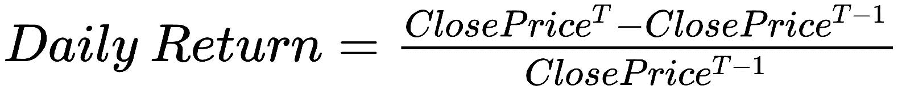

我们可以使用 Deedle 数据框中的`Diff`方法来计算前一个价格和当前价格之间的差异。实际上，您可以使用`Diff`方法来计算任何任意时间点的数据点与当前数据点之间的差异。例如，以下代码显示了如何计算当前数据点与一步之遥、三步之遥和五步之遥的数据点之间的差异：

```py
rawDF["DailyReturn"].Diff(1)
rawDF["DailyReturn"].Diff(3)
rawDF["DailyReturn"].Diff(5)
```

上述代码的输出如下：

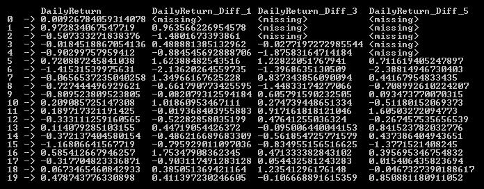

使用这个 `Diff` 方法，以下是如何计算 EUR/USD 汇率的每日回报的代码：

```py
// Compute Daily Returns
rawDF.AddColumn(
    "DailyReturn", 
    rawDF["Close"].Diff(1) / rawDF["Close"] * 100.0
);
```

在此代码中，我们计算了前一天和当天收盘价之间的差异，然后除以前一天的收盘价。通过乘以 `100`，我们可以得到百分比形式的每日回报。最后，我们使用 Deedle 数据框中的 `AddColumn` 方法，将这个每日回报序列添加到原始数据框中，列名为 `DailyReturn`。

然而，我们在构建目标变量方面还没有完成。由于我们正在构建一个预测模型，我们需要将下一天的回报作为目标变量。我们可以使用 Deedle 数据框中的 `Shift` 方法将每个记录与下一天的回报关联起来。类似于 `Diff` 方法，你可以使用 `Shift` 方法将序列向前或向后移动到任何任意的时间点。以下是如何将 `DailyReturn` 列通过 `1`、`3` 和 `5` 步移动的代码：

```py
rawDF["DailyReturn"].Shift(1)
rawDF["DailyReturn"].Shift(3)
rawDF["DailyReturn"].Shift(5)
```

上述代码的输出如下：

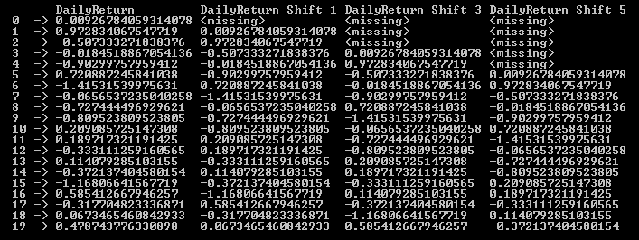

如此示例所示，`DailyReturn` 列或序列已经根据你输入到 `Shift` 方法的参数向前移动了 `1`、`3` 和 `5` 步。使用这个 `Shift` 方法，我们将每日回报向前移动一步，以便每个记录都有下一天的回报作为目标变量。以下是如何创建目标变量列 `Target` 的代码：

```py
// Encode Target Variable - Predict Next Daily Return
rawDF.AddColumn(
    "Target",
    rawDF["DailyReturn"].Shift(-1)
);
```

现在我们已经编码了目标变量，我们还需要进行一个额外的步骤来为未来的任务准备数据。当你处理金融数据时，你经常会听到术语 *OHLC 图表* 或 *OHLC 价格*。OHLC 代表开盘价、最高价、最低价和收盘价，通常用于显示价格随时间的变化。如果你查看我们下载的数据，你会注意到数据集中缺少开盘价。然而，为了我们未来的特征工程步骤，我们需要开盘价。鉴于外汇市场每天 24 小时运行，并且交易量很大，非常流动，我们将假设给定一天的开盘价是前一天收盘价。为了将前一天的收盘价作为开盘价，我们将使用 `Shift` 方法。以下是如何创建并添加开盘价到我们的数据框中的代码：

```py
// Assume Open prices are previous Close prices
rawDF.AddColumn(
    "Open",
    rawDF["Close"].Shift(1)
);
```

以下是我们用于数据准备步骤的完整代码：

```py
using Deedle;
using System;
using System.Collections.Generic;
using System.IO;
using System.Linq;
using System.Text;
using System.Threading.Tasks;

namespace DataPrep
{
    class Program
    {
        static void Main(string[] args)
        {
            Console.SetWindowSize(100, 50);

            // Read in the raw dataset
            // TODO: change the path to point to your data directory
            string dataDirPath = @"\\Mac\Home\Documents\c-sharp-machine-
learning\ch.4\input-data";

            // Load the data into a data frame
            string rawDataPath = Path.Combine(dataDirPath, "eurusd-daily.csv");
            Console.WriteLine("Loading {0}\n", rawDataPath);
            var rawDF = Frame.ReadCsv(
                rawDataPath,
                hasHeaders: true,
                schema: "Date,float,float,float",
                inferTypes: false
            );

            // Rename & Simplify Column Names
            rawDF.RenameColumns(c => c.Contains("EUR/USD ") ? c.Replace("EUR/USD ", "") : c);

            // Assume Open prices are previous Close prices
            rawDF.AddColumn(
                "Open",
                rawDF["Close"].Shift(1)
            );

            // Compute Daily Returns
            rawDF.AddColumn(
                "DailyReturn", 
                rawDF["Close"].Diff(1) / rawDF["Close"] * 100.0
            );

            // Encode Target Variable - Predict Next Daily Return
            rawDF.AddColumn(
                "Target",
                rawDF["DailyReturn"].Shift(-1)
            );

            rawDF.Print();

            // Save OHLC data
            string ohlcDataPath = Path.Combine(dataDirPath, "eurusd-daily-ohlc.csv");
            Console.WriteLine("\nSaving OHLC data to {0}\n", rawDataPath);
            rawDF.SaveCsv(ohlcDataPath);

            Console.WriteLine("DONE!!");
            Console.ReadKey();
        }
    }
}
```

当你运行这段代码时，它将输出结果到一个名为 `eurusd-daily-ohlc.csv` 的文件中，该文件包含开盘价、最高价、最低价和收盘价，以及每日回报和目标变量。我们将使用这个文件进行未来的数据分析特征工程步骤。

此代码也可以在以下仓库中找到： [`github.com/yoonhwang/c-sharp-machine-learning/blob/master/ch.4/DataPrep.cs`](https://github.com/yoonhwang/c-sharp-machine-learning/blob/master/ch.4/DataPrep.cs)。

# 时间序列数据分析

让我们开始查看数据。我们将从之前的数据准备步骤的输出开始，查看每日收益的分布情况。与之前的章节不同，我们主要处理的是分类变量，而现在我们处理的是连续和时间序列变量。我们将以几种不同的方式查看这些数据。首先，让我们查看时间序列收盘价图表。以下代码展示了如何使用 Accord.NET 框架构建折线图：

```py
// Time-series line chart of close prices
DataSeriesBox.Show(
    ohlcDF.RowKeys.Select(x => (double)x),
    ohlcDF.GetColumn<double>("Close").ValuesAll
);
```

请参考 Accord.NET 文档中的`DataSeriesBox.Show`方法，了解显示折线图的多种其他方式。在这个例子中，我们使用数据框的整数索引作为*x*轴值，收盘价作为*y*轴值来构建折线图。以下是在运行代码时您将看到的时序线图表：


此图表显示了从 1999 年到 2017 年 EUR/USD 汇率随时间的变化情况。它从大约 1.18 开始，在 2000 年和 2001 年降至 1.0 以下。然后，它在 2008 年达到了 1.6 的高点，并在 2017 年结束时的约为 1.20。现在，让我们查看历史每日收益。以下代码展示了如何构建历史每日收益的折线图：

```py
// Time-series line chart of daily returns
DataSeriesBox.Show(
    ohlcDF.RowKeys.Select(x => (double)x),
    ohlcDF.FillMissing(0.0)["DailyReturn"].ValuesAll
);
```

这里有一点需要注意，即`FillMissing`方法的用法。如果您还记得之前的数据准备步骤，`DailyReturn`序列是通过计算前一时期与当前时期的差值来构建的。因此，对于第一个数据点，我们没有前一时期的数据点，所以存在一个缺失值。`FillMissing`方法可以帮助您使用自定义值来编码缺失值。根据您的数据集和假设，您可以使用不同的值来编码缺失值，Deedle 数据框中的`FillMissing`方法将非常有用。

当您运行前面的代码时，它将显示如下图表：

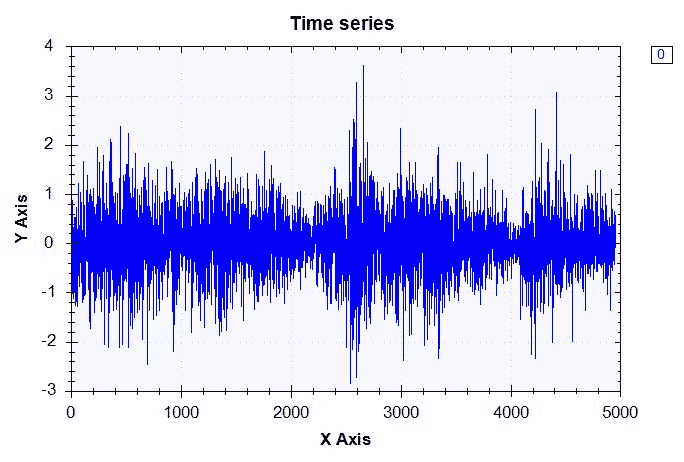

如您从这张图表中可以看到，每日收益在**0**附近波动，主要介于-2.0%和+2.0%之间。让我们更仔细地查看每日收益的分布情况。我们将查看最小值、最大值、平均值和标准差。然后，我们将查看每日收益的四分位数，我们将在查看代码后更详细地讨论这一点。计算这些数字的代码如下：

```py
// Check the distribution of daily returns
double returnMax = ohlcDF["DailyReturn"].Max();
double returnMean = ohlcDF["DailyReturn"].Mean();
double returnMedian = ohlcDF["DailyReturn"].Median();
double returnMin = ohlcDF["DailyReturn"].Min();
double returnStdDev = ohlcDF["DailyReturn"].StdDev();

double[] quantiles = Accord.Statistics.Measures.Quantiles(
    ohlcDF.FillMissing(0.0)["DailyReturn"].ValuesAll.ToArray(),
    new double[] {0.25, 0.5, 0.75}
);

Console.WriteLine("-- DailyReturn Distribution-- ");

Console.WriteLine("Mean: \t\t\t{0:0.00}\nStdDev: \t\t{1:0.00}\n", returnMean, returnStdDev);

Console.WriteLine(
    "Min: \t\t\t{0:0.00}\nQ1 (25% Percentile): \t{1:0.00}\nQ2 (Median): \t\t{2:0.00}\nQ3 (75% Percentile): \t{3:0.00}\nMax: \t\t\t{4:0.00}", 
    returnMin, quantiles[0], quantiles[1], quantiles[2], returnMax
);
```

如您从这段代码中可以看到，Deedle 框架提供了许多内置方法用于计算基本统计数据。正如代码的前六行所示，您可以使用 Deedle 框架中的`Max`、`Mean`、`Median`、`Min`和`StdDev`方法来获取每日收益的相应统计数据。

为了获取四分位数，我们需要在 Accord.NET 框架的 `Accord.Statistics.Measures` 模块中使用 `Quantiles` 方法。四分位数是将有序分布划分为等长度区间的点。例如，十个四分位数将有序分布划分为十个大小相等的子集，因此第一个子集代表分布的底部 10%，最后一个子集代表分布的顶部 10%。同样，四个四分位数将有序分布划分为四个大小相等的子集，其中第一个子集代表分布的底部 25%，最后一个子集代表分布的顶部 25%。四个四分位数通常被称为**四分位数**，十个四分位数被称为**十分位数**，而一百个四分位数被称为**百分位数**。从这些定义中，你可以推断出第一个四分位数与 0.25 分位数和 25 分位数相同。同样，第二个和第三个四分位数与 0.50 分位数和 0.75 分位数以及 50 分位数和 75 分位数相同。由于我们对四分位数感兴趣，我们在 `Quantiles` 方法中使用了 25%、50% 和 75% 作为 `percentiles` 参数的输入。以下是在运行此代码时的输出：

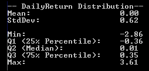

与我们从日回报率时间序列线图、平均值和中位数中观察到的类似，平均值和中位数大约为 0，这表明日回报率围绕 0% 振荡。从 1999 年到 2017 年，历史上最大的负日回报率是 -2.86%，最大的正日回报率是 3.61%。第一个四分位数，即最小值和平均值之间的中间数，为 -0.36%，第三个四分位数，即平均值和最大值之间的中间数，为 0.35%。从这些汇总统计数据中，我们可以看到日回报率几乎对称地分布在 0% 附近。为了更直观地展示这一点，现在让我们看一下日回报率的直方图。绘制日回报率直方图的代码如下：

```py
var dailyReturnHistogram = HistogramBox
.Show(
    ohlcDF.FillMissing(0.0)["DailyReturn"].ValuesAll.ToArray()
)
.SetNumberOfBins(20);
```

我们在 Accord.NET 框架中使用了 `HistogramBox` 来构建日回报率的直方图图表。在这里，我们将桶的数量设置为 `20`。你可以增加或减少桶的数量以显示更多或更少的粒度桶。当你运行此代码时，你将看到以下图表：

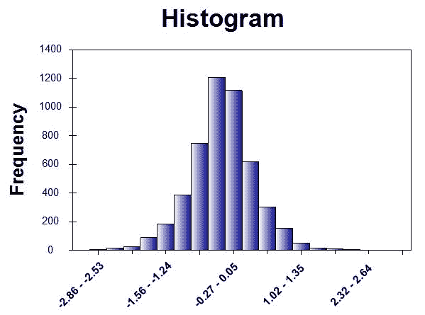

与我们在摘要统计中观察到的类似，日回报率几乎对称地分布在 0% 附近。这个日回报率的直方图显示了一个清晰的钟形曲线，这表明日回报率遵循正态分布。

我们运行此数据分析步骤的完整代码可以在以下链接中找到：[`github.com/yoonhwang/c-sharp-machine-learning/blob/master/ch.4/DataAnalyzer.cs`](https://github.com/yoonhwang/c-sharp-machine-learning/blob/master/ch.4/DataAnalyzer.cs)。

# 特征工程

现在我们对每日收益率的分布有了更好的理解，让我们开始为我们的机器学习建模构建特征。在这一步，我们将讨论一些在外汇市场中被交易者频繁使用的技术指标，以及我们如何使用这些技术指标为我们的机器学习模型构建特征。

# 移动平均线

我们将要构建的第一个特征集是移动平均线。移动平均线是预定义数量的周期内的滚动平均，是一种常用的技术指标。移动平均线有助于平滑价格波动，并显示价格行为的整体趋势。关于移动平均线在交易金融资产中的应用的深入讨论超出了本书的范围，但简而言之，查看不同时间框架的多个移动平均线有助于交易者识别趋势和交易中的支撑和阻力水平。在本章中，我们将使用四个移动平均线，其回望周期分别为 10 天、20 天、50 天和 200 天。以下代码展示了我们如何使用`Window`方法计算移动平均线：

```py
// 1\. Moving Averages
ohlcDF.AddColumn("10_MA", ohlcDF.Window(10).Select(x => x.Value["Close"].Mean()));
ohlcDF.AddColumn("20_MA", ohlcDF.Window(20).Select(x => x.Value["Close"].Mean()));
ohlcDF.AddColumn("50_MA", ohlcDF.Window(50).Select(x => x.Value["Close"].Mean()));
ohlcDF.AddColumn("200_MA", ohlcDF.Window(200).Select(x => x.Value["Close"].Mean()));
```

Deedle 框架中的`Window`方法帮助我们轻松计算移动平均线。`Window`方法接受一个数据框，并构建一系列数据框，其中每个数据框包含一个预定义数量的记录。例如，如果你的`Window`方法的输入是`10`，那么它将构建一系列数据框，其中第一个数据框包含从 0 索引到 9 索引的记录，第二个数据框包含从 1 索引到 11 索引的记录，依此类推。使用这种方法，我们可以轻松计算不同时间窗口的移动平均线，如代码所示。现在，让我们绘制一个包含这些移动平均线的时序收盘价图表：

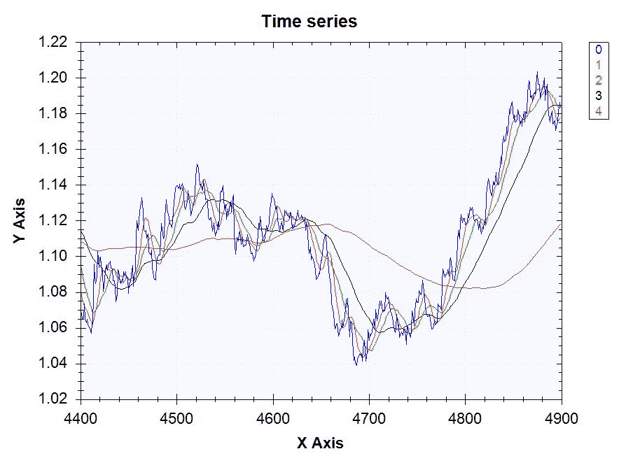

如您从这张图表中可以看到，移动平均线平滑了价格波动。红色线表示 10 天的移动平均线，绿色线表示 20 天的移动平均线，黑色线表示 50 天，粉色线表示 200 天。从这张图表中可以看出，时间窗口越短，它就越接近价格变动，图表就越不平滑。我们用来生成这张图表的代码如下：

```py
// Time-series line chart of close prices & moving averages
var maLineChart = DataSeriesBox.Show(
    ohlcDF.Where(x => x.Key > 4400 && x.Key < 4900).RowKeys.Select(x => (double)x),
    ohlcDF.Where(x => x.Key > 4400 && x.Key < 4900).GetColumn<double>("Close").ValuesAll,
    ohlcDF.Where(x => x.Key > 4400 && x.Key < 4900).GetColumn<double>("10_MA").ValuesAll,
    ohlcDF.Where(x => x.Key > 4400 && x.Key < 4900).GetColumn<double>("20_MA").ValuesAll,
    ohlcDF.Where(x => x.Key > 4400 && x.Key < 4900).GetColumn<double>("50_MA").ValuesAll,
    ohlcDF.Where(x => x.Key > 4400 && x.Key < 4900).GetColumn<double>("200_MA").ValuesAll
);
```

通过我们刚刚计算出的这些移动平均线，我们将用于我们模型的实际特征是收盘价与移动平均线之间的距离。正如简要提到的，移动平均线通常充当支撑和阻力水平，通过观察每个价格点与每个移动平均线的距离，我们可以判断我们是否正在接近支撑和阻力线。计算收盘价与移动平均线之间距离的代码如下：

```py
// Distance from moving averages
ohlcDF.AddColumn("Close_minus_10_MA", ohlcDF["Close"] - ohlcDF["10_MA"]);
ohlcDF.AddColumn("Close_minus_20_MA", ohlcDF["Close"] - ohlcDF["20_MA"]);
ohlcDF.AddColumn("Close_minus_50_MA", ohlcDF["Close"] - ohlcDF["50_MA"]);
ohlcDF.AddColumn("Close_minus_200_MA", ohlcDF["Close"] - ohlcDF["200_MA"]);
```

# 布林带

我们将要查看的第二项技术指标是布林带。布林带由移动平均和与移动平均相同时间窗口的移动标准差组成。然后，布林带在价格时间序列图上绘制在移动平均上方和下方两个标准差的位置。我们将使用 20 日时间窗口来计算布林带。计算布林带的代码如下：

```py
// 2\. Bollinger Band
ohlcDF.AddColumn("20_day_std", ohlcDF.Window(20).Select(x => x.Value["Close"].StdDev()));
ohlcDF.AddColumn("BollingerUpperBound", ohlcDF["20_MA"] + ohlcDF["20_day_std"] * 2);
ohlcDF.AddColumn("BollingerLowerBound", ohlcDF["20_MA"] - ohlcDF["20_day_std"] * 2);
```

如您从这段代码中可以看到，我们正在使用`Window`和`StdDev`方法来计算移动标准差。然后，我们通过从 20 日移动平均中加减两个标准差来计算布林带的上限和下限。当您在价格时间序列图上绘制布林带时，结果如下所示：

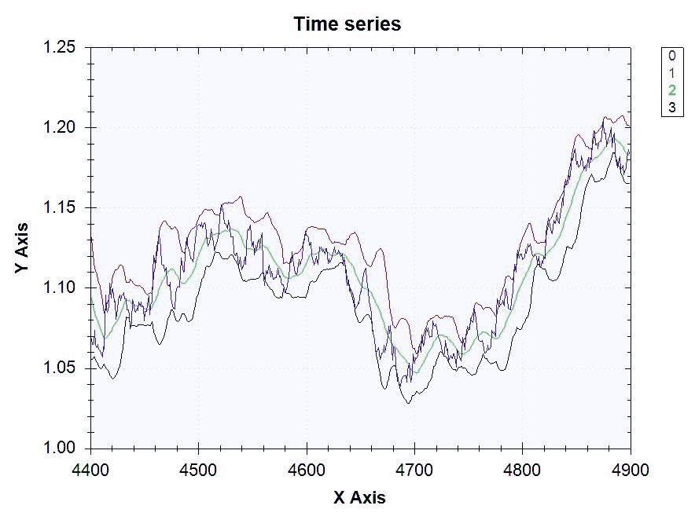

蓝线表示价格变动，绿线表示 20 日移动平均，红线表示布林带的上限，即比移动平均高出两个标准差，黑线表示布林带的下限，即比移动平均低出两个标准差。如您从这张图表中看到，布林带在价格变动周围形成带状。显示此图表的代码如下：

```py
// Time-series line chart of close prices & bollinger bands
var bbLineChart = DataSeriesBox.Show(
    ohlcDF.Where(x => x.Key > 4400 && x.Key < 4900).RowKeys.Select(x => (double)x),
    ohlcDF.Where(x => x.Key > 4400 && x.Key < 4900).GetColumn<double>("Close").ValuesAll,
    ohlcDF.Where(x => x.Key > 4400 && x.Key < 4900).GetColumn<double>("BollingerUpperBound").ValuesAll,
    ohlcDF.Where(x => x.Key > 4400 && x.Key < 4900).GetColumn<double>("20_MA").ValuesAll,
    ohlcDF.Where(x => x.Key > 4400 && x.Key < 4900).GetColumn<double>("BollingerLowerBound").ValuesAll
);
```

与之前的移动平均案例类似，我们将使用收盘价与布林带之间的距离。由于大多数交易都是在上下带之间进行的，因此价格与带之间的距离可以成为我们机器学习模型的特征。计算距离的代码如下：

```py
// Distance from Bollinger Bands
ohlcDF.AddColumn("Close_minus_BollingerUpperBound", ohlcDF["Close"] - ohlcDF["BollingerUpperBound"]);
ohlcDF.AddColumn("Close_minus_BollingerLowerBound", ohlcDF["Close"] - ohlcDF["BollingerLowerBound"]);
```

# 滞后变量

最后，我们将使用的一组最后特征是滞后变量。滞后变量包含关于先前时期的信息。例如，如果我们使用前一天的日回报值作为我们模型的特征，那么它就是一个滞后了一个周期的滞后变量。我们还可以使用当前日期前两天的日回报作为我们模型的特征。这类变量被称为**滞后变量**，通常用于时间序列建模。我们将使用日回报和先前构建的特征作为滞后变量。在这个项目中，我们回顾了五个周期，但您可以尝试更长的或更短的回顾周期。创建日回报滞后变量的代码如下：

```py
// 3\. Lagging Variables
ohlcDF.AddColumn("DailyReturn_T-1", ohlcDF["DailyReturn"].Shift(1));
ohlcDF.AddColumn("DailyReturn_T-2", ohlcDF["DailyReturn"].Shift(2));
ohlcDF.AddColumn("DailyReturn_T-3", ohlcDF["DailyReturn"].Shift(3));
ohlcDF.AddColumn("DailyReturn_T-4", ohlcDF["DailyReturn"].Shift(4));
ohlcDF.AddColumn("DailyReturn_T-5", ohlcDF["DailyReturn"].Shift(5));
```

类似地，我们可以使用以下代码为移动平均与收盘价之间的差异创建滞后变量：

```py
ohlcDF.AddColumn("Close_minus_10_MA_T-1", ohlcDF["Close_minus_10_MA"].Shift(1));
ohlcDF.AddColumn("Close_minus_10_MA_T-2", ohlcDF["Close_minus_10_MA"].Shift(2));
ohlcDF.AddColumn("Close_minus_10_MA_T-3", ohlcDF["Close_minus_10_MA"].Shift(3));
ohlcDF.AddColumn("Close_minus_10_MA_T-4", ohlcDF["Close_minus_10_MA"].Shift(4));
ohlcDF.AddColumn("Close_minus_10_MA_T-5", ohlcDF["Close_minus_10_MA"].Shift(5));

ohlcDF.AddColumn("Close_minus_20_MA_T-1", ohlcDF["Close_minus_20_MA"].Shift(1));
ohlcDF.AddColumn("Close_minus_20_MA_T-2", ohlcDF["Close_minus_20_MA"].Shift(2));
ohlcDF.AddColumn("Close_minus_20_MA_T-3", ohlcDF["Close_minus_20_MA"].Shift(3));
ohlcDF.AddColumn("Close_minus_20_MA_T-4", ohlcDF["Close_minus_20_MA"].Shift(4));
ohlcDF.AddColumn("Close_minus_20_MA_T-5", ohlcDF["Close_minus_20_MA"].Shift(5));

ohlcDF.AddColumn("Close_minus_50_MA_T-1", ohlcDF["Close_minus_50_MA"].Shift(1));
ohlcDF.AddColumn("Close_minus_50_MA_T-2", ohlcDF["Close_minus_50_MA"].Shift(2));
ohlcDF.AddColumn("Close_minus_50_MA_T-3", ohlcDF["Close_minus_50_MA"].Shift(3));
ohlcDF.AddColumn("Close_minus_50_MA_T-4", ohlcDF["Close_minus_50_MA"].Shift(4));
ohlcDF.AddColumn("Close_minus_50_MA_T-5", ohlcDF["Close_minus_50_MA"].Shift(5));

ohlcDF.AddColumn("Close_minus_200_MA_T-1", ohlcDF["Close_minus_200_MA"].Shift(1));
ohlcDF.AddColumn("Close_minus_200_MA_T-2", ohlcDF["Close_minus_200_MA"].Shift(2));
ohlcDF.AddColumn("Close_minus_200_MA_T-3", ohlcDF["Close_minus_200_MA"].Shift(3));
ohlcDF.AddColumn("Close_minus_200_MA_T-4", ohlcDF["Close_minus_200_MA"].Shift(4));
ohlcDF.AddColumn("Close_minus_200_MA_T-5", ohlcDF["Close_minus_200_MA"].Shift(5));
```

最后，我们可以使用以下代码为布林带指标创建滞后变量：

```py
ohlcDF.AddColumn("Close_minus_BollingerUpperBound_T-1", ohlcDF["Close_minus_BollingerUpperBound"].Shift(1));
ohlcDF.AddColumn("Close_minus_BollingerUpperBound_T-2", ohlcDF["Close_minus_BollingerUpperBound"].Shift(2));
ohlcDF.AddColumn("Close_minus_BollingerUpperBound_T-3", ohlcDF["Close_minus_BollingerUpperBound"].Shift(3));
ohlcDF.AddColumn("Close_minus_BollingerUpperBound_T-4", ohlcDF["Close_minus_BollingerUpperBound"].Shift(4));
ohlcDF.AddColumn("Close_minus_BollingerUpperBound_T-5", ohlcDF["Close_minus_BollingerUpperBound"].Shift(5));
```

如您从这些代码片段中可以看到，创建这样的滞后变量非常简单直接。我们只需在 Deedle 框架中使用`Shift`方法，并根据回顾周期更改方法输入。

在本节中，我们还将做的一件事是删除缺失值。因为我们构建了许多时间序列特征，所以我们创建了很多缺失值。例如，当我们计算 200 天的移动平均时，前 199 条记录将没有移动平均，因此将会有缺失值。当您在数据集中遇到缺失值时，有两种方法可以处理它们——您可以用某些值编码它们，或者从数据集中删除缺失值。由于我们有足够的数据，我们将删除所有包含缺失值的记录。从我们的数据框中删除缺失值的代码如下：

```py
Console.WriteLine("\n\nDF Shape BEFORE Dropping Missing Values: ({0}, {1})", ohlcDF.RowCount, ohlcDF.ColumnCount);
ohlcDF = ohlcDF.DropSparseRows();
Console.WriteLine("\nDF Shape AFTER Dropping Missing Values: ({0}, {1})\n\n", ohlcDF.RowCount, ohlcDF.ColumnCount);
```

如您从这段代码中可以看到，Deedle 框架有一个方便的函数，我们可以用它来删除缺失值。我们可以使用`DropSparseRows`方法来删除所有缺失值。当您运行这段代码时，您的输出将如下所示：

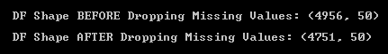

如您从输出中可以看到，它删除了 250 条因缺失值而导致的记录。运行数据分析步骤的完整代码可以在以下链接中找到：[`github.com/yoonhwang/c-sharp-machine-learning/blob/master/ch.4/FeatureEngineer.cs`](https://github.com/yoonhwang/c-sharp-machine-learning/blob/master/ch.4/FeatureEngineer.cs)。

# 线性回归与 SVM 对比

在本节中，我们将构建与之前章节完全不同的模型。我们将构建预测连续变量的模型，并提供 EUR/USD 汇率每日回报率，我们将使用两种新的学习算法，即线性回归和 SVM。线性回归模型试图在目标变量和特征之间找到线性关系，而 SVM 模型试图构建最大化不同类别之间距离的超平面。对于这个外汇汇率预测项目，我们将讨论如何使用 Accord.NET 框架在 C#中构建线性回归和 SVM 模型来解决回归问题。

在我们构建模型之前，我们必须将我们的样本集分成两个子集——一个用于训练，另一个用于测试。在上一章中，我们使用了 Accord.NET 框架中的`SplitSetValidation`来随机将样本集分成训练集和测试集，按照预定义的比例。然而，我们无法在本章中采用相同的方法。因为我们处理的是时间序列数据，我们不能随机选择并分割记录为训练集和测试集。如果我们随机分割样本集，那么我们可能会遇到用未来的事件训练我们的机器学习模型，而在过去的事件上测试模型的情况。因此，我们希望在某个时间点分割我们的样本集，并将那个时间点之前的记录放入训练集，之后的记录放入测试集。下面的代码展示了我们如何将样本集分割成训练集和测试集：

```py
// Read in the file we created in the previous step
// TODO: change the path to point to your data directory
string dataDirPath = @"<path-to-data-dir>";

// Load the data into a data frame
Console.WriteLine("Loading data...");
var featuresDF = Frame.ReadCsv(
    Path.Combine(dataDirPath, "eurusd-features.csv"),
    hasHeaders: true,
    inferTypes: true
);

// Split the sample set into train and test sets
double trainProportion = 0.9;

int trainSetIndexMax = (int)(featuresDF.RowCount * trainProportion);

var trainSet = featuresDF.Where(x => x.Key < trainSetIndexMax);
var testSet = featuresDF.Where(x => x.Key >= trainSetIndexMax);

Console.WriteLine("\nTrain Set Shape: ({0}, {1})", trainSet.RowCount, trainSet.ColumnCount);
Console.WriteLine("Test Set Shape: ({0}, {1})", testSet.RowCount, testSet.ColumnCount);
Where method to filter records in the sample set by index. The next thing we need to do before training our ML models is select the features that we want to train our models with. Since we are only interested in using lagged variables and the distances between the prices and moving averages or Bollinger Bands, we do not want to include raw moving average or Bollinger Band numbers into our feature space. The following code snippet shows how we define the feature set for our models:
```

```py
string[] features = new string[] {
    "DailyReturn", 
    "Close_minus_10_MA", "Close_minus_20_MA", "Close_minus_50_MA",
    "Close_minus_200_MA", "20_day_std", 
    "Close_minus_BollingerUpperBound", "Close_minus_BollingerLowerBound",
    "DailyReturn_T-1", "DailyReturn_T-2",
    "DailyReturn_T-3", "DailyReturn_T-4", "DailyReturn_T-5",
    "Close_minus_10_MA_T-1", "Close_minus_10_MA_T-2", 
    "Close_minus_10_MA_T-3", "Close_minus_10_MA_T-4",
    "Close_minus_10_MA_T-5", 
    "Close_minus_20_MA_T-1", "Close_minus_20_MA_T-2",
    "Close_minus_20_MA_T-3", "Close_minus_20_MA_T-4", "Close_minus_20_MA_T-5",
    "Close_minus_50_MA_T-1", "Close_minus_50_MA_T-2", "Close_minus_50_MA_T-3",
    "Close_minus_50_MA_T-4", "Close_minus_50_MA_T-5", 
    "Close_minus_200_MA_T-1", "Close_minus_200_MA_T-2", 
    "Close_minus_200_MA_T-3", "Close_minus_200_MA_T-4",
    "Close_minus_200_MA_T-5",
    "Close_minus_BollingerUpperBound_T-1",
    "Close_minus_BollingerUpperBound_T-2", "Close_minus_BollingerUpperBound_T-3",
    "Close_minus_BollingerUpperBound_T-4", "Close_minus_BollingerUpperBound_T-5"
};
```

现在我们已经准备好开始构建模型对象并训练我们的机器学习模型了。让我们首先看看如何实例化一个线性回归模型。我们用来训练线性回归模型的代码如下：

```py
Console.WriteLine("\n**** Linear Regression Model ****");

// OLS learning algorithm
var ols = new OrdinaryLeastSquares()
{
    UseIntercept = true
};

// Fit a linear regression model
MultipleLinearRegression regFit = ols.Learn(trainX, trainY);

// in-sample predictions
double[] regInSamplePreds = regFit.Transform(trainX);

// out-of-sample predictions
double[] regOutSamplePreds = regFit.Transform(testX);
OrdinaryLeastSquares as a learning algorithm and MultipleLinearRegression as a model. Ordinary Least Squares (OLS) is a way of training a linear regression model by minimizing and optimizing on the sum of squares of errors. A multiple linear regression model is a model where the number of input features is larger than 1\. Lastly, in order to make predictions on data, we are using the Transform method of the MultipleLinearRegression object. We will be making predictions on both the train and test sets for our model validations in the following section.
```

现在我们来看一下本章将要使用的另一个学习算法和模型。以下代码展示了如何为回归问题构建和训练一个 SVM 模型：

```py
Console.WriteLine("\n**** Linear Support Vector Machine ****");
// Linear SVM Learning Algorithm
var teacher = new LinearRegressionNewtonMethod()
{
    Epsilon = 2.1,
    Tolerance = 1e-5,
    UseComplexityHeuristic = true
};

// Train SVM
var svm = teacher.Learn(trainX, trainY);

// in-sample predictions
double[] linSVMInSamplePreds = svm.Score(trainX);

// out-of-sample predictions
double[] linSVMOutSamplePreds = svm.Score(testX);
```

如你所见，我们正在使用`LinearRegressionNewtonMethod`作为学习算法来训练一个 SVM 模型。`LinearRegressionNewtonMethod`是使用线性核的 SVM 学习算法。简单来说，核是一种将数据点投影到另一个空间的方法，在这个空间中，数据点比在原始空间中更容易分离。在训练 SVM 模型时，也经常使用其他核，如多项式核和高斯核。我们将在下一章中实验和进一步讨论这些其他核，但你当然可以在这个项目中尝试其他核对模型性能的影响。在使用训练好的 SVM 模型进行预测时，你可以使用代码片段中所示的`Score`方法。

我们用来训练和验证线性回归和 SVM 模型的完整代码可以在以下链接找到：[`github.com/yoonhwang/c-sharp-machine-learning/blob/master/ch.4/Modeling.cs`](https://github.com/yoonhwang/c-sharp-machine-learning/blob/master/ch.4/Modeling.cs)。

# 模型验证

现在你已经为本章的外汇汇率预测项目构建并训练了回归模型，让我们开始探讨我们的模型表现如何。在本节中，我们将讨论两个常用的基本指标，RMSE 和 R²，以及一个诊断图，实际或观察值与预测值对比。在我们深入探讨这些指标和诊断图之前，让我们首先简要讨论如何从线性回归模型中提取系数和截距值。

```py
MultipleLinearRegressionobject:
```

```py
Console.WriteLine("\n* Linear Regression Coefficients:");

for (int i = 0; i < features.Length; i++)
{
    Console.WriteLine("\t{0}: {1:0.0000}", features[i], regFit.Weights[i]);
}

Console.WriteLine("\tIntercept: {0:0.0000}", regFit.Intercept);
```

当你运行此代码时，你将看到以下类似的输出：

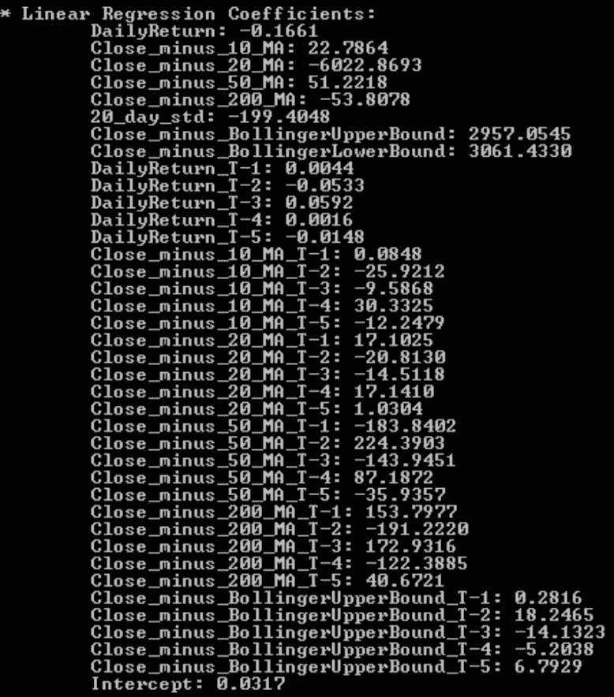

观察拟合的线性回归模型的系数和截距有助于我们理解模型，并深入了解每个特征如何影响预测结果。我们能够理解和可视化特征与目标变量之间的关系是如何形成的，以及它们是如何相互作用的，这使得线性回归模型即使在其他黑盒模型（如随机森林模型或支持向量机）通常优于线性回归模型的情况下，仍然具有吸引力。正如你可以从输出中看到的那样，你可以轻松地判断哪些特征对每日回报预测有负面影响或正面影响，以及它们的影响程度。

现在我们来看看本章中用于回归模型验证的第一个指标。你可能已经熟悉 RMSE，它衡量的是预测值与实际值之间误差的平方根。RMSE 值越低，模型拟合度越好。以下代码展示了如何计算模型拟合的 RMSE：

```py
// RMSE for in-sample 
double regInSampleRMSE = Math.Sqrt(new SquareLoss(trainX).Loss(regInSamplePreds));

// RMSE for out-sample 
double regOutSampleRMSE = Math.Sqrt(new SquareLoss(testX).Loss(regOutSamplePreds));

Console.WriteLine("RMSE: {0:0.0000} (Train) vs. {1:0.0000} (Test)", regInSampleRMSE, regOutSampleRMSE);
```

如此代码所示，我们正在使用 Accord.NET 框架中的`SquareLoss`类，该类计算预测值与实际值之间差异的平方值。为了得到 RMSE，我们需要取这个值的平方根。

我们接下来要看的下一个指标是 R²。R²经常被用作拟合优度的一个指标。值越接近 1，模型拟合度越好。以下代码展示了如何计算 R²值：

```py
// R² for in-sample 
double regInSampleR2 = new RSquaredLoss(trainX[0].Length, trainX).Loss(regInSamplePreds);

// R² for out-sample 
double regOutSampleR2 = new RSquaredLoss(testX[0].Length, testX).Loss(regOutSamplePreds);

Console.WriteLine("R²: {0:0.0000} (Train) vs. {1:0.0000} (Test)", regInSampleR2, regOutSampleR2);
```

如此代码所示，我们正在使用 Accord.NET 框架中的`RSquaredLoss`类。我们分别对样本内预测（在训练集上的预测）和样本外预测（在测试集上的预测）进行计算。这两个值越接近，模型的过拟合程度就越低。

当你为线性回归模型运行 RMSE 和 R²的代码时，你将得到以下输出：

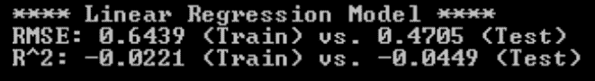

对于 SVM 模型，你将看到的输出如下：

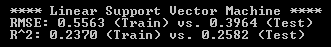

从这些输出中，我们可以看到 SVM 模型在性能上远超线性回归模型。与线性回归模型相比，SVM 模型的 RMSE 要低得多。此外，SVM 模型的 R²值也远高于线性回归模型。注意线性回归模型的 R²值。当模型的拟合度不如一条简单的水平线时，就会出现这种情况，这表明我们的线性回归模型拟合度不佳。另一方面，SVM 模型的 R²值约为 0.26，这意味着 26%的目标变量方差可以通过此模型解释。

最后，我们将查看一个诊断图；实际值与预测值之间的比较。这个诊断图是观察模型拟合优度的一个很好的视觉方式。理想情况下，我们希望所有点都位于对角线上。例如，如果实际值是 1.0，那么我们希望预测值接近 1.0。点越接近对角线，模型拟合度越好。你可以使用以下代码来绘制实际值与预测值：

```py
// Scatter Plot of expected and actual
ScatterplotBox.Show(
    String.Format("Actual vs. Prediction ({0})", modelName), testY, regOutSamplePreds
);
```

我们正在使用 Accord.NET 框架中的`ScatterplotBox`类来构建实际值与预测值之间的散点图。当你为线性回归模型运行此代码时，你会看到以下诊断图：

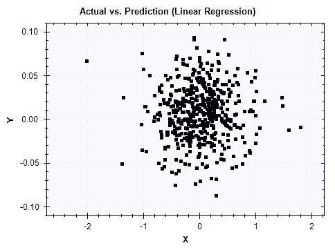

当你为 SVM 模型运行相同的代码时，诊断图如下所示：

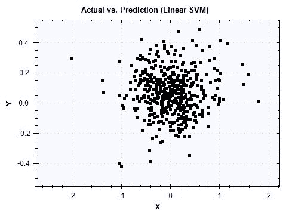

如您从这些图中可以看到，线性回归模型的预测值在 0 附近更为集中，而 SVM 模型的预测值则在一个更宽的范围内分布更广。尽管线性回归和 SVM 模型结果的两个图现在都没有显示完美的对角线，但 SVM 模型的图显示了更好的结果，并且与 RMSE 和 R² 指标我们看到的结果一致。

我们编写并使用的方法来运行模型验证如下：

```py
private static void ValidateModelResults(string modelName, double[] regInSamplePreds, double[] regOutSamplePreds, double[][] trainX, double[] trainY, double[][] testX, double[] testY)
{
    // RMSE for in-sample 
    double regInSampleRMSE = Math.Sqrt(new SquareLoss(trainX).Loss(regInSamplePreds));

    // RMSE for in-sample 
    double regOutSampleRMSE = Math.Sqrt(new SquareLoss(testX).Loss(regOutSamplePreds));

    Console.WriteLine("RMSE: {0:0.0000} (Train) vs. {1:0.0000} (Test)", regInSampleRMSE, regOutSampleRMSE);

    // R² for in-sample 
    double regInSampleR2 = new RSquaredLoss(trainX[0].Length, trainX).Loss(regInSamplePreds);

    // R² for in-sample 
    double regOutSampleR2 = new RSquaredLoss(testX[0].Length, testX).Loss(regOutSamplePreds);

    Console.WriteLine("R²: {0:0.0000} (Train) vs. {1:0.0000} (Test)", regInSampleR2, regOutSampleR2);

    // Scatter Plot of expected and actual
    ScatterplotBox.Show(
        String.Format("Actual vs. Prediction ({0})", modelName), testY, regOutSamplePreds
    );
}
```

# 摘要

在本章中，我们构建并训练了我们的第一个回归模型。我们使用了一个包含 1999 年至 2017 年间欧元和美元历史每日汇率的时间序列数据集。我们首先讨论了如何从一个未标记的原始数据集中创建目标变量，以及如何在 Deedle 框架中应用 `Shift` 和 `Diff` 方法来计算每日回报并创建目标变量，即一个周期前的一日回报。我们还从几个不同的角度研究了每日回报的分布，例如时间序列折线图、使用均值、标准差和分位数进行的总结统计。我们还研究了每日回报的直方图，并看到了一个绘制得很好的钟形曲线，它遵循正态分布。然后，我们介绍了外汇市场中一些常用的技术指标以及如何将它们应用于我们的特征构建过程。使用移动平均线、布林带和滞后变量等技术指标，我们构建了各种特征，帮助我们的学习算法学习如何预测未来的每日回报。在特征工程步骤中构建的这些特征，我们构建了线性回归和 SVM 模型来预测 EUR/USD 汇率。我们学习了如何从 `MultipleLinearRegression` 对象中提取系数和截距，以深入了解每个特征如何影响预测结果。我们还简要讨论了在构建 SVM 模型时核函数的使用。最后，我们回顾了两个常用的回归模型指标，RMSE 和 R²，以及实际值与预测值之间的诊断图。从这个模型验证步骤中，我们观察到 SVM 模型在性能上大幅优于线性回归模型。我们还讨论了与其他黑盒模型（如随机森林和 SVM 模型）相比，使用线性回归模型可以获得的可解释性比较优势。

在下一章中，我们将通过使用 Accord.NET 框架在 C# 中构建回归模型来扩展我们的知识和经验。我们将使用一个包含连续和分类变量的房价数据集，并学习如何为如此复杂的数据集构建回归模型。我们还将讨论我们可以用于 SVM 的各种核函数以及它们如何影响我们的 SVM 模型的性能。
