# 客户细分

在本章中，我们将学习无监督学习模型及其如何从数据中提取洞察。到目前为止，我们一直专注于监督学习，其中我们的机器学习（ML）模型有已知的目标变量，它们试图预测这些变量。我们已经为垃圾邮件过滤和 Twitter 情感分析构建了分类模型。我们还为外汇汇率预测和预测房价公允价值构建了回归模型。我们迄今为止构建的所有这些机器学习模型都是监督学习算法，其中模型学习将给定的输入映射到预期的结果。然而，在某些情况下，我们更感兴趣的是从数据集中发现隐藏的洞察和推断，我们可以使用无监督学习算法来完成这些任务。

在本章中，我们将使用一个包含客户购买的商品价格和数量信息的在线零售数据集。我们将通过观察购买订单和取消订单中商品价格和数量的分布差异来探索这些数据。我们还将研究在线商店活动在不同国家之间的分布情况。然后，我们将把这一级交易数据转换和汇总成客户级数据。在我们将数据转换为以客户为中心的视角时，我们将讨论为无监督学习算法构建规模无关特征的方法。有了这个特征集，我们将使用 k-means 聚类算法来构建客户细分市场，并从每个细分市场内提取客户行为洞察。我们将介绍一个新的验证指标，即轮廓系数，以评估聚类结果。

在本章中，我们将涵盖以下主题：

+   客户细分项目的问题定义

+   在线零售数据集的数据分析

+   特征工程和汇总

+   使用 k-means 聚类算法进行无监督学习

+   使用轮廓系数进行聚类模型验证

# 问题定义

让我们更详细地讨论我们将要解决的问题，并构建聚类模型。无论你是试图向客户发送营销邮件，还是仅仅想更好地了解你的客户及其在线商店的行为，你都将想要分析和识别不同类型和细分市场的客户。一些客户可能会一次性购买大量商品（批量购买者），一些可能会主要购买昂贵或奢侈品（奢侈品购买者），或者一些可能只购买了一两件商品就再也没有回来（不活跃客户）。根据这些行为模式，你的营销活动应该有所不同。例如，发送关于奢侈品促销的邮件可能会激发奢侈品购买者登录在线商店并购买某些商品，但这种营销活动可能对批量购买者效果不佳。另一方面，发送关于经常批量购买的物品（如办公用品的笔和便签本）的促销邮件可能会使批量购买者登录在线商店并下订单，但这可能对奢侈品购买者没有吸引力。通过根据客户的行为模式识别客户细分，并使用定制化的营销活动，你可以优化你的营销渠道。

为了构建客户细分模型，我们将使用一个包含 2010 年 1 月 12 日至 2011 年 9 月 12 日之间发生的所有交易的在线零售数据集，该数据集属于一家英国在线零售店。这个数据集可在 UCI 机器学习仓库中找到，并可通过以下链接下载：[`archive.ics.uci.edu/ml/datasets/online+retail#`](http://archive.ics.uci.edu/ml/datasets/online+retail#)。利用这些数据，我们将构建包含关于净收入、平均商品价格和每位客户平均购买数量的特征。使用这些特征，我们将使用**k-means 聚类算法**构建一个聚类模型，将客户基础划分为不同的细分市场。我们将使用**轮廓系数**指标来评估聚类质量，并推断出构建客户细分的最优数量。

为了总结客户细分项目的定义问题：

+   问题是什么？我们需要一个聚类模型，将客户划分为不同的集群，以便我们更好地理解和提取关于客户行为模式的见解。

+   为什么这是一个问题？没有一种适合所有不同类型客户的营销活动都能奏效。我们需要为批量购买者和奢侈品购买者分别构建定制化的营销活动。此外，我们还需要将未参与活动的客户与其他客户类型区分开来，以便让他们重新参与产品。营销信息越定制化，客户参与的可能性就越大。如果我们有一个基于在线商店中客户行为模式将客户基础聚类到不同段落的机器学习模型，这将是一个巨大的优势。

+   解决这个问题的方法有哪些？我们将使用包含 2010 年至 2011 年中期所有交易的在线零售数据集来聚合关键特征，例如每个客户的净收入、平均单价和平均购买数量。然后，我们将使用 k-means 聚类算法构建聚类模型，并使用轮廓系数来评估聚类的质量并选择最佳聚类数量。

+   成功的标准是什么？我们不希望有太多的聚类，因为这会使解释和理解不同客户模式变得更加困难。我们将使用轮廓系数得分来告诉我们用于客户分段的最佳聚类数量。

# 在线零售数据集的数据分析

现在是查看数据集的时候了。您可以点击以下链接：[`archive.ics.uci.edu/ml/datasets/online+retail#`](http://archive.ics.uci.edu/ml/datasets/online+retail#)，点击左上角的`Data Folder`链接，并下载`Online Retail.xlsx`文件。您可以将文件保存为 CSV 格式，并将其加载到 Deedle 数据框中。

# 处理缺失值

由于我们将对每个客户的交易数据进行聚合，我们需要检查`CustomerID`列中是否有任何缺失值。以下截图显示了一些没有`CustomerID`的记录：

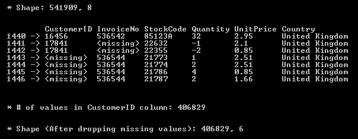

我们将删除`CustomerID`、`Description`、`Quantity`、`UnitPrice`和`Country`列中包含缺失值的记录。以下代码片段显示了如何删除这些列的缺失值记录：

```py
// 1\. Missing CustomerID Values
ecommerceDF
    .Columns[new string[] { "CustomerID", "InvoiceNo", "StockCode", "Quantity", "UnitPrice", "Country" }]
    .GetRowsAt(new int[] { 1440, 1441, 1442, 1443, 1444, 1445, 1446 })
    .Print();
Console.WriteLine("\n\n* # of values in CustomerID column: {0}", ecommerceDF["CustomerID"].ValueCount);

// Drop missing values
ecommerceDF = ecommerceDF
    .Columns[new string[] { "CustomerID", "Description", "Quantity", "UnitPrice", "Country" }]
    .DropSparseRows();

// Per-Transaction Purchase Amount = Quantity * UnitPrice
ecommerceDF.AddColumn("Amount", ecommerceDF["Quantity"] * ecommerceDF["UnitPrice"]);

Console.WriteLine("\n\n* Shape (After dropping missing values): {0}, {1}\n", ecommerceDF.RowCount, ecommerceDF.ColumnCount);
Console.WriteLine("* After dropping missing values and unnecessary columns:");
ecommerceDF.GetRowsAt(new int[] { 0, 1, 2, 3, 4 }).Print();
// Export Data
ecommerceDF.SaveCsv(Path.Combine(dataDirPath, "data-clean.csv"));
```

我们使用 Deedle 数据框的`DropSparseRows`方法来删除我们感兴趣列中所有包含缺失值的记录。然后，我们添加一个额外的列`Amount`到数据框中，这是给定交易的总额。我们可以通过将单价乘以数量来计算这个值。

如您从前面的图像中可以看到，我们在删除缺失值之前有 541,909 条记录。在从我们感兴趣的列中删除包含缺失值的记录后，数据框中的记录数最终变为 406,829 条。现在，我们有一个包含所有交易信息的`CustomerID`、`Description`、`Quantity`、`UnitPrice`和`Country`的数据框。

# 变量分布

让我们开始查看数据集中的分布。首先，我们将查看交易量最大的前五个国家。我们用来按国家聚合记录并计算每个国家发生的交易数量的代码如下：

```py
// 2\. Number of transactions by country
var numTransactionsByCountry = ecommerceDF
    .AggregateRowsBy<string, int>(
        new string[] { "Country" },
        new string[] { "CustomerID" },
        x => x.ValueCount
    ).SortRows("CustomerID");

var top5 = numTransactionsByCountry
    .GetRowsAt(new int[] {
        numTransactionsByCountry.RowCount-1, numTransactionsByCountry.RowCount-2,
        numTransactionsByCountry.RowCount-3, numTransactionsByCountry.RowCount-4,
        numTransactionsByCountry.RowCount-5 });
top5.Print();

var topTransactionByCountryBarChart = DataBarBox.Show(
    top5.GetColumn<string>("Country").Values.ToArray().Select(x => x.Equals("United Kingdom") ? "UK" : x),
    top5["CustomerID"].Values.ToArray()
);
topTransactionByCountryBarChart.SetTitle(
    "Top 5 Countries with the most number of transactions"
 );
AggregateRowsBy method in the Deedle data frame to group the records by country and count the total number of transactions for each country. Then, we sort the resulting data frame using the SortRows method and take the top five countries. When you run this code, you will see the following bar chart:
```

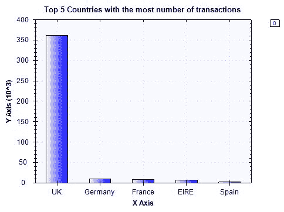

交易量最大的前五个国家的交易数量如下：

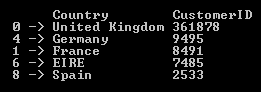

如预期，交易数量最多的是英国。德国和法国分别排在第二和第三位，交易数量最多。

让我们开始查看我们将用于聚类模型的特征分布——购买数量、单价和净额。我们将以三种方式查看这些分布。首先，我们将获取每个特征的总体分布，无论交易是购买还是取消。其次，我们将仅查看购买订单，排除取消订单。第三，我们将查看仅取消订单的分布。

获取交易数量分布的代码如下：

```py
// 3\. Per-Transaction Quantity Distributions
Console.WriteLine("\n\n-- Per-Transaction Order Quantity Distribution-- ");
double[] quantiles = Accord.Statistics.Measures.Quantiles(
    ecommerceDF["Quantity"].ValuesAll.ToArray(),
    new double[] { 0, 0.25, 0.5, 0.75, 1.0 }
);
Console.WriteLine(
    "Min: \t\t\t{0:0.00}\nQ1 (25% Percentile): \t{1:0.00}\nQ2 (Median): \t\t{2:0.00}\nQ3 (75% Percentile): \t{3:0.00}\nMax: \t\t\t{4:0.00}",
    quantiles[0], quantiles[1], quantiles[2], quantiles[3], quantiles[4]
);

Console.WriteLine("\n\n-- Per-Transaction Purchase-Order Quantity Distribution-- ");
quantiles = Accord.Statistics.Measures.Quantiles(
    ecommerceDF["Quantity"].Where(x => x.Value >= 0).ValuesAll.ToArray(),
    new double[] { 0, 0.25, 0.5, 0.75, 1.0 }
);
Console.WriteLine(
    "Min: \t\t\t{0:0.00}\nQ1 (25% Percentile): \t{1:0.00}\nQ2 (Median): \t\t{2:0.00}\nQ3 (75% Percentile): \t{3:0.00}\nMax: \t\t\t{4:0.00}",
    quantiles[0], quantiles[1], quantiles[2], quantiles[3], quantiles[4]
);

Console.WriteLine("\n\n-- Per-Transaction Cancel-Order Quantity Distribution-- ");
quantiles = Accord.Statistics.Measures.Quantiles(
    ecommerceDF["Quantity"].Where(x => x.Value < 0).ValuesAll.ToArray(),
    new double[] { 0, 0.25, 0.5, 0.75, 1.0 }
);
Console.WriteLine(
    "Min: \t\t\t{0:0.00}\nQ1 (25% Percentile): \t{1:0.00}\nQ2 (Median): \t\t{2:0.00}\nQ3 (75% Percentile): \t{3:0.00}\nMax: \t\t\t{4:0.00}",
    quantiles[0], quantiles[1], quantiles[2], quantiles[3], quantiles[4]
);
```

如前一章所述，我们使用`分位数`方法来计算四分位数——最小值、25%分位数、中位数、75%分位数和最大值。一旦我们得到每笔订单数量的总体分布，我们再查看购买订单和取消订单的分布。在我们的数据集中，取消订单在`数量`列中用负数表示。为了将取消订单与购买订单分开，我们可以简单地从我们的数据表中过滤出正数和负数，如下面的代码所示：

```py
// Filtering out cancel orders to get purchase orders only
ecommerceDF["Quantity"].Where(x => x.Value >= 0)
// Filtering out purchase orders to get cancel orders only
ecommerceDF["Quantity"].Where(x => x.Value < 0)
```

为了获取每笔交易单位价格的四分位数，我们使用以下代码：

```py
// 4\. Per-Transaction Unit Price Distributions
Console.WriteLine("\n\n-- Per-Transaction Unit Price Distribution-- ");
quantiles = Accord.Statistics.Measures.Quantiles(
    ecommerceDF["UnitPrice"].ValuesAll.ToArray(),
    new double[] { 0, 0.25, 0.5, 0.75, 1.0 }
);
Console.WriteLine(
    "Min: \t\t\t{0:0.00}\nQ1 (25% Percentile): \t{1:0.00}\nQ2 (Median): \t\t{2:0.00}\nQ3 (75% Percentile): \t{3:0.00}\nMax: \t\t\t{4:0.00}",
    quantiles[0], quantiles[1], quantiles[2], quantiles[3], quantiles[4]
);
```

同样，我们可以使用以下代码计算每笔交易的总额的四分位数：

```py
// 5\. Per-Transaction Purchase Price Distributions
Console.WriteLine("\n\n-- Per-Transaction Total Amount Distribution-- ");
quantiles = Accord.Statistics.Measures.Quantiles(
    ecommerceDF["Amount"].ValuesAll.ToArray(),
    new double[] { 0, 0.25, 0.5, 0.75, 1.0 }
);
Console.WriteLine(
    "Min: \t\t\t{0:0.00}\nQ1 (25% Percentile): \t{1:0.00}\nQ2 (Median): \t\t{2:0.00}\nQ3 (75% Percentile): \t{3:0.00}\nMax: \t\t\t{4:0.00}",
    quantiles[0], quantiles[1], quantiles[2], quantiles[3], quantiles[4]
);

Console.WriteLine("\n\n-- Per-Transaction Purchase-Order Total Amount Distribution-- ");
quantiles = Accord.Statistics.Measures.Quantiles(
    ecommerceDF["Amount"].Where(x => x.Value >= 0).ValuesAll.ToArray(),
    new double[] { 0, 0.25, 0.5, 0.75, 1.0 }
);
Console.WriteLine(
    "Min: \t\t\t{0:0.00}\nQ1 (25% Percentile): \t{1:0.00}\nQ2 (Median): \t\t{2:0.00}\nQ3 (75% Percentile): \t{3:0.00}\nMax: \t\t\t{4:0.00}",
    quantiles[0], quantiles[1], quantiles[2], quantiles[3], quantiles[4]
);

Console.WriteLine("\n\n-- Per-Transaction Cancel-Order Total Amount Distribution-- ");
quantiles = Accord.Statistics.Measures.Quantiles(
    ecommerceDF["Amount"].Where(x => x.Value < 0).ValuesAll.ToArray(),
    new double[] { 0, 0.25, 0.5, 0.75, 1.0 }
);
Console.WriteLine(
    "Min: \t\t\t{0:0.00}\nQ1 (25% Percentile): \t{1:0.00}\nQ2 (Median): \t\t{2:0.00}\nQ3 (75% Percentile): \t{3:0.00}\nMax: \t\t\t{4:0.00}",
    quantiles[0], quantiles[1], quantiles[2], quantiles[3], quantiles[4]
);
```

当你运行代码时，你会看到以下输出，显示了每笔交易的订单数量、单价和总额的分布：

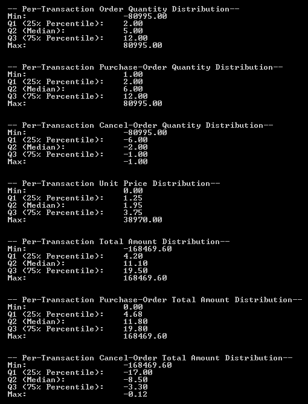

如果你查看输出中的总体订单数量分布，你会注意到从第一个四分位数（25%分位数）开始，数量是正的。这表明取消订单的数量远少于购买订单，这对在线零售店来说实际上是个好事。让我们看看在我们的数据集中购买订单和取消订单是如何划分的。

使用以下代码，你可以绘制条形图来比较购买订单与取消订单的数量：

```py
// 6\. # of Purchase vs. Cancelled Transactions
var purchaseVSCancelBarChart = DataBarBox.Show(
    new string[] { "Purchase", "Cancel" },
    new double[] {
        ecommerceDF["Quantity"].Where(x => x.Value >= 0).ValueCount ,
        ecommerceDF["Quantity"].Where(x => x.Value < 0).ValueCount
    }
);
purchaseVSCancelBarChart.SetTitle(
    "Purchase vs. Cancel"
 );
```

当你运行此代码时，你会看到以下条形图：

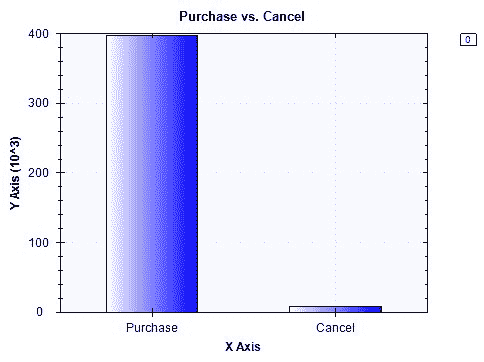

如预期并在之前的分布输出中所示，取消订单的数量远少于购买订单的数量。有了这些分析结果，我们将在下一节开始构建用于客户细分聚类模型的特征。

此数据分析步骤的完整代码可以通过以下链接找到：[`github.com/yoonhwang/c-sharp-machine-learning/blob/master/ch.6/DataAnalyzer.cs`](https://github.com/yoonhwang/c-sharp-machine-learning/blob/master/ch.6/DataAnalyzer.cs)。

# 特征工程和数据聚合

我们现在数据集中的记录代表单个交易。然而，我们想要构建一个聚类模型，将客户聚类到不同的细分市场。为了做到这一点，我们需要按客户对数据进行转换和聚合。换句话说，我们需要按 `CustomerID` 对数据进行分组，并通过求和、计数或取值平均值来聚合每个客户所属的交易。让我们先看一个例子。以下代码按 `CustomerID` 对交易级别数据进行分组，并计算净收入、交易总数、取消订单总数、平均单价和平均订单数量：

```py
// 1\. Net Revenue per Customer
var revPerCustomerDF = ecommerceDF.AggregateRowsBy<double, double>(
    new string[] { "CustomerID" },
    new string[] { "Amount" },
    x => x.Sum()
);
// 2\. # of Total Transactions per Customer
var numTransactionsPerCustomerDF = ecommerceDF.AggregateRowsBy<double, double>(
    new string[] { "CustomerID" },
    new string[] { "Quantity" },
    x => x.ValueCount
);
// 3\. # of Cancelled Transactions per Customer
var numCancelledPerCustomerDF = ecommerceDF.AggregateRowsBy<double, double>(
    new string[] { "CustomerID" },
    new string[] { "Quantity" },
    x => x.Select(y => y.Value >= 0 ? 0.0 : 1.0).Sum()
);
// 4\. Average UnitPrice per Customer
var avgUnitPricePerCustomerDF = ecommerceDF.AggregateRowsBy<double, double>(
    new string[] { "CustomerID" },
    new string[] { "UnitPrice" },
    x => x.Sum() / x.ValueCount
);
// 5\. Average Quantity per Customer
var avgQuantityPerCustomerDF = ecommerceDF.AggregateRowsBy<double, double>(
    new string[] { "CustomerID" },
    new string[] { "Quantity" },
    x => x.Sum() / x.ValueCount
);
```

如您从这段代码中看到，我们在 Deedle 数据框中使用了 `AggregateRowsBy` 方法，并为每个聚合传递了一个自定义的 `aggFunc`。在第一个例子中，我们计算每个客户的净收入时，我们汇总了每个客户的购买金额。对于第二个特征，我们计算交易数量以确定每个客户的订单总数。为了计算每个客户的平均订单数量，我们将所有订单数量相加，然后除以交易数量。如您所看到的这个案例，当您需要使用自定义 `aggregation` 函数转换和聚合数据框时，`AggregateRowsBy` 方法非常有用。

一旦我们计算了所有这些特征，我们需要将这些数据合并到一个地方。我们创建了一个新的空数据框，并将这些聚合特征作为单独的列添加到新的数据框中。以下代码展示了我们如何创建特征数据框：

```py
// Aggregate all results
var featuresDF = Frame.CreateEmpty<int, string>();
featuresDF.AddColumn("CustomerID", revPerCustomerDF.GetColumn<double>("CustomerID"));
featuresDF.AddColumn("Description", ecommerceDF.GetColumn<string>("Description"));
featuresDF.AddColumn("NetRevenue", revPerCustomerDF.GetColumn<double>("Amount"));
featuresDF.AddColumn("NumTransactions", numTransactionsPerCustomerDF.GetColumn<double>("Quantity"));
featuresDF.AddColumn("NumCancelled", numCancelledPerCustomerDF.GetColumn<double>("Quantity"));
featuresDF.AddColumn("AvgUnitPrice", avgUnitPricePerCustomerDF.GetColumn<double>("UnitPrice"));
featuresDF.AddColumn("AvgQuantity", avgQuantityPerCustomerDF.GetColumn<double>("Quantity"));
featuresDF.AddColumn("PercentageCancelled", featuresDF["NumCancelled"] / featuresDF["NumTransactions"]);

Console.WriteLine("\n\n* Feature Set:");
featuresDF.Print();
PercentageCancelled, while we were appending those aggregated features to the new data frame. The PercentageCancelled feature simply holds information about how many of the transactions or orders were cancelled.
```

为了更仔细地查看这些特征的分布，我们编写了一个辅助函数，该函数计算给定特征的 `四分位数` 并打印出结果。此辅助函数的代码如下：

```py
private static void PrintQuartiles(Frame<int, string> df, string colname)
{
    Console.WriteLine("\n\n-- {0} Distribution-- ", colname);
    double[] quantiles = Accord.Statistics.Measures.Quantiles(
        df[colname].ValuesAll.ToArray(),
        new double[] { 0, 0.25, 0.5, 0.75, 1.0 }
    );
    Console.WriteLine(
        "Min: \t\t\t{0:0.00}\nQ1 (25% Percentile): \t{1:0.00}\nQ2 (Median): \t\t{2:0.00}\nQ3 (75% Percentile): \t{3:0.00}\nMax: \t\t\t{4:0.00}",
        quantiles[0], quantiles[1], quantiles[2], quantiles[3], quantiles[4]
    );
}
quartiles for the features we just created:
```

```py
// NetRevenue feature distribution
PrintQuartiles(featuresDF, "NetRevenue");
// NumTransactions feature distribution
PrintQuartiles(featuresDF, "NumTransactions");
// AvgUnitPrice feature distribution
PrintQuartiles(featuresDF, "AvgUnitPrice");
// AvgQuantity feature distribution
PrintQuartiles(featuresDF, "AvgQuantity");
// PercentageCancelled feature distribution
PrintQuartiles(featuresDF, "PercentageCancelled");
```

此代码的输出如下所示：

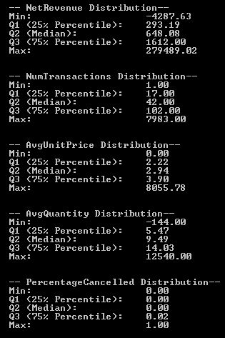

如果您仔细观察，会发现一个问题令人担忧。有少数客户具有负净收入和负平均数量。这表明一些客户的取消订单数量可能超过购买订单数量。然而，这是奇怪的。要取消订单，首先需要有一个购买订单。这表明我们的数据集可能不完整，存在一些没有匹配先前购买订单的孤儿取消订单。由于我们无法回到过去为那些有孤儿取消订单的客户提取更多数据，处理这个问题的最简单方法就是删除那些有孤儿取消订单的客户。以下代码展示了我们可以用来删除此类客户的某些标准：

```py
// 1\. Drop Customers with Negative NetRevenue
featuresDF = featuresDF.Rows[
    featuresDF["NetRevenue"].Where(x => x.Value >= 0.0).Keys
];
// 2\. Drop Customers with Negative AvgQuantity
featuresDF = featuresDF.Rows[
    featuresDF["AvgQuantity"].Where(x => x.Value >= 0.0).Keys
];
// 3\. Drop Customers who have more cancel orders than purchase orders
featuresDF = featuresDF.Rows[
    featuresDF["PercentageCancelled"].Where(x => x.Value < 0.5).Keys
];
```

如您从这段代码片段中可以看到，我们删除了任何具有负净收入、负平均数量和取消订单百分比超过 50%的客户。在删除这些客户后，结果分布看起来如下：

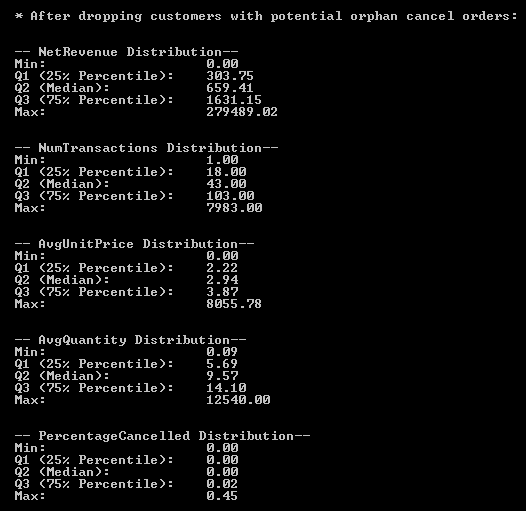

如您从这些分布中可以看到，每个特征的尺度都非常不同。`NetRevenue`的范围从 0 到 279,489.02，而`PercentageCancelled`的范围从 0 到 0.45。我们将把这些特征转换成百分位数，这样我们就可以让所有特征都在 0 到 1 的同一尺度上。以下代码显示了如何计算每个特征的百分位数：

```py
// Create Percentile Features
featuresDF.AddColumn(
    "NetRevenuePercentile",
    featuresDF["NetRevenue"].Select(
        x => StatsFunctions.PercentileRank(featuresDF["NetRevenue"].Values.ToArray(), x.Value)
    )
);
featuresDF.AddColumn(
    "NumTransactionsPercentile",
    featuresDF["NumTransactions"].Select(
        x => StatsFunctions.PercentileRank(featuresDF["NumTransactions"].Values.ToArray(), x.Value)
    )
);
featuresDF.AddColumn(
    "AvgUnitPricePercentile",
    featuresDF["AvgUnitPrice"].Select(
        x => StatsFunctions.PercentileRank(featuresDF["AvgUnitPrice"].Values.ToArray(), x.Value)
    )
);
featuresDF.AddColumn(
    "AvgQuantityPercentile",
    featuresDF["AvgQuantity"].Select(
        x => StatsFunctions.PercentileRank(featuresDF["AvgQuantity"].Values.ToArray(), x.Value)
    )
);
featuresDF.AddColumn(
    "PercentageCancelledPercentile",
    featuresDF["PercentageCancelled"].Select(
        x => StatsFunctions.PercentileRank(featuresDF["PercentageCancelled"].Values.ToArray(), x.Value)
    )
);
Console.WriteLine("\n\n\n* Percentile Features:");
featuresDF.Columns[
    new string[] { "NetRevenue", "NetRevenuePercentile", "NumTransactions", "NumTransactionsPercentile" }
].Print();
StatsFunctions.PercentileRank method, which is part of the CenterSpace.NMath.Stats package. You can easily install this package using the following command in the Package Manager console:
```

```py
Install-Package CenterSpace.NMath.Stats
```

使用`StatsFunctions.PercentileRank`方法，我们可以计算每条记录的百分位数。以下输出显示了`NetRevenue`和`NumTransactions`特征的计算结果：

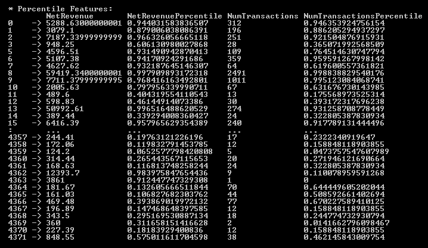

如您从输出中可以看到，这两个特征的值现在都在 0 到 1 之间，而不是一个广泛的范围。在下一节构建聚类模型时，我们将使用这些百分位数特征。

这个特征工程步骤的完整代码可以在以下链接中找到：[`github.com/yoonhwang/c-sharp-machine-learning/blob/master/ch.6/FeatureEngineering.cs`](https://github.com/yoonhwang/c-sharp-machine-learning/blob/master/ch.6/FeatureEngineering.cs)。

# 无监督学习 - k-means 聚类

现在是时候开始构建我们的聚类模型了。在这个项目中，我们将尝试根据以下三个特征将客户聚类到不同的细分市场：`NetRevenuePercentile`、`AvgUnitPricePercentile`和`AvgQuantityPercentile`，这样我们就可以根据客户的消费习惯来分析商品选择。在我们开始将 k-means 聚类算法拟合到特征集之前，有一个重要的步骤我们需要采取。我们需要对特征进行归一化，这样我们的聚类模型就不会对某些特征赋予比其他特征更多的权重。如果特征的方差不同，那么聚类算法可能会对那些方差小的特征赋予更多的权重，并倾向于将它们聚在一起。以下代码显示了如何归一化每个特征：

```py
string[] features = new string[] { "NetRevenuePercentile", "AvgUnitPricePercentile", "AvgQuantityPercentile" };
Console.WriteLine("* Features: {0}\n\n", String.Join(", ", features));

var normalizedDf = Frame.CreateEmpty<int, string>();
var average = ecommerceDF.Columns[features].Sum() / ecommerceDF.RowCount;
foreach(string feature in features)
{
    normalizedDf.AddColumn(feature, (ecommerceDF[feature] - average[feature]) / ecommerceDF[feature].StdDev());
}
```

现在我们已经归一化了变量，让我们开始构建聚类模型。为了构建一个 k-means 聚类模型，我们需要提前知道我们想要的聚类数量。由于我们不知道最佳聚类数量是多少，我们将尝试几个不同的聚类数量，并依靠验证指标，即轮廓分数（Silhouette Score），来告诉我们最佳的聚类数量是多少。以下代码显示了如何构建使用 k-means 聚类算法的聚类模型：

```py
int[] numClusters = new int[] { 4, 5, 6, 7, 8 };
List<string> clusterNames = new List<string>();
List<double> silhouetteScores = new List<double>();
for(int i = 0; i < numClusters.Length; i++)
{
    KMeans kmeans = new KMeans(numClusters[i]);
    KMeansClusterCollection clusters = kmeans.Learn(sampleSet);
    int[] labels = clusters.Decide(sampleSet);

    string colname = String.Format("Cluster-{0}", numClusters[i]);
    clusterNames.Add(colname);

    normalizedDf.AddColumn(colname, labels);
    ecommerceDF.AddColumn(colname, labels);

    Console.WriteLine("\n\n\n##################### {0} ###########################", colname);

    Console.WriteLine("\n\n* Centroids for {0} clusters:", numClusters[i]);

    PrintCentroidsInfo(clusters.Centroids, features);
    Console.WriteLine("\n");

    VisualizeClusters(normalizedDf, colname, "NetRevenuePercentile", "AvgUnitPricePercentile");
    VisualizeClusters(normalizedDf, colname, "AvgUnitPricePercentile", "AvgQuantityPercentile");
    VisualizeClusters(normalizedDf, colname, "NetRevenuePercentile", "AvgQuantityPercentile");

    for (int j = 0; j < numClusters[i]; j++)
    {
        GetTopNItemsPerCluster(ecommerceDF, j, colname);
    }

    double silhouetteScore = CalculateSilhouetteScore(normalizedDf, features, numClusters[i], colname);
    Console.WriteLine("\n\n* Silhouette Score: {0}", silhouetteScore.ToString("0.0000"));

    silhouetteScores.Add(silhouetteScore);
    Console.WriteLine("\n\n##############################################################\n\n\n");
}
4, 5, 6, 7, and 8 clusters. We can instantiate a k-means clustering algorithm object using the KMeans class in the Accord.NET framework. Using the Learn method, we can train a k-means clustering model with the feature set we have. Then, we can use the Decide method to get the cluster labels for each record.
```

当您运行此代码时，它将输出每个聚类的中心点。以下是一个 4 聚类聚类模型的聚类中心点输出：

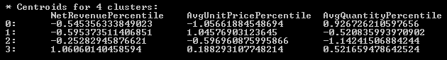

如您从输出结果中可以看到，标签为 3 的簇是由那些具有高净收入、中等偏高的平均单价和中等偏高的平均数量的客户组成的。因此，这些客户是高价值客户，他们带来了最多的收入，并且以高于平均的价格购买数量也高于平均水平的商品。相比之下，标签为 1 的簇是由那些具有低净收入、高平均单价和中等偏低平均数量的客户组成的。因此，这些客户以平均数量购买昂贵的商品，并且为在线商店带来的收入并不多。您可能已经注意到这个例子，您已经可以看到不同簇之间的一些模式。现在让我们看看每个细分市场中的哪些客户购买最多。以下是为 4 簇聚类模型每个细分市场购买的前 10 个商品：

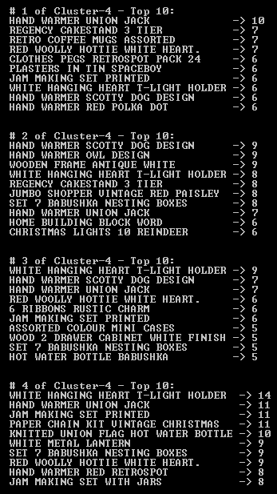

每个细分市场的这个前 10 个商品列表为您提供了一个大致的概念，了解每个细分市场的客户购买最多的商品类型。这超出了本章的范围，但您可以进一步分析商品描述中的单个单词，并使用词频分析，例如我们在第二章“垃圾邮件过滤”和第三章“Twitter 情感分析”中所做的那样。可视化聚类结果的另一种方法是绘制细分市场的散点图。以下图表显示了 4 簇聚类模型中`NetRevenuePercentile`与`AvgQuantityPercentile`的散点图：

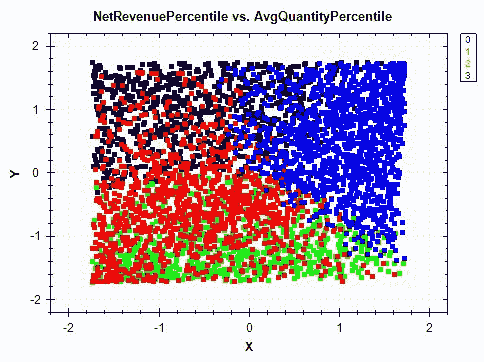

以下图表显示了 4 簇聚类模型中`AvgUnitPricePercentile`与`AvgQuantityPercentile`的散点图：

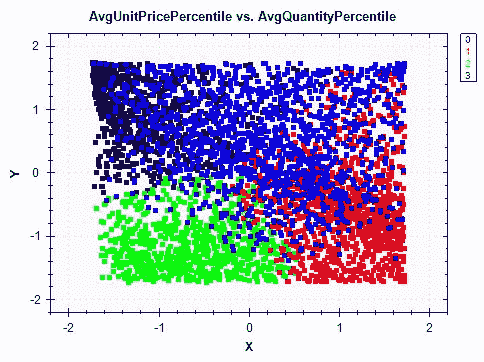

以下图表显示了 4 簇聚类模型中`NetRevenuePercentile`与`AvgUnitPricePercentile`的散点图：

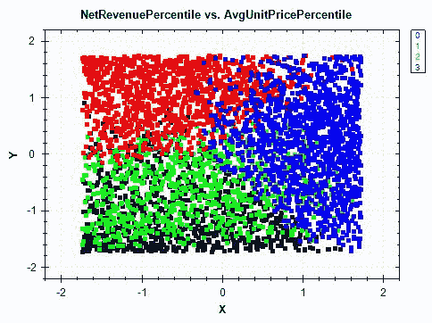

如您从这些图表中可以看到，散点图是可视化每个簇形成方式和每个簇边界的好方法。例如，如果您查看`NetRevenuePercentile`与`AvgUnitPricePercentile`的散点图，簇 1 具有高平均单价和低净收入。这与我们从查看簇中心点得出的发现相对应。对于更高维度和更多簇的情况，使用散点图进行可视化变得更加困难。然而，在图表中进行可视化通常有助于更容易地从这些聚类分析中得出见解。让我们开始探讨如何使用轮廓系数评估簇的质量和选择最佳簇数量。

在这个 k-means 聚类步骤中使用的完整代码可以在以下链接中找到：[`github.com/yoonhwang/c-sharp-machine-learning/blob/master/ch.6/Clustering.cs`](https://github.com/yoonhwang/c-sharp-machine-learning/blob/master/ch.6/Clustering.cs)。

# 使用轮廓系数进行聚类模型验证

**Silhouette 系数**或**Silhouette 分数**提供了一种简单的方法来评估簇的质量。Silhouette 系数衡量一个对象与其自身簇的紧密程度相对于其他簇。计算 Silhouette 系数的方法如下；对于每个记录，`i`，计算该记录与同一簇中所有其他记录的平均距离，并称这个数字为`a[i]`。然后，计算该记录与每个其他簇中所有其他记录的平均距离，对于所有其他簇，取最低的平均距离，并称这个数字为`b[i]`。一旦你有了这两个数字，从`b[i]`中减去`a[i]`，然后除以`a[i]`和`b[i]`之间的最大值。你迭代这个过程，为数据集中的所有记录计算平均值以获得 Silhouette 系数。以下是一个用于计算单个数据点 Silhouette 系数的公式：

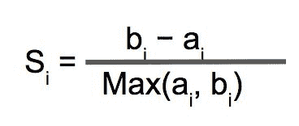

为了获得最终的 Silhouette 值，你需要遍历数据点，并取 Silhouette 值的平均值。Silhouette 系数介于-1 和 1 之间。越接近 1，簇的质量越好。以下代码展示了我们如何实现这个公式：

```py
private static double CalculateSilhouetteScore(Frame<int, string> df, string[] features, int numCluster, string clusterColname)
{
    double[][] data = BuildJaggedArray(df.Columns[features].ToArray2D<double>(), df.RowCount, features.Length);

    double total = 0.0;
    for(int i = 0; i < df.RowCount; i++)
    {
        double sameClusterAverageDistance = 0.0;
        double differentClusterDistance = 1000000.0;

        double[] point = df.Columns[features].GetRowAt<double>(i).Values.ToArray();
        double cluster = df[clusterColname].GetAt(i);

        for(int j = 0; j < numCluster; j++)
        {
            double averageDistance = CalculateAverageDistance(df, features, clusterColname, j, point);

            if (cluster == j)
            {
                sameClusterAverageDistance = averageDistance;
            } else
            {
                differentClusterDistance = Math.Min(averageDistance, differentClusterDistance);
            }
        }

        total += (differentClusterDistance - sameClusterAverageDistance) / Math.Max(sameClusterAverageDistance, differentClusterDistance);
    }

    return total / df.RowCount;
}
```

以下是一个计算数据点与簇中所有点之间平均距离的辅助函数：

```py
private static double CalculateAverageDistance(Frame<int, string> df, string[] features, string clusterColname, int cluster, double[] point)
{
    var clusterDF = df.Rows[
        df[clusterColname].Where(x => (int)x.Value == cluster).Keys
    ];
    double[][] clusterData = BuildJaggedArray(
        clusterDF.Columns[features].ToArray2D<double>(),
        clusterDF.RowCount,
        features.Length
    );

    double averageDistance = 0.0;
    for (int i = 0; i < clusterData.Length; i++)
    {
        averageDistance += Math.Sqrt(
            point.Select((x, j) => Math.Pow(x - clusterData[i][j], 2)).Sum()
        );
    }
    averageDistance /= (float)clusterData.Length;

    return averageDistance;
}
```

从代码中可以看出，我们遍历每个数据点，并开始计算给定数据点与不同簇中所有其他记录的平均距离。然后，我们取不同簇中最低平均距离与同一簇中平均距离之间的差值，并除以这两个数字中的最大值。一旦我们遍历了所有数据点，我们取这个 Silhouette 值的平均值，并将其作为聚类模型的 Silhouette 系数返回。

当你运行具有不同簇数量的聚类模型代码时，你会看到以下类似的输出：

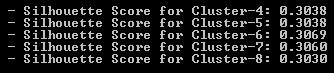

从这个输出中可以看出，随着我们将簇的数量增加到一定点，Silhouette Score 会增加，然后又下降。在我们的案例中，具有六个簇的 k-means 聚类模型表现最佳，六个簇似乎是我们数据集的最佳选择。

经常情况下，仅仅查看轮廓系数并不足以决定最佳的聚类数量。例如，一个具有大量聚类的聚类模型可以拥有很高的轮廓分数，但这并不能帮助我们从这个聚类模型中得出任何见解。由于聚类分析主要用于解释性分析，以从数据中提取见解和识别隐藏的模式，因此聚类结果的可解释性非常重要。将轮廓分数与二维或三维散点图相结合，将有助于你确定最佳聚类数量，并决定什么对你的数据集和项目最有意义。

# 摘要

在本章中，我们探讨了无监督学习及其如何用于从数据中提取见解和识别隐藏的模式。与迄今为止我们工作的其他项目不同，我们没有特定的目标变量，我们的机器学习模型可以从这些变量中学习。我们只有一个原始的在线零售数据集，其中包含了客户在在线商店购买的商品、数量和单价信息。使用这个给定的数据集，我们将交易级数据转换为客户级数据，并创建了大量的聚合特征。我们学习了如何利用 Deedle 的数据框中的`AggregateRowsBy`方法来创建聚合特征并将数据集转换为以客户为中心的视图。然后我们简要讨论了一个新的库，`CenterSpace.NMath.Stats`，我们可以用它来进行各种统计计算。更具体地说，我们使用了`StatsFunctions.PercentileRank`方法来计算给定特征的每个记录的百分位数。

我们介绍了如何使用`Accord.NET`框架来拟合 k-means 聚类算法。使用 k-means 聚类算法，我们能够构建具有不同聚类数量的几个聚类模型。我们以 4 聚类聚类模型为例，讨论了如何通过它来提取见解，以及如何将客户聚类到不同的客户细分市场，其中某一细分市场的客户特征是高净收入、平均单价高于平均水平以及平均数量高于平均水平，而另一细分市场的客户特征是低净收入、高平均单价以及平均数量低于平均水平，等等。然后我们查看每个客户细分市场购买频率最高的前 10 个商品，并在我们的特征空间上创建了不同细分市场的散点图。

最后，我们使用了**S**轮廓系数来评估聚类质量，并学习了如何将其作为选择最佳聚类数量的标准之一。

从下一章开始，我们将开始构建音频和图像数据集的模型。在下一章中，我们将讨论如何使用音乐音频数据集构建音乐流派推荐模型。我们将学习如何构建一个输出为各个类别可能性排名的排名系统。我们还将学习使用哪些类型的指标来评估这样的排名模型。
