# 音乐流派推荐

在本章中，我们将回到监督学习。我们已经使用逻辑回归、朴素贝叶斯、随机森林和**支持向量机**（**SVM**）等学习算法为分类和回归问题构建了大量的监督学习算法。然而，我们构建的这些模型输出的数量始终是单一的。在我们的 Twitter 情感分析项目中，输出只能是积极、消极或中性之一。另一方面，在我们的房价预测项目中，输出是预测的房价的对数。与我们的先前项目不同，有些情况下我们希望我们的**机器学习**（**ML**）模型能够输出多个值。推荐系统就是需要能够产生排序预测的 ML 模型的一个例子。

在本章中，我们将使用一个包含各种音频特征的数据库，这些特征是从众多音乐录音中编译而来的。利用这些数据，我们将探讨音频特征值，如声音谱的峰度和偏度，在不同歌曲流派中的分布情况。然后，我们将开始构建多个 ML 模型，这些模型将输出给定歌曲属于每个音乐流派预测的概率，而不是仅输出给定歌曲最可能流派的一个预测输出。一旦我们构建了这些模型，我们将进一步将这些基础模型的预测结果进行集成，以构建一个用于最终歌曲音乐流派推荐的元模型。我们将使用不同的模型验证指标，**平均倒数排名**（**MRR**），来评估我们的排序模型。

在本章中，我们将涵盖以下主题：

+   音乐流派推荐项目的问题定义

+   音频特征数据集的数据分析

+   音乐流派分类的机器学习模型

+   集成基础学习模型

+   评估推荐/排序模型

# 问题定义

让我们更详细地探讨，并正确定义我们将要解决的问题以及为这个项目构建的机器学习模型。音乐流媒体服务，如 Pandora 和 Spotify，需要音乐推荐系统，这样他们就可以推荐和播放听众可能喜欢的歌曲。构建音乐推荐系统的方式不止一种。一种方式是查看其他类似用户听过的歌曲，而定义类似用户的方法是查看他们听过的歌曲历史。然而，如果用户是平台的新用户，或者我们没有足够的历史歌曲数据，这种方法可能不会很好地工作。在这种情况下，我们不能依赖于历史数据。相反，使用用户当前正在听的歌曲的属性来推荐其他音乐会更好。一首歌曲的属性在音乐推荐中可以发挥重要作用的是音乐类型。一个用户当前在平台上听音乐时，很可能喜欢继续听相同或相似的音乐。想象一下，你正在听器乐音乐，而音乐流媒体应用突然播放了摇滚音乐。这不会是一个顺畅的过渡，也不会是一个好的用户体验，因为你很可能想继续听器乐音乐。通过正确识别歌曲的类型并推荐正确的歌曲类型来播放，你可以避免打扰你的音乐流媒体服务的用户体验。

为了构建音乐类型推荐模型，我们将使用**FMA：音乐分析数据集**，它包含超过 10 万首歌曲的大量数据。该数据集包含关于专辑、标题、音频属性等信息，完整的数据集可以通过此链接找到并下载：[`github.com/mdeff/fma`](https://github.com/mdeff/fma)。有了这些数据，我们将选择感兴趣的特征，并构建多个输出每首歌曲属于不同音乐类型概率的机器学习模型。然后，我们将根据概率对音乐类型进行排序。我们将尝试各种学习算法，如逻辑回归、朴素贝叶斯和 SVM。我们将进一步使用集成技术，将这些模型的输出作为另一个机器学习模型的输入，该模型产生最终的预测和推荐输出。我们将使用 MRR 作为评估我们的音乐类型推荐模型的指标。

为了总结我们对音乐类型推荐项目的定义问题：

+   问题是怎样的？我们需要一个推荐模型，该模型能够根据歌曲属于每个音乐类型的可能性进行排序，以便我们能够正确识别歌曲的类型并推荐下一首歌曲。

+   这为什么是个问题？使用历史数据为音乐推荐并不适用于那些刚接触该平台的新用户，因为他们不会有足够的历史数据来进行好的音乐推荐。在这种情况下，我们将不得不使用音频和其他特征来识别接下来要播放的音乐。正确识别和推荐音乐流派是确定接下来要播放哪首歌的第一步。

+   解决这个问题的方法有哪些？我们将使用公开可用的音乐数据，这些数据不仅包含关于专辑、标题和艺术家信息，还包含关于众多音频特征的信息。然后，我们将构建输出概率的 ML 模型，并使用这个概率输出对给定歌曲的流派进行排序。

+   成功的标准是什么？我们希望正确的音乐流派能够作为预测流派中的前几个出现。我们将使用 MRR 作为评估排名模型的指标。

# 音频特征数据集的数据分析

让我们开始研究音频特征数据集。为了专注于构建音乐流派推荐模型，我们将原始数据集**FMA：音乐分析数据集**进行了裁剪。您可以从以下链接下载此数据：[`github.com/yoonhwang/c-sharp-machine-learning/blob/master/ch.7/sample.csv`](https://github.com/yoonhwang/c-sharp-machine-learning/blob/master/ch.7/sample.csv)。

# 目标变量分布

```py
genre_top, and counted the number of records for each genre:
```

```py
var genreCount = featuresDF.AggregateRowsBy<string, int>(
    new string[] { "genre_top" },
    new string[] { "track_id" },
    x => x.ValueCount
).SortRows("track_id");

genreCount.Print();

var barChart = DataBarBox.Show(
    genreCount.GetColumn<string>("genre_top").Values.ToArray().Select(x => x.Substring(0,3)),
    genreCount["track_id"].Values.ToArray()
).SetTitle(
    "Genre Count"
);
```

与前几章类似，我们在 Deedle 数据框中使用了`AggregateRowsBy`方法来计算每个流派记录的数量。然后，我们使用了`DataBarBox`类来创建一个条形图，直观地显示了目标变量的分布。如您从这段代码片段（第 10 行）中看到的那样，我们正在使用每个流派名称的前三个字母作为条形图中每个流派标签。

当您运行此代码时，您将看到以下输出，显示了目标变量的分布：

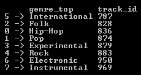

下面的图表显示了目标变量的条形图分布：

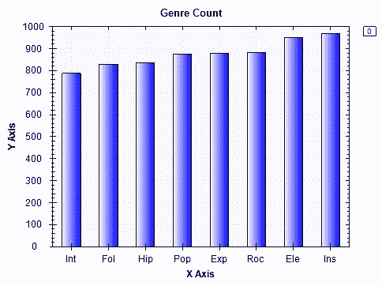

如您从这张图表中可以看到，在我们的样本集中，**Instrumental**（**Ins**）音乐的数字最大，其次是**Electronic**（**Ele**）和**Rock**（**Roc**），分别位列第二和第三。尽管这个样本集中某些流派的歌曲比其他流派多，但这仍然是一个相对均衡的集合，其中没有任何一个流派占据样本记录的大多数。现在，让我们来看看我们一些特征的分部情况。

# 音频特征 – MFCC

对于这个项目，我们将关注完整数据集具有的子集特征。我们将使用 **梅尔频率倒谱系数**（**MFCCs**）及其统计分布作为我们机器学习模型的特征。简单来说，**MFCC** 是声音频谱的表示，我们将使用其统计分布、峰度、偏度、最小值、最大值、平均值、中位数和标准差。如果您查看从上一步下载的样本集，您将看到列名是根据相应的统计分布命名的。我们将首先查看这些特征的分布。以下代码片段显示了我们是如何计算每个特征的四分位数的：

```py
foreach (string col in featuresDF.ColumnKeys)
{
    if (col.StartsWith("mfcc"))
    {
        int idx = int.Parse(col.Split('.')[2]);
        if(idx <= 4)
        {
            Console.WriteLine(String.Format("\n\n-- {0} Distribution -- ", col));
            double[] quantiles = Accord.Statistics.Measures.Quantiles(
                featuresDF[col].ValuesAll.ToArray(),
                new double[] { 0, 0.25, 0.5, 0.75, 1.0 }
            );
            Console.WriteLine(
                "Min: \t\t\t{0:0.00}\nQ1 (25% Percentile): \t{1:0.00}\nQ2 (Median): \t\t{2:0.00}\nQ3 (75% Percentile): \t{3:0.00}\nMax: \t\t\t{4:0.00}",
                quantiles[0], quantiles[1], quantiles[2], quantiles[3], quantiles[4]
            );
        }
    }
}
```

与前几章类似，我们在 `Accord.Statistics.Measures` 类中使用 `Quantiles` 方法来计算四分位数，这三个数将值分为四个子集——最小值和中位数之间的中间数（25^(th) 百分位数），中位数（50^(th) 百分位数），以及中位数和最大值之间的中间数（75^(th) 百分位数）。如您在代码片段的第 6 行中看到的那样，我们只显示了前四个系数的统计分布。对于您进一步的实验，您可以查看所有 MFCC 特征的分布，而不仅限于这四个。让我们快速看一下其中的一些分布。

前四个系数峰度的分布看起来如下：

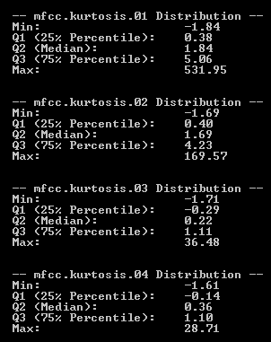

如您从输出结果中可以看到，大多数峰度值介于 -2 和 5 之间，但也有一些情况峰度可以取较大的值。现在让我们看看前四个系数的偏度分布：

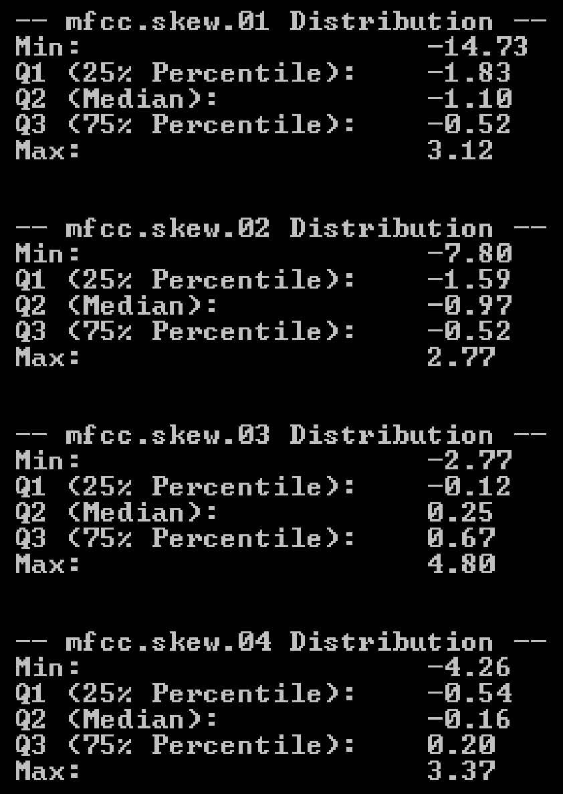

偏度变化范围较窄。通常，偏度值似乎介于 -15 和 5 之间。最后，让我们看看前四个系数平均值的分布：

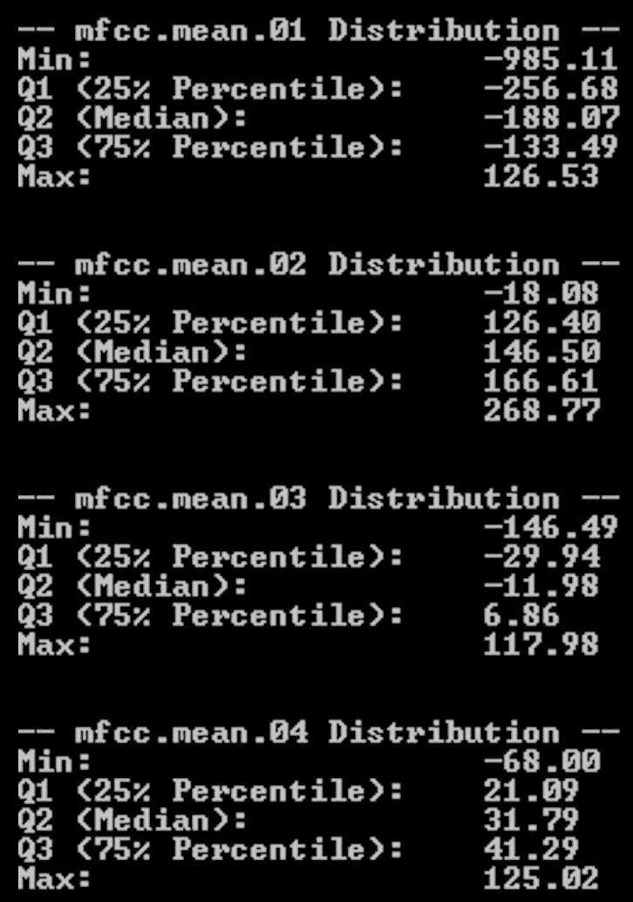

如您从输出结果中可以看到，平均值似乎有所变化，并且范围较广。它可以取介于 -1,000 和 300 之间的任何值。

现在我们对音频特征分布有了大致的了解，让我们看看是否能在不同流派的特征分布中找到任何差异。我们将绘制一个散点图，其中 *x* 轴是每个特征的索引，*y* 轴是给定特征的值。让我们先看看这些图表，因为有了视觉辅助将更容易理解。

以下图表显示了四个不同流派峰度的分布：

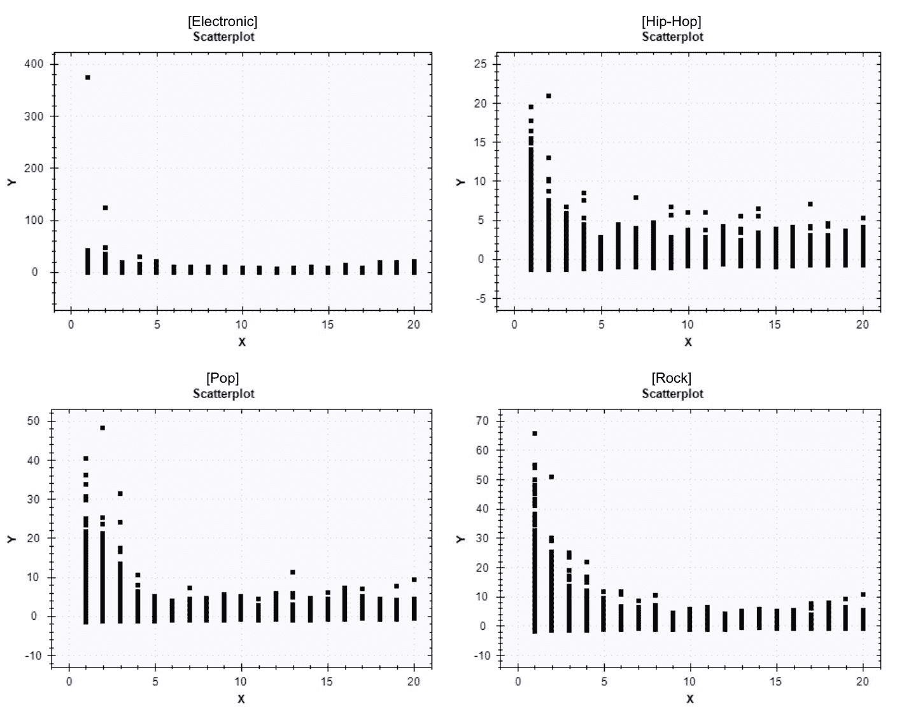

如前所述，*x* 轴指的是每个特征的索引。由于我们有 20 个 MFCC 峰度的独立特征，x 值的范围从 1 到 20。另一方面，*y* 轴显示了给定特征的分布。如您从这张图表中看到的那样，不同流派之间特征分布存在一些差异，这将有助于我们的机器学习模型学习如何正确预测给定歌曲的流派。

以下图表显示了四种不同流派偏度的分布：

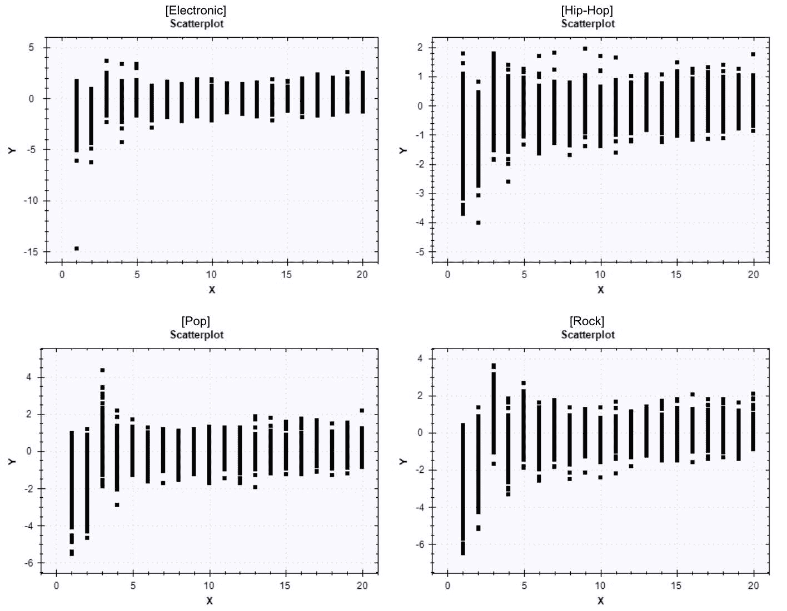

最后，以下图表显示了四种不同流派的平均分布：

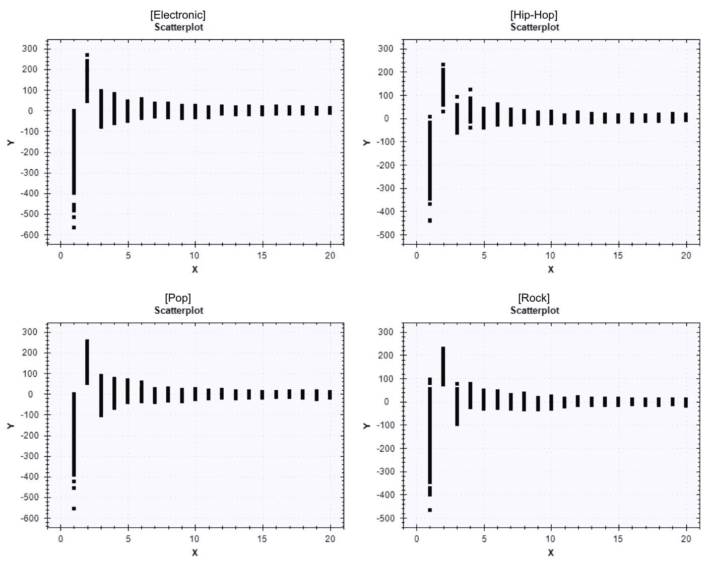

与峰度和偏度相比，不同流派中每个特征的均值分布似乎更相似。

为了创建这些图表，我们使用了`ScatterplotBox`类。以下代码展示了我们如何创建之前的图表：

```py
string[] attributes = new string[] { "kurtosis", "min", "max", "mean", "median", "skew", "std" };
foreach (string attribute in attributes)
{
    string[] featureColumns = featuresDF.ColumnKeys.Where(x => x.Contains(attribute)).ToArray();
    foreach (string genre in genreCount.GetColumn<string>("genre_top").Values)
    {
        var genreDF = featuresDF.Rows[
            featuresDF.GetColumn<string>("genre_top").Where(x => x.Value == genre).Keys
        ].Columns[featureColumns];

        ScatterplotBox.Show(
            BuildXYPairs(
                genreDF.Columns[featureColumns].ToArray2D<double>(),
                genreDF.RowCount,
                genreDF.ColumnCount
            )
        ).SetTitle(String.Format("{0}-{1}", genre, attribute));
    }
}
```

如您从这段代码中看到的那样，我们从第 2 行开始迭代不同的统计分布（`峰度`、`最小值`、`最大值`等），在第 7 行中从`featuresDF`中子选择我们感兴趣的列。然后，我们编写并使用了一个辅助函数来构建散点图的 x-y 对数组，并使用`ScatterplotBox`类的`Show`方法显示它。

构建散点图 x-y 对的辅助函数的代码如下：

```py
private static double[][] BuildXYPairs(double[,] ary2D, int rowCount, int columnCount)
{
    double[][] ary = new double[rowCount*columnCount][];
    for (int i = 0; i < rowCount; i++)
    {
        for (int j = 0; j < columnCount; j++)
        {
            ary[i * columnCount + j] = new double[2];
            ary[i * columnCount + j][0] = j + 1;
            ary[i * columnCount + j][1] = ary2D[i, j];
        }
    }
    return ary;
}
```

如您从这段代码中看到的，该方法将特征的索引作为 x 值，将特征的值作为 y 值。

此数据分析步骤的完整代码可以在以下链接找到：[`github.com/yoonhwang/c-sharp-machine-learning/blob/master/ch.7/DataAnalyzer.cs`](https://github.com/yoonhwang/c-sharp-machine-learning/blob/master/ch.7/DataAnalyzer.cs)。

# 音乐流派分类的机器学习模型

我们现在将开始构建音乐流派分类的机器学习模型。在这个项目中，我们机器学习模型的输出将采取稍微不同的形式。与其他我们已经构建的监督学习模型不同，我们希望我们的模型为给定歌曲的每个流派输出可能性或概率。因此，我们的模型输出将不是单个值，而是八个值，其中每个值将代表给定歌曲属于八个流派（电子、实验、民谣、嘻哈、乐器、国际、流行和摇滚）之一的概率。为了实现这一点，我们将在我们迄今为止一直在使用的`Decide`方法之上使用每个模型类中的`Probabilities`方法。

# 逻辑回归

我们将要实验的第一个模型是逻辑回归。以下代码展示了我们如何构建一个用于训练和测试集 80/20 分割的逻辑回归分类器：

```py
// 1\. Train a LogisticRegression Classifier
Console.WriteLine("\n---- Logistic Regression Classifier ----\n");
var logitSplitSet = new SplitSetValidation<MultinomialLogisticRegression, double[]>()
{
    Learner = (s) => new MultinomialLogisticLearning<GradientDescent>()
    {
        MiniBatchSize = 500
    },

    Loss = (expected, actual, p) => new ZeroOneLoss(expected).Loss(actual),

    Stratify = false,

    TrainingSetProportion = 0.8,

    ValidationSetProportion = 0.2,

};

var logitResult = logitSplitSet.Learn(input, output);

var logitTrainedModel = logitResult.Model;

// Store train & test set indexes to train other classifiers on the same train set
// and test on the same validation set
int[] trainSetIDX = logitSplitSet.IndicesTrainingSet;
int[] testSetIDX = logitSplitSet.IndicesValidationSet;
```

如您应该已经熟悉的那样，我们使用`SplitSetValidation`将我们的样本集分为训练集和测试集。我们使用样本集的 80%进行训练，其余的 20%用于测试和评估我们的模型。我们使用`MultinomialLogisticRegression`作为多类分类器的模型，使用带有`GradientDescent`的`MultinomialLogisticLearning`作为学习算法。与前面的章节类似，我们使用`ZeroOneLoss`作为分类器的`Loss`函数。

如您在代码底部所看到的，我们将训练好的逻辑回归分类器模型存储到单独的变量`logitTrainedModel`中，同时也存储了训练和测试集的索引，以便在训练和测试其他学习算法时使用。我们这样做是为了能够在不同的 ML 模型之间进行模型性能的面对面比较。

使用此训练好的逻辑回归模型进行样本内和样本外预测的代码如下：

```py
// Get in-sample & out-of-sample predictions and prediction probabilities for each class
double[][] trainProbabilities = new double[trainSetIDX.Length][];
int[] logitTrainPreds = new int[trainSetIDX.Length];
for (int i = 0; i < trainSetIDX.Length; i++)
{
    logitTrainPreds[i] = logitTrainedModel.Decide(input[trainSetIDX[i]]);
    trainProbabilities[i] = logitTrainedModel.Probabilities(input[trainSetIDX[i]]);
}

double[][] testProbabilities = new double[testSetIDX.Length][];
int[] logitTestPreds = new int[testSetIDX.Length];
for (int i = 0; i < testSetIDX.Length; i++)
{
    logitTestPreds[i] = logitTrainedModel.Decide(input[testSetIDX[i]]);
    testProbabilities[i] = logitTrainedModel.Probabilities(input[testSetIDX[i]]);
}
```

如前所述，我们使用`MultinomialLogisticRegression`模型的`Probabilities`方法，它输出一个概率数组，每个索引代表给定歌曲属于相应音乐类型的概率。以下代码展示了我们如何编码每个类型：

```py
IDictionary<string, int> targetVarCodes = new Dictionary<string, int>
{
    { "Electronic", 0 },
    { "Experimental", 1 },
    { "Folk", 2 },
    { "Hip-Hop", 3 },
    { "Instrumental", 4 },
    { "International", 5 },
    { "Pop", 6 },
    { "Rock", 7 }
};
featuresDF.AddColumn("target", featuresDF.GetColumn<string>("genre_top").Select(x => targetVarCodes[x.Value]));
```

让我们尝试使用与逻辑回归模型相同的训练和测试集索引来训练另一个 ML 模型。

# 带高斯核的 SVM

使用以下代码，您可以训练一个多类 SVM 模型：

```py
// 2\. Train a Gaussian SVM Classifier
Console.WriteLine("\n---- Gaussian SVM Classifier ----\n");
var teacher = new MulticlassSupportVectorLearning<Gaussian>()
{
    Learner = (param) => new SequentialMinimalOptimization<Gaussian>()
    {
        Epsilon = 2,
        Tolerance = 1e-2,
        Complexity = 1000,
        UseKernelEstimation = true
    }
};
// Train SVM model using the same train set that was used for Logistic Regression Classifier
var svmTrainedModel = teacher.Learn(
    input.Where((x,i) => trainSetIDX.Contains(i)).ToArray(),
    output.Where((x, i) => trainSetIDX.Contains(i)).ToArray()
);
```

如您从这段代码中可以看到，与我们之前构建的 SVM 模型相比，只有一个细微的差别。我们使用`MulticlassSupportVectorLearning`而不是之前在第五章“房屋和财产的公允价值”中使用的`LinearRegressionNewtonMethod`或`FanChenLinSupportVectorRegression`。这是因为我们现在有一个多类分类问题，需要为这样的 SVM 模型使用不同的学习算法。正如我们在另一章中讨论过的，超参数，如`Epsilon`、`Tolerance`和`Complexity`，是可以调整的，您应该尝试其他值以获得性能更好的模型。

这里需要注意的一点是，当我们训练 SVM 模型时，我们使用与构建逻辑回归模型相同的训练集。如您在代码底部所看到的，我们选择了与之前用于逻辑回归模型的训练集相同索引的记录。这是为了确保我们可以正确地进行 SVM 模型与逻辑回归模型性能的面对面比较。

与之前的逻辑回归模型类似，我们使用以下代码进行样本内和样本外预测，使用训练好的 SVM 模型：

```py
// Get in-sample & out-of-sample predictions and prediction probabilities for each class
double[][] svmTrainProbabilities = new double[trainSetIDX.Length][];
int[] svmTrainPreds = new int[trainSetIDX.Length];
for (int i = 0; i < trainSetIDX.Length; i++)
{
    svmTrainPreds[i] = svmTrainedModel.Decide(input[trainSetIDX[i]]);
    svmTrainProbabilities[i] = svmTrainedModel.Probabilities(input[trainSetIDX[i]]);
}

double[][] svmTestProbabilities = new double[testSetIDX.Length][];
int[] svmTestPreds = new int[testSetIDX.Length];
for (int i = 0; i < testSetIDX.Length; i++)
{
    svmTestPreds[i] = svmTrainedModel.Decide(input[testSetIDX[i]]);
    svmTestProbabilities[i] = svmTrainedModel.Probabilities(input[testSetIDX[i]]);
}
```

`MulticlassSupportVectorMachine` 类还提供了 `Probabilities` 方法，通过这个方法我们可以得到一首歌曲属于八个流派中的每一个流派的可能性。我们将这些概率输出存储到单独的变量中，`svmTrainProbabilities` 和 `svmTestProbabilities`，用于我们未来的模型评估和模型集成。

# 朴素贝叶斯

我们将构建一个用于音乐流派分类的更多机器学习模型。我们将训练一个朴素贝叶斯分类器。以下代码展示了如何为具有连续值的输入构建朴素贝叶斯分类器：

```py
// 3\. Train a NaiveBayes Classifier
Console.WriteLine("\n---- NaiveBayes Classifier ----\n");
var nbTeacher = new NaiveBayesLearning<NormalDistribution>();

var nbTrainedModel = nbTeacher.Learn(
    input.Where((x, i) => trainSetIDX.Contains(i)).ToArray(),
    output.Where((x, i) => trainSetIDX.Contains(i)).ToArray()
);
```

从这段代码中可以看出，我们正在使用 `NormalDistribution` 作为 `NaiveBayesLearning` 的分布。与之前章节不同，那时我们的朴素贝叶斯分类器的特征是词频，我们现在有音频特征的连续值。在这种情况下，我们需要构建一个高斯朴素贝叶斯分类器。与构建 SVM 模型时类似，我们使用与逻辑回归模型相同的训练集来训练朴素贝叶斯分类器。

以下代码展示了如何使用训练好的朴素贝叶斯分类器获取样本内和样本外的预测概率输出：

```py
// Get in-sample & out-of-sample predictions and prediction probabilities for each class
double[][] nbTrainProbabilities = new double[trainSetIDX.Length][];
int[] nbTrainPreds = new int[trainSetIDX.Length];
for (int i = 0; i < trainSetIDX.Length; i++)
{
    nbTrainProbabilities[i] = nbTrainedModel.Probabilities(input[trainSetIDX[i]]);
    nbTrainPreds[i] = nbTrainedModel.Decide(input[trainSetIDX[i]]);
}

double[][] nbTestProbabilities = new double[testSetIDX.Length][];
int[] nbTestPreds = new int[testSetIDX.Length];
for (int i = 0; i < testSetIDX.Length; i++)
{
    nbTestProbabilities[i] = nbTrainedModel.Probabilities(input[testSetIDX[i]]);
    nbTestPreds[i] = nbTrainedModel.Decide(input[testSetIDX[i]]);
}
```

与 `MulticlassSupportVectorMachine` 和 `MultinomialLogisticRegression` 类类似，`NaiveBayes` 模型也提供了 `Probabilities` 方法。从代码中可以看出，我们将样本内和样本外的预测概率分别存储到两个单独的变量中，`nbTrainProbabilities` 和 `nbTestProbabilities`。

在下一节中，我们将探讨如何将我们迄今为止构建的这些模型进行组合和集成。构建机器学习模型的完整代码可以在以下链接找到：[`github.com/yoonhwang/c-sharp-machine-learning/blob/master/ch.7/Modeling.cs`](https://github.com/yoonhwang/c-sharp-machine-learning/blob/master/ch.7/Modeling.cs)。

# 将基础学习模型进行集成

集成学习是将训练好的模型结合起来以提高其预测能力的方法。我们在之前章节中构建的随机森林分类器就是集成学习的一个例子。它构建了一个决策树森林，其中每个树都是使用样本集的一部分样本和特征进行训练的。这种集成学习方法被称为 **bagging**。本章我们将使用的集成方法是 **stacking**。Stacking 是指使用其他模型的输出构建一个新的机器学习模型，这些模型被称为 **基础学习模型**。

在这个项目中，我们将在之前章节中构建的逻辑回归、SVM 和 Naive Bayes 模型的预测概率输出之上构建一个新的朴素贝叶斯分类器模型。构建新模型的第一步是构建训练输入。以下代码展示了我们如何将基础模型的全部输出组合起来：

```py
// 4\. Ensembling Base Models
Console.WriteLine("\n-- Building Meta Model --");
double[][] combinedTrainProbabilities = new double[trainSetIDX.Length][];
for (int i = 0; i < trainSetIDX.Length; i++)
{
    List<double> combined = trainProbabilities[i]
        .Concat(svmTrainProbabilities[i])
        .Concat(nbTrainProbabilities[i])
        .ToList();
    combined.Add(logitTrainPreds[i]);
    combined.Add(svmTrainPreds[i]);
    combined.Add(nbTrainPreds[i]);

    combinedTrainProbabilities[i] = combined.ToArray();
}

double[][] combinedTestProbabilities = new double[testSetIDX.Length][];
for (int i = 0; i < testSetIDX.Length; i++)
{
    List<double> combined = testProbabilities[i]
        .Concat(svmTestProbabilities[i])
        .Concat(nbTestProbabilities[i])
        .ToList();
    combined.Add(logitTestPreds[i]);
    combined.Add(svmTestPreds[i]);
    combined.Add(nbTestPreds[i]);

    combinedTestProbabilities[i] = combined.ToArray();
}
Console.WriteLine("\n* input shape: ({0}, {1})\n", combinedTestProbabilities.Length, combinedTestProbabilities[0].Length);
```

如此代码所示，我们正在将迄今为止构建的三个模型的预测概率进行拼接。使用这些概率输出数据作为输入，我们将构建一个新的元模型，使用朴素贝叶斯学习算法。以下是我们训练此元模型的代码：

```py
// Build meta-model using NaiveBayes Learning Algorithm
var metaModelTeacher = new NaiveBayesLearning<NormalDistribution>();
var metamodel = metaModelTeacher.Learn(
    combinedTrainProbabilities, 
    output.Where((x, i) => trainSetIDX.Contains(i)).ToArray()
);
```

从此代码中，你可以看到我们仍在使用`NormalDistribution`，因为输入是一组连续值。然后，我们使用之前训练的基础学习模型的组合概率输出来训练这个新的朴素贝叶斯分类器。类似于之前的步骤，我们通过使用`Probabilities`方法从元模型获取预测输出，并将这些结果存储到单独的变量中。使用此新元模型获取训练集和测试集预测输出的代码如下：

```py
// Get in-sample & out-of-sample predictions and prediction probabilities for each class
double[][] metaTrainProbabilities = new double[trainSetIDX.Length][];
int[] metamodelTrainPreds = new int[trainSetIDX.Length];
for (int i = 0; i < trainSetIDX.Length; i++)
{
    metaTrainProbabilities[i] = metamodel.Probabilities(combinedTrainProbabilities[i]);
    metamodelTrainPreds[i] = metamodel.Decide(combinedTrainProbabilities[i]);
}

double[][] metaTestProbabilities = new double[testSetIDX.Length][];
int[] metamodelTestPreds = new int[testSetIDX.Length];
for (int i = 0; i < testSetIDX.Length; i++)
{
    metaTestProbabilities[i] = metamodel.Probabilities(combinedTestProbabilities[i]);
    metamodelTestPreds[i] = metamodel.Decide(combinedTestProbabilities[i]);
}
```

现在我们已经构建了所有模型，让我们开始查看这些模型的性能。在接下来的部分，我们将评估基础模型以及我们刚刚构建的元模型的性能。

# 评估推荐/排序模型

评估对结果进行排序的推荐模型与评估分类模型有很大不同。除了模型预测是否正确之外，我们还关心正确结果在推荐模型中的排名。换句话说，一个预测正确结果为第二名的模型比预测为第四或第五名的模型要好。例如，当你在一个搜索引擎上搜索某物时，在第一页顶部获得最合适的文档是很好的，但即使该文档作为第一页或第二页上的第二个或第三个链接出现，也是可以接受的，只要它不会出现在第一页或第二页的底部。在接下来的几节中，我们将讨论一些评估此类推荐和排序模型的方法。

# 预测准确率

首先要查看的最简单指标是准确率。对于我们所构建的第一个逻辑回归模型，我们可以使用以下代码来获取准确率：

```py
Console.WriteLine(String.Format("train accuracy: {0:0.0000}", 1-logitResult.Training.Value));
Console.WriteLine(String.Format("validation accuracy: {0:0.0000}", 1-logitResult.Validation.Value));
```

对于以下模型，SVM 和朴素贝叶斯分类器，我们可以使用以下代码来计算训练集和测试集预测的准确率：

```py
Console.WriteLine(
    String.Format(
        "train accuracy: {0:0.0000}",
        1 - new ZeroOneLoss(output.Where((x, i) => trainSetIDX.Contains(i)).ToArray()).Loss(nbTrainPreds)
    )
);
Console.WriteLine(
    String.Format(
        "validation accuracy: {0:0.0000}",
        1 - new ZeroOneLoss(output.Where((x, i) => testSetIDX.Contains(i)).ToArray()).Loss(nbTestPreds)
    )
);
```

我们在第一个逻辑回归模型中使用了`SplitSetValidation`类，因此在模型拟合的同时计算准确率。然而，对于后续的模型，我们分别训练了 SVM 和朴素贝叶斯模型，因此我们需要使用`ZeroOneLoss`类来计算准确率。

当你运行此代码时，你会看到逻辑回归模型的准确率输出如下所示：

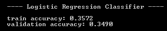

对于朴素贝叶斯模型，准确率结果如下所示：

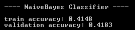

对于 SVM 模型，输出如下所示：

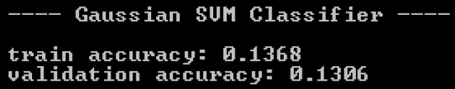

最后，元模型的准确率结果如下所示：

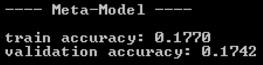

从这些结果中，我们可以看出，朴素贝叶斯分类器通过预测正确流派的时间约为 42%，表现最佳。逻辑回归模型以次之的准确率排名第二，而支持向量机模型在预测准确率方面表现最差。有趣的是，我们使用其他三个模型的输出构建的元模型表现并不理想。它比支持向量机模型表现好，但比朴素贝叶斯和逻辑回归分类器表现差。

# 混淆矩阵

我们接下来要探讨的是混淆矩阵。在第二章“垃圾邮件过滤”的二元分类情况下，我们探讨了混淆矩阵是一个 2 x 2 矩阵的情况。然而，在这个项目中，我们的模型有`8`个结果，混淆矩阵的形状将是 8 x 8。让我们首先看看我们如何构建这样的混淆矩阵：

```py
// Build confusion matrix
string[] confMatrix = BuildConfusionMatrix(
    output.Where((x, i) => testSetIDX.Contains(i)).ToArray(), logitTestPreds, 8
);

System.IO.File.WriteAllLines(Path.Combine(dataDirPath, "logit-conf-matrix.csv"), confMatrix);
```

辅助函数`BuildConfusionMatrix`的代码如下：

```py
private static string[] BuildConfusionMatrix(int[] actual, int[] preds, int numClass)
{
    int[][] matrix = new int[numClass][];
    for(int i = 0; i < numClass; i++)
    {
        matrix[i] = new int[numClass];
    }

    for(int i = 0; i < actual.Length; i++)
    {
        matrix[actual[i]][preds[i]] += 1;
    }

    string[] lines = new string[numClass];
    for(int i = 0; i < matrix.Length; i++)
    {
        lines[i] = string.Join(",", matrix[i]);
    }

    return lines;
}
```

一旦运行此代码，你将得到一个 8 x 8 的矩阵，其中行是实际和观察到的流派，列是从模型预测的流派。以下是我们逻辑回归模型的混淆矩阵：

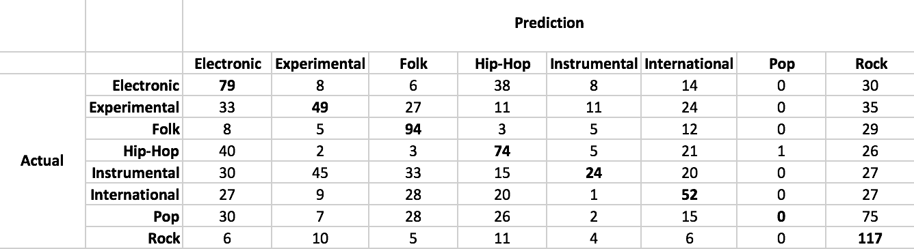

粗体数字表示模型预测正确的记录数。例如，这个逻辑回归模型正确预测了**79**首歌曲为**电子音乐**，而**33**首歌曲被预测为**电子音乐**，但实际上是**实验音乐**。这里值得注意的是，这个逻辑回归模型在预测流行歌曲方面表现不佳。它只有一次预测流行歌曲，但这次预测是错误的，实际上这首歌是**嘻哈**音乐。现在让我们看看朴素贝叶斯分类器预测的混淆矩阵：

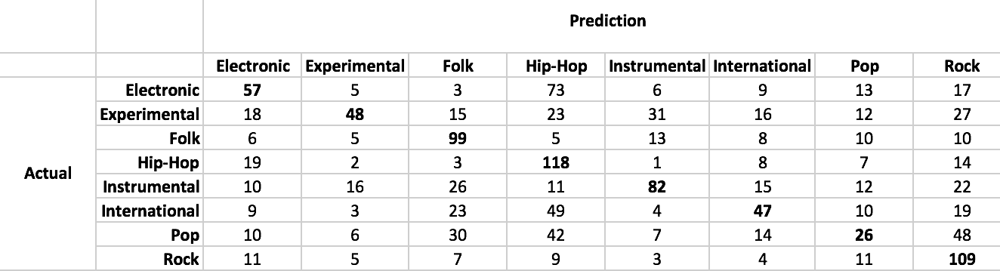

如预期的那样，准确率结果显示混淆矩阵比逻辑回归的混淆矩阵要好。与逻辑回归分类器相比，每个类别的预测中正确的比例更高。朴素贝叶斯分类器在**流行**歌曲方面的表现似乎也更好。

下面的混淆矩阵是针对支持向量机分类器的：

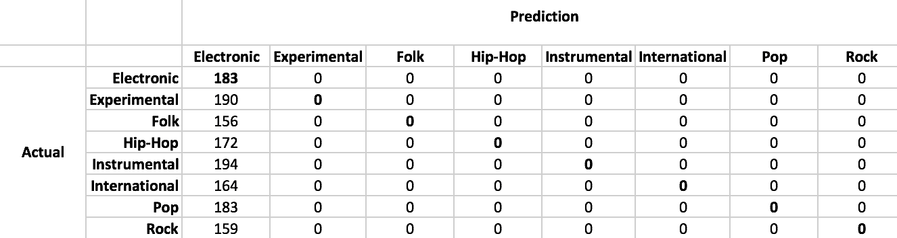

如预期的那样，预测结果并不理想。支持向量机模型将 100%的记录预测为**电子音乐**。最后，让我们看看元模型的表现：

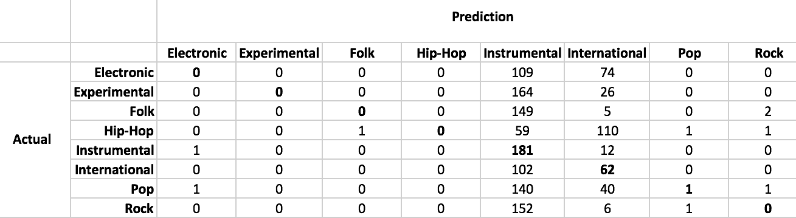

这个混淆矩阵看起来略好于支持向量机模型。然而，大多数预测要么是**乐器**或**国际**流派，只有少数记录被预测为其他流派。

查看混淆矩阵是检查模型错误分类的好方法，可以找出模型的弱点和优势。这些结果与准确度结果很好地一致，其中 Naive Bayes 分类器优于所有其他模型，而元模型表现不佳，尽管它不是我们构建的四个模型中最差的。

# 平均倒数排名

我们接下来要查看的下一个评估指标是 MRR。MRR 可以在模型产生一系列结果的地方使用，它衡量排名的整体质量。让我们首先看看公式：

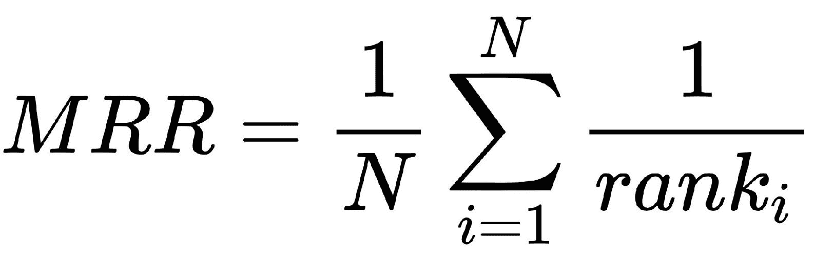

如您所见，这是对排名倒数之和的平均值。考虑以下示例：

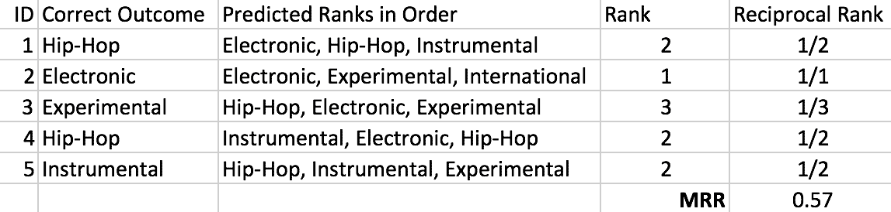

在第一个示例中，正确的流派在排名中是第二位，因此倒数排名是**1/2**。第二个示例的正确流派在排名中是第一位，因此倒数排名是**1/1**，即**1**。按照这个过程，我们可以得到所有记录的倒数排名，最终的 MRR 值就是这些倒数排名的平均值。这告诉我们排名的一般质量。在这个例子中，**MRR**是**0.57**，这高于 1/2。因此，这个 MRR 数值表明，平均而言，正确的流派出现在模型预测的前两个流派中。

为了计算我们模型的 MRR，我们首先需要将概率输出转换为排名，然后从转换后的模型输出中计算 MRR。以下代码片段展示了我们如何计算我们模型的 MRR：

```py
// Calculate evaluation metrics
int[][] logitTrainPredRanks = GetPredictionRanks(trainProbabilities);
int[][] logitTestPredRanks = GetPredictionRanks(testProbabilities);

double logitTrainMRRScore = ComputeMeanReciprocalRank(
    logitTrainPredRanks,
    output.Where((x, i) => trainSetIDX.Contains(i)).ToArray()
);
double logitTestMRRScore = ComputeMeanReciprocalRank(
    logitTestPredRanks,
    output.Where((x, i) => testSetIDX.Contains(i)).ToArray()
);

Console.WriteLine("\n---- Logistic Regression Classifier ----\n");
Console.WriteLine(String.Format("train MRR score: {0:0.0000}", logitTrainMRRScore));
Console.WriteLine(String.Format("validation MRR score: {0:0.0000}", logitTestMRRScore));
```

此代码使用了两个辅助函数，`GetPredictionRanks`和`ComputeMeanReciprocalRank`。`GetPredictionRanks`方法将模型的概率输出转换为排名，而`ComputeMeanReciprocalRank`方法从排名中计算 MRR。辅助函数`GetPredictionRanks`如下所示：

```py
private static int[][] GetPredictionRanks(double[][] predProbabilities)
{
    int[][] rankOrdered = new int[predProbabilities.Length][];

    for(int i = 0; i< predProbabilities.Length; i++)
    {
        rankOrdered[i] = Matrix.ArgSort<double>(predProbabilities[i]).Reversed();
    }

    return rankOrdered;
}
```

我们正在使用`Accord.Math`包中的`Matrix.ArgSort`方法对每条记录的流派进行排序。`Matrix.ArgSort`返回按概率升序排序后的流派索引。然而，我们希望它们按降序排序，以便最可能的流派在排名中排在第一位。这就是为什么我们使用`Reversed`方法反转排序索引的顺序。

辅助函数`ComputeMeanReciprocalRank`如下所示：

```py
private static double ComputeMeanReciprocalRank(int[][] rankOrderedPreds, int[] actualClasses)
{
    int num = rankOrderedPreds.Length;
    double reciprocalSum = 0.0;

    for(int i = 0; i < num; i++)
    {
        int predRank = 0;
        for(int j = 0; j < rankOrderedPreds[i].Length; j++)
        {
            if(rankOrderedPreds[i][j] == actualClasses[i])
            {
                predRank = j + 1;
            }
        }
        reciprocalSum += 1.0 / predRank;
    }

    return reciprocalSum / num;
}
```

这是我们之前讨论的 MRR 计算公式的实现。这种方法遍历每条记录并获取正确流派（genre）的排名。然后，它取排名的倒数，将所有倒数相加，最后将这个和除以记录数以得到 MRR 数值。

让我们开始查看我们迄今为止构建的模型的 MRR 分数。以下输出显示了`Logistic Regression Classifier`的 MRR 分数：

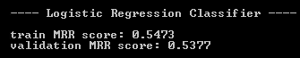

Naive Bayes 分类器的样本内和样本外 MRR 分数如下所示：

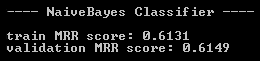

SVM 分类器的结果如下所示：

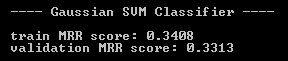

最后，元模型的 MRR 分数如下所示：

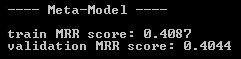

从这些输出中，我们可以看到朴素贝叶斯分类器在大约`0.61`的 MRR 分数上表现最好，而 SVM 分类器在大约`0.33`的 MRR 分数上表现最差。元模型的 MRR 分数在大约`0.4`。这与我们在前一步骤中查看预测准确率和混淆矩阵所得到的结果一致。从这些 MRR 分数中，我们可以看到正确的流派通常位于朴素贝叶斯分类器的排名前两位。另一方面，正确的流派通常在 SVM 分类器中排名第三，在元模型中排名前三。从这些案例中，我们可以通过查看 MRR 指标来了解排名的整体质量。

# 摘要

在本章中，我们构建了我们的第一个推荐模型，以对每个结果的概率进行排序。我们本章开始时定义了我们将要解决的问题以及我们将要使用的建模和评估方法。然后，我们查看样本集中变量的分布。首先，我们查看目标变量在不同类别或流派中的分布情况，并注意到这是一个平衡良好的样本集，没有一种流派在我们的数据集中占据大多数样本。然后，我们查看音频特征的分布。在这个项目中，我们主要关注 MFCC 及其统计分布，如峰度、偏度、最小值和最大值。通过查看这些特征的四分位数和散点图，我们确认了特征分布在不同音乐流派之间是不同的。

在我们的模型构建步骤中，我们尝试了三种学习算法：逻辑回归、SVM 和朴素贝叶斯。由于我们正在构建多类分类模型，我们必须使用与之前章节不同的学习算法。我们学习了如何在 Accord.NET 框架中使用`MultinomialLogisticRegression`和`MulticlassSupportVectorMachine`类，以及何时在`NaiveBayesLearning`中使用`NormalDistribution`。然后，我们讨论了如何构建一个元模型，该模型将基础学习模型的预测结果进行集成，以提高 ML 模型的预测能力。最后，我们讨论了评估排名模型与其他分类模型的不同之处，并查看准确率、混淆矩阵和 MRR 指标来评估我们的 ML 模型。

在下一章中，我们将使用手写数字图像数据集来构建一个分类器，该分类器将每个图像分类到相应的数字。我们将讨论一些减少特征集维度的技术以及如何将这些技术应用到图像数据集中。我们还将讨论如何使用 Accord.NET 框架在 C# 中构建神经网络，该框架是深度学习的核心。
