# 网络攻击检测

到目前为止，我们主要开发的是具有平衡样本集的**机器学习**（**ML**）模型，其中目标类别在数据集中的样本记录中分布均匀或几乎均匀。然而，有些数据集存在类别分布不平衡的情况。类别不平衡在异常和欺诈检测中尤为常见。这类类别不平衡问题在训练 ML 模型时会引起问题，因为大多数 ML 算法在目标类别大致均匀分布时表现最佳。为了解决这个类别不平衡问题，我们不能像开发各种分类和回归问题的模型那样处理。我们需要采取不同的方法。

在本章中，我们将讨论如何构建异常检测模型。我们将使用一个网络入侵数据集，即**KDD Cup 1999 数据**，它包含大量网络连接数据，其中一些是正常网络连接，而另一些则是网络攻击。我们首先将查看数据的结构，数据集中存在的网络攻击类型，以及各种网络特征的分布。然后，我们将应用我们在前几章中讨论的一些特征工程技术，因为特征集包含分类变量和连续变量。我们还将应用我们在前一章中讨论的降维技术，即**主成分分析**（**PCA**）。除了我们在前一章中关于 PCA 的讨论外，我们还将使用 PCA 来构建异常检测模型。使用 PCA 构建的模型，我们将进一步讨论评估异常检测模型的一些方法，以及哪些最适合网络攻击检测项目。

在本章中，我们将涵盖以下主题：

+   网络攻击检测项目的定义问题

+   互联网流量数据集的数据分析

+   特征工程与 PCA

+   异常检测的主成分分类器

+   评估异常检测模型

# 问题定义

类别分布不平衡的数据集会给大多数机器学习算法带来问题，因为它们通常在平衡数据集上表现良好。在机器学习中处理类别不平衡问题有各种方法。对数据集进行重采样以平衡目标类别是一种方法。你可以通过随机选择并复制正样本训练样本来增加正样本的训练样本，这样大约 50%的数据集属于正类别。你也可以减少负样本的训练样本，以便负样本的数量与正样本的数量相匹配。在极端类别不平衡的情况下，你可以将其视为一个异常检测问题，其中正事件被视为异常或离群值。异常检测技术在现实世界问题中有许多应用。它们通常用于网络入侵检测、信用卡欺诈检测，甚至医疗诊断。

在本章中，我们将致力于构建一个用于网络攻击的异常检测模型。为了构建网络攻击检测模型，我们将使用**KDD Cup 1999 数据**，该数据集包含大量的人工和手动注入的网络攻击数据，以及正常的网络连接数据。这些数据可以在以下链接找到：[`kdd.ics.uci.edu/databases/kddcup99/kddcup99.html`](http://kdd.ics.uci.edu/databases/kddcup99/kddcup99.html)。有了这些数据，我们将首先查看网络攻击类型的分布，然后是网络特征的分布。由于这是一个模拟和人工数据集，这个数据集的大部分是由网络攻击组成的，这在现实世界中是不正常和不切实际的。为了模拟现实世界中的网络攻击实例，我们将从样本集中随机子选择网络攻击事件，并构建一个包含比恶意连接更多的正常网络连接的新训练集。使用这个子采样数据集，我们将使用 PCA 构建一个异常检测模型。然后，我们将通过查看不同目标误报率下的网络攻击检测率来评估这个模型。

为了总结我们的网络攻击检测项目的问题定义：

+   问题是什么？我们需要一个能够从大量网络连接中识别潜在恶意连接的网络攻击检测模型，以便我们可以避免网络攻击。

+   为什么这是一个问题？每年网络攻击的数量都在增加，如果没有为这种攻击做好准备，我们的系统将更容易受到各种网络攻击的侵害。有了网络攻击检测模型，我们可以避免成为网络攻击的受害者。

+   解决这个问题的方法有哪些？我们将使用公开可用的数据，这些数据包含大量的人工和模拟网络攻击数据。我们将对数据进行子采样，以复制一个现实生活中正常网络连接多于异常和恶意连接的真实场景。然后，我们将使用 PCA 及其主成分来检测异常。

+   成功的标准是什么？我们希望有高网络攻击检测率，即使这意味着我们需要牺牲更高的误报率。这是因为我们更关心允许网络攻击的发生，而不是误报警报。

# 对互联网流量数据进行数据分析

让我们先看看互联网流量数据。如前所述，我们将使用 KDD Cup 1999 数据，您可以从以下链接下载：[`kdd.ics.uci.edu/databases/kddcup99/kddcup99.html`](http://kdd.ics.uci.edu/databases/kddcup99/kddcup99.html)。我们将使用`kddcup.data_10_percent.gz`数据来进行这次网络攻击检测项目。

# 数据清理

我们需要做的第一件事是清理数据以供后续步骤使用。如果您打开您刚刚下载的数据，您会注意到数据集中没有标题。然而，对于未来的数据分析和模型构建，总是有益于将标题与每一列关联起来。根据可以在[`kdd.ics.uci.edu/databases/kddcup99/kddcup.names`](http://kdd.ics.uci.edu/databases/kddcup99/kddcup.names)找到的列描述，我们将为原始数据集附加标题。将列名附加到数据框的代码如下：

```py
// Read in the Cyber Attack dataset
// TODO: change the path to point to your data directory
string dataDirPath = @"<path-to-data-dir>";

// Load the data into a data frame
string dataPath = Path.Combine(dataDirPath, "kddcup.data_10_percent");
Console.WriteLine("Loading {0}\n\n", dataPath);
var featuresDF = Frame.ReadCsv(
    dataPath,
    hasHeaders: false,
    inferTypes: true
);

string[] colnames =
{
    "duration", "protocol_type", "service", "flag", "src_bytes",
    "dst_bytes", "land", "wrong_fragment", "urgent", "hot",
    "num_failed_logins", "logged_in", "num_compromised", "root_shell",
    "su_attempted", "num_root", "num_file_creations", "num_shells",
    "num_access_files", "num_outbound_cmds", "is_host_login", "is_guest_login",
    "count", "srv_count", "serror_rate", "srv_serror_rate", "rerror_rate",
    "srv_rerror_rate", "same_srv_rate", "diff_srv_rate", "srv_diff_host_rate",
    "dst_host_count", "dst_host_srv_count", "dst_host_same_srv_rate",
    "dst_host_diff_srv_rate", "dst_host_same_src_port_rate",
    "dst_host_srv_diff_host_rate", "dst_host_serror_rate",
    "dst_host_srv_serror_rate", "dst_host_rerror_rate", "dst_host_srv_rerror_rate",
    "attack_type"
};
featuresDF.RenameColumns(colnames);
```

如您从以下代码中可以看到，我们通过向 Deedle 数据框的`ReadCsv`方法提供`hasHeaders: false`标志，不带有标题地加载这个原始数据集。通过提供这个标志，我们告诉 Deedle 不要将数据集的第一行作为标题。一旦这些数据被加载到数据框中，我们就使用`RenameColumns`方法将列名附加到数据框上。

我们接下来的清理任务是按相应的类别将网络攻击类型分组。您可以在以下链接中找到攻击类型和类别之间的映射：[`kdd.ics.uci.edu/databases/kddcup99/training_attack_types`](http://kdd.ics.uci.edu/databases/kddcup99/training_attack_types)。使用这个映射，我们将在数据框中创建一个新列，包含有关攻击类别的信息。让我们先看看代码：

```py
// keeping "normal" for now for plotting purposes
IDictionary<string, string> attackCategories = new Dictionary<string, string>
{
    {"back", "dos"},
    {"land", "dos"},
    {"neptune", "dos"},
    {"pod", "dos"},
    {"smurf", "dos"},
    {"teardrop", "dos"},
    {"ipsweep", "probe"},
    {"nmap", "probe"},
    {"portsweep", "probe"},
    {"satan", "probe"},
    {"ftp_write", "r2l"},
    {"guess_passwd", "r2l"},
    {"imap", "r2l"},
    {"multihop", "r2l"},
    {"phf", "r2l"},
    {"spy", "r2l"},
    {"warezclient", "r2l"},
    {"warezmaster", "r2l"},
    {"buffer_overflow", "u2r"},
    {"loadmodule", "u2r"},
    {"perl", "u2r"},
    {"rootkit", "u2r"},
    {"normal", "normal"}
};

featuresDF.AddColumn(
    "attack_category",
    featuresDF.GetColumn<string>("attack_type")
        .Select(x => attackCategories[x.Value.Replace(".", "")])
);
```

如果您仔细查看此代码，我们创建了一个具有攻击类型与其类别之间映射的`Dictionary`对象。例如，攻击类型`"back"`是**拒绝服务**（**DOS**）攻击之一，而攻击类型`"rootkit"`是**用户到根**（**U2R**）攻击之一。使用这种映射，我们创建了一个新的列`"attack_category"`，并将其添加到`featuresDF`中。现在我们已经清理了原始数据集的列名和攻击类别，我们需要将其导出并存储到我们的本地驱动器中供将来使用。您可以使用以下代码来导出这些数据：

```py
featuresDF.SaveCsv(Path.Combine(dataDirPath, "data.csv"));
```

# 目标变量分布

现在我们有了可以工作的干净数据，我们将开始深入挖掘数据。让我们首先看看网络攻击类别的分布。获取目标变量分布的代码如下：

```py
// 1\. Target Variable Distribution
Console.WriteLine("\n\n-- Counts by Attack Category --\n");
var attackCount = featuresDF.AggregateRowsBy<string, int>(
    new string[] { "attack_category" },
    new string[] { "duration" },
    x => x.ValueCount
).SortRows("duration");
attackCount.RenameColumns(new string[] { "attack_category", "count" });

attackCount.Print();

DataBarBox.Show(
    attackCount.GetColumn<string>("attack_category").Values.ToArray(),
    attackCount["count"].Values.ToArray()
).SetTitle(
    "Counts by Attack Category"
);
```

与前几章类似，我们使用 Deedle 数据框中的`AggregateRowsBy`方法按目标变量`attack_category`进行分组，并计算数据集中每个类别的发生次数。然后，我们使用`DataBarBox`类显示这个分布的条形图。一旦运行此代码，以下条形图将被显示：

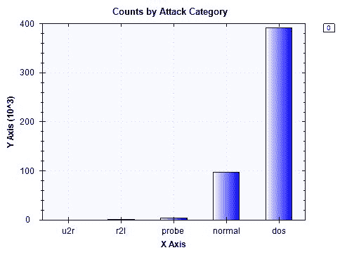

显示每个网络攻击类别发生次数的输出如下：

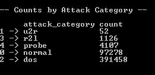

这里有一个值得注意的地方。在数据集中，DOS 攻击样本的数量比正常样本多。如前所述，我们在这个项目中使用的 KDD Cup 1999 数据集是人工和模拟数据，因此它并不反映现实生活中的情况，即正常互联网连接的数量将超过所有其他网络攻击的总和。在下一节构建模型时，我们必须记住这一点。

# 分类变量分布

我们在这个数据集中拥有的特征是分类变量和连续变量的混合。例如，名为`duration`的特征表示连接的长度，是一个连续变量。然而，名为`protocol_type`的特征，表示协议类型，如`tcp`、`udp`等，是一个分类变量。要获取完整的特征描述，您可以访问此链接：[`kdd.ics.uci.edu/databases/kddcup99/task.html`](http://kdd.ics.uci.edu/databases/kddcup99/task.html)。

在本节中，我们将查看正常连接和恶意连接之间分类变量分布的差异。以下代码展示了我们如何将样本集分为两个子组，一个用于正常连接，另一个用于异常连接：

```py
var attackSubset = featuresDF.Rows[
    featuresDF.GetColumn<string>("attack_category").Where(
        x => !x.Value.Equals("normal")
    ).Keys
];
var normalSubset = featuresDF.Rows[
    featuresDF.GetColumn<string>("attack_category").Where(
        x => x.Value.Equals("normal")
    ).Keys
];
```

现在我们有了这两个子集，让我们开始比较正常和恶意连接之间分类变量的分布。让我们首先看看代码：

```py
// 2\. Categorical Variable Distribution
string[] categoricalVars =
{
    "protocol_type", "service", "flag", "land"
};
foreach (string variable in categoricalVars)
{
    Console.WriteLine("\n\n-- Counts by {0} --\n", variable);
    Console.WriteLine("* Attack:");
    var attackCountDF = attackSubset.AggregateRowsBy<string, int>(
        new string[] { variable },
        new string[] { "duration" },
        x => x.ValueCount
    );
    attackCountDF.RenameColumns(new string[] { variable, "count" });

    attackCountDF.SortRows("count").Print();

    Console.WriteLine("* Normal:");
    var countDF = normalSubset.AggregateRowsBy<string, int>(
        new string[] { variable },
        new string[] { "duration" },
        x => x.ValueCount
    );
    countDF.RenameColumns(new string[] { variable, "count" });

    countDF.SortRows("count").Print();

    DataBarBox.Show(
        countDF.GetColumn<string>(variable).Values.ToArray(),
        new double[][] 
        {
            attackCountDF["count"].Values.ToArray(),
            countDF["count"].Values.ToArray()
        }
    ).SetTitle(
        String.Format("Counts by {0} (0 - Attack, 1 - Normal)", variable)
    );
}
```

在此代码中，我们正在遍历一个分类变量数组：`protocol_type`、`service`、`flag`和`land`。我们将特征描述推迟到以下链接中可以找到的描述页面：[`kdd.ics.uci.edu/databases/kddcup99/task.html`](http://kdd.ics.uci.edu/databases/kddcup99/task.html)。对于每个分类变量，我们使用了`AggregateRowsBy`方法按变量的每种类型进行分组，并计算每种类型的出现次数。我们对正常组进行一次聚合，然后对攻击组再进行一次聚合。然后，我们使用`DataBarBox`类来显示条形图，以直观地展示分布的差异。让我们看看一些图表和输出。

以下条形图是针对`protocol_type`特征的：

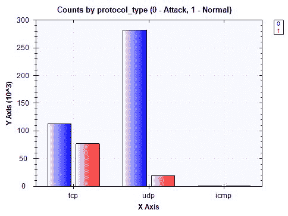

两个组之间每种类型的实际计数如下所示：

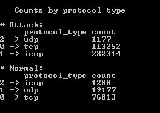

从这些输出中可以看出，正常组和网络攻击组的分布之间存在一些明显的区别。例如，大多数攻击发生在`icmp`和`tcp`协议上，而大多数正常连接发生在`tcp`和`udp`协议上。

以下条形图是针对`land`特征的：

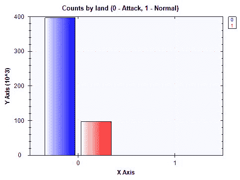

该特征中每种类型的实际计数如下所示：

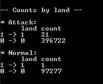

从这些输出中很难判断我们能否得出任何有意义的见解。数据集中的几乎所有样本在攻击组和正常组中都具有`0`的值。让我们再看一个特征。

以下条形图显示了攻击组和正常组中特征`flag`的分布情况：

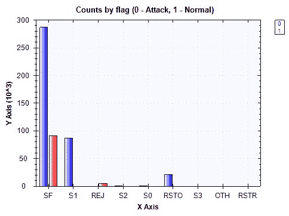

实际计数如下所示：

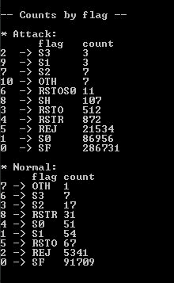

尽管攻击组和正常组最频繁出现的标志类型都是`SF`，但在此特征中仍有一些明显的区别。似乎标志类型`SF`和`REJ`占据了正常组的多数。另一方面，标志类型`SF`、`S0`和`REJ`占据了攻击组的多数。

# 连续变量分布

到目前为止，我们已经看了分类变量的分布。现在让我们看看特征集中连续变量的分布。与前面的章节类似，我们将查看每个连续变量的四分位数。计算每个连续特征四分位数的代码如下：

```py
foreach (string variable in continuousVars)
{
    Console.WriteLine(String.Format("\n\n-- {0} Distribution (Attack) -- ", variable));
    double[] attachQuartiles = Accord.Statistics.Measures.Quantiles(
        attackSubset[variable].DropMissing().ValuesAll.ToArray(),
        new double[] { 0, 0.25, 0.5, 0.75, 1.0 }
    );
    Console.WriteLine(
        "Min: \t\t\t{0:0.00}\nQ1 (25% Percentile): \t{1:0.00}\nQ2 (Median): \t\t{2:0.00}\nQ3 (75% Percentile): \t{3:0.00}\nMax: \t\t\t{4:0.00}",
        attachQuartiles[0], attachQuartiles[1], attachQuartiles[2], attachQuartiles[3], attachQuartiles[4]
    );

    Console.WriteLine(String.Format("\n\n-- {0} Distribution (Normal) -- ", variable));
    double[] normalQuantiles = Accord.Statistics.Measures.Quantiles(
        normalSubset[variable].DropMissing().ValuesAll.ToArray(),
        new double[] { 0, 0.25, 0.5, 0.75, 1.0 }
    );
    Console.WriteLine(
        "Min: \t\t\t{0:0.00}\nQ1 (25% Percentile): \t{1:0.00}\nQ2 (Median): \t\t{2:0.00}\nQ3 (75% Percentile): \t{3:0.00}\nMax: \t\t\t{4:0.00}",
        normalQuantiles[0], normalQuantiles[1], normalQuantiles[2], normalQuantiles[3], normalQuantiles[4]
    );
}
```

变量`continuousVars`被定义为以下字符串数组：

```py
// 3\. Continuous Variable Distribution
string[] continuousVars =
{
    "duration", "src_bytes", "dst_bytes", "wrong_fragment", "urgent", "hot",
    "num_failed_logins", "num_compromised", "root_shell", "su_attempted",
    "num_root", "num_file_creations", "num_shells", "num_access_files",
    "num_outbound_cmds", "count", "srv_count", "serror_rate", "srv_serror_rate",
    "rerror_rate", "srv_rerror_rate", "same_srv_rate", "diff_srv_rate",
    "srv_diff_host_rate", "dst_host_count", "dst_host_srv_count",
    "dst_host_same_srv_rate", "dst_host_diff_srv_rate", "dst_host_same_src_port_rate",
    "dst_host_srv_diff_host_rate", "dst_host_serror_rate", "dst_host_srv_serror_rate",
    "dst_host_rerror_rate", "dst_host_srv_rerror_rate"
};
```

与我们之前进行分类变量分析所做的一样，我们开始遍历前述代码中的连续变量。字符串数组`continuousVars`包含了我们数据集中所有连续特征的列表，我们遍历这个数组以开始计算每个分布的四分位数。正如前几章所述，我们使用`Accord.Statistics.Measures.Quantiles`方法来计算四分位数，这些四分位数包括最小值、25%分位数、中位数、75%分位数和最大值。我们进行了两次计算，一次针对攻击组，另一次针对正常组，这样我们可以看到分布之间是否存在任何明显的差异。让我们看看一些特征及其分布。

首先，以下输出是针对一个名为`duration`的特征的分布：

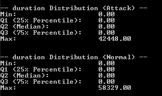

从这个输出中，我们可以看到这个特征的攻击组和正常组的值大多数都是`0`。由于这个变量的方差不大，我们的模型可能不会从这个特征中学习到很多信息。让我们看看另一个特征。

以下输出是针对一个名为`dst_bytes`的特征的分布，它表示从目标到源的数据字节数：

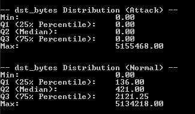

在这里，我们可以看到攻击组和正常组之间分布的一些明显区别。几乎所有的网络攻击都有一个值为 0，而正常网络连接的值分布在一个很宽的范围内。

最后，以下输出是针对一个名为`wrong_fragment`的特征：

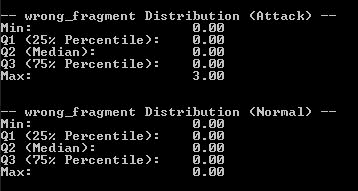

与`duration`特征的情况类似，攻击组和正常组的值大多数都是`0`，这表明我们的模型可能不会从这个特征中学习到很多见解。你可以运行之前的代码来查看其他所有特征的两组之间的分布差异。

运行这个数据分析步骤的完整代码可以在以下链接找到：[`github.com/yoonhwang/c-sharp-machine-learning/blob/master/ch.9/DataAnalyzer.cs`](https://github.com/yoonhwang/c-sharp-machine-learning/blob/master/ch.9/DataAnalyzer.cs)。

# 特征工程和 PCA

到目前为止，我们已经分析了目标变量`attack_category`的分布，以及网络攻击数据集中的分类和连续变量。在本节中，我们将专注于对目标变量和分类特征进行编码，并为我们的未来模型构建步骤创建 PCA 特征。

# 目标和分类变量编码

首先，我们必须对目标变量`attack_category`中的不同类别进行编码。如果你还记得从上一个数据分析步骤，有五个不同的类别：normal、`dos`、`probe`、`r2l`和`u2r`。我们将用相应的整数表示来对这些字符串值进行编码。然后，我们将使用独热编码对每个分类变量进行编码，其中如果给定的值出现在示例中，我们用`1`进行编码，如果没有，则用`0`进行编码。让我们首先使用以下代码加载我们在上一个数据分析步骤中创建的清理后的数据：

```py
// Read in the Cyber Attack dataset
// TODO: change the path to point to your data directory
string dataDirPath = @"<path-to-data-dir>";

// Load the data into a data frame
string dataPath = Path.Combine(dataDirPath, "data.csv");
Console.WriteLine("Loading {0}\n\n", dataPath);
var rawDF = Frame.ReadCsv(
    dataPath,
    hasHeaders: true,
    inferTypes: true
);
```

如此代码所示，我们设置了`hasHeaders: true`，因为清理后的数据现在与每个列都有正确的标题关联。以下代码显示了我们是如何对目标和分类变量进行编码的：

```py
// Encode Categorical Variables
string[] categoricalVars =
{
    "protocol_type", "service", "flag", "land"
};
// Encode Target Variables
IDictionary<string, int> targetVarEncoding = new Dictionary<string, int>
{
    {"normal", 0},
    {"dos", 1},
    {"probe", 2},
    {"r2l", 3},
    {"u2r", 4}
};

var featuresDF = Frame.CreateEmpty<int, string>();

foreach (string col in rawDF.ColumnKeys)
{
    if(col.Equals("attack_type"))
    {
        continue;
    }
    else if (col.Equals("attack_category"))
    {
        featuresDF.AddColumn(
            col, 
            rawDF.GetColumn<string>(col).Select(x => targetVarEncoding[x.Value])
        );
    }
    else if (categoricalVars.Contains(col))
    {
        var categoryDF = EncodeOneHot(rawDF.GetColumn<string>(col), col);

        foreach (string newCol in categoryDF.ColumnKeys)
        {
            featuresDF.AddColumn(newCol, categoryDF.GetColumn<int>(newCol));
        }
    }
    else
    {
        featuresDF.AddColumn(
            col, 
            rawDF[col].Select((x, i) => double.IsNaN(x.Value) ? 0.0 : x.Value)
        );
    }
}
```

让我们更深入地看看这段代码。我们首先创建了一个字符串数组变量`categoricalVars`，它包含所有分类变量的列名，以及一个字典变量`targetVarEncoding`，它将每个目标类别映射到一个整数值。例如，我们将`normal`类别编码为`0`，将`dos`攻击类别编码为`1`，依此类推。然后，我们遍历`rawDF`数据框中的所有列，并将编码后的数据添加到新的空`featuresDF`中。这里需要注意的是，我们使用了一个辅助函数`EncodeOneHot`来对每个分类变量进行编码。让我们看看以下代码：

```py
private static Frame<int, string> EncodeOneHot(Series<int, string> rows, string originalColName)
{

    var categoriesByRows = rows.GetAllValues().Select((x, i) =>
    {
        // Encode the categories appeared in each row with 1
        var sb = new SeriesBuilder<string, int>();
        sb.Add(String.Format("{0}_{1}", originalColName, x.Value), 1);

        return KeyValue.Create(i, sb.Series);
    });

    // Create a data frame from the rows we just created
    // And encode missing values with 0
    var categoriesDF = Frame.FromRows(categoriesByRows).FillMissing(0);

    return categoriesDF;
}
```

如果你还记得第二章，“垃圾邮件过滤”和第三章，“Twitter 情感分析”，这段代码应该看起来很熟悉。在这段代码中，我们遍历每一行，创建一个新的变量，它是原始列名和值的组合，最后创建一个新的 Deedle 数据框，`categoriesDF`。一旦完成这一步，这个数据框的输出就会被附加到前一个代码中的`featuresDF`。

现在我们已经完成了目标和分类变量的编码，我们需要导出并存储这个新的数据框`featuresDF`。我们使用以下代码来存储这个数据：

```py
Console.WriteLine("* Exporting feature set...");
featuresDF.SaveCsv(Path.Combine(dataDirPath, "features.csv"));
```

# 适配 PCA

使用我们在上一节中创建的编码数据，让我们开始构建 PCA 特征，这些特征将在接下来的模型构建步骤中用于异常检测。

我们需要做的第一件事是将我们的样本集分为两个独立的集合——一个包含正常连接数据，另一个包含恶意连接。当我们创建这些子集时，我们需要在这两组之间创建更真实的分布。如果您还记得之前的数据分析步骤，我们注意到恶意连接的数量比正常连接多，这是不现实的，因为 KDD CUP 1999 数据集是一个人工和手工注入的数据集。除了创建具有更真实正常和恶意连接数量的数据集的目的之外，我们还需要创建这两个子集，这样我们就可以仅对正常组应用 PCA，然后将其应用于异常组。

这是因为我们只想从正常连接组中学习和构建主成分，并且能够标记任何异常值作为潜在的网络安全攻击。我们将更详细地讨论如何使用主成分构建异常检测模型。

让我们看一下以下代码，用于将我们的样本集分为两组——一组为正常组，另一组为网络攻击组：

```py
// Build PCA with only normal data
var rnd = new Random();

int[] normalIdx = featuresDF["attack_category"]
    .Where(x => x.Value == 0)
    .Keys
    .OrderBy(x => rnd.Next())
    .Take(90000).ToArray();
int[] attackIdx = featuresDF["attack_category"]
    .Where(x => x.Value > 0)
    .Keys
    .OrderBy(x => rnd.Next())
    .Take(10000).ToArray();
int[] totalIdx = normalIdx.Concat(attackIdx).ToArray();
```

如您从以下代码中可以看到，我们通过过滤 `attack_category` 是否为 `0`（正常）或大于 `0`（网络攻击）来构建正常和网络攻击组的索引数组。然后，我们从正常连接中随机选择 90,000 个样本，从恶意连接中随机选择 10,000 个样本。现在我们有了正常和异常组的索引，我们将使用以下代码来构建拟合 PCA 的实际数据：

```py
var normalSet = featuresDF.Rows[normalIdx];

string[] nonZeroValueCols = normalSet.ColumnKeys.Where(
    x => !x.Equals("attack_category") && normalSet[x].Max() != normalSet[x].Min()
).ToArray();

double[][] normalData = BuildJaggedArray(
    normalSet.Columns[nonZeroValueCols].ToArray2D<double>(), 
    normalSet.RowCount, 
    nonZeroValueCols.Length
);
double[][] wholeData = BuildJaggedArray(
    featuresDF.Rows[totalIdx].Columns[nonZeroValueCols].ToArray2D<double>(),
    totalIdx.Length,
    nonZeroValueCols.Length
);
int[] labels = featuresDF
    .Rows[totalIdx]
    .GetColumn<int>("attack_category")
    .ValuesAll.ToArray();
```

如您从以下代码中可以看到，`normalData` 变量包含所有正常连接样本，而 `wholeData` 变量包含正常和网络攻击连接样本。我们将使用 `normalData` 来拟合 PCA，然后将学到的 PCA 应用到 `wholeData` 上，如下面的代码所示：

```py
var pca = new PrincipalComponentAnalysis(
    PrincipalComponentMethod.Standardize
);
pca.Learn(normalData);

double[][] transformed = pca.Transform(wholeData);
```

如同 第八章 中所述的 *手写数字识别*，我们正在使用 Accord.NET 框架中的 `PrincipalComponentAnalysis` 类来拟合 PCA。一旦我们使用正常连接数据训练了 PCA，我们就通过使用 `pca` 对象的 `Transform` 方法将 PCA 应用到包含正常和网络攻击连接的 `wholeData` 上。

# PCA 特征

我们现在已经仅使用正常连接组构建了主成分。让我们简要检查我们的目标类别在不同主成分组合上的分离情况。请看以下代码：

```py
double[][] first2Components = transformed.Select(
    x => x.Where((y, i) => i < 2).ToArray()
).ToArray();
ScatterplotBox.Show("Component #1 vs. Component #2", first2Components, labels);

double[][] next2Components = transformed.Select(
    x => x.Where((y, i) => i < 3 && i >= 1).ToArray()
).ToArray();
ScatterplotBox.Show("Component #2 vs. Component #3", next2Components, labels);

next2Components = transformed.Select(
    x => x.Where((y, i) => i < 4 && i >= 2).ToArray()
).ToArray();
ScatterplotBox.Show("Component #3 vs. Component #4", next2Components, labels);

next2Components = transformed.Select(
    x => x.Where((y, i) => i < 5 && i >= 3).ToArray()
).ToArray();
ScatterplotBox.Show("Component #4 vs. Component #5", next2Components, labels);

next2Components = transformed.Select(
    x => x.Where((y, i) => i < 6 && i >= 4).ToArray()
).ToArray();
ScatterplotBox.Show("Component #5 vs. Component #6", next2Components, labels);
```

如您从以下代码中可以看到，我们一次构建两个主成分之间的散点图，对于前六个成分。当您运行此代码时，您将看到类似于以下图表的图形。

第一张图是第一和第二个主成分之间的，如下所示：

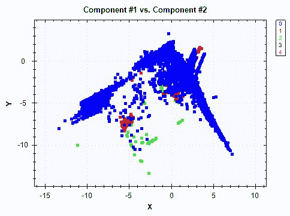

蓝点代表正常连接，其他不同颜色的点代表网络攻击。我们可以看到不同类别之间的分布中存在一些区别，但模式似乎并不那么强烈。

以下图表是第二和第三成分之间的：

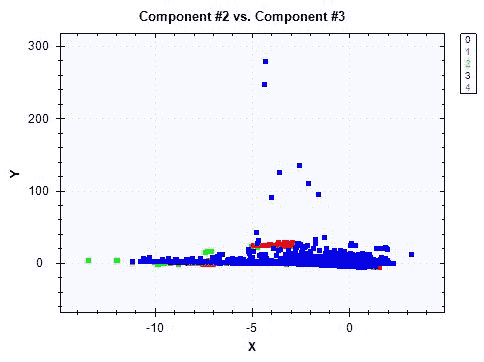

最后，以下图表是第三和第四成分之间的：

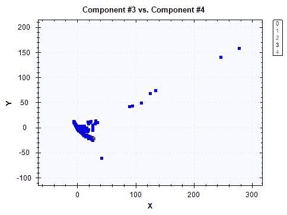

在最后一张图中，我们真的看不到不同类别之间的很多区别。尽管模式看起来不是很强，之前的散点图显示了分布中的一些差异。特别是在二维图中，视觉上看到差异尤其困难。如果我们将其扩展到更高维的空间，即我们的异常检测模型将要查看的空间，模式的差异将变得更加明显。

现在，让我们看看主成分解释的方差量。以下代码展示了我们如何获取解释方差的累积占比，并在折线图中显示它：

```py
double[] explainedVariance = pca.Components
    .Select(x => x.CumulativeProportion)
    .Where(x => x < 1)
    .ToArray();

DataSeriesBox.Show(
    explainedVariance.Select((x, i) => (double)i),
    explainedVariance
).SetTitle("Explained Variance");
System.IO.File.WriteAllLines(
    Path.Combine(dataDirPath, "explained-variance.csv"),
    explainedVariance.Select((x, i) => String.Format("{0},{1:0.0000}", i, x))
);
```

如果你仔细查看这段代码，`pca`对象中的`Components`属性包含了关于解释方差的占比信息。我们可以通过使用`CumulativeProportion`属性遍历每个成分并获取累积占比。一旦我们提取了这些值，我们就使用`DataSeriesBox`类来显示一个显示解释方差累积占比的折线图。输出看起来如下：

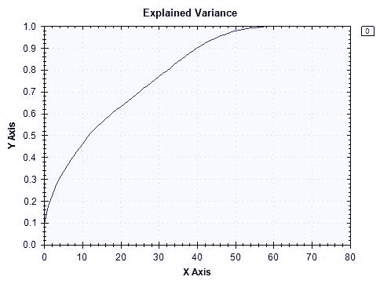

现在，我们已经成功创建了 PCA 特征，并有了完整的 PCA 转换数据。你可以使用以下代码来导出这些数据：

```py
Console.WriteLine("* Exporting pca-transformed feature set...");
System.IO.File.WriteAllLines(
    Path.Combine(
        dataDirPath,
        "pca-transformed-features.csv"
    ),
    transformed.Select(x => String.Join(",", x))
);
System.IO.File.WriteAllLines(
    Path.Combine(
        dataDirPath,
        "pca-transformed-labels.csv"
    ),
    labels.Select(x => x.ToString())
);
```

特征工程步骤的完整代码可以在以下链接找到：[`github.com/yoonhwang/c-sharp-machine-learning/blob/master/ch.9/FeatureEngineering.cs`](https://github.com/yoonhwang/c-sharp-machine-learning/blob/master/ch.9/FeatureEngineering.cs)。

# 异常检测的主成分分类器

我们已经整理好了一切，现在准备开始构建一个用于网络攻击检测项目的异常检测模型。如前所述，我们将使用正常连接组的主成分分布数据，并将其作为主成分的正常范围。对于任何偏离这些主成分值正常范围的记录，我们将将其标记为异常，并视为潜在的网络安全攻击。

# 训练准备

首先，让我们加载从特征工程步骤创建的特征数据。你可以使用以下代码来加载 PCA 转换数据和标签数据：

```py
// Read in the Cyber Attack dataset
// TODO: change the path to point to your data directory
string dataDirPath = @"<path-to-dir>";

// Load the data into a data frame
string dataPath = Path.Combine(dataDirPath, "pca-transformed-features.csv");
Console.WriteLine("Loading {0}\n\n", dataPath);
var featuresDF = Frame.ReadCsv(
    dataPath,
    hasHeaders: false,
    inferTypes: true
);
featuresDF.RenameColumns(
    featuresDF.ColumnKeys.Select((x, i) => String.Format("component-{0}", i + 1))
);

int[] labels = File.ReadLines(
    Path.Combine(dataDirPath, "pca-transformed-labels.csv")
).Select(x => int.Parse(x)).ToArray();
featuresDF.AddColumn("attack_category", labels);
```

让我们快速看一下目标类别的分布。按每个目标类别计数的代码如下：

```py
var count = featuresDF.AggregateRowsBy<string, int>(
    new string[] { "attack_category" },
    new string[] { "component-1" },
    x => x.ValueCount
).SortRows("component-1");
count.RenameColumns(new string[] { "attack_category", "count" });
count.Print();
```

一旦运行此代码，你将看到以下输出：

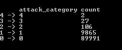

如预期，大多数样本属于 0 类，即正常组，其余的合并在一起占我们样本集的少数（大约 10%）。这是对网络攻击更现实的看法。网络攻击的发生频率远低于正常连接。

为了说明目的，我们将使用解释数据集总体方差约 70%的前`27`个主成分。您可以尝试不同的主成分数量，看看模型性能如何变化。以下代码显示了如何使用前`27`个主成分创建训练集：

```py
// First 13 components explain about 50% of the variance
// First 19 components explain about 60% of the variance
// First 27 components explain about 70% of the variance
// First 34 components explain about 80% of the variance
int numComponents = 27;
string[] cols = featuresDF.ColumnKeys.Where((x, i) => i < numComponents).ToArray();

// First, compute distances from the center/mean among normal events
var normalDF = featuresDF.Rows[
    featuresDF["attack_category"].Where(x => x.Value == 0).Keys
].Columns[cols];

double[][] normalData = BuildJaggedArray(
    normalDF.ToArray2D<double>(), normalDF.RowCount, cols.Length
);
```

如果您仔细查看这段代码，您会注意到我们只使用正常连接样本创建了`normalDF`和`normalData`变量。如前所述，我们只想从正常数据中学习，以便我们可以标记任何异常值和主成分正常范围的极端偏差。我们将在下一节中使用这些变量来构建网络攻击检测的主成分分类器。

# 构建主成分分类器

为了构建一个主成分分类器，该分类器将标记那些偏离正常连接的事件，我们需要计算记录与正常连接分布之间的距离。我们将使用一个距离度量，即**马氏距离**，它衡量一个点与分布之间的距离。对于标准化的主成分，如这里所示，计算**马氏距离**的方程如下：

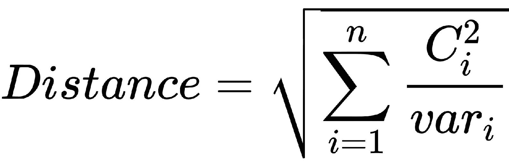

在这个方程中，*C[i]*代表每个主成分的值，而*var[i]*代表每个主成分的方差。让我们看看以下例子：

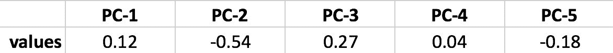

假设您有 5 个主成分，其值如图所示，并且为了简单和演示的目的，假设每个主成分的方差为 1，那么您可以计算**马氏距离**如下：

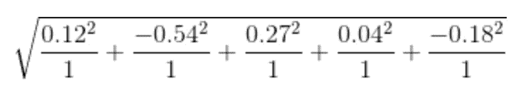

并且，这个示例的**马氏距离**计算结果是 0.64。为了更详细地了解这个距离度量，建议您查阅以下维基百科页面：[`en.wikipedia.org/wiki/Mahalanobis_distance`](https://en.wikipedia.org/wiki/Mahalanobis_distance)，或者以下研究论文：[`users.cs.fiu.edu/~chens/PDF/ICDM03_WS.pdf`](https://users.cs.fiu.edu/~chens/PDF/ICDM03_WS.pdf)。

我们将马氏距离方程实现为一个辅助函数`ComputeDistances`，其代码如下：

```py
private static double[] ComputeDistances(double[][] data, double[] componentVariances)
{

    double[] distances = data.Select(
        (row, i) => Math.Sqrt(
            row.Select(
                (x, j) => Math.Pow(x, 2) / componentVariances[j]
            ).Sum()
        )
    ).ToArray();

    return distances;
}
ComputeDistances method takes in two arguments—data and componentVariances. The variable data is a two-dimensional array that we want to compute distances for, and the componentVariances variable is the variance of the principal components that are learned from the normal network connections data. In order to compute the variances of the principal components, we use the following helper function:
```

```py
private static double[] ComputeVariances(double[][] data)
{
    double[] componentVariances = new double[data[0].Length];

    for (int j = 0; j < data[0].Length; j++)
    {
        componentVariances[j] = data
            .Select((x, i) => Math.Pow(data[i][j], 2))
            .Sum() / data.Length;
    }

    return componentVariances;
}
ComputeDistances, as follows:
```

```py
double[] distances = ComputeDistances(normalData);
```

现在我们已经计算了单个记录的距离，让我们分析正常连接的范围。我们使用了以下代码来计算距离的均值和标准差，并使用直方图来可视化整体距离分布：

```py
double meanDistance = distances.Average();
double stdDistance = Math.Sqrt(
    distances
    .Select(x => Math.Pow(x - meanDistance, 2))
    .Sum() / distances.Length
);

Console.WriteLine(
    "* Normal - mean: {0:0.0000}, std: {1:0.0000}",
    meanDistance, stdDistance
);

HistogramBox.Show(
    distances,
    title: "Distances"
)
.SetNumberOfBins(50);
```

当您运行此代码时，您将看到以下输出，显示正常连接距离度量的平均值和标准差：

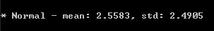

历史图如下所示：

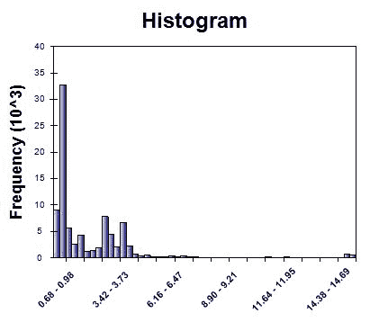

如您从这些输出中可以看到，大多数距离都非常小，这表明非攻击和正常连接通常紧密地聚集在一起。有了关于正常连接组内距离分布的信息，让我们开始寻找是否可以通过标记超出正常距离范围的某些网络连接来构建一个检测模型。

以下代码展示了我们是如何从正常网络连接的分布中计算网络攻击连接的距离的：

```py
// Detection
var attackDF = featuresDF.Rows[
    featuresDF["attack_category"].Where(x => x.Value > 0).Keys
].Columns[cols];

double[][] attackData = BuildJaggedArray(
    attackDF.ToArray2D<double>(), attackDF.RowCount, cols.Length
);

double[] attackDistances = ComputeDistances(attackData, normalVariances);
```

如您从这段代码中可以看到，我们首先创建了一个名为`attackData`的变量，它包含了我们训练集中所有的网络攻击连接。然后，我们使用了`ComputeDistances`方法来计算网络攻击连接组中各个记录的距离。

现在，我们准备开始根据我们刚刚计算的距离度量来标记可疑的网络连接。让我们先看看以下代码：

```py
// 5-10% false alarm rate
for (int i = 4; i < 10; i++)
{
    double targetFalseAlarmRate = 0.01 * (i + 1);
    double threshold = Accord.Statistics.Measures.Quantile(
        distances,
        1 - targetFalseAlarmRate
    );

    int[] detected = attackDistances.Select(x => x > threshold ? 1 : 0).ToArray();

    EvaluateResults(attackLabels, detected, targetFalseAlarmRate);
}
```

如您从这段代码中可以看到，我们根据正常连接组内距离的分布来确定阈值。例如，如果我们目标是保持 5%的误报率，我们将标记所有距离超过正常范围且大于正常连接组内距离分布的 95%百分位的连接。更具体地说，在我们的案例中，正常连接距离分布的 95%百分位是 5.45。因此，在这种情况下，我们将标记所有距离超过 5.45 的连接为网络攻击。我们将重复此过程，从 5%到 10%的误报率。我们将在以下模型评估步骤中更详细地讨论这个异常检测模型的表现。

构建模型步骤的完整代码可以在以下链接找到：[`github.com/yoonhwang/c-sharp-machine-learning/blob/master/ch.9/Modeling.cs`](https://github.com/yoonhwang/c-sharp-machine-learning/blob/master/ch.9/Modeling.cs)。

# 评估异常检测模型

在之前的模型构建步骤中，我们为网络攻击构建了一个异常检测模型。在之前的代码中，您可能已经注意到我们使用了一个名为`EvaluateResults`的函数。这是一个我们为评估模型性能编写的辅助函数。让我们看看以下代码：

```py
private static void EvaluateResults(int[] attackLabels, int[] detected, double targetFalseAlarmRate)
{
    double overallRecall = (double)detected.Sum() / attackLabels.Length;

    double[] truePositives = new double[4];
    double[] actualClassCounts = new double[4];

    for (int i = 0; i < attackLabels.Length; i++)
    {
        actualClassCounts[attackLabels[i] - 1] += 1.0;

        if (detected[i] > 0)
        {
            truePositives[attackLabels[i] - 1] += 1.0;
        }
    }

    double[] recalls = truePositives.Select((x, i) => x / actualClassCounts[i]).ToArray();

    Console.WriteLine("\n\n---- {0:0.0}% False Alarm Rate ----", targetFalseAlarmRate * 100.0);
    Console.WriteLine("* Overall Attack Detection: {0:0.00}%", overallRecall * 100.0);
    Console.WriteLine(
        "* Detection by Attack Type:\n\t{0}",
        String.Join("\n\t", recalls.Select(
            (x, i) => String.Format("Class {0}: {1:0.00}%", (i + 1), x * 100.0))
        )
    );
}
```

如您从这段代码中可以看到，我们关注两个指标：总体网络攻击检测率和每类检测率。评估结果如下所示：

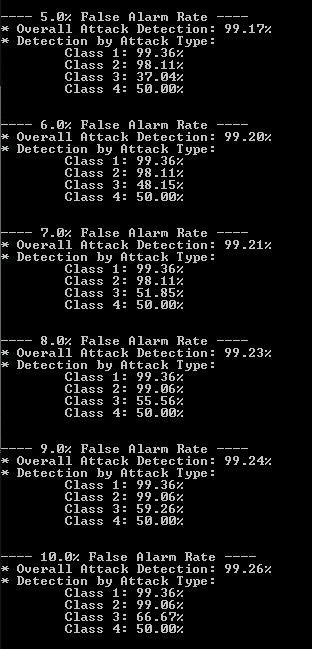

总体结果看起来不错，检测率超过 99%。在 5%的误报率下，大约 99.1%的网络攻击被检测到。然而，如果我们更仔细地查看每类检测率，我们可以看到它们的弱点和优势。在 5%的误报率下，我们的模型在检测第 1 类和第 2 类（即`dos`和`probe`攻击）方面表现良好。另一方面，我们的模型在检测第 3 类和第 4 类（即`r2l`和`u2r`攻击）方面表现不佳。正如您可以从这个输出中看到的那样，随着我们提高目标误报率，总体和每类的检测率也随之提高。在现实世界的情况下，您将不得不在更高的检测率和更高的误报率之间权衡，并做出符合您业务需求的关于目标误报率的决策。

# 摘要

在本章中，我们构建了我们第一个可以检测网络攻击的异常检测模型。在本章的开头，我们讨论了这种类型的异常检测模型如何被用于和应用于现实生活的情况，以及开发异常检测模型与迄今为止我们构建的其他机器学习（ML）模型的不同之处。然后，我们开始分析目标类别的分布和各种特征，以更好地理解数据集。在我们分析这个数据集的同时，我们也注意到网络攻击样本比正常连接样本多，这在现实生活中是不现实的。为了模拟现实生活中的情况，其中异常恶意连接的发生频率远低于正常连接，我们随机子选择了正常和恶意连接样本，使得训练集的 90%是正常连接，只有 10%是网络攻击示例。

使用这个子选定的训练集，我们对正常连接数据应用了主成分分析（PCA），以找出主成分的正常范围。使用**马氏距离**度量，我们计算了来自正常连接分布的各个记录之间的距离。在模型构建步骤中，我们根据目标误报率尝试了不同的阈值。使用 5%到 10%的误报率，我们构建了网络攻击检测模型并评估了它们的性能。在我们的模型评估步骤中，我们注意到总体检测率超过 99%，而更仔细地查看每攻击检测率暴露了模型的弱点和优势。我们还注意到，当我们牺牲并提高误报率时，总体网络攻击检测率有所提高。在应用这种异常检测技术时，了解误报率和检测率之间的权衡变得至关重要，并基于相关的业务需求做出决策。

在下一章中，我们将扩展我们在构建异常检测模型方面的知识和经验。我们将使用信用卡数据集来开展一个信用卡欺诈检测项目。在基于 PCA 的异常检测模型之上，我们将讨论如何使用一类支持向量机进行异常检测。
