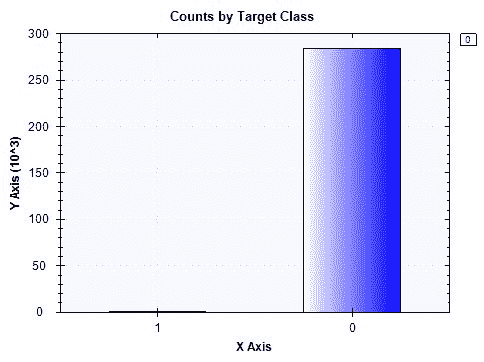
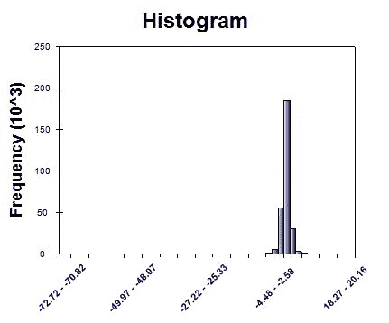
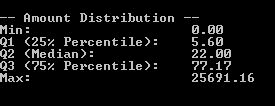
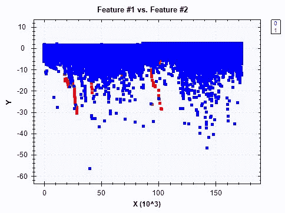
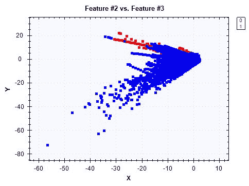
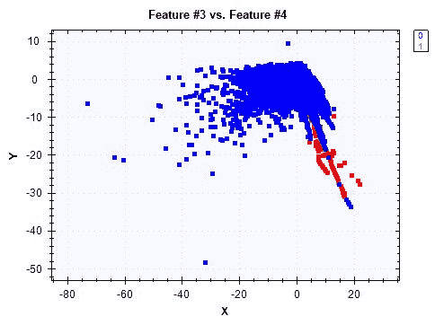
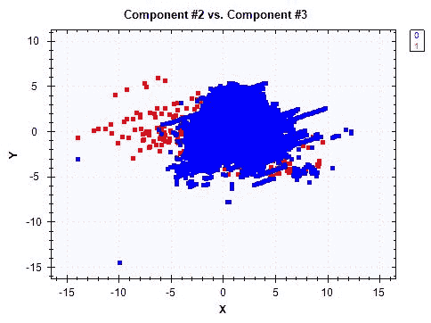
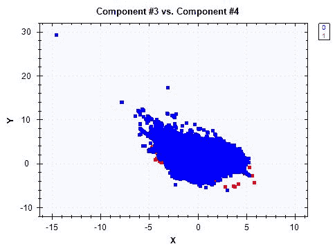
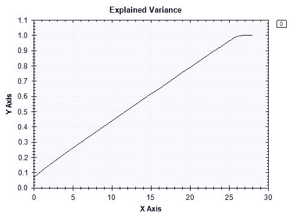

# 信用卡欺诈检测

在上一章中，我们使用**主成分分析（PCA**）构建了我们的第一个异常检测模型，并看到了如何使用主成分来检测网络攻击。与网络攻击或网络入侵问题类似，异常检测模型常用于欺诈检测。许多行业中的各种组织，如金融服务、保险公司和政府机构，经常遇到欺诈案例。特别是在金融领域，欺诈直接与货币损失相关，这些欺诈案例可以以许多不同的形式出现，例如被盗信用卡、会计伪造或假支票。因为这些事件相对较少发生，检测这些欺诈案例既困难又棘手。

在本章中，我们将讨论如何构建一个用于信用卡欺诈检测的异常检测模型。我们将使用一个包含大量正常信用卡交易和相对较少欺诈信用卡交易的匿名信用卡数据集。我们首先将查看数据集的结构、目标类别的分布以及各种匿名特征的分布。然后，我们将开始应用主成分分析（PCA）并构建标准化的主成分，这些主成分将被用作我们的欺诈检测模型的特征。在模型构建步骤中，我们将尝试两种不同的构建欺诈检测模型的方法——类似于我们在第九章中构建的**主成分分类器（PCC**），即*网络攻击检测*，以及从正常信用卡交易中学习并检测任何异常的单类**支持向量机（SVM**）。构建了这些模型后，我们将评估它们的异常检测率并比较它们在信用卡欺诈检测中的性能。

本章将涵盖以下主题：

+   信用卡欺诈检测项目的定义问题

+   匿名信用卡数据集的数据分析

+   特征工程和 PCA

+   单类 SVM 与 PCC 的比较

+   评估异常检测模型

# 问题定义

信用卡欺诈在其他欺诈事件中相对较为常见，并且可能发生在我们的日常生活中。信用卡欺诈可能发生的各种方式。信用卡可能会丢失或被盗，然后被窃贼使用。另一种信用卡欺诈可能发生的方式是，你的身份可能已经被恶意人员泄露，然后他们使用你的身份开设新的信用卡账户，甚至接管你现有的信用卡账户。骗子甚至可能使用电话钓鱼进行信用卡欺诈。由于信用卡欺诈可能发生的途径很多，许多信用卡持卡人都面临着这种类型欺诈的风险，因此在我们日常生活中有一种适当的方法来预防它们的发生变得至关重要。许多信用卡公司已经采取了各种措施来预防和检测这些类型的欺诈活动，使用了各种**机器学习**（**ML**）和异常检测技术。

在本章中，我们将通过运用和扩展我们关于构建异常检测模型的知识来构建信用卡欺诈检测模型。我们将使用一个可以在以下链接中找到的匿名信用卡数据集：[`www.kaggle.com/mlg-ulb/creditcardfraud/data`](https://www.kaggle.com/mlg-ulb/creditcardfraud/data)。这个数据集大约有 285,000 笔信用卡交易，其中只有大约 0.17%的交易是欺诈交易，这很好地反映了现实生活中的情况。有了这些数据，我们将研究数据集的结构，然后开始研究目标和特征变量的分布。然后，我们将使用 PCA 构建特征，类似于我们在第九章中做的，即*网络攻击检测*。在构建信用卡欺诈检测模型时，我们将尝试使用 PCC，类似于我们在第九章中构建的，即*网络攻击检测*，以及单类 SVM，它从正常的信用卡交易中学习并决定一笔新交易是否为欺诈。最后，我们将查看误报率和欺诈检测率，以评估和比较这些模型的性能。

为了总结我们的信用卡欺诈检测项目的问题定义：

+   问题是什么？我们需要一个异常检测模型来识别、预防和阻止潜在的欺诈性信用卡交易。

+   为什么这是一个问题？每个信用卡持卡人都面临着成为信用卡欺诈受害者的风险，如果没有为这种恶意尝试做好充分准备，信用卡欺诈受害者的数量将会增加。通过信用卡欺诈检测模型，我们可以预防和阻止潜在的欺诈性信用卡交易发生。

+   解决这个问题的方法有哪些？我们将使用公开可用的匿名信用卡数据，这些数据包含大量的正常信用卡交易和少量欺诈交易。我们将对此数据应用 PCA，并尝试使用 PCC 和单类 SVM 模型进行欺诈检测。

+   成功的标准是什么？由于任何信用卡欺诈事件都会导致经济损失，我们希望有高欺诈检测率。即使有一些误报或误警，也最好标记任何可疑的信用卡活动，以防止任何欺诈交易通过。

# 匿名信用卡数据的数据分析

让我们现在开始查看信用卡数据集。如前所述，我们将使用以下链接提供的可用数据集：[`www.kaggle.com/mlg-ulb/creditcardfraud/data`](https://www.kaggle.com/mlg-ulb/creditcardfraud/data)。这是一个包含大约 285,000 条信用卡交易记录的数据集，其中一些是欺诈交易，而大多数记录是正常的信用卡交易。由于保密问题，数据集中的特征名称被匿名化。我们将使用可以从中下载的`creditcard.csv`文件。

# 目标变量分布

我们将要检查的第一件事是数据集中欺诈和非欺诈信用卡交易的分发情况。在数据集中，名为`Class`的列是目标变量，欺诈信用卡交易用`1`编码，非欺诈交易用`0`编码。你可以使用以下代码首先将数据加载到 Deedle 数据框中：

```py
// Read in the Credit Card Fraud dataset
// TODO: change the path to point to your data directory
string dataDirPath = @"<path-to-your-dir>";

// Load the data into a data frame
string dataPath = Path.Combine(dataDirPath, "creditcard.csv");
Console.WriteLine("Loading {0}\n\n", dataPath);
var df = Frame.ReadCsv(
    dataPath,
    hasHeaders: true,
    inferTypes: true
);
```

这个数据集有标题，代表每个特征和目标类，因此我们使用`hasHeaders: true`标志加载此数据。现在数据已经加载，你可以使用以下代码来分析目标类的分布：

```py
// Target variable distribution
var targetVarCount = df.AggregateRowsBy<string, int>(
    new string[] { "Class" },
    new string[] { "V1" },
    x => x.ValueCount
).SortRows("V1");
targetVarCount.RenameColumns(new string[] { "is_fraud", "count" });

targetVarCount.Print();

DataBarBox.Show(
    targetVarCount.GetColumn<string>("is_fraud").Values.ToArray(),
    targetVarCount["count"].Values.ToArray()
).SetTitle(
    "Counts by Target Class"
);
```

由于你可能已经熟悉这个函数了，我们在 Deedle 数据框中使用`AggregateRowsBy`函数按`Class`列分组行，然后计算每个目标类中的记录数。由于列名`Class`并不能很好地代表我们的目标类及其含义，我们将其重命名为另一个名称，`is_fraud`。从这段代码中你可以看到，你可以使用`RenameColumns`函数和一个字符串数组来重命名特征名称。最后，我们使用了 Accord.NET 框架中的`DataBarBox`类来显示一个条形图，该图可以直观地展示目标类的分布。

以下输出显示了目标类的分布：


从这个输出中可以看出，欺诈信用卡交易和非欺诈信用卡交易的数目之间存在很大的差距。我们只有 492 条欺诈记录，而超过 284,000 条非欺诈记录。

以下是由代码生成的用于直观显示目标类别分布的条形图：



如前述输出所预期，属于目标类别**1**（代表欺诈）的记录数量与属于目标类别**0**（代表非欺诈和正常信用卡交易）的记录数量之间存在很大的差距。由于与大量正常的日常信用卡交易相比，信用卡欺诈相对较少，这种大的类别不平衡是预期的。这种大的类别不平衡使得大多数机器学习模型难以准确学习如何从非欺诈中识别欺诈。

# 特征分布

由于保密性问题，我们在这份数据中除了交易金额外的特征都进行了匿名处理。因为我们不知道每个特征代表什么以及每个特征的含义，所以从特征分析中推断任何直观的见解将会很困难。然而，了解每个特征的分布情况、每个特征的分布与其他特征的区别，以及是否可以从特征集中推导出任何明显的模式，仍然是有帮助的。

让我们先看看代码。以下代码展示了我们如何计算并可视化特征的分布：

```py
// Feature distributions
foreach (string col in df.ColumnKeys)
{
    if (col.Equals("Class") || col.Equals("Time"))
    {
        continue;
    }

    double[] values = df[col].DropMissing().ValuesAll.ToArray();

    Console.WriteLine(String.Format("\n\n-- {0} Distribution -- ", col));
    double[] quartiles = Accord.Statistics.Measures.Quantiles(
        values,
        new double[] { 0, 0.25, 0.5, 0.75, 1.0 }
    );
    Console.WriteLine(
        "Min: \t\t\t{0:0.00}\nQ1 (25% Percentile): \t{1:0.00}\nQ2 (Median): \t\t{2:0.00}\nQ3 (75% Percentile): \t{3:0.00}\nMax: \t\t\t{4:0.00}",
        quartiles[0], quartiles[1], quartiles[2], quartiles[3], quartiles[4]
    );

    HistogramBox.Show(
        values,
        title: col
    )
    .SetNumberOfBins(50);
}
```

如您从这段代码中看到的，我们正在计算四分位数。如您可能记得，四分位数是将数据分为四个不同部分的点。第一四分位数是最小值和中间值之间的中点，第二四分位数是中间值，第三四分位数是中间值和最大值之间的中点。您可以通过使用`Accord.Statistics.Measures.Quantiles`函数轻松计算四分位数。计算四分位数后，我们使用 Accord.NET 框架中的`HistogramBox`类为每个特征构建直方图以可视化分布。让我们看看这段代码的一些输出结果。

我们将要查看的第一个分布是针对`V1`特征的，而`V1`的特征四分位数看起来如下：


从这个代码中可以看出，`V1`特征的分布似乎偏向负方向。尽管中位数大约为 0，但负值范围从-56.41 到 0，而正值范围仅从 0 到 2.45。以下是由前述代码生成的直方图输出：


如预期的那样，直方图显示了特征`V1`分布的左偏斜，而大多数值都围绕 0。

接下来，让我们看看第二个特征`V2`的分布情况，输出如下：


`V2`的直方图看起来如下：



值似乎集中在 0 附近，尽管在负方向和正方向上都有一些极端值。与之前的特征`V1`相比，偏度不太明显。

最后，让我们看看`amount`特征的分布，这可以告诉我们交易金额的范围。以下是`amount`特征的四分位数：



似乎任何信用卡交易都可以取 0 到 25,691.16 之间的任何正数作为交易金额。以下是`amount`特征的直方图：


如预期的那样，我们可以看到右侧有一个长尾。这是可以预料的，因为每个人的消费模式都与其他人不同。有些人可能通常购买价格适中的商品，而有些人可能购买非常昂贵的商品。

最后，让我们简要看看当前特征集如何将欺诈信用卡交易与非欺诈交易区分开来。首先看看以下代码：

```py
// Target Var Distributions on 2-dimensional feature space
double[][] data = BuildJaggedArray(
    df.ToArray2D<double>(), df.RowCount, df.ColumnCount
);
int[] labels = df.GetColumn<int>("Class").ValuesAll.ToArray();

double[][] first2Components = data.Select(
    x => x.Where((y, i) => i < 2
).ToArray()).ToArray();
ScatterplotBox.Show("Feature #1 vs. Feature #2", first2Components, labels);

double[][] next2Components = data.Select(
    x => x.Where((y, i) => i >= 1 && i <= 2).ToArray()
).ToArray();
ScatterplotBox.Show("Feature #2 vs. Feature #3", next2Components, labels);

next2Components = data.Select(
    x => x.Where((y, i) => i >= 2 && i <= 3).ToArray()
).ToArray();
ScatterplotBox.Show("Feature #3 vs. Feature #4", next2Components, labels);
```

如您从以下代码中可以看到，我们首先将 Deedle 数据帧变量`df`转换为二维数组变量`data`，以构建散点图。然后，我们取前两个特征并显示一个散点图，该图显示了目标类别在这两个特征上的分布。我们重复这个过程两次，分别针对第二、第三和第四个特征。

以下散点图是我们数据集中第一和第二个特征的分布：



从这个散点图中，很难（如果不是不可能的话）将欺诈（编码为 1）与非欺诈（编码为 0）区分开来。让我们看看接下来两个特征的散点图：



与前两个特征的情况类似，似乎没有一条清晰的线可以区分欺诈与非欺诈。最后，以下是在第三和第四个特征之间目标类别的散点图：



从这个散点图中可以看出，很难画出一条清晰的线来区分两个目标类别。欺诈交易似乎更多地位于散点图的右下角，但模式很弱。在下一节中，我们将尝试构建更好的特征来区分两个目标类别。

这个数据分析步骤的完整代码可以在以下链接找到：[`github.com/yoonhwang/c-sharp-machine-learning/blob/master/ch.10/DataAnalyzer.cs`](https://github.com/yoonhwang/c-sharp-machine-learning/blob/master/ch.10/DataAnalyzer.cs)。

# 特征工程与 PCA

到目前为止，我们已经分析了目标和特征变量的分布情况。在本章中，我们将重点关注使用 PCA 构建特征。

# 特征工程准备

为了拟合 PCA，我们首先需要准备我们的数据。让我们快速查看以下代码，将信用卡欺诈数据加载到 Deedle 的数据框中：

```py
// Read in the Credit Card Fraud dataset
// TODO: change the path to point to your data directory
string dataDirPath = @"<path-to-dir>";

// Load the data into a data frame
string dataPath = Path.Combine(dataDirPath, "creditcard.csv");
Console.WriteLine("Loading {0}\n\n", dataPath);
var df = Frame.ReadCsv(
    dataPath,
    hasHeaders: true,
    inferTypes: true
);

Console.WriteLine("* Shape: {0}, {1}\n\n", df.RowCount, df.ColumnCount);
```

现在我们已经将数据加载到名为`df`的变量中，我们需要将数据分成两组，一组是正常信用卡交易数据，另一组是欺诈交易数据，这样我们就可以只使用正常交易来拟合 PCA。看看以下代码，了解我们如何从原始数据集中分离出正常交易：

```py
string[] featureCols = df.ColumnKeys.Where(
    x => !x.Equals("Time") && !x.Equals("Class")
).ToArray();

var noFraudData = df.Rows[
    df["Class"].Where(x => x.Value == 0.0).Keys
].Columns[featureCols];
double[][] data = BuildJaggedArray(
    noFraudData.ToArray2D<double>(), noFraudData.RowCount, featureCols.Length
);
```

如果您还记得之前的数据分析步骤，目标变量`Class`被编码为 1 表示欺诈交易，0 表示非欺诈交易。从代码中您可以看到，我们创建了一个只包含正常信用卡交易记录的数据框`noFraudData`。然后，我们使用辅助函数`BuildJaggedArray`将这个数据框转换成二维双精度数组，该数组将被用于拟合 PCA。这个辅助函数的代码如下：

```py
private static double[][] BuildJaggedArray(double[,] ary2d, int rowCount, int colCount)
{
    double[][] matrix = new double[rowCount][];
    for (int i = 0; i < rowCount; i++)
    {
        matrix[i] = new double[colCount];
        for (int j = 0; j < colCount; j++)
        {
            matrix[i][j] = double.IsNaN(ary2d[i, j]) ? 0.0 : ary2d[i, j];
        }
    }
    return matrix;
}
```

这段代码看起来很熟悉，因为我们已经在许多前面的章节中使用过它。

接下来我们需要做的是将整个数据框，包括非欺诈和欺诈记录，转换成二维数组。使用训练好的 PCA，我们将转换这个新创建的二维数组，该数组将用于构建信用卡欺诈检测模型。让我们看看以下代码：

```py
double[][] wholeData = BuildJaggedArray(
    df.Columns[featureCols].ToArray2D<double>(), df.RowCount, featureCols.Length
);
int[] labels = df.GetColumn<int>("Class").ValuesAll.ToArray();
df, into a two-dimensional array, wholeData, by using the BuildJaggedArray function.
```

# 拟合 PCA

现在，我们准备使用非欺诈信用卡数据拟合 PCA。类似于我们在第九章“网络攻击检测”中所做的，我们将使用以下代码来拟合 PCA：

```py
var pca = new PrincipalComponentAnalysis(
    PrincipalComponentMethod.Standardize
);
pca.Learn(data);
```

如您从这段代码中看到的，我们正在使用 Accord.NET 框架中的`PrincipalComponentAnalysis`类来训练 PCA。在这里要注意的另一件事是我们如何使用`PrincipalComponentMethod.Standardize`。由于 PCA 对特征的尺度很敏感，我们首先标准化特征值，然后拟合 PCA。使用这个训练好的 PCA，我们可以转换包含欺诈和非欺诈交易的全数据。将 PCA 转换应用于数据集的代码如下：

```py
double[][] transformed = pca.Transform(wholeData);
```

现在，我们已经准备好了所有 PCA 特征，用于接下来的模型构建步骤。在我们继续之前，让我们看看是否可以通过新的 PCA 特征找到任何可以区分目标类别的明显模式。让我们首先看看以下代码：

```py
double[][] first2Components = transformed.Select(x => x.Where((y, i) => i < 2).ToArray()).ToArray();
ScatterplotBox.Show("Component #1 vs. Component #2", first2Components, labels);

double[][] next2Components = transformed.Select(
    x => x.Where((y, i) => i >= 1 && i <= 2).ToArray()
).ToArray();
ScatterplotBox.Show("Component #2 vs. Component #3", next2Components, labels);

next2Components = transformed.Select(
    x => x.Where((y, i) => i >= 2 && i <= 3).ToArray()
).ToArray();
ScatterplotBox.Show("Component #3 vs. Component #4", next2Components, labels);

next2Components = transformed.Select(
    x => x.Where((y, i) => i >= 3 && i <= 4).ToArray()
).ToArray();
ScatterplotBox.Show("Component #4 vs. Component #5", next2Components, labels);
```

类似于我们在数据分析步骤中所做的，我们选取了两个特征，并创建了目标类别在所选特征上的散点图。从这些图中，我们可以看到 PCA 转换后的数据中的主成分是否更有效地将欺诈信用卡交易与非欺诈交易分开。

下面的散点图显示了第一和第二个主成分之间的关系：


存在一个明显的截止点，将欺诈（散点图中的红色点）与非欺诈（散点图中的蓝色点）分开。从这个散点图来看，欺诈样本的 Y 值（第二个主成分值）通常小于-5。

以下为第二个和第三个主成分之间的散点图：



与之前的散点图相比，这个图中的模式似乎更弱，但仍然似乎有一条明显的线将许多欺诈案例与非欺诈案例区分开来。

以下散点图是第三个和第四个主成分之间的：



最后，以下是第四个和第五个主成分之间的散点图：


在最后两个散点图中，我们找不到一个明显的模式来区分两个目标类别。鉴于我们在查看前三个主成分及其散点图时找到了一些可区分的线，我们的信用卡欺诈检测的异常检测模型将能够从这些数据在更高维度和多个主成分中学习如何分类欺诈。

最后，让我们看一下主成分解释的方差比例。首先看看以下代码：

```py
DataSeriesBox.Show(
    pca.Components.Select((x, i) => (double)i),
    pca.Components.Select(x => x.CumulativeProportion)
).SetTitle("Explained Variance");
System.IO.File.WriteAllLines(
    Path.Combine(dataDirPath, "explained-variance.csv"),
    pca.Components.Select((x, i) => String.Format("{0},{1:0.0000}", i + 1, x.CumulativeProportion))
);
```

如我们在第九章“网络攻击检测”中讨论的，我们可以使用`PrincipalComponentAnalysis`对象内的`Components`属性来提取每个成分解释的累积方差比例。如代码中的第三行所示，我们遍历`Components`属性并提取`CumulativeProportion`值。然后，我们使用`DataSeriesBox`类显示一个折线图。当你运行此代码时，你将看到以下图表，显示了主成分解释的累积方差比例：



如此图表所示，到第二十个主成分时，大约 80%的数据方差得到了解释。我们将在下一节构建异常检测模型时使用此图表来决定使用多少个主成分。

最后，我们需要导出这些数据，因为我们在这个特征工程步骤中创建了一个新的 PCA 变换数据集，我们希望使用这些新数据来构建模型。你可以使用以下代码来导出这些数据：

```py
Console.WriteLine("exporting train set...");

System.IO.File.WriteAllLines(
    Path.Combine(dataDirPath, "pca-features.csv"),
    transformed.Select((x, i) => String.Format("{0},{1}", String.Join(",", x), labels[i]))
);
pca-features.csv. We will use this data to build anomaly detection models for credit card fraud detection in the following step.
```

在此特征工程步骤中使用到的完整代码可以在以下链接中找到：[`github.com/yoonhwang/c-sharp-machine-learning/blob/master/ch.10/FeatureEngineering.cs`](https://github.com/yoonhwang/c-sharp-machine-learning/blob/master/ch.10/FeatureEngineering.cs)。

# 单类 SVM 与 PCC 对比

现在，我们已经准备好为信用卡欺诈检测项目构建异常检测模型了。在这个步骤中，我们将尝试两种不同的方法。我们将构建一个 PCC，这与我们在第九章，“网络攻击检测”中所做的一样。此外，我们还将介绍一种新的学习算法，即单类 SVM，它从正常的信用卡交易数据中学习，并决定新的数据点是否与其训练的正常数据相似。

# 模型训练准备

首先，我们需要加载我们在上一个特征工程步骤中创建的数据。你可以使用以下代码来加载数据：

```py
// Read in the Credit Card Fraud dataset
// TODO: change the path to point to your data directory
string dataDirPath = @"<path-to-dir>";

// Load the data into a data frame
string dataPath = Path.Combine(dataDirPath, "pca-features.csv");
Console.WriteLine("Loading {0}\n\n", dataPath);
var featuresDF = Frame.ReadCsv(
    dataPath,
    hasHeaders: false,
    inferTypes: true
);
featuresDF.RenameColumns(
    featuresDF.ColumnKeys
        .Select((x, i) => i == featuresDF.ColumnCount - 1 ? "is_fraud" : String.Format("component-{0}", i + 1))
);
```

如果你从上一个特征工程步骤中回忆起来，我们没有将带有列名的数据导出。因此，我们将数据加载到带有`hasHeaders`标志设置为`false`的 Deedle 数据框`featuresDF`中。然后，我们使用`RenameColumns`方法为每个特征赋予适当的列名。让我们快速检查这个数据集内的目标类别分布，以下代码：

```py
Console.WriteLine("* Shape: ({0}, {1})", featuresDF.RowCount, featuresDF.ColumnCount);

var count = featuresDF.AggregateRowsBy<string, int>(
    new string[] { "is_fraud" },
    new string[] { "component-1" },
    x => x.ValueCount
).SortRows("component-1");
count.RenameColumns(new string[] { "is_fraud", "count" });
count.Print();
```

代码的输出如下：


如前所述，在数据分析步骤中，大多数样本属于非欺诈交易，只有一小部分数据是欺诈信用卡交易。

# 主成分分类器

我们将首先尝试使用主成分构建一个异常检测模型，这与我们在第九章，“网络攻击检测”中所做的一样。为了训练和测试 PCC 模型，我们编写了一个名为`BuildPCAClassifier`的辅助函数。这个辅助函数的详细代码可以在以下仓库中找到：[`github.com/yoonhwang/c-sharp-machine-learning/blob/master/ch.10/Modeling.cs`](https://github.com/yoonhwang/c-sharp-machine-learning/blob/master/ch.10/Modeling.cs)。让我们一步一步地看看这个辅助函数。

当你查看`BuildPCAClassifier`方法的代码时，你会看到以下几行代码：

```py
// First 13 components explain about 50% of the variance
int numComponents = 13;
string[] cols = featuresDF.ColumnKeys.Where((x, i) => i < numComponents).ToArray();

// First, compute distances from the center/mean among normal events
var normalDF = featuresDF.Rows[
    featuresDF["is_fraud"].Where(x => x.Value == 0).Keys
].Columns[cols];

double[][] normalData = BuildJaggedArray(
    normalDF.ToArray2D<double>(), normalDF.RowCount, cols.Length
);
```

首先，我们选择前十三项主成分，这些成分解释了大约 50%的方差。然后，我们创建一个非欺诈信用卡交易组`normalDF`和`normalData`，这样我们就可以使用这个子集来构建异常检测模型。

我们接下来要做的事情是开始计算**马氏距离**度量，以衡量数据点与非欺诈信用卡交易分布之间的距离。如果你还记得，我们在第九章，“网络攻击检测”中使用了相同的距离度量，我们建议你回顾第九章，“网络攻击检测”中的“模型构建”部分，以了解更多关于这个距离度量的详细信息。计算距离的代码如下：

```py
double[] normalVariances = ComputeVariances(normalData);
double[] rawDistances = ComputeDistances(normalData, normalVariances);

double[] distances = rawDistances.ToArray();

double meanDistance = distances.Average();
double stdDistance = Math.Sqrt(
    distances
    .Select(x => Math.Pow(x - meanDistance, 2))
    .Sum() / distances.Length
);

Console.WriteLine(
    "* Normal - mean: {0:0.0000}, std: {1:0.0000}",
    meanDistance, stdDistance
);
ComputeVariances and ComputeDistances, to compute the variances of feature values and the distances. The following is the code for the ComputeVariances method:
```

```py
private static double[] ComputeVariances(double[][] data)
{
    double[] componentVariances = new double[data[0].Length];

    for (int j = 0; j < data[0].Length; j++)
    {
        componentVariances[j] = data
            .Select((x, i) => Math.Pow(data[i][j], 2))
            .Sum() / data.Length;
    }

    return componentVariances;
}
```

这段代码看起来应该很熟悉，因为这和我们在第九章，*网络攻击检测*中使用的代码相同，用于构建网络攻击检测的 PCC 模型。此外，以下是在`ComputeDistances`方法中的代码：

```py
private static double[] ComputeDistances(double[][] data, double[] componentVariances)
{

    double[] distances = data.Select(
        (row, i) => Math.Sqrt(
            row.Select(
                (x, j) => Math.Pow(x, 2) / componentVariances[j]
            ).Sum()
        )
    ).ToArray();

    return distances;
}
```

这段代码也应该很熟悉，因为我们同样在第九章，*网络攻击检测*中使用了相同的代码。使用这两个方法，我们计算了非欺诈交易数据中距离度量的平均值和标准差。输出如下：


在计算了正常交易组内的距离度量后，我们现在计算欺诈交易与非欺诈交易分布之间的距离。以下是在`BuildPCAClassifier`代码中计算欺诈距离的部分：

```py
// Detection
var fraudDF = featuresDF.Rows[
    featuresDF["is_fraud"].Where(x => x.Value > 0).Keys
].Columns[cols];

double[][] fraudData = BuildJaggedArray(
    fraudDF.ToArray2D<double>(), fraudDF.RowCount, cols.Length
);
double[] fraudDistances = ComputeDistances(fraudData, normalVariances);
fraudData, which we use for distance-measuring calculations. Then, using the ComputeDistances function that we wrote, we can compute the distances between the fraudulent credit card transactions and the distribution of non-fraudulent transactions. With these distances measures, we then start analyzing the fraud detection rates for each of the target false-alarm rates. Take a look at the following code snippet:
```

```py
// 5-10% false alarm rate
for (int i = 0; i < 4; i++)
{
    double targetFalseAlarmRate = 0.05 * (i + 1);
    double threshold = Accord.Statistics.Measures.Quantile(
        distances,
        1 - targetFalseAlarmRate
    );

    int[] detected = fraudDistances.Select(x => x > threshold ? 1 : 0).ToArray();

    Console.WriteLine("\n\n---- {0:0.0}% False Alarm Rate ----", targetFalseAlarmRate * 100.0);
    double overallRecall = (double)detected.Sum() / detected.Length;
    Console.WriteLine("* Overall Fraud Detection: {0:0.00}%", overallRecall * 100.0);
}
Chapter 9, *Cyber Attack Detection*. One thing that is different here, however, is the fact that we only have two target classes (fraud versus non-fraud), whereas we had five target classes (normal versus four different types of cyber attack) in Chapter 9, *Cyber Attack Detection*. As you can see from this code, we experiment with five different target false alarm rates from 5% to 10%, and analyze the fraud detection rates for the given target false alarm rate. We will take a deeper look at this code in the following model evaluation step.
```

# 单类 SVM

我们接下来要探索的信用卡欺诈检测方法是训练一个单类 SVM。单类 SVM 是 SVM 的一个特例，其中 SVM 模型首先使用数据训练，然后，当它看到新的数据点时，SVM 模型可以确定这个新数据点是否足够接近它训练过的数据。为了训练单类 SVM 模型，我们编写了一个辅助函数`BuildOneClassSVM`，这个函数的完整代码可以在以下仓库中找到：[`github.com/yoonhwang/c-sharp-machine-learning/blob/master/ch.10/Modeling.cs`](https://github.com/yoonhwang/c-sharp-machine-learning/blob/master/ch.10/Modeling.cs)。让我们一步一步地分析这个辅助函数。

首先，让我们看看代码中用于子选择用于训练单类 SVM 的非欺诈信用卡交易数据的部分。代码看起来如下：

```py
// First 13 components explain about 50% of the variance
int numComponents = 13;
string[] cols = featuresDF.ColumnKeys.Where((x, i) => i < numComponents).ToArray();

var rnd = new Random(1);
int[] trainIdx = featuresDF["is_fraud"]
    .Where(x => x.Value == 0)
    .Keys
    .OrderBy(x => rnd.Next())
    .Take(15000)
    .ToArray();
var normalDF = featuresDF.Rows[
    trainIdx
].Columns[cols];

double[][] normalData = BuildJaggedArray(
    normalDF.ToArray2D<double>(), normalDF.RowCount, cols.Length
);
```

与我们之前构建的 PCC 模型类似，我们使用了前十三项主成分，这些主成分解释了大约 50%的总方差。接下来，我们将从非欺诈交易样本中子选择记录来构建训练集。如您从这段代码中可以看到，我们随机选择了 15,000 个非欺诈样本作为训练集。

现在我们有了训练单类 SVM 模型的训练集，让我们看看以下代码：

```py
var teacher = new OneclassSupportVectorLearning<Gaussian>();
var model = teacher.Learn(normalData);
```

我们在 Accord.NET 框架中使用`OneclassSupportVectorLearning`算法来训练一个单类 SVM 模型。如您所见，我们在本章中构建了一个具有`Gaussian`核的 SVM 模型，但您可以尝试不同的核。现在，唯一剩下的步骤就是测试我们刚刚训练的单类 SVM 模型。以下代码展示了我们如何构建测试集来评估这个模型：

```py
int[] testIdx = featuresDF["is_fraud"]
    .Where(x => x.Value > 0)
    .Keys
    .Concat(
        featuresDF["is_fraud"]
        .Where(x => x.Value == 0 && !trainIdx.Contains(x.Key))
        .Keys
        .OrderBy(x => rnd.Next())
        .Take(5000)
        .ToArray()
    ).ToArray();

var fraudDF = featuresDF.Rows[
    testIdx
].Columns[cols];

double[][] fraudData = BuildJaggedArray(
    fraudDF.ToArray2D<double>(), fraudDF.RowCount, cols.Length
);

int[] fraudLabels = featuresDF.Rows[
    testIdx
].GetColumn<int>("is_fraud").ValuesAll.ToArray();
```

如您从这段代码中可以看到，我们选取了所有欺诈样本和 5,000 个随机选择的非欺诈样本作为测试集。使用这个测试集，我们将评估这个单类 SVM 模型在检测信用卡欺诈方面的表现。

在下一节中，我们将更详细地查看评估代码，但让我们先快速看一下我们如何评估刚刚训练的单类 SVM 模型。代码如下所示：

```py
for(int j = 0; j <= 10; j++)
{
    model.Threshold = -1 + j/10.0; 

    int[] detected = new int[fraudData.Length];
    double[] probs = new double[fraudData.Length];
    for (int i = 0; i < fraudData.Length; i++)
    {
        bool isNormal = model.Decide(fraudData[i]);
        detected[i] = isNormal ? 0 : 1;
    }

    Console.WriteLine("\n\n---- One-Class SVM Results ----");
    Console.WriteLine("* Threshold: {0:0.00000}", model.Threshold);
    double correctPreds = fraudLabels
        .Select((x, i) => detected[i] == 1 && x == 1 ? 1 : 0)
        .Sum();
    double precision = correctPreds / detected.Sum();
    double overallRecall = correctPreds / fraudLabels.Sum();
    Console.WriteLine("* Overall Fraud Detection: {0:0.00}%", overallRecall * 100.0);
    Console.WriteLine("* False Alarm Rate: {0:0.00}%", (1 - precision) * 100.0);
}
```

如您从这段代码中可以看到，我们遍历不同的阈值值，类似于我们为之前的 PCC 模型设置不同的阈值。在代码的第三行中，您可以使用模型的`Threshold`属性来获取或设置确定记录是否正常的阈值。类似于我们评估 PCC，我们将查看模型验证的欺诈检测率和误报率。

我们在模型构建步骤中使用的完整代码可以在以下链接中找到：[`github.com/yoonhwang/c-sharp-machine-learning/edit/master/ch.10/Modeling.cs`](https://github.com/yoonhwang/c-sharp-machine-learning/edit/master/ch.10/Modeling.cs)。

# 评估异常检测模型

我们已经训练了两个异常检测模型——一个使用主成分，另一个使用单类 SVM 算法。在本节中，我们将更详细地查看性能指标和用于评估这些模型的代码。

# 主成分分类器

如前节简要提到的，我们将查看每个目标误报率下的信用卡欺诈检测率。评估 PCC 模型的代码如下所示：

```py
// 5-10% false alarm rate
for (int i = 0; i < 4; i++)
{
    double targetFalseAlarmRate = 0.05 * (i + 1);
    double threshold = Accord.Statistics.Measures.Quantile(
        distances,
        1 - targetFalseAlarmRate
    );

    int[] detected = fraudDistances.Select(x => x > threshold ? 1 : 0).ToArray();

    Console.WriteLine("\n\n---- {0:0.0}% False Alarm Rate ----", targetFalseAlarmRate * 100.0);
    double overallRecall = (double)detected.Sum() / detected.Length;
    Console.WriteLine("* Overall Fraud Detection: {0:0.00}%", overallRecall * 100.0);
}
```

与第九章，“网络攻击检测”类似，我们遍历从 5%到 10%的目标误报率，并检查给定误报率下的检测率。使用目标误报率变量`targetFalseAlarmRate`，我们使用`Accord.Statistics.Measures.Quantile`方法计算阈值。使用这个计算出的阈值，我们将距离大于此阈值的所有记录标记为欺诈，其他为非欺诈。让我们看看评估结果。

以下是在 5%误报率下的欺诈检测率：


以下是在 10%误报率下的欺诈检测率：


以下是在 15%误报率下的欺诈检测率：


最后，以下是在 20%误报率下的欺诈检测率：


如您从这些结果中可以看到，随着我们放宽并增加目标误报率，欺诈检测率有所提高。在 5%的目标误报率下，我们只能检测到大约 59%的欺诈交易。然而，在 20%的目标误报率下，我们可以检测到超过 80%的欺诈信用卡交易。

# 单类 SVM

现在我们来看看单类 SVM 模型在信用卡欺诈数据集上的表现。模型评估的代码如下所示：

```py
for(int j = 0; j <= 10; j++)
{
    model.Threshold = -1 + j/10.0; 

    int[] detected = new int[fraudData.Length];
    double[] probs = new double[fraudData.Length];
    for (int i = 0; i < fraudData.Length; i++)
    {
        bool isNormal = model.Decide(fraudData[i]);
        detected[i] = isNormal ? 0 : 1;
    }

    Console.WriteLine("\n\n---- One-Class SVM Results ----");
    Console.WriteLine("* Threshold: {0:0.00000}", model.Threshold);
    double correctPreds = fraudLabels
        .Select((x, i) => detected[i] == 1 && x == 1 ? 1 : 0)
        .Sum();
    double precision = correctPreds / detected.Sum();
    double overallRecall = correctPreds / fraudLabels.Sum();
    Console.WriteLine("* Overall Fraud Detection: {0:0.00}%", overallRecall * 100.0);
    Console.WriteLine("* False Alarm Rate: {0:0.00}%", (1 - precision) * 100.0);
}
```

如您从这段代码中可以看到，我们以 0.1 的增量从-1.0 迭代到 0.0 的不同阈值。您可以通过更新单类 SVM 模型对象的`Threshold`属性来设置模型的阈值。这个阈值将指导模型如何确定哪些记录是欺诈的，哪些不是。在决定最终模型时，您需要尝试不同的阈值值，以确定最适合您需求的最佳阈值。让我们来看看一些性能结果。

以下展示了阈值为-0.4 时的性能指标：


以下展示了阈值为-0.3 时的性能指标：


以下展示了阈值为-0.2 时的性能指标：


最后，以下展示了阈值为-0.1 时的性能指标：


如您从这些结果中可以看到，随着阈值的增加，误报率降低，但欺诈检测率也随之降低。很明显，在更高的精确度和更高的欺诈检测率之间存在权衡。在阈值为-0.4 时，模型能够检测到大约 70%的欺诈信用卡交易，误报率大约为 40%。另一方面，在阈值为-0.1 时，模型只能检测到大约 57%的欺诈信用卡交易，但误报率仅为大约 33%。

# 摘要

在本章中，我们为信用卡欺诈检测构建了另一个异常检测模型。我们本章开始时查看匿名信用卡欺诈数据结构，然后开始分析目标变量和特征变量的分布。当我们分析目标类别的分布时，我们注意到欺诈和非欺诈类别之间存在很大的类别不平衡。当我们面对任何类型的异常检测项目时，这种情况是正常的，其中正常类别远远超过正类别。然后，我们开始分析匿名特征的分布。由于出于保密问题对特征进行了匿名处理，我们无法从数据集中得出任何直觉。

然而，我们能够更好地理解分布情况，以及我们如何无法轻易地使用原始特征将欺诈与非欺诈区分开来。然后，我们应用 PCA 并导出 PCA 特征用于模型构建步骤。我们尝试了两种构建信用卡欺诈检测模型的方法——主成分分类器和单类 SVM。我们通过查看不同误报率下的欺诈检测率来评估这些模型的性能。很明显，在提高误报率和提高欺诈检测率之间存在权衡。

本章是关于在 C#中构建机器学习模型的最后一章。在下一章中，我们将总结到目前为止所有章节中我们所做的一切，以及构建机器学习模型时可能遇到的额外现实挑战。此外，我们还将讨论一些其他软件包，以及一些其他可用于您未来机器学习项目的数据科学技术。
