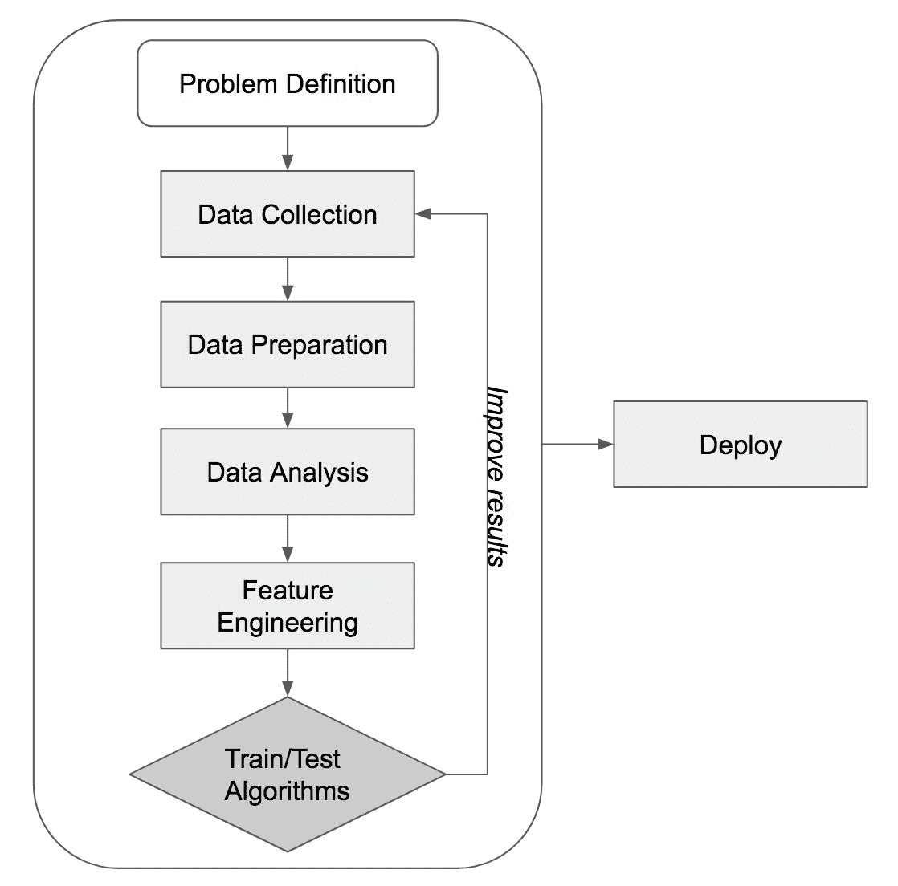

# 接下来是什么？

我们已经走得很远了。从构建**机器学习**（**ML**）模型的基础和步骤，到实际为各种现实世界项目开发众多 ML 模型，我们已经覆盖了很多内容。在简要的介绍章节中，我们学习了 ML 的基础知识以及构建 ML 模型所必需的步骤，然后我们开始构建 ML 模型。在第二章垃圾邮件过滤和第三章推特情感分析中，我们讨论了使用文本数据集构建分类模型。在第四章外汇汇率预测和第五章房屋和财产的公允价值中，我们使用了金融和房地产数据来构建回归模型。然后在第六章客户细分中，我们介绍了如何使用聚类算法通过电子商务数据集来直观地洞察客户行为。在第七章音乐流派推荐和第八章手写数字识别中，我们将构建 ML 模型的知识扩展到使用音乐记录和手写数字图像数据构建音乐推荐和图像识别模型。在第九章网络攻击检测和第十章信用卡欺诈检测中，我们为网络攻击检测和信用卡欺诈检测构建了异常检测模型。

在本章中，我们将回顾我们构建的 ML 模型类型、我们迄今为止参与的项目，以及使用 Accod.NET 框架训练各种 ML 模型的代码片段。我们还将讨论在现实世界项目和情况中使用和应用 ML 时的一些挑战。最后，我们将介绍一些可用于未来 ML 项目的其他软件包，以及数据科学家经常使用的其他常见技术。

在本章中，我们将涵盖以下主题：

+   对我们迄今为止所学内容的回顾

+   构建 ML 模型中的现实挑战

+   数据科学家使用的其他常见技术

# 回顾

从第一章开始，我们已经讨论和覆盖了大量内容。从讨论 ML 的基础知识到构建分类、回归和聚类模型，在结束这本书之前回顾我们所做的一切是值得的。让我们回顾一些对您未来的 C# ML 项目有帮助的基本概念和代码。

# 构建 ML 模型的步骤

如第一章“机器学习建模基础”中所述，对于有志于成为数据科学家和机器学习工程师的人来说，理解用于生产系统的现实世界机器学习模型的流程和方法可能具有挑战性。我们在第一章“机器学习建模基础”中详细讨论了构建机器学习模型的步骤，并且在我们迄今为止工作的每个项目中都遵循了这些步骤。以下图表应该是对构建现实世界机器学习模型的基本步骤的良好总结：



正如你所知，我们总是从问题定义开始一个机器学习项目。在这一步中，我们定义我们将用机器学习解决的问题以及为什么我们需要机器学习模型来解决这些问题。这也是我们构思想法和前提条件的步骤，例如所需数据的类型，以及我们将要实验的学习算法的类型。最后，这也是我们需要明确定义项目成功标准的步骤。我们可以定义一些评估指标，不仅用于评估机器学习模型的预测性能，还用于评估模型的执行性能，特别是如果模型需要在实时系统中运行，并在给定的时间窗口内输出预测结果。

从问题定义阶段，我们进入数据收集步骤。对于本书中我们已工作的项目，我们使用了已经编译并标记的公开数据。然而，在现实世界中，数据可能一开始就不易获得。在这种情况下，我们必须想出收集数据的方法。例如，如果我们计划为网站或应用程序上的用户行为预测构建机器学习模型，那么我们可以收集网站或应用程序上的用户活动。另一方面，如果我们正在构建一个信用模型来评估潜在借款人的信用价值，那么我们很可能无法自行收集数据。在这种情况下，我们必须求助于销售信用相关数据的第三方数据供应商。

在收集了所有数据之后，接下来我们必须要做的是准备和分析数据。在数据准备步骤中，我们需要通过查看数据字段的格式、重复记录的存在或缺失值的数量来验证数据集。在检查了这些标准后，我们就可以开始分析数据，看看数据集中是否有任何明显的模式。如果你还记得，我们通常首先分析目标变量的分布，然后我们开始分析每个目标类别的特征分布，以识别任何可能将目标类别区分开来的明显模式。在数据分析步骤中，我们专注于深入了解数据中的模式，以及数据本身的结构。

从数据分析步骤中获得对数据的洞察和理解后，我们就可以开始构建用于我们的机器学习模型的特征。正如 Andrew Ng 所说，应用机器学习基本上是特征工程。这是构建机器学习模型和确定预测模型性能的最关键步骤之一。如果你还记得，我们讨论了如何使用 one-hot 编码将文本特征转换为 1s 和 0s 的编码矩阵，以解决我们的文本分类问题。我们还讨论了在构建回归模型时构建时间序列特征，如移动平均线和布林带，以及对于高度偏斜的特征使用对数变换。这个特征工程步骤是我们需要发挥创造力的地方。

一旦我们准备好了所有特征，我们就可以继续训练和测试各种学习算法。根据目标变量是连续的还是分类的，我们可以决定是构建分类模型还是回归模型。如果你还记得以前的项目，我们通过使用 k 折交叉验证或通过将数据集分成两个子集，用一组数据进行训练，用另一组保留数据进行测试来训练和测试我们的模型。直到我们找到满意的模型，我们可能需要重复之前的步骤。如果我们没有足够的数据，我们可能需要回到数据收集阶段，尝试收集更多数据以构建更精确的模型。如果我们处理重复记录或缺失值不当，我们可能需要回到数据准备步骤来清理数据。如果我们能构建更多更好的特征，那么重复特征工程步骤可以通过提高我们的机器学习模型性能来帮助。

构建机器学习模型的最后一步是将它们部署到生产系统中。到这一步，所有模型都应该已经过全面测试和验证。在部署前设置一些监控工具将是有益的，这样就可以监控模型的性能。

我们在整本书中都非常详细地遵循了这些步骤，所以当你开始着手未来的机器学习项目时，你会意识到你对这些步骤是多么的熟悉和舒适。然而，有一些关键步骤我们在这本书中并没有完全涵盖，比如数据收集和模型部署步骤，所以你应该始终牢记这些步骤的重要性和目标。

# 分类模型

我们在第二章中构建的第一个两个机器学习模型，*垃圾邮件过滤*和第三章中的*Twitter 情感分析*，都是分类模型。在第二章中的*垃圾邮件过滤*，我们构建了一个分类模型来将邮件分类为垃圾邮件和非垃圾邮件（非垃圾邮件）。在第三章中的*Twitter 情感分析*，我们构建了一个用于 Twitter 情感分析的分类模型，该模型将每条推文分类为三种情感之一——正面、负面和中性。分类问题在机器学习项目中很常见。构建一个模型来预测客户是否会在在线商店购买商品是一个分类问题。构建一个模型来预测借款人是否会偿还其贷款也是一个分类问题。

如果目标变量中只有两个类别，通常是正面结果和负面结果，那么我们称之为二元分类。二元分类的一个很好的例子是我们第二章中做的垃圾邮件过滤项目。如果目标变量中有超过两个类别，那么我们称之为多类或多项式分类。在第三章中的 Twitter 情感分析项目中，我们不得不将一条记录分类为三个不同的类别；这是一个多项式分类问题的良好例子。在这本书中我们还有两个更多的分类项目。如果你还记得，在我们的音乐流派推荐项目第七章中，目标变量有八个不同的流派或类别，而在我们的手写数字识别项目第八章中，目标变量有十个不同的数字。

我们对多种学习算法进行了实验，例如逻辑回归、朴素贝叶斯、**支持向量机**（**SVM**）、随机森林和神经网络，用于上述分类项目。为了提醒您如何在 C#中训练这些学习算法，我们将重述如何使用 Accord.NET 框架在 C#中初始化一些学习算法。

以下代码片段展示了我们如何训练一个二元逻辑回归分类器：

```py
var learner = new IterativeReweightedLeastSquares<LogisticRegression>()
{
    MaxIterations = 100
};
var model = learner.Learn(inputs, outputs);
```

对于多项式分类问题，我们使用以下代码训练了一个逻辑回归分类器：

```py
var learner = new MultinomialLogisticLearning<GradientDescent>()
{
    MiniBatchSize = 500
};
var model = learner.Learn(inputs, outputs);
```

在构建朴素贝叶斯分类器时，我们使用了以下代码：

```py
var learner = new NaiveBayesLearning<NormalDistribution>();
var model = learner.Learn(inputs, outputs);
```

如果您还记得，当特征具有连续变量时，我们使用了`NormalDistribution`，例如在音乐流派推荐项目中，所有特征都是音频频谱特征，具有连续值。另一方面，我们使用了`BernoulliDistribution`，其中特征只能取二元值（0 与 1）。在第三章，“Twitter 情感分析”项目中，我们拥有的所有特征只能取 0 或 1。

以下代码展示了我们如何训练一个`RandomForestLearning`分类器：

```py
var learner = new RandomForestLearning()
{
    NumberOfTrees = 100,

    CoverageRatio = 0.5,

    SampleRatio = 0.7

};
var model = learner.Learn(inputs, outputs);
```

如您可能已经知道，我们可以调整超参数，例如随机森林中的树的数量（`NumberOfTrees`）、每棵树最多可以使用的变量比例（`CoverageRatio`）以及训练每棵树使用的样本比例（`SampleRatio`），以找到性能更好的随机森林模型。

我们使用以下代码来训练一个 SVM 模型：

```py
var learner = new SequentialMinimalOptimization<Gaussian>();
var model = learner.Learn(inputs, outputs);
```

如果您还记得，我们可以为 SVM 使用不同的核函数。除了`高斯`核之外，我们还可以使用`线性`和`多项式`核。根据您拥有的数据集类型，一个核函数可能比其他核函数表现更好，因此应该尝试各种核函数以找到最佳性能的 SVM 模型。

最后，我们可以使用以下代码来训练一个神经网络：

```py
var network = new ActivationNetwork(
    new BipolarSigmoidFunction(2), 
    91, 
    20,
    10
);

var teacher = new LevenbergMarquardtLearning(network);

Console.WriteLine("\n-- Training Neural Network");
int numEpoch = 10;
double error = Double.PositiveInfinity;
for (int i = 0; i < numEpoch; i++)
{
    error = teacher.RunEpoch(trainInput, outputs);
    Console.WriteLine("* Epoch {0} - error: {1:0.0000}", i + 1, error);
}
```

如您可能从第八章，“手写数字识别”中回忆起的那样，我们通过多次（多个 epoch）运行数据集来训练一个神经网络模型。在每次迭代或 epoch 之后，我们注意到错误率下降，因为神经网络从数据集中学习得越来越多。我们还注意到，在每个 epoch 中，错误率提高的速率是递减的，所以经过足够的 epochs 后，神经网络模型的性能不会有显著提升。

您可以在以下链接查看代码示例：[`github.com/yoonhwang/c-sharp-machine-learning/blob/master/ch.11/ClassificationModelReview.cs`](https://github.com/yoonhwang/c-sharp-machine-learning/blob/master/ch.11/ClassificationModelReview.cs)。

# 回归模型

我们还开发了多个回归机器学习模型。在第四章 *外汇汇率预测*中，我们进行了外汇汇率预测项目，构建了可以预测欧元和美元之间未来汇率的模型。在第五章 *房屋和财产公允价值*中，我们训练了不同的机器学习模型，可以预测房屋和财产公允价值项目的房价。回归问题在现实世界的机器学习项目中也很常见。构建一个预测客户终身价值的模型是一个回归问题。构建一个预测潜在借款人可以借到的最大金额而不破产的模型是另一个回归问题。

在本书中，我们探讨了回归项目中多种机器学习算法。我们在第四章 *外汇汇率预测*中尝试了线性回归和线性 SVM 模型。我们还在第五章 *房屋和财产公允价值*中尝试了 SVM 模型的不同核，例如多项式核和高斯核。为了提醒您如何在 C# 中训练这些回归模型，我们将重述如何使用 C# 和 Accord.NET 框架构建这些模型。

以下代码片段展示了我们如何训练线性回归模型：

```py
var learner = new OrdinaryLeastSquares()
{
    UseIntercept = true
};
var model = learner.Learn(inputs, outputs);
```

当使用线性核构建 SVM 时，我们使用了以下代码：

```py
var learner = new LinearRegressionNewtonMethod()
{
    Epsilon = 2.1,
    Tolerance = 1e-5,
    UseComplexityHeuristic = true
};
var model = learner.Learn(inputs, outputs);
```

如您可能记得的，`Epsilon`、`Tolerance` 和 `UseComplexityHeuristic` 是可以进一步调整以获得更好模型性能的超参数。在构建 SVM 模型时，我们建议您尝试各种超参数组合，以找到最适合您业务案例的最佳性能模型。

当我们想要为 SVM 使用多项式核时，可以使用以下代码：

```py
var learner = new FanChenLinSupportVectorRegression<Polynomial>()
{
    Kernel = new Polynomial(3)
};
var model = learner.Learn(inputs, outputs);
```

对于多项式核，您可以调整多项式函数的次数。例如，对于二次多项式（二次）核，您可以使用 `new Polynomial(2)` 初始化核。同样，对于四次多项式核，您可以使用 `new Polynomial(4)` 初始化核。然而，增加核的复杂性可能导致过拟合，因此在使用高次数多项式核时需要小心。

当我们想要使用高斯核构建 SVM 时，可以使用以下代码：

```py
var learner = new FanChenLinSupportVectorRegression<Gaussian>()
{
    Kernel = new Gaussian()
};
var model = learner.Learn(inputs, outputs);
```

您可以在以下链接找到上述回归模型的代码示例：[`github.com/yoonhwang/c-sharp-machine-learning/blob/master/ch.11/RegressionModelReview.cs`](https://github.com/yoonhwang/c-sharp-machine-learning/blob/master/ch.11/RegressionModelReview.cs)。

# 聚类算法

我们讨论了一种无监督学习算法，k-means 聚类，以及它是如何从未标记的数据集中提取洞察力的。在第六章“客户细分”中，我们使用 k-means 聚类算法对电子商务数据集进行了分析，并从数据集中了解了不同的客户行为。我们已经介绍了如何根据购买历史使用聚类算法构建不同的客户细分，但聚类算法还有许多其他应用。例如，聚类算法也可以用于图像分析，例如将图像划分为子区域，以及在生物信息学中，如发现紧密相关的基因组（基因聚类）。

我们使用以下代码使用 C#和 Accord.NET 框架构建了一个 k-means 聚类算法：

```py
KMeans kmeans = new KMeans(numClusters);
KMeansClusterCollection clusters = kmeans.Learn(sampleSet);
```

如您所回忆的那样，我们需要向`KMeans`类提供我们想要构建的聚类数量。我们讨论的一种程序化决定最佳聚类数量的方法是通过查看轮廓分数，该分数衡量数据点与其自身聚类的相似程度。使用这个轮廓分数，您可以遍历不同的聚类数量，然后决定哪一个最适合给定的数据集。

您可以在以下链接找到 k-means 聚类算法的代码示例：[`github.com/yoonhwang/c-sharp-machine-learning/blob/master/ch.11/ClusteringAlgorithmReview.cs`](https://github.com/yoonhwang/c-sharp-machine-learning/blob/master/ch.11/ClusteringAlgorithmReview.cs)。

# 现实生活中的挑战

如果我们能为所有业务问题构建机器学习模型那将非常棒。然而，通常并非如此。在到达模型开发阶段时，往往比实际构建工作模型有更多的挑战。当我们从事机器学习项目时，我们将讨论以下经常出现的数据科学挑战：

+   数据问题

+   基础设施问题

+   可解释性与准确性

# 数据问题

拥有正确的数据和足够的数据是构建一个有效的机器学习模型最重要的先决条件。然而，这通常是开发机器学习模型中最困难的部分，原因有很多。我们将讨论许多数据科学家在数据相关问题方面面临的几个常见挑战。

首先，所需的数据可能根本不存在。例如，想象一家新成立的在线零售店想要应用机器学习来理解或预测其客户的消费模式。由于他们是一家新业务，客户基础小，历史购买数据不多，他们将没有足够的数据供数据科学家使用。在这种情况下，他们唯一能做的就是等待更好的时机开始机器学习项目，即使他们团队中有数据科学家。他们的数据科学家将无法用有限的数据构建出有意义的模型。

其次，数据集存在，但无法访问。这类问题在大公司中经常发生。由于安全问题，访问数据可能仅限于组织的某些子组。在这种情况下，数据科学家可能需要通过不同部门或商业实体的多个级别审批，或者他们可能需要构建一个独立的数据管道，通过该管道他们可以摄取所需的数据。这类问题通常意味着数据科学家在开始他们想要从事的机器学习项目之前需要花费很长时间。

最后，数据是分割的或过于杂乱。几乎所有情况下，数据科学家获得的原始数据集都包含杂乱的数据，并来自不同的数据源。数据中可能有太多的缺失值或重复记录，数据科学家将不得不花费大量时间清理原始数据集。数据可能过于非结构化。这种情况通常发生在处理大量文本数据集时。在这种情况下，您可能需要应用各种文本挖掘和**自然语言处理**（**NLP**）技术来清理数据，使其可用于构建机器学习模型。

# 基础设施问题

在大型数据集上训练机器学习模型需要大量的内存和 CPU 资源。随着数据的规模越来越大，遇到基础设施问题几乎是不可避免的。如果您没有足够的内存资源来训练机器学习模型，您可能会在训练模型数小时或数天后遇到“内存不足”异常。如果您没有足够的处理能力，那么训练一个复杂的机器学习模型可能需要数周甚至数月。获得正确的计算资源是构建机器学习模型中的一个真正挑战。随着用于机器学习的数据增长速度比以往任何时候都快，所需的计算资源量也逐年显著增加。

随着云计算服务提供商，如 AWS、谷歌和微软 Azure 的日益流行，获取所需的计算资源变得更加容易。在任何这些云计算平台上，您都可以轻松地请求和使用所需的内存和 CPU 数量。然而，任何事物都有代价，在这些云平台上运行机器学习任务可能会花费大量金钱。根据您的预算，这些成本可能会限制您为机器学习任务可用的计算资源量，因此需要巧妙地规划。

# 可解释性与准确性

机器学习领域最后一个常见的现实挑战是机器学习模型的可解释性和准确率之间的权衡。更传统和线性的模型，如逻辑回归和线性回归模型，在预测输出的解释上比较容易。我们可以提取这些线性模型的截距和系数，并通过简单的算术运算得到预测输出。然而，更复杂的模型，如随机森林和 SVM，在解释预测输出方面更难使用。与逻辑回归或线性回归模型不同，我们不能通过简单的算术运算推导出预测输出。这些复杂模型更像是一个黑盒。我们知道输入和输出，但中间的过程对我们来说是一个黑盒。

当用户或审计员要求对模型行为进行解释时，这种复杂学习算法的可解释性问题成为一个问题。如果存在对可解释性的这种要求，我们可能不得不求助于更传统的线性模型，即使更复杂的模型在性能上优于这些线性模型。

# 其他常见技术

随着机器学习和数据科学领域的发展速度比以往任何时候都要快，正在建设的新的技术数量也在以极快的速度增长。有许多资源和工具可以帮助我们更轻松、更快速地构建机器学习解决方案和应用。我们将讨论一些我们推荐您熟悉的技术和工具，以便您在未来的机器学习项目中使用。

# 其他机器学习库

我们在这本书中使用的 Accord.NET 框架是机器学习中最常用且文档最完善的框架之一。然而，其他为 C#编写的机器学习库也值得提及并关注您未来的机器学习项目。

**Encog**是一个可以在 Java 和 C#中使用的机器学习框架。在某种程度上，它与我们所使用的 Accord.NET 框架非常相似，因为它在框架内提供了广泛的机器学习算法。这个框架有很好的文档，并且有很多示例代码可以参考，用于您的未来机器学习项目。关于**Encog**框架的更多信息可以在以下链接找到：[`www.heatonresearch.com/encog/`](https://www.heatonresearch.com/encog/)。

**Weka** 是另一个机器学习框架，但它在意义上与 Accord.NET 框架不同，因为 **Weka** 框架是专门为数据挖掘而设计的。它被许多研究人员广泛使用，并且有良好的文档，甚至有一本书解释了如何使用 **Weka** 进行数据挖掘。Weka 是用 Java 编写的，但它也可以用于 C#。有关 **Weka** 框架的更多信息可以在以下链接中找到：[`www.cs.waikato.ac.nz/~ml/index.html`](https://www.cs.waikato.ac.nz/~ml/index.html)。你还可以在以下链接中找到有关如何在 C# 中使用 **Weka** 框架的信息：[`weka.wikispaces.com/Use%20WEKA%20with%20the%20Microsoft%20.NET%20Framework`](https://weka.wikispaces.com/Use%20WEKA%20with%20the%20Microsoft%20.NET%20Framework)。

最后，你可以在 NuGet 中搜索任何其他用于 C# 的机器学习框架。任何在 NuGet 上可用的库或包都可以轻松下载并在你的开发环境中引用。搜索以下链接以查找你可能需要的或可能对你的未来机器学习项目有帮助的任何包是一个好习惯：[`www.nuget.org/`](https://www.nuget.org/)。

# 数据可视化库和工具

我们接下来要讨论的工具和包系列是关于数据可视化的。机器学习（ML）和数据可视化是数据科学中不可分割的组合。对于你构建的任何机器学习模型，你应该能够向用户或商业伙伴展示你的发现、模型性能和模型结果。此外，为了持续监控模型性能，数据可视化技术通常被用来识别生产系统中模型的任何问题或模型性能的任何潜在下降。因此，许多数据可视化库被构建出来以简化数据可视化任务。

**LiveCharts** 是一个用于数据可视化的 .NET 库。在这本书中，我们一直使用 Accord.NET 框架的图表库，但对于更复杂的图表，我们推荐使用 **LiveCharts**。从基本的图表，如折线图和柱状图，到复杂的交互式图表，你可以在 C# 中相对容易地构建各种可视化。**LiveCharts** 库有详尽的文档和大量的示例以及示例代码。你可以在以下链接中找到有关如何使用 **LiveCharts** 进行数据可视化的更多信息：[`lvcharts.net/`](https://lvcharts.net/)。

除了用于数据可视化任务的 C#.NET 库之外，在数据科学社区中还有两个经常使用的数据可视化工具：**D3.js**和**Tableau**。**D3.js**是一个用于在网页上构建和展示图表的 JavaScript 库。通常，这个 JavaScript 库被用来创建各种数据科学和数据可视化任务的仪表板。**Tableau**是一个商业智能工具，您可以使用它拖放创建各种可视化。这个工具不仅被数据科学家使用，还被非数据专业人士使用来创建仪表板。有关**D3.js**库的更多信息，您可以点击此链接：[`d3js.org/`](https://d3js.org/)。有关 Tableau 的更多信息，您可以点击此链接：[`www.tableau.com/`](https://www.tableau.com/)。

# 数据处理技术

最后，我们将讨论一些常用的数据处理技术和工具。在这本书中，我们主要使用 CSV 文件作为机器学习建模项目的输入。我们使用了 Deedle 框架来加载数据、操作和汇总数据。然而，机器学习项目的输入数据类型往往各不相同。对于某些项目，数据可能存储在 SQL 数据库中。对于其他项目，数据可能存储在分布式文件系统中。此外，输入数据的来源甚至可能是实时流服务。我们将简要讨论在这种情况下常用的几种技术，以及如何查找更详细的信息，以便您进行进一步的研究。

SQL 数据库，如 SQL Server 或 PostgreSQL，是数据存储和数据处理中最常用的技术。使用 SQL 语言，数据科学家可以轻松检索、操作和汇总数据，以处理和准备他们的机器学习项目所需的数据。作为一名有抱负的数据科学家，熟悉使用 SQL 语言来处理数据将是有益的。

数据科学社区中经常使用的一种技术是**Spark**，它是一个集群计算框架。使用**Spark**，您可以大规模处理大量数据。通过使用机器集群并将重计算分布到这些机器上，**Spark**有助于构建可扩展的大数据解决方案。这项技术在许多组织和公司中广泛使用，例如 Netflix、Yahoo 和 eBay，这些公司每天都要处理大量数据。

最后，对于实时机器学习应用，存在众多流处理技术。其中最受欢迎的一种是**Kafka**。当构建需要持续流式传输数据的实时应用或数据管道时，这项技术经常被使用。在构建实时机器学习应用的情况下，使用流处理技术，如**Kafka**，对于成功交付实时机器学习产品将是必不可少的。

# 摘要

在本章中，我们回顾了本书迄今为止所讨论的内容。我们简要地概述了构建机器学习模型的基本步骤。然后，我们总结并编写了使用 Accord.NET 框架在 C# 中构建各种机器学习模型的代码。我们还讨论了在本书中未能涵盖但你在开始你的未来机器学习项目时很可能会遇到的现实挑战。我们讨论了访问和编译数据以构建机器学习模型时的挑战，大数据可能出现的架构挑战，以及机器学习模型的可解释性和准确性之间的权衡。最后，我们介绍了一些我们推荐你为未来的机器学习项目熟悉的常用技术。本章中提到的代码库和工具只是可用工具的一个子集，常用的工具和技术将逐年演变。我们建议你持续研究即将到来的机器学习与数据科学技术。

在本书中，我们涵盖了各种机器学习技术、工具和概念。随着你从构建基本的分类和回归模型到复杂的推荐系统和图像识别系统，以及针对现实问题的异常检测模型的学习，我希望你在构建未来机器学习项目中的机器学习模型方面获得了更多的信心。我希望你在本书中的旅程是值得和有意义的，并且你学到了许多新的和有用的技能。
