# 使用 TensorFlow 进行图像标题生成

首先，本章将简要概述创建详细英语图像描述的过程。使用基于 TensorFlow 的图像标题生成模型，我们将能够用详细且完美描述图像的标题替换单个单词或复合词/短语。我们首先将使用预训练的图像标题生成模型，然后从头开始重新训练模型以在一系列图像上运行。

在本章中，我们将涵盖以下内容：

+   图像标题生成简介

+   Google Brain im2txt 标题生成模型

+   在 Jupyter 中运行我们的标题生成代码

+   重新训练模型

# 技术要求

除了 Python 知识、图像处理和计算机视觉的基础知识外，我们还需要以下 Python 库：

+   NumPy

+   Matplotlib

本章中使用的代码已添加到以下 GitHub 仓库中：

[`github.com/PacktPublishing/Computer-Vision-Projects-with-OpenCV-and-Python-3`](https://github.com/PacktPublishing/Computer-Vision-Projects-with-OpenCV-and-Python-3)

# 图像标题生成简介

图像标题生成是一个基于图像生成文本描述的过程。为了更好地理解图像标题生成，我们首先需要将它与图像分类区分开来。

# 图像分类与图像标题生成的区别

图像分类是一个相对简单的过程，它只能告诉我们图像中有什么。例如，如果有一个骑自行车的男孩，图像分类不会给我们一个描述；它只会提供结果作为**男孩**或**自行车**。图像分类可以告诉我们图像中是否有女人或狗，或者是否有动作，如滑雪。这不是一个理想的结果，因为图像中并没有描述具体发生了什么。

以下是使用图像分类得到的结果：

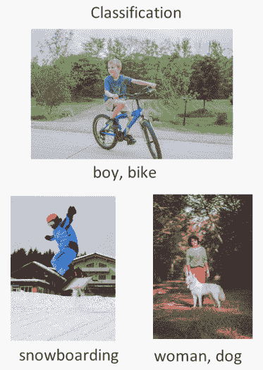

相比之下，图像标题生成将提供一个带有描述的结果。对于前面的例子，图像标题生成的结果将是**一个男孩骑在自行车上**或**一个男人在滑雪**。这可能有助于为书籍生成内容，或者可能有助于帮助听力或视觉障碍者。

以下是使用图像标题生成得到的结果：

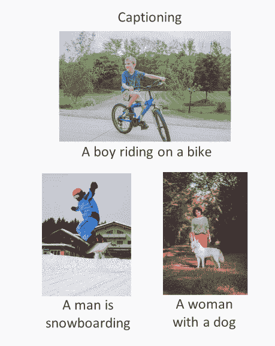

然而，这要困难得多，因为传统的神经网络虽然强大，但它们与序列数据不太兼容。序列数据是指按顺序到来的数据，而这个顺序实际上很重要。在音频或视频中，我们有按顺序到来的单词；打乱单词可能会改变句子的含义，或者只是使其成为完全的胡言乱语。

# 带有长短期记忆的循环神经网络

尽管卷积神经网络（CNNs）非常强大，但它们并不擅长处理序列数据；然而，它们非常适合非序列任务，如图像分类。

CNN 是如何工作的，以下图所示：

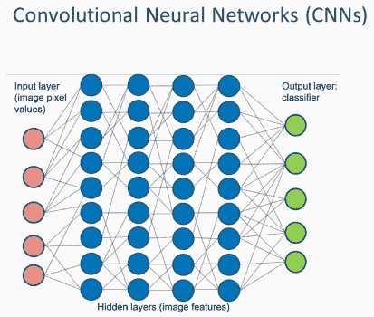

**循环神经网络**（**RNNs**），实际上确实是当前最先进的技术，可以处理序列任务。一个 RNN 由一系列接收数据的 CNN 组成。

RNNs 是如何工作的，以下图所示：

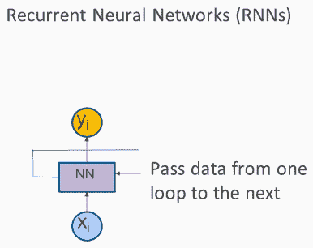

按序列进入的数据（**x[i]**）通过神经网络，我们得到输出（**y[i]**）。然后输出被送入另一个迭代，形成一个循环。这有助于我们记住之前来的数据，对于音频和语音识别、语言翻译、视频识别和文本生成等序列数据任务非常有帮助。

另一个存在已久且非常有用的概念是与 RNNs 结合的**长短期记忆**（**LSTM**）。这是一种处理长期记忆并避免仅仅将数据从一次迭代传递到下一次迭代的方法。它以稳健的方式处理迭代中的数据，并使我们能够有效地训练 RNNs。

# Google Brain im2txt 字幕模型

Google Brain im2txt 被 Google 用于论文《2015 MSCOCO 图像字幕挑战》，并将成为我们将在项目中实现的图像字幕代码的基础。

Google 的 GitHub TensorFlow 页面可以在[`github.com/tensorflow/models/tree/master/research/im2txt`](https://github.com/tensorflow/models/tree/master/research/im2txt)找到[.](https://github.com/tensorflow/models/tree/master/research/im2txt)

在研究目录中，我们将找到 Google 在论文《2015 MSCOCO 图像字幕挑战》中使用的`im2txt`文件，该文件可在[`arxiv.org/abs/1609.06647`](https://arxiv.org/abs/1609.06647)免费获取。它详细介绍了 RNNs、LSTM 和基本算法。

我们可以检查 CNN 是如何用于图像分类的，也可以学习如何使用 LSTM RNNs 来实际生成序列字幕输出。

我们可以从 GitHub 链接下载代码；然而，它尚未设置得易于运行，因为它不包含预训练模型，所以我们可能会遇到一些挑战。我们已经为您提供了预训练模型，以避免从头开始训练图像分类器，因为这是一个耗时的过程。我们对代码进行了一些修改，使得代码在 Jupyter Notebook 上运行或集成到您自己的项目中变得容易。使用 CPU，预训练模型学习非常快。没有预训练模型的相同代码实际上可能需要几周时间才能学习，即使在好的 GPU 上也是如此。

# 在 Jupyter 上运行字幕代码

现在我们将在 Jupyter Notebook 上运行我们自己的代码版本。我们可以启动自己的 Jupyter Notebook，并从 GitHub 仓库加载`Section_1-Tensorflow_Image_Captioning.ipynb`文件（[`github.com/PacktPublishing/Computer-Vision-Projects-with-OpenCV-and-Python-3/blob/master/Chapter01/Section_1-Tensorflow_Image_Captioning.ipynb`](https://github.com/PacktPublishing/Computer-Vision-Projects-with-OpenCV-and-Python-3/blob/master/Chapter01/Section_1-Tensorflow_Image_Captioning.ipynb)）。

一旦我们在 Jupyter Notebook 中加载了文件，它看起来会像这样：

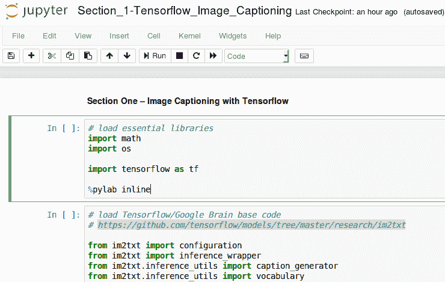

在第一部分，我们将加载一些基本库，包括`math`、`os`和`tensorflow`。我们还将使用我们方便的实用函数`%pylab inline`，以便在 Notebook 中轻松读取和显示图像。

选择第一个代码块：

```py
# load essential libraries
import math
import os

import tensorflow as tf

%pylab inline
```

当我们按下*Ctrl* + *Enter*来执行单元格中的代码时，我们将得到以下输出：

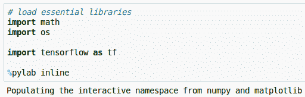

我们现在需要加载 TensorFlow/Google Brain 的基础代码，我们可以从[`github.com/PacktPublishing/Computer-Vision-Projects-with-OpenCV-and-Python-3`](https://github.com/PacktPublishing/Computer-Vision-Projects-with-OpenCV-and-Python-3)获取。

有多个实用函数，但在我们的示例中，我们只会使用和执行其中的一些：

```py
# load Tensorflow/Google Brain base code
# https://github.com/tensorflow/models/tree/master/research/im2txt

from im2txt import configuration
from im2txt import inference_wrapper
from im2txt.inference_utils import caption_generator
from im2txt.inference_utils import vocabulary
```

我们需要告诉我们的函数在哪里可以找到训练模型和词汇表：

```py
# tell our function where to find the trained model and vocabulary
checkpoint_path = './model'
vocab_file = './model/word_counts.txt'
```

训练模型和词汇表的代码已添加到 GitHub 仓库中，您可以通过此链接访问：[`github.com/PacktPublishing/Computer-Vision-Projects-with-OpenCV-and-Python-3`](https://github.com/PacktPublishing/Computer-Vision-Projects-with-OpenCV-and-Python-3)

[`github.com/PacktPublishing/Computer-Vision-Projects-with-OpenCV-and-Python-3`](https://github.com/PacktPublishing/Computer-Vision-Projects-with-OpenCV-and-Python-3)

文件夹包含`checkpoint`、`word_counts.txt`和预训练模型。我们需要确保我们使用这些文件，并避免使用可能不与 TensorFlow 最新版本兼容的其他过时文件。`word_counts.txt`文件包含一个词汇表，其中包含我们从训练模型中得到的计数，这是我们的图像标题生成器所需要的。

一旦这些步骤完成，我们就可以查看我们的`main`函数，它将为我们生成标题。该函数可以接受一个字符串形式的输入文件（以逗号分隔）或仅一个我们想要处理的文件。

将冗余度设置为`tf.logging.FATAL`，这是可用的不同日志级别之一，因为它会告诉我们是否真的出了问题：

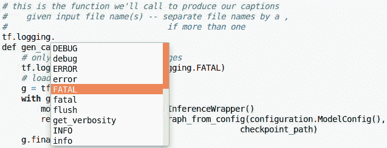

在主代码的初始部分，我们执行以下步骤：

1.  将冗余度设置为`tf.logging.FATAL`。

1.  加载我们的预训练模型。

1.  从 Google 提供的实用文件中加载推理包装器。

1.  从之前单元格中建立的`checkpoint`路径加载我们的预训练模型。

1.  运行`finalize`函数：

```py
# this is the function we'll call to produce our captions 
# given input file name(s) -- separate file names by a,
# if more than one

def gen_caption(input_files):
    # only print serious log messages
    tf.logging.set_verbosity(tf.logging.FATAL)
    # load our pretrained model
    g = tf.Graph()
    with g.as_default():
        model = inference_wrapper.InferenceWrapper()
        restore_fn = model.build_graph_from_config(configuration.ModelConfig(),
                                                 checkpoint_path)
    g.finalize()
```

1.  再次从之前运行的单元格中加载词汇表文件：

```py
    # Create the vocabulary.
    vocab = vocabulary.Vocabulary(vocab_file)
```

1.  预处理文件名：

```py
    filenames = []
    for file_pattern in input_files.split(","):
```

1.  执行`Glob`操作：

```py
        filenames.extend(tf.gfile.Glob(file_pattern))
```

1.  创建一个文件名列表，这样你可以知道图像标题生成器正在哪个文件上运行：

```py
    tf.logging.info("Running caption generation on %d files matching %s",
                    len(filenames), input_files)
```

1.  创建一个会话。由于我们正在使用预训练的模型，我们需要使用`restore`函数：

```py
    with tf.Session(graph=g) as sess:
        # Load the model from checkpoint.
        restore_fn(sess)
```

这些步骤的代码包含在此处：

```py
# this is the function we'll call to produce our captions 
# given input file name(s) -- separate file names by a,
# if more than one

def gen_caption(input_files):
    # only print serious log messages
    tf.logging.set_verbosity(tf.logging.FATAL)
    # load our pretrained model
    g = tf.Graph()
    with g.as_default():
        model = inference_wrapper.InferenceWrapper()
        restore_fn = model.build_graph_from_config(configuration.ModelConfig(),
                                                 checkpoint_path)
    g.finalize()

    # Create the vocabulary.
    vocab = vocabulary.Vocabulary(vocab_file)

    filenames = []
    for file_pattern in input_files.split(","):
        filenames.extend(tf.gfile.Glob(file_pattern))
    tf.logging.info("Running caption generation on %d files matching %s",
                    len(filenames), input_files)

    with tf.Session(graph=g) as sess:
        # Load the model from checkpoint.
        restore_fn(sess)
```

我们现在转向主代码的第二部分。一旦会话已恢复，我们执行以下步骤：

1.  从我们的模型和存储在名为`generator`的对象中的词汇中加载`caption_generator`：

```py
        generator = caption_generator.CaptionGenerator(model, vocab)
```

1.  制作标题列表：

```py
        captionlist = []
```

1.  遍历文件并将它们加载到名为`beam_search`的生成器中，以分析图像：

```py
        for filename in filenames:
            with tf.gfile.GFile(filename, "rb") as f:
                image = f.read()
            captions = generator.beam_search(sess, image)
```

1.  打印标题：

```py
            print("Captions for image %s:" % os.path.basename(filename))
```

1.  迭代以创建多个标题，迭代已为模型设置：

```py
            for i, caption in enumerate(captions):
                # Ignore begin and end words.
                sentence = [vocab.id_to_word(w) for w in caption.sentence[1:-1]]
                sentence = " ".join(sentence)
                print(" %d) %s (p=%f)" % (i, sentence, math.exp(caption.logprob)))
                captionlist.append(sentence)
```

1.  返回`captionlist`：

```py
    return captionlist
```

运行代码以生成函数。

请看以下代码块中的完整代码：

```py
    # Prepare the caption generator. Here we are implicitly using the default
    # beam search parameters. See caption_generator.py for a description of the
    # available beam search parameters.
        generator = caption_generator.CaptionGenerator(model, vocab)

        captionlist = []

        for filename in filenames:
            with tf.gfile.GFile(filename, "rb") as f:
                image = f.read()
            captions = generator.beam_search(sess, image)
            print("Captions for image %s:" % os.path.basename(filename))
            for i, caption in enumerate(captions):
                # Ignore begin and end words.
                sentence = [vocab.id_to_word(w) for w in caption.sentence[1:-1]]
                sentence = " ".join(sentence)
                print(" %d) %s (p=%f)" % (i, sentence, math.exp(caption.logprob)))
                captionlist.append(sentence)
    return captionlist
```

在下一个代码块中，我们将对来自`test`文件夹的样本股票照片执行代码。代码将创建一个图形，显示它，然后运行标题生成器。然后我们可以使用`print`语句显示输出。

以下是我们用来选择用于计算的图像的代码：

```py
testfile = 'test_images/dog.jpeg'

figure()
imshow(imread(testfile))

capts = gen_caption(testfile)
```

当我们运行我们的第一个测试图像，`dog.jpeg`，我们得到以下输出：

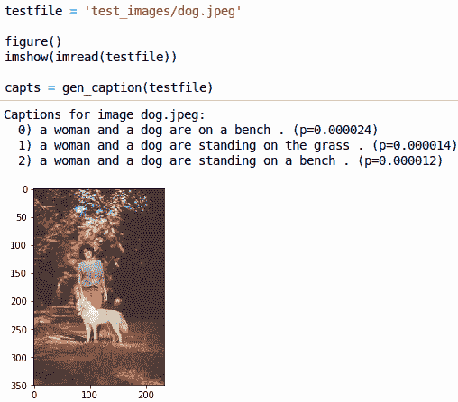

结果，“一位女士和一只狗站在草地上”，是对图像的一个很好的描述。由于所有三个结果都很相似，我们可以说我们的模型工作得相当好。

# 分析结果标题

让我们拿几个例子来检查我们的模型。当我们执行`football.jpeg`时，我们得到以下输出：

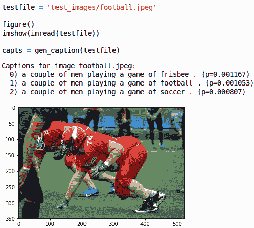

在这里，我们清楚地看到图像中正在进行美式足球比赛，而“一对男子在踢足球”是一个非常好的结果。然而，第一个结果，“一对男子在玩飞盘”，并不是我们想要的结果，也不是“一对男子在踢足球”。因此，在这种情况下，第二个标题通常会是最好的，但并不总是完美的，这取决于对数概率。

让我们再试一个例子，`giraffes.jpeg`：

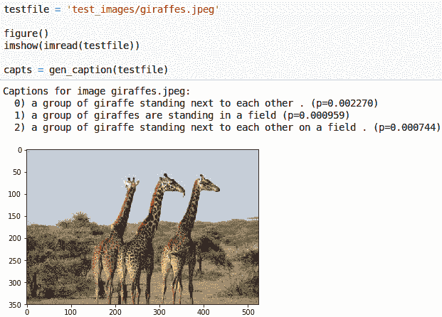

很明显，我们有一张长颈鹿的图片，第一个标题，“一排长颈鹿并排站立”，看起来似乎是正确的，除了语法问题。其他两个结果是“一排长颈鹿站在田野中”和“一排长颈鹿在田野中并排站立”。

让我们再看一个例子，`headphones.jpeg`：

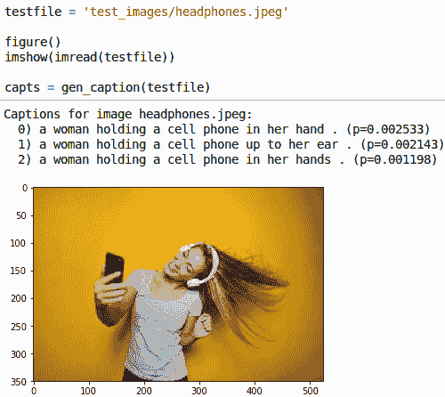

在这里，我们选择了`headphones.jpeg`，但结果中没有包含耳机。结果是“一位女士手里拿着一部手机”，这是一个很好的结果。第二个结果，“一位女士把手机举到耳边”，技术上是不正确的，但总体上是一些好的标题。

让我们再举一个例子，`ballons.jpeg`。当我们运行图像时，我们得到以下输出：

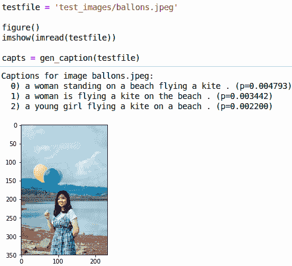

对于这张图像，我们得到的结果是“一个站在海滩上放风筝的妇女”、“一个在海滩上放风筝的妇女”，以及“一个在海滩上放风筝的年轻女孩”。所以，模型得到了“妇女”或“年轻女孩”，但它得到了“风筝”而不是气球，尽管“气球”在词汇表中。因此，我们可以推断出模型并不完美，但它很令人印象深刻，可以包含在你的应用程序中。

# 在 Jupyter 上运行多图像的标题代码

也可以通过使用逗号分隔不同图像的图像路径，将多个图像作为输入字符串添加。字符串图像的执行时间将大于我们之前看到的任何时间。

以下是一个多个输入文件的示例：

```py
input_files = 'test_images/ballons.jpeg,test_images/bike.jpeg,test_images/dog.jpeg,test_images/fireworks.jpeg,test_images/football.jpeg,test_images/giraffes.jpeg,test_images/headphones.jpeg,test_images/laughing.jpeg,test_images/objects.jpeg,test_images/snowboard.jpeg,test_images/surfing.jpeg'

capts = gen_caption(input_files)
```

我们将不会显示图像，所以输出将只包括结果。我们可以看到，一些结果比其他结果要好：

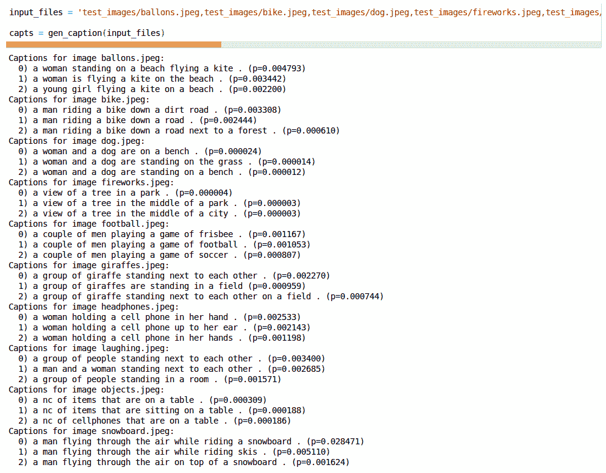

这就完成了预训练图像标题模型的运行。我们现在将介绍从头开始训练模型并在标题图像上运行它。

# 重新训练标题模型

因此，既然我们已经看到了图像标题代码的实际应用，我们接下来将在我们自己的数据上重新训练图像标题器。然而，我们需要知道，如果想要在合理的时间内处理，这将非常耗时，并且需要超过 100 GB 的硬盘空间。即使有好的 GPU，完成计算可能也需要几天或一周的时间。既然我们有意愿实施并且有资源，让我们开始重新训练模型。

在笔记本中，第一步是下载预训练的 Inception 模型。`webbrowser` 模块将使打开 URL 并下载文件变得容易：

```py
# First download pretrained Inception (v3) model

import webbrowser 
webbrowser.open("http://download.tensorflow.org/models/inception_v3_2016_08_28.tar.gz")

# Completely unzip tar.gz file to get inception_v3.ckpt,
# --recommend storing in im2txt/data directory
```

以下将是输出：

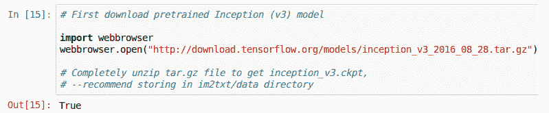

当我们选择代码块并执行它时，我们可能无法在网页上查看内容，但我们可以点击对话框中的“保存”来下载文件。解压文件以获取 Inception v3 检查点文件。我们可以使用任何可用的解压工具，但最好是使用 7-zip 来获取 Inception v3 检查点文件，并将其存储在项目目录的 `im2txt/data` 中。

`cd` 命令用于导航到 `im2txt/data` 目录，那里存放着所有我们的文件。`run_build_mscoco_data.py` Python 脚本将抓取并处理所有图像数据和预制的标题数据。这个过程可能需要超过 100 GB 的空间，并且需要超过一个小时来完成执行。

一旦计算完成，我们将在项目目录中看到三个 ZIP 文件。我们可以解压这些文件以获取以下目录：

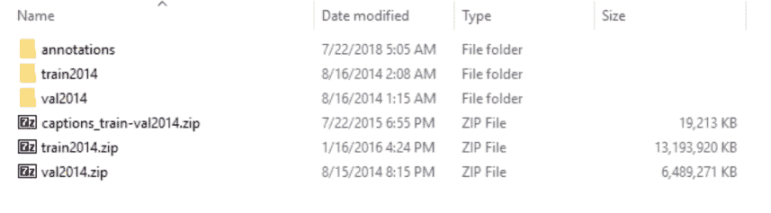

训练和验证的 JSON 文件位于`annotations`文件夹中。其他目录包含图像训练和验证数据。在`train2014`目录下，我们将找到与训练数据对应的 JPEG 图像。同样，与验证数据对应的资源将存在于`val2014`文件夹中。我们也可以替换自己的图像，并编辑`annotations`文件夹中相应的 JSON 文件。我们需要很多示例，因为少量的示例不会提供有效的结果。`train2014`目录中有超过 80,000 张图像，处理它们将需要大量的资源。

执行`run_build_mscoco_data.py`命令后，我们需要加载所需的模块：

```py
# Now gather and prepare the MSCOCO data

# Comment out cd magic command if already in data directory
%cd im2txt/data
# This command will take an hour or more to run typically.
# Note, you will need a lot of HD space (>100 GB)!
%run build_mscoco_data.py

# At this point you have files in im2txt/data/mscoco/raw-data that you can train
# on, or you can substitute your own data

%cd ..

# load needed modules

import tensorflow as tf

from im2txt import configuration
from im2txt import show_and_tell_model
```

我们需要在`im2txt`文件夹中加载`configuration`和`show_and_tell_model`，以及 TensorFlow。我们可以运行`cd ..`命令以进入正确的目录。

现在，我们将定义以下变量：

+   `input_file_pattern`：定义指向预训练 Inception 检查点的文件，这些文件将来自我们的模型

+   `train_dir`：包含下载并解压后存储训练数据的路径

+   `train_inception`：设置为`false`，因为我们不会在初始运行时训练 Inception 模型

+   `number_of_steps`：我们的函数为一百万步

+   `log_every_n_steps`：将我们的函数设置为`1`

下面是代码：

```py
# Initial training
input_file_pattern = 'im2txt/data/mscoco/train-?????-of-00256'

# change these if you put your stuff somewhere else
inception_checkpoint_file = 'im2txt/data/inception_v3.ckpt'
train_dir = 'im2txt/model'

# Don't train inception for initial run
train_inception = False
number_of_steps = 1000000
log_every_n_steps = 1
```

现在，让我们定义我们的`train`函数。`train`函数中执行的步骤如下：

1.  创建`train`目录

1.  创建图文件

1.  加载必要的文件

1.  添加 TensorFlow 开始训练模型所需的变量，以获得每批次的延迟步数的学习率

1.  设置层

1.  设置用于保存和恢复模型检查点的保存器

1.  调用 TensorFlow 进行训练

以下是我们`train`函数的内容：

1.  定义（但尚未运行）我们的字幕训练函数：

```py
def train():
    model_config = configuration.ModelConfig()
    model_config.input_file_pattern = input_file_pattern
    model_config.inception_checkpoint_file = inception_checkpoint_file
    training_config = configuration.TrainingConfig()  
```

1.  创建训练目录：

```py
    train_dir = train_dir
    if not tf.gfile.IsDirectory(train_dir):
        tf.logging.info("Creating training directory: %s", train_dir)
        tf.gfile.MakeDirs(train_dir)

```

1.  构建 TensorFlow 图：

```py
    g = tf.Graph()
    with g.as_default():

```

1.  构建模型：

```py
        model = show_and_tell_model.ShowAndTellModel(
                model_config, mode="train", train_inception=train_inception)
        model.build()

```

1.  设置学习率：

```py
        learning_rate_decay_fn = None
        if train_inception:
            learning_rate = tf.constant(training_config.train_inception_learning_rate)
        else:
            learning_rate = tf.constant(training_config.initial_learning_rate)
            if training_config.learning_rate_decay_factor > 0:
                num_batches_per_epoch = (training_config.num_examples_per_epoch /
                                 model_config.batch_size)
                decay_steps = int(num_batches_per_epoch *
                          training_config.num_epochs_per_decay)

                def _learning_rate_decay_fn(learning_rate, global_step):
                    return tf.train.exponential_decay(
                                      learning_rate,
                                      global_step,
                                      decay_steps=decay_steps,
                                      decay_rate=training_config.learning_rate_decay_factor,
                                      staircase=True)

                learning_rate_decay_fn = _learning_rate_decay_fn

```

1.  设置训练操作：

```py
        train_op = tf.contrib.layers.optimize_loss(
                                        loss=model.total_loss,
                                        global_step=model.global_step,
                                        learning_rate=learning_rate,
                                        optimizer=training_config.optimizer,
                                        clip_gradients=training_config.clip_gradients,
                                        learning_rate_decay_fn=learning_rate_decay_fn)

```

1.  设置用于保存和恢复模型检查点的`Saver`：

```py
        saver = tf.train.Saver(max_to_keep=training_config.max_checkpoints_to_keep)

    # Run training.
    tf.contrib.slim.learning.train(
                                train_op,
                                train_dir,
                                log_every_n_steps=log_every_n_steps,
                                graph=g,
                                global_step=model.global_step,
                                number_of_steps=number_of_steps,
                                init_fn=model.init_fn,
                                saver=saver)
```

按*Ctrl* + *Enter*执行此代码单元格，因为我们现在可以执行它。之后，我们需要调用`train`函数：

```py
train()
```

这将需要很长时间来处理，即使在好的 GPU 上也是如此，但如果我们有资源并且仍然想改进模型，请运行以下代码以微调我们的`inception`模型：

```py
# Fine tuning
input_file_pattern = 'im2txt/data/mscoco/train-?????-of-00256'

# change these if you put your stuff somewhere else
inception_checkpoint_file = 'im2txt/data/inception_v3.ckpt'
train_dir = 'im2txt/model'

# This will refine our results
train_inception = True
number_of_steps = 3000000
log_every_n_steps = 1

# Now run the training (warning: takes even longer than initial training!!!)
train()
```

该模型将运行三百万步。它实际上是从初始训练完成的地方继续，生成新的检查点和改进的模型，然后再运行`train`函数。这将需要更多的时间来处理并提供良好的结果。我们可以在 Jupyter Notebook 中通过正确指定我们的`checkpoint`路径和词汇文件路径来完成这项工作：

```py
# tell our function where to find the trained model and vocabulary
checkpoint_path = './model'
vocab_file = './model/word_counts.txt'
```

之后，我们可以重新运行 Jupyter Notebook 文件中的代码块 4，该文件位于[`github.com/PacktPublishing/Computer-Vision-Projects-with-OpenCV-and-Python-3/blob/master/Chapter01/Section_1-Tensorflow_Image_Captioning.ipynb`](https://github.com/PacktPublishing/Computer-Vision-Projects-with-OpenCV-and-Python-3/blob/master/Chapter01/Section_1-Tensorflow_Image_Captioning.ipynb)，以找到`gen_caption`。

最后一步是运行以下代码，就像我们在“在 Jupyter 上运行标题代码”部分所做的那样：

```py
testfile = 'test_images/ballons.jpeg'

figure()
imshow(imread(testfile))

capts = gen_caption(testfile)
```

一旦计算完成，我们应该得到一些不错的结果。这标志着使用 TensorFlow 的图像标题的结束。

# 摘要

在本章中，我们介绍了不同的图像标题方法。我们学习了谷歌大脑的 im2txt 标题模型。在项目工作中，我们能够在 Jupyter Notebook 上运行我们的预训练模型，并根据结果分析模型。在章节的最后部分，我们从零开始重新训练了我们的图像标题模型。

在下一章中，我们将介绍使用 OpenCV 读取车牌。
