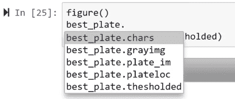

# 使用 OpenCV 读取车牌

本章概述了如何从任何包含车牌的样本照片中提取和显示车牌字符。OpenCV 及其车牌实用函数帮助我们找到车牌上的字符，并让我们对计算机视觉和图像处理的工作有良好的了解。

在本章中，我们将学习以下内容：

+   读取车牌所需的步骤

+   车牌实用函数

+   寻找车牌字符

+   寻找和读取车牌

# 识别车牌

在这个项目中，我们将检测和读取汽车照片中的车牌。我们将执行多个步骤，从定位车牌到显示定位车牌中的字符。

让我们参考 Jupyter Notebook 中分析我们的样本图像所需的代码：

```py
%pylab notebook
figure()
imshow(imread('tests/p1.jpg'))
```

运行代码后，我们得到以下照片：


我们有一张汽车的照片，车牌清晰可见且可读。挑战在于定位车牌，将其从照片的其余部分中分离出来，并从中提取字符。

我们现在可以更仔细地查看车牌，使用可用的实用函数：


有许多算法可以帮助我们完成这两项任务。例如，YOLO：实时目标检测等对象检测器可以使用相关的机器学习方法执行此类任务，并做得非常好。

然而，我们将采用一种简单的方法，使用传统的图像处理和计算机视觉技术，而不是复杂的机器学习技术，如深度学习和 TensorFlow。

我们将使用的算法将帮助我们学习计算机视觉和图像处理技术，从而更好地理解项目。让我们从我们的代码开始，检查我们将使用的车牌实用函数。

# 车牌实用函数

让我们跳转到 Jupyter Notebook 中的代码，以便了解车牌实用函数。我们首先将导入我们的实用工具。

我们将导入以下库：

+   OpenCV（版本 3.4）

+   NumPy

+   Pickle，它允许我们保存 Python 数据和案例函数

按照以下方式导入库：

```py
import cv2
import numpy as np
import pickle
def gray_thresh_img(input_image):
     h, w, _ = input_image.shape
     grayimg = cv2.cvtColor(input_image, cv2.COLOR_BGR2HSV)[:,:,2]

     kernel = cv2.getStructuringElement(cv2.MORPH_RECT, (3, 3))

     tophat = cv2.morphologyEx(grayimg, cv2.MORPH_TOPHAT, kernel)
     blackhat = cv2.morphologyEx(grayimg, cv2.MORPH_BLACKHAT, kernel)
     graytop = cv2.add(grayimg, tophat)
     contrastgray = cv2.subtract(graytop, blackhat)
     blurred = cv2.GaussianBlur(contrastgray, (5,5), 0)
     thesholded = cv2.adaptiveThreshold(blurred, 255.0, 
     cv2.ADAPTIVE_THRESH_GAUSSIAN_C, 
     cv2.THRESH_BINARY_INV, 19, 9)
```

我们将使用这些库来加载用于读取字符的 k 最近邻分类器，这隐式地依赖于 scikit-learn。

我们现在将讨论我们代码中将使用的实用工具。

# 灰度阈值图像函数和形态学函数

`gray_thresh_img` 函数接受一个输入图像并将其转换为灰度。我们需要灰度图像，因为彩色图像可能会引起歧义，因为车牌的颜色会根据地区而有所不同。`gray_thres_img` 函数为我们提供了一个二值化图像。

我们可以使用形态学操作进行预处理，因为这有助于我们减少噪声和间隙。这将去除图像中的噪声并移除多余的特征。

# 内核

内核是一个三乘三的正方形，我们将在这个正方形上使用`tophat`、`blackhat`和`graytop`操作来创建灰度图像。这也有助于我们去除图像噪声——噪声通常存在于自然图像中，对于计算机视觉来说并不理想。图像也可以使用高斯模糊进行去噪。

我们将使用自适应阈值，它检查图像中的局部统计和平均值，以确定它相对于其邻域是亮还是暗。与硬阈值相比，这是更好的选择，因为它将以更好的方式二值化我们的图像。

我们使用`return`函数来获取灰度图像和二值化图像，如下所示：

```py
return grayimg, thesholded
```

# 匹配字符函数

让我们看看下一个函数来获取匹配的字符：

```py
def getmatchingchars(char_cands):
    char_list = [] 

    for char_cand in char_cands:
        ch_matches = [] \n",
        for matching_candidate in char_cands: 
           if matching_candidate == char_cand:
              continue 
          chardistance = np.sqrt((abs(char_cand.x_cent  - matching_candidate.x_cent) ** 2) +  
          (abs(char_cand.y_cent - matching_candidate.y_cent)**2))
          x = float(abs(char_cand.x_cent - matching_candidate.x_cent))
          y = float(abs(char_cand.y_cent - matching_candidate.y_cent))
          angle = np.rad2deg(np.arctan(y/x) if x != 0.0 else np.pi/2)

          deltaarea = float(abs(matching_candidate.rect_area - char_cand.rect_area))\
          / float(char_cand.rect_area)
         deltawidth = float(abs(matching_candidate.rect_w-char_cand.rect_w))\
         / float(char_cand.rect_w)
         deltaheight = float(abs(matching_candidate.rect_h-char_cand.rect_h))
         / float(char_cand.rect_h)

         if (chardistance < (char_cand.hypotenuse * 5.0) and
             angle < 12.0 and deltaarea < 0.5 and deltawidth < 0.8 
             and deltaheight < 0.2):
             ch_matches.append(matching_candidate) 

     ch_matches.append(char_cand) 
     if len(ch_matches) < 3: 
         continue 

     char_list.append(ch_matches) 
```

`getmatchingchars`函数帮助我们根据以下标准找到我们的字符候选：

+   大小

+   相对距离

+   角度

+   面积

如果潜在的字符与其邻居的距离合理，角度与 JSON 字符相比不是太大，面积也不是太大，那么我们可以说可能的字符是一个*字符候选*。

以下代码将返回一个包含车牌字符的列表，然后创建一个容器类，该类将包含对象，如字符子图像的宽度、高度、中心、对角距离或斜边，以及宽高比：

```py
    for charlist in getmatchingchars(list(set(char_cands)-set(ch_matches))):
        char_list.append(charlist) 
    break 

 return char_list

# information container for possible characters in images
class charclass:
     def __init__(self, _contour):
         self.contour = _contour
         self.boundingRect = cv2.boundingRect(self.contour)
         self.rect_x, self.rect_y, self.rect_w, self.rect_h = self.boundingRect
         self.rect_area = self.rect_w * self.rect_h
         self.x_cent = (self.rect_x + self.rect_x + self.rect_w) / 2
         self.y_cent = (self.rect_y + self.rect_y + self.rect_h) / 2
         self.hypotenuse = np.sqrt((self.rect_w ** 2) + (self.rect_h ** 2))
         self.aspect_ratio = float(self.rect_w) / float(self.rect_h)
```

# k-最近邻数字分类器

预训练的 scikit-learn **k-最近邻**（**k-nn**）数字分类器也需要加载，如下所示：

```py
# load pre-trained scikit-learn knn digit classifier
    with open('knn.p', 'rb') as f:
     knn = pickle.load(f) "
```

k-nn 分类器将一个小图像与它已知的一系列图像进行比较，以找到最接近的匹配。

我们在这个例子中并没有使用复杂的算法，因为车牌上的字符是相似的。这就是为什么我们可以使用 k-nn 方法，它将进行像素级的比较以找到最接近的匹配。车牌上的字符不是手写的数字，字体可能不同，这需要更多的计算。

在分类器中，`p`代表 Pickle，这是 Python 存储数据的方式。

# 寻找车牌字符

接下来，我们执行初始搜索以找到车牌字符。首先，我们找到大致的字符，然后根据特定标准找到候选者。

让我们从 Notebook 中的以下行开始：

```py
%pylab notebook
```

现在我们可以执行我们的函数单元，用于导入、工具和加载我们的库：

```py
import cv2
import numpy as np
import pickle
def getmatchingchars(char_cands):
    char_list = [] 

    for char_cand in char_cands:
        ch_matches = [] \n",
        for matching_candidate in char_cands: 
           if matching_candidate == char_cand:
              continue 
          chardistance = np.sqrt((abs(char_cand.x_cent  - matching_candidate.x_cent) ** 2) +  
          (abs(char_cand.y_cent - matching_candidate.y_cent)**2))
          x = float(abs(char_cand.x_cent - matching_candidate.x_cent))
          y = float(abs(char_cand.y_cent - matching_candidate.y_cent))
          angle = np.rad2deg(np.arctan(y/x) if x != 0.0 else np.pi/2)

          deltaarea = float(abs(matching_candidate.rect_area - char_cand.rect_area))\
          / float(char_cand.rect_area)
         deltawidth = float(abs(matching_candidate.rect_w-char_cand.rect_w))\
         / float(char_cand.rect_w)
         deltaheight = float(abs(matching_candidate.rect_h-char_cand.rect_h))
         / float(char_cand.rect_h)

         if (chardistance < (char_cand.hypotenuse * 5.0) and
             angle < 12.0 and deltaarea < 0.5 and deltawidth < 0.8 
             and deltaheight < 0.2):
             ch_matches.append(matching_candidate) 

     ch_matches.append(char_cand) 
     if len(ch_matches) < 3: 
         continue 

     char_list.append(ch_matches) 

    for charlist in getmatchingchars(list(set(char_cands)-set(ch_matches))):
        char_list.append(charlist) 
    break 

 return char_list

# information container for possible characters in images
class charclass:
     def __init__(self, _contour):
         self.contour = _contour
         self.boundingRect = cv2.boundingRect(self.contour)
         self.rect_x, self.rect_y, self.rect_w, self.rect_h = self.boundingRect
         self.rect_area = self.rect_w * self.rect_h
         self.x_cent = (self.rect_x + self.rect_x + self.rect_w) / 2
         self.y_cent = (self.rect_y + self.rect_y + self.rect_h) / 2
         self.hypotenuse = np.sqrt((self.rect_w ** 2) + (self.rect_h ** 2))
         self.aspect_ratio = float(self.rect_w) / float(self.rect_h)
```

现在我们可以加载我们的输入图像，它将被用于分析。在这里我们使用`plt`函数而不是 OpenCV，因为 OpenCV 默认以**蓝绿红**（**BGR**）格式而不是**红绿蓝**（**RGB**）格式加载图像。这对于你的自定义项目很重要，但对我们项目来说并不重要，因为我们将会将图像转换为灰度。

让我们加载我们的图像：

```py
input_image = plt.imread('tests/p5.jpg') #use cv2.imread or 
 #import matplotlib.pyplot as plt
 #if running outside notebook
figure()
imshow(input_image)
```

这是输出照片：


让我们仔细看看这辆车的车牌：


我们将从这张图像中找到字符。然而，我们首先需要移除背景，这对我们来说并不重要。在这里，我们需要对图像进行初始预处理，使用 `gray_thresh_img`、`blurred` 和 `morphology` 函数，这将帮助我们去除背景。

这里是初始预处理的代码：

```py
def gray_thresh_img(input_image):
     h, w, _ = input_image.shape
     grayimg = cv2.cvtColor(input_image, cv2.COLOR_BGR2HSV)[:,:,2]

     kernel = cv2.getStructuringElement(cv2.MORPH_RECT, (3, 3))

     tophat = cv2.morphologyEx(grayimg, cv2.MORPH_TOPHAT, kernel)
     blackhat = cv2.morphologyEx(grayimg, cv2.MORPH_BLACKHAT, kernel)
     graytop = cv2.add(grayimg, tophat)
     contrastgray = cv2.subtract(graytop, blackhat)
     blurred = cv2.GaussianBlur(contrastgray, (5,5), 0)
     thesholded = cv2.adaptiveThreshold(blurred, 255.0, 
     cv2.ADAPTIVE_THRESH_GAUSSIAN_C, 
     cv2.THRESH_BINARY_INV, 19, 9)
```

让我们看看我们的主要代码：

```py
h, w = input_image.shape[:2] 

# We don't use color information
# + we need to binarize (theshold) image to find characters
grayimg, thesholded = gray_thresh_img(input_image)
contours = cv2.findContours(thesholded, cv2.RETR_LIST, cv2.CHAIN_APPROX_SIMPLE)[1]

# initialize variables for possible characters/plates in image
char_cands = [] 
plate_candidates = [] 
```

我们将给出图像形状，这将返回照片的高度、宽度和 RGB 深度。我们现在不需要 RGB 深度，所以我们只提取 `2` 个元素；高度和宽度。由于我们将处理灰度图像而不是彩色图像，我们将调用我们方便的 `gray_thresh_img` 函数，该函数将返回灰度和二值化的阈值图像。

为了找到轮廓，我们需要图像中的子图像，这些子图像对应于字符，然后对应于轮廓。我们将使用 OpenCV 的内置算法 `findContours` 来找到可能作为字符和作为我们的 k-nn 使用的复杂形状的轮廓细节。然后我们将初始化我们的 `char_cands` 和 `plate_candidates` 变量。

让我们尝试第一次寻找字符：

```py
for index in range(0, len(contours)): 
    char_cand = charclass(contours[index])
    if (char_cand.rect_area > 80 and char_cand.rect_w > 2 
        and char_cand.rect_h > 8 and 0.25 < char_cand.aspect_ratio 
        and char_cand.aspect_ratio < 1.0):

        char_cands.append(char_cand) 
```

我们将使用字符来寻找车牌，这是一种与其他机器学习算法不同的方法。这种方法将帮助我们更好地理解寻找字符的过程。

我们将遍历所有轮廓，并使用我们已定义的 `charclass` 类（`charclass` 类）。这个类会自动提取中心、对角线长度和宽高比，以确定图像是否过大或过小，或者宽高比是否过于倾斜。从这个推断中，我们可以得出结论，该字符不是车牌上的字母或数字。这有助于我们仅考虑符合几何标准的轮廓。

# 寻找匹配的字符和字符组

一旦第一次遍历完成，我们将细化我们的匹配，以找到可能属于车牌的一组字符。参考以下代码：

```py
for ch_matches in getmatchingchars(char_cands): 
     class blank: pass
     plate_candidate = blank() 

     ch_matches.sort(key = lambda ch: ch.x_cent) 

     plate_w = int((ch_matches[len(ch_matches) - 1].rect_x + \
                    ch_matches[len(ch_matches) - 1].rect_w - ch_matches[0].rect_x) * 1.3)

     sum_char_h = 0
     for ch in ch_matches:
         sum_char_h += ch.rect_h

     avg_char_h = sum_char_h / len(ch_matches)
     plate_h = int(avg_char_h * 1.5)

     y = ch_matches[len(ch_matches) - 1].y_cent - ch_matches[0].y_cen
     r = np.sqrt((abs(ch_matches[0].x_cent 
                   - ch_matches[len(ch_matches) - 1].x_cent) ** 2) 
                + (abs(ch_matches[0].y_cent 
                   - ch_matches[len(ch_matches) - 1].y_cent) ** 2))
     rotate_angle = np.rad2deg(np.arcsin(y / r))
```

我们将通过调用之前使用的 `getmatchingchars` 函数遍历所有潜在的字符，该函数根据标准提供额外的过滤。它取决于与相邻字符的角、三角学、宽度和高度的比较，以及邻居的类型。这些标准帮助我们实现一致性。

一旦我们有了车牌候选者，我们可以创建一个 `blank` 对象。因此，我们有一个没有任何属性的 `blank` 对象，并创建了一个列表。我们首先按字符的中心排序，这将帮助我们按从左到右的顺序通过匹配进行排序。

`sum_char_h` 的求和将帮助我们找到字符的平均高度和宽度。

让我们看看以下代码：

```py
     platex = (ch_matches[0].x_cent + ch_matches[len(ch_matches) - 1].x_cent) / 2
     platey = (ch_matches[0].y_cent + ch_matches[len(ch_matches) - 1].y_cent) / 2
     plate_cent = platex, platey
```

车牌的理想位置是垂直于摄像头的。如果车牌的角度大于特定的可接受角度，或者颠倒，那么我们可能无法读取车牌。

我们从代码中找到`x`和`y`，并校正车牌的角度，如果它在合理的角度范围内。

然后，我们根据这里找到的角度确定车牌位置，并使用`rotationMatrix`将其存储起来，以便稍后进行计算。我们可以一步完成，因为我们已经找到了这个角度。我们希望围绕车牌的中心旋转，如下所示：

```py
     plate_candidate.plateloc = (tuple(plate_cent), (plate_w, plate_h), rotate_angle)
     rotationMatrix = cv2.getRotationMatrix2D(tuple(plate_cent), rotate_angle, 1.0)
```

我们在这里创建旋转后的图像，`cv2.wrapAffine`函数将帮助我们进行拉伸、倾斜、旋转和平移，以及更高阶的变换，如缩放、拉伸和旋转：

```py
     rotated = cv2.warpAffine(input_image, rotationMatrix, tuple(np.flipud(input_image.shape[:2])))

    plate_candidate.plate_im = cv2.getRectSubPix(rotated, (plate_w, plate_h), tuple(plate_cent))
    if plate_candidate.plate_im is not None:
        plate_candidates.append(plate_candidate)
```

一旦我们有了旋转并围绕车牌候选中心对齐的子图像，我们就将其保存到我们之前初始化的车牌候选列表中。现在我们有了字符和车牌候选的初始猜测，利用这些我们可以找到并读取车牌候选。

# 使用 OpenCV 查找和读取车牌

我们已经找到了字符，它们是车牌候选。现在我们需要确定哪些字符匹配，以便我们可以提取文本数据并将字符映射到车牌中。

首先，我们运行每个车牌候选通过我们的`gray_thresh_img`函数，该函数执行我们的去噪和二值化。在这种情况下，我们得到更干净的输出，因为我们使用的是子图像而不是完整图像。

这是我们将要使用的提取代码：

```py
for plate_candidate in plate_candidates: 

    plate_candidate.grayimg, plate_candidate.thesholded = \
                              gray_thresh_img(plate_candidate.plate_im) 
    plate_candidate.thesholded = cv2.resize(plate_candidate.thesholded, 
                                             (0, 0), fx = 1.6, fy = 1.6)
    thresholdValue, plate_candidate.thesholded = \
                               cv2.threshold(plate_candidate.thesholded, 
                                            0.0, 255.0, 
                                            cv2.THRESH_BINARY | cv2.THRESH_OTSU)
```

我们需要字符具有相同的大小，因为我们将会使用 k-nn 方法，它是区分大小写的。如果大小不同，我们将收到垃圾值。在将图像调整到大小后，我们需要进行阈值处理，我们将使用`OTSU`方法。

然后，我们需要在子图像中找到轮廓，并进行合理性检查，以确保我们找到的子图像中的轮廓满足某些标准，其中大小和宽高比是合理的，如下所示：

```py
contours = cv2.findContours(plate_candidate.thesholded, cv2.RETR_LIST, 
 cv2.CHAIN_APPROX_SIMPLE)[1]
plate_chars = [] 
 for contour in contours: 
 char_cand = charclass(contour)
 if (char_cand.rect_area > 80 and char_cand.rect_w > 2 
 and char_cand.rect_h > 8 and 0.25 < char_cand.aspect_ratio 
 and char_cand.aspect_ratio < 1.0):
 plate_chars.append(char_cand) 
```

如果轮廓不符合标准，这意味着我们可能没有看到车牌，或者没有得到好的字符。

一旦完成合理性检查，我们就运行`getmatchingchars`函数，这将确保我们得到一组大小大致相同的良好字符：

```py
plate_chars = getmatchingchars(plate_chars)

     if (len(plate_chars) == 0):
     plate_candidate.chars = \"
     continue
for index in range(0, len(plate_chars)): 
    plate_chars[index].sort(key = lambda ch: ch.x_cent) 
    filt_matching_chars = list(plate_chars[index])
```

这是一个冗余检查，但对于获得干净和可靠的结果是必要的。我们按顺序从左到右迭代所有字符，以检查字符是否足够远。我们这样做是因为，理论上，重叠的轮廓可能是重叠的字符，这在现实中的车牌中是不会发生的。

我们需要确保字符之间距离足够远，因为我们不是在重复检测相同的东西；在这里我们执行多个`for`循环，并将字符相互比较，如下所示：

```py
    for thischar in plate_chars[index]:
 for alt_char in plate_chars[index]:
 if thischar != alt_char: 
 chardistance = np.sqrt((abs(thischar.x_cent-alt_char.x_cent)**2) 
 + (abs(thischar.y_cent-alt_char.y_cent) ** 2))
 if chardistance < (thischar.hypotenuse * 0.3):
 if thischar.rect_area < alt_char.rect_area: 
 if thischar in filt_matching_chars: 
 filt_matching_chars.remove(thischar) 
 else: 
 if alt_char in filt_matching_chars: 
 filt_matching_chars.remove(alt_char) 
```

我们需要确保所有内容都在感兴趣的区域中心，这样在执行缩放、旋转和平移等操作时，字符就不会丢失，因为我们正在寻找 k-nn。

在此代码中，我们遍历我们的字符列表中的每个字符和每个阈值区域，以确保我们将区域调整到`20`乘以`30`，这与我们的 k-nn 预测相匹配：

```py
     charlistlen = 0
 char_index = 0

 for index in range(0, len(plate_chars)):
 if len(plate_chars[index]) > charlistlen:
 charlistlen = len(plate_chars[index])
 char_index = index

 full_char_list = plate_chars[char_index]
 full_char_list.sort(key = lambda ch: ch.x_cent) 

 plate_candidate.chars = \
 for thischar in full_char_list: 
 roi = plate_candidate.thesholded[thischar.rect_y : 
 thischar.rect_y + thischar.rect_h,
 thischar.rect_x : 
 thischar.rect_x + thischar.rect_w]

 resized_roi = np.float32(cv2.resize(roi, (20, 30)).reshape((1, -1)))
 plate_candidate.chars += str(chr(int(knn.predict(resized_roi)[0])))
```

现在，所有这些区域长度都是 600。NumPy 的`reshape`函数将二维输入的区域通过某些维度映射，以得到 1/600。

`thischar`函数最初实际上是一个空字符串，但随着我们找到 k-nn，它将不断被填充。

此外，当我们寻找最佳候选者时，我们需要确保我们的`plate_candidates`不是空的：

```py
if len(plate_candidates) > 0:
    plate_candidates.sort(key = lambda plate_candidate: 
                           len(plate_candidate.chars), reverse = True)
    best_plate = plate_candidates[0]
    print("License plate read: " + best_plate.chars + "\n") 
```

对于给定的图像，您可能会找到多个车牌候选者，但通常它们是同一件事。您可能只是找到了四个字符，而实际上有六个，或者类似的情况。具有最多字符的那个可能是正确的，但您也可以查看其他候选者。

我们将再次按字符串长度提取并排序，找到`best_plate`，并打印出结果。

# 结果分析

当我们使用最佳候选代码块运行我们的代码时，我们得到以下结果：

```py
if len(plate_candidates) > 0: 
    plate_candidates.sort(key = lambda plate_candidate: 
                          len(plate_candidate.chars), reverse = True)
    best_plate = plate_candidates[0]
    print("License plate read: " + best_plate.chars + "\n")

License plate read: LTLDBENZ
```

一旦我们得到输出，我们可以使用以下代码显示我们的结果：

```py
figure()
imshow(best_plate.thesholded)
```

显示的图像如下：


虽然有一个多余的字符，但我们可以看到我们的显示图像与车牌字符非常接近。我们可以用我们的其他可能的车牌字符来检查，以获得最接近的结果。

让我们再试一个车牌，以检查我们的代码如何工作：

```py
input_image = plt.imread('tests/p2.jpg') #use cv2.imread or 
                                         #import matplotlib.pyplot as plt
                                         #if running outside notebook
figure()
imshow(input_image)
```

这里是输出：


显示的照片如下：


如果您只想获取车牌的子图像，可以使用以下代码：

```py
imshow(best_plate.plate_im)
```


我们还可以找到结果的位置：

```py
figure()
# best_plate.plate_im
imshow(best_plate.plate_im)
best_plate.plateloc
```

输出中您得到以下位置：


因此，这里我们有`x`和`y`坐标，宽度，高度和一些偏移信息。

我们可以尝试其他可用的函数，如下所示：



让我们看看另一个例子，其中车牌号码不够清晰：

```py
input_image = plt.imread('tests/p3.jpg') #use cv2.imread or 
                                         #import matplotlib.pyplot as plt
                                         #if running outside notebook
figure()
imshow(input_image)
```

这给我们以下输出：


让我们更仔细地看看车牌：


我们的`display`函数给出了相当不错的结果，如下所示：


让我们看看我们的最后一个例子：

```py
input_image = plt.imread('tests/p1.jpg') #use cv2.imread or 
                                         #import matplotlib.pyplot as plt
                                         #if running outside notebook
figure()
imshow(input_image)
```

这里是视图：


以下截图显示了输出：


结果照片显示如下：


# 摘要

在本章中，我们学习了如何使用 OpenCV 进行车牌识别，这让我们对计算机视觉和图像处理的工作原理有了很好的了解。

我们首先学习了不同的车牌效用函数，这帮助我们找到了车牌特征。然后，我们使用 OpenCV 找到了车牌字符的可能候选者。最后，我们分析了我们的结果，以检查我们算法的效率。

在下一章，第四章，*使用 TensorFlow 进行人体姿态估计*，我们将使用 DeeperCut 算法和 ArtTrack 模型进行人体姿态估计。
