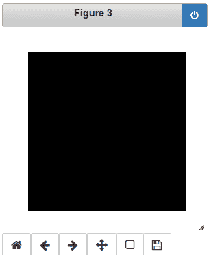

# 第五章：使用 scikit-learn 和 TensorFlow 进行手写数字识别

在本章中，我们将学习如何将机器学习应用于计算机视觉项目，使用几个不同的 Python 模块。我们还将创建并训练一个支持向量机，它将实际执行我们的数字分类。

在本章中，我们将涵盖以下主题：

+   获取和处理 MNIST 数字数据

+   创建和训练支持向量机

+   将支持向量机应用于新数据

+   介绍 TensorFlow 与数字分类

+   评估结果

# 获取和处理 MNIST 数字数据

如前所述，我们将使用 scikit-learn 和 TensorFlow 来处理手写数字识别。在这里，我们将学习如何将机器学习应用于计算机视觉项目，我们将学习几种不同的方法和模型，使用几个不同的 Python 模块。让我们开始吧。

你可能已经听说过机器学习。在这里，我们将特别讨论监督机器学习，其中我们有一系列想要完成的例子。所以，我们不是明确告诉计算机我们想要什么，而是给出一个例子。

让我们以 0 到 9 的手写数字为例，这些数字由人类创建的标签指示它们应该是什么。因此，我们不是手动编码特征并明确告诉计算机算法，我们将构建一个模型，其中我们接受这些输入，优化一些函数，如一组变量，然后训练计算机将输出设置为我们所希望的。

因此，我们将从手写数字开始，从 0、1、2、3 等等开始。这是机器学习的一般范式，我们将在这里介绍三种不同的算法。

那么，让我们开始运行一些代码。

打开你的 Jupyter Notebook，就像我们在上一章中所做的那样，让我们在本章中从头开始。如您在以下代码中所观察到的，我们将导入我们的基本模块，例如`numpy`，它是 Python 中数值计算的基础：

```py
#import necessary modules here
#--the final notebook will have complete codes that can be
#--copied out into self-contained .py scripts

import numpy as np
import matplotlib.pyplot as plt
import cv2 
import sys
import tempfile

from sklearn import svm, metrics
import tensorflow as tf

from tensorflow.examples.tutorials.mnist import input_data
```

如您在前面的代码中所见，我们正在导入`pyplot`，这样我们就可以可视化我们所做的事情。我们还将使用一点 OpenCV 来转换一些图像。我们还将使用 scikit-learn，它在实际模块中缩写为`sklearn`，同时导入支持向量机，以及一些将给我们提供度量指标的工具。这将告诉我们事情实际上工作得有多好。我们还将导入 TensorFlow，缩写为`tf`，因为我们将从其中获取我们的数据。

scikit-learn 和 TensorFlow 的一个主要优势是它们内置了获取数字识别的功能，这在计算机视觉和机器学习包中是如此常见。因此，你不必去网站下载，然后自己编写这些行。它会为你处理。因此，scikit-learn 实际上有相当多的内置数据集，一些用于计算机视觉，一些用于其他任务。它有一个数字示例，然后我们可以通过编写`datasets`并按*Tab*键来选择可用的内置数据集，如下面的截图所示：


现在，我们有一个内置数据集的列表。例如，你想知道`california_housing`的价格；也就是说，你想根据房屋的平方英尺和卧室数量等因素估计房价——有一个数据集是针对这个的。其中一些是图像数据，一些不是。所以，如果你想尝试不同的机器学习技术，这可能是一个你想检查的项目，但对于`dataset.load_digits()`，我们有以下代码来展示它是如何工作的：

```py
#what kind of data do we already have?
from sklearn import datasets
digits=datasets.load_digits()

example_image=digits.images[0]
print(type(example_image))
plt.imshow(example_image); plt.show()
example_image.reshape((8*8,1))
```

让我们分解并理解这段代码。首先，我们加载一个示例图像，即集合中的第一个图像，如下所示：

```py
example_image=digits.images[0]
print(type(example_image))
```

数据实际上存储在图像中，它是一个示例数组，其中每个示例都是一个 8 x 8 的手写数字图像。

然后，我们按照以下方式绘制图像：

```py
plt.imshow(example_image); plt.show()
example_image.reshape((8*8,1))
```

我们应该看到以下输出：


但是我喜欢使用一个稍微高分辨率的示例，我们稍后会从 MNIST 中看到。低分辨率图像在计算上稍微快一些，因为它们是更小的图像。如果我们想要预处理这些图像，它们存储为 8 x 8，我们需要将每个图像转换为 1D 数组。我们可以通过使用`reshape`函数轻松地做到这一点，就像我们在之前的代码中做的那样：

```py
example_image.reshape((8*8,1))
```

这将为我们提供一个输出，其中，而不是 8 x 8 的数组，我们得到一个 1 x 64 的数组，如下所示：


现在，我们将使用以下网站可用的 MNIST 数据：

[`yann.lecun.com/exdb/mnist/`](http://yann.lecun.com/exdb/mnist/)

这是一个相当标准的数据集。TensorFlow 足够好，提供了获取这些数据的功能，因此你不必去网站手动下载。我们需要定义`data_dir`并指定一个保存数据的位置。所以，只需创建这个`/tmp/tensorflow/mnist/input_data`目录，这将是好的，无论你运行的是哪种操作系统，然后我们有一些从`tensorflow`和`read_data_sets`导入的`input_data`。现在，让我们运行以下代码：

```py
#acquire standard MNIST handwritten digit data
#http://yann.lecun.com/exdb/mnist/

data_dir = '/tmp/tensorflow/mnist/input_data'
mnist = input_data.read_data_sets(data_dir, one_hot=True)
```

我们应该得到以下输出：


如果你没有文件，代码将下载 gzip 文件，如果你已经有了，它将只读取现有的 gzip 文件并将它们存储在 `mnist` 变量中。`one_hot=True` 确保你得到标签，以向量的形式表示，这意味着它不会用像零、一、二、三、四这样的美国数字来标记，而是一个主要由零组成的数组。它将是一个长度为 10 的数组，其中除了一个值为 1 的元素外，其余都是 0。所以，如果我们有，例如，0, 1, 0, 0, 0, 0，等等，那将代表一个 1，如果它是 9，那么除了最后一个值为 1 的元素外，其余都是 0。所以，这是机器学习标记输出的一个有用方法。这是我们获取数据的方式，我们将会使用它；这对于我们实际使用 TensorFlow 时更有帮助，但对于 scikit-learn 实际上确实需要数值。

在我们深入实际机器学习之前，让我们先了解数据。我们有 `mnist` 变量，它已经按照训练和测试数据分开。在机器学习中，你不想用所有数据来训练；你不想用所有数据来构建你的模型，因为那样你就不知道它将如何处理之前未见过的新的数据例子。你想要做的是将其分成训练数据和测试数据。所以，训练数据将用来构建模型，而测试数据将用来验证它。所以，数据的分割已经为我们完成，只需要以下变量：

```py
#now we load and examine the data
train_data=mnist.train.images
print(train_data.shape)
n_samples = train_data.shape[0]

train_labels=np.array(np.where(mnist.train.labels==1))[1]

plt.imshow(train_data[1000].reshape((28,28))); plt.show()
```

让我们分解代码以更好地理解。

首先，我们按照以下方式从 `train.images` 加载 `train_data`：

```py
#now we load and examine the data
train_data=mnist.train.images
```

我们将使用 `.shape` 来查看形状，以便理解它，如下所示：

```py
print(train_data.shape)
```

如果你需要知道样本数量，我们可以从 `shape` 输出中提取，如下所示：

```py
n_samples = train_data.shape[0]
```

再次强调，它是一个 NumPy 数组，所以所有 NumPy 函数和特性都在那里。

然后，执行以下代码以获取 `train_labels`：

```py
train_labels=np.array(np.where(mnist.train.labels==1))[1]
plt.imshow(train_data[1000].reshape((28,28))); plt.show()
```

在这里，我们只查看 `train.label` 等于 `1` 的位置，并提取这些值以创建一个包含这些值的数组，这将给我们 `train_labels`。所以，一个一维数组对应于包含每个实际输出的例子数量。我们将只看一个例子；让我们从 `55000` 个训练例子中取出 `1000` 个。

运行此代码将给出以下输出：


`784` 是图像中的像素数，因为它们是 `28` x `28` 的方块，*28 x 28 = 784*。所以，我们有 `55000` 个例子，每个例子有 `784` 个像素，或者我们称之为特征，然后 `train_labels` 的长度将是 `55000`，另一个维度只是 `1`。这里有一个例子。这些数据已经以 1D 数组的形式提供，这就是为什么我们使用了 `reshape` 函数并传递了 `28` x `28` 的值，以便将其转换为我们可以看到的实际图像。

太好了，我们的数据已加载并处理完毕，准备使用，因此我们可以开始实际的机器学习。现在我们的数据已经设置好并准备就绪，我们可以继续到下一节，在那里我们将创建和训练我们的支持向量机，并执行我们的数字分类。

# 创建和训练支持向量机

在本节中，我们将创建并训练一个支持向量机，该机器将实际执行我们的数字分类。

在第一个例子中，我们将使用 scikit-learn，我们将使用所谓的支持向量机，这是一种非常强大、非常通用的经典机器学习技术，可以学习各种函数和从输入到输出的各种映射。我们将进行分类，即映射输入为一个像素数组，在我们的情况下，我们将把每个输入分类到十个类别之一，对应于十个数字。但我们可以将不同类型的事物分类为连续有序函数，这被称为回归，这可能很有用，例如，如果你想提取位置或体积区域，它不仅仅适合于一个整洁的分类。

对于本节，我们将主要进行分类。因此，scikit-learn 使得创建此类模型变得非常简单。可以使用`svm.SVC`调用支持向量分类器，其中支持向量机来自`sklearn`包，我们为模型有一个名为`gamma`的元参数，它类似于半径的倒数，是支持向量的影响区域，如下面的代码所示：

```py
# Create a classifier: a support vector classifier
classifier = svm.SVC(gamma=0.001)
# Learn about gamma and other SVM parameters here:
# http://scikit-learn.org/stable/auto_examples/svm/plot_rbf_parameters.html
# Exercise: Experiment with the parameters to see how they affect execution 
# time and accuracy

# Train the model -- we're only going to use the training data (and not
# the test data) to ensure that our model generalizes to unseen cases.
# This (training) is typically what takes the most computational time
# when doing machine learning.
classifier.fit(train_data, train_labels)
```

支持向量机的工作原理在此处没有涉及，因为关于这个主题有大量的文献，并且为了学习它，并不绝对有必要完全理解它。现在，我们只是看看我们如何将其应用于某些情况。

`gamma`参数是我建议你作为练习进行实验的东西。我们将从一个已知的工作良好的`gamma`参数开始，即`.001`，但你应该了解其他可用的参数。我建议你访问[`scikit-learn.org/stable/auto_examples/svm/plot_rbf_parameters.html`](http://scikit-learn.org/stable/auto_examples/svm/plot_rbf_parameters.html)，并且我再次建议你尝试使用它来查看它如何影响执行时间和准确性。但是，这里重要的是我们要知道我们可以用一行代码创建我们的模型。它定义了模型，但我们实际上并没有训练它。我们实际上没有提供任何数据，也没有调整其参数，以便它能够产生期望的输出。现在，如果我们给它一个五的图像，它会说，没问题，这是一个 5。所以，为了做到这一点，我们必须对其进行拟合。

在前面的代码中，我们创建了我们的分类器，它非常简单：`classifier.fit`。我们给它我们从前一个代码执行中获得的`train_data`和`train_labels`。提前提醒一下，这个执行将需要几分钟；通常是这样的。通常，训练过程是机器学习中最慢的部分。这通常是情况，但这不应该太糟糕。这只需要几分钟，而且，我们再次只是使用您的训练数据，这样我们就可以验证这将对未见案例进行泛化。

现在我们已经看到了我们的支持向量机，并且它实际上已经被训练了，我们可以继续到下一个部分，在那里我们将支持向量机应用于它未训练过的新的数据。

# 将支持向量机应用于新数据

现在我们有了我们的训练支持向量机，我们可以实际上将支持向量机应用于未见过的新的数据，并看到我们的数字分类器实际上是否在起作用。

细胞执行成功并且如果一切正常工作，我们应该看到以下输出：


这只是创建支持向量分类器的输出。这仅仅提供了我们使用的元数据参数的信息；我们使用了所谓的径向基函数核，拟合数据没有产生任何错误信息。所以，这意味着代码已经工作。所以，现在我们有了我们的训练模型，我们想看看它在它未见过的数据上表现如何。

现在，我们将获取我们的测试数据，如下所示：

```py
# Now predict the value of the digit on the test data:
test_data=mnist.test.images
test_labels=np.array(np.where(mnist.test.labels==1))[1]

expected = test_labels
predicted = classifier.predict(test_data)
```

我们获取`mnist.test.images`，它等于`mnist.train.images`，并以相同的方式提取标签，通过调用`expected`变量，然后我们将从`classifier`模型计算`predicted`，使用`classifier.predict(test_data)`。所以，这需要一点时间来执行。执行后，应该没有错误信息，这表明我们的预测运行成功。

所以，现在我们可以看到我们做得怎么样。我们将使用 scikit-learn 的内置度量函数。我们将记录一些度量，例如*精确度*和*召回率*，如果您想了解这些含义，我推荐以下维基百科文章：

[`zh.wikipedia.org/wiki/精确度与召回率`](https://zh.wikipedia.org/wiki/%E7%B2%BE%E7%A1%AE%E5%BA%A6%E4%B8%8E%E5%9B%9E%E5%8F%94%E7%8E%87)

简而言之，它们是评估你的机器学习算法表现如何的不同指标。准确率可能是最常用的。它是简单的：正确数据点除以总数。但也有精确率和召回率，它权衡了真实阳性、真实阴性、假阳性和假阴性，哪个是最好的取决于你的应用。它取决于假阳性和假阴性哪个更糟糕，以及如此等等。此外，我们还将输出所谓的混淆矩阵，它告诉你哪些是成功的，哪些被错误分类了。让我们运行以下代码：

```py
# And display the results
print("See https://en.wikipedia.org/wiki/Precision_and_recall to understand metric definitions")
print("Classification report for classifier %s:\n%s\n"
      % (classifier, metrics.classification_report(expected, predicted)))
print("Confusion matrix:\n%s" % metrics.confusion_matrix(expected, predicted))

images_and_predictions = list(zip(test_data, predicted))
for index, (image, prediction) in enumerate(images_and_predictions[:4]):
    plt.subplot(2, 4, index + 5)
    plt.axis('off')
    plt.imshow(image.reshape((28,28)), cmap=plt.cm.gray_r, interpolation='nearest')
    plt.title('Prediction: %i' % prediction)

plt.show()
```

它应该给出以下输出：


好吧，所以我们得到了分类报告，我们可以看到`precision`（精确率）、`recall`（召回率）以及另一个称为`f1-score`的指标，你可以在同一篇维基百科文章中了解到这些。简而言之，零是最坏的情况，一是最理想的情况。在先前的屏幕截图中，我们可以看到不同数字的`precision`、`recall`和`f1-score`，我们可以看到我们处于 90%的范围内；它有所变化，这是可以接受的。它取决于你的应用，但这可能已经足够好了，或者可能非常糟糕。这取决于。我们实际上稍后会看到如何使用更强大的模型做得更好。我们可以看到它总体上是有效的。我们来看看混淆矩阵，其中列告诉你实际值是什么，行告诉你预测值是什么。理想情况下，我们会看到对角线上的所有大值，其他地方都是零。总是会有一些错误，因为我们都是人类，所以这种情况会发生，但就像我说的，我们将看看是否可以做得更好，在大多数情况下，它确实有效。现在，我们可以看到一些随机输出的示例，其中有一些数字如下：


如我们所见，所有的预测都根据它们的图像是正确的。好吧，一切都很好，但我感觉我现在有点是在相信计算机的话了。我想用我自己的数据来测试它。我想看看这实际上工作得怎么样，这在机器学习中通常是一个推荐的步骤。你想要用你自己的数据来测试它，以便真正知道它是否在正常工作，而且，如果不是其他原因，这会让人感到更加满意。所以，这里有一小段代码，它将使用 Jupyter 的小部件功能，它的交互功能：

```py
#Let's test our model on images we draw ourselves!

from matplotlib.lines import Line2D
%pylab notebook 
#This is needed for plot widgets

class Annotator(object):
    def __init__(self, axes):
        self.axes = axes

        self.xdata = []
        self.ydata = []
        self.xy = []
        self.drawon = False

    def mouse_move(self, event):
        if not event.inaxes:
            return

        x, y = event.xdata, event.ydata
        if self.drawon:
            self.xdata.append(x)
            self.ydata.append(y)
            self.xy.append((int(x),int(y)))
            line = Line2D(self.xdata,self.ydata)
            line.set_color('r')
            self.axes.add_line(line)

            plt.draw()

    def mouse_release(self, event):
        # Erase x and y data for new line
        self.xdata = []
        self.ydata = []
        self.drawon = False

    def mouse_press(self, event):
        self.drawon = True

img = np.zeros((28,28,3),dtype='uint8')

fig, axes = plt.subplots(figsize=(3,3))
axes.imshow(img)
plt.axis("off")
plt.gray()
annotator = Annotator(axes)
plt.connect('motion_notify_event', annotator.mouse_move)
plt.connect('button_release_event', annotator.mouse_release)
plt.connect('button_press_event', annotator.mouse_press)

axes.plot()

plt.show()
```

所以，现在我们实际上要创建一个小绘图小部件。它将允许我们生成自己的数字。让我们看看代码。

让我们从`matplotlib.line`导入`Line2D`，这将允许我们绘制单独的线条，就像根据我们的鼠标移动创建一种矢量图像一样：

```py
#Let's test our model on images we draw ourselves!

from matplotlib.lines import Line2D
```

我们执行`%pylab notebook`；百分号表示以下魔法命令：

```py
%pylab notebook
```

这是一种 Jupyter 和 Pylab 笔记本中的元命令，它将大量内容加载到你的命名空间中用于绘图和数值计算。这不是必需的，因为我们已经用 NumPy 和 Matplotlib 做了这件事，但为了启用小部件，我们使用这个命令。

然后，创建这个`Annotator`类，它包含当我们在显示的图像上移动鼠标时发生回调的代码，如下所示：

```py
class Annotator(object):
    def __init__(self, axes):
        self.axes = axes

        self.xdata = []
        self.ydata = []
        self.xy = []
        self.drawon = False

    def mouse_move(self, event):
        if not event.inaxes:
            return

        x, y = event.xdata, event.ydata
        if self.drawon:
            self.xdata.append(x)
            self.ydata.append(y)
            self.xy.append((int(x),int(y)))
            line = Line2D(self.xdata,self.ydata)
            line.set_color('r')
            self.axes.add_line(line)

            plt.draw()

    def mouse_release(self, event):
        # Erase x and y data for new line
        self.xdata = []
        self.ydata = []
        self.drawon = False

    def mouse_press(self, event):
        self.drawon = True
```

我们不需要理解`Annotator`类，但如果你将来想要进行标注或绘制某些内容，以及获取完整的代码片段，这可能会很有用。

然后，我们将创建一个空白图像，大小与我们的图像相同。目前它只是三个 RGB 值。即使我们最终会将其变为黑白，因为它就是我们的数据。创建图像如下：

```py
img = np.zeros((28,28,3),dtype='uint8')
```

现在，创建一个图表，显示它，并将我们的`annotator`函数连接到它，如下所示：

```py
fig, axes = plt.subplots(figsize=(3,3))
axes.imshow(img)
plt.axis("off")
plt.gray()
annotator = Annotator(axes)
plt.connect('motion_notify_event', annotator.mouse_move)
plt.connect('button_release_event', annotator.mouse_release)
plt.connect('button_press_event', annotator.mouse_press)

axes.plot()

plt.show()
```

运行代码后，我们应该得到以下输出：


那么，让我们画一下数字三：


现在，这有点慢，而且并不完全能替代 Photoshop，但这种方法仍然比进入一个单独的程序创建图像文件、确保其格式正确、保存它，然后编写代码加载它并使其正确要快。因此，这将使我们能够快速地玩和实验我们的模型。我们刚刚创建了一种线数组，因此我们需要将其光栅化并处理，使其看起来更像实际的手写数字，这可能是来自扫描的铅笔草图或压力感应平板。以下是如何做到这一点：

```py
# Now we see how our model "sees" (predicts the digit from)
# our hand drawn image...
# First, we rasterize (convert to pixels) our vector data
# and process the image to more closely resemble something
# drawn with a pencil or pressure-sensitive tablet.

digimg = np.zeros((28,28,3),dtype='uint8')
for ind, points in enumerate(annotator.xy[:-1]):
    digimg=cv2.line(digimg, annotator.xy[ind], annotator.xy[ind+1],(255,0,0),1)
digimg = cv2.GaussianBlur(digimg,(5,5),1.0)
digimg = (digimg.astype('float') *1.0/np.amax(digimg)).astype('float')[:,:,0]
digimg **= 0.5; digimg[digimg>0.9]=1.0

#The model is expecting the input in a particular format
testim = digimg.reshape((-1,28*28))

print("Support vector machine prediction:",classifier.predict( testim ))

outimg = testim.reshape((28,28))
figure(figsize=(3,3)); imshow(outimg);
```

让我们看看代码。首先，我们创建一个空白图像，如下所示：

```py
digimg = np.zeros((28,28,3),dtype='uint8')
```

我们遍历来自`annotator`的`xy`对，然后我们将在光栅化图像上绘制线条，如下所示：

```py
for ind, points in enumerate(annotator.xy[:-1]):
    digimg=cv2.line(digimg, annotator.xy[ind], annotator.xy[ind+1],(255,0,0),1)
digimg = cv2.GaussianBlur(digimg,(5,5),1.0)
```

然后，我们将图像转换为`float`类型，范围从`0`到`1`，就像我们的输入数据一样，如下所示：

```py
digimg = (digimg.astype('float') *1.0/np.amax(digimg)).astype('float')[:,:,0]
```

然后，我们将它稍微调整得更接近`1`，因为这就是我们的输入图像看起来像的，以及我们的模型所期望的：

```py
digimg **= 0.5; digimg[digimg>0.9]=1.0
```

然后，我们有了二维图像，但当然，为了运行它通过我们的模型，我们需要将其展平为`1` x `784`，这就是`reshape`函数的作用：

```py
#The model is expecting the input in a particular format
testim = digimg.reshape((-1,28*28))
```

然后，我们将运行它通过我们的`classifier`，并打印输出。我们将创建一个图表，我们可以看到我们的光栅化图像如下所示：

```py
print("Support vector machine prediction:",classifier.predict( testim ))

outimg = testim.reshape((28,28))
figure(figsize=(3,3)); imshow(outimg);
```

我们应该得到以下输出：


我们画了一个三，预测结果是 `3`。太棒了。让我们尝试其他的东西。通过按 *Ctrl* + *Enter* 清除之前的输出，我们得到一个警告信息；它只是告诉我们它覆盖了一些创建的变量。这不是什么大问题。你可以安全地忽略它。只是提前提醒，你的使用效果可能会有所不同，这取决于你的书写风格和训练数据中的内容。如果你希望每次都能完美工作，或者尽可能接近完美，你可能需要在自己的书写上训练它。

让我们尝试一个零：


以下是输出结果：


因此，你可以看到它不起作用的例子。预测应该是零，但模型不知何故预测了三。有可能如果你重新绘制它，它可能会工作。所以，再次提醒，你的使用效果可能会有所不同。你可以尝试实验，你也可以玩玩预处理，尽管据我所知，这工作得相当好。但无论如何，我们可以看到我们的模型至少在大部分情况下是正常工作的。所以，关于 scikit-learn 支持向量机的内容就到这里了。现在，在我们下一节中，我们将介绍 TensorFlow 并使用它进行数字分类。

# 使用数字分类介绍 TensorFlow

我们将看到 TensorFlow 的实际应用，并了解如何用可管理的代码量进行数字分类。TensorFlow 是 Google 的机器学习库，用于一般的数值分析。它被称为 TensorFlow，因为它据说可以流动张量，其中张量被定义为 *n* 维的数组。张量具有多维数组所不具备的真正几何意义，但我们只是使用这个术语。张量只是一个多维数组。

在这里，我们将进行一个简单的 `softmax` 示例。这是一个非常简单的模型；你可以访问 TensorFlow 的官方网站 ([`www.tensorflow.org/get_started/mnist/beginners`](https://www.tensorflow.org/get_started/mnist/beginners)) 获取更多信息。让我们看一下以下代码：

```py
data_dir = '/tmp/tensorflow/mnist/input_data'
mnist = input_data.read_data_sets(data_dir, one_hot=True)

# Create the model
x = tf.placeholder(tf.float32, [None, 784])
W = tf.Variable(tf.zeros([784, 10]))
b = tf.Variable(tf.zeros([10]))
y = tf.matmul(x, W) + b

# Define loss and optimizer
y_ = tf.placeholder(tf.float32, [None, 10])

cross_entropy = tf.reduce_mean(
  tf.nn.softmax_cross_entropy_with_logits(labels=y_, logits=y))
train_step = tf.train.GradientDescentOptimizer(0.5).minimize(cross_entropy)

sess = tf.InteractiveSession()
tf.global_variables_initializer().run()
# Train
for _ in range(1000):
    batch_xs, batch_ys = mnist.train.next_batch(100)
    sess.run(train_step, feed_dict={x: batch_xs, y_: batch_ys})

# Test trained model
correct_prediction = tf.equal(tf.argmax(y, 1), tf.argmax(y_, 1))
accuracy = tf.reduce_mean(tf.cast(correct_prediction, tf.float32))
print(\"Model accuracy:\",sess.run(accuracy, feed_dict={x: mnist.test.images,
                                    y_: mnist.test.labels}))
```

简而言之，你将取你的输入数据，并将其乘以一个矩阵。数据有`784`个点。每个点都有一个矩阵值，对于`10`个类别中的每一个，你将通过乘以 784 × 784 并求和来计算一个内积。将会有`10`个输出。它将是一个 1 乘以 10 的数组，你将向数组的输出添加一个偏置变量，并通过`softmax`函数运行它，这将将其转换为某种东西。矩阵的输出加上偏置将计算一个在`0`到`1`范围内的值，这大致对应于该数据属于该类别的概率。例如，可能有一个 0.4%的概率或 40%的概率是`1`，2%的概率是`2`，90%的概率是`9`，输出将是那个最大输出。

TensorFlow 非常复杂。这里的设置比 scikit-learn 示例中要复杂一些。你可以在他们的网站上了解更多信息。现在，让我们详细地通过以下代码：

```py
data_dir = '/tmp/tensorflow/mnist/input_data'
mnist = input_data.read_data_sets(data_dir, one_hot=True)
```

我们已经在前面的例子中这样做过了。现在，我们将从`data_dir`获取数据；确保它在我们的`mnist`变量中。

然后，我们创建模型，其中`x`对应于我们的输入数据，尽管我们还没有加载数据，但我们只需要创建一个占位符，这样 TensorFlow 就知道东西在哪里了。我们不需要知道有多少个例子，这就是`None`维度的含义，但我们确实需要知道每个例子有多大，在这个例子中是`784`。`W`是乘以`x`类别的矩阵，对图像进行内积，`784` *点* `784`，你这样做`10`次。所以，这对应于一个 784/10 的矩阵，`10`是类别的数量；然后，你向那个添加`b`偏置变量。`W`和`b`的值是 TensorFlow 将根据我们的输入为我们产生的，`y`定义了对我们的数据进行矩阵乘法时实际要执行的操作。我们按照以下方式向它添加`b`偏置变量：

```py
x = tf.placeholder(tf.float32, [None, 784])
W = tf.Variable(tf.zeros([784, 10]))
b = tf.Variable(tf.zeros([10]))
y = tf.matmul(x, W) + b
```

我们需要为我们的标记数据创建一个占位符，如下所示：

```py
y_ = tf.placeholder(tf.float32, [None, 10])
```

为了进行机器学习，你需要一个`损失`函数或`适应度`函数，它告诉你根据像`W`和`b`这样的学习参数，你的模型做得有多好。因此，我们将使用所谓的`交叉熵`；我们不会深入讨论`交叉熵`，但那将给我们一些标准，让我们知道我们正在接近一个工作的模型，如下面的代码行所示：

```py
cross_entropy = tf.reduce_mean(
  tf.nn.softmax_cross_entropy_with_logits(labels=y_, logits=y))
train_step = tf.train.GradientDescentOptimizer(0.5).minimize(cross_entropy)
```

随着我们添加越来越多的数据，我们将使用所谓的`GradientDescentOptimizer`来最小化误差，最小化交叉熵，并尽可能使我们的模型拟合得更好。

在下面的代码中，我们实际上将首先创建一个交互式会话，如下所示：

```py
sess = tf.InteractiveSession()
tf.global_variables_initializer().run()
for _ in range(1000):
    batch_xs, batch_ys = mnist.train.next_batch(100)
    sess.run(train_step, feed_dict={x: batch_xs, y_: batch_ys})
```

我们希望使其成为一个交互式会话，这样我们就可以在之后使用我们的模型并给它添加新数据。我们将初始化`run()`，然后我们将分批计算数据。TensorFlow 是一个非常强大的程序，它允许你分割你的数据。我们在这里不会这样做，但你可以用它轻松地运行并行化代码。在这里，我们将迭代`1000`次，并在分批中输入我们的训练数据。

在运行之后，我们将看看我们做得如何，并查看我们的预测数据与给定的标签相等的部分。我们可以通过查看平均有多少预测是正确的来计算`accuracy`。然后，按照以下方式打印数据：

```py
correct_prediction = tf.equal(tf.argmax(y, 1), tf.argmax(y_, 1))
accuracy = tf.reduce_mean(tf.cast(correct_prediction, tf.float32))
print(\"Model accuracy:\",sess.run(accuracy, feed_dict={x: mnist.test.images,
                                    y_: mnist.test.labels}))
```

以下是对应的输出：


由于这是一个非常简单的模型，它运行得很快，我们可以看到我们得到了不到 92%的准确率。代码执行得更快，但准确率略低于我们的**支持向量机**（**SVM**），但这没关系。这段代码只是提供了一个 TensorFlow 如何工作的非常简单的例子。

你会很快变得稍微高级一些，但让我们像之前一样测试以下代码：

```py
img = np.zeros((28,28,3),dtype='uint8')
fig, axes = plt.subplots(figsize=(3,3))
axes.imshow(img)
plt.axis("off")
plt.gray()
annotator = Annotator(axes)
plt.connect('motion_notify_event', annotator.mouse_move)
plt.connect('button_release_event', annotator.mouse_release)
plt.connect('button_press_event', annotator.mouse_press)
axes.plot()
plt.show()
```

我们得到了以下输出：



我们初始化了注释器，并输入一个数字。试一个`3`：


现在，我们将对绘制的数字进行预处理，这几乎与之前的代码相同，它将遍历我们的数据及其可能的类别，看看 TensorFlow 的`softmax`模型认为哪个是最好的：

```py
for tindex in range(10):
    testlab = np.zeros((1,10))
    testlab[0,tindex] = 1
    if sess.run(accuracy, feed_dict={x: testim, y_ : testlab}) == 1:
        break
```

因此，我们将运行前面的代码块，如图所示，它从`3`预测出`3`：


有时它可能无法正确预测，这很遗憾。所以，有两种方法可以改进：在自己的手写数据上训练或使用更好的模型。

我们将进入本节中最强大的模型。在这里，我们将简要介绍使用**卷积神经网络**（**CNNs**）的深度学习。这里我们不涉及理论。关于深度学习和多层神经网络有很多东西要了解。深度学习是一个深奥的主题，但在这个章节中，我们将看看我们如何实际上使用相对简单的代码块将最先进的机器学习技术应用于数字识别。

因此，我们这里有一个`deepnn(x)`函数，它创建我们的深度神经网络，找到我们的隐藏层或卷积层，池化层等等，并定义了我们从输入所需的所有内容：

```py
def deepnn(x):
     with tf.name_scope('reshape'):
     x_image = tf.reshape(x, [-1, 28, 28, 1])
```

`deepnn`构建用于对数字进行分类的深度网络图，`reshape`函数是在卷积神经网络中使用。这里使用的参数是：

+   `x`：一个具有维度（`N_examples`, `784`）的输入张量，其中`784`是标准 MNIST 图像中的像素数。

+   `y`：一个形状为(`N_examples`, `10`)的张量，其值等于将数字分类到 10 个类别（数字 0-9）的逻辑。`keep_prob`是一个表示 dropout 概率的标量占位符。

这返回一个元组(`y`, `keep_prob`)。最后一个维度是用于*特征*的——这里只有一个，因为图像是灰度的——对于 RGB 图像将是 3，对于 RGBA 将是 4，依此类推。

第一个卷积层将一个灰度图像映射到`32`个特征图：

```py
     with tf.name_scope('conv1'):
     W_conv1 = weight_variable([5, 5, 1, 32])
     b_conv1 = bias_variable([32])
     h_conv1 = tf.nn.relu(conv2d(x_image, W_conv1) + b_conv1)

     # Pooling layer - downsamples by 2X.
     with tf.name_scope('pool1'):
     h_pool1 = max_pool_2x2(h_conv1)

     # Second convolutional layer -- maps 32 feature maps to 64.
     with tf.name_scope('conv2'):
     W_conv2 = weight_variable([5, 5, 32, 64])
     b_conv2 = bias_variable([64])
     h_conv2 = tf.nn.relu(conv2d(h_pool1, W_conv2) + b_conv2)

     # Second pooling layer.
     with tf.name_scope('pool2'):
     h_pool2 = max_pool_2x2(h_conv2)

     # Fully connected layer 1 -- after 2 round of downsampling, our 28x28 image
     # is down to 7x7x64 feature maps -- maps this to 1024 features.
     with tf.name_scope('fc1'):
     W_fc1 = weight_variable([7 * 7 * 64, 1024])
     b_fc1 = bias_variable([1024])

     h_pool2_flat = tf.reshape(h_pool2, [-1, 7*7*64])
     h_fc1 = tf.nn.relu(tf.matmul(h_pool2_flat, W_fc1) + b_fc1)

     # Dropout - controls the complexity of the model, prevents co-adaptation of
     # features.
     with tf.name_scope('dropout'):
     keep_prob = tf.placeholder(tf.float32)
     h_fc1_drop = tf.nn.dropout(h_fc1, keep_prob)

     # Map the 1024 features to 10 classes, one for each digit
     with tf.name_scope('fc2'):
     W_fc2 = weight_variable([1024, 10])
     b_fc2 = bias_variable([10])

     y_conv = tf.matmul(h_fc1_drop, W_fc2) + b_fc2
     return y_conv, keep_prob

    def conv2d(x, W):
 """conv2d returns a 2d convolution layer with full stride."""
     return tf.nn.conv2d(x, W, strides=[1, 1, 1, 1], padding='SAME')

    def max_pool_2x2(x):
     """max_pool_2x2 downsamples a feature map by 2X."""
     return tf.nn.max_pool(x, ksize=[1, 2, 2, 1],
     strides=[1, 2, 2, 1], padding='SAME')

    def weight_variable(shape):
    """weight_variable generates a weight variable of a given shape."""
     initial = tf.truncated_normal(shape, stddev=0.1)
     return tf.Variable(initial)

    def bias_variable(shape):
    """bias_variable generates a bias variable of a given shape."""
     initial = tf.constant(0.1, shape=shape)
     return tf.Variable(initial)

```

我们有执行卷积、权重变量、偏置变量等函数。然后，我们有这里的主要代码：

```py
  ###begin main code

    data_dir= '/tmp/tensorflow/mnist/input_data'
    # Import data
    mnist = input_data.read_data_sets(data_dir, one_hot=True)

    # Create the model
    x = tf.placeholder(tf.float32, [None, 784])

    # Define loss and optimizer
    y_ = tf.placeholder(tf.float32, [None, 10])

    # Build the graph for the deep net
    y_conv, keep_prob = deepnn(x)

    with tf.name_scope('loss'):
     cross_entropy = tf.nn.softmax_cross_entropy_with_logits(labels=y_,
     logits=y_conv)
    cross_entropy = tf.reduce_mean(cross_entropy)

    with tf.name_scope('adam_optimizer'):
     train_step = tf.train.AdamOptimizer(1e-4).minimize(cross_entropy)

    with tf.name_scope('accuracy'):
     correct_prediction = tf.equal(tf.argmax(y_conv, 1), tf.argmax(y_, 1))
     correct_prediction = tf.cast(correct_prediction, tf.float32)
     accuracy = tf.reduce_mean(correct_prediction)

    graph_location = tempfile.mkdtemp()
    print('Saving graph to: %s' % graph_location)
    train_writer = tf.summary.FileWriter(graph_location)
    train_writer.add_graph(tf.get_default_graph())

    # Let's run the model
    sess = tf.InteractiveSession()
    sess.run(tf.global_variables_initializer())
    for i in range(20000):
     batch = mnist.train.next_batch(50)
     if i % 100 == 0:
     train_accuracy = accuracy.eval(feed_dict={
     x: batch[0], y_: batch[1], keep_prob: 1.0})
     print('step %d, training accuracy %g' % (i, train_accuracy))
     train_step.run(feed_dict={x: batch[0], y_: batch[1], keep_prob: 0.5})

    # How did we do?
    print('test accuracy %g' % accuracy.eval(feed_dict={
     x: mnist.test.images, y_: mnist.test.labels, keep_prob: 1.0}))
```

`mnist`变量获取数据，以防我们还没有它。我们定义了输入的占位符，输出构建了图。然后我们定义了`fitness`函数和`cross-entropy`并创建了我们的图。在创建会话时我们必须小心；在他们网站的示例中，他们只是创建了一个正常的会话。我们希望有一个交互式会话，这样我们就可以将我们的模型应用于我们自己生成数据，并且我们将将其分成批次。我们将运行它，每`100`次迭代它将告诉我们它正在做什么，然后，在最后，它将告诉我们我们的准确率。

让我们运行代码并提取数据，你可以看到以下统计数据：


它开始时的训练准确率非常差，但很快就上升到超过 90%，然后跃升至`1`。它并不完全是 100%，但通常这意味着它大约是 99%，所以非常接近`1`。这通常需要几分钟。好的，现在我们已经创建了我们的 TensorFlow 分类器。

# 评估结果

我们完成训练后，如以下截图所示，我们得到了超过 99%的结果，这比我们用`softmax`或我们的 SVM 得到的结果要好得多：


深度学习可能是有史以来最强大的机器学习技术，因为它能够学习非常复杂的模式识别。它几乎统治了所有其他技术，包括高级计算机视觉、语音处理等——这些是传统机器学习技术不太成功的领域。然而，这并不意味着你想要在所有事情上都使用深度学习。深度学习通常需要大量示例——有时是数千甚至数百万个示例——并且它也可能非常计算密集。因此，它并不总是最佳解决方案，尽管它非常强大，正如我们在这里所看到的。所以，99%几乎就是你能得到的最佳结果。

下面的代码用于绘制数字：

```py
# Test on handwritten digits again
img = np.zeros((28,28,3),dtype='uint8')
fig, axes = plt.subplots(figsize=(3,3))
axes.imshow(img)
plt.axis("off")
plt.gray()
annotator = Annotator(axes)
plt.connect('motion_notify_event', annotator.mouse_move)
plt.connect('button_release_event', annotator.mouse_release)
plt.connect('button_press_event', annotator.mouse_press)
axes.plot()
plt.show()
```

以下代码将手写数字图像进行光栅化和预处理：

```py
# Rasterize and preprocess the above
digimg = np.zeros((28,28,3),dtype='uint8')
for ind, points in enumerate(annotator.xy[:-1]):
    digimg=cv2.line(digimg, annotator.xy[ind], annotator.xy[ind+1],(255,0,0),1)
digimg = cv2.GaussianBlur(digimg,(5,5),1.0)
digimg = (digimg.astype('float') *1.0/np.amax(digimg)).astype('float')[:,:,0]
digimg **= 0.5; digimg[digimg>0.9]=1.0
testim = digimg.reshape((-1,28*28))

# And run through our model
for tindex in range(10):
    testlab = np.zeros((1,10))
    testlab[0,tindex] = 1
    if accuracy.eval(feed_dict={x: testim, y_: testlab, 
                                keep_prob: 1.0}) == 1:
        break

print("Predicted #:",tindex) #tindex = TF model prediction

# Display our rasterized digit
outimg = testim.reshape((28,28))
figure(figsize=(3,3)); imshow(outimg)
```

因此，让我们再次在我们的手写数字`0`上测试它：


再次强调，我们处理矢量化图像的代码是相似的，我们得到了输出和光栅化形式，然后将其通过我们的模型，在这里进行 `accuracy.eval`。正如我们可以在前面的屏幕截图中所见，我们得到了预期的零，这是完美的。因此，在下一章中，我们将更多地讨论使用 CNN 的深度学习，但我们已经看到，它只需要相对较少的代码就非常强大，并且我们能够将其应用于我们特定的数字识别问题。好的，那么，有了这个，我们将继续进入下一章，即第六章，*使用 dlib 进行面部特征跟踪和分类*。

# 摘要

在本章中，我们学习了如何使用 TensorFlow 的 `softmax` 进行数字分类。我们学习了如何获取和处理 MNIST 数字数据。然后我们学习了如何创建和训练支持向量机，并将其应用于新数据。

在下一章中，我们将学习使用 dlib 进行面部特征跟踪和分类。
