# 使用 dlib 进行面部特征追踪和分类

在本章中，我们将学习 dlib 及其如何通过一些示例从图像和视频中定位人脸，同时也会学习使用 dlib 进行面部识别。

我们将涵盖以下主题：

+   介绍 dlib

+   面部特征点

+   在图像中找到 68 个面部特征点

+   视频中的面部

+   面部识别

# 介绍 dlib

dlib 是一个通用、跨平台的软件库，使用 C++编程语言编写。我们将学习 dlib，并理解如何从图像和视频中找到和使用人类面部特征。根据其官方网站[dlib.net](http://dlib.net/)，dlib 是一个现代的 C++工具，包含机器学习算法和用于在 C++中创建复杂软件的工具，以解决现实世界的问题。它是一个 C++工具包，就像 OpenCV 一样，它包含了一套非常优秀的 Python 绑定，这将非常适合我们的应用。

dlib 是一个非常丰富的库，包含大量算法和功能，这些内容在他们的网站上都有很好的文档说明。这使得学习起来变得容易，并且它提供了许多与我们在本章将要做的以及为您的定制项目相似的示例。如果您对 dlib 感兴趣并想了解如何将其用于您的应用程序，建议您查看他们的网站。在[`dlib.net/`](http://dlib.net/)网站的*高质量便携代码*部分，有针对 Microsoft Windows、Linux 和 macOS 的高效代码，就像 Python 一样，包含了一个非常丰富的机器学习算法集，包括我们在本章使用的最先进的深度学习，尽管我们将使用 TensorFlow 来完成我们的目的。它还包括**支持向量机**（**SVMs**），我们在第五章“使用 scikit-learn 和 TensorFlow 进行手写数字识别”中看到过，以及用于目标检测和聚类的广泛其他功能，如 K-means 等。它还包含丰富的数值算法、线性代数、**奇异值分解**（**SVD**）以及大量的优化算法，以及图形模型推理算法和图像处理（这对我们非常有用）。它有读取和写入常见图像格式的例程（尽管我们不会使用它们，因为我们将使用我们之前看到的工具来读取和写入图像）以及**加速鲁棒特征**（**SURF**）、**方向梯度直方图**（**HOG**）和 FHOG，这些对图像检测和识别很有用。目前有趣的是检测对象的各种工具，包括正面人脸检测、姿态估计和面部特征识别。因此，我们将在本章中讨论这些内容。dlib 还有一些其他功能，如多线程、网络、**图形用户界面**（**GUI**）开发、数据压缩以及许多其他实用工具。[`dlib.net/`](http://dlib.net/)提供了 C++和 Python 的示例。我们将对人脸检测、面部特征点检测和识别感兴趣。因此，我们将通过类似的示例来查看我们这里有什么。

# 面部特征点

我们将学习 dlib 中关于面部特征点的所有内容。在我们能够运行任何代码之前，我们需要获取一些用于面部特征本身的数据。我们将了解这些面部特征是什么以及我们具体在寻找哪些细节。这些内容不包括在 Python dlib 发行版中，因此您将需要下载这些内容。我们将访问[dlib.net/files/](http://dlib.net/files)网站，在那里您可以查看所有源代码文件；滚动到页面底部，您可以看到`shape_predictor_68_face_landmarks.dat.bz2`文件。点击它，然后将其保存到您为这本书的 Jupyter Notebooks 保留的位置。

好的，那么，这究竟是什么？这 68 个标记点是什么？嗯，这些标记点是通过对称为 iBUG（[`ibug.doc.ic.ac.uk/resources/facial-point-annotations/`](https://ibug.doc.ic.ac.uk/resources/facial-point-annotations/））的智能行为理解小组从 alpha 数据集进行训练生成的常见特征集。所以，这是一个预训练模型，一个包含来自世界各地、各种年龄、男性和女性等人群的大量人脸数据库。

因此，我们将处理各种情况，我们寻找的是围绕面部轮廓的一组点，正如您可以在以下图中看到：

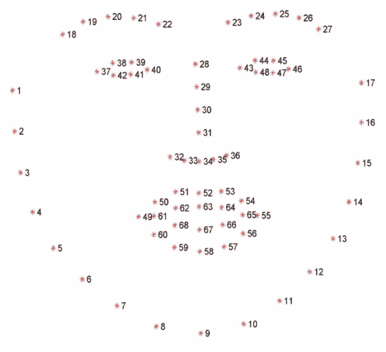

点**1**至**17**是面部轮廓，点**18**至**22**是右眉毛，**23**至**27**是左眉毛，**28**至**31**是鼻梁，**30**至**36**是鼻底，**37**至**42**形成右眼，**43**至**48**勾勒出左眼，然后还有许多关于嘴巴的点，包括上唇两侧和下唇两侧。

因此，这些是所有人类面孔都会有的常见特征，这将使我们能够做很多事情，如人脸识别和身份验证、姿态估计、可能年龄估计、性别估计，甚至像面部缝合和面部混合这样的有趣事情。仅凭这些信息就可以做很多非常有趣的事情，这些都是基于面部纯强度值。所以，这里没有 SURF 特征、**尺度不变特征变换**（**SIFT**）特征、HOG 特征或任何类似的东西。这些只是从像素值中可检测到的。所以，实际上您可以将 RGB 转换为黑白到单色，并且如果这是一个回归树的集成，您可以运行这个模型。

您可以下载 iBUG 数据集并训练您自己的模型，并且您实际上可以调整特征的数量。有比这更多特征的数据集，但这对我们的目的来说已经足够了。如果您想对各种面孔或特定面孔运行它，您可以训练它，但您会发现这个预训练数据集在许多情况下都会有效。因此，iBUG 本身就很强大。我们将在这里使用它，并展示如何运行代码来为一些图像和视频找到所有这些特征。然后，我们将将其应用于人脸识别问题，其中我们在给定集合中区分面孔。在您下载了`shape_predictor_68_face_landmarks.dat.bz2`文件后，您可以将该文件放入您拥有 Jupyter Notebook 的目录中，然后我们可以开始编写代码。

# 在图像中寻找 68 个面部标记点

在本节中，我们将看到我们的第一个示例，其中找到 68 个面部地标和单人图像以及多个人图像。所以，让我们打开本节的 Jupyter Notebook。看看这个第一个单元格：

```py
%pylab notebook

import dlib
import cv2
import os
import tkinter
from tkinter import filedialog
from IPython import display
root = tkinter.Tk()
root.withdraw()
#Go to your working directory (will be different for you)
%cd /home/test/13293
```

我们需要做一些基本的设置，就像我们在前面的章节中所做的那样。我们将初始化`%pylab notebook`。再次强调，这将加载 NumPy 和 PyPlot 以及其他一些东西，我们现在将执行`notebook`，这对于图像的近距离观察很有用，尽管我们将它切换到`inline`用于第二个示例，因为我们需要它来查看视频。然后，我们必须导入我们的其他库。dlib 当然是本节的重点。

我们将使用 OpenCV 的一些实用工具，但这只是额外的注释和视频处理。我们将使用`tkinter`来有一个漂亮的文件对话框显示。所以，而不是将文件名硬编码到我们的代码中，我们将提示用户输入我们想要分析的文件。我们将从`IPython`导入`display`以便在第二个示例中观看电影，我们必须设置`tkinter`；我们想要确保我们处于包含所有文件的工作目录中。你可能不需要这样做，但你可以这样做以确保。

因此，我们将选择单元格，按*Ctrl* + *Enter*，然后，如果一切正常，你应该看到以下输出：

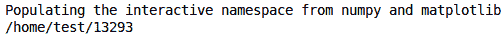

你可以看到`Populating the interactive namespace`和你的当前工作目录。

好的，现在我们已经设置好了，让我们看看第一个示例，我们将实际使用我们下载的文件中的 68 个特征；我们将看到在 dlib 中这样做是多么简单。现在，我们将看到这只是一点点的代码，但它确实做了些非常酷的事情：

```py
imgname = filedialog.askopenfilename(parent = root,initialdir = os.getcwd(), title = 'Select image file...')
img = imread(imgname)
img.flags['WRITEABLE']=True

annotated = img.copy()

predictor_path = "./shape_predictor_68_face_landmarks.dat"

detector = dlib.get_frontal_face_detector()

predictor = dlib.shape_predictor(predictor_path)
font = cv2.FONT_HERSHEY_SIMPLEX

dets = detector(img, 1)
print("Number of faces detected: {}".format(len(dets)))
for k, d in enumerate(dets):
    print("Detection {}: Left: {} Top: {} Right: {} Bottom: {}".format(k, d.left(), d.top(), d.right(), d.bottom()))
    shape = predictor(img,d)
    print("Part 0: {}, Part 1:{} ...".format(shape.part(0),shape.part(1)))
    head_width = shape.part(16).x-shape.part(0).y
    fontsize = head_width/650

    for pt in range(68):
        x,y = shape.part(pt).x, shape.part(pt).y
        annotated = cv2.putText(annotated, str(pt), (x,y), font, fontsize, (255,255,255),2, cv2.LINE_AA)

figure(figsize = (8,6))
imshow(annotated)
```

首先，我们将要求用户输入文件名。所以，这是使用`tkinter`，我们将打开一个文件名；它将使用`initialdir=os.getcwd()`函数在当前工作目录中开始搜索：

```py
imgname = filedialog.askopenfilename(parent = root,initialdir = os.getcwd(), title = 'Select image file...')
```

我们将使用以下行来读取：

```py
img = imread(imgname)
img.flags['WRITEABLE']=True
```

`img.flags['WRITEABLE']=True`这一行是 dlib 的一个小特性，并不是什么大问题，但是，根据你如何加载文件，`WRITEABLE`的`flags`可能被设置为`False`。这种情况发生在使用`imread`时。这取决于你如何加载它，但为了确保，`WRITEABLE`需要被设置为`True`。否则，dlib 会抛出一个错误。根据你的加载方式，这可能不是必要的。

我们想要创建一个可以写入的图像，实际上可以显示地标的位置，所以我们将创建我们之前加载的图像的副本，即包含人脸的图像，这样我们就可以写入它而不会覆盖原始图像：

```py
annotated = img.copy()
```

现在，我们将从我们下载的文件中加载数据。`shape_predictor_68_face_landmarks.dat.bz2`以`.bz2`格式提供；如果你还没有解压它，你可以将其解压为`.dat`格式。如果你在 Windows 上，建议使用 7-zip。如果你在 Linux 或 macOS 上，应该有一个内置的实用程序，你可以双击它，提取应该相当直接。

因此，我们将设置路径并将其保持在当前目录中，并且我们需要初始化我们的对象：

```py
predictor_path = "./shape_predictor_68_face_landmarks.dat"
```

现在，这里有两个阶段。首先，你需要检测人脸的位置。这类似于如果你之前使用过 OpenCV 和那些示例，Haar 级联会做什么，但我们使用`dlib.get_frontal_face_detector`，它只是内置的：

```py
detector = dlib.get_frontal_face_detector()
```

因此，我们创建`detector`对象，从`dlib.get_frontal_face_detector`获取它，初始化它，然后是`predictor`：

```py
predictor = dlib.shape_predictor(predictor_path)
```

一旦我们检测到人脸的位置，我们就知道有多少张人脸，可能会有多张。dlib 对于多张人脸也能很好地工作，我们将会看到。一旦你知道人脸在哪里，然后你可以运行`predictor`，它实际上会找到之前提到的 68 个地标的位置。所以，我们再次创建我们的`detector`对象和`predictor`对象，同时确保`predictor_path`设置正确。

然后，我们将设置我们的`font`：

```py
font = cv2.FONT_HERSHEY_SIMPLEX 
```

`font`只是将地标数据显示在注释图像上。所以，如果你想改变它，可以。好的，现在我们来到了代码的有趣部分。首先，进行检测，并找到人脸的确切位置。这里有一行非常简单的代码：

```py
dets = detector(img,1) 
```

我们将只打印出检测到的人脸数量：

```py
print("Number of faces detected: {}".format(len(dets))) 
```

这对于调试目的可能很有用，尽管我们将在实际检测到人脸的地方看到输出图像。

现在，我们将在这里进行一个`for`循环，这将处理可能有多张人脸的情况：

```py
#1 detection = 1 face; iterate over them and display data 
for k, d in enumerate(dets):
```

因此，我们将遍历每一个。`dets`的长度可能是一个，多个，或者零，但在这个例子中我们不会这么做。如果你不确定，你可能想把它放在`try...catch`块中，但在这里我们只处理有可见人脸的图像。

因此，我们将遍历人脸，并在`Left`、`Top`、`Right`和`Bottom`上显示每个脸的确切边界框；它们确切地在哪里？注意以下代码：

```py
print("Detection {}: Left: {} Top:{} Right: {} Bottom: {}".format( 
   k, d.left(), d.top(), d.right(), d.bottom())) 
```

这就是魔法发生的地方：

```py
shape = predictor(img, d) 
```

我们将找到形状，然后找到那 68 个地标，并通过打印出前几个地标来做一个简单的检查，以确保它正在工作：

```py
print("Part 0: {}, Part 1: {} ...".format(shape.part(0), shape.part(1))) 
```

好吧，所以我们有了脸部地标，现在我们实际上想要显示它，以便了解我们到底有什么。我们想要调整`font`的大小，以确保它适合图像，因为，根据图像的大小，你可能有一个高分辨率的图像，比如 4,000×2,000 像素，或者你可能有一个低分辨率的图像，比如 300×200 像素（或者类似的大小），图像中的头部可能非常大，就像主题靠近相机一样，或者相反，如果它远离相机，则可能很小。

所以，我们想要将`font`缩放到图像中头部的大小：

```py
#We want to scale the font to be in proportion to the head 
#pts 16 and 0 correspond to the extreme points on the right/left side of head 
head_width = shape.part(16).x-shape.part(0).x 
fontsize = head_width/650 
```

所以，这里我们只是在计算`head_width`。`shape`是一个预测对象，它有一个`part`方法，你传入你想要找到的地标点的索引，每个地标都将有一个`x`和`y`部分。所以，`head_width`在这里是`16`，这取决于你的视角。`head_width`只是头部在像素意义上的宽度。然后，我们将根据`head_width`调整字体大小，`650`是一个很好的因子，效果很好。

现在，我们有了所有数据，我们将遍历每个点：

```py
for pt in range(68); 
   x,y = shape.part(pt).x, shape.part(pt).y 
   annotated=cv2.putText(annotated, str(pt), (x,y), font, fontsize, (255,255,255),2, cv2.LINE_AA) 
```

因此，我们将硬编码`68`，因为我们知道我们有`68`个点，但如果你使用另一种形状检测器，比如预训练的形状检测器，你可能想改变这个数字。我们遍历这些点，然后我们得到之前显示的每个地标点的`x`和`y`坐标。我们使用`shape.part`提取`x`和`y`坐标并更新注释图像。我们需要`cv2`将文本放入图像。dlib 确实有类似的功能，但`cv2`更好，我们无论如何都可以有一个统一的接口。所以，我们将在这里使用 OpenCV，然后我们将创建一个图形并显示它：

```py
figure(figsize=(8,6)) 
imshow(annotated) 
```

所以，这就是关于代码的所有内容，希望这对你来说看起来相当简单。随意阅读。当我们执行代码时，我们可以看到一个股票照片的对话框。我们可以从这些照片中选择任何一张；例如，这里是一位戴帽子的男士的照片。所以，计算这个只需要一点时间，看这里：

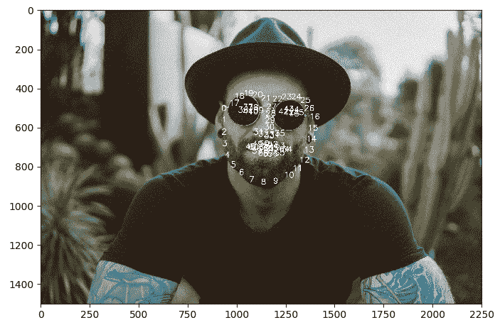

我们看到这个人有所有的 68 个点。我们将其标记为从 0 到**67**，因为这是 Python 从 0 开始的索引惯例，但我们可以看到，就像之前一样，我们有了所有的点；所以，你可以看到左侧的点 0，右侧的点 16，这取决于你的视角，然后它继续围绕整个头部。这里有一个放大的视图以增加清晰度：

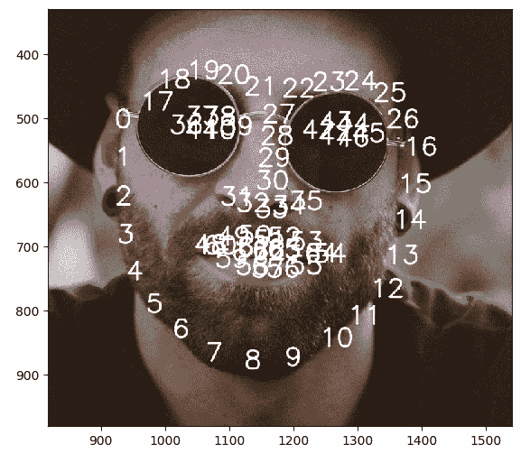

如我们所见，有些点彼此很近，但你可以在这里了解每个点代表什么。看起来相当清晰。所以，这相当酷，正如之前提到的，你可以用这个做很多事情。这个人正直视镜头，所以你可能想知道如果有人头部倾斜会发生什么？好吧，我们将再次运行这个程序。

让我们在这里选择一位股票照片中的女士：

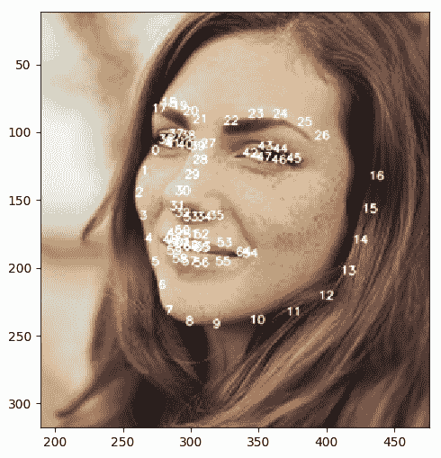

你可以看到她的头转过去了，但这仍然可以正常工作。在极端情况下，这并不总是可行的；如果某人的头转得太多以至于地标不见了，那么在合理的情况下，这可能会失败，你可以看到这实际上工作得非常好。

好的，那么关于多个人脸呢？这对那个有效吗？让我们看看另一张团体照片：

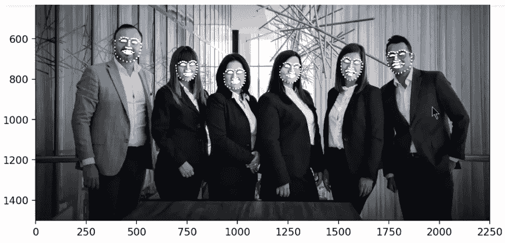

我们可以看到这里有六个人，他们以不同的姿势站立。鉴于这里的分辨率，你无法阅读这些注释，但这完全没问题，因为你已经看到了它们的位置，我们可以看到我们实际上非常准确地检测到了所有六个面部。所以，希望你能在这里得到一些想法，了解你如何在自己的代码中使用它，以及 dlib 在检测阶段为你提供了多么简单的操作。

# 视频中的人脸

我们将看到上一节关于照片中人脸的第二个示例。静态图像示例很简洁，但你可能想知道关于视频的情况。好的，让我们看看下一个示例：

```py
%pylab inline
%cd /home/test/13293

import dlib
import cv2
import os
import tkinter
from tkinter import filedialog
from IPython import display
root = tkinter.Tk()
root.withdraw()
```

我们将代码更改为`%pylab inline`，因为所有这些小部件实际上可能会在你想显示视频序列时与 Jupyter 发生问题。我们将需要与之前示例中相同的代码来开始，只需将`notebook`替换为`inline`。然后，我们再次运行相同的代码。

执行完毕后，我们继续下一部分。这实际上非常相似，因为你只需要遍历每一帧，它就会以同样的方式工作：

```py
predictor_path = "./shape_predictor_68_face_landmarks.dat" 
detector = dlib.get_frontal_face_detector() 
predictor = dlib.shape_predictor(predictor_path) 
```

所以，你看，这段代码基本上与之前的示例相同。如果你想，你可以用你的摄像头来做这个。实际上，这非常有趣。我们这里不会使用摄像头，但如果你想在自定义项目中使用摄像头，你可以添加以下行：

```py
cap = cv2.VideoCapture(0)  
#0 is the first camera on your computer, change if you have more #than one camera 
```

我们假设你只有一个摄像头。如果你有多个摄像头并且不想使用第一个，那么你可能需要将那个`0`改为其他值。如果你不想使用你的摄像头，请添加以下行：

```py
cap = cv2.Videocapture('./rollerc.mp4') 
```

在这里，我们不会使用摄像头。我们想要创建一个我们将要显示的图形，我们将它命名为`100`以确保它有一个唯一的 ID。我们将使用与之前示例中相同的`font`：

```py
font = cv2.FONT_HERSHEY_SIMPLEX 
```

这听起来很复杂，但实际上它只是一个普通的字体。我们将创建一个`while`循环，它将遍历每一帧：

```py
while(True): 
   #capture frame-by-frame 
ret, img = cap.read 
img.flags['WRITEABLE']=True #just in case 
```

因此，我们使用`cap`作为 OpenCV 的视频捕获对象，然后我们只需要执行`cap.read()`来读取帧。`ret`只是确保我们实际上读取了一个帧的代码。然后，`img`是返回的实际图像，再次确保设置了`WRITEABLE`标志，否则 dlib 可能会产生错误。

我们将尝试找到一个人脸，如果找不到人脸，那么我们将释放并跳出我们的循环：

```py
try: 
   dets = detector(img, 1) 
   shape = predictor(img, dets[0]) 
except: 
   print('no face detected', end='\r') 
   cap.release() 
   break 
```

你可能不希望你的应用程序有这个功能，但这里的一个很酷的事情是，如果你使用的是摄像头，一个简单的方法来停止这个循环无限期地运行就是将你的手放在脸部前面。你将手放在摄像头前，或者转动你的头，或者随便什么，这会自动停止它，无需手动操作。否则，你可以发送内核中断，并确保你执行 `cap.release()`，否则视频源将保持打开状态，你可能会稍后遇到错误。

根据前面的代码块，我们抓取图像，检测人脸，并获取形状。对于这段代码，我们假设只有一个脸，但你可以从之前的例子中看到如何处理多个脸。

然后，我们创建一个空白图像或一个与原始图像相同的图像，我们可以写入它而不会扭曲原始图像。设置 `head_width` 和 `fontsize`，然后做与我们之前完全一样的事情。找到 `x` 和 `y` 点，然后写入它们：

```py
annotated=img.copy() 
head_width = shape.part(16).x-shape.part(0).x 
fontsize = head_width/650 
for pt in range(68): 
   x,y = shape.part(pt).x, shape.part(pt).y 
   annotated=cv2.putText(annotated, str(pt), (x,y), font, fontsize, (255,255,255),2, cv2.LINE_AA) 

```

我们将展示我们的结果，如下面的代码所示：

```py
fig=imshow(cv2.cvtColor(annotated,cv2.COLOR_BGR2RGB 
```

注意颜色，`BGR2RGB`。这是因为 OpenCV 默认使用 **蓝绿红** （**BGR**），如果你不改变这个设置来显示颜色，颜色看起来会很奇怪。然后，这里有一些东西可以确保在脚本仍在运行时我们的窗口正在更新。否则，它实际上会运行整个脚本，你将看不到实时发生的事情。

我们然后按下 *Shift* + *Enter*。可能需要一秒钟来加载，然后它会运行得相当慢，主要是因为它是 Jupyter Notebook 的一部分。你可以将代码提取出来作为一个独立的程序运行，你可能还想创建一个名为 `cv2` 的窗口，但这对我们的目的来说已经足够了。当你执行单元格时，你会看到两位女士：

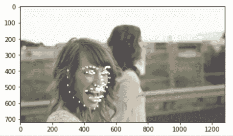

一张脸有点模糊，所以它不会检测到她，但对于前景中的那位女士，正如你所看到的，她的脸被很好地追踪，并且找到了地标。这可以根据你的硬件实时工作，这不是你希望在 Jupyter Notebook 中运行的那种类型的东西。你可以看多久就多久，但你会明白这个意思。

所以，这就是与视频一起工作的简单方法。切换到背景中的另一位女士，第一位女士的脸转过去了：

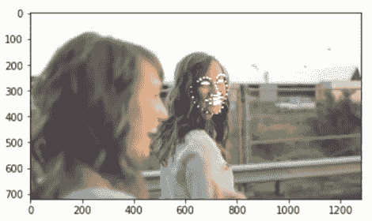

这就是与视频一起工作的简单方法，你可以检测多个脸，并使用这些信息做任何你想做的事情。

# 面部识别

我们将看看如何使用 dlib 和相对较少的代码执行面部识别。在这里，面部识别意味着我们将查看一张图片，看看这个人是否与另一张图片中的人相同。我们将保持简单，只比较两张脸以查看它们是否相同，但这一点可以很容易地推广，就像我们稍后看到的。

在这里，我们将进行与第一个示例类似的操作，我们将提示用户打开两个文件，每个文件中都有一个面部图像将被与另一个进行比较。为此，我们将使用来自 **Labeled Faces in the Wild** (**LFW**) 的某些面部图像。这是一个很好的数据库，包含来自各种名人的数千张面部图像。您可以从 [`vis-www.cs.umass.edu/lfw/`](http://vis-www.cs.umass.edu/lfw/) 下载整个集合，并获得大量可以使用的示例。因此，我们只是将从数据集的一个小子集中使用一些示例来进行我们的示例。

我们提示用户选择两个不同的面部图像。我们将从项目文件夹的 `faces` 子目录开始初始目录：

```py
#Prompt the user for two images with one face each 
imgname = filedialog.askopenfilename(parent=root, initialdir='faces', title='First face...') 
face1 = imread(imgname) 
face1.flags['WRITEABLE']=True 
#second face 
imgname = filedialog.askopenfilename(parent=root, initialdir='faces', title='Second face...') 
face2 = imread(imgname) 
face2.flags['WRITEABLE']=True 
```

您需要从 [dlib.net/files](http://dlib.net/files) 下载两个额外的文件，它们是 `shape_predictor_5_face_landmarks.dat` 文件和 `dlib_face_recognition_resnet_model_v1.dat` 文件。再次强调，这些文件将以 `bz2` 格式存在。有趣的是，我们只使用了五个面部特征点，但结合描述符，实际上非常适用于描述人脸。因此，我们没有使用 68 个面部特征点，而是只用了 5 个。我们将看到这会多么顺利。下载这些文件，并像第一个示例中那样解压 `bz2` 文件。

现在，我们设置正确的文件路径：

```py
predictor_path = './shape_predictor_5_face_landmarks.dat 
face_rec_model_path= './ dlib_face_recognition_resnet_model_v1.dat 
```

`predictor` 的工作方式与 68 个面部特征点相似，但同样会提供五个结果，我们将使用一个预训练的识别模型。它适用于各种面部；您现在不需要重新训练它。在这里，我们不需要进行任何复杂的深度学习建模。有方法可以训练自己的模型，但您会看到这实际上非常适合广泛的多种应用。

因此，我们创建我们的 `detector`，就像之前一样。这不需要任何额外的数据：

```py
detector = dlib.get_frontal_face_detector() 
```

我们将创建我们的形状查找器，类似于之前的示例，并且再次使用五个面部特征点检测器。我们将创建一个新的 `facerec` 对象，来自 `dlib.face_recognition_model_v1`，将路径作为 `face_rec_model_path` 传入：

```py
sp = dlib.shape_predictor(predictor_path) 
facerec = dlib.face_recognition_model_v1(face_rec_model_path) 
```

现在，`facerec`所做的是，它接受一个映射，给定我们检测到的面部以及那些地标的位置和形状，然后它将创建一个 128 长度的浮点向量，称为描述符，用来描述面部。因此，它实际上创建了一个将描述面部特征的东西，并且能够捕捉到面部的本质。如果你有同一个人在两张不同的照片中，其中一张照片中的人离相机较远，而在另一张照片中他们的脸可能转向，可能有更多张照片，并且可能有不同的光照条件等等。描述符应该对那些条件相当不变。描述符永远不会完全相同，但同一个人应该得到足够相似的面部描述符，无论他们的方向、光照条件等等。即使他们改变发型或戴帽子，你也应该得到一个相似的描述符，而`facerec`实际上在这方面做得很好。

以下代码仅执行检测和形状查找：

```py
dets1 = detector(face1, 1) 
shape1 = sp(face1, dets1[0]) 
dets2 = detector(face2, 1) 
shape2 = sp(face2, dets2[0])
```

然后，我们将执行之前描述的操作：给定检测、空间特征和地标，我们将计算 128 点的向量，我们可以稍作检查。然后，我们将并排查看面部：

```py
figure(200) 
subplot(1,2,1) 
imshow(face1) 
subplot(1,2,2) 
imshow(face2) 
```

现在，我们想知道面部有多相似，所以我们将计算欧几里得距离：

```py
euclidean_distance = np.linalg.norm(np.array(face_descriptor1)-np.array(face_descriptor2)) 
```

这意味着你取每个点，从 1 到 128，从第二个点减去第一个点，对每个点进行平方，将它们相加，然后开平方，这将给出一个单一的数字。这个数字将用来确定这两张图像是否是同一个人的面部。

这里有一个神奇的数字`0.6`，我们将在这里使用它，并且它已经被经验证明非常有效。如果 128 维的距离小于`0.6`，我们说这两张图像是同一个人的。如果它大于`0.6`，或者等于`0.6`，就像这个例子一样，我们将说这些是不同的人。因此，我们查看这两张图像，计算所有这些指标，然后我们将说如果它是`<0.6`，面部匹配，如果是`>0.6`，面部不同：

```py
if euclidean_distance<0.6: 
   print('Faces match') 
else: 
   print('Faces are different') 
```

现在，让我们运行代码。你会看到一个来自 LFW 的名人照片对话框。我们将选择亚历克·鲍德温和西尔维斯特·史泰龙中的一张：

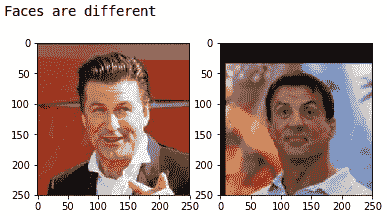

巴德温和西尔维斯特·史泰龙被归类为两个不同的人。这正是我们所预期的，因为他们的脸是不同的。现在，让我们为另一对进行比较。让我们比较亚历克·鲍德温与亚历克·鲍德温：

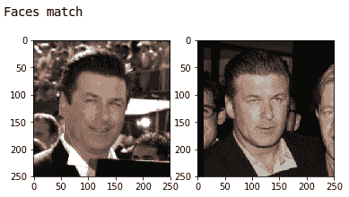

在这里，你可以看到他们的面部匹配。让我们为了乐趣再进行一些比较。所以，姚明和温莎·瑞德看起来彼此不同：

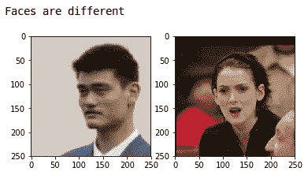

然后，我们取温莎·瑞德的两个不同照片，面部匹配：

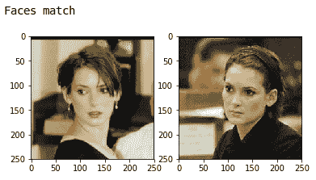

你可以做各种各样的组合。好吧，所以这很简单。看看面部描述符可能很有用；你只需按*Shift* + *Tab*，你就可以看到向量看起来像这样：

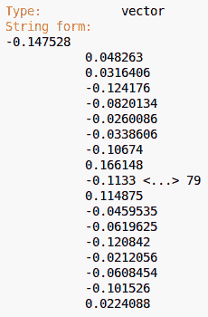

这并不非常易于人类理解，但如果你对此好奇，它仍然可用。这足以捕捉到人脸的本质，仅仅通过简单的比较，我们实际上可以相当好地判断两张图片是否为同一张人脸。这在 LFW 数据集上实际上有超过 99%的准确率。所以，你实际上很难找到两张人脸结果不佳的情况，无论是同一人的两张人脸声称不匹配，还是不同人的两张人脸声称匹配。

因此，如果你想根据自己的需求进行适配，你可以做的是获取自己的数据库，仅限于你想要识别的人的面部图像目录，然后当你有新的人脸时，只需遍历数据库中的每一张人脸。只需进行一个`for`循环，并将新的人脸与每一张进行比较。对于这里通过使用 NumPy 线性代数范数（`np.linalg.norm`）计算出的欧几里得距离，如果这个距离小于 0.6，那么你可以说你找到了一个匹配。如果你担心误判，你可以有一个人多张人脸，并与每一张进行比较，然后执行多数规则。

否则，假设你有十张人脸，你想要确保这十张人脸都匹配。如果你真的想确保没有出现误判，你可以获取十张非常好的图像，然后将你的新测试图像与这十张图像进行比较。但无论如何，从这个例子中你可以看出，这并不需要很多代码，并且这种方法可以适应各种不同的应用。

# 摘要

在本章中，我们简要介绍了 dlib 库，并学习了如何使用它进行人脸识别。然后，我们学习了如何使用预训练的 68 个面部特征点模型生成人脸轮廓。之后，我们学习了如何为单个人、多个人以及视频中的人找到面部特征点。

在下一章，第七章，*使用 TensorFlow 进行深度学习图像分类*，我们将学习如何使用预训练模型通过 TensorFlow 对图像进行分类，然后我们将使用我们自己的自定义图像。
