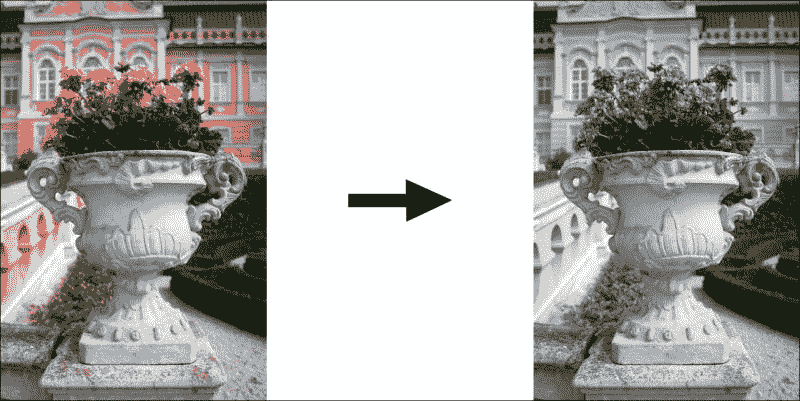
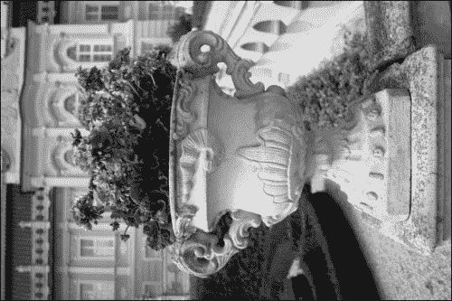
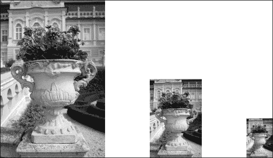
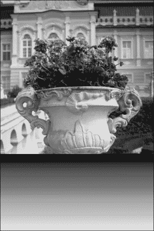
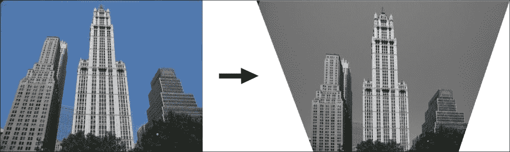

# 第一章  数学从未如此简单！

计算机视觉全靠数学。当你需要创建自己的算法或实现某些功能时，你将面对一个数学问题。你应该了解其内部是如何工作的，因为没有深入到基础知识，很难做任何事情。但你不孤单！许多聪明的人已经创建了几个有用的库来简化你的工作。其中之一就是 JSFeat（[`inspirit.github.io/jsfeat/`](http://inspirit.github.io/jsfeat/)），它实现了不同的数学方法。在这里，我们将讨论库的基本元素，如数据结构，特别是矩阵，以及简单的数学算法。

我们将涵盖以下主题：

+   JSFeat 的安装和核心结构表示

+   图像内部是什么？所有关于矩阵

+   有用的函数及其使用位置

# JSFeat 的安装和核心结构表示

JSFeat 是一个强大的工具，可以用来实现新的功能。要开始使用它，我们需要初始化项目。这相对简单；如果你有 JavaScript 的经验，那么这不会给你带来任何麻烦。这个库本身包含各种计算机视觉算法，对于想要一个灵活的计算机视觉框架的人来说，它将是一个很好的起点。首先，你将学习如何安装它，并看到使用这个库可以做什么的基本示例。

# 初始化项目

首先，你需要下载 JSFeat 库并将其添加到你的网页中。这很简单，看起来就像这样：

```py
<!doctype html>
<html>
<head>
    <meta charset="utf-8">
    <title>chapter1</title>
    <script src="img/jsfeat.js"></script>
</head>
<body></body></html>
```

如你所见，我们只是在这里添加了一个 JavaScript 库，没有进行任何额外的操作。我们不需要任何特定的软件，因为 JavaScript 对于许多计算机视觉任务来说已经足够快了。

JSFeat 库的核心数据结构是矩阵。我们将在下一节中详细介绍矩阵的更多内容，但为了检查一切是否正常工作，让我们尝试创建一个示例。

将以下代码添加到`<script/>`标签中：

```py
var matrix = new jsfeat.matrix_t(3, 3, jsfeat.U8_t | jsfeat.C1_t);
matrix.data[1] = 1;
matrix.data[5] = 2;
matrix.data[7] = 1;
for (var i = 0; i < matrix.rows; ++i) {
  var start = i * matrix.cols;
  console.log(matrix.data.subarray(start, start + matrix.cols));
}
```

你将在你的控制台中看到以下内容：

```py
[0, 1, 0]
[0, 0, 2]
[0, 1, 0]
```

在前面的代码中，我们创建了一个 3 x 3 维度的矩阵，数据类型为无符号字节，单通道。接下来，我们将一些元素放入其中，并按行将矩阵的内容记录到控制台。矩阵数据以一维数组的形式呈现。记住这一点，我们将在下一节中详细说明。

最后，你做到了！你已经成功地将 JSFeat 计算机视觉库添加到了你的第一个项目中。现在，我们将讨论矩阵实际上是什么。

# 理解数字图像

你可能已经知道，图像由像素组成，这是理解图像处理的一大步。在先前的主题中，你已经看到矩阵只是一个一维数组。然而，它代表的是二维数组，其元素以行主序布局呈现。以这种方式创建矩阵在速度和内存效率方面更为优越。我们的图像也是二维的！每个像素反映了数组元素的价值。因此，很明显，矩阵是图像表示的最佳结构。在这里，我们将看到如何处理矩阵以及如何在图像上应用矩阵转换操作。

## 将图像加载到矩阵中

JSFeat 库使用其自己的矩阵数据结构。首先，我们使用常规的 HTML 和 JavaScript 操作加载一个图像。然后我们在网页上放置一个画布：

```py
<canvas id="initCanvas"></canvas>
```

然后我们需要在这里放置一个图像。我们只需几行代码就能做到：

```py
var canvas = document.getElementById('initCanvas'),
    context = canvas.getContext('2d'),
    image = new Image();
image.src = 'path/to/image.jpg';

image.onload = function () {
    var cols = image.width;
    var rows = image.height;
    canvas.width = cols;
    canvas.height = rows;
    context.drawImage(image, 0, 0, image.width, image.height);
};
```

这只是将图像显示在画布上的常见方法。我们定义图像源路径，当图像加载完成后，我们将画布的尺寸设置为图像的尺寸，并绘制图像本身。让我们继续前进。将画布的内容加载到矩阵中有点棘手。为什么？我们需要使用`jsfeat.data_t`方法，这是一个包含数组二进制表示的数据结构。无论如何，由于它只是 JavaScript ArrayBuffer 的包装器，所以应该不会有问题：

```py
var imageData = context.getImageData(0, 0, cols, rows);
var dataBuffer = new jsfeat.data_t(cols * rows, imageData.data.buffer);
var mat = new jsfeat.matrix_t(cols, rows, jsfeat.U8_t | jsfeat.C4_t, dataBuffer);
```

在这里，我们创建一个矩阵，就像我们之前做的那样，但除此之外，我们还添加了一个新的参数，即矩阵缓冲区，它包含所有必要的数据。

可能你已经注意到矩阵构造的第三个参数看起来很奇怪。它设置了矩阵的类型。矩阵有两个属性：

+   第一部分表示矩阵中的数据类型。在我们的例子中，它是`U8_t`；它表示我们使用无符号字节数组。通常，图像使用 0-255 的范围来表示颜色，这就是为什么我们需要字节。

+   记住，一个图像由 3 个主要通道（红色、绿色和蓝色）和一个透明度通道组成。参数的第二部分显示了矩阵中使用的通道数。如果只有一个通道，那么它就是一个灰度图像。

我们如何将彩色图像转换为灰度图像？要找到答案，我们必须转到下一节。

## 基本矩阵操作

处理矩阵并不容易。我们为什么要害怕困难呢？通过本节的内容，你将学习如何组合不同的矩阵以产生有趣的结果。

当你需要实现新功能时，基本操作非常有用。通常，计算机视觉使用灰度图像来处理，因为大多数计算机视觉算法不需要颜色信息来跟踪对象。正如你可能已经知道的，计算机视觉主要依赖于形状和强度信息来产生结果。在下面的代码中，我们将看到如何将彩色矩阵转换为灰度（单通道）矩阵：

```py
var gray = new jsfeat.matrix_t(mat.cols, mat.rows, jsfeat.U8_t | jsfeat.C1_t);
jsfeat.imgproc.grayscale(mat.data, mat.cols, mat.rows, gray);
```

只需几行代码！首先，我们创建一个对象，该对象将保存我们的灰度图像。接下来，我们将 `JSFeat` 函数应用于该图像。如果您想定义转换的矩阵边界，也可以。以下是转换的结果：



对于此类操作，您实际上不需要将彩色图像加载到矩阵中；您可以使用 `imageData.data` 而不是 `mat.data`，这取决于您。

要了解如何显示矩阵，请参阅 *矩阵显示* 部分。

计算机视觉中的一种有用操作是矩阵转置，这基本上只是将矩阵逆时针旋转 90 度。您需要记住，在这次操作中，原始矩阵的行和列会被反转：

```py
var transposed = new jsfeat.matrix_t(mat.rows, mat.cols, mat.type | mat.channel);
jsfeat.matmath.transpose(transposed, mat);
```

### 小贴士

**下载示例代码**

您可以从您在 [`www.packtpub.com`](http://www.packtpub.com) 的账户中下载您购买的所有 Packt 书籍的示例代码文件。如果您在其他地方购买了这本书，您可以访问 [`www.packtpub.com/support`](http://www.packtpub.com/support) 并注册以直接将文件通过电子邮件发送给您。本书的下载链接：[`github.com/foat/computer-vision-for-the-web`](https://github.com/foat/computer-vision-for-the-web)。

再次，我们需要预先定义结果矩阵，然后才能应用转置操作：



另一种可能有所帮助的操作是矩阵乘法。由于在图像上难以看到结果，我们将手动填写矩阵。以下代码通过公式 *C = A * B* 运作，第一个矩阵的行数必须等于第二个矩阵的列数，例如 *MxN* 和 *NxK*，这些分别是第一个和第二个矩阵的维度：

```py
var A = new jsfeat.matrix_t(2, 3, jsfeat.S32_t | jsfeat.C1_t);
var B = new jsfeat.matrix_t(3, 2, jsfeat.S32_t | jsfeat.C1_t);
var C = new jsfeat.matrix_t(3, 3, jsfeat.S32_t | jsfeat.C1_t);
for (var i = 0; i < A.data.length; ++i) {
    A.data[i] = i + 1;
    B.data[i] = B.data.length / 2 - i;
}
jsfeat.matmath.multiply(C, A, B);
```

在这里，*M = K = 3* 和 *N = 2*。请注意，在创建矩阵的过程中，我们将列作为第一个参数放置，而将行仅作为第二个参数放置。我们用虚拟值填充矩阵并调用乘法函数。在控制台显示结果后，您将看到如下：

```py
[1, 2] [3,  2,  1] [ 3,  0, -3]
[3, 4] [0, -1, -2] [-3,  9,  2]
[5, 6]             [ 2, -5, 15]
```

在这里，第一列是矩阵 A，第二列是矩阵 B，第三列是结果矩阵 C。

JSFeat 还提供了矩阵乘法的函数，如 `multiply_ABt`、`multiply_AAt` 等，其中 *t* 表示转置。当您不想为转置方法编写额外的代码行时，请使用这些函数。此外，还有针对 3 x 3 矩阵的矩阵操作，这些操作更快且针对此维度进行了优化。此外，当您需要处理坐标时，它们也非常有用。

在二维世界中，我们只使用*x*和*y*作为坐标。然而，对于更复杂的算法，当我们需要定义两条平行线之间的交点时，我们需要给一个点添加*z*（第三个）坐标，这个坐标系统被称为齐次坐标。它们在你需要将三维物体投影到二维空间时特别有用。

## 深入探索

考虑在图像上找到特征，这些特征通常用于目标检测。为此有很多算法，但你需要一个鲁棒的解决方案，它必须能够处理不同大小的对象。此外，你可能需要减少图像的冗余或搜索你不确定大小的东西。在这种情况下，你需要一组图像。这个问题的解决方案是一个图像金字塔。**图像金字塔**是一组从原始图像下采样得到的多个图像。

创建图像金字塔的代码看起来是这样的：

```py
var levels = 4, start_width = mat.cols, start_height = mat.rows,
    data_type = jsfeat.U8_t | jsfeat.C1_t;
var pyramid = new jsfeat.pyramid_t(levels);
pyramid.allocate(start_width, start_height, data_type);
pyramid.build(mat);
```

首先，我们定义金字塔的层数；在这里，我们将其设置为 4。在 JSFeat 中，默认情况下跳过第一层，因为它就是原始图像。接下来，我们定义起始尺寸和输出类型。然后，我们为金字塔层分配空间并构建金字塔本身。金字塔通常以 2 的倍数下采样：



JSFeat 金字塔只是一个矩阵数组，它显示了从原始图像开始到金字塔中最小图像的不同金字塔层。

## 矩阵显示

在上一节中我们没有讨论的是如何显示输出矩阵。对于灰度和彩色图像，有不同的显示方式。以下是显示彩色图像矩阵的代码：

```py
var data = new Uint8ClampedArray(matColour.data);
var imageData = new ImageData(data, matColour.cols, matColour.rows);
context.putImageData(imageData, 0, 0);
```

我们只需要将矩阵数据转换为适当的格式，并将结果`ImageData`函数放入上下文中。对于灰度图像来说，这样做更困难：

```py
var imageData = new ImageData(mat.cols, mat.rows);
var data = new Uint32Array(imageData.data.buffer);
var alpha = (0xff << 24);
var i = mat.cols * mat.rows, pix = 0;
while (--i >= 0) {
    pix = mat.data[i];
    data[i] = alpha | (pix << 16) | (pix << 8) | pix;
}
```

这是一个二进制数据表示。我们将 alpha 通道填充到`ImageData`函数中，对于所有像素以及红色、绿色和蓝色通道都是常数。对于灰度图像，它们的值相同，设置为`pix`变量。最后，我们需要像上一个例子中那样将`ImageData`函数放入上下文中。

# 有用的函数及其使用方法

在计算机视觉中需要很多函数。其中一些很简单，比如排序，而另一些则更复杂。在这里，我们将讨论如何使用 JSFeat 库来使用它们，并查看几个计算机视觉应用。

## 使用 JSFeat 进行排序

排序算法在任何应用中都是非常有帮助的。JSFeat 提供了一个出色的排序矩阵的方法。除了排序数组之外，它甚至可以排序数据的一部分。让我们看看我们如何做到这一点：

1.  首先，我们需要定义一个比较函数，如下所示：

    ```py
    var compareFunc = function (a, b) {
        return a < b;
    };
    ```

1.  接下来，我们进行排序：

    ```py
    var length = mat.data.length;
    jsfeat.math.qsort(mat.data, length / 3 * 2, length - 1, compareFunc);
    ```

第一个参数定义了一个用于排序的数组，第二个和第三个参数分别是起始索引和结束索引。最后一个参数定义了比较函数。你将看到以下图像：



如我们所见，图像的下半部分被排序了，看起来不错！

你可能需要一个 `median` 函数，它返回将数据的高部分与低部分分开的数字。为了更好地理解这一点，我们需要看看一些示例：

```py
var arr1 = [2, 3, 1, 8, 5];
var arr2 = [4, 6, 2, 9, -1, 6];
var median1 = jsfeat.math.median(arr1, 0, arr1.length - 1);
var median2 = jsfeat.math.median(arr2, 0, arr2.length - 1);
```

对于第一个数组，结果是 `3`。很简单。对于排序后的数组，数字 `3` 只是将 `1`、`2` 与 `5`、`8` 分开的分隔符。对于第二个数组，我们看到的结果是 `4`。实际上，不同的中值算法可能会返回不同的结果；对于所展示的算法，JSFeat 会从数组元素中选择一个来返回结果。相比之下，许多方法在这种情况下会返回 `5`，因为 `5` 代表两个中间值 `(4, 6)` 的平均值。考虑到这一点，请务必小心，并看看算法是如何实现的。

## 线性代数

谁想解一个线性方程组？没有人？别担心，这可以很容易地完成。

首先，让我们定义一个简单的线性系统。首先，我们将线性系统定义为 *Ax = B*，其中我们知道 *A* 和 *B* 矩阵，并需要找到 *x*：

```py
var bufA = [9, 6, -3, 2, -2, 4, -2, 1, -2],
        bufB = [6, -4, 0];

var A = new jsfeat.matrix_t(3, 3, jsfeat.F32_t | jsfeat.C1_t, new jsfeat.data_t(bufA.length, bufA));
var B = new jsfeat.matrix_t(3, 1, jsfeat.F32_t | jsfeat.C1_t, new jsfeat.data_t(bufB.length, bufB));

jsfeat.linalg.lu_solve(A, B);
```

JSFeat 将结果放入 *B* 矩阵中，所以如果你想在其他地方使用 *B*，请务必小心，否则你会丢失你的数据。结果看起来会是这样：

```py
[2.000..., -4.000..., -4.000..]
```

由于算法使用浮点数，我们无法得到精确的值，但经过四舍五入操作后，一切看起来都会很正常：

*[2, -4, -4]*

此外，你还可以使用 `svd_solve` 函数。在这种情况下，你还需要定义一个 *X* 矩阵：

```py
jsfeat.linalg.svd_solve(A, X, B);
```

## 一个透视示例

让我们给你一个更吸引人的插图。假设你有一个被透视扭曲的图像，或者你想要校正一个物体平面，例如，一堵建筑墙。这里有一个例子：



看起来不错，不是吗？我们是如何做到这一点的？让我们看看代码：

```py
var imgRectified = new jsfeat.matrix_t(mat.cols, mat.rows, jsfeat.U8_t | jsfeat.C1_t);
var transform = new jsfeat.matrix_t(3, 3, jsfeat.F32_t | jsfeat.C1_t);

jsfeat.math.perspective_4point_transform(transform,
        0, 0, 0, 0, // first pair x1_src, y1_src, x1_dst, y1_dst
        640, 0, 640, 0, // x2_src, y2_src, x2_dst, y2_dst and so on.
        640, 480, 640, 480,
        0, 480, 180, 480);
jsfeat.matmath.invert_3x3(transform, transform);
jsfeat.imgproc.warp_perspective(mat, imgRectified, transform, 255);
```

主要的，就像我们之前做的那样，我们定义一个结果矩阵对象。接下来，我们分配一个用于图像透视变换的矩阵。我们根据四对对应点来计算它。例如，最后一个是原始图像的第四个点，即 `[0, 480]`，应该投影到校正图像上的 `[180, 480]` 点。在这里，第一个坐标指的是 *X*，第二个指的是 *Y*。然后，我们反转变换矩阵，以便能够将其应用于原始图像——`mat` 变量。我们选择背景颜色为白色（无符号字节中的 255）。结果，我们得到了一个没有任何透视扭曲的漂亮图像。

# 摘要

在本章中，我们看到了许多有用的计算机视觉应用。每次你想实现新的功能时，你都需要从头开始。幸运的是，有许多库可以帮助你进行调研。在这里，我们主要介绍了 JSFeat 库，因为它为计算机视觉应用提供了基本方法。我们讨论了如何以及何时应用这个库的核心。然而，这只是一个起点，如果你想看到更多令人兴奋的数学主题并深入理解计算机视觉的逻辑，我们强烈建议你阅读这本书的下一章节。那里见！
