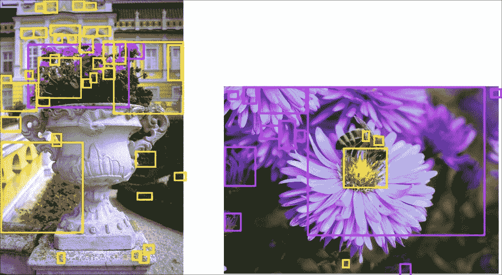
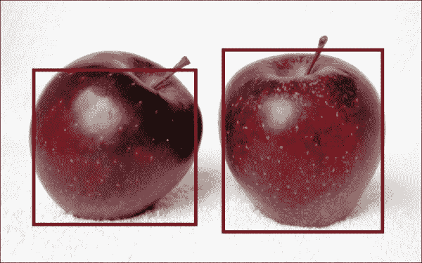
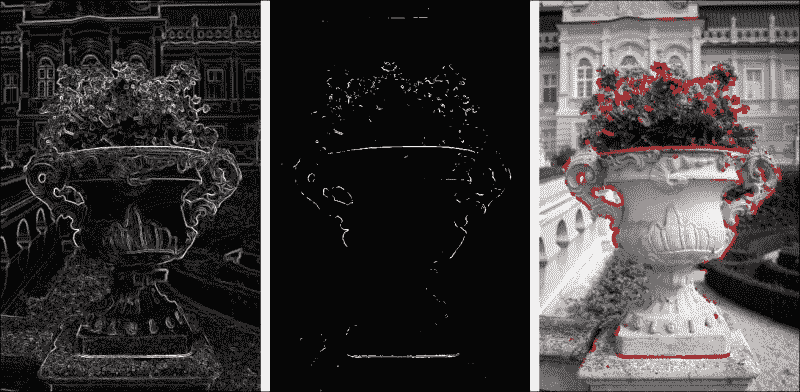
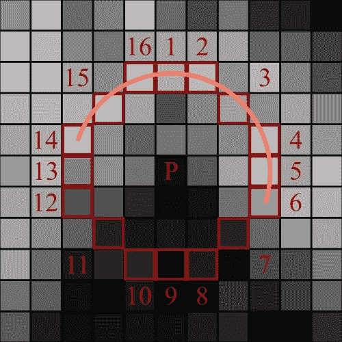
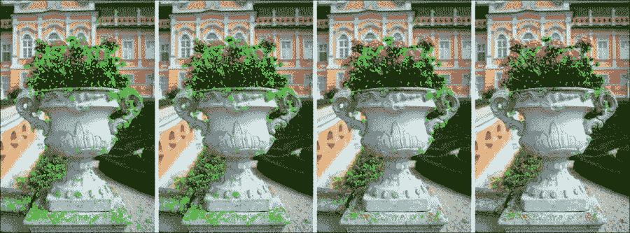
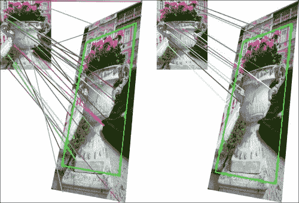

# 第三章：面向所有人的简单物体检测

在上一章中，我们讨论了诸如矩阵运算和矩阵卷积等基本主题。此外，我们看到了如何应用各种图像滤波器以及如何在我们的应用程序中使用它们。但那些主题主要关于图像处理，而不是计算机视觉！计算机视觉方法本身能做什么？它们通过分析图像提供了一种能力，使计算机能够提供有关图像场景中物体信息。我们之前讨论的库提供了各种功能，以在图像中找到不同的物体。在本章中，我们将主要讨论包含在 tracking.js ([`trackingjs.com`](http://trackingjs.com)) 和 JSFeat ([`inspirit.github.io/jsfeat/`](http://inspirit.github.io/jsfeat/)) 库中的方法，以从图像中获取物体。我们将看到如何找到彩色物体，以及如何使用模板找到物体。进一步地，我们将创建自己的物体检测器。这些技术不仅可以应用于图像，还可以应用于视频！最后，我们将转向物体跟踪主题。

在本章中，我们将涵盖以下主题：

+   颜色物体检测

+   深入研究 tracking.js API

+   图像特征

+   描述符和物体匹配

# 检测颜色物体

在前面的章节中，我们主要处理的是灰度图像。当然，物体的形状和强度部分很重要，但颜色信息呢？我们为什么不使用它呢？例如，一张桌子上的红色苹果仅通过颜色信息就可以轻松检测到。实际上，这也是为什么颜色物体检测有时比其他检测方法表现得更好。此外，实现这些算法的速度更快，计算机在执行这类操作时通常消耗的资源也更少。

tracking.js 库提供了一个出色的功能，用于创建颜色检测应用程序。我们将从一个基本的颜色跟踪示例开始。它相对简单，但你需要记住，它只有在彩色物体可以轻松从背景中分离出来时才表现最佳。

## 使用 tracking.js 库中的预定义颜色

颜色检测是 tracking.js 提供的方法之一。为了正确使用它，我们首先需要了解一些背景知识。

我们将从直观的步骤开始：

1.  首先，我们找到所有具有指定颜色的连通区域。这是算法中最消耗计算的部分。图像上存在的颜色区域越小，算法运行得越快。

1.  接下来，我们定义围绕每个区域的边界框或矩形。最后，我们合并重叠的框以找到主要物体。合并操作只需一次遍历。因此，如果一个图像在第一次合并后产生了重叠的框，那么它们仍然会相互重叠。

我们将使用三种颜色：黄色、品红色和青色来运行该算法。以下是一个颜色检测算法的示例：



如您所见，从第一张图片中获取颜色对象非常困难。对于第二张来说，这样做稍微容易一些，但只有对于花朵的中心来说很容易做到，因为它可以与叶子分开，并且与花瓣分开。

我们如何使用 tracking.js 库来实现这一点？在这个例子中，我们将使用画布，就像我们在前面的章节中所做的那样。这也可以用于其他标签，我们将在下面的内容中稍作展示。

首先，我们定义一个`ColorTracker`对象并将其预构建的颜色添加到其中。目前，只有三种颜色可用：`magenta`、`cyan`和`yellow`。

```py
var canvas = document.getElementById('initCanvas');
var tracker = new tracking.ColorTracker(['magenta', 'cyan', 'yellow']);
```

`tracker`变量只是一个用于存储各种参数的容器，基于这些参数我们将跟踪一个对象。

然后，我们需要定义一个函数，该函数将在`track`事件之后被调用。在示例中，我们只想在画布上显示所有我们的边界框，并为每个矩形执行`draw`函数。由于算法为框返回一个颜色，这将更容易看到结果之间的差异：

```py
tracker.on('track', function (event) {
    event.data.forEach(function (rect) {
        draw(rect.x, rect.y, rect.width, rect.height, rect.color);
    });
});
```

正如我们在第一章中所做的那样，我们为我们的画布创建一个`<div>`元素：

```py
<div id="images" class="canvas-parent">
    <canvas id="initCanvas" class="canvas-img"></canvas>
</div>
```

有很多种打印结果的方法，现在我们以 tracking.js 示例部分中的`draw`函数为例。它将为每个边界框创建一个`<div>`元素，并将其附加到画布周围的`<div>`标签中：

```py
var canvasParent = document.querySelector('.canvas-parent');
function draw(x, y, w, h, color) {
    var rect = document.createElement('div');
    canvasParent.appendChild(rect);
    rect.classList.add('rect');
    rect.style.border = '8px solid ' + color;
    rect.style.width = w + 'px';
    rect.style.height = h + 'px';
    rect.style.left = (canvas.offsetLeft + x) + 'px';
    rect.style.top = (canvas.offsetTop + y) + 'px';
    rect.style.position = 'absolute';
}
```

最后，我们只需要通过调用`track`函数来启动跟踪器。第一个参数定义了包含我们需要检测颜色位置图形信息的元素。第二个参数持有`tracker`变量：

```py
tracking.track('#initCanvas', tracker);
```

这很简单，不是吗？我们看到了跟踪器在不那么容易的例子中的工作方式。它可以应用于这些情况，但这样做并不聪明。让我们看看颜色检测真正奏效的例子。

## 使用你自己的颜色

只有三种颜色？！这就结束了？当然不是。如果你想，你可以为对象检测注册自己的颜色。这并不比设置预定义颜色更难。我们首先需要为`ColorTracker`函数注册一个新的颜色。你创建一个字符串和函数之间的映射，其中函数应该基于三个通道：R、G 和 B 返回一个布尔条件。当颜色匹配我们的条件时返回`true`，如果不匹配则返回`false`。在这里，我们希望获取所有红色通道占主导地位的颜色。由于我们从非常暗的像素开始，我们将它称为`darkRed`颜色：

```py
tracking.ColorTracker.registerColor('darkRed', function (r, g, b) {
    return r > 100 && g < 90 && b < 90;
});
```

通过这样做，我们为所有创建的颜色跟踪器注册了深红色颜色。现在，我们需要定义一个新的颜色跟踪器，使用新注册的颜色：

```py
var tracker = new tracking.ColorTracker(['darkRed']);
```

代码的其他部分与之前的示例相同。好事是 tracking.js 库本身会为边界框找到颜色，我们不需要指定它。例如，我们选择了一张新的图片——两个美丽的苹果，结果看起来就像以下截图：



你看到苹果从布料中突显出来了吗？这是一个颜色跟踪器表现出最佳性能的图像示例。当对象可以轻松地从背景中分离出来时，使用颜色检测，你不会失望。此外，基本优势在于颜色检测在计算方面速度快，而且实现起来非常简单。

# 深入了解 tracking.js API

我们看到了一个颜色跟踪器并添加了我们自己的颜色匹配器。tracking.js 库提供了一个非常出色的功能来添加一个新的对象检测器。它有一个清晰的 API 和良好的文档可供参考([`trackingjs.com/docs.html`](http://trackingjs.com/docs.html))。但首先，我们将看看如何使用跟踪器与不同的 HTML 标签一起使用，并深入了解一下跟踪器 API。

## 使用 `` 和 `<video>` 标签

该库使用 `<canvas>` 标签来处理图像。如果你在另一个标签上运行跟踪器，那么库会自动将信息从它转换到画布上。

首先，跟踪功能可以应用于 `` 标签：

```py

```

在这种情况下，我们可以在标签本身中指定图像路径，而不是在 JavaScript 代码中。要运行跟踪器，我们只需将标签 `id` 设置为第一个参数：

```py
tracking.track('#img', tracker);
```

接下来是 `<video>` 标签。在我们的 `<div>` 元素中，它包裹着画布，我们需要添加一个带有视频文件路径的 `<video>` 标签：

```py
<div id="images" class="canvas-parent">

    <video id="video" preload autoplay loop muted controls>
        <source src="img/video">
    </video>
    <canvas id="initCanvas" class="canvas-img"></canvas>
</div>
```

该库将逐帧处理每个帧。如果我们想在画布上打印结果，我们需要清除之前跟踪结果所在的画布。我们可以使用 `context.clearRect` 函数并添加到跟踪功能的后期处理部分：

```py
var context = canvas.getContext('2d');
tracker.on('track', function (event) {
    context.clearRect(0, 0, canvas.width, canvas.height);
    event.data.forEach(function (rect) {
        draw(rect.x, rect.y, rect.width, rect.height, rect.color);
    });
});
```

我们不仅可以使用 `<div>` 标签来绘制新元素，还可以使用上下文本身。这样使用起来更简单，速度也会更快。在这里，除了仅仅显示一个边界框之外，我们还在它周围放置了一个矩形参数：

```py
function draw(x, y, w, h, color) {
    context.strokeStyle = color;
    context.strokeRect(x, y, w, h);
    context.fillStyle = "#fff";
    context.fillText('x: ' + x + 'px', x + w + 5, y + 11);
}
```

要使用视频文件运行跟踪器，我们放置一个 `<video>` 标签的 `id` 参数，就像我们之前在其他内容标签上做的那样：

```py
tracking.track('#video', tracker);
```

如果你想要使用摄像头而不是视频文件，你需要从 `<video>` 标签中移除源，并在 `track` 调用中添加一个新的、第三个参数：

```py
tracking.track('#video', tracker, { camera: true });
```

如果你有一个长时间运行的视频呢？在这种情况下，你可能需要完全控制你的应用程序，因为你可能想要停止并重新运行跟踪器。首先，你需要获取它的引用：

```py
var trackingTask = tracking.track(...);
```

你可以使用这些函数随时停止或运行跟踪任务：

```py
trackingTask.stop();
trackingTask.run();
```

如果你仍然对自己的跟踪方法控制不满意，有各种函数可以在跟踪过程中帮助你：

+   `setMinDimension`：这个函数设置对象边界框的最小宽度和高度；默认为 20 像素。它有助于避免噪声对象并专注于占据更大空间的物体。

+   `setMaxDimension`：这个函数设置边界框的最大尺寸，默认为无穷大。在某些情况下，它有助于移除与对象颜色相同的图像背景。

+   `setMinGroupSize`：这个函数设置一个彩色对象被分类为矩形的像素最小数量；默认为 30。这也显著减少了噪声。

## 构建自定义追踪器

是时候构建你自己的追踪器了！tracking.js 库提供了一个抽象接口，但你需要编写追踪器的核心——它的“大脑”。我们将创建一个追踪器，它将使用你在上一章中获得的知识来确定边缘像素。

作为第一步，我们将创建我们的新`CornerTracker`变量的构造函数。在我们的示例中，我们将使用 Sobel 滤波器，所以我们只需要一个阈值参数，我们在这里将其定义为对象的一个字段：

```py
var CornerTracker = function (thres) {
    CornerTracker.base(this, 'constructor');
    this.thres = thres;
};
```

我们的追踪器必须继承自 tracking.js 库的基本追踪器，这可以通过以下函数实现：

```py
tracking.inherits(CornerTracker, tracking.Tracker);
```

我们追踪器最重要的部分是一个`track`函数。它包含追踪逻辑。作为参数，它接受来自图像的像素数组以及该图像的尺寸。在内部，我们运行 Sobel 滤波器，如果你还记得，它为灰度图像返回一个 4 通道数组，但我们只需要一个。我们检查值是否超过阈值，如果是，我们在那里添加一个新的边缘像素。最后，我们需要使用`emit`函数发出计算出的数据。它通过`track`事件发送输出数据。我们示例的输出是满足条件的像素坐标：

```py
CornerTracker.prototype.track = function (pixels, width, height) {
    var sobel = tracking.Image.sobel(pixels, width, height);
    var edges = [];
    var pos = 0;
    for (var i = 0; i < height; i++) {
        for (var j = 0; j < width; j++) {
            var w = i * width * 4 + j * 4;
            if (sobel[w] > this.thres)
                edges[pos++] = {x: j, y: i};
        }
    }
    this.emit('track', {
        data: edges
    });
};
```

要创建一个新的追踪器，我们需要使用构造函数并设置阈值为 400：

```py
var tracker = new CornerTracker(400);
```

在追踪过程结束时，我们绘制结果。绘图函数简单地将像素放在画布上：

```py
tracker.on('track', function (event) {
    event.data.forEach(function (point) {
        plot(point.x, point.y);
    });
});

var context = canvas.getContext('2d');
function plot(x, y) {
    context.fillStyle = '#FF0000';
    context.fillRect(x, y, 3, 3);
}
```

要启动我们的追踪器，我们需要像之前一样初始化追踪函数：

```py
tracking.track('#initCanvas', tracker);
```

让我们将上一章的结果与我们的追踪器进行匹配：



从左到右：Sobel 滤波器后的图像，Sobel 滤波器阈值化和我们追踪器后的结果。

如我们所见，结果是一致的，所以我们已经做对了所有的事情。干得好！

tracking.js API 为创建自己的对象追踪器提供了一个非常好的抽象级别。目前那里还没有很多追踪器，但你总是可以扩展其功能。这个抽象的主要优势是你可以专注于算法的实现，而无需浪费时间思考如何将你的算法应用于图像。

# 图像特征

颜色物体检测和图像强度变化的检测是一种简单的计算机视觉方法。这是每个计算机视觉爱好者都应该了解的基本知识。为了更好地了解计算机视觉的能力，我们将看到如何使用模板在场景中找到物体。这个主题包括几个部分：特征提取和描述符匹配。在本部分中，我们将讨论特征检测及其在计算机视觉中的应用。

## 检测关键点

当我们在图像上看到一个物体时，我们得到了哪些信息？一个物体通常由一些规则的部分或独特的点组成，它们代表了特定的物体。当然，我们可以比较图像中的每个像素，但从计算速度的角度来看，这并不是一个好主意。我们可能随机选择独特的点，从而显著降低计算成本。然而，我们仍然不会从随机点中得到很多信息。使用全部信息，我们可能会得到太多的噪声，并丢失物体表示的重要部分。最终，我们需要考虑这两种想法——获取所有像素和选择随机像素——实际上都是不好的。那么，我们还能做什么呢？

由于我们正在处理一个灰度图像，并且我们需要获取一个独特的点，因此我们需要关注强度信息，例如，获取与 Canny 边缘检测器或 Sobel 滤波器类似的对象边缘。我们离解决方案更近了！但仍然不够近。如果我们有一个长边缘呢？你不认为我们在这个边缘上有太多独特的像素有点不好吗？物体的边缘有端点或角落。如果我们把我们的边缘减少到那些角落，我们将得到足够的独特像素并去除不必要的信息。

从图像中获取关键点的方法有很多，其中许多方法将角落作为关键点提取。为了获取它们，我们将使用**加速分割测试（FAST**）算法。它非常简单，如果你愿意，你可以很容易地自己实现它。但你不一定需要。算法实现由 tracking.js 和 JSFeat 库提供。

从以下图像中可以捕捉到 FAST 算法的想法：



假设我们想要检查像素**P**是否是角落，我们将检查它周围的 16 个像素。如果围绕**P**的至少 9 个像素在一个弧形区域内比**P**的值暗得多或亮得多，那么我们就说**P**是一个角落。**P**像素可以暗得多或亮得多到什么程度？这个决定是通过应用**P**的值与其周围像素值之间的阈值来做出的。

## 一个实际例子

首先，我们将从 tracking.js 库的 FAST 角落检测示例开始。在我们做任何事情之前，我们可以设置检测器的阈值。阈值定义了测试角落与其周围点之间的最小差异：

```py
tracking.Fast.THRESHOLD = 30;
```

通常，在开始方法之前对图像应用高斯模糊是一个好习惯。这可以显著减少图像的噪声：

```py
var imageData = context.getImageData(0, 0, cols, rows);
var gray = tracking.Image.grayscale(imageData.data, cols, rows, true);
var blurred4 = tracking.Image.blur(gray, cols, rows, 3);
```

记住，模糊函数返回一个 4 通道数组——RGBA。在这种情况下，我们需要将其转换为 1 通道数组。由于我们可以轻松跳过其他通道，所以这应该不是问题：

```py
var blurred1 = new Array(blurred4.length / 4);
for (var i = 0, j = 0; i < blurred4.length; i += 4, ++j) {
    blurred1[j] = blurred4[i];
}
```

接下来，我们在我们的图像数组上运行一个角落检测函数：

```py
var corners = tracking.Fast.findCorners(blurred1, cols, rows);
```

结果返回一个长度是角落数量的两倍的数组。数组以以下格式返回：`[x0,y0,x1,y1,...]`，其中`[xn, yn]`是检测到的角落的坐标。为了在画布上打印结果，我们将使用`fillRect`函数。由于点的数量通常在几百个左右，我们不能有效地使用`<div>`标签来处理：

```py
for (i = 0; i < corners.length; i += 2) {
    context.fillStyle = '#0f0';
    context.fillRect(corners[i], corners[i + 1], 3, 3);
}
```

现在，我们将使用 JSFeat 库看到一个示例，其步骤与我们在 tracking.js 中看到的过程非常相似。首先，我们使用一个函数设置全局阈值：

```py
jsfeat.fast_corners.set_threshold(30);
```

然后，我们对图像矩阵应用高斯模糊并运行角落检测：

```py
jsfeat.imgproc.gaussian_blur(matGray, matBlurred, 3);
```

我们需要为角落的结果预先分配关键点。`keypoint_t`函数只是一个新类型，它对图像的关键点很有用。前两个参数表示一个点的坐标，其他参数表示点分数（这个点是否足够好以成为一个关键点？）点级别（例如，你可以在图像金字塔中使用它），以及点角度（这通常用于梯度方向）：

```py
var corners = [];
var i = cols * rows;
while (--i >= 0) {
    corners[i] = new jsfeat.keypoint_t(0, 0, 0, 0, -1);
}
```

在所有这些之后，我们执行 FAST 角落检测方法。作为检测函数的最后一个参数，我们定义一个边界大小。边界用于约束每个可能的角落周围的圆。例如，你不能精确地说一个点是否是`[0,0]`像素的角落。在我们的矩阵中没有`[0, -3]`像素：

```py
var count = jsfeat.fast_corners.detect(matBlurred, corners, 3);
```

由于我们预先分配了角落，函数会返回为我们计算出的角落数量。结果返回一个包含`x`和`y`字段的结构的数组，因此我们可以使用这些字段来打印它：

```py
for (var i = 0; i < count; i++) {
    context.fillStyle = '#0f0';
    context.fillRect(corners[i].x, corners[i].y, 3, 3);
}
```

两种算法的结果几乎相同。区别在于实现的一些部分。让我们看看以下示例：



从左到右：没有模糊的 tracking.js，没有模糊的 JSFeat，有模糊的 tracking.js 和 JSFeat。

如果你仔细看，你可以看到 tracking.js 和 JSFeat 结果之间的差异，但并不容易发现。看看仅应用一个小的 3 x 3 高斯滤波器就减少了多少噪声！许多噪声点被从背景中移除。现在算法可以专注于代表花朵和花瓶图案的点。

我们从我们的图像中提取了关键点，并成功达到了减少关键点数量并关注图像独特点的目标。现在我们需要以某种方式比较或匹配这些点。我们如何做到这一点？我们将在下一章中介绍。

# 描述符和对象匹配

图像特征本身有点无用。是的，我们在图像上找到了独特的点。但我们得到了什么？只有像素值，仅此而已。如果我们尝试比较这些值，它不会给我们太多信息。此外，如果我们改变整体图像的亮度，我们将在同一图像上找不到相同的关键点！考虑到所有这些，我们需要围绕我们的关键点的信息。此外，我们需要一种方法来有效地比较这些信息。首先，我们需要描述图像特征，这来自图像描述符。在本部分中，我们将看到这些描述符如何被提取和匹配。tracking.js 和 JSFeat 库提供了不同的图像描述符方法。我们将讨论两者。

## BRIEF 和 ORB 描述符

描述符理论关注图像像素强度的变化。tracking.js 库提供了 **二进制鲁棒独立基本特征**（**BRIEF**）描述符及其 JSFeat 扩展 **方向性快速和旋转 BRIEF**（**ORB**）。从 ORB 的命名中我们可以看出，它是旋转不变的。这意味着即使你旋转一个对象，算法仍然可以检测到它。此外，JSFeat 库的作者提供了一个使用图像金字塔的示例，它也是尺度不变的。

让我们先解释一下 BRIEF，因为它是 ORB 描述符的来源。作为第一步，算法取计算出的图像特征，并取每个特征周围的唯一元素对。基于这些对的强度，它形成一个二进制字符串。例如，如果我们有一个位置对 `i` 和 `j`，如果 `I(i) < I(j)`（其中 `I(pos)` 表示图像在位置 `pos` 的值），则结果为 1，否则为 0。我们将这个结果添加到二进制字符串中。我们为 `N` 对做这件事，其中 `N` 被取为 2 的幂次方（128、256、512）。由于描述符只是二进制字符串，我们可以以有效的方式比较它们。为了匹配这些字符串，通常使用汉明距离。它显示了将一个字符串更改为另一个字符串所需的最小替换次数。例如，如果我们有两个二进制字符串——`10011` 和 `11001`，它们之间的汉明距离是 `2`，因为我们需要更改两个位的信息才能将第一个字符串更改为第二个。

JSFeat 库提供了应用 ORB 描述符的功能。核心思想与 BRIEF 非常相似。有两个主要区别：

+   实现是尺度不变的，因为描述符是在图像金字塔上计算的。

+   描述符是旋转不变的；方向是通过计算特征周围区域的强度来确定的。使用这种方向，ORB 能够以旋转不变的方式计算 BRIEF 描述符。

## 描述符实现及其匹配

我们的目标是从场景图像上的模板中找到一个物体。我们可以通过在两个图像上找到特征和描述符，并将模板中的描述符与图像进行匹配来实现这一点。

我们从 tracking.js 库和 BRIEF 描述符开始。你可以做的第一件事是设置位置对的数量：

```py
tracking.Brief.N = 512
```

默认情况下，它是`256`，但你可以选择更高的值。值越大，你将得到更多信息，但需要更多的内存和计算成本。

在开始计算之前，别忘了应用高斯模糊。接下来，我们找到 FAST 角点，并在两个图像上计算描述符。在下面的代码中，我们使用后缀`Object`表示模板图像，`Scene`表示场景图像：

```py
var cornersObject = tracking.Fast.findCorners(grayObject, colsObject, rowsObject);
var cornersScene = tracking.Fast.findCorners(grayScene, colsScene, rowsScene);
var descriptorsObject = tracking.Brief.getDescriptors(grayObject, colsObject, cornersObject);
var descriptorsScene = tracking.Brief.getDescriptors(grayScene, colsScene, cornersScene);
```

然后，我们进行匹配：

```py
var matches = tracking.Brief.reciprocalMatch(cornersObject, descriptorsObject, cornersScene, descriptorsScene);
```

我们需要将角点和描述符信息传递给函数，因为它返回坐标信息作为结果。

接下来，我们在一个画布上打印出两个图像。为了使用这个技巧绘制匹配，我们需要将场景关键点沿模板图像的宽度进行平移。作为`keypoint1`，匹配函数返回模板图像上的点，而`keypoint2`是场景图像上的匹配点。keypoint1/2 是包含`x`和`y`坐标的数组，分别在`0`和`1`索引处：

```py
for (var i = 0; i < matches.length; i++) {
    var color = '#' + Math.floor(Math.random() * 16777215).toString(16);
    context.fillStyle = color;
    context.strokeStyle = color;
    context.fillRect(matches[i].keypoint1[0], matches[i].keypoint1[1], 5, 5);
    context.fillRect(matches[i].keypoint2[0] + colsObject, matches[i].keypoint2[1], 5, 5);
    context.beginPath();
    context.moveTo(matches[i].keypoint1[0], matches[i].keypoint1[1]);
    context.lineTo(matches[i].keypoint2[0] + colsObject, matches[i].keypoint2[1]);
    context.stroke();
}
```

JSFeat 库提供了大多数代码，用于不在库中但在示例中的金字塔和尺度不变特征，这些示例可以在[`github.com/inspirit/jsfeat/blob/gh-pages/`](https://github.com/inspirit/jsfeat/blob/gh-pages/) [sample_orb.html](http://sample_orb.html)找到。我们不会在这里提供完整的代码，因为它需要太多的空间。但不用担心；我们将突出主要话题。

让我们从库中包含的函数开始。首先，我们需要预分配描述符矩阵，其中 32 是描述符的长度，500 是描述符的最大数量。再次，32 是 2 的幂：

```py
var descriptors = new jsfeat.matrix_t(32, 500, jsfeat.U8C1_t);
```

然后，我们为每个角点计算 ORB 描述符，我们需要对模板和场景图像都这样做：

```py
jsfeat.orb.describe(matBlurred, corners, num_corners, descriptors);
```

JSFeat 库中不提供匹配函数，但在示例部分提供了。该函数使用全局变量，主要定义输入描述符和输出匹配：

```py
function match_pattern()
```

结果的`match_t`函数包含以下字段：

+   `screen_idx`：这是场景描述符的索引

+   `pattern_lev`：这是金字塔层的索引

+   `pattern_idx`：这是模板描述符的索引

由于 ORB 与图像金字塔一起工作，它为金字塔的每个级别返回角点和匹配：

```py
var s_kp = screen_corners[m.screen_idx];
var p_kp = pattern_corners[m.pattern_lev][m.pattern_idx];
```

我们可以按以下方式打印每个匹配。同样，我们使用*Shift*，因为我们是在单独的图像上计算描述符，但将结果打印在一个画布上：

```py
context.fillRect(p_kp.x, p_kp.y, 4, 4);
context.fillRect(s_kp.x + shift, s_kp.y, 4, 4);
```

## 寻找物体位置

我们找到了匹配。那太好了。但我们没有做的是找到物体位置。在 tracking.js 库中没有这样的函数，但 JSFeat 在示例部分提供了这样的功能。

首先，我们需要计算一个透视变换矩阵。还记得第一章吗？我们有两个图像的点，但我们没有整个图像的变换。

首先，我们定义一个变换矩阵：

```py
var homo3x3 = new jsfeat.matrix_t(3, 3, jsfeat.F32C1_t);
```

为了计算单应性，我们只需要四个点。但在匹配后，我们得到了太多的点。此外，还可能有噪声点，我们希望以某种方式跳过它们。为此，我们使用**随机样本一致性**（**RANSAC**）算法。它是一种迭代方法，用于从包含异常值（噪声）的数据集中估计数学模型。它估计异常值并生成一个没有噪声数据计算的模型。

在开始之前，我们需要定义算法参数。第一个参数是匹配掩码，其中所有匹配都将标记为良好（`1`）或不良（`0`）。

```py
var match_mask = new jsfeat.matrix_t(500, 1, jsfeat.U8C1_t);
```

下一个参数是我们想使用 RANSAC 算法获得的一个数学模型：

```py
var mm_kernel = new jsfeat.motion_model.homography2d();
```

第三，我们需要最小数量的点来估计一个模型（4 个点来获取单应性），这可以定义如下：

```py
var num_model_points = 4;
```

然后，有一个最大阈值来分类数据点为内点或良好匹配是有用的：

```py
var reproj_threshold = 3;
```

最后，保存主要参数的变量，即最后两个参数定义了异常值和成功概率的最大比率。当内点数量达到 99%时，算法停止：

```py
var ransac_param = new jsfeat.ransac_params_t(num_model_points,
        reproj_threshold, 0.5, 0.99);
```

然后我们运行 RANSAC 算法。最后一个参数代表算法的最大迭代次数。

```py
jsfeat.motion_estimator.ransac(ransac_param, mm_kernel,
        object_xy, screen_xy, count, homo3x3, match_mask, 1000);
```

形状查找可以应用于 tracking.js 和 JSFeat 库，你只需将匹配设置为`object_xy`和`screen_xy`，其中这些参数必须包含一个具有`x`和`y`字段的物体数组。找到变换矩阵后，我们计算物体在新图像上的投影形状：

```py
var shape_pts = tCorners(homo3x3.data, colsObject, rowsObject);
```

计算完成后，我们在图像上绘制计算出的形状：



如我们所见，我们的程序在两种情况下都成功地找到了一个物体。实际上，这两种方法可以表现出不同的性能，这主要取决于你设置的阈值。

# 摘要

我们完成了这本书中最难的一章。恭喜！我们看到了如何找到和跟踪一个基本彩色物体，并深入研究了库 API。哦，别忘了，我们已经完成了我们自己的物体检测器！计算机视觉方法的应用范围很广。我们无法通过简单的颜色检测完成的事情，我们通过强大的特征检测和描述符匹配算法来完成。这两个库提供了不同的功能来匹配物体，但有些功能不包括在库中。但这不应阻止你使用这些优秀的方法。了解如何使用这些算法，以及可能更重要的是，何时使用这些算法，是你最需要知道的关键信息。

我们世界中最常见的物体之一就是人的面孔。我们无处不在与人互动。然而，我们并未看到如何在应用中检测此类物体。本章中我们讨论的算法对于人脸检测并不那么有用，这就是为什么我们需要为这个目的引入新的方法。这就是下一章的主题。那里见！
