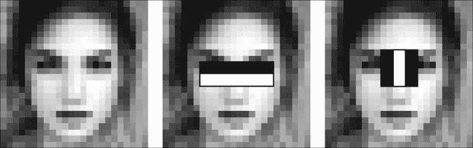
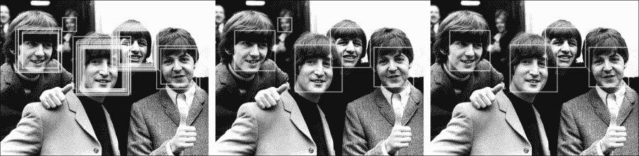
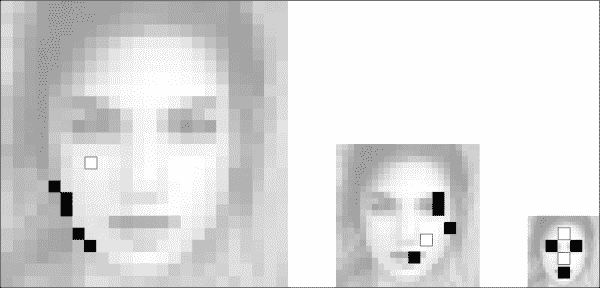
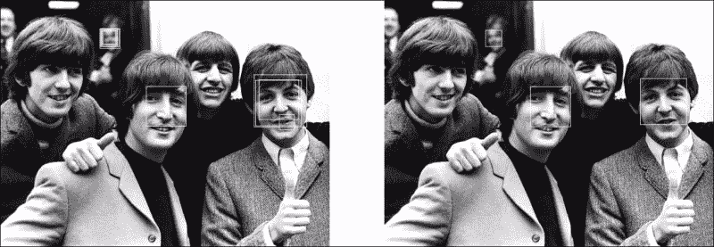
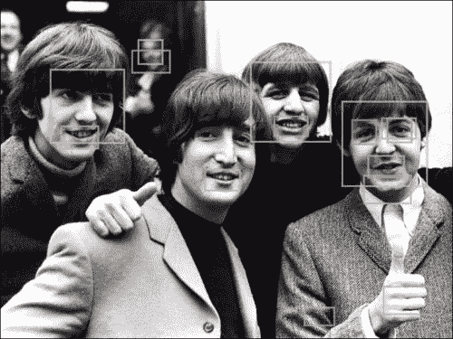
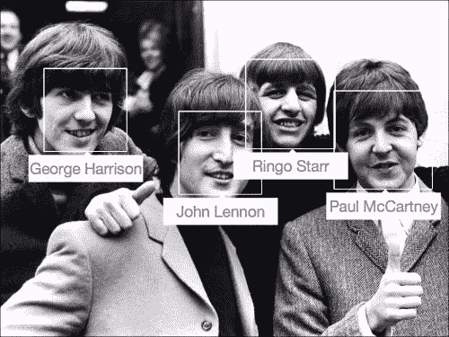
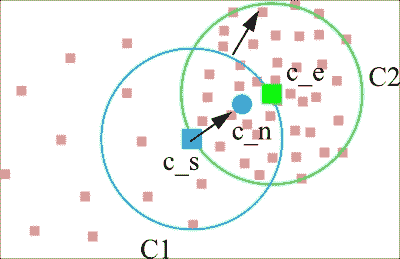
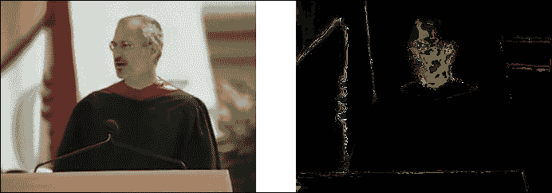
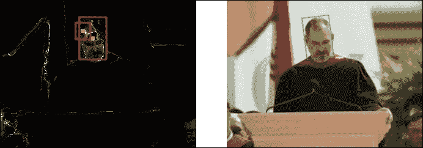
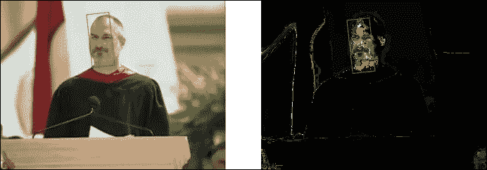

# 第四章。微笑和挥手，您的脸部已被跟踪！

在我们的生活中最常见的对象之一是人脸。我们与人们的互动无处不在，即使我们没有亲自见面；我们通过社交媒体，如 Twitter 和 Facebook，或通过手机发送大量消息，如电子邮件和短信。人脸检测和跟踪有许多应用。在某些情况下，你可能想创建一个人机界面，它将头部位置作为输入，或者更有可能的是，你可能想帮助你用户标注他们的朋友。实际上，有很多用 JavaScript 编写的人脸检测库；这些库的数量超过了专注于图像处理的库。这是一个选择你真正需要的库的好机会。除了人脸检测外，许多库还支持人脸粒子识别和其他对象的识别。

在本章中，我们将重点关注 JSFeat ([`inspirit.github.io/jsfeat/`](http://inspirit.github.io/jsfeat/))、tracking.js ([`inspirit.github.io/jsfeat/`](http://inspirit.github.io/jsfeat/)) 和 headtrackr ([`github.com/auduno/headtrackr`](https://github.com/auduno/headtrackr)) 库。最后一个库支持头部跟踪而不是仅仅识别。大多数库都专注于 Haar-like 特征检测。

通过几个示例，我们将在本章中涵盖以下主题：

+   使用 JSFeat 进行人脸检测

+   使用 tracking.js 标注人物

+   使用 Camshift 进行头部跟踪

# 使用 JSFeat 进行人脸检测

在上一章中，我们看到了各种对象的检测。人脸比普通的颜色对象要复杂得多，例如。更复杂的检测器在诸如使用亮度信息和这些信息形成的模式等方面有共同之处。首先，我们需要了解人脸识别是如何进行的。没有这个，跟踪过程将很难理解。实际上，在大多数情况下，人脸识别部分只是人脸跟踪算法的第一步。

我们从 JSFeat 项目开始。这个出色的库提供了两种检测人脸的功能。这两种方法在现实世界中都有很多应用。我们将从内部了解这两种方法的工作原理，并讨论 JSFeat 提供的 API。

## 使用 Haar-like 特征进行人脸检测

这可能是现在最流行的面部检测器。大多数库都使用这个算法作为通用的面部检测器。它易于实现和使用。除此之外，它可以在任何应用程序中使用，因为它在人脸检测方面提供了良好的精度。该方法本身形成了一个 Viola-Jones 对象检测框架，该框架由保罗·维奥拉和迈克尔·琼斯于 2001 年提出。

记得第二章中的卷积核吗？“将您的浏览器变成 Photoshop”？看看这张图片：


这些矩形被称为 Haar-like 特征或 Haar 特征。它们只是卷积核，其中我们从白色矩形下的像素中减去，并在黑色部分下添加像素。为了快速计算它们，我们使用积分图像。如果你不记得这个概念，那么你最好通过参考第二章中的*什么是滤波以及如何使用它*部分下的积分图像部分来刷新您的记忆，*将您的浏览器变成 Photoshop*。简而言之，积分图像在快速计算图像矩形区域像素总和方面提供了大量支持。

我们也可以使用图片右侧显示的特征。它们被旋转了 45 度。在这种情况下，我们使用倾斜积分。它们可以捕捉到更多的物体细节。倾斜特征的功能在大多数库中都是可用的。但是，有一个问题阻止了它在实际应用中的使用——Haar 特征通常应用于图像的低分辨率部分，例如，20 x 20 或 24 x 24；当我们旋转一个特征（或积分图像）时，我们可能会遇到舍入误差。正因为如此，这些特征在实践中很少被使用。

这些特征如何帮助我们呢？使用它们，我们可以通过选择物体的独特特征来描述一个物体。例如，你可以在以下图像中看到低分辨率的普通女性面部：



通常，眼睛部分比下部分要暗。此外，鼻子比眼睛和眉毛要亮。我们已经找到了两个独特的面部特征！

对于输入图像，我们使用滑动窗口来应用这些核并检查窗口中的物体是否为面部。我们需要对所有可能的核的大小和位置进行检查，这在实际上是不可能的。即使对于 24 x 24 的窗口，我们也需要检查超过 160,000 个特征。当然，有一个解决方案。我们需要训练一个分类器，并只保存与检测到的物体相关的特征，在我们的例子中，它是一个面部。不幸的是，JavaScript 库不提供这样的功能。实际上，它们不需要这样做，因为我们使用的库已经包含了大多数必要的面部检测分类器。此外，训练时间可以从几小时到几个月不等。然而，如果你需要检测其他东西或提高检测精度，那么你可能想看看其他库，例如，OpenCV ([`opencv.org`](http://opencv.org))。它们提供了训练你自己的分类器的功能。

简而言之，在训练过程中，算法检查所有可能的大小和位置的特征，并选择其中描述对象的最佳特征。在第一步之后，我们得到数千个特征。然而，这仍然太多。下一步提供了这个问题的解决方案。我们将这些特征分组到分类器的不同阶段。当算法检查滑动窗口时，算法会逐个评估每个组。如果第一个组检查失败，那么我们丢弃该窗口并继续到另一个。整个过程结构被称为 **分类器级联**。最终，训练过程显著减少了需要检查的特征数量。

为了使算法具有尺度不变性，它使用各种窗口大小应用。不幸的是，该算法不具有旋转不变性。你可以尝试通过旋转源图像来应用它，但在这种情况下，你可能会得到不正确的结果。

现在，你对整个算法的工作原理有了一定的了解。让我们看看我们如何通过以下步骤在 JSFeat 库中应用它：

1.  首先，我们需要定义我们想要检测的对象。在我们的例子中是面部。为了设置对象，我们需要添加一个 JavaScript 文件：

    ```py
    <script src="img/frontalface.js"></script>
    ```

1.  然后，在代码中设置分类器。它包含级联、原始窗口大小和倾斜积分标志，如果需要的话：

    ```py
    var classifier = jsfeat.haar.frontalface;
    ```

1.  接下来，我们从上下文中获取图像数据：

    ```py
    var imageData = context.getImageData(0, 0, cols, rows);
    ```

1.  然后，我们定义一个图像并将其转换为灰度：

    ```py
    var mat = new jsfeat.matrix_t(cols, rows, jsfeat.U8C1_t);
    jsfeat.imgproc.grayscale(imageData.data, cols, rows, mat);
    ```

1.  有时，增加图像对比度并移除一些噪声是一个好选择，这可以按以下方式完成：

    ```py
    jsfeat.imgproc.equalize_histogram(mat, mat);
    jsfeat.imgproc.gaussian_blur(mat, mat, 3);
    ```

1.  我们首先为积分预定义数组：

    ```py
    var integralSum = new Int32Array((cols + 1) * (rows + 1));
    var integralSqSum = new Int32Array((cols + 1) * (rows + 1));
    var integralTilted = new Int32Array((cols + 1) * (rows + 1));
    jsfeat.imgproc.compute_integral_image(mat, integralSum, integralSqSum, classifier.tilted ? integralTilted : null);
    ```

1.  仔细看看我们在这里做了什么。我们只在分类器设置为 `true` 时计算倾斜积分。有一部分是不需要的，但在某些情况下，它有助于加快计算速度并移除噪声元素。我们将使用 Canny 边缘检测器和其积分来检查边缘密度：

    ```py
    var integralCanny = new Int32Array((cols + 1) * (rows + 1));
    var edges = new jsfeat.matrix_t(cols, rows, jsfeat.U8C1_t);
    jsfeat.imgproc.canny(mat, edges, 10, 50);
    jsfeat.imgproc.compute_integral_image(edges, integralCanny, null, null);
    ```

1.  如果窗口中的边缘数量少于边缘密度。那么程序将跳过该窗口，而不会检查 Haar 特征。你可以在 JSFeat 中设置密度阈值如下：

    ```py
    jsfeat.haar.edges_density = 0.13;
    ```

1.  接下来，我们设置其他参数并调用函数：

    ```py
    var minScale = 2;
    var scaleFactor = 1.1;
    var bb = jsfeat.haar.detect_multi_scale(integralSum, integralSqSum, integralTilted, integralCanny,
            mat.cols, mat.rows, classifier, scaleFactor, minScale);
    ```

如果你查看 frontalface.js 文件，你会看到原始窗口大小是 20 x 20 像素，但我们根据前面的代码块设置了 `minScale` 变量，假设没有小于 40x40 像素的面。`scaleFactor` 变量是缩放因子的值。当窗口增加到图像大小时，过程停止。

该算法为每个面部返回多个矩形。为什么？因为当算法移动窗口时，移动可能太小，不足以对图像产生重大影响。JSFeat 库提供了一个方法来分组这些矩形，其中最后一个参数表示结果应该有多少个邻居才能与另一个分组：

```py
bb = jsfeat.haar.group_rectangles(bb, 1);
```

此外，该算法为每个检测返回置信度，如果我们只想打印最佳检测，那么我们可以对结果数组进行排序，并只打印最自信的检测：

```py
jsfeat.math.qsort(bb, 0, bb.length - 1, function (a, b) {
    return (b.confidence < a.confidence);
});
for (var i = 0; i < maxFaceNumber; ++i) {
    var b = bb[i];
    context.strokeStyle = "#fff";
    context.strokeRect(b.x, b.y, b.width, b.height);
}
```

将此应用于图像后，我们得到以下结果：



在第一幅图像中，我们没有分组就画了所有矩形；看看我们检测到了多少张脸？不同的尺寸代表不同的窗口尺度。在第二幅图像中，我们在分组后画了脸。已经足够好了，不是吗？而对于最后一幅，我们选择了四个最自信的检测。

如我们所见，该算法有许多有趣的组成部分，它确实有助于在照片中检测人脸。该算法有各种实现。此外，这种方法有许多扩展。我们将在下一节讨论其中之一。

## 亮度二值特征

从章节名称中，你可以推断出这种方法是通过图像亮度的变化来工作的，可能涉及到像素，并且它将这些强度值进行比较以获得某种二进制检查。你完全正确！在某种程度上，它就像获取 FAST 角点，但整个想法要复杂得多。让我们来讨论一下。

亮度二值特征与 Haar 特征之间的主要区别在于它使用独立的像素而不是卷积。此外，它使用不同的图像金字塔而不是不同的滑动窗口大小来计算所需特征。

你可以从以下图像中获取一些想法：



我们保留了所有三幅图像的分辨率以获得更好的视觉效果。但你需要记住，这些图像是 24x24、12x12 和 6x6 像素。此外，白点和黑点代表像素。

在这里，想法与你在学习 Haar 特征时看到的是非常相似的。例如，眼睛比其他面部颗粒要暗得多，因此我们将其标记为暗点或黑点。一个对象的正确实例必须遵循以下规则：窗口中的所有白点 i 和黑点 j 应满足表达式 `I(i) > I(j)`，其中 `I(position)` 是窗口在此位置的像素值。

点的数量可能会有所不同，它是在分类器训练过程中选择的。分类器的格式与 Haar 特征的格式不同。训练过程要复杂得多，因为它需要获取各种点组合。如果你想要训练自己的分类器，你可能想要遵循 CCV 库（[`libccv.org/doc/doc-bbf/`](http://libccv.org/doc/doc-bbf/））。这是一个提供各种计算机视觉算法实现的 C 库。

要找到一个 BBF 算法的实现比较困难，因为它更复杂，训练过程也更困难。此外，JSFeat 库也提供了相同的算法。首先，你需要包含分类器文件：

```py
<script src="img/bbf_face.js"></script>
```

然后，在计算开始之前，你需要预分配一些数据：

```py
jsfeat.bbf.prepare_cascade(jsfeat.bbf.face_cascade);
```

如往常一样，我们处理灰度图像；我们使用标准的 JSFeat 函数来获取一个：

```py
var imageData = context.getImageData(0, 0, cols, rows);
var mat = new jsfeat.matrix_t(cols, rows, jsfeat.U8C1_t);
jsfeat.imgproc.grayscale(imageData.data, cols, rows, mat);
```

其中一个重要步骤是生成图像金字塔。输入参数包括：输入图像、金字塔中图像的最小尺寸和间隔。它设置了金字塔中原始尺度级别数量；这个数字越大，你得到的金字塔级别就越多：

```py
var pyramid = jsfeat.bbf.build_pyramid(mat, minWidth, minHeight, interval);
```

然后调用一个函数，该函数以图像金字塔和级联作为输入参数。完成所有这些后，我们将生成的矩形分组在一起：

```py
var bb = jsfeat.bbf.detect(pyramid, jsfeat.bbf.face_cascade);
bb = jsfeat.bbf.group_rectangles(bb, 1);
```

这里是我们使用图像得到的结果：



对于第一部分，我们没有进行矩形分组就取了结果，对于第二部分，我们进行了分组。至于 Haar 特征，你可能只想选择最自信的结果。

在前面的图像中，我们看到与 Haar 特征相比，结果表现不佳。很难说为什么会得到这样的结果。在许多情况下，它高度依赖于实现或分类器训练，或者可能只是输入图像。

我们看到了两种不同的算法，你可以根据自己的选择选择一个。可能最好坚持使用 Haar 特征，因为你将找到很多该算法的实现。相比之下，如果你想扩展计算机视觉的实践边界，你可能想要调整 BBF 实现，或者只是编写你自己的。这完全取决于你！

# 使用 tracking.js 标记人员

要了解更多关于 Haar-like 特征及其实现的信息，我们将讨论 tracking.js 库。它提供了几乎与 JSFeat 库相同的功能。有趣的是，它为其他不同的对象提供了分类器，例如，面部粒子。最终，我们将看到如何使其能够标记朋友。

## Haar 特征与 tracking.js

Tracking.js 不仅能够检测面部，还能检测各种面部粒子。这非常容易做到。你需要执行以下步骤：

1.  首先，你需要添加你想要检测的对象文件：

    ```py
    <script src="img/face.js"></script>
    <script src="img/eye.js"></script>
    <script src="img/mouth.js"></script>
    ```

1.  接下来，初始化`ObjectTracker`函数。我们之前没有讨论这个，因为它主要关注的是面部检测，而不仅仅是普通对象。无论如何，我们用我们想要跟踪的对象的名称来初始化它：

    ```py
    var tracker = new tracking.ObjectTracker(['face', 'eye', 'mouth']);
    ```

1.  还有你可以调用的自定义函数。其中之一是`setStepSize`函数，它设置滑动窗口的步长或跟踪.js 库块中称之为的：

    ```py
    tracker.setStepSize(1.2);
    ```

1.  我们接着定义后处理函数。我们需要在画布上绘制我们的结果：

    ```py
    tracker.on('track', function (event) {
        event.data.forEach(function (rect) {
            plot(rect.x, rect.y, rect.width, rect.height);
        });
    });
    ```

    我们还需要`plot`函数本身：

    ```py
    var canvas = document.getElementById('initCanvas');
    var context = canvas.getContext('2d');
    function plot(x, y, w, h) {
        context.lineWidth = 3;
        context.globalAlpha = 0.8;
        context.strokeStyle = "#fff";
        context.strokeRect(x, y, w, h);
    }
    ```

正如我们提到的，没有功能可以以不同的颜色绘制不同的对象。目前，你可以通过同时创建几个不同的跟踪器来操作不同的对象。最终，你需要做的最后一件事是在画布上调用`track`函数：

```py
tracking.track('#initCanvas', tracker);
```

有各种你可以使用的函数：

+   `setEdgesDensity`：这与 JSFeat 库中的相同，你只需为滑动窗口边缘的密度设置一个阈值。这可能会显著提高结果；值越高，窗口需要包含的边缘越多，才能成为我们想要找到的对象的候选者。

+   `setInitialScale`：这是滑动窗口的初始比例。

+   `setScaleFactor`：这是滑动窗口的比例因子。

使用这些函数，您可以调整算法以获得更好的结果。

我们通过逐一应用三个检测器来测试算法。对于面部、眼睛和嘴巴，我们分别使用了红色、蓝色和绿色。以下是结果：



如您所见，面部检测结果比面部粒子的结果要好得多。这可能是因为照明条件不佳或分类器训练不当。

# 在照片中标记人物

在照片中标记人物是一个常见的程序，您在社交网络中经常使用它。如果您想在您的网站上创建类似的功能，JavaScript 世界可以为您提供一些东西。实际上，您可以使用任何提供面部检测方法的库来完成这项工作，您只需编写一些额外的函数。为了简化代码，我们将遵循 tracking.js 库的一个示例。它易于理解和实现：

1.  首先，我们需要将我们的图像放置到 HTML 代码中：

    ```py
    <div id="photo"></div>
    ```

1.  这是一个包含所有需要标记的名称的数组：

    ```py
    var theBeatles = ['George Harrison', 'John Lennon', 'Ringo Starr', 'Paul McCartney'];
    ```

1.  然后，我们从初始化`ObjectTracker`函数为一个`face`对象开始：

    ```py
    var tracker = new tracking.ObjectTracker('face');
    ```

1.  所有的魔法都在后处理函数中发生：

    ```py
    tracker.on('track', function (event) {
        var data = event.data;
        data.sort(function (a, b) {
            return b.x – a.x;
        });
        data = data.filter(function (el) {
            return el.width >= 50;
        });
        data.forEach(function (rect) {
            tag(rect.x, rect.y, rect.width, rect.height);
        });
    });
    ```

1.  让我们稍微回顾一下。首先，我们根据 x 坐标对所有矩形进行排序，当我们知道检测的顺序时，绘制结果会容易得多。

1.  接下来，我们过滤我们的对象数组，跳过所有宽度小于必须为“50”像素的检测。这将帮助我们排除背景或噪声检测。此外，我们提供了一个新的`tag`函数，它将在照片上标记所有检测。请看以下代码：

    ```py
    var img = document.getElementById('img');
    var tag = function (x, y, w, h) {
        var rect = document.createElement('div');    
        var input = document.createElement('input');

        input.value = theBeatles.pop();
        rect.appendChild(input);
        imageContainer.appendChild(rect);
        rect.style.width = w + 'px';
        rect.style.height = h + 'px';
        rect.style.left = (img.offsetLeft + x) + 'px';
        rect.style.top = (img.offsetTop + y) + 'px';
        rect.style.position = 'absolute';
        rect.style.border = '3px solid white';
    };
    ```

    函数为名称创建一个`<input>`标签，然后取数组的第一个元素并将输入元素追加到`<div>`矩形中。

1.  我们最后需要做的是在图像上调用我们的跟踪器：

    ```py
    tracking.track(img, tracker);
    ```

这是结果：



如您所见，我们已经成功移除了背景检测，并按正确顺序标记了所有四个人。

# 使用 Camshift 进行头部跟踪

头部跟踪是计算机视觉领域的一个巨大主题。当您想要创建人机界面时，它非常有用。例如，它通常用于网页游戏中的移动对象或控制 3D 界面。对象检测和跟踪之间有一些区别。首先，跟踪仅在视频中工作，因为您在每个帧中跟踪一个对象（不是重新估计）一个新实例。因此，我们需要假设我们跟踪的对象与上一帧中的相同。

可以对多个对象进行跟踪，但在这里我们将专注于单个对象，在我们的例子中，它是一个头部或更准确地说——面部。有一个很棒的库可以帮助我们跟踪它。它被称为 headtrackr ([`github.com/auduno/headtrackr`](https://github.com/auduno/headtrackr))。除了面部跟踪外，它还提供了一个功能，可以帮助使用头部运动来控制你的浏览器应用程序。在这里，我们不会关注运动估计部分，因为本章的重点是面部检测和跟踪。但不用担心，我们将在下一章中涉及这一点。首先，我们将看到跟踪算法是如何工作的，然后我们将关注其实际示例。

## 头部跟踪背后的理念

虽然有许多对象跟踪算法，但大多数由于计算复杂度，并不适合 JavaScript 和网页浏览器。对于 Haar 特征，以旋转不变的方式应用它们非常困难，因为当你对几个倾斜的图像这样做时，算法就变得不是实时了。headtrackr 库倾向于解决这个问题。它引入了一个框架，可以帮助你跟踪面部。它的主要重点是创建一个用户界面，但它提供了足够的灵活性，也可以用于其他任务。

跟踪是如何工作的？假设你在初始帧中找到了一个对象，例如，使用 Haar 特征或另一种方法。我们可以处理一个视频文件或只是一个网络摄像头。在这种情况下，相邻帧之间的差异不会太大。这些都是我们的核心假设，让我们继续前进。

在这里，我们将讨论对象，而不仅仅是面部。让我们假设我们的对象是一组点，我们想要在下一帧中找到这组点。看看下面的图像：



圆形（窗口）**C1**是对象在上一帧中的位置。圆形**C2**绑定我们要找的点组。如果我们通过将它们的*x*和*y*坐标相加，并将它们的和除以该圆中点的数量，在**C2**圆中得到一个总和，我们将得到点**c_n**，这被称为**质心**。在你找到质心后，我们将起始圆心**c_s**移动到新的中心**c_n**。该算法通过找到新的质心继续迭代过程，直到最终收敛到中心**c_e**。你已经在新的帧中找到了我们对象的位置！这种寻找点密度中心的算法被称为**Meanshift**。

当我们使用面部时，如何为 Meanshift 算法获取密度？常见的方法是生成一个皮肤图，如下面的图像所示：



在右侧的图像中，每个像素代表这个像素是皮肤点的概率。让我们称它为密度图。我们使用这些强度点在一个窗口中获取质心位置。

你能看出 Meanshift 方法的问题吗？我们没有改变窗口的大小。如果一个物体离相机更近或更远呢？我们需要以某种方式调整物体的大小。这个问题是通过**CAMshift**（**连续自适应 Meanshift**）算法解决的。算法的第一个阶段是 Meanshift 方法。当我们找到具有最高密度的窗口时，Camshift 算法会根据该窗口中强度值的总和更新窗口大小。强度越高，窗口中的非零点越多，输出的大小就越大。毕竟，窗口会收敛到所需的目标。此外，该算法还提供了使用密度图计算可能头部旋转的功能。

看看下面的图片：



第一个显示了原始矩形（较小的那个）和 Camshift 的最终检测。右侧的图像显示了矩形角度计算后的结果。

headtrackr 库可以通过两种方式初始化 Meanshift 算法：

+   用户手动在视频中选取一个物体，并使用用户输入进行跟踪。

+   该算法可以使用 Haar 特征来检测要跟踪的面部。

我们将看到一个示例，使用第二种方法，当使用 Haar 特征自动检测第一帧中的面部时，对于其他帧，库使用 Camshift 方法。

## 头部跟踪应用程序

使用 headtrackr 库相对容易。它提供了一种灵活的方式来创建头部跟踪应用程序。我们将讨论它提供的 API 和机会：

1.  我们需要做的第一件事是添加一个 headtrackr 脚本。Haar 检测器已经包含在其中：

    ```py
    <script src="img/headtrackr.js"></script>
    ```

1.  接下来，我们需要定义 HTML 输入，这样我们就可以轻松显示内容：

    ```py
    <canvas id="buffer" width="320" height="240" style="display:none"></canvas>
    <video id="inputVideo" autoplay loop width="320" height="240"></video>
    <canvas id="overlay" width="320" height="240"></canvas>
    <canvas id="debug" width="320" height="240"></canvas>
    ```

    第一个将包含库所需的数据。视频文件将包含视频。其他两个标签是可选的，第三个提供了一个画布，可以在其上绘制跟踪结果的矩形。最后一个用于显示密度图像。

1.  如果你想，你可以为 headtrackr 输出文本添加一个标签，在工作过程中会显示各种消息，这样你就可以了解跟踪器所处的阶段：

    ```py
    <span id='headtrackerMessage'></span>
    ```

1.  之后，我们需要在 JavaScript 端获取所有必要的数据：

    ```py
    var canvasInput = document.getElementById('buffer');
    var videoInput = document.getElementById('inputVideo');
    var canvasOverlay = document.getElementById('overlay');
    var overlayContext = canvasOverlay.getContext('2d');
    var debugOverlay = document.getElementById('debug');
    canvasOverlay.style.position = "absolute";
    canvasOverlay.style.top = '0px';
    canvasOverlay.style.zIndex = '100001';
    canvasOverlay.style.display = 'block';
    ```

    画布应该在视频上方，所以我们将其样式设置为如此。

1.  接下来，你需要初始化跟踪器参数：

    ```py
    var htracker = new headtrackr.Tracker({
        altVideo: {webm: "/path/to/your/video.webm"},
        calcAngles: true,
        ui: true,
        debug: debugOverlay
    });
    ```

    有很多参数，我们将关注在这个例子中有用的那些。默认情况下，headtrackr 库与网络摄像头一起工作。如果你没有或者你的浏览器不支持，你可以使用`altVideo`参数提供一个视频文件。为了计算头部角度，我们使用`calcAngles`变量，默认值为`false`。`ui`参数为具有`headtrackerMessage` id 的标签设置调试消息。对于密度图像，我们需要设置`debug`参数。

1.  接下来，我们使用视频和画布输入初始化跟踪器。然后，我们开始跟踪：

    ```py
    htracker.init(videoInput, canvasInput);
    htracker.start();
    ```

1.  要停止跟踪过程，你可以使用`stop`函数。在这种情况下，库将重新启动整个过程：

    ```py
    htracker.stop();
    ```

1.  要使用叠加显示结果，我们需要向`facetrackingEvent`添加一个监听器。此外，你还可以看到我们如何获取矩形的旋转版本：

    ```py
    document.addEventListener("facetrackingEvent", function (event) {
        overlayContext.clearRect(0, 0, 320, 240);
        if (event.detection == "CS") {
            overlayContext.translate(event.x, event.y);
            overlayContext.rotate(event.angle - (Math.PI / 2));
            overlayContext.strokeStyle = "#00CC00";
            overlayContext.strokeRect((-event.width / 2) >> 0, (-event.height / 2) >> 0, event.width, event.height);
            overlayContext.rotate((Math.PI / 2) - event.angle);
            overlayContext.translate(-event.x, -event.y);
        }
    });
    ```

结果包括一个带有叠加的视频和右侧的调试信息：



如你所见，使用该库应用头部跟踪并没有什么困难。要正确使用库，你只需要了解算法的一些部分。

# 摘要

一张脸是一个非常复杂的目标。为了检测和跟踪它，你需要使用新的算法级别。幸运的是，JavaScript 库通过 Haar、亮度二值化特征、Meanshift 和 Camshift 算法提供了这样的机会。它们各自都有其应用领域。你可以在不同的程序中应用这些奇妙的方法，例如，人物标记。我们已经讨论了它们，并提供了你可以立即开始使用的示例。除了人脸检测，还有潜力检测其他对象，如人脸粒子。当然，检测质量可能会有很大差异，当你使用其他分类器时应该小心。

在本章中，我们已经简要介绍了跟踪应用，并讨论了跟踪如何帮助创建人机界面。在下一章中，我们将学习如何通过动作控制浏览器，以及如何在这些应用中使用对象跟踪。
