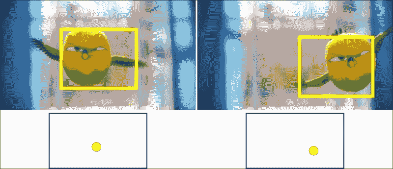
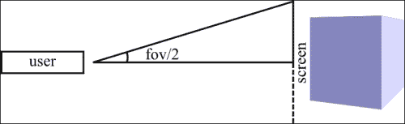
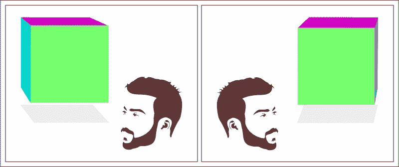
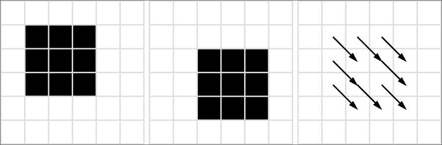
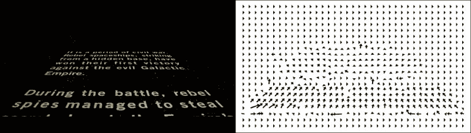
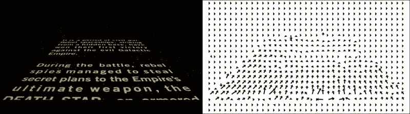
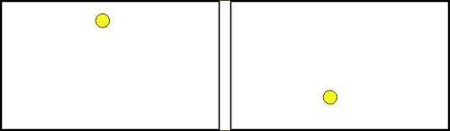
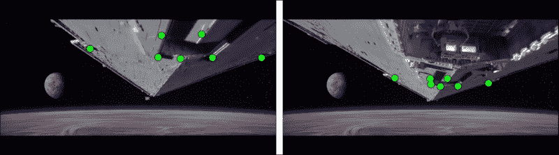
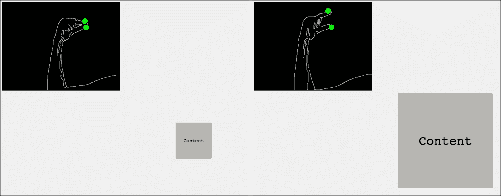

# 第五章。愿 JS 与你同在！用运动控制你的浏览器

想象一下，如果能够不用键盘和鼠标就能控制你的浏览器，那将有多么激动人心。计算机科学中有许多领域倾向于创造良好的人机界面。其中之一是计算机视觉。它提供了出色的方法，可以帮助你快速创建有用的东西，而且你甚至不需要像 Kinect 这样的设备！计算机视觉中的人机界面高度依赖于对象跟踪。在前一章中，我们已经看到了一些对象跟踪的示例，例如 Camshift。在这里，我们将介绍更多的算法来探索。首先，我们将从基本的跟踪算法开始，这些算法对前一帧中的对象没有任何假设。接下来，我们将转向**头部耦合透视**；这是一种使用头部（或眼睛）位置在屏幕上模拟 3D 环境的技术。这将由我们在前一章中提到的 headtrackr 库来完成（[`github.com/auduno/headtrackr`](https://github.com/auduno/headtrackr)）。最后，我们将转向光流算法，借助这些算法，你可以在你的应用程序中跟踪许多不同的对象，甚至创建可以通过手势控制的程序。我们将创建一个有趣的示例，展示这种类型的控制。在这里，我们将介绍一个新的库（[`github.com/anvaka/oflow`](https://github.com/anvaka/oflow)），它提供了一种生成图像光流的好方法。为了同时跟踪多个点，我们将使用 JSFeat（[`inspirit.github.io/jsfeat/`](http://inspirit.github.io/jsfeat/)）库。让我们开始吧！

我们在本章中将涵盖以下主题：

+   使用 tracking.js 进行基本跟踪

+   通过头部运动控制对象

+   用于运动估计的光流

# 使用 tracking.js 进行基本跟踪

在本节中，我们将回顾关于对象检测的知识，并创建一个示例项目，展示如何将对象检测呈现为对象跟踪。这是一个相对简单的话题，但在某些情况下，它可能优于其他方法。记住，对象检测涉及检测对象的实例，而跟踪涉及随时间定位移动的对象。如果你只有一个独特的对象，并且你假设它在下一帧中仍然独特，那么你可以计算其随时间的位置。在这种情况下，我们不需要担心跟踪技术，因为跟踪可以使用对象检测来完成。在这里，我们将主要关注 tracking.js 库（[`trackingjs.com`](http://trackingjs.com)），因为它提供了最简单的方式来做到这一点。

## 一个对象跟踪应用的示例

我们已经提到了使用物体检测作为跟踪的想法。这个想法是使用场景中的一个独特物体。这可能是一个彩色球，你的头部，手，或者任何有特殊之处并能帮助区分场景中其他物体的东西。当你拥有那个物体时，你只需在帧上检测它并计算其质心来获取其位置。

为了探索这个概念，我们将使用 tracking.js 库。我们将绘制一个以检测到的物体质心为中心的小球。

首先，我们将放置视频和球场景所需的必要标签：

```py
<video id='video' width='640' height='480' preload autoplay>
    <source src="img/video.mp4">
</video>
<canvas id='ballCanvas' width='640px' height='480px'></canvas>
```

我们需要获取球体的上下文及其参数，以便能够在其上绘制：

```py
var ballCanvas = document.getElementById('ballCanvas'),
        ballContext = ballCanvas.getContext('2d'),
        ballSceneW = ballCanvas.width,
        ballSceneH = ballCanvas.height;
```

我们想要跟踪的对象只是一个简单的彩色物体，因此我们将使用`ColorTracker`。为了去除噪声，我们将检测到的物体的最小尺寸设置为`20`：

```py
var tracker = new tracking.ColorTracker(['yellow']);
tracker.setMinDimension(20);
```

当我们检测到一个物体时，我们需要清除包含球的上下文。此外，我们使用第一个检测到的物体将球移动到新的位置：

```py
tracker.on('track', function (event) {   
    ballContext.clearRect(0, 0, ballSceneW, ballSceneH);
    if (event.data.length > 0)
        move(event.data[0]);
});
```

`move`函数定义在以下代码中：

```py
function move(rect) {
    ballContext.beginPath();
    var ballX = rect.x + rect.width / 2;
    var ballY = rect.y + rect.height / 2;
    ballContext.arc(ballX, ballY, 30, 0, 2 * Math.PI, false);
    ballContext.fillStyle = 'yellow';
    ballContext.fill();
    ballContext.stroke();
}
```

正如我们所见，我们取检测到的矩形的中心，并使用它来画一个球。

要启动跟踪器，我们只需在`<video>`标签上使用`track`函数来初始化它：

```py
tracking.track('#video', tracker);
```

在这里，我们没有在视频上放置显示跟踪物体的代码，因为我们已经在第三章中介绍了它，*面向所有人的简单物体检测*。

这是我们的结果：



前面的图像显示了在不同帧中检测到的鸟以及对应检测下方估计的球的位置。正如我们所见，我们对物体（鸟）独特性的主要假设得到了观察。唯一的问题是关于跟踪——鸟的头没有被完美地检测到。

我们看到了基本的物体检测，这使我们更接近跟踪，但还不是 100%。我们需要做的是记住先前物体位置的旧坐标并计算运动向量。让我们继续前进！

# 通过头部运动控制物体

在计算机视觉中创建一个用户界面不是一个容易的任务。其中一个令人兴奋的领域是头部耦合透视。这项技术用于在屏幕上渲染场景，它对观众相对于显示器的头部位置变化做出自然反应。简单来说，这项技术创建了一个 3D 显示，除了相机之外不需要任何额外的设备。

在上一章中，我们看到了如何使用 headtrackr 库跟踪头部。这是通过 Camshift 算法完成的。在本节中，我们将解释头部耦合视角函数的背景以及如何在项目中使用它来创建令人惊叹的人机界面。为了呈现场景，headtrackr 库使用了最流行的 JavaScript 3D 建模库之一——three.js（[`threejs.org`](http://threejs.org)）。我们将从解释核心功能开始，然后展示其使用示例。

## 头部耦合视角

如我们之前提到的，headtrackr 库与 three.js 库一起工作。three.js 库为 3D 建模提供了清晰的 API 和卓越的功能。如果您愿意，可以切换到另一个库，但那样的话，您将需要重写 headtrackr 库中的一些代码。

headtrackr 库提供了整个算法的良好解释；您可以在[`auduno.com/post/25125149521/head-tracking-with-webrtc`](http://auduno.com/post/25125149521/head-tracking-with-webrtc)中参考。为了帮助您更好地理解整个过程，以及如果您想修改头部跟踪的功能或使用其他库进行 3D 建模，这里我们将关注核心函数的代码。

函数本身被调用：

```py
headtrackr.controllers.three.realisticAbsoluteCameraControl
```

为了适当地改变场景的视角，我们需要知道头部在三个方向上的运动：*X*、*Y*和*Z*。为此，我们需要假设一些场景属性。该方法的核心假设是，在算法的第一次初始化时，坐在屏幕前的用户与相机之间的距离是 60 厘米。除此之外，该方法还定义了屏幕高度，默认为 20 厘米。使用这些参数，我们可以找到**视场**（**fov**）：



在场景中，我们将创建一个代表用户（您的头部）的相机；我们将称之为**场景中的相机**。不要将其与用于捕获您脸部的相机混淆，例如，笔记本电脑的摄像头。

视场角越大，屏幕上能容纳的物体就越多，它们看起来也越远。视场是在检测到头部时计算的第一帧，考虑到了之前提到的假设。

headtrackr 函数使用了一些参数：

+   **camera**: 这是来自 three.js 库的`PerspectiveCamera`对象。

+   **scaling**: 这是 3D 模型中屏幕的垂直尺寸。基本上，它通过您定义的常数来缩放整个场景。

+   **fixedPosition**: 这是场景相机的初始位置。

+   **lookAt**: 这是您所看物体的位置，它应该是包含一个物体三个坐标的 THREE.Vector3。

+   **params**: 这包括一个以厘米为单位的`screenHeight`字段。这是一个可选参数，它定义了您监视器的高度。

在算法初始化期间，首先，我们设置场景摄像头的位置和这个摄像头应该指向的物体的位置：

```py
camera.position.x = fixedPosition[0];
camera.position.y = fixedPosition[1];
camera.position.z = fixedPosition[2];
camera.lookAt(lookAt);
```

接下来，我们使用摄像头的纵横比和缩放参数定义屏幕宽度和高度：

```py
var wh = screenHeight_cms * scaling;
var ww = wh * camera.aspect;
```

要在每一帧中获取头部位置，我们需要向`headtrackingEvent`添加一个监听器：

```py
document.addEventListener('headtrackingEvent', function (event) {
...
// function body
...
});
```

headtrackr 库在每个帧中返回一个头部位置的估计值。事件包含`x`、`y`和`z`字段。

由于我们的摄像头代表我们的头部位置，为了更新其参数，我们需要根据事件数据更改摄像头的位置；不要忘记缩放：

```py
camera.position.x = fixedPosition[0] + event.x * scaling;
camera.position.y = fixedPosition[1] + event.y * scaling;
camera.position.z = fixedPosition[2] + event.z * scaling;
```

您需要将一个物体保持在屏幕中央。为此，该方法使用`setViewOffset`方法设置视图偏移。前两个参数定义了整个视图的大小，最后四个参数是视图矩形的参数：

```py
var xOffset = event.x > 0 ? 0 : -event.x * 2 * scaling;
var yOffset = event.y < 0 ? 0 : event.y * 2 * scaling;
camera.setViewOffset(ww + Math.abs(event.x * 2 * scaling), wh + Math.abs(event.y * 2 * scaling), xOffset, yOffset, ww, wh);
```

我们想要更新的最后一个属性是视野，我们使用`atan2`函数来更新它。它以弧度从`-PI`到`PI`返回结果；我们需要将其转换为度数并乘以`2`，因为我们只使用了屏幕的一半来计算：

```py
camera.fov = Math.atan2(wh / 2 + Math.abs(event.y * scaling), Math.abs(event.z * scaling)) * 180 * 2 / Math.PI;
```

然后，我们更新摄像头参数：

```py
camera.updateProjectionMatrix();
```

正如我们所见，我们所需做的只是与场景摄像头一起工作。如果您想修改代码或使用另一个库，现在对您来说应该不是问题。

## 控制一个简单的盒子

headtrackr 库提供的示例使用的是 three.js 的老版本，但优点是它也可以应用于新版本！我们将遵循立方体示例，该示例可在[`threejs.org/examples/#canvas_geometry_cube`](http://threejs.org/examples/#canvas_geometry_cube)找到。您可以从那里复制并粘贴整个代码；我们只会进行基本的修改。

首先，您需要更新脚本部分并添加 headtrackr 库：

```py
<script src="img/three.min.js"></script>
<script src="img/Projector.js"></script>
<script src="img/CanvasRenderer.js"></script>
<script src="img/headtrackr.js"></script>
```

要跟踪您的面部，您需要定义视频和画布标签，这些标签将被 headtrackr 库使用：

```py
<canvas id="compare" width="320" height="240" style="display:none"></canvas>
<video id="vid" autoplay loop></video>
```

three.js 示例中的场景摄像头的远平面对我们来说太近了，我们最好将其设置得远一些：

```py
camera.far = 10000;
```

跟踪过程的初始化是通过我们在上一节中审查的函数完成的；查看下面函数的第三个参数——摄像头位置。示例中的立方体位置是`[0, 150, 0]`，其尺寸为 200 像素。我们将摄像头的初始化位置设置为立方体平面：

```py
headtrackr.controllers.three.realisticAbsoluteCameraControl(camera, 20, [0, 150, 100], cube.position);
```

接下来，我们创建一个跟踪器：

```py
var htracker = new headtrackr.Tracker();
```

在上一节中，我们回顾了在跟踪面部时可以使用的参数。现在，让我们看看您可以用什么来估计头部位置：

+   **cameraOffset**：这是您的笔记本电脑摄像头到屏幕中央的距离，默认为 11.5 厘米（普通笔记本电脑屏幕高度的一半）。

+   **fov**：这是摄像头在度数上使用的水平视野。默认情况下，算法会自动估计这个值。

现在，我们在 JavaScript 侧获取视频和画布。然后，我们获取初始化并启动跟踪器：

```py
var videoInput = document.getElementById('vid');
var canvasInput = document.getElementById('compare');
videoInput.style.position = 'absolute';
videoInput.style.top = '50px';
videoInput.style.zIndex = '100001';
videoInput.style.display = 'block';
htracker.init(videoInput, canvasInput);
htracker.start();
```

这里是您在使用应用程序时将看到的粗略草图：



请记住，当您向左移动头部时，相机将显示向右的运动。您可以向任何方向移动头部，但这种方法唯一的问题是它不计算您眼睛的位置，因此图像不会像 3D 模型那样完美。这可以通过涉及跟踪眼睛的更高级技术来解决，但在这种情况下，JavaScript 应用程序的性能将不会是实时的。

# 光流用于运动估计

我们看到了如何在场景中跟踪不同的物体，以及如何使用它们来制作人机界面，但我们没有看到一个更通用的方法。当一个物体改变其位置时，它会穿过场景，估计场景的整体运动是有趣的。在这里，我们将介绍光流的概念，并展示如何将其用于物体跟踪。在第一部分，我们将关注理论，然后展示两个光流应用的精彩示例。最后，我们将创建一个简单的手势应用程序。

## Lucas-Kanade 光流

光流有许多定义，主要的一个是：它是由于眼球（相机）与场景之间的相对运动而导致图像结构强度变化（[`www.scholarpedia.org/article/Optic_flow`](http://www.scholarpedia.org/article/Optic_flow)）。根据另一个定义，它是图像中物体表观速度的分布（[`www.mathworks.com/discovery/optical-flow.html`](http://www.mathworks.com/discovery/optical-flow.html)）。为了理解这个概念，请看以下图像：



在这里，我们只是在移动一个方框，第三张图中的箭头显示了这种移动。简单来说，光流显示了物体的位移。它不仅可用于物体跟踪，还可用于视频压缩和稳定。此外，您还可以使用光流获取场景的结构。例如，如果您用移动的相机记录一个静态环境，靠近相机的物体比远离相机的物体改变目标位置的速度更快。

光流可以通过多种方式计算。光流算法的基本假设是相邻帧中的对象强度不会迅速变化。最流行的方法是 Lucas-Kanade 方法。除了之前的假设外，它还指出，在附近的帧中对象的位移不会很大。此外，该方法在每个像素周围取一个*NxN*的补丁，通常是 3x3，并假设所有这些像素的运动是相同的。利用这些假设以及补丁周围每个像素的像素强度变化（梯度）的知识，算法计算其位移。强度变化在*x*和*y*维度以及时间上计算。在这里，我们所说的“时间”是指前一帧和当前帧之间的差异。

这只是一个 3x3 的补丁吗？我们应该如何处理快速移动的物体？这个问题可以通过图像金字塔来解决。在这种情况下，我们将对图像进行下采样，并寻找与 3x3 补丁相同的运动，但分辨率更低。

另一个改进是迭代 Lucas-Kanade 方法。在为每个像素获取光流向量之后，我们通过这些向量移动像素，并尝试匹配前一帧和当前帧。在理想情况下，这些图像将被匹配，但鉴于真实视频，由于像素亮度的变化，可能会有错误。为了避免错误，我们在得到小的错误或超过最大迭代次数之前重复这个过程。

我们讨论了理论部分，现在让我们转向两个可以提供光流实现功能的惊人库。它们可以用作不同的目的。这两个库的核心是 Lucas-Kanade 方法。

## 光流地图 with oflow

我们从一个小的库——oflow ([`github.com/anvaka/oflow`](https://github.com/anvaka/oflow))——开始。这是一个简单的库，它只计算每个补丁的位移向量，并返回场景的整体运动。我们将使用这个运动来控制我们已经在本章中使用的球体。不幸的是，这个库不使用图像金字塔来计算光流，因此它更适合获取整个场景的运动而不是对象跟踪。

我们首先在我们的项目中定义库：

```py
<script src="img/oflow.js"></script>
```

如我们之前所做的那样，我们创建了一个视频输入和一个球体画布。除此之外，我们添加了一个用于显示光流地图的画布，其`id='flow'`：

```py
<div>
    <video id='videoOut' width='640' height='360' autoplay>
        <source src="img/video.mp4">
    </video>
    <canvas id='ballScene' width='320' height='190'></canvas>
</div>
<canvas id='flow' width='640' height='360'></canvas>
```

接下来，我们定义一个用于光流计算的物体。您不仅可以为如这里所示的视频创建它，还可以为网络摄像头（`WebFlow`）和画布（`CanvasFlow`）创建它。`zoneSize`变量定义了补丁的半维度，默认设置为`8`：

```py
var zoneSize = 8,
        videoElement = document.getElementById('videoOut');
var webCamFlow = new oflow.VideoFlow(videoElement, zoneSize),
```

这里是一个我们最终收到的简短示例——左边的视频和右边的光流方向：



每个箭头显示一个补丁的运动方向，当然，有一些噪声，但大多数方向显示的是正确的结果。我们如何接收结果？

在每个帧的计算完成后，我们需要处理结果。在以下内容中，我们为每个补丁接收方向。然后，我们画箭头指向补丁位移的方向；我们将该位移乘以四，以便更好地查看结果。你可以选择任何其他乘数，因为它仅用于显示光流，而不是实际计算：

```py
webCamFlow.onCalculated(function (direciton) {
    flowContext.clearRect(0, 0, sceneWidth, sceneHeight);
    for (var i = 0; i < direciton.zones.length; ++i) {
        var zone = direciton.zones[i];
        drawArrow(flowContext, zone, {x: zone.x + zone.u * 4, y: zone.y + zone.v * 4}, 2);
    }
```

为了计算整体位移，库只是将所有向量相加。使用公共向量，我们在其上下文中画一个球。如果球超出屏幕尺寸，我们就在对面画它。整体方向是通过结果的`u`和`v`字段返回的：

```py
    ballContext.clearRect(0, 0, ballSceneW, ballSceneH);
    ballContext.beginPath();
    ballX -= direciton.u;
    ballY += direciton.v;
    if (ballX < 0) {
        ballX = ballSceneW;
    }
    if (ballX > ballSceneW) {
        ballX = 0;
    }
    if (ballY < 0) {
        ballY = ballSceneH;
    }
    if (ballY > ballSceneH) {
        ballY = 0;
    }
    ballContext.arc(ballX, ballY, 10, 0, 2 * Math.PI, false);
    ballContext.fillStyle = 'yellow';
    ballContext.fill();
    ballContext.stroke();
});
```

要开始计算过程，只需调用以下函数：

```py
webCamFlow.startCapture();
```

在视频的几帧之后，我们得到以下结果：



这是在第一帧和最后一帧中球的位置，分别：



使用这个库，很容易创建一个由手势控制的简单游戏，例如。库的使用不仅限于这一点，你可以非常快地创建出不同的东西。

## 使用 JSFeat 跟踪点

JSFeat 库扩展了光流的功能，甚至可以跟踪图像点。你可以使用这些点来跟踪对象和控制浏览器。JSFeat 库中光流的实现使用带有金字塔的迭代 Lucas-Kanade 方法，它提供的结果非常平滑。

在 JSFeat 中，要处理视频，我们需要包含一个额外的 JavaScript 文件，该文件由这个库提供：

```py
<script src="img/compatibility.js"></script>
```

接下来，我们定义要处理的视频和用于显示内容的画布：

```py
<video id="vid" width="640" height="360" autoplay style="display: none">
    <source src="img/video.mp4"/>
</video>
<div>
    <canvas id="canvas" width="640" height="360"></canvas>
</div>
```

需要定义很多变量：

```py
var video = document.getElementById('vid');
var canvas = document.getElementById('canvas');
var context, canvasWidth, canvasHeight;
var curr_pyr, prev_pyr, count, status, prev_xy, curr_xy;
```

最右边的一行，从左到右显示：当前图像金字塔、上一级的图像金字塔、跟踪点的数量和点的状态。状态表示一个点是否在新的帧上有其表示；如果没有这样的点，则该方法假定该点的跟踪已丢失，并将其从跟踪过程中删除。最后两个变量包含上一帧和当前帧的点的坐标。

### 注意

我们在这里不提供选择原始点的函数，但你可以在 JSFeat 示例中看到它们：

[`github.com/inspirit/jsfeat/blob/gh-pages/sample_oflow_lk.html`](https://github.com/inspirit/jsfeat/blob/gh-pages/sample_oflow_lk.html).

以下函数初始化所有必要的变量：

```py
function init(videoWidth, videoHeight) {
    canvasWidth = canvas.width;
    canvasHeight = canvas.height;
    context = canvas.getContext('2d');
    context.fillStyle = "rgb(0,255,0)";
    curr_pyr = new jsfeat.pyramid_t(3);
    prev_pyr = new jsfeat.pyramid_t(3);
    curr_pyr.allocate(canvasWidth, canvasHeight, jsfeat.U8C1_t);
    prev_pyr.allocate(canvasWidth, canvasHeight, jsfeat.U8C1_t);
    count = 0;
    status = new Uint8Array(100);
    prev_xy = new Float32Array(100 * 2);
    curr_xy = new Float32Array(100 * 2);
}
```

要开始获取视频帧，我们需要调用以下函数：

```py
compatibility.requestAnimationFrame(process);
```

它使用`process`函数处理每个视频帧：

```py
function process() {
    compatibility.requestAnimationFrame(process);
    if (video.readyState === video.HAVE_ENOUGH_DATA) {
        context.drawImage(video, 0, 0, canvasWidth, canvasHeight);
        var imageData = context.getImageData(0, 0, canvasWidth, canvasHeight);
```

我们使用`curr_`前缀将点和平面变量从前一帧复制到带有`prev_`前缀的变量中：

```py
        var _points = prev_xy;
        prev_xy = curr_xy;
        curr_xy = _points;
        var _pyr = prev_pyr;
        prev_pyr = curr_pyr;
        curr_pyr = _pyr;
```

接下来，我们为当前帧计算一个图像金字塔：

```py
        jsfeat.imgproc.grayscale(imageData.data, canvasWidth, canvasHeight, curr_pyr.data[0]);
        curr_pyr.build(curr_pyr.data[0], true);
```

要调用光流函数，我们引入了四个该函数需要的额外变量。第一个变量是`win_size`，它是搜索流向量的补丁大小；`max_iter`变量是最大迭代次数；`eps`变量是当移动小于`eps`时停止更新点的算法；`min_eigen_threshold`变量是移除坏点的阈值。`process`函数在新的帧上计算新的点坐标。之后，我们调用`prune_oflow_points`函数。如果您继续视频，您可能会在未来帧上丢失一些点。在这种情况下，它们将不再被跟踪，并且将被此函数从`curr_xy`变量中移除：

```py
        var win_size = 20;
        var max_iter = 30;
        var eps = 0.01;
        var min_eigen_threshold = 0.001;
        jsfeat.optical_flow_lk.track(prev_pyr, curr_pyr, prev_xy, curr_xy, count, win_size, max_iter, status, eps, min_eigen_threshold);
        prune_oflow_points(context);
    }
}
```

这里是我们得到的结果：



如我们所见，所有点都成功跟踪了；这是一个理想的例子，其中对象移动得非常平滑。在许多情况下，点可以被正确跟踪，尤其是如果视频没有被编辑的话。

库的功能提供了通过定义其独特点来跟踪对象的绝佳机会，例如，您可以使用第三章中的 FAST 角点检测预先定义这些点，*人人都能轻松进行目标检测*。除此之外，您还可以实时稳定视频，并使用它进行其他令人惊叹的事情。

## 手势缩放

如果我们想稍微扩展一下功能呢？假设我们想在网站上添加一个简单的缩放功能。我们可以使用光流来实现这一点。

首先，我们使用以下样式创建我们想要缩放的标签内容：

```py
#content {
    position: absolute;
    margin: auto;
    top: 0;
    right: 0;
    bottom: 0;
    left: 0;
    width: 100px;
    height: 100px;
    line-height: 100px;
    font-size: 10pt;
    text-align: center;
    vertical-align: middle;
}
<div id="content">Content</div>
```

要使用 JSFeat 与 Webcam，从兼容性.js 中运行以下函数，该函数简单地初始化您的摄像头：

```py
compatibility.getUserMedia({video: true}, function (stream) {
    try {
        video.src = compatibility.URL.createObjectURL(stream);
    } catch (error) {
        video.src = stream;
    }
    setTimeout(function () {
        video.play();
    }, 500);
}, function (error) {
});
```

对于缩放，我们只需要两个点。因此，在接收到光流算法的结果后，我们检查是否有两个点，如果有，我们就调用缩放方法：

```py
jsfeat.optical_flow_lk.track(prev_pyr, curr_pyr, prev_xy, curr_xy, count, win_size, max_iter, status, eps, min_eigen_threshold);
if (count == 2)
    zoom(prev_xy, curr_xy);
```

该方法本身非常简单。我们保存原始大小，并根据从光流点接收到的信息进行更改。我们检查两点之间的距离，如果它发生了变化，我们就根据它更改`<div>`内容：

```py
var size = 100.0;
var content = document.getElementById('content');
function zoom(prev_xy, curr_xy) {
    var prev_d = dist2(prev_xy);
    var curr_d = dist2(curr_xy);
    size = Math.round(size * Math.sqrt(curr_d / prev_d));
    content.style.width = size + 'px';
    content.style.height = size + 'px';
    content.style['line-height'] = size + 'px';
    content.style['font-size'] = (size / 10) + 'pt';
}

function dist2(arr) {
    return Math.pow(arr[0] - arr[2], 2) + Math.pow(arr[1] - arr[3], 2);
}
```

这里是一个缩放的例子，我们在整个过程中使用了 Canny 边缘检测器：



没有函数可以在视频中找到您的手指，因此您在使用缩放功能之前需要选择它们。如果您想自己找到它们，那就全凭您了！也许您能创造一个全新的网络浏览器用户体验时代。

# 摘要

这是这本书的最后一章。在这里，我们看到了汇集了前几章许多技术的例子。我们介绍了通过颜色进行目标检测和跟踪的方法，这可以帮助你非常快速地创建你的第一个跟踪应用程序。我们探索了头部耦合视角的力量，这是一种以新颖的方式展示你网站内容或创建带有人类界面的有趣浏览器游戏的新方法。除此之外，光流也为这个领域提供了许多扩展。它为你提供了跟踪点和对象的绝佳方式。此外，现在你可以创建一个简单的应用程序，使用手势来缩放网页内容。光流的使用不仅限于这些，而且非常灵活，它可以与许多技术相结合。
