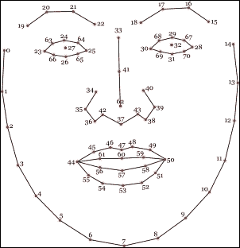

# 第六章。接下来是什么？

你已经做了很多。从基本的数学运算到复杂的滤波器和物体跟踪，我们回顾了 JavaScript 世界中可用的一些最受欢迎和多功能性最强的计算机视觉库。计算机视觉和图像处理中有许多主题我们没有在本书中涉及。在这里，我们将尝试提供一个想法，告诉你下一步可以走向何方。

首先，我们将总结你已经学过的计算机视觉主题。然后，我们将讨论在某些情况下为什么使用 JavaScript 如此重要。

接下来，我们将介绍几个在前几章中没有涉及到的 JavaScript 库。许多库在算法上提供了改进，并扩展了计算机视觉在 Web 上的应用。

在本章中，我们将涵盖以下主题：

+   理解客户端脚本的重要性

+   计算机视觉中一些其他有趣库的概述

# 刷新你的记忆

在这本书中，我们将不同的图像处理和计算机视觉技术应用于图像和视频。从基本的数学运算开始，我们看到了如何将基本的数学应用于不同的应用，以及了解数学对于理解图像处理基础知识的重要性。这些操作被扩展以提供清晰的图像滤波方法。这里的主要概念是在对每个图像像素应用变换时的图像卷积。然后，我们沿着物体检测的路径前进。我们甚至创建了自己的物体检测器！人脸检测和跟踪算法表明，这些类型的方法可以应用于创建人机界面。我们在上一章中看到了一个例子（头部旋转的立方体）。最令人兴奋的方法之一是光流，借助它可以轻松跟踪物体并创建由手势控制的复杂程序。让我们做一个小的练习。在下面的图像中，你可以看到我们对图像应用了不同的计算机视觉和图像处理方法：

原始图像是彩色的，你可以在提供的图像包中找到它。

前面的图像被分成了八个部分，我们在它们上应用了不同的算法。第一部分是图像的原始部分。第二部分是转换为灰度的。试着猜猜其他部分，我们在本书的学习过程中都学过它们。如果你想检查自己，请查看本节末尾的答案。

# 客户端脚本的重要性

那么，为什么我们使用 JavaScript 呢？我们已经在前言中讨论过这个问题了。现在，你可能可以自己回答这个问题了。

当谈到实用的计算机视觉时，许多人会提到 OpenCV 库（[`opencv.org`](http://opencv.org)）。是的，它确实为对计算机视觉知之甚少的人提供了出色的功能。不幸的是，它是用 C++编写的，并且不提供 JavaScript 的接口。即使它提供了，用户也需要在他们的电脑上安装 OpenCV 包，这对最终用户来说并不好，因为他们希望在不安装任何东西的情况下使用你的网站。

如果你只是在你的一侧安装后端库并在你的服务器上完成整个计算，那么你需要大量的集群来支持你的网站。即使是计算机视觉算法的一小部分也可能显著降低计算机性能。这可能是你更愿意使用客户端脚本的原因。

现在是时候让 JavaScript 展示其全部潜力了。使用它，我们一石二鸟。请注意：

+   用户现在不再需要在他们的电脑上安装任何东西，除了浏览器（这通常已经安装）。

+   JavaScript 直接在最终用户机器上运行，因此你不需要使用昂贵的设备。

已经有很多计算机视觉算法是用 JavaScript 实现的。不幸的是，没有 OpenCV 中那么多。但你可以使用 JavaScript 库，甚至扩展它们！我们认为你已经准备好在 JavaScript 世界中扩展计算机视觉的当前边界了。

这里是本节前面提到的图像的答案。每个答案后面都写有相关的章节编号。在图像的灰度部分（1）之后，从左到右的图像部分答案是：直方图均衡化（2）、模糊（高斯模糊）（2）、Sobel 滤波器（2）、Canny 边缘检测（2）、特征提取（FAST 特征）（3），最后是颜色目标检测（3）。

# 计算机视觉中的其他有趣库

我们已经看到了很多计算机视觉 JavaScript 库，但书中没有讨论的还有很多。其中一些库专注于人脸和面部粒子检测，其他的一些则更为通用，实现了多种目标检测技术。

## CCV 库及其扩展

人脸检测可能是网络应用中最受欢迎的任务之一。提供人脸检测的一个原始库是 CCV 库（[`github.com/liuliu/ccv`](https://github.com/liuliu/ccv)）。库的主要部分由 C 函数组成，但也有一些负责人脸检测的 JavaScript 部分。有很多库基于它来实现人脸检测，例如：

+   [`facedetection.jaysalvat.com`](http://facedetection.jaysalvat.com)：这是一个带有易于遵循的安装指南和 API 的 jQuery 库。

+   [`github.com/wesbos/HTML5-Face-Detection`](https://github.com/wesbos/HTML5-Face-Detection)：这个库非常易于使用；它仅使用`App.start()`命令即可检测面部。

## 面部检测及其他

有些库倾向于提供面部检测扩展。其中一些使用本书中已经讨论过的库，例如，JSFeat 库 ([`inspirit.github.io/jsfeat/`](http://inspirit.github.io/jsfeat/))。

我们从 Camgaze 库 ([`github.com/wallarelvo/camgaze.js`](https://github.com/wallarelvo/camgaze.js)) 开始。它的主要重点是眼睛检测和注视预测。

另一个出色的库是 CLMtrackr ([`github.com/auduno/clmtrackr`](https://github.com/auduno/clmtrackr))。它是一个将面部模型拟合到视频或图像中的面部上的卓越库。为了更好地理解这一点，请查看以下图像：

该库试图将面部模型点对点地拟合。借助这个模型，你可以精确地追踪面部或识别情绪。作者提供了一些示例，你可以执行这些任务。此外，还有面部变形和面部遮罩的示例。对于如何进行基本解释，你可以参考该库的优秀概述，该概述可在[`auduno.com/post/61888277175/fitting-faces`](http://auduno.com/post/61888277175/fitting-faces)找到。

## 使用 js-objectdetect 进行目标检测

我们在这里将介绍另一个库。它是 js-objectdetect ([`github.com/mtschirs/js-objectdetect`](https://github.com/mtschirs/js-objectdetect))，这是一个非常出色的库。你可能会问，为什么这么说呢？它提供了大量的训练好的 Haar 分类器，因此你可以对它们进行更多的探索。除了面部、眼睛和嘴巴检测器外，它还包含微笑、身体（全身和上半身）、手（张开和拳头）、鼻子和侧面面部分类器。

并非库中的所有分类器性能都相同，其中许多对光照条件和噪声很敏感。但它们绝对值得一试！

# 摘要

我们已经完成了这本书。恭喜！这对我们所有人来说都是一次激动人心的旅程。在本章的结尾，我们回顾了书中介绍的方法，并看到了何时在 Web 项目中使用 JavaScript 是合适的。此外，我们还为你准备了一些其他令人惊叹的 JavaScript 库。你现在就可以开始构建自己的项目了！

当然，到目前为止，你在计算机视觉领域已经积累了更多的经验。你已经掌握了在 Web 应用程序中应用非常复杂的计算机视觉和图像处理算法的技能。计算机视觉的世界很广阔，它总是带来新的东西。
