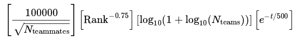

# 介绍数据科学竞赛

竞赛编程有着悠久的历史，始于 20 世纪 70 年代，当时举办了第一届**国际大学生程序设计竞赛（ICPC**）。“**国际大学生程序设计竞赛**”最初由来自大学和公司的小型团队参加，要求使用计算机程序（最初参赛者使用 FORTRAN 编程）解决一系列问题。为了获得良好的最终排名，团队必须展示出良好的团队合作、问题解决和编程技能。

参与这种竞赛的热潮以及有机会成为招聘公司的焦点，为学生提供了足够的动力，这使得竞赛多年以来一直很受欢迎。在 ICPC 决赛选手中，有几位成为了知名人士。其中，有 Facebook 前首席技术官和 Quora 创始人 Adam D'Angelo，Telegram Messenger 的联合创始人 Nikolai Durov，以及 Apache Spark 的创造者 Matei Zaharia。他们与许多其他专业人士一样，都有同样的经历：参加过 ICPC 某一届的比赛。

在 ICPC 之后，编程竞赛蓬勃发展，特别是在 2000 年之后，远程参与变得更加可行，使得国际竞赛更容易且成本更低。这些竞赛的格式相似，对于大多数此类竞赛来说都是一样的：有一系列问题，你必须编写代码来解决它们。获胜者可以赢得奖品，也可以引起招聘公司的注意，或者在他们同行中变得著名和受欢迎。

在本章中，我们将探讨竞赛编程如何演变为数据科学竞赛，为什么 Kaggle 平台是此类竞赛最受欢迎的网站，以及它是如何运作的。

## 数据科学竞赛平台的兴起

竞赛编程中的问题通常从组合数学到数论、图论、算法博弈论、计算几何、字符串分析和数据结构等范围。最近，与人工智能相关的问题也成功出现，特别是在知识发现与数据挖掘竞赛 KDD Cup 启动之后，该竞赛由计算机协会（**Association for Computing Machinery's**，简称**ACM**）知识发现与数据挖掘特别兴趣小组（**Special Interest Group**，简称**SIG**）在其年度会议上举办。

1997 年举办的第一届 KDD 杯涉及了电梯曲线优化的直接营销问题，它开启了一系列长期的竞赛（你可以在[`www.kdd.org/kdd-cup`](https://www.kdd.org/kdd-cup)找到包含数据集、说明和获奖者的存档，这些竞赛一直持续到今天[`www.kdd.org/kdd2020/kdd-cup`](https://www.kdd.org/kdd2020/kdd-cup)）。KDD 杯在建立最佳实践方面证明非常有效，许多发表的论文描述了解决方案和技术，以及竞争数据集的共享，这对许多从业者进行实验、教育和基准测试非常有用。

竞赛编程和 KDD 杯的经验共同催生了数据科学竞赛平台，这些平台允许公司举办某些难以解决的数据科学挑战，并可能从群智方法中受益。事实上，鉴于数据科学中不存在适用于所有问题的黄金方法，许多问题需要耗时的“尝试所有可能的方法”的方法。

实际上，从长远来看，没有算法能在所有问题上击败所有其他算法，但每个机器学习算法只有在其假设空间包含解决方案时才会表现良好。然而，你事先无法知道这一点，因此你必须尝试和测试，以确保你正在做正确的事情。你可以查阅“无免费午餐定理”来了解这一实用真理的理论解释，以下是 Analytics India Magazine 关于该主题的完整文章：[`analyticsindiamag.com/what-are-the-no-free-lunch-theorems-in-data-science/`](https://analyticsindiamag.com/what-are-the-no-free-lunch-theorems-in-data-science/)。

群智在需要广泛测试算法和数据转换以找到最佳组合，但缺乏人力和计算机资源的情况下证明是理想的。这就是为什么政府和企业会求助于竞赛来在某些领域取得进步。在政府方面，我们可以引用 DARPA 及其在自动驾驶汽车、机器人操作、机器翻译、说话人识别、指纹识别、信息检索、OCR、自动目标识别等领域举办的众多竞赛。在商业方面，我们可以引用 Netflix 这样的公司，它委托了一场竞赛来改进其预测用户电影选择的算法。

Netflix 竞赛基于改进现有协同过滤的想法，其目的是简单地根据用户对其他电影给出的先前评分来预测用户对电影的潜在评分，而不了解用户的具体身份或电影的具体内容。由于没有用户描述或电影标题或描述可用（所有这些都由身份代码替代），竞赛要求开发出智能的方法来使用可用的先前评分。只有当解决方案能够将现有的 Netflix 算法 Cinematch 改进到一定阈值以上时，才会分配价值 100 万美元的巨额奖金。该竞赛从 2006 年持续到 2009 年，最终由许多先前参赛团队的融合组成的一个团队获胜（来自 Commendo Research & Consulting GmbH 的一个团队，Andreas Töscher 和 Michael Jahrer，在 Kaggle 竞赛中也相当知名，AT&T Labs 的两名研究人员和 Yahoo!的两名其他研究人员）。最终，赢得竞赛需要如此多的计算能力和不同解决方案的集成，以至于团队不得不合并以保持竞争力。这种情况也反映在 Netflix 实际使用该解决方案上，Netflix 更愿意不实施它，而是简单地从中提取最有趣的见解来改进其现有的 Cinematch 算法（你可以在这篇 Wired 文章中了解更多信息：[`www.wired.com/2012/04/netflix-prize-costs/`](https://www.wired.com/2012/04/netflix-prize-costs/)）。在 Netflix 竞赛的最终阶段，更重要的是解决方案本身，因为 Netflix 的业务已经从 DVD 转变为在线电影，解决方案很快就被取代了。对于参与者（他们在协同过滤中获得了巨大的声誉）和公司（可以将改进的推荐知识转移到其新业务中）来说，真正的益处是从竞赛中获得的见解（我们可以进一步说，这种知识也将是本书大部分内容的主题）。

## Kaggle 竞赛平台

事实上，除了 Netflix 之外，其他公司也从数据科学竞赛中受益。这个名单确实很长，但我们可以引用一些例子，其中举办竞赛的公司报告了从中获得的明显好处。例如，我们可以提到保险公司 AllState，它通过涉及数百名数据科学家的竞赛改进了由其专家构建的精算模型（[`www.kaggle.com/c/ClaimPredictionChallenge`](https://www.kaggle.com/c/ClaimPredictionChallenge)）。作为另一个有充分记录的例子，我们还可以提到通用电气，它通过一个类似竞赛将预测航空公司航班到达时间的行业标准提高了 40%（[`www.kaggle.com/c/flight`](https://www.kaggle.com/c/flight)）。这两个竞赛都是在 Kaggle 竞赛平台上举办的。

到目前为止，Kaggle 竞赛平台已经举办了数百场比赛，这两家公司只是成功利用其竞赛来提升自己模型和数据分析努力的几个例子。让我们暂时从具体的竞赛中退一步，来谈谈 Kaggle 公司，这是贯穿整本书的线索。

Kaggle 在 2010 年 2 月迈出了第一步，这得益于澳大利亚受过训练的经济学家 Anthony Goldbloom 的创意（他在墨尔本大学获得了经济学和计量经济学学位）。在澳大利亚财政部和澳大利亚储备银行的研究部门工作后，Goldbloom 在伦敦担任《经济学人》的实习生，这是一份关于时事、国际商业、政治和技术的国际周刊。在《经济学人》工作期间，他有机会撰写一篇关于大数据的文章，这激发了他建立一个能够众包解决有趣机器学习问题的竞赛平台的想法（[`www.smh.com.au/technology/from-bondi-to-the-big-bucks-the-28yearold-whos-making-data-science-a-sport-20111104-1myq1.html`](https://www.smh.com.au/technology/from-bondi-to-the-big-bucks-the-28yearold-whos-making-data-science-a-sport-20111104-1myq1.html)）。由于众包动态在这个平台商业理念中起到了相关的作用，他创造了 Kaggle 这个名字，这个名字通过押韵回忆起“gaggle”一词，即一群鹅（鹅也是该平台的象征）。

在搬到美国硅谷后，他的 Kaggle 初创公司从 Khosla Ventures 和 Index Ventures 这两家相当知名的创业投资公司那里获得了 1125 万美元的 A 轮融资。第一轮竞赛推出后，社区逐渐壮大，一些最初的竞争者逐渐崭露头角，例如澳大利亚数据科学家和企业家 Jeremy Howards，他在 Kaggle 赢得了几场比赛后，成为了公司的总裁和首席科学家。Jeremy Howard 于 2013 年 12 月辞去了总裁职务，此后他创办了新的初创公司 fast.ai ([www.fast.ai](https://www.fast.ai))，为程序员提供机器学习课程和深度学习库。

当时还有其他杰出的 Kagglers（这个名字用来指代参加 Kaggle 举办的竞赛的频繁参与者），例如 Jeremy Achin 和 Thomas de Godoy。在达到平台全球前 20 名排名后，他们迅速决定退休并成立了自己的公司 DataRobot。他们很快开始在 Kaggle 竞赛的参与者中招聘他们最好的员工，以便将最好的机器学习知识和实践融入到他们正在开发的软件中。如今，DataRobot 在自动机器学习（autoML）领域无疑是一家领导者。

Kaggle 竞赛吸引了越来越多的关注，甚至深度学习之父 Geoffrey Hinton 也参与了 2012 年由默克公司主办的 Kaggle 竞赛（并获胜）([`www.kaggle.com/c/MerckActivity/overview/winners`](https://www.kaggle.com/c/MerckActivity/overview/winners))。Kaggle 也是 Francois Chollet 在 Otto 集团产品分类挑战赛期间推出他的深度学习包 Keras 的平台([`www.kaggle.com/c/otto-group-product-classification-challenge/discussion/13632`](https://www.kaggle.com/c/otto-group-product-classification-challenge/discussion/13632))，以及 Tianqi Chen 在希格斯玻色子机器学习挑战赛中推出了 XGBoost，这是一种比梯度提升机更快、更准确的版本([`www.kaggle.com/c/higgs-boson/discussion/10335`](https://www.kaggle.com/c/higgs-boson/discussion/10335))。

一场又一场的竞赛之后，围绕 Kaggle 的社区在 2017 年增长到一百万，那一年，在 Google Next 的开幕式上，谷歌首席科学家李飞飞宣布，谷歌 Alphabet 将收购 Kaggle。从那时起，Kaggle 成为了谷歌的一部分。

今天，Kaggle 社区仍然活跃并不断发展。它为许多参与者提供了创建自己的公司、推出机器学习软件和包、在杂志上接受采访([`www.wired.com/story/solve-these-tough-data-problems-and-watch-job-offers-roll-in/`](https://www.wired.com/story/solve-these-tough-data-problems-and-watch-job-offers-roll-in/))、在 Coursera 上安排课程([`www.coursera.org/learn/competitive-data-science`](https://www.coursera.org/learn/competitive-data-science))、撰写机器学习书籍([`twitter.com/antgoldbloom/status/745662719588589568`](https://twitter.com/antgoldbloom/status/745662719588589568))、找到他们的理想工作，以及最重要的是，或者只是了解更多关于数据科学技能和技术细节的机会。

## 其他竞赛平台

尽管这本书专注于 Kaggle 上的竞赛，但我们不能忘记，许多数据竞赛是在私人平台或其他竞赛平台上举行的。实际上，你在这本书中找到的大部分信息也将适用于所有其他竞赛，因为它们基本上遵循相似的原则，参与者所获得的利益与 Kaggle 的大致相同。

由于许多其他竞赛平台特定于某些国家或专注于某些类型的竞赛，为了完整性，我们将简要介绍其中一些，至少是我们有一些经验和知识的一些。

**DrivenData** ([`www.drivendata.org/competitions/`](https://www.drivendata.org/competitions/)) 是一个致力于社会挑战的众包竞赛平台（参见[`www.drivendata.co/blog/intro-to-machine-learning-social-impact/`](https://www.drivendata.co/blog/intro-to-machine-learning-social-impact/)）。该公司本身是一家社会企业，其目标是利用数据科学家为公共利益构建算法，将数据科学解决方案带给解决世界最大挑战的组织。例如，你可以阅读这篇文章，[`www.engadget.com/facebook-ai-hate-speech-covid-19-160037191.html`](https://www.engadget.com/facebook-ai-hate-speech-covid-19-160037191.html)，了解 Facebook 如何选择 DrivenData 来举办其针对仇恨言论和错误信息的模型构建竞赛。

**Numerai** ([`numer.ai/`](https://numer.ai/)) 是一家位于旧金山的基于人工智能和众包的对冲基金，它每周举办一场比赛，你可以提交你对对冲基金加密数据的预测，并使用公司加密货币 Numeraire 赢得奖品。

**CrowdAnalytix** ([`www.crowdanalytix.com/community`](https://www.crowdanalytix.com/community)) 现在活动稍微少了一些，这个平台曾经举办过不少有挑战性的竞赛，你可以从这篇博客文章中了解到：[`towardsdatascience.com/how-i-won-top-five-in-a-deep-learning-competition-753c788cade1`](https://towardsdatascience.com/how-i-won-top-five-in-a-deep-learning-competition-753c788cade1)。此外，社区博客也非常有趣，可以让你了解这个平台上可以找到哪些挑战：[`www.crowdanalytix.com/jq/communityBlog/listBlog.html`](https://www.crowdanalytix.com/jq/communityBlog/listBlog.html)。

**Signate** ([`signate.jp/competitions`](https://signate.jp/competitions)) 是一个日本数据科学竞赛平台。它竞赛丰富，并提供类似于 Kaggle 的排名系统（[`signate.jp/users/rankings`](https://signate.jp/users/rankings)）。

**Zindi** ([`zindi.africa/competitions`](https://zindi.africa/competitions)) 是一个来自非洲的数据科学竞赛平台。它举办专注于解决非洲最紧迫的社会、经济和环境问题的竞赛。

**Alibaba Cloud** ([`www.alibabacloud.com/campaign/tianchi-competitions`](https://www.alibabacloud.com/campaign/tianchi-competitions)) 是一家中国云计算和人工智能提供商，它推出了天池学术竞赛，与 SIGKDD、IJCAI-PRICAI 和 CVPR 等学术会议合作，并包括基于图像的 3D 形状检索、3D 物体重建或实例分割等挑战。

**Analytics Vidhya** ([`datahack.analyticsvidhya.com/`](https://datahack.analyticsvidhya.com/)) 是最大的印度数据科学社区，提供了一个数据科学黑客松的平台。

**CodaLab** ([`codalab.lri.fr/`](https://codalab.lri.fr/)) 是一个基于法国的数据科学竞赛平台，于 2013 年由微软和斯坦福大学合作创立。它提供了一个类似的核心功能（在这里称为工作表：[`worksheets.codalab.org/`](https://worksheets.codalab.org/))，用于知识共享和可重复建模，类似于 Kaggle。

其他较小的平台包括瑞士洛桑联邦理工学院（École Polytechnique Fédérale de Lausanne）的**CrowdAI** ([`www.crowdai.org/`](https://www.crowdai.org/))，**InnoCentive** ([`www.innocentive.com/`](https://www.innocentive.com/))，用于生物医学成像的**Grand-Challenge** ([`grand-challenge.org/`](https://grand-challenge.org/))，**DataFountain** ([`www.datafountain.cn/business?lang=en-US`](https://www.datafountain.cn/business?lang=en-US))，**OpenML** ([`www.openml.org/`](https://www.openml.org/))，等等。你可以在俄罗斯社区**Open Data Science** ([`ods.ai/competitions`](https://ods.ai/competitions))上找到许多正在进行的重大竞赛列表，从而不时发现新的竞赛平台。

除了 Kaggle 之外，还有许多替代方案和机会。这样一个丰富机会的有趣之处在于，你可以更容易地找到一个可能更吸引你的竞赛，因为它具有专业化和数据。此外，由于这些挑战不太为人所知和宣传，因此可以预期竞争压力较小。此外，可以预期参与者之间的分享较少，因为到目前为止，没有其他竞赛平台达到了 Kaggle 所拥有的相同丰富程度的分享和网络工具。

## 竞赛的阶段

Kaggle 上的竞赛是通过不同的步骤安排的。通过查看每个步骤，你可以更好地理解数据科学竞赛是如何运作的，以及可以期待什么。

当一项竞赛启动时，社交媒体上通常会有一些帖子（例如在 Kaggle 的 Twitter 个人资料：[`twitter.com/kaggle`](https://twitter.com/kaggle)）来宣布它，并且在[`www.kaggle.com/competitions`](https://www.kaggle.com/competitions)页面上的活跃竞赛之间会出现一个新标签页。如果你点击竞赛标签页，你将被带到竞赛页面。立即，你可以至少查看竞赛是否会有奖品（以及是否颁发积分和奖牌，这是参与竞赛的次要后果），目前有多少团队参与，以及你还有多少工作要做来解决问题。

在那里，你可以首先探索概览菜单，这将为你提供关于比赛主题、评估指标（你的模型将根据该指标进行评估）、比赛时间表、奖品以及法律或比赛要求的信息。通常时间表会被忽视，但它应该是你首先要检查的事情之一，实际上它不仅仅告诉你比赛开始和结束的时间，它还会提供规则接受截止日期，这通常是在比赛关闭前七天到两周。规则接受截止日期标志着你可以通过接受其规则加入比赛的时间限制，以及团队合并截止日期：你可以在那个截止日期之前安排将你的团队与其他竞争对手的团队合并，之后将不可能合并。此外，规则菜单经常被忽视（人们只是跳到数据），但检查它们很重要，因为它们可以告诉你比赛的要求。从规则中你可以获得的关键信息包括获奖资格以及一些其他重要细节，例如你是否可以使用外部数据来提高你的分数，你每天可以得到多少提交（你的解决方案的测试），你可以选择多少个最终解决方案，等等。最后，你可以查看数据，尽管你只能在接受比赛规则后才能下载它。

一旦你接受了规则，你就可以下载任何数据或直接开始在 Kaggle Kernel 上工作，这是一个仅有的笔记本，可以重用其他参与者提供或从头开始创建的代码。如果你决定下载数据，也要考虑你有一个 Kaggle API 可以帮助你以几乎自动化的方式运行下载和提交。你可以在[`www.kaggle.com/docs/api`](https://www.kaggle.com/docs/api)找到更多关于 API 的详细信息，你还可以从[`github.com/Kaggle/kaggle-api`](https://github.com/Kaggle/kaggle-api)获取代码。顺便说一句，如果你仔细检查 Kaggle 的 GitHub 仓库，你还可以找到他们用于在线笔记本 Kaggle Kernels 的所有 Docker 镜像。在这个阶段，当你开发你的解决方案时，通过讨论论坛联系其他竞争对手并不是一个坏主意：在那里你可以提问和回答问题。通常你也会在特定问题的数据或甚至有用的想法中找到有用的提示，以改进你的解决方案。

一旦你的解决方案准备好了，你可以根据比赛的规格将其提交给 Kaggle 评估引擎（一些比赛将接受 csv 文件作为解决方案，其他则要求你在 Kaggle Kernel 中编码并生成结果）。在整个比赛中，你都可以提交解决方案。

每次提交解决方案后，排行榜会很快提供评分和排名，具体取决于评估所需的计算。这个排名只是指示性的，因为它反映了你的模型在测试集的一部分上的表现，这部分被称为公共测试集，因为其表现会在比赛期间对所有人公开。只有当比赛结束时，参赛者决定对其模型中的哪些部分进行评分，他们才会公布在测试集的另一部分上的分数，这部分被称为私人测试集。这个新的排行榜，即私人排行榜，构成了比赛的最终、有效的排名。

当一项比赛结束后，Kaggle 团队将花费一定时间来检查一切是否正确，并确保所有参赛者都遵守了比赛的规则。经过一段时间（有时还会伴随一些变化）后，私人排行榜将变为最终版，获胜者将被宣布，许多参赛者会根据自己的意愿在比赛讨论论坛上公开他们的策略、解决方案和代码。

## 比赛类型及示例

Kaggle 比赛根据“比赛类别”进行分类，每个类别在如何竞争以及可以期待什么方面都有不同的含义。数据类型、问题的难度、提供的奖金和比赛动态在类别内部相当多样化，因此事先了解每个类别意味着什么非常重要。

这里是您可以用来筛选不同比赛的官方类别：

+   精选

+   大师

+   年度比赛

+   研究

+   招聘

+   开始

+   操场

+   分析

+   课堂内

“**精选**”是最常见的比赛类型，它涉及赞助公司提出的与商业相关的问题，并为比赛中的顶尖表现者提供奖金。获胜者将授予赞助公司非独家许可权，并需要准备一份详细的解决方案报告，有时甚至需要参加与赞助公司的会议。

每次访问 Kaggle 时，都会有一些特色竞赛的例子。目前，许多竞赛都与将深度学习方法应用于非结构化数据（如文本、图像、视频或声音）相关，但在过去，表格数据竞赛是基于数据库中可以找到的结构的化数据相关问题的竞赛。现在，这类竞赛的需求实际上已经减少，因为众包解决方案通常不会在数据科学家优秀团队或甚至 autoML 软件所能达到的层面上有太大的进步。过去，使用随机森林，然后使用梯度提升方法以及巧妙的特征工程，从 Kaggle 得到的表格数据解决方案确实可以大幅提高解决方案。如今，鉴于更好软件和良好实践的普及，竞赛所能获得的提高结果可能确实微乎其微。在非结构化数据领域，一个优秀的深度学习解决方案仍然可以做出差异，例如，预训练网络如 BERT 在许多知名文本中的标准上带来了两位数的提升。

“**大师级**”竞赛现在不那么常见了，但它们是私人的、仅限邀请的竞赛。其目的是创建仅限于专家（通常是根据 Kaggle 奖牌排名被评为大师或特级大师的竞争者）之间的竞赛，基于他们在 Kaggle 上的排名。

“**年度**”竞赛是一年中的特定时期出现的竞赛。在年度竞赛中，我们有圣诞老人竞赛（通常基于算法优化问题）和每年在美国大学篮球锦标赛期间举行的 3 月机器学习竞赛。

“**研究**”竞赛意味着具有研究或科学目的，而不是商业目的，有时是为了服务于公众利益。这就是为什么这些竞赛并不总是提供奖品。此外，这些竞赛有时要求获胜者将他们的解决方案作为开源发布。

Google 在过去发布了一些研究竞赛，例如 2020 年的 Google 地标识别竞赛([`www.kaggle.com/c/landmark-recognition-2020`](https://www.kaggle.com/c/landmark-recognition-2020)) - 在图像中标记著名（以及不那么著名）的地标

想要测试潜在求职者能力的赞助商会举办“**招聘**”竞赛。这些竞赛仅限于单人团队，并为排名靠前的竞争者提供与赞助商的面试作为奖品。如果竞争者希望在竞赛结束后被考虑联系，他们必须在竞赛结束时上传他们的简历。

招聘竞赛的例子包括：

+   Facebook 招聘竞赛([`www.kaggle.com/c/FacebookRecruiting`](https://www.kaggle.com/c/FacebookRecruiting))，但实际上 Facebook 举办了几次这类竞赛

+   Yelp 招聘竞赛([`www.kaggle.com/c/yelp-recruiting`](https://www.kaggle.com/c/yelp-recruiting))

“**入门**”竞赛不提供任何奖品，但提供了一个友好且简单的难题，让初学者熟悉 Kaggle 的原则和动态。通常它们是半永久性的竞赛，其排行榜会不时更新。如果你在寻找机器学习的教程，这些竞赛是开始的地方。

著名的持续入门级竞赛包括：

+   **数字识别器**([`www.kaggle.com/c/digit-recognizer`](https://www.kaggle.com/c/digit-recognizer))

+   **泰坦尼克号**：灾难中的机器学习([`www.kaggle.com/c/titanic`](https://www.kaggle.com/c/titanic)) - 预测泰坦尼克号的生存情况

+   **房价预测**：高级回归技术([`www.kaggle.com/c/house-prices-advanced-regression-techniques`](https://www.kaggle.com/c/house-prices-advanced-regression-techniques))

“**Playground**”竞赛比入门级竞赛稍微难一些，但它们也是为了让竞争者在没有完全成熟的特色竞赛压力下学习和测试他们的能力（尽管有时在 Playground 竞赛中竞争的激烈程度也可能相当高）。这类竞赛的常规奖品只是周边产品或少量金钱。

一个著名的 Playground 竞赛是原始的“狗与猫”竞赛([`www.kaggle.com/c/dogs-vs-cats`](https://www.kaggle.com/c/dogs-vs-cats)) - 创建一个算法来区分狗和猫

应该提到的是 Analytics 竞赛，其中评估是定性的，参与者需要提供想法、解决方案草案、PowerPoint 幻灯片、图表等等，以及由学术机构举办的**InClass**竞赛。

在 Kaggle 竞赛的分类中，你还得考虑到竞赛可能具有不同的格式。通常的格式是所谓的“简单格式”，其中你提供解决方案，然后按照我们之前描述的方式进行评估。更复杂的是，两阶段竞赛将竞赛内容分为两部分，并且只有在第一阶段完成后，才会向第一阶段参与者发布最终数据集。两阶段竞赛格式出现是为了限制某些竞争者可能作弊和违反规则的机会，因为评估是在一个完全未尝试的测试集上进行的，而这个测试集只短暂可用。出于同样的原因，最近也出现了代码竞赛，所有提交都来自 Kaggle 笔记本，并且禁止直接上传提交。

## 提交和排行榜动态

显然，Kaggle 的工作方式看似简单：测试集对参与者保密；你拟合你的模型，如果你的模型在预测测试集方面表现最佳，那么你的得分就高，你可能会获胜。不幸的是，这样的描述过于简化了 Kaggle 竞赛的内部运作，并且没有考虑到竞争者之间直接和间接的互动，以及你所面临的问题及其训练集和测试集的细微差别。

卡内基梅隆大学统计学教授大卫·多诺霍（[`web.stanford.edu/dept/statistics/cgi-bin/donoho/`](https://web.stanford.edu/dept/statistics/cgi-bin/donoho/)）在其著作《数据科学五十年》中实际上给出了对 Kaggle 工作方式的更全面描述。该论文最初发表在《计算与图形统计杂志》上，随后又发布在麻省理工学院计算机科学与人工智能实验室（见[`courses.csail.mit.edu/18.337/2015/docs/50YearsDataScience.pdf`](http://courses.csail.mit.edu/18.337/2015/docs/50YearsDataScience.pdf)）。多诺霍教授并没有具体提到 Kaggle，而是泛指所有数据科学竞赛平台。引用计算语言学家马克·利伯曼的话，他将数据科学竞赛和平台视为一种**通用任务框架**（**CTF**）范式，在过去几十年中默默而稳步地推进了许多领域的科学数据。他指出，CTF 可以从经验角度极大地改善数据科学问题的解决方案。他引用了 Netflix 竞赛和许多 DARPA 竞赛作为成功的例子，这些竞赛重塑了许多领域问题的最佳解决方案。

CTF 由“成分”和“秘制酱料”组成（参见多诺霍，大卫。“数据科学五十年。”《计算与图形统计杂志》26.4（2017）：745-766.的第 6 段）。成分很简单：

1.  一个公开可用的数据集和相关预测任务

1.  一组共同承担生成最佳预测任务的竞争者

1.  一种对参与者的预测进行公平和客观评分的系统，不提供过于具体的提示（或最多限制它们），关于解决方案

如果任务定义得很好，数据质量良好，系统工作效果最佳。从长远来看，解决方案的性能通过小幅度的提升直到达到极限。通过允许参与者之间一定程度的共享（如 Kaggle 通过讨论、共享内核笔记本和额外数据集的方式）可以加速这个过程。可以注意到，尽管参与者之间有共享，但竞争压力并不会停止解决方案的改进，它只是使改进过程变慢。

这是因为 CTF 范式中的秘密成分就是竞赛本身，在需要改进其实验性能的实践问题框架中，总是导致新基准、新数据和建模解决方案的出现，以及一般而言，将机器学习更好地应用于竞赛所针对的问题。因此，竞赛可以提供解决预测问题的新方法，新的特征工程方法，新的算法或建模解决方案。例如，深度学习并非仅仅来自学术研究，它首先因为成功竞赛而获得了巨大的推动力，这些竞赛宣布了其有效性（例如，我们已经提到了 Geoffrey Hinton 团队赢得的 Merck 竞赛[`www.kaggle.com/c/MerckActivity/overview/winners`](https://www.kaggle.com/c/MerckActivity/overview/winners)）。

与开放软件运动相结合，这允许每个人都能访问强大的分析工具（如 Scikit-learn 或 TensorFlow 或 PyTorch），CTF 范式带来了更好的结果，因为所有竞争对手在起点上都站在同一条线上。另一方面，解决方案对竞赛的依赖性在于专用或改进的硬件，这可能会限制可达到的结果，因为它可能会阻止无法访问这些资源的竞争对手正确参与并直接贡献于解决方案，或者通过在其他参与者身上施加竞争压力间接地做出贡献。可以理解的是，这也是为什么 Kaggle 开始向其竞赛的参与者免费提供云服务（Kernels）的原因：它可以平息一些硬件密集型竞赛（如大多数深度学习竞赛）中的某些差异，并增加整体竞争压力。

无论如何，总有一些情况可能会出错，从而导致竞赛中出现次优结果：

1.  数据泄露

1.  从排行榜（评分系统）进行探测

1.  过度拟合及其后果

1.  私有共享

当解决方案的一部分需要在数据本身中重新追踪时，会出现数据泄露。例如，某些变量是目标变量的后继变量（因此它们揭示了它的一些信息）或训练和测试示例的顺序，或者某些标识符暗示了解决方案。这种解决方案泄露，有时被竞争对手称为“黄金特征”（因为对数据问题中这种细微差别的了解可能会变成参与者的奖金），不可避免地导致不可重复使用的解决方案。这也意味着赞助商（至少应该了解到应该影响其问题解决方案的泄露特征）会得到次优结果。

另一个问题是从排行榜中探测解决方案的可能性。在这种情况下，你可以通过在排行榜上重复提交尝试来窃取解决方案。再次强调，在这种情况下，解决方案在完全不同的环境中是完全不可用的。一个这样的例子发生在比赛“不要过拟合 II”([`www.kaggle.com/c/dont-overfit-ii`](https://www.kaggle.com/c/dont-overfit-ii))中。在这场比赛中，获胜者 Zachary Mayers 将每个单独的变量作为一个单独的提交，从而获得了关于每个变量可能权重的信息，这使他能够估计出他模型正确的系数（你可以在 Zach 的详细解决方案中阅读：[`www.kaggle.com/c/dont-overfit-ii/discussion/91766`](https://www.kaggle.com/c/dont-overfit-ii/discussion/91766))。一般来说，时间序列问题（或测试数据中存在系统变化的其它问题）可能会受到探测的严重影响，因为它们可以帮助竞争者成功定义某种“后处理”（例如，将他们的预测乘以一个常数），这在特定的测试集中得分最高。

另一种排行榜窃密的形式发生在参与者倾向于更多地依赖公共排行榜的反馈而不是他们自己的测试时。有时这会导致比赛的完全失败，伴随着激烈的动荡，即最终排行榜上竞争者位置的完全不可预测的重新洗牌。在这种情况下，获胜的解决方案可能（但不总是）对问题不是那么优化，甚至有时可能只是由机会决定的。这导致竞争者对训练集与必须猜测的测试集差异很大进行了精确的分析。这种分析被称为“对抗性测试”，如果依赖排行榜，以及如果存在与训练集和测试集差异太大的特征，可以提供洞察（例如，你可以看看 Bojan Tunguz 的这个 Kernel：[`www.kaggle.com/tunguz/adversarial-ieee`](https://www.kaggle.com/tunguz/adversarial-ieee))）。另一种防止排行榜过拟合的防御方式是选择安全的策略来避免根据排行榜结果提交过多的解决方案。例如，由于每个参赛者允许选择两个解决方案在比赛结束时进行评估，一个好的策略是提交在排行榜上表现最好的一个和基于自己交叉验证测试表现最好的一个。

为了避免排行榜探测和过拟合的问题，Kaggle 最近基于代码竞赛引入了不同的创新，其中评估被分为两个不同的阶段，也就是说，你有一个用于公共排行榜（你在比赛中跟踪的排行榜）的测试集，以及一个完全保留的用于最终私有排行榜的测试集。这样，参与者实际上对他们的解决方案将被评估的实际数据是盲目的，并且他们应该被迫更多地考虑他们自己的测试以及针对测试集的更一般性的解决方案。

最后，竞赛的另一种可能的扭曲是由于私人共享（在参与者封闭圈中分享想法和解决方案）以及其他非法行为，如使用多个账户或多个团队参与，并从每个团队中窃取想法以利于另一个团队。所有这些行为都会在参与者之间造成信息不对称，这对少数人有利，对大多数人有害。再次强调，由于竞赛期间共享不完善，并且较少的团队能够充分发挥竞争压力，因此产生的解决方案可能会受到影响。此外，如果参与者明显意识到这种情况（例如，参见[`www.kaggle.com/c/ashrae-energy-prediction/discussion/122503`](https://www.kaggle.com/c/ashrae-energy-prediction/discussion/122503)），可能会导致不信任并减少对竞赛或后续竞赛的参与。

## 计算资源

一些竞赛确实设定了限制，以便使可行的解决方案可用于生产，例如博世生产线性能竞赛 - [`www.kaggle.com/c/bosch-production-line-performance`](https://www.kaggle.com/c/bosch-production-line-performance) - 对你的解决方案的执行时间、模型文件输出和内存限制有严格的限制。此外，基于内核的竞赛，当要求在内核上执行训练和推理时，不会对你要使用的资源造成问题，因为 Kaggle 将提供你需要的所有资源（这也是为了将所有参与者置于同一起跑线，以获得更好的竞赛结果）。

当你只有内核竞赛仅限于推理时间时，问题就出现了，因此你可以在自己的机器上训练你的模型，唯一的限制就是基于测试时产生的模型的数量和复杂性。由于目前大多数竞赛都需要深度学习解决方案，你必须考虑你确实需要专门的硬件，如 GPU，才能在竞赛中获得一些有趣的结果。无论如何，即使你参加了一些现在罕见的表格竞赛，你很快就会意识到你需要一台强大的机器，拥有相当数量的处理器和内存，以便轻松应用特征工程到数据，快速运行实验和构建模型。

标准确实变化很快，因此很难提及一种标准硬件，以便至少与其他人处于同一联赛水平。无论如何，我们可以通过观察其他竞争对手使用什么硬件来获得这样的标准提示，无论是他们自己的机器还是云上的机器。

例如，最近惠普推出了一项计划，它将一台 HP Z4 或 Z8 赠送给一些精选的 Kaggle 参与者，以换取其品牌的曝光。例如，Z8 机器有 56 个核心，3TB 的内存，48TB 的存储（由固态硬盘提供良好的份额）以及 NVIDIA RTX 作为 GPU。我们理解这对许多人来说可能有点难以触及，甚至租用类似机器在云实例上（如 Google 的 GCP 或 Amazon 的 AWS）进行短期租用，也因为即使是适度使用也会产生相应的费用。

因此，除非你的雄心壮志是攀登到 Kaggle 参与者排名的顶端，我们的建议是使用 Kaggle 提供的免费机器，即 Kaggle 笔记本（也以前被称为 Kaggle Kernels）。

Kaggle 笔记本是一个基于在云机器上运行的 Docker 容器的版本化计算环境，允许你使用 R 和 Python 语言编写和执行脚本和笔记本。Kaggle 笔记本集成到 Kaggle 环境中（你可以从它们提交并跟踪哪些提交与哪个笔记本相关），它们预装了大多数数据科学包，并允许一些定制（你可以下载文件并安装更多包）。基本的 Kaggle 笔记本是基于 CPU 的，但你也可以拥有由 NVIDIA Tesla P100 或 TPU v3-8（TPU 是专门用于深度学习任务的硬件加速器）增强的版本。尽管受限于使用数量和时间配额限制，但 Kaggle 笔记本提供了在 Kaggle 竞赛中构建基准解决方案的计算动力：

+   一台 CPU 笔记本拥有 4 个 CPU 核心 16 GB 的内存，你可以同时运行 10 台这种类型的笔记本，但你没有为它们分配任何时间配额。

+   一台 GPU 拥有 2 个 CPU 核心 13 GB 的内存，你可以在有 30 小时每周配额的情况下同时运行 2 台这种类型的笔记本。

+   一台 TPU 拥有 4 个 CPU 核心 16 GB 的内存，你可以在有 30 小时每周配额的情况下同时运行 2 台这种类型的笔记本。

所有笔记本的最大运行时间为 9 小时，有 20 GB 的磁盘保存配额来存储你的模型和结果，以及一个额外的临时使用磁盘，在脚本运行期间可以超过 20 GB。

在某些情况下，Kaggle 核提供的增强型 GPU 机器可能不足以满足需求。例如，最近的深度伪造检测挑战赛([`www.kaggle.com/c/deepfake-detection-challenge`](https://www.kaggle.com/c/deepfake-detection-challenge))需要处理大约 500 GB 的视频数据。这主要是因为每周使用时间的限制，在撰写本文时大约是每周 30 小时，以及你不能同时运行超过两台带有 GPU 的机器（对于仅 CPU 实例，一次最多 10 台）。即使你可以通过将代码改为利用 TPU 而不是 GPU 来加倍你的机器时间（你可以在以下位置找到一些实现该目标的简单指导：[`www.kaggle.com/docs/tpu`](https://www.kaggle.com/docs/tpu))，这仍然可能不足以在数据密集型竞赛如深度伪造检测挑战赛上进行快速实验。这就是为什么在关于 Kaggle 核的章节中，我们将为您提供许多技巧和窍门，以在无需购买高性能机器的情况下，以令人满意的结果成功应对这些限制。我们还将向您展示如何将 Kaggle 核与**Google Cloud Services**（**GCP**）集成，或者简单地说，如何将所有工作迁移到另一个基于云的解决方案。

## 团队合作和网络

然而，计算能力扮演了它的角色，但在 Kaggle 竞赛中，人类的专家知识和能力才能真正带来差异。有时，要成功处理一场竞赛，需要一群参赛者的协作努力。除了招募竞赛，赞助商可能需要个别参与者以更好地评估他们的能力外，通常在竞赛期间形成团队没有限制。通常，团队可以由最多五名参赛者组成。团队合作有其自身的优势，因为它可以增加寻找更好解决方案的努力，因为团队可以共同花费更多时间在问题上，不同的技能可以大有帮助：并不是所有数据科学家都拥有相同的技能或在不同模型和数据操作中拥有相同的技能水平。

无论如何，团队合作并非全是积极的。协调不同个人和不同努力以实现共同目标可能并不容易，可能会出现一些次优情况。团队通常的问题在于，当部分参与者不参与或简单地闲置时，但最糟糕的情况无疑是，更罕见的是，有人违反了竞赛规则（这对所有人都有害，因为整个团队可能会被取消资格）或者甚至间谍活动，以使其他团队受益。

尽管存在任何负面因素，但在 Kaggle 竞赛中组队是一个了解其他数据科学家、为了一个目标而协作并取得更多成就的绝佳机会，因为 Kaggle 的规则确实在某种程度上奖励团队而非孤独的竞争者。虽然在 Kaggle 中，组队并不是唯一的网络方式，但它无疑是参与者更盈利和更有趣的选择。你实际上可以通过论坛上的讨论、在竞赛中共享数据集和笔记本来与其他人建立联系。平台上的所有这些机会都可以帮助你了解其他数据科学家，并得到他们的认可。

在 Kaggle 平台之外，与其他 Kagglers 建立联系的机会也相当多。首先，有几个 Slack 频道可能会有所帮助。例如，KaggleNoobs（见：[`www.kaggle.com/getting-started/20577`](https://www.kaggle.com/getting-started/20577)）是一个频道，它于 5 年前开放，有很多关于 Kaggle 竞赛的讨论，并且有一个支持性的社区，如果你在代码和模型方面遇到具体问题，他们可以提供帮助。还有许多其他频道致力于交换关于 Kaggle 竞赛和数据科学相关主题的意见。一些频道是根据地区或国家组织起来的。例如，日本频道 Kaggler-ja ([`kaggler-ja-wiki.herokuapp.com/`](http://kaggler-ja-wiki.herokuapp.com/)) 或六年前创建的俄罗斯社区，开放数据科学网络 ([`ods.ai/`](https://ods.ai/))，后来也向非俄语使用者开放。开放数据科学网络（通常简称为 ODS）不仅提供了一个 Slack 频道，还提供了关于如何赢得竞赛的课程、活动和报道，这些活动涉及所有知名数据科学平台上的活跃竞赛（见 [`ods.ai/competitions`](https://ods.ai/competitions)）。

除了 Slack 频道之外，还有许多以 Kaggle 为主题或关于特定竞赛的本地聚会涌现出来，有些持续时间较短，有些则较长。Kaggle 竞赛的聚会，通常围绕一个想要分享其经验和建议的竞争者的演讲而建立，是亲自遇见其他 Kagglers、交流意见和建立共同参与数据科学竞赛联盟的最佳情况。在这个联盟中，特别值得一提的是由 Maria Parysz 和 Paweł Jankiewicz 创建的 Kaggle Days（[`kaggledays.com/`](https://kaggledays.com/)），他们是一位著名的 Kaggle 竞争者。Kaggle Days 组织在世界各地的主要地点安排了一些活动（[`kaggledays.com/about-us/`](https://kaggledays.com/about-us/)），目的是聚集一场 Kaggle 专家的会议（由于 COVID-19 大流行而突然停止），并创建了一个在不同国家仍然相当活跃的本地聚会网络（[`kaggledays.com/meetups/`](https://kaggledays.com/meetups/)）。

## 性能层级和排名

除了金钱奖励之外，Kaggle 还提供了许多其他非物质奖励（除了一些物质奖励，如杯子、T 恤、连帽衫和贴纸）。关键在于 Kagglers，即 Kaggle 竞赛的参与者，在竞赛中确实投入了大量的时间和精力（不计他们在比赛中使用的专业技能，这些技能在普通人中实际上相当罕见）。金钱奖励通常覆盖了少数顶尖选手的努力，如果不是唯一顶尖选手的努力，那么剩下的选手就只是自愿投入了大量时间而没有回报。从长远来看，没有实质结果的竞赛可能会导致不满和兴趣下降，从而降低竞争强度。因此，Kaggle 至少找到了一种通过基于勋章和积分的荣誉体系来奖励竞争者的方法。其理念是，勋章和积分越多，技能的相关性就越高，这为求职或任何基于声誉的相关活动提供了机会。

首先，有一个总排行榜，它结合了所有单个竞赛的排行榜。在这个总排行榜（[`www.kaggle.com/rankings`](https://www.kaggle.com/rankings)）中，一个人的排名基于他在每个单个竞赛中的位置，这会授予一些积分，所有积分加在一起提供了总排行榜的排名。乍一看，竞赛中积分计分的公式可能看起来有点复杂：

然而，在现实中，它仅仅基于几个因素：竞赛中的排名、你的团队规模、竞赛的流行程度以及竞赛的历史长短。

直观来说，在流行的竞赛中排名靠前会带来很多积分。不那么直观的是，团队的大小以非线性方式影响结果。这是因为公式中的倒数平方根部分，因为需要放弃的积分部分随着参与人数的增加而增长，但如果你的团队相对较小（最多 2 至 3 人），由于大型协作团队带来的智慧和计算能力优势，这仍然相当有利。

另一点需要记住的是，随着时间的推移，积分会衰减。衰减不是线性的，但可以作为一个经验法则，认为一年后你获得的积分所剩无几。因此，在 Kaggle 的一般排行榜上的荣耀不会持久，它是短暂的，除非你继续参加竞赛，并取得与以前相似的结果。作为安慰，在你的个人资料中，你将始终保留你曾经达到的最高等级，作为你在某个特定时间取得出色综合成绩的纪念。

更重要的是，奖牌系统涵盖了 Kaggle 竞赛的所有四个方面。你将在竞赛、笔记本、讨论和数据集方面根据你的结果获得奖牌。在竞赛中，奖牌是根据你在排行榜上的位置颁发的。在其他领域，如讨论、笔记本和数据集，奖牌是根据其他竞争者的点赞数颁发的（这有时会导致一些次优情况，因为点赞是一个不那么客观的指标，也取决于人气）。获得的奖牌越多，你能够进入的 Kaggle 精通等级就越高。等级分为新手、贡献者、专家、大师和宗师。[`www.kaggle.com/`](https://www.kaggle.com/) 进阶页面解释了如何获得奖牌以及需要多少以及哪种类型的奖牌才能进入不同的等级。

请记住，这样的等级和荣誉总是相对的，并且它们会随时间而变化。实际上，几年前，评分系统和等级相当不同。很可能会在未来，等级会再次改变，以保持高级别更罕见，从而更有价值。

## 批评和机会

Kaggle 自成立以来就受到了不少批评，并且今天许多人仍在争论是否参加数据科学竞赛，他们提出了不同的负面或正面观点。

在负面批评方面：

+   Kaggle 给人一种错误的印象，认为机器学习究竟是什么，因为它只关注排行榜的动态。

+   Kaggle 仅仅是一场超参数优化和集成多个模型的游戏，只是为了获得一点更高的准确度（而实际上是在对测试集进行过拟合）。

+   Kaggle 充满了缺乏经验的爱好者，他们愿意尝试任何可能的方法来获得分数和关注，希望被招聘者注意到。

+   作为进一步的后果，竞赛解决方案过于复杂，通常过于特定于测试集，以至于无法实施。

许多人认为 Kaggle，就像许多其他数据科学竞赛平台一样，与数据科学的实际情况相去甚远。他们提出的问题是，商业问题并非凭空而来，你很少一开始就有一个准备好的数据集来开始，因为你通常是在根据细化商业规格和解决当前问题的理解过程中逐步构建它的。此外，他们强调，生产方面并未被考虑，因为一个获胜的解决方案不能受限于资源限制或技术债务的考虑（尽管这并不总是适用于所有竞赛）。

我们不得不注意到，所有这样的批评最终都与 Kaggle 是一个具有目的性的众包体验（CTF 范式）以及 Kaggle 排名在数据科学世界中的相关性有关，与数据科学教育和工作经验相比。一个持续的神话是，Kaggle 竞赛可能有助于你在数据科学领域获得工作或更好的工作，或者参加 Kaggle 竞赛可能会使你在不参与的所有数据科学家之上处于另一个层面。

我们对这种神话的立场是，这是一个误导性的信念，即 Kaggle 排名在 Kaggle 社区之外具有自动价值。例如，在求职过程中，Kaggle 可以为你提供一些非常有用的建模数据和问题的能力，以及有效的模型测试。它还可以让你接触到许多技术和不同的数据/商业问题（甚至超出你的实际经验和舒适区），但它不能为你提供作为数据科学家在公司成功定位所需的一切。

你可以用 Kaggle 来学习和在求职中区别于其他候选人；然而，这将被如何考虑将因公司而异。无论如何，你在 Kaggle 上所学到的知识将不可避免地在你的整个职业生涯中证明是有用的，并在你需要用数据建模解决复杂和不同寻常的问题时为你提供保障。通过参加 Kaggle 竞赛，你将建立起强大的建模和验证能力。你还会与其他数据科学家建立联系，这可以使你更容易地获得工作推荐，并提供另一种处理超出你技能范围困难问题的方法，因为你可以访问他人的能力和观点。

因此，我们的观点是，Kaggle 可以更间接地帮助你作为数据科学家的职业生涯，并且它可以通过不同的方式做到这一点。当然，有时 Kaggle 会直接帮助你，因为你的竞赛成功而被作为求职候选人联系，但更常见的是，Kaggle 会通过提供你需要成功作为候选人然后作为实践者的智力和经验技能来帮助你。事实上，在 Kaggle 上玩数据和模型一段时间后，你将有机会看到足够多的不同数据集问题以及处理它们的方法，在时间的压力下，当面对现实环境中的类似问题时，你将非常擅长快速有效地找到解决方案。

实际上，这种技能提升的机会正是我们最初写作这本书的动力所在，也是这本书真正要讲述的内容。实际上，你在这里不会找到仅仅关于如何在 Kaggle 竞赛中获胜或取得高分的指南（实际上，也有在线资源可以在这方面启发你），但你会找到关于如何在 Kaggle 上更好地竞争，以及如何从竞赛经验中获得最大价值的指南。

智能地使用 Kaggle 和其他竞赛平台。Kaggle 并非万能的，在竞赛中排名第一并不能保证你得到高薪工作或在 Kaggle 社区之外获得荣耀。然而，持续参与竞赛实际上是一张需要巧妙打出的牌，以展示你对数据科学职位的兴趣和热情，并提高一些可以让你作为数据科学家脱颖而出而不是被自动机器学习解决方案淘汰的特定技能。

如果你打算跟随我们阅读这本书，我们将向你展示如何做。
